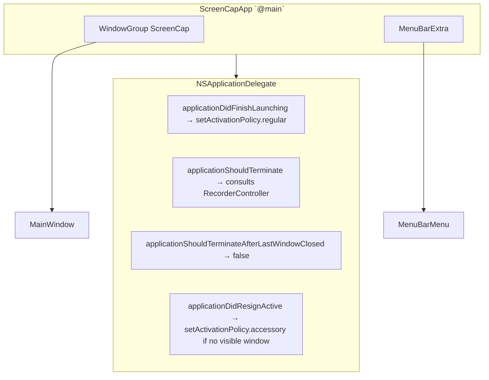

# SwiftUI shell

Native macOS UI at `macos/`, built in SwiftUI. Drives the bundled `screencap` CLI as a subprocess and renders recording state, the calendar/list browse views, and recording controls.

This doc covers the shell as it exists today: scaffolding, two scenes, the CLI bridge, and the permissions walkthrough. Calendar / list / recording-controls extensions ship in subsequent v1 Phase 2 work.

## What it is, what it isn't

The SwiftUI app is a thin shell. The Python CLI is the source of truth for recording lifecycle, privacy enforcement, and on-disk state. The shell:

- spawns `screencap start`, `screencap stop`, `screencap status`, etc.
- consumes the structured stderr event stream (Unit 8a contract: `started`, `chunk_finalized`, `recording_finalized`, `permission_lost`, `disk_full`, `stopped`).
- reads the recording archive metadata via `screencap list --json`.
- never reads raw `recording.db` event rows directly — privacy enforcement is the Python layer's responsibility.

Everything privacy-load-bearing happens in Python. The shell never makes a privacy decision on its own.

## Scenes and lifecycle

Two top-level scenes:

- **`WindowGroup`** — the main window, hosts the calendar / list / privacy detail views.
- **`MenuBarExtra`** (`.menu` style) — keyboard-navigable dropdown with Start / Stop / Open ScreenCap / Quit. Icon swaps between `record.circle` and `record.circle.fill` based on `RecorderController.state.isRecording`.

The `AppDelegate` (attached via `@NSApplicationDelegateAdaptor`):

- keeps the app alive after the main window closes (`applicationShouldTerminateAfterLastWindowClosed → false`).
- toggles activation policy: `.regular` while the window is visible (dock icon shown), `.accessory` once the window closes (dock icon hidden, menu bar item only).
- on Cmd+Q, asks `RecorderController.confirmQuitWhileRecording()` whether to prompt the user. Returns `.terminateNow` immediately when no recording is active.

## CLIClient — the subprocess bridge

`CLIClient` owns every shell-out to the bundled `screencap` CLI. Two operating modes:

| Mode | Used by | Behavior |
|---|---|---|
| One-shot (`runJSON`) | `screencap status`, `screencap list`, `screencap apps`, `screencap settings` | Spawns the CLI, waits for exit, decodes stdout as JSON. Runs concurrent stdout/stderr drains and a deadline timeout (default 10s) to avoid pipe-fill deadlocks on large outputs. |
| Long-lived (`spawn`) | `screencap start` | Returns a `SpawnedProcess` handle. The caller registers a stderr line handler (used by `RecorderController` to consume the Unit 8a event stream) and an optional termination callback. Pipes are line-buffered via `LineBuffer`. |
| Detached (`runDetached`) | `screencap view <name>` (Unit 14a) | Fire-and-forget; the Python side opens the user's default browser. |

### Binary resolution

`resolveBinary()` tries three paths in order:

1. **`SCREENCAP_CLI_PATH`** env var — explicit override for development or testing.
2. **`Bundle.main.resourceURL/screencap/screencap`** — the bundled PyInstaller binary, copied into `Contents/Resources/screencap/` by `Scripts/embed-cli.sh` during the Xcode build phase.
3. **`SCREENCAP_DEV_REPO_ROOT` env var → `python3 -m screencap.cli`** — dev fallback when the .app is launched without a PyInstaller dist. The repo's `src/` is automatically prepended to `PYTHONPATH` by `mergedEnv()`.

For day-to-day SwiftUI development, option 3 is what you'll use. Option 1 is for hand-built binaries; option 2 is the production path. See [`macos/README.md`](../../macos/README.md) for how to set the env vars correctly (LaunchServices does not propagate your shell environment).

### Subprocess environment

`mergedEnv()` is the single point that builds the env for every spawn. It:

- starts from `ProcessInfo.processInfo.environment` (preserving PATH, HOME, TMPDIR, etc.),
- forces `SCREENCAP_PARENT=swiftui` so the Python CLI knows it was launched by the shell (used by `_check_macos_permissions` to skip interactive prompts and by `menubar.py` to neutralize the legacy menubar process),
- forces `PYTHONUNBUFFERED=1` so the stderr event stream is delivered line-by-line in real time,
- prepends `<repo>/src` to `PYTHONPATH` when `SCREENCAP_DEV_REPO_ROOT` is set.

Never replace the inherited environment — that breaks PATH and the bundled CLI fails silently.

## Stderr event contract

`screencap start` emits structured JSON lines on stderr per the Unit 8a contract (defined in `screencap/_stderr_events.py`). The shell decodes each line into `RecorderEventLine` (Decodable) and dispatches:

| Event | Source | Shell reaction |
|---|---|---|
| `started` | engine reader | Anchor the elapsed-time clock; transition state to `.recording`. |
| `chunk_finalized` | session.py | Informational; no UI update. |
| `recording_finalized` | session.py | Refresh `RecordingsIndex`; resolve in-app Stop's await. If `force_stopped: true`, surface a warning. |
| `permission_lost` | recorder.py mid-recording watcher | Force-stop the recording; surface NSAlert with deep link. |
| `disk_full` | session.py | Surface error banner. |
| `stopped` | cli.py terminal exit path | Resolve Cmd+Q's await so `NSApp.reply(toApplicationShouldTerminate: true)` can fire. |

Unknown event types are silently ignored — forward compatibility for future emitters.

## Permission walkthrough

`PermissionController` owns the four TCC permissions ScreenCap needs:

| Pane | API used | Required? |
|---|---|---|
| Screen Recording | `CGPreflightScreenCaptureAccess` / `CGRequestScreenCaptureAccess` | yes |
| Accessibility | `AXIsProcessTrustedWithOptions` | yes |
| Input Monitoring | `IOHIDCheckAccess(.listenEvent)` / `IOHIDRequestAccess(.listenEvent)` | yes |
| Microphone | `AVCaptureDevice.authorizationStatus(for: .audio)` / `requestAccess(for: .audio)` | optional |

`FirstRunPermissionsView` renders one row per pane, with a green check or red dot plus an Open System Settings button. The button calls `requestAndOpenSettings(for:)` which:

1. invokes the matching request API — required to register the app in the TCC database the first time, otherwise the app does not appear in the relevant Settings list at all.
2. opens the macOS 13+ `.extension` deep link (e.g. `x-apple.systempreferences:com.apple.settings.PrivacySecurity.extension?Privacy_ScreenCapture`), with a fallback to the generic Privacy & Security pane.

Live polling: a 1Hz timer plus a `NSWorkspace.didActivateApplicationNotification` observer re-check status while the sheet is visible. The sheet's "Done" button is gated on all required permissions being granted.

### The in-process TCC cache

`CGPreflightScreenCaptureAccess`, `AXIsProcessTrustedWithOptions`, `IOHIDCheckAccess`, and `AVCaptureDevice.authorizationStatus` all cache their result at process start. Permissions granted in System Settings *after* the process launches do not show up via these APIs — TCC only refreshes on a fresh process. This is documented Apple behavior; the Python CLI works around it with `_check_permission_fresh` (subprocess per check).

The shell handles this with two affordances:

- **Quit & Relaunch button** — calls `relaunchApplication()`, which spawns a detached `/bin/sh -c "sleep 0.6; open <bundle>"` and immediately calls `NSApp.terminate(nil)`. The current process exits first, then `open` wakes a fresh instance via LaunchServices (preserving the bundle's TCC identity). Standard pattern (Loom, 1Password).
- **Skip for now button** — dismisses the sheet without checking permissions. Useful when the cache is stale and the user knows the actual TCC state is correct. Recording is still gated by the engine-side check at start time, so this only unblocks navigation.

## RecorderController (today)

PR1 ships a skeleton: the state enum (`idle`, `starting`, `recording(elapsed)`, `stopping`), an `@Published` `state`, and a `smokeStatus()` helper that round-trips `screencap status --json`. The `start` / `stop` / `confirmQuitWhileRecording` methods are stubs.

The full lifecycle (state machine, stderr event consumption, two stop policies, mid-recording permission watcher, banner) ships in v1 Phase 2 PR3 (Unit 13).

## Build pipeline

The Xcode project lives at `macos/ScreenCap.xcodeproj` but is **gitignored** — it's generated from `macos/project.yml` by [xcodegen](https://github.com/yonaskolb/XcodeGen). Run `xcodegen generate` after editing `project.yml` or after a clone.

The Xcode project has one pre-build phase, `Scripts/embed-cli.sh`, which copies `dist/screencap/` (PyInstaller output) into `Contents/Resources/screencap/`. The script is tolerant of a missing `dist/` so the .app still builds in dev mode (CLIClient falls back to `SCREENCAP_DEV_REPO_ROOT`).

Hardened-runtime entitlements live in `ScreenCap/ScreenCap.entitlements` and are sized to support the bundled PyInstaller binary's needs (`allow-jit`, `disable-library-validation`, `allow-unsigned-executable-memory`, `audio-input`). The outer .app runs without sandbox — the shell needs to spawn subprocesses and write to `~/.screencap/`.

## Source map

| Path | Owner |
|---|---|
| `macos/project.yml` | xcodegen source of truth |
| `macos/ScreenCap/ScreenCapApp.swift` | App entry, two scenes, environment objects |
| `macos/ScreenCap/AppDelegate.swift` | Activation policy, terminate semantics |
| `macos/ScreenCap/Controllers/CLIClient.swift` | Process spawn, stderr line streaming, JSON parsing, binary resolution |
| `macos/ScreenCap/Controllers/PermissionController.swift` | TCC checks, request APIs, deep links, relaunch helper |
| `macos/ScreenCap/Controllers/RecorderController.swift` | Recording lifecycle (skeleton in PR1; full in PR3) |
| `macos/ScreenCap/State/RecordingsIndex.swift` | Cached `screencap list --json` (added in PR2) |
| `macos/ScreenCap/Views/` | SwiftUI views |
| `macos/ScreenCap/Scripts/embed-cli.sh` | Xcode build phase: `dist/screencap/` → `Contents/Resources/screencap/` |
| `macos/ScreenCap/ScreenCap.entitlements` | Hardened-runtime entitlements for the outer .app |
| `macos/README.md` | Dev launch instructions, TCC recovery, xcodegen workflow |

## Related

- Plan: [`docs/plans/2026-04-28-001-feat-native-macos-ui-v1-plan.md`](../plans/2026-04-28-001-feat-native-macos-ui-v1-plan.md)
- Ticket: [`docs/tickets/high-2026-04-28-feat-swiftui-v1-phase2-app-shell.md`](../tickets/high-2026-04-28-feat-swiftui-v1-phase2-app-shell.md)
- Stderr event schema: `src/screencap/_stderr_events.py`
- Python CLI permission check: `recorder.py:_check_macos_permissions`
- Session lifecycle: [session.md](./session.md)
