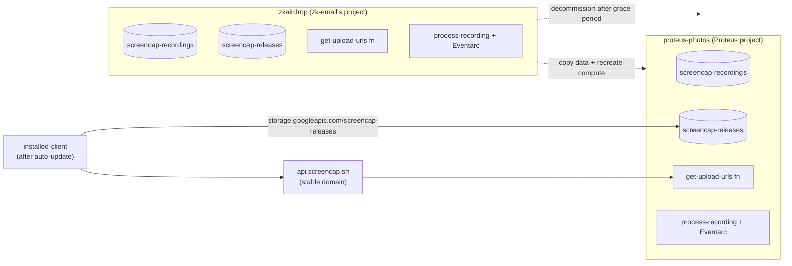

# GCP Migration: zkairdrop → proteus-photos

## Summary

Relocate screencap's entire GCP footprint out of the shared zk-email project (`zkairdrop`) into the existing `proteus-photos` project as a pure lift-and-shift — copy the data, recreate the compute, keep the bucket names — and use the one unavoidable client release to put the signing function behind a stable custom domain (`api.screencap.sh`) so this is the last backend move that can ever break an installed client.

---

## Problem Frame

screencap's cloud infrastructure currently lives in `zkairdrop`, the GCP project owned by the zk-email team (which this team also works on). screencap was parked there as a convenience before a dedicated Proteus GCP project existed; it is functionally a tenant in someone else's project. Now that the Proteus product has its own project (`proteus-photos`) and screencap is part of the broader Proteus effort, that arrangement is wrong on ownership and billing grounds and entangles screencap's blast radius, IAM, and cost visibility with an unrelated product.

The footprint is non-trivial and cross-cutting: two GCS buckets ([scripts/cloud-function/main.py:39](scripts/cloud-function/main.py), [scripts/process-recording/main.py:26](scripts/process-recording/main.py)), an HTTP signing function (`get-upload-urls`), an Eventarc-triggered processing service (`process-recording`), and the GitHub Actions release pipeline ([.github/workflows/release.yml](.github/workflows/release.yml)). Two of these surfaces are welded into already-installed clients: the releases-bucket distribution URL in [updater.py:23](src/screencap/updater.py) and [install.sh:215](scripts/install.sh), and — more sharply — the project-specific `*.run.app` signing-function host hardcoded in [download.py:29](src/screencap/download.py). A naive move breaks those clients, and because the function host embeds the project, the same fragility recurs on every future backend change.

---

## Topology: today vs. after

---

## Actors

- A1. **Migration operator:** executes the move — provisions resources in `proteus-photos`, copies data, runs the releases-bucket cutover, ships the client release, verifies, and decommissions the `zkairdrop` resources.
- A2. **Installed client (macOS app / CLI):** auto-updates to a build that points at the stable domain and the new project; transitions without user action.
- A3. **Release CI (GitHub Actions):** publishes build artifacts to the releases bucket; its auth must rebind from `zkairdrop` to `proteus-photos`.
- A4. **End user:** records, uploads, and downloads; should see no functional change — only a transparent auto-migration.
- A5. **screencap-website (sibling repo):** reads the recordings bucket to render the gallery; needs its own credential/project update — a tracked dependency, executed outside this work.

---

## Key Flows

- F1. **Migration cutover (operator-run)**
  - **Trigger:** Operator begins the planned move.
  - **Actors:** A1, A3
  - **Steps:** Provision the signing function, processing service + Eventarc trigger, service accounts, and IAM in `proteus-photos` → copy recordings data into the new recordings bucket → map `api.screencap.sh` to the new signing function → run the releases-bucket name cutover (free the name in `zkairdrop`, recreate in `proteus-photos`, re-upload artifacts) → rebind GitHub Actions release auth → ship a client release pointing at the domain → verify end-to-end → after a grace period, decommission the `zkairdrop` screencap resources.
  - **Outcome:** All screencap infra runs in `proteus-photos`; old resources are gone; clients are transparently re-pointed.
  - **Escape path:** Old `zkairdrop` resources stay live through the grace period, so a failed verification can fall back without client impact until teardown.
  - **Covered by:** R1, R2, R3, R4, R5, R6, R7, R8, R9, R10.

- F2. **Client auto-migration (transparent to user)**
  - **Trigger:** An installed client runs its normal auto-update check after the new release is published.
  - **Actors:** A2, A4
  - **Steps:** Client fetches the latest version from the (preserved) `screencap-releases` URL → self-updates to the build that points at `api.screencap.sh` → subsequent upload/download calls resolve to the new signing function in `proteus-photos`.
  - **Outcome:** The user keeps working with no manual re-install; the client is now decoupled from any project-specific host.
  - **Covered by:** R6, R7, R8.

---

## Requirements

**Target project and footprint**
- R1. All screencap GCP resources currently in `zkairdrop` are recreated in or moved to the existing `proteus-photos` project: both buckets, the `get-upload-urls` signing function, the `process-recording` service and its Eventarc trigger, and the supporting service accounts/IAM.
- R2. Both production and `-dev` resources are accounted for; the `-dev` signing endpoint in [.env](.env) is re-pointed to the `proteus-photos` equivalent.

**Buckets and data**
- R3. Existing recordings data is preserved by copying it from the `zkairdrop` recordings bucket into the `proteus-photos` recordings bucket before the old bucket is removed.
- R4. The recordings bucket keeps the name `screencap-recordings` (decided) — the `screencap-` prefix already namespaces it within `proteus-photos`, and the name is referenced server-side only.
- R5. The releases bucket retains the exact name `screencap-releases` so the auto-update/install bootstrap URL (`storage.googleapis.com/screencap-releases/...`) stays valid; this is achieved via a planned cutover that frees the name in `zkairdrop` and recreates it in `proteus-photos`, accepting a brief distribution outage and name-availability window.

**Stable function domain (Approach C)**
- R6. The signing function in `proteus-photos` is reachable via a stable custom domain on the `screencap.sh` zone (e.g. `api.screencap.sh`), and the client targets that domain rather than the project-specific `*.run.app` host.
- R7. A single client release updates the signing-endpoint reference ([download.py](src/screencap/download.py), [.env](.env)) to the stable domain and is published through the preserved releases bucket so installed clients pick it up via normal auto-update.

**Migration safety and CI**
- R8. A grace period keeps the `zkairdrop` signing function (and other client-facing resources) live until installed clients have had a reasonable window to auto-update; decommissioning happens only after that window.
- R9. The GitHub Actions release workflow's authentication is rebound from `zkairdrop` to `proteus-photos` so releases continue to publish to `screencap-releases` after the move.

**Verification and teardown**
- R10. The end-to-end pipeline (record → upload → process via Eventarc → download) is verified against `proteus-photos` before any `zkairdrop` screencap resource is deleted.
- R11. After successful verification and the grace period, the screencap-specific resources in `zkairdrop` are decommissioned, leaving the zk-email resources untouched.

---

## Acceptance Examples

- AE1. **Covers R5.** Given the releases-bucket name cutover is in progress, when a client checks for updates or a new user runs the installer, the request to `storage.googleapis.com/screencap-releases/...` returns a transient 404; once the bucket is recreated and artifacts re-uploaded, the same requests succeed without any client change.
- AE2. **Covers R8.** Given a client that has not yet auto-updated, when it calls the old `zkairdrop` signing function during the grace period, upload/download still works; after it auto-updates, it calls `api.screencap.sh` instead.
- AE3. **Covers R6, R7, R10.** Given the migration is complete and a client has auto-updated, when the user records and uploads, the upload is signed by the `proteus-photos` function via `api.screencap.sh`, processed by the `proteus-photos` Eventarc pipeline, and downloadable again — with no functional difference from before the move.

---

## Success Criteria

- screencap's cloud infrastructure is owned and billed under `proteus-photos`, with no remaining screencap dependency on `zkairdrop`, and zk-email's own resources are unaffected.
- Existing users transition without a manual re-install; any user not reached still works through the grace period and migrates on their next auto-update.
- After the move, the client depends on a domain the team controls (`api.screencap.sh`), so a future project/region/provider change requires a domain re-map, not another forced client release.
- A downstream planner can sequence the cutover from this doc without having to decide what moves, what is preserved, or what "done" means — only *how* to execute each step.

---

## Scope Boundaries

- **Per-user cloud storage isolation / accounts** (the separate `2026-05-29-per-user-cloud-storage-isolation` brainstorm) is excluded — this is relocation only; no authentication, per-user namespacing, or trust-model change.
- **Renaming `screencap-releases`** is excluded — it would sever the auto-update bootstrap for installed clients.
- **Stable domains in front of every surface** (a true zero-client-change cutover) are excluded — only the signing function gets a domain in this move; the releases path stays on its already-stable bucket URL.
- **Region changes, pipeline re-architecture, or any functional change** to recording, processing, or privacy behavior are excluded — pure lift-and-shift.
- **The `screencap-website` repo's own migration** is excluded (tracked as a dependency, executed separately).
- **zk-email / `zkairdrop` resources** beyond screencap's pieces are not touched.

---

## Key Decisions

- **Land in the existing `proteus-photos` project, not a new dedicated project.** screencap is part of the broader Proteus product; co-locating with the other `proteus-photos` resources is intentional, and `screencap-` resource prefixes keep it tidy. (Overrides the agent's initial dedicated-project suggestion.)
- **Recreate-and-copy, not whole-project migration.** Because `zkairdrop` belongs to zk-email and must stay, the project itself cannot be migrated; screencap's resources are recreated in `proteus-photos` and data is copied. A bucket's name and parent project are both permanent, so the same name cannot exist in two projects simultaneously.
- **Keep bucket names; the releases name is the one with a sharp edge.** The recordings bucket name is kept as `screencap-recordings` (server-side only, so a rename was free but declined for simplicity); the releases bucket name is client-facing (the auto-update bootstrap), so it is preserved via a deliberate delete-then-recreate cutover rather than abandoned or renamed.
- **Approach C — stable function domain.** Since one client release is unavoidable (today's clients hardcode the `*.run.app` host), spend that release pointing the client at `api.screencap.sh` to retire the project-coupled-host fragility permanently. Low marginal cost: the `screencap.sh` zone is already controlled (used by `get.screencap.sh`).
- **Grace-period teardown.** Old resources remain live until clients have auto-updated, giving a no-impact fallback during verification.

---

## Dependencies / Assumptions

- The team controls the `screencap.sh` DNS zone (evidenced by `get.screencap.sh` in [install.sh:3](scripts/install.sh)); adding `api.screencap.sh` is a DNS record + managed cert + Cloud Run domain mapping.
- `proteus-photos` exists and the operator has rights to create buckets, functions/Cloud Run services, Eventarc triggers, service accounts, and IAM bindings there.
- The recordings data volume is small enough that a straightforward copy (e.g. `gcloud storage` or Storage Transfer Service) is acceptable; transfer mechanism is a planning detail.
- Eventarc GCS triggers require the trigger and bucket to be in the same project — recreating the trigger in `proteus-photos` against the new bucket satisfies this.
- The `screencap-website` repo has its own GCP credential/project binding pointing at the recordings bucket that must be updated when the bucket moves; coordinating that is a dependency outside this doc.
- The install base is small and known well enough that a brief releases-distribution outage during the name cutover is acceptable.

---

## Outstanding Questions

### Deferred to Planning

- [Affects R1, R10][Technical] Which region should the `proteus-photos` resources use — match the current `southamerica-east1`, or relocate while moving? (Region change would be a deliberate add-on, currently out of scope.)
- [Affects R5][Technical] Exact sequencing and expected duration of the `screencap-releases` name cutover, including GCS name-release timing (docs say "seconds" but give no SLA) and the up-to-~10-minute DNS propagation caveat.
- [Affects R6][Technical] Domain-mapping mechanism for the signing function (direct Cloud Run domain mapping vs. a load balancer) and managed-cert provisioning time.
- [Affects R3][Needs research] Best copy mechanism for the recordings data given its actual size (direct `gcloud storage cp` vs. Storage Transfer Service).
- [Affects R8][User decision] Concrete length of the grace period before decommissioning `zkairdrop` resources.
- [Affects R9][Technical] Whether the GitHub Actions auth uses workload-identity federation or a service-account key, and what rebinding to `proteus-photos` entails.
