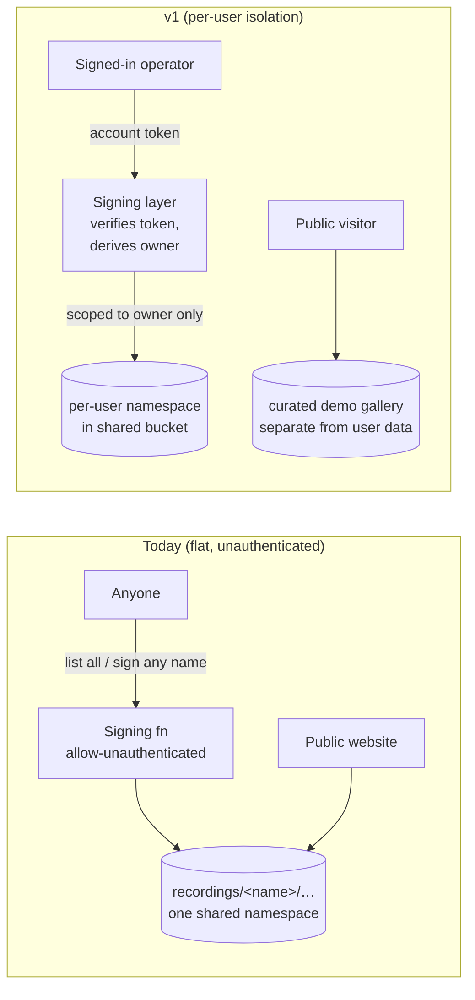

# Per-User Cloud Storage Isolation

## Summary

v1 introduces real, person-level user accounts and isolates every uploaded recording to its owner — upload, listing, and download are all scoped to the authenticated account. Isolation is logical: a per-user namespace in the shared bucket, policed by an authenticated signing layer. Real user data stops appearing on the public website; a curated demo gallery is preserved for marketing. Billing and training-consent are explicitly later milestones.

---

## Problem Frame

Today every uploaded recording lands in a single flat bucket under one global namespace keyed only by recording name (`recordings/{name}/…`). The signing service ([scripts/cloud-function/main.py](scripts/cloud-function/main.py)) is deployed `--allow-unauthenticated`: it will list *every* recording and sign a download URL for *any* recording name, with no notion of who is asking. The public website ([screencap-website/src/app/_lib/gcs-proxy.ts](../../screencap-website/src/app/_lib/gcs-proxy.ts)) renders that namespace as an effectively-public gallery (an `_unlisted` marker hides rows from the list but does not gate download). Nothing in the upload path — not [upload.py](src/screencap/upload.py), not the signing function — carries any concept of "user," "account," or "device."

That is a friend-trial posture. To launch for real users beyond the friend circle, onboarding a second person currently means exposing the first person's recordings to anyone who can guess or enumerate a name. It also blocks the two strategic moves that depend on knowing *whose data this is*: charging for cloud storage, and asking permission to train on a user's traces. The "win on privacy" half of the strategy — and the `Privacy incidents per 1k recordings` / "leaked titles in cloud-bound paths" metric in [STRATEGY.md](STRATEGY.md) — is directly undermined by a flat, public, identity-free namespace.

---

## Storage / trust model: today vs. v1

---

## Actors

- A1. **Account owner (operator):** signs in on the client, uploads recordings, and can access only their own recordings.
- A2. **Public / demo visitor:** unauthenticated; can browse only the curated demo gallery, never real user data.
- A3. **Authenticated client (macOS app / CLI):** holds a verified account token and performs uploads scoped to the signed-in account.

---

## Key Flows

- F1. **Operator signs in and uploads a recording**
  - **Trigger:** A signed-in operator chooses to upload a local recording to the cloud.
  - **Actors:** A1, A3
  - **Steps:** Operator is signed in (or is prompted to sign in) → the client uploads with a verified account token → the signing layer verifies the token and resolves the owning account → URLs are signed only within that account's namespace → files land under the operator's namespace.
  - **Outcome:** The recording is stored privately under the operator's account; no other user can see or fetch it.
  - **Covered by:** R1, R2, R4, R5, R6, R8.

- F2. **Operator accesses their own recordings**
  - **Trigger:** The operator lists or downloads previously uploaded recordings.
  - **Actors:** A1, A3
  - **Steps:** Client presents the account token → signing layer returns only the operator's recordings → operator can list/download those, and only those.
  - **Outcome:** The operator sees a private view of their own cloud data; another user's recordings are neither listed nor fetchable, even by exact name.
  - **Covered by:** R6, R7.

- F3. **Public visitor browses the demo gallery**
  - **Trigger:** An unauthenticated visitor opens the website.
  - **Actors:** A2
  - **Steps:** Visitor loads the gallery → only the curated demo set is listed and playable → no real user recording is listed or fetchable.
  - **Outcome:** Marketing showcase is preserved; real user data is not exposed.
  - **Covered by:** R9, R10.

---

## Requirements

**Accounts and authentication**
- R1. Real, person-level user accounts exist, provided by a managed authentication provider (specific provider is a planning/research decision).
- R2. Cloud upload requires a signed-in account: the client carries a verified account token, and an unauthenticated cloud upload is refused with a prompt to sign in.
- R3. Local recording and local use remain available without an account. Account gating applies to cloud storage, not to recording locally.

**Per-user isolation**
- R4. Every uploaded recording is stored under a namespace owned by the uploading account.
- R5. The account→namespace mapping is authoritative server-side and is derived from the verified token — never trusted from a client-supplied name. (This is the guardrail that keeps a future brokered-backend migration cheap.)
- R6. The signing layer verifies the account token and only signs upload URLs, signs download URLs, and returns list results scoped to that account's namespace.
- R7. A user cannot list, download, or enumerate another user's recordings. The current "list all recordings" and "sign-download any recording by name" behaviors are removed for real user data.
- R8. Recording names are unique only within an account's namespace, not globally; two accounts may each have a recording of the same name without collision or cross-visibility.

**Public website and demo gallery**
- R9. The public website no longer lists or serves real user recordings.
- R10. A curated demo gallery remains publicly viewable — an explicitly-curated set, separate from real user data.

**Migration**
- R11. Existing friend-trial recordings in the flat namespace are not publicly listable after v1. Their exact disposition (migrate under an owning/admin account, designate as demo, or retire) is resolved during planning.

---

## Acceptance Examples

- AE1. **Covers R6, R7.** Given user A is signed in, when A requests a recordings list, A sees only A's recordings; user B's recordings are absent and not enumerable.
- AE2. **Covers R7.** Given user A knows the exact name of user B's recording, when A requests a download URL for it, the request is denied — no URL is signed.
- AE3. **Covers R2, R3.** Given a user who is not signed in, when they attempt a cloud upload, the upload is refused with a sign-in prompt; recording locally is unaffected.
- AE4. **Covers R9, R10.** Given the public website, when an unauthenticated visitor browses, they see only curated demo recordings and no real user recordings.
- AE5. **Covers R8.** Given users A and B each upload a recording named the same thing, when both uploads complete, neither overwrites nor can see the other's.

---

## Success Criteria

- A real user beyond the friend circle can sign in, upload, and trust their recordings are private to them — the product can be handed to a stranger without exposing existing users' data.
- No real user recording is publicly listable or cross-user accessible; this is demonstrable (AE1, AE2, AE4).
- `ce-plan` can sequence implementation without inventing the identity model, the isolation boundary, or the web-viewing decision — only resolving the deferred technical/research questions below.

---

## Scope Boundaries

- Billing, paid storage tiers, quotas, and payment-provider integration — later milestone.
- Training-consent opt-in flow and its legal / attribution side — later milestone.
- Per-user authenticated web dashboard (logging in on the website to view your own recordings) — later milestone; the macOS app is the interim surface for viewing your own cloud recordings.
- Physical per-user isolation (per-user buckets / IAM — Approach B) — reserved for a future compliance driver.
- Client-side encryption / privacy-vault model — rejected as incompatible with the training-corpus bet (you cannot train on data you cannot decrypt).
- Changes to the recording engine, capture pipeline, or the macOS review/upload UX already specced in [docs/plans/2026-05-27-002-feat-upload-review-screen-plan.md](../plans/2026-05-27-002-feat-upload-review-screen-plan.md) — this is the storage/identity layer beneath that work.

---

## Key Decisions

- **Approach A (logical isolation: authenticated signing layer + per-user namespace) over B (physical) and C (brokered backend now).** Smallest delta from today's signed-URL flow, no storage-layer provisioning limits, and migration is moving blobs under a per-user partition. Chosen for a fast, correct launch; B is heavier than launch needs and reserved for a compliance driver.
- **Real account tokens from day one + server-owned account→namespace mapping.** Verifying real (person-level) tokens and owning the mapping server-side means the eventual brokered-backend foundation (Approach C, where billing/consent/audit live) is a cheap migration rather than a device-key retrofit.
- **Managed auth provider over roll-your-own or device-bound keys.** A managed provider gives person-level accounts (needed for the billing milestone) and verifiable tokens without building session security in-house; a device key would make billing-a-person and cross-device data-unification awkward retrofits.
- **v1 web viewing deferred; macOS app is the interim viewing surface.** The app already has a viewer and review window, so isolation can ship without first building an authenticated web dashboard.
- **Curated demo gallery preserved by re-pointing existing public-gallery infrastructure at a curated set.** Near-zero new work — the gallery already exists; it just stops pointing at "all recordings" — and it keeps the marketing showcase alive.
- **Local recording stays account-free.** Preserves the local-first value proposition; the account gate applies only to the cloud-storage layer.

---

## Dependencies / Assumptions

- A managed authentication provider will be selected; the specific provider, its macOS-client auth flow, and its token-verification story are planning/research inputs (not yet chosen).
- The macOS app/CLI can perform an authentication flow and store/refresh a token. The app currently shells out to the CLI for upload ([upload.py](src/screencap/upload.py)); token handling on the client is new.
- The signing service changes from unauthenticated to token-verifying. Verified current state: it is deployed `--allow-unauthenticated` and signs URLs for any recording name ([scripts/cloud-function/main.py](scripts/cloud-function/main.py)).
- **Monetization demand is a founder's strategic bet, not validated here.** v1 builds the identity/isolation substrate that paid cloud storage will later sit on; it does not itself test willingness to pay (no billing ships in v1).

---

## Outstanding Questions

### Resolve Before Planning

_(none — the v1 product decisions are settled)_

### Deferred to Planning

- [Affects R1][Needs research] Which managed auth provider — weighed on macOS-client OAuth/device-flow support, token verification at the signing layer, and future billing integration.
- [Affects R2][Technical] Where the sign-in flow originates (in-app OAuth/device flow vs. a website-issued token handed to the app) and how the token is stored and refreshed on the client.
- [Affects R5, R6][Technical] The exact token-verification + namespace-derivation seam in the signing layer — and whether to keep the standalone function or fold it into the website backend as the first concrete step toward Approach C.
- [Affects R10][Technical] How the curated demo set is designated (allowlist mechanism) and whether demo recordings live in their own namespace.
- [Affects R11][User decision] Disposition of existing friend-trial recordings: migrate under an owning/admin account, designate as demo, or retire.
