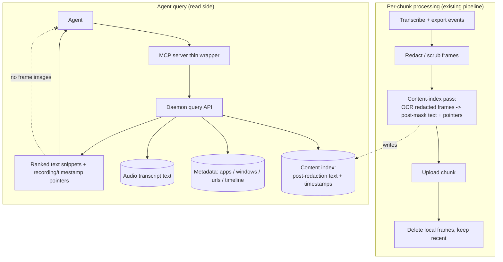

# MCP Agent-Memory Retrieval: Queryable Recordings via a Content Index

## Summary

A local MCP server that lets an agent query a user's ScreenCap recordings across three streams — structured metadata, audio transcript, and on-screen content. The new capability beneath it is a **content index**: a post-redaction OCR pass that runs inline in chunk processing, decoupled from the privacy pipeline, making what was on screen searchable without ever exposing pixels to the agent.

---

## Problem Frame

ScreenCap captures rich signal, but today none of it can come back out for an agent. There is no search or query surface of any kind — the catalog is raw SQLite, replay is a static HTML viewer, and the data-flywheel / MCP track named in the strategy has nothing in the backlog. The agent that the strategy bets on as the eventual buyer cannot ask "what dashboards did I touch this morning" or "find the screen where the invoice total was wrong." From the agent's perspective, every recording is write-only.

The strategic cost is that the product's headline JTBD — "let an agent do the next round of the workflow for me" — and the data-flywheel cash-in have no surface to land on. The recordings accumulate value that the operator's own tools cannot reach.

There is also a quieter waste. OCR already runs on macOS via Apple Vision, but only inside the privacy scrubber, and only on the frames a privacy decision flags — its sole job is to find sensitive text and destroy it. The recognized text that would answer a content query is computed during masking and then discarded. The single highest-value retrieval stream (what was actually on screen) is being extracted and thrown away.

---

## Architecture

The content index is a read-only consumer that runs *after* redaction and *before* local frames are deleted; the agent-facing query surface reads the index plus existing streams and returns text, never pixels.

---

## Actors

- A1. **Developer / agent-builder (MCP client author)**: wires ScreenCap's MCP server into an agent or internal copilot. The primary first user. Cares about a stable, typed tool surface and predictable results.
- A2. **Non-technical operator on a consumer agent app** (Claude Desktop / Codex app): the widening base. Cares about asking in natural language and getting useful answers without knowing any schema.
- A3. **The querying agent**: the software actor that calls the MCP tools and consumes results. Cares about typed contracts and bounded, safe payloads.
- A4. **ScreenCap engineer**: maintains the index pass and the query surface. Cares about keeping retrieval decoupled from the privacy pipeline and preserving the fail-closed invariant.

---

## Key Flows

- F1. **A recording becomes queryable (index build)**
  - **Trigger:** a chunk finishes the processing pipeline during or after a recording.
  - **Actors:** A4 (owns the pipeline), system.
  - **Steps:** transcribe → export events → manifest → redaction/scrub completes → **content-index pass OCRs the redacted frames and persists post-mask text + locating metadata** → upload chunk → delete old local frames. The index pass sits after scrub and before delete.
  - **Outcome:** the recording's on-screen text is searchable locally; no pre-redaction text is persisted; the redaction path is unchanged.
  - **Covered by:** R4, R5, R6, R7.

- F2. **Agent answers a content question**
  - **Trigger:** A2 asks their agent "find the screen where the invoice total was wrong."
  - **Actors:** A2, A3.
  - **Steps:** agent calls the MCP search tool → MCP server forwards to the daemon query API → query runs over the content index (post-mask text), and where relevant metadata + transcript → returns ranked text snippets with recording/timestamp pointers → agent presents; the user opens that moment locally if they want to see pixels.
  - **Outcome:** the agent answers from screen content without receiving any frame images.
  - **Covered by:** R2, R4, R8.

- F3. **Agent answers a metadata / timeline question**
  - **Trigger:** A1's copilot asks "what apps did I use this morning" or "which Looker dashboards on Tuesday."
  - **Actors:** A1, A3.
  - **Steps:** agent calls a timeline/metadata tool → query runs over existing event tables (app / window / url / action timeline) → returns structured rows.
  - **Outcome:** exact answers from data already stored; no OCR or content search invoked.
  - **Covered by:** R2, R3.

---

## Requirements

**Query surface (MCP)**
- R1. ScreenCap exposes a local MCP server that lets an agent query past recordings. The MCP server is a thin wrapper over the daemon's existing local API and holds no query logic of its own beyond protocol translation.
- R2. The query surface spans three streams through one coherent interface: structured metadata (apps, windows, URLs, action timeline), audio transcript text, and on-screen content text.
- R3. Queries are answerable from natural language well enough that a non-technical operator on a consumer agent app gets useful results without knowing the underlying schema, while still presenting a stable typed contract an agent-builder can rely on.

**Content index**
- R4. A content index makes on-screen text searchable. It is built by an OCR pass over each recording's **redacted** frames and persists only post-redaction text plus the locating metadata (which recording, what time) needed to point back to the moment.
- R5. The content-index pass is **decoupled from the privacy pipeline**: it is a read-only consumer of already-redacted frames and never alters, gates, or shares state with the redaction path. Redaction runs and completes exactly as it does today, whether or not indexing is enabled.
- R6. The content-index pass runs **inline in chunk processing, after redaction completes and before local frames are deleted**, so it can read frames before they leave the device. It works in both upload and local-only modes.

**Privacy & exposure**
- R7. The content index never contains pre-redaction text. By construction it only reads frames that have already passed the scrubber, so any value the scrubber masked is absent from the index.
- R8. Query results return **post-redaction text snippets and pointers** (recording + timestamp). The agent does not receive frame images; viewing the actual pixels of a moment is a local action the user takes, not a payload sent to the agent.

**Coverage & evolution**
- R9. Index coverage is a retrieval decision, independent of which frames the privacy scrubber happened to OCR. The index is not sourced from the sparse privacy OCR pass, so recall does not silently track privacy policy.
- R10. v1 search is keyword/exact matching over indexed text. Semantic/embedding search is a planned later graduation; the v1 store should avoid foreclosing it but is not required to implement it.

---

## Acceptance Examples

- AE1. **Covers R5, R7.** Given a recording where the scrubber masked an on-screen SSN, when the content-index pass runs, the index contains the surrounding screen text but not the SSN, and the redaction output is identical to a run with indexing disabled.
- AE2. **Covers R6.** Given upload and auto-delete are enabled, when a chunk is processed, the content-index pass reads and indexes that chunk's frames before they are deleted locally — the recording stays queryable even though the frames are no longer on disk.
- AE3. **Covers R8.** Given an agent issues a content query that matches a frame, when results are returned, the agent receives text snippets and recording/timestamp pointers and zero frame-image bytes.
- AE4. **Covers R2, R4.** Given the query "find the screen where the invoice total was wrong," when content indexing has run, the agent receives candidate moments ranked by on-screen text match — subject to the value not having been redacted.
- AE5. **Covers R2, R3.** Given the query "what apps did I use this morning," when the agent calls the metadata/timeline tool, it receives exact app/time rows from existing event tables without invoking OCR or content search.

---

## Success Criteria

- An agent-builder (A1) can wire ScreenCap's MCP server into an agent and get reliable answers to both "what did I do" (metadata/transcript) and "find the screen where X" (content) questions.
- A non-technical operator (A2) on Claude Desktop / Codex app can ask a natural-language question about their recordings and get a useful answer without schema knowledge.
- Turning on content indexing does not change redaction output and puts no pre-redaction text and no frame pixels in front of the agent.
- The content-index pass does not push active-recording overhead past the run-all-day budget. If it does, that is the explicit signal to graduate to the shared single-OCR-pass design (see Key Decisions).
- ce-plan can implement without re-deciding: which streams are queried, where the OCR pass sits relative to redaction and deletion, what the index stores (post-mask text + pointers), and what the agent does and does not receive.

---

## Scope Boundaries

- Recording **control** via MCP (start / stop / pause / observe live sessions) — a separate MCP feature; the daemon verbs for it already exist and are smoke-tested ([scripts/mcp_contract_smoke.py](scripts/mcp_contract_smoke.py)).
- The **single shared-OCR-stage** refactor (one OCR pass feeding both the redactor and the indexer) — a future graduation triggered only if duplicate-OCR overhead shows up in the run-all-day metric. Not this build.
- **Semantic / embedding** search — later; v1 is keyword/exact.
- **Cloud-side** indexing or re-OCR of uploaded frames — the index is built locally in the pre-deletion window.
- Exposing **pre-redaction / raw** content, or **frame images**, to the agent — against the fail-closed privacy stance.
- Sourcing the index from the existing **sparse privacy OCR pass** — rejected; it would couple retrieval recall to privacy policy.
- Exact MCP tool/verb names, index store schema, search query syntax, and wire formats — planning and design territory.
- **Backfill** of recordings made before this feature shipped — not in v1 (see Outstanding Questions).

---

## Key Decisions

- **Retrieval, not control, for this feature.** The data-flywheel and agent-buyer JTBD live in retrieval; control is a distinct feature with its own already-built daemon verbs. Conflating them was the first ambiguity resolved.
- **A3 (decoupled downstream index) over A2 (shared OCR stage) and A1 (tap the privacy OCR pass).** A3 keeps the fail-closed privacy path completely untouched and the feature fully additive and removable; the cost is OCR-ing affected frames twice. A1 was rejected because it couples retrieval recall to privacy policy (recall becomes an accident of which apps were flagged). A2 is deferred, not dead — once redacted frames are forced to be read inline per-chunk, A2 lives in the same place as A3, and the only remaining difference is one OCR pass vs. two. A2 becomes worth it if and when duplicate-OCR overhead is measurable.
- **Inline-per-chunk timing, not lazy / on-first-query.** Verified in [chunk_processor.py](src/screencap/chunk_processor.py): redacted frames are uploaded and then deleted locally (keeping only the most recent few) shortly after processing. A deferred index would have no local frames to read, so the pass must run in the window between scrub completion and chunk deletion.
- **Post-redaction text only, no pixels to the agent.** The conservative exposure posture that lets "expose screen history to an agent" coexist with "win on privacy." The agent gets text + pointers; pixels stay local.
- **Thin MCP wrapper over the daemon API.** Consistent with the 2026-05-08 architecture brainstorm; the real work of this feature is the query/index layer beneath the wrapper, not the wrapper.

---

## Dependencies / Assumptions

- Reuses the existing Apple Vision OCR engine ([src/screencap/privacy/ocr.py](src/screencap/privacy/ocr.py)) as a shared primitive — it is already a clean, protocol-based wrapper with no privacy logic. No new OCR dependency.
- Assumes the daemon's local API is the integration point for the MCP server, per the 2026-05-08 CLI/GUI/MCP architecture brainstorm (now shipped).
- Assumes redacted frames are present on local disk in the window between scrub completion and chunk deletion — verified against the `_process_chunk` ordering in [chunk_processor.py](src/screencap/chunk_processor.py).
- Content recall is bounded by what survives redaction and by frame coverage: video is action-gated, so a screen the user only looked at (no click/keystroke) may have no captured frame. Retrieval is best-effort over captured-and-surviving content, not a guarantee of total recall.
- Assumes one active recording at a time (existing engine constraint); the index and query surface need not model concurrent sessions.

---

## Outstanding Questions

### Resolve Before Planning

- *(none — exposure posture, search type, and OCR placement were all decided in dialogue.)*

### Deferred to Planning

- [Affects R4][Technical] Index storage shape — a new table, SQLite FTS, or a sidecar — and where it lives relative to the per-recording DB.
- [Affects R6][Technical] Exact insertion point and concurrency of the index pass inside chunk processing, so it does not delay upload/cleanup or contend with the scrub worker.
- [Affects R4, R9][Needs research] OCR coverage and dedup policy for the index — which retained frames to OCR (all vs. dHash-deduped vs. keyframe-only) to balance recall against the run-all-day overhead budget.
- [Affects R1, R3][Technical] MCP tool set and signatures (search, timeline, get-moment-pointer) — names and shapes deferred per the architecture brainstorm's precedent.
- [Affects R8][User decision / Needs research] Whether a later version lets the user opt into the agent receiving redacted frame thumbnails, and what consent gate that would require.
- [Affects Scope][Technical] Backfill — whether and how to index recordings made before this feature shipped.
- [Affects R10][Needs research] Semantic-search graduation — embedding model, local vs. cloud, and storage cost.
