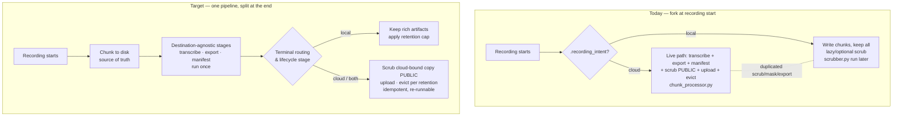

# Unified Recording Processing Pipeline

## Summary

Replace the two divergent processing paths (live cloud chunk-processing vs. post-hoc local scrub + explicit upload) with **one disk-first pipeline**: every recording is chunked to disk as the source of truth, destination-agnostic stages run once, and a single idempotent terminal stage handles all destination-specific work — privacy transform for cloud-bound copies, upload, and retention. The local-vs-cloud decision moves from a fork at recording-start to a routing decision at the end. Local copies stay rich; scrub applies only to what leaves for the cloud. Monetization gets a clean policy seam, not billing.

---

## Problem Frame

Today Screencap has two separate ways of turning a recording into processed, possibly-uploaded artifacts, and they were built at different times for different reasons. The **live path** (`src/screencap/chunk_processor.py`) runs only when a recording is cloud-bound: at each video auto-cut it transcribes, exports events, builds a manifest, scrubs (forced to the strict `PUBLIC` privacy policy), uploads the chunk, and deletes old chunks once they are confirmed uploaded. The **local path** does almost none of this — a local-only recording just writes chunks to disk and keeps them all, with scrubbing and any export happening lazily and only if the user asks.

The fork happens at recording start, keyed off `.recording_intent`. From that single branch, two whole worlds of behavior diverge: scrubbing runs in the live path and again in the full scrubber (`src/screencap/scrubber.py`), screenshot masking and event-JSONL sanitization run in both, `recording.db` is uploaded in one path and skipped in the other, and privacy policy is forced in one and user-configured in the other. Each new feature has to be reasoned about — and often implemented — twice, in two places that keep drifting apart. The lived cost is cognitive: it is hard to know what you are touching and where a given behavior actually lives.

This matters now because the per-user GCP isolation has shipped (the signing layer verifies Firebase tokens and scopes storage to `users/{uid}/…`), which unblocks charging for cloud usage. Wiring monetization — and every future cloud or processing feature — into two diverging code paths would compound the existing drift instead of resolving it.

---

## Actors

- A1. **Local-only operator:** records for personal/local use and never uploads. Cares about low overhead, rich local signal, and not having an all-day habit silently fill the disk.
- A2. **Cloud operator:** signed-in; uploads recordings and may reclaim local disk on a retention policy. Cares that cloud-bound data is scrubbed, that local stays private and rich, and that a recording is never lost mid-upload.
- A3. **Screencap engineer:** adds processing and cloud features and maintains the pipeline. The primary beneficiary of consolidation — wants one place to change behavior and a guarantee that local/cloud stay consistent.
- A4. **Processing pipeline (system actor):** the staged processor plus the terminal routing/lifecycle stage that converges on-disk artifacts toward the recording's declared destination and retention.

---

## Key Flows

- F1. **Local-only recording, kept rich**
  - **Trigger:** A1 records with destination = local.
  - **Actors:** A1, A4.
  - **Steps:** Recording writes chunks to disk → destination-agnostic stages run once (transcribe, export events, manifest) → terminal stage sees destination = local, applies no scrub and no upload → retention policy applies over time (keep-forever by default, or evict past a configured cap).
  - **Outcome:** Rich, unscrubbed artifacts on disk; disk stays bounded only if the user opted into a cap.
  - **Covered by:** R1, R2, R3, R4, R6, R7, R11, R16.

- F2. **Cloud recording with reclaim-local**
  - **Trigger:** A2 (signed in) records with destination = cloud and a delete-after-upload retention policy.
  - **Actors:** A2, A4.
  - **Steps:** Recording writes chunks to disk → destination-agnostic stages run once → terminal stage produces a scrubbed cloud-bound copy under the strict policy → uploads → as each chunk's upload is confirmed, eviction may reclaim that chunk's local copy, even while the recording is still running. `recording.db` is never uploaded.
  - **Outcome:** Private scrubbed data in the cloud under the operator's namespace; local disk bounded during a long session; local source-of-truth remains until eviction.
  - **Covered by:** R5, R6, R7, R8, R10, R12, R13.

- F3. **Crash / interruption recovery**
  - **Trigger:** The daemon or upload is interrupted mid-pipeline (crash, network drop, partial upload).
  - **Actors:** A4.
  - **Steps:** On restart, the terminal lifecycle stage re-reads on-disk state → determines which chunks are already uploaded and which artifacts already exist → re-runs only the unfinished work → converges to the declared destination state.
  - **Outcome:** No duplicate uploads, no corrupted artifacts, no need to re-record; the recording finishes its journey from the on-disk source of truth.
  - **Covered by:** R3, R9, R15.

---

## Requirements

**Unified pipeline shape**
- R1. A single pipeline processes every recording regardless of destination. The separate live-cloud and post-hoc-local processing paths are collapsed into one.
- R2. Chunks are the universal canonical on-disk primitive for all recordings (local, cloud, both). No single-large-video format of record going forward.
- R3. Disk is the source of truth: processing produces durable on-disk artifacts before any upload, and the pipeline can reconstruct the correct cloud state from disk at any time.
- R4. The destination-agnostic stages — transcription, event export, manifest generation — run exactly once per chunk and have no knowledge of local-vs-cloud.
- R5. A single terminal routing & lifecycle stage owns all destination-specific behavior: the cloud-bound privacy transform, upload, and retention/eviction.

**Split-late semantics**
- R6. The local-vs-cloud decision is applied at the terminal stage, not at recording start. Destination (local / cloud / both) selects routing behavior over already-processed artifacts.
- R7. Scrub/mask is a transform applied only to cloud-bound copies. Local on-disk artifacts remain rich and unscrubbed. As a direct consequence, cloud-bound copies use the strict privacy policy while local artifacts use the user-configured privacy mode.
- R8. The raw `recording.db` (which holds unscrubbed PII) is a local-only artifact by rule and is never uploaded; any cloud-bound structured data derives only from scrubbed exports.

**Lifecycle, retention & robustness**
- R9. The terminal lifecycle stage is idempotent and safe to re-run from disk after a crash, interruption, or partial upload — re-running converges rather than duplicating or corrupting, and upload is resumable from the on-disk source of truth.
- R10. Local deletion is decoupled from upload — it is a retention policy, not an immediate side-effect of uploading. Policies include at least: keep forever, delete after confirmed upload, and delete after N days or a size cap.
- R11. Retention applies uniformly to local-only recordings too (size/time cap), with a keep-forever default so existing local behavior is unchanged unless a cap is set.
- R12. Eviction can run during an active recording (not only after it ends), so long "run all day" cloud sessions stay within bounded disk while upload lags.

**Monetization seam**
- R13. Destination and retention are expressed as a policy abstraction with a single, well-defined attachment point where future plan-tiers will gate cloud routing and retention. No metering, quota enforcement, or billing is implemented in this work; the seam exists so they can be added later without re-forking the pipeline.

**Migration & compatibility**
- R14. Legacy single-file (non-chunked) recordings already on disk remain readable and listable; the unified pipeline emits chunks only going forward.
- R15. Existing chunked recordings already on disk (including partially-uploaded ones) are handled by the unified pipeline without data loss; their upload/retention state is reconciled from disk.
- R16. Local recording and local use require no account; the account gate applies only to the cloud routing branch, consistent with the shipped per-user isolation.

---

## Pipeline shape: today vs. target

---

## Acceptance Examples

- AE1. **Covers R6, R7.** Given a recording with destination = cloud, when it is processed, the local on-disk artifacts remain unscrubbed and only the cloud-bound copy is scrubbed under the strict policy.
- AE2. **Covers R9.** Given an upload interrupted halfway, when the lifecycle stage re-runs, already-uploaded chunks are not re-uploaded and the remaining chunks complete — with no duplicates and no corrupted artifacts.
- AE3. **Covers R10, R11.** Given a local-only recording with the keep-forever default, when no cap is configured, no chunks are auto-deleted; when a size cap is later set, the oldest chunks past the cap are evicted.
- AE4. **Covers R8.** Given destination = cloud, when upload runs, `recording.db` is never among the uploaded artifacts.
- AE5. **Covers R12.** Given a long cloud recording with a delete-after-upload policy, when a chunk's upload is confirmed mid-recording, that chunk's local copy can be evicted before the recording ends.
- AE6. **Covers R16.** Given destination = local with no account signed in, when the user records, it proceeds without an account; when destination = cloud, an account is required.

---

## Success Criteria

- Adding a new cloud or processing feature touches exactly one place in the pipeline, and local-vs-cloud behavior is consistent by construction — an engineer can tell at a glance where a behavior lives.
- A cloud operator can upload and then reclaim local disk on a policy without fear of data loss: re-uploadable from disk while the local copy exists, and once evicted the cloud holds the copy.
- Local-only "run all day" operators do not fill their disk indefinitely — a retention cap is available without changing the default behavior.
- `ce-plan` can sequence implementation without re-deciding the pipeline shape, the split point, scrub locality, the retention model, or how legacy/in-flight recordings are migrated.

---

## Scope Boundaries

- Billing, payments, paid tiers, usage metering, and quota enforcement — later milestone. Only the policy seam (R13) is built now.
- Training-consent opt-in flow and training-corpus export — later milestone. The pipeline must not foreclose it (rich local artifacts are preserved), but it is not built here.
- Per-user GCP isolation and authentication — already shipped; this refactor consumes the existing token-verifying signing layer, it does not rebuild it.
- The full always-on desired-state reconciler controller (Approach C in its complete form) — deferred until multi-target / billing / quota scale demands it. Only its idempotent, re-runnable lifecycle property (R9) is adopted now.
- The native redaction-review UX — in-flight on its own branch; this refactor coordinates with it but does not subsume the review UI.
- Recording engine internals (capture, reader threads, daemon supervision, the screen-capture path) — unchanged. This work is about what happens to chunks after they are written.
- Windows / cross-platform — per [STRATEGY.md](STRATEGY.md), macOS only.

---

## Key Decisions

- **Disk-first staged pipeline (Approach A), not promoting the live chunk-processor (Approach B).** Disk-first gives a durable source of truth, keeps local overhead low, and preserves rich local signal. Promoting the live path would unify on the heavier of the two paths and re-introduce local/cloud conditionals — exactly the divergence being eliminated.
- **Scrub as a cloud-bound transform; local stays rich.** Scrubbing exists because data crosses the trust boundary, so it belongs at the destination edge. Keeping local artifacts unscrubbed preserves the training-corpus bet and the "your own machine, you trust it" model — chosen over scrub-once-to-disk, which is simpler but discards local signal.
- **Idempotent, re-runnable terminal lifecycle stage — not a full reconciler yet.** Borrow Approach C's crash-safety and declarative-destination idea without paying for an always-on controller at today's single-user, single-recording scale. The controller can be grown later if multi-target/billing/quotas justify it.
- **Retention is a universal policy, including for local-only recordings.** Once the pipeline owns retention, local-only users get bounded disk for free. A keep-forever default means existing local behavior is unchanged unless a cap is set.
- **Monetization is a policy seam only.** Willingness-to-pay is still an unvalidated founder's bet (carried from the per-user isolation work); building billing now would couple unproven product assumptions into the consolidation. The seam sits on the already-shipped isolation substrate.
- **Chunks are universal; legacy single-file mode is dropped going forward.** Predictable-size chunks are the canonical primitive for everyone; legacy recordings already on disk remain readable.
- **`recording.db` is local-only by rule.** Unifies today's ad-hoc skip into an explicit invariant: the raw DB never crosses the trust boundary.
- **Sequence after the native redaction-review branch merges, then refactor on top.** `feat/native-redaction-review-upload` and this refactor both touch the cloud-bound scrub/upload seam. Letting it land on `main` first settles that seam before we restructure it, and avoids developing against a moving branch — chosen over building on the branch now (churn risk) or absorbing its scope into this refactor (scope creep, risk of duplicating in-flight work).

---

## Dependencies / Assumptions

- Per-user GCP isolation + the Firebase-auth-verifying signing layer are already shipped and are the substrate this refactor consumes. *Verified:* the cloud signing function verifies bearer tokens and scopes storage under `users/{uid}/…` (`scripts/cloud-function/main.py`); upload threads a Firebase bearer token (`src/screencap/upload.py`).
- The native redaction-review work touches the same scrub/upload seam. *Verified:* `feat/native-redaction-review-upload` exists locally and on the remote and is not yet on `main`. **Decided:** this refactor waits for that branch to merge and then builds on top (see Key Decisions). This is a hard prerequisite — planning should assume the redaction-review scrub seam is the starting point.
- Chunking is already the on-disk default. *Verified:* `src/screencap/config.py` defaults `chunk_duration` to 900s; `0` selects legacy single-file mode.
- Transcription, scrub/mask, event export, and manifest generation already exist as components. This refactor restructures how they are orchestrated and where the destination split lands — not their internals.
- Monetization willingness-to-pay remains an unvalidated strategic bet (carried forward from the per-user cloud-storage isolation brainstorm).

---

## Outstanding Questions

### Resolve Before Planning

- *(none — sequencing vs. the native redaction-review branch is decided: wait for it to merge, then refactor on top. See Key Decisions and Dependencies.)*

### Deferred to Planning

- [Affects R5, R9][Technical] The terminal lifecycle stage's state tracking (today's `ChunkStatus` machine plus GCS reconciliation in `chunk_processor.py` is the reuse target) and how idempotency / progress is recorded on disk.
- [Affects R10, R11, R12][Technical] How retention policy is represented and where it is configured (per-recording intent file vs. global config vs. per-account), and the eviction trigger cadence during an active recording.
- [Affects R13][Technical] The policy-seam interface — what a future plan-tier reads/writes to gate cloud routing and retention without re-forking the pipeline.
- [Affects R7, R8][Technical] Whether scrubbed cloud-bound artifacts are materialized as separate files on disk or produced streaming at upload time — affects disk footprint and the eviction model.
- [Affects R15][Technical] Reconciliation rules for recordings mid-migration (already partially uploaded under the old path): how existing on-disk state maps onto the new lifecycle state.
- [Affects R2, R14][Needs research] Whether anything downstream assumes a single `video.mp4` and must adapt to chunks-as-record — e.g. review-stitching (`src/screencap/review.py`), website playback, and any MCP surface.
