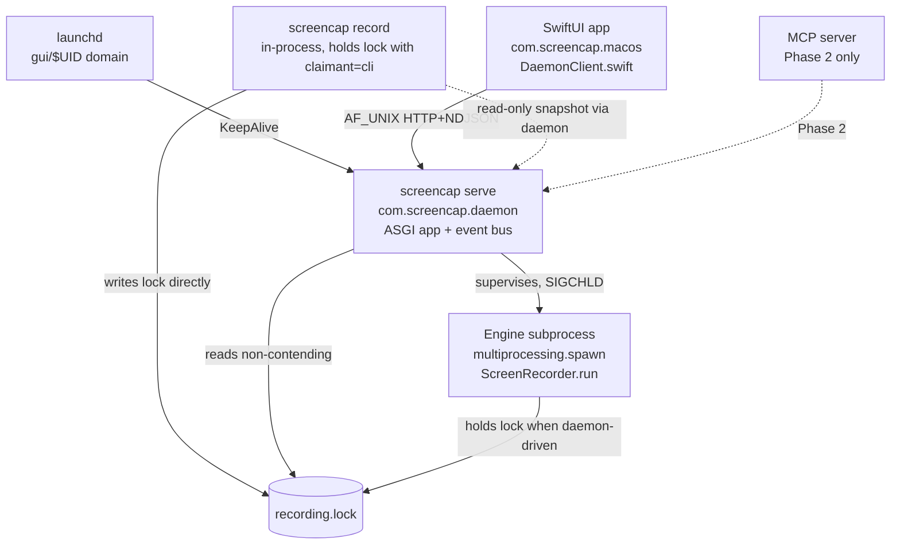

# feat: Daemon architecture — Phase 1 (API extraction + SwiftUI migration)

## Summary

Phase 1 adds a `screencap serve` subcommand that runs an ASGI app on a self-bound AF_UNIX socket at `~/.screencap/run/api.sock`, exposes per-endpoint schema-versioned JSON responses plus an NDJSON event stream, supervises the existing recording engine as a subprocess (launchd → daemon → engine), and migrates the SwiftUI shell from spawning the CLI to talking to the daemon over `Network.framework`. CLI commands stay in-process during Phase 1 and the existing 10-event stderr taxonomy is bridged onto the daemon's event bus so SwiftUI's parser keeps working with no shape changes.

**Implementation scope: U1 through U8 (Phase 1a + Phase 1b).** Both phases ship without depending on Developer ID Application signing and are fully reversible. The strategic TCC payoff (grants persist across rebuilds, AE2) requires Developer ID and is **deferred to Phase 1c (U9), tracked externally at [SCR-49](https://linear.app/zk-email/issue/SCR-49/phase-1c-u9-swiftui-entitlement-drop-tcc-migration-ux-blocked-on)** — out of this plan's implementation pass. Implementation agents should treat U8 as the terminal unit. The U9 scope is preserved in this document under `Future Work — Phase 1c (Tracked Externally)` for reference only.

---

## Problem Frame

ScreenCap's current shape — CLI-as-engine, SwiftUI-shells-CLI — is the textbook subprocess-per-call pattern that every durable 3-surface tool (Tailscale, Docker, Ollama, Syncthing, rclone) refactored away from once a third surface arrived. With MCP for computer-use agents now a near-term commitment per `STRATEGY.md`, the same pressure is here. Phase 1 extracts the API contract first and routes SwiftUI through it; Phase 2 (separate plan, after Phase 1 is observable in production) consolidates the engine into the daemon and lands the MCP server. See [origin brainstorm](docs/brainstorms/2026-05-08-cli-gui-mcp-architecture-requirements.md) for the full motivation, actor model, and rejected alternatives.

---

## Requirements

Phase 1 advances these origin requirements (R-IDs preserved from origin):

- R1 (partial). Engine state begins migrating into the daemon; full consolidation is Phase 2.
- R2. Same `screencap` binary serves CLI commands and `screencap serve` via Click subcommand dispatch.
- R3 (partial — SwiftUI only in Phase 1). SwiftUI app becomes a client of the daemon API; CLI stays in-process; MCP server is Phase 2.
- R4. API supports request/response calls and a persistent NDJSON event-subscription stream.
- R5 (split). **R5a (Phase 1a/1b):** Daemon's bundled binary holds its own Screen Recording / Accessibility / Input Monitoring TCC grants and uses them when capturing. SwiftUI shell **keeps its current entitlements** during Phase 1a/1b — both surfaces have TCC entries during the interim period. **R5b (Phase 1c, deferred):** SwiftUI shell drops Screen Recording / Accessibility / Input Monitoring entitlements once Developer ID Application signing is validated end-to-end. R5b is the strategic payoff but not a Phase 1a/1b deliverable.
- R6. CLI commands continue to work without the SwiftUI app or the daemon being installed/running.
- R8. Daemon runs as a per-user LaunchAgent, not a system LaunchDaemon.
- R9. Daemon starts at user-session login and persists across SwiftUI app launches/quits. Idle is cheap; auto-shutdown is a non-goal.
- R10. Daemon supervises itself enough to recover from engine crash mid-recording without losing previously written frames, events, or catalog rows.
- R11. **Phase 1a and Phase 1b are both reversible** in this plan — they ship transport and supervision changes only, no SwiftUI entitlement drop. `screencap serve --uninstall` returns Phase 1a to pre-daemon state; reverting Phase 1b means restoring SwiftUI's `CLIClient`-only path. The forward-only entitlement drop is deferred to Phase 1c (blocked on Developer ID; see Phased Delivery). SwiftUI is routed through the API in Phase 1b; CLI stays in-process throughout Phase 1. Stderr-event streaming continues as a fallback path through Phase 1b.
- R13. Phase 1 ships behind its own release.
- R14. API contract is designed with MCP-driven verbs in mind from Phase 1.
- R15. API versioning re-uses the existing per-endpoint `_*_SCHEMA_VERSION` constants pattern from `cli.py`.

R7 and R12 are Phase 2; tracked here only as forward constraints on the API contract shape.

**Origin actors:** A1 (CLI power user), A2 (non-technical GUI operator — primary persona), A3 (computer-use agent via MCP — Phase 2 consumer, but contract designed in Phase 1), A4 (ScreenCap engineer).

**Origin flows:** F1 (GUI records, agent observes — Phase 2 completes), F2 (agent starts, GUI joins late — late-join semantics defined here), F3 (CLI power user, no GUI — Phase 1 honors), F4 (first-launch install — Phase 1 delivers).

**Origin acceptance examples:** AE1 (covers R3, R4, R7 — contract designed in Phase 1, satisfiable in Phase 2), **AE2 (covers R5, R8 — Phase 1c, blocked on Developer ID validation; not deliverable in this plan)**, AE3 (covers R6, R9 — Phase 1 honors), AE4 (covers R11, R12 — Phase 1 explicit), AE5 (covers R10 — Phase 1 delivers).

---

## Scope Boundaries

- Phase 2 work: engine consolidation into the daemon, CLI as API client, MCP server process, removal of stderr events as external contract.
- Cross-platform daemon design. macOS-only, per `STRATEGY.md` "Not working on" Windows.
- Remote / TCP socket exposure. AF_UNIX only.
- Auth tokens, ACLs, capability-based permissions beyond same-user `getpeereid` origin check.
- Auto-shutdown of the idle daemon. "Run all day" is the strategy; the daemon staying resident is a feature.
- Engine swap-out (e.g., Swift-native capture engine). Possible later.
- Distribution decisions (App Store vs `.pkg`, Homebrew tap, Sparkle).
- Backwards-compatibility shims for the stderr-event contract beyond Phase 1.

### Deferred to Follow-Up Work

- Ring-buffer event replay on subscribe — Phase 1 uses atomic snapshot+cursor; deferred to a later plan if real consumers need historical replay.
- Coalescing strategies for high-frequency events (e.g., `frame_written`) — Phase 1 uses bounded queue + drop-slow-consumer; coalesce-then-batch is a tunable for after first consumers exist.
- Second PyInstaller spec / separate daemon binary — Phase 1 ships one binary; splitting comes only if the daemon needs entitlements the CLI doesn't.
- launchd `Sockets`-activation migration — deferred until cold-start is shown to be a problem (it isn't, given `KeepAlive=true` + `RunAtLoad=true`).
- Removal of SwiftUI's `CLIClient.runJSON` short-call code path — kept during Phase 1 as a fallback; full removal in Phase 2 alongside CLI consolidation.
- **GUI force-stop of CLI-driven sessions.** Phase 1 explicitly does not surface a force-stop button or confirmation dialog for CLI-claimant sessions in SwiftUI. The daemon's `recording.stop force=true` API verb exists but only direct socket callers (e.g., `curl`, future MCP) can invoke it. SwiftUI shows a generic "Another process is recording" message; users who need to stop a CLI session use the terminal. Polished cross-claimant UX is deferred (and may be removed entirely in Phase 2 once the CLI consolidates as an API client and "cross-claimant" stops being a state).
- **CI automation for AE2 (TCC grants persist across rebuilds).** Currently a manual smoke runbook in U8. Automatable via `tccutil`-database queries against the daemon binary identity, pre/post a SwiftUI rebuild cycle. Track as a follow-up ticket in `docs/tickets/` once Phase 1 ships.
- **Server-supplied `started_by` provenance validation.** Currently the API accepts `started_by` from the caller as informational. Phase 2's MCP integration introduces a second daemon caller; at that point, server should validate (e.g., by introspecting peer PID via `LOCAL_PEERPID` and matching against process name / bundle id) rather than trusting the field.

---

## Context & Research

### Relevant Code and Patterns

- [src/screencap/cli.py](src/screencap/cli.py) — Click `@click.group()` root, ~25 subcommands. Per-endpoint `_*_SCHEMA_VERSION` constants at lines 47-51; uniform `{ok, schema_version, ...}` envelope (lines 1856-1873 for status). Heavy imports deferred inside command bodies to keep `--help` fast (per `CLAUDE.md`).
- [src/screencap/_stderr_events.py](src/screencap/_stderr_events.py) — `EVENT_SCHEMA_VERSION=1`, 10 event-type constants, `emit_event()` flushes line-buffered JSON to stderr. Stdlib-only on purpose so spawn workers can import without Click+Rich. Event taxonomy and exit-code mapping (0/1/2/3/4/5) are the contract surface to preserve.
- [src/screencap/_startup.py](src/screencap/_startup.py) — Imported before any `multiprocessing` primitive; installs `PYTHONWARNINGS` filter for `resource_tracker`. Daemon entry must respect the same import order (`# ruff: noqa: I001`).
- [src/screencap/recorder.py](src/screencap/recorder.py) — `start_recording()` at lines 562-665 is the thin CLI-to-engine adapter; `_check_macos_permissions()` at lines 416-490 is the existing TCC pre-flight; `_check_permission_fresh()` at lines 385-413 is the fresh-subprocess-per-check workaround for macOS TCC's per-process cache.
- [src/screencap/engine/screen_recorder.py](src/screencap/engine/screen_recorder.py) — `ScreenRecorder(request, channels, policies, legacy).run()` is the typed-bundle entry point; daemon supervision target.
- [src/screencap/session.py](src/screencap/session.py) — `SessionController` at lines 427+; existing signal-handler / supervisor pattern. Daemon either reuses it or factors out a thinner supervisor.
- [src/screencap/pidfile.py](src/screencap/pidfile.py) — `claim_lock(capture_dir, claimant)` flock primitive; `read_lock_metadata()` / `lock_is_active()` non-contending probes; `find_orphaned_processes` / `terminate_processes` for the SIGTERM→SIGKILL pattern.
- [src/screencap/catalog.py](src/screencap/catalog.py) — `list_recordings()` directory-scan + per-recording SQLite reads; concurrent-safe (read-only `query_only=ON` + `busy_timeout=5000`).
- [macos/ScreenCap/Controllers/CLIClient.swift](macos/ScreenCap/Controllers/CLIClient.swift) — single point of subprocess spawning. `runJSON<T>` at lines 121-132, long-lived `spawn` at lines 261-340, `LineBuffer` at lines 411-444. Pipe-drain-to-EOF in `terminationHandler` is load-bearing (lines 304-331) — must be preserved through transport swap.
- [macos/ScreenCap/Controllers/RecorderController.swift](macos/ScreenCap/Controllers/RecorderController.swift) — `SUPPORTED_EVENT_SCHEMA_VERSION=1`; `RecorderEventLine` decode shape; `RecordingState` machine driven by 10 event types. New `SUPPORTED_API_SCHEMA_VERSION` mirrors this.
- [macos/ScreenCap/Controllers/PermissionController.swift](macos/ScreenCap/Controllers/PermissionController.swift) — `relaunchApplication()` at lines 197-241, `requestAndOpenSettings(for:)` at lines 251-269. Reusable for the daemon-relaunch verb and the TCC migration UX.
- [pyinstaller/screencap.spec](pyinstaller/screencap.spec) — Onedir bundle; `multiprocessing.freeze_support()` in [pyinstaller/main.py](pyinstaller/main.py). Same spec serves the daemon — `screencap serve` is just another subcommand.
- [tests/test_stderr_event_contract.py](tests/test_stderr_event_contract.py) — Golden-shape pinning per event type. New `tests/daemon/test_event_contract.py` mirrors this for NDJSON stream.

### Institutional Learnings

- [docs/solutions/integration-issues/macos-foundation-process-pipe-pitfalls.md](docs/solutions/integration-issues/macos-foundation-process-pipe-pitfalls.md) — Drain pipes to EOF, `terminationHandler` races `readabilityHandler`, sub-binaries spawned via `Process.run()` lose bundle TCC identity, timer-driven spawns need in-flight guard. Phase 1 must preserve drain-to-EOF on the new socket transport and must not spawn helper sub-binaries to refresh TCC state.
- [docs/solutions/runtime-errors/macos-tcc-per-process-cache-quit-and-relaunch.md](docs/solutions/runtime-errors/macos-tcc-per-process-cache-quit-and-relaunch.md) — Every TCC API caches its answer at process launch. Daemon inherits this; `is_screen_recording_granted()` only ever returns the value as-of-daemon-launch. Provide a daemon-relaunch verb instead of trying to live-poll.
- [docs/solutions/build-errors/macos-ad-hoc-signing-tcc-rebuild-treadmill.md](docs/solutions/build-errors/macos-ad-hoc-signing-tcc-rebuild-treadmill.md) — TCC anchors grants on signature digest for ad-hoc builds; "stable TCC grants survive rebuilds" only materializes once a real Developer ID identity is in place. Document `tccutil reset com.screencap.daemon` as part of the dev workflow.
- [docs/solutions/runtime-errors/sigint-handler-timing-and-recording-stop-methods.md](docs/solutions/runtime-errors/sigint-handler-timing-and-recording-stop-methods.md) — Non-interactive launches (launchd, scripts) inherit `SIG_IGN` for SIGINT. Daemon must install signal handlers and pidfile *before* heavy initialization. Two-phase install: pre-initialize closure variables to `None`, install handlers immediately, populate state later, guard every reference with `if x is not None`.
- [docs/solutions/runtime-errors/chunk-upload-sentinel-gating-and-data-loss.md](docs/solutions/runtime-errors/chunk-upload-sentinel-gating-and-data-loss.md) — Sentinel is the last write, gated on all prior writes. Never expose `recording_finalized` over the API/event stream until every prior chunk-state assertion is confirmed. Tri-state results over booleans for shutdown bookkeeping.
- [docs/solutions/build-errors/pyinstaller-frozen-binary-ci-failures.md](docs/solutions/build-errors/pyinstaller-frozen-binary-ci-failures.md) — `sys.executable` in frozen binary is the Click entrypoint, not Python. Any dep that calls `sys.executable -m ...` will explode. `except Exception` won't catch `SystemExit` (use `except BaseException` in supervisor loops).
- [docs/solutions/build-errors/macos-pre14-binary-install-failure.md](docs/solutions/build-errors/macos-pre14-binary-install-failure.md) — `minos` is contagious. Pure-Python `uvicorn` (no `[standard]`) keeps the bundle audit clean; `uvloop` / `httptools` are off-limits.
- `MEMORY.md`: child processes (spawn mode) re-import `recorder.py` — avoid module-level side effects. Daemon process inherits this — module-level code in any new daemon module runs in spawned engine workers too.

### External References

- Streaming protocol — Docker `/events` ([API ref](https://docs.docker.com/reference/api/engine/version/v1.52/)), Ollama ([streaming docs](https://docs.ollama.com/api/streaming)), Syncthing `/rest/events` ([events doc](https://docs.syncthing.net/rest/events-get.html)), Kubernetes watch — all converge on NDJSON over chunked HTTP for AF_UNIX heterogeneous-client topologies.
- LaunchAgent — Apple [SMAppService](https://developer.apple.com/documentation/servicemanagement/smappservice) (macOS 13+), [`launchd.plist(5)`](https://keith.github.io/xcode-man-pages/launchd.plist.5.html), [theevilbit SMAppService notes](https://theevilbit.github.io/posts/smappservice/), [eclecticlight launchd patterns](https://eclecticlight.co/2021/09/16/how-to-run-an-app-or-tool-at-startup/).
- Network.framework UDS — Apple DevForum [thread 756756](https://developer.apple.com/forums/thread/756756) (104-char `sun_path` cap on Darwin), [thread 719635](https://developer.apple.com/forums/thread/719635) (`NWEndpoint.unix(path:)` patterns).
- Origin check — `man 3 getpeereid`, `man 4 unix` (`LOCAL_PEERCRED`).
- ASGI on UDS — uvicorn `--uds` flag, programmatic `Config(uds=...)`. Minimal install (no `[standard]` extras) avoids `uvloop`/`httptools` C-extensions.

---

## Key Technical Decisions

- **Cross-process IPC: daemon reads engine subprocess stderr, forwards to in-process bus.** The daemon spawns the engine via `multiprocessing.spawn` (re-using `session.py:run_recording_worker`); the engine's existing `_stderr_events.emit_event` writes line-buffered JSON to its stderr; the daemon's `Supervisor` drains that stderr FD on a background task and republishes each event onto the asyncio `EventBus`. This sidesteps the cross-process `asyncio.Queue` problem (asyncio primitives don't survive `spawn`-mode pickling) and reuses the existing stderr contract verbatim. The bus-hook parameter described elsewhere in the plan is **enforced via `os.getppid() == DAEMON_PID` check inside `emit_event`** — CLI-driven recordings never publish to the bus, so dual-emission is process-identity-gated rather than convention-gated.
- **Engine-subprocess supervision: 1Hz `proc.is_alive()` poll on an asyncio task, not raw SIGCHLD.** Raw SIGCHLD handlers fight `multiprocessing.Process`'s own bookkeeping and `loop.add_signal_handler(SIGCHLD, ...)` is silently broken on macOS for spawn-started children. A 1Hz `proc.is_alive()` poll inside an asyncio task integrates cleanly with the event loop, accepts up-to-1s detection latency (acceptable for a recording-finalize event), and is compatible with the existing `multiprocessing.Process(target=run_recording_worker, ...)` call shape from `session.py`.
- **Event-stream payload privacy: window titles and screen-content-derived metadata never appear on the bus.** The privacy filter pipeline gates event-stream payloads independently of catalog payloads — events carry session/state metadata only (start/stop, frame counts, error types). Catalog rows may carry richer fields (subject to the existing scrubbing pipeline). This protects future MCP consumers that connect with same-EUID origin check but no Screen Recording TCC of their own.
- **HTTP-over-AF_UNIX with self-bound socket.** Daemon `bind()`s `~/.screencap/run/api.sock` itself rather than using launchd's `Sockets` activation. Rationale: the daemon is `RunAtLoad=true` + `KeepAlive=true` and never benefits from on-demand startup; self-binding gives full lifecycle control (stale-socket detection, pre-warm, clean unlink on shutdown). Matches Tailscale/Docker/Ollama precedent.
- **NDJSON over chunked HTTP for the event stream.** One long-running `GET /v0/events` returning `application/x-ndjson`; one JSON object + `\n` per event; server flushes per write; close-on-EOF for clean drain. Rejected SSE (extra framing, no Foundation-native client over UDS, third-party Swift dep needed, auto-reconnect fights drain-to-EOF semantics) and WebSocket (handshake + bidirectional framing for a unidirectional broadcast). Wire format mirrors the existing `_stderr_events.py` line-buffered JSON contract — same shape, different transport.
- **Server stack: minimal `uvicorn` + Starlette.** No `[standard]` extras (no `uvloop`, no `httptools`). Pure Python keeps the PyInstaller bundle minos floor clean per documented learning, and the ASGI lifecycle gives clean shutdown on SIGTERM via `Server.should_exit`. Rejected raw stdlib `http.server` (more boilerplate for a second clean shutdown story we don't need) and `aiohttp` (one more dep with no win over Starlette here).
- **Supervision topology: launchd → daemon → engine subprocess.** Daemon stays a lightweight HTTP+event broker; the engine (where capture risk concentrates) is a `multiprocessing.spawn` child the daemon manages. Engine crash ≠ daemon crash. Daemon detects engine exit via `SIGCHLD`, runs reconciliation, emits `engine_crashed` + `recording_finalized(force_stopped=true)`. Daemon crash → launchd KeepAlive restart → orphan-engine reconciliation on startup. Rejected in-process engine (every engine SEGV drops the API; upgrade-during-recording impossible) and three-process watchdog (highest complexity, no win).
- **Schema-version envelope reused from `cli.py`.** Every response carries `{ok, schema_version, daemon_version, api_schema_version, ...}`. Per-endpoint `_*_API_VERSION` constants follow the existing `_STATUS_SCHEMA_VERSION` / `_APPS_SCHEMA_VERSION` pattern. Event-stream schema stays on its own axis (existing `EVENT_SCHEMA_VERSION`). SwiftUI's `SUPPORTED_API_SCHEMA_VERSION` mirrors `SUPPORTED_EVENT_SCHEMA_VERSION`. R15 — no new versioning scheme introduced.
- **Lock claimant gains `daemon` value plus `started_by` provenance.** New `claimant="daemon"` joins the existing `cli`/`swiftui` set; new optional `started_by` field on lock metadata preserves caller identity across the daemon boundary (so `started_by="swiftui-via-daemon"` or eventually `started_by="mcp"` survives in `read_lock_metadata()`). Daemon never holds the lock when not actively recording — `read_lock_metadata()` is non-contending.
- **Phase 1 mixed-mode visibility: daemon reports CLI sessions read-only.** During Phase 1, when a CLI process is recording in-process, the daemon's snapshot endpoint surfaces it as a read-only session sourced from `read_lock_metadata()`; no live event stream for non-daemon-claimant sessions. API `stop_recording` only stops daemon-claimant sessions; cross-claimant stop requires explicit `force=true` (mirrors existing `screencap stop --force`).
- **Late-join contract: `session.snapshot` returns a current `cursor`, then client connects to `/v0/events?since=<cursor>`.** Snapshot mirrors the existing `status --json` shape with one added field (`cursor`); no separate `session.subscribe` verb. The cursor returned by snapshot is the "everything before this is in the snapshot" boundary — events emitted between snapshot capture and event-stream attach are delivered. No event replay, no ring buffers in Phase 1. (Earlier draft of this plan defined a `session.subscribe` verb returning `{snapshot, cursor, stream}` atomically; collapsed into snapshot+events because there is only one caller and no replay substrate to justify a third endpoint.)
- **Multi-subscriber backpressure: per-subscriber bounded queue (1024 events), drop-slow-consumer.** Slow subscriber gets a `slow_consumer` close reason; reconnects via fresh snapshot. Single explicit policy avoids the "what's the buffer size" rabbit hole.
- **LaunchAgent install: dual surface (SMAppService + CLI subcommand).** SwiftUI first-launch uses `SMAppService.agent(plistName:).register()` with the plist bundled at `Contents/Library/LaunchAgents/com.screencap.daemon.plist`. Headless install uses `screencap serve --install` writing `~/Library/LaunchAgents/com.screencap.daemon.plist` and calling `launchctl bootstrap gui/$UID`. Same plist content from the same renderer.
- **Bundle ID convention: `com.screencap.daemon` (separate from app's `com.screencap.macos`).** Same Team ID — siblings under one signing identity. TCC entries are independent by design (the entire point of the daemon-shape refactor per origin Key Decisions).
- **TCC migration UX: re-prompt at upgrade, gated by marker file `~/.screencap/.tcc-migrated-v1`.** SwiftUI app drops Screen Recording / Accessibility / Input Monitoring entitlements from `Info.plist` in the same release. Re-prompt-once is the only viable option (`tccutil reset` is admin-required and destructive; private TCC APIs risk notarization).
- **Origin check: `getpeereid()` via `ctypes`.** Reject any connection where peer EUID ≠ self EUID. Filesystem perms (0700 dir, 0600 socket) are the v1 authorization surface per origin Scope Boundaries; `getpeereid` is defense-in-depth.

---

## Open Questions

### Resolved During Planning

- *Streaming protocol on the API.* Resolved: NDJSON over chunked HTTP. See Key Technical Decisions.
- *LaunchAgent plist placement, ownership, install path.* Resolved: dual-surface install (SMAppService + `serve --install`); plist Label `com.screencap.daemon`; placement `~/Library/LaunchAgents/` for headless, bundled `Contents/Library/LaunchAgents/` for SMAppService.
- *Crash recovery semantics.* Resolved: two-tier supervision; daemon detects engine exit via `SIGCHLD` and runs reconciliation. Two distinct startup-reconciliation events: when an orphan engine is still alive and the daemon actively terminates it, emit `previous_session_force_terminated`; when the engine PID is already dead but the catalog row is non-terminal, emit `previous_session_recovered`. Both finalize the catalog row to `terminated_unexpectedly`.
- *TCC grant migration.* Resolved (split): Phase 1a/1b ship the daemon and its install + first-launch TCC walkthrough but **do NOT drop SwiftUI's entitlements** — both surfaces hold TCC during the interim period because Developer ID signing isn't yet available. Phase 1c (U9, deferred) ships the migration banner + marker file + entitlement drop once signing lands.
- *MCP server packaging.* Out of Phase 1 scope. Forward constraint: API contract designed so the MCP server can be a separate-process Python or Node consumer of `/v0/*` endpoints + `/v0/events`.
- *Origin / caller-identity check.* Resolved: `getpeereid()` peer-EUID match in addition to filesystem permissions.
- *Minimal verb set for Phase 1.* Resolved: see API surface in U2 / U3 / U5 (`session.snapshot`, `recording.list`, `recording.start`, `recording.stop`, `events`, `daemon.info`). Reload is operationally handled via `launchctl kickstart`, not an API verb.

### Deferred to Implementation

- Exact ASGI route names / paths beyond the `/v0/*` prefix — bikeshed-territory; settle when the first endpoint lands.
- Heartbeat cadence on the event stream (15s is conventional but real measurement should drive the choice once a real subscriber exists).
- Whether to use `posix_spawn` vs `multiprocessing.Process` for the engine subprocess — depends on observed re-import cost in the frozen binary.
- Per-recording chunk size adjustment (currently 15s, defensible default; benchmarking once daemon is in place may warrant a change).
- **Drain-to-EOF buffer-chain invariant** (U4): NDJSON-over-chunked-HTTP introduces three buffers (asyncio.Queue → uvicorn transport → kernel UDS) where the existing stderr pipe drain only had one. Need an explicit on-shutdown discipline — likely "EventBus broadcasts a `stream_closing` sentinel to every subscriber queue; each `events` route handler awaits its own queue drain before returning from the ASGI handler; only then does uvicorn close the response." Settle the exact mechanism (sentinel event vs ASGI lifespan shutdown hook vs timed drain) at U4 implementation time. Test must verify final events are delivered when daemon receives SIGTERM mid-recording.
- **launchd KeepAlive race with orphan-cleanup window** (U5): the proposed approach runs orphan reconciliation *before* accepting connections (line: "on serve start (before accepting connections)"). For a daemon restart during an active recording, this incurs up to 30s of `connection refused` for clients (SwiftUI sees ScreenCap "unresponsive after restart"). Consider running orphan reconciliation *concurrently* with accept, with `session.snapshot` returning a `recovering` state during the window. Alternatively, shorten the SIGTERM grace (5s) and rely on SIGKILL. Pick the trade-off at U5 implementation time, document the chosen approach.
- **`force=true` cross-claimant authorization** (U5): same-EUID origin check is the only gate today, which means any same-user process (including a future MCP server) can terminate any user-owned recording silently. Decide between (a) CAS-style proof-of-intent (caller must echo `claimant_pid` + `started_at` from a prior `session.snapshot` read), (b) UI-confirmation-only (accept that direct socket callers can force-stop and rely on operational discipline), or (c) drop `force=true` entirely from Phase 1 and require users to use `kill -TERM` explicitly. Resolve at U5 implementation time before the verb ships.

---

## Output Structure

The plan introduces a new `daemon/` sub-package and a new `tests/daemon/` tree. Per-unit `**Files:**` sections remain authoritative; this tree is a scope declaration of expected new files.

    src/screencap/
        daemon/
            __init__.py            # public symbols; deferred-import boundary
            app.py                 # ASGI app construction, route wiring
            server.py              # uvicorn Config + Server orchestration, signal handling
            socket.py              # AF_UNIX bind/unlink, getpeereid origin check, stale-socket handling
            schema.py              # Pydantic / TypedDict response models, _*_API_VERSION constants
            errors.py              # Error envelope helpers (lock_contended, not_owned_by_daemon, slow_consumer, schema_mismatch)
            event_bus.py           # Multi-subscriber fan-out, bounded queue, drop-slow-consumer
            supervisor.py          # Engine subprocess lifecycle, SIGCHLD handling, orphan reconciliation
            launchagent.py         # Plist rendering, install/uninstall, launchctl orchestration

    macos/ScreenCap/Controllers/
        DaemonClient.swift         # NWConnection-over-UDS, HTTP framing, NDJSON parser, schema-version pin

    tests/
        daemon/
            conftest.py
            test_socket.py
            test_import_discipline.py
            test_schema_envelope.py
            test_read_only_verbs.py
            test_event_stream.py
            test_supervisor.py
            test_control_verbs.py
            test_launchagent.py
        test_serve_command.py      # CLI surface: screencap serve, --install, --uninstall, --self-test

---

## High-Level Technical Design

> *This illustrates the intended approach and is directional guidance for review, not implementation specification. The implementing agent should treat it as context, not code to reproduce.*

### Process topology and surface clients



### API surface (verb shape, not exact routes)

The daemon exposes an `/v0/*` prefix. All responses share the schema-version envelope:

```
{
  "ok": <bool>,
  "schema_version": <per-endpoint int>,
  "daemon_version": "<semver>",
  "api_schema_version": <int>,
  ... domain fields ...
}
```

| Verb | Method | Purpose | Auth |
|---|---|---|---|
| `daemon.info` | `GET` | Versioning, build info, current `api_schema_version`. Cheap probe. | EUID match |
| `recording.list` | `GET` | Catalog scan (mirrors `screencap list --json`). | EUID match |
| `session.snapshot` | `GET` | Current recording state from `read_lock_metadata()` + engine state when daemon-driven. Returns `cursor` for late-join. Reports CLI-driven recordings as a generic active-elsewhere indicator (no detailed CLI-claimant payload). | EUID match |
| `events` | `GET` (chunked NDJSON) | One JSON event per `\n`. Optional `?since=<cursor>` to attach atomically against a snapshot's cursor. | EUID match |
| `recording.start` | `POST` | Spawn engine subprocess. `started_by` from caller (not auth-bearing in v1). Returns lock-contended envelope on conflict. | EUID match |
| `recording.stop` | `POST` | Daemon-claimant only by default; `force=true` for cross-claimant (auth model deferred to U5 — see Open Questions). | EUID match |

Error envelope (preserves shape for CLI parity):

```
{
  "ok": false,
  "schema_version": <int>,
  "daemon_version": "<semver>",
  "api_schema_version": <int>,
  "error": "lock_contended" | "not_owned_by_daemon" | "schema_mismatch" | "slow_consumer" | ...,
  "owner": { ... LockContended.owner shape ... }   // when applicable
}
```

### Event stream framing

NDJSON. One JSON object per `\n`-terminated line. Events carry `{type, ts, schema_version, ...}` matching `_stderr_events.py` shape. Initial frame on subscribe is a synthetic `{type: "subscribed", cursor: <int>}` so clients can record their resume point. Server flushes per write; closes the response body on shutdown so client iterators terminate cleanly (drain-to-EOF semantic).

---

## Implementation Units

> **Agent implementation scope: U1 through U8 (Phase 1a + Phase 1b).**
>
> U9 / Phase 1c is **out of this plan's implementation pass** — it is blocked on a Developer ID Application certificate currently being applied for, and it is tracked separately at [SCR-49](https://linear.app/zk-email/issue/SCR-49/phase-1c-u9-swiftui-entitlement-drop-tcc-migration-ux-blocked-on). Implementation agents (e.g., `ce-work`) should treat **U8 as the terminal unit** for this pass. Do not start U9. The U9 scope is preserved in the `Future Work — Phase 1c (Tracked Externally)` section near the end of this document for reference only.

### Phase 1a — Daemon ships, no SwiftUI changes

#### U1. Daemon scaffolding: `screencap serve` subcommand + ASGI server + UDS lifecycle

**Goal:** Ship a runnable `screencap serve` that binds the AF_UNIX socket, accepts connections from the same EUID only, runs ASGI lifecycle correctly, and shuts down cleanly on SIGTERM. No verbs yet — just the host.

**Requirements:** R2, R6 (does not regress), R8, R9, R11.

**Dependencies:** None.

**Files:**
- Create: `src/screencap/daemon/__init__.py`, `src/screencap/daemon/app.py`, `src/screencap/daemon/server.py`, `src/screencap/daemon/socket.py`
- Modify: `src/screencap/cli.py` (add `@cli.command("serve")` near existing commands; defer all daemon imports inside body)
- Test: `tests/daemon/conftest.py` (shared fixtures for the whole `tests/daemon/` tree), `tests/daemon/test_socket.py`, `tests/daemon/test_import_discipline.py`, `tests/test_serve_command.py`

**Approach:**
- New `serve` Click command — defer-imports body following the `--help` fast-path discipline. Hidden subflags during Phase 1: `--self-test` (smoke check), `--socket <path>` (override default for tests). No `--shutdown` flag — daemon lifecycle is owned by launchctl (`launchctl bootout` / `launchctl kill SIGTERM`); a programmatic shutdown verb adds attack surface for no operational benefit.
- `daemon.socket` owns:
  - 0700 directory creation under `~/.screencap/run/`.
  - **Umask save/restore around `bind()`**: capture the inherited umask, set `umask 0o077` immediately before `bind()`, restore after — preventing umask leak into subsequent file creation (catalog rows, log files, marker files). The post-bind `os.chmod(path, 0o600)` stays as defense-in-depth.
  - **Stale-socket detection** including the rogue-file case: connect-probe the existing path; if connect fails AND `stat()` says it's a socket, `unlink` and rebind; if connect succeeds, exit non-zero with "another daemon is running"; if `stat()` says it's a regular file, exit non-zero with "rogue file at socket path — investigate" (do not silently overwrite — this catches a same-user process that won the unlink-to-bind race or planted a file).
  - `os.unlink(path)` on graceful shutdown.
  - `getpeereid()` via `ctypes` on accept; reject when peer EUID ≠ self EUID.
- `daemon.server` constructs the uvicorn `Config` with `uds=<path>`, `lifespan="on"`, `loop="asyncio"`, `http="h11"`, no `[standard]` extras. Owns the SIGTERM/SIGINT handlers using the two-phase install pattern: install handlers immediately on entry; **buffer received-signals into a flag**; populate uvicorn `Server` reference later; on reference set, re-check the buffered-signal flag and trigger shutdown immediately if a signal arrived during the gap (signals during the gap are not silently dropped).
- Import `from screencap import _startup` at the top of `daemon/__init__.py` to preserve the resource-tracker filter ordering.
- **Import discipline structurally enforced**: `daemon/__init__.py` may import only stdlib + `screencap._startup`. A CI test (`tests/daemon/test_import_discipline.py`) measures daemon-entry-to-handler-install latency on the frozen binary and fails if it exceeds the SIGINT-safe window — this catches a future contributor adding a heavy import to the entry path that silently breaks the two-phase install guarantee.

**Execution note:** Install signal handlers and pidfile *before* heavy imports (engine, ASGI app construction). Per the SIGINT-timing learning, launchd-launched processes inherit `SIG_IGN` and silently swallow signals during any setup window before custom handlers are installed. The buffered-signal flag is the structural fix for the gap window; the import-discipline test is the structural fix for the entry-cost regression.

**Patterns to follow:**
- Click subcommand defer-import pattern from `cli.py` `start` (lines 512-721) and `status` (lines 1850-1854).
- `_startup` import-order convention (`# ruff: noqa: I001`) from `recorder.py:10` and `session.py:30`.
- `pidfile` atomic-write helpers for any daemon state file (e.g. `~/.screencap/run/daemon.pid`).

**Test scenarios:**
- Happy path: `screencap serve --socket <tmppath>` binds the socket, accepts a connection from same EUID, returns 404 for unknown routes (the ASGI app exists; routes come in U2+).
- Edge case: stale socket file from prior unclean shutdown — connect-probe fails → server unlinks and rebinds successfully.
- Edge case: another daemon already running on the same path — connect-probe succeeds → server exits non-zero with a clear error.
- Edge case: socket directory missing — server creates it at 0700 and proceeds.
- Edge case: socket file mode after bind is exactly `0o600`.
- Error path: connection from a different EUID — accepted then immediately rejected (logged, no response body).
- Error path: SIGTERM during accept loop — server stops accepting, closes listening socket, unlinks the socket file, exits 0 within 30s.
- Error path: SIGTERM during the launchd-style "no custom handler installed yet" window (simulate by sending SIGTERM immediately after process start) — handler installed early enough that the signal is honored.
- Integration: `screencap --help` runtime is unchanged after adding the `serve` subcommand (verifies defer-imports discipline; existing convention is implicit-sub-second).

**Verification:**
- `screencap serve --self-test` exits 0 within 5s.
- `screencap --help` shows the new `serve` command and remains responsive.
- A second `screencap serve` against the same socket exits non-zero with a clear "another daemon is running" message.

---

#### U2. API contract types, schema-version envelope, and error shapes

**Goal:** Define the Pydantic / TypedDict response models, per-endpoint `_*_API_VERSION` constants, the uniform `{ok, schema_version, daemon_version, api_schema_version, ...}` envelope, and the canonical error shapes (`lock_contended`, `not_owned_by_daemon`, `schema_mismatch`, `slow_consumer`).

**Requirements:** R3, R14, R15.

**Dependencies:** U1.

**Files:**
- Create: `src/screencap/daemon/schema.py`, `src/screencap/daemon/errors.py`
- Test: `tests/daemon/test_schema_envelope.py`

**Approach:**
- One `_*_API_VERSION` constant per endpoint (e.g. `_LIST_API_VERSION = 1`, `_SNAPSHOT_API_VERSION = 1`). Independent of `_STATUS_SCHEMA_VERSION` and the like in `cli.py` — daemon API is a separate axis from CLI JSON output.
- A single `API_SCHEMA_VERSION` integer for the envelope itself (separate from the per-endpoint version) lets clients detect "I don't speak this daemon's contract at all" before parsing payload.
- `daemon.errors` exports helpers that produce the symmetric error envelope — every key always present, populated even on error paths (mirroring `cli.py` `_emit_stop_result` discipline). `LockContended.owner` shape is propagated verbatim into the error envelope's `owner` field.

**Patterns to follow:**
- `cli.py` per-endpoint schema-version constants (lines 47-51) and uniform envelope examples (`_emit_stop_result` at lines 2012-2023, `apps --json` envelope at lines 1815-1822).
- `_stderr_events.py` event-type-as-constant pattern (`_stderr_events.py:40-51`) for error-code constants.

**Test scenarios:**
- Happy path: every response model serializes with all envelope keys present (`ok`, `schema_version`, `daemon_version`, `api_schema_version`).
- Happy path: error envelope from `lock_contended` carries the existing `LockContended.owner` payload verbatim.
- Edge case: response with all-`null` domain fields still produces every envelope key (no conditional unwraps required by clients — same discipline as `cli.py:1856-1873`).
- Edge case: error envelope on success-path failure (e.g., serialization exception) still uses the symmetric shape with `ok=false` and a populated `error` field.
- Integration: a SwiftUI-style decoder against `RecorderEventLine`-equivalent JSON (existing `RecorderController.swift:68-84` shape) decodes daemon snapshot responses without field changes.

**Verification:**
- Schema-envelope tests pin every endpoint's constant version; bumping a constant breaks the test (forces explicit acknowledgment of contract change).

---

#### U3. Read-only verbs: `recording.list`, `session.snapshot`, `daemon.info`

**Goal:** Wire the read-only API surface using existing primitives (`catalog.list_recordings`, `pidfile.read_lock_metadata`). Phase 1 mixed-mode visibility — daemon reports CLI-driven recordings as read-only sessions.

**Requirements:** R3, R4 (request/response half), R6, R14.

**Dependencies:** U1, U2.

**Files:**
- Create: `src/screencap/daemon/app.py` (route handlers)
- Modify: `src/screencap/pidfile.py` (extend `read_lock_metadata` shape if needed for `started_by` field — additive only)
- Test: `tests/daemon/test_read_only_verbs.py`

**Approach:**
- `recording.list` delegates to `catalog.list_recordings()` and serializes through the U2 envelope. SwiftUI's `RecordingsIndex.refresh()` decodes the same `RecordingSummary` shape; only transport changes.
- `session.snapshot` reads `pidfile.read_lock_metadata()` using a **race-safe protocol**: probe `lock_is_active()` (flock probe) first, then read JSON metadata; if metadata read returns `None` but flock probe says active, retry once after 50ms; if still inconsistent, surface as transient via `is_recording: null` rather than `false` so callers can retry. This handles the documented races where a CLI process exits between `lock_is_active()` and `read_lock_metadata()` (false-`null`) or where metadata is being torn down concurrently with the daemon's read (`json.JSONDecodeError` swallowed to `None`).
- When the lock is held by a non-daemon claimant, surface as a **generic active-elsewhere indicator**: `{is_recording: true, daemon_owned: false, recording_name, started_at}`. No detailed CLI-claimant payload, no `claimant_pid` exposure to subscribers. SwiftUI uses this to render a generic "Another process is recording" banner — no dedicated CLI-session UI in Phase 1 (per scope decision below).
- When held by the daemon, the snapshot is augmented with engine-subprocess state from U5's supervisor (`engine_pid`, `frames_written`, etc.). U3 can ship the daemon-claimant snapshot returning the same shape as the active-elsewhere case until U5 wires the supervisor.
- Snapshot also returns `cursor: <int>` so the client can attach to `/v0/events?since=<cursor>` atomically (replaces the earlier-drafted `session.subscribe` verb).
- `daemon.info` returns `{daemon_version, api_schema_version, build, started_at}`. Cheap probe used by SwiftUI to detect schema drift on every connection establishment.

**Patterns to follow:**
- `cli.py` `status` command (lines 1850-1973) for snapshot shape — the `StatusPayload` TypedDict at lines 1856-1873 is a near-1:1 reuse target.
- `cli.py` `apps --json` (lines 1731+) for symmetric error shape on catalog scan failure.

**Test scenarios:**
- Happy path: `GET /v0/recording.list` returns same recording summaries as `screencap list --json` for a fixture directory.
- Happy path: `GET /v0/session.snapshot` with no active recording returns `{is_recording: false, ...}` with all keys present.
- Happy path: `GET /v0/session.snapshot` with a CLI-claimed lock returns `{is_recording: true, claimant: "cli", read_only: true, ...}`.
- Edge case: `GET /v0/session.snapshot` with a stale lock file (claimant PID no longer alive) — surface a `previous_session_recovered`-style indicator and do not falsely report active recording.
- Error path: catalog directory unreadable (permissions) — symmetric error envelope, `ok=false`, populated `error="catalog_unreadable"`.
- Integration: covers AE3 (CLI on a machine without GUI) — `recording.list` doesn't depend on the daemon, but verify the daemon being available doesn't disturb the CLI's in-process catalog reads.

**Verification:**
- Read-only verbs return identical recording shape to existing CLI JSON output for the same fixture data.
- Snapshot correctly distinguishes daemon-claimant, cli-claimant, and no-claimant states.

---

#### U4. NDJSON event stream + multi-subscriber fan-out + stderr-bridge

**Goal:** Implement the persistent event-subscription stream with per-subscriber bounded queues, drop-slow-consumer policy, and the daemon-side bridge that drains the engine subprocess's stderr and republishes events onto the in-process bus. Wire the existing `_stderr_events.py` taxonomy onto the bus.

**Requirements:** R3, R4 (event stream half), R14.

**Dependencies:** U1, U2 (uses envelope and error shapes).

**Files:**
- Create: `src/screencap/daemon/event_bus.py`
- Modify: `src/screencap/_stderr_events.py` (additive — `emit_event` gains an optional event-bus hook so events flow to *both* stderr and the bus when the daemon is running; defaults preserve current behavior)
- Modify: `src/screencap/daemon/app.py` (add the `events` route; extend the `session.snapshot` handler from U3 to return `cursor`)
- Test: `tests/daemon/test_event_stream.py`, extend `tests/test_stderr_event_contract.py` to verify dual-emission parity

**Approach:**
- `event_bus.EventBus` holds a monotonically increasing cursor and a per-subscriber `asyncio.Queue(maxsize=1024)`. Publisher iterates subscribers and `put_nowait`s each event; on `QueueFull` the subscriber is closed with `slow_consumer` and removed.
- `events` route: `GET /v0/events` returns `application/x-ndjson` chunked. First line is a synthetic `{"type": "subscribed", "cursor": N}` event so clients can record their resume point. Optional `?since=<cursor>` for resume — Phase 1 does not retain history, so any `since` older than current is rejected with a `cursor_unknown` error and the client must take a fresh snapshot.
- **Atomic snapshot+subscribe** is achieved by clients calling `session.snapshot` (which now returns `cursor`) and then `events?since=<cursor>` — no separate `session.subscribe` verb, no atomicity gap because the cursor is the boundary.
- **Stderr bridge** (the load-bearing IPC mechanism): the daemon spawns the engine via `multiprocessing.Process`; the engine inherits a write-end stderr FD that the daemon owns the read-end of. The daemon's `Supervisor` (U5) runs a background asyncio task that line-buffers reads from that FD, parses each line as JSON, validates against the existing `_stderr_events.py` schema, and republishes onto the bus. This sidesteps the cross-process `asyncio.Queue` pickling problem entirely. The engine emits to stderr exactly as today; the daemon adds a read-and-republish wrapper.
- **Dual-emission discipline**: `_stderr_events.emit_event` keeps writing to stderr unconditionally (preserves CLI fallback path). The bus is fed by the daemon's stderr-reader, NOT by a hook passed into the engine — eliminating the convention-gated risk of duplicate events when a future contributor passes the hook from a CLI context. Process identity (`os.getppid() == DAEMON_PID`) is irrelevant in this design because the engine never publishes directly.
- **Event-stream payload privacy**: events on the bus carry session/state metadata only (`type`, `ts`, `schema_version`, session id, frame count, error type, exit code). Window titles, application names, and any screen-content-derived metadata are gated to the catalog payload (subject to the existing privacy filter pipeline) and never flow onto the bus. Same-EUID-but-no-Screen-Recording-TCC consumers cannot use the bus as a side-channel into screen content.
- New event types added to the taxonomy: `engine_crashed`, `previous_session_recovered`, `previous_session_force_terminated`, `subscribed`. Keep `EVENT_SCHEMA_VERSION=1` since additions are forward-compatible per existing `RecorderController.swift:362-366` "unknown fields don't fail" pattern.

**Execution note:** Add a pinned-shape test for every new event type before implementing emission, matching the discipline in `tests/test_stderr_event_contract.py`.

**Patterns to follow:**
- `_stderr_events.py:40-51` event-type constants and emit pattern.
- `_stderr_events.py:23-25` and `cli.py:500-510` for event-type docstring discipline.
- For drain-to-EOF: server closes response body on shutdown; client iterator terminates naturally — same shape as `CLIClient.swift:411-444` `LineBuffer` already handles.

**Test scenarios:**
- Happy path: subscriber receives every event published after subscribe with no drops.
- Happy path: two concurrent subscribers both see the same events in the same order.
- Happy path: client calls `session.snapshot` for cursor, then connects to `events?since=<cursor>`; events emitted between snapshot capture and stream attach are delivered (no race — the cursor is the boundary).
- Edge case: subscriber stops reading; queue fills to 1024; next published event triggers `slow_consumer` close and subscriber removal. Other subscribers continue uninterrupted.
- Edge case: server SIGTERM while subscribers are connected — final events flushed, response body closed, client iterators terminate via EOF (drain-to-EOF preserved).
- Edge case: `?since=<cursor>` for cursor older than retained → `cursor_unknown` error response.
- Error path: malformed JSON in event payload upstream — bus skips with a logged warning, does not crash subscribers.
- Integration: existing stderr emission still works when daemon bus is enabled (dual-emission parity test).

**Verification:**
- Two-subscriber test demonstrates fan-out without cross-talk.
- Slow-consumer test demonstrates bounded-queue + close behavior.
- Drain-to-EOF test demonstrates clean shutdown semantics under SIGTERM.

---

#### U5. Control verbs + engine subprocess supervision + crash recovery + orphan reconciliation

**Goal:** Implement `recording.start` / `recording.stop`, manage the engine subprocess lifecycle (spawn, exit detection via 1Hz `proc.is_alive()` poll, exit-code mapping), reconcile state on engine crash and on daemon startup (orphan cleanup), and own the stderr-bridge task introduced in U4 (drain engine subprocess stderr → republish onto bus).

**Requirements:** R1 (partial), R3, R4, R10, R14, AE5.

**Dependencies:** U1, U2, U4.

**Files:**
- Create: `src/screencap/daemon/supervisor.py`
- Modify: `src/screencap/pidfile.py` (add `claimant="daemon"` value to existing claimant constants; add optional `started_by` field — additive only)
- Modify: `src/screencap/daemon/app.py` (control routes)
- Modify: `src/screencap/recorder.py` (engine entry point gains an event-bus hook parameter, defaulted off — additive)
- Test: `tests/daemon/test_supervisor.py`, `tests/daemon/test_control_verbs.py`

**Approach:**
- `supervisor.Supervisor` owns the engine subprocess lifecycle: spawn via existing `multiprocessing.Process(target=run_recording_worker, ...)` from `session.py:136-249` (re-use, don't rebuild). **Engine exit detection: 1Hz `proc.is_alive()` poll on an asyncio task**, not raw `SIGCHLD` (raw SIGCHLD fights `multiprocessing.Process`'s own bookkeeping; `loop.add_signal_handler(SIGCHLD, ...)` is silently broken on macOS for spawn-started children). Up-to-1s detection latency is acceptable for a recording-finalize event. The supervisor also owns the **stderr-bridge** task introduced in U4: read the engine's stderr FD line-by-line, republish each parsed event onto the bus.
- `recording.start` flow: claim `pidfile` lock with `claimant="daemon"`, `started_by=<caller-tag>`; spawn engine; await `started` event on the bus or timeout → return `{ok: true, session_id, started_at, ...}`. On `LockContended`, return the existing `LockContended.owner` shape verbatim through the U2 error envelope.
- `recording.stop` flow: if current claimant is `daemon`, send graceful stop to engine (existing `screencap stop` SIGTERM-then-orphan-detect-then-SIGKILL chain); if claimant is `cli` and `force` is false, return `not_owned_by_daemon` error; if `force=true`, reuse `pidfile.terminate_processes` pattern.
- Engine crash detection: SIGCHLD → reconciliation routine: kernel auto-released the engine's flock (per `pidfile.py` comment); finalize catalog row to `terminated_unexpectedly`; emit `engine_crashed` then `recording_finalized(force_stopped=true)` on the bus so SwiftUI's existing `forceStopped` parser path handles it.
- Daemon-startup orphan reconciliation: on serve start (before accepting connections), scan `pidfile.read_lock_metadata()`; if `claimant="daemon"` and engine PID is alive but not our PID, SIGTERM with 30s grace, then SIGKILL (mirrors `pidfile.terminate_processes` pattern); emit `previous_session_force_terminated` to subsequent subscribers; finalize catalog row. If `claimant="daemon"` but engine PID is already dead, emit `previous_session_recovered` instead. **Negative branch:** when the lock claimant is anything other than `daemon` (e.g., `cli`, `swiftui`), the daemon never touches it — log + leave alone + surface as a read-only session via U3.
- **No `daemon.reload` API verb.** Earlier draft included one; removed because (a) it ships a privileged self-termination endpoint to a production socket for what is fundamentally a dev-mode and prod-upgrade convenience, and (b) the right tool already exists. SwiftUI's "ScreenCap daemon needs to reload" UI invokes `launchctl kickstart -kp gui/$UID/com.screencap.daemon` (via a small NSAppleScript or shell-out) — same effect, no new attack surface. CLI users get the same path documented in Operational Notes. Production upgrade flow: the installer calls `launchctl kickstart` after replacing the binary; the daemon does not auto-detect on-disk binary changes (no inotify polling).

**Execution note:** This is the highest-risk unit. Land `recording.start` / `recording.stop` happy-path first, then engine-crash reconciliation, then daemon-restart orphan cleanup. Each lands as its own commit-sized change so regressions are bisectable.

**Patterns to follow:**
- `session.py` SessionController orchestration (existing process-supervision discipline).
- `pidfile.find_orphaned_processes` / `pidfile.terminate_processes` for orphan handling.
- `cli.py` `stop` graceful-then-force semantics (lines 1969-2210) — daemon's stop flow mirrors this.
- `_atexit_cleanup` registration in `session.py:540` for ensure-cleanup discipline.

**Test scenarios:**
- Happy path: `POST /v0/recording.start` spawns engine; `started` event delivered on bus; `session.snapshot` reflects daemon-claimant active session.
- Happy path: `POST /v0/recording.stop` triggers graceful engine shutdown; `recording_finalized` event delivered; lock released.
- Happy path: `POST /v0/recording.stop` with `force=false` against a daemon-claimant session — succeeds.
- Edge case: `POST /v0/recording.start` while CLI is recording in-process → `lock_contended` error envelope with `LockContended.owner` shape.
- Edge case: `POST /v0/recording.stop` while CLI is recording in-process and `force=false` → `not_owned_by_daemon` error.
- Edge case: `POST /v0/recording.stop force=true` on a CLI-claimed session → SIGTERM sent, recording stops cleanly.
- Error path: engine subprocess exits non-zero mid-recording → `engine_crashed` event; `recording_finalized(force_stopped=true)` follows; catalog row marked `terminated_unexpectedly`. Covers AE5.
- Error path: engine subprocess SIGSEGV mid-recording → same flow as non-zero exit.
- Edge case: daemon restarts (launchd KeepAlive) with a daemon-claimant orphan engine still running → SIGTERM with 30s grace; `previous_session_force_terminated` emitted to next subscribers.
- Edge case: user logs out mid-recording (LaunchAgent terminates with session) → on next login, daemon starts, finds orphan catalog row, marks `terminated_unexpectedly`, emits `previous_session_recovered` to first subscriber.
- Edge case: macOS sleep mid-recording → `elapsed = now - recording_started_at`, clamped to ≥ 0; frame-write activity is the liveness signal during a long pause, not wall-clock.
- Edge case: `permission_lost` event mid-recording → forwarded verbatim from existing `_stderr_events.py` taxonomy onto the bus; SwiftUI's existing `handlePermissionLost` path keeps working with no changes.
- Edge case: `disk_full` event mid-recording → forwarded verbatim; daemon reserves 10MB scratch headroom for its own catalog finalize / lock-clear writes under disk pressure.
- Integration (covers AE5): start recording via daemon → kill engine PID → daemon detects, reconciles, emits events → subscriber sees full crash sequence; previously written frames intact on disk.
- Integration (covers AE4): with Phase 1 shipped, `screencap record` (CLI) writes recording in-process; daemon-driven recording produces equivalent file shape.

**Verification:**
- AE5 acceptance test passes end-to-end.
- Orphan engine on daemon restart is reaped cleanly within 30s + SIGKILL fallback.
- No regression in existing `screencap stop` / `screencap start` CLI tests.
- **MCP-shaped acceptance script**: a ~100-line Python script under `scripts/mcp_contract_smoke.py` exercises F1+F2 against the daemon API (start a recording, query mid-session via `session.snapshot`, observe events, stop, assert verb shape supports an agent's reasoning model). Runs as part of U5 verification — the staging rationale (origin Key Decisions: "biggest risk is locking in the wrong verbs; staging makes the contract observable in production before engine consolidation makes it irreversible") requires *some* agent-shaped exercise of the contract before Phase 1 ships. SwiftUI-as-second-subscriber is a different shape than agent-as-first-subscriber, and only the latter validates the verb-and-event vocabulary the MCP server (Phase 2) will translate against.

---

#### U6. LaunchAgent install/uninstall + PyInstaller smoke test

**Goal:** Plist rendering and the install/uninstall lifecycle. Both surfaces (SMAppService for SwiftUI; `screencap serve --install` for headless) call the same plist renderer. Smoke test extended to validate `screencap serve --self-test` in the frozen binary.

**Requirements:** R5a (daemon holds its own TCC grants), R8, R9, R13, F4.

**Dependencies:** U1.

**Files:**
- Create: `src/screencap/daemon/launchagent.py`
- Modify: `src/screencap/cli.py` (extend `serve` subcommand with `--install` / `--uninstall` flags; defer-imports preserved)
- Modify: `pyinstaller/screencap.spec` (no structural change expected; add `daemon` package to collected modules)
- Modify: `cli.py` `_smoke-test` hidden command (add daemon-mode smoke check that exercises socket bind + endpoint registration without serving)
- Test: `tests/daemon/test_launchagent.py`

**Approach:**
- `launchagent.render_plist(label, program, args, log_dir, env_vars)` returns the plist XML. Single source of truth — both SwiftUI's SMAppService bundling step (which copies the plist from `Contents/Library/LaunchAgents/`) and the CLI installer write the same content.
- `screencap serve --install`: render plist → write `~/Library/LaunchAgents/com.screencap.daemon.plist` → `launchctl bootstrap gui/$UID <path>` → `launchctl kickstart -p gui/$UID/com.screencap.daemon` → poll `daemon.info` until ready or 10s timeout. Three terminal states reported to the user: `installed_and_running`, `install_failed_<reason>`, `permission_required` (e.g., when launchctl needs interactive auth).
- `screencap serve --uninstall`: `launchctl bootout gui/$UID/com.screencap.daemon` → `os.unlink(plist_path)`. Idempotent.
- Plist content (verified against `man 5 launchd.plist`):
  - `Label: com.screencap.daemon`
  - `ProgramArguments: ["<bundled-binary-path>", "serve"]`
  - `RunAtLoad: true`
  - `KeepAlive: { SuccessfulExit: false, Crashed: true }`
  - `ProcessType: Adaptive`
  - **No `LimitLoadToSessionType` key.** Earlier draft set this to `Aqua`; dropped because `gui/$UID` domain bootstrap implicitly requires an Aqua session anyway, and explicit `Aqua` would block legitimate headless-install paths (e.g., `screencap serve --install` over SSH where the user has launched a GUI session previously but isn't actively in one).
  - `ExitTimeOut: 30`
  - `StandardErrorPath: ~/Library/Logs/ScreenCap/daemon.err.log`
  - `StandardOutPath: ~/Library/Logs/ScreenCap/daemon.out.log`
  - `EnvironmentVariables: { PATH: <safe default>, SCREENCAP_RUN_DIR: ~/.screencap/run }`
  - No `WatchPaths`, no `Sockets`, no `MachServices`.
- Smoke-test addition: `screencap _smoke-test` already validates 9 critical subsystems load. Add a 10th: import `daemon.app`, construct ASGI app, register routes, do not bind socket. Exits 0 on success. Catches PyInstaller bundling regressions for the daemon path.

**Patterns to follow:**
- Existing PyInstaller spec discipline: pure-Python deps only; `multiprocessing.freeze_support()` already in `pyinstaller/main.py`.
- `cli.py` `_smoke-test` pattern for adding a new subsystem check.
- `pidfile._atomic_write_pidfile` (`pidfile.py:478-486`) for atomic plist writing.

**Test scenarios:**
- Happy path: `screencap serve --install` writes plist, bootstraps launchd, `daemon.info` responds within 10s.
- Happy path: `screencap serve --uninstall` removes plist and unloads agent; subsequent `daemon.info` connection fails.
- Happy path: re-install after uninstall produces an identical-content plist (renderer is deterministic).
- Edge case: install when plist already exists with same content — succeed (idempotent).
- Edge case: install when plist exists with different content — overwrite atomically, kickstart with new content.
- Edge case: install when launchctl returns non-zero (e.g., already loaded, ENOSPC, SIP weirdness) — surface specific error in CLI output; do not leave plist orphaned.
- Edge case: uninstall when agent is not loaded — succeed silently (idempotent).
- Error path: plist directory unwritable — clear error message, no partial state.
- Integration: plist content validates against `plutil -lint`; `Label` is `com.screencap.daemon` (stable across releases — required by U9 when it eventually ships, harmless in the interim).
- Integration: `_smoke-test` passes in the frozen PyInstaller binary; daemon-mode addition does not regress existing 9 subsystem checks.

**Verification:**
- `screencap serve --install` followed by SwiftUI launch reaches `daemon.info` over the socket without manual intervention.
- `_smoke-test` in CI covers daemon-mode bundling.

---

### Phase 1b — SwiftUI migration

#### U7. SwiftUI client migration: `Network.framework` UDS transport + HTTP framing + NDJSON parser + schema-version pin

**Goal:** Migrate `RecorderController.swift` and `RecordingsIndex.swift` from CLI-subprocess transport to a `DaemonClient` over `NWConnection` to `NWEndpoint.unix(path:)`. Hand-rolled HTTP request/response framing and NDJSON parser. SwiftUI continues to consume stderr events for any *CLI*-claimed session as a transitional path during Phase 1. SUPPORTED_API_SCHEMA_VERSION pin mirrors existing event-version pin.

**Requirements:** R3, R4, R11, AE1 (contract design), AE4.

**Dependencies:** U1, U2, U3, U4, U5.

**Files:**
- Create: `macos/ScreenCap/Controllers/DaemonClient.swift`
- Modify: `macos/ScreenCap/Controllers/CLIClient.swift` (keep `runJSON` and `spawn` for CLI-subprocess fallback path during Phase 1; add doc note pointing to `DaemonClient` for daemon-driven flows)
- Modify: `macos/ScreenCap/Controllers/RecorderController.swift` (route start/stop/snapshot through `DaemonClient`; subscribe to events over the socket; preserve `RecorderEventLine` decode shape)
- Modify: `macos/ScreenCap/State/RecordingsIndex.swift` (use `DaemonClient.list` instead of `CLIClient.runJSON(["list", "--json"])`)
- Modify: `macos/ScreenCap/Controllers/RecorderController.swift` (add `SUPPORTED_API_SCHEMA_VERSION: Int = 1`; warn on mismatch via existing OSLog category `recorder`)
- Test: `macos/ScreenCapTests/DaemonClientTests.swift`, extend `macos/ScreenCapTests/RecorderControllerTests.swift`

**Approach:**
- `DaemonClient` is the new transport sibling of `CLIClient`. Public surface: `request<T: Decodable>(method:, path:, body:) async throws -> T`, `subscribe(path:) -> AsyncStream<RecorderEventLine>`. Connection management: lazily connect to `~/.screencap/run/api.sock` on first call; reconnect on transport failure.
- HTTP framing: `NWConnection` + manual write of request line / headers / body, parse status line + headers + Content-Length body. ~80 lines for a one-shot request, plus a streaming variant for `events` that uses `connection.receive(...)` looping and a line-buffer.
- NDJSON parser reuses the existing `LineBuffer` in `CLIClient.swift:411-444` — same `0x0A` split logic, just consuming from `NWConnection.receive` instead of `Pipe.readabilityHandler`.
- Schema-version pin: `SUPPORTED_API_SCHEMA_VERSION = 1` constant; on every response check `api_schema_version`; on mismatch surface "ScreenCap daemon needs to reload" UI. **The reload action shells out to `launchctl kickstart -kp gui/$UID/com.screencap.daemon`** (via NSAppleScript or `Process` invocation) — there is no daemon-side `reload` verb. After kickstart, `DaemonClient` reconnects via the standard reconnect path (close → reconnect → fresh snapshot → resubscribe). Mirrors existing `SUPPORTED_EVENT_SCHEMA_VERSION` discipline.
- `RecorderController.start(name:)` now: `DaemonClient.request(method: .post, path: "/v0/recording.start", body: ...)` → on `LockContended` show existing UX; on success, call `/v0/session.snapshot` for the cursor, then subscribe to `/v0/events?since=<cursor>` and feed events through the same handler that today processes stderr events. `RecorderEventLine` and `RecordingState` machine unchanged.
- `RecorderController.stop()` now calls `DaemonClient.request(method: .post, path: "/v0/recording.stop")`; existing 30s grace and event-driven UI transitions preserved.
- Transitional path: when `session.snapshot` returns `daemon_owned: false` (i.e., a CLI process holds the lock), SwiftUI **renders a generic "Another process is recording" message** and disables Start. No dedicated CLI-claimant payload, no read-only-banner copy, no force-stop UI in Phase 1 — the polished mixed-mode UX is intentionally out of scope (see Scope Boundaries below). The existing CLI-subprocess fallback path is kept in `CLIClient` only as a safety net for cases where the daemon is uninstalled but SwiftUI still has stale state; that path is removed in Phase 2.

**UX State Catalog (Phase 1b):**

The following surfaces have explicit named states that the implementation must render. Copy specifics defer to design; state taxonomy does not.

- **DaemonClient connection probing** (first call after launch / after disconnect): `connecting` (loading indicator, "Connecting to ScreenCap daemon…"), `connected` (proceed), `connect_failed` (terminal error card with Retry + "Open install help" CTAs).
- **Daemon-not-installed** (probe succeeds with no socket present): `prompt_install` state — surface CTA that triggers SMAppService registration + walks user through TCC re-prompt sequence (see U8 catalog).
- **Schema-mismatch reload**: `mismatch_detected` (banner with reload CTA), `reloading` (spinner, "Restarting ScreenCap daemon…", 10s timeout), `reload_failed` (error card with manual CLI command), `reload_succeeded` (banner clears, normal flow resumes).
- **Mid-recording schema mismatch**: surface banner but do not interrupt active recording; reload CTA disabled until the recording stops or the user explicitly stops it.
- **Recording state machine** (unchanged in shape from current `RecordingState` enum): `idle`, `starting`, `recording`, `stopping`, plus new `another_process_recording` (replaces the dedicated CLI-claimant banner). `another_process_recording` polls `session.snapshot` at 2s cadence to detect when the lock releases, then transitions back to `idle`.
- **Connection-drop mid-recording**: `reconnecting` (transient, ≤3s, no UI surface needed), `recording_recovered` (continue normally if snapshot still shows daemon-owned recording), `recording_lost` (banner: daemon disappeared mid-recording — surface `engine_crashed` + `recording_finalized(force_stopped=true)` events that the daemon emits on restart).

**Execution note:** Land `DaemonClient` request/response paths first; ship the streaming subscribe afterward. Verify no regression in the existing CLI-subprocess fallback path on every commit — Phase 1 reversibility (R11) depends on it.

**Patterns to follow:**
- `CLIClient.swift:411-444` `LineBuffer` framing.
- `CLIClient.swift:381-397` env-plumbing → `DaemonClient` translates `SCREENCAP_PARENT=swiftui` into the API's `started_by="swiftui-via-daemon"` field.
- `RecorderController.swift:362-366` schema-drift warning pattern (forward-compat unknown-field tolerance) — `SUPPORTED_API_SCHEMA_VERSION` check follows the same shape.
- `PermissionController.relaunchApplication()` (`PermissionController.swift:197-241`) is the reference for any "reload daemon" UI.

**Test scenarios:**
- Happy path: `DaemonClient.list()` returns same shape as previous `CLIClient.runJSON(["list", "--json"])` against a fixture daemon.
- Happy path: `RecorderController.start(name:)` via daemon transitions through `starting` → `recording` exactly as the CLI-subprocess path does today.
- Happy path: subscribe to events; receive `started`, then a synthesized `frame_written`, then `recording_finalized`; `RecordingState` machine transitions correctly.
- Edge case: daemon socket missing (daemon not running) → `DaemonClient` surfaces a clear error; SwiftUI prompts user to install/start the daemon.
- Edge case: `api_schema_version` mismatch → warning logged; user-visible "reload daemon" UI; on reload, normal flow resumes.
- Edge case: connection drops mid-recording → `DaemonClient` reconnects, refetches snapshot, resubscribes. UI reflects whatever the daemon now reports (handles daemon-restart-during-recording case).
- Edge case: session.snapshot reports `claimant="cli"` → SwiftUI renders a read-only banner ("CLI is recording — open the terminal to control") and disables Stop in the daemon UI. (Force-stop opt-in defers to a later UX iteration.)
- Edge case: drain-to-EOF — daemon SIGTERM during recording → final events delivered; SwiftUI sees `recording_finalized` cleanly; no lost events. Mirrors the existing `terminationHandler` pipe-drain test.
- Error path: invalid JSON in event stream → log warning, skip event, do not crash subscriber.
- Integration (covers AE4): with daemon installed, SwiftUI Record produces equivalent file shape to CLI `screencap record`.
- Integration (covers AE1 contract design): SwiftUI's connection sees the same session shape that an MCP client *would* see if the MCP server existed (verified against the API contract surface, since the MCP server itself is Phase 2).

**Verification:**
- A SwiftUI build with `DaemonClient` installed records and stops a session over the daemon end-to-end without ever spawning the CLI binary.
- Existing CLI-subprocess fallback continues to work for CLI-claimed sessions (visible read-only in GUI).

---

#### U8. Daemon first-launch install flow + TCC walkthrough (no entitlement drop)

**Goal:** SwiftUI's first-launch flow registers the daemon via SMAppService and walks the user through granting Screen Recording / Accessibility / Input Monitoring TCC to the daemon binary so it can capture. **The SwiftUI app keeps its current `Info.plist` entitlements** — both the app and the daemon binary have TCC entries during this interim period. The migration banner, marker file, and entitlement drop are deferred to Phase 1c (blocked on Developer ID Application signing).

**Requirements:** R5a (daemon holds its own TCC grants and uses them); R8, R13, F4. R5b and AE2 are explicitly **out of scope for this unit** — they require Developer ID and ship in U9 (Phase 1c).

**Dependencies:** U6, U7.

**Files:**
- Modify: `macos/ScreenCap/Views/Privacy/FirstRunPermissionsView.swift` (route to daemon install + TCC granting sequence for the daemon binary)
- Modify: `macos/ScreenCap/AppDelegate.swift` or `ScreenCapApp.swift` (register daemon via `SMAppService.agent(plistName:).register()` on first launch)
- Test: extend `macos/ScreenCapTests/PermissionControllerTests.swift`

**Approach:**
- **First-launch flow (no migration banner; both surfaces hold TCC during interim):** on app launch, SwiftUI runs:
  1. Detect daemon presence via `SMAppService.agent(plistName:).status`. If `.notRegistered` or `.notFound`, call `register()`. SMAppService surfaces System Settings → Login Items prompt; user approves once.
  2. Wait for daemon to come up (poll `daemon.info` with 10s timeout per UX state catalog in U7).
  3. TCC granting sequence for the daemon binary: walk user through System Settings deep-links for Screen Recording → Accessibility → Input Monitoring (sequential, one prompt at a time, with a checklist UI showing progress). Subject is `com.screencap.daemon`. Reuses existing `PermissionController.requestAndOpenSettings(for:)` infrastructure with the new subject.
  4. SwiftUI **continues to probe** TCC for `com.screencap.macos` in `PermissionController` (existing behavior unchanged) — the probes are informational during the interim period and become removable when U9 ships.
- **Daemon-startup polling state catalog** (during step 1-2 above):
  - `polling` — visible loading indicator with copy "Starting ScreenCap helper…" and a 10s timer.
  - `polling_succeeded` — proceeds to step 3.
  - `polling_failed` — error card with copy "ScreenCap helper didn't start. Try again, or open the install help for manual steps." Buttons: Retry, Open install help, Quit.
- **Install-state taxonomy** (`screencap serve --install` and SwiftUI install path):
  - `installed_and_running` — daemon's `daemon.info` responded.
  - `install_failed_<reason>` where `<reason>` is a closed enum: `plist_write_failed` | `launchctl_bootstrap_failed` | `daemon_did_not_start` | `daemon_signing_invalid` | `disk_full` | `unknown`.
  - `permission_required` — SMAppService approval pending. Recovery: surface "Approve ScreenCap helper in System Settings → Login Items" with a deep-link button; poll `SMAppService.agent.status` every 2s; on approval, transition to `polling`; on user explicit cancel, transition to `daemon_disabled` banner.
- **Interim-period UX honesty:** because both surfaces have TCC entries and the daemon binary is ad-hoc-signed (no Developer ID yet), users will re-grant TCC for the daemon on every dev rebuild — same UX as today's SwiftUI app. Document this expectation in the runbook so users aren't surprised. The promise of "grants persist across updates" is **not** made until U9 ships.

**Patterns to follow:**
- `PermissionController.swift:251-269` `requestAndOpenSettings(for:)` for TCC deep-link UX.
- `FirstRunPermissionsView.swift` existing layout — extend with a daemon-install step before the existing TCC granting checklist; UI vocabulary stays consistent.

**Test scenarios:**
- Happy path: fresh install → daemon registers via SMAppService → user grants three TCC permissions to daemon binary → recording works.
- Edge case: user denies SMAppService approval → SwiftUI surfaces "ScreenCap helper required" UI with retry; recording disabled until approved.
- Edge case: user denies one of the three TCC prompts → existing engine `permission_lost` flow handles it; daemon emits the event; SwiftUI's existing `handlePermissionLost` path activates.
- Edge case: dev-mode ad-hoc rebuild of daemon binary → TCC entry orphans (per documented learning); workaround documented as `tccutil reset com.screencap.daemon` in dev runbook.
- Integration: covers AE3 — fresh machine without GUI install: `screencap serve --install` from terminal followed by `screencap record` works end-to-end.

**Verification:**
- AE3 manual smoke confirms headless install + record path works.
- SwiftUI app's `Info.plist` is unchanged; no entitlements dropped in this unit.
- Daemon binary holds its own TCC entries (verified by inspecting System Settings → Privacy & Security after first-launch flow).

---

## Future Work — Phase 1c (Tracked Externally at SCR-49)

> 🛑 **DO NOT IMPLEMENT IN THIS PASS.** This section exists for reference only — it documents the deferred U9 scope so the plan stays self-contained. The work is blocked on a Developer ID Application certificate (currently being applied for) and is tracked at [SCR-49](https://linear.app/zk-email/issue/SCR-49/phase-1c-u9-swiftui-entitlement-drop-tcc-migration-ux-blocked-on). Implementation agents should treat U8 as the terminal unit of this plan and stop there.
>
> When the cert lands and the pre-flight signing-validation runbook passes, SCR-49 will be the entry point for picking up U9 — not this section.

This section ships only after Developer ID Application signing has been validated end-to-end against the bundled `screencap` binary. Phase 1c lights up the strategic TCC payoff (AE2) once signing is in place.

### U9. SwiftUI entitlement drop + migration banner + marker file (Phase 1c, deferred)

**Goal:** Once Developer ID Application signing is validated, drop Screen Recording / Accessibility / Input Monitoring entitlements from the SwiftUI app's `Info.plist`, ship the one-time `DaemonMigrationView` banner explaining the consolidation, and clean up `PermissionController`'s probes for the three migrated permissions. After U9, the daemon's bundled binary is the sole TCC subject for those three permissions.

**Requirements:** R5b, AE2.

**Dependencies:** U8 shipped; **Developer ID Application signing validated end-to-end** (apply for cert; validate that signed builds produce stable TCC anchoring across rebuilds; document the signing pipeline before this unit starts). Cross-persona agreement (feasibility, product-lens, adversarial) flagged signing as the load-bearing prerequisite for the entitlement drop.

**Files:**
- Modify: `macos/ScreenCap/Info.plist` and `macos/ScreenCap/ScreenCap.entitlements` (drop Screen Recording / Accessibility / Input Monitoring usage descriptions and entitlements)
- Modify: `macos/ScreenCap/Controllers/PermissionController.swift` (remove in-process probes for the three migrated permissions; keep mic/camera unchanged)
- Create: `macos/ScreenCap/Views/Privacy/DaemonMigrationView.swift` (one-time banner)
- Modify: `macos/ScreenCap/Views/Privacy/FirstRunPermissionsView.swift` (insert the migration-banner step before the U8 install + TCC walkthrough on upgrade paths)
- Create: `docs/runbooks/developer-id-signing-validation.md` (signing pipeline + rebuild-survives-TCC verification)
- Test: manual smoke runbook for AE2 (rebuild + verify-grants-persist cycle)

**Approach:**
- **Pre-flight signing validation** (gate to U9 starting): build a `screencap` binary with the Developer ID Application certificate, notarize it, install on a clean macOS 13+ machine, grant Screen Recording TCC, rebuild with same cert, reinstall, verify grant persists without re-prompt. Document in the runbook so future releases follow the same pipeline. If validation fails (notarization gap, cert not yet provisioned), **do not start U9** — Phase 1c remains deferred.
- **Upgrade-flow ordering (explicit sequence):** on app launch after upgrade, SwiftUI runs the following without overlap:
  1. Check marker file `~/.screencap/.tcc-migrated-v1`. If present, skip to step 5.
  2. Show `DaemonMigrationView` (one-time banner) explaining "ScreenCap now uses a background helper for stable permissions across updates. Grant permissions once and they'll persist across all future ScreenCap updates." User dismisses to proceed.
  3. Run U8's daemon install + TCC granting sequence (already in place from U8 release).
  4. Write the marker file. Banner never shows again.
  5. Normal flow proceeds.
- **`DaemonMigrationView` active-recording collision:** banner is suppressed if `session.snapshot` returns `is_recording: true` (CLI process recording). Avoids stacking modal-feeling surfaces.
- **Entitlement drop:** remove `NSScreenCaptureUsageDescription`, `NSAccessibilityUsageDescription`, and Input Monitoring equivalents from `Info.plist`; `ScreenCap.entitlements` matching keys.
- **`PermissionController` cleanup:** remove `checkScreenRecording`, `checkAccessibility`, `checkInputMonitoring` and associated probes. Microphone and camera permissions stay.
- **Marker file is not the sole source of truth:** daemon's startup path runs `_check_macos_permissions()` independently. The marker only suppresses the *banner*; it does not suppress actual TCC verification. A spoofed marker still triggers `permission_lost` events when grants are missing.

**Test scenarios:**
- Happy path: existing user upgrades → migration banner shown once → user re-grants → marker written → subsequent rebuilds do NOT re-prompt (the strategic payoff).
- Happy path: marker file written after banner dismissed; banner never shows on subsequent launches.
- Edge case: user manually deletes the marker file → banner re-shows once on next launch (harmless).
- Edge case: spoofed marker file with no actual grants → daemon's startup TCC preflight catches the gap and emits `permission_lost`.
- Integration (manual, covers AE2): rebuild SwiftUI app and the daemon binary five times in a row with the Developer ID identity; verify TCC grants on the daemon binary persist across all rebuilds.

**Verification:**
- AE2 manual smoke confirms TCC grants persist across rebuilds with Developer ID signing.
- SwiftUI app no longer requests Screen Recording / Accessibility / Input Monitoring (verified by inspecting `Info.plist`).
- Phase 1c release is **forward-only** — once shipped, rolling back forces a third TCC re-prompt cycle on already-migrated users. Treat as a commitment.

---

## System-Wide Impact

- **Interaction graph:** New daemon process between launchd and engine subprocess. SwiftUI ↔ daemon over UDS. CLI continues to talk directly to engine in-process during Phase 1. `pidfile.claim_lock` gains a third claimant value (`daemon`) — every existing claimant-aware path (lock metadata reads, `screencap status`, `screencap stop` orphan detection) sees the new value.
- **Error propagation:** Daemon API errors propagate via the symmetric `{ok: false, schema_version, error, ...}` envelope (mirrors `cli.py` discipline). Engine errors propagate via the event bus (`engine_crashed`, `permission_lost`, `disk_full`) preserving existing event taxonomy. SwiftUI's existing `forceStopped` / `permission` / `disk_full` handlers work unchanged — only transport changes.
- **State lifecycle risks:** Stale `recording.lock` after daemon-or-engine crash (kernel auto-releases flock, so contention disappears, but the JSON metadata may misrepresent state — mitigated by reconciliation on daemon startup). Stale `~/.screencap/.tcc-migrated-v1` marker if user manually deletes (banner re-shows once, harmless). Stale Unix socket file from prior unclean daemon shutdown (mitigated by stale-socket detection in U1).
- **API surface parity:** SwiftUI's existing `RecorderEventLine`, `CLIStatus`, `RecordingSummary` decode shapes are preserved across the transport swap. The contract is a transport change, not a data-model change. The CLI's `screencap status --json` / `list --json` output stays unchanged (Phase 1 leaves CLI in-process).
- **Integration coverage:** Daemon-spawned engine producing equivalent recording artifacts to CLI-spawned engine (AE4) requires an integration test exercising both paths end-to-end. Existing `tests/test_recording_integration.py` is the extension point.
- **Unchanged invariants:** CLI `screencap record` / `screencap stop` JSON shapes do not change. `_stderr_events.py` event taxonomy and `EVENT_SCHEMA_VERSION=1` are preserved (additions are forward-compatible per existing `RecorderController.swift:362-366` "unknown fields don't fail" pattern). Recording engine internal API (`ScreenRecorder(request, channels, policies, legacy).run()`) is unchanged. Per-recording SQLite schema is unchanged. PyInstaller spec structure is unchanged (additive `daemon` package collection only).

---

## Risks & Dependencies

| Risk | Likelihood | Impact | Mitigation |
|---|---|---|---|
| TCC re-prompt UX confuses existing users on upgrade | High | Medium | Explicit one-time migration banner (`DaemonMigrationView`); release notes call out "ScreenCap now requests permissions for the background helper — grant them once and they'll persist across all future updates." |
| Schema drift in dev (`pip install -e .` swaps binary while daemon runs) | High | Low | Daemon advertises `daemon_version` + `api_schema_version` on every response; SwiftUI surfaces "reload daemon" UI on mismatch; CTA shells out to `launchctl kickstart -kp gui/$UID/com.screencap.daemon`. Same path documented in Operational Notes for CLI users. |
| Orphan engine subprocess after daemon SIGKILL via launchd | Medium | High | Daemon-startup orphan reconciliation (U5): scan lock metadata for daemon-claimant orphans, SIGTERM with 30s grace, then SIGKILL; mirrors existing `pidfile.terminate_processes` pattern. |
| Swift `NWConnection` HTTP framing edge cases (chunked-encoding boundaries, content-length parsing) | Medium | Medium | Hand-rolled framing kept minimal — small explicit parser with golden-shape tests; reuse existing `LineBuffer` for body splitting; fall back to BSD socket dial via `Darwin` if `sun_path` >104 chars (codebase uses `~/.screencap/run/api.sock` which is well under). |
| PyInstaller bundling regression for daemon path | Medium | High | Extend existing `_smoke-test` with a daemon-mode check (U6); CI gates on it; pure-Python ASGI stack avoids `uvloop`/`httptools` C-extensions that triggered prior `minos`-floor incidents. |
| Drain-to-EOF guarantee broken when transport changes | Medium | High | Explicit drain-to-EOF tests in U4 (server-side close-on-shutdown) and U7 (client-side iterator-terminates-on-EOF). Direct mirror of the existing `Foundation.Process` `terminationHandler` pipe-drain learning. |
| LaunchAgent install fails silently on user denial of System Settings approval | Medium | High | Three terminal install states surfaced to user (`installed_and_running`, `install_failed_<reason>`, `permission_required`); UI never silently transitions to "daemon should be running" without confirming `daemon.info` responds. |
| Daemon binary signing identity drift on dev rebuilds (TCC orphan) | High in dev / Low in prod | Medium in dev / High in prod | Documented in dev runbook: `tccutil reset com.screencap.daemon` workflow; production builds use stable Developer ID Application identity (prerequisite, see Dependencies). |
| CLI-records-while-daemon-runs lock contention surfaces unfamiliar error path | Medium | Low | `lock_contended` error envelope carries existing `LockContended.owner` shape verbatim; SwiftUI maps `claimant="cli"` to existing "another tool is recording" UX (small extension to existing claimant handling). |
| `recording.stop force=true` from SwiftUI accidentally stops a CI script's CLI recording | Low | Medium | Phase 1 SwiftUI does NOT surface force-stop UI (deferred to follow-up); only direct socket callers can invoke `force=true`. The auth model for `force=true` is itself an Open Question (see Deferred to Implementation). |
| Phase 1c (U9) is forward-only after entitlement drop; rolling back amplifies TCC re-prompt UX | Medium | Medium | Phase 1c does NOT ship until Developer ID signing is validated end-to-end. Phase 1a/1b ship without the entitlement drop, both reversible. When signing lands, U9's pre-flight signing-validation gate is the explicit guard before commit. |
| Developer ID Application signing not currently available; AE2 deferred | Confirmed | Strategic | Apply for Developer ID cert in parallel with Phase 1a/1b development. AE2 (TCC grants persist across rebuilds) is the strategic payoff but not blocking the refactor's other gains (transport cleanup, MCP-ready contract). When cert lands, validate via U9's pre-flight runbook, then schedule the U9 release. Until then, daemon TCC clobbers on dev rebuilds — same dev-loop UX as today. |

### Dependencies / Prerequisites

- **Developer ID Application signing for the bundled `screencap` binary** — currently being applied for. **Not a Phase 1a/1b dependency** (the daemon refactor ships without it). Becomes the gate for Phase 1c (U9) when the certificate is in hand. During the interim, the daemon binary uses ad-hoc signing and TCC grants for the daemon clobber on rebuild — same UX cost as today's SwiftUI app, no regression.
- macOS 13+ deployment floor (per `macos/project.yml`). All architectural choices assume this floor.
- Existing `_stderr_events.py` event taxonomy and `recording.lock` semantics preserved.
- `multiprocessing.spawn` mode child re-imports `recorder.py` — module-level side-effects in any new daemon module are inherited by engine workers (per `MEMORY.md`).

---

## Alternative Approaches Considered

- **Approach A: minimal session bus on top of current architecture.** Rejected in origin brainstorm — does not scale to MCP, leaves SwiftUI on subprocess transport indefinitely, doubles down on stderr-as-API.
- **Approach C: GUI-as-engine (OBS / 1Password posture).** Rejected in origin brainstorm — forecloses the agent-driven use case (recording without GUI open) which the strategy treats as load-bearing.
- **TCP loopback instead of AF_UNIX.** Considered — would let SwiftUI use `URLSession` natively (and any third-party Swift HTTP/SSE library), simplifying U7. Rejected because it loses `getpeereid` peer-EUID origin check (TCP loopback is per-machine, not per-user-on-a-machine), and it requires port-allocation logic. The added complexity in U7 (hand-rolled HTTP over `NWConnection`) is bounded; the security regression of TCP loopback is permanent.
- **launchd `Sockets`-activation instead of self-bind.** Considered — would give launchd ownership of the listening fd and on-demand startup. Rejected because the daemon is `RunAtLoad=true` + `KeepAlive=true` (per origin R9 — "run all day") and never benefits from on-demand activation; self-binding gives full lifecycle control (stale-socket detection, pre-warm, clean unlink). Tailscale, Docker, and Ollama all self-bind for the same reason. Deferred (in Scope Boundaries) as a future option if cold-start ever becomes a problem.
- **In-process engine in the daemon (single-process model).** Rejected — every engine SEGV would drop the API; upgrade-during-recording impossible; supervisor topology becomes brittle. Two-tier (launchd → daemon → engine subprocess) is the supervisord/runit/Docker `containerd-shim` pattern for the same reason.
- **SSE for the event stream.** Rejected — needs a third-party Swift SSE library or hand-rolled parser anyway (URLSession can't dial AF_UNIX); auto-reconnect semantics fight drain-to-EOF; SSE framing adds bytes for no protocol benefit over NDJSON in this topology. Heterogeneous-client tools that ship over local UDS (Docker `/events`, Ollama, Kubernetes watch) all use NDJSON for the same reasons.
- **WebSocket for the event stream.** Rejected — bidirectional framing for a unidirectional broadcast; handshake overhead; no real-world precedent among comparable local-IPC daemons.

---

## Success Metrics

- AE2: TCC grants persist across at least 5 SwiftUI rebuilds without re-prompt — **deferred to Phase 1c (U9)**, blocked on Developer ID signing. Phase 1a/1b do not deliver this metric; the strategic payoff lights up only when U9 ships.
- AE3: `screencap record …` from a terminal works end-to-end on a machine without the SwiftUI app installed.
- AE4: CLI and daemon-driven recordings produce byte-equivalent (or at minimum schema-equivalent) recording artifacts for the same input.
- AE5: Engine crash mid-recording → previously written frames intact; catalog row marked `terminated_unexpectedly`; SwiftUI sees a clean event sequence and renders "session ended early."
- `screencap --help` runtime is unchanged after adding the `serve` subcommand (heavy imports stay deferred).
- A future Phase 2 plan does not need to re-litigate the API contract (verb set, schema-version model, error envelope).
- Idle daemon CPU and RSS are **measured during U1 development** on the frozen PyInstaller binary; if observed values exceed 2% CPU or 100MB RSS on a quiet machine, treat as a revisit-the-stack signal before U6 ships rather than as a budget violation. The strategic commitment is "low enough to run all day"; specific numeric budgets are derived from measurement, not asserted upfront.

---

## Phased Delivery

### Phase 1a — Daemon ships, no SwiftUI changes

- U1, U2, U3, U4, U5, U6.
- Independently testable: install daemon, exercise via `curl --unix-socket ~/.screencap/run/api.sock`, verify mixed-mode visibility (CLI sessions surfaced as generic active-elsewhere indicator).
- **Fully reversible**: `screencap serve --uninstall` removes plist and daemon; SwiftUI still uses CLI-subprocess transport (no SwiftUI changes yet).
- No Developer ID Application signing dependency.

### Phase 1b — SwiftUI transport migration (no entitlement drop)

- U7, U8.
- Depends on Phase 1a being shipped and observable.
- **Fully reversible**: SwiftUI's `Info.plist` entitlements are unchanged; rollback is a code revert to `CLIClient`-only path. No user-facing TCC re-prompt forced by rollback.
- During Phase 1b, **both** the SwiftUI app and the daemon binary hold TCC entries for Screen Recording / Accessibility / Input Monitoring. The daemon's grants are what allow the engine subprocess to capture; SwiftUI's grants remain because we haven't shipped U9 yet.
- No Developer ID Application signing dependency. Dev rebuilds of the daemon binary will still re-prompt TCC (same UX as today's SwiftUI app rebuilds). The strategic "grants persist across updates" payoff lights up in Phase 1c.

### Phase 1c — Entitlement drop (deferred — tracked externally)

- **Out of this plan's implementation pass.** Tracked at [SCR-49](https://linear.app/zk-email/issue/SCR-49/phase-1c-u9-swiftui-entitlement-drop-tcc-migration-ux-blocked-on).
- See `Future Work — Phase 1c (Tracked Externally at SCR-49)` section above for the full U9 scope kept in-document for reference.
- Implementation agents must NOT start U9 from this plan. When the Developer ID cert lands, SCR-49 carries the pre-flight validation runbook and the U9 entry-point.

---

## Documentation Plan

- README: add a "Daemon (Phase 1)" subsection — what `screencap serve` does, how it's installed via SwiftUI vs CLI, how to debug (`~/Library/Logs/ScreenCap/daemon.{out,err}.log`).
- `macos/README.md`: update with SMAppService registration flow, TCC migration note for upgrading users.
- `CLAUDE.md`: extend Project Overview to describe daemon process; add the `~/.screencap/run/api.sock` to the path list.
- New `docs/solutions/` entries to capture once Phase 1 ships:
  - Daemon two-phase signal/pidfile install pattern (extends existing SIGINT-timing learning to the daemon context).
  - JSON schema versioning convention shared between CLI and daemon API (no current entry).
  - LaunchAgent code-signing / TCC identity discipline for the daemon binary (extends ad-hoc-signing TCC rebuild treadmill learning).
  - `pip install -e .` in-place binary swap drift handling (SwiftUI mismatch UI → `launchctl kickstart` recovery flow).
- Release note language for the TCC re-prompt: explicit, user-friendly, points at the "future updates won't re-prompt" payoff.

---

## Operational / Rollout Notes

- **Logs path:** `~/Library/Logs/ScreenCap/daemon.{out,err}.log` — conventional location, easy for users to attach to bug reports.
- **Diagnostic command:** `curl --unix-socket ~/.screencap/run/api.sock http://x/v0/daemon.info` — language-agnostic, works without Python — exposed as a documented debugging primitive.
- **Force-restart:** `launchctl kickstart -kp gui/$UID/com.screencap.daemon` — documented in support runbook.
- **Uninstall:** `screencap serve --uninstall` is idempotent; user can run it twice without harm. Removes plist and unloads agent. SwiftUI app's "Reset to defaults" UI may shell out to it.
- **Monitoring:** during early-life of Phase 1, surface daemon uptime / connected-subscriber-count / last-error in a hidden `screencap _daemon-stats` debug subcommand (deferred — not required for ship).
- **Rollback plan:** Phase 1 is additive (R11, R13). If Phase 1a ships and shows production issues, `screencap serve --uninstall` returns the system to pre-Phase-1 state without data loss; SwiftUI continues on the CLI-subprocess fallback path. If Phase 1b ships and shows production issues, revert SwiftUI to a prior build with full TCC entitlements and CLI-subprocess transport.

---

## Sources & References

- **Origin document:** [docs/brainstorms/2026-05-08-cli-gui-mcp-architecture-requirements.md](docs/brainstorms/2026-05-08-cli-gui-mcp-architecture-requirements.md)
- **Strategy:** [STRATEGY.md](STRATEGY.md) — UX & native experience load-bearing this quarter; MCP near-term commitment.
- Relevant code anchors: [src/screencap/cli.py](src/screencap/cli.py), [src/screencap/_stderr_events.py](src/screencap/_stderr_events.py), [src/screencap/pidfile.py](src/screencap/pidfile.py), [src/screencap/engine/screen_recorder.py](src/screencap/engine/screen_recorder.py), [macos/ScreenCap/Controllers/CLIClient.swift](macos/ScreenCap/Controllers/CLIClient.swift), [macos/ScreenCap/Controllers/RecorderController.swift](macos/ScreenCap/Controllers/RecorderController.swift).
- Institutional learnings: [docs/solutions/integration-issues/macos-foundation-process-pipe-pitfalls.md](docs/solutions/integration-issues/macos-foundation-process-pipe-pitfalls.md), [docs/solutions/runtime-errors/macos-tcc-per-process-cache-quit-and-relaunch.md](docs/solutions/runtime-errors/macos-tcc-per-process-cache-quit-and-relaunch.md), [docs/solutions/build-errors/macos-ad-hoc-signing-tcc-rebuild-treadmill.md](docs/solutions/build-errors/macos-ad-hoc-signing-tcc-rebuild-treadmill.md), [docs/solutions/runtime-errors/sigint-handler-timing-and-recording-stop-methods.md](docs/solutions/runtime-errors/sigint-handler-timing-and-recording-stop-methods.md), [docs/solutions/runtime-errors/chunk-upload-sentinel-gating-and-data-loss.md](docs/solutions/runtime-errors/chunk-upload-sentinel-gating-and-data-loss.md), [docs/solutions/build-errors/pyinstaller-frozen-binary-ci-failures.md](docs/solutions/build-errors/pyinstaller-frozen-binary-ci-failures.md), [docs/solutions/build-errors/macos-pre14-binary-install-failure.md](docs/solutions/build-errors/macos-pre14-binary-install-failure.md).
- External: Docker Engine API events ([API ref](https://docs.docker.com/reference/api/engine/version/v1.52/)), Apple [SMAppService](https://developer.apple.com/documentation/servicemanagement/smappservice), [`launchd.plist(5)`](https://keith.github.io/xcode-man-pages/launchd.plist.5.html), Apple DevForum threads [756756](https://developer.apple.com/forums/thread/756756) and [719635](https://developer.apple.com/forums/thread/719635) on `NWEndpoint.unix(path:)`, `man 3 getpeereid` and `man 4 unix`.
