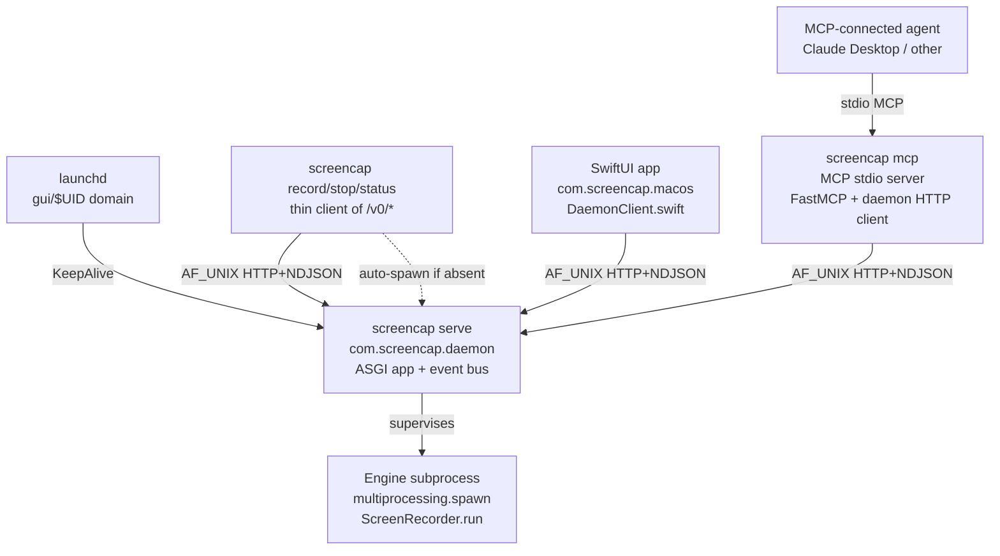
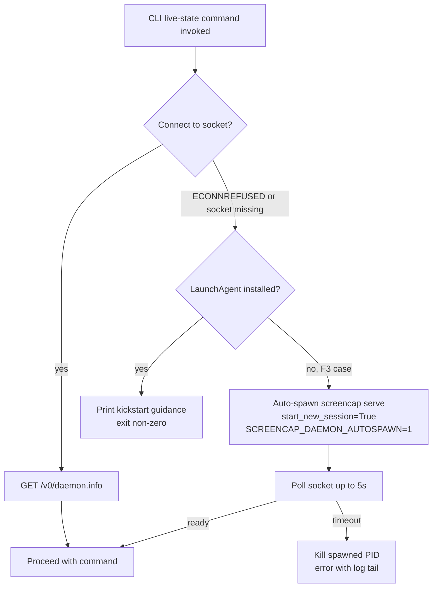
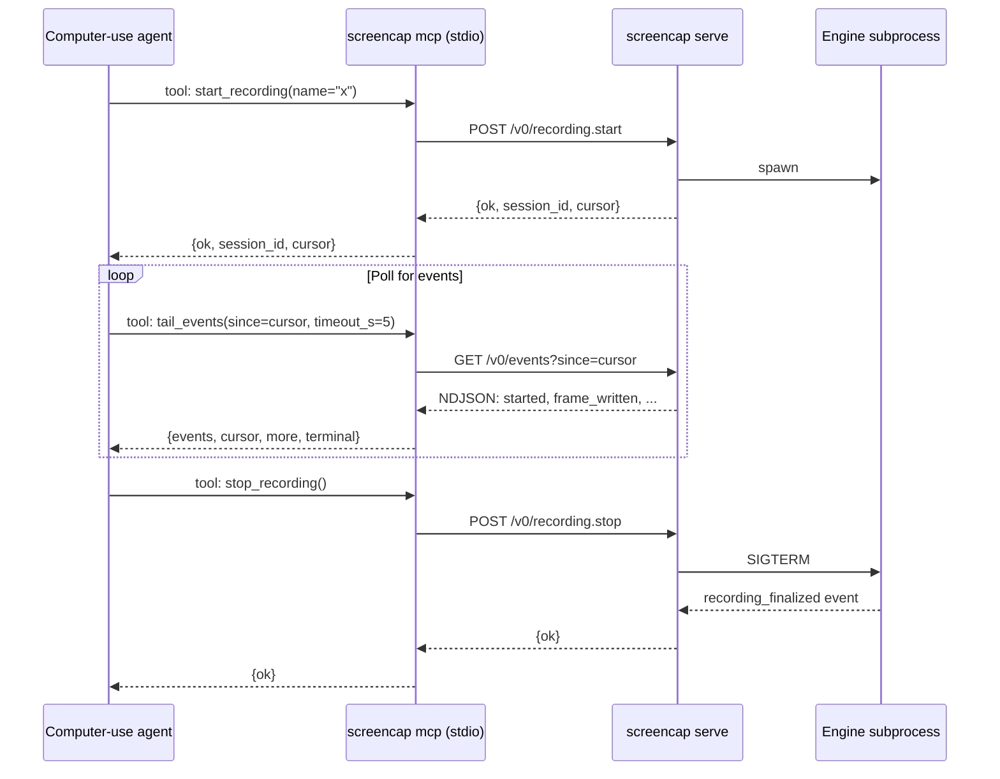

# feat: Daemon architecture — Phase 2 (CLI/MCP consolidation + SwiftUI cleanup)

## Summary

Phase 2 consolidates around the daemon contract Phase 1 established. CLI live-state commands (`record`, `stop`, `status`) become thin clients of `/v0/*`; a new `screencap mcp` subcommand runs an MCP stdio server that translates agent tool calls into daemon HTTP/NDJSON; the caller-supplied `started_by` field is replaced with peer-EPID-derived provenance; and SwiftUI's `CLIClient` fallback paths are deleted now that all surfaces speak the daemon API. Engine topology consolidation (origin R1's literal "engine inside the daemon process" reading) is explicitly **deferred to a separate spike** — Phase 2 closes CLI's spawn path so the daemon is the sole engine spawner, but the launchd→daemon→engine subprocess topology persists.

---

## Problem Frame

Phase 1 stood up the daemon, the API contract, and migrated SwiftUI through `DaemonClient`. The CLI continued to spawn the engine in-process (per Phase 1's R11 reversibility constraint), which means: (a) two engine entry points exist (CLI's in-process and daemon's subprocess); (b) stderr events still leak to SwiftUI's `CLIClient.spawn` fallback path as a transitional safety net; (c) MCP is unrepresented as a third surface. Phase 2 closes those gaps. The strategic outcome — a non-technical operator records via SwiftUI while a computer-use agent observes the same live session via MCP (origin AE1) — becomes reachable for the first time in this phase.

See [origin brainstorm](docs/brainstorms/2026-05-08-cli-gui-mcp-architecture-requirements.md) for the full motivation, actor model, and rejected alternatives.

---

## Requirements

Phase 2 advances these origin requirements (R-IDs preserved):

- R1 (partial). Daemon becomes the **sole live engine spawner**; CLI loses its in-process engine path. The literal "engine inside a single daemon process" reading (engine in-process) is **deferred to a separate spike** — Phase 2 satisfies the spirit (one owner, one entry point) without collapsing the supervisor topology.
- R3. Three independent clients of the daemon API: SwiftUI (Phase 1), CLI (this phase), MCP (this phase).
- R4. Both request/response and persistent NDJSON event-subscription stream are exercised by all three clients.
- R7. MCP server runs as a separate process consuming the same `/v0/*` API.
- R12. Engine ownership consolidates (in scope: ownership, not topology); CLI live-state commands become API clients; MCP server lands. **After this phase, stderr events become an internal implementation detail of the daemon** — no external consumer reads engine stderr.
- R13. Phase 2 ships behind its own release.
- R14. The Phase 1 contract design is validated against three real clients in production.

R5/R8/R9/R10/R11 are Phase 1 deliverables — Phase 2 inherits them unchanged.

**Origin actors:** A1 (CLI power user — primary persona for the auto-spawn fallback), A2 (non-technical GUI operator — beneficiary of cleaner SwiftUI without `CLIClient` cruft), A3 (computer-use agent via MCP — primary persona for the new surface), A4 (ScreenCap engineer — beneficiary of single-engine-owner discipline).

**Origin flows:** F1 (GUI records, agent observes — completes here), F2 (agent starts, GUI joins late — completes here), F3 (CLI power user, no GUI — auto-spawn fallback honors), F4 (first-launch install — Phase 1 delivers; Phase 2 unaffected).

**Origin acceptance examples:** AE1 (GUI + agent see same session — primary acceptance gate of this phase), AE3 (CLI works without GUI — auto-spawn fallback honors), AE4 (CLI and daemon-driven recordings produce equivalent artifacts — preserved tautologically since both paths now go through the daemon), AE5 (engine crash recovery — preserved from Phase 1).

---

## Scope Boundaries

- **Engine topology consolidation** (in-process vs subprocess) — separate spike, tracked externally. Phase 2 does **not** touch the launchd→daemon→engine subprocess shape Phase 1 chose.
- MCP HTTP/SSE transport for remote agents — Phase 2 ships **stdio only**.
- MCP streaming tools (hold-and-push pattern) — not first-class in `mcp` SDK v1.x; revisit when v2 stabilizes.
- Auto-shutdown of LaunchAgent-managed daemons — origin scope boundary holds. Auto-spawned daemons (CLI fallback) get an idle-shutdown timer; LaunchAgent-managed daemons keep "run all day".
- Catalog-only CLI commands routing through the daemon (`list`, `info`, `view`, `export`, `apps`, `transcribe`, `scrub`, `setup`, `update`, `upload`, `download`, settings/network groups) — they stay in-process. Catalog reads are concurrent-safe (read-only `query_only=ON` + `busy_timeout=5000`); routing them through HTTP adds latency without buying anything.
- Distribution decisions (Homebrew tap for headless install, App Store packaging) — adjacent brainstorm.
- Phase 1c U9 entitlement drop — already deferred at SCR-49 in the Phase 1 plan.
- Removing `cli` / `swiftui` claimant strings entirely from `pidfile.py` — they survive as readable historical metadata so old `recording.lock` files don't error.
- A second PyInstaller spec for the MCP binary — same bundle, mode dispatch via Click subcommand (mirrors `screencap serve` precedent from Phase 1).

### Deferred to Follow-Up Work

- **Engine topology spike** — separate ticket explores in-process vs subprocess engine consolidation with measurement (idle CPU/RSS, GIL contention, crash-recovery latency, upgrade-during-recording semantics) before committing to either path. References Phase 1's "Rejected in-process engine" rationale and origin R1's literal reading. Tracked in `docs/tickets/`.
- **MCP HTTP/SSE transport** — when an agent topology emerges that requires non-local transport.
- **Streaming MCP tools** — pending `mcp` SDK v2 first-class streaming primitives. Until then, batch-fetch with cursor (the `tail_events` shape in U4) is the idiomatic Phase 2 design.
- **`screencap view` migration to a daemon verb** — Phase 2 keeps `view --` as a catalog-only passthrough via SwiftUI's `runAwaitingExit`. Migrating to a daemon-routed `recording.open` verb is a small follow-up if the SwiftUI subprocess shell-out becomes load-bearing.
- **Server-validated peer identity as authentication gate** — Phase 2 uses `LOCAL_PEEREPID + proc_pidpath` for *advisory* `started_by` provenance only. Promoting peer-PID to an auth gate (e.g., per-process capability tokens) is a future privacy/security iteration if multi-user contexts emerge.
- **CLI claimant constants migration in old test fixtures** — `tests/test_pidfile_mutex.py`, `tests/test_status_command.py`, `tests/engine/test_lock_policy.py` still use literal `"cli"` strings. Phase 2 introduces constants but leaves test-fixture migration as low-priority cleanup.
- **MCP server idempotency token plumbing** — see Open Questions; settle at U4 implementation time, defer to a follow-up if real agents misbehave in early testing.

---

## Context & Research

### Relevant Code and Patterns

- [src/screencap/cli.py](src/screencap/cli.py) — Click root group; live-state commands at `start` (lines 460-800), `status` (1849-1982), `stop` (1985-2225), and the `_legacy_start_recording` helper (803-973). The `serve` subcommand (126-139) is the mode-dispatch precedent for `mcp`.
- [src/screencap/daemon/](src/screencap/daemon/) — Phase 1 deliverable. `app.py`, `server.py`, `socket.py` already in place; `schema.py`, `errors.py`, `event_bus.py`, `supervisor.py`, `launchagent.py` complete Phase 1's surface.
- [src/screencap/_stderr_events.py](src/screencap/_stderr_events.py) — `emit_event` taxonomy (10 event types, `EVENT_SCHEMA_VERSION=1`). `resolve_claimant()` at line 63 is removed in Phase 2 (CLI no longer claims locks).
- [src/screencap/recorder.py](src/screencap/recorder.py) — `start_recording()` at lines 562-665, the in-process engine entry. Phase 2 narrows callers to `screencap.daemon.supervisor` only.
- [src/screencap/session.py:516](src/screencap/session.py) — `claim_lock(claimant=resolve_claimant())` — first of two production claimant write sites.
- [src/screencap/engine/lock_policy.py:111](src/screencap/engine/lock_policy.py) — second production claimant write site.
- [src/screencap/pidfile.py:212](src/screencap/pidfile.py) — `claim_lock` definition; current default `claimant="cli"`. No constants currently — Phase 2 introduces them.
- [macos/screencap/Controllers/CLIClient.swift](macos/screencap/Controllers/CLIClient.swift) — Phase 1 transitional fallback, Phase 2 deletion target. Public surface: `runJSON<T>` (121-132), `spawn` (261-340), `runDetached` (345-372), `runAwaitingExit` (138-140), `runOneShot` (146-194), `mergedEnv` (381-397), `SpawnedProcess` nested class (36-69).
- [macos/screencap/Controllers/RecorderController.swift](macos/screencap/Controllers/RecorderController.swift) — `claimant` field on `CLIStatus` (line 46) is dead code per research (populated, never read by UI); Phase 2 deletes the typedecl. `handleStderrLine` at lines 354-405 is deleted entirely.
- [macos/screencap/State/RecordingsIndex.swift:63](macos/screencap/State/RecordingsIndex.swift) — uses `CLIClient.runJSON` for `list --json`; should already be migrated in Phase 1 U7. Phase 2 verifies.
- [macos/screencap/Views/RecordingsListView.swift:197](macos/screencap/Views/RecordingsListView.swift) — uses `CLIClient.runAwaitingExit` for `view --` (catalog open). Phase 2 leaves this in place; see Deferred Follow-Up.
- [pyinstaller/screencap.spec](pyinstaller/screencap.spec) — onedir bundle. Phase 2 adds `screencap.mcp` package to collected modules; mode dispatch keeps single binary per origin R2.
- [tests/test_stderr_event_contract.py](tests/test_stderr_event_contract.py) — Golden-shape pinning. After Phase 2, this pins the daemon-internal contract (engine subprocess → supervisor stderr-bridge), not an external surface.

### Institutional Learnings

The seven learnings cited in the [Phase 1 plan](docs/plans/2026-05-08-001-feat-daemon-architecture-phase-1-plan.md) apply unchanged. Phase 2 enters **net-new institutional territory** that doesn't yet have `docs/solutions/` entries — capture as `/ce-compound` entries when units land:

- CLI subprocess-fallback removal discipline (pinning then deleting transitional code paths)
- Daemon auto-spawn TOCTOU between "no daemon running" check and the `posix_spawn` action
- `LOCAL_PEERPID` / `LOCAL_PEEREPID` / `proc_pidpath` race semantics on macOS
- MCP idempotency contracts for agent-driven verbs (if `idempotency_key` lands at U4)
- Single-binary mode dispatch with PyInstaller (cold-start cost across subcommands)
- NDJSON-over-AF_UNIX-HTTP framing in a `httpx`-based Python client (mirror of Phase 1's Swift `NWConnection` lessons)

### External References

- **MCP Python SDK** — [`mcp` 1.27+ on PyPI](https://pypi.org/project/mcp/), Anthropic-maintained at [modelcontextprotocol/python-sdk](https://github.com/modelcontextprotocol/python-sdk). FastMCP is the canonical entry point. Pure-Python on stdio path; can exclude `starlette`, `uvicorn`, `sse-starlette`, `python-multipart` from the install when MCP server doesn't need HTTP transport.
- **MCP local-server registration** — [Claude Desktop config docs](https://modelcontextprotocol.io/docs/develop/connect-local-servers): users edit `~/Library/Application Support/Claude/claude_desktop_config.json`; absolute paths required; Claude Desktop restart on config change.
- **Auto-spawn precedent** — Docker / Tailscale hard-fail without daemon ([tailscale/tailscale#13848](https://github.com/tailscale/tailscale/issues/13848)). Ollama hybrid ([ollama/ollama#1084](https://github.com/ollama/ollama/issues/1084), [ollama/ollama#8341](https://github.com/ollama/ollama/issues/8341)). ScreenCap's auto-spawn is more aggressive — F3 (no GUI installed) requires it.
- **Peer-PID identity on macOS** — `getsockopt(SOL_LOCAL=0, LOCAL_PEERPID=0x002)`, `LOCAL_PEEREPID=0x003` (responsible PID, harder to spoof), `proc_pidpath` from `libproc.dylib`. Reference: [LOCAL_PEERPID-sample](https://github.com/syohex/LOCAL_PEERPID-sample/blob/master/server.c). PIDs are reusable; advisory provenance only.
- **CLI event streaming patterns** — Docker's `docker events` and `docker system events --format '{{json .}}'` use NDJSON; matches Phase 1's `/v0/events` choice.
- **Claude Desktop log paths** — `~/Library/Logs/Claude/mcp.log` and `mcp-server-screencap.log` (stderr capture) are conventional paths.

---

## Key Technical Decisions

- **CLI consolidation: `record` / `stop` / `status` become daemon clients via `DaemonHTTPClient`.** New `src/screencap/cli/_daemon_client.py` provides a small Python HTTP-over-AF_UNIX client (mirrors SwiftUI's `DaemonClient` from Phase 1 U7). `_legacy_start_recording` shrinks to "POST `recording.start`; consume events from `/v0/events?since=cursor` printing them to stderr exactly as today's stderr-stream-to-console behavior; map terminal event to exit code per existing taxonomy." `screencap stop` → `POST /v0/recording.stop`. `screencap status` → `GET /v0/session.snapshot`.

- **CLI auto-spawn fallback for F3.** When CLI runs and the daemon isn't reachable, the CLI checks for an installed LaunchAgent first via `launchctl print gui/$UID/com.screencap.daemon` exit code. If installed → instruct the user to run `launchctl kickstart -kp gui/$UID/com.screencap.daemon` and exit non-zero (do not auto-spawn — would conflict with launchd). If NOT installed (F3 headless case) → CLI auto-spawns `screencap serve` via `os.posix_spawn(start_new_session=True)`, redirects stdout/stderr to `~/.screencap/run/auto-serve.log`, polls the socket up to 5s, then proceeds. **Auto-spawned daemons get a 10-minute idle-shutdown timer** (different from LaunchAgent-managed daemons which "run all day" per origin) — avoids cron-driven `screencap status` invocations leaving permanent zombie daemons. The mode is communicated via env var `SCREENCAP_DAEMON_AUTOSPAWN=1` so the daemon's serve loop can configure the idle timer.

- **MCP server scaffolding: `screencap mcp` subcommand mirrors `screencap serve`.** New Click subcommand near `serve`; defer-imports body; `raise SystemExit(_mcp_run(...))`. Implementation in `src/screencap/mcp/server.py` using `mcp.server.fastmcp.FastMCP`. Stdio transport only (matches Claude Desktop convention). Logs to `~/Library/Logs/ScreenCap/mcp.{out,err}.log` when invoked outside Claude Desktop. PyInstaller spec adds `screencap.mcp` package collection — mode dispatch keeps single binary per origin R2.

- **MCP tool surface: bounded verb set translating to daemon `/v0/*`.** Tools: `list_recordings`, `start_recording`, `stop_recording`, `get_session_snapshot`, `tail_events(since, max=100, timeout_s=5.0)`. The `tail_events` shape is **batch-fetch with cursor**, not streaming — `mcp` SDK v1.x doesn't have first-class streaming tools. Agent calls `tail_events` with the previous response's cursor; tool blocks up to `timeout_s` for new events; returns `{events, cursor, more, terminal}`. Mirrors `kubectl logs --since=...` shape that agents already pattern-match against.

- **Server-derived `started_by` via `LOCAL_PEEREPID + proc_pidpath`.** Replaces caller-supplied `started_by` field on `recording.start`. Daemon resolves peer's effective PID via `getsockopt(SOL_LOCAL, LOCAL_PEEREPID)`, walks to executable path via `proc_pidpath` from `libproc.dylib`, derives a tag (`swiftui` for `*/ScreenCap.app/Contents/MacOS/screencap`, `cli` for direct binary, `mcp` for `screencap mcp` parent, `unknown` otherwise). **Advisory only** — EUID match from Phase 1 stays the auth gate. Caller-supplied `started_by` field is removed from the request schema (breaking change to the Phase 1 contract); SwiftUI's existing `started_by="swiftui-via-daemon"` plumbing in `DaemonClient` becomes obsolete.

- **Stderr events become daemon-internal.** After CLI consolidation, the only consumer of engine stderr is the daemon's supervisor stderr-bridge (Phase 1 U5). `_stderr_events.py` keeps `emit_event` for use by the engine subprocess; the engine still writes line-buffered JSON to stderr. The bus is the only external surface. Tests in `tests/test_stderr_event_contract.py` continue to pin the schema for the daemon-internal contract; they are no longer external-contract tests.

- **Pidfile claimant constants introduced; `daemon` is the sole production writer.** New `CLAIMANT_DAEMON`, `CLAIMANT_CLI`, `CLAIMANT_SWIFTUI` constants in `pidfile.py`. Production code only writes `CLAIMANT_DAEMON` after Phase 2; `cli` and `swiftui` constants stay readable for historical metadata (old `recording.lock` files). `resolve_claimant()` in `_stderr_events.py:63` is removed.

- **SwiftUI `CLIClient` deletion in full.** `runJSON`, `spawn`, `runDetached`, `runOneShot`, `mergedEnv`, `SpawnedProcess` nested class — all deleted. `runAwaitingExit` for `view --` (catalog-open shell-out) **stays** because it's not engine-related and doesn't depend on stderr events. The `claimant` field on `CLIStatus` typedecl is dropped. `another_process_recording` UI state (Phase 1's mixed-mode) is deleted entirely — there's no cross-claimant case after CLI consolidation. `RecorderController.handleStderrLine` is deleted; events flow only via `DaemonClient.subscribe`.

- **API schema version bump on `recording.start` (1 → 2).** Removed required field forces a bump. Both U2 (server) and U5 (client) ship in Phase 2; no skew window in production. Dev environment skew is handled by Phase 1's "reload daemon" UX.

- **Sequencing strategy: U1 is foundation, U6 is keystone.** U1 lands first — once CLI is daemon-driven, the cross-claimant state effectively dies and U5 (SwiftUI cleanup) becomes a deletion exercise. U2 (provenance) lands alongside U1 since it changes the `recording.start` contract. U3-U4 (MCP) can parallelize with U1 — they're additive and don't depend on CLI's transport switch. U6 (AE1 acceptance test) requires all five units shipped.

---

## Open Questions

### Resolved During Planning

- *Engine topology consolidation (in-process vs subprocess).* Resolved: deferred to a separate spike per user direction. Phase 2 closes CLI's spawn path so daemon is the sole live spawner; the launchd→daemon→engine subprocess topology persists.
- *MCP transport.* Resolved: stdio only in Phase 2 per Claude Desktop convention.
- *MCP event subscription shape.* Resolved: batch-fetch tool `tail_events(since, max, timeout_s)` with cursor — SDK v1.x doesn't have first-class streaming tools.
- *Auto-spawn aggressiveness.* Resolved: more aggressive than Docker/Tailscale. F3 requires it. Idle-shutdown timer prevents zombies.
- *`started_by` provenance source.* Resolved: server-derived via `LOCAL_PEEREPID + proc_pidpath`; advisory only; EUID match remains auth gate.
- *MCP server packaging.* Resolved (origin DfP): same PyInstaller bundle as the daemon; mode dispatch via Click subcommand.

### Deferred to Implementation

- **`screencap mcp install` helper command.** Should the binary expose a self-registration helper that writes the Claude Desktop config block? Convenient (mirrors `uv run mcp install server.py`), but writing to `~/Library/Application Support/Claude/claude_desktop_config.json` from a Python process needs config-merge edge-case handling (existing `mcpServers`, malformed JSON, atomic-write semantics). Decide at U3 implementation time. Default: defer to a follow-up; ship the documented manual JSON edit.
- **Idempotency tokens for MCP `start_recording`.** Agents may retry on perceived failure. The daemon's `lock_contended` envelope is informative but doesn't prevent double-recording when the agent's first call succeeded but the response was lost in transit. Decide at U4 implementation time whether to add an `idempotency_key` field (caller-supplied UUID, server-deduplicates within a TTL window) or rely on agent-side discipline.
- **Stale-socket detection in CLI auto-spawn.** What happens if `~/.screencap/run/api.sock` exists but `connect()` returns `ECONNREFUSED`? Phase 1's daemon handles this on its own startup. The CLI's auto-spawn path needs to either: (a) trust the new daemon will clean up after itself, (b) unlink the stale socket before spawning, or (c) fail with a clear error and ask the user to investigate. Pick at U1 implementation time. Default lean: option (a), since Phase 1 U1's stale-socket detection already runs on every daemon startup.
- **Auto-spawn race when two CLI invocations fire simultaneously.** Two `screencap status` calls in parallel both detect "no daemon" and both spawn. Daemon U1's already-running detection catches this — second spawn exits non-zero. The CLI must handle that exit code (treat as "another spawn won the race; retry the connection"). Bound retries to 2 to avoid livelock. Document the discipline at U1 impl time.
- **MCP tool error envelope mapping.** The daemon's `lock_contended` / `not_owned_by_daemon` / `slow_consumer` / `cursor_unknown` envelopes need to map to MCP-friendly error responses. The mapping affects how an agent interprets failure (retry vs surface vs abort). Settle at U4 implementation time; pin shapes with golden-shape tests in `tests/mcp/test_error_mapping.py`.

---

## Output Structure

The plan introduces a new `src/screencap/mcp/` package, a new `tests/mcp/` tree, and a small CLI HTTP client. Per-unit `**Files:**` sections remain authoritative.

    src/screencap/
        cli/
            _daemon_client.py          # Small HTTP-over-AF_UNIX client used by record/stop/status migration
            _autospawn.py              # F3 fallback: detect missing LaunchAgent, posix_spawn screencap serve, idle-shutdown plumbing
        mcp/
            __init__.py                # Public symbols; deferred-import boundary
            server.py                  # FastMCP construction, stdio entry, daemon HTTP client
            tools.py                   # list_recordings, start_recording, stop_recording, get_session_snapshot, tail_events
            errors.py                  # Daemon error envelope -> MCP error response mapping
        daemon/
            provenance.py              # LOCAL_PEEREPID + proc_pidpath -> started_by tag derivation
        pidfile.py                     # MODIFY: add CLAIMANT_* constants

    tests/
        cli/
            test_record_daemon_client.py
            test_stop_daemon_client.py
            test_status_daemon_client.py
            test_autospawn.py
        mcp/
            conftest.py
            test_tool_surface.py
            test_tail_events_cursor.py
            test_error_mapping.py
            test_pyinstaller_smoke.py
        daemon/
            test_provenance.py         # Server-derived started_by tag
        test_ae1_end_to_end.py         # Multi-client integration: SwiftUI + MCP + CLI

    macos/screencap/Controllers/
        CLIClient.swift                # SHRINK to runAwaitingExit-only (or DELETE if view -- migrates)
        RecorderController.swift       # MODIFY: delete handleStderrLine, claimant field, mixed-mode UX state

---

## High-Level Technical Design

> *This illustrates the intended approach and is directional guidance for review, not implementation specification. The implementing agent should treat it as context, not code to reproduce.*

### Surface clients after Phase 2



### CLI auto-spawn decision flow



### MCP tool flow for a typical agent session



### Server-derived `started_by` provenance (conceptual flow)

> *Conceptual flow for review, not implementation spec. Exact ctypes plumbing is implementation territory.*

```
peer connection accepted
  -> getsockopt(SOL_LOCAL, LOCAL_PEEREPID) -> effective PID
  -> proc_pidpath(pid) -> "/Applications/ScreenCap.app/Contents/MacOS/screencap" (e.g.)
  -> classify path:
       ends with /ScreenCap.app/Contents/MacOS/screencap  -> "swiftui"
       parent process is `screencap mcp`                  -> "mcp"
       direct binary, parent shell                        -> "cli"
       else                                               -> "unknown"
  -> attach as started_by on the recording.start request log + recording metadata
```

---

## Implementation Units

> Each unit carries a stable plan-local U-ID. Units are scoped against a Phase 1 deliverable baseline — Phase 2 starts only after Phase 1 U1-U6 (and ideally U7-U8) have shipped.

### Phase 2a — Consolidate around the daemon

#### U1. CLI live-state commands become daemon clients (`record`, `stop`, `status`) + auto-spawn fallback

**Goal:** Migrate `screencap record`, `screencap stop`, `screencap status` from in-process engine spawn (or signal-based stop / lockfile-based status) to thin clients of the daemon API. Add the auto-spawn fallback for F3 (no LaunchAgent installed). After this unit, the CLI never invokes `recorder.start_recording()` directly and never reads `recording.lock` directly.

**Requirements:** R3, R6 (preserved via auto-spawn), R12, F3, AE3, AE4.

**Dependencies:** Phase 1 U1-U6 shipped (daemon runnable; control verbs available; LaunchAgent install path works).

**Files:**
- Create: `src/screencap/cli/_daemon_client.py`, `src/screencap/cli/_autospawn.py`
- Modify: `src/screencap/cli.py` (rewrite `start` / `stop` / `status` command bodies; remove `_legacy_start_recording`)
- Modify: `src/screencap/recorder.py` (`start_recording` becomes daemon-only entry; CLI callers gone)
- Modify: `src/screencap/_stderr_events.py` (remove `resolve_claimant`; engine still emits to stderr for daemon supervisor)
- Modify: `src/screencap/session.py:516` and `src/screencap/engine/lock_policy.py:111` (use `CLAIMANT_DAEMON` constant)
- Modify: `src/screencap/pidfile.py` (add `CLAIMANT_DAEMON` / `CLAIMANT_CLI` / `CLAIMANT_SWIFTUI` constants; default `claim_lock(claimant=...)` arg removed — caller must specify)
- Test: `tests/cli/test_record_daemon_client.py`, `tests/cli/test_stop_daemon_client.py`, `tests/cli/test_status_daemon_client.py`, `tests/cli/test_autospawn.py`

**Approach:**
- `_daemon_client.DaemonHTTPClient` — small AF_UNIX HTTP client using `httpx` (already a transitive dep via Phase 1's ASGI stack) configured with `httpx.HTTPTransport(uds=...)`. Methods: `info()`, `list_recordings()`, `snapshot()`, `start(name, …)`, `stop(force=False)`, `events(since=None, timeout_s=None)` returning an iterator over NDJSON lines. Schema-version pin via `SUPPORTED_API_SCHEMA_VERSION` constant; mismatch surfaces a kickstart guidance message.
- `_autospawn.ensure_daemon_or_spawn()` — connect-probe; if reachable, return. Else check `launchctl print gui/$UID/com.screencap.daemon` exit code: if installed, error with kickstart guidance; if not installed (F3), `os.posix_spawn` `screencap serve` with `start_new_session=True`, redirect stdout/stderr to `~/.screencap/run/auto-serve.log`, set `SCREENCAP_DAEMON_AUTOSPAWN=1` env. Poll socket via exponential backoff up to 5s. On readiness timeout, kill the spawned PID and surface the log tail.
- `screencap record`: call `ensure_daemon_or_spawn()`, `POST /v0/recording.start`, then iterate `GET /v0/events?since=<cursor>` printing each event to stderr (preserves today's CLI UX where `screencap record -- foo` shows live event echo). Map terminal `recording_finalized` event to exit code per existing taxonomy in `_stderr_events.py` (0/1/2/3/4/5). On Ctrl-C, send `POST /v0/recording.stop` (graceful) and continue draining events until `recording_finalized`.
- `screencap stop`: call `ensure_daemon_or_spawn()` (don't auto-spawn just to stop — if no daemon, no recording to stop), `POST /v0/recording.stop` with `force` flag from CLI arg.
- `screencap status`: call `ensure_daemon_or_spawn()`, `GET /v0/session.snapshot`, format output to match today's `screencap status --json` shape (envelope already matches per Phase 1 U3).
- **Daemon side: `SCREENCAP_DAEMON_AUTOSPAWN=1` enables 10-minute idle-shutdown timer.** Reset on each accepted connection or active recording. Daemon exits cleanly on idle expiry; subsequent CLI invocations re-spawn it. LaunchAgent-managed daemons (no env var set) keep the existing run-all-day behavior.
- **Test fixture migration is out of scope** for U1 — `tests/test_pidfile_mutex.py` etc. continue to use literal `"cli"` strings since they test pidfile semantics, not production write paths.

**Execution note:** Land `screencap status` first (read-only; lowest risk). Then `screencap stop` (idempotent). Then `screencap record` (long-running; most surface area). Each as its own commit-sized change so regressions are bisectable.

**Patterns to follow:**
- `cli.py` `serve` subcommand defer-import pattern (lines 126-139).
- `cli.py` `_emit_stop_result` symmetric envelope discipline (lines 2012-2023) for any new error formatting.
- `pidfile._atomic_write_pidfile` (`pidfile.py:478-486`) for any state file writes.
- Phase 1's `getpeereid` + early signal-handler discipline in `daemon/server.py` for the auto-spawn child's startup path.

**Test scenarios:**
- Happy path (`status`): daemon reachable → `GET /v0/session.snapshot` → CLI prints same JSON shape as before transport swap.
- Happy path (`record`): daemon reachable → `POST /v0/recording.start` → CLI streams events to stderr → `recording_finalized` arrives → exit 0.
- Happy path (`record` with Ctrl-C): user sends SIGINT → CLI sends `POST /v0/recording.stop` → continues draining → `recording_finalized(force_stopped=true)` → exit per taxonomy.
- Happy path (`stop`): daemon reachable, recording active → `POST /v0/recording.stop` → exit 0.
- Edge case (auto-spawn, F3): no LaunchAgent installed, no daemon reachable → CLI auto-spawns → polls 5s → daemon ready → command proceeds.
- Edge case (auto-spawn idle shutdown): auto-spawned daemon serves a `status` call → 10 minutes pass with no further activity → daemon exits → next `status` call re-auto-spawns.
- Edge case (LaunchAgent installed but not running): CLI detects via `launchctl print` → errors with kickstart guidance → exits non-zero (does NOT auto-spawn — would conflict with launchd).
- Edge case (auto-spawn race): two `screencap status` calls fire simultaneously → both detect missing daemon → both attempt spawn → second spawn exits non-zero (Phase 1 U1 already-running detection) → second CLI retries connect once (bounded) → succeeds against first spawn's daemon.
- Edge case (auto-spawn timeout): daemon binary missing or fails to start within 5s → CLI kills spawned PID → surfaces log tail from `~/.screencap/run/auto-serve.log` → exits non-zero.
- Edge case (stale socket): socket file exists, `connect()` returns ECONNREFUSED → CLI handles per the implementation-time decision (Open Question above).
- Error path (`record` while another recording active): `POST /v0/recording.start` returns `lock_contended` envelope → CLI prints existing "another recording in progress" UX → exit 4 (matches existing taxonomy).
- Error path (api_schema_version mismatch): daemon advertises a version the CLI doesn't recognize → CLI errors with kickstart guidance.
- Integration (covers AE3): `screencap record -- test` on a machine with no SwiftUI app installed and no LaunchAgent → auto-spawn fires → recording completes → exit 0.
- Integration (covers AE4): CLI-driven and SwiftUI-driven recordings produce equivalent on-disk artifacts (now tautological since both go through the daemon, but worth keeping as a regression test).

**Verification:**
- `screencap record` / `stop` / `status` all work end-to-end against the Phase 1 daemon API.
- `git grep 'recorder.start_recording'` returns hits only in `screencap/daemon/supervisor.py`.
- F3 acceptance: fresh machine without SwiftUI installed, no LaunchAgent, `screencap record -- test` works.

---

#### U2. Server-derived `started_by` provenance via `LOCAL_PEEREPID` + `proc_pidpath`

**Goal:** Replace the caller-supplied `started_by` field on `recording.start` with a server-derived tag based on the peer's effective PID and executable path. Closes the Phase 1 follow-up "Server-supplied `started_by` provenance validation."

**Requirements:** R7 (the second daemon caller is now real, not hypothetical), R14 (contract evolves with discipline).

**Dependencies:** None on Phase 2 (independent of U1; can run in parallel). Depends on Phase 1 U2 (schema envelope) and U5 (control verbs) shipped.

**Files:**
- Create: `src/screencap/daemon/provenance.py`
- Modify: `src/screencap/daemon/app.py` (request handler for `recording.start` derives `started_by` from peer; field removed from request schema)
- Modify: `src/screencap/daemon/schema.py` (remove `started_by` from `RecordingStartRequest`; bump `_RECORDING_START_API_VERSION` from 1 to 2)
- Modify: `macos/screencap/Controllers/DaemonClient.swift` (remove `started_by` plumbing from request body; pin new schema version)
- Modify: `src/screencap/cli/_daemon_client.py` (remove `started_by` from `start()` signature) — coordinates with U1's existence
- Test: `tests/daemon/test_provenance.py`

**Approach:**
- `provenance.derive_started_by(sock_fd) -> str` — uses `ctypes` to call `getsockopt(sock_fd, SOL_LOCAL=0, LOCAL_PEEREPID=0x003, …)` returning the peer's effective PID. Falls back to `LOCAL_PEERPID=0x002` if `LOCAL_PEEREPID` is unavailable on the running macOS. Then `libproc.proc_pidpath(pid, …)` returns the executable path.
- Path classification is a pure function over the resolved path (testable without sockets): `*/ScreenCap.app/Contents/MacOS/screencap` → `swiftui`; parent process matches `screencap mcp` → `mcp`; bare binary path → `cli`; anything else → `unknown`.
- Bump API schema version from 1 to 2 because the request shape changed (removed required field). The envelope is forward-compatible per Phase 1 discipline (unknown fields don't fail), but a removed required field forces the bump. SwiftUI's `DaemonClient` and the new `cli/_daemon_client.py` both pin to the new version.
- **TOCTOU window:** between socket `accept()` and `getsockopt(LOCAL_PEEREPID)`, the peer process could `exec()`. Acceptable for advisory provenance — the EUID match (Phase 1) remains the auth gate. Document in module docstring.

**Patterns to follow:**
- Phase 1 `daemon/socket.py` `getpeereid` ctypes pattern.
- `cli.py` per-endpoint schema-version constant pattern for the bump.

**Test scenarios:**
- Happy path: connection from SwiftUI's bundled binary path → classified as `swiftui`.
- Happy path: connection from bare `screencap record` invocation → classified as `cli`.
- Happy path: connection from `screencap mcp` parent → classified as `mcp`.
- Edge case: peer `exec()`'d between accept and getsockopt → falls through to classification of the new image; documented as expected (advisory only).
- Edge case: `LOCAL_PEEREPID` returns `ENOPROTOOPT` on a hypothetical older macOS → fallback to `LOCAL_PEERPID`.
- Edge case: peer PID dies before `proc_pidpath` is called → returns 0; `started_by="unknown"`.
- Error path: `proc_pidpath` returns a path that doesn't match any classifier → `started_by="unknown"`.
- Integration: `recording.start` request from each surface (SwiftUI, CLI, MCP) results in correct `started_by` in the daemon log + recording metadata.

**Verification:**
- `recording.start` request schema no longer accepts caller-supplied `started_by`.
- API schema version pin updated; old clients (theoretical Phase 1 build of SwiftUI without the bump) get a clean schema-mismatch error.
- Recording metadata reflects the server-derived value.

---

### Phase 2b — New surface: MCP

#### U3. MCP server scaffolding: `screencap mcp` subcommand + FastMCP stdio + daemon HTTP client

**Goal:** Ship a runnable `screencap mcp` Click subcommand that runs a FastMCP stdio server, connects to the daemon socket as an HTTP client, and exposes the MCP protocol handshake. No tools yet — just the host.

**Requirements:** R2 (mode dispatch), R7 (separate process).

**Dependencies:** None on Phase 2 (independent of U1, U2). Depends on Phase 1 U1 (daemon runnable) for the smoke test to be meaningful.

**Files:**
- Create: `src/screencap/mcp/__init__.py`, `src/screencap/mcp/server.py`
- Modify: `src/screencap/cli.py` (add `@cli.command("mcp")` near `serve`; defer all `mcp` imports inside body)
- Modify: `pyproject.toml` (add `mcp>=1.27,<2.0` runtime dep; pin minor version per SDK v2 risk)
- Modify: `pyinstaller/screencap.spec` (add `screencap.mcp` package collection; explicit excludes for `sse-starlette`, `python-multipart` since stdio path doesn't need them. Note: `starlette` and `uvicorn` ship unconditionally because Phase 1's `serve` mode requires them — MCP-stdio gets them for free with no size delta)
- Modify: `cli.py` `_smoke-test` hidden command (add MCP-mode smoke check that imports `screencap.mcp.server` and constructs the FastMCP instance without starting stdio)
- Test: `tests/mcp/conftest.py`, `tests/mcp/test_pyinstaller_smoke.py`

**Approach:**
- `mcp` Click subcommand mirrors `serve` exactly: defer-imports body, `raise SystemExit(_mcp_run(...))`. Hidden subflags: `--self-test` (smoke check), `--socket <path>` (override daemon socket for tests).
- `mcp/server.py` constructs a `FastMCP("screencap")` instance and an `httpx.AsyncClient(transport=httpx.AsyncHTTPTransport(uds=...))` configured against `~/.screencap/run/api.sock`. Tools registered in U4. `mcp.run()` starts the stdio loop.
- **Logs go to stderr exclusively** per MCP convention (stdout is the JSON-RPC channel). Redirect to `~/Library/Logs/ScreenCap/mcp.{out,err}.log` when invoked outside Claude Desktop (which captures stderr to its own log dir at `~/Library/Logs/Claude/mcp-server-screencap.log`).
- **Daemon connection lazy-init:** `httpx.AsyncClient` is created once on first tool call, not at server import time. Avoids cold-start cost when `--help` or `--self-test` runs.
- PyInstaller spec excludes for the MCP-stdio path: `sse-starlette`, `python-multipart` (only pulled in by HTTP transport, which we don't ship). `starlette` and `uvicorn` ride along because Phase 1's `serve` mode requires them — MCP-stdio gets them at no incremental bundle cost. `pydantic-core` (Rust) and `cryptography` (only via `pyjwt[crypto]`) ship prebuilt wheels for both macOS arches.
- Smoke-test extension: existing `_smoke-test` validates 9 critical subsystems (Phase 1 U6 added a 10th for daemon-mode). Add an 11th: import `screencap.mcp.server`, construct `FastMCP("test")`, do not start stdio. Catches PyInstaller bundling regressions for the MCP path.

**Execution note:** Defer the `mcp` import inside the Click command body (per `cli.py` `--help` fast-path discipline). The `mcp` package's import cost is non-trivial because `pydantic` is heavy.

**Patterns to follow:**
- `cli.py` `serve` subcommand structure (lines 126-139).
- `daemon/server.py` early-handler buffer pattern from Phase 1 U1 — applies to MCP too because `mcp.run()` installs its own SIGINT handler.
- `_smoke-test` extension pattern from Phase 1 U6.

**Test scenarios:**
- Happy path: `screencap mcp --self-test` exits 0 within 5s.
- Happy path: `screencap --help` runtime is unchanged after adding the `mcp` subcommand (verifies defer-imports discipline).
- Edge case: `mcp` SDK import error in frozen binary → smoke test catches it before users do.
- Edge case: daemon socket missing when MCP starts → MCP starts cleanly; first tool call returns daemon-unreachable error.
- Integration: MCP subcommand can be registered in a test `claude_desktop_config.json` and respond to a `tools/list` JSON-RPC call.

**Verification:**
- `screencap mcp --self-test` exits 0.
- `screencap --help` lists `mcp` subcommand and remains responsive.
- PyInstaller frozen binary smoke test covers MCP path.

---

#### U4. MCP tool surface: `list_recordings`, `start_recording`, `stop_recording`, `get_session_snapshot`, `tail_events`

**Goal:** Implement the five MCP tools that translate agent calls into daemon HTTP/NDJSON. Includes cursor-based event polling via `tail_events`.

**Requirements:** R3, R7, R14, AE1.

**Dependencies:** U3.

**Files:**
- Create: `src/screencap/mcp/tools.py`, `src/screencap/mcp/errors.py`
- Modify: `src/screencap/mcp/server.py` (register tools)
- Test: `tests/mcp/test_tool_surface.py`, `tests/mcp/test_tail_events_cursor.py`, `tests/mcp/test_error_mapping.py`

**Approach:**
- Tools registered via `@mcp.tool()` decorator on async functions. Tool docstrings are agent-facing (they go directly into the JSON Schema the agent sees) — write them as agent instructions ("Start a screen recording. Returns the session_id and a cursor for subsequent tail_events calls. Errors with `lock_contended` if a recording is already active.").
- `list_recordings()` → `GET /v0/recording.list`; returns recording summaries.
- `start_recording(name, ...)` → `POST /v0/recording.start`; returns `{ok, session_id, started_at, cursor}`. The cursor is the late-join boundary the agent uses for `tail_events`.
- `stop_recording(force=False)` → `POST /v0/recording.stop`.
- `get_session_snapshot()` → `GET /v0/session.snapshot`; returns current state + cursor.
- `tail_events(since, max=100, timeout_s=5.0)` → `GET /v0/events?since=<cursor>` with a server-side max-wait timeout. Tool consumes NDJSON until `max` events received, `timeout_s` elapses, or the daemon emits a terminal event (`recording_finalized`). Returns `{events, cursor, more, terminal}`.
- **Error mapping (`mcp/errors.py`):** daemon's `lock_contended`, `not_owned_by_daemon`, `slow_consumer`, `schema_mismatch`, `cursor_unknown` map to MCP tool error responses with the original error code preserved as `error.code` and a human-readable message. Pin shapes with golden tests.
- **Idempotency (Open Question — settle at impl):** if `start_recording` is retried, the second call sees the active recording and returns `lock_contended`. Agent retries via the `LockContended.owner` shape. Decide at impl whether to add `idempotency_key` server-side dedup.

**Execution note:** Land `list_recordings` and `get_session_snapshot` first (read-only, lowest risk for agents). Then `tail_events` (most novel shape). Then `start_recording` / `stop_recording` (state-changing).

**Patterns to follow:**
- FastMCP `@mcp.tool()` decorator from external research.
- Daemon's per-endpoint schema-version envelope from Phase 1 U2 — preserve in tool responses.
- `_stderr_events.py` event-type docstring discipline for the `tail_events` tool docstring (agent-facing, structured comments).

**Test scenarios:**
- Happy path: `start_recording("test")` returns `{ok, session_id, cursor}`; `tail_events(since=cursor)` returns events as they're emitted; `stop_recording()` returns `{ok}`.
- Happy path: `tail_events` with `timeout_s=5` and no events → returns `{events: [], cursor: <unchanged>, more: false}` after 5s.
- Happy path: `tail_events` with `max=10` and 50 events available → returns 10 events plus `more: true` and updated cursor.
- Happy path: `tail_events` blocks until a terminal event arrives → returns `{events: [..., recording_finalized], terminal: true}`.
- Edge case: `tail_events` with `since=0` (oldest) when daemon has no event history → returns `cursor_unknown` mapped to MCP error.
- Edge case: `tail_events` while no recording is active → returns `{events: [], cursor: 0, more: false, terminal: false}` (does not block; no events possible).
- Edge case: `start_recording` while another recording is active → daemon returns `lock_contended` → MCP tool returns error with the `LockContended.owner` payload preserved.
- Edge case: daemon socket unreachable (auto-spawn doesn't apply for MCP — agent expects daemon present) → tool errors with "ScreenCap daemon not running" guidance.
- Edge case: `stop_recording` when no recording active → daemon returns `not_owned_by_daemon` (no daemon-claimant lock) → MCP tool returns error.
- Error path: malformed NDJSON in event stream → tool logs warning, skips event, continues.
- Error path: API schema mismatch between MCP and daemon → tool errors clearly; user instructed to update.
- Integration (covers AE1, partial — full E2E in U6): MCP client subscribes via `tail_events` while SwiftUI starts a recording → MCP receives the same `started` / `frame_written` / `recording_finalized` events SwiftUI's `DaemonClient` receives.

**Verification:**
- All five tools work end-to-end against a running daemon.
- Tool docstrings render correctly in `tools/list` JSON-RPC response.
- Error envelope mapping pinned with golden-shape tests.

---

### Phase 2c — Remove transitional code, validate end-to-end

#### U5. SwiftUI cleanup: delete `CLIClient` fallback paths + mixed-mode UX state

**Goal:** Remove the `CLIClient` transitional safety net Phase 1 kept. After this unit, the SwiftUI app speaks only to the daemon API; stderr-event parsing is gone; the cross-claimant ("CLI is recording") UX state is deleted because there's no longer a state to be in (CLI consolidated in U1).

**Requirements:** R3 (single-client discipline), R12.

**Dependencies:** U1 (must ship first — once CLI is daemon-driven, the cross-claimant case can never arise) and Phase 1 U7 (DaemonClient must be the active transport for SwiftUI).

**Files:**
- Modify (shrink): `macos/screencap/Controllers/CLIClient.swift` (keep `runAwaitingExit` + its dependency closure: `resolveBinary`, `runOneShot`, `mergedEnv`, `readAllInBackground`, `raceExitAgainstTimeout`, `waitForExit`, the `CLIError` enum. Delete: `runJSON`, `spawn`, `runDetached`, `SpawnedProcess` nested class, `LineBuffer`)
- Modify: `macos/screencap/Controllers/RecorderController.swift` (delete `handleStderrLine` lines 354-405; delete `claimant` field on `CLIStatus` line 46 and CodingKeys line 58; delete `another_process_recording` UI state + the polling logic; remove `SUPPORTED_EVENT_SCHEMA_VERSION` since stderr events are gone)
- Modify (verify): `macos/screencap/State/RecordingsIndex.swift:63` — should already use `DaemonClient.list()` from Phase 1 U7; verify and assert.
- Modify: `macos/screencap/Controllers/DaemonClient.swift` (remove the schema-mismatch comment about `CLIClient` fallback; the CLI fallback path is gone)
- Test: extend `macos/ScreenCapTests/RecorderControllerTests.swift` (negative tests — assert deleted code paths can't fire)

**Approach:**
- Audit phase: grep for all `CLIClient` references in `macos/screencap/`. Per research, the references to delete are: `RecorderController.swift:150` (uses `spawn`), `RecorderController.swift:251` (uses `runDetached`), and any leftover `runJSON` callers if Phase 1 U7's migration left strays. The reference to KEEP is `RecordingsListView.swift:197` (uses `runAwaitingExit` for `view --`).
- Delete `spawn`, `runDetached`, `runOneShot`, `mergedEnv`, `SpawnedProcess`, `runJSON` from `CLIClient.swift`. Keep `resolveBinary()` (used by `runAwaitingExit`) and `runAwaitingExit` itself (catalog-open shell-out).
- Delete `RecorderController.handleStderrLine` and the wiring that calls it. Events flow only via `DaemonClient.subscribe`.
- Delete the `claimant` field on `CLIStatus`, `CodingKeys.claimant`, and the dead `lock_contended` default-case comment at line 401.
- Delete the `another_process_recording` UI state from `RecordingState` enum and the 2s polling logic that detected lock-release.
- Delete `SUPPORTED_EVENT_SCHEMA_VERSION` constant — stderr events are no longer consumed.

**Execution note:** Deletion-heavy unit. Run the SwiftUI build + test lane after each deletion sub-step to catch removed-symbol cascade. Don't batch — incremental deletions surface broken assumptions earlier.

**Patterns to follow:**
- Phase 1 U7's `DaemonClient` migration discipline (preserve event handler shape across transport).
- The `runAwaitingExit` use case for `view --` is the only legitimate subprocess shell-out remaining; document that in the file's top comment so future contributors don't re-introduce subprocess transport.

**Test scenarios:**
- Happy path: behavioral parity with Phase 1 U7 — recording start/stop/status/list all work, only via `DaemonClient`.
- Negative test: `CLIClient.spawn` is not callable from any code path — compile error if anyone re-introduces it.
- Negative test: `RecorderController.handleStderrLine` is not in the codebase — compile error if anyone re-adds.
- Edge case: `view --` (catalog open) still works via `runAwaitingExit`. Subprocess shell-out for catalog viewing is intentional and documented.
- Integration: full SwiftUI build + run; record a session; verify no subprocess spawned by SwiftUI for engine work.

**Verification:**
- `grep -r 'CLIClient.spawn\|CLIClient.runJSON\|CLIClient.runDetached' macos/` returns zero hits.
- `grep -r 'handleStderrLine\|SUPPORTED_EVENT_SCHEMA_VERSION\|another_process_recording' macos/` returns zero hits.
- SwiftUI app records a session end-to-end without spawning any subprocess except when user invokes `view --` for catalog open.

---

#### U6. End-to-end AE1 acceptance test: GUI + MCP + same session

**Goal:** Validate the headline acceptance criterion. A test harness drives SwiftUI (via `osascript` shim), an MCP client (via `mcp` SDK in client mode), and CLI status, starts a recording from one surface, observes the live event stream from the others, and asserts they see the same `session_id` and equivalent event sequences.

**Requirements:** AE1 (R3, R4, R7).

**Dependencies:** U1, U2, U3, U4, U5.

**Files:**
- Create: `tests/test_ae1_end_to_end.py`, `tests/fixtures/mcp_client_harness.py`, `tests/fixtures/swiftui_driver.py` (`osascript` shim)
- Modify: test runner config (new `make test-ae1` target — runs only on macOS, requires daemon + SwiftUI app installed)

**Approach:**
- Test scenario 1 (F1: GUI starts, agent observes): start daemon → launch SwiftUI app via `osascript` → SwiftUI records via `DaemonClient.start()` → MCP client connects in parallel → MCP `tail_events(since=0)` → assert `started` event received with same `session_id` SwiftUI shows in its banner.
- Test scenario 2 (F2: agent starts, GUI joins late): start daemon → MCP client `start_recording("test")` → daemon-driven recording running → launch SwiftUI app → SwiftUI's first `session.snapshot` shows daemon-claimant active session → SwiftUI subscribes to events with snapshot's cursor → both surfaces see the same `frame_written` events.
- Test scenario 3 (CLI joins as third client): start daemon → MCP starts recording → CLI runs `screencap status` → output shows daemon-claimant active session matching MCP's `session_id`.
- **Test orchestration:** `tests/test_ae1_end_to_end.py` is a Python pytest using `subprocess.Popen` for the daemon and MCP client, `osascript` for SwiftUI driving, and `httpx.AsyncClient` for direct daemon poking when needed.
- **AppleScript driving** is brittle but acceptable for an acceptance test that runs nightly, not on every PR. Tag with `@pytest.mark.acceptance` and exclude from default `pytest tests/`.
- **Test parity surface:** assert that the `started` event timestamp, `session_id`, and `frame_written` count match across all three observers (SwiftUI, MCP, CLI status).

**Execution note:** Smoke test, not a fuzzed integration test. Run nightly in CI; failures gate releases. Skip in local dev unless explicitly invoked via `make test-ae1`.

**Patterns to follow:**
- Phase 1 U5's MCP-shaped acceptance script (`scripts/mcp_contract_smoke.py`) — Phase 2's E2E test extends it with a real MCP client and SwiftUI driving.
- Existing `tests/test_recording_integration.py` for end-to-end test orchestration discipline.

**Test scenarios:**
- Covers AE1: F1 (SwiftUI starts, MCP observes) — both see same `session_id` and event sequence.
- Covers AE1: F2 (MCP starts, SwiftUI joins late) — late-join via cursor reconciles to same session.
- Three-client integration: SwiftUI + MCP + CLI status all reflect the same daemon-claimant state.
- Edge case: MCP client disconnects mid-recording → SwiftUI continues normally; MCP reconnects via `tail_events(since=last_cursor)` → resumes seeing events.
- Edge case: SwiftUI app quit mid-recording → daemon-driven recording continues; MCP keeps streaming events.
- Edge case: daemon SIGTERM during recording → all three clients see drain-to-EOF cleanly; `recording_finalized(force_stopped=true)` event delivered to all.

**Verification:**
- `make test-ae1` passes on macOS with daemon + SwiftUI installed.
- AE1 strategic outcome verified end-to-end for the first time.

---

## System-Wide Impact

- **Interaction graph:** Three independent clients of the daemon API (SwiftUI, CLI, MCP). The daemon is the only process that spawns the engine subprocess. CLI no longer spawns the engine; SwiftUI no longer spawns CLI subprocess for engine work. MCP is a brand-new process invoked by external agents (Claude Desktop, etc.) via stdio.
- **Error propagation:** Daemon API errors propagate via Phase 1's symmetric envelope to all three clients. MCP-specific error mapping (`mcp/errors.py`) translates daemon error codes to MCP tool error responses while preserving the original code as `error.code`. CLI errors are formatted using existing `cli.py` discipline. Agent-facing tool docstrings document expected error codes so the agent can pattern-match.
- **State lifecycle risks:** Auto-spawn TOCTOU between "daemon not running" check and `posix_spawn` — mitigated by Phase 1 U1's already-running detection (second spawn exits non-zero) plus bounded retry on the CLI side. Auto-spawned daemons accumulating zombies — mitigated by 10-minute idle-shutdown timer keyed on `SCREENCAP_DAEMON_AUTOSPAWN=1`. Stale `~/.screencap/run/auto-serve.log` accumulation — log rotation deferred to operational follow-up. Server-derived `started_by` TOCTOU between accept and getsockopt — accepted as advisory-only; auth gate is EUID match.
- **API surface parity:** `recording.start` request schema bumps from API version 1 to 2 (removed `started_by` field). All three clients pin the new version. Old Phase 1 SwiftUI builds get a clean schema-mismatch error and the kickstart UI from Phase 1 U7 fires.
- **Integration coverage:** AE1 end-to-end test (U6) is the keystone integration. AE3 (CLI without GUI) is exercised by U1's auto-spawn test. AE4 (CLI and daemon-driven recordings produce equivalent artifacts) is now tautological since both paths go through the daemon — preserved as a regression check.
- **Unchanged invariants:** Phase 1's `/v0/*` envelope shape is preserved (only `recording.start` request schema changed). Engine subprocess supervision (Phase 1 U5) is unchanged. Pidfile flock + JSON metadata semantics are unchanged. SwiftUI's `RecorderEventLine` decode shape is preserved. Recording artifacts on disk are byte-equivalent to Phase 1 daemon-driven recordings. Catalog SQLite schema is unchanged. PyInstaller bundle structure is additive only (`screencap.mcp` package collected; nothing removed).

---

## Risks & Dependencies

| Risk | Likelihood | Impact | Mitigation |
|------|-----------|--------|------------|
| `mcp` SDK v1 → v2 breaking change before Phase 2 ships | Medium | Medium | Pin `mcp>=1.27,<2.0` in `pyproject.toml`; defer v2 evaluation to a post-ship spike. v2 is in pre-alpha as of 2026-05; v1.x is the stable line. |
| MCP stdio server has subtle interactions with `multiprocessing.spawn` mode (engine workers re-import) | Medium | High | `screencap mcp` runs as its own process tree; engine workers are spawned by the daemon, not by MCP. No cross-process interaction. Verify with smoke test in U3. |
| Auto-spawn race produces zombie daemons in CI / test environments | Medium | Medium | Idle-shutdown timer (10 min) on `SCREENCAP_DAEMON_AUTOSPAWN=1` daemons. CI tests explicitly clean up via `screencap serve --uninstall` or `pkill -f 'screencap serve'` in teardown. |
| Server-derived `started_by` misclassifies developer-build paths | Medium | Low | Classification falls through to `unknown` for unrecognized paths. Advisory only; doesn't gate any behavior. Log unknown paths for diagnosis. |
| API schema version bump breaks unupgraded Phase 1 SwiftUI builds | Low (Phase 2 ships SwiftUI cleanup in same release) | Low | Both U2 (server) and U5 (client) ship in Phase 2; no version skew window in production. Dev environment skew is handled by Phase 1's "reload daemon" UX. |
| `screencap mcp` subcommand cold-start is slow due to `mcp` SDK + `pydantic-core` import cost | Medium | Low | Defer-imports inside Click body keeps `screencap --help` fast. Cold-start cost only paid on actual `screencap mcp` invocation. Measure during U3 development; if >2s, investigate `mcp` SDK lazy-import. |
| Agents retry `start_recording` on perceived failure, accidentally double-recording | Medium | Medium | `lock_contended` envelope returned on second attempt; agent-side retry should pattern-match. Idempotency token is an Open Question — settle at U4 if real agents misbehave in early testing. |
| MCP tool docstrings drift from daemon API contract over time | Low (early in MCP life) | Low | Pin tool docstrings via golden-shape tests in `tests/mcp/test_tool_surface.py`. Forces explicit acknowledgment of contract changes. |
| Deletion of `CLIClient` orphans test fixtures referencing it | Medium | Low | Audit step in U5: grep for `CLIClient` references in tests; either delete or migrate to `DaemonClient` mocks. |
| `runAwaitingExit` for `view --` shell-out becomes load-bearing UX | Low | Low | Documented as legitimate subprocess case. Future deferred follow-up migrates to a `recording.open` daemon verb if needed. |
| Phase 1 not yet shipped when Phase 2 starts | Confirmed (Phase 1 in flight) | Strategic | Phase 2 dependencies explicitly require Phase 1 U1-U6 (Phase 1a) and ideally U7-U8 (Phase 1b). Phase 2 starts only after Phase 1a ships. Phase 2c (U5) requires Phase 1b's `DaemonClient` migration to be complete. |

### Dependencies / Prerequisites

- **Phase 1 (U1-U8) shipped.** Phase 2a (U1, U2) requires Phase 1a (U1-U6); Phase 2c (U5) requires Phase 1b (U7-U8).
- `mcp>=1.27,<2.0` from PyPI — pure-Python on stdio path, includes `pydantic-core` (Rust, prebuilt wheels for both macOS arches). Add to `pyproject.toml` runtime deps.
- macOS 13+ deployment floor — unchanged from Phase 1.
- Engine topology spike ticket created in `docs/tickets/` — separate work; doesn't block Phase 2 ship.

---

## Alternative Approaches Considered

- **Engine in-process consolidation.** Considered as the literal reading of origin R1. Rejected for Phase 2 by user direction — every engine SEGV would drop the API, upgrade-during-recording would become impossible, and the supervisor topology Phase 1 deliberately chose would be reverted. Tracked as a separate spike for measurement-driven decision (idle CPU/RSS, GIL contention, crash-recovery latency).
- **MCP server embedded in the daemon.** Considered. Rejected per origin Key Decision: keeps the daemon free of MCP library coupling, lets the MCP surface be replaced or run remotely without touching the engine. Mirrors Ollama's pattern.
- **MCP HTTP/SSE transport from day one.** Considered. Deferred to follow-up. Stdio is the canonical local transport for Claude Desktop in 2026; HTTP/SSE adds remote-agent topology complexity that has no immediate consumer.
- **Streaming MCP tools (hold-and-push).** Considered. Not first-class in `mcp` SDK v1.x. Batch-fetch with cursor is the idiomatic shape and matches `kubectl logs --since=...` patterns agents already pattern-match against.
- **CLI hard-fail when daemon not running** (Docker / Tailscale norm). Considered. Rejected because F3 (CLI works without GUI installed, no LaunchAgent) is an explicit origin requirement. ScreenCap's auto-spawn is more aggressive than industry norm; the idle-shutdown timer is the mitigation for the zombie-daemon concern.
- **Server-validated peer identity as auth gate.** Considered. Rejected for v1 because EUID match is sufficient for same-user authorization (origin Scope Boundary: "filesystem permissions are the authorization surface"). Promoting peer-PID to auth would require addressing PID reuse / TOCTOU and would block on a credential model not yet designed.
- **Removing `cli` and `swiftui` claimant strings entirely.** Considered. Rejected because old `recording.lock` files written by Phase 1 daemon (or the pre-daemon CLI) would error if the daemon couldn't read those values back. Historical metadata stays readable; only production write paths use `CLAIMANT_DAEMON`.

---

## Success Metrics

- **AE1 strategic outcome:** GUI + MCP agent simultaneously observe the same recording session — verified by U6 acceptance test.
- **AE3:** CLI works on a fresh machine with no SwiftUI app installed — verified by U1 auto-spawn integration test.
- **Single engine entry point:** `git grep 'recorder.start_recording'` returns hits only in `screencap/daemon/supervisor.py` (the daemon-driven engine spawn path).
- **Single transport in SwiftUI:** SwiftUI app records a session without spawning any subprocess except the documented `view --` catalog-open case.
- **Stderr events have no external consumer:** the only callers of `_stderr_events.emit_event` are engine modules (daemon-internal); the only reader of engine stderr is the daemon supervisor.
- **MCP server cold-start cost measured during U3 development;** if >2s on the frozen binary, treat as revisit-the-stack signal before U4 ships.
- **Phase 3 plan (engine consolidation spike) does not need to re-litigate the API contract** — Phase 2's three independent clients (SwiftUI, CLI, MCP) provide three real consumers' worth of contract validation.

---

## Phased Delivery

### Phase 2a — CLI consolidation + provenance

- U1, U2.
- Independently testable: install daemon (Phase 1 U6), exercise CLI commands, verify they hit `/v0/*`. Verify `started_by` provenance via daemon log inspection.
- **Reversible:** revert U1 + U2 → CLI returns to in-process engine spawn; SwiftUI keeps Phase 1's `DaemonClient`. No data loss.

### Phase 2b — MCP surface

- U3, U4.
- Independently testable: register `screencap mcp` in Claude Desktop config, exercise tools from a real agent (or `mcp` SDK client harness).
- **Reversible:** delete `screencap.mcp` package; revert `pyproject.toml` and PyInstaller spec changes. No external dependencies on MCP yet (it's brand-new); rollback is clean.

### Phase 2c — SwiftUI cleanup + AE1 validation

- U5, U6.
- Depends on 2a + 2b shipped.
- **Reversible:** revert U5 → `CLIClient` reintroduced; U6 test gets skipped. SwiftUI continues working over `DaemonClient`; the cleanup is forward-only in spirit but technically reversible.

---

## Documentation Plan

- README: add an "MCP integration" section — what `screencap mcp` does, how to register it in Claude Desktop, expected agent UX.
- `macos/README.md`: note that `CLIClient` is gone (except for `view --`); all SwiftUI ↔ engine traffic goes through `DaemonClient`.
- `CLAUDE.md`: extend Project Overview to describe the MCP server process; document the auto-spawn fallback path.
- New `docs/solutions/` entries to capture once Phase 2 ships:
  - CLI subprocess-fallback removal discipline (pinning then deleting transitional code paths).
  - Daemon auto-spawn TOCTOU and idle-shutdown timer pattern.
  - `LOCAL_PEERPID` / `LOCAL_PEEREPID` / `proc_pidpath` race semantics on macOS.
  - Single-binary mode dispatch with PyInstaller (cold-start cost across subcommands).
  - MCP idempotency contract for agent-driven verbs (if `idempotency_key` lands).
- Release notes:
  - User-facing: "ScreenCap now supports computer-use agents via MCP. Register the binary in Claude Desktop's config to enable."
  - User-facing: "CLI commands (`screencap record`, `stop`, `status`) now use the background helper. If you don't have the helper installed, the CLI starts one automatically and shuts it down after 10 minutes of inactivity."
  - Breaking change note: "The `started_by` field on the daemon's `recording.start` API is now server-derived and no longer accepts caller-supplied values. Direct API consumers should drop the field from their requests."

---

## Operational / Rollout Notes

- **MCP server logs:** `~/Library/Logs/ScreenCap/mcp.{out,err}.log` (when invoked outside Claude Desktop) or `~/Library/Logs/Claude/mcp-server-screencap.log` (when Claude Desktop captures stderr).
- **Auto-spawn diagnostic:** `~/.screencap/run/auto-serve.log` shows recent CLI-spawned daemon lifecycles. Idle-shutdown is logged.
- **Claude Desktop config example** for users:
  ```json
  {
    "mcpServers": {
      "screencap": {
        "command": "/Applications/ScreenCap.app/Contents/MacOS/screencap",
        "args": ["mcp"]
      }
    }
  }
  ```
  Absolute path required; restart Claude Desktop after config changes.
- **Force-restart MCP server:** quit and restart Claude Desktop (no other path; MCP servers are spawned fresh by Claude Desktop on each session).
- **Rollback plan:** Phase 2a is reversible (CLI returns to in-process). Phase 2b is reversible (MCP package deleted). Phase 2c (SwiftUI cleanup) is forward-only in practice but technically reversible to Phase 1 U7's state.
- **Monitoring during early life:** surface MCP-tool-call counts, auto-spawn frequency, and `started_by` classification distribution in a `screencap _daemon-stats` debug subcommand (extends the placeholder from Phase 1 operational notes).

---

## Sources & References

- **Origin document:** [docs/brainstorms/2026-05-08-cli-gui-mcp-architecture-requirements.md](docs/brainstorms/2026-05-08-cli-gui-mcp-architecture-requirements.md)
- **Phase 1 plan:** [docs/plans/2026-05-08-001-feat-daemon-architecture-phase-1-plan.md](docs/plans/2026-05-08-001-feat-daemon-architecture-phase-1-plan.md)
- **Strategy:** [STRATEGY.md](STRATEGY.md) — UX & native experience load-bearing this quarter; MCP near-term commitment.
- Relevant code anchors: [src/screencap/cli.py](src/screencap/cli.py), [src/screencap/daemon/](src/screencap/daemon/), [src/screencap/_stderr_events.py](src/screencap/_stderr_events.py), [src/screencap/pidfile.py](src/screencap/pidfile.py), [macos/screencap/Controllers/CLIClient.swift](macos/screencap/Controllers/CLIClient.swift), [macos/screencap/Controllers/RecorderController.swift](macos/screencap/Controllers/RecorderController.swift).
- **MCP Python SDK:** [`mcp` on PyPI](https://pypi.org/project/mcp/), [modelcontextprotocol/python-sdk](https://github.com/modelcontextprotocol/python-sdk), [Build a server guide](https://modelcontextprotocol.io/docs/develop/build-server), [Claude Desktop quickstart](https://modelcontextprotocol.io/docs/develop/connect-local-servers).
- **Auto-spawn precedent:** [tailscale/tailscale#13848](https://github.com/tailscale/tailscale/issues/13848), [ollama/ollama#1084](https://github.com/ollama/ollama/issues/1084), [docker system events](https://docs.docker.com/reference/cli/docker/system/events/).
- **macOS peer identity:** [LOCAL_PEERPID-sample](https://github.com/syohex/LOCAL_PEERPID-sample/blob/master/server.c), [libvirt LOCAL_PEERPID patch](https://libvir-list.redhat.narkive.com/D1TrTAGb/libvirt-patch-rpc-retrieve-peer-pid-via-new-getsockopt-for-mac).
- Institutional learnings (Phase 1 cited): [docs/solutions/integration-issues/macos-foundation-process-pipe-pitfalls.md](docs/solutions/integration-issues/macos-foundation-process-pipe-pitfalls.md), [docs/solutions/runtime-errors/macos-tcc-per-process-cache-quit-and-relaunch.md](docs/solutions/runtime-errors/macos-tcc-per-process-cache-quit-and-relaunch.md), [docs/solutions/runtime-errors/sigint-handler-timing-and-recording-stop-methods.md](docs/solutions/runtime-errors/sigint-handler-timing-and-recording-stop-methods.md).
