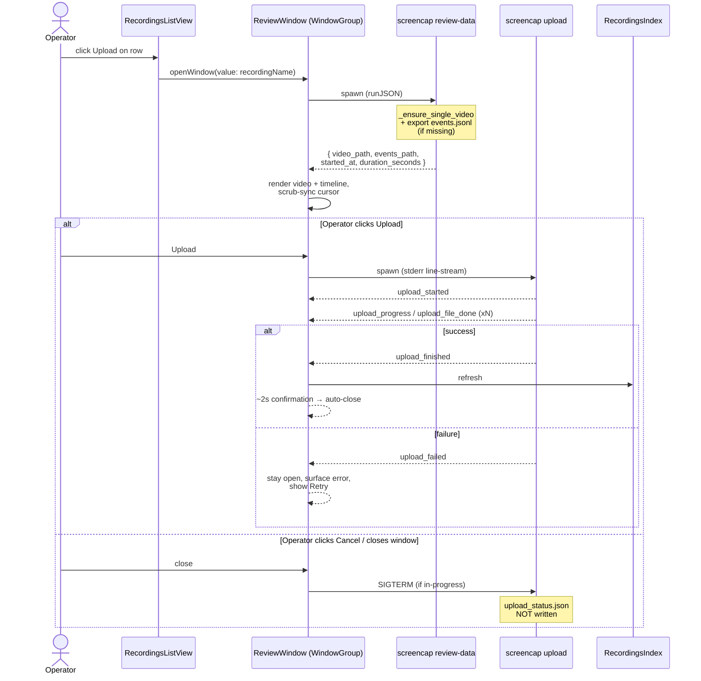

# feat: Pre-Upload Review Screen in the macOS Shell

## Summary

Add a per-recording `WindowGroup` review scene to the SwiftUI shell, drive prepare-and-play via a new `screencap review-data --json` subcommand that lazily concatenates chunked video and returns paths to a single video plus an `events.jsonl` for the timeline, and extend `upload.py` with structured stderr lifecycle events so the existing `CLIClient.spawn` line-reader (already used by `RecorderController`) can drive the in-window progress UI without reimplementing the upload pipeline in Swift.

---

## Problem Frame

The SwiftUI shell ships with no upload affordance today — the only retry path is the literal string `"Run \`screencap upload\` to retry"` in `RecordingStateMachine.swift:189`, which sends a non-technical operator to a terminal they should not need. Without a native review-and-consent surface, the strategic opt-in metric (`% of users opting traces into the training corpus`) cannot move off `n/a`. See origin doc for the full pain narrative and persona framing.

---

## Requirements

- R1. Each row in `RecordingsListView` shows an Upload affordance for eligible recordings.
- R2. A recording is eligible when `uploaded == false` AND `isStub == false`.
- R3. Clicking Upload opens a dedicated review window scoped to that single recording; multiple concurrent windows are supported.
- R4. The review window contains two first-class panes — native SwiftUI video player + native action timeline. No WKWebView of `viewer.html`.
- R5. The video player plays `video.mp4`; for chunked recordings, the existing `_ensure_single_video` ffmpeg concat path prepares a single playable file before the player renders.
- R6. The action timeline renders events sourced from `recording.db`. Scrubbing the timeline seeks the video; playing the video advances the timeline cursor.
- R7. The window is independently dismissible — closing without clicking Upload is treated as Cancel.
- R8. Terminal actions are exactly Upload (primary) and Cancel. No in-screen per-file/category/time-range exclusion.
- R9. Upload triggers the existing upload pipeline against the full recording directory.
- R10. Cancel leaves the recording exactly as it is on disk; no upload occurs and no local files are touched.
- R11. Upload progress is surfaced inside the review window via the stderr-event channel. The window stays open until upload completes (success → short confirmation → auto-close) or fails (error state + retry affordance).
- R12. Upload executes by shelling out to `screencap upload <name>`; no signed-URL handling in Swift.
- R13. The HTML viewer (`screencap view`) is unchanged. CLI users keep using it.

**Origin actors:** Operator (single persona — internal-tool-heavy user running Screencap in the SwiftUI app).
**Origin flows:** F1 (review and upload), F2 (review and cancel).
**Origin acceptance examples:** AE1 (Covers R2), AE2 (Covers R2), AE3 (Covers R5), AE4 (Covers R7, R10), AE5 (Covers R11).

---

## Scope Boundaries

- Auto-after-stop trigger — trigger is upload-intent only (per-row button).
- Per-file, per-category, or time-range redaction inside the review window.
- Re-upload of already-uploaded recordings (no `--force` affordance is surfaced).
- Changes to the CLI's up-front `local`/`cloud`/`both` choice or `--no-live-upload` defaults.
- Replacing the HTML viewer (`screencap view`) — it stays as-is for CLI users.
- Batch / queue UX for processing multiple recordings together.
- A captured-apps summary or per-file checklist as additional panes in the review window.
- Audio-specific review affordances (audio is reviewable only through video playback).
- Refactoring of `RecordingsListView` row layout beyond inserting the Upload affordance.
- Cross-window upload coordination (only meaningful once background-upload is supported).
- Changes to `RecorderController` or the daemon's `/v0/events` stream (the upload path is CLI-driven, not daemon-driven).

### Deferred to Follow-Up Work

- **Change recorder default `VIDEO_PIXEL_FORMAT` from `yuv444p` to `yuv420p`**: Future plan. The upstream fix to the AVKit-incompatibility issue. Cross-cutting blast radius (ML training pipeline, scrub pipeline, HTML viewer, all existing recordings on disk) — needs its own brainstorm/plan cycle. The U2 remediation pass in this plan is the bridge.
- **Daemon-driven upload supervision**: Future plan. Would unlock background uploads, cross-window status, and structured cancellation via the existing `/v0/events` bus. The U1 SIGTERM contract is intentionally minimal so the daemon path can replace it cleanly without churning the event-line schema.

---

## Context & Research

### Relevant Code and Patterns

- **List + row UI:** `macos/Screencap/Views/RecordingsListView.swift` — already date-grouped, already drives a row-click action (`openInBrowser`) via `CLIClient.runAwaitingExit`. Insert the Upload affordance alongside the existing `play.circle` trailing icon.
- **Recording model:** `macos/Screencap/Models/RecordingSummary.swift` — already decodes `uploaded` and `isStub` from `screencap list --json`. The eligibility predicate is a derived property, not a new field.
- **CLI subprocess wrapper:** `macos/Screencap/Controllers/CLIClient.swift` — owns binary resolution, process spawning, line-buffered stderr streaming, and timeout-with-SIGKILL escalation. The `runJSON` and `spawn` entry points are the two reuse seams for U2 (one-shot JSON) and U7 (long-lived stderr-event stream).
- **Recorder-event parser pattern:** `macos/Screencap/Controllers/CLIRecorderService.swift:28-33` and `macos/Screencap/Controllers/RecorderController.swift:38-63` — drift-resilient `RecorderEventLine` decoder that returns nil on non-JSON lines and tolerates unknown fields. Mirror this for upload events.
- **Stderr event emitter:** `src/screencap/_stderr_events.py` — `emit_event(type, **fields)` writes a line-buffered JSON object to stderr with `schema_version` baked in. Add upload event-type constants here.
- **ffmpeg concat helper:** `src/screencap/viewer.py:21-75` (`_ensure_single_video`) — idempotent (checks `video.mp4` exists first), uses ffmpeg concat demuxer with stream copy, handles the 1-chunk symlink case. Reusable as-is from the new CLI subcommand.
- **Events exporter:** `src/screencap/exporter.py` — `export_recording(rec_dir, output_path, exclude_moves=True)` writes a `.tmp` then atomically renames. The upload command already auto-exports `events.jsonl` when missing (`src/screencap/cli/__init__.py:2773-2786`); mirror that pattern in the new subcommand.
- **JSON CLI envelope:** `screencap list --json` / `screencap info --json` / `screencap status --json` all return `{ok, schema_version, ...}` with stdout-non-TTY auto-detect. Follow the same shape.
- **Window scene precedent:** `macos/Screencap/ScreencapApp.swift:24` (`Window(...)` singleton) vs the new requirement for multi-window — the main window stays a singleton `Window`, the review surface is a separate `WindowGroup`.
- **`screencap view` retire-ready path:** `macos/Screencap/Views/RecordingsListView.swift:9` already documents that row-click will be "replaced by the native viewer in v1.1" — this plan ships that v1.1 surface (gated by the explicit Upload button rather than row click, so the existing browser link-out continues to work for non-upload review).

### Institutional Learnings

- `docs/solutions/ui-bugs/swiftui-windowgroup-vs-window-singleton-scene-2026-05-18.md` — the SCR-55 finding that `WindowGroup` and `Window` are non-interchangeable: `WindowGroup` is multi-window by contract; every `openWindow(id:)` call instantiates a fresh window. **This is exactly the behavior R3 requires** — use `WindowGroup` keyed by recording name (via `openWindow(value:)`), distinct from the main `Window` singleton.
- `docs/solutions/integration-issues/macos-foundation-process-pipe-pitfalls.md` — four `Foundation.Process` + `Pipe` gotchas (undrained stdout deadlocks the child; terminationHandler may fire before the final stderr line; PID reuse on SIGKILL; spawning-rate fork-bomb risk). `CLIClient.spawn` already handles all four. The upload-spawn path inherits these protections by reusing `spawn`; do **not** introduce a parallel subprocess primitive.
- `docs/solutions/runtime-errors/eventbus-late-listener-replay-2026-05-12.md` — informs the decision to keep upload event delivery on the stderr channel (in-process, FIFO-ordered through GCD main queue dispatch per `CLIRecorderService.swift:49-58`) rather than routing through the daemon `EventBus` (which would require resolving the same late-listener replay class of problems for a single-window consumer).

### External References

- AVKit `AVPlayer` + `AVPlayerView` — native SwiftUI integration via `VideoPlayer` (SwiftUI primitive backed by AVKit). Handles H.264/HEVC in MP4 container without conversion (matches assumption in origin doc).
- SwiftUI `Canvas` + `TimelineView` — for the action timeline pane. The combination gives a custom-drawn surface that animates from a published cursor binding without per-frame view rebuilds.

---

## Key Technical Decisions

- **Events read path: new `screencap review-data --json <name>` CLI subcommand.** Chosen over direct SQLite read from Swift (would couple Swift to a schema that has historically migrated — see the `_migrate_schema` references in `engine/db/models.py`) and over a daemon `/v0/review-data` endpoint (adds auth + lifecycle for a read of an at-rest file on the same machine, with no concurrent-writer concerns since the recording is finished). The subcommand pattern matches `screencap list --json` / `screencap info --json` that Swift already consumes via `CLIClient.runJSON`.
- **ffmpeg concat is lazy and routed through the same subcommand.** Eager-on-stop would require either daemon-side work or a separate post-recording Python invocation the SwiftUI shell does not control. Lazy keeps the cost off recordings the operator never reviews and reuses `_ensure_single_video`'s existing idempotency check. AE3 explicitly accepts a brief "preparation" state.
- **Upload progress contract: extend `_stderr_events.py` with new event types, emit from `upload.py`.** Reuses the proven recorder-event pattern (drift-resilient parser, schema_version on every payload, tolerant of unknown fields). Events emit unconditionally — readers that do not care ignore them, matching the recorder's contract. The CLI's existing Rich console progress to stdout is unaffected and continues to serve human terminal users.
- **In-progress upload on window close → SIGTERM.** Aligns with R10: `upload_status.json` is only written on full success, so SIGTERM mid-upload leaves the recording in a state where future retry works. The alternative (background upload with a separate status indicator) defers the cross-window state problem and adds UI surface area not in v1 scope.
- **Success state: auto-close after a brief confirmation.** R11 explicitly says "auto-closes after a short confirmation". A "View on web" link is a v1.1 candidate (raw vs processed URL is an unresolved UX question — see open questions).
- **Timeline event scope: scrub-relevant types only.** The CLI subcommand reuses `exporter.export_recording(..., exclude_moves=True)` so the file Swift reads is already filtered. Mouse-move noise is what makes the existing viewer's events large; the timeline pane wants discrete markers (clicks, keys, window switches) rather than a movement trail.
- **Window scene type: `WindowGroup` keyed by recording name via `openWindow(value:)`.** The singleton `Window` used by the main scene is the wrong primitive for R3 (multiple concurrent windows). The institutional learning above documents this explicitly.
- **No new subprocess primitive.** Both new spawn sites (`review-data` one-shot, `upload` long-lived) reuse `CLIClient.runJSON` and `CLIClient.spawn` respectively. The four-pitfall protections in those entry points are load-bearing and must not be duplicated or re-derived.

---

## Open Questions

### Resolved During Planning

- **Q (origin R6): How to expose `recording.db` event data to Swift?** Resolved — new `screencap review-data --json` CLI subcommand that emits `events.jsonl` (auto-generating if missing) and returns its path plus the video path. See Key Technical Decisions.
- **Q (origin R5): Eager vs lazy ffmpeg concat?** Resolved — lazy, via the same review-data subcommand. See Key Technical Decisions.
- **Q (origin R11): What happens to in-progress upload if the operator closes the window?** Resolved — SIGTERM the subprocess. See Key Technical Decisions.
- **Q (origin R11): Success state shape?** Resolved — auto-close after ~2s with a brief confirmation. "View on web" link is deferred (open question below).

### Deferred to Implementation

- **Exact upload event field names and minimum frequency for `upload_progress`.** The spec is "coarse-enough that the UI feels live but fine-enough to avoid stderr flooding"; the right knob (per-file vs aggregate, time-based vs byte-percent) is best chosen with the progress bar visible.
- **AVKit chunk-aware fallback if `_ensure_single_video` fails.** The brainstorm Dependencies section names a chunk-aware `AVPlayer` queue as a fallback. Plan stays on the merged-MP4 path; the fallback only matters if ffmpeg concat fails in practice during friend trials.
- **Timeline visual encoding** (lane per event type vs single-row markers vs density heatmap). Multiple defensible UI shapes; pick when the data renders.
- **Recordings index refresh trigger** (notification vs polling vs explicit reload call). The `RecordingsIndex` already has refresh entry points used by the recorder; reuse whichever path lands most naturally.
- **"View on web" link after success.** Currently `upload.py` prints `https://screencap.sh/?...&recording=<name>` URLs to stdout. Whether to surface either link in the review window (and which) is best chosen with the success state visible to a friend-trial operator.

---

## High-Level Technical Design

> *This illustrates the intended approach and is directional guidance for review, not implementation specification. The implementing agent should treat it as context, not code to reproduce.*

---

## Implementation Units

### U1. Structured upload stderr events (Python)

**Goal:** Add upload lifecycle event types to `_stderr_events.py` and emit them from `upload.py` so a SwiftUI consumer can drive progress UI off the line-buffered stderr stream.

**Requirements:** R11, R12.

**Dependencies:** None.

**Files:**
- Modify: `src/screencap/_stderr_events.py`
- Modify: `src/screencap/upload.py`
- Test: `tests/test_stderr_events.py` (extend if present, create if not)
- Test: `tests/test_upload_events.py` (new)

**Approach:**
- Add event-type constants for `upload_started`, `upload_progress`, `upload_file_done`, `upload_finished`, `upload_failed` to `_stderr_events.py`. Keep `schema_version = 1` (same payload shape contract as existing events — tolerant readers do not need a bump).
- Emit `upload_started` at the top of `upload_recording` with `total_bytes`, `file_count`, `recording`.
- Emit `upload_file_done` from the `as_completed` loop with `name`, `bytes_uploaded_so_far`, `files_done`, `files_total`.
- Emit `upload_finished` after the success branch (after `_write_upload_status`) with `uploaded`, `skipped`, `failed` counts, `total_bytes`, `gcs_prefix`.
- Emit `upload_failed` from each error path with `error` (string) and the partial counts so far.
- **Cancel-via-SIGTERM:** SIGTERM does not raise `KeyboardInterrupt` in CPython by default (only SIGINT does). Install a SIGTERM handler at the top of `upload_recording` that raises `KeyboardInterrupt` (restoring the previous handler in a `finally`). The existing `KeyboardInterrupt` branch then emits `upload_failed` with `error: "interrupted"` and re-raises. `signal.signal` requires the main thread — fine for the CLI invocation path used by U7. If the daemon ever drives uploads (out of scope here), revisit with a `threading.Event` cancel flag checked inside `_ProgressFile.read` and `_upload_with_progress` so in-flight `requests.put` calls can abort mid-stream.
- Per-file `upload_progress` is intentionally omitted from v1 (the per-file done event is the resolution; file-level granularity is enough for the in-window progress bar without flooding stderr).

**Patterns to follow:**
- `src/screencap/_stderr_events.py:65-75` — `emit_event(type, **fields)` and the existing `EVENT_*` constants.
- Drift-resilient parser shape on the consumer side (`macos/Screencap/Controllers/CLIRecorderService.swift:28-33`) — no required fields beyond `type`.

**Test scenarios:**
- Happy path: `upload_recording` with one file succeeds → emits `upload_started`, `upload_file_done`, `upload_finished` in order.
- Happy path: `upload_recording` with multiple files succeeds → emits `upload_started`, N×`upload_file_done`, `upload_finished`.
- Error path: `KeyboardInterrupt` during upload → emits `upload_failed` with `error: "interrupted"` and partial-count fields.
- Error path: SIGTERM delivered mid-upload → installed handler converts to `KeyboardInterrupt`, `upload_failed` is emitted, process exits cleanly. Assert via a subprocess test that signals a child running a fixture upload.
- Error path: SIGTERM handler is restored on the `finally` exit → asserting the previous handler is back lets a future caller that nested handler installation work correctly.
- Error path: Per-file PUT fails → `upload_failed` includes the failed filename in error context; `upload_finished` is NOT emitted.
- Edge case: Dry-run path → emits no upload events (dry-run exits before the upload loop).
- Edge case: All files already uploaded → emits `upload_started` and `upload_finished` (no file-done events).
- Schema: every emitted payload has `type`, `ts`, `schema_version` — assert via a fixture that captures stderr.

**Verification:**
- Running `screencap upload <test-recording> 2> events.txt` produces one JSON object per line, parseable by `json.loads`, in the documented order.
- The existing CLI Rich progress bar on stdout is unchanged.

---

### U2. `screencap review-data --json <name>` subcommand (Python)

**Goal:** Single CLI entry point that prepares a recording for native review — runs `_ensure_single_video`, ensures `events.jsonl` exists (filtered, no mouse-moves), and returns the paths plus minimal metadata as JSON.

**Requirements:** R5, R6 (origin AE3).

**Dependencies:** None.

**Files:**
- Modify: `src/screencap/cli/__init__.py` (new command registration)
- Test: `tests/test_cli_review_data.py` (new)

**Approach:**
- New `@cli.command("review-data")` accepting `name` (positional) and `--json` (default-via-TTY-detect like the other read commands).
- Pipeline: resolve recording dir → call `_ensure_single_video(rec_dir)` (idempotent) → **pixel-format remediation pass** (see below) → check `events.jsonl`; if absent, call `exporter.export_recording(rec_dir, str(rec_dir / "events.jsonl"), exclude_moves=True, metadata=build_export_metadata(exclude_moves=True))` → read `_read_recording_meta` for `started_at` and `duration_seconds`.
- **Pixel-format remediation:** The recorder writes H.264 with `yuv444p` by default (`src/screencap/engine/config.py:47`). AVKit/AVFoundation's hardware H.264 decoder rejects `yuv444p` (High 4:4:4 Predictive profile) on most Macs, producing black frames or load failure. After `_ensure_single_video`, probe the produced `video.mp4`'s pixel format (via `ffprobe` or a header-byte check); if it is `yuv444p`, run a one-shot ffmpeg re-encode pass to a sibling `video_review.mp4` with `-pix_fmt yuv420p -c:v libx264 -crf 23 -preset veryfast` and return THAT path. Mark the remediated file with a sentinel (e.g. `.review_video_pixfmt`) so the second invocation skips the re-encode. The remediated file is review-only — `screencap upload` continues to upload the original `video.mp4`.
- Response envelope: `{"ok": true, "schema_version": 1, "video_path": "<abs path>", "events_path": "<abs path>", "started_at": <float>, "duration_seconds": <float>, "video_pixfmt_remediated": <bool>}`. Error envelope: `{"ok": false, "error": "<message>"}` with non-zero exit.
- Does **not** scrub. Review is pre-consent; scrub runs on the actual upload command (the existing path in `cli/__init__.py:2829-2847`).
- Reuses `resolve_recording_dir` from `config.py` for the path-traversal guard.

**Patterns to follow:**
- `screencap info --json` (`src/screencap/cli/__init__.py:1347-1406`) — JSON envelope shape, TTY auto-detect, error handling.
- Auto-export-events block in `upload` (`src/screencap/cli/__init__.py:2773-2786`) — the conditional-export pattern.

**Test scenarios:**
- Happy path: recording with yuv420p `video.mp4` already present → returns video path = `<rec>/video.mp4`, events path = `<rec>/events.jsonl`, `video_pixfmt_remediated=false`, exit code 0.
- Happy path / Covers AE3: recording with only `chunk_*.mp4` files (yuv444p) → `_ensure_single_video` runs, merged `video.mp4` is created, pixfmt-remediation pass produces `video_review.mp4`, return values point at the remediated file, `video_pixfmt_remediated=true`.
- Happy path: recording with yuv444p `video.mp4` already present → remediation pass produces `video_review.mp4`, return value points at the remediated file.
- Happy path: single-chunk recording → symlink path of `_ensure_single_video` runs; if underlying chunk is yuv444p, remediation still produces a separate `video_review.mp4`.
- Edge case: recording with yuv420p `video.mp4` AND existing `events.jsonl` AND existing `.review_video_pixfmt` sentinel → no work done, pre-existing paths returned (idempotency).
- Edge case: pixel-format probe fails (ffprobe missing) → fall back to "remediate anyway" rather than gambling on the source being playable; emit a warning to stderr.
- Error path: recording does not exist → exit code != 0, JSON error envelope (or rich-formatted error on TTY).
- Error path: name with path-traversal segment (`../foo`) → rejected by `resolve_recording_dir` guard, error envelope.
- Edge case: recording has no events at all → `events.jsonl` written with header only, returned path points at the (small) file.
- Integration: invoking the subcommand twice in succession produces identical output (idempotency end-to-end).

**Verification:**
- `screencap review-data --json <name>` returns a JSON object decodable by `JSONDecoder` with the documented fields.
- A second invocation does not re-run ffmpeg (observable via timing or `_ensure_single_video` early-return path).

---

### U3. ReviewWindow scaffold (Swift)

**Goal:** Add a new `WindowGroup` scene keyed by recording name, with the `openWindow(value:)` plumbing so a click from `RecordingsListView` materializes a window dedicated to that recording. Window body is a stub that displays the recording name; panes land in U5/U6.

**Requirements:** R3, R4, R7 (origin AE4 for close semantics).

**Dependencies:** None (parallel to U1/U2 — the window can compile and open without backend data).

**Files:**
- Create: `macos/Screencap/Views/Review/ReviewWindow.swift`
- Modify: `macos/Screencap/ScreencapApp.swift` (register the new scene)
- Test: `macos/ScreencapTests/ReviewWindowOpenerTests.swift` (new)

**Approach:**
- Define `ReviewWindowID = "review"` constant. Add a `WindowGroup("Review", id: ReviewWindowID, for: String.self) { name in ... }` scene to `ScreencapApp.body`. The `String` payload is the recording name.
- `ReviewWindow` body: stub with the recording name in a `Text`, `frame(minWidth:minHeight:)` sized for the eventual video+timeline composition.
- Closing the window emits no upload action — Cancel is the default exit, per R7. Verify via the `dismiss` environment chain.
- Window title binds to the recording name so multiple open windows are distinguishable in the Window menu.
- Multi-window per R3 is the entire reason this is `WindowGroup` rather than the singleton `Window` used for `MainWindowID`. The institutional learning in `docs/solutions/ui-bugs/swiftui-windowgroup-vs-window-singleton-scene-2026-05-18.md` documents this explicitly.

**Patterns to follow:**
- `macos/Screencap/ScreencapApp.swift:24` — `Window(..., id:)` registration pattern; mirror with `WindowGroup`.
- `macos/Screencap/State/WindowOpener.swift` — the bridge pattern if a non-SwiftUI caller (e.g. AppDelegate) ever needs to open a review window. Not required for U3 since the trigger is in-SwiftUI from the list row.

**Test scenarios:**
- Happy path: `WindowOpener`-style helper opens a review window for a given name → window count increments by 1 (assert via a test-injectable opener seam).
- Multi-window: opening review windows for two distinct names → two windows materialize, both with their respective names visible.
- Idempotency check: `WindowGroup`'s `openWindow(value:)` semantics with the same value — document behavior (`WindowGroup` may dedupe by value on macOS 14+ — pin the observed behavior in a test so a future SDK change is caught).
- Cancel-by-close: programmatically dismissing the window → no upload-related side effects (covered in U7 once the upload controller lands; U3's test asserts no observable mutation to `RecordingsIndex`).

**Verification:**
- Building the app and clicking a placeholder trigger materializes the review window with the recording's name in the title bar.
- `xcodebuild test` passes the new opener tests.

---

### U4. Upload affordance on list rows (Swift)

**Goal:** Add the Upload button to each eligible row in `RecordingsListView`, with the eligibility predicate derived from `RecordingSummary.uploaded` and `isStub`. Clicking the button calls into U3's window opener.

**Requirements:** R1, R2 (origin AE1, AE2).

**Dependencies:** U3 (window opener target).

**Files:**
- Modify: `macos/Screencap/Views/RecordingsListView.swift`
- Modify: `macos/Screencap/Models/RecordingSummary.swift` (add `isUploadEligible` derived property)
- Test: `macos/ScreencapTests/RecordingSummaryEligibilityTests.swift` (new)

**Approach:**
- `RecordingSummary.isUploadEligible: Bool { !uploaded && !isStub }` — a derived property keeps the rule in one place.
- In `row(for:)`, conditionally render an Upload button (text + system icon) adjacent to the existing `play.circle` trailing icon when `rec.isUploadEligible == true`.
- Button action calls `@Environment(\.openWindow) var openWindow` with `openWindow(id: ReviewWindowID, value: rec.name)`. The list view stays self-contained; no new controller is introduced for U4.
- Visual treatment: borderless button to match the existing row affordances; the `Image(systemName:)` choice is left to implementation (no exact icon prescribed here — the implementer picks a stable SF Symbol).
- Row click behavior is unchanged: clicking the row body still opens the browser viewer (existing `openInBrowser` path). The Upload button is a discrete affordance within the row.

**Patterns to follow:**
- `macos/Screencap/Views/RecordingsListView.swift:117-154` — the row composition pattern with trailing icons.
- `macos/Screencap/Views/MenuBarMenu.swift:10` — `@Environment(\.openWindow)` usage from a non-app-root view.

**Test scenarios:**
- Eligibility / Covers AE1: `RecordingSummary` with `uploaded=true, isStub=false` → `isUploadEligible == false`.
- Eligibility / Covers AE2: `RecordingSummary` with `uploaded=false, isStub=true` → `isUploadEligible == false`.
- Eligibility: `RecordingSummary` with `uploaded=false, isStub=false` → `isUploadEligible == true`.
- Edge case: `RecordingSummary` with `uploaded=true, isStub=true` (stub that was uploaded — should never happen but the predicate must still return false) → `isUploadEligible == false`.
- UI integration (best-effort, may be reduced to a logic-only test): toggling `uploaded` on a row's underlying summary updates the button's visibility within one render pass.

**Verification:**
- Rows with `uploaded=true` or `isStub=true` show no Upload affordance (matches AE1 + AE2).
- Clicking the Upload button on an eligible row opens the review window for that recording.

---

### U5. Video player pane (Swift)

**Goal:** Embed AVKit-backed video playback into the review window, sourced from the `video_path` returned by U2. Exposes current-time / duration as bindings the timeline pane (U6) consumes for scrub sync.

**Requirements:** R4, R5 (origin AE3).

**Dependencies:** U2 (video path source), U3 (host window).

**Files:**
- Create: `macos/Screencap/Views/Review/VideoPlayerPane.swift`
- Test: `macos/ScreencapTests/VideoPlayerPaneTests.swift` (new — logic-only, no media assets)

**Approach:**
- Use SwiftUI's `VideoPlayer` (AVKit) initialized from an `AVPlayer` over the resolved `video_path`. Avoid building a custom `AVPlayerView` wrapper unless `VideoPlayer` lacks a needed control.
- Expose `currentTime: Binding<Double>` and `isPlaying: Binding<Bool>` to the parent (the review window's view model) so the timeline can read playback position and request seeks.
- Subscribe to the `AVPlayer` periodic time observer at ~10Hz to publish `currentTime` updates without per-frame CPU cost.
- Pane composition: aspect-ratio-preserving frame; loading placeholder while the video URL has not yet been resolved (the AE3 brief preparation state belongs here visually but the actual preparation work runs in U8).

**Patterns to follow:**
- No prior AVKit usage in the macos shell — this is the first integration. Stay close to the documented `VideoPlayer` SwiftUI API to avoid hand-rolling AppKit bridges.

**Test scenarios:**
- Happy path: pane initialized with a valid file URL → `AVPlayer` is constructed, `currentTime` starts at 0.
- Edge case: `currentTime` binding receives an external seek request → AVPlayer's `seek(to:)` is called with the matching `CMTime`.
- Edge case: `isPlaying` binding flips false → `AVPlayer.pause()` is called.
- Edge case: pane dismissed mid-playback → time observer is removed (no leak); test by injecting a fake `AVPlayer`-like protocol so the assertion does not need a real media file.
- Error path: pane initialized with a missing-file URL → publishes a load-failure state the parent can render (does not crash). The parent (U8) handles the error UI; this test just confirms the pane does not crash.

**Verification:**
- The pane plays a small fixture MP4 (a tiny test asset or runtime-generated 1-frame file) and surfaces a non-zero `currentTime` while playing.

---

### U6. Action timeline pane with scrub sync (Swift)

**Goal:** Render the recording's events as a horizontal timeline. Scrubbing seeks the video; playback advances the timeline cursor.

**Requirements:** R4, R6.

**Dependencies:** U2 (events.jsonl source), U3 (host window), U5 (currentTime / seek bindings).

**Files:**
- Create: `macos/Screencap/Views/Review/TimelinePane.swift`
- Create: `macos/Screencap/Views/Review/TimelineEvent.swift` (event model + parser)
- Test: `macos/ScreencapTests/TimelineEventParsingTests.swift` (new)
- Test: `macos/ScreencapTests/TimelinePaneScrubTests.swift` (new — logic-only)

**Approach:**
- `TimelineEvent` is a small Swift struct with `timestamp: Double` (absolute or recording-relative — pick one and document it; reuse `started_at` from U2 to convert if needed) and `type: String` (`mouse.click`, `key.type`, `window.switch`, etc.). Decoder reads `events.jsonl` line-by-line, skips the `_meta` header line, decodes the rest with a tolerant decoder that ignores unknown fields.
- Timeline drawn via `Canvas` for the lane markers; cursor overlay updates from the U5 `currentTime` binding via `TimelineView(.animation)` or a periodic publisher.
- Scrub interaction: drag-gesture on the canvas translates X coordinate to a timestamp and writes to a `Binding<Double>` the parent maps to U5's seek API.
- Event visual encoding is intentionally undecided — see Open Questions. Implementation picks a defensible default (e.g., single row of vertical tick marks colored by event-type category) and surfaces it for friend-trial feedback.

**Patterns to follow:**
- No prior `Canvas` usage in the macos shell. Reference the SwiftUI documentation pattern for drawing into a Canvas from a parsed model.

**Test scenarios:**
- Happy path: parse a fixture `events.jsonl` with 5 events of mixed types → returns 5 `TimelineEvent`s in timestamp order.
- Edge case: parse `events.jsonl` with only the `_meta` line → returns an empty array.
- Edge case: parse `events.jsonl` with unknown event types → unknown types decode into a fallback bucket, not dropped (tolerant decoding — mirrors `RecorderEventLine`).
- Edge case: parse with a malformed line in the middle → that line is skipped; preceding and following events are still returned.
- Scrub logic: drag at X coord that maps to `t=10.0s` (given timeline width and `duration_seconds=30s`) → emits a seek request with timestamp `10.0`.
- Sync logic: external `currentTime` update from 5.0 → 5.5 → cursor X coord changes proportionally.
- Edge case: extremely short recording (e.g., 0.5s duration) → drag interactions still produce valid timestamps within bounds.
- Edge case: extremely long recording (e.g., 1 hour) → parser handles tens of thousands of events without blocking the main thread (read on a background `Task`, publish to the pane).

**Verification:**
- Loading the timeline against a real recording's `events.jsonl` renders markers at expected positions and scrubbing moves the U5 player.

---

### U7. UploadController (Swift)

**Goal:** Drives the actual upload — spawns `screencap upload <name>`, parses the new upload stderr events from U1, exposes progress/state to the review window, and handles cancel via window close (SIGTERM).

**Requirements:** R8, R9, R11, R12 (origin AE4 cancel, AE5 failure).

**Dependencies:** U1 (event contract), U3 (host window).

**Files:**
- Create: `macos/Screencap/Controllers/UploadController.swift`
- Create: `macos/Screencap/Models/UploadEventLine.swift`
- Test: `macos/ScreencapTests/UploadEventParsingTests.swift` (new)
- Test: `macos/ScreencapTests/UploadControllerTests.swift` (new — uses a `SpawnedProcessHandle` fake)

**Approach:**
- `UploadEventLine` mirrors `RecorderEventLine`: drift-resilient `JSONDecoder` parse, returns nil for non-JSON or blank lines, tolerates unknown fields. Decodes `upload_started`, `upload_file_done`, `upload_finished`, `upload_failed` — the v1 event set emitted by U1. Unknown event types fall through the drift-resilient path silently, so a future `upload_progress` (or any other addition) does not require a Swift-side bump to be parsed-and-ignored.
- `UploadController` is `@MainActor` with `@Published` state machine (`idle | uploading(progress) | succeeded | failed(error)`).
- `start(name:)` calls `CLIClient.spawn(args: ["upload", "--", name])` with `onStderrLine` translating each line into an `UploadEventLine` and dispatching to a state-transition method. `onTerminated` cross-checks the terminal event against the exit code (a `upload_failed` with exit code 0 is a contract violation worth logging).
- `cancel()` calls `terminate()` on the held `SpawnedProcessHandle`. The Python side's `KeyboardInterrupt` handler (added in U1) emits `upload_failed` with `error: "interrupted"` and exits cleanly.
- Window-close handling: the review window's `.onDisappear` (or the `dismiss` environment chain) calls `cancel()` unconditionally — Python ignores SIGTERM on an idle process, so calling cancel on a never-started or already-finished upload is safe.
- The `--` separator before `name` matches the existing pattern at `macos/Screencap/Views/RecordingsListView.swift:197` for Click positional-arg safety.

**Execution note:** Start with a failing test that drives a fake `SpawnedProcessHandle` through the documented stderr-event sequence and asserts the published state transitions. The state machine is the unit's core complexity.

**Patterns to follow:**
- `macos/Screencap/Controllers/CLIRecorderService.swift:24-77` — drift-resilient parse + spawn pattern, `MainActor.assumeIsolated` dispatch from GCD main, `SpawnedProcessHandle` injection seam.
- `macos/Screencap/Controllers/RecorderController.swift:38-63` — `@Published` state, schema-version drift warning via OSLog.

**Test scenarios:**
- Happy path: feed `upload_started`, `upload_file_done` (x3), `upload_finished` → published state transitions `idle → uploading → uploading → uploading → uploading → succeeded`.
- Happy path: progress derivation — final `uploading` state's `progress` reflects `files_done / files_total` ratio from the most recent event.
- Error path / Covers AE5: feed `upload_started` then `upload_failed` with an error message → state transitions to `failed(error)`, controller exposes the message.
- Error path: subprocess exits non-zero without emitting any terminal event → state transitions to `failed("upload exited with code N")` from the terminationHandler cross-check.
- Error path / Covers AE4: `cancel()` called mid-upload → `terminate()` invoked on the fake process; the fake then emits `upload_failed` with `error: "interrupted"` and exits → state transitions to `failed("interrupted")`.
- Edge case: `cancel()` called when `state == .idle` → no crash, no signal sent (safe-on-idle invariant).
- Edge case: `cancel()` called when `state == .succeeded` → no crash, no signal sent.
- Edge case: parser receives a non-JSON line (Rich progress bar bleed) → line is silently dropped, state unchanged.
- Edge case: parser receives a JSON line with an unknown `type` → line is silently dropped, state unchanged.
- Schema-drift: receives an event with `schema_version=2` → OSLog warning emitted, event still processed (graceful tolerance, mirrors `RecorderController.swift:166`).
- Integration: spawning a real `screencap upload --dry-run` against a small fixture → drives the controller through `upload_started` and a no-files-uploaded terminal state without making network calls.

**Verification:**
- `xcodebuild test` passes the controller's logic tests.
- Manual smoke: clicking Upload on a real recording shows progress in the window and the recording's `uploaded` flag flips after success.

---

### U8. Review-window composition + success/failure final state (Swift)

**Goal:** Wire U5 + U6 + U7 + U2 into the review window's body. Manage the preparation state (calling U2 on appear), the Upload/Cancel button row, the post-upload confirmation, and the auto-close timer.

**Requirements:** R4, R8, R10, R11 (origin AE3 prep state, AE5 error UI).

**Dependencies:** U2, U5, U6, U7.

**Files:**
- Modify: `macos/Screencap/Views/Review/ReviewWindow.swift` (replace stub body)
- Create: `macos/Screencap/Views/Review/ReviewWindowViewModel.swift`
- Test: `macos/ScreencapTests/ReviewWindowViewModelTests.swift` (new)

**Approach:**
- `ReviewWindowViewModel` is `@MainActor`, owns a `state: ReviewState` (`preparing | ready(ReviewData) | uploading | succeeded | failed(error)`), and holds an `UploadController` instance.
- `onAppear`: spawn `CLIClient.runJSON(["review-data", "--json", "--", name])`, decode the U2 response, transition `preparing → ready`.
- Body composition: while `preparing`, render a brief spinner ("Preparing recording…" — exact wording chosen at implementation time). Once `ready`, render the two-pane layout: video on top, timeline below, with an Upload (primary) + Cancel button row at the bottom.
- Cancel button calls `dismiss()`; closing the window calls `controller.cancel()` regardless of state (safe-on-idle).
- On Upload click → call `controller.start(name:)`. The `Published` state from `UploadController` flows into a progress indicator overlaying the bottom of the window.
- On `succeeded` → swap the bottom row for a brief confirmation; schedule a 2-second auto-close via `Task { try? await Task.sleep(...); dismiss() }`. The task is cancelled if the user dismisses earlier or the window goes away.
- On `failed(error)` → swap the bottom row for an error message + Retry button. Retry calls `controller.start(name:)` again.
- A "View on web" link is intentionally NOT included in v1 (open question).

**Patterns to follow:**
- `macos/Screencap/Controllers/RecorderController.swift` — `@MainActor`, `@Published` state, controller-owned lifecycle.
- `macos/Screencap/Views/RecordingsListView.swift:25-29` — `.alert(...)` pattern for surface-error flows; the failure state may render inline rather than an alert here.

**Test scenarios:**
- Happy path: viewmodel constructed → `state == .preparing`; `runJSON` returns a valid review-data envelope → `state == .ready(data)`.
- Happy path: from `ready`, user calls `start()` → state mirrors controller's `uploading → succeeded`; auto-close task is scheduled (assert via a clock-injection seam).
- Happy path / Covers AE3: `preparing` state visible until U2 returns; once returned, video and timeline panes appear.
- Error path: U2 returns an error envelope → `state == .failed(error)` immediately (no preparation success).
- Error path / Covers AE5: upload fails partway → `state == .failed(error)`; Retry triggers a fresh `start()` and transitions back to `uploading`.
- Edge case: window dismissed while `state == .preparing` → no upload was started, `controller.cancel()` is still called (safe-on-idle), no side effects on disk.
- Edge case / Covers AE4: window dismissed while `state == .uploading` → `controller.cancel()` invoked; viewmodel transitions to `failed("interrupted")` momentarily before being torn down.
- Edge case: auto-close task fires after the window was already dismissed → no crash (the task's `dismiss()` is a no-op on a dismissed window).
- Integration: full happy-path drive with fakes for `CLIClient` and `UploadController` → all state transitions land in order, no spurious published values.

**Verification:**
- Manual smoke: opening the window on a chunked recording shows the preparation spinner, then video+timeline; clicking Upload shows progress; success auto-closes; closing during upload cancels.

---

### U9. List index refresh after successful upload (Swift)

**Goal:** When an upload succeeds, refresh `RecordingsIndex` so the row's Upload affordance disappears (the underlying `RecordingSummary.uploaded` flips to true).

**Requirements:** R11 (post-upload state visibility — implicit in R1's eligibility contract).

**Dependencies:** U7 (`upload_finished` event), U8 (knows when state transitions to `.succeeded`).

**Files:**
- Modify: `macos/Screencap/State/RecordingsIndex.swift` (if a public refresh seam is missing — re-use the recorder's existing reload path if it exists)
- Modify: `macos/Screencap/Views/Review/ReviewWindowViewModel.swift` (call refresh on `.succeeded` transition)
- Test: `macos/ScreencapTests/RecordingsIndexRefreshOnUploadTests.swift` (new)

**Approach:**
- Inspect `RecordingsIndex` for an existing refresh API. If present, call it from the viewmodel on `.succeeded` before scheduling auto-close. If absent, add a single `refresh() async` method that re-invokes the existing `screencap list --json` load path.
- The refresh runs once per success, not on every progress event.
- No coalescing logic needed — concurrent successful uploads of distinct recordings each trigger one refresh, and `RecordingsIndex` is a single shared source of truth.

**Patterns to follow:**
- `macos/Screencap/State/RecordingsIndex.swift` — existing loading entry points. The recorder already triggers an index reload after a recording stops; reuse that path.
- `macos/Screencap/Controllers/RecorderController.swift:91-110` — `bindIndex` pattern for shared `RecordingsIndex` injection.

**Test scenarios:**
- Happy path: viewmodel transitions to `.succeeded` → `RecordingsIndex.refresh()` is called exactly once (assert via a fake).
- Edge case: viewmodel transitions to `.failed` → `RecordingsIndex.refresh()` is NOT called (no state change to propagate).
- Edge case: window dismissed before refresh completes → no crash, no inconsistent state (refresh is fire-and-forget from the viewmodel's perspective).
- Integration: real `screencap upload` on a fixture → after success, `screencap list --json` reflects `uploaded=true`; the refresh picks that up; the next render of `RecordingsListView` omits the Upload affordance (covered transitively by U4's eligibility predicate).

**Verification:**
- Manual smoke: complete an upload from the review window → the source row's Upload affordance is gone the next time the list renders.

---

## System-Wide Impact

- **Interaction graph:**
  - `RecordingsListView` row → new `WindowGroup` review scene (U3, U4)
  - Review window → `CLIClient.runJSON` for `review-data` (U2, U8) and `CLIClient.spawn` for `upload` (U7)
  - `UploadController` `.succeeded` → `RecordingsIndex.refresh()` → re-render of `RecordingsListView` (U9)
  - `_stderr_events.py` ↔ Swift `UploadEventLine` parser — new line-protocol contract identical in shape to the existing recorder-event contract (U1, U7)
- **Error propagation:** Errors at every layer surface in the review window's bottom action row, not as alerts (the window itself is the consent surface; errors stay scoped to it). The exception is the `runJSON` preparation step's error envelope, which renders inline in the preparing-state placeholder before the panes ever materialize.
- **State lifecycle risks:**
  - `_ensure_single_video` writes `video.mp4` into the recording dir. The upload command's file enumeration runs after this and includes `video.mp4` — that is the desired behavior (a recording reviewed pre-upload should upload the same artifact the operator saw). No change to current `_ensure_single_video` behavior.
  - `events.jsonl` written by U2's review-data path is the same file the upload command would auto-write at upload time. No double-write hazard.
  - `upload_status.json` (success marker) is only written on full success in `upload.py` — SIGTERM mid-upload leaves the recording in a state where re-upload is the natural next step. R10 holds because the marker's absence keeps `is_uploaded()` returning false.
  - The review window does NOT mutate the recording dir before consent. Preparation only adds the merged `video.mp4` and the `events.jsonl` — neither contains operator-sensitive data the original recording does not already contain on disk.
- **API surface parity:**
  - New CLI subcommand `screencap review-data --json` follows the existing JSON-envelope contract — no breaking change to other consumers.
  - New stderr event types add to the `_stderr_events.py` taxonomy. Existing recorder-event consumers are unaffected (drift-resilient parsers ignore unknown types).
- **Integration coverage:** End-to-end manual smoke required — the U1↔U7 line-protocol contract, the U2→U8 prepare flow, and the U7→U9 refresh chain all cross Python↔Swift process boundaries that unit tests cannot fully prove.
- **Unchanged invariants:**
  - `screencap upload` command behavior, flags, and scrubbing pipeline — unchanged. The Swift shell invokes it exactly as a CLI user would.
  - HTML viewer (`screencap view`) — unchanged. Row-click in the list still opens it in the browser.
  - Daemon HTTP API (`/v0/*`) — unchanged. This feature is entirely CLI-subprocess based.
  - Recorder stderr event taxonomy — unchanged. New events live in the same module but emit from a different command.
  - Main `Window` scene — unchanged. The review surface is a separate `WindowGroup`.

---

## Risks & Dependencies

| Risk | Mitigation |
|------|------------|
| `_ensure_single_video` is slow on long chunked recordings; "preparing" state feels janky | Concat uses ffmpeg stream-copy (fast — no re-encode). If observed pain emerges in friend trials, revisit eager-on-stop as a U10 follow-up. |
| AVKit rejects the recorder's `yuv444p` H.264 video (High 4:4:4 Predictive profile) — verified default in `src/screencap/engine/config.py:47` | U2 includes a pixel-format remediation pass that produces a yuv420p `video_review.mp4` whenever the source is yuv444p. Re-encode runs once per recording (sentinel-gated). The original `video.mp4` is unchanged — the upload pipeline continues to upload it as-is. U5 additionally surfaces a load-failure state if remediation somehow misses an incompatible source. |
| Pixel-format re-encode is slow on long recordings (re-encode, not stream-copy) | Sentinel-gated so it runs once per recording. Friend-trial signal will tell us whether to (a) accept the one-time cost as part of preparation, (b) cache more aggressively, or (c) change the recorder's default pixel format upstream. The latter is the right long-term fix but has cross-cutting impact (ML training pipeline, scrub pipeline, viewer) and is out of scope for this plan. |
| `events.jsonl` is large (long recording → tens of MB) and parsing on the main thread janks the UI | U6 parses on a background `Task` and publishes to the pane; main thread only sees the parsed model. |
| `screencap upload` subprocess does not react to SIGTERM mid-PUT (HTTP threads continue) | `CLIClient.runOneShot`-style escalation is not in `spawn` today — extend the cancel path to fall back to SIGKILL after a 2-second grace if the process is still running. Document the behavior in U7. |
| Multiple review windows open for the same recording → duplicate `_ensure_single_video` calls race | `_ensure_single_video` is idempotent (early-returns if `video.mp4` exists); ffmpeg `-y` overwrites without prompting. Concurrent execution may produce a transient half-written file but the final state converges. If this proves an issue, gate with a file lock in U2. |
| The exact upload-event schema differs from the Swift parser's expectations after U1 lands and U7 has not caught up | U1's tests assert the emitted shape; U7 has a fixture-driven decode test using the same shape. Schema-version warning fires loud (OSLog) on drift. |
| The new `WindowGroup` interacts unexpectedly with `MenuBarExtra` accessory-mode lifecycle | Existing `Window`/`MenuBarExtra` coexistence is documented working (SCR-55). New `WindowGroup` adds a third scene; manual smoke covers the menu-bar-only-open and main-window-open variants. |
| Scrub-and-seek loop creates feedback (timeline seeks player → player publishes new time → timeline updates → seeks again) | U6 distinguishes user-driven scrub from player-driven cursor moves via a state flag; only user-driven changes call `seek`. Asserted in `TimelinePaneScrubTests`. |
| The plan introduces both AVKit and Canvas usage for the first time in this codebase; team-internal patterns do not exist yet | Both APIs are well-documented stdlib SwiftUI. Implementation stays close to the documented usage; new patterns are captured in `docs/solutions/` after the feature lands if non-obvious gotchas emerge. |

---

## Documentation / Operational Notes

- `macos/README.md` — add a short section describing the review window and the Upload affordance.
- `docs/research/2026-04-28-stderr-event-schema.md` (referenced from `_stderr_events.py`) — add the new upload event types to the schema doc as part of U1.
- `docs/solutions/` — capture any non-obvious AVKit or `WindowGroup`+`openWindow(value:)` learnings post-implementation.
- No new env vars, no new permissions, no daemon changes — operationally this is additive to the existing CLI surface.
- Strategic opt-in metric: friend-trial operators can now opt in via the GUI. No new analytics wiring is in scope for this plan; measurement is observed externally via existing upload telemetry.

---

## Alternative Approaches Considered

- **Direct SQLite read from Swift for the timeline.** Rejected — couples Swift to the recording DB schema (which has migrated and will again), pulls a sqlite3 dependency posture into Swift it does not need, and bypasses the JSON-envelope CLI pattern the shell already standardizes on.
- **Daemon endpoint (`/v0/review-data`) for the prepare-step.** Rejected — adds auth, socket, lifecycle, and a new event-stream subscription model for a single read of an at-rest file on the same machine. The daemon's value is supervising live state (recording sessions); this feature operates on finished recordings.
- **Reimplement signed-URL upload in Swift.** Rejected explicitly in the brainstorm's Key Decisions and reinforced here — `upload.py` owns the WAL checkpoint, scrubbing, signed-URL retry, and chunk semantics. Forking that into Swift is a maintenance burden with no offsetting benefit.
- **Modal sheet instead of `WindowGroup`.** Rejected per brainstorm's Key Decisions — paired video + timeline benefits from real estate; operators may want the window side-by-side with another app to verify it wasn't captured.
- **Eager ffmpeg concat at recording stop.** Rejected — would require daemon work or a separate Python invocation the SwiftUI shell does not control, and runs cost on recordings the operator never reviews. The lazy path is simpler and AE3 accepts the brief preparation state.
- **Background upload after window close with a separate status indicator.** Rejected for v1 — adds cross-window state coordination outside scope. Revisit if friend-trial operators report "I closed it and lost progress" pain. The SIGTERM-on-close choice is reversible.

---

## Sources & References

- **Origin document:** [docs/brainstorms/2026-05-27-upload-review-screen-requirements.md](../brainstorms/2026-05-27-upload-review-screen-requirements.md)
- **Related code:**
  - `src/screencap/upload.py` — upload pipeline (modified by U1)
  - `src/screencap/_stderr_events.py` — stderr event emitter (modified by U1)
  - `src/screencap/viewer.py` — `_ensure_single_video` (reused by U2)
  - `src/screencap/exporter.py` — `export_recording` (reused by U2)
  - `src/screencap/cli/__init__.py` — CLI command registration (modified by U2)
  - `macos/Screencap/Views/RecordingsListView.swift` — list row composition (modified by U4)
  - `macos/Screencap/Models/RecordingSummary.swift` — recording model (modified by U4)
  - `macos/Screencap/Controllers/CLIClient.swift` — subprocess primitives (reused by U2 and U7)
  - `macos/Screencap/Controllers/CLIRecorderService.swift` — drift-resilient parse + spawn pattern (mirrored by U7)
  - `macos/Screencap/ScreencapApp.swift` — scene registration (modified by U3)
- **Institutional learnings:**
  - [docs/solutions/ui-bugs/swiftui-windowgroup-vs-window-singleton-scene-2026-05-18.md](../solutions/ui-bugs/swiftui-windowgroup-vs-window-singleton-scene-2026-05-18.md)
  - [docs/solutions/integration-issues/macos-foundation-process-pipe-pitfalls.md](../solutions/integration-issues/macos-foundation-process-pipe-pitfalls.md)
  - [docs/solutions/runtime-errors/eventbus-late-listener-replay-2026-05-12.md](../solutions/runtime-errors/eventbus-late-listener-replay-2026-05-12.md)
- **Existing related plan:** [docs/plans/2026-05-14-001-feat-network-proxy-logging-v175-cloud-upload-plan.md](2026-05-14-001-feat-network-proxy-logging-v175-cloud-upload-plan.md) — informs the upload-pipeline context but does not overlap in scope.
