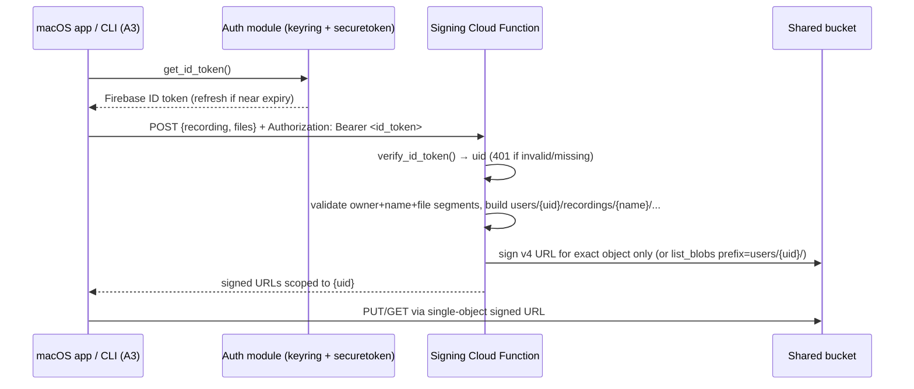
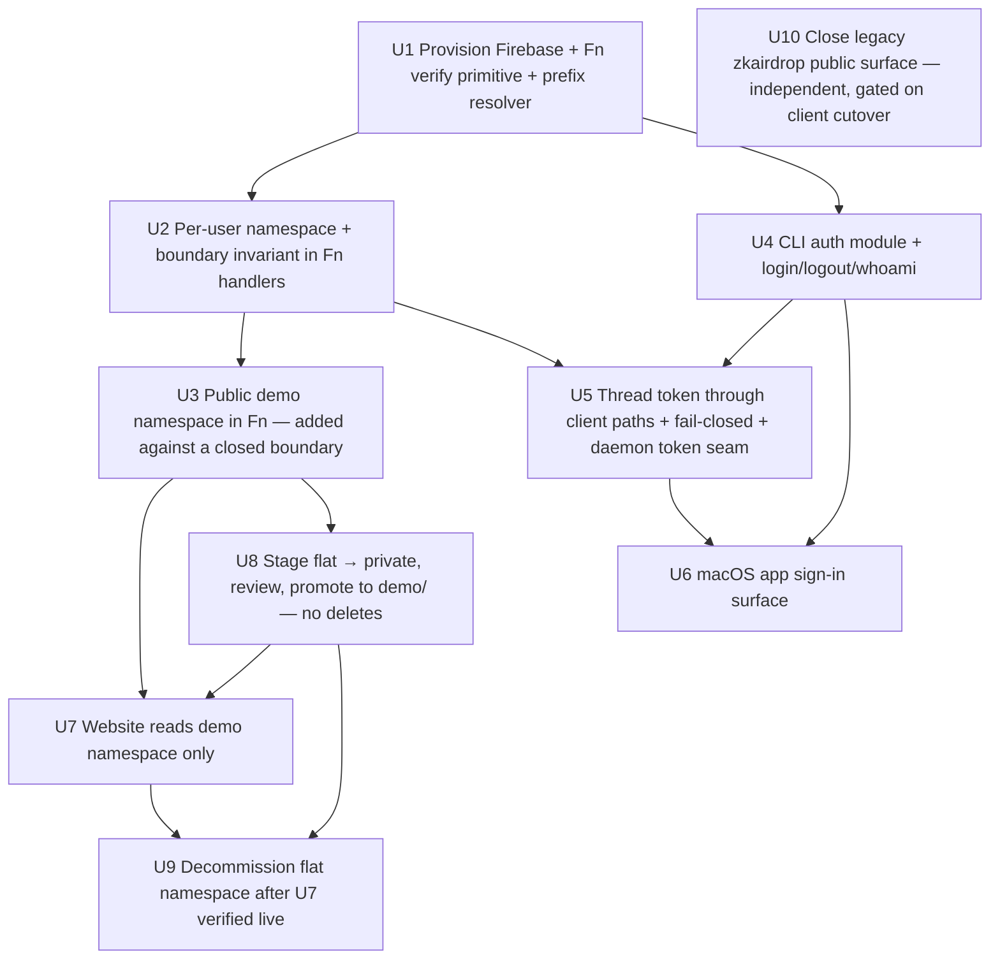

# feat: Per-User Cloud Storage Isolation

## Summary

Make the signing Cloud Function the security boundary: it verifies a Firebase ID token, derives the owning account server-side, and signs upload/download/list URLs only under a per-user prefix (`users/{uid}/…`) in the existing shared bucket. The Python CLI gains a `login`/`logout`/`whoami` auth flow (system-browser loopback OAuth → `signInWithIdp`, refresh token in the macOS Keychain) and attaches a bearer token to every cloud call across the explicit-upload, download, and live-recording-upload paths — with a fail-closed invariant so an auth failure never deletes local files. The public website stops calling the global "list all / sign any" actions and instead reads a separate, unauthenticated `demo/` namespace. Per the R11 decision, existing flat-namespace recordings are migrated out of the public flat path — but, on the security review's recommendation, into a **private staging area first**, then promoted into the public `demo/` gallery only after a content/title/consent review gate (the flat namespace is decommissioned last, after the website cutover is verified live).

---

## Execution Status

> Tracks what has shipped so the plan reflects reality. Updated 2026-06-04 (ce-work): U6 (macOS sign-in surface) shipped on `feat/per-user-cloud-storage-isolation-u6`; the U5 remainder merged via PR #212. Status stays `active` until the remaining units (U7–U10) land.

**Shipped on `feat/per-user-cloud-storage-isolation`** (the backend security boundary + client auth foundation — deploys and tests in isolation; nothing user-facing breaks):

- **U1 — done** (`c5c206f3`): `verify_bearer` (typed 401-invalid vs 503-unavailable, project-pinned) + `resolve_prefix` (the single key builder, demo/users invariant); Firebase init; `firebase-admin` + forced `google-cloud-storage>=3.1.1`; provisioning runbook.
- **U2 — done** (`79c7f4f3`): per-user namespace isolation + in-code auth gate; global list-all / sign-any removed; `get-index` removed; AE2 cross-user denial + the CI contract test.
- **U3 — done** (`5db38343`): public `demo/` namespace dispatched before the auth gate; marker-blind; physically separate code path.
- **U4 — done** (`5276c3b8`): CLI `login`/`logout`/`whoami` + `get_id_token` (loopback OAuth+PKCE → `signInWithIdp`, Keychain refresh token, transparent refresh/rotation; `NotSignedIn` vs transient `AuthError`).
- **U5 — done**: the self-capture sub-scope (`4e545c68`) blocked auth/token hosts from `--network` (override-proof `REQUIRED_AUTH_IGNORE_HOSTS`) + the `proxy_runner` fail-closed gate. The remainder shipped on `feat/per-user-cloud-storage-isolation-u5`: out-of-band engine token seam + `force_refresh` (`7abb773d`); fail-closed characterization test (`69087b81`); bearer-token threading through `upload.py` (`9e5d090e`) and `download.py` (`a0aca91a`) via the shared `auth.authed_post` (`9215d6c4`, 401-refresh-retry-once); removal of the retired `--remote`/`--sessions` session surfaces (`a0aca91a`) and the public `screencap.sh` viewer URLs (`066e0265`); the `screencap upload` pre-flight sign-in refusal that touches nothing on disk (`066e0265`); and the daemon out-of-band ID-token seam + re-mint timer (`6786e261`). The live-upload fail-closed invariant (auth failure → `ChunkStatus.FAILED`, never sentinel/stub/delete) is preserved and characterized. **Carry-forwards — DONE in SCR-140** (`docs/plans/2026-06-25-001-test-scr-140-u5-carryforward-effect-tests-plan.md`): the end-to-end mitmdump EFFECT test for `REQUIRED_AUTH_IGNORE_HOSTS` (`tests/network/test_required_auth_effect.py` — auth hosts proven tunnelled, not intercepted) and the cloud-function upload-checksum re-test after the `google-cloud-storage` 3.x bump (`scripts/cloud-function/test_signing_contract.py` — v4 signing proven checksum-free).

**Shipped on `feat/per-user-cloud-storage-isolation-u6`** (the macOS app sign-in surface — depends on U4/U5, both done):

- **U6 — done**: `macos/Screencap/` gains a `CloudAuthController` + `CloudAuthService` seam that shells out to `screencap login`/`logout`/`whoami --json` (all token handling stays in Python). A drift-resilient `AuthWhoAmIEnvelope`/`AuthStatus` model decodes `whoami` (malformed/empty → safe signed-out). The menu bar shows the signed-in account + Sign In / Sign Out (Sign Out disabled while `activeUploadCount > 0`); the review-window Upload affordance gates on auth and presents an async, cancellable "Sign in to upload" sheet (`SignInPromptView`) when signed out, proceeding to the upload on success. Sign-in uses the cancellable `CLIClient.spawn` seam with a per-attempt generation token so a cancelled login's late exit can't corrupt a restart. Local recording is never gated (R3). Covered by `macos/ScreencapTests/CloudAuthControllerTests.swift`. **Known residuals (deferred, non-blocking — see the handoff): concurrent sign-in across two review windows, window-closed-mid-sign-in (self-heals at the 180s loopback timeout), and menu-only stale status.**

**Open Questions resolved during execution (confirmed with the operator):**

- **Auth boundary (was: split deployments?)** → keep a single `--allow-unauthenticated` function; the in-code `resolve_prefix` gate is the boundary, backed by a CI contract test asserting no tokenless request reaches any `users/` code path. (Implemented in U2.)
- **Public-exposure consent (blocks U8 promotion)** → **promote the real friend-trial recordings after a content/title review gate**; U8 builds the staging + promotion scripts and the live promotion is an operator step.

**Not yet started:** U7 (website demo repoint — separate `screencap-website` repo), U8/U9 (migration + decommission scripts/runbooks), U10 (legacy `zkairdrop` decommission runbook).

---

## Problem Frame

See origin (`docs/brainstorms/2026-05-29-per-user-cloud-storage-isolation-requirements.md`) for the full pain narrative. In one line: today the signing function is deployed `--allow-unauthenticated`, lists *every* recording, and signs a download URL for *any* recording name — onboarding a second real user would expose the first user's recordings to anyone who can guess a name. v1 closes that boundary so the product can be handed to a stranger.

---

## Requirements

- R1. Real person-level accounts via a managed provider — **resolved: Firebase Authentication / Google Identity Platform**.
- R2. Cloud upload requires a signed-in account; an unauthenticated cloud upload is refused with a sign-in prompt.
- R3. Local recording and local use remain available without an account.
- R4. Every uploaded recording is stored under a namespace owned by the uploading account.
- R5. The account→namespace mapping is authoritative server-side, derived from the verified token — never trusted from a client-supplied name.
- R6. The signing layer verifies the token and scopes upload-signing, download-signing, and list to that account's namespace.
- R7. A user cannot list, download, or enumerate another user's recordings; the "list all" and "sign-download any name" behaviors are removed for real user data.
- R8. Recording names are unique only within an account's namespace; two accounts may hold a same-named recording without collision or cross-visibility.
- R9. The public website no longer lists or serves real user recordings. *(Plan interpretation — the guarantee is that no **private, account-scoped** `users/{uid}/…` recording is ever publicly listable or fetchable. It does NOT mean "no real-origin recording is ever public": the demo gallery may serve **real recordings that were explicitly consented and promoted into `demo/`** — see R10/R11. The boundary is consent + explicit curation + the separate `demo/` namespace, not synthetic-vs-real origin.)*
- R10. A curated demo gallery remains publicly viewable — an explicitly-curated set, separate from real user data. *(Plan refinement — "separate from real user data" means separate from **private, account-scoped** data and gated by consent. In v1 the curated set is populated from consented friend-trial recordings promoted into `demo/` (R11); the synthetic-only alternative — recordings made specifically for the gallery — is the lower-exposure option weighed in Open Questions → public-exposure consent.)*
- R11. Existing friend-trial recordings are not publicly listable after v1 — **resolved (with a security-review refinement): migrate all out of the public flat namespace; user intent is to make them public via `demo/`, but each recording passes a content/title/consent review gate before public exposure** (see Open Questions — public-exposure consent).

**Origin actors:** A1 (account owner / operator), A2 (public / demo visitor), A3 (authenticated client — macOS app / CLI).
**Origin flows:** F1 (operator signs in and uploads), F2 (operator accesses their own recordings), F3 (public visitor browses demo gallery).
**Origin acceptance examples:** AE1 (covers R6, R7), AE2 (covers R7), AE3 (covers R2, R3), AE4 (covers R9, R10), AE5 (covers R8).

---

## Scope Boundaries

- Billing, paid storage tiers, quotas, payment-provider integration — later milestone (origin: *Deferred for later*).
- Training-consent opt-in flow — later milestone.
- **Any way to view your own cloud recordings beyond the macOS app/CLI** — later milestone and an unresolved product question, NOT assumed to be a website login. The "auth is never on the website" invariant holds: if an authenticated web surface is ever built, whether it even exists and (if so) whether it is authenticated by an app/CLI-issued token rather than a website login form is a `ce-brainstorm` question, not decided here. For v1 the macOS app/CLI is the only surface for your own cloud data; the website is public/demo-only.
- Physical per-user isolation (per-user buckets / IAM — Approach B) — reserved for a future compliance driver.
- Client-side encryption / privacy-vault model — rejected (incompatible with the training-corpus bet).
- Changes to the recording engine, capture pipeline, or the macOS review/upload UX specced in `docs/plans/2026-05-27-002-feat-upload-review-screen-plan.md` — this plan is the storage/identity layer beneath that work; it only adds an auth-state check to the Upload affordance.
- Folding the signing function into the website backend (the Approach-C consolidation) — deliberately deferred; v1 keeps the standalone function (see Key Technical Decisions).
- Multi-provider sign-in (Apple, email/password), account deletion/merge, and cross-device data unification — v1 ships Google sign-in only; the seam is provider-agnostic but only one provider is wired.

### Deferred to Follow-Up Work

- **GCP project topology (resolved): everything is now on `proteus-photos`.** The active `screencap-recordings` bucket, the signing Cloud Function, and the new Firebase/Identity Platform tenant all live in `proteus-photos` — this is a single-project build. The earlier `zkairdrop`→`proteus-photos` cross-project sequencing concern is moot (the move already happened). **One live loose end this plan must close:** the legacy `zkairdrop` `get-upload-urls` function is still deployed `--allow-unauthenticated` and still fronts the `zkairdrop` "safety" buckets (which retain the old flat, public, identity-free layout = real user data). That is a second public door to the exact data this plan locks down, so closing it is **in scope for R7/R9** — see U10. The `zkairdrop` buckets themselves are a retained frozen backup (out of the active path); U10 revokes their public access rather than deleting them.
- **Remove vestigial `_unlisted` / `show_on_website` machinery**: superseded by namespace isolation (see Key Technical Decisions); left as harmless no-ops in v1, cleaned up in a separate PR.
- **`check_revoked=True` / account-disable + abuse controls** on the signing path: out of the hot path for v1 (short token lifetime is the mitigation); add when abuse controls land.
- **Token-verification consolidation into the brokered backend (Approach C)**: the moment billing/consent/audit are built.

---

## Context & Research

### Relevant Code and Patterns

- **Signing Cloud Function:** `scripts/cloud-function/main.py` — single HTTP entry `get_upload_urls` dispatching on `action`; handlers `_handle_upload` (default), `_handle_list`, `_handle_sign_download`, `_handle_get_index`. Already uses the IAM `signBlob` v4-signing pattern (`service_account_email` + `access_token`) and `list_blobs(prefix=…)`. `_RECORDING_RE`/`_FILENAME_RE` + explicit `".." in name` check are the existing input-validation pattern to extend to the owner segment. `requirements.txt` alongside it currently pins `functions-framework` + `google-cloud-storage>=2.14.0`.
- **Client upload (explicit):** `src/screencap/upload.py` — `request_signed_urls()` (line 167) POSTs `{recording, files}` with **no auth**; `_get_upload_url()` reads `SCREENCAP_UPLOAD_URL`. `upload_recording()` reads `.recording_id` for the name.
- **Client upload (live, during recording):** `src/screencap/chunk_processor.py` — `upload_chunk_files()` (≈line 931) and `_upload_chunk()` (retry-once) reuse `screencap.upload.request_signed_urls`. This is a **fail-closed state machine** — see the documented learning below.
- **Client download / remote list:** `src/screencap/download.py` — `request_signed_urls()` (line 192, `action=sign-download`), `list_remote_recordings()` (line 112, `action=list`), `_get_download_url()` reads `SCREENCAP_DOWNLOAD_URL`.
- **Existing Keychain pattern:** `src/screencap/network/crypto.py` uses `keyring` for the body-encryption KEK (set/get/delete, base64 for binary, "Always Allow" ACL behavior). `src/screencap/cli/__init__.py:3956` `_check_keyring_macos_backend` + the PyInstaller hidden-import pinning of `keyring.backends.macOS` — **reuse both for token storage**.
- **macOS ↔ CLI bridge:** `macos/Screencap/Controllers/CLIClient.swift` (`runJSON`/`spawn`/`runAwaitingExit`, resolves bundled `Contents/Resources/screencap/screencap`). The app has **no networking/auth/Keychain in Swift** — all cloud work delegates to the Python CLI. New `screencap login`/`whoami --json` are shell-outs in the same style.
- **Website data layer:** `screencap-website/src/app/_lib/gcs-proxy.ts` — `callCloudFunction()` already conditionally sends `Authorization: Bearer ${CLOUD_FUNCTION_TOKEN}` (wired but inert). `listItems`/`getSignedUrls` call the global `list`/`sign-download`. API routes `src/app/api/recordings/route.ts` + `[name]/route.ts`; `src/app/api/proxy/route.ts` hardcodes `ALLOWED_PREFIX = https://storage.googleapis.com/screencap-recordings/`.
- **Upload-review-screen plan (adjacent, in flight):** `docs/plans/2026-05-27-002-feat-upload-review-screen-plan.md` — the SwiftUI Upload affordance shells out to `screencap upload`; v1 isolation adds an auth-state gate in front of it (U6).

### Institutional Learnings

- `docs/solutions/runtime-errors/chunk-upload-sentinel-gating-and-data-loss.md` — **load-bearing for U5.** The live-upload pipeline is a fail-closed state machine: chunk upload → `recording_complete.json` sentinel → Cloud Run stitch → `stub_recording()` deletes local media. Carry forward: (a) any per-user path change must be applied consistently across chunk upload, the sentinel, the `screencap upload` recovery path, and any server-side watcher that reads object layout; (b) **distinguish "upload intentionally disabled" from "disabled due to error"** so an auth/isolation failure never resolves to "disabled → success → delete local files"; (c) the sentinel is the point of no return and `stub_recording()` the point of no recovery — never let an auth or path-resolution failure slip a recording past those gates.
- `docs/solutions/integration-issues/mitmproxy-ignore-hosts-tunneling-all-flows-2026-04-29.md` — **trust-boundary item.** `screencap start --network` intercepts the client's own HTTPS. Add the signing function host and the Google/Firebase auth hosts to the network-capture `ignore_hosts` blocklist so a user recording with `--network` cannot capture their own tokens/credentials. Also: design failures to be loud, not a clean-looking no-op.

### External References

- Firebase ID-token verification in Python: `firebase-admin` 7.4.0 `auth.verify_id_token()` — offline (cached Google certs), returns `decoded['uid']` (the stable, opaque, path-safe owner id). Uses ADC on Cloud Run (no key file). `clock_skew_seconds` (0–60) avoids "token used too early" on cold starts. `check_revoked=True` adds a backend round-trip — keep `False` on the hot path. <https://firebase.google.com/docs/auth/admin/verify-id-tokens>
- Desktop/CLI sign-in without a mobile SDK: system-browser **loopback (RFC 8252) + PKCE** to Google → exchange the Google id_token via `POST identitytoolkit.googleapis.com/v1/accounts:signInWithIdp` (`returnSecureToken:true`) → Firebase `idToken` + `refreshToken` + `localId` (= uid). Refresh via `POST securetoken.googleapis.com/v1/token` (`grant_type=refresh_token`); ID tokens live ~1h, refresh tokens may rotate. PKCE is mandatory for public native clients (RFC 9700). <https://developers.google.com/identity/protocols/oauth2/native-app>, <https://cloud.google.com/identity-platform/docs/use-rest-api>
- GCS v4 signed URLs are bound to **one exact object path + method** — a per-user prefix in the blob name is a cryptographic boundary (a URL for `users/A/…` cannot be edited to reach `users/B/…`). `list_blobs(prefix=…)` filters **server-side** — other users' object names never reach the function. <https://docs.cloud.google.com/storage/docs/access-control/signed-urls>
- **Dependency reconciliation:** `firebase-admin` 7.4.0 requires `google-cloud-storage>=3.1.1`; the function pins `>=2.14.0`. Bumping to 3.x is API-compatible for `generate_signed_url`/`list_blobs` but changes checksum defaults (crc32c), enables retries by default, and moves resumable-media exceptions — re-test upload checksums after the bump.

---

## Key Technical Decisions

- **Authentication is opt-in — required only on the cloud-upload path, never for local use (R2/R3).** Recording, scrubbing, local playback, and all local use stay account-free; a user who never uploads never signs in. Sign-in is triggered only by a cloud action: explicit `screencap upload`, the app's Upload affordance, or a cloud-intent live recording (when the upload begins). When not signed in, the cloud path refuses with a sign-in prompt and the recording stays local (fail-closed, U5) — it never blocks recording.
- **Authentication surface = macOS app + CLI only. The website is public/demo-only and has NO login in v1 (A1/A3 authenticate; A2 is always anonymous).** Sign-in happens exclusively in the app/CLI (`screencap login`); the only authenticated callers of the signing function are the **non-browser** macOS app / CLI / daemon. The website's browser talks only to its own same-origin Next.js routes, which proxy to the function **server-side** (`gcs-proxy.ts` is `server-only`) and read only the unauthenticated `demo/` namespace. Consequence: **no browser ever sends a bearer token to the function in v1.** The existing `CLOUD_FUNCTION_TOKEN` hook in `gcs-proxy.ts` stays inert/unused — it is not user auth. Whether there is *ever* an authenticated web surface — and if so, whether it is authenticated by an app/CLI-issued token rather than a website login form — is an unresolved product question (a `ce-brainstorm` topic), not an assumed roadmap item; this plan does not presuppose a future website login. This invariant is why the CORS treatment below does not need an `Authorization` request header in v1.
- **Firebase / Identity Platform as the auth provider (R1).** GCP-native (same Google project as the bucket + function → lowest ops burden), offline low-latency token verification via `firebase-admin`, a clean path-safe `uid` for both the storage prefix and a future Stripe customer, free to 50k MAU. Accepts a one-time two-step client sign-in implementation (loopback OAuth → `signInWithIdp`). Runner-up Auth0 rejected on cost-at-consumer-scale and second-vendor ops burden. *(Confirmed with user; see origin R1.)*
- **Keep the standalone Cloud Function for v1; make it token-verifying (R5, R6).** Smallest delta from today (behavior change inside an existing function, not a relocation), keeps the `signBlob`/`serviceAccountTokenCreator` permission on one small surface, and the client already calls it. Folding into the website backend is the Approach-C move, deferred until billing/consent/audit are built.
- **Owner id = the verified Firebase `uid`, used as the path segment `users/{uid}/…` — never the email.** Emails are mutable and leak PII into cloud paths (directly relevant to the STRATEGY.md "leaked titles in cloud-bound paths" metric). The `uid` is immutable, opaque, and path-safe. Defense-in-depth: validate the owner segment against a strict regex before interpolation even though the verified `uid` is already safe. **Note this regex (`^[A-Za-z0-9]{1,128}$`) is deliberately Firebase-uid-shaped — it is a provider-coupled choice. A future provider whose subject id contains other characters (e.g. Auth0's `google-oauth2|123`) would change the storage-path alphabet and therefore require a data migration, not a drop-in seam swap. "Provider-agnostic" is scoped to the verification *interface* (`bearer → opaque owner id`), not the path encoding.**
- **The demo/users boundary is an enforced runtime invariant, not a convention.** Every GCS access in the function routes through one central prefix resolver — `resolve_prefix(authenticated, uid_or_none, source, name)` — that is the *only* code that turns a request into an object key. It raises if an unauthenticated request resolves to anything outside `demo/`, and if an authenticated request resolves to anything outside `users/{uid}/`. After assembling the full key it re-asserts `key.startswith("users/{uid}/")` (or `demo/`) before any sign/list call. This replaces the weaker "lexically separate handlers" framing and is enforced by a test that iterates every dispatcher action.
- **Reject the `source=demo` overloading; the demo path uses dedicated actions dispatched *before* any auth gate.** A single client-controlled `source` selector steering between authenticated and unauthenticated behavior is the most likely way to accidentally expose `users/` data. The public path is `demo-list` / `demo-sign-download` with a hard-coded `demo/` prefix that accepts no client-supplied `source`/`owner`. `source` on authenticated handlers is a strict server-side allow-list (`{"recordings","sessions"}`), never interpolated raw.
- **Migration stages into a private `import-review/` namespace, then promotes to public `demo/` after review (R10, R11).** The user's intent is to make the existing recordings public, but these are real screen recordings that may contain PII/credentials and whose *names* become public path segments. So U8 copies the flat namespace into a **private** `import-review/` staging namespace (no public handler), the founder reviews/scrubs and clears recordings, cleared recordings are promoted into `demo/`, and only then (U9) is the flat namespace decommissioned. This keeps the sources as the rollback source of truth until the website cutover is verified live, and prevents an un-reviewed public dump. **Bucket-IAM precondition:** "private" only holds if the shared bucket has no `allUsers`/`allAuthenticatedUsers` read binding — the legacy public-gallery posture may have one; U8's first pre-check verifies and removes it, else `import-review/` is publicly readable by direct URL. *(The blanket "migrate all to public" intent is preserved but gated — see Open Questions: public-exposure consent, which also weighs purpose-built/synthetic demo content as the lower-risk alternative to publishing real trial captures.)*
- **Private-data signed URLs and CORS are re-justified under the new model.** GET expiry for `users/` is shortened to the minimum the playback/download flow needs (a per-namespace constant; `demo/` may keep the longer window since it is public anyway), because a 4-hour signed GET URL for private data is an unrevokable bearer capability. CORS: because the only authenticated callers are non-browser (app/CLI/daemon → no preflight) and the website reaches the function server-side, **no browser sends a bearer token to the function in v1** — so `Access-Control-Allow-Headers` does NOT need `Authorization` now (it would only matter *if* an authenticated browser surface is ever introduced — an unresolved product question, not assumed here). `Access-Control-Allow-Origin: *` can be left as-is for the public demo reads or tightened to the demo-site origin; it is not load-bearing for auth.
- **Demo gallery = a separate, unauthenticated `demo/` namespace (R10), populated by migrating all existing flat recordings (R11).** The demo handlers are physically separate code paths from the `users/` handlers (a bug in one cannot cross into the other) and require no token. Curation = the contents of `demo/`; the founder prunes unwanted recordings after migration. An optional `demo/_manifest.json` can carry titles/ordering later.
- **`_unlisted` marker and `show_on_website` are superseded by namespace isolation.** Real user data never appears on the public site, so these no longer gate anything. Left as harmless no-ops in v1; removal deferred to follow-up. **Migration handling (committed, single approach):** the U8 promotion step strips `_unlisted`/`show_on_website` markers when copying into `demo/`, and `demo-list` is marker-blind (does not honor `_unlisted` at all). Markers are handled in exactly one place (promotion) so a curated recording can never silently vanish from the gallery.
- **Public viewer URLs (`https://screencap.sh/?...&recording={name}`) are no longer valid for isolated user data.** The upload path stops emitting them for user recordings (the public site cannot render a `users/{uid}/` recording, and web viewing is deferred). The macOS app/CLI is the interim viewing surface.
- **Token lives in the Python layer, surfaced to the app via shell-out.** No token handling in Swift — consistent with the existing CLI-bridge architecture. The refresh token reuses the `keyring.backends.macOS` hidden-import guarantee (`_check_keyring_macos_backend`) and the default "Always Allow" trusted-binary ACL from `network/crypto.py` — note this is a **default ACL, not a code-signing-pinned ACL**: any same-user trusted binary can read it, so the threat-model text (and SECURITY.md) must describe the default-ACL posture honestly rather than claim pinning that does not exist.

---

## Open Questions

### Resolved During Planning

- **Which auth provider? (origin: Affects R1)** → Firebase / Identity Platform (confirmed with user).
- **Where does sign-in originate + how is the token stored/refreshed? (origin: Affects R2)** → In-CLI loopback OAuth + PKCE → `signInWithIdp`; refresh token in macOS Keychain via `keyring`; ID token cached in memory, refreshed proactively via the secure-token endpoint.
- **Token-verification + namespace-derivation seam; standalone vs folded? (origin: Affects R5, R6)** → Token verified in the standalone Cloud Function; `uid` derived from the verified token; prefix `users/{uid}/…`. Standalone kept for v1.
- **Demo designation mechanism + own namespace? (origin: Affects R10)** → Separate unauthenticated `demo/` namespace; curated set = its contents (promoted from staging after review).
- **Disposition of existing friend-trial recordings? (origin: Affects R11)** → Migrate all out of the public flat namespace; stage privately, then promote cleared recordings to `demo/` (user intent: public; security refinement: review gate — see below).
- **Daemon vs CLI Keychain-read identity for the token? (raised in deepening — resolve before U5)** → The live-upload path runs inside the **daemon-spawned engine subprocess**, whose Keychain ACL identity differs from the interactive `login` binary. Decision: the daemon reads the token once in its own ACL context at recording start and passes a **short-lived ID token** to the engine subprocess. **Transport correction (from doc review):** the existing start-handoff (`_worker_args`) is base64-encoded into the engine *command line*, so a token placed there is visible in `ps`/`/proc` to any same-user process. The token must therefore travel via the engine **environment** or an inherited fd / 0600 temp file — **never argv** — and `daemon/schema.py`'s `RecordingStartRequest` gains an optional token field only if it is delivered out-of-band, not via the argv-encoded payload. The engine never calls `keyring` directly; the long-lived **refresh token stays out of the all-day daemon process**.
- **Token refresh for recordings longer than the ID-token lifetime? (raised in doc review)** → A live recording can outlast the ~1h ID token, and the engine holds no refresh token. Decision: the daemon (which retains refresh access in its ACL context) re-mints a fresh ID token on a timer and re-pushes it to the engine over the same out-of-band channel; a mid-recording 401 in the engine routes to the fail-closed error-disabled state (no delete) rather than aborting the recording.
- **Disposition of every existing Cloud Function action? (raised in deepening, resolved)** → `upload`/`list`/`sign-download` become token-gated + `users/{uid}/`-scoped (U2); **`get-index` is removed** (it read `sessions/_index.json`, a path the migration retires; no v1 surface needs it); the dispatcher rejects any unlisted action with 400. Enumerated and tested in U2/U3.
- **CLI remote-session browsing after sessions are retired? (raised in doc review)** → `screencap list --remote` / `list_remote_sessions` / `fetch_session_index` / `source=sessions` download all depend on `get-index` + the `sessions/` namespace that U2 rescopes and U9 deletes. Decision: in U5, **remove/disable the `--remote` session commands** (and the website's `listSessions`/`fetchSessionIndex` callers in U7) as part of the same change, so U9's `sessions/` deletion does not strand a live command returning 404/empty. Per-user session browsing returns later under `users/{uid}/sessions/` if needed.

### Needs User Confirmation Before Implementation

- **Public-exposure consent gate + real-vs-synthetic demo (blocks U8 promotion → `demo/`).** You chose "migrate all to public," but the existing friend-trial recordings are real screen captures that may contain credentials/PII, their names become public path segments, and — per the product-lens review and the competitive brief — publicly publishing real users' captured workflows cuts against Screencap's "win on privacy / consent-grade" positioning the moment a scrub misses something. **Two questions to confirm before any promotion:** (a) do you have the trial participants' consent to publish their recordings publicly, and is each cleared after a content + title review? (b) Would purpose-built/synthetic demo recordings (captured by you specifically for the gallery) serve the marketing job *without* the consent/PII/positioning exposure? The marketing showcase is satisfied by either path; only the synthetic path is exposure-free. Until confirmed, the plan's default is migrate-to-private-staging and promote nothing. If consent cannot be obtained, U8 promotion yields zero recordings and the gallery is seeded from synthetic content instead — so U7 must not silently depend on a non-empty `demo/` (see U7 empty-state).
- **Split `demo/` and `users/` into two deployments? (force a decision before U2)** Keeping one `--allow-unauthenticated` function means the in-code auth gate is the *only* boundary (no Cloud Run IAM backstop) — a single dispatcher bug exposes every user's data with nothing to catch it. Per the security + adversarial reviews, this must be a recorded decision, not a default: either (a) **accept** the single-layer risk for v1 with an explicit rationale **and** a compensating CI contract test that asserts no tokenless request can reach any `users/` code path on every function deploy, or (b) **split** into two deployments at U2. Do not let v1 ship the single-layer posture by omission.

### Deferred to Implementation

- **Exact `firebase-admin` ↔ `google-cloud-storage` pin** — note this is a *forced* major-version bump, not a free choice: `firebase-admin` 7.4.0 requires `google-cloud-storage>=3.1.1` and the function pins `>=2.14.0`, so adding firebase-admin moves GCS to 3.x (no compatible 2.x pin exists). The U2 upload-checksum re-test is therefore mandatory (3.x changes crc32c checksum defaults), and U8's per-object `crc32c` verification runs on the bumped library — confirm checksum semantics match across enumeration and verify.
- **`signInWithIdp` `requestUri` / loopback redirect exactness** — the `redirect_uri` in the authorize request and the `requestUri` in `signInWithIdp` must both reflect the *actual* `127.0.0.1:<ephemeral port>` chosen at runtime, not a static placeholder (a static value weakens the loopback CSRF/port-race protection); confirm against the provisioned project config (U1/U4).
- **Exact out-of-band token transport to the engine (env var vs inherited fd vs 0600 file)** — pick the concrete channel when wiring U5; the constraint (never argv) is settled, the mechanism is not.

---

## High-Level Technical Design

> *This illustrates the intended approach and is directional guidance for review, not implementation specification. The implementing agent should treat it as context, not code to reproduce.*

### v1 request flow (authenticated upload / download / list)



### Storage layout: today → v1

```
Today (flat, public):                v1 (isolated):
recordings/{name}/...                users/{uid}/recordings/{name}/...   ← per-account, token-gated
sessions/{name}/...                  users/{uid}/sessions/{name}/...
                                     import-review/{name}/...            ← private staging (no public handler)
                                     demo/{name}/...                     ← public, unauthenticated, curated
                                     (flat → import-review → review → demo; flat removed last, U9)
```

### Implementation-unit dependency graph



The central security invariant: a single `resolve_prefix(authenticated, uid, source, name)` is the only code that builds an object key; unauthenticated → must be under `demo/`, authenticated → must be under `users/{uid}/`, else it raises. Every dispatcher action is tested against this.

---

## Implementation Units

### U1. Provision Firebase/Identity Platform and add the token-verification primitive to the Cloud Function

**Goal:** Stand up the auth provider and give the Cloud Function a verified-identity primitive (`bearer token → uid`) with no handler behavior change yet — the foundation every other unit builds on.

**Requirements:** R1, R5

**Dependencies:** None

**Files:**
- Create: `scripts/cloud-function/auth.py` (verification helper: `verify_bearer(request) -> uid`, `owner_segment(uid) -> str` with strict regex; typed errors distinguishing *invalid* token from *temporarily-unavailable* verification)
- Create: `scripts/cloud-function/paths.py` (the single `resolve_prefix(authenticated, uid_or_none, source, name) -> str` — the only code that builds a GCS object key; the demo/users boundary invariant lives here)
- Modify: `scripts/cloud-function/requirements.txt` (add `firebase-admin`; bump `google-cloud-storage` pin to satisfy it)
- Modify: `scripts/cloud-function/main.py` (module-scope `firebase_admin.initialize_app(options={"projectId": …})` alongside the existing `storage.Client()`; import the helpers — not yet wired into handlers)
- Create: `docs/cloud-auth-setup.md` (provisioning runbook: enable Identity Platform, configure Google sign-in provider, create a **Desktop/native (public) OAuth client — confirm no `client_secret` is embedded in source or binaries** per RFC 8252, capture Web API key + client id, grant/confirm `serviceAccountTokenCreator`; **restrict the Web API key** (application/referrer + Identity-Toolkit-only) and **disable unused Firebase auth methods** (email/password, phone, anonymous) to close credential-stuffing/enumeration vectors, since the key ships in every binary)
- Test: `scripts/cloud-function/test_auth.py`, `scripts/cloud-function/test_paths.py`

**Approach:**
- Provisioning is an ops step captured in the runbook; the OAuth client id + Web API key produced here are inputs to U4.
- `verify_bearer` extracts the `Authorization: Bearer` header, calls `auth.verify_id_token(token, clock_skew_seconds=<small>)`, returns the `uid`; raises typed errors: an *auth-invalid* error (missing/expired/bad-signature/wrong-project) → caller maps to **401**, and an *auth-unavailable* error (`CertificateFetchError` / Firebase outage) → caller maps to a distinct **503-class** so the client can treat it as fail-closed rather than a hard rejection. `check_revoked=False` (hot path).
- **Provision the Firebase/Identity Platform tenant in `proteus-photos`** (where the function + bucket now live — single project) and **pin the project explicitly:** `initialize_app(options={"projectId": "proteus-photos"})`, and `verify_bearer` asserts the decoded token's `aud`/`iss` match it (belt-and-suspenders over the SDK's own check), logging the project on init so a misconfig is loud. This prevents verify-but-misattribute against a foreign Firebase project. `check_revoked=False` on the hot path needs no Admin-API credentials — pure JWT + public-cert checking. The OAuth client + Web API key are provisioned in `proteus-photos`.
- `owner_segment` validates the uid against `^[A-Za-z0-9]{1,128}$` and rejects `/`, `.`, `..`, and empty (defense-in-depth even though Firebase uids are safe). See Key Technical Decisions for why this alphabet is provider-coupled.
- `resolve_prefix` is the security heart: given `authenticated`, the (verified) `uid`, an allow-listed `source` (`{"recordings","sessions"}`), and a validated `name`, it returns the object-key prefix and **raises** if an unauthenticated call would resolve outside `demo/` or an authenticated call outside `users/{uid}/`. It performs a final `startswith` re-assertion on the assembled key.
- Reconcile the `google-cloud-storage` bump; flag the upload-checksum re-test for U2.

**Patterns to follow:** Module-level client reuse already in `main.py` (`_storage_client`, `_credentials`); the input-validation discipline of `_RECORDING_RE`/`_FILENAME_RE` + the `".." in name` guard.

**Test scenarios:**
- Happy path: a valid (mocked) ID token → `verify_bearer` returns the expected `uid`. (`firebase_admin.auth.verify_id_token` mocked.)
- Error path: missing `Authorization` header → typed auth-invalid error mapped to 401.
- Error path: malformed / non-Bearer header → 401.
- Error path: expired token (mock raises `ExpiredIdTokenError`) → 401.
- Error path: invalid signature (mock raises `InvalidIdTokenError`) → 401.
- Error path: token minted for a *different* project (`aud`/`iss` mismatch) → 401 (not silently accepted).
- Error path: `verify_id_token` raises `CertificateFetchError` (Firebase outage, mocked) → distinct 503-class auth-unavailable error, not a 401 and not a success.
- Edge case: `owner_segment` rejects a uid containing `/`, `..`, or empty; accepts a normal alphanumeric uid.
- Boundary (resolve_prefix): unauthenticated + any `source`/`name` → raises unless the result is under `demo/`; authenticated → raises unless under `users/{uid}/`; a `name` with embedded `/` segments climbing via `..` is rejected; a `source` outside the allow-list is rejected.

**Verification:** The function deploys with `firebase-admin` installed and the project pinned; `verify_bearer` returns a uid for a valid same-project token, 401s on invalid/missing/foreign-project tokens, and raises auth-unavailable on a cert-fetch failure; `resolve_prefix` cannot produce a cross-namespace key in any unit test; the runbook contains the captured OAuth client + Web API key values.

---

### U2. Per-user namespace isolation in the upload / list / sign-download handlers

**Goal:** Make the Cloud Function the enforced security boundary: every real-user action is gated by a verified token and scoped to `users/{uid}/…`; the global "list all" and "sign-download any name" behaviors are removed.

**Requirements:** R2, R4, R5, R6, R7, R8

**Dependencies:** U1

**Files:**
- Modify: `scripts/cloud-function/main.py` (`_handle_upload`, `_handle_list`, `_handle_sign_download` route through `verify_bearer` + `resolve_prefix`; **`_handle_list`'s blob-name parsing is re-based** — see Approach; the `get_upload_urls` dispatch enforces a strict action allow-list; **`get-index` is removed**; the deploy-header docstring is updated; `DOWNLOAD_EXPIRY_HOURS` becomes a per-namespace constant with a short `users/` value; `CORS_HEADERS` unchanged for v1 — no `Authorization` request header is needed because no browser is an authenticated caller, see the authentication-surface decision)
- Test: `scripts/cloud-function/test_main.py`

**Approach:**
- Each real-user handler: `uid = verify_bearer(request)` first (401 on auth-invalid → R2's server-side refusal; 503 on auth-unavailable), then build the key via `resolve_prefix(authenticated=True, uid, source, name)`. Never interpolate `source`/`uid`/`name` into a path outside the resolver. `source` is the server-side allow-list `{"recordings","sessions"}`.
- Apply the `..` guard and the post-assembly `startswith(f"users/{uid}/")` re-assertion to **every** handler — the legacy `..` check lived only on the upload path; sign-download and list need it too.
- `_handle_list` lists with `prefix=f"users/{uid}/{source}/"` (server-side scoping → R7). Drop the global `list_blobs(prefix=f"{source}/")`. **Re-base the blob-name parsing:** today it does `blob.name.split("/", 2)` and reads `parts[1]` as the recording name (and `parts[2]` for the `_unlisted` marker), hard-coded to the 2-deep `{source}/{name}/{file}` layout. Under `users/{uid}/{source}/{name}/{file}` the name shifts two segments deeper, so the parsing must strip the `users/{uid}/{source}/` prefix before splitting — otherwise list returns the uid as the name. ("v4-signing and list_blobs are otherwise unchanged" is wrong for the list handler specifically.)
- `_handle_sign_download` lists/signs only under the caller's prefix; another user's name does not exist under the caller's prefix → 404/empty (→ AE2). Remove the ability to sign any name globally.
- `_handle_upload` signs PUT URLs only under the caller's prefix; same-name recordings from different uids never collide (→ R8/AE5).
- **Action allow-list:** the dispatcher accepts exactly the enumerated set and 400s anything else, so a forgotten legacy action cannot survive as an unauthenticated reader. **`get-index` is removed** (resolved in Open Questions) — it read `sessions/_index.json`, a path the migration retires, and no v1 surface needs it; its CLI/website callers are removed in U5/U7.
- **Update the deploy-header docstring** to state: stays `--allow-unauthenticated` at the Cloud Run layer; the auth gate is in-code; `users/`+upload actions require a bearer token; `demo-*` do not. Prevents a future operator from "tightening" away the demo path or assuming the whole function is public.
- `gcs_prefix` in responses reflects the new `users/{uid}/…` path.
- Re-test the upload-checksum path after the `google-cloud-storage` 3.x bump from U1.

**Execution note:** Start with a failing test for AE2 (cross-user download denial) — it is the single most important security assertion in the plan.

**Technical design:** *(directional)* the structural change per handler is: derive `uid` from the token, then build the key via `resolve_prefix` instead of the inline string. The v4-signing calls are unchanged; the `list_blobs` *prefix* changes for all handlers, and `_handle_list`'s blob-name parsing additionally re-bases (above).

**Test scenarios — add:**
- Covers AE1 (real layout). Happy path: under `users/{uid}/recordings/{name}/{file}`, list returns the correct `{name}` (not the uid) — proves the re-based parsing, which a prefix-only mock would miss.

**Patterns to follow:** Existing handler shapes in `main.py`; the `".." in name` guard (now on all handlers); `_cors` wrapping for all responses including the new 401/503s.

**Test scenarios:**
- Covers AE1. Happy path: user A's token → list returns only `users/{A}/…`; B's are absent (mock `list_blobs` asserts `prefix=users/{A}/...`).
- Covers AE2. Error path: user A's token + the exact name of user B's recording → `sign-download` returns 404/empty; no URL signed.
- Covers R6/R2. Error path: no/invalid token on upload, list, or sign-download → 401, no URL signed; auth-unavailable → 503.
- Covers AE5/R8. Happy path: A and B each upload `myrec` → blobs at `users/{A}/recordings/myrec/…` and `users/{B}/recordings/myrec/…`; neither overwrites nor lists the other.
- Happy path: upload returns signed PUT URLs under `users/{uid}/recordings/{name}/`.
- Edge case: a `name` with embedded `/` segments that climb (`a/../../x`) is rejected on **upload, list, AND sign-download** (not just upload).
- Edge case: a `source` outside `{"recordings","sessions"}` is rejected on every handler.
- Invariant: the dispatcher accepts exactly the enumerated action set; an unknown action → 400; `get-index` either 404s for non-`demo/` content or is gone.
- Integration: a v4 download URL signed for `users/{A}/…` cannot be path-edited to fetch `users/{B}/…` (assert the signed object path is exact — the cryptographic boundary).
- Boundary contract: a token-gated action without a token → 401 (paired with U3's "demo action without a token → 200" to pin the in-code auth posture).
- (No CORS/`Authorization` test in v1 — no browser is an authenticated caller; revisit only if an authenticated web surface is ever introduced.)

**Verification:** With a valid token a user can upload/list/download only their own namespace; another user's name or no token is denied; the global list-all/sign-any paths are gone; every accepted action is enumerated and bounded; `users/` GET URLs use the shortened expiry.

---

### U3. Public demo-gallery namespace in the Cloud Function (unauthenticated, isolated)

**Goal:** Provide unauthenticated read access to a curated `demo/` namespace, as a code path physically separate from the token-gated `users/` handlers.

**Requirements:** R9, R10

**Dependencies:** U2 (land + test the `users/` scoping and its 401 gate first, so the demo path is added against an already-closed boundary)

**Files:**
- Modify: `scripts/cloud-function/main.py` (add dedicated `demo-list` and `demo-sign-download` actions, dispatched **before** any `verify_bearer`-gated branch, that never require a token and only ever read under `demo/` via `resolve_prefix(authenticated=False, …)`)
- Test: `scripts/cloud-function/test_main.py`

**Approach:**
- **Reject the `source=demo` overloading** (Key Technical Decisions): no shared handler steered by a client-supplied `source`. The demo path uses dedicated actions with a hard-coded `demo/` prefix via the central `resolve_prefix` and accepts no client-supplied `source`/`owner`. Dispatch the demo actions ahead of the authenticated branches so a demo request never touches `verify_bearer`-gated code.
- `demo-list` lists `prefix=demo/`; `demo-sign-download` signs GET URLs under `demo/{name}/…` only, with the `_RECORDING_RE` guard on `{name}`. `demo/` GET expiry may stay long (public anyway).
- **`demo-list` must NOT honor `_unlisted` markers** — migrated recordings may carry vestigial `_unlisted` blobs; honoring them would silently drop curated recordings from the gallery (the marker is superseded by namespace isolation). Either ignore them here or have U8 strip them on promotion — pick one and assert it.
- Optional `demo/_manifest.json` (titles/order) is read like the existing `sessions/_index.json` — defer unless needed.

**Patterns to follow:** `_handle_get_index` (reads a fixed blob), `_handle_sign_download` signing loop, `_RECORDING_RE`; the central `resolve_prefix` from U1.

**Test scenarios:**
- Covers AE4/R10. Happy path: `demo-list` with no token returns recordings under `demo/`.
- Covers R9. Edge case: `demo-list`/`demo-sign-download` only ever read `demo/` — a crafted `name`/`source` cannot reach `users/` or the legacy flat namespace (assert the `list_blobs`/blob prefix passed is always `demo/...`).
- Happy path: `demo-sign-download` returns GET URLs for a demo recording's files.
- Error path: `demo-sign-download` for a non-existent demo name → 404.
- Edge case: a token-gated action (`upload`/`list`/`sign-download`) still 401s without a token — confirms the demo path did not loosen the authenticated path.
- Boundary contract: a `demo-*` action returns 200 **without** a token (confirms tightening the authenticated path did not silently break demo); the demo dispatch path never calls a `verify_bearer`-gated function.
- Edge case: a migrated demo recording carrying an `_unlisted` marker still appears in `demo-list` (the marker is not honored).

**Verification:** An unauthenticated caller can list and sign-download only `demo/` content; no demo action can read `users/` or the flat namespace; `_unlisted` markers do not hide curated demo recordings.

---

### U4. CLI auth module and `login` / `logout` / `whoami` commands

**Goal:** Give the client a real sign-in: obtain and persist a Firebase ID + refresh token via system-browser loopback OAuth → `signInWithIdp`, refresh transparently, and expose a `get_id_token()` accessor for the cloud paths.

**Requirements:** R1, R2

**Dependencies:** U1 (needs the OAuth client id + Web API key)

**Files:**
- Create: `src/screencap/auth.py` (`login()`, `logout()`, `whoami()`, `get_id_token()`, token refresh, Keychain persistence)
- Modify: `src/screencap/cli/__init__.py` (register `login`/`logout`/`whoami` commands; `whoami --json` envelope matching `list`/`status` shape)
- Modify: PyInstaller hidden-imports / `_check_keyring_macos_backend` reference if a new keyring service name needs the same backend guarantee (reuse existing pinning)
- Test: `tests/test_auth.py`

**Approach:**
- `login()`: start a transient HTTP server on `127.0.0.1:<ephemeral>`, open the system browser to Google's authorize endpoint with PKCE (`code_challenge`) + random `state`; on callback, exchange the code at Google's token endpoint for a Google `id_token`; POST to `accounts:signInWithIdp` (`returnSecureToken:true`) → Firebase `idToken` + `refreshToken` + `localId`.
- Persist the **refresh token** in Keychain (`keyring.set_password("screencap-auth", "default", …)`); keep the short-lived ID token in memory. Reuse the `keyring`/base64 patterns from `network/crypto.py` and the `keyring.backends.macOS` hidden-import guarantee (`_check_keyring_macos_backend`). Note the ACL is the **default "Always Allow" trusted-binary ACL** (not code-signing-pinned) — any same-user trusted binary can read the entry; document this honestly (do not claim pinning). Guard concurrent refresh-token writes (two `screencap` invocations refreshing at once) so a rotated token is not silently dropped.
- `get_id_token()`: return the cached ID token; if absent or within a refresh buffer (~5 min of `exp`), refresh via `securetoken.googleapis.com/v1/token` and persist any rotated refresh token. Raise a typed `NotSignedIn` error if there is no refresh token.
- `logout()`: delete the Keychain entry and clear the in-memory token. `whoami()`: report signed-in email/uid (or "not signed in") without forcing a refresh failure to crash.
- New config keys (env-overridable, mirroring `SCREENCAP_UPLOAD_URL`): Firebase Web API key + OAuth client id, with the provisioned values as defaults.

**Execution note:** Implement `get_id_token()` refresh logic test-first — expiry/refresh/rotation is the subtle part.

**Patterns to follow:** `network/crypto.py` keyring usage; `_get_upload_url()` env-override pattern; the `--json` envelope of `screencap list`/`status`.

**Test scenarios:**
- Happy path: `get_id_token()` returns the cached token when it is fresh (no network call).
- Happy path: token within the refresh buffer → refresh endpoint called (mocked), new ID token returned, rotated refresh token persisted to Keychain.
- Error path: no refresh token stored → `get_id_token()` raises `NotSignedIn`.
- Error path: refresh endpoint returns invalid/expired refresh token → `NotSignedIn` surfaced (not a silent failure).
- Happy path: `login()` PKCE/state round-trip (mock the browser + loopback callback + `signInWithIdp`) persists the refresh token.
- Edge case: `state` mismatch on the loopback callback → login aborts with an error.
- Happy path: `logout()` deletes the Keychain entry; subsequent `whoami` reports "not signed in".
- Edge case: `whoami --json` returns a well-formed envelope in both signed-in and signed-out states.

**Verification:** A user can `screencap login` through the browser, `screencap whoami` shows their account, `get_id_token()` returns a valid token across expiry boundaries, and `screencap logout` clears it.

---

### U5. Thread the verified token through all client cloud paths, with fail-closed not-signed-in handling

**Goal:** Attach the bearer token to every cloud call (explicit upload, live-recording upload, download/remote-list), refresh-and-retry once on 401, refuse cloud upload when not signed in with a sign-in prompt — and never let an auth failure delete local recordings.

**Requirements:** R2, R3, R4, R7

**Dependencies:** U2 (server expects the token), U4 (token source)

**Files:**
- Modify: `src/screencap/upload.py` (`request_signed_urls` attaches `Authorization: Bearer`; 401 refresh-retry; map `NotSignedIn` → a clear "sign in to upload" message; stop emitting public viewer URLs for user recordings)
- Modify: `src/screencap/download.py` (`request_signed_urls`, `list_remote_recordings` attach the token; 401 handling; **remove/disable `list_remote_sessions`/`fetch_session_index` and `source=sessions` download** — they depend on the removed `get-index` and the retired `sessions/` namespace, so they would 404/empty after U2/U9)
- Modify: `src/screencap/chunk_processor.py` (`upload_chunk_files` attaches the token; **fail-closed** — auth failure / auth-unavailable / `KeyringError` is "disabled due to error", keeps `core_ok=False`, never advances the sentinel/`stub`/delete gates)
- Modify: `src/screencap/daemon/supervisor.py` (the `spawn()` site that builds the engine command) and `src/screencap/daemon/schema.py` (`RecordingStartRequest`) so the daemon reads the token once in its own ACL context and delivers a short-lived ID token to the engine **out-of-band (env var / inherited fd / 0600 file) — never via `_worker_args`, which is base64-encoded into argv and visible in `ps`/`/proc`**
- Modify: `src/screencap/cli/__init__.py` (`upload` command: pre-flight auth check → if not signed in, refuse with a prompt to run `screencap login`, leaving local files untouched — R3/AE3; drop the `list --remote` session subcommands per the download.py change)
- Modify: `src/screencap/network/blocklist.py` (add the auth/signing hosts to the **default** blocklist) and `src/screencap/network/proxy_runner.py` (the fail-closed mechanism: refuse proxy startup if the built `ignore_hosts` is missing any required auth host — today `build_ignore_hosts_regex` returns `[]` on failure and does not fail closed by itself)
- Test: `tests/test_upload.py`, `tests/test_download.py`, a focused test for the live-upload fail-closed invariant (extend `chunk_processor` tests), and a blocklist test

**Approach:**
- Centralize "attach token + refresh-on-401-retry-once" so all three call sites share one behavior. On 401 (auth-invalid): call `auth.get_id_token()` again (forces refresh) and retry the single call once; if still failing, surface the error loudly. On 503 (auth-unavailable / Firebase outage): treat as fail-closed for live upload (no delete), retryable for explicit upload.
- **Daemon token seam (resolved in Open Questions).** The live-upload `ChunkProcessor` runs inside the **daemon-spawned engine subprocess**, whose Keychain ACL identity differs from the interactive `login` binary — so the engine must NOT call `keyring` directly. The daemon reads the token once at recording start (its own ACL context) and delivers a short-lived ID token to the engine **out-of-band — never via `_worker_args`/argv** (base64-encoded into the engine command line, `ps`-visible). The long-lived refresh token never enters the all-day daemon/engine process. A `KeyringError` or missing token at start routes to the error-disabled state, never to local deletion.
- **Long-recording token refresh:** a recording can outlast the ~1h ID token and the engine has no refresh token, so the daemon re-mints a fresh ID token on a timer and re-pushes it over the same out-of-band channel; a mid-recording 401 in the engine routes to fail-closed (no delete), not an aborted recording.
- Not-signed-in policy: explicit `screencap upload` and the SwiftUI Upload affordance refuse with a sign-in prompt and touch nothing on disk (R3). For the **live-upload** path, a not-signed-in / auth-failed / auth-unavailable state keeps the recording local and sets the error-disabled state — never conflated with "upload disabled" (which would allow local deletion). Load-bearing invariant from the chunk-upload learning.
- Remove/replace the post-upload "view at screencap.sh" message for user recordings (no longer valid; web viewing deferred).
- **Self-capture hardening:** the hosts to block are the Cloud Function host, `oauth2.googleapis.com` (authorize/token), `identitytoolkit.googleapis.com` (`signInWithIdp`), `securetoken.googleapis.com` (refresh) — **`accounts.google.com` is already in `DEFAULT_BLOCKLIST`, so only these three are added** — placed in `DEFAULT_BLOCKLIST` (not user-overridable config) so `--network` self-recording can never capture the bearer token or the refresh-token-bearing exchange. The fail-closed behavior is *new code* in `proxy_runner.py` (assert the required hosts are present in the built `ignore_hosts` before the proxy starts), not an existing property of `build_ignore_hosts_regex`.

**Execution note:** Add a characterization test of the current live-upload deletion gates *before* changing `chunk_processor`, so the fail-closed invariant is provably preserved.

**Sub-scope that lands independently:** the `DEFAULT_BLOCKLIST` additions and the removal of public `screencap.sh` viewer URLs are independent of the token plumbing and should land as separate commits with their own tests; neither blocks nor is blocked by the fail-closed work.

**Patterns to follow:** Existing `request_signed_urls` error handling (`ConnectionError`/`Timeout`/status); the `_NON_CORE_NAMES`/`core_ok` gating in `upload_chunk_files`; the `_upload_with_progress` 403-retry shape (mirror it for 401); the existing daemon start-handoff payload for threading the ID token.

**Test scenarios:**
- Covers R4. Happy path: signed-in `upload` sends `Authorization: Bearer` and lands files under the user's namespace (mock asserts header present + server response prefix).
- Covers AE3/R2/R3. Error path: not signed in → `screencap upload` refuses with a sign-in prompt; **no files uploaded, no local files touched, local recording still works**.
- Happy path: 401 from the function → token refreshed and the single call retried once; success on retry.
- Error path: 401 persists after refresh → loud error surfaced (not a silent skip).
- **Fail-closed (critical).** Live-upload with an auth failure (401), an auth-unavailable (503/Firebase outage), OR a `KeyringError` → `core_ok=False`, sentinel not written, `stub_recording()`/local deletion never reached; the recording remains complete on disk.
- Edge case: live-upload while not signed in → recording stays local, error-disabled state set, no deletion; distinct from the legitimate "upload disabled" path which is unaffected.
- Integration: the engine subprocess receives the ID token out-of-band and never calls `keyring` directly; **assert the token never appears in the engine's argv / `_worker_args`** (the `ps`-visibility regression guard).
- Edge case: a recording outlasting the ID-token lifetime → the daemon re-mints and re-pushes a fresh token; the live upload keeps succeeding (or fails closed, never deletes) rather than 401-ing permanently.
- Happy path: download/remote-list attach the token and return only the caller's recordings (mock asserts header).
- Edge case: post-upload output no longer prints a public `screencap.sh` viewer URL for a user recording.
- Self-capture: each of the three newly-added auth/signing hosts (plus the already-present `accounts.google.com`) is in the built `ignore_hosts` regex and matches representative hostnames; a missing required host makes `proxy_runner` refuse startup (fail closed) rather than tunneling auth traffic.

**Verification:** Every cloud call carries a valid token; not-signed-in refuses cloud upload while preserving local recordings; an auth failure/outage/`KeyringError` during live upload never deletes local media; the engine gets a short-lived token from the daemon (refresh token stays out of the daemon); the auth hosts are un-recordable by `--network`.

---

### U6. macOS app sign-in surface

**Goal:** Let the operator sign in from the app and gate the Upload affordance on auth state — surfacing the sign-in prompt instead of a silent failure.

**Requirements:** R2, R3

**Dependencies:** U4 (CLI commands), U5 (upload refusal behavior)

**Files:**
- Modify: `macos/Screencap/Controllers/CLIClient.swift` (or a thin new controller) to invoke `screencap login` (interactive — opens the browser) and `screencap whoami --json`
- Modify: the SwiftUI surface that owns the Upload affordance from `docs/plans/2026-05-27-002-feat-upload-review-screen-plan.md` (e.g. `macos/Screencap/Views/RecordingsListView.swift` / the review window) to check auth state and present a "Sign in to upload" prompt when signed out
- Modify: a settings/menu surface to show signed-in state + a Sign out action
- Test: `macos/ScreencapTests/` (extend the CLI-bridge tests — `whoami --json` decode, signed-in/out state)

**Approach:**
- Decode `whoami --json` into a small auth-state model; show the account (or "not signed in") and a Sign in / Sign out control. Place the signed-in-state display + Sign out in a settings/menu surface (name the chosen surface during implementation — e.g. a menu-bar item or settings pane — so the operator has one consistent place to find account status).
- When Upload is tapped while signed out, present the sign-in prompt (shell out to `screencap login`) rather than letting the CLI refuse opaquely; on success, proceed to the existing `screencap upload` shell-out.
- **Define the sign-in flow states (from design review)** so implementers don't each invent them: (a) **in-progress** — while `screencap login` runs and the browser is open, show a non-blocking "Waiting for sign-in in your browser…" indicator with a Cancel that terminates the shell-out; the call must be async (do not freeze the main thread). (b) **failure/declined** — when `login` exits non-zero (state mismatch, network error, or the user closes the browser / `login` times out), re-present the "Sign in to upload" prompt with a short error reason rather than silently returning. (c) **mid-upload sign-out** — disable the Sign out action while an upload is in progress (simplest), so an in-flight `request_signed_urls` cannot hit a `NotSignedIn` mid-flow; if sign-out during upload is allowed later, the upload UI must surface the resulting error state.
- A loopback timeout for `screencap login` is required (defined in U4) so the app's waiting state cannot hang forever.
- Keep all token handling in Python — Swift only triggers commands and reads `--json` state. Local recording is never gated (R3).

**Patterns to follow:** `CLIClient.runJSON`/`spawn`; the `RecorderEventLine` drift-resilient JSON decoding pattern; the Upload-affordance wiring already specced in the upload-review-screen plan.

**Test scenarios:**
- Happy path: `whoami --json` signed-in → app shows the account; Upload affordance enabled.
- Edge case: `whoami --json` signed-out → app shows "not signed in"; tapping Upload presents the sign-in prompt.
- Integration: after a successful `login` shell-out, the previously-blocked Upload proceeds.
- Edge case: `login` exits non-zero (browser closed / state mismatch / timeout) → app re-presents the prompt with an error reason, no crash, no frozen UI.
- Edge case: Sign out is disabled while an upload is in progress (no mid-flow `NotSignedIn`).
- Edge case: malformed/empty `whoami` output is tolerated (decoder returns a safe signed-out state, no crash).

**Verification:** The operator can sign in from the app, see their signed-in state, is prompted (not silently failed) when uploading while signed out, and never sees a frozen UI during the browser round-trip; local recording is unaffected.

---

### U7. Website reads the demo namespace only (no private account-scoped data)

**Goal:** Repoint the public website's gallery at the `demo/` namespace so it serves only the curated demo set (consented promoted recordings and/or synthetic content) and never lists or serves any private, account-scoped `users/{uid}/…` recording.

**Requirements:** R9, R10

**Dependencies:** U3 (demo endpoints exist)

**Target repo:** `screencap-website` (paths below are relative to that repo)

**Files:**
- Modify: `src/app/_lib/gcs-proxy.ts` (`listItems`/`getSignedUrls` call the `demo-list`/`demo-sign-download` actions instead of global `list`/`sign-download`)
- Modify: `src/app/api/recordings/route.ts` and `src/app/api/recordings/[name]/route.ts` (serve demo content; keep the `^[a-zA-Z0-9_-]+$` name guard)
- Verify only: `src/app/api/proxy/route.ts` — `ALLOWED_PREFIX` already pins the bucket root (`/screencap-recordings/`), so `demo/` objects pass unchanged; confirm, no edit expected
- Remove: `src/app/api/sessions/` routes and the `listSessions`/`fetchSessionIndex` callers in `gcs-proxy.ts` — sessions are EXCLUDED from the demo migration (U8) and `get-index` is removed (U2), so these would call dead endpoints; do not re-point them at a `demo/sessions/` prefix that will never exist

**Approach:**
- Smallest change: swap the action names the proxy sends. The site remains unauthenticated (no `CLOUD_FUNCTION_TOKEN` needed for demo reads).
- Confirm `/api/proxy` streams demo signed URLs correctly (same bucket host; object key now under `demo/`).
- **Empty-gallery state (from design review):** because U8 promotion is gated on the consent decision and may yield zero recordings (or be seeded from synthetic content later), `demo-list` can legitimately return empty. Specify the zero-item gallery UI (a placeholder / "coming soon", not an empty page or error) OR make U7 not deploy until at least one recording is promoted — pick the placeholder so the cutover is not blocked on content.
- No web user-login is added (deferred) — the site is demo-only.

**Patterns to follow:** Existing `callCloudFunction` body-shaping; the API-route name validation; the client-side signed-URL cache.

**Test scenarios:**
- Covers AE4/R9. Manual/integration: with the function deployed, the website lists only `demo/` recordings; no `users/` recording appears.
- Edge case: requesting a non-demo recording name via the API route returns not-found (it is not in `demo/`).
- Edge case: `demo-list` returns empty (pre-promotion / consent pending) → the gallery shows the placeholder state, not an empty page or error.
- Edge case: removed `sessions/` API routes return not-found / are gone (no dead-endpoint calls to `get-index`).
- Happy path: a demo recording plays end-to-end (list → detail → signed URL → `/api/proxy` stream).
- Test expectation: no unit framework exists in `screencap-website` — verify via local `pnpm dev` against the deployed function and a manual checklist; add a lightweight route test only if a framework is introduced.

**Verification:** The public site shows only curated `demo/` recordings (or a clean placeholder when none are promoted) and can play them; no private, account-scoped `users/{uid}/…` data and no session routes are reachable from the website.

---

### U8. Stage the flat namespace privately, review, and promote to `demo/` (no source deletes)

**Goal:** Copy all existing flat `recordings/{name}/…` blobs into a **private `import-review/`** staging namespace with per-object integrity verification (no deletes), then promote founder-cleared recordings into the public `demo/` namespace — populating the gallery (R10) without an un-reviewed public dump and keeping the flat sources as the rollback source of truth.

**Requirements:** R10, R11

**Dependencies:** U2 (the flat write path must be *removed*, not just token-gated, before staging — the quiesce precondition below); U3 (demo path reads `demo/`); promotion target verified by U7

**Files:**
- Create: `scripts/migrate_flat_to_staging.py` (admin one-shot: enumerate flat blobs, `rewrite()` to a private `import-review/{name}/…` namespace that has NO public handler, per-object verify; dry-run flag; idempotent; **no deletes**)
- Create: `scripts/promote_staging_to_demo.py` (admin: given a founder-approved allow-list, `rewrite()` cleared recordings from `import-review/` into `demo/`, stripping `_unlisted`/`show_on_website` markers)
- Create: `docs/cloud-migration-runbook.md` (pre-check measurement, quiesce, dry-run, stage, verify, review, promote, cutover ordering; rollback)

**Approach:**
- **Bucket-IAM pre-check (must run first):** confirm the shared bucket has no `allUsers`/`allAuthenticatedUsers` Storage Object Viewer binding (the legacy public-gallery posture may have one). If present, remove it and move to signed-URL-only access *before* the first stage run — otherwise `import-review/` objects are publicly readable by direct URL and "private staging" is a fiction. Record the verified IAM posture in the runbook.
- **Scale pre-check (runbook):** count objects + total bytes under `recordings/` and `sessions/` and record the largest single object. At the expected friend-trial scale (< ~5k objects) use a Python `rewrite()` loop for per-object checksum/content-type control; reconsider `gsutil`/Storage Transfer Service only if the pre-check shows materially larger volume. The `rewrite()` loop must follow `rewriteToken` to completion for large video objects (multi-call rewrite), else large recordings truncate silently.
- **Quiesce / no concurrent writers (enforced, not hoped):** the migration assumes the flat write path is fully closed. U2 is a hard dependency — confirm it *removed* (not merely token-gated) any path that writes `recordings/` without a `users/{uid}/` prefix. Then enforce no in-flight writer: confirm no active daemon recording is in progress at stage time (the daemon lock/pidfile already tracks this) and/or that all engines started pre-U2 have terminated — a recording that started before U2 still holds pre-isolation upload config and writes its completion sentinel late, so it can land a flat blob after enumeration. Do not rely on cohort quiet time alone.
- **Per-object verify (not count/size):** for every source blob assert a destination blob exists with matching `crc32c` (and `md5_hash` where present) **and** matching `content_type` — aggregate count/size collides on the many same-sized small JSON/0-byte marker blobs and would not catch a truncated or content-type-mangled copy that breaks website playback. Preserve full nested suffixes (`{name}/screenshots/0.png`), not just the first path segment.
- **Idempotency state machine:** per object track `copied? / verified? / promoted?`. Re-copy on checksum mismatch (never let `exists()` substitute for a checksum match); treat `source-present + dest-verified` as done. There are **no source deletes in this unit** — decommissioning is U9.
- **Sessions decision (resolved, not deferred):** EXCLUDE `sessions/` and `sessions/_index.json` from the demo migration — demo is a recordings gallery and U7 may drop session routes. If any session data turns out to be needed for demo playback, the index is *regenerated* against `demo/` paths, never copied verbatim (its internal references point at flat paths the migration is retiring).
- **Review & promote:** the founder reviews staged recordings (content + titles) against the public-exposure consent gate (Open Questions), produces an allow-list, and `promote_staging_to_demo.py` copies only cleared recordings into `demo/`, stripping vestigial `_unlisted`/`show_on_website` markers so they appear in `demo-list`.

**Execution note:** Always dry-run first; verify per-object integrity before promotion. No deletes happen in U8 — the flat namespace stays intact as rollback ground truth until U9.

**Patterns to follow:** `list_blobs(prefix=…)` enumeration in `main.py`; the `split("/", 2)` name-vs-suffix handling in `_handle_list`; existing `scripts/` admin-script conventions (not under `tests/`).

**Test scenarios:**
- Happy path (dry-run, mocked GCS): every flat `recordings/{name}/{file}` maps to `import-review/{name}/{file}`; report lists planned copies, mutates nothing.
- Happy path: stage `rewrite()`s all objects to `import-review/` and verifies per-object `crc32c` + `content_type`; no source is deleted.
- Edge case: a deeply nested object `recordings/{name}/screenshots/0.png` maps with its full suffix preserved.
- Edge case: a `content_type` drift on one object fails verification (count/size alone would have passed).
- Edge case: re-run where a previously-copied object is truncated (checksum mismatch) → re-copied, not skipped on `exists()`.
- Edge case: a large video object requires multiple `rewrite()` calls (rewriteToken) → fully copied, final `crc32c` matches.
- Edge case: `sessions/`/`sessions/_index.json` are explicitly EXCLUDED (assert they are not staged into `import-review/`/`demo/`).
- Pre-check: staging refuses to run if the bucket still has an `allUsers`/`allAuthenticatedUsers` read binding (private staging cannot be guaranteed otherwise).
- Pre-check: staging refuses to run while a daemon recording is active (quiesce guard against a late-sentinel flat write).
- Promotion: only allow-listed recordings reach `demo/`; `_unlisted`/`show_on_website` markers are stripped so the recording appears in `demo-list`.

**Verification:** All flat recordings exist under the private `import-review/` namespace with per-object integrity confirmed; only founder-cleared recordings appear in public `demo/`; no source blob has been deleted; the flat namespace is unchanged and remains the rollback source of truth.

---

### U9. Decommission the flat namespace after the website cutover is verified live

**Goal:** Delete the original flat `recordings/`/`sessions/` source blobs so the flat namespace is no longer publicly listable (R11) — but only after U7 is confirmed correct in production, so the sources remain a rollback path until the last possible moment.

**Requirements:** R11

**Dependencies:** U7 (website verified live on `demo/`), U8 (staging + promotion complete)

**Files:**
- Create: `scripts/decommission_flat_namespace.py` (admin: delete `recordings/`/`sessions/` source blobs; dry-run; per-object gated on that object's own verified-in-staging status; post-run re-scan asserting the prefixes are empty)
- Modify: `docs/cloud-migration-runbook.md` (decommission step + the deliberate window note)

**Approach:**
- Run only after U7 renders and plays the `demo/` set correctly in production and the founder confirms promotion is complete.
- Delete is gated per-object on that object's staging verification — never delete a source whose copy was not verified. A crash mid-run leaves the remainder intact and is safely re-runnable.
- Post-run re-scan: assert `recordings/` and `sessions/` prefixes are empty (R11 satisfied) and that no new flat blob appeared (catches any missed live-write race from U8's quiesce).
- **Deliberate window note:** between U8 promotion and U9, the flat namespace is still publicly listable via any surviving legacy path — keep this window short and intentional; R11 is only fully satisfied at U9.

**Execution note:** This is the irreversible step. Gate it on U7 production verification; dry-run and confirm the empty-prefix re-scan before declaring done.

**Patterns to follow:** `list_blobs(prefix=…)` enumeration; the per-object state from U8's staging manifest.

**Test scenarios:**
- Happy path (dry-run): lists exactly the flat source blobs slated for deletion; mutates nothing.
- Happy path: deletes only objects marked verified-in-staging; post-run re-scan shows `recordings/`/`sessions/` empty.
- Error path: an object without a verified staging copy is NOT deleted (gate holds).
- Edge case: a new flat blob appearing post-U8 (missed write) is detected by the re-scan and surfaced, not silently deleted.
- Edge case: re-run after a partial decommission completes the remainder idempotently.

**Verification:** The flat `recordings/`/`sessions/` prefixes are empty and not publicly listable; every deleted object had a verified staging copy; the demo gallery (served from `demo/`) is unaffected.

---

### U10. Close the legacy `zkairdrop` public surface

**Goal:** Decommission the old `zkairdrop` `get-upload-urls` function and revoke public access to the retained `zkairdrop` "safety" buckets, so real user data is not publicly listable/downloadable through the legacy project after `proteus-photos` is locked down. Without this, R7/R9 hold only on the active project while a second public door stays open.

**Requirements:** R7, R9

**Dependencies:** None on the proteus-photos isolation units — **but gated on a verification that no active client still calls the `zkairdrop` `*.run.app` endpoint** (clients must be confirmed on the `proteus-photos` function / `api.screencap.sh`). Can land early since the exposure is live today.

**Files:**
- Create: `docs/cloud-legacy-decommission-runbook.md` (steps: confirm client cutover, take down the legacy function, revoke `allUsers`/`allAuthenticatedUsers` IAM on the `zkairdrop` buckets, verify)
- (No application code — this is `gcloud`/IAM ops captured in the runbook.)

**Approach:**
- **First confirm client cutover:** check the shipped client default (`DEFAULT_UPLOAD_URL`/`DEFAULT_DOWNLOAD_URL` in `upload.py`/`download.py` — currently the `zkairdrop` hash `wyldgq6aqa`) and the website's `CLOUD_FUNCTION_URL` now resolve to the `proteus-photos` function (directly or via `api.screencap.sh`). Do not take down the legacy endpoint while a released client still depends on it.
- **Take down the legacy function** (delete or set to deny-all / remove `--allow-unauthenticated`), so the `zkairdrop` flat buckets can no longer be listed or signed by an anonymous caller.
- **Revoke public IAM** on the `zkairdrop` buckets (remove any `allUsers`/`allAuthenticatedUsers` Storage Object Viewer binding) so direct-URL access is closed too — they remain a private frozen backup, not deleted.
- Sequence relative to the rest: this can run **early** (the exposure is live now and is independent of the proteus-photos isolation), as soon as client cutover is confirmed; it does not need to wait for U8/U9.

**Execution note:** Verify client cutover before takedown; this is the one step whose premature execution could break a released client still pointed at `zkairdrop`.

**Test scenarios:**
- Verification: after takedown, an anonymous `list`/`sign-download` request to the legacy `zkairdrop` endpoint fails (404/again unreachable), not a 200 with data.
- Verification: a direct GCS URL to a `zkairdrop` bucket object returns 403 (public IAM revoked), confirming the safety backup is private.
- Verification: the active `proteus-photos` clients (CLI upload/download, website demo) are unaffected — they were already pointed at `proteus-photos`/`api.screencap.sh`.

**Verification:** The legacy `zkairdrop` signing endpoint no longer serves recording data to anonymous callers and the `zkairdrop` buckets are private; active clients continue to work against `proteus-photos`; R7/R9 hold globally, not just on the active project.

---

## System-Wide Impact

- **Interaction graph:** Three client call sites converge on the signing function — explicit upload (`upload.py`), live-recording upload (`chunk_processor.py`), and download/remote-list (`download.py`). All three must attach the token and all must agree on the `users/{uid}/…` layout. The website is a fourth caller, restricted to the `demo/` path.
- **Error propagation:** A 401 from the function must surface as a clear "sign in" affordance (not a generic failure); a refresh failure must be loud (`NotSignedIn`), never a silent no-op (per the mitmproxy learning's "loud failure" principle).
- **State lifecycle risks:** The live-upload fail-closed invariant is the highest-risk surface — an auth/path failure must never advance the sentinel → stitch → `stub_recording()` → local-delete chain. The plan adds a characterization test before touching `chunk_processor`.
- **API surface parity:** The owner-prefix change is applied identically across `_handle_upload`/`_handle_list`/`_handle_sign_download` *through the single `resolve_prefix`*; the demo handlers are a separate, never-token-gated path; every dispatcher action is enumerated and bounded.
- **Boundary invariant:** One `--allow-unauthenticated` function serves both the token-gated `users/` surface and the public `demo/` surface. The in-code gate is the only boundary (no Cloud Run IAM backstop) — captured as a risk and an Open Question (split deployments?). The boundary is enforced by `resolve_prefix` + a per-action test, not by convention.
- **Daemon trust boundary expands:** the recording daemon now handles a cloud credential. To contain blast radius, the long-lived refresh token stays in the foreground/login context and only a short-lived ID token is threaded to the daemon-spawned engine (U5). `SECURITY.md` gains a cloud-trust-boundary section alongside the existing daemon-socket one.
- **Integration coverage:** AE2 (cross-user denial), AE5 (same-name no-collision), the live-upload fail-closed test (incl. outage + `KeyringError`), and the per-object migration-integrity checks are integration-level assertions that single-layer mocks will not prove.
- **Unchanged invariants:** Local recording, the catalog DB, the recording-engine pipeline, and the macOS review-window UX (from the upload-review-screen plan) are unchanged except for the added auth-state gate on the Upload affordance. The `screencap view` HTML viewer and CLI ergonomics are otherwise untouched. `_unlisted`/`show_on_website` keep writing but no longer gate anything (and are stripped on demo promotion).

---

## Risks & Dependencies

| Risk | Mitigation |
|------|------------|
| Auth/path failure during live upload deletes local media (silent data loss) | Fail-closed invariant in U5: auth failure / outage / `KeyringError` = "disabled due to error", keeps `core_ok=False`, never reaches stub/delete; characterization test added before the change. |
| Un-reviewed public exposure of migrated trial recordings (PII/credentials in content or titles; consent violation) | U8 stages into a PRIVATE namespace and promotes to public `demo/` only after a founder content/title review; public-exposure consent is a blocking Open Question; U9 (delete) is gated on U7 verification. |
| In-code auth gate is the only boundary (function stays `--allow-unauthenticated`) | `resolve_prefix` single-point invariant + per-action test; dedicated demo actions dispatched before any auth gate; Open Question to split demo/users into two deployments. |
| Verify-but-misattribute: function verifies a token from a different Firebase project | `initialize_app` pins the project; `verify_bearer` asserts `aud`/`iss`; project logged on init. |
| Firebase verification outage mis-handled as success or hard failure | Distinct 503-class auth-unavailable error; client treats it as fail-closed for live upload (no delete), retryable for explicit upload. |
| `check_revoked=False`: a signed-out/compromised ID token stays valid up to ~1h; a 4-hr `users/` GET URL is an unrevokable capability | Accepted for v1 (no abuse-control flow yet); mitigated by shortening `users/` GET expiry; revisit `check_revoked=True` when abuse controls land. |
| Split Keychain read/write identity (login binary vs daemon-spawned engine) → silent denial or headless Keychain prompt during live upload | Daemon reads the token once in its own ACL context and threads a short-lived ID token to the engine; engine never calls `keyring`; `KeyringError` routes to error-disabled, never delete. |
| Migration corrupts/mis-types objects or races a concurrent flat write | Per-object `crc32c`+`content_type` verify (not count/size); rewriteToken loop for large objects; quiesce + confirm flat write path closed in U2; U9 post-run empty-prefix re-scan. |
| Provider swap underestimated as a code change | Verification *interface* is swappable, but the `owner_segment` path alphabet is Firebase-shaped — a provider change is migration-bearing (path re-encoding), documented in U1/Decisions. |
| Tokens captured into staging/`demo/` via migrated content or self-recording | Auth/signing hosts in the fail-closed `DEFAULT_BLOCKLIST` (U5); short-lived ID tokens in `Authorization`; refresh-bearing `signInWithIdp` exchange kept off any recordable path. |
| ID token leaked into the engine process argv (`ps`/`/proc`-visible) by reusing the base64-argv start-handoff | Token delivered out-of-band (env/fd/0600 file), never via `_worker_args`; U5 test asserts the token never appears in the engine's argv. |
| "Private" `import-review/` staging is actually public (legacy bucket `allUsers` read binding) | U8 first pre-check verifies and removes any `allUsers`/`allAuthenticatedUsers` binding before staging; staging refuses to run otherwise. |
| Long recording outlasts the ~1h ID token; engine holds no refresh token | Daemon re-mints a fresh ID token on a timer and re-pushes it out-of-band; mid-recording 401 routes to fail-closed (no delete), not an aborted recording. |
| Shipped OAuth client secret / Firebase Web API key abused (impersonation, credential-stuffing, enumeration) | Native/public OAuth client (no embedded secret); Web API key application-restricted; unused Firebase auth methods disabled (U1 runbook). |
| Legacy `zkairdrop` `get-upload-urls` function still `--allow-unauthenticated`, fronting the flat public `zkairdrop` safety buckets → real user data stays publicly listable/downloadable there even after `proteus-photos` is locked down | U10 decommissions the legacy function and revokes public IAM on the `zkairdrop` buckets, *after* verifying no active client still calls the `zkairdrop` `*.run.app` endpoint; R7/R9 are only globally satisfied once this lands. |
| `firebase-admin` ↔ `google-cloud-storage` 3.x version conflict breaks upload checksums | Bump the pin in U1, re-test the upload-checksum path in U2; signing/listing APIs are unaffected by the 3.x bump. |
| Owner segment / recording name path-injection escaping the user prefix | Strict regex on the uid (`owner_segment`) and existing `_RECORDING_RE`/`_FILENAME_RE` + `..` guard before interpolation; v4 signed URLs are single-object boundaries. |
| Demo (unauthenticated) path accidentally reaching `users/` data | The central `resolve_prefix` raises if an unauthenticated request resolves outside `demo/`; demo actions are dispatched before any auth gate and hard-code the prefix; a per-action test asserts no unauthenticated action yields a non-`demo/` key. |
| Token expiry mid-upload (explicit `screencap upload`) | Proactive refresh (≈5-min buffer) before each function call + 401 refresh-retry-once; in-flight signed URLs are independent of the ID token (the long-recording engine case is the separate row above). |
| Keychain "Always Allow" ACL re-prompts when the signed binary changes | Reuse the `keyring.backends.macOS` hidden-import guarantee (`_check_keyring_macos_backend`) and the existing default-ACL pattern; surface (don't swallow) `KeyringError`. (This is a default ACL, not a code-signing-pinned one — see SECURITY.md note.) |

---

## Alternative Approaches Considered

- **Fold the signing logic into the Next.js website backend now (toward Approach C).** Rejected for v1: larger blast radius and infra relocation for no v1 benefit; the standalone function is the smallest correct delta. Revisit when billing/consent/audit (the brokered backend) are built.
- **Physical per-user isolation (per-user buckets / IAM — Approach B).** Rejected per origin: heavier than launch needs, provisioning limits; reserved for a future compliance driver. Logical isolation with single-object signed URLs is sufficient and cheaper.
- **Verify raw Google OAuth id_tokens directly (skip Firebase).** Rejected: loses a uniform user-record/`uid` namespace, `check_revoked`, and the clean migration path to billing; Firebase verification is one maintained SDK call on infra you already run.
- **Auth0 as the provider.** Considered and rejected (user-confirmed): cleaner one-step desktop sign-in, but priciest at consumer scale, a second vendor outside GCP, and a `sub` that needs sanitizing for a path segment.

---

## Phased Delivery

### Phase 1 — Backend boundary (U1 → U2 → U3)
Stand up auth + the `resolve_prefix` invariant, make the function the enforced boundary (U2), then add the demo path against an already-closed boundary (U3). Nothing user-visible ships yet; the function deploys and is tested in isolation. U1+U2 alone prove the security boundary with mocked tokens, independent of any client or migration work.

### Phase 2 — Client auth (U4 → U5)
Sign-in works from the CLI; all client cloud paths carry the token and fail closed, including the daemon→engine token-handoff seam. This is the point at which a signed-in user gets real isolation end-to-end.

### Phase 3 — Surfaces + staged cutover (U6; U8 → U7 → U9)
App sign-in surface (U6). Stage the flat namespace privately and promote cleared recordings to `demo/` (U8, no deletes), repoint the website (U7), verify the gallery live, then decommission the flat namespace (U9). Deletes happen last so the sources are the rollback path until the cutover is proven; R11 is fully satisfied only at U9.

### Independent — Close the legacy exposure (U10)
**U10 can and should run early**, in parallel with Phase 1 — the legacy `zkairdrop` public function is exposing real user data *today*, and closing it is independent of the proteus-photos isolation work. Its only gate is confirming no released client still points at the `zkairdrop` endpoint. Until U10 lands, R7/R9 hold only on the active project.

---

## Documentation / Operational Notes

- New runbooks: `docs/cloud-auth-setup.md` (provider provisioning) and `docs/cloud-migration-runbook.md` (pre-check, quiesce, stage, verify, review, promote, cutover, decommission).
- The Cloud Function deploy header in `main.py` is updated (in U2): the function stays `--allow-unauthenticated` at the Cloud Run layer, but the auth gate is in code; `users/`+upload actions require a bearer token, `demo-*` do not. Prevents an operator from "tightening" away the demo path or assuming the whole function is public.
- `SECURITY.md` gains a cloud-trust-boundary section alongside the existing daemon-socket one: where the refresh token lives (foreground/login Keychain context, **default "Always Allow" ACL — readable by any same-user trusted binary, NOT code-signing-pinned**), that the daemon receives only a short-lived ID token out-of-band, the in-code-gate-is-the-only-boundary posture, and the signed-URL expiry windows. Describe the actual ACL posture honestly rather than claiming pinning that does not exist.
- `get-index` is removed from the function (U2); its CLI callers (`list_remote_sessions`/`fetch_session_index`, `screencap list --remote` sessions) and website callers (`listSessions`/`fetchSessionIndex`) are removed in U5/U7 so no shipped surface calls a dead endpoint after cutover.
- Operational re-justification under the private-data model: shorten `users/` GET URL expiry. CORS needs no change for v1 — the website reads `demo/` server-side and the only authenticated callers are non-browser (app/CLI/daemon), so no browser preflight carries a bearer token; an `Authorization` allow-header would only matter if an authenticated web surface is ever introduced (an unresolved product question, not assumed here).
- Consider `/ce-compound` after this lands — per the learnings researcher there is no institutional knowledge yet on bucket layout, the auth model, the migration, or the new cloud/network trust boundary; future cloud work will have nothing to lean on.
- New env/config knobs (with provisioned defaults): Firebase Web API key + OAuth client id (client), mirroring the existing `SCREENCAP_UPLOAD_URL` override convention.

### Cost considerations (GCP)

Effectively free/negligible at launch scale; the real variable costs are storage and egress, which exist today and are the substrate the deferred billing milestone monetizes. Verify current `southamerica-east1` pricing at implementation time — figures below are approximate.

- **Auth (Firebase / Identity Platform):** Google/Apple federated sign-in has no per-sign-in fee; Identity Platform is free to ~50k MAU (then ~$0.0055/MAU). Token verification is offline (cached certs) — no per-call cost. **Setup caveat:** enabling Identity Platform requires the project on the **Blaze (pay-as-you-go) plan** — billing must be *enabled*, but auth is not *charged* at small scale. (Phone/SMS auth costs money and is not used.)
- **Cloud Run signing function:** fits the free tier (~2M req/mo + CPU/mem allotment); `firebase-admin` adds minor cold-start memory; IAM `signBlob` calls are negligible.
- **GCS storage:** pre-existing (~$0.02–0.03/GB-month, region-dependent) — isolation changes the path layout, not the volume.
- **Migration (U8→U9):** transient ~2× storage during staging (`recordings/` + `import-review/`, plus `demo/` copies of promoted recordings) until U9 deletes the originals; small per-object `rewrite` operation cost. One-time.
- **Public demo egress (the item most likely to show up on a bill):** a public gallery pays network egress (~$0.12/GB) for every viewer's stream. Already true today, but it is a concrete reason to weigh purpose-built/synthetic demo content and to keep the demo set small — a popular gallery of large video recordings is the main public-traffic cost lever.

---

## Sources & References

- **Origin document:** [docs/brainstorms/2026-05-29-per-user-cloud-storage-isolation-requirements.md](docs/brainstorms/2026-05-29-per-user-cloud-storage-isolation-requirements.md)
- Adjacent in-flight plan: [docs/plans/2026-05-27-002-feat-upload-review-screen-plan.md](docs/plans/2026-05-27-002-feat-upload-review-screen-plan.md)
- Signing function: `scripts/cloud-function/main.py`; client paths: `src/screencap/upload.py`, `src/screencap/download.py`, `src/screencap/chunk_processor.py`
- Keychain pattern: `src/screencap/network/crypto.py`, `src/screencap/cli/__init__.py:3956`
- Website data layer: `screencap-website/src/app/_lib/gcs-proxy.ts` and `src/app/api/recordings/`
- Learnings: `docs/solutions/runtime-errors/chunk-upload-sentinel-gating-and-data-loss.md`, `docs/solutions/integration-issues/mitmproxy-ignore-hosts-tunneling-all-flows-2026-04-29.md`
- Strategy: `STRATEGY.md` (Privacy & trust track; "leaked titles in cloud-bound paths" metric)
- External: [Firebase verify ID tokens](https://firebase.google.com/docs/auth/admin/verify-id-tokens), [OAuth for native/desktop apps](https://developers.google.com/identity/protocols/oauth2/native-app), [Identity Platform REST (signInWithIdp / refresh)](https://cloud.google.com/identity-platform/docs/use-rest-api), [GCS signed URLs](https://docs.cloud.google.com/storage/docs/access-control/signed-urls), [RFC 9700 OAuth security BCP](https://datatracker.ietf.org/doc/rfc9700/)
