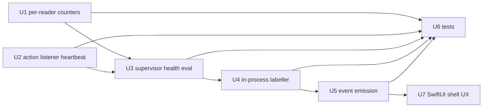

# feat: SCR-76 Mid-Recording Capture Health Detection

## Summary

Detect silently-broken recordings from inside the engine by watching, per reader (screen, window, action), the gap between *capture attempts* and *useful output* over a short rolling window. When a reader is demonstrably attempting but producing nothing useful, attribute the likely cause with an in-process Quartz/Accessibility lookup: emit the existing `permission_lost` event when a TCC permission is the cause, or a new advisory `capture_unhealthy` event otherwise. The check folds into the engine's existing 1-second supervisor loop (no new thread, no new IPC), is fail-open throughout, and surfaces a distinct UX in the SwiftUI shell for the non-TCC case.

---

## Problem Frame

Daemon recordings in the bundled `ScreenCap.app` have been silently producing useless captures — audio records fine, but the screen-side event tables (action, window, screenshot) come back empty even when the user was actively interacting. The user lives through the whole failure with no signal. The daemon recording path runs the engine with `PermNoop` (`src/screencap/session.py:222`), so the standalone CLI's mid-recording revocation watcher (`MacOSTCC.poll`, which spawns a subprocess TCC probe that is broken in the frozen binary) never runs there at all — the daemon path has **no mid-recording health mechanism**. The underlying cause of a silent failure can be TCC denial, a Quartz hiccup, a dead reader/listener, or a fresh-build-identity-invalidated TCC grant; a permission probe is a proxy for one cause rather than an observation of the symptom. See origin: [docs/brainstorms/2026-05-28-scr-76-mid-recording-capture-health-requirements.md](docs/brainstorms/2026-05-28-scr-76-mid-recording-capture-health-requirements.md).

This work serves the **Capture engine: quality & performance** strategy track (the "floor" — `STRATEGY.md`) and its **Capture reliability rate ≥98%** metric: a recording that yields only audio is a reliability failure the product currently cannot even see.

---

## Requirements

- R1. The engine observes per-reader *attempt* vs *useful-output* over a rolling window; a reader is unhealthy when it is demonstrably attempting but producing no useful output. Unhealth is per-reader and bubbles to a recording-level signal.
- R2. The health check runs in the engine process and consumes in-process per-reader counters; it MUST NOT introduce new IPC between daemon, engine, and SwiftUI shell.
- R3. The detection window is short (seconds). Idle (attempts produce zero output because there is nothing to capture) is distinguished from broken (attempts produce zero output because the call fails/returns empty) at the reader level, not by window length. Exact window/debounce is a plan-time calibration (see Open Questions).
- R4. Tolerate transient Quartz/PyObjC failures in any attribution call without killing the recording (fail-open), and tolerate a single attempt-without-output tick without firing (debounce); unhealth requires a sustained gap.
- R5. When unhealth fires, perform an in-process Quartz/Accessibility check to label which TCC permission (Screen Recording, Accessibility, Input Monitoring) is the likely cause.
- R6. The labeller's per-process TCC cache limitation is acceptable: the cache reflects state at engine start, sufficient for attribution after a symptom is observed independently.
- R7. When attribution is inconclusive (Quartz import fails, or all permissions report granted), emit a cause-agnostic signal rather than guessing.
- R8. When a TCC permission is identified, emit the existing `permission_lost` stderr event with the correct `permission=` value, preserving the shell's existing deny-path behavior.
- R9. When the cause is non-TCC or inconclusive, emit a distinct, cause-agnostic event (NEW event type, not a `permission_lost` variant) so the shell can present a different UX.
- R10. The daemon mid-recording path detects health via the new capture-side mechanism and never calls the subprocess-based TCC probe.
- R11. At least one test drives the engine with a reader stub that "attempts but produces nothing" and verifies the unhealth event fires; idle (attempts proportional to output, or zero/zero with a live reader) MUST NOT trigger it.
- R12. The frozen-daemon dispatch path is exercised end-to-end by at least one test/harness using the actual bundled entry-point semantics, so the broken-in-frozen-but-green-in-tests regression class cannot recur for the mid-recording watcher.

**Origin actors:** end user (recording subject), SwiftUI shell `RecorderController` (event consumer), the daemon engine worker (detector/emitter).
**Origin flows:** daemon recording → mid-recording health evaluation → cause attribution → event emission → shell UX.
**Origin acceptance examples:** AE1 (covers R1, R8 — screen denied → `permission_lost`), AE2 (covers R1, R9 — dead reader → cause-agnostic), AE3 (covers R3 — idle → no signal), AE4 (covers R4, R7 — labeller raises → cause-agnostic, recording continues).

> **AE2 interpretation note.** AE2's "a reader thread has died" splits into two cases this plan handles differently: a genuinely *dead thread* (`not is_alive()`) is already reported by the existing `record.child_died` path (no new emit), while a thread that is *alive but its listener is dead/disabled* (the case counters cannot see) is what the new action heartbeat (U2) covers. R1's "demonstrably attempting but producing no useful output" applies to the screen/window readers' attempt-vs-output gap; the callback-driven action reader uses the heartbeat instead (see Key Technical Decisions).

---

## Scope Boundaries

- The CLI first-run prompt-loop's frozen-mode breakage (`_check_macos_permissions` → `_check_permission_fresh`) is **not** addressed; that surface keeps its existing behavior.
- The standalone CLI's existing `MacOSTCC.poll` mid-recording watcher and its subprocess probe are **not** removed; the new capture-side check coexists with it on the standalone path (redundant but harmless) and is the *sole* mechanism on the daemon path.
- No hidden `_probe-permission` Click subcommand is introduced.
- The watcher is not moved into the SwiftUI shell, and no new daemon-socket protocol for shell-driven termination is introduced.
- `TCC.db` kqueue/FSEvents observation is not pursued.
- The startup preflight is not re-litigated (see Dependencies — assumes PR #193's in-process Quartz preflight).
- The fresh-build-identity-invalidates-TCC-grant problem is not addressed here.
- No separate interactive-vs-passive recording mode is introduced — reader-level attempt-vs-output makes mode tagging unnecessary.

### Deferred to Follow-Up Work

- **Startup-preflight in-process Quartz fix (PR #193 / SCR-69 chain):** assumed present at implementation time; lands via the existing `rutefig/scr-76-...` branch chain, not this plan (see Dependencies).
- **The `n_uploaded` NameError in the recording cleanup path:** tracked separately.

---

## Context & Research

### Relevant Code and Patterns

- **Engine readers** (`src/screencap/engine/recorder.py`):
  - `read_screen_events` — real polling loop at `config.SCREEN_CAPTURE_FPS` (20 fps); `screenshot = utils.take_screenshot()`, `continue` on `None`, enqueue to `event_q`. Per-iteration "attempt" site exists.
  - `read_window_events` — real polling loop at `config.AX_QUERY_INTERVAL` (0.5s); `window_data = window.get_active_window_data()`, `continue` on falsy, **change-gated** enqueue (`if window_data != prev_window_data`). Per-iteration "attempt" site exists; "poll returned data" precedes the change gate.
  - `read_keyboard_events` / `read_mouse_events` / `read_gesture_events` — **pynput `Listener` / `CGEventTap` callbacks**, NOT polling loops; they call `trigger_action_event` on input and then `terminate_processing.wait()`. No per-iteration attempt site. Gesture reader already samples `Quartz.CGEventTapIsEnabled(tap)`.
- **Existing counters** (`src/screencap/engine/recorder.py`): `num_screen_events` / `num_action_events` / `num_window_events` / `num_video_events` are `multiprocessing.Value`s incremented inside the `process_events` **thread** — **post-dedup / post-action-gate** (e.g. `num_screen_events` only counts action-triggered saves when `RECORD_FULL_VIDEO=False`). They are NOT raw per-reader output and must not be reused as the health signal. `_drop_counts` is the existing in-process plain-dict counter pattern to mirror.
- **Supervisor loop** (`src/screencap/engine/recorder.py`, `record()`): a `while not (stop_sequence_detected or terminate_processing.is_set())` loop ticking every `time.sleep(1)`, iterating `task_by_name`, emitting `record.child_died` on `not task.is_alive()`, with `_CRITICAL_TASKS` driving stop. This is where the health check folds in.
- **Standalone watcher** (`src/screencap/engine/screen_recorder.py`, `_run_screen_recorder`): `permission_policy.poll(elapsed)` → catches `PermissionRevoked` → emits `EVENT_PERMISSION_LOST` → `_stop_event.set(); recorder.stop()` (terminal, exit code 3). Daemon path uses `PermNoop` so this never runs there.
- **Labeller building blocks** (`src/screencap/engine/platform/darwin.py`, `DarwinPlatform`): `is_screen_recording_enabled()` (`Quartz.CGPreflightScreenCaptureAccess`), `is_input_monitoring_enabled()` (`Quartz.CGPreflightListenEventAccess`), `is_accessibility_enabled()` (`AXIsProcessTrustedWithOptions`). All fail-open (return `True` on import/attr error).
- **Event protocol** (`src/screencap/_stderr_events.py`): `emit_event(type, **fields)` writes one JSON line to stderr; event-type constants in `__all__`; `permission_lost` carries `permission=` ∈ {`screen_recording`, `accessibility`, `input_monitoring`} and `elapsed=`. Cross-language contract: `docs/research/2026-04-28-stderr-event-schema.md`.
- **Frozen dispatch** (`src/screencap/daemon/supervisor.py` `_default_engine_command`; `src/screencap/cli/__init__.py` `_engine-worker` hidden command): the daemon spawns the engine via the `_engine-worker` Click entry; tests override via `SCREENCAP_DAEMON_ENGINE_COMMAND` / `engine_command_factory` with the `fake_engine_script` fixture (`tests/daemon/test_supervisor.py`).
- **Shell contract** (`macos/ScreenCap/Controllers/RecordingStateMachine.swift` `reduce`, `RecorderController.swift` `handlePermissionLost`, `RecorderAlertPresenter.swift`): `RecorderEventLine` already decodes `permission`, `reason`, `ts`; unknown event types hit a tolerant `default:` no-op. `permission_lost` → `handlePermissionLost(permission:)`.

### Institutional Learnings

- **SCR-69 / PR #193 (`docs/solutions/` gap — git only, commit `0813db56`):** the broken `sys.executable -c` subprocess probe (rejected by the frozen Click binary → `None` → fail-open). PR #193 fixed only the *worker-start* preflight with an in-process `Quartz.CGPreflightScreenCaptureAccess` (valid because the worker is freshly spawned). The mid-recording watcher was explicitly left as a follow-up — that follow-up is SCR-76. **Mirror the fix shape** (in-process Quartz, fail-open). *(Worth a `/ce-compound` doc when this lands — there is no solution doc for this twice-biting trap.)*
- **`docs/solutions/runtime-errors/macos-tcc-per-process-cache-quit-and-relaunch.md`:** `CGPreflightScreenCaptureAccess` / `AXIsProcessTrustedWithOptions` / `IOHIDCheckAccess` cache their answer at process launch; macOS sends no "TCC changed" notification. ⇒ Use the **counter gap as the authoritative "broken now" signal; Quartz only to LABEL the cause**.
- **`docs/tickets/2026-05-09-fix-stderr-bridge-backpressure.md`:** `emit_event` flushes per call; a slow subscriber can block the engine when the stderr pipe fills (and `is_alive()` still reports running). ⇒ **Emit once per detection EDGE, not per tick.**
- **`docs/solutions/runtime-errors/eventbus-late-listener-replay-2026-05-12.md`:** the engine→shell path is stderr → daemon `EventBus` → `/v0/events?since=cursor` with a 256-event replay buffer; a new event is replayable for late subscribers if published through that path. Also names the "green-in-tests, broken-in-production-timing" class verbatim.
- **`docs/solutions/runtime-errors/cgeventtap-disabled-sentinel-assertion-failure.md`:** PyObjC warmup is required — first access to a `Quartz.k…`/symbol resolves the bridge lazily and is not thread-safe off the main thread. ⇒ **Pre-resolve labeller symbols in the warmup block** if the check runs off-main-thread.
- **`docs/solutions/integration-issues/macos-foundation-process-pipe-pitfalls.md`:** spawned sub-binaries don't inherit TCC bundle identity (reinforces "subprocess probing is the wrong tool"); a final stderr event near teardown can be dropped unless the pipe is drained to EOF.
- **SCR-54 ownership (`docs/superpowers/specs/2026-05-15-scr-54-macos-permission-ownership-design.md`):** the daemon/engine — not the Swift app — is the authority for daemon-backed revocation; the shell *reacts* to the event stream and must not independently probe TCC for daemon recordings. The new event slots into this contract.

### External References

- None. Local patterns are strong and directly analogous (PR #193's in-process Quartz preflight is the exact precedent); no external research was warranted.

---

## Key Technical Decisions

- **The capture-side attempt-vs-output gap is the authoritative "broken" detector; in-process Quartz is a *labeller* only.** The per-process TCC cache makes Quartz unreliable as a live detector inside the long-running engine but acceptable for attribution after a symptom is observed independently (origin Key Decisions; R5/R6/R7).
- **Fold the health check into the existing `record()` 1-second supervisor loop — no new thread.** The loop already ticks every 1s, iterates `task_by_name` (so dead/absent readers and video-disabled mode are handled for free), and runs in the engine process with direct in-process access to the counters. This satisfies R2 (no new IPC) and avoids a watcher thread to manage/join.
- **The check is detection + emission only; it NEVER self-stops the recording.** Fail-open (R4/AE4). Downstream consumers retain existing behavior: the standalone path's `MacOSTCC.poll`/exit-code-3 and the shell/daemon deny handling (SCR-54) govern any actual stop on `permission_lost`.
- **Per-reader "useful output" definitions:**
  - **window** = `get_active_window_data()` returned *queryable data* (truthy), counted **before** the change gate — so a user sitting on one window stays healthy while Accessibility-denied (falsy → `continue`) opens the gap.
  - **screen** = `take_screenshot()` returned a non-`None` frame. **Frame-content discrimination is unreliable and is NOT the primary screen-denial signal:** under Screen-Recording denial `screencapture -x` may return `None`, an all-black frame, OR a live desktop-wallpaper/backdrop frame that *changes over time* (clock, notifications) — so neither a `None`-check nor a `dhash`-static check reliably opens the gap (review finding: adversarial). Treat `None`/exception as the only robust content signal for a *dead-ish* screen reader; rely on the **commit-rate dimension** (below) and the **labeller** for the denial case, and treat any frame-degeneracy heuristic as best-effort only (deferred — see Open Questions).
  - **action** = `trigger_action_event` fired. Absence is idle, not unhealth. Action liveness comes from a listener heartbeat (U2), **but `Listener.running` alone is insufficient**: under Input-Monitoring/Accessibility denial (or a stale build-identity grant) the pynput listener thread stays `running == True` while the OS delivers zero callbacks — indistinguishable from idle by counters or heartbeat (review finding: adversarial). This is a known coverage gap (see the detection-coverage decision below and Open Questions).
- **Action-reader health uses a listener-liveness heartbeat, not the attempt/output gap.** For callback-driven readers, `(attempts=0, output=0)` is simultaneously idle (AE3) and dead-listener (AE2); only a heartbeat (`pynput Listener.running` / `CGEventTapIsEnabled`) separates them.
- **The new `capture_unhealthy` event is ADVISORY (no exit code, never terminal); the TCC branch reuses the terminal-capable `permission_lost`.** "You cannot have both 'emit the existing permission_lost' and 'recording continues'" for the same branch — so TCC → `permission_lost` (existing semantics preserved), non-TCC/inconclusive → advisory `capture_unhealthy`.
- **Emit once per detection EDGE, not per tick** (stderr backpressure). Hold per-reader `already_emitted` state, cleared when the reader returns to healthy.
- **No double-emit with `record.child_died`.** The existing supervisor already reports genuinely dead threads via `record.child_died`. The new check covers the gap that path cannot see — a thread/listener *alive but producing nothing useful* — and only evaluates readers that are `is_alive()`.
- **Delta-based counter comparison** (snapshot per window) — wrap-immune and matches the idle-vs-broken-at-reader-level model.
- **Two complementary detection dimensions, not one.** Per-reader raw attempt-vs-output catches a *broken reader* (screen returns `None`/raises, window poll returns falsy). But the production bug — action AND window AND screenshot tables all empty during active interaction — is the signature of nothing reaching the *tables*, which in action-gated mode (`RECORD_FULL_VIDEO=False`) happens when the action path is starved: the screen reader produces good frames (reads healthy) yet no action ever anchors a screen/window save, so the post-filter commit counters (`num_screen_events`/`num_action_events`/`num_window_events`) stay flat (review finding: adversarial). The health check therefore ALSO consults the existing post-filter **commit-rate** (`num_*_events` deltas) over the window as a recording-level "are rows landing" signal — the one place those counters ARE the right signal. **Caveat:** zero commits during a *legitimately idle* recording is normal, so the commit-rate dimension cannot fire on its own without an independent "user is active" signal; see the coverage limits below.
- **Explicit detection-coverage limits (be honest about what this does NOT catch).** This mechanism reliably catches: a broken reader (None/exception/falsy poll), a dead reader thread (existing `record.child_died`), and a permission denied at/near engine start (fresh-cache labeller → `permission_lost`). It does NOT reliably catch: (a) **TCC-starved action callbacks** where `Listener.running` stays true but zero events are delivered — indistinguishable from idle from inside the engine; (b) **mid-recording Screen-Recording revocation** where the per-process Quartz cache still reports "granted" (R6) → attribution is inconclusive → advisory, not `permission_lost`; (c) a screen reader returning changing-but-useless frames (wallpaper). The labeller is the only signal for (a)/(b) and it is cache-limited. These gaps are recorded in Open Questions and Risks; closing them fully may require a brainstorm revisit (e.g., a periodic fresh permission read), which is out of scope here.
- **AE1 is bounded by the cache limitation.** AE1 ("screen denied → `permission_lost(screen_recording)`") fires reliably only when the labeller can read a *denied* state — i.e. denied at/near engine start. For a true *mid-recording* revocation with a stale "granted" cache, the user receives the advisory `capture_unhealthy` instead (per R6/R7). The user still gets a visible signal; the precise permission attribution is best-effort.

---

## Open Questions

### Resolved During Planning

- *Where the attempt counter increments* → at the top of each polling loop iteration (screen/window), before the capture call. Output increments on a *useful* result per the definitions above.
- *Where the watcher lives* → folded into `record()`'s existing 1s supervisor loop, not a new thread.
- *New event vs `permission_lost` overloading* → distinct advisory `capture_unhealthy`; TCC reuses `permission_lost`.
- *Relationship to `record.child_died`* → no double-emit; new check covers live-but-broken only; monitor `is_alive()` readers.
- *Action-reader semantics* → listener-liveness heartbeat (U2).
- *R10 on the daemon path* → satisfied by adding the capture-side mechanism and never wiring a subprocess probe into it; daemon path had no watcher to begin with.

### Deferred to Implementation

- **Exact health window length and debounce count**, calibrated to reader cadences (screen 20 fps, window 0.5s poll, supervisor 1s tick). Direction: window on the order of ~10s, debounce of a few consecutive unhealthy ticks; expose as `config.Settings` fields (env-overridable). (Affects R3.)
- **Empirical denied-screen behavior:** does `screencapture -x` return `None`, an all-black frame, OR a live desktop-wallpaper frame under Screen-Recording denial on the target macOS? The plan treats `None`/exception as the only robust content signal and leans on the labeller + commit-rate for the denial case; confirm empirically before relying on any frame-degeneracy heuristic. (Affects R1/AE1; execution-time observation.)
- **Per-bundle-identity TCC semantics for the daemon worker's in-process Quartz call** (R5). PR #193's working preflight strongly implies the freshly-spawned worker reports correctly at start; the residual mid-recording cache caveat is handled by R6/R7. Confirm empirically.

### Coverage Gaps Surfaced by Review (accept or resolve; some may warrant a brainstorm revisit)

- **TCC-starved action callbacks are not detectable from in-process counters/heartbeat.** When Input Monitoring / Accessibility is denied (or a build-identity grant is stale), the pynput listener stays `running == True` but delivers zero callbacks — indistinguishable from idle. If the production silent-failure is action-starvation, this mechanism will not catch it; the only signal is the cache-limited labeller. Closing this fully likely needs a *periodic* fresh permission read (rejected by the brainstorm for cost/cache reasons) — a product/architecture call that may warrant a brainstorm revisit, not a plan-time decision.
- **"All readers look healthy but nothing is landing in the tables"** (action-gated mode): whether the commit-rate dimension should escalate to an unhealth verdict (needs an independent "user is active" signal) or stay corroboration-only. v1 keeps it corroboration-only to avoid idle false-positives.
- **`permission_lost` terminal contract on the daemon path:** confirm `RecorderController.handlePermissionLost` does not tear down shell state while the daemon engine keeps running when `permission_lost` arrives without an engine stop, and is idempotent for the standalone double-fire (`MacOSTCC.poll` + new check). Verify before emitting `permission_lost` from the new site (U5/U7).
- **Advisory UX specifics for `capture_unhealthy`** (widget, remediation action, `Effect` payload, re-show, `.stopping` guard): enumerated with recommended defaults in U7; genuine UX decisions to settle at implementation.
- **Frozen test-harness shape** (R12): resolved in U6 — a real `_engine-worker` entry-point test (NOT the `fake_engine_script` stub, which never runs `record()`), plus a broken-probe unit test.

---

## High-Level Technical Design

> *This illustrates the intended approach and is directional guidance for review, not implementation specification. The implementing agent should treat it as context, not code to reproduce.*

**Per-reader health truth table** (the core deliverable from flow analysis). Verdicts: HEALTHY · IDLE (no fire) · UNHEALTHY→label (run labeller; emit `permission_lost` if TCC else `capture_unhealthy`) · DEAD (existing `record.child_died` path; no new emit).

| reader | attempts | useful output | verdict | event |
|---|---|---|---|---|
| **screen** | 0 | 0 | thread not iterating → DEAD | (existing `record.child_died`) |
| **screen** | >0 | 0 | UNHEALTHY → label | `permission_lost(screen_recording)` if TCC else `capture_unhealthy` |
| **screen** | >0 | >0 | HEALTHY | none |
| **window** | 0 | 0 | DEAD | (existing `record.child_died`) |
| **window** | >0 | 0 (poll returns falsy) | UNHEALTHY → label | `permission_lost(accessibility)` if TCC else `capture_unhealthy` |
| **window** | >0 | >0 (poll returns data; even if unchanged) | HEALTHY (incl. idle on one window) | none |
| **action** | — (heartbeat) | n/a | listener alive → HEALTHY (incl. idle, AE3); listener dead while thread alive → UNHEALTHY → label | `capture_unhealthy` (or `permission_lost(input_monitoring/accessibility)` if labeller attributes) |

> **Coverage caveat (do not over-read the table).** The action row's "listener alive → HEALTHY" verdict is a *known false-negative* for TCC-starved callbacks (listener alive, zero events delivered) — counters and heartbeat cannot separate that from idle. And the screen row's "useful output" cannot be reliably derived from frame content (denial may yield changing wallpaper). The **commit-rate dimension** (`num_*_events` deltas) is a complementary recording-level signal for "nothing is landing in the tables," but it must not fire during legitimate idle. See the detection-coverage decision in Key Technical Decisions and the Open Questions.

**Detection → attribution → emission flow:**

```mermaid
flowchart TD
    A[record() supervisor loop, every 1s] --> B{first full window elapsed?}
    B -- no --> A
    B -- yes --> C[snapshot per-reader attempt/output deltas<br/>+ sample action listener heartbeat]
    C --> D{any alive reader: attempting but no useful output,<br/>sustained >= debounce?}
    D -- no --> R[reset per-reader already_emitted; continue] --> A
    D -- yes --> E{already_emitted for this reader?}
    E -- yes --> A
    E -- no --> F[in-process Quartz/AX labeller]
    F --> G{a TCC permission reports denied?}
    G -- yes --> H[emit permission_lost permission=...]
    G -- no / Quartz raises / all granted --> I[emit capture_unhealthy reason/reader=...]
    H --> J[mark already_emitted; recording continues] --> A
    I --> J
```

---

## Implementation Units



### U1. Raw per-reader attempt/output counters

**Goal:** Introduce in-process, raw per-reader attempt and useful-output counters for the screen and window readers and a useful-output counter for the action path — distinct from the post-filter `num_*_events`.

**Requirements:** R1, R2, R3

**Dependencies:** None

**Files:**
- Modify: `src/screencap/engine/recorder.py` (`read_screen_events`, `read_window_events`, `trigger_action_event`; counter container in `record()`)
- Test: `tests/test_capture_health.py` (new — shared behavioral file for U1–U5; see U6)

**Approach:**
- Add a small in-process counter holder (plain ints, GIL-safe, mirroring the existing `_drop_counts` pattern — NOT `multiprocessing.Value`, since readers, `process_events`, and the supervisor all share the engine process). Keys: `screen.attempt/output`, `window.attempt/output`, `action.output`.
- Screen: increment `screen.attempt` at the top of each loop iteration (before `take_screenshot()`); increment `screen.output` when `take_screenshot()` returns non-`None` (a `None`/exception is the only robust content signal — frame-content degeneracy is unreliable per Key Technical Decisions and is NOT relied on here).
- Window: increment `window.attempt` at the top of each iteration; increment `window.output` when `get_active_window_data()` returns truthy (queryable) — **before** the change gate.
- Action: increment `action.output` inside `trigger_action_event` when an event is produced (a `queue.Full` drop still counts — the reader produced an event).
- The supervisor (U3) snapshots these raw counters AND the existing post-filter commit counters (`num_screen_events`/`num_action_events`/`num_window_events`); no locks beyond the GIL for monotonically-incrementing ints.

**Patterns to follow:** `_drop_counts` dict in `src/screencap/engine/recorder.py`; existing reader loop structure and `started_event` gating.

**Test scenarios:**
- Happy path: screen loop iteration increments `screen.attempt`; a non-`None` frame increments `screen.output`.
- Edge case: `take_screenshot()` returns `None` → `screen.attempt` increments, `screen.output` does not.
- Edge case (window idle-but-healthy): `get_active_window_data()` returns truthy but unchanged → `window.output` increments even though nothing is enqueued (so a user sitting on one window is not flagged).
- Edge case (window broken): `get_active_window_data()` returns falsy → `window.attempt` increments, `window.output` does not.
- Happy path: `trigger_action_event` fired → `action.output` increments; a `queue.Full` drop still counts as output (the reader produced an event).
- Integration: counters are plain in-process ints readable by the supervisor with no IPC (assert type/visibility).

**Verification:** Reader loops increment the new counters at the documented sites; `num_*_events` are untouched; counters are visible in the engine process without `multiprocessing`.

---

### U2. Action-reader listener-liveness heartbeat

**Goal:** Provide a per-tick liveness signal for the callback-driven action readers so a dead listener on a live thread is distinguishable from legitimate idle.

**Requirements:** R1 (action), R3 (idle vs broken), advances AE2/AE3

**Dependencies:** None (consumed by U3)

**Files:**
- Modify: `src/screencap/engine/recorder.py` (publish listener/tap handles to `record()`; a `action_listener_alive()` helper)
- Test: `tests/test_capture_health.py` (shared behavioral file; see U6)

**Approach:**
- The pynput `keyboard_listener` / `mouse_listener` and the gesture `CGEventTap` are currently **locals** inside their reader-thread functions with no channel back to `record()` (feasibility finding). Name the publish mechanism: each action reader writes its handle into a `record()`-owned shared dict (passed in like `task_started_events`) immediately after `.start()`. `action_listener_alive()` reads that dict and treats a missing/`None` handle as **alive** (fail-open) so the start-race window before a handle is published never fires. Handle the gesture-tap case (its `tap` is local to `read_gesture_events`, reachable only from the run-loop thread) the same way.
- The predicate samples `Listener.running` and `Quartz.CGEventTapIsEnabled(tap)`. **Known limitation:** `Listener.running` stays `True` under TCC callback starvation (no events delivered) — so this heartbeat catches a crashed/disabled listener but NOT a silently-starved one. The starvation case is a documented coverage gap (Key Technical Decisions; Open Questions), not closed by this unit.
- This predicate — not the attempt/output gap — is the action reader's liveness input to U3.

**Patterns to follow:** the gesture reader's existing `CGEventTapIsEnabled(tap)` check in `read_gesture_events`; fail-open style of `DarwinPlatform.is_*_enabled()`.

**Test scenarios:**
- Happy path (AE3): listeners `running == True` with zero input over the window → action liveness healthy (idle does not fire).
- Edge case (AE2): a listener reports `running == False` (or gesture tap disabled) while its thread is alive → action liveness unhealthy.
- Error path: `Listener` handle missing / attribute access raises → `action_listener_alive()` returns alive (fail-open), no false positive.

**Verification:** `action_listener_alive()` reflects real listener state, returns alive on any sampling error, and is consumed by U3.

---

### U3. Capture-health evaluation in the supervisor loop

**Goal:** Evaluate per-reader health each supervisor tick using rolling-window deltas, debounce, start-barrier, and edge state, producing a per-reader unhealthy verdict (or none) without ever self-stopping the recording.

**Requirements:** R1, R3, R4, R10

**Dependencies:** U1, U2

**Files:**
- Modify: `src/screencap/engine/recorder.py` (`record()` supervisor loop, ~the `while not (stop_sequence_detected or terminate_processing.is_set())` block)
- Modify: `src/screencap/engine/config.py` (`CAPTURE_HEALTH_WINDOW_SECS`, `CAPTURE_HEALTH_DEBOUNCE_TICKS` — env-overridable `Settings` fields)
- Test: `tests/test_capture_health.py` (shared behavioral file; see U6)

**Approach:**
- Hold cross-tick state in `record()` locals: last counter snapshot per reader (raw attempt/output AND post-filter `num_*_events` commit counts), per-reader consecutive-unhealthy run length (debounce), per-reader `already_emitted` flag, and a `first_snapshot_taken` barrier.
- Each tick (the existing 1s cadence): once one full window has elapsed, compute deltas; apply the truth table (screen/window via attempt-vs-useful-output deltas, action via `action_listener_alive()`); a reader is unhealthy only when the gap is sustained ≥ debounce.
- **Commit-rate dimension:** also track the commit-counter deltas (`num_*_events`). This is the recording-level "are rows landing" signal for the action-gated production bug, but it must NOT fire on its own during legitimate idle (zero commits is normal when the user isn't interacting). Use it as corroboration — e.g., a broken-reader gap plus zero commits raises confidence — and as the input to the "all readers look healthy but nothing is landing" diagnostic surfaced in Open Questions. Do not promote zero-commit-alone to an unhealth verdict in v1.
- Only evaluate readers present in `task_by_name` and `is_alive()` (handles video-disabled mode and defers genuinely-dead threads to the existing `record.child_died` path — no double-emit).
- On a fresh unhealthy edge (not `already_emitted`), hand off to U4 (labeller) then U5 (emission); set `already_emitted`; clear it when the reader returns to healthy.
- Wrap the added evaluation in try/except: a watcher error is logged once and the recording continues (fail-open). The check never calls `recorder.stop()` / `terminate_processing.set()`.
- Do not evaluate/emit during teardown (after `terminate_processing.is_set()`), avoiding the stderr pipe-drain race.

**Execution note:** Add the R11 reader-stub health test alongside this unit (it is the primary behavioral assertion for the whole feature).

**Technical design:** *(directional)* see the truth table and flowchart in High-Level Technical Design. Cross-tick state per reader: `{prev_attempt, prev_output, unhealthy_run, already_emitted}` plus a global `first_snapshot_taken`.

**Patterns to follow:** the existing health-check block in `record()` (`task_by_name` iteration, `_CRITICAL_TASKS`, `record.child_died` emission, `time.sleep(1)` cadence).

**Test scenarios:**
- Happy path: reader with attempts>0 and useful-output>0 over the window → healthy, no event.
- Edge case (Covers AE3 — idle): action heartbeat alive + zero action output, while screen/window produce data → no event.
- Edge case (broken): screen attempts>0, useful-output=0 sustained ≥ debounce → unhealthy verdict, labeller invoked once.
- Edge case (debounce): a single transient zero-output tick → does NOT fire.
- Edge case (start-barrier): before the first full window elapses (counters at 0/0) → no fire.
- Edge case (video-disabled): screen reader absent from `task_by_name` → not evaluated, no false unhealth.
- Edge case (no double-emit): a reader that is `not is_alive()` → not evaluated by the health check (left to `record.child_died`).
- Error path (fail-open): the evaluation block raises → caught, logged once, recording continues, `terminate_processing` not set.
- Edge case (emit-once-per-edge): unhealthy persists across many ticks → labeller/emission invoked once until the reader returns healthy.
- Edge case (idle commit-rate): legitimately idle recording (no interaction) → zero commits over the window does NOT fire on its own.

**Verification:** Idle never fires; a sustained attempt-without-useful-output gap fires exactly once per edge; the check never stops the recording and survives its own exceptions.

---

### U4. In-process Quartz/Accessibility labeller

**Goal:** When unhealth fires, attribute the likely TCC cause in-process, returning a permission label or "inconclusive", fail-open.

**Requirements:** R5, R6, R7

**Dependencies:** U3

**Files:**
- Modify: `src/screencap/engine/recorder.py` (labeller helper invoked from the supervisor; or a thin module under `src/screencap/engine/`)
- Modify: `src/screencap/engine/recorder.py` PyObjC warmup site (pre-resolve labeller symbols) — or wherever the existing warmup lives
- Test: `tests/test_capture_health.py` (shared behavioral file; see U6)

**Approach:**
- Reuse `DarwinPlatform.is_screen_recording_enabled()` / `is_input_monitoring_enabled()` / `is_accessibility_enabled()`. Map a `False` result to its `permission=` label (`screen_recording` / `input_monitoring` / `accessibility`); optionally bias ordering by which reader is unhealthy (screen→Screen Recording, window→Accessibility, action→Input Monitoring/Accessibility).
- **Avoid the `osascript` subprocess fallback:** `DarwinPlatform.is_accessibility_enabled()` falls back to a blocking `osascript` subprocess (`timeout=5`) when `ApplicationServices` import fails — a 5s block inside the 1s supervisor loop and a subprocess in the path this plan keeps subprocess-free (feasibility finding). The labeller should call the Quartz/`ApplicationServices` primitive directly and return **inconclusive** on import failure rather than spawning `osascript`.
- If Quartz import/call raises, or all checks report granted (incl. a stale "granted" from the per-process cache, R6), return **inconclusive** (R7).
- Pre-resolve the Quartz/AX symbols used here in the existing PyObjC warmup block, since the supervisor may call them off the main thread.
- The labeller is fail-open: any exception → inconclusive, never propagates.

**Patterns to follow:** PR #193's in-process `Quartz.CGPreflightScreenCaptureAccess` worker preflight; `DarwinPlatform.is_*_enabled()` fail-open style; the warmup pre-resolution pattern from the cgeventtap learning doc.

**Test scenarios:**
- Happy path (AE1): screen unhealthy + `is_screen_recording_enabled()` → `False` → label `screen_recording`.
- Happy path: window unhealthy + `is_accessibility_enabled()` → `False` → label `accessibility`.
- Edge case (R7 inconclusive): all `is_*_enabled()` return `True` → inconclusive.
- Error path (AE4): a labeller call raises / Quartz import fails → inconclusive, no exception propagates.
- Edge case: off-main-thread invocation does not crash (symbols pre-resolved).

**Verification:** Returns a correct label when a permission reports denied, "inconclusive" otherwise, and never raises.

---

### U5. Event emission — `permission_lost` reuse + new `capture_unhealthy`

**Goal:** Emit the right event for the labeller's verdict — existing `permission_lost` for a TCC cause, a new advisory `capture_unhealthy` otherwise — once per detection edge.

**Requirements:** R8, R9

**Dependencies:** U4

**Files:**
- Modify: `src/screencap/_stderr_events.py` (add `EVENT_CAPTURE_UNHEALTHY = "capture_unhealthy"` + a closed set of `reason` constants; append to `__all__`)
- Modify: `docs/research/2026-04-28-stderr-event-schema.md` (document the new event: fields, advisory semantics, no exit code)
- Modify: `src/screencap/engine/recorder.py` (emit from the supervisor on the unhealthy edge)
- Test: `tests/test_stderr_event_contract.py` (extend), `tests/test_capture_health.py` (emission asserted in the shared behavioral file)

**Approach:**
- TCC label → `emit_event(EVENT_PERMISSION_LOST, permission=<label>, elapsed=<float>)`, matching the existing field shape so the shell's `handlePermissionLost` path is reused with zero shell change for the TCC case.
- Inconclusive/non-TCC → `emit_event(EVENT_CAPTURE_UNHEALTHY, reason=<closed-set string>, reader=<which>, elapsed=<float>)`. The event is **advisory**: no exit-code mapping, never terminal.
- **Constrain `reason` to a closed set of constants** defined in `_stderr_events.py` (e.g. `inconclusive`, `listener_dead`, `reader_dead`) — never interpolate runtime-derived text (exception strings, OS error messages, paths) into it, since the field rides the daemon EventBus to any same-EUID subscriber (security finding). Document the closed set in the schema doc.
- **Verify the `permission_lost` terminal contract before emitting from this new site** (security finding): the standalone path follows `permission_lost` with `recorder.stop()` (terminal), but this check is emit-only and the daemon path has no policy-driven stop. Confirm `RecorderController.handlePermissionLost` behaves correctly when `permission_lost` arrives WITHOUT an accompanying engine stop on the daemon path — i.e. it does not tear down shell state while the engine keeps running (which would recreate a silent recording). Captured as an Open Question / U7 verification.
- Emission is gated by the U3 edge state (once per edge). Rely on existing `emit_event` error-swallowing.

**Patterns to follow:** existing `EVENT_PERMISSION_LOST` emission in `screen_recorder.py` / `session.py`; the event-type constant + `__all__` convention in `_stderr_events.py`.

**Test scenarios:**
- Happy path (R8/AE1): TCC label `screen_recording` → one `permission_lost` line with `permission="screen_recording"`.
- Happy path (R9/AE2/AE4): inconclusive/non-TCC → one `capture_unhealthy` line with `reason`/`reader` fields and no exit-code semantics.
- Edge case (emit-once-per-edge): repeated unhealthy ticks → no duplicate lines until the reader recovers and re-breaks.
- Contract: `EVENT_CAPTURE_UNHEALTHY` present in `_stderr_events.__all__` and the schema doc; `schema_version` unchanged; the event is documented as advisory.
- Error path: a broken stderr does not propagate (existing `emit_event` swallow).

**Verification:** The correct single event fires per cause per edge; `capture_unhealthy` is registered in the taxonomy and documented as advisory.

---

### U6. Tests — health-detection behavior + frozen-dispatch harness

**Goal:** Pin the health-detection behavior with a reader-stub test and exercise the frozen-daemon dispatch boundary so the broken-in-frozen-but-green-in-tests class cannot recur.

**Requirements:** R11, R12

**Dependencies:** U1, U2, U3, U4, U5

**Files:**
- Create: `tests/test_capture_health.py` (shared behavioral file — R11, AE1–AE4, emission, counters, labeller, eval)
- Create: `tests/test_capture_health_frozen_dispatch.py` (R12 — real entry-point dispatch)
- Modify: `tests/test_stderr_event_contract.py` (new event constant + `reason` closed set)
- Patterns: `tests/daemon/test_supervisor.py` (`SCREENCAP_DAEMON_ENGINE_COMMAND`, `engine_command_factory`), `tests/test_session_daemon_permission_preflight.py` (stub `Quartz` via fake `sys.modules`)

**Approach:**
- Consolidate the U1–U5 behavioral assertions into **one** `tests/test_capture_health.py`, asserting via the observed stderr event stream / counter state rather than per-internal-call files (CLAUDE.md "fewer better tests"; scope finding) — do NOT create a separate file per unit.
- R11: drive the supervisor/engine with a reader stub that advances `attempt` but never `output` → assert the unhealth event fires; assert idle (proportional output, or zero/zero with a live heartbeat) does NOT fire.
- **R12 (split into two distinct tests — the `fake_engine_script` stub canNOT host the watcher because it never runs `record()`; feasibility finding):** (a) a *real* `_engine-worker` entry-point test — point `SCREENCAP_DAEMON_ENGINE_COMMAND` at `python -m screencap _engine-worker` with readers stubbed to attempt-without-output, proving the watcher runs and emits across the dispatch boundary; (b) a lightweight unit test that simulates the broken subprocess probe (`_check_permission_fresh` → `None`) and asserts the new in-process mechanism still detects — pinning the SCR-69/PR #193 frozen-mode failure shape.
- AE4 path: labeller raises → `capture_unhealthy` emitted, recording continues (no crash).

**Execution note:** Characterization-style — assert via the observed stderr event stream / counter state, not internal call counts, so tests stay decoupled from implementation and do not deliver synthetic events in test-only ordering that hides production timing.

**Test scenarios:**
- Covers R11. Reader stub attempts-without-output → unhealth event fires; idle → no event.
- Covers AE3. Idle action reader (heartbeat alive, no input) → no event.
- Covers R12. Detection runs through the real `_engine-worker` dispatch boundary (fake-engine harness).
- Frozen-class regression: broken-probe simulation → in-process mechanism still detects.
- Covers AE4. Labeller raises → `capture_unhealthy` fired, recording continues.
- Contract: `capture_unhealthy` asserted in the stderr taxonomy test.

**Verification:** `pytest tests/` green; the R11 and R12 tests fail if the detection or the frozen-dispatch wiring regresses.

---

### U7. SwiftUI shell handling for `capture_unhealthy`

**Goal:** Surface a distinct, non-terminal UX in the SwiftUI shell when the engine emits the cause-agnostic `capture_unhealthy` event, so non-TCC silent failures become visible to the user.

**Requirements:** R9 (shell side), origin Success Criterion "visible signal regardless of cause"

**Dependencies:** U5

**Files:**
- Modify: `macos/ScreenCap/Controllers/RecordingStateMachine.swift` (`reduce` — add `case "capture_unhealthy"`; new `Effect` case)
- Modify: `macos/ScreenCap/Controllers/RecorderController.swift` (new handler in `apply()`; add a `reader` field to `RecorderEventLine` — the new event carries `reader`, which is NOT currently decoded; the "no struct change needed" assumption was wrong, per design review)
- Modify: `macos/ScreenCap/Controllers/RecorderAlertPresenter.swift` (distinct advisory presentation, separate from the per-permission deny path)
- Test: `macos/ScreenCapTests/` (XCTest for the new reduce case and the state guard)

**Approach (these UX decisions are not yet settled — defaults recommended, confirm at implementation; design review flagged all five as undecided):**
- **Widget type:** recommend a **non-blocking, persistent indicator** (menu-bar/popover banner), NOT a blocking `NSAlert` modal like the `permission_lost` path — a modal would contradict the advisory/non-terminal intent, and a bare `lastError` string is too easily missed during an active recording.
- **Remediation action:** the cause is inconclusive by definition, so there may be no specific Settings pane. Recommend offering a "Stop Recording" action plus a "Check Privacy & Security settings" link, and surfacing the `reader` field so copy can hint which capture is affected (e.g. "screen capture appears to be producing nothing"). This also covers the stale-cache path where a real Screen-Recording revocation could not be named.
- **Effect case + payload:** define the new `Effect` case explicitly (name + associated values carrying `reason`/`reader`) so `RecorderController.apply()` can close its switch — the engine (U5) and Swift (U7) sides must agree on the field set.
- **Re-show behavior:** the engine emits once per edge and re-emits after recover-then-re-break; recommend a persistent indicator that updates in place rather than re-popping.
- **`.stopping`/`.idle` guard:** suppress the advisory when the machine is not in `.recording` (mirror `handlePermissionLost`'s `if case .recording = state` guard) so a late event during teardown does not present.
- The UX is advisory and non-terminal — it does not tear down the session (SCR-54: the shell reacts, the daemon/engine owns detection). Leave the existing `permission_lost` → `handlePermissionLost` path untouched; verify it is idempotent for the standalone double-fire case (Open Questions).
- Unknown/older event types must still hit the tolerant `default:` no-op.

**Patterns to follow:** the existing `case "permission_lost"` → `handlePermissionLost` → `RecorderAlertPresenter` chain (and its `if case .recording = state` guard); tolerant decoding in `RecorderEventLine`.

**Test scenarios:**
- Happy path: `reduce` given a `capture_unhealthy` event → returns the new effect; `RecorderController` presents the advisory UX.
- Edge case: `permission_lost` still routes to `handlePermissionLost(permission:)` unchanged.
- Edge case: an unknown event type still hits `default:` (tolerant decoding preserved; no crash).
- Edge case (state guard): a `capture_unhealthy` event arriving when the machine is `.stopping` / `.idle` → advisory is NOT presented.
- Edge case (re-show): a second `capture_unhealthy` after recovery → indicator updates/re-presents per the chosen re-show policy, not a duplicate modal.
- Edge case (decode): `RecorderEventLine` decodes the new `reader` field without breaking existing event decoding.
- Integration: an emitted `capture_unhealthy` line (engine → daemon `EventBus` → `/v0/events`) reaches `reduce` and produces the advisory UX (covers the cross-layer path; late-subscriber replay applies).

**Verification:** A `capture_unhealthy` event produces a distinct, non-terminal UX; `permission_lost` behavior is unchanged; unknown events remain no-ops.

---

## System-Wide Impact

- **Interaction graph:** readers → in-process counters/heartbeat → `record()` supervisor evaluation → in-process labeller → `emit_event` → daemon `EventBus` → `/v0/events` → SwiftUI `reduce`. The new event rides the existing stderr→bus path (replayable for late subscribers, 256-event buffer).
- **Error propagation:** fail-open at every layer — counter sampling, labeller, and emission each swallow/contain errors; nothing here calls `recorder.stop()` or sets `terminate_processing`.
- **State lifecycle risks:** watcher state lives in `record()` locals and is torn down with the loop; emission is suppressed during teardown to avoid the stderr pipe-drain race; counters are monotonic in-process ints compared by delta (wrap-immune).
- **API surface parity:** both standalone and daemon recordings run the `record()` supervisor, so the check is active in both; the daemon path is the target (sole mechanism there), the standalone path coexists with `MacOSTCC.poll` (redundant, harmless, emit-once-per-edge).
- **Integration coverage:** R12 frozen-dispatch test + U7 cross-layer XCTest cover the engine→shell contract that unit mocks cannot prove.
- **Unchanged invariants:** existing terminal `permission_lost` behavior (standalone stop / exit code 3 / shell deny handling) is preserved; `MacOSTCC.poll`, the CLI first-run prompt loop and its subprocess probe, the startup preflight, and `num_*_events` are all untouched.

---

## Risks & Dependencies

| Risk | Mitigation |
|------|------------|
| Screen-denial yields a *changing* wallpaper/backdrop frame (not None/black), so `screen.output` keeps advancing and the gap never opens → AE1 misses the screen-only-denial case | Treat `None`/exception as the only robust screen content signal; rely on the labeller + commit-rate for denial; confirm empirical `screencapture` behavior before trusting any frame heuristic (Open Questions) |
| **Action-starvation is undetectable** — Input-Monitoring/Accessibility denial leaves `Listener.running == True` with zero callbacks, indistinguishable from idle; if this is the production cause, the mechanism does not catch it | Documented coverage gap (Key Technical Decisions / Open Questions); only the cache-limited labeller can hint at it; closing it fully may need a brainstorm revisit (periodic fresh read) |
| In-process labeller reads a stale "granted" from the per-process TCC cache on a mid-recording revocation → mislabels as inconclusive → `capture_unhealthy` instead of `permission_lost` (AE1's mid-recording case is bounded by this) | Accepted per R6/R7 — the user still gets a visible signal; the counter gap (not Quartz) is the authoritative detector; advisory UX (U7) includes actionable "check Privacy settings" guidance |
| `capture_unhealthy` `reason`/`reader` fields ride the daemon EventBus to any same-EUID subscriber; runtime-derived `reason` text could leak app/window/path strings | Constrain `reason` to a closed set of constants (U5); never interpolate runtime text |
| Emitting `permission_lost` from the new (non-stopping) site could let the shell tear down state while the daemon engine keeps recording nothing | Verify `handlePermissionLost` daemon-path/idempotency behavior before emitting (U5/U7; Open Questions) |
| `emit_event` per-tick floods the stderr pipe and blocks the engine (`is_alive()` still reports running) | Emit once per detection edge; advisory event is low-frequency by construction |
| A health false-positive stops a healthy recording | The check never self-stops (emit-only) + debounce + fail-open; only the existing terminal paths can stop |
| PyObjC bridge resolution off the main thread crashes the labeller | Pre-resolve labeller Quartz/AX symbols in the warmup block |
| Plan targets `main`, but the brainstorm's assumed base (PR #193 in-process Quartz preflight) is not on `main` | The implementation branch is based on the `rutefig/scr-76-...` chain (which carries PR #193 + the brainstorm); SCR-76 does not touch the startup preflight |
| Double-detection on the standalone path (`MacOSTCC.poll` + new check) — emit-once-per-edge is per-watcher, so a single revocation can produce two `permission_lost` lines, and `MacOSTCC.poll`'s terminal stop can race the new check's emit-only path | Largely harmless (the daemon path is the target; standalone is redundant); verify `handlePermissionLost` idempotency (Open Questions). If problematic, suppress the new check on the standalone path |

**Prerequisites:**
- PR #193's in-process Quartz startup preflight (commit `0813db56`, on `rutefig/scr-76-...`) is assumed present at implementation time. On `main` as of this writing, `src/screencap/session.py:181` still uses the subprocess probe — out of SCR-76 scope.
- `DarwinPlatform.is_*_enabled()` labeller primitives and `_stderr_events.emit_event` are present on `main`.

---

## Documentation / Operational Notes

- Document `capture_unhealthy` in `docs/research/2026-04-28-stderr-event-schema.md` (fields: `reason`, `reader`, `elapsed`; advisory; no exit code).
- Expose `CAPTURE_HEALTH_WINDOW_SECS` / `CAPTURE_HEALTH_DEBOUNCE_TICKS` as env-overridable `config.Settings` fields.
- When this lands, capture a `docs/solutions/` entry (via `/ce-compound`) for the frozen-mode `sys.executable` probe trap + the capture-side health pattern — there is currently no solution doc despite it biting in PR #191 and PR #193.
- Manual smoke (`capture-test` skill) must run with video/screenshots enabled (so the screen reader actually attempts) and account for ad-hoc-signing TCC orphaning (`tccutil reset All com.screencap.macos`; do not rebuild between attempts). Note the skill runs the editable CLI, not the frozen binary — the frozen gap is covered only by U6's R12 test.

---

## Sources & References

- **Origin document:** [docs/brainstorms/2026-05-28-scr-76-mid-recording-capture-health-requirements.md](docs/brainstorms/2026-05-28-scr-76-mid-recording-capture-health-requirements.md)
- Strategy: `STRATEGY.md` (Capture engine track; Capture reliability rate ≥98%)
- Related code: `src/screencap/engine/recorder.py`, `src/screencap/engine/screen_recorder.py`, `src/screencap/engine/permission_policy.py`, `src/screencap/engine/platform/darwin.py`, `src/screencap/_stderr_events.py`, `src/screencap/session.py`, `src/screencap/daemon/supervisor.py`, `src/screencap/cli/__init__.py`, `macos/ScreenCap/Controllers/`
- Related PRs/issues: PR #193 (`0813db56`, SCR-69 in-process Quartz preflight — the pattern to mirror), SCR-69, SCR-54 (permission ownership)
- Learnings: `docs/solutions/runtime-errors/macos-tcc-per-process-cache-quit-and-relaunch.md`, `docs/solutions/runtime-errors/eventbus-late-listener-replay-2026-05-12.md`, `docs/solutions/runtime-errors/cgeventtap-disabled-sentinel-assertion-failure.md`, `docs/solutions/integration-issues/macos-foundation-process-pipe-pitfalls.md`, `docs/tickets/2026-05-09-fix-stderr-bridge-backpressure.md`
- Event schema: `docs/research/2026-04-28-stderr-event-schema.md`
