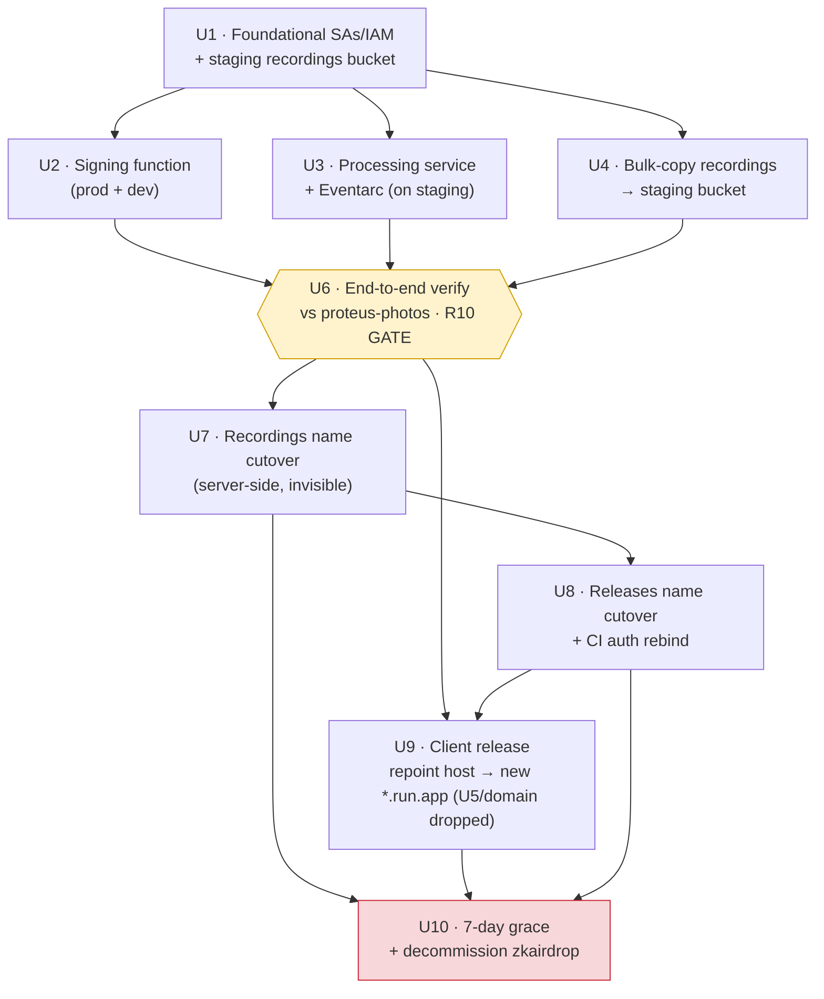
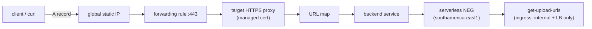

# refactor: Migrate screencap GCP footprint from zkairdrop to proteus-photos

> **⚠️ SCOPE AMENDMENT — 2026-06-02 (supersedes parts of this plan).**
> **R6 (stable `api.screencap.sh` domain) and U5 (Global External ALB + serverless NEG + managed
> cert + DNS) are DROPPED.** Decided with the product owner: the backend host is expected to be
> stable after this one-time `zkairdrop→proteus-photos` cleanup, so the domain's only value
> (decoupling clients from the project-specific `*.run.app` host against a *future* move) is
> insurance against an event that isn't expected — at a ~$22/mo standing cost (forwarding rule +
> static IPv4) and a Porkbun DNS dependency.
> Consequences: **U5 removed**; **U6** verifies against the new prod `*.run.app` host directly
> (`https://get-upload-urls-ld7izzjvga-rj.a.run.app`); **U9** repoints `download.py`/`upload.py`
> defaults to that `*.run.app` host instead of the domain (one-line change), and now depends only
> on U6 + U8 (not U5). Accepted trade: the signing function stays publicly reachable + unauthenticated
> at its `*.run.app` host (CORS `*`) — identical to today's `zkairdrop` posture, so no regression;
> no ingress lockdown. Re-coupling is accepted (a future move = one more client release; the
> `SCREENCAP_*_URL` env override remains the escape hatch). Sections below that describe R6/U5/the
> domain are retained for history but are **superseded by this banner**. Phase 1 (U1–U4) executed
> 2026-06-02 — see `docs/runbooks/gcp-migration-proteus-photos.md` for the live record.

## Summary

Lift-and-shift screencap's entire GCP footprint — two buckets, the `get-upload-urls` signing function, the `process-recording` Eventarc service, service accounts/IAM, and the release pipeline auth — out of the shared `zkairdrop` project into the existing `proteus-photos` project, with no functional change to recording, processing, or privacy. Stand up the new infra additively, verify end-to-end via the existing `SCREENCAP_*` env overrides *before* any destructive step, then run two name cutovers (server-side `screencap-recordings`, client-facing `screencap-releases`) and ship one unavoidable client release that repoints the signing host from the project-coupled `*.run.app` URL to a stable `api.screencap.sh` domain — fronted by a Global External Application Load Balancer because Cloud Run domain mappings are not available in `southamerica-east1`. Old resources stay live for a 7-day grace period, then are decommissioned.

---

## Problem Frame

screencap's cloud infrastructure lives in `zkairdrop`, a GCP project owned by the zk-email team — a tenancy of convenience from before Proteus had its own project. That entangles screencap's blast radius, IAM, and billing with an unrelated product. The footprint is cross-cutting, and two surfaces are welded into already-installed clients: the releases-bucket distribution URL ([src/screencap/updater.py:25](src/screencap/updater.py), [scripts/install.sh:215](scripts/install.sh)) and — more sharply — the project-specific `*.run.app` signing host hardcoded in both [src/screencap/download.py:28](src/screencap/download.py) and [src/screencap/upload.py:29](src/screencap/upload.py). A naive move breaks those clients, and because the host embeds the project, the same fragility recurs on every future backend change. (See origin: [docs/brainstorms/2026-05-29-gcp-migration-zkairdrop-to-proteus-photos-requirements.md](docs/brainstorms/2026-05-29-gcp-migration-zkairdrop-to-proteus-photos-requirements.md).)

---

## Requirements

- R1. All screencap GCP resources in `zkairdrop` are recreated in `proteus-photos`: both buckets, the `get-upload-urls` signing function, the `process-recording` service + Eventarc trigger, and supporting service accounts/IAM.
- R2. Both production and `-dev` resources are accounted for; the `-dev` signing endpoint in [.env](.env) is re-pointed to the `proteus-photos` equivalent.
- R3. Existing recordings data is preserved by copying it from the `zkairdrop` recordings bucket into `proteus-photos` before the old bucket is removed.
- R4. The recordings bucket keeps the name `screencap-recordings` (server-side reference only).
- R5. The releases bucket retains the exact name `screencap-releases` via a planned delete-then-recreate cutover, accepting a brief distribution outage.
- ~~R6. The signing function is reachable via a stable custom domain `api.screencap.sh`~~ **— DROPPED (2026-06-02, see amendment banner).** The client targets the new project's `*.run.app` signing host directly.
- R7. A single client release updates the signing-endpoint reference ([src/screencap/download.py](src/screencap/download.py), [src/screencap/upload.py](src/screencap/upload.py), [.env](.env)) to **the new `proteus-photos` `*.run.app` host** (amended from "the stable domain") and is published through the preserved releases bucket.
- R8. A 7-day grace period keeps the `zkairdrop` client-facing resources live until installed clients have had a window to auto-update.
- R9. The GitHub Actions release workflow's authentication is rebound from `zkairdrop` to `proteus-photos`.
- R10. The end-to-end pipeline (record → upload → process via Eventarc → download) is verified against `proteus-photos` before any `zkairdrop` screencap resource is deleted.
- R11. After verification and the grace period, the screencap-specific resources in `zkairdrop` are decommissioned, leaving zk-email resources untouched.

**Origin actors:** A1 (Migration operator), A2 (Installed client), A3 (Release CI / GitHub Actions), A4 (End user), A5 (screencap-website — external dependency).
**Origin flows:** F1 (Migration cutover, operator-run), F2 (Client auto-migration, transparent).
**Origin acceptance examples:** AE1 (covers R5 — releases name-cutover transient 404), AE2 (covers R8 — grace-period old function still works), AE3 (covers R6, R7, R10 — post-migration record→upload→process→download via api.screencap.sh).

---

## Scope Boundaries

- **Per-user cloud storage isolation / accounts** is excluded — relocation only; no auth, per-user namespacing, or trust-model change (see [docs/plans/2026-05-29-002-feat-per-user-cloud-storage-isolation-plan.md](docs/plans/2026-05-29-002-feat-per-user-cloud-storage-isolation-plan.md)).
- **Renaming `screencap-releases`** is excluded — it would sever the auto-update bootstrap.
- **Stable domains in front of every surface** are excluded — only the signing function gets a domain; the releases path stays on its already-stable bucket URL.
- **Region changes, pipeline re-architecture, or any functional change** to recording, processing, or privacy behavior are excluded — pure lift-and-shift. Resources stay in `southamerica-east1`.
- **zk-email / `zkairdrop` resources** beyond screencap's pieces are not touched.

### Deferred to Follow-Up Work

- **screencap-website repo migration (A5):** the sibling repo reads `screencap-recordings` via its own GCP credential/project binding; it must be re-pointed when the bucket moves. Tracked and executed in that repo, outside this plan — but it is a hard coordination dependency for the recordings cutover (U7). See Risks.

---

## Context & Research

### Relevant Code and Patterns

- **Signing host (client-facing, the core fragility):** [src/screencap/download.py:28-34](src/screencap/download.py) `DEFAULT_DOWNLOAD_URL` + `_get_download_url()`; [src/screencap/upload.py:29-48](src/screencap/upload.py) `DEFAULT_UPLOAD_URL` + `_get_upload_url()`. **Both files hardcode the identical `get-upload-urls-wyldgq6aqa-rj.a.run.app` host** — the repoint must touch both. Pattern: `os.environ.get("SCREENCAP_<X>_URL", <hardcoded default>)` — change the default, keep the env override.
- **Releases distribution (client-facing, preserved):** [src/screencap/updater.py:23-26](src/screencap/updater.py) `_DIST_BASE_URL` (default `https://storage.googleapis.com/screencap-releases/releases`, overridable via `SCREENCAP_DIST_URL`); [scripts/install.sh:215](scripts/install.sh) same default. No code change needed — name preservation keeps these valid.
- **Signing function source:** [scripts/cloud-function/main.py](scripts/cloud-function/main.py) — single HTTP entry `get_upload_urls`, bucket via `SCREENCAP_BUCKET` (`:39`, default `screencap-recordings`), v4 signed URLs via IAM `signBlob` (requires `roles/iam.serviceAccountTokenCreator` on the function SA, `:55-62`), CORS `*`. Deploy docstring at `:8-24` (gen2 function, `--runtime python312 --trigger-http --allow-unauthenticated --region southamerica-east1`).
- **Processing service source:** [scripts/process-recording/main.py](scripts/process-recording/main.py) — Eventarc handler `process_recording` (`:1875-1890`), guards on `recordings/<name>/{recording.db, recording_complete.json}` (3-segment path), writes `sessions/<name>/`; bucket via `SCREENCAP_BUCKET` (`:26`); optional Gemini enrichment gated on `GOOGLE_GENAI_API_KEY` (`:1369-1400`, AI Studio key path — project-independent but must be re-provisioned). Containerized via [scripts/process-recording/Dockerfile](scripts/process-recording/Dockerfile). **No stored `gcloud run deploy` / `gcloud eventarc triggers create` command anywhere** — the provisioning must be reconstructed.
- **Release pipeline:** [.github/workflows/release.yml](.github/workflows/release.yml) — auth via `google-github-actions/auth@v2` with `credentials_json: ${{ secrets.GCP_SA_KEY }}` (`:108-110`, `:131-134`, `:221-224`). **Service-account key, not Workload Identity Federation.** Uploads to `gs://screencap-releases/...` (`:120-121`, `:142-151`, `:231`). Rebind = swap the secret value + grant the new SA Storage Object Admin on the recreated bucket; no workflow edits.
- **Env reading convention:** `python-dotenv` loads [.env](.env) (gitignored — see below). Client URL defaults follow the get-with-default pattern.

### Institutional Learnings

- **[docs/solutions/runtime-errors/chunk-upload-sentinel-gating-and-data-loss.md](docs/solutions/runtime-errors/chunk-upload-sentinel-gating-and-data-loss.md)** — the authoritative description of the GCS/signed-URL/Eventarc contract being relocated. The `recording_complete.json` sentinel under `recordings/<name>/` is the cross-system trigger; the recreated Eventarc trigger MUST watch the identical object path or the "stitching with missing chunks" failure reappears. Treat bucket layout + trigger path as a public contract.
- **[docs/solutions/build-errors/macos-pre14-binary-install-failure.md](docs/solutions/build-errors/macos-pre14-binary-install-failure.md)** (severity: critical) — confirms the install bootstrap reaches `storage.googleapis.com/screencap-releases/releases` and walks `latest.txt` + `v${VERSION}/...`. The releases cutover must preserve that object layout byte-for-byte. `SCREENCAP_DIST_URL` is the safe pre-cutover test lever.
- **[docs/solutions/build-errors/pyinstaller-frozen-binary-ci-failures.md](docs/solutions/build-errors/pyinstaller-frozen-binary-ci-failures.md)** (severity: high) — the release workflow has ordered gates (spaCy model download → PyInstaller → minos verification → GCS upload); after rebinding GCP auth, re-run the pipeline end-to-end as a tested artifact rather than assuming an auth-only change is inert.

### External References

- [Mapping custom domains | Cloud Run](https://cloud.google.com/run/docs/mapping-custom-domains) + [Cloud Run locations](https://cloud.google.com/run/docs/locations) — Cloud Run domain mappings are **Preview** and limited to 10 regions; **`southamerica-east1` is NOT supported**. Google steers unsupported regions to the Global External Application Load Balancer.
- [Global external ALB with Cloud Run](https://cloud.google.com/load-balancing/docs/https/setup-global-ext-https-serverless) + [Serverless NEG overview](https://cloud.google.com/load-balancing/docs/negs/serverless-neg-concepts) — components: global static IP → serverless NEG (region must match the function's `southamerica-east1`) → backend service (`EXTERNAL_MANAGED`, global) → URL map → managed cert → target HTTPS proxy → forwarding rule. DNS = single A record `api.screencap.sh` → the static IP.
- [Google-managed SSL certs](https://cloud.google.com/load-balancing/docs/ssl-certificates/google-managed-certs) — classic LB-attached cert: up to ~60 min after DNS propagates (+ up to 30 min before the LB uses it). **Certificate Manager with DNS authorization** provisions in "a few minutes" and can go ACTIVE *before* the LB is live — the recommended path to minimize the cert-pending window.
- [About Cloud Storage buckets](https://cloud.google.com/storage/docs/buckets) + [Deleting buckets](https://cloud.google.com/storage/docs/deleting-buckets) — deleting a **bucket** frees the name "on the order of seconds" (vs. deleting a *project*, which holds the name "weeks or longer"). Cross-project reuse has no lock. 10-minute stale-routing caveat if recreated in a *different location* (low risk here — same region). Soft-delete does not block cross-project name reuse.

---

## Key Technical Decisions

- **Stable domain via Global External ALB + serverless NEG, not Cloud Run domain mapping.** Domain mappings are unavailable in `southamerica-east1`, so the GA path is a Global External Application Load Balancer fronting a serverless NEG that targets the gen2 function's underlying Cloud Run service. Accepts the LB cost floor (~$18/mo for the forwarding rule). After the LB is live, set the function's ingress to "Internal and Cloud Load Balancing" so the raw `*.run.app` host can't be hit directly — enforcing the durable domain path. (Resolves origin Outstanding Question on R6.)
- **Pre-provision the managed cert via Certificate Manager DNS authorization.** A CNAME DNS-authorization record on `screencap.sh` lets the cert reach ACTIVE in minutes, decoupled from LB readiness — avoiding the ~60-90 min HTTPS-pending window of a classic LB-attached cert. (Resolves origin Outstanding Question on R6.)
- **Recordings-bucket name preserved via staging + global-name follow (server-side, invisible cutover).** `screencap-recordings` is globally unique and cannot exist in both projects at once, yet the old `zkairdrop` signing function needs a recordings bucket throughout the grace period. Resolution: (1) bulk-copy `zkairdrop:screencap-recordings` → a transiently-named `proteus-photos` staging bucket while the source stays live; (2) at the cutover, final-sync, delete the `zkairdrop` bucket (frees the name in seconds), create `screencap-recordings` in `proteus-photos`, promote staged data via a same-project server-side copy; (3) grant the **old** `zkairdrop` signing function's SA cross-project IAM on the new bucket so it follows the global name. The two-hop (source→staging→final) is **inherent**, not avoidable — the final name cannot be claimed until the source is deleted, so one same-project promotion copy is unavoidable; the value is in sequencing the trigger/IAM/delete around it (see U7). The recordings cutover is server-side and invisible to users (unlike releases). (Resolves the R3/R4 vs. global-uniqueness tension the origin acknowledged but left to planning.)
- **Global-name follow: redeploy the old function at cutover by default; don't bet on the warm instance.** GCS bucket names are global and the function's `Bucket` handle is name-keyed, so an old-function instance *can* follow `screencap-recordings` into `proteus-photos` once its SA has object IAM there — and the signing identity survives the move (v4 `signBlob` runs on the function's own zkairdrop SA, which is not bucket-project-bound). But the *warm* follow is unreliable: under low grace-period traffic the gen2 function scales to zero, and a cold start re-runs `google.auth.default()` at module load (and a requester-pays bucket breaks it outright). So the **default at U7 is a one-line `SCREENCAP_BUCKET=screencap-recordings` redeploy** of the (soon-retired) old function — a deterministic cold re-resolution to the reborn same-named bucket — not a contingency; `min-instances=1` is the warm alternative only if a redeploy is blocked. The IAM grant must be `roles/storage.objectAdmin` **plus** bucket-read (`storage.buckets.get`); Object Admin alone fails the `list`/`sign-download` paths. The grant is **pre-specified in U1** and tested against staging in U6, but U6's staging test proves only IAM scope + cross-project signer — the **reborn-name follow is re-proven in-window at U7** before the window closes, because post-delete name re-resolution is not observable until the final bucket exists.
- **Do not combine the two cutover windows; sequence U7 → U8 → U9, each fully verified.** The recordings cutover (U7, server-side, irreversible point-of-no-return, external A5 dependency) and the releases cutover (U8, client-visible but reversible, CI dependency) have opposite risk profiles and unrelated blast radii. Running them separately keeps each operator-reasonable and prevents one failure from contaminating the other; "fewer windows" optimizes the wrong thing. U9 (client release) ships only after U8's pipeline has produced one verified artifact through the new bucket + key.
- **Dev recordings bucket is recreated fresh under its existing name without the preserved-name dance.** Dev has no installed-client constraint, so `screencap-recordings-dev` can simply be created in `proteus-photos` (after freeing the zkairdrop dev name, or under a fresh dev name) and the dev function/`.env` repointed — no staging/promotion/global-follow ceremony for dev.
- **Releases-bucket name cutover is the one client-visible blip — and is reversible.** Delete `zkairdrop:screencap-releases`, recreate in `proteus-photos`, re-upload artifacts preserving the `releases/latest.txt`, `releases/install.sh`, `releases/v${VERSION}/...` layout. **Upload order is load-bearing:** all `v${VERSION}/...` tarballs + checksums first, then `install.sh`, then `latest.txt` **last** — so a client never sees a `latest.txt` pointing at incomplete artifacts. AE1's acceptable failure is a 404-only window (name briefly free), never a half-populated bucket. The name is free "in seconds" (bucket delete, not project delete). Unlike U7, this step is reversible: a full verified artifact snapshot is held (and retained through U10), so a failed recreation can be re-uploaded to either project. (Resolves origin Outstanding Question on R5 sequencing.)
- **CI auth rebind = secret swap + bucket IAM, no workflow edits.** The pipeline uses a long-lived SA key in `secrets.GCP_SA_KEY`, not WIF. Replace the secret value with a `proteus-photos` SA key (or migrate to WIF as a separate hardening task) and grant that SA Storage Object Admin on the recreated `screencap-releases`. (Resolves origin Outstanding Question on R9.)
- **Keep region `southamerica-east1`.** Region change is explicitly out of scope; recreate all resources in the same region (also keeps the recordings cutover clear of the 10-minute cross-location routing caveat). (Resolves origin Outstanding Question on region.)
- **Client repoint touches both `download.py` and `upload.py`; `.env` change is operator-local.** They share one host, so both defaults change to `https://api.screencap.sh`. `.env` is gitignored (`.gitignore:17`) and there is no `.env.example`, so the durable artifact is the code default; the `-dev` `.env` repoint (R2) is an operator/dev-local action captured in the migration's operational notes, not a committed change.
- **Data-copy mechanism chosen by measured size.** Default to `gcloud storage rsync -r` for the expected-small recordings volume; escalate to Storage Transfer Service only if a `gcloud storage du` size check shows the volume is large enough to warrant it. (Resolves origin Outstanding Question on R3 copy mechanism; exact tool is a measured execution-time pick.)
- **Grace period: 7 days** after end-to-end verification of the shipped release, then decommission (user decision).

---

## Open Questions

### Resolved During Planning

- **Domain mechanism (R6):** Global External ALB + serverless NEG (domain mappings unavailable in `southamerica-east1`); Certificate Manager DNS-authorized cert to pre-provision.
- **CI auth (R9):** SA-key swap + bucket IAM; no workflow edits (it is not WIF).
- **Region:** keep `southamerica-east1`.
- **Recordings name vs. global-uniqueness (R3/R4):** staging bucket + delete-recreate at cutover + cross-project IAM so the old function follows the global bucket name.
- **Releases name-release timing (R5):** seconds (bucket delete), not the weeks-long project-delete case.
- **Grace period (R8):** 7 days.

### Deferred to Implementation

- **Exact recordings data volume → final copy tool** (`gcloud storage rsync` vs Storage Transfer Service), for **both** the U4 bulk copy and the U7 staging→final promotion — measured via a size check at execution. For large volumes, prefer a transfer mechanism with a completion signal so trigger creation and bucket deletion can gate on a verified transfer report.
- **Whether the retired function needs an IAM-only grant or a redeploy to follow the new bucket** — validated against the **live old function during U6** (not after the destructive delete). Global-name follow is expected to suffice with the correct IAM scope (`objectAdmin` + bucket-read); fallback is a one-line `SCREENCAP_BUCKET` redeploy of the soon-retired function. (See the global-name-follow Key Technical Decision.)
- **Requester-pays / bucket-property posture** — confirm neither the old nor new `screencap-recordings` has requester-pays enabled (it would break the no-`user_project` client and force a redeploy), and create the new buckets with the **same** UBLA, public-access-prevention, soft-delete, and default storage class as the source so signed-URL/gallery behavior and object ACLs are preserved. Verified in U1/U7 pre-flight.
- **Dev signing surface shape** — recommend pointing `.env` dev at the new `proteus-photos` `-dev` `*.run.app` host (no domain for dev); only promote to `api-dev.screencap.sh` if a stable dev domain is later wanted. Confirm the full `-dev` inventory (`get-upload-urls-dev` function + `screencap-recordings-dev` bucket) at execution; dev recordings bucket is recreated fresh (no preserved-name cutover).
- **Observed managed-cert ACTIVE time** in `southamerica-east1` — plan assumes minutes via DNS authorization; measure before scheduling the client release. A slow cert is a U9 scheduling input, not a U6 failure.

---

## High-Level Technical Design

> *This illustrates the intended approach and is directional guidance for review, not implementation specification. The implementing agent should treat it as context, not code to reproduce.*

Migration sequence and unit dependencies (additive build-up → verify gate → cutovers → release → grace/teardown):

Stable-domain request path after U5:

---

## Implementation Units

### U1. Provision foundational resources in proteus-photos (service accounts, IAM, staging recordings bucket)

**Goal:** Stand up the non-client-facing foundation in `proteus-photos`, `southamerica-east1`: service accounts and IAM for the signing function (incl. `roles/iam.serviceAccountTokenCreator` for v4 `signBlob`) and the processing/Eventarc service, plus a transiently-named staging recordings bucket (`screencap-recordings-staging`) that downstream compute targets until the cutover. Establish the migration's operational runbook as the durable record (no IaC exists today).

**Requirements:** R1, R2

**Dependencies:** None (additive; operator must hold create rights in `proteus-photos`).

**Files:**
- Create: `docs/runbooks/gcp-migration-proteus-photos.md` (operational runbook — resource inventory, gcloud sequences, IAM grants, rollback notes; new `docs/runbooks/` convention)
- Modify: none in code

**Approach:**
- Create SAs for `get-upload-urls` and `process-recording` (prod + `-dev`); grant the signing SA `roles/iam.serviceAccountTokenCreator` on itself (matches [scripts/cloud-function/main.py:9-15](scripts/cloud-function/main.py) requirement) and Storage Object Admin on the recordings bucket(s); grant the Eventarc trigger SA the receive/run-invoker roles.
- **Pre-specify the grace-period cross-project grant** the OLD `zkairdrop` signing function's SA will need on the new recordings bucket — `roles/storage.objectAdmin` **plus** bucket-read (`storage.buckets.get`) — and record the exact SA email + roles in the runbook now (do not first-attempt it under U7 time pressure). Grant it on the staging bucket so U6 can test the follow live; the identical binding is applied to the final bucket at U7 (mechanical, pre-validated).
- Create `screencap-recordings-staging` (and a dev staging bucket) in `southamerica-east1`. The final `screencap-recordings` name is intentionally NOT claimed yet — it is still held by `zkairdrop` and is freed only at U7.
- The runbook is the single source of truth for what was provisioned, since the repo has no Terraform/cloudbuild.

**Patterns to follow:** [scripts/cloud-function/main.py:8-24](scripts/cloud-function/main.py) deploy docstring for the signing-function IAM model; `docs/solutions/` frontmatter style for the runbook header.

**Test scenarios:**
- Test expectation: none -- infrastructure provisioning. Verified operationally below.

**Verification:**
- Both SAs exist with the expected roles; `screencap-recordings-staging` exists in `southamerica-east1`; runbook records the exact resource names, region, and IAM bindings.

---

### U2. Deploy the signing function (get-upload-urls, prod + dev) in proteus-photos

**Goal:** Recreate the HTTP signing function in `proteus-photos`, pointed at the staging recordings bucket, for both prod and `-dev`.

**Requirements:** R1, R2, R6 (precursor)

**Dependencies:** U1

**Files:**
- Modify: `scripts/cloud-function/main.py` (update the deploy docstring `:8-24` to reflect the `proteus-photos` project context and the `SCREENCAP_BUCKET` override used during staging)
- Modify: `docs/runbooks/gcp-migration-proteus-photos.md` (record the deployed `*.run.app` hosts for prod + dev)

**Approach:**
- Deploy from [scripts/cloud-function/](scripts/cloud-function/) with `--region southamerica-east1`, `--runtime python312`, `--trigger-http --allow-unauthenticated`, `SCREENCAP_BUCKET=screencap-recordings-staging` (prod) and the dev staging bucket (dev). No source code change to the handler — `SCREENCAP_BUCKET` already parameterizes the bucket ([scripts/cloud-function/main.py:39](scripts/cloud-function/main.py)).
- Capture the new `*.run.app` hosts; they are interim (the durable client target is `api.screencap.sh` from U5).

**Patterns to follow:** existing deploy docstring [scripts/cloud-function/main.py:8-24](scripts/cloud-function/main.py).

**Test scenarios:**
- Test expectation: none -- redeploy of unchanged handler. Verified operationally below.

**Verification:**
- POST `{"action":"list"}` to the new prod host returns a 200 against the staging bucket; a `sign-download` request returns working v4 signed URLs (proves `signBlob` IAM is correct); dev host behaves equivalently against the dev staging bucket.

---

### U3. Deploy the processing service + Eventarc trigger in proteus-photos

**Goal:** Recreate the `process-recording` Cloud Run service and its Eventarc object-finalize trigger on the staging recordings bucket, re-provision `GOOGLE_GENAI_API_KEY`, and reconstruct + record the missing deploy/trigger provisioning.

**Requirements:** R1, R2

**Dependencies:** U1

**Files:**
- Modify: `scripts/process-recording/main.py` (add a deploy docstring documenting the `gcloud run deploy` + `gcloud eventarc triggers create` provisioning — currently absent)
- Modify: `docs/runbooks/gcp-migration-proteus-photos.md` (record service URL, trigger config, secret wiring)

**Approach:**
- Build/deploy the container ([scripts/process-recording/Dockerfile](scripts/process-recording/Dockerfile)) as a Cloud Run service with `--region southamerica-east1`, `SCREENCAP_BUCKET=screencap-recordings-staging`, and `GOOGLE_GENAI_API_KEY` wired via the new project's secret/env (else Gemini enrichment silently degrades — [scripts/process-recording/main.py:1369-1400](scripts/process-recording/main.py)).
- Create an Eventarc trigger for `google.cloud.storage.object.v1.finalized` on the staging bucket, routing to the service. **The handler guard ([scripts/process-recording/main.py:1882-1886](scripts/process-recording/main.py)) requires objects at `recordings/<name>/{recording.db, recording_complete.json}`** — the trigger watches the bucket; the path guard is in code, so no per-object filter is needed, but the bucket and object-layout contract must match exactly (per the sentinel learning).
- This trigger is on the *staging* bucket; U7 recreates it on the final `screencap-recordings` bucket.

**Patterns to follow:** the Eventarc contract in [scripts/process-recording/main.py:1875-1890](scripts/process-recording/main.py); sentinel/idempotency semantics in [docs/solutions/runtime-errors/chunk-upload-sentinel-gating-and-data-loss.md](docs/solutions/runtime-errors/chunk-upload-sentinel-gating-and-data-loss.md).

**Test scenarios:**
- Integration (operational): uploading a synthetic `recordings/<name>/recording_complete.json` sentinel to the staging bucket triggers the service exactly once and writes `sessions/<name>/` outputs. Covers AE3 (processing leg).
- Integration (operational): a non-trigger object path (e.g. `recordings/<name>/screenshots/0.png`) does NOT start processing (handler guard holds).

**Verification:**
- Sentinel drop → one processed session under `sessions/<name>/`; idempotent re-drop is skipped; logs show Gemini enrichment active (key present) rather than fallback segmentation.

---

### U4. Bulk-copy recordings data into the staging bucket

**Goal:** Copy existing recordings from `zkairdrop:screencap-recordings` into `proteus-photos:screencap-recordings-staging` while the source stays live (R3 preservation, first pass).

**Requirements:** R3

**Dependencies:** U1

**Files:**
- Modify: `docs/runbooks/gcp-migration-proteus-photos.md` (record measured size, chosen tool, object counts before/after)

**Approach:**
- Measure volume (`gcloud storage du`); pick `gcloud storage rsync -r` for small volume, Storage Transfer Service if large (decision rule in Key Technical Decisions).
- This is the bulk pass; a final incremental sync happens inside the U7 cutover window to catch late writes.
- Cross-project copy requires the operator (or the copy job's SA) to have read on the source and write on the destination.

**Patterns to follow:** capture-test cleanup uses `gs://screencap-recordings/...` paths ([.claude/skills/capture-test/SKILL.md](.claude/skills/capture-test/SKILL.md)) — same layout to preserve.

**Test scenarios:**
- Test expectation: none -- data copy. Verified by parity check below.

**Verification:**
- Object count and total bytes in the staging bucket match the source (allowing for writes after the snapshot, reconciled at the U7 final sync); a spot-checked recording downloads intact.

---

### U5. ~~Stand up api.screencap.sh~~ — DROPPED (2026-06-02)

> **DROPPED per the scope amendment.** No load balancer, serverless NEG, static IP, managed cert,
> or DNS record. The client targets the new prod `*.run.app` host directly (U9). The unit detail
> below is retained for history only. Rationale + accepted trades: see the amendment banner at the
> top of this plan and `docs/runbooks/gcp-migration-proteus-photos.md`.

**Goal (superseded):** Make the new prod signing function reachable at `https://api.screencap.sh` via a Global External Application Load Balancer, with a pre-provisioned Certificate Manager managed cert, then lock the function ingress to internal + LB only.

**Requirements:** R6

**Dependencies:** U2

**Files:**
- Modify: `docs/runbooks/gcp-migration-proteus-photos.md` (record static IP, NEG/backend/URL-map/proxy/forwarding-rule names, cert + DNS-authorization records)

**Approach:**
- Create the LB chain: global static IP → serverless NEG (region `southamerica-east1`, targeting the prod signing function's Cloud Run service) → backend service (`EXTERNAL_MANAGED`, global) → URL map (single default route) → target HTTPS proxy → global forwarding rule on :443.
- Pre-provision the managed cert via Certificate Manager **DNS authorization** (CNAME on `screencap.sh`) so it reaches ACTIVE in minutes, before traffic flows; attach via certificate map.
- Add the `A` record `api.screencap.sh` → the static IP in the `screencap.sh` zone.
- After the LB serves correctly, set the function/Cloud Run ingress to "Internal and Cloud Load Balancing" so the raw `*.run.app` host is no longer directly reachable.

**Technical design:** *(see the request-path mermaid in High-Level Technical Design — directional, not a literal resource script.)*

**Patterns to follow:** existing `screencap.sh` zone usage (`get.screencap.sh` per [scripts/install.sh:3](scripts/install.sh)); external ALB-with-Cloud-Run reference in Context & Research.

**Test scenarios:**
- Integration (operational): `curl -sS https://api.screencap.sh` with `{"action":"list"}` returns 200 from the new function; TLS cert is the Google-managed `api.screencap.sh` cert (ACTIVE).
- Edge (operational): after ingress lockdown, a direct request to the function's `*.run.app` host is refused/403 — only the LB path works. Covers R6 durability intent.

**Verification:**
- Cert ACTIVE; `api.screencap.sh` resolves to the static IP and reaches the function; direct `*.run.app` access blocked; runbook records all resource names for teardown.

---

### U6. End-to-end verification against proteus-photos (R10 gate)

**Goal:** Prove the full pipeline works against `proteus-photos` via `api.screencap.sh` and the staging bucket, using only the existing env overrides — **before any destructive cutover**.

**Requirements:** R10 (gate for R6, R7)

**Dependencies:** U3, U4, U5

**Files:**
- Modify: `docs/runbooks/gcp-migration-proteus-photos.md` (record the verification run + outcomes)

**Approach:**
- Run a real client with `SCREENCAP_UPLOAD_URL=https://api.screencap.sh`, `SCREENCAP_DOWNLOAD_URL=https://api.screencap.sh` (overrides at [src/screencap/upload.py:48](src/screencap/upload.py), [src/screencap/download.py:34](src/screencap/download.py)) and, for the releases leg, `SCREENCAP_DIST_URL` pointed at a `proteus-photos` staging path.
- Exercise record → upload (signed by the new function via the domain) → Eventarc process (new service writes `sessions/<name>/`) → download (signed download URLs resolve). Reuse the `capture-test` skill flow where helpful.
- This is the no-impact rehearsal: no `zkairdrop` resource is touched, no client is changed.

**Execution note:** Treat this as the hard gate — U7/U8 (destructive) do not start until this passes. Capture one `zkairdrop` baseline run's `sessions/<name>/` manifest first, so verification asserts *parity*, not merely "it works."

**Patterns to follow:** [.claude/skills/capture-test/SKILL.md](.claude/skills/capture-test/SKILL.md) end-to-end capture validation.

**Test scenarios:**
- Integration: full record→upload→process→download via `api.screencap.sh` + proteus staging produces a `sessions/<name>/` manifest that **matches the zkairdrop baseline** (diff, not smoke). Covers AE3.
- Integration: download of a previously-copied (U4) recording succeeds (proves data copy + signed-download path, not just fresh writes).
- Integration: the **live old `zkairdrop` function**, granted cross-project IAM, successfully `list`/`sign-download`s against the staging bucket and a URL it mints resolves 200 — proving the global-name follow + cross-project signer before any destructive delete depends on it.
- Error path: with the function ingress locked (U5), a client NOT using the domain (stale `*.run.app`) fails — confirming the domain is the only path.

**Verification (all must hold to proceed to Phase 3 — any failure halts):**
- Cert is `ACTIVE` (not `PROVISIONING`); observed ACTIVE time recorded (feeds U9 scheduling).
- New-stack `sessions/<name>/` manifest matches the zkairdrop baseline.
- A U4-copied historical recording downloads intact.
- Old-function cross-project IAM + signer proven against the staging bucket — **necessary, not sufficient**: this validates the grant scope and cross-project signing, but the *reborn-name* follow is only observable post-delete and is re-proven in-window at U7 (where the default is a redeploy regardless).
- Gemini enrichment confirmed active in logs (not fallback segmentation) — the last no-impact place to catch silent degradation.
- Ingress lockdown confirmed (stale `*.run.app` refused).

---

### U7. Recordings-bucket name cutover (server-side, invisible)

**Goal:** Free `screencap-recordings` from `zkairdrop` and recreate it in `proteus-photos` with the staged data, repoint compute to the final bucket, and keep the grace-period old function working via global-name + cross-project IAM — all invisibly to clients.

**Requirements:** R3, R4

**Dependencies:** U6 (gate)

**Files:**
- Modify: `docs/runbooks/gcp-migration-proteus-photos.md` (cutover steps, timings, IAM grant to the old function SA)

**Approach (ordering is correctness-critical):**
- **Pre-flight gates (all green before the destructive delete):** website (A5) SA already granted cross-project read on the new bucket (or a coordinated re-point staged to land in this window — confirmed in writing); requester-pays disabled on old+new buckets; new bucket created with source-matching UBLA/public-access-prevention/soft-delete/storage-class.
- Final incremental sync `zkairdrop:screencap-recordings` → staging — directional, **no destination-delete flag** on any sync in this migration. Require **two consecutive clean passes** (zero remaining transfers) and a name+size (ideally name+md5) manifest diff showing zero source objects missing from staging. A `du` byte-total match alone is insufficient (a same-size replacement passes it).
- **POINT OF NO RETURN — delete `zkairdrop:screencap-recordings`** (frees the global name in seconds). Soft-delete does not help recovery once the name is reborn elsewhere, so the staging completeness gate above is the real safety net. **Abort path:** if creating `screencap-recordings` in `proteus-photos` then fails (name not yet free, IAM, quota), retry with backoff for a bounded window; if still failing, recreate from staging under a *temporary* name and repoint compute there (degraded but live) rather than waiting indefinitely.
- Create `screencap-recordings` in `proteus-photos`; promote staged data via the (inherent) same-project server-side copy.
- **Create the final-bucket Eventarc trigger ONLY AFTER promotion is verified complete.** The promotion copy re-finalizes every historical `recording.db` / `recording_complete.json` — if the trigger is live during promotion it re-processes the entire history at once and can stitch with partial data (reopening the missing-chunk failure) when a sentinel arrives before its copied `_processing_status.json`. Sequence: create final → promote → parity-assert → repoint `SCREENCAP_BUCKET` → create trigger → grant old-SA IAM.
- Apply the pre-specified cross-project grant (`roles/storage.objectAdmin` + `storage.buckets.get`, prepared in U1) to the **new** bucket for the old `zkairdrop` function's SA, then **redeploy the old function with `SCREENCAP_BUCKET=screencap-recordings` (default)** so it deterministically cold-resolves the reborn same-named bucket — do not rely on a warm instance following the name. **In-window go-criterion (before closing the window / shipping U9):** a request to the still-live old function `list`/`sign-download`s against the *reborn* bucket and a URL it mints resolves 200; if it fails, halt on this step. Grace-period old clients (AE2) then write to the new bucket, processed by the new Eventarc service — no second recordings bucket takes writes.
- **Backfill check:** after the trigger is live, list objects whose creation time falls in the cutover gap and confirm each has a `sessions/<name>/_processing_status.json`; manually re-trigger any orphans (Eventarc does not backfill).
- **Retain the staging bucket through the full grace period** — it is the only post-cutover data backstop. It is deleted in U10, not here.
- **Dev recordings:** recreated fresh in `proteus-photos` under its name (no staging/promotion/global-follow dance — dev has no installed-client constraint); dev function `.env` repointed.

**Patterns to follow:** bucket-name-release facts in Context & Research; sentinel/Eventarc contract preservation per [docs/solutions/runtime-errors/chunk-upload-sentinel-gating-and-data-loss.md](docs/solutions/runtime-errors/chunk-upload-sentinel-gating-and-data-loss.md).

**Test scenarios:**
- Integration (operational): a post-cutover sentinel drop to the final bucket triggers processing **exactly once** — a hard go-criterion for closing the window and shipping U9; if it does not, the Eventarc rebind is wrong (missing-chunk bug is live) → halt.
- Integration (operational): the (still-live) old `zkairdrop` function reads/writes the new `proteus-photos` bucket and a URL it mints resolves 200 — proving the global-name + cross-project signer. Covers AE2 (data leg).
- Edge (operational): a non-trigger path (`recordings/<name>/screenshots/0.png`) copied during promotion does NOT start processing (3-segment guard holds); the brief name-absent window resolves in seconds with no permanent failure.
- Edge (operational): website gallery renders against a **forced cold read** (not a warm cache) post-cutover.

**Verification:**
- `screencap-recordings` exists only in `proteus-photos` with full data (manifest parity vs. staging); new + old functions both operate on it; no full-history reprocess storm occurred; cutover-gap objects all have processing status; staging bucket retained; website confirmed reading the new bucket via cold read.

---

### U8. Releases-bucket name cutover + GitHub Actions auth rebind

**Goal:** Move `screencap-releases` to `proteus-photos` under the same name, preserving the client-facing object layout, and rebind release CI auth — accepting the brief distribution outage (AE1).

**Requirements:** R5, R9

**Dependencies:** U6 (gate); runs as a separate window after U7 is fully verified (not concurrent)

**Files:**
- Modify: `docs/runbooks/gcp-migration-proteus-photos.md` (cutover sequence, artifact re-upload manifest, secret rebind)
- Modify (CI secret, not file): `secrets.GCP_SA_KEY` value in the repo's GitHub Actions secrets

**Approach:**
- Snapshot `zkairdrop:screencap-releases` as a **full, checksum-verified local/secondary copy** (not a reference) of all of `releases/latest.txt`, `releases/install.sh`, `releases/v${VERSION}/...`. This snapshot is the rollback artifact and is **retained through U10**.
- Delete `zkairdrop:screencap-releases` (frees the name in seconds), create `screencap-releases` in `proteus-photos` with no retention/soft-delete surprise.
- **Re-upload in strict order so clients never see a half-populated bucket:** all `v${VERSION}/...` tarballs + checksums first, then `install.sh`, then `latest.txt` **last**. Verify byte-exact (re-uploaded tarball checksum == snapshot checksum) — presence is not enough.
- **CI rebind only after** the new bucket exists and the new SA has Storage Object Admin on it: grant the SA, then replace `secrets.GCP_SA_KEY` with the `proteus-photos` SA key. **No edits to [.github/workflows/release.yml](.github/workflows/release.yml)** — the `gs://screencap-releases/...` paths are bucket-name-only and the name is preserved.
- Run this as its **own window, sequenced after U7 is fully verified** (do not combine — opposite risk profiles); schedule a ~10-minute quiet margin for routing settle. This step is reversible (re-upload the retained snapshot to either project) — unlike U7.

**Patterns to follow:** release object layout per [.github/workflows/release.yml:120-151,231](.github/workflows/release.yml); install/updater consumption per the macOS-pre14 learning.

**Test scenarios:**
- Integration (operational): a **full manifest parity diff** (object names + sizes + checksums) of the recreated bucket vs. the pre-delete snapshot is zero-diff; every version `latest.txt` points to has *every* arch tarball + matching `.sha256` present and verifying. A missing arch tarball silently breaks that arch's auto-update after `latest.txt` looks healthy.
- Integration (operational): `install.sh` fetched fresh end-to-end installs a client (don't assume — exercise the bootstrap path).
- Integration (operational): during the delete→recreate gap, the URL returns a transient 404, then succeeds with no client change — never a partial bucket. Covers AE1.
- Integration (operational): an authenticated write under the new SA key succeeds — proving the rebind before relying on it.

**Verification:**
- Zero-diff manifest parity vs. snapshot; `latest.txt` + every referenced artifact served from `proteus-photos` and checksum-verified; `install.sh` installs cleanly; CI auth writes succeed under the new key; snapshot retained.

---

### U9. Ship the client release repointing the signing host to api.screencap.sh

**Goal:** Change the client's default signing host from the `*.run.app` URL to `https://api.screencap.sh` in one release, published through the preserved releases bucket so installed clients auto-update onto the decoupled domain.

**Requirements:** R6, R7

**Dependencies:** U5 (domain live + verified), U8 (release pipeline functional on the new bucket)

**Files:**
- Modify: `src/screencap/download.py` (`DEFAULT_DOWNLOAD_URL` `:28-30` → `https://get-upload-urls-ld7izzjvga-rj.a.run.app` — the new prod `*.run.app` host; amended from `api.screencap.sh`)
- Modify: `src/screencap/upload.py` (`DEFAULT_UPLOAD_URL` `:29-31` → `https://get-upload-urls-ld7izzjvga-rj.a.run.app` — amended from `api.screencap.sh`)
- Modify: `CHANGELOG.md` (release entry — the release workflow extracts notes from it, [.github/workflows/release.yml:163](.github/workflows/release.yml))
- Modify: `docs/runbooks/gcp-migration-proteus-photos.md` (operator-local `.env` dev repoint — `.env` is gitignored, not committed)
- Test: `tests/test_download.py`, `tests/test_upload.py`

**Approach:**
- Flip both hardcoded defaults to the domain; the `SCREENCAP_*_URL` env overrides remain for dev/testing.
- Operator updates local `.env` (`SCREENCAP_UPLOAD_URL`/`SCREENCAP_DOWNLOAD_URL` → new `proteus-photos` `-dev` host) — documented in the runbook since `.env` is not tracked and there is no `.env.example`.
- Version bump + CHANGELOG, then tag-driven release through the (now `proteus-photos`) pipeline; installed clients pick it up via normal auto-update ([src/screencap/updater.py:189-213](src/screencap/updater.py)).

**Execution note:** Do not ship until U5's cert is ACTIVE, U6 verified the domain end-to-end, and U8's pipeline has produced at least one verified artifact through the new bucket + key (so U9 is not the first real test of the rebind *and* the thing every client pulls). Note: auto-update is TTY-gated ([src/screencap/updater.py:195-196](src/screencap/updater.py)) — headless/cron/daemon-driven installs never auto-update until a human runs them interactively, which shapes the U10 teardown gate.

**Patterns to follow:** the get-with-default env pattern at [src/screencap/download.py:33-34](src/screencap/download.py) and [src/screencap/upload.py:47-48](src/screencap/upload.py); existing URL tests mock at the `requests` boundary and do not assert the literal host.

**Test scenarios:**
- Happy path: `_get_download_url()` returns `https://api.screencap.sh` by default; `_get_upload_url()` returns `https://api.screencap.sh` by default.
- Happy path: with `SCREENCAP_DOWNLOAD_URL` / `SCREENCAP_UPLOAD_URL` set, the override wins over the new default (env-override contract preserved).
- Edge: existing download/upload tests (which mock `requests.post`) still pass unchanged — confirming the host change is transparent to the request flow. Covers AE3 (client leg).

**Verification:**
- A freshly built/installed client uploads and downloads through `api.screencap.sh` with no env override; the release is present in `screencap-releases` and `latest.txt` advances (stable tag); an older client auto-updates to it.

---

### U10. Grace period (7 days) + decommission zkairdrop screencap resources

**Goal:** Hold the old `zkairdrop` client-facing resources live for 7 days post-release-verification, monitor migration, then delete screencap's `zkairdrop` footprint — leaving zk-email untouched.

**Requirements:** R8, R11

**Dependencies:** U7, U8, U9

**Files:**
- Modify: `docs/runbooks/gcp-migration-proteus-photos.md` (grace-period monitoring notes, teardown checklist, final confirmation)

**Approach:**
- For 7 days, keep the old `zkairdrop` signing function(s) (prod + dev) live; monitor their request rate (AE2 holds — old clients still work, now against the new bucket via U7's IAM follow).
- **Teardown gate (all must hold — not just the clock):** the 7-day clock has elapsed; old-function request rate has fallen below an **absolute floor derived from the day-1-post-U9 old-host baseline** (e.g. a small single-digit % of it), measured **day-over-day** and sustained ≥2 consecutive days — *not* zero, and *not* week-over-week (a 7-day window cannot support a 2-week metric); A5 has confirmed in writing that the website reads the new bucket and references no `zkairdrop` resource; the new-stack 5xx/cert health is green. If the floor metric is still indeterminate at day 7 (traffic flat or rising), the default is to **extend grace**, not tear down. An unconfirmed A5 is likewise an **abort** — extend grace, do not auto-fire on the clock.
- **The residual floor is real and expected:** auto-update is TTY-gated, so headless/cron installs never migrate and will keep hitting the old host until run interactively. Accept this consciously (deleting the old function strands them until their next interactive run) or extend grace — but do not wait for zero, which cannot happen.
- After the gate clears, delete the screencap-specific `zkairdrop` resources: old signing functions (prod + dev), the old processing service + its Eventarc trigger, the old releases bucket (confirm nothing screencap remains), and screencap SAs/IAM bindings. The recordings bucket was already deleted in U7. **Delete the U7 staging bucket and the U8 artifact snapshot here** — they were retained as the post-cutover backstop and are released only now that the new stack is proven healthy.
- Explicitly leave all zk-email (`zkairdrop`-native) resources intact — scope teardown to screencap-identified resources only.

**Execution note:** Decommission is gated on the four-signal dashboard above (old-function floor trend, A5 confirmation, days-since-U9, new-stack 5xx), not the clock alone.

**Patterns to follow:** Success Criteria in origin — no remaining screencap dependency on `zkairdrop`, zk-email unaffected.

**Test scenarios:**
- Test expectation: none -- decommissioning. Verified operationally below.

**Verification:**
- No screencap resources remain in `zkairdrop` (buckets, functions, services, triggers, SAs); zk-email resources intact; staging bucket + release snapshot released; the `proteus-photos` pipeline (record→upload→process→download via `api.screencap.sh`) remains healthy after teardown.

---

## System-Wide Impact

- **Interaction graph:** Client → signing function (host changes: `*.run.app` → `api.screencap.sh`). CI → releases bucket (project changes; name preserved). Upload → recordings bucket → Eventarc → processing service (all move project; Eventarc trigger re-created on the final bucket). The retired `zkairdrop` function transiently reaches into the `proteus-photos` recordings bucket during grace (global-name + IAM).
- **Error propagation:** Cutover windows surface as transient 404 (releases, AE1) and a seconds-long bucket-absence (recordings) — both must resolve to success without client action. The R10 gate (U6) ensures destructive steps only run after a proven-good new stack.
- **State lifecycle risks:** Recordings written between the U4 bulk copy and the U7 final sync must be caught (final incremental sync, gated by manifest parity). The U7 staging→final promotion re-finalizes historical objects, so the Eventarc trigger must be created *after* promotion or the whole history reprocesses at once (with partial-stitch risk). The sentinel/Eventarc contract must be byte-identical or the missing-chunk stitching bug recurs.
- **API surface parity:** `download.py` and `upload.py` share the signing host — both must change together; missing one leaves a half-migrated client.
- **Integration coverage:** End-to-end record→upload→process→download (U6, U9) is the only proof the signed-URL, Eventarc, and domain paths all align — unit tests (which mock `requests`) cannot prove it.
- **Unchanged invariants:** The signing-function request/response contract (actions `list`/`sign-download`/`get-index`/upload), the releases object layout (`latest.txt`, `install.sh`, `v${VERSION}/...`), the Eventarc trigger object-path guard, and recording/processing/privacy behavior are all explicitly unchanged — only their hosting project (and the signing host) moves.

---

## Risks & Dependencies

| Risk | Likelihood | Impact | Mitigation |
|------|-----------|--------|------------|
| U7 promotion copy re-finalizes every historical sentinel → full-history reprocess storm + partial-data stitch (reopens the missing-chunk bug) | Med | High | Create the final-bucket Eventarc trigger ONLY after promotion verifies; rely on copied `_processing_status.json` idempotency; confirm no legacy `chunks_expected: 0` sentinels in the set; post-cutover sentinel-drop must fire exactly once. |
| screencap-website (A5) not re-pointed when recordings bucket moves → gallery breaks (silently, on next cold read) | Med | High | Hard dependency gating both U7 and U10: grant the website's SA cross-project read on the new bucket (mirror the function-SA grant) before deleting the source; do not tear down until A5 confirms a cold-read gallery render against the new bucket. |
| Eventarc trigger recreated with wrong object path → missing-chunk stitching bug | Med | High | Preserve the exact `recordings/<name>/{recording.db, recording_complete.json}` contract; validate with a sentinel-drop test (U3, U7) per the chunk-upload learning. |
| Old `zkairdrop` function does NOT follow the reborn bucket name (cold start / requester-pays / IAM scope) | Med | Med | **Default to a `SCREENCAP_BUCKET` redeploy of the old function at U7** (deterministic cold re-resolution) rather than betting on the warm follow; grant `objectAdmin` + `storage.buckets.get` (pre-specified in U1, tested on staging in U6); in-window go-criterion re-proves the follow against the *reborn* bucket before the window closes; confirm requester-pays disabled. |
| Headless/cron installs never auto-update (TTY-gated, [updater.py:195-196](src/screencap/updater.py)) → teardown strands them until run interactively | Med | Med | Define the U10 gate as a day-over-day traffic *floor* off the day-1 baseline (not zero, not week-over-week) + 7-day clock + A5; extend grace if indeterminate; accept the residual consciously; the redeployed old function keeps them working until teardown. |
| Releases re-uploaded out of order → clients see `latest.txt` pointing at incomplete artifacts (worse than 404) | Low | High | Strict U8 upload order (artifacts+checksums → `install.sh` → `latest.txt` last); full manifest parity diff (names+sizes+checksums) vs. snapshot before declaring done. |
| Managed cert slower to provision than expected → HTTPS-pending window | Med | Med | Certificate Manager DNS authorization to pre-provision before traffic; measure ACTIVE time before scheduling U9; classic-cert fallback adds ~60-90 min but is non-blocking for additive U5. |
| `GOOGLE_GENAI_API_KEY` not re-provisioned → silent enrichment degradation | Med | Low | Explicit step in U3; Gemini-active confirmed as a U6 go-criterion (last no-impact catch point). |
| Data written between final sync and source delete is lost | Low | Med | Two consecutive clean syncs + name+size manifest diff gate the delete; no destination-delete flag on any sync; staging retained through grace as backstop. |
| Bucket-property drift (UBLA/ACL/public-access/storage class) between projects → changed signed-URL or gallery behavior | Low | Med | Capture source bucket config in U1; create new buckets identically; assert content-type parity on spot samples after each copy hop. |
| CI auth rebind subtly broken → releases stop publishing | Low | High | Swap `GCP_SA_KEY` only after the new bucket + SA IAM exist; exercise a real (or dry-run) release under the new key in U8 before U9 relies on it; re-run the full ordered pipeline per the pyinstaller-CI learning. |

**Dependencies / Prerequisites:**
- Operator holds create/IAM rights in `proteus-photos` and control of the `screencap.sh` DNS zone.
- A `proteus-photos` SA key (or WIF setup) for CI.
- Coordination channel with the screencap-website maintainer for the A5 re-point.

---

## Phased Delivery

### Phase 1 — Stand up new infra (additive, zero client impact)
- U1, U2, U3, U4. Build the foundation, compute, and staged data in `proteus-photos`. Nothing in `zkairdrop` is touched.

### Phase 2 — Stable domain + verification gate
- U5 (api.screencap.sh), U6 (R10 end-to-end gate). Still no destructive action; U6 must pass before Phase 3.

### Phase 3 — Cutovers + client release
- U7 (recordings name cutover, invisible), U8 (releases name cutover + CI rebind, AE1 blip), U9 (client release to the domain). Each runs as its own fully-verified window — U7 must complete and verify before U8 begins (opposite risk profiles; see Key Technical Decisions). Do not combine.

### Phase 4 — Grace + teardown
- U10. 7-day grace with traffic monitoring, then decommission the `zkairdrop` screencap footprint (R11).

---

## Documentation / Operational Notes

- **New `docs/runbooks/` artifact:** this migration introduces `docs/runbooks/gcp-migration-proteus-photos.md` as the durable operational record (resource inventory, gcloud sequences, IAM, cutover timings, rollback) — necessary because the repo has no IaC and `process-recording` had no stored deploy command.
- **Deploy docstrings:** U2/U3 update the in-source deploy docstrings so future redeploys aren't guesswork.
- **Rollback posture:** through Phase 2 everything is additive (delete the new resources to abort). **U8 is reversible** — the retained artifact snapshot can be re-uploaded to either project. **U7's source delete is the one hard point of no return** — its safety net is the staging-completeness gate, not GCS soft-delete (which can't restore into a name reborn elsewhere); staging is retained through grace as the backstop.
- **Monitoring (per cutover):** after U7 — new-bucket Eventarc invocation exactly-once per sentinel, processing 5xx, old-function error rate (a spike = IAM-follow failed → redeploy fallback), website cold-read; after U8 — `latest.txt` 200 rate and, critically, per-arch `v${VERSION}/...` 404 rate (the silent-strand signal); after U9/through grace — `api.screencap.sh` traffic rising, old `*.run.app` traffic tapering to a floor, new-function cert/5xx health, and an old client successfully auto-updating.
- **`.env`:** gitignored; the dev repoint is operator-local and recorded in the runbook, not committed.

---

## Sources & References

- **Origin document:** [docs/brainstorms/2026-05-29-gcp-migration-zkairdrop-to-proteus-photos-requirements.md](docs/brainstorms/2026-05-29-gcp-migration-zkairdrop-to-proteus-photos-requirements.md)
- Client surfaces: [src/screencap/download.py:28](src/screencap/download.py), [src/screencap/upload.py:29](src/screencap/upload.py), [src/screencap/updater.py:23](src/screencap/updater.py), [scripts/install.sh:215](scripts/install.sh)
- Cloud sources: [scripts/cloud-function/main.py](scripts/cloud-function/main.py), [scripts/process-recording/main.py:1875](scripts/process-recording/main.py), [scripts/process-recording/Dockerfile](scripts/process-recording/Dockerfile)
- CI: [.github/workflows/release.yml:108](.github/workflows/release.yml)
- Learnings: [docs/solutions/runtime-errors/chunk-upload-sentinel-gating-and-data-loss.md](docs/solutions/runtime-errors/chunk-upload-sentinel-gating-and-data-loss.md), [docs/solutions/build-errors/macos-pre14-binary-install-failure.md](docs/solutions/build-errors/macos-pre14-binary-install-failure.md), [docs/solutions/build-errors/pyinstaller-frozen-binary-ci-failures.md](docs/solutions/build-errors/pyinstaller-frozen-binary-ci-failures.md)
- External: [Cloud Run domain mappings](https://cloud.google.com/run/docs/mapping-custom-domains), [Global external ALB with Cloud Run](https://cloud.google.com/load-balancing/docs/https/setup-global-ext-https-serverless), [Google-managed SSL certs](https://cloud.google.com/load-balancing/docs/ssl-certificates/google-managed-certs), [About Cloud Storage buckets](https://cloud.google.com/storage/docs/buckets)
