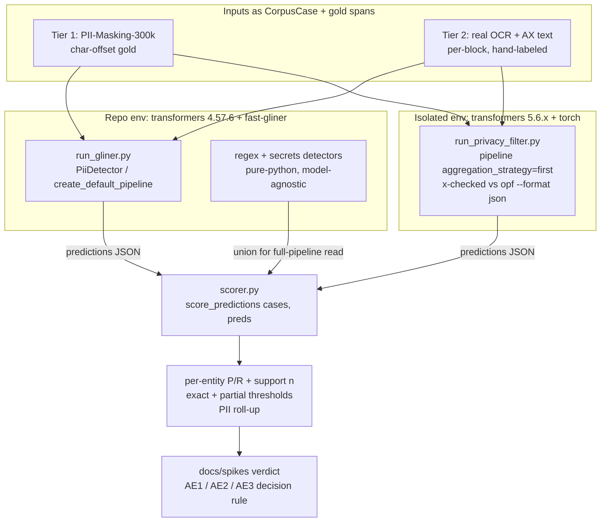

# SCR-28 Spike: `openai/privacy-filter` vs GLiNER as default text-PII backend

## Summary

This plan builds a self-contained evaluation harness under `benchmarks/scr28/` that scores GLiNER and `openai/privacy-filter` head-to-head and produces a documented **swap / no-swap verdict**. The harness **decouples inference from scoring**: each model emits predicted spans as JSON in its own Python environment (privacy-filter needs `transformers` 5.6.x, which conflicts with the repo's pinned 4.57.6), and a pure-Python scorer — reusing the in-repo scoring core from `tests/privacy/test_benchmark.py` — grades both models' JSON against gold annotations on identical entity definitions. Two tiers run through that one scorer: Tier 1 (the public PII-Masking-300k dataset, for a fast common-ground read and a published-F1 wiring sanity check) and Tier 2 (a hand-labeled testbed from real Screencap OCR + accessibility text, which is the deciding input). No production code under `src/screencap/` changes.

---

## Problem Frame

Screencap runs a mature text-PII pipeline: `PiiDetector` ([src/screencap/privacy/pii.py](src/screencap/privacy/pii.py)) wraps Presidio with GLiNER (`knowledgator/gliner-pii-base-v1.0`, run via `fast-gliner` ONNX) as the default NER backend, fed by Apple Vision OCR and accessibility-tree strings, with secrets/regex layers alongside. `openai/privacy-filter` (Apache 2.0, April 2026) occupies exactly that post-OCR text-detection seat, so it is a candidate to swap into a single backend. There is **no observed deficiency** in GLiNER — this spike is exploratory. The risk it guards against: the model's headline F1 is measured on clean synthetic prose, while Screencap's real input is noisy, fragmentary OCR/accessibility text, a distribution where a prose winner can lose. See origin for full framing ([docs/brainstorms/2026-05-29-scr-28-openai-privacy-filter-spike-requirements.md](docs/brainstorms/2026-05-29-scr-28-openai-privacy-filter-spike-requirements.md)).

---

## Requirements

- R1. Produce a documented **swap / no-swap recommendation** with supporting evidence attached.
- R2. State explicitly that the spike is **exploratory** — no known regression motivated it.
- R3. Score both models on a public PII benchmark — **PII-Masking-300k** — and reproduce privacy-filter's published F1 as a sanity check.
- R4. Run both models through a **single scoring harness** with detections mapped through Screencap's `EntityType` set, so the comparison is on identical entity definitions.
- R5. Assemble a small hand-labeled testbed from **real Screencap recordings** (Vision OCR + accessibility-tree strings) with known PII annotated.
- R6. Run both models **head-to-head on the Tier-2 testbed**; this tier is the deciding input.
- R7. Report **per-entity precision/recall** (not just aggregate F1), so under-detection of high-priority types (names, emails, phones) is visible.
- R8. Measure and report **latency/throughput and model footprint** (download size + resident memory) for each backend.
- R9. Document the **entity-coverage delta**: privacy-filter adds URL/date/account_number/secret and lacks explicit SSN/credit-card classes that the current mapping uses — and how each maps onto, or falls outside, Screencap's `EntityType` set.

**Origin acceptance examples (decision rules the verdict must honor):**
- **AE1** (R1, R6, R8): privacy-filter matches-or-beats GLiNER on per-entity recall for high-priority types **and** acceptable latency/footprint → recommend swap.
- **AE2** (R1, R3, R6): privacy-filter wins Tier 1 but loses/ties Tier 2 → verdict is **no-swap**, stated explicitly rather than leaning on the public-benchmark win.
- **AE3** (R7, R9): a currently-redacted type (e.g., SSN) that privacy-filter does not natively label → the verdict surfaces the regression risk rather than hiding it under aggregate F1.

---

## Scope Boundaries

- **No production integration** — wiring privacy-filter into the backend, config surface, or model packaging is a follow-up ticket if the verdict is positive. No changes to `src/screencap/privacy/`.
- **Text-only** — no image/video/audio modality work.
- **No consolidation of the secrets-detection layer** via privacy-filter's `secret` class.
- **No fine-tuning** of privacy-filter on Screencap data.
- The legacy **spaCy** backend is excluded from the comparison.
- Not a redesign of the broader redaction pipeline.

### Deferred to Follow-Up Work

- Production integration of privacy-filter (new backend in `PiiDetector`, `OPENAI_ENTITY_MAPPING` in `entity_mapping.py`, `create_default_pipeline` branch, `_VALID_PII_ENGINES`, setup-wizard model download, PyInstaller smoke-test entry): a separate ticket, gated on a positive verdict.
- Capturing the evaluation methodology (BIOES→char-offset recipe, per-block scoring decision, decoupled-runner pattern) as a `docs/solutions/` learning via `/ce-compound` after the spike lands.

---

## Context & Research

### Relevant Code and Patterns

- **Adapter pattern to mirror:** `_FastGLiNERRecognizer(LocalRecognizer)` inside `PiiDetector._init_gliner` ([src/screencap/privacy/pii.py:64](src/screencap/privacy/pii.py)) — wraps a non-spaCy model as a Presidio recognizer returning char-offset `RecognizerResult`s. The privacy-filter runner mirrors its label-map → char-span shape (but emits JSON, not a live recognizer — see Key Technical Decisions).
- **Entity mapping (extension point):** [src/screencap/privacy/entity_mapping.py](src/screencap/privacy/entity_mapping.py) — `PRESIDIO_MAP` and `GLINER_ENTITY_MAPPING`; two-hop translation `native label → Presidio type → EntityType`. `EntityType` (6 PII: PERSON, EMAIL, PHONE, SSN, CREDIT_CARD, ADDRESS; 6 secret) is defined in [src/screencap/privacy/__init__.py](src/screencap/privacy/__init__.py). GLiNER currently **drops** url/date/account_number (commented out at `entity_mapping.py:38`).
- **Scoring harness to reuse:** `run_benchmark(pipeline) -> AggregateResult`, `BenchmarkResult` (per-type precision / recall_exact / recall_partial / avg_coverage / f1), `print_benchmark_table`, `save_benchmark_json` in [tests/privacy/test_benchmark.py](tests/privacy/test_benchmark.py). Span-overlap matching with coverage ratios already captures the leak-relevant (partial) vs boundary-relevant (exact) distinction.
- **Standalone runner (template):** [benchmarks/benchmark_pii.py](benchmarks/benchmark_pii.py) — `--engine {presidio,presidio-gliner,full}` builds a `DetectionPipeline`; `--compare A.json B.json` diffs two result JSONs. Prior baselines: `benchmarks/baseline_before_fast_gliner.json/`, `benchmarks/after_fast_gliner.json/`.
- **Labeled corpus + data model:** [tests/privacy/fixtures/test_corpus.py](tests/privacy/fixtures/test_corpus.py) — `CorpusCase(id, description, text, expected, is_false_positive, frequency)`, `ExpectedEntity(entity_type, substring, source)`. Tier-1 and Tier-2 inputs are expressed in these existing dataclasses so they flow through the same scorer.
- **OCR + offset model:** `OcrTextBlock.char_bboxes`, `build_offset_map` in [src/screencap/privacy/ocr.py](src/screencap/privacy/ocr.py); the per-block detect→remap→bbox loop `ocr_mask_screenshot` and the AX `AXValue` path in [src/screencap/scrubber.py](src/screencap/scrubber.py). Detections carry char offsets into normalized text; the scrubber detects **per OCR text block**, not over a concatenated screen.
- **Recordings on disk:** `~/.screencap/recordings/<name>/recording.db` (raw `sqlite3`). PII-bearing fields: `action_event.element_state` JSON → `AXValue` (AX text); `window_event` titles / `browser_url`; screenshot files (OCR source).

### Institutional Learnings

- [docs/solutions/build-errors/macos-pre14-binary-install-failure.md](docs/solutions/build-errors/macos-pre14-binary-install-failure.md) — `fast-gliner` statically links ONNX Runtime at `minos 11.0`; the pip `onnxruntime` package (minos 14.0) is deliberately excluded and negatively asserted in the smoke test. "`minos` is contagious." A `transformers`+`torch` backend reopens this matrix. **Relevant to R8: footprint is a *bundled-binary* question, not a parameter count.**
- [docs/solutions/build-errors/pyinstaller-frozen-binary-ci-failures.md](docs/solutions/build-errors/pyinstaller-frozen-binary-ci-failures.md) — the shipped binary has a `_smoke-test` validating Presidio/GLiNER/onnxruntime-exclusion load; packages that call `sys.executable` or rely on `importlib.util.find_spec()` fail silently when frozen. Any future privacy-filter integration must clear the same gauntlet — recorded here as integration cost for the verdict, **not** spike work.
- No prior PII-detection benchmarking learning exists in `docs/solutions/`; this spike's methodology is novel for the repo (worth `/ce-compound` afterward).

### External References

- **Model loading & decoding** ([HF model card](https://huggingface.co/openai/privacy-filter), [transformers model_doc](https://github.com/huggingface/transformers/blob/main/docs/source/en/model_doc/openai_privacy_filter.md)): native `OpenAIPrivacyFilterForTokenClassification` (no `trust_remote_code`); `config.json` stamps `transformers_version: 5.6.0.dev0` — **plan around needing transformers 5.6.x, not 4.x.** 8 span labels (`account_number`, `private_address`, `private_email`, `private_person`, `private_phone`, `private_url`, `private_date`, `secret`); 33 token classes (O + 8×BIOES) decoded with a **constrained Viterbi decoder**. Fast tokenizer ships, so `offset_mapping` is available. CPU inference supported. An official `opf` CLI (`--device cpu`, `--format json`) emits Viterbi-decoded `{label,start,end,text}` spans directly.
- **Decoding nuance** ([transformers token-classification pipeline source](https://github.com/huggingface/transformers/blob/main/src/transformers/pipelines/token_classification.py)): HF `pipeline(aggregation_strategy="first")` returns char `start`/`end` per entity group via the fast tokenizer's `offset_mapping`. **Uncertain** whether that path invokes the model's Viterbi decoder or generic BIO grouping over argmax — must be cross-validated against `opf --format json` (see U1). Use `"first"` (not `"simple"`) for a subword model. Half-open `[start, end)` offsets everywhere.
- **Footprint** (HF file tree): MoE, 1.5B total / 50M active (128 experts, top-4). On disk: `model.safetensors` 2.8 GB; ONNX variants `model_q4f16.onnx` ~809 MB, `model_q4.onnx` ~917 MB, `model_quantized.onnx` (int8) ~1.62 GB, `model_fp16.onnx` ~2.8 GB. All materially larger than GLiNER's quantized ONNX. **MoE on CPU is not guaranteed fast** — measure, don't assume.
- **Dataset** ([ai4privacy/pii-masking-300k](https://huggingface.co/datasets/ai4privacy/pii-masking-300k)): `load_dataset("ai4privacy/pii-masking-300k")`; provides `privacy_mask` (char offsets), `span_labels`, `mbert_bio_labels`. **License is NOT plainly permissive** — academic use with citation; commercial use requires contacting ai4privacy. Eval-only internal use is fine; do not ship the dataset.
- **Eval methodology** ([Presidio `SpanEvaluator`](https://github.com/microsoft/presidio-research/blob/master/presidio_evaluator/evaluation/span_evaluator.py), [Batista MUC/SemEval-2013](https://www.davidsbatista.net/blog/2018/05/09/Named_Entity_Evaluation/)): greedy best-overlap match (type-ignored for matching, type-checked at scoring → WrongEntity counts as FP for predicted type + FN for gold type); **merge adjacent same-type spans before matching** (handles first/last-name-as-two-spans vs one gold PERSON span); report per-entity P/R with support n + a binary PII-vs-O roll-up; recall-weighted Fβ (β≈2) for high-harm types. Report at a lenient threshold (leak-relevant) and a strict threshold (boundary-relevant).
- **OCR distribution shift** ([Cambridge / Hamdi 2022](https://www.cambridge.org/core/journals/natural-language-engineering/article/abs/indepth-analysis-of-the-impact-of-ocr-errors-on-named-entity-recognition-and-linking/C732399FF72BAFE8FF830BB1F5ED7576), [MultiCoNER v2](https://arxiv.org/html/2310.13213)): OCR errors devastate NER (up to ~80% of entities misrecognized); corruption *inside* entity tokens hurts most. Justifies Tier 2 as decisive.
- **Published-F1 correction (important):** privacy-filter's headline 96%/97.43% are **token-level**; exact-span F1 is **92.6% / 94.2%**. The **"corrected" PII-Masking-300k variant is OpenAI's internal methodology (model-card §7.2.1), NOT a downloadable dataset** — and arXiv 2504.12308 is a *critique* paper ("Unmasking the Reality of PII Masking Models"), not the source of a corrected dataset. **Reproduce against the original dataset and expect the baseline numbers (token F1 ~0.96, exact-span ~0.926), not the corrected ones.**

---

## Key Technical Decisions

- **Decouple inference from scoring via JSON.** privacy-filter requires `transformers` 5.6.x; the repo pins 4.57.6 (transitive) and runs GLiNER through `fast-gliner` (ONNX, no transformers at inference). Rather than force both models into one process, each model runs in its **own environment/process** and emits predicted spans as JSON in a common schema. A pure-Python scorer (no ML deps) grades both JSONs. This sidesteps the version conflict entirely and mirrors the existing `--compare A.json B.json` shape in `benchmark_pii.py`. (Resolves origin planning question R4.)
- **Reuse the in-repo scoring core, don't rebuild it.** Extract the prediction-grading half of `run_benchmark` into a `score_predictions(cases, predictions_by_case) -> AggregateResult` helper in `tests/privacy/test_benchmark.py` (backward-compatible: `run_benchmark(pipeline)` then = run pipeline → call `score_predictions`). The spike scorer loads each model's JSON and calls `score_predictions`. This gives identical matching + per-type aggregation + Markdown/JSON output for both tiers and both models, and reuses the corrected entity definitions for free. (Resolves origin planning question R4; the brainstorm's assumption that `presidio-evaluator` is a project dependency is **wrong** — it is not installed; the in-repo harness fulfills R4's intent better.)
- **BIOES → char-span via the fast tokenizer, cross-validated against `opf`.** The privacy-filter runner decodes to char offsets using `pipeline(task="token-classification", aggregation_strategy="first")` reading `(entity_group, start, end)`; U1 validates those offsets against `opf --format json` on sample inputs before trusting them. If they diverge, fall back to `opf` JSON as the authoritative decoder. Half-open offsets; merge adjacent same-type spans at scoring time. (Resolves origin planning question on BIOES alignment.)
- **Score per OCR text block, not concatenated screens.** The scrubber calls `pipeline.detect()` per `OcrTextBlock`. Feeding privacy-filter whole documents would let its 128k-context advantage inflate results above production behavior. Tier-2 inputs are block-shaped.
- **Compare both NER-only and full-pipeline.** Primary read: NER backend vs NER backend on the PII types both emit. Secondary read (for AE3): full pipeline — privacy-filter's NER spans **unioned with Screencap's existing regex + secrets detections** (both pure-Python, run in the scorer env, resolved via `DetectionResolver`) — vs the existing GLiNER full pipeline, to measure whether the regex/secrets layer compensates for privacy-filter's missing SSN/credit-card classes.
- **Spike artifacts are isolated.** All new code lives under `benchmarks/scr28/`; the only shared-surface change is the backward-compatible `score_predictions` extraction in `tests/privacy/test_benchmark.py`. The verdict doc lands in a new `docs/spikes/` directory.

---

## Open Questions

### Resolved During Planning

- **Does the harness ingest privacy-filter directly or need an adapter? (R4)** — Neither in the live pipeline. Inference is decoupled: a JSON-emitting runner per model, graded by the reused in-repo scorer. `presidio-evaluator` is not a dependency and is not used.
- **How to align privacy-filter's BIOES token spans with Screencap's char-offset model? (R6/R7)** — Decode to char offsets with the fast tokenizer's `offset_mapping` (`aggregation_strategy="first"`), cross-validated against `opf --format json`; merge adjacent same-type spans at scoring; half-open offsets throughout.
- **Which dataset variant for Tier 1? (R3)** — Original `ai4privacy/pii-masking-300k`; the "corrected" variant is not downloadable. Expect to reproduce the **baseline** published numbers (token F1 ~0.96), not the corrected 0.974.

### Deferred to Implementation

- Exact minimum `transformers` version (config stamps `5.6.0.dev0`; pin empirically in U1).
- Whether HF `pipeline(aggregation_strategy="first")` invokes the Viterbi decoder or generic BIO grouping (validate in U1; `opf` JSON is the fallback authority).
- Whether GLiNER (`fast-gliner` ONNX) and privacy-filter can coexist in one env, or must stay in separate processes (U1 confirms; the JSON decoupling means the answer doesn't block the spike either way).
- Real CPU RAM / latency for the MoE model and which ONNX variant to measure (U7).
- Whether the regex/secrets layer fully compensates for the SSN/credit-card gap (measured in U6, full-pipeline mode).

### Deferred to Execution (user decisions, per origin)

- **How many recordings / what PII coverage is "enough"** for a credible Tier-2 read — set when the testbed is assembled (origin: Affects R5).
- **The exact "clear win" margin** that flips the default — origin's suggested default: swap only if privacy-filter matches-or-beats GLiNER on recall for person/email/phone, with no material footprint/latency regression and no currently-redacted entity type lost (origin: Affects R1, R6).

---

## Output Structure

    benchmarks/scr28/
    ├── README.md                  # end-to-end run instructions + env setup (two venvs)
    ├── schema.py                  # common prediction JSON schema (dataclass + (de)serialize)
    ├── label_maps.py              # per-model native-label -> EntityType maps (OPENAI_*, GLINER reuse)
    ├── scorer.py                  # loads predictions JSON, calls score_predictions, emits report
    ├── run_gliner.py              # GLiNER runner (repo env) -> predictions JSON
    ├── run_privacy_filter.py      # privacy-filter runner (isolated env) -> predictions JSON
    ├── tier1_pii_masking.py       # load ai4privacy/pii-masking-300k -> CorpusCase gold + orchestrate
    ├── measure_footprint.py       # download size, RSS, per-block latency/throughput
    ├── tier2_testbed/
    │   ├── extract.py             # pull OCR + AX text blocks from real recording.db
    │   ├── inputs.jsonl           # extracted per-block text (committed, PII-bearing -> see Notes)
    │   └── gold.jsonl             # hand-labeled spans + double-annotation subset
    └── results/                   # per-model, per-tier JSON + Markdown outputs

    docs/spikes/
    └── 2026-MM-DD-scr-28-privacy-filter-verdict.md   # the deliverable (R1)

> The tree is a scope declaration, not a constraint; the implementer may adjust layout. Per-unit `Files:` are authoritative.

---

## High-Level Technical Design

> *This illustrates the intended approach and is directional guidance for review, not implementation specification. The implementing agent should treat it as context, not code to reproduce.*

The seam that makes this work: **predictions are data, not live model calls.** Every model writes the same JSON schema; the scorer never imports a model. The version conflict lives entirely inside the two `run_*.py` processes.

---

## Implementation Units

### Phase 1 — Harness foundation

### U1. Spike scaffold + privacy-filter loading & decoding validation

**Goal:** Stand up `benchmarks/scr28/`, get `openai/privacy-filter` loading on CPU in an isolated environment, and validate the char-offset decoding path before any scoring depends on it.

**Requirements:** R3, R4 (enabling)

**Dependencies:** None

**Files:**
- Create: `benchmarks/scr28/README.md` (two-venv setup, run order)
- Create: `benchmarks/scr28/run_privacy_filter.py` (loading stub + decoding probe)
- Create: `benchmarks/scr28/_validate_decoding.py` (or a `README`-documented manual check)

**Approach:**
- Create an isolated venv (e.g. `benchmarks/scr28/.venv-pf`) with `transformers` 5.6.x + `torch` + `datasets`. Pin the exact working `transformers` version in `README.md` (config stamps `5.6.0.dev0`; the secondary "≥4.50" claim is unreliable).
- Load via `pipeline(task="token-classification", model="openai/privacy-filter", aggregation_strategy="first", device="cpu")`. Also install the `opf` CLI.
- On a small fixed set of strings (a name, an email, a phone, an address, a known false-positive high-entropy token), compare `pipeline` output offsets/labels against `opf --format json`. Record whether they match; if not, designate `opf` JSON the authoritative decoder for the runner.
- Confirm whether GLiNER (`fast-gliner`) and privacy-filter can share one env; if not, document that the JSON decoupling makes it moot.

**Patterns to follow:** model-card / `model_doc/openai_privacy_filter` loading recipe; deferred heavy imports (import `transformers`/`torch` inside function bodies, never module top).

**Test scenarios:**
- Test expectation: none — spike investigation. Correctness is established by the decoding cross-check artifact in the Verification below, not unit tests.

**Verification:**
- The pinned `transformers` version loads the model on CPU without error, recorded in `README.md`.
- The decoding cross-check produces a recorded table showing `pipeline` vs `opf` agreement (or the documented decision to use `opf`), with correct half-open char offsets on the sample strings.

---

### U2. Reusable scorer core (`score_predictions`) + spike scorer

**Goal:** Extract the prediction-grading core of `run_benchmark` so any source of predicted spans can be scored, and build the spike's pure-Python scorer on top of it.

**Requirements:** R4, R7

**Dependencies:** None (can proceed in parallel with U1)

**Files:**
- Modify: `tests/privacy/test_benchmark.py` (extract `score_predictions(cases, predictions_by_case) -> AggregateResult`; `run_benchmark(pipeline)` calls it)
- Create: `benchmarks/scr28/schema.py` (prediction JSON dataclass + (de)serialize)
- Create: `benchmarks/scr28/scorer.py` (load JSON → `score_predictions` → `print_benchmark_table` / `save_benchmark_json`)
- Test: `tests/privacy/test_benchmark_scoring.py` (new) — scorer-core unit tests

**Approach:**
- Identify the post-`pipeline.detect()` portion of `run_benchmark` (the span-overlap matching + per-type aggregation) and lift it into `score_predictions`, keyed by `CorpusCase`. Keep `run_benchmark(pipeline)` behavior byte-identical for the existing corpus.
- The scorer reads a predictions JSON (list of `{case_id, spans:[{start,end,label,score}]}`), the matching `cases`, and runs `score_predictions`. Add span normalization: map native labels → `EntityType` (via `label_maps.py`, U3) and **merge adjacent same-type spans** before matching (Presidio `SpanEvaluator` semantics) so a first-name+last-name pair matches a single gold PERSON span.

**Execution note:** Characterization-first — pin `run_benchmark`'s current `AggregateResult` on the existing corpus (golden snapshot) before extracting `score_predictions`, to prove the refactor preserves behavior.

**Patterns to follow:** `BenchmarkResult` / `AggregateResult` / `print_benchmark_table` / `save_benchmark_json` in `tests/privacy/test_benchmark.py`; `ExpectedEntity` / `CorpusCase` in `tests/privacy/fixtures/test_corpus.py`.

**Test scenarios:**
- Happy path: a prediction exactly matching a gold span → TP; per-type precision/recall computed correctly with correct support `n`.
- Edge case: partial-overlap prediction → counts as recall_partial but not recall_exact (leak-vs-boundary distinction preserved).
- Edge case: two adjacent same-type spans (`first name` + `last name`) merge into one and match a single gold PERSON span (not scored as one TP + one FP).
- Edge case: right span, wrong type (WrongEntity) → FP for predicted type **and** FN for gold type.
- Edge case: unmatched gold span → FN; unmatched prediction span → FP.
- Edge case: empty predictions for a case → all gold become FN; empty gold + predictions present → all FP; both empty → no counts.
- Edge case: a native label outside the canonical `EntityType` set (e.g. `private_url` when unmapped) is dropped from scoring, not counted as error.
- Characterization: `run_benchmark(pipeline)` on the existing corpus returns the pinned golden `AggregateResult` after the refactor.

**Verification:**
- New scorer tests pass; the existing `tests/privacy/test_benchmark.py`-driven suite and `benchmarks/benchmark_pii.py --engine presidio-gliner` produce unchanged numbers.

---

### U3. Per-model runners + label maps (predictions JSON)

**Goal:** Two runners that take a list of `CorpusCase` text inputs and emit predicted spans in the common JSON schema — GLiNER in the repo env, privacy-filter in the isolated env — plus the per-model label→`EntityType` maps.

**Requirements:** R4, R6, R9 (mapping)

**Dependencies:** U1 (decoding recipe), U2 (schema)

**Files:**
- Create: `benchmarks/scr28/label_maps.py` (`OPENAI_ENTITY_MAPPING` spike-local; GLiNER reuses `GLINER_ENTITY_MAPPING`/`PRESIDIO_MAP`)
- Create: `benchmarks/scr28/run_gliner.py`
- Modify: `benchmarks/scr28/run_privacy_filter.py` (from U1 stub → full runner)
- Test: `tests/privacy/test_scr28_runners.py` (new) — label-map + span-decode logic

**Approach:**
- `run_gliner.py` instantiates `create_default_pipeline(pii_engine="presidio-gliner")` (or `PiiDetector(ner_backend="gliner")` for NER-only) and calls `.detect()` per input, emitting `{case_id, spans}` JSON. Also expose the regex+secrets detections separately (model-agnostic) so the scorer can build the full-pipeline union for the privacy-filter side.
- `run_privacy_filter.py` decodes per the U1-validated path to char-offset spans, maps each native label via `OPENAI_ENTITY_MAPPING`, emits the same JSON schema.
- `label_maps.py` records the coverage decisions concretely: `private_person→PERSON`, `private_email→EMAIL`, `private_phone→PHONE`, `private_address→ADDRESS`; and the **gap/extra handling** — privacy-filter has no SSN/credit-card class (→ rely on regex layer, flagged for U8); `private_url`/`private_date`/`account_number`/`secret` have no current `EntityType` home (map to a spike-only "OUT_OF_SCOPE" sentinel so they're visible in reporting but excluded from the head-to-head on shared types).

**Patterns to follow:** `_FastGLiNERRecognizer` label-map → char-span shape ([src/screencap/privacy/pii.py:64](src/screencap/privacy/pii.py)); `entity_mapping.py` two-hop convention; deferred heavy imports.

**Test scenarios:**
- Happy path: privacy-filter runner maps each of the 4 shared native labels to the correct `EntityType` on a known sentence.
- Happy path: BIOES decode of a known multi-token entity yields one span with correct half-open `[start, end)` char offsets.
- Edge case: two distinct adjacent entities (e.g. two back-to-back emails) are NOT merged into one span by the runner (merging is the scorer's job, and only for same-type-with-separator).
- Edge case: `private_url`/`private_date`/`account_number`/`secret` are emitted with the OUT_OF_SCOPE sentinel, not silently dropped, so coverage-delta reporting (U8) can see them.
- Edge case: empty input → empty spans list, valid JSON.
- Integration: `run_gliner.py` and `run_privacy_filter.py` emit byte-compatible JSON that `scorer.py` (U2) loads without transformation.

**Verification:**
- Both runners produce schema-valid JSON for a 5-line smoke input; the scorer ingests both and prints a per-type table.

---

### Phase 2 — Tier 1: public benchmark (fast common-ground read)

### U4. Tier-1 PII-Masking-300k scoring + published-F1 reproduction

**Goal:** Score both models on PII-Masking-300k through the U2 scorer, and reproduce privacy-filter's published baseline F1 as a wiring sanity check.

**Requirements:** R3, R4

**Dependencies:** U2, U3

**Files:**
- Create: `benchmarks/scr28/tier1_pii_masking.py` (load dataset → `CorpusCase` gold via `privacy_mask` char offsets → orchestrate both runners → scorer)
- Create: `benchmarks/scr28/results/tier1-*.json` + Markdown (outputs)

**Approach:**
- `load_dataset("ai4privacy/pii-masking-300k")`; take the English test holdout. Convert each record's `privacy_mask` (char-offset spans) into `ExpectedEntity`/`CorpusCase`, mapping the dataset's native 27 classes onto the canonical `EntityType` set (document the mapping; classes outside the set are dropped from both sides).
- Run both runners over the same cases; score via U2.
- Reproduce privacy-filter's published number as a sanity check: report **token-level** and **exact-span** F1 and confirm they land near the model card's baseline (token ~0.96, exact-span ~0.926). Document that the **corrected** variant (0.974/0.942) is not reproducible (not a published dataset) and is not the target.

**Patterns to follow:** `benchmark_pii.py` orchestration shape; dataset license note (do not commit dataset rows).

**Test scenarios:**
- Test expectation: none — produces evaluation artifacts. Correctness is gated by U2's tested scorer and by the published-F1 reproduction acting as the wiring sanity check (Verification below).

**Verification:**
- privacy-filter's reproduced F1 on the original dataset is within a documented tolerance (~1–2 points) of the model card's **baseline** numbers; a large gap is treated as a harness bug (offsets/label-map) to fix before trusting head-to-head numbers.
- A per-entity Tier-1 table for both models is saved under `results/`.

---

### Phase 3 — Tier 2: real Screencap text (decisive)

### U5. Tier-2 testbed assembly from real recordings

**Goal:** Build a small, hand-labeled, per-block testbed from real Screencap OCR + accessibility text.

**Requirements:** R5

**Dependencies:** U2 (CorpusCase shape); independent of model runners

**Files:**
- Create: `benchmarks/scr28/tier2_testbed/extract.py` (pull OCR + AX text blocks from `recording.db`)
- Create: `benchmarks/scr28/tier2_testbed/inputs.jsonl` (extracted per-block text)
- Create: `benchmarks/scr28/tier2_testbed/gold.jsonl` (hand-labeled spans + double-annotated subset)
- Create: `benchmarks/scr28/tier2_testbed/ANNOTATION_GUIDELINES.md`

**Approach:**
- `extract.py` reads `~/.screencap/recordings/<name>/recording.db` via raw `sqlite3`: OCR text by running `VisionOcr` over screenshot files (per `OcrTextBlock`, preserving block boundaries), and AX `AXValue` strings from `action_event.element_state`. Output per-block text to `inputs.jsonl`, tagged by modality (`ocr` | `ax`).
- Write `ANNOTATION_GUIDELINES.md` first: canonical label set, span-boundary rules (trailing punctuation, first/last name as one span), label **blind to model output**.
- Hand-label `gold.jsonl` as `CorpusCase` + `ExpectedEntity`. Stratify by modality and entity type so high-harm types (person/email/phone, and SSN/credit-card where present) have usable per-type support. Double-annotate a 50–100-item subset, report agreement, reconcile.
- Testbed size / PII coverage is the user's execution-time decision (origin); aim for ≥30–50 instances per high-priority type as a directional floor.

**Patterns to follow:** `VisionOcr`/`OcrTextBlock` ([src/screencap/privacy/ocr.py](src/screencap/privacy/ocr.py)); the AX `AXValue` read path and raw-`sqlite3` table/column guards in [src/screencap/scrubber.py](src/screencap/scrubber.py).

**Test scenarios:**
- Test expectation: none — hand-labeled data asset. Quality is gated by the annotation guidelines and the double-annotation agreement check (Verification below), not unit tests. (`extract.py` itself is a thin DB/OCR read; a single smoke run over one recording is sufficient verification.)

**Verification:**
- `inputs.jsonl` contains per-block text from ≥1 real recording across both modalities; `gold.jsonl` parses into valid `CorpusCase`s; the double-annotated subset has a recorded agreement number and reconciled gold.

---

### U6. Tier-2 head-to-head scoring (decisive)

**Goal:** Run both models on the Tier-2 testbed and produce the deciding per-entity comparison, in both NER-only and full-pipeline modes.

**Requirements:** R6, R7

**Dependencies:** U3, U5

**Files:**
- Create: `benchmarks/scr28/results/tier2-*.json` + Markdown (NER-only and full-pipeline)
- Modify (if needed): `benchmarks/scr28/scorer.py` (full-pipeline union helper)

**Approach:**
- Run both runners over `tier2_testbed/inputs.jsonl` **per block** (no concatenation).
- Score two ways: (a) **NER-only** — privacy-filter NER spans vs GLiNER NER spans on shared canonical types; (b) **full-pipeline** — privacy-filter NER ∪ Screencap regex+secrets (from `run_gliner.py`'s model-agnostic detections, resolved via `DetectionResolver`) vs the existing GLiNER full pipeline. This isolates the SSN/credit-card-gap question (does the regex layer cover what privacy-filter's NER misses?).
- Report per-entity precision/recall with support `n` at exact and partial thresholds, plus the binary PII-vs-O roll-up. Recall is the headline for high-harm types.

**Patterns to follow:** `DetectionResolver` source-priority resolution ([src/screencap/privacy/resolver.py](src/screencap/privacy/resolver.py)); U2 scorer output format.

**Test scenarios:**
- Test expectation: none — uses U2's already-tested scorer and U3's tested runners; this unit produces the decisive results tables, not new logic.

**Verification:**
- Tier-2 NER-only and full-pipeline per-entity tables for both models are saved under `results/`, with support `n` per type and per-block scoring confirmed (no concatenated-document inflation).

---

### Phase 4 — Comparison axes beyond accuracy

### U7. Footprint, latency/throughput, and entity-coverage delta

**Goal:** Measure model footprint and throughput for both backends, and document the entity-coverage delta — the non-accuracy axes the verdict weighs.

**Requirements:** R8, R9

**Dependencies:** U1 (privacy-filter loadable), U3 (runners)

**Files:**
- Create: `benchmarks/scr28/measure_footprint.py`
- Create: `benchmarks/scr28/results/footprint-*.json` + Markdown
- Create: `benchmarks/scr28/COVERAGE_DELTA.md` (or a section folded into the verdict)

**Approach:**
- **Footprint:** record on-disk download size for GLiNER's quantized ONNX vs the privacy-filter variant chosen for a realistic CLI (q4f16 ~809 MB / q4 ~917 MB / int8 ~1.62 GB; safetensors 2.8 GB as the unquantized reference), and resident memory (RSS) of each loaded model. Frame against the **bundled-binary** reality: cite the minos/PyInstaller constraints from `docs/solutions/build-errors/*` as integration cost (transformers+torch reopens the smoke-test/minos matrix) — measured as data, not acted on.
- **Latency/throughput:** per-block inference time on CPU over the Tier-2 inputs (block-shaped, matching production), reported as median + p90 and blocks/sec. Note that the 50M-active MoE does not guarantee fast CPU inference.
- **Coverage delta (R9):** tabulate each model's native labels → `EntityType` (or out-of-scope): privacy-filter adds url/date/account_number/secret (no current `EntityType` home) and lacks SSN/credit-card (currently produced by GLiNER's `ssn`/`credit card` labels). State, informed by U6's full-pipeline result, whether the regex/secrets layer compensates for the SSN/credit-card gap. (Feeds AE3.)

**Patterns to follow:** `are_nlp_models_cached` / HF cache layout for size measurement ([src/screencap/privacy/__init__.py](src/screencap/privacy/__init__.py)); `entity_mapping.py` for the delta table.

**Test scenarios:**
- Test expectation: none — measurement and analysis; numbers are observational. Reproducibility is via a documented, re-runnable `measure_footprint.py`.

**Verification:**
- A footprint table (disk + RSS), a latency/throughput table (median/p90/blocks-per-sec, CPU, per-block), and a coverage-delta table are saved and ready to cite in the verdict.

---

### Phase 5 — Verdict

### U8. Verdict synthesis document

**Goal:** Write the swap / no-swap recommendation, applying the origin decision rules, with all evidence attached.

**Requirements:** R1, R2 (and success criteria)

**Dependencies:** U4, U6, U7

**Files:**
- Create: `docs/spikes/2026-MM-DD-scr-28-privacy-filter-verdict.md` (create `docs/spikes/` if absent)

**Approach:**
- Lead with the **exploratory framing** (R2): no known GLiNER deficiency motivated this.
- Apply the decision rule: **AE1** (swap if privacy-filter matches-or-beats GLiNER on per-entity recall for person/email/phone on Tier 2 *and* footprint/latency are acceptable for the CLI); **AE2** (a Tier-1 win that does not survive Tier 2 → no-swap, stated as such, not leaning on the public benchmark); **AE3** (surface any SSN/credit-card regression risk explicitly, with the U6 full-pipeline finding on whether regex compensates — not hidden under aggregate F1).
- State the verdict so a reader can decide without re-running; if positive, attach the entity-mapping gaps and footprint numbers a downstream integration ticket needs (and reference the PyInstaller/minos integration cost from `docs/solutions/`).
- Note the local-execution privacy posture: privacy-filter runs **locally** (transformers/ONNX), no captured text leaves the machine — same trust posture as GLiNER.

**Patterns to follow:** origin requirements doc structure; success criteria as the doc's self-check.

**Test scenarios:**
- Test expectation: none — synthesis document.

**Verification:**
- The doc states a clear swap/no-swap call backed by Tier-1, Tier-2, footprint/latency, and coverage-delta evidence; a reader can reach the same conclusion without re-running; AE1/AE2/AE3 are each addressed.

---

## System-Wide Impact

- **Interaction graph:** The spike touches no `src/screencap/` runtime path. The only shared-surface edit is extracting `score_predictions` from `run_benchmark` in `tests/privacy/test_benchmark.py`; downstream consumers (`benchmarks/benchmark_pii.py`, the privacy test suite) must see unchanged numbers (U2 characterization test).
- **Error propagation:** Runners and scorer are offline batch scripts; failures surface as non-zero exits / missing result files, not user-facing errors. No daemon, no recording path involved.
- **State lifecycle risks:** The Tier-2 testbed is extracted from **real recordings** and may contain genuine PII (it is, by construction, a PII corpus). See Documentation/Operational Notes for handling.
- **API surface parity:** None — no CLI flag on the shipped `screencap` binary; the spike runners are internal `benchmarks/` scripts.
- **Unchanged invariants:** `src/screencap/privacy/` (PiiDetector, entity_mapping, pipeline) is explicitly unchanged. The GLiNER default backend, `EntityType` set, and all production behavior are untouched; this spike only produces evidence and a verdict.

---

## Risks & Dependencies

| Risk | Mitigation |
|------|------------|
| `transformers` 5.6.x for privacy-filter conflicts with the repo's pinned 4.57.6 / `fast-gliner` GLiNER path | Decouple inference from scoring; run each model in its own venv/process emitting JSON. The scorer has no ML deps. Version conflict never blocks the spike. |
| HF `pipeline(aggregation_strategy="first")` may use generic BIO grouping, not the model's Viterbi decoder → wrong spans | U1 cross-validates pipeline offsets against `opf --format json`; `opf` JSON is the authoritative fallback decoder. |
| privacy-filter footprint (≥0.8 GB quantized ONNX, 2.8 GB safetensors) vs GLiNER's small quantized ONNX may sink the verdict on CLI-distribution grounds regardless of accuracy | Measure footprint **and** the minos/PyInstaller integration cost early (U7); the verdict weighs footprint as first-class (origin Key Decision), so a footprint-driven no-swap is a valid, well-supported outcome. |
| MoE (50M active) may still be slow on CPU | Measure per-block latency on CPU directly (U7); do not infer speed from active-param count. |
| The "corrected" PII-Masking-300k is not a downloadable dataset; chasing 97.43% would mislead | Reproduce against the original dataset, target the **baseline** numbers, and document the correction in U4. |
| Tier-2 testbed is small + single-annotator bias → noisy/biased read | Annotation guidelines first, double-annotate a subset with a recorded agreement number, label blind to model output, report per-type support `n`, treat as directional (origin: user sets "enough"). |
| SSN/credit-card coverage lost when swapping NER backend | U6 full-pipeline mode measures whether the regex/secrets layer (Luhn credit-card, SSN-with-context) compensates; U8/AE3 surfaces any residual gap explicitly. |
| ai4privacy dataset license restricts commercial use | Eval-only internal use; do not commit dataset rows or ship the dataset. |

---

## Documentation / Operational Notes

- **Tier-2 testbed contains real PII.** Decide before committing whether `inputs.jsonl`/`gold.jsonl` live in the repo (consider `.gitignore` for the raw extracts, committing only synthetic-or-redacted exemplars + a regeneration script). Confirm against the user's `.gitignore`-respect preference before staging anything PII-bearing.
- **Two-environment setup** must be documented in `benchmarks/scr28/README.md`: the repo venv for `run_gliner.py`/scorer, and `.venv-pf` (transformers 5.6.x) for `run_privacy_filter.py`. Pin the exact `transformers` version found in U1.
- **Post-spike:** capture the methodology (decoupled-runner pattern, BIOES→char-offset recipe, per-block scoring decision) as a `docs/solutions/` learning via `/ce-compound`; if the verdict is positive, open the integration ticket in `docs/tickets/` (per project convention) carrying the entity-mapping gaps, footprint numbers, and the PyInstaller/minos cost.

---

## Sources & References

- **Origin document:** [docs/brainstorms/2026-05-29-scr-28-openai-privacy-filter-spike-requirements.md](docs/brainstorms/2026-05-29-scr-28-openai-privacy-filter-spike-requirements.md)
- Related code: [src/screencap/privacy/pii.py](src/screencap/privacy/pii.py), [src/screencap/privacy/entity_mapping.py](src/screencap/privacy/entity_mapping.py), [src/screencap/privacy/__init__.py](src/screencap/privacy/__init__.py), [src/screencap/privacy/ocr.py](src/screencap/privacy/ocr.py), [src/screencap/privacy/resolver.py](src/screencap/privacy/resolver.py), [src/screencap/scrubber.py](src/screencap/scrubber.py)
- Harness to reuse: [tests/privacy/test_benchmark.py](tests/privacy/test_benchmark.py), [tests/privacy/fixtures/test_corpus.py](tests/privacy/fixtures/test_corpus.py), [benchmarks/benchmark_pii.py](benchmarks/benchmark_pii.py)
- Learnings: [docs/solutions/build-errors/macos-pre14-binary-install-failure.md](docs/solutions/build-errors/macos-pre14-binary-install-failure.md), [docs/solutions/build-errors/pyinstaller-frozen-binary-ci-failures.md](docs/solutions/build-errors/pyinstaller-frozen-binary-ci-failures.md)
- External: [openai/privacy-filter model card](https://huggingface.co/openai/privacy-filter), [transformers model_doc](https://github.com/huggingface/transformers/blob/main/docs/source/en/model_doc/openai_privacy_filter.md), [token-classification pipeline source](https://github.com/huggingface/transformers/blob/main/src/transformers/pipelines/token_classification.py), [ai4privacy/pii-masking-300k](https://huggingface.co/datasets/ai4privacy/pii-masking-300k), [Presidio SpanEvaluator](https://github.com/microsoft/presidio-research/blob/master/presidio_evaluator/evaluation/span_evaluator.py), [Batista NER eval metrics](https://www.davidsbatista.net/blog/2018/05/09/Named_Entity_Evaluation/), [arXiv 2504.12308 (critique paper, not the corrected dataset)](https://arxiv.org/abs/2504.12308)
