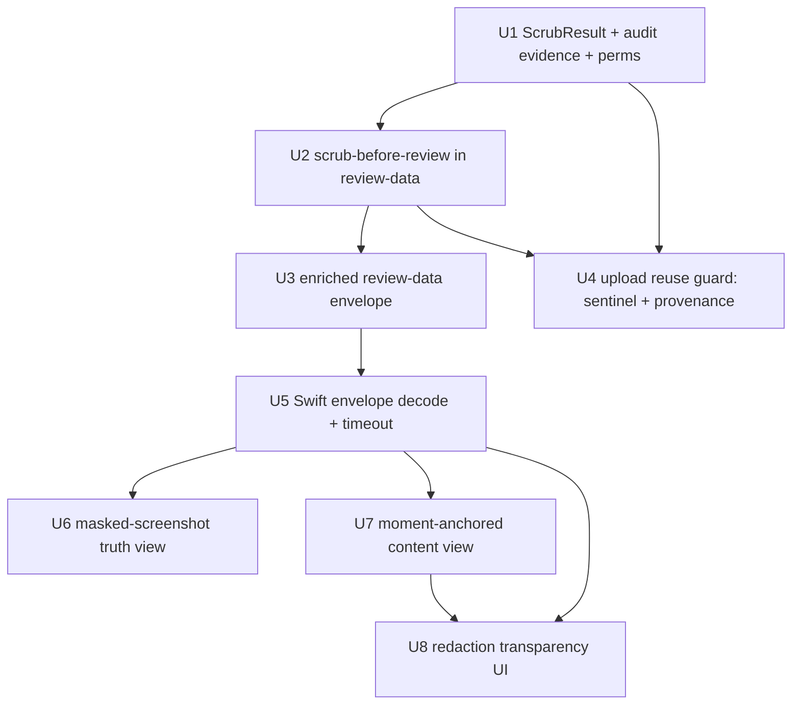

# feat: Native redaction review before upload

## Summary

Make the native pre-upload review window review *exactly what the post-hoc `screencap upload` path ships* — masked screenshots + scrubbed events/DB + scrubbed transcript — by running scrub ahead of consent, surfacing redaction evidence and coverage honestly, and guaranteeing the bytes reviewed are the bytes uploaded. A Python foundation surfaces redaction evidence and re-points `review-data` at the scrubbed artifacts; a SwiftUI layer renders the masked-screenshot truth view, moment-anchored content, and the transparency UI.

---

## Problem Frame

Today the review window renders the **raw original** recording dir and plays a local `video.mp4` that never uploads, while the bytes that *do* leave (a scrubbed copy excluding video/audio, produced only *after* Upload is clicked) go unreviewed. A non-technical operator therefore cannot verify what leaves their machine at the one moment it matters. Full motivation, the two-upload-path policy, and the product decisions are in the origin requirements doc (see Sources & References).

---

## Requirements

- R1. Review surface presents the exact post-hoc upload payload (masked screenshots, scrubbed events/DB, scrubbed transcript), not the raw original.
- R2. Scrub runs before the consent decision is presented.
- R3. Upload ships the same already-prepared scrubbed copy that was reviewed (reviewed == uploaded); no re-scrub.
- R4. A preparing/progress state covers the scrub wait; the window stays responsive.
- R5. Moment-anchored captured event/text content (window/app, typed text, URLs, transcript) from the scrubbed copy — not just category ticks. Network destinations are surfaced *only when present in the uploaded event set* (currently excluded by the `include_network=False` export default — see U2/Key Decisions); the review never shows content the upload omits.
- R6. Content is timeline-anchored: scrubbing surfaces that moment's events; selecting an event seeks the visual.
- R7. Content reflects post-scrub state (redacted data is not shown as live content).
- R8. Redaction made visible at two levels: per-recording summary + per-moment markers, framed as protection.
- R9. Honest coverage disclosure: video/audio are local-only (not uploaded); transcript text is uploaded scrubbed; on-screen PII inside allowed apps in screenshots is the operator's to verify.
- R10. Terminal actions stay binary: Upload / Cancel. *(Preserved invariant — satisfied by the existing `ReviewWindow.swift` `bottomActions`; not a new unit. Verified by AE5 regression in U6.)*
- R11. Cancel (or window close) uploads nothing and leaves the original untouched. *(Preserved invariant — existing `ReviewWindow` close path; verified by AE5 in U6.)*
- R12. Enriched review lives only in the native window; HTML viewer and the local/cloud/both choice are unchanged. *(Preserved invariant — scope boundary, no unit modifies `screencap view` or the up-front choice.)*
- R13. Advisory risky-moment flags on the timeline (secure-field focus, masked/hidden-app intervals, high-redaction-density), guiding attention without gating Upload.
- R14. Distinct fail-closed signal when the scrubber couldn't analyze some content and removed it to be safe.
- R15. Visual surface = local video (navigation, labeled local-only) + masked-screenshot truth view of what actually uploads.

**Origin actors:** A1 (non-technical operator), A2 (CLI user — flow unchanged)
**Origin flows:** F1 (review the real payload and upload), F2 (inspect, find a problem, decline)
**Origin acceptance examples:** AE1 (R1,R3), AE2 (R2,R4), AE3 (R7,R8), AE4 (R9), AE5 (R10,R11 — covered in U6), AE6 (R6,R15), AE7 (R13), AE8 (R14)

---

## Scope Boundaries

- New daemon `/v0` route for review — rejected; extend the existing `review-data --json` CLI envelope instead.
- Any change to the live chunk upload path (cloud-intent, capture-time-redacted media).
- Pixel redaction beyond the existing window-level screenshot masking (ideation idea #6).
- In-window redaction editing / granular or partial consent (per-file, per-category, per-interval).
- Audio-specific review affordances (waveform/audio scrubber); audio is local-only.
- Changes to the HTML viewer (`screencap view`) or the up-front local/cloud/both choice.
- Re-implementing upload / signed-URL handling in Swift; upload still shells out to `screencap upload`.

### Deferred to Follow-Up Work

- Fix the stale "lossless training corpus" docstring in `src/screencap/review.py` — already spun off as a separate task.
- Cleanup of abandoned `<name>-scrubbed` dirs (when an operator reviews repeatedly or cancels) — a housekeeping concern; out of this plan's critical path.

---

## Context & Research

### Relevant Code and Patterns

- **Review envelope + consumer:** `src/screencap/review.py` (`prepare_review_data`, `REVIEW_SCHEMA_VERSION`, `ReviewPrepareError`); `src/screencap/cli/__init__.py` (`review_data_cmd` ~:1641); `macos/Screencap/Views/Review/ReviewWindowViewModel.swift` (`ReviewDataEnvelope`, `ReviewData`, `ReviewState`, `LiveReviewDataLoader` using `CLIClient.runJSONRaw(["review-data","--json","--",name], timeout: 60)`).
- **Scrub pipeline:** `src/screencap/scrubber.py` (`scrub_recording` ~:2703 → `<name>-scrubbed` dir; `ScrubResult` ~:58; `_write_audit_log` ~:2596 → `privacy_audit.json`; `BlockedInterval` ~:69 / `ScrubContext.blocked_intervals` ~:100; `scrub_text` `<SCRUB_FAILED>` ~:113; `_SKIP_EXTENSIONS` ~:2206); `src/screencap/privacy/reasons.py` (`AuditEntry` ~:49 — export-safe, per-timestamp + category, never the value; `ReasonCode`).
- **Upload:** `src/screencap/cli/__init__.py` upload loop (`_recover_chunk_metadata(..., cloud_bound=True)` ~:2849 — **load-bearing ordering**; "Always scrub before upload" ~:2913 → `d = scrub_result.output_dir` ~:2924 → `upload_recording` ~:2934); `src/screencap/upload.py` (`upload_recording`, `list_recording_files`, `is_uploaded`).
- **Event content reference:** `src/screencap/engine/visualize/html.py` (`create_html` event_dict ~:160-252) is the canonical field set the native content view should mirror; `src/screencap/engine/events.py` (`KeyTypeEvent.text`, `WindowSwitchEvent.app_name/window_title/domain`, `NetworkRequestEvent.host/url`); `src/screencap/exporter.py` (`export_recording`, `build_export_metadata` — `exclude_moves`, `include_network` flags).
- **Visual prep (video):** `src/screencap/engine/video.py` (`remediate_pixfmt_for_review` → sibling review-only file; `concat_video_chunks`); `macos/Screencap/Views/Review/VideoPlayerPane.swift` (AVKit via NSViewRepresentable). Screenshots live in `<rec_dir>/screenshots/*.jpg` (timestamp-named).
- **Bridge:** `macos/Screencap/Controllers/CLIClient.swift` (`runJSONRaw`, `spawn`, `mergedEnv` — no PATH augmentation, so all processing stays in-process); `src/screencap/_stderr_events.py` (`emit_event`).

### Institutional Learnings

- `docs/solutions/integration-issues/review-data-nullable-timing-swift-consumer-2026-06-01.md` — model contract-optional fields as Optional in Swift, never gate `.ready`/`.failed` on them; the emitter + its pinning test are the contract authority, not plan prose. **Governing constraint for U3/U5.**
- `docs/solutions/integration-issues/macos-foundation-process-pipe-pitfalls.md` — always drain stdout (a larger envelope makes a >64KB overrun likelier); `readToEnd()` in the termination handler; no sub-binary TCC; guard against timer-driven respawns.
- `docs/solutions/runtime-errors/chunk-upload-sentinel-gating-and-data-loss.md` — reuse the existing two-layer fail-closed posture (distinguish "disabled" from "succeeded", never delete local without confirmed remote); the sentinel is the last write, gated on all prior writes. **Directly shapes U4's completion-sentinel design.**
- `docs/solutions/ui-bugs/swiftui-windowgroup-vs-window-singleton-scene-2026-05-18.md` — the review window is intentionally a `WindowGroup` (multiple concurrent review windows by design); do not flip it to `Window`. Window-lifecycle actions are not unit-testable → manual QA.
- `SECURITY.md` (SCR-64) — same-EUID trust boundary. Redaction evidence is a **content** guarantee (uploaded bytes are scrubbed), not an **access** guarantee; word the UI accordingly. The reviewed==uploaded guarantee is best-effort against a compromised same-user process (accepted per the existing threat model).

### External References

- None — the redaction/PII engine and review pipeline already exist; this is wiring + native UI on established local patterns.

---

## Key Technical Decisions

- **Extend `screencap review-data`, don't add a daemon route.** It is the established envelope + `CLIClient.runJSONRaw` seam, keeps the PATH-safe in-process model, and is the single spawn chokepoint. The command gains scrub-before-review orchestration and an enriched payload.
- **Lazy scrub at review-open, reusing the existing `preparing` state.** Per-row Upload intent means most recordings never upload; eager scrub at record-stop would waste heavy NER. Latency is absorbed by the preparing state (R4); the Swift-side `review-data` timeout must be raised since the command now runs NER scrub (see U5).
- **Review-data must replicate the upload path's `cloud_bound=True` recovery → scrub ordering.** The upload loop runs `_recover_chunk_metadata(d, cloud_bound=True)` immediately before scrub, and that ordering is load-bearing: the scrub-layer pointer suppression only protects recovered cloud-bound JSONL when it holds. If review-data scrubs without that recovery, the prepared dir is not upload-equivalent and the reuse guard would ship JSONL that skipped pointer suppression (leaking in-interval `mouse.move` waypoints). U2 runs the same recovery; U4's provenance records that it ran.
- **Reviewed == uploaded via a completion sentinel + content-hash provenance — not mtime/presence.** A presence- or mtime-based freshness check is unsafe: a killed-mid-scrub partial dir looks "fresh," and the original is *not* immutable (the upload path itself mutates it via events export, WAL checkpoint, and chunk recovery before scrub). U4 writes a completion sentinel **only as the final step of a fully-successful scrub**, plus a provenance marker recording the scrubber version, a content hash of the source inputs, and that cloud-bound recovery ran. The reuse guard rebuilds on absent sentinel, hash/version mismatch, or recovery-flag absence; `--force` always rebuilds.
- **Faithfulness by construction — read the actual uploaded file set, with a canonical pre-scrub export.** The review reads the scrubbed copy's own files so reviewed == uploaded, but this only holds if: (a) `events.jsonl` (or the per-chunk `events_*.jsonl` set, for chunked recordings — which is what actually ships) is exported into the source dir **before** scrub with a single canonical config, rather than relying on a pre-existing file of unknown provenance; (b) the review reads the same file set the scrubbed dir contains (per-chunk when present, combined otherwise), not an auto-exported combined file; (c) network destinations appear only if the canonical export includes them — the cloud-safe default is `include_network=False`, so by default they are absent from both upload and review (R5 surfaces only what ships). An integration test asserts the reviewed event set is byte-identical to the uploaded set.
- **Binary consent retained.** Smallest scope that ships the trustworthy gate; granular consent would need an upload-side exclusion API that does not exist.
- **Surface R13/R14 as first-class data.** Thread `blocked_intervals` and a fail-closed field onto `ScrubResult` and `privacy_audit.json`; the audit file is the Swift-readable redaction-evidence source. Markers carry timestamp + category only (export-safe), never the redacted value.
- **New envelope fields are additive + optional, version-bumped, pinning-tested.** Per the nullable-timing learning, Swift decodes them Optional with safe defaults and never gates readiness on them.

---

## Open Questions

### Resolved During Planning

- Data path to expose scrubbed content/evidence to Swift → extend the `review-data` envelope.
- Scrub timing → lazy at review-open; the Swift `review-data` timeout is raised to accommodate the NER pass (U5).
- Reviewed==uploaded → completion sentinel (written only on full scrub success) + content-hash/scrubber-version/recovery-flag provenance; reuse guard rebuilds on any mismatch. Supersedes the earlier "mtime/presence likely" framing — the original is mutated by the upload path, so presence/mtime is unsafe.
- Cloud-bound recovery ordering → review-data replicates `_recover_chunk_metadata(cloud_bound=True)` → scrub so the prepared dir is upload-equivalent.
- Network-set alignment → the review shows exactly the uploaded event set (canonical export read from the scrubbed dir). Network destinations appear only when the export includes them (off by default).
- Events-file shape → chunked recordings review the per-chunk `events_*.jsonl` set (what ships), not a freshly combined file.

### Deferred to Implementation

- Whether the masked-screenshot truth view renders the nearest-prior screenshot or interpolates between sparse frames (U6 renders nearest-prior with a timestamp-offset label as the baseline).
- Concurrency contract when two review windows are open for the same recording (serialize on a scrub lock vs. isolate per-window scratch dir) — see System-Wide Impact.
- Cleanup policy/trigger for abandoned `<name>-scrubbed` dirs (see Deferred to Follow-Up Work).
- Whether the scrubber can expose a progress callback for a determinate preparing bar; absent that, U8 uses an indeterminate spinner with copy.

---

## High-Level Technical Design

> *This illustrates the intended approach and is directional guidance for review, not implementation specification. The implementing agent should treat it as context, not code to reproduce.*

Data flow — scrub-before-review and the two visual sources:

```
review-data --json <name>                upload <name>
        │                                     │
        ▼                                     ▼
 prepare_review_data                  reuse guard: completion sentinel
   ├─ ensure local video.mp4            present AND provenance matches
   │   (PyAV concat + pixfmt)           (scrubber ver + source hash +
   ├─ export canonical events            cloud_bound recovery flag)?
   │   into source dir (pre-scrub)          ├─ yes → upload <name>-scrubbed
   ├─ _recover_chunk_metadata(             │         (reviewed == uploaded)
   │     cloud_bound=True)                 └─ no  → recover + scrub, then upload
   ├─ scrub_recording(name) ──────────► <name>-scrubbed/ : events(_NNNN).jsonl,
   │     (writes completion sentinel        recording.db, screenshots/*.jpg (masked),
   │      + provenance ONLY on success)     transcript, privacy_audit.json, .scrub_complete
   └─ build envelope:
        video_path     → local video.mp4   (R15: navigation, local-only)
        screenshots[]  → <scrubbed>/screenshots (R15: "what uploads")
        events_path(s) → <scrubbed> event file set (R5/R7)
        redaction: { summary{entity→count}, markers[{t,category}],
                     blocked_intervals[{start,end,reason}],
                     fail_closed[{t}], coverage{...} }   (R8/R9/R13/R14, all optional)
```

Unit dependency graph:



---

## Implementation Units

### U1. Surface redaction evidence on ScrubResult + audit JSON

**Goal:** Make blocked intervals and fail-closed redactions first-class, review-consumable outputs of scrubbing, with safe file permissions.

**Requirements:** R8, R13, R14

**Dependencies:** None

**Files:**
- Modify: `src/screencap/scrubber.py` (extend `ScrubResult`; populate `blocked_intervals` and a fail-closed field; include them in `_write_audit_log` → `privacy_audit.json`; fix the early-return guard; set dir/file modes)
- Modify: `src/screencap/privacy/reasons.py` (only if a new reason/category is needed to tag fail-closed entries)
- Test: `tests/test_scrubber_class.py`

**Approach:**
- Add `blocked_intervals: list[BlockedInterval]` (already computed in `ScrubContext` during `run()` — thread it onto the result) and a `fail_closed_redactions` collection (timestamps/surfaces where `<SCRUB_FAILED>` or fail-closed deletion occurred) to `ScrubResult`.
- **Fix the `_write_audit_log` early-return:** today it returns when `audit_entries` is empty, which would silently drop `blocked_intervals` for a blocked-app recording with zero NER entities. Guard instead on *all three* collections being empty.
- Extend the `privacy_audit.json` payload additively; keep entries export-safe (timestamp + category/reason only; never raw values).
- **Permissions:** create the scrubbed dir mode `0700` and write `privacy_audit.json` mode `0600`, matching the daemon's audit posture (recording metadata is the same sensitivity class as recordings — SECURITY.md). Assert the dir mode before proceeding.

**Patterns to follow:** existing `ScrubResult`/`AuditEntry` dataclasses and `_write_audit_log` serialization; daemon audit-log file-mode posture.

**Test scenarios:**
- Happy path: a recording with a blocked-app interval yields `blocked_intervals` on the result and in `privacy_audit.json` with start/end/reason.
- Edge case: a recording with blocked intervals but **zero** `audit_entries` still writes `privacy_audit.json` containing the blocked-interval list (the regression the guard fix prevents).
- Edge case: no blocked intervals and no fail-closed events yields empty collections, not missing keys.
- Error/fail-closed path: a field that trips `<SCRUB_FAILED>` is recorded in `fail_closed_redactions` with a timestamp; `Covers AE8.` the raw value never appears in the result or the audit JSON.
- Edge case: `privacy_audit.json` is written mode `0600` and the scrubbed dir is `0700` (assert file/dir modes).

**Verification:** new fields and modes hold on fixture recordings; audit JSON round-trips; no raw redacted values in outputs.

---

### U2. Scrub-before-review orchestration in `review-data`

**Goal:** `review-data` runs cloud-bound recovery → canonical events export → scrub lazily, points the events/screenshots at the scrubbed copy's actual file set, keeps the local video, guards path traversal, and treats total scrub failure as a structural preparation failure leaving no reusable dir.

**Requirements:** R1, R2, R4, R5, R7, R9, R11

**Dependencies:** U1

**Files:**
- Modify: `src/screencap/review.py` (`prepare_review_data`: export canonical events into the source dir; run `_recover_chunk_metadata(cloud_bound=True)`; run/reuse `scrub_recording`; resolve the event source to the scrubbed dir's actual file set; expose scrubbed `screenshots/`; keep local `video.mp4`; surface coverage facts; assert scrubbed-dir path containment; raise `ReviewPrepareError` on total failure)
- Test: `tests/test_cli_review_data.py`

**Approach:**
- **Export canonical events first.** Before scrub, export the events into the source dir with one canonical config (so `copytree` picks them up and the scrubbed copy contains a scrubbed event file set). Do not rely on a pre-existing `events.jsonl` of unknown provenance — re-export (or validate) so the reviewed/uploaded config (`exclude_moves`, `include_network`) is deterministic and identical on both paths.
- **Replicate cloud-bound recovery.** Run `_recover_chunk_metadata(d, cloud_bound=True)` before scrub, mirroring the upload loop, so the prepared dir is upload-equivalent (pointer suppression applies).
- **Resolve the event source to the scrubbed dir's real files.** For chunked recordings that is the per-chunk `events_*.jsonl` set (what ships), not a freshly combined `events.jsonl`.
- Keep the existing in-process PyAV video prep for the local `video.mp4` (navigation aid, local-only).
- **Path-traversal guard:** after resolving the `<name>-scrubbed` dir, assert its resolved path is a strict descendant of the recordings root before emitting any path in the envelope (defense-in-depth over `resolve_recording_dir`).
- All status/progress to stderr (Console); stdout stays the JSON envelope only.
- A total scrub failure raises `ReviewPrepareError` and must leave **no** reusable scrubbed dir (no completion sentinel) — distinct from per-field fail-closed (data, U1).

**Execution note:** Start with a failing test asserting the event source resolves under `<name>-scrubbed`, that a `../` name is rejected before the envelope is built, and that a forced total scrub failure raises `ReviewPrepareError` with no sentinel left behind.

**Patterns to follow:** existing `prepare_review_data` orchestration and `ReviewPrepareError`; the upload loop's recovery→scrub ordering; `resolve_recording_dir` traversal check; stdout/stderr discipline in `viewer.py`.

**Test scenarios:**
- Happy path: review-data returns event/screenshot paths under the scrubbed dir and a video path at the local original.
- `Covers AE1.` a value present in raw events is absent in the events the envelope points to.
- `Covers AE2.` preparation completes and returns a ready envelope for a multi-chunk recording.
- Integration: a crash-recovered chunked recording, reviewed-then-uploaded, contains no in-interval `mouse.move` waypoints (cloud-bound recovery ran before scrub).
- Edge case (chunked): the reviewed event source is the per-chunk `events_*.jsonl` set, matching what upload ships.
- Error path: a `../` recording name is rejected before any path is emitted.
- Edge case: recording with empty `screenshots/` returns an explicit empty screenshot set, not an error.
- Error path: forced total scrub failure → `ReviewPrepareError`, and no `.scrub_complete` sentinel exists afterward.

**Verification:** envelope points at scrubbed artifacts equal to the uploaded set; recovery ran; raw values absent; traversal rejected; total failure structural and leaves nothing reusable.

---

### U3. Enriched, versioned review-data envelope

**Goal:** Extend the envelope contract with the redaction-evidence + coverage payload and the screenshot set, additively and optionally, with pinning tests.

**Requirements:** R5, R8, R9, R13, R14, R15

**Dependencies:** U2

**Files:**
- Modify: `src/screencap/review.py` (envelope builder; bump `REVIEW_SCHEMA_VERSION`; add `screenshots`, `redaction` summary/markers/blocked_intervals/fail_closed, `coverage` fields — all optional)
- Test: `tests/test_cli_review_data.py`

**Approach:**
- Add fields as optional/nullable; absence/empty must be representable so a recording with no redactions still yields a valid `ok: true` envelope.
- `coverage` carries the R9 facts as structured data (video/audio local-only; transcript scrubbed; screenshots = the visual; allowed-app on-screen PII not auto-redacted) — the UI renders copy from these, not hardcoded strings.
- Bump `REVIEW_SCHEMA_VERSION`; keep old fields intact.

**Patterns to follow:** the existing `ok/schema_version/...` envelope and `info --json` envelope pattern.

**Test scenarios:**
- Happy path: envelope includes `redaction.summary`, `markers`, `blocked_intervals`, `coverage`, `screenshots` for a recording with redactions.
- Edge case (pinning): a recording with zero redactions serializes empty collections / nulls as JSON (mirror `test_nullable_metadata_serialized_as_json_null`), still `ok: true`.
- Edge case: `schema_version` reflects the bump.
- `Covers AE4.` coverage facts are present and structured.
- Regression: existing consumers reading only the original fields still decode.

**Verification:** envelope validates against the new schema; null/empty cases pinned; version bumped.

---

### U4. Upload-side reuse guard (reviewed == uploaded)

**Goal:** `screencap upload` ships the review-prepared scrubbed copy only when a completion sentinel and provenance prove it is complete, current, and built the same way upload would build it.

**Requirements:** R3, R14

**Dependencies:** U1, U2

**Files:**
- Modify: `src/screencap/cli/__init__.py` (upload loop ~:2913 — check sentinel + provenance before `scrub_recording`; reuse when valid, rebuild otherwise)
- Modify: `src/screencap/scrubber.py` (write `.scrub_complete` sentinel + provenance marker as the final step of a successful scrub; record scrubber version, source content hash, and the cloud-bound-recovery flag)
- Test: `tests/test_upload.py`

**Approach:**
- `scrub_recording` writes the completion sentinel + provenance **last**, only on full success (mirrors the chunk-upload sentinel-gating learning). A killed-mid-scrub dir therefore has no sentinel.
- The upload guard reuses the existing `<name>-scrubbed` only when: the sentinel exists, the scrubber version matches, the source content hash matches (detecting upload-path mutation of the original — events re-export, WAL checkpoint, chunk recovery), and the cloud-bound-recovery flag is set. Otherwise it rebuilds.
- Preserve the existing fail-closed posture: a scrub failure still blocks upload (never upload unscrubbed). `--force` always rebuilds.

**Execution note:** Add tests first: a fresh sentinel'd dir uploads without a second scrub; a partial (no-sentinel) dir is rebuilt; a provenance/hash mismatch rebuilds.

**Patterns to follow:** existing upload loop + `is_uploaded`/force handling; `chunk-upload-sentinel-gating` fail-closed posture.

**Test scenarios:**
- `Covers AE1.` after review-data prepares the scrubbed copy, upload ships that exact dir without re-scrubbing.
- Edge case: a partial scrubbed dir (no `.scrub_complete`) is rebuilt, not shipped.
- Edge case: a stale scrubbed copy (scrubber-version or source-hash mismatch) is rebuilt.
- Happy path: with no pre-existing scrubbed copy, upload scrubs then uploads (unchanged behavior).
- Error path: scrub failure still blocks upload (fail-closed preserved).
- Integration: `--force` re-scrubs even when a valid sentinel'd dir exists.

**Verification:** no double-scrub on a valid review→upload path; partial/stale/mutated dirs always rebuilt; fail-closed and force semantics intact.

---

### U5. Decode the enriched envelope in SwiftUI + raise review-data timeout

**Goal:** Model the new envelope fields as Optional with safe defaults, feed them to the review window without gating readiness, and give `review-data` enough time to run the NER scrub.

**Requirements:** R1, R4, R5, R8, R9, R13, R14, R15

**Dependencies:** U3

**Files:**
- Modify: `macos/Screencap/Views/Review/ReviewWindowViewModel.swift` (`ReviewDataEnvelope`, `ReviewData`: add optional `screenshots`, `redaction`, `coverage`; raise/scale the `LiveReviewDataLoader` `review-data` timeout well above 60s — or make it duration-aware — since the command now scrubs; keep `.ready`/`.failed` gated on `ok` + core paths)
- Test: `macos/ScreencapTests/ReviewWindowViewModelTests.swift`

**Approach:**
- Decode additively; default to "no markers / unknown coverage" when fields are absent so a minimal envelope still produces a usable `.ready`.
- Raise the `review-data` shell-out timeout (the current 60s will SIGTERM a long scrub mid-pass; R4's preparing state cannot rescue a hard kill). Pick a generous ceiling or scale by recording size; document the value.
- Carry the new data on `ReviewData` for the panes (U6–U8).

**Patterns to follow:** existing `ReviewDataEnvelope`/`ReviewData` decoding; the nullable-timing learning; `CLIClient` timeout handling.

**Test scenarios:**
- Happy path: a full envelope decodes into `ReviewData` with screenshots, redaction summary/markers, coverage.
- Edge case: an envelope missing the new fields still reaches `.ready` (no gating).
- Edge case: `ok: false` → `.failed`.
- Edge case: the configured `review-data` timeout is the raised value, not 60s (guards the regression).
- Regression: existing ViewModel tests still pass.

**Verification:** decoding total over present/absent fields; readiness unaffected by absence; timeout raised.

---

### U6. Masked-screenshot truth view + local-video labeling

**Goal:** Render the masked screenshots that actually upload, timeline-synced and primary, alongside the local video labeled as not-uploaded — with defined layout, sparse-frame, and empty states.

**Requirements:** R15, R1, R6, R10, R11

**Dependencies:** U5

**Files:**
- Create: `macos/Screencap/Views/Review/ScreenshotTruthPane.swift`
- Modify: `macos/Screencap/Views/Review/ReviewWindow.swift` (compose the screenshot pane as the primary visual beside `VideoPlayerPane`; persistent labels)
- Test: `macos/ScreencapTests/ReviewWindowViewModelTests.swift` (screenshot-selection logic; AE5 regression)

**Approach:**
- **Layout/primacy:** the masked-screenshot pane is the primary "what uploads" surface; the video is the secondary navigation aid. Persistent labels: video footer "Local preview — not uploaded"; screenshot pane "What actually uploads."
- **Sparse-frame baseline:** map the timeline position to the nearest-prior masked screenshot and show a timestamp-offset label (e.g., "Screenshot from 0:14 — 12s ago") so the operator knows it is not real-time. Read frames **only** from the scrubbed `screenshots/`; boundary/empty positions render a "no uploaded frame here" state, never a fallback to the original unmasked screenshot.
- AE5 regression lives here because Cancel/close is the existing `ReviewWindow` path.

**Patterns to follow:** `VideoPlayerPane.swift` (NSViewRepresentable), `TimelinePane` cursor/scrub wiring.

**Test scenarios:**
- Happy path: time T selects the correct nearest-prior masked screenshot from the scrubbed dir.
- Edge case: time between sparse screenshots selects nearest-prior and exposes the timestamp-offset label.
- Edge case: time before the first / after the last screenshot renders the boundary state, not the original.
- Edge case: empty screenshot set renders "no uploaded frames," not a crash.
- `Covers AE6.` scrubbing/selecting updates both the video and the screenshot view to the same moment.
- `Covers AE5.` clicking Cancel or closing the window uploads nothing and leaves the original on-disk state unchanged.

**Verification:** screenshot selection tracks the timeline from the scrubbed dir only; video labeled local-only; sparse/empty/boundary states defined; Cancel is inert.

---

### U7. Moment-anchored event content view

**Goal:** Show the captured event/text content for the current moment from the scrubbed copy, with defined rendering for redacted and fail-closed values.

**Requirements:** R5, R6, R7, R14

**Dependencies:** U5

**Files:**
- Create: `macos/Screencap/Views/Review/EventContentPane.swift`
- Modify: `macos/Screencap/Views/Review/TimelineEvent.swift` (carry content fields: window/app, typed text, URL/domain, transcript snippet; network host only when present), `TimelinePane.swift` (selection → content)
- Test: `macos/ScreencapTests/TimelineEventParsingTests.swift`

**Approach:**
- Extend `TimelineEvent` parsing to retain the content fields `create_html` renders, parsed from the scrubbed event file set. Network destinations appear only if present in that set (off by default — see R5).
- **Redacted-field rendering:** a scrubbed field renders as a visible `[redacted]` placeholder with the event row retained (presence is informative); the value is never shown (R7).
- **Fail-closed routing:** an event field whose value is the `<SCRUB_FAILED>` sentinel is **not** rendered as content — it routes to the R14 fail-closed indicator (shared with U8), so a fail-closed token can never look like real content.
- The pane shows the current moment's events; selecting an event seeks the visual (works with U6).

**Patterns to follow:** `create_html` event_dict (`src/screencap/engine/visualize/html.py`); existing `TimelineEventParser`.

**Test scenarios:**
- Happy path: a `key.type` event surfaces its (scrubbed) text; a `window.switch` surfaces app/title/domain.
- `Covers AE3.` a redacted field renders `[redacted]` (no live value) at its moment, row retained.
- Edge case: a `key.type` with text `<SCRUB_FAILED>` produces a fail-closed marker, not a displayable text field.
- Edge case: an event with no content fields renders a minimal entry (no crash).
- Edge case: unknown/new event types are ignored gracefully (drift-resilient).
- `Covers AE6.` selecting an event seeks the visual to its timestamp.

**Verification:** scrubbed content per moment; redacted shows `[redacted]`; `<SCRUB_FAILED>` routes to fail-closed; parsing resilient.

---

### U8. Redaction transparency UI

**Goal:** Render the two-level redaction evidence, coverage disclosure, advisory risky-moment flags, the distinct fail-closed signal, and a defined preparing/failed UX.

**Requirements:** R8, R9, R13, R14, R4

**Dependencies:** U5, U7

**Files:**
- Create: `macos/Screencap/Views/Review/RedactionEvidenceView.swift`
- Modify: `macos/Screencap/Views/Review/TimelinePane.swift` (risky-moment + redaction markers), `ReviewWindow.swift` (summary header, coverage strip, preparing + failed copy)
- Test: `macos/ScreencapTests/TimelinePaneScrubTests.swift`, `macos/ScreencapTests/ReviewWindowViewModelTests.swift`

**Approach:**
- **Two-level evidence:** per-recording summary (entity categories/counts + hidden-segment count) framed as protection ("removed"/"protected"); per-moment markers drawn on the timeline at audit timestamps.
- **Risky-moment flags (R13):** distinct marker encoding from R8 redaction markers (different shape/color); hover/selection reveals why the moment was flagged. Advisory only — never disables Upload. Distinguish "flagged + scrubber acted" from "flagged + screenshot not auto-redacted" so the operator doesn't over-trust an allowed-app screenshot.
- **Distinct fail-closed signal (R14):** an amber inline callout ("Some content couldn't be analyzed and was removed to be safe"), visually separate from both the entity summary and per-moment redaction markers.
- **Coverage disclosure (R9):** a persistent (not collapsed) strip beneath the screenshot pane, rendered from the envelope `coverage` facts; the allowed-app on-screen-PII blind spot is emphasized relative to the benign facts (it is the only fact requiring operator action); framed as content-assurance, not access-assurance (SCR-64).
- **Preparing state (R4):** indeterminate spinner + "Preparing what will upload…" copy (determinate bar only if the scrubber exposes progress); a hard-timeout escape surfaces the failed state rather than hanging.
- **Failed state:** non-technical copy ("Couldn't prepare a safe version for review. Nothing was uploaded.") with Cancel; Retry where the failure is retryable.

**Patterns to follow:** `TimelinePane` Canvas marker drawing (per-category path batching); `PrivacyMatrixDisclosureView.swift` for disclosure styling; the existing `failedPreparationState` in `ReviewWindow.swift`.

**Test scenarios:**
- Happy path: summary reflects entity counts; markers appear at the right timeline positions.
- `Covers AE7.` a secure-field interval is flagged with the advisory encoding and the flag does not disable Upload.
- `Covers AE8.` fail-closed content shows the distinct amber callout, separate from the summary.
- `Covers AE4.` coverage strip renders the video/audio-local + transcript-scrubbed + screenshot-blind-spot facts, persistently.
- Edge case: zero redactions → a calm "nothing required redaction" state, not an empty/broken panel.
- Edge case: a flagged allowed-app screenshot moment renders the "not auto-redacted" distinction, not a "scrubber acted" affordance.
- Edge case: Upload stays enabled regardless of flags (advisory-only invariant).

**Verification:** evidence + coverage render from envelope data; flags advisory and distinctly encoded; fail-closed distinct; preparing/failed states defined; Upload never gated by flags.

---

## System-Wide Impact

- **Interaction graph:** the review→upload handoff (review-data produces the sentinel'd scrubbed copy; upload reuses it on sentinel+provenance match) is the new coupling; `UploadController` and the upload CLI must agree on the reuse predicate.
- **Concurrency:** the review window is a `WindowGroup` (multiple concurrent windows by design). Two windows reviewing the *same* recording can race on the `<name>-scrubbed` dir (one re-scrubs while the other's upload reuses). Resolve in U2/U4 — serialize on a per-recording scrub lock or isolate per-window scratch — and treat the sentinel as the completion gate so a half-rebuilt dir is never reused.
- **Error propagation:** total scrub failure → `ReviewPrepareError` → `.failed` preparation state (no review, no upload, no sentinel); per-field fail-closed → data surfaced as R14, never blocking.
- **State lifecycle risks:** the original is mutated by the upload path (events export, WAL checkpoint, `_recover_chunk_metadata`); the reuse guard's content hash must detect this, not assume immutability. Abandoned scrubbed dirs accumulate (cleanup deferred).
- **API surface parity:** `review-data` envelope is consumed only by the SwiftUI shell; additive/optional fields keep CLI/test consumers working.
- **Unchanged invariants:** "always scrub before upload" and fail-closed-on-scrub-failure are preserved; binary Upload/Cancel (R10), the original-untouched-on-Cancel path (R11), the HTML viewer and the local/cloud/both choice (R12) are untouched; the live chunk upload path is not modified.

---

## Risks & Dependencies

| Risk | Mitigation |
|------|------------|
| Reuse guard ships a partial/stale/mutated scrubbed copy (reviewed ≠ uploaded, possibly under-redacted) | Completion sentinel written only on full scrub success + content-hash/scrubber-version/recovery-flag provenance; rebuild on any mismatch; `--force` always rebuilds (U4). |
| Review path skips load-bearing `cloud_bound` recovery → pointer data leaks | U2 replicates `_recover_chunk_metadata(cloud_bound=True)` → scrub; provenance records the flag; U4 rebuilds if absent. |
| "Faithful by construction" breaks on chunked / pre-existing / network-flag divergence | Canonical pre-scrub export read from the scrubbed dir's actual file set; integration test asserts reviewed set == uploaded set; network shown only when in the uploaded set (U2). |
| 60s `review-data` timeout kills the NER scrub mid-pass | Raise/scale the Swift-side timeout (U5); preparing state covers the wait (U8). |
| Larger envelope overruns the CLIClient stdout pipe | Drain stdout unconditionally; `readToEnd()` in the termination handler (per Process/Pipe learning). |
| New envelope fields break older Swift decode | Additive + optional fields, version bump, pinning tests; readiness never gated on them. |
| Audit metadata or absolute paths leak via the envelope/audit file | `privacy_audit.json` 0600 / scrubbed dir 0700 (U1); path-containment assert before emitting envelope paths (U2). |
| Two review windows race on the same scrubbed dir | Per-recording serialization or per-window scratch + sentinel gate (U2/U4). |
| UI over-claims a security guarantee | Frame redaction evidence as content-assurance, not access-assurance (SCR-64). |

---

## Documentation / Operational Notes

- The stale `review.py` lossless-corpus docstring is corrected under a separate task (Deferred to Follow-Up Work).
- No new external dependencies; all processing stays in-process (PyAV/NER already bundled).

---

## Sources & References

- **Origin document:** [docs/brainstorms/2026-06-03-native-redaction-review-before-upload-requirements.md](docs/brainstorms/2026-06-03-native-redaction-review-before-upload-requirements.md)
- Related brainstorms: [docs/brainstorms/2026-05-27-upload-review-screen-requirements.md](docs/brainstorms/2026-05-27-upload-review-screen-requirements.md) (built base), [docs/brainstorms/2026-05-29-pyav-review-pipeline-requirements.md](docs/brainstorms/2026-05-29-pyav-review-pipeline-requirements.md) (video prep)
- Related plan: [docs/plans/2026-05-27-002-feat-upload-review-screen-plan.md](docs/plans/2026-05-27-002-feat-upload-review-screen-plan.md)
- Key code: `src/screencap/review.py`, `src/screencap/scrubber.py`, `src/screencap/cli/__init__.py` (upload loop ~:2913, recovery ~:2849), `macos/Screencap/Views/Review/ReviewWindowViewModel.swift`
- Learnings: `docs/solutions/integration-issues/review-data-nullable-timing-swift-consumer-2026-06-01.md`, `docs/solutions/integration-issues/macos-foundation-process-pipe-pitfalls.md`, `docs/solutions/runtime-errors/chunk-upload-sentinel-gating-and-data-loss.md`, `SECURITY.md`
