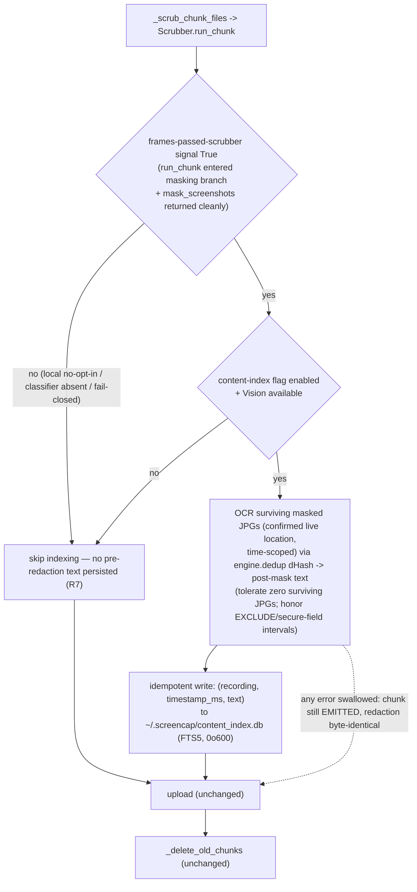
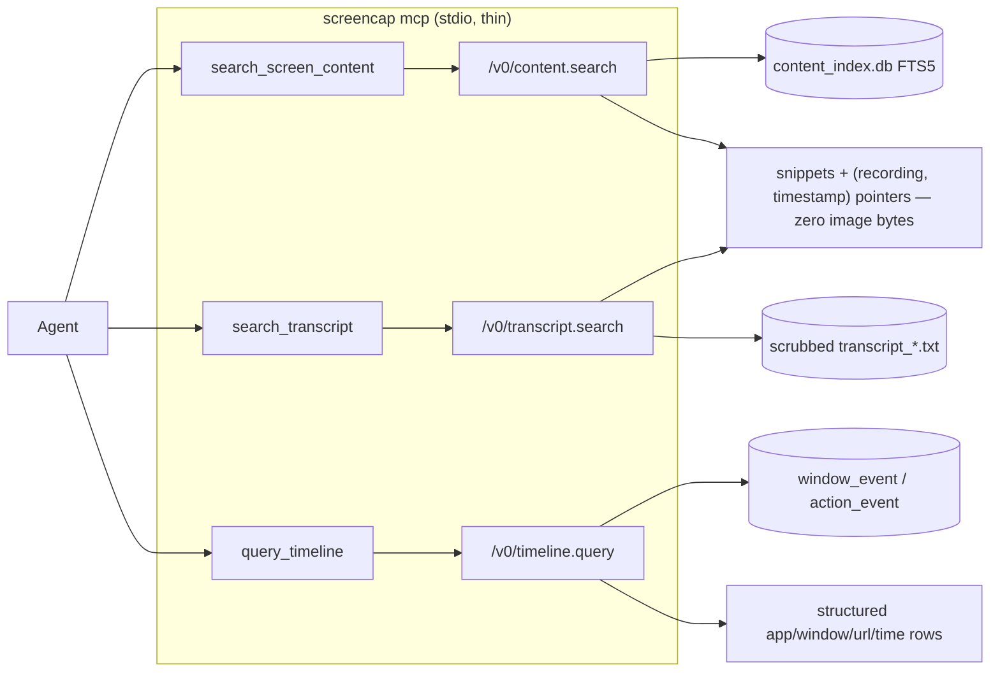

# feat: MCP agent-memory retrieval + content index

## Summary

Add a queryable retrieval surface over ScreenCap recordings: a new global FTS5 content-index sidecar fed by an OCR pass that runs inline in chunk processing immediately after scrub completes, three read-only daemon `/v0/*` query verbs (on-screen content, transcript, timeline), and a thin `screencap mcp` stdio server that forwards agent tool calls to those verbs. The agent receives ranked text snippets plus recording/timestamp pointers — never frame pixels — and the privacy pipeline runs byte-identically whether indexing is on or off.

---

## Problem Frame

ScreenCap captures rich signal but exposes none of it back to an agent — the catalog is raw SQLite, replay is a static viewer, and the strategy's data-flywheel / MCP track has no surface to land on. Meanwhile OCR already runs inside the privacy scrubber to *destroy* sensitive text, and the recognized text that would answer a content query is computed and discarded. This plan builds the retrieval surface and stops throwing that signal away — see origin doc for the full problem narrative and strategic framing (`docs/brainstorms/2026-06-05-mcp-agent-memory-retrieval-requirements.md`).

---

## Requirements

- R1. ScreenCap exposes a local MCP server; the server is a thin wrapper over the daemon's local API holding no query logic beyond protocol translation. *(origin R1)*
- R2. The query surface spans three streams through one coherent interface: structured metadata (apps/windows/URLs/action timeline), audio transcript text, on-screen content text. *(origin R2)*
- R3. Queries answerable from natural language for a non-technical operator, while presenting a stable typed contract an agent-builder can rely on. *(origin R3)*
- R4. A content index makes on-screen text searchable, built by an OCR pass over each recording's **redacted** frames, persisting only post-redaction text + locating metadata (recording, timestamp). *(origin R4)*
- R5. The content-index pass is decoupled from the privacy pipeline: a read-only consumer of already-redacted frames that never alters, gates, or shares state with redaction. *(origin R5)*
- R6. The pass runs inline in chunk processing, after redaction completes and before local frames are deleted; works in both upload and local-only modes. *(origin R6)*
- R7. The index never contains pre-redaction text — by construction it only reads frames that already passed the scrubber. *(origin R7)*
- R8. Query results return post-redaction text snippets + pointers (recording + timestamp); the agent receives no frame images. *(origin R8)*
- R9. Index coverage is a retrieval decision independent of which frames the privacy scrubber OCR'd; the index is not sourced from the sparse privacy OCR pass. *(origin R9)*
- R10. v1 search is keyword/exact matching; the store must not foreclose a later semantic/embedding graduation but need not implement it. *(origin R10)*

**Origin actors:** A1 (developer / agent-builder, MCP client author), A2 (non-technical operator on a consumer agent app), A3 (the querying agent), A4 (ScreenCap engineer maintaining index + query surface).
**Origin flows:** F1 (a recording becomes queryable — index build), F2 (agent answers a content question), F3 (agent answers a metadata/timeline question).
**Origin acceptance examples:** AE1 (covers R5, R7), AE2 (covers R6), AE3 (covers R8), AE4 (covers R2, R4), AE5 (covers R2, R3).

---

## Scope Boundaries

- Recording **control** via MCP (start/stop/pause/observe) — a separate feature; daemon verbs already exist and are smoke-tested.
- Exposing **pre-redaction/raw** content or **frame images** to the agent — against the fail-closed privacy stance.
- Sourcing the index from the existing **sparse privacy OCR pass** — rejected (couples recall to privacy policy).
- **Cloud-side** indexing or re-OCR of uploaded frames — the index is built locally in the pre-deletion window.
- **Per-recording MCP-side opt-in toggles**, multi-session/concurrent-recording modeling — out (one active recording at a time is an existing engine constraint).

### Deferred to Follow-Up Work

- **Backfill** of recordings made before this feature shipped: future iteration / separate PR (origin Outstanding Questions).
- **Semantic / embedding search** (R10 graduation): later; v1 store leaves room (stable `(recording, timestamp)` join key, text persisted not contentless) but does not implement it.
- **Frame-thumbnail-to-agent opt-in** + consent gate (origin Outstanding Question on R8): deferred; v1 pointer is `(recording, timestamp)` only.
- **Shared single-OCR-stage refactor** (one OCR pass feeding both redactor and indexer): future graduation, triggered only if duplicate-OCR overhead shows in the run-all-day metric. See Key Technical Decisions.
- **Per-recording indexing toggle** plumbed through `recording.start`: v1 uses a global config flag; per-recording override is optional polish.

---

## Context & Research

### Relevant Code and Patterns

- **Read-only daemon endpoint pattern** — `recording_list` in `src/screencap/daemon/app.py` (`build_app()` route list): deferred import, `await asyncio.to_thread(...)` for blocking SQLite/file reads, map to Pydantic model, wrap in `schema.envelope(...)`. New query verbs follow this exactly.
- **Daemon schema/versioning** — `src/screencap/daemon/schema.py`: Pydantic v2 models registered in `_MODEL_NAMES`, per-endpoint `_X_API_VERSION` constants. Reuse this; do not introduce a new versioning scheme (origin architecture brainstorm R15).
- **CLI daemon client** — `DaemonHTTPClient` in `src/screencap/cli/_daemon_client.py` (synchronous `httpx.Client` over `HTTPTransport(uds=...)`), and auto-spawn in `src/screencap/cli/_autospawn.py`.
- **Idle-shutdown** — `src/screencap/daemon/_idle_shutdown.py`: `_ACTIVITY_PATHS` currently only `recording.start`/`recording.stop`; read endpoints do not reset the timer.
- **Chunk pipeline** — `_process_chunk` in `src/screencap/chunk_processor.py`: ordering is transcribe → export events → manifest → `_scrub_chunk_files` → upload → `_delete_old_chunks(keep_recent=2)`; one chunk at a time on a non-daemon thread; every step is wrapped so failures log and continue (never raise out, per `docs/solutions/runtime-errors/chunk-upload-sentinel-gating-and-data-loss.md`).
- **Scrubber** — `Scrubber.run_chunk` in `src/screencap/scrubber.py`: masks per-chunk JPGs in place at `<capture_dir>/chunk_<idx>/screenshots/*.jpg`; on masking exception **fail-closes by deleting every `*.jpg`**; the `mask_screenshots` call is itself guarded by `ctx.evaluator is not None and ctx.classifier is not None` (a path where scrub runs but masking is skipped). `ScrubResult` (`scrubber.py`) carries no per-chunk masking-success signal today.
- **OCR primitive** — `ScreenshotOcr` protocol + `VisionOcr` in `src/screencap/privacy/ocr.py`: `recognize(path) -> OcrResult` with `text_blocks`; deferred PyObjC imports. `parse_screenshot_timestamp` in `src/screencap/privacy/context.py` derives the frame timestamp from the JPG filename.
- **SQLite read conventions** — `open_recording_db(path, read_only=True, ...)` + `has_table`/`has_column` in `src/screencap/recording_db.py` (the single seam for raw `sqlite3` in the `screencap` layer). Metadata lives in `window_event` / `action_event`; transcripts in per-chunk `transcript_<idx>.txt` (scrubbed in place).
- **Config flag pattern** — `_parse_bool_env(env, cfg_key, default)` in `src/screencap/config.py` (env > `~/.screencap/config.toml` > default), e.g. `SCREENCAP_AUTO_DELETE`.
- **MCP smoke harness** — `scripts/mcp_contract_smoke.py`: drives daemon verbs over the UDS as an agent would; extend for the new query verbs.

### Institutional Learnings

- `docs/solutions/runtime-errors/chunk-upload-sentinel-gating-and-data-loss.md` — the load-bearing doc: "a subsystem being disabled is not the same as succeeding." The index pass must never make `EMITTED`/upload/delete contingent on OCR completing, and must never reorder upload/delete.
- `docs/solutions/runtime-errors/capture-health-nonscreen-attribution-terminal-stop-2026-06-01.md` — "a heuristic/best-guess signal must never drive a destructive action." Reinforces: an index failure never tears down a recording or blocks upload.
- `docs/solutions/benchmark-results-video-compression.md` — the only quantified per-frame budget anchor (~100ms/frame at 10fps; ~1.4ms headroom at 3K during burst encode). Favor deduped/keyframe OCR and measure against this; it is the empirical basis for the shared-OCR-stage graduation trigger.
- `docs/solutions/runtime-errors/eventbus-late-listener-replay-2026-05-12.md` — cursor/replay semantics if the query surface ever streams indexing progress (v1 is request/response, so this is informational).
- `SECURITY.md` (SCR-64) — daemon trust boundary is same-EUID + filesystem perms; the MCP process gets full query access with no extra auth (so does any same-user process — the accepted boundary). "No pixels to the agent" is **this layer's** responsibility, not the socket's; the `mcp` provenance label is advisory and must gate nothing.

### External References

- **Python MCP SDK** — PyPI package `mcp` (current stable 1.27.x); high-level API is `from mcp.server.fastmcp import FastMCP` (in-SDK, *not* the third-party `fastmcp` package — pin `mcp>=1.27,<2`). Tools defined with `@mcp.tool()`; input schema derived from type hints, structured output from a Pydantic return model. Local clients (Claude Desktop, Codex) launch the server as a **stdio subprocess** via a `command`+`args` config entry — `command="screencap", args=["mcp"]` fits. Critical: with stdio transport the server must never write to stdout (it owns the JSON-RPC stream) — all logging to stderr. A stdio server can freely open its own httpx/UDS connections. Clients enforce a startup timeout (~10s) — defer heavy imports and connect to the daemon lazily/auto-spawn.
- **SQLite FTS5** — verified compiled into CPython 3.10+ on macOS (probe with a temp `CREATE VIRTUAL TABLE ... USING fts5`; PyInstaller bundles the build-Python's SQLite, so add a bundled-app smoke check). Use a standard FTS5 table with pointer columns marked `UNINDEXED`, `unicode61 remove_diacritics 2` tokenizer, `bm25()` ranking (sorts ascending — best is most negative), `snippet()` for bounded excerpts. Contentless FTS5 breaks `snippet()`, so keep text stored. Graceful fallback: a `LIKE`-scan over a plain column, gated on the runtime probe.

---

## Key Technical Decisions

- **Global FTS5 sidecar store, keyed by recording-name + timestamp.** A single `~/.screencap/content_index.db` (not a table inside each `recording.db`). Rationale: cross-recording queries ("what did I do this morning", F3) need one store; the per-recording `recording.id` is not globally unique (each `recording.db` has its own id space) so the global key is the recording **directory name** + frame `timestamp_ms`; co-locating post-mask text inside `recording.db` would mix trust boundaries (that file is skipped from cloud upload precisely because it holds unscrubbed PII) and fight the engine's SQLAlchemy-owned schema; a sidecar survives `stub_recording` so a recording stays queryable after frames are deleted (AE2). Owned with raw `sqlite3` per `recording_db.py` conventions, WAL mode. **Accepted downside:** a single global store is one point of corruption — a corrupt store degrades *every* recording's queryability at once (vs. per-recording isolation today). Mitigated by read-side fail-soft (treat as empty) and the `index_state` signal below so an empty/corrupt result is never silently indistinguishable from "no match"; recovery is rebuild-via-backfill (deferred).
- **The R7 safety gate keys off a per-chunk "frames passed the scrubber" signal, never the `scrub_enabled` config flag.** Extend `ScrubResult` with a flag (e.g. `screenshots_scrub_decided`) **set by `run_chunk`, not `mask_screenshots`** — `True` only when `run_chunk` entered the masking branch (`screenshots_dir.is_dir()` and evaluator+classifier both present) **and** `mask_screenshots` returned without raising; `False` on the evaluator/classifier-absent skip, the not-a-dir skip, and the fail-closed `except` (which deletes the JPGs). **Semantics, stated precisely:** the flag attests "these frames went through the same policy evaluator that gates cloud upload," *not* "every pixel was altered" — `ALLOW`/`TEXT_REDACT` frames are intentionally kept byte-unchanged because policy found no maskable PII. R7 safety therefore rests on the policy-decision contract, and the index pass must tolerate a `True` flag with **zero surviving JPGs** (per-frame `EXCLUDE`/fail-soft deletions happen inside `mask_screenshots` without raising) — treat that as "nothing to index," never "index the raw remainder." This is the load-bearing privacy-correctness decision (R5/R7).
- **`ScrubResult` extension is an accepted coupling concession over independent re-derivation.** The cleaner R5 alternative — the index independently re-derives per-frame eligibility from the public `build_scrub_context` + evaluator/classifier — was rejected for its double policy-eval cost and deeper coupling to policy internals. The concession is bounded by a one-directional invariant: the flag is **write-only from redaction's side** (the index reads it; the redaction path must never branch on it). If redaction logic ever consumes the flag, R5 is breached.
- **Anchor the index pass to "immediately after scrub-success," not "before frame-delete."** Running on the chunk-processor thread right after `_scrub_chunk_files` returns guarantees the frames are present and masked, and sidesteps any deletion-window race (`_delete_old_chunks` deletes mp4/audio/events only — never the screenshots). **Frame location must be confirmed before U2 (open question, P0):** the live recorder writes screenshots to a *flat* `<capture_dir>/screenshots/` (`recorder.py:3596`), and `Scrubber.run()` masks that flat dir; but `Scrubber.run_chunk()` reads a *per-chunk* `<capture_dir>/chunk_<idx>/screenshots/` that nothing in the live pipeline appears to populate. The index must OCR whatever directory the live, post-scrub masked frames actually land in (most likely the flat dir, globbed and time-scoped to `[start_ts, end_ts)` via `parse_screenshot_timestamp`) — and only if masking actually ran over those frames. Do not assume the per-chunk path; trace the live masking path first.
- **The index runs its own OCR over the masked JPGs (the "OCR twice" cost), deduped via the existing primitive.** Not sourced from the privacy pass's discarded recognized-text — honoring R9 (recall independent of privacy policy). Reuse `screencap.engine.dedup.dhash` / `hamming_distance` (the same primitive `mask_screenshots` already uses, threshold 5) to skip near-identical consecutive frames; if duplicate-OCR overhead later shows in the run-all-day metric, that is the explicit signal to graduate to the shared single-OCR-stage design (deferred).
- **Idempotent per-`(recording, timestamp_ms)` index writes.** Re-processing the same chunk is a real path (`screencap upload --force` re-runs scrub/recovery; reconcile re-touches FAILED chunks). A bare append would accumulate duplicate rows and — worse — leave *stale, less-redacted* rows alongside a corrective re-scrub's output. The write API deletes-then-inserts (upsert) the rows for a chunk's timestamp range, mirroring the "remove partially-written manifest before retry" discipline already in `chunk_processor.py`.
- **Index lifecycle is coupled to recording lifecycle for deletion (privacy-correctness, v1), growth is deferred.** Deleting or stubbing-then-deleting a recording must purge its rows from the global store (`delete_recording(name)`); the retroactive `scrub_worker` "disable this app" path must purge the affected `(recording, [start,end))` intervals it already computes (`delete_recording_interval`). Otherwise content the user deliberately destroyed stays queryable through the index — an R7 violation reached through the async/retroactive path rather than the inline one. *Unbounded growth* (orphan rows from external `rm`, WAL file size) is deferred; *deletion propagation* is not.
- **Index on scrub-success (pre-upload), so force-stopped/final chunks still index.** Index membership may therefore include a chunk that never uploaded; this divergence is intentional (local queryability) and documented.
- **Three streams, one tool surface, two physical sources — but coherent interface ≠ coherent recall.** On-screen content uses the new FTS index; transcript and metadata/timeline read existing scrubbed artifacts and event tables. The streams have materially different recall/freshness: timeline is authoritative (event tables, no OCR/redaction loss), content is best-effort (action-gated frames, dHash dedup, OCR limits, redaction loss; lags one chunk), transcript lags transcription. Each query response carries a per-stream coverage/freshness indicator so an agent never mistakes sparse content recall for ground truth (AE4's "subject to the value not having been redacted", made part of the wire contract).
- **Fail-open everywhere.** Any OCR/index error is swallowed (log + continue); redaction output and chunk status are byte-identical with indexing on or off (AE1). Apple Vision unavailable → index pass is a no-op. A single `index_state` enum on query responses distinguishes the cases that would otherwise all look like "empty": `no_match`, `not_indexed` (pre-feature / never-indexed recording), `ocr_unavailable`, `index_degraded` (FTS5 absent → LIKE fallback), and `store_unavailable` (missing/corrupt).
- **Query inputs are validated at the daemon boundary; no pixels and no paths leave the daemon.** The caller-supplied `recording` filter is routed through `daemon/_name_validation.validate_recording_name` / `config.resolve_recording_dir` (traversal-safe `.resolve()` + `is_relative_to`) before any filesystem access; the FTS5 `MATCH` string is bound and phrase-escaped (never string-formatted into SQL), and the `LIKE` fallback escapes `%`/`_`; time-range params are validated numerics with a bounded span. Soft-fail diagnostics carry only an exception class name / enum (mirroring `_internal_error_response`), never a path or raw message. **R8 stated honestly:** the guarantee is "the daemon returns and dereferences no frame pixels" — the `recording` pointer is a directory name a same-EUID agent could resolve itself, so R8 is a property of daemon output, not an enforcement on the agent.
- **Idle-shutdown via a held liveness subscription, not by marking read verbs as activity.** `_idle_shutdown.py` deliberately excludes read-only routes from `_ACTIVITY_PATHS` so cron-driven polling can't pin an auto-spawned daemon open forever; adding query verbs there would reverse that. Instead, the MCP server holds a lightweight `/v0/events` subscription for the agent session, so the existing `subscriber_count() > 0` path in `_daemon_is_busy` keeps the daemon alive and self-clears on disconnect. The daemon still idle-shuts-down 600s after the session ends. (`_ACTIVITY_PATHS` membership for query verbs was the rejected alternative.)
- **Thin `screencap mcp` stdio subcommand** over the daemon UDS, per the 2026-05-08 architecture brainstorm. Add `mcp>=1.27,<2`; defer its import; stderr-only logging; the MCP server uses its **own** `httpx.AsyncClient` over `AsyncHTTPTransport(uds=...)` (the sync `DaemonHTTPClient` cannot be reused in async tools); lazy daemon connect / auto-spawn via the existing `_autospawn` + `default_socket_path` primitives.
- **`content_index.db` is created with hardened at-rest permissions.** Mode `0o600` for the DB and its `-wal`/`-shm` sidecars, parent dir `0o700`, not relying on umask — matching the `auto-serve.log` (`O_CREAT|O_NOFOLLOW, 0o600` + `chmod 0o700`) and engine-token precedents. It is a globally-aggregated post-redaction PII store outside the `recordings/` tree, so it must not inherit `sqlite3.connect`'s default mode.

---

## Open Questions

### Resolved During Planning

- *Index store shape (origin, affects R4):* global FTS5 sidecar at `~/.screencap/content_index.db`, keyed by recording-name + `timestamp_ms`, WAL, raw `sqlite3`.
- *Insertion point & concurrency (origin, affects R6):* inline on the chunk-processor thread immediately after `_scrub_chunk_files` returns; reads only JPGs (no DB flush) so no `flush_lock`/scrub-worker contention; separate sidecar connection avoids `recording.db` lock contention.
- *OCR coverage/dedup (origin, affects R4/R9):* the index OCRs all surviving masked JPGs for the chunk, dHash-deduped; independent of the privacy pass.
- *MCP tool set (origin, affects R1/R3):* `search_screen_content`, `search_transcript`, `query_timeline` (+ reuse `list_recordings`), forwarding to `/v0/content.search`, `/v0/transcript.search`, `/v0/timeline.query`.
- *Idle-shutdown mid-conversation (flow analysis C6):* the MCP server holds a `/v0/events` liveness subscription for the session (existing `subscriber_count` busy path); query verbs do **not** join `_ACTIVITY_PATHS` (preserves the cron-polling protection).
- *Pointer / exposure contract (flow analysis C7):* response models are structurally pointer-only `(recording, timestamp_ms, snippet, score)`; no endpoint returns or dereferences a media path; R8 is a daemon-output guarantee, not an agent-side enforcement (the `recording` key is a resolvable dir name).
- *Deletion propagation (data-integrity finding):* deleting/stubbing-then-deleting a recording, and the retroactive `scrub_worker` disable path, must purge the corresponding index rows. This is a v1 privacy-correctness requirement, not deferred.
- *Idempotency (data-integrity finding):* index writes are idempotent per `(recording, timestamp_ms)` so `--force`/reconcile re-processing cannot accumulate duplicate or stale-under-redaction rows.

### Resolve Early in Implementation (before/at U2)

- **[P0] Live masked-frame location.** Confirm where post-scrub masked screenshots physically land in a live recording (flat `<capture_dir>/screenshots/` per `recorder.py:3596` and `Scrubber.run()`, vs the per-chunk `chunk_<idx>/screenshots/` that `Scrubber.run_chunk()` reads but nothing populates). The index must OCR the real location, and the trace must also confirm masking actually ran over those frames in the live path. If it turns out live screenshot masking is itself not running over the recorder's flat output, that is a pre-existing gap the plan surfaces — escalate rather than indexing unmasked frames.
- **[P1] R7 exposure bound for the index OCR.** Decide whether the index pass (a) skips frames inside secure-field/EXCLUDE `blocked_intervals`, (b) runs the detection pipeline over its own OCR text before persisting, or (c) ships with a narrowed, documented R7 claim ("subset of pixel-masked content, not of all redacted surfaces") — because `TEXT_REDACT`/`ALLOW` frames keep their pixels and the index OCR has no second PII pass.
- **Deletion-wiring call sites.** `stub_recording` is called from `engine/collaborators.py`; there is no standalone recording-delete CLI command — enumerate the actual call sites for `delete_recording` / `delete_recording_interval` (the requirement is settled; the seams are not). The `scrub_worker` intervals are float **unix seconds** with a possible `float('inf')` upper bound — convert to ms (and map `inf` to open-ended) before calling `delete_recording_interval`.
- **Index-write vs purge concurrency.** The inline index write (chunk-processor thread) and the `scrub_worker` interval-purge (its own thread) are not ordered by any shared lock today — a purge can be straddled by a later overlapping chunk write that resurrects deleted text. Define the contract (shared lock, or re-check intervals/surviving-JPG set at write time).

### Deferred to Implementation

- Exact dHash threshold (reuse `engine.dedup`'s) and per-chunk OCR time/frame budget — tune against real recordings and the 100ms/frame anchor; v1 ships a conservative default, caps per-chunk OCR so it cannot stall upload, and logs per-chunk OCR duration.
- Tokenizer final choice (`unicode61` vs adding a `trigram` table for substring search) — v1 starts with `unicode61` keyword ranking; add trigram only if substring demand appears.
- Exact FTS5 column layout, snippet token budget, and `bm25` column weights — directional in U1, finalized against real data.
- Whether transcript search needs its own FTS table or a simple keyword scan over the (small) scrubbed `transcript_*.txt` files suffices — start with the scan; promote to FTS only if latency warrants.
- The exact `scrub_worker` → index wiring point and the `delete_recording` / `delete_recording_interval` call sites (recording-delete command, `stub_recording`, `ScrubWorker._scrub_target`) — the *requirement* is resolved (above); the precise seams are an implementation detail.
- Unbounded-growth garbage collection (orphan rows from an external `rm` of a recording dir; WAL checkpoint cadence/owner for the long-lived store) — bounded-growth GC is deferred; deletion-propagation for in-app deletes is not.

---

## Output Structure

    src/screencap/
      content_index.py            # NEW — FTS5 sidecar: schema, probe+fallback, idempotent write, search,
                                  #       delete_recording / delete_recording_interval; 0o600 perms
      mcp/                        # NEW — thin MCP server package
        __init__.py
        server.py                 # FastMCP app + tool registration; stdio entrypoint; held events subscription
        _client.py                # OWN async httpx.AsyncClient over AsyncHTTPTransport(uds=...)
      chunk_processor.py          # MODIFY — idempotent index pass invoked after scrub-success
      scrubber.py                 # MODIFY — ScrubResult carries the per-chunk frames-passed-scrubber signal
      privacy/scrub_worker.py     # MODIFY — purge index intervals on retroactive "disable this app"
      config.py                   # MODIFY — get_content_index_enabled()
      cli/__init__.py             # MODIFY — `screencap mcp` subcommand
      daemon/
        app.py                    # MODIFY — /v0/content.search, /v0/transcript.search, /v0/timeline.query
        schema.py                 # MODIFY — models in _load_models() + _MODEL_NAMES + __all__; per-endpoint versions
    scripts/
      mcp_contract_smoke.py       # MODIFY — extend for the query verbs
    docs/
      mcp-client-setup.md         # NEW — Claude Desktop / Codex registration guide
    SECURITY.md                   # MODIFY — content index at-rest store, perms, deletion propagation, idle-shutdown
    CLAUDE.md                     # MODIFY — content index + MCP query surface
    # note: recording-delete command + stub_recording also gain a content_index.delete_recording call (U2)

---

## High-Level Technical Design

> *This illustrates the intended approach and is directional guidance for review, not implementation specification. The implementing agent should treat it as context, not code to reproduce.*

**Build side — the R7 gate inside the chunk pipeline.** The index pass is a read-only consumer that runs only on a confirmed-masked chunk:

**Frames-passed-scrubber gate — inputs to the index-eligibility decision (directional).** The signal attests "frames went through the policy evaluator that gates cloud upload," not "pixels were altered" — `ALLOW`/`TEXT_REDACT` frames are intentionally kept byte-unchanged:

| Mode / state | masking branch entered? | surviving JPGs | index this chunk? |
|---|---|---|---|
| Cloud-intent (always scrubs) | yes | masked/allowed per policy | yes |
| Local + scrub opt-in, masking OK | yes | masked/allowed per policy | yes |
| Local, no scrub opt-in | no (step skipped) | raw | **no** (R7) |
| Scrub on, evaluator/classifier absent | no (guard false) | raw | **no** (R7) |
| Masking raised → fail-closed | entered, then raised → flag False | none (deleted) | no |
| Masking OK but all frames `EXCLUDE`-deleted | yes | none (deleted, no raise) | flag True, indexes nothing |

**Query side — three streams, one tool surface:**

---

## Implementation Units

### U1. Content-index store module

**Goal:** A standalone module owning the global FTS5 sidecar DB — schema creation with hardened perms, FTS5 availability probe with `LIKE` fallback, an idempotent write API, a search API returning ranked snippets + pointers, and deletion APIs for lifecycle/privacy. No pipeline or daemon wiring yet.

**Requirements:** R4, R8, R9, R10.

**Dependencies:** None.

**Files:**
- Create: `src/screencap/content_index.py`
- Test: `tests/test_content_index.py`

**Approach:**
- Single DB at `~/.screencap/content_index.db`, WAL mode, opened via the `recording_db.py` conventions. Set an explicit `busy_timeout` (match the `scrub_worker` write-path precedent of 10000 — this store can contend with daemon reads and the retroactive scrub-worker) and wrap each chunk's frame batch in a single committed transaction so a concurrent daemon reader never sees a half-written chunk. **Checkpoint owner:** the chunk-processor writer runs `PRAGMA wal_checkpoint(PASSIVE)` after each committed transaction (non-blocking, the `scrub_worker` precedent) so the long-lived `-wal` does not grow unbounded; name this explicitly so implementers don't re-decide per call site.
- **At-rest perms (mechanism, not just target):** `sqlite3.connect` follows symlinks and creates files at umask-derived mode (`0o644`), and the WAL sidecars are created by SQLite's C internals (no `O_NOFOLLOW` path). So: (1) before first connect, verify `realpath == abspath` for the DB path and its parent (reject + surface `store_unavailable` on a symlink, mirroring `_autospawn._open_auto_log`); (2) set umask to `0o177` around the initial connect (or `chmod 0o600` the `.db` immediately after); (3) immediately after `PRAGMA journal_mode=WAL`, `chmod 0o600` the `-wal`/`-shm` files if present, closing the create-to-chmod window before any second reader; parent dir `0o700`. Don't rely on umask alone for a global PII store.
- Standard FTS5 virtual table: indexed `text` column + `recording` and `timestamp_ms` as `UNINDEXED` pointer/filter columns; `unicode61 remove_diacritics 2` tokenizer. Keep text stored (not contentless) so `snippet()` works.
- **Write is idempotent** per `(recording, timestamp_ms)`: delete-then-insert the rows for a chunk's timestamp range before inserting, so `--force`/reconcile re-processing replaces (never duplicates or leaves stale-under-redaction) rows.
- **Search** binds and phrase-escapes the FTS5 `MATCH` string (never string-formats it into SQL); the `LIKE` fallback escapes `%`/`_`. Returns rows of `(recording, timestamp_ms, snippet, score)` ordered by `bm25` (ascending), with `limit` clamping and a fixed snippet token budget, plus an `index_state` signal. **Never** returns or resolves a file path.
- **Deletion APIs (privacy-correctness):** `delete_recording(recording)` (full purge) and `delete_recording_interval(recording, start_ms, end_ms)` (interval purge, for the retroactive `scrub_worker` disable path).
- Runtime FTS5 probe at init (temp `CREATE VIRTUAL TABLE ... USING fts5`); if absent, degrade to a plain `text` table searched with escaped `LIKE` (recording/time filters first), and surface `index_state = index_degraded`.
- **`index_state` enum** distinguishes the cases that otherwise all look "empty": `no_match`, `not_indexed` (pre-feature / never-indexed recording), `ocr_unavailable`, `index_degraded` (FTS absent), `store_unavailable` (missing/corrupt). A corrupt global store must never be silently indistinguishable from "no match."
- Forward-compat: stable `(recording, timestamp_ms)` join key (or a synthetic `frame_id` PK); leave room for an additive vector sidecar later (R10) — do not make `text` a primary key, do not assume snippet-only storage.

**Patterns to follow:** `src/screencap/recording_db.py` (connection helpers, `has_table`, busy_timeout); `src/screencap/cli/_autospawn.py` (hardened file/dir perms); `src/screencap/privacy/scrub_worker.py` (`busy_timeout` for a contended write path); config/dir helpers in `src/screencap/config.py` for the `~/.screencap` path.

**Test scenarios:**
- Happy path: index three frames across two recordings, search a term present in one → returns that recording's pointer with a non-empty snippet and a score.
- Happy path (ranking): a term appearing more saliently in one frame ranks above a weak match (bm25 ordering correct — best first).
- Happy path (idempotency): writing the same `(recording, timestamp_ms)` twice (simulating `--force` re-processing) leaves exactly one row-set; a second pass with more-redacted text replaces the first (no stale rows survive).
- Edge case: empty store → search returns empty with `index_state = no_match` (or `not_indexed`), not an error.
- Edge case: cross-recording search returns pointers from multiple recordings, each correctly attributed to its `recording` key.
- Edge case: unicode/diacritic text indexed and matched accent-insensitively.
- Edge case (FTS injection): a query containing `"`, `*`, `NEAR`, or a `col:` filter is treated as a bound phrase, does not error and does not escape into a column filter; the `LIKE` fallback treats `%`/`_` literally.
- Edge case (deletion): `delete_recording` purges all of a recording's rows; `delete_recording_interval` purges only rows in `[start_ms, end_ms)` and leaves others.
- Error path: FTS5 unavailable (forced) → escaped `LIKE` path returns correct matches and `index_state = index_degraded`.
- Error path: corrupt/missing DB file at open → search surfaces `store_unavailable` (caller treats as empty), does not raise unhandled.
- Edge case (perms): the created DB (and `-wal`/`-shm`) are mode `0o600`, verified before any second reader could open them.
- Edge case (symlink): a symlink pre-placed at the DB path (or a symlinked parent) causes creation to fail with `store_unavailable`, never follows the link.
- Edge case (concurrency): a reader on a separate connection mid-write never observes a partially-written chunk's rows.
- Edge case: snippet length is bounded to the configured token budget; `limit` clamps result count.

**Verification:** A fresh store is created at `0o600` with FTS5 (or escaped-LIKE fallback); writes are idempotent; deletion APIs purge correctly; `index_state` distinguishes empty/degraded/corrupt from no-match; no search path can emit a file path or image bytes; a concurrent reader never sees partial writes.

---

### U2. Content-index OCR pass in chunk processing (+ frames-passed-scrubber signal + deletion wiring)

**Goal:** Wire the index pass into `_process_chunk` immediately after scrub completes, gated on a new per-chunk "frames passed the scrubber" signal and the content-index config flag. OCR the masked `chunk_<idx>/screenshots/*.jpg` (deduped) via the shared OCR protocol and write post-mask text to U1's store. Wire recording-deletion purge. Fully fail-open.

**Requirements:** R4, R5, R6, R7, R9.

**Dependencies:** U1.

**Files:**
- Modify: `src/screencap/scrubber.py` (extend `ScrubResult` with the per-chunk signal; `run_chunk` sets it)
- Modify: `src/screencap/chunk_processor.py` (new private index method after `_scrub_chunk_files`; thread the `ScrubResult` back from `_scrub_chunk_files` which currently discards it; read the flag in `__init__` like `scrub_enabled`; call `content_index.delete_recording` where a recording is deleted / in `stub_recording`'s caller as appropriate)
- Modify: `src/screencap/privacy/scrub_worker.py` (after a retroactive disable commits its row/screenshot deletes, call `content_index.delete_recording_interval` over the same `(start, end)` intervals it already computes in `_compute_target_set_and_intervals`)
- Modify: `src/screencap/config.py` (`get_content_index_enabled()` via `_parse_bool_env("SCREENCAP_CONTENT_INDEX", "content_index_enabled", default=...)`)
- Test: `tests/test_chunk_processor.py` (extend), `tests/test_scrubber_class.py` (extend), `tests/test_scrub_worker.py` (extend or create, for the interval-purge)

**Approach:**
- Extend `ScrubResult` with a per-chunk flag (e.g. `screenshots_scrub_decided`). **`run_chunk` sets it** (not `mask_screenshots`): `True` only when `run_chunk` entered the masking branch (`screenshots_dir.is_dir()` and evaluator+classifier both present) AND `mask_screenshots` returned without raising; `False` on the evaluator/classifier-absent skip, the not-a-dir skip, and the fail-closed `except`. **Semantics:** the flag means "these frames went through the policy evaluator that gates cloud upload," not "every pixel was altered" (`ALLOW`/`TEXT_REDACT` frames stay byte-unchanged by design). The index pass consumes this — never `_scrub_enabled`.
- New index method on `ChunkProcessor`: if flag-enabled AND the flag is set AND Vision is constructible, glob the masked JPGs (strict `*.jpg`) **from the confirmed live masked-frame location** (see the insertion-point decision and the P0 open question — likely the flat `<capture_dir>/screenshots/` time-scoped to `[start_ts, end_ts)`, not the per-chunk dir), dedup near-identical consecutive frames via `screencap.engine.dedup.dhash` / `hamming_distance` (the same primitive `mask_screenshots` uses), OCR each surviving frame via a `ScreenshotOcr` instance (typed against the protocol, constructed behind `try/except ImportError`), derive `timestamp_ms` as `parse_screenshot_timestamp(name) * 1000` (frame filenames are `{ts:.6f}.jpg` unix-seconds), and write `(recording_name, timestamp_ms, joined post-mask text)` to U1's idempotent store. **Tolerate a set flag with zero surviving JPGs** (per-frame `EXCLUDE`/fail-soft deletions inside `mask_screenshots` do not raise) — index nothing, never the raw remainder.
- **`_scrub_chunk_files` currently returns `None` (discards the `ScrubResult`)** and is only called when scrub ran; thread the result back and treat *no result* (scrub branch skipped entirely) identically to flag=False — the index method must not dereference a missing result.
- **Index OCR is its own pass over post-mask pixels with no second PII-detection step** — so it is *not* strictly a subset of what the scrubber's text-surface redaction removed. Two consequences the plan accepts/flags: (1) a frame the policy classified `ALLOW`/`TEXT_REDACT` keeps its pixels unchanged, so on-screen text the user may consider private (and that `TEXT_REDACT` only scrubbed from the *event/transcript surfaces*, not the rendered pixels) is recoverable by the index OCR — including text visible while a secure/password field is focused, since `mask_screenshots` decides per-frame from window metadata and does **not** consult the secure-field/EXCLUDE intervals that scrub events/DB; (2) any PII the masking OCR missed (ROI-scoped to the active window, dedup-cache reuse, below detector threshold) stays in the pixels and is indexed verbatim. **Decision needed in U2 (see open questions):** either have the index pass honor the secure-field/EXCLUDE `blocked_intervals` (skip those frames) and/or run the detection pipeline over the index OCR text before persisting, or narrow the R7 claim to "subset of pixel-masked content, not of all redacted surfaces" and document the residual exposure. This directly bounds the R7 guarantee.
- Wrap the entire pass in a swallow-all `try/except` that logs and continues — it must never flip `success`, never change `ChunkStatus`, never raise into `_process_chunk`'s try/finally, never alter upload/delete.
- Runs on the chunk-processor thread after `_scrub_chunk_files` (pre-upload) so force-stopped/final chunks that scrubbed still index. Reads only JPGs — no DB flush, no `flush_lock`.
- Apple Vision unavailable → the pass is a clean no-op (chunk proceeds unindexed).
- **Deletion wiring:** the recording-delete path and `stub_recording` (when a recording is fully removed) call `content_index.delete_recording`; `scrub_worker` calls `delete_recording_interval` so retroactive disable purges already-indexed text (the R7 lifecycle hole).

**Execution note:** Land in two reviewable steps. **First**, the privacy-contract change alone — `ScrubResult` signal + `run_chunk` + the AE1 byte-identical characterization test against a *no-op / absent* index consumer — so the redaction-path diff is reviewed in isolation and the fail-open invariant is proven before any consumer exists. **Then** add the index pass that consumes the signal.

**Patterns to follow:** the never-raise discipline of every `_process_chunk` step and `_scrub_chunk_files`; `mask_screenshots`' own `try/except ImportError` OCR construction and its `engine.dedup` usage in `scrubber.py`; `parse_screenshot_timestamp` in `src/screencap/privacy/context.py`; `ScrubWorker._compute_target_set_and_intervals` for the interval shape.

**Test scenarios:**
- Covers AE1. Redaction output (scrubbed events/transcript/manifest + masked JPG bytes) and `ChunkStatus` are identical for a chunk processed with indexing on vs. off.
- Covers AE1 / R7. A chunk where the scrubber masked an on-screen secret → the index contains surrounding text but not the masked value.
- Covers AE2 / R6. With upload + auto-delete on, a chunk is indexed before `_delete_old_chunks` runs; the index entry persists and is searchable after the mp4 is deleted.
- R7 (local no-opt-in): a local recording with scrub disabled → flag False → index pass skipped → store has zero rows for that recording.
- R7 (masking skipped): evaluator/classifier absent so `mask_screenshots` is not called → flag False → no indexing.
- R7 (retroactive disable): index a frame for app X, then dispatch a disable-X scrub-worker job → the corresponding index rows are purged (interval delete fires), mirroring the existing screenshot-row-deletion assertions.
- R7 (recording deletion): deleting a recording purges all its index rows; a subsequent query returns no pointers to it.
- Edge case (fail-closed): masking raises and JPGs are deleted → index pass finds no JPGs → indexes nothing, chunk still `EMITTED`.
- Edge case (flag set, zero JPGs): all frames `EXCLUDE`-deleted inside a successful `mask_screenshots` → flag True but nothing indexed (never indexes a raw remainder).
- Edge case (idempotency): re-processing the same chunk (`--force`/recovery) leaves one row-set; the re-scrubbed (more-redacted) text replaces the prior pass.
- Error path (fail-open): OCR raises mid-pass → exception swallowed, chunk still reaches `EMITTED` and `_delete_old_chunks` runs normally.
- Error path (Vision absent): OCR engine unconstructible → index pass no-ops, chunk unaffected.
- Edge case (dedup): a run of near-identical consecutive frames yields fewer OCR calls / index rows than frame count.
- Edge case (force-stop / final chunk): a chunk that scrubbed but did not upload (PENDING/force-stop) is still indexed (documented divergence) without altering chunk status.
- Integration: end-to-end through `run_chunk` → index method → U1 store, asserting post-mask text lands with correct `(recording, timestamp_ms)`.

**Verification:** Indexing on vs. off produces identical redaction output and chunk lifecycle; only frames that passed the scrubber are ever indexed; re-processing is idempotent; retroactive disable and recording deletion purge index rows; OCR/index failures never affect upload or deletion.

---

### U3. Daemon content-search endpoint

**Goal:** Add `/v0/content.search` reading U1's store and returning ranked snippets + pointers, following the read-only endpoint pattern, with validated inputs and path-free error diagnostics.

**Requirements:** R2, R8; supports F2.

**Dependencies:** U1.

**Files:**
- Modify: `src/screencap/daemon/app.py` (handler + route in `build_app()`)
- Modify: `src/screencap/daemon/schema.py` (request/response models + `_CONTENT_SEARCH_API_VERSION`)
- Modify: `src/screencap/cli/_daemon_client.py` (a `content_search` verb method — required, the smoke harness/MCP need a typed call path; the client has only per-verb methods, no generic passthrough)
- Test: `tests/daemon/test_read_only_verbs.py` (extend)

**Approach:**
- `async def` handler: deferred import of `content_index`, `await asyncio.to_thread(...)` for the search, map to a Pydantic response (`hits: [{recording, timestamp_ms, snippet, score}]` + the `index_state` enum from U1). Wrap in `schema.envelope`.
- **Schema mechanics:** define the request/response models *inside* `schema._load_models()` (keeps the module Pydantic-free until first use), add the model names to **both** `_MODEL_NAMES` and the `__all__` list, and add `_CONTENT_SEARCH_API_VERSION` to the explicit `__all__` constant list.
- **Input validation:** route any caller-supplied `recording` filter through `daemon/_name_validation.validate_recording_name` / `config.resolve_recording_dir` before any filesystem touch; bind + phrase-escape the FTS `MATCH` string (delegated to U1's API); clamp `limit`.
- **Pointer/exposure contract:** the response model carries only `(recording, timestamp_ms, snippet, score)` — structurally incapable of carrying a media path or bytes.
- **Error discipline:** soft-fail diagnostics carry only an exception class name / enum (mirror `_internal_error_response`), never a path or raw exception message.
- Read-only → no audit wiring (consistent with `recording.list`). **Not** added to `_ACTIVITY_PATHS` (idle-shutdown handled by the held subscription in U5).

**Patterns to follow:** `recording_list` and `_internal_error_response` in `src/screencap/daemon/app.py`; the lazy `_load_models()` + `_MODEL_NAMES` + `__all__` mechanics and per-endpoint version constants in `schema.py`; `daemon/_name_validation.validate_recording_name`.

**Test scenarios:**
- Covers AE3 / R8. A content query that matches a frame returns text snippets + `(recording, timestamp_ms)` pointers and zero image bytes — assert the serialized response contains no path/binary fields.
- Covers AE4 / R4. "invoice total wrong"-style query returns candidate moments ranked by on-screen text match.
- Happy path: response envelope carries the correct `schema_version` and shape.
- Edge case (traversal): a `recording` value of `../../foo` (or absolute) is rejected by validation, never resolved to a path outside the recordings root.
- Edge case (FTS injection): a query with `"`, `*`, `NEAR`, or `col:` does not error or escape its column.
- Edge case: empty/not-indexed → `hits: []` with an `index_state` distinguishing empty / not-indexed / no-match.
- Edge case: store missing/corrupt → endpoint fails soft (`index_state = store_unavailable`, class-name-only diagnostic, no path echoed), does not 500 the daemon.
- Edge case: `limit` is clamped; oversized requests don't return unbounded payloads.

**Verification:** Content queries return ranked snippets + pointers only; inputs are validated (no traversal, no FTS-syntax escape); corrupt/empty store degrades gracefully with a path-free diagnostic.

---

### U4. Daemon transcript + timeline query endpoints

**Goal:** Add `/v0/transcript.search` (keyword over scrubbed transcript artifacts) and `/v0/timeline.query` (structured app/window/url/action rows over existing event tables), completing the three-stream surface.

**Requirements:** R2, R3; supports F3.

**Dependencies:** U3 (pattern-sharing only — same read-endpoint shape and schema mechanics; not a hard code dependency, so U4 is not blocked if U3 slips).

**Files:**
- Modify: `src/screencap/daemon/app.py` (two handlers + routes)
- Modify: `src/screencap/daemon/schema.py` (models in `_load_models()` + `_MODEL_NAMES` + `__all__`; per-endpoint versions)
- Modify: `src/screencap/cli/_daemon_client.py` (typed verb methods — required for the smoke harness)
- Test: `tests/daemon/test_read_only_verbs.py` (extend)

**Approach:**
- `transcript.search`: read only the **scrubbed** per-chunk transcript via a **strict `transcript_<NNNN>.txt` extension match** — never the sibling raw `transcript_<idx>.json` (richer per-word fields, an R7 leak), and never a `.scrub_failed` file (the suffix is *appended*, so `transcript_0001.txt.scrub_failed` must not match a `transcript_*.txt` glob — use a strict-extension check, not `startswith`). Keyword scan returning snippet + `(recording, approximate timestamp)` pointer.
- `timeline.query`: read `window_event` / `action_event` via `open_recording_db(read_only=True)` across recordings in a time range (and optional app filter); return structured rows (app, window, url, time). No OCR, no content index touched. **URL exposure decision (R7/R8 for the metadata stream):** `window_event.browser_url` is captured by the engine **pre-scrubber** and may carry OAuth codes, session tokens, or sensitive paths — it has no redaction guarantee the way the content stream does. Decide explicitly: either omit `url` from the response model (lowest-risk v1), or document in `mcp-client-setup.md` that timeline URLs are same-EUID-shared metadata (consistent with SCR-64). Do not silently return raw URLs without making the call.
- **Input validation + bounds:** any caller-supplied `recording` filter routes through `validate_recording_name` / `resolve_recording_dir`; time-range params validated as numerics with a bounded span (reject inverted/oversized → soft DoS guard); enforce the `limit`/max-files clamp **at the daemon handler** (not only the MCP tool layer in U5) so a direct UDS caller cannot drive an unbounded cross-recording transcript scan.
- Both follow the `recording_list` pattern (deferred import, `asyncio.to_thread`, envelope, per-endpoint version) with class-name-only error diagnostics. **Not** added to `_ACTIVITY_PATHS`.
- **Per-stream coverage indicator:** each response carries a small coverage/freshness enum so an agent never mistakes sparse recall for ground truth — `timeline` → `authoritative`; `transcript` → best-effort/`degraded` parity with the content `index_state` shape. (Coherent interface ≠ coherent recall.)
- Cross-recording aggregation uses wall-clock timestamps and the recording-name key so "this morning" spans recordings consistently.

**Patterns to follow:** `recording_list` and `catalog.list_recordings` in `src/screencap/catalog.py` for multi-recording iteration; `recording_db.py` read helpers + `has_table`/`has_column` for schema-tolerant reads; `validate_recording_name`.

**Test scenarios:**
- Covers AE5 / R2, R3. "what apps did I use this morning" → exact app/time rows from event tables, with no OCR or content-index access (assert the content store is not opened); response coverage = `authoritative`.
- Happy path (transcript): a term present in a scrubbed transcript returns a snippet + recording pointer.
- R7 (transcript parity, .scrub_failed): a `transcript_0001.txt.scrub_failed` file is never read (strict-extension match); a recording with only a failed transcript returns no transcript hits.
- R7 (transcript parity, raw JSON): the sibling raw `transcript_<idx>.json` is never read even when present.
- Edge case (traversal): a `recording` filter of `../../foo` is rejected by validation.
- Edge case (timeline): time-range filter spanning two recordings returns rows from both in wall-clock order; inverted/oversized range is clamped/rejected.
- Edge case (timeline): app filter narrows results; empty range → empty rows.
- Edge case: recording with a missing/older schema (no `window_event` columns) is skipped gracefully via `has_table`/`has_column`.
- Edge case: empty/no recordings → empty structured result, not an error.

**Verification:** Timeline queries answer from event tables without invoking OCR and report `authoritative` coverage; transcript search reads only the strict scrubbed `.txt` (never the JSON or `.scrub_failed`); inputs validated; both behave correctly across multiple recordings.

---

### U5. `screencap mcp` thin MCP server

**Goal:** A separate `screencap mcp` stdio process exposing MCP tools that forward to the U3/U4 daemon verbs over the UDS, holding no query logic of its own.

**Requirements:** R1, R3; supports F2, F3.

**Dependencies:** U3, U4.

**Files:**
- Create: `src/screencap/mcp/__init__.py`, `src/screencap/mcp/server.py`, `src/screencap/mcp/_client.py`
- Modify: `src/screencap/cli/__init__.py` (`screencap mcp` subcommand; defer the MCP import)
- Modify: `pyproject.toml` (add `mcp>=1.27,<2`)
- Test: `tests/test_mcp_server.py`

**Approach:**
- `FastMCP("screencap")` with tools `search_screen_content`, `search_transcript`, `query_timeline`, and a reused `list_recordings`. Each tool: typed params (Pydantic-derived input schema), typed Pydantic return model (`hits`/rows + the `index_state`/coverage field), forwarding to the matching `/v0/*` verb.
- **Own async client:** the MCP server uses its own `httpx.AsyncClient` over `AsyncHTTPTransport(uds=...)` (`_client.py`). The existing `DaemonHTTPClient` is `httpx.Client` (sync) and cannot be used in async FastMCP tools — but `_autospawn` and `default_socket_path()` (both sync, called once at startup) are reused.
- Lazy daemon connect on first tool call; auto-spawn the daemon via `_autospawn` if the socket is cold — so `initialize` returns within the client startup timeout (~10s).
- **Idle-shutdown:** the server opens the `/v0/events` stream with `AsyncClient.stream(...)` and **holds the response body open** for the whole session via a background task that drains/discards frames — opening-and-discarding or letting a read-timeout close it would trip the daemon's `finally: bus.remove(sub)` and drop `subscriber_count()` to 0, idle-reaping the daemon mid-conversation. The stream closes only on MCP process exit, which self-clears the subscriber. (No `_ACTIVITY_PATHS` change; the cron-polling protection is preserved.)
- stdio transport (`mcp.run(transport="stdio")`); **all logging to stderr**, never stdout. Defer the `mcp`/`httpx`/Pydantic imports inside the command body so `screencap --help` stays fast.
- Bound payloads in the tool layer (clamp `limit`, truncated snippets); return pointers only — never image bytes. Tool exceptions surface to the agent as MCP errors; expected "no results" returns an empty structured result, not an error.

**Patterns to follow:** `_autospawn.py` + `default_socket_path()` for auto-spawn / socket path; the held-`/v0/events`-subscription pattern from `scripts/mcp_contract_smoke.py`; the deferred-import + `rich`-to-stderr conventions in `CLAUDE.md`; provenance already recognizes `argv[1] == "mcp"`.

**Test scenarios:**
- Happy path: each tool, given a stubbed daemon response, returns the mapped structured result (pointers/rows, no bytes).
- Happy path (schema): tool input schemas are derived from the typed signatures; outputs validate against the return models.
- Error path: daemon unreachable → tool raises a clean MCP error the agent can read (not a stack trace into stdout).
- Edge case: no matches → empty structured result, not an error.
- Edge case (stdout discipline): server start + a tool call write nothing to stdout — run with the **real `mcp` import** (not a stub) so dependency-side stdout noise is caught; assert no stray stdout writes.
- Integration (idle-shutdown): while the MCP session holds its subscription the daemon is not reaped; after the MCP process disconnects the daemon idle-shuts-down ~600s later (subscription self-clears).
- Edge case (payload bounds): `limit` is clamped and snippets truncated before return.
- Integration: with a real (test) daemon over a UDS, a tool call round-trips to a `/v0/*` verb and back.

**Verification:** `screencap mcp` boots under the client startup timeout, forwards each tool to its daemon verb via its own async client, keeps the daemon alive via a held subscription (self-clearing on exit), returns text+pointers only, and never corrupts the stdio stream.

---

### U6. Client-setup docs + MCP contract smoke + security/docs updates

**Goal:** Document how an operator registers `screencap mcp` with Claude Desktop / Codex, extend the contract smoke to cover the query verbs, and update the security/architecture docs for the new at-rest store and idle-shutdown change.

**Requirements:** R1, R3 (operator usability); supports A1, A2.

**Dependencies:** U5.

**Files:**
- Create: `docs/mcp-client-setup.md`
- Modify: `scripts/mcp_contract_smoke.py` (exercise `content.search` / `transcript.search` / `timeline.query`)
- Modify: `SECURITY.md` (content index as same-sensitivity-class at-rest store with explicit `0o600`/`0o700` perms; query verbs unaudited; the MCP-held-subscription idle-shutdown behavior), `CLAUDE.md` (content index + MCP query surface)
- Test expectation: none — docs and an integration smoke script. The smoke script change is exercised manually / in the existing smoke-run context, not a unit test.

**Approach:**
- `docs/mcp-client-setup.md`: the `claude_desktop_config.json` and Codex `config.toml` entries for `command="screencap", args=["mcp"]`, env notes, and the absolute-path caveat; a "what the agent can and cannot see" section stating text + pointers, never pixels, and that **content recall is best-effort (action-gated, OCR/redaction-limited) while timeline is authoritative** so agent-builders frame answers correctly.
- Extend `scripts/mcp_contract_smoke.py` to drive a record → index → query loop over the UDS and assert snippets/pointers come back with zero image bytes.
- `SECURITY.md`: note the new `~/.screencap/content_index.db` holds post-redaction screen text (same sensitivity class as recordings) created at `0o600` (dir `0o700`, `-wal`/`-shm` included); the query verbs are read-only and unaudited (consistent with `recording.list`); the daemon stays alive during an MCP session via a held `/v0/events` subscription (read query verbs are deliberately **not** in `_ACTIVITY_PATHS`, preserving the cron-polling protection); and retroactive "disable this app" now propagates to the content index.

**Patterns to follow:** existing structure of `SECURITY.md` and `scripts/mcp_contract_smoke.py`; the doc conventions in `docs/`.

**Test scenarios:** Test expectation: none -- documentation + smoke-script (no behavioral unit under test). The smoke script itself asserts the end-to-end contract when run.

**Verification:** An operator can register the server from the doc alone; the contract smoke passes a query round-trip with zero image bytes; SECURITY.md and CLAUDE.md reflect the new store and idle-shutdown behavior.

---

## System-Wide Impact

- **Interaction graph:** the index pass hooks `_process_chunk` after `_scrub_chunk_files`; the retroactive `scrub_worker` gains an index-purge call; the daemon gains three read routes (no `_ACTIVITY_PATHS` change); a new `screencap mcp` process becomes a daemon client over the existing UDS, holding a `/v0/events` subscription for liveness.
- **Error propagation:** the index pass is strictly fail-open — errors log and continue, never propagating into chunk status, upload, or deletion (AE1). Query endpoints fail soft (path-free diagnostic + `index_state`) rather than 500-ing the daemon.
- **State lifecycle risks:** index membership may diverge from the uploaded set (scrub-success indexing includes force-stopped/final chunks) — intentional and documented. The sidecar persists after `stub_recording` deletes media, keeping recordings queryable (AE2) — but a recording the user *deletes* must have its rows purged (`delete_recording`), and retroactive "disable this app" must purge intervals (`delete_recording_interval`), else content the user destroyed stays queryable (R7 lifecycle). Re-processing is idempotent so retry/reconcile cannot leave stale-under-redaction rows.
- **Concurrency model:** the sidecar has one writer *process* (the chunk-processor thread; one active recording) plus a same-process retroactive `scrub_worker` writer, read concurrently by the daemon. WAL alone is insufficient — each chunk's write is one committed transaction, every connection sets `busy_timeout`, and a defined owner checkpoints the long-lived `-wal`. Under contention a `SQLITE_BUSY` index write fails open (drops that chunk's rows; acceptable recall loss, named not accidental).
- **API surface parity:** new verbs reuse the existing per-endpoint schema-version pattern; the MCP tool surface mirrors the daemon verbs (thin wrapper).
- **Integration coverage:** AE1 (redaction byte-identical), AE2 (queryable after deletion), AE3 (zero bytes), AE5 (timeline without OCR) are cross-layer behaviors unit mocks alone won't prove — covered by the integration scenarios in U2/U3/U4 and the U6 smoke.
- **Unchanged invariants:** the privacy/redaction path is untouched (R5) — `Scrubber.run_chunk` behavior is unchanged except for emitting an additional **write-only** status flag the redaction path never branches on; `_delete_old_chunks`, `ChunkStatus` settling, and the sentinel-gating logic in `chunk_processor.py` are not modified; the daemon trust boundary (SCR-64) is unchanged; read query verbs stay out of `_ACTIVITY_PATHS` so the cron-polling idle-shutdown protection is preserved.

---

## Risks & Dependencies

| Risk | Mitigation |
|------|------------|
| **Index OCRs the wrong directory → empty index for live recordings** | Verified: live recorder writes flat `<capture_dir>/screenshots/` (`recorder.py:3596`); `run_chunk` reads an unpopulated per-chunk dir. Resolve the live masked-frame location before U2 (P0 open question); glob the confirmed location, time-scoped. |
| Index pass indexes pre-redaction frames (R7 violation) | Gate strictly on the per-chunk frames-passed-scrubber signal (set by `run_chunk`, write-only), never `_scrub_enabled`; tolerate flag-set-with-zero-JPGs as no-op; tests for local-no-opt-in, masking-skipped, and fail-closed paths assert an empty index. |
| **Index captures text the scrubber didn't destroy** (secure/password-field pixels on an `ALLOW`/`TEXT_REDACT` frame; PII the masking OCR missed) | `mask_screenshots` decides per-frame from window metadata and doesn't consult secure-field/EXCLUDE intervals; the index OCR has no second PII pass. Resolve in U2 (P1 open question): honor EXCLUDE intervals and/or run detection over index OCR text, or narrow + document the R7 claim. |
| **Retroactive-disable purge races the inline index write** (resurrects deleted text) | Index writes (chunk-processor thread) and `scrub_worker` interval-purges (its own thread) share no lock today. Define the contract: shared lock, or re-check intervals/surviving-JPG set at write time. Convert second→ms and map `inf` before purge. |
| **Timeline stream leaks pre-scrubber URLs** (tokens/session IDs in `browser_url`) | `window_event.browser_url` never passes the scrubber. Decide in U4: omit `url` from the response (v1 low-risk) or document it as same-EUID metadata in `mcp-client-setup.md`. |
| **Path traversal / FTS-syntax injection via query params** (the realistic exploitable class) | Route the `recording` filter through `validate_recording_name` / `resolve_recording_dir` before any path join; bind + phrase-escape the FTS `MATCH` string and escape `LIKE` metacharacters; validate/clamp the time range. Tests in U3/U4. |
| **Retroactive "disable this app" leaves orphaned indexed text** (R7 via the async path) | `scrub_worker` purges the affected `(recording, [start,end))` intervals (`delete_recording_interval`) using intervals it already computes; test asserts purge. |
| **Recording deletion leaves orphan/stale index rows** (retained deleted content + cross-recording stale pointers) | In-app delete + `stub_recording`-then-delete call `delete_recording`; deletion propagation is a v1 requirement (growth GC deferred). |
| **Re-processing double-indexes (duplicate + stale-under-redaction rows)** | Idempotent per-`(recording, timestamp_ms)` upsert (delete-then-insert); test re-processes a chunk and asserts one row-set with the more-redacted text surviving. |
| **`content_index.db` readable at default mode / global PII target** | Create DB + `-wal`/`-shm` at `0o600`, dir `0o700`, not via umask (auto-serve.log precedent); SECURITY.md states the mode. |
| Cross-process reader sees partial writes / `-wal` grows unbounded | Per-chunk single-transaction writes, `busy_timeout` on every connection, a defined checkpoint owner; `SQLITE_BUSY` fails open (named recall loss). |
| Single global store is one point of corruption (every recording's queryability) | Read-side fail-soft (`store_unavailable`); `index_state` keeps corrupt/empty distinct from no-match; recovery = rebuild-via-backfill (deferred). |
| Inline OCR pushes active-recording overhead past the run-all-day budget | Reuse `engine.dedup` dHash; log per-chunk OCR duration against the ~100ms/frame anchor; documented graduation to the shared single-OCR-stage design if overhead is measurable. |
| OCR/index failure blocks upload or deletion (data-loss class) | Swallow-all wrapper; AE1 characterization test asserts identical chunk lifecycle with indexing on/off (landed first against a no-op consumer, per U2 execution note). |
| FTS5 absent in a bundled SQLite | Runtime probe + escaped-`LIKE` fallback; bundled-app smoke check (U1/U6); `index_state = index_degraded`. |
| Daemon idle-reaped mid agent conversation | MCP server holds a `/v0/events` subscription (existing `subscriber_count` busy path), self-clearing on disconnect; query verbs stay out of `_ACTIVITY_PATHS` so cron-polling can't pin the daemon. |
| Frame bytes / paths leak to the agent | Pointer-only response models; class-name-only soft-fail diagnostics (no path echo); base64-in-snippet bounded by the snippet token cap; R8 documented as a daemon-output guarantee (the `recording` key is a resolvable name, not opaque). |
| Coherent interface mistaken for coherent recall | Per-stream coverage/freshness indicator (timeline `authoritative`, content best-effort); documented in `docs/mcp-client-setup.md`. |
| Transcript R7 leak via raw JSON / appended `.scrub_failed` | Strict `transcript_<NNNN>.txt` extension match; never the `.json`, never `...txt.scrub_failed`; dedicated U4 tests. |
| `recording.id` collision across recordings in a global store | Key on the globally-unique recording **directory name** + `timestamp_ms`, not the per-DB `recording.id`. |
| Wrong "fastmcp" package pulled | Pin `mcp>=1.27,<2` and import `from mcp.server.fastmcp import FastMCP`. |
| stdout pollution corrupts the MCP JSON-RPC stream | stderr-only logging; no-stdout test in U5 run against the real `mcp` import (catches dependency-side stdout noise). |

**External dependency:** new `mcp>=1.27,<2` Python package (U5). Reuses the existing Apple Vision OCR engine — no new OCR dependency.

---

## Phased Delivery

### Phase 1 — Content index (the new capability)
- U1 (store), U2 (index pass + frames-passed-scrubber gate + deletion wiring). Lands the privacy-critical build side first; within U2, land the `ScrubResult`/`run_chunk` privacy-contract change (with the AE1 byte-identical test against a no-op consumer) before the index pass. Testable end-to-end via the store API without any query surface.

### Phase 2 — Daemon query API (read side)
- U3 (content search), U4 (transcript + timeline). The three-stream surface over the daemon, with validated inputs and per-stream coverage signals.

### Phase 3 — MCP server + docs
- U5 (`screencap mcp` thin server, held liveness subscription), U6 (client-setup docs, contract smoke, security/docs). The agent-facing surface and operator onboarding.

---

## Documentation / Operational Notes

- New at-rest store `~/.screencap/content_index.db` (post-redaction screen text, `0o600` / dir `0o700`, `-wal`/`-shm` included) — document its sensitivity class and the deletion-propagation obligation in `SECURITY.md`; it is created lazily and persists across recordings (purged on recording delete / retroactive disable).
- New config: `SCREENCAP_CONTENT_INDEX` env / `content_index_enabled` in `~/.screencap/config.toml`.
- Idle-shutdown: the daemon stays alive during an MCP session via a held `/v0/events` subscription; read query verbs are deliberately excluded from `_ACTIVITY_PATHS`. Update the `_idle_shutdown.py` module docstring if it asserts read routes never keep the daemon busy (the subscription path does).
- PyInstaller / bundled-app builds must verify FTS5 is compiled into the bundled SQLite (smoke check); escaped-`LIKE` fallback covers absence.
- Operator onboarding via `docs/mcp-client-setup.md` (Claude Desktop / Codex stdio registration), including the best-effort-content vs authoritative-timeline recall note.
- After landing, capture the measured per-chunk OCR overhead with `/ce-compound` — the run-all-day budget for an inline OCR pass is currently undocumented, and it is the data behind the shared-OCR-stage graduation trigger.

---

## Sources & References

- **Origin document:** [docs/brainstorms/2026-06-05-mcp-agent-memory-retrieval-requirements.md](docs/brainstorms/2026-06-05-mcp-agent-memory-retrieval-requirements.md)
- Architecture precedent: [docs/brainstorms/2026-05-08-cli-gui-mcp-architecture-requirements.md](docs/brainstorms/2026-05-08-cli-gui-mcp-architecture-requirements.md) (MCP-as-separate-thin-process, per-endpoint schema versioning)
- Related code: `src/screencap/chunk_processor.py` (`_process_chunk`), `src/screencap/scrubber.py` (`run_chunk`, `mask_screenshots`, `ScrubResult`), `src/screencap/privacy/scrub_worker.py` (`_compute_target_set_and_intervals`), `src/screencap/privacy/ocr.py` (`ScreenshotOcr`/`VisionOcr`), `src/screencap/privacy/context.py` (`parse_screenshot_timestamp`), `src/screencap/engine/dedup.py` (`dhash`/`hamming_distance`), `src/screencap/engine/recorder.py` (frame filename `{ts:.6f}.jpg`), `src/screencap/daemon/app.py` (`recording_list`, `_internal_error_response`, `build_app`), `src/screencap/daemon/schema.py` (`_load_models`/`_MODEL_NAMES`/`__all__`), `src/screencap/daemon/_idle_shutdown.py` (`_ACTIVITY_PATHS`, `_daemon_is_busy`), `src/screencap/daemon/_name_validation.py` (`validate_recording_name`), `src/screencap/config.py` (`resolve_recording_dir`, `_parse_bool_env`), `src/screencap/cli/_daemon_client.py`, `src/screencap/cli/_autospawn.py`, `scripts/mcp_contract_smoke.py`
- Institutional learnings: `docs/solutions/runtime-errors/chunk-upload-sentinel-gating-and-data-loss.md`, `docs/solutions/runtime-errors/capture-health-nonscreen-attribution-terminal-stop-2026-06-01.md`, `docs/solutions/benchmark-results-video-compression.md`, `docs/solutions/runtime-errors/eventbus-late-listener-replay-2026-05-12.md`, `SECURITY.md`
- External: MCP Python SDK (`mcp` on PyPI, `mcp.server.fastmcp`), SQLite FTS5 (`bm25`/`snippet`, `unicode61` tokenizer)
