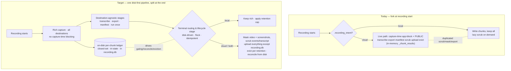
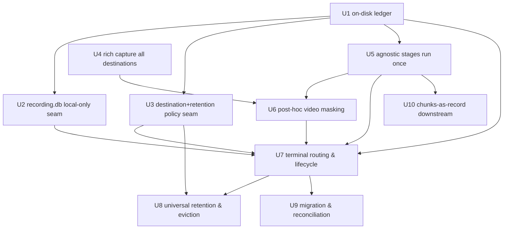

# refactor: Unified recording processing pipeline

## Summary

Collapse the two divergent processing paths — the live cloud chunk-processor and the lazy local scrubber — into **one disk-first pipeline**: capture rich chunks to disk as the source of truth, run destination-agnostic stages (transcribe · export events · manifest) exactly once, then converge each recording toward its declared destination through a **single idempotent terminal routing & lifecycle stage** that owns scrub/mask, upload, and retention. The local-vs-cloud fork moves from recording-start construction into that terminal stage. Per a planning decision, **capture is rich for every destination and capture-time app-blocking is removed**; the cloud-bound copy is the *complete masked/scrubbed record* — including **post-hoc-masked video chunks** (a new capability) — while local artifacts stay rich and unscrubbed. The whole pipeline is rebuilt on an **on-disk, closed-set, tri-state per-chunk ledger** so the five prior data-loss prevention rules survive a process crash, and retention becomes a universal policy with a clean monetization seam.

---

## Problem Frame

ScreenCap has two ways to turn a recording into processed, possibly-uploaded artifacts, forked at recording start off `.recording_intent`. The **live path** (`src/screencap/chunk_processor.py`) runs only when cloud-bound — transcribe, export, manifest, scrub (forced PUBLIC), upload, evict — while the **local path** writes chunks and keeps them all, scrubbing lazily on demand via `src/screencap/scrubber.py`. From that single branch, two whole worlds diverge: scrub runs in two places, the DB-skip rule is enforced three different ways, privacy policy is forced in one path and user-configured in the other, and the safety invariants that prevent silent data loss live entirely in-memory in the live path and don't exist in the local one. Every new cloud or processing feature has to be reasoned about twice. With per-user GCP isolation shipped (unblocking monetization), wiring that into two diverging paths would compound the drift. Full motivation, actors (A1–A4), and flows (F1–F3) are in the origin document (see Sources & References).

---

## Requirements

**Unified pipeline shape**
- R1. A single pipeline processes every recording regardless of destination; the live-cloud and post-hoc-local paths are collapsed into one.
- R2. Chunks are the universal canonical on-disk primitive for all recordings. No single-large-video format of record going forward.
- R3. Disk is the source of truth: processing produces durable on-disk artifacts before any upload, and cloud state is reconstructable from disk at any time.
- R4. Destination-agnostic stages (transcription, event export, manifest) run exactly once per chunk with no local-vs-cloud knowledge.
- R5. A single terminal routing & lifecycle stage owns all destination-specific behavior: the cloud-bound scrub/mask transform, upload, and retention/eviction.

**Split-late semantics**
- R6. The local-vs-cloud decision is applied at the terminal stage, not at recording start. Destination (local / cloud / both) selects routing behavior over already-processed artifacts.
- R7. Scrub/mask is a transform applied only to cloud-bound copies. Local on-disk artifacts remain rich and unscrubbed; cloud-bound copies use the strict policy, local uses the user-configured mode. **(Plan amendment, see Key Technical Decisions: now also applies to video — capture is rich for all destinations, and the cloud video copy is masked at the terminal stage rather than blocked at capture.)**
- R8. The raw `recording.db` (unscrubbed PII) is a local-only artifact by rule and is never uploaded; cloud-bound structured data derives only from scrubbed exports.

**Lifecycle, retention & robustness**
- R9. The terminal lifecycle stage is idempotent and safe to re-run from disk after a crash, interruption, or partial upload — re-running converges rather than duplicating or corrupting; upload is resumable from the on-disk source of truth.
- R10. Local deletion is decoupled from upload — a retention policy, not an upload side-effect. Policies: keep forever, delete after confirmed upload, delete after N days or a size cap.
- R11. Retention applies uniformly to local-only recordings (size/time cap), with a keep-forever default so existing local behavior is unchanged unless a cap is set.
- R12. Eviction can run during an active recording so long "run all day" cloud sessions stay within bounded disk while upload lags.

**Monetization seam**
- R13. Destination and retention are expressed as a policy abstraction with a single attachment point where a future plan-tier will gate cloud routing and retention. No metering/quota/billing built now.

**Migration & compatibility**
- R14. Legacy single-file (non-chunked) recordings already on disk remain readable and listable; the unified pipeline emits chunks only going forward.
- R15. Existing chunked recordings on disk (including partially-uploaded ones) are handled without data loss; upload/retention state is reconciled from disk.
- R16. Local recording requires no account; the account gate applies only to the cloud routing branch.

**Origin actors:** A1 (local-only operator), A2 (cloud operator), A3 (ScreenCap engineer — primary beneficiary), A4 (processing pipeline, system actor)
**Origin flows:** F1 (local-only, kept rich), F2 (cloud with reclaim-local), F3 (crash / interruption recovery)
**Origin acceptance examples:** AE1 (R6,R7), AE2 (R9), AE3 (R10,R11), AE4 (R8), AE5 (R12), AE6 (R16). Plan-added: AE7 (`both`), AE8 (promote-after-evict refuses), AE9 (size-cap never deletes a FAILED chunk), AE10 (crash mid-scrub re-detected), AE11 (`recording.db` never in uploaded set), AE12 (concurrent terminal runs upload exactly once).

---

## Scope Boundaries

- Billing, payments, paid tiers, metering, quota enforcement — later milestone. Only the policy seam (R13) is built now.
- Training-consent opt-in and training-corpus export — later milestone. The pipeline must not foreclose it (rich local artifacts preserved), but it is not built here.
- Per-user GCP isolation and authentication — already shipped; this refactor consumes the existing token-verifying signing layer, it does not rebuild it.
- The full always-on desired-state reconciler controller — deferred until multi-target/billing/quota scale demands it. Only its idempotent, re-runnable lifecycle property (R9) is adopted now.
- The native redaction-review UX — in-flight on `feat/native-redaction-review-upload`; this refactor coordinates with it (see Risks & coordination) but does not subsume the review UI.
- **Amended from origin:** the origin Scope Boundary said "recording engine internals (the screen-capture path) — unchanged." Per the capture-privacy decision below, this plan **does** make one bounded change to the capture path: removing the destination-keyed app-blocking + PUBLIC-forcing so capture is rich for all destinations (U4). Reader threads, daemon supervision, and the screen-capture mechanism itself remain unchanged.
- Windows / cross-platform — per STRATEGY.md, macOS only.

### Deferred to Follow-Up Work

- Reconciling the `feat/native-redaction-review-upload` review window's "what uploads" surface (it currently labels video "local-only, not uploaded") with the new reality that masked video uploads — a coordination task on that branch once both land. See Risks.
- OCR-refined video masking (beyond geometry-rectangle masking) — a precision improvement on U6, not required for the first cut.
- Cleanup of abandoned transient masked cloud-copy dirs — housekeeping, out of the critical path.

---

## Context & Research

### Relevant Code and Patterns

- **Live terminal path (primary reuse target):** `src/screencap/chunk_processor.py` — `ChunkStatus` enum (PENDING/EMITTED/FAILED/NETWORK_SKIPPED/NETWORK_INCOMPLETE), `_chunk_results` closed-set/tri-state/EMITTED-only gating, `reconcile_against_gcs`, `_delete_old_chunks(keep_recent=2)`, `_process_chunk` step order, `checkpoint_and_upload_db` (`if cloud_intent: return True` DB-skip), `upload_sentinel`, `stub_recording`. The PUBLIC floor is forced in `__init__` (`_dc_replace(..., mode=PrivacyMode.PUBLIC)`) and at export (`build_cloud_window_filter`).
- **End-of-recording terminal hook:** `src/screencap/engine/collaborators.py::finalize_uploads` — WAL-checkpoint + DB upload → reconcile → sentinel → `stub_recording` decision → else `.upload_followup.json`. This + the chunk_processor module helpers are the concrete reuse target for the unified terminal stage.
- **Scrub:** `src/screencap/scrubber.py` — `scrub_recording` (copytree → `<name>-scrubbed/`), `run_chunk` (in-place per-chunk live scrub), `_resolve_privacy_config_for_dir` (forces PUBLIC for cloud/both, else stricter-of), `mask_screenshots`/`ocr_mask_screenshot`, `scrub_events_jsonl`, `_scrub_db`, per-surface fail-closed (`_rename_scrub_failed`, delete-unmasked-screenshots). **No video-frame masker exists** — capture-time blocking is today's mechanism for cloud video.
- **Capture-time privacy enforcement:** `src/screencap/engine/screen_recorder.py` — for cloud intent, installs a `screen_filter` that blocks sensitive apps from the recorded video and forces `PrivacyMode.PUBLIC` at capture. Masking bounds recorded in the `window_geometry` table (`src/screencap/engine/db/models.py`).
- **Upload:** `src/screencap/upload.py` — `request_signed_urls` (`url=None` ⇒ "server already has it", the resumability contract), Firebase bearer via `src/screencap/auth.py::authed_post`, `list_recording_files` (globs all non-dotfiles — **includes `recording.db`**), per-chunk `.chunk_<base>_status.json`, `upload_recording`.
- **Stages:** event export seam `src/screencap/export.py::export_chunk_events` → `engine/export.py::unified_export_events`; manifest `src/screencap/task_manifest.py::generate_manifest`; transcription currently inline in `chunk_processor._transcribe`. Cloud window filter `src/screencap/privacy/filter.py::build_cloud_window_filter`, statically enforced by `tests/test_privacy_filter_call_graph.py`.
- **Identity / fork:** `.recording_intent` JSON (`{version, destination, privacy_mode, show_on_website, created_at, source}`) written by `engine/lock_policy.py::_write_identity_files`; read by `catalog.read_intent`, `scrubber._resolve_privacy_config_for_dir`, `cli/__init__.py`. The fork is threaded as `cloud_intent`/`keep_local` from CLI → `RecordingStartRequest` → `collaborators` → `chunk_processor`.
- **Config:** `src/screencap/config.py` — `get_chunk_duration` (900s; `0`=legacy single-file), `get_auto_delete_after_upload` (bool — the only retention-ish setting today), `get_upload_default`, `get_privacy_config`, `disk_warn_mb`/`disk_stop_mb` (gate *recording*, not eviction). **Note the trap:** `engine/retention.py::ScreenRetentionFilter` gates *screenshot capture cadence*, not disk retention — do not conflate.
- **Downstream single-video assumption:** `src/screencap/review.py::prepare_review_data` → `viewer.py::_ensure_single_video` (PyAV concat of `chunk_*.mp4` → `video.mp4`); consumers per its docstring: `screencap upload`, HTML viewer, `catalog` stub detection, capture/recorder reads.
- **Catalog:** `src/screencap/catalog.py::list_recordings` already understands chunks + `.recording_intent` + stub detection (useful for migration state).
- **Daemon:** `src/screencap/daemon/supervisor.py` (sole engine spawner, `RecordingStartRequest`, `_stage_engine_token` cloud-auth hook); publishes `recording_finalized` on `daemon/event_bus.py` — a natural attach point for a re-runnable terminal stage.

### Institutional Learnings

- **`docs/solutions/runtime-errors/chunk-upload-sentinel-gating-and-data-loss.md` — THE spec for the terminal stage's safety.** Five prevention rules, all currently enforced **in-memory** and which this refactor must re-establish **on disk**: (1) initialize the work-set with all expected chunk IDs as PENDING (closed set, no survivorship bias); (2) tri-state results (UPLOADED|SKIPPED|FAILED) — "disabled" ≠ "succeeded"; (3) never delete a local file without confirming remote existence; (4) test every delete path with the remote-does-NOT-exist precondition; (5) the completeness sentinel is the last write, gated on all prior writes, and `auto_delete` is forced false whenever uploads are disabled. The sentinel is the point of no return (triggers server stitching); `stub_recording` is the point of no recovery (deletes local media).
- **`docs/solutions/integration-issues/mitmproxy-ignore-hosts-tunneling-all-flows-2026-04-29.md` — "no events looks exactly like success."** A filter/transform stage that silently no-ops looks identical to success. Applied here: a scrub/mask stage that does nothing (misconfigured policy, classifier fails to load, wrong path) produces an unscrubbed cloud upload that *looks* fine. Make "did nothing" loudly distinguishable from "succeeded" with a positive assertion (regions masked / bytes scrubbed > 0) and fail closed on zero.
- **`docs/solutions/build-errors/macos-pre14-binary-install-failure.md` — the masking classifier (fast-gliner/ONNX) is fragile and can fail to load.** Its load-failure path is exactly the silent-no-op risk; the scrub/mask stage must fail-closed (block the cloud upload) when it can't load, never pass an unscrubbed copy through.
- **`docs/solutions/integration-issues/review-data-nullable-timing-swift-consumer-2026-06-01.md` — reconciled-from-disk recordings are "sparse but valid."** Legacy/migrated recordings will have null/missing metadata; consumers must treat sparse-but-valid as first-class, gating readiness on `ok` + required paths only.
- **`docs/solutions/integration-issues/macos-foundation-process-pipe-pitfalls.md`** — a long terminal stage's completion signal must be a durable on-disk sentinel the consumer re-reads, not a trailing CLI line.
- **STRATEGY.md (2026-05-08):** "Privacy incidents per 1k recordings… must stay at or near zero," sourced from privacy audit logs + CI guards — the bar the single terminal scrub/mask stage must clear; the CI guard/audit seam must move with scrub. "Capture reliability ≥98%" — served by the disk-first source-of-truth + reconcile-from-disk model.

### External References

- None. This is a restructuring of existing in-process components (PyAV, faster-whisper, presidio/fast-gliner, signed-URL upload) on strong local patterns; the risk areas are covered by the institutional learnings above. No external best-practice research warranted.

---

## Key Technical Decisions

- **Privacy/upload model: capture rich for all destinations; the cloud copy is the complete masked record including post-hoc-masked video** *(user decision; resolves the origin's internal contradiction between AE1/R7 "local stays rich" and the capture-time app-blocking the Scope Boundary called untouched).* Capture-time app-blocking and PUBLIC-forcing are removed (U4) so local artifacts — including video — stay rich (AE1/R7 hold uniformly). For cloud-bound recordings the terminal stage produces a complete scrubbed/masked copy and uploads everything except the raw `recording.db`. This means **building post-hoc video-frame masking** (U6), which did not exist — the single highest privacy-risk new component. Consequence accepted: post-hoc visual masking is a weaker guarantee than capture-time blocking, mitigated by geometry-driven masking from recorded `window_geometry` bounds plus a hard fail-closed gate.
- **On-disk, closed-set, tri-state per-chunk ledger as the foundation (U1).** The five data-loss prevention rules currently live in `_chunk_results` (RAM) and die with the process; R9's "reconstruct cloud state from disk" has no on-disk equivalent today. Persist a per-chunk lifecycle ledger in the **local-only `recording.db`** (a `pipeline_chunk_state` table — never uploaded per R8, transactional, natural home) seeded with all expected chunk IDs as PENDING at rotation, plus a persisted `chunks_expected` that **never shrinks on eviction**. Every other unit reads/writes this ledger. Chosen over per-chunk dotfile markers (harder to make transactional across multi-field state) and over a separate `pipeline_state.db` (a non-dotfile would be globbed by the uploader — an R8 hazard).
- **Materialize masked cloud copies on disk, then evict; don't stream at upload.** Video must be decoded/re-encoded to mask, so the masked copy is materialized per chunk regardless. Materializing makes upload restartable/idempotent from disk (R9) and lets eviction reclaim the rich local copy after upload-confirm (AE5). Transient per-chunk disk doubling is accepted; the masked copy is evicted immediately post-upload-confirm, the rich local per its own retention policy. Streaming-at-upload was rejected — it makes idempotent re-upload from disk much harder.
- **Retention is resolved-and-frozen per recording at routing time; the resolver is the monetization seam (U3).** Separate "the resolved policy for this recording" (data, persisted into per-recording state) from "the resolver" (a function returning `{destination, retention_policy, params}`, the single R13 attachment point a future plan-tier overrides). Freezing per recording means a future plan-tier change cannot retroactively re-route an in-flight recording after chunks were already scrubbed/uploaded. Config provides defaults; per-account override slots into the resolver later without re-forking.
- **One terminal stage, disk-driven, guarded by a per-recording flock (U7).** Reuse the `ChunkStatus`/`reconcile_against_gcs`/`finalize_uploads` logic, rebuilt to read the on-disk ledger instead of in-memory `_chunk_results`. A per-recording advisory file lock guards every entry point — live finalize, daemon-restart resume, manual `screencap upload` — so two concurrent runs after a crash never double-upload (AE12) or evict a file the other is mid-reading.
- **`recording.db` local-only becomes one explicit deny rule at the single upload seam (U2).** Today R8 is enforced by indirection (the post-hoc path uploads a scrubbed sibling dir; the live path skips via `checkpoint_and_upload_db`). Consolidate into a name-based exclusion in `list_recording_files` with a "DB present in source dir ⇒ never uploaded" test (AE11), since the unified pipeline uploads from the source dir.
- **`both` = rich local (source of truth, follows its configured retention policy) + masked cloud copy (derived, evicted immediately post-upload-confirm — no separate configurable retention).** The rich local copy is authoritative; the masked cloud copy exists only transiently to be uploaded, then is reclaimed. "Each follows its own policy" means the *local* copy has a policy and the *masked* copy's policy is fixed to immediate-post-upload eviction — not two independently configurable retentions.
- **Local→cloud promotion re-runs the terminal stage on surviving chunks and refuses on holes (U9).** Promoting a recording whose terminal stage already ran (possibly with chunks already evicted) must never upload a recording with silent holes — it refuses with a clear error when required chunks are gone, never reproducing the survivorship-bias data loss across the local/cloud boundary.
- **Build on the now-merged `feat/native-redaction-review-upload` scrub seam.** That branch **merged to `main` (PR #218, commit `410f3516`)** — verified present on the current checkout: `scrubber.py` defines `SCRUB_SENTINEL_NAME = ".scrub_complete"`, and `_recover_chunk_metadata(cloud_bound=True)` lives in `recovery.py` (+ callers in `cli/__init__.py`, `review.py`). It introduces the `<name>-scrubbed` dir + `.scrub_complete` completion sentinel + provenance (scrubber version, source content hash, cloud-bound-recovery flag) and the recovery→scrub ordering. This refactor consumes that seam as its starting point — implementation can begin against `main` now. **Before starting U6/U7, re-validate the *merged* seam shape** (the `.scrub_complete` semantics, the provenance field set, and the `_recover_chunk_metadata` ordering may have shifted in PR review vs. the branch plan), and isolate the consumed seam behind a thin adapter so a future upstream change touches one module, not U6+U7.

---

## Open Questions

### Resolved During Planning

- **Capture privacy model** → upload masked video chunks; capture rich for all; remove capture-time blocking (user decision — see Key Technical Decisions).
- **On-disk idempotency/progress representation** (origin deferred Q, R5/R9) → `pipeline_chunk_state` table in local-only `recording.db` + frozen `chunks_expected`.
- **Scrub materialization: separate files vs. stream at upload** (origin deferred Q, R7/R8) → materialize masked cloud copies per chunk, evict after upload-confirm.
- **Retention representation & config location** (origin deferred Q, R10/R11/R12) → resolved-and-frozen per recording at routing time; config provides defaults; resolver is the seam.
- **Policy-seam interface** (origin deferred Q, R13) → resolver returning `{destination, retention_policy, params}`, single attachment point, frozen per recording.
- **Terminal-stage concurrency & re-entry trigger** → per-recording flock for all entry points; resume on explicit `screencap upload` and on daemon `recording_finalized`/restart scan, both behind the lock.
- **`both` and local→cloud promotion semantics** → rich local + masked cloud (masked copy evicted immediately post-upload-confirm); promotion re-runs terminal stage, refuses on holes.

### Surfaced for User Decision (product — flagged by document review)

- **Privacy-model trade-off.** "Upload masked video" moves cloud-video privacy from capture-time blocking (a structural guarantee — sensitive pixels are never recorded) to post-hoc masking (operational, fail-closed-dependent), which the plan concedes is weaker and which touches STRATEGY.md's named "capture-time filtering" pillar and its near-zero privacy-incident metric. The plan proceeds with the user's decision but records this as an explicit, accepted trade-off rather than a settled detail. *Decision needed: confirm acceptance and who owns the SECURITY.md threat-model update — or reconsider whether uploading masked video is required for this milestone vs. shipping the path-collapse with the existing video-excluding cloud payload and deferring U6 (the highest-risk unit) to a follow-up.*
- **Masked-video consent gate.** Uploading masked video breaks the just-merged native-redaction-review window's "video — not uploaded" guarantee. *Decision needed: gate masked-video upload behind the review-surface reconciliation (recommended — flag OFF until the review shows masked video), and confirm whether unified cloud/both recordings even traverse that review window.*

### Resolve Before / During U6 (do not defer silently)

- **`window_geometry` → video-frame coverage gate (U6).** The masking technique is geometry-rectangle, but the *coverage* policy across frames between sparse geometry samples is a correctness decision, not a tuning knob: define the bounded max-gap, the conservative over-mask (hold-and-pad/union-dilate), and the fail-closed-on-missing-coverage rule (U6 case b). Quantify the worst-case inter-sample gap for a typing-only session against the privacy bar before committing.

### Deferred to Implementation

- **Decode/re-encode parameters for U6** — codec, keyframe handling, performance budget — decided against real chunk sizes. OCR-refined masking is a follow-up.
- **Eviction cadence during an active recording** — timer vs. per-chunk-rotation vs. disk-threshold trigger; choose against real chunk sizes/upload lag at implementation.
- **Exact `pipeline_chunk_state` schema** — column set, whether to extend an existing table, and the explicit mapping from the existing `ChunkStatus` enum (`EMITTED`→`UPLOADED`, `NETWORK_SKIPPED`→`SKIPPED`, `NETWORK_INCOMPLETE`→`FAILED`/`PENDING` — confirm) plus how legacy `.chunk_*_status.json` maps onto it.
- **`pipeline_policy.py` module boundary (U3)** — the resolver seam is one function; decide whether it earns a standalone module or co-locates in `pipeline_state.py` (where the frozen policy is stored) or `config.py` (where retention-adjacent config lives). The R13 single-attachment-point property holds either way.
- **Determinate vs. indeterminate progress** for long terminal-stage runs (depends on whether scrub/mask exposes a progress callback).
- **Final native-redaction-review "what uploads" reconciliation** — coordination once masked video uploads (see Risks — gated, not merely deferred).

---

## High-Level Technical Design

> *This illustrates the intended approach and is directional guidance for review, not implementation specification. The implementing agent should treat it as context, not code to reproduce.*

### Pipeline: today vs. target

### Per-chunk lifecycle state (ledger)

```mermaid
stateDiagram-v2
    [*] --> PENDING: chunk rotates (seeded in closed set)
    PENDING --> STAGED: agnostic stages done (transcribe·export·manifest)
    STAGED --> SCRUBBED: cloud masked/scrubbed copy materialized (cloud/both only)
    STAGED --> LOCAL_DONE: destination=local (no scrub, no upload)
    STAGED --> SKIPPED: cloud-bound but uploads intentionally disabled
    SCRUBBED --> UPLOADED: all core files confirmed in GCS
    SCRUBBED --> FAILED: scrub/mask/upload failure (fail-closed; retryable)
    UPLOADED --> EVICT_PENDING: retention permits + remote existence re-confirmed NOW
    EVICT_PENDING --> EVICTED: local unlink complete
    FAILED --> SCRUBBED: re-run converges (reconcile against GCS first)
    note right of FAILED
      FAILED and SKIPPED are never evicted, never counted as complete.
      SKIPPED ("disabled") is distinct from FAILED and UPLOADED.
      EVICT_PENDING is committed BEFORE unlink so an interrupted
      eviction resumes and re-confirms remote before retrying.
    end note
```

### Unit dependency graph

---

## Implementation Units

> Grouped into three phases. Each unit carries a stable U-ID. The safety substrate (Phase 1) lands before the pipeline restructure (Phase 2), which lands before retention/migration/downstream (Phase 3).

### Phase 1 — Safety substrate & policy

### U1. On-disk, closed-set, tri-state per-chunk lifecycle ledger

**Goal:** A durable per-chunk state ledger in the local-only `recording.db` that re-establishes the five data-loss prevention rules on disk, so the terminal stage can reconstruct correct state after a crash (R3, R9). Every later unit reads/writes it.

**Requirements:** R3, R5, R9

**Dependencies:** None

**Files:**
- Create: `src/screencap/pipeline_state.py` (ledger read/write API over `recording.db`; closed-set seeding; tri-state transitions; frozen `chunks_expected`)
- Modify: `src/screencap/engine/db/models.py` (add a `pipeline_chunk_state` table; `chunks_expected` on `recording`)
- Modify: `src/screencap/recording_db.py` (helpers if needed; keep `open_recording_db` the single open seam)
- Test: `tests/test_pipeline_state.py`

**Approach:**
- One row per expected chunk ID, seeded `PENDING` **at chunk rotation** (a closed set, not appended on completion — kills survivorship bias). Per-concern tri-state: stages-done, scrub state, upload state (`UPLOADED | SKIPPED | FAILED | PENDING`), eviction state (incl. an explicit `EVICT_PENDING` so interrupted eviction resumes).
- Persist `chunks_expected` once and **never shrink it on eviction** — finalize gates the sentinel on the frozen count, not a `glob` that evicted chunks have left.
- "Disabled" (e.g., uploads intentionally off) is a distinct `SKIPPED`, never conflated with `UPLOADED` or `FAILED`. Only `UPLOADED` permits eviction.
- **Cross-process concurrency discipline (load-bearing — the ledger lives in `recording.db`, which is written by multiple processes).** The engine writer seeds `PENDING` during recording while it is also writing screenshots/events to the same DB; the terminal stage (a *separate* process: `screencap upload`, daemon resume) advances states; and `list_recording_files`/`checkpoint_and_upload_db` run a WAL checkpoint (`wal_checkpoint(TRUNCATE)`) on that same DB. Specify: which process writes the ledger when, a `busy_timeout` for the terminal-stage writer mirroring the existing `scrub_worker.py` live-writer-coexistence precedent (`busy_timeout=10000`), and the ordering of ledger writes relative to the WAL checkpoint so a checkpoint cannot tear a ledger transition. Confirm `create_all`/`_migrate_schema` (`engine/db/__init__.py`) actually creates the new table on *existing* `recording.db` files, not just fresh ones.
- **Exact irreversible-transition ordering (the five rules don't hold unless these spans are crash-safe).** Upload: write `UPLOADED` only AFTER GCS confirms; on re-entry always allow re-stat rather than trusting a bare `UPLOADED`. Eviction: (1) re-confirm remote existence NOW (do **not** trust a historical `UPLOADED` — note the existing `_delete_old_chunks` deletes on `EMITTED` alone without a fresh re-stat; do not port that shortcut), (2) commit `EVICT_PENDING`, (3) unlink, (4) commit `EVICTED`. A crash before step 2 leaves the file present and `UPLOADED` (safe); a crash after step 2 resumes from `EVICT_PENDING` and re-confirms remote before retrying the unlink.
- The ledger lives in `recording.db`, which is local-only by rule (R8), so it never leaves the machine.

**Execution note:** Characterization-first — write the ledger invariants (closed set, no-survivorship, tri-state, frozen count, crash-safe EVICT ordering) as tests before the schema, porting the five prevention rules from the sentinel-gating learning directly into assertions. Also pin an explicit mapping from the existing `ChunkStatus` enum (`EMITTED`, `NETWORK_SKIPPED`, `NETWORK_INCOMPLETE`) onto the new ledger states before committing the schema (see Deferred to Implementation).

**Patterns to follow:** the existing `ChunkStatus` enum semantics and EMITTED-only gating in `chunk_processor.py`; `open_recording_db` access discipline; SQLAlchemy table defs in `engine/db/models.py`.

**Test scenarios:**
- Happy path: 5 chunks rotate → 5 PENDING rows seeded; each advances PENDING→STAGED→(SCRUBBED→UPLOADED | LOCAL_DONE).
- Edge case (survivorship): a chunk that rotated but never reached processing remains PENDING on disk; an "all uploaded" query over the closed set returns False (the Bug-2 regression).
- Edge case (frozen count): evicting 3 of 5 uploaded chunks leaves `chunks_expected == 5`; finalize still gates on 5.
- Error path (disabled ≠ success): uploads disabled marks chunks `SKIPPED`, not `UPLOADED`; eviction is refused for `SKIPPED`.
- Edge case (crash mid-transition): a partially-written transition re-reads as the prior committed state, never a torn state.
- Integration: ledger persists across a fresh process open of the same `recording.db` (the reconstruct-from-disk contract).

**Verification:** a closed-set query cannot exhibit survivorship bias; only `UPLOADED` is evictable; `chunks_expected` is stable under eviction; state survives process restart.

---

### U2. `recording.db` local-only invariant at the single upload seam

**Goal:** Make R8 one explicit, tested rule rather than three ad-hoc enforcement sites, since the unified pipeline uploads from the source dir where `recording.db` is present.

**Requirements:** R8

**Dependencies:** U1

**Files:**
- Modify: `src/screencap/upload.py` (`list_recording_files` — explicit name-based exclusion of `recording.db` and its WAL sidecars; reject any attempt to enqueue it)
- Modify: `src/screencap/chunk_processor.py` (retire the `checkpoint_and_upload_db` `if cloud_intent: return True` skip in favor of the central rule)
- Test: `tests/test_upload.py`

**Approach:**
- **This is a NET-NEW exposure path, not a tidy-up.** Verified: today's `_UPLOAD_EXCLUDE` is `{".db-shm", ".db-wal", ".scrub_failed"}` — `recording.db` itself is **not** excluded; it stays out of the cloud only by *architecture* (the live path's `checkpoint_and_upload_db` `if cloud_intent: return True` skip, and the post-hoc path uploading a separate scrubbed sibling dir whose DB is already scrubbed). The unified pipeline's decision to upload from the *source* dir removes both of those structural guards, so the explicit exclusion is the only thing standing between raw unscrubbed PII and GCS. Treat it as a hard safety gate.
- **Prefer an allowlist over a denylist.** Make `list_recording_files` enumerate upload-*eligible* artifact patterns (scrubbed exports: events JSONL, transcript, manifest; masked chunk copies) rather than deny known-bad names — a denylist fails open on any future raw artifact (a new ledger file, a temp DB), an allowlist fails closed. If a denylist is retained for compatibility, it must cover `recording.db` + `recording.db-shm` + `recording.db-wal` + the ledger-if-ever-a-file + `*.scrub_failed`, matched by full relative path (the function `rglob`s subdirs), not just top-level basename.
- Replace the three scattered enforcement points with this one rule; keep the scrubber's `_scrub_db` for the *local* scrubbed-copy use case (post-hoc `screencap upload` of a scrubbed sibling) untouched, but the unified cloud path never uploads the raw DB.
- Note the `list_recording_files` side effect: it runs a WAL checkpoint on `recording.db` while building the set. Define behavior when `recording.db` is absent (legacy/migrated) so the checkpoint precondition doesn't crash the upload.

**Execution note:** Test-first — add the "`recording.db` present in the source dir is never in the uploaded set" assertion before the change. **Note:** the existing `tests/test_upload.py::test_list_recording_files_with_subdir` asserts `"recording.db" in names` — that assertion validates the *current* (unsafe) behavior and must be inverted/split when the exclusion lands.

**Patterns to follow:** existing dotfile/`.db-shm`/`.db-wal` exclusions in `list_recording_files`; the `checkpoint_and_upload_db` skip rationale; the `<name>-scrubbed` allow-by-construction model from the merged native-redaction-review work.

**Test scenarios:**
- `Covers AE11.` Happy path: a source dir containing `recording.db` + chunks → the uploaded file set never contains `recording.db` or its sidecars.
- Edge case (enumerate all raw artifacts): `recording.db`, `recording.db-wal`, `recording.db-shm`, the ledger (if it ever materializes as a file), and `*.scrub_failed` are all absent from the uploaded set, including when nested in a subdirectory.
- Edge case: a recording with only `recording.db` and no chunks → empty uploaded set, no error.
- Error path: an explicit attempt to enqueue `recording.db` for upload is rejected, not silently dropped.
- Edge case (legacy): `recording.db` absent → upload does not crash on the WAL-checkpoint precondition.
- Regression: scrubbed exports (events/transcript/manifest) still upload.

**Verification:** the raw DB never appears in any uploaded set across cloud and both destinations; structured cloud data comes only from scrubbed exports.

---

### U3. Destination & retention policy abstraction + monetization seam

**Goal:** A policy resolver that returns `{destination, retention_policy, params}` for a recording, resolved-and-frozen at routing time, with one attachment point a future plan-tier overrides — no metering/billing built (R13).

**Requirements:** R6, R10, R11, R13, R16

**Dependencies:** U1

**Files:**
- Create: `src/screencap/pipeline_policy.py` (the resolver; retention policy types: `keep_forever`, `delete_after_upload`, `delete_after_days`, `size_cap`; the future-plan-tier attachment point)
- Modify: `src/screencap/config.py` (retention defaults: replace the lone `get_auto_delete_after_upload` bool with a retention-policy config block; keep backward-compat reads)
- Modify: `src/screencap/catalog.py` / `.recording_intent` writer `engine/lock_policy.py` (persist the frozen resolved policy into per-recording state)
- Test: `tests/test_pipeline_policy.py`
- Test: `tests/test_config.py`

**Approach:**
- The resolver separates **data** (the resolved policy frozen into per-recording state at routing time) from the **resolver function** (the seam). A future plan-tier overrides the resolver only; in-flight recordings keep their frozen policy (a tier change cannot retroactively re-route).
- Destination ∈ {local, cloud, both}. The account gate (R16) lives in the resolver's cloud branch: cloud/both require auth; local never does.
- Retention defaults from config; `keep_forever` is the default so local behavior is unchanged unless a cap is set (R11).
- No quota/metering/billing — only the override slot exists.

**Patterns to follow:** existing `.recording_intent` schema + `catalog.read_intent`; `config.py` getter + env-override + TOML pattern; the `cloud_intent`/`keep_local` threading the resolver replaces.

**Test scenarios:**
- Happy path: resolver returns the configured retention for local / cloud / both; defaults to `keep_forever` when unset.
- `Covers AE6.` cloud/both resolve requires-account True; local resolves requires-account False.
- Edge case (freeze): a config change after a recording's policy is frozen does not change that recording's resolved policy.
- Edge case (seam): a stubbed plan-tier override changes routing for *new* recordings only, proving the single attachment point works without re-forking.
- Backward-compat: a legacy `auto_delete_after_upload=true` config maps to `delete_after_upload`.

**Verification:** policy is resolved once, frozen, and persisted; the seam overrides routing without touching the pipeline; account gate applies only to cloud/both.

---

### Phase 2 — Unified capture & processing

### U4. Destination-agnostic rich capture

**Goal:** Capture is rich for every destination — remove the capture-time app-blocking + PUBLIC-forcing keyed off `cloud_intent` so local artifacts (including video) stay rich and the destination split moves entirely downstream (R6, R7).

**Requirements:** R6, R7

**Dependencies:** None *(touches the capture path; sequence alongside Phase 2 but it has no ledger dependency)*

**Files:**
- Modify: `src/screencap/engine/screen_recorder.py` (stop installing the cloud `screen_filter` and stop forcing `PrivacyMode.PUBLIC` at capture; capture rich regardless of destination; still record `window_geometry` masking bounds for downstream U6)
- Modify: `src/screencap/engine/collaborators.py` (stop construction-time `mode_str = PUBLIC if cloud` and `effective_upload`/`auto_delete` forking — those decisions move to the terminal stage)
- Test: `tests/test_recording_integration.py`

**Approach:**
- The capture path becomes destination-agnostic: it writes rich chunks + `recording.db` + `window_geometry` for all recordings. The `window_geometry` timeline (sensitive-window bounds) must still be recorded — it is the input U6 uses to mask video post-hoc.
- Remove the construction-time PUBLIC floor and the live-vs-skip upload fork from `collaborators`; the terminal stage owns those now.
- **Privacy safety check:** this is the change that lets sensitive app windows reach the rich local video. Verify nothing in the capture path *uploads* during capture (upload is now exclusively terminal-stage), so removing capture blocking does not widen the cloud exposure before the terminal mask runs.

**Execution note:** Characterization-first — pin current capture-path behavior, then assert the post-change behavior (rich video for a would-be-cloud recording; `window_geometry` still populated).

**Patterns to follow:** the existing `screen_filter`/PUBLIC-forcing call sites in `screen_recorder.py`; `collaborators.build_chunk_processor` construction flags.

**Test scenarios:**
- Happy path: a cloud-intent recording captures rich video (sensitive apps present in frames), unlike today's blocked capture.
- Edge case: `window_geometry` masking bounds are still recorded for a cloud-intent recording (U6's input).
- Edge case: a local recording is unchanged (already rich).
- Integration: no upload occurs during capture for any destination (upload is terminal-stage only).
- Regression: capture reliability / chunk rotation unaffected (Capture reliability ≥98% bar).

**Verification:** all destinations capture rich; `window_geometry` populated; no capture-time upload; capture mechanics unchanged.

---

### U5. Destination-agnostic stages run exactly once per chunk

**Goal:** Transcription, event export, and manifest generation run once per chunk, ledger-driven and idempotent, with no local-vs-cloud knowledge (R4).

**Requirements:** R2, R4

**Dependencies:** U1

**Files:**
- Create: `src/screencap/pipeline_stages.py` (a destination-agnostic per-chunk stage runner: transcribe → export events → manifest; idempotent skip-if-done via the ledger)
- Modify: `src/screencap/chunk_processor.py` (extract `_transcribe`/`_export_events`/`_generate_manifest` orchestration into the stage runner; chunk_processor becomes a thin caller during recording)
- Modify: `src/screencap/export.py` (ensure the single export seam is destination-agnostic; the cloud window filter moves to the terminal stage, not the agnostic export)
- Modify: `src/screencap/recovery.py` (`_recover_chunk_metadata` also calls `build_cloud_window_filter` directly — decide whether that call is subsumed by the terminal stage or remains a sanctioned cloud call site; reconcile with the moved guard)
- Test: `tests/test_pipeline_stages.py`
- Test: `tests/test_export_chunk_events.py`

**Approach:**
- The agnostic stages write durable on-disk artifacts (transcript, events JSONL, manifest) and mark the chunk `STAGED` in the ledger. They run identically for local and cloud — **no PUBLIC forcing, no cloud window filter here** (that's a cloud-only transform owned by U7).
- Idempotency-via-on-disk-existence (the existing pattern): re-running skips a stage whose artifact exists and whose ledger state is `STAGED`+, so "exactly once" holds across re-runs and crashes.
- **Watch the static call-graph guard:** `tests/test_privacy_filter_call_graph.py` enforces that cloud export callers build the cloud window filter. Two current cloud-capable call sites apply it: the agnostic export and `recovery.py::_recover_chunk_metadata`. Since the cloud filter moves to U7, the agnostic export is no longer a cloud caller — update the guard's contract so it tracks the filter at the terminal stage's export-for-cloud, and explicitly resolve `recovery.py`'s call site (subsumed vs. sanctioned). The actual guard *replacement* is a U7 deliverable (see U7), landed in the same commit as the U5 change so the seam is never unguarded.

**Execution note:** Start with a failing test asserting a chunk's stages run once (second invocation is a no-op) and that the agnostic export contains no cloud-filter application.

**Patterns to follow:** `export.py::export_chunk_events` single-seam discipline; the existing early-return-if-output-exists idempotency in `_transcribe`/`_export_events`; `task_manifest.generate_manifest`.

**Test scenarios:**
- Happy path: a chunk runs transcribe + export + manifest once; artifacts on disk; ledger `STAGED`.
- Edge case (idempotent): re-invoking the stage runner on a `STAGED` chunk is a no-op (no re-transcription cost).
- Edge case: a partial/failed manifest is not left on disk as a false "done" — ledger stays pre-STAGED so re-run completes it.
- Integration: the agnostic export output is identical for a local vs. cloud recording (no destination knowledge).
- Regression: the privacy-filter call-graph guard passes against its updated contract (filter at terminal stage, not agnostic export).

**Verification:** stages run exactly once, idempotent across re-runs, destination-agnostic; cloud filtering absent from this layer.

---

### U6. Post-hoc video-frame masking for cloud copies

**Goal:** A new capability that masks sensitive regions out of recorded video chunks for the cloud-bound copy, using recorded `window_geometry` bounds, fail-closed so a masking failure never yields an unscrubbed cloud video (R7). This is the highest privacy-risk unit.

**Requirements:** R7

**Dependencies:** U4, U5

**Files:**
- Create: `src/screencap/video_mask.py` (decode chunk → apply geometry-rectangle masks per frame from the `window_geometry` timeline → re-encode a masked chunk copy; positive "regions masked > 0 when expected" assertion; fail-closed)
- Modify: `src/screencap/scrubber.py` (integrate video masking into the cloud-copy production alongside screenshot masking / events / transcript scrub; one whole-chunk "cloud copy fully masked" gate)
- Test: `tests/test_video_mask.py`
- Test: `tests/test_scrubber_class.py`

- **CRITICAL — geometry coverage is sampled sparsely; treat it as a precondition, not just an input.** `window_geometry` is recorded only alongside screenshots (~1 fps while typing, faster on drag/scroll) and the capture-time insert is best-effort (`recorder.py` wraps it in `except Exception: logger.debug(...)`). Video frames are continuous. So between two geometry samples — or when an insert silently failed — there is a sub-second span of video frames with **no recorded bounds**, during which a sensitive window may open, move, resize, or close. A naive "mask the rectangles I have" pass leaves those frames unmasked, and the positive assertion below cannot catch it because "no geometry sample" is indistinguishable from "no sensitive window." This is the capture-time-blocking-vs-post-hoc gap made concrete and is the single highest-risk path in the plan.

**Approach:**
- **Geometry-driven first:** draw masks over the sensitive-window rectangles recorded in `window_geometry`. Deterministic and reuses existing data; OCR-refined masking is a follow-up (Deferred to Follow-Up Work).
- **Coverage gate (three-way, not two-way):** for each cloud chunk, classify per the geometry timeline: (a) **geometry proves no sensitive window** across the chunk's full frame span → faithful unmasked copy is valid (log it); (b) **geometry is absent/sparse** for any frame interval (gap exceeds a bounded max, or the best-effort capture insert failed) → **unprovable, fail closed (`FAILED`)**, never an "effectively unmasked" copy; (c) **geometry shows sensitive windows** → mask, conservatively (hold-and-pad / union-dilate the sensitive rectangle across the inter-sample interval rather than point-interpolating), and assert regions masked > 0. Only case (a) yields an unmasked cloud copy. The positive "regions masked > 0" assertion is necessary but **not sufficient** — it cannot prove per-frame coverage, so the coverage gate is what actually guards safety.
- **Capture-side support (coordinates with U4):** make the `window_geometry` insert for cloud-capable recordings record a per-chunk coverage signal (or stop swallowing its exception) so the terminal stage can gate on coverage rather than guess.
- **Fail-closed, loudly:** if the masking classifier is unavailable or a frame can't be masked, the chunk's cloud copy is **not** produced and the ledger marks it `FAILED` (blocking upload and eviction) — never a silent no-op.
- **Materialize outside the upload glob:** write the masked chunk copy to a location the uploader's `rglob` enumeration does NOT walk (a dot-prefixed subdir or a sibling scratch dir, mirroring the `<name>-scrubbed` pattern), so an abandoned/partial masked copy can never be picked up by a later `screencap upload`. The terminal stage uploads it and evicts it post-upload-confirm.
- Per-surface fail-closed remains for screenshots/events/transcript (existing scrubber posture); add the **whole-chunk** completion gate so a partially-masked cloud copy never uploads (the crash-mid-scrub case).

**Execution note:** Test-first on the fail-closed paths — assert that a missing classifier, an unmaskable frame, AND a geometry-coverage gap each yield `FAILED` with **no** masked copy, before writing the masking happy path. This is the unit where a silent no-op is most dangerous.

**Patterns to follow:** `scrubber.mask_screenshots`/`ocr_mask_screenshot` masking model; `window_geometry` table bounds; `engine/video.py::remediate_pixfmt_for_review` for in-process PyAV decode/re-encode; the mitmproxy "no-op looks like success" and fast-gliner fail-closed learnings.

**Test scenarios:**
- Happy path: a chunk with a sensitive-window interval yields a masked video copy where those regions are obscured; a positive "regions masked > 0" assertion holds.
- `Covers AE1.` the rich local video chunk is untouched; only the materialized cloud copy is masked.
- Error/fail-closed: masking classifier/geometry unavailable → chunk marked `FAILED`, **no** masked copy produced, upload blocked.
- `Covers AE10.` a crash mid-mask leaves no complete masked copy (whole-chunk gate); re-run re-detects incompleteness and re-masks rather than uploading the partial.
- Edge case (case a): geometry **proves** no sensitive window across the chunk's full frame span → faithful unmasked copy, logged as such.
- Error/fail-closed (case b — the critical one): a chunk whose `window_geometry` is empty/sparse for some frame interval (gap exceeds the bounded max, or a best-effort capture insert failed) → `FAILED`, never an "effectively unmasked" copy. "No geometry sample" must NOT be treated as "0 expected, 0 masked."
- Edge case (case c): a sensitive window that moves between two geometry samples is conservatively over-masked (hold-and-pad/union-dilate), not point-interpolated into a partially-uncovered region.
- Edge case (silent no-op guard): a misconfigured policy that would mask nothing on a sensitive chunk fails closed rather than uploading clear video.

**Verification:** cloud video copies are masked or the chunk fails closed; local video untouched; no partial/unmasked copy ever reaches upload; "did nothing" is distinguishable from "succeeded."

---

### U7. Terminal routing & lifecycle stage

**Goal:** The single, disk-driven, idempotent terminal stage that routes each recording to its destination and owns scrub/mask-for-cloud, upload, and the completeness sentinel — re-runnable from disk after a crash, guarded against concurrent runs (R1, R5, R9).

**Requirements:** R1, R5, R6, R8, R9

**Dependencies:** U1, U2, U3, U5, U6

**Files:**
- Create: `src/screencap/terminal_stage.py` (routing by resolved policy; disk-driven reconcile; EMITTED-only gates; scrub/mask-for-cloud orchestration; upload; sentinel; per-recording flock)
- Modify: `src/screencap/chunk_processor.py` (rebuild `reconcile_against_gcs`, gating, and `finalize_uploads`-equivalent to read the U1 ledger instead of in-memory `_chunk_results`; retire the construction-time PUBLIC/auto_delete forks)
- Modify: `src/screencap/engine/collaborators.py` (`finalize_uploads` delegates to the terminal stage)
- Modify: `src/screencap/cli/__init__.py` (the `upload` command and recovery path become a terminal-stage entry point behind the flock)
- Modify: `src/screencap/daemon/supervisor.py` (resume incomplete terminal-stage work on `recording_finalized`/restart, behind the flock)
- Test: `tests/test_terminal_stage.py`
- Test: `tests/test_chunk_processor.py`
- Test: `tests/test_recover_chunk_metadata.py`

**Approach:**
- **Routing:** read the frozen resolved policy (U3). `local` → no scrub, no upload, mark `LOCAL_DONE`. `cloud`/`both` → produce the masked/scrubbed cloud copy (screenshots masked, video masked via U6, events/transcript scrubbed under strict PUBLIC, manifest), upload everything except `recording.db` (U2), mark `UPLOADED`.
- **Disk-driven idempotency (R9):** all gating, reconcile, and sentinel logic reads the U1 ledger, not RAM. On (re)entry: `reconcile_against_gcs` re-stats `FAILED`/`PENDING` chunks against the server (`url=None` ⇒ already there) before doing any work; EMITTED-only gates; the sentinel is the last write, gated on the **frozen `chunks_expected`** all being `UPLOADED`. Never trust a pre-existing legacy sentinel (Bug 3).
- **Concurrency (AE12) — the lock contract is load-bearing, specify it precisely.** Acquire the per-recording advisory lock as the **first action on every entry point, before any ledger read or `reconcile_against_gcs`** (a check-then-lock ordering lets two runs both observe the same `PENDING`/`FAILED` set and both call `request_signed_urls` — the lock would serialize writes but not the *decision*, defeating exactly-once). Hold it across the **entire** reconcile→scrub→mask→upload→sentinel→evict critical section, releasing only at the end. Reuse the existing `fcntl.flock` precedent in `pidfile.py` (`LOCK_EX`, NFS-fragility handling, kernel auto-release on death); decide blocking-with-timeout vs. `LOCK_NB`-and-skip and assert the loser's behavior. Document that flock is advisory: every present and future entry point MUST take it. Test the race at *decision* time (two runs both read the ledger, assert exactly one `request_signed_urls` call), not just write time.
- **Move the cloud-window-filter CI guard with the filter.** U5 removes `build_cloud_window_filter` from the agnostic export; this unit owns the cloud export. Add — in the **same commit that changes U5's guard** — a replacement CI guard (analogous to the existing `tests/test_privacy_filter_call_graph.py`) asserting the terminal stage's cloud-export path applies the cloud window filter. Do **not** remove the old guard until the replacement is green, so the privacy-filter enforcement seam (a STRATEGY.md privacy-incident metric source) is never left unguarded.
- **Per-chunk vs. finalize:** during recording the terminal stage may run per-chunk (scrub→upload→ledger) to enable mid-recording eviction (feeds U8/AE5); the end-of-recording finalize reconciles the closed set and writes the sentinel. Eviction of a chunk's local copy before finalize is safe because finalize gates on the frozen ledger, not on-disk presence.
- Reuse the merged `feat/native-redaction-review-upload` scrub seam (`<name>-scrubbed` + `.scrub_complete` + provenance) as the cloud-copy production mechanism — behind the thin adapter noted in Key Technical Decisions, after re-validating the merged shape.

**Execution note:** Characterization-first against `tests/test_chunk_processor.py` — the EMITTED-only/sentinel-gate invariants are the contract; pin them, then move the backing store from `_chunk_results` to the ledger without changing the externally-observable gating.

**Patterns to follow:** `chunk_processor.py` `ChunkStatus`/`reconcile_against_gcs`/`all_chunks_uploaded`/`was_force_stopped`; `collaborators.finalize_uploads` step order; the five sentinel-gating prevention rules; `upload.request_signed_urls` `url=None` resumability contract.

**Test scenarios:**
- `Covers AE2.` an upload interrupted halfway, re-run from disk: already-`UPLOADED` chunks are not re-uploaded, remaining chunks complete, no duplicates, no corruption.
- `Covers AE1.` a cloud recording's local artifacts stay unscrubbed; only the masked/scrubbed cloud copy is produced under strict policy.
- `Covers AE4.` `recording.db` is never among the uploaded artifacts.
- `Covers AE7.` `both` keeps the rich local copy and uploads the masked cloud copy.
- `Covers AE12.` two concurrent terminal runs (e.g., daemon resume racing manual `upload`) result in exactly-once upload — the race is exercised at *decision* time (both read the ledger before either acts), asserting exactly one `request_signed_urls` call.
- Guard parity: the new terminal-stage cloud-export CI guard fails if the cloud window filter is not applied (replacing the U5-removed export-layer guard).
- Error path (fail-closed): a chunk `FAILED` at scrub/mask blocks the sentinel; the recording is not stubbed and local media is preserved.
- Edge case (force-stop): a `PENDING` chunk on disk prevents the sentinel even after restart (the closed-set gate survives the crash).
- Edge case (stale sentinel): a pre-existing legacy `recording_complete.json` is ignored; `chunks_expected` is regenerated from the frozen ledger.

**Verification:** one stage routes all destinations; re-run converges from disk without dup/corruption; sentinel gated on the frozen closed set; concurrent runs serialized; fail-closed preserves local media.

---

### Phase 3 — Retention, migration, downstream

### U8. Universal retention & eviction

**Goal:** Retention as a universal policy decoupled from upload, applying to local-only recordings too, with eviction safe to run during an active recording and a hard floor that never deletes an un-uploaded cloud chunk (R10, R11, R12).

**Requirements:** R10, R11, R12

**Dependencies:** U3, U7

**Files:**
- Create: `src/screencap/retention.py` (policy evaluation + eviction executor; un-evictable floor; confirm-remote-before-delete; resumable `EVICT_PENDING`)
- Modify: `src/screencap/terminal_stage.py` (invoke eviction per the frozen policy; during-recording trigger)
- Modify: `src/screencap/config.py` (size-cap / N-days thresholds — from U3's retention block)
- Test: `tests/test_retention.py`

**Approach:**
- Policies: `keep_forever` (default), `delete_after_upload`, `delete_after_days`, `size_cap`. For cloud/both, eviction of a chunk's local rich copy is permitted only when that chunk is `UPLOADED` **and** remote existence is confirmed (prevention rule 3) — the hard floor under *every* policy, never bypassed by age or size math. For local-only, size/time caps evict freely (no upload precondition).
- **Un-evictable floor:** the currently-recording chunk and any chunk whose stages/scrub/upload are in-flight are never eviction candidates, independent of the size/age computation (consult the ledger, not just file age).
- **During-recording eviction (R12):** the terminal stage's per-chunk pass evicts uploaded chunks as their uploads confirm, so long cloud sessions stay bounded while upload lags. Eviction is a separate `EVICT_PENDING`→`EVICTED` transition so an interrupted unlink resumes rather than leaking disk.
- **Disk-full tension:** if disk fills with un-uploaded chunks (upload can't keep up), eviction frees nothing (rule 3) and the existing `disk_stop_mb` stops recording — eviction must never delete an un-uploaded chunk to make room. Document the precedence; do not change `disk_stop` here.

**Execution note:** Test-first on the dangerous deletes — every eviction test includes a "remote does NOT exist" precondition asserting the chunk is **not** deleted (prevention rule 4).

**Patterns to follow:** `chunk_processor._delete_old_chunks(keep_recent=2)` (the floor concept) and `stub_recording` confirm-before-delete posture; `disk_stop_mb`/`disk_warn_mb` semantics; the sentinel-gating rule 3.

**Test scenarios:**
- `Covers AE3.` local-only with keep-forever default → no auto-delete; a size cap set later → oldest chunks past the cap evicted.
- `Covers AE5.` long cloud recording, delete-after-upload → a chunk's local copy evicted mid-recording once its upload confirms.
- `Covers AE9.` size-cap eviction with one `FAILED` (un-uploaded) chunk present → that chunk is never deleted even if it is the oldest.
- Error path (remote missing): delete-after-upload where a chunk's remote existence is *not* confirmed → no deletion.
- Edge case (resume): an interrupted eviction (`EVICT_PENDING`) resumes on re-run; no disk leak.
- Edge case (N-days + cloud): a cloud chunk past N days but un-uploaded is not deleted (upload precondition overrides age); a local chunk past N days is deleted.
- Edge case (`both`): the rich local copy follows its configured retention policy; the masked cloud copy is evicted immediately post-upload-confirm (not independently retained).

**Verification:** retention is universal and decoupled from upload; the never-delete-un-uploaded floor holds under every policy; during-recording eviction bounds disk; interrupted eviction resumes.

---

### U9. Migration & reconciliation of legacy and in-flight recordings

**Goal:** Existing single-file and chunked recordings (including partially-uploaded ones under the old path) are handled without data loss, reconciled onto the new ledger, with local→cloud promotion that refuses on holes (R14, R15).

**Requirements:** R14, R15

**Dependencies:** U1, U7 *(not U8 — reconciliation reads/seeds the ledger and re-runs the terminal stage; it does not call the eviction executor. The reconcile-before-evict conservatism is a rule U9 enforces by not evicting before re-stat, not a code dependency on U8.)*

**Files:**
- Modify: `src/screencap/pipeline_state.py` (a reconciler that seeds the ledger from on-disk evidence — legacy `.chunk_*_status.json`, present artifacts, GCS re-stat — conservatively)
- Modify: `src/screencap/catalog.py` (legacy single-file recordings remain readable/listable; flag chunked vs. legacy)
- Modify: `src/screencap/cli/__init__.py` (`upload` promotion path: re-run terminal stage on surviving chunks; refuse with a clear error if required chunks were evicted)
- Test: `tests/test_migration_reconcile.py`
- Test: `tests/test_catalog.py`

**Approach:**
- **Reconcile-before-evict (conservative):** on first run of the new code over old state, seed the ledger by parsing legacy `.chunk_*_status.json` (proves *core* files uploaded, says nothing about new-model scrub completeness) and **re-stat every chunk against GCS** before any eviction is permitted. Unknown chunks are `PENDING`/needs-verification, never assumed done (the Bug-2/Bug-3 boundary case).
- **GCS unreachable at migration time (offline, expired token, signing function down):** seed every unverified chunk as `PENDING`/needs-verification and leave the recording in a safe non-evictable state — **never** treat a legacy status file as proof of remote presence when GCS can't confirm it. Eviction always re-stats at delete time regardless of what migration seeded, so a migration-time seed can never authorize a later eviction without a fresh confirm. Mirror the existing `reconcile_against_gcs` fail-conservative posture (on stat failure, stay `FAILED`/needs-work, never flip to done).
- **Stale sentinel:** ignore any legacy `recording_complete.json`; regenerate `chunks_expected` from the reconciled ledger.
- **Legacy single-file (R14):** remains readable/listable; the unified pipeline emits chunks only going forward. A legacy single-file recording the user uploads goes through the existing whole-dir scrub path (no closed chunk set) — define this as an explicit branch, not an undefined chunk-set.
- **Promotion (AE8):** promoting a local recording to cloud re-runs the terminal stage on the chunks still on disk; if retention already evicted chunks that would be required for a complete upload, it refuses with a clear message rather than uploading a recording with silent holes.

**Execution note:** Characterization-first — seed fixtures with old-path artifacts (legacy status files, a stale sentinel, a partially-uploaded chunk set) and assert conservative reconciliation before writing the seeding logic.

**Patterns to follow:** `cli/__init__.py::_recover_chunk_metadata` (the existing recovery path); `catalog.list_recordings` chunk/stub/intent detection; the sentinel-gating Bug-3 stale-sentinel fix.

**Test scenarios:**
- `Covers AE8.` a local recording with some chunks already evicted, promoted to cloud → refuses with a clear error, uploads nothing partial.
- Happy path (migration): a partially-uploaded old-path chunked recording reconciles — already-uploaded chunks become `UPLOADED` (re-stat confirmed), the rest re-run; no re-upload of confirmed chunks.
- Edge case (legacy single-file): a non-chunked recording remains listable and readable; upload routes through the whole-dir scrub branch.
- Edge case (stale sentinel): a legacy `recording_complete.json` is ignored; `chunks_expected` regenerated.
- Edge case (mid-old-path upgrade): a recording mid-old-path-upload when the new code first runs reconciles conservatively (no eviction before GCS re-stat).
- Error path: a legacy status file present but the remote object missing → chunk re-stated as needs-work, not assumed uploaded.
- Error path (GCS unreachable): a legacy status file says uploaded + GCS unreachable → chunk is `PENDING`/needs-verification, NOT `UPLOADED`, and eviction is refused.

**Verification:** no data loss across migration; confirmed-uploaded chunks not re-uploaded; legacy single-file readable; promotion refuses on holes; no eviction before conservative reconcile; GCS-unreachable stalls safe.

---

### U10. Chunks-as-record downstream adaptation

**Goal:** Reconcile the "chunks are the record" model (R2) with the consumers that assume a single `video.mp4`, so review/viewer/catalog keep working without re-introducing a single-large-video format of record (R2, R14).

**Requirements:** R2, R14

**Dependencies:** U5

**Files:**
- Modify: `src/screencap/review.py` / `src/screencap/viewer.py` (keep `_ensure_single_video` for legacy + the local review/HTML viewer, but treat it as a *derived on-demand* artifact, not the record)
- Modify: `src/screencap/catalog.py` (stub detection no longer assumes a single `video.mp4` is the record — derive from chunks + ledger)
- Test: `tests/test_cli_review_data.py`
- Test: `tests/test_catalog.py`

**Approach:**
- **Mostly already true — scope this unit as verify/harden, not build-from-scratch.** Verified: `viewer.py::_ensure_single_video` already produces `video.mp4` as an idempotent on-demand PyAV concat of `chunk_*.mp4` (early-returns if present, symlinks a single chunk), already shared by review and the HTML viewer; and `catalog.py` `is_stub` already derives from media-presence over chunks (`uploaded and not has_media`), not from a single `video.mp4` being the record. So the derived-artifact model and chunk-aware stub detection largely exist.
- The remaining work is to confirm these behaviors hold under the ledger + masked-copy world (e.g., stub detection should consult ledger state, and the on-demand concat must not race U8 eviction — pin the chunks being read) and to ensure no consumer treats `video.mp4` as the canonical record.
- Keep legacy single-file recordings rendering through the existing path (they have a real `video.mp4`).
- Coordinate with the native-redaction-review review window (the "what uploads" surface) — gated in Risks/Open Questions; the review-UI change itself is out of scope.

**Test scenarios:**
- Happy path: a chunked recording's review derives `video.mp4` on demand; the chunk set remains the record.
- Edge case: catalog correctly classifies a chunked recording (not a false stub) without relying on a single `video.mp4`.
- Edge case (legacy): a legacy single-file recording still renders through the existing viewer path.
- Regression: review-data envelope for a chunked recording is unaffected by the derived-artifact change.

**Verification:** chunks are the record; `video.mp4` is derived on demand; catalog/review work for both chunked and legacy recordings.

---

## System-Wide Impact

- **Interaction graph:** the terminal stage is the new convergence point — `collaborators.finalize_uploads`, the `screencap upload` CLI path, and daemon `recording_finalized`/restart resume all become entry points behind one per-recording flock. The ledger (U1) is read/written by U5–U9. Removing capture-time blocking (U4) shifts the entire cloud-privacy responsibility onto U6+U7.
- **Error propagation:** scrub/mask failure → chunk `FAILED` → blocks sentinel + eviction (fail-closed, local preserved). Total terminal failure leaves the recording re-runnable from disk, never partially finalized.
- **State lifecycle risks:** partial scrub/mask of a cloud copy (whole-chunk gate, U6); interrupted eviction (`EVICT_PENDING` resume, U8); stale legacy sentinel (ignored, U9); transient per-chunk disk doubling (rich local + masked cloud copy) bounded by post-confirm eviction.
- **API surface parity:** the `cloud_intent`/`keep_local` flags threaded CLI→daemon→engine are superseded by the frozen policy (U3); the daemon `RecordingStartRequest` and `.recording_intent` schema gain the resolved-policy fields. The privacy-filter static call-graph guard (`tests/test_privacy_filter_call_graph.py`) must track the cloud filter at the terminal stage, not the agnostic export (U5).
- **Integration coverage:** eviction vs. an in-progress review/stitch read of the same chunk (U10's derived-video read must pin/▒not race U8 eviction — serialize via the ledger/flock); two terminal runs after a crash (flock, AE12); size-cap eviction vs. the writer (un-evictable floor, U8).
- **Unchanged invariants:** the screen-capture mechanism, reader threads, and daemon supervision are unchanged (U4 changes only the privacy-policy application at capture, not capture mechanics). The signed-URL upload + Firebase bearer layer is consumed as-is. Per-user GCP isolation is unchanged. `recording.db` remains the local-only source of structured truth (now also hosting the ledger).

---

## Risks & Dependencies

| Risk | Mitigation |
|------|------------|
| **Post-hoc video masking is weaker than capture-time blocking, is net-new, AND `window_geometry` is sampled at ~1 fps (screenshot cadence, best-effort insert)** — frames between samples have no bounds, so a moving/short-lived sensitive window can leave unmasked pixels that upload as SUCCESS. | U6 three-way coverage gate: fail closed when geometry doesn't *prove* coverage of a chunk's full frame span (distinct from "no sensitive window"); conservative over-mask between samples; capture-side coverage signal (coordinate with U4); positive "regions masked > 0" is necessary-not-sufficient. Highest-risk unit — characterization tests on all fail-closed paths first. |
| On-disk ledger gets the five prevention rules subtly wrong → the survivorship/disabled-vs-success data-loss class reopens. | U1 ports the rules into ledger-level invariants with tests *before* the terminal stage; closed-set seeding at rotation; tri-state; frozen `chunks_expected`; only `UPLOADED` evictable; crash-safe EVICT ordering (re-confirm→EVICT_PENDING→unlink→EVICTED) with "remote-missing" tests. |
| Ledger in `recording.db` contends with the engine writer + the upload-seam WAL checkpoint across processes. | U1 cross-process discipline: `busy_timeout` mirroring `scrub_worker.py` (10000); defined write-ownership per phase; ledger writes ordered vs. `wal_checkpoint(TRUNCATE)`; verify `create_all` adds the table to *existing* DBs. |
| Two terminal runs (daemon resume racing manual `upload`) double-upload via a check-then-lock TOCTOU. | U7 lock-FIRST contract: acquire the per-recording flock before any ledger read/reconcile, hold across the whole critical section; test the race at *decision* time, not just write time; reuse `pidfile.py` flock precedent. |
| Migration of old-path partially-uploaded recordings loses data or re-uploads; GCS unreachable at migration time. | U9 conservative reconcile — parse legacy status, **re-stat GCS before any eviction**, ignore stale sentinels, treat unknown (incl. GCS-unreachable) as needs-work; eviction re-stats regardless of the migration seed. |
| `recording.db` (raw PII) reaches the cloud — a NET-NEW exposure path once upload runs from the source dir (today it's kept out by architecture, not by name). | U2 allowlist-of-eligible-artifacts (fails closed) over a denylist; AE11 enumerates DB + sidecars + ledger + `*.scrub_failed`, nested; invert the existing `test_upload.py` assertion that requires the DB *in* the set. |
| **Privacy strategy regression vs. a named STRATEGY.md pillar.** Moving cloud-video privacy from capture-time blocking (structural guarantee — pixels never recorded) to post-hoc masking (operational, fail-closed-dependent) downgrades the "capture-time filtering" pillar tied to the near-zero privacy-incident metric. | **This is a product decision surfaced for the user, not a closed risk** (see Open Questions — privacy-model decision). Recommended: record who accepts the trade-off and why; make the `SECURITY.md` threat-model update load-bearing; treat U6's coverage gate as the bar that keeps the metric near zero. |
| **Consent-surface violation:** uploading masked video falsifies the merged native-redaction-review window's "video — not uploaded" label, so an operator could approve an upload whose contents (machine-masked video) they never saw. | **Make the review-surface "what uploads" reconciliation a HARD co-requisite of enabling masked-video upload, not deferred follow-up** — gate masked-video upload behind a flag that stays OFF until the review surface shows it. First resolve whether unified cloud/both recordings traverse that review window at all (determines blast radius). See Open Questions. |
| **Sequencing:** U4 (remove capture blocking) lands before U6 (the masker that replaces it); a cloud recording captured rich before U6 is correct has no fallback to capture-time protection. | Sequence U4 to land only *after* U6+U7 fail-closed masking is proven (or keep cloud-intent capture-time blocking as defense-in-depth until U6 demonstrates parity). Capture-time fails safe (not recorded); post-hoc fails open (recorded, masker may miss) — the asymmetry warrants U4-after-U6. |
| Removing capture-time blocking (U4) widens local exposure of sensitive content in the rich video. | Accepted per the "your machine, you trust it + training corpus" model and the user decision; no upload occurs during capture; cloud boundary restored by U6+U7 fail-closed masking. |
| Disk fills with un-uploaded chunks on a long cloud session (upload lags); transient masked-copy doubling worsens it. | U8 never evicts un-uploaded chunks; masked copy evicted immediately post-upload-confirm; existing `disk_stop_mb` stops recording as the backstop; precedence documented (not changed here). |

### Dependencies / Prerequisites

- **PREREQUISITE SATISFIED: `feat/native-redaction-review-upload` is merged to `main`.** Verified on the current checkout (HEAD `f38b12c4`): PR #218 (merge commit `410f3516`) is an ancestor of `main`, and the scrub seam is present — `scrubber.py:60` `SCRUB_SENTINEL_NAME = ".scrub_complete"`, `recovery.py::_recover_chunk_metadata(cloud_bound=...)`. The origin's "wait for it to merge, then build on top" sequencing decision is now met; implementation can begin against `main`. Residual action: re-validate the *merged* seam shape against U6/U7's assumptions before starting those units (PR review may have reshaped the `.scrub_complete`/provenance API vs. the branch plan) and wrap the consumed seam in a thin adapter to bound blast radius. Note the high-churn files this plan also modifies (`chunk_processor.py`, `upload.py`, `scrubber.py`) keep moving on `main` — rebase early.
- Per-user GCP isolation + Firebase-auth-verifying signing layer — already shipped; consumed as-is (`scripts/cloud-function/main.py`, `src/screencap/upload.py`, `src/screencap/auth.py`).
- Chunking is already the on-disk default (`config.get_chunk_duration` = 900s; `0` = legacy single-file).
- Transcription, scrub/mask, event export, manifest generation already exist as components — this refactor restructures orchestration and the destination split, plus adds video masking (U6).

---

## Documentation / Operational Notes

- Update `CLAUDE.md` "Daemon architecture" / pipeline notes to describe the unified terminal stage, the on-disk ledger, and the universal retention model once implemented.
- Capture a new `docs/solutions/` learning via `/ce-compound` after landing — the idempotent disk-driven terminal-stage design, the on-disk ledger, the local-only-`recording.db` invariant, post-hoc video masking, and the migration reconciler are net-new patterns with no existing solution doc (the existing knowledge is all post-mortems of the *old* dual path).
- **Load-bearing `SECURITY.md` update:** cloud video privacy shifts from capture-time blocking to post-hoc masking — document the new trust boundary, the U6 coverage gate, and the fail-closed guarantee. This is a required deliverable, not optional, since the threat model materially changes.
- STRATEGY.md privacy metric ("privacy incidents per 1k recordings… near zero") — the privacy-filter CI guard is *moved* (not removed): U5 changes the export-layer guard and U7 lands the replacement terminal-stage guard in the same commit, so the seam is never unguarded. Consider adding scrub/mask audit-log entries (cloud-routing entry, per-chunk scrub/mask success/failure, upload result) so the metric retains its audit-log source for the new highest-risk operation.

---

## Sources & References

- **Origin document:** [docs/brainstorms/2026-06-05-unified-recording-processing-pipeline-requirements.md](docs/brainstorms/2026-06-05-unified-recording-processing-pipeline-requirements.md)
- **Prerequisite plan:** [docs/plans/2026-06-03-002-feat-native-redaction-review-upload-plan.md](docs/plans/2026-06-03-002-feat-native-redaction-review-upload-plan.md) (the scrub seam this builds on)
- **Load-bearing learning:** [docs/solutions/runtime-errors/chunk-upload-sentinel-gating-and-data-loss.md](docs/solutions/runtime-errors/chunk-upload-sentinel-gating-and-data-loss.md) — the five prevention rules
- Related learnings: `docs/solutions/integration-issues/mitmproxy-ignore-hosts-tunneling-all-flows-2026-04-29.md` (silent no-op), `docs/solutions/build-errors/macos-pre14-binary-install-failure.md` (classifier fail-closed), `docs/solutions/integration-issues/review-data-nullable-timing-swift-consumer-2026-06-01.md` (sparse-but-valid)
- Key code: `src/screencap/chunk_processor.py`, `src/screencap/scrubber.py`, `src/screencap/upload.py`, `src/screencap/engine/screen_recorder.py`, `src/screencap/engine/collaborators.py`, `src/screencap/config.py`, `src/screencap/catalog.py`, `src/screencap/review.py`, `src/screencap/engine/db/models.py`
- Strategy: `STRATEGY.md` (privacy-incidents + capture-reliability metrics)
