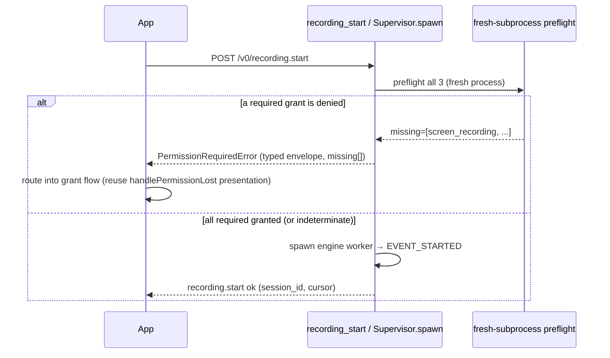
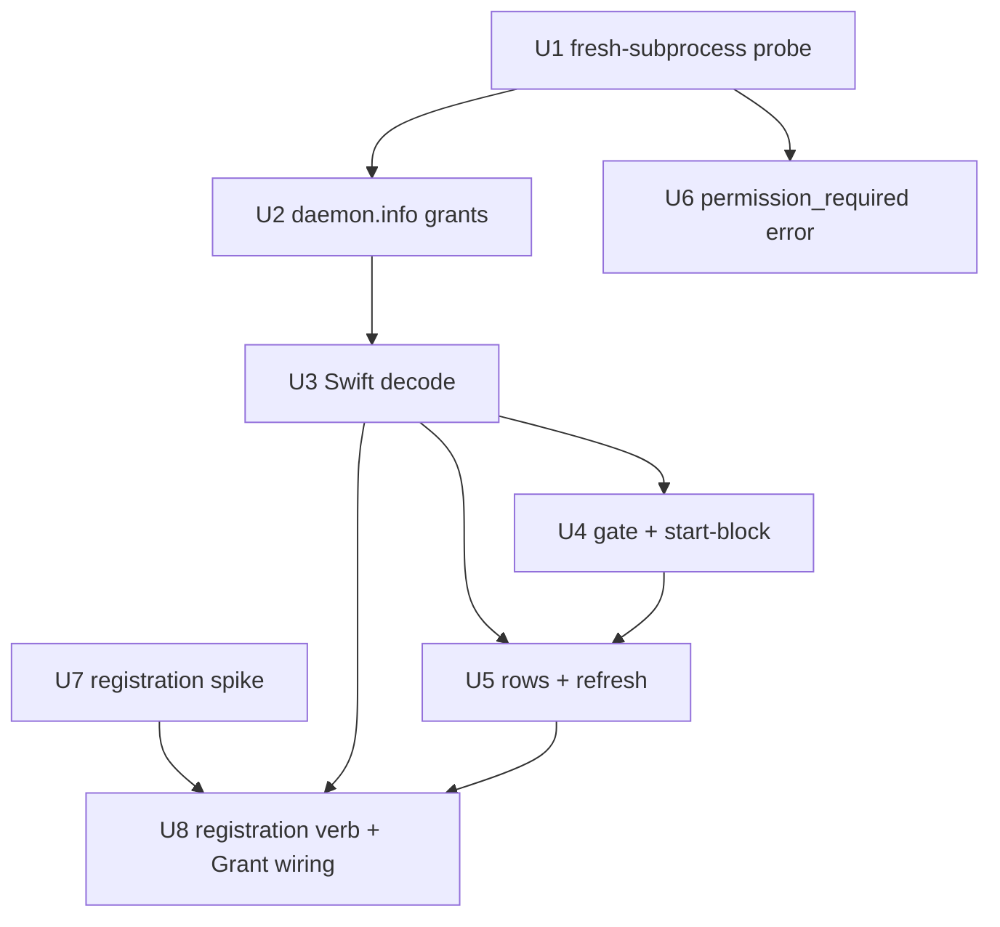

# feat: Daemon TCC Permission Visibility & Onboarding

## Summary

Make the macOS app drive onboarding off the daemon's *real* TCC grant state: the daemon reports its live Screen Recording / Accessibility / Input Monitoring grants over the existing `daemon.info` channel (via a frozen-binary-safe fresh-subprocess probe), the app gates the permission walkthrough and a daemon-side start-block on that state instead of on "daemon unreachable," a daemon-driven registration action makes the daemon appear as a toggleable Settings entry, and a typed `permission_required` IPC error returned *synchronously from `recording.start`* replaces today's confusing "200 OK then the recording crashes via a `permission_lost` event" daemon-path behavior. The registration path is **spike-first** — external research indicates the bare request-API approach is unreliable from a background helper.

---

## Problem Frame

The app's onboarding assumes "daemon socket reachable ⟹ permissions are fine." That assumption is false: the walkthrough is gated on the daemon being *unreachable* (`macos/Screencap/Views/MainWindow.swift`, `transport == .cliFallback`), the app has no visibility into the daemon's grant state (`daemon.info` carries no permission fields), and a daemon-backed start that lacks the Screen Recording grant produces a **confusing two-phase failure**, not a clean one.

**Corrected failure model (verified against code — the origin doc's "silent SystemExit into an empty `serve.log`" describes the *standalone-CLI* path, not the app-connected daemon path):** On the daemon path the worker emits `EVENT_STARTED` *before* running its preflight (`src/screencap/cli/__init__.py` `_engine_worker_cmd` emits `started` then calls `run_recording_worker`), and the explicit Screen-Recording check (`src/screencap/session.py` `run_recording_worker`, `emit_event(permission_lost) → raise SystemExit(3)`) runs *after* that. So `Supervisor.spawn`'s `_wait_on_subscription(EVENT_STARTED)` **succeeds**, `recording.start` returns **200 OK**, and only then does the worker emit `permission_lost` and exit non-zero → `_handle_engine_exit` synthesizes `engine_crashed` + `recording_finalized` over the event stream. The user gets a *successful* start that immediately collapses into a crash. Two further gaps compound it: the daemon path preflights **Screen Recording only** (`PermNoop` disables the policy preflight; Accessibility / Input Monitoring are never start-gated), and the failure is delivered as an asynchronous event rather than a structured result on the `recording.start` call itself. A developer or tester whose daemon grant was orphaned is stranded with no in-product recovery path. Full pain narrative and actor/flow analysis live in the origin doc (see Sources & References).

This plan fixes **detection, surfacing, registration, and failure-visibility only**. Grant *persistence* across rebuilds is owned by the Developer-ID distribution plan (see Scope Boundaries).

---

## Requirements

Carried from the origin requirements doc (lightly condensed; origin is authoritative for exact wording).

- R1. The daemon reports its current grant state for the three required permissions to the app over the `daemon.info` channel, using silent in-process preflight checks that neither prompt nor mutate state.
- R2. The app reads the daemon's reported grant state on connect and refreshes it while onboarding is visible, so the permission view reflects the daemon's state — not the app process's own TCC state.
- R3. The permission walkthrough is presented whenever the daemon is reachable but reports a missing required grant — no longer gated on the daemon being unreachable.
- R4. Before starting a daemon-backed recording, the app blocks and routes the user into the grant flow when the daemon reports a missing required grant.
- R5. When the user acts to grant a daemon-owned permission, the daemon performs the registration in its own process so it becomes a toggleable entry in the relevant System Settings pane; the app triggers this action and then opens the matching pane.
- R6. Registration is supported for each of the three required permissions via that permission's matching request mechanism (not Screen Recording alone).
- R7. A daemon recording-start attempt lacking a required grant returns a structured, typed "permission required" result over IPC identifying which permissions are missing, instead of aborting silently; the app surfaces it. The daemon engine must not terminate the start with an unobservable `SystemExit` on the daemon transport.
- R8. First-run (never granted) and recovery (previously granted, then lost) resolve through the same detection → surfacing → registration path; no manual reset or stop-the-daemon ritual in a shipped build.
- R9. The state the daemon reports must reflect **live** TCC state, not a value cached at daemon-process launch.

**Origin actors:** A1 (User / developer / tester), A2 (Screencap app `com.screencap.macos`), A3 (Screencap daemon `com.screencap.daemon` — TCC subject), A4 (macOS TCC / System Settings).
**Origin flows:** F1 (first-run grant, daemon reachable), F2 (recovery / re-grant of orphaned grant), F3 (start attempted while a grant is missing).
**Origin acceptance examples:** AE1 (covers R1, R2, R3), AE2 (covers R5, R6), AE3 (covers R4, R7), AE4 (covers R8, R9).

---

## Scope Boundaries

- Developer-ID signing, notarization, and the ad-hoc-rebuild "TCC treadmill" persistence fix — owned by `docs/plans/2026-06-03-001-feat-macos-app-developer-id-notarized-distribution-plan.md`. This plan assumes grant persistence is handled there and only fixes detection / surfacing / registration / failure-visibility.
- Collapsing capture into the app's own TCC identity / removing the separate daemon TCC subject — rejected; the daemon stays the permission-holding identity.
- The dev-only `tccutil reset` + stop-daemon recovery ritual — remains a developer convenience, not the product recovery path.
- Login Items / SMAppService helper approval — a separate, already-handled `permission_required` concern (`src/screencap/daemon/launchagent.py` `STATE_PERMISSION_REQUIRED`); not part of this redesign.
- Microphone permission — optional; capture does not gate on it. Detection must not surface it as "missing" or block start on it.
- Startup self-registration (the daemon calling request APIs on every `serve` boot — Approach A) — not chosen; registration is on-demand (Approach B).

### Deferred to Follow-Up Work

- **Orphaned-vs-revoked disambiguation copy:** distinct walkthrough copy ("remove the stale Screencap helper entry and re-add it") for the ad-hoc-dev case where a denied grant means "binary identity unrecognized," not "user revoked." A shipped Developer-ID build re-grants cleanly (TCC keys on `bundle-id` + `team-id`), so this is a dev-experience nicety, not on the product path. The daemon *identity* signal that would power it (see U2) is cheap and may be added now; the branching copy is deferred. — *Separate follow-up; revisit after the Developer-ID plan lands.*
- **Sequoia monthly re-auth avoidance / `com.apple.developer.persistent-content-capture` entitlement:** the only first-party path to unattended recording without periodic re-auth, but it requires an Apple developer-form request (not self-service). — *Noted as a risk only; out of this plan's reach.*
- **"Quit & Relaunch" affordance cleanup:** the button exists for the app-process TCC cache and is vestigial on the daemon-driven path (the daemon needs no app restart). Removing or relabeling it is a UX cleanup beyond this plan's detection/surfacing/registration scope. — *U5 only avoids presenting it as a required daemon-path step; the actual removal/relabel is a follow-up.*

---

## Context & Research

### Relevant Code and Patterns

**Detection seam (Python):**
- `src/screencap/recorder.py` — `_check_permission_fresh(name)` (fresh-subprocess, **tri-state** `True`/`False`/`None` fail-open) and `_PERMISSION_CHECK_CODE` (the per-permission probe snippets). Uses `[sys.executable, "-c", code]` — **the `-c` form is rejected by the bundled Click entry point in the frozen binary** (documented at `src/screencap/session.py` lines ~175–185, SCR-69), so the daemon cannot reuse it as-is.
- `src/screencap/engine/platform/darwin.py` — `is_screen_recording_enabled` / `is_input_monitoring_enabled` / `is_accessibility_enabled` (in-process `CGPreflightScreenCaptureAccess` / `CGPreflightListenEventAccess` / `AXIsProcessTrustedWithOptions`) and `request_screen_recording_access` / `request_input_monitoring_access` / `request_accessibility_access`. All fail-open on import/attribute errors.
- `src/screencap/session.py` `run_recording_worker` — the freshly-spawned worker's **in-process** `CGPreflightScreenCaptureAccess()` reads *live* state because the process has made no prior TCC call; this is the load-bearing reason capture picks up new grants without a daemon restart. Currently preflights **screen-recording only**, then `raise SystemExit(3)`.

**Daemon contract (Python):**
- `src/screencap/daemon/schema.py` — `envelope()` (additive, `extra="ignore"` on models), `DaemonInfoResponse` (today: `build`, `started_at`), version constants (`API_SCHEMA_VERSION = 1`, `_DAEMON_INFO_API_VERSION = 1`).
- `src/screencap/daemon/app.py` — `daemon_info` (line ~48, no permission fields), `recording_start` (line ~219; typed `DaemonAPIError` → `_api_error_response`, else `except Exception` → generic 500 at ~282), route table (`build_app`, ~439).
- `src/screencap/daemon/errors.py` — the `DaemonAPIError` base + per-error subclass pattern (`error_code`, `http_status`, `envelope()`, auto-registered in `EXCEPTION_TO_ERROR_CODE`). The extension point for `permission_required`.
- `src/screencap/daemon/supervisor.py` — `Supervisor.spawn` (line ~271): claims lock, spawns engine, awaits `EVENT_STARTED` via `_wait_on_subscription(..., timeout=self._startup_timeout)` (~340); on exception terminates + releases lock + re-raises. The seam where a pre-spawn preflight should raise the typed error *before* the timeout.

**Surfacing & registration (Swift):**
- `macos/Screencap/Views/MainWindow.swift` — `FirstRunSetupPresentationPolicy.shouldPresentOnLaunch` (the gate, currently `transport == .cliFallback`), `updateFirstRunSheetPresentation()`, the `.sheet` lifecycle and the active-recording guard.
- `macos/Screencap/Controllers/RecorderController.swift` — `start(name:)` gate (line ~180, CLI-only today), `probeDaemon()` (line ~194, calls `daemonInfo()` indirectly via the session service and discards grant data), transport enum, `applyDaemonFailureOutcome` / `handlePermissionLost` presentation routing.
- `macos/Screencap/Controllers/PermissionController.swift` — `requestAndOpenSettings(for:subject:)` (the `subject == .daemon` **no-op** branch at ~273), `PrivacyPane` (deep links + `from(permissionString:)`), `PermissionSubject`, `startWatching` (1Hz app-process poll + `didActivateApplicationNotification` refresh), `allRequiredGranted`.
- `macos/Screencap/Controllers/DaemonClient.swift` — `DaemonInfoResponse` decode (snake_case CodingKeys, tolerant of extra fields), `daemonInfo()`, `decodeResponse` + `envelopeError(code:rawBody:)` (the typed-error decode path), `DaemonClientError`.
- `macos/Screencap/Controllers/DaemonSessionService.swift` — `probe()` (discards the `daemonInfo()` payload today), `translateFailure` + `DaemonErrorCode` (the branch point for a `permission_required` case).
- `macos/Screencap/Views/Privacy/FirstRunPermissionsView.swift` — `daemonPermissionRow` (neutral "visited" icons because there was no real per-pane daemon state — rewired by this plan), dismissal buttons (`Skip for now` / `Done` / `Quit & Relaunch`).

**Test patterns:**
- Python: `tests/daemon/test_read_only_verbs.py` (`daemon.info` shape via `httpx.ASGITransport(build_app())`), `tests/daemon/test_schema_envelope.py`, `tests/test_session_daemon_permission_preflight.py` (the existing screen-recording-only preflight contract).
- Swift: `macos/ScreencapTests/DaemonClientTests.swift` (`UnixHTTPTestServer` + `SCREENCAP_DAEMON_SOCKET`), `PermissionControllerTests.swift` (gate + subject behavior), `RecorderControllerDaemonTests.swift`, `DaemonSessionServiceTests.swift`.

### Institutional Learnings

- `docs/solutions/runtime-errors/macos-tcc-per-process-cache-quit-and-relaunch.md` — **load-bearing constraint.** TCC APIs cache their answer at process launch; macOS does not propagate grants to already-running processes. The long-lived daemon will report stale grants if it checks in-process — so detection *must* genuinely spawn fresh queries, or it reproduces the exact bug one layer down.
- `docs/solutions/integration-issues/macos-foundation-process-pipe-pitfalls.md` — there is no in-bundle shortcut: a spawned child is attributed to the spawner for TCC. Also: timer-driven subprocess spawns are a fork-bomb risk (a 1Hz poll piled ~50 helpers in 60s) → any polling refresh needs an in-flight guard; drain stdout/stderr in the termination handler or the final structured line is lost.
- `docs/solutions/build-errors/env-export-prefix-silently-disables-team-signing.md` & `.../macos-ad-hoc-signing-tcc-rebuild-treadmill.md` — a `permission_lost(screen_recording)` can mean the running binary's identity is unrecognized (ad-hoc churn), **not** a user revocation. Don't assume "denied ⟹ user disabled it." Testing discipline: grant once, Quit & Relaunch, don't rebuild mid-test; recovery is `tccutil reset ScreenCapture com.screencap.macos`.
- `docs/solutions/runtime-errors/capture-health-nonscreen-attribution-terminal-stop-2026-06-01.md` — map each TCC permission to the capture path it actually gates (window meta = Screen Recording; a11y subtree = Accessibility; input listeners = Input Monitoring). Only a `screen_recording` denial is genuinely fatal to capture; a heuristic best-guess must never drive a terminal action.
- `docs/solutions/integration-issues/review-data-nullable-timing-swift-consumer-2026-06-01.md` — the Python↔Swift envelope playbook: decode optional-in-contract fields as optional, never gate readiness on them, reserve the failure path for the explicit `ok: false` discriminator, and pin both emitter and decoder so the schema can't silently drift.
- `docs/solutions/ui-bugs/swiftui-windowgroup-vs-window-singleton-scene-2026-05-18.md` — the first-run sheet duplicated on a `WindowGroup`; keep the singleton `Window` scene. Much of the walkthrough gating is manual-QA territory (MenuBar/OpenWindow actions aren't unit-testable here).

### External References

External research (Apple DTS forum responses, security analyses, OSS screen recorders) — **materially shapes the registration design (R5/R6) and the spike (U7):**
- **The "responsible code" model:** TCC needs a recognized responsible code to display permission alerts. A bare LaunchAgent command-line binary with no responsible app ancestor **cannot reliably trigger a TCC prompt or register a toggleable entry.** Apple's documented fix is embedding the helper inside an app bundle at `App.app/Contents/MacOS/` (not `/Resources/`), so TCC grants the privilege to the app and extends it to the nested helper. (Apple Developer Forums thread/694948, thread/692758 — Quinn "The Eskimo!".)
- **Bare `CGRequestScreenCaptureAccess()` from a background process** opens System Settings but the executable does **not** appear in the Screen Recording list (thread/807323, thread/732726).
- **"Register via real capture":** initiating an actual `CGDisplayStream` / `SCStream` (or `SCShareableContent.getExcludingDesktopWindows`) is more likely to force the entry to appear than the bare request API (ryanthomson.net; nonstrict.eu). Requires an active Aqua session (login-window context returns null frames).
- **Version regressions:** Sequoia 15 adds a monthly re-auth prompt keyed per executable path; **Tahoe 26.1 "Background Security Improvements" can stop a bare Unix executable from appearing in the Screen Recording list at all** — the most severe regression for a standalone CLI helper (thread/807323).
- **Disclaim pattern:** `responsibility_spawnattrs_setdisclaim()` (private API; Firefox/Chromium/LLDB) gives a posix-spawned child its own TCC identity — a possible mechanism, but unconfirmed for `kTCCServiceScreenCapture`; spike-only.

> Net: the brainstorm's Approach B "fallback to a real minimal capture attempt" is not a fallback to keep in a comment — external evidence says the request-API path likely fails on a background helper, so the real-capture path and the bundle-placement/responsible-code question are first-class spike subjects.

---

## Key Technical Decisions

- **Detection uses a fresh-subprocess probe invoked via a real `screencap` subcommand** (not `sys.executable -c`). Rationale: the daemon is long-lived, so an in-process Quartz check returns state cached at daemon launch (R9 violation); the existing `-c` trick is rejected by the bundled Click entry point in the frozen binary (SCR-69). A real (hidden) subcommand runs as a fresh process — its first in-process check reads live state — and works identically in dev and frozen builds. One spawn checks all three permissions and emits a structured result (avoids the fork-bomb of three spawns per refresh).
- **`daemon.info` carries the three grants as a tri-state** (granted / denied / indeterminate), additive on the existing envelope. An older daemon with no grant fields decodes as **indeterminate** on the app side. Rationale: additive-tolerant decoding (`extra="ignore"` / Swift `Decodable`) avoids a forced schema-version bump and keeps mixed-version app/daemon pairs working.
- **Indeterminate is never treated as "missing."** A `None`/indeterminate probe does not present the walkthrough and does not block start; the engine preflight remains the backstop. Rationale: a transient Quartz/PyObjC hiccup must not block a fully-granted user or hide a real gap behind a false "granted." Mirrors the engine's existing fail-open-on-`None` revocation rule.
- **The structured `permission_required` failure is raised by the daemon *before* the engine spawn**, by running **U1's fresh-subprocess probe** (never an in-process `DarwinPlatform.is_*_enabled()` check — that would read the long-lived daemon's launch-cached state and could block every start forever after a post-launch grant) and raising a typed `PermissionRequiredError` carrying the missing-permission list. This replaces today's daemon-path behavior, which is **not** a timeout/500 but a "`recording.start` returns 200 OK, then the worker emits `permission_lost` and crashes" sequence (worker emits `EVENT_STARTED` before its own preflight). The new path covers **all three** permissions (today the worker preflights Screen Recording only) and returns the result synchronously on `recording.start`. Because U6 now rejects *before* the worker spawns, the worker's existing `permission_lost` event must not also fire for the same blocked attempt — U6 is the single source of truth for start-time permission failures; the worker's in-process check remains a defense-in-depth backstop for the standalone-CLI transport only. **Latency budget:** the pre-spawn probe must reuse the most-recent `daemon.info` probe result (U2's cache) rather than fresh-spawning again, and the preflight must run *before* `pidfile.claim_lock` and off the event loop (`asyncio.to_thread`) — a fresh ~5s spawn added inside the lock would both widen the lock-contended window and risk exceeding the app's 10s `recordingStart` client timeout (vs. `recordingStop`'s 35s).
- **Registration is spike-first (U7 gates U8).** The on-demand registration verb is built only after a spike determines which mechanism actually registers a toggleable entry from the daemon's real runtime context (request-API vs. real-minimal-capture-attempt vs. responsible-code/bundle placement), on the target macOS. The real-capture-attempt path is treated as a first-class code path, not a contingency comment. Rationale: external research shows the bare request-API approach is unreliable from a background helper and may be regressed on Tahoe.
- **No daemon restart is required after a grant.** Capture uses freshly-spawned workers that read live TCC state; the daemon process never needs to hold live grant state because both detection (fresh probe) and capture (fresh worker) are fresh processes. The spike confirms this empirically (resolves the origin's "kickstart?" open question for R8).
- **Refresh cadence respects subprocess cost.** The app re-probes `daemon.info` on app re-activation and on a slow (~5s) timer while the sheet is visible — not the app's existing 1Hz in-process poll, since each `daemon.info` now costs a daemon-side subprocess. The daemon guards against concurrent in-flight probes (and may briefly cache the last result).
- **Dismissal is persisted** (plan-time UX decision beyond origin; surfaced and confirmed in planning, not an origin R). A "permission setup dismissed" flag prevents the now-state-driven walkthrough trigger from re-popping forever. This is a deliberate carve-out on origin R3 ("presented *whenever* the daemon reports a missing grant"): read R3 as "whenever, **until the user dismisses**." The **start-block (R4) stays independent of the sheet** so a dismissed sheet never lets a user silently start a broken recording — R3's protection is preserved by R4 even when the sheet is suppressed.
- **This supersedes SCR-54's "do not pre-block on the daemon transport" decision** — but the new pre-block is keyed on *daemon-reported* state (legitimate), not the app process's own (irrelevant) TCC state (the thing SCR-54 rightly removed). Call this out so a future reader doesn't treat the reintroduced gate as a regression (`docs/superpowers/specs/2026-05-15-scr-54-macos-permission-ownership-design.md`).

---

## Open Questions

### Resolved During Planning

- **Detection mechanism (origin R1/R9 "fresh-check" + placement question):** a fresh-subprocess probe invoked via a real `screencap` subcommand — resolves both the long-lived-daemon cache staleness and the frozen-binary `-c` rejection (SCR-69). See Key Technical Decisions; implemented in U1/U2.
- **Indeterminate (`None`) handling:** never treated as "missing" — does not present the walkthrough, does not block start; the engine preflight is the backstop. Applied uniformly across U4/U6 and the tri-state matrix.
- **Post-toggle refresh trigger and cadence:** re-probe `daemon.info` on app re-activation **and** on a ~5s timer while the sheet is visible (not the app's 1Hz poll), with a daemon-side in-flight guard against fork-bombing. Implemented in U5 (with U2's guard).
- **Structured-error envelope shape + app mapping (origin R7 question):** reuse the existing typed `DaemonAPIError` → `_api_error_response` → Swift `envelopeError` path and the existing `handlePermissionLost` presentation; raise the typed error from the daemon **before** the engine spawn rather than via the worker `SystemExit`→timeout. Implemented in U6.
- **Permission-block placement on the `daemon.info` contract (origin R1 question):** an additive grant block on the existing envelope; no forced `_DAEMON_INFO_API_VERSION` bump; older daemon → indeterminate on the app side. Implemented in U2/U3.
- **Dismissal persistence:** a persisted "permission setup dismissed" flag (mirroring `markSetupComplete`); the start-block (R4) stays independent of the sheet. Implemented in U4.

### Deferred to Implementation

- **Registration mechanism (origin's central [Needs research] unknown, R5/R6):** whether the daemon's bare request API registers a toggleable Settings entry, or whether the real-minimal-capture-attempt / responsible-code-bundle-placement path is required — genuinely empirical (macOS- and signing-dependent; external research indicates the bare path is unreliable). Resolved by the **U7 spike**, consumed by **U8**. This is an execution-time unknown by design (Core Principle 5), not a planning gap.
- **Post-grant daemon restart (origin R8 question):** whether a fresh-worker recording picks up a newly-toggled grant without `launchctl kickstart`. Strongly expected "yes" (a freshly-spawned worker reads live TCC state per `session.py`), but confirmed empirically in **U7**.
- **Exact hidden CLI subcommand name and registration site (U1):** the concrete Click command wiring — located at implementation time via `pyproject.toml` `[project.scripts]` and the CLI entrypoint module.
- **Whether to land the daemon identity/build signal in `daemon.info` now (U2):** cheap and useful for diagnostics, but only *needed* once the deferred orphaned-vs-revoke disambiguation copy lands — decide during U2 (default: defer, per the U2 scope note).
- **Start-block breadth — all three vs. Screen-Recording-only hard block (U4/U6):** R4 blocks start on "a missing required grant." But the capture-attribution learning (`docs/solutions/.../capture-health-nonscreen-attribution-terminal-stop-2026-06-01.md`) holds that only a Screen Recording denial is genuinely fatal to capture; Accessibility / Input Monitoring losses are advisory. A confident-but-wrong `denied` probe for one of the advisory two would then strand a user who can actually record. Decide during U4/U6 whether to hard-block on Screen Recording only and warn-and-proceed on the other two, or hard-block on all three. (Surfaced by review; not silently decided here.)

---

## High-Level Technical Design

> *This illustrates the intended approach and is directional guidance for review, not implementation specification. The implementing agent should treat it as context, not code to reproduce.*

**Detection data flow (R1, R2, R9):**

```
app: probeDaemon() ──GET /v0/daemon.info──▶ daemon.info handler
                                               │  (asyncio.to_thread, in-flight guard)
                                               ▼
                                  spawn `screencap <probe-subcommand>`  ← fresh process
                                               │  in-process CGPreflight* ×3 → live state
                                               ▼
                                  {screen_recording, accessibility, input_monitoring}
                                     each ∈ {granted, denied, indeterminate}
   app ◀──── envelope (additive grant block) ──┘
   │
   ├─▶ walkthrough gate (R3): present iff any REQUIRED grant == denied
   ├─▶ start gate (R4):       block iff any REQUIRED grant == denied
   └─▶ per-pane row state (R2): granted / denied / indeterminate
       (indeterminate and missing-fields-from-older-daemon ⇒ never "denied")
```

**Tri-state → behavior matrix** (the one rule that must be consistent across the walkthrough gate, the start gate, and the row UI):

| Daemon-reported state | Present walkthrough? | Block start? | Row icon |
|---|---|---|---|
| `granted` | no | no | granted |
| `denied` (required perm) | yes | yes | needs action |
| `indeterminate` / field absent | no | no | neutral (engine preflight is backstop) |
| any perm `denied`, microphone state | n/a (mic excluded from required set) | no | not shown in required rows |

**Structured start-failure path (R7, F3, AE3):**



---

## Output Structure

This plan modifies existing files and adds focused new modules/tests; it does not create a new top-level directory hierarchy, so no file tree is included. New files are enumerated per unit below (notably the probe module/subcommand in U1 and the spike artifact in U7).

---

## Implementation Units

> Each unit carries a stable U-ID. Suggested sequencing groups them into phases (see Phased Delivery). **U7 (registration spike) should start early — in parallel with Phase 1 — because its outcome gates U8 and could surface a structural blocker.**

### U1. Fresh-subprocess permission probe via a real CLI subcommand

**Goal:** A frozen-binary-safe way for the long-lived daemon to read *live* TCC state for all three permissions: a hidden `screencap` subcommand that runs in-process Quartz/ApplicationServices checks as a fresh process and emits a structured tri-state result.

**Requirements:** R1, R9

**Dependencies:** None

**Files:**
- Create: `src/screencap/daemon/permission_probe.py` (or a sibling helper near the daemon layer) — the fresh-subprocess invoker that shells out to the subcommand, parses its output into a tri-state per permission, and applies fail-open-on-error.
- Modify: the `screencap` CLI command registration (the Click group that backs `screencap serve` / `start`; locate via `pyproject.toml` `[project.scripts]` → the CLI entrypoint module) — add a hidden subcommand that performs one in-process check of all three permissions and prints a parseable result.
- Modify: `src/screencap/engine/platform/darwin.py` — reuse `is_screen_recording_enabled` / `is_input_monitoring_enabled` / `is_accessibility_enabled` for the in-process checks (no new check logic).
- Test: `tests/daemon/test_permission_probe.py`

**Approach:**
- The subcommand runs in a freshly-spawned process, so its first in-process `CGPreflight*` call reads live state (same property the recording worker relies on in `session.py`). It must make no other TCC-touching call first.
- The invoker spawns the subcommand via the current interpreter/binary path (`sys.executable` resolves to the bundled binary when frozen) with a **real subcommand argv**, never `-c`. Replicate the existing frozen-vs-dev argv split used by `_default_engine_command` (`[sys.executable, "_engine-worker", ...]` frozen; module-invocation in dev).
- **One spawn checks all three — but the per-process TCC cache is per-process, and it is not proven that three different TCC services (`kTCCServiceScreenCapture` / `ListenEvent` / `Accessibility`) all read live within a single process after the first in-process call.** The existing `_check_permission_fresh` deliberately spawns one subprocess *per permission* for exactly this reason. Default to the single-spawn-checks-three shape for cost, but **a U1 test must confirm all three checks in one fresh process read live state** (not just the first); if that cannot be confirmed, fall back to one-spawn-per-permission under a shared in-flight guard. Getting this wrong silently violates R9 for whichever permissions are checked second/third.
- Tri-state per permission: granted / denied / **indeterminate** (subprocess timeout, non-zero exit, unparseable output, or non-darwin). Indeterminate is the fail-open value, consistent with `_check_permission_fresh`.
- Bound the cost: a short timeout (~5s, matching the engine probe) and a single spawn per invocation.

**Patterns to follow:** `src/screencap/recorder.py` `_check_permission_fresh` tri-state semantics (but via real subcommand, not `-c`); `src/screencap/session.py` fresh-worker-reads-live-state rationale.

**Test scenarios:**
- Happy path: all three granted → result reports three `granted` (mock the platform check fns / subcommand output).
- Happy path: a denied permission → that permission reports `denied`, others `granted`.
- Edge case: subprocess times out → that invocation reports `indeterminate` (not `denied`).
- Edge case: subcommand emits unparseable/partial output → `indeterminate`.
- Edge case: non-darwin platform → all `granted`/`indeterminate` per the fail-open convention (assert it never blocks).
- Integration: the subcommand path resolves and runs under a frozen-binary simulation (assert the invoker uses a real subcommand argv, never `-c`) — guards the SCR-69 regression.

**Verification:** A unit invoking the probe returns a three-permission tri-state map; a forced subprocess failure yields `indeterminate`, never `denied`; the subcommand argv contains no `-c`.

---

### U2. Daemon reports grant state on `daemon.info`

**Goal:** Extend the `daemon.info` response with the three live grant states, built off U1. *(Scope note: the daemon binary-identity signal that would power the deferred orphaned-vs-revoke disambiguation copy is **out of U2's default scope** — it should follow the feature that consumes it, not precede it, to avoid shipping a `DaemonInfoResponse` field with no consumer. Add it under that follow-up.)*

**Requirements:** R1, R2, R9

**Dependencies:** U1

**Files:**
- Modify: `src/screencap/daemon/app.py` — `daemon_info` builds the grant block by invoking U1's probe off the event loop (`asyncio.to_thread`) with an in-flight guard (and optional short last-result cache) so concurrent `daemon.info` calls don't fan out subprocesses.
- Modify: `src/screencap/daemon/schema.py` — add the three optional grant fields to `DaemonInfoResponse`; keep additive (no forced `_DAEMON_INFO_API_VERSION` bump unless a consumer requires it). Do not add the daemon identity/build field in this unit (see Goal scope note).
- Test: `tests/daemon/test_read_only_verbs.py`

**Approach:**
- Grant block is three tri-state values keyed by the canonical permission strings already used elsewhere (`screen_recording` / `accessibility` / `input_monitoring`).
- The in-flight guard prevents a fork-bomb when the app re-probes on activation + timer (per `macos-foundation-process-pipe-pitfalls.md`); a brief cache window is acceptable given the 5s app cadence.
- Decide additive-vs-bump: additive is preferred (origin Key Decision); only bump if the app must hard-require the fields (it must not — see U3 indeterminate fallback).

**Patterns to follow:** existing `daemon_info` envelope build; `recording_list`'s `asyncio.to_thread` off-loop pattern; `extra="ignore"` additive model convention.

**Test scenarios:**
- Happy path: `daemon.info` includes the three grant fields with tri-state values (ASGI transport, `_assert_envelope`).
- Happy path: all-granted vs. one-denied produce the expected grant block.
- Edge case: probe returns indeterminate → field present as indeterminate (not omitted, not `false`).
- Edge case (concurrency): two near-simultaneous `daemon.info` calls trigger at most one probe spawn (assert the in-flight guard).
- Integration: the envelope still validates against `DaemonInfoResponse` and existing `build`/`started_at` fields are unchanged (no regression to `test_daemon_info_has_version_build_and_started_at`).

**Verification:** `GET /v0/daemon.info` returns the three grant states; repeated rapid calls do not multiply subprocess spawns; existing fields/tests unaffected.

---

### U3. Swift decodes daemon grant state and exposes it to the UI layer

**Goal:** Stop discarding the `daemon.info` payload; decode the grant block into a tri-state and surface it on the controllers that drive onboarding, with older-daemon-missing-fields mapping to indeterminate.

**Requirements:** R2, R9

**Dependencies:** U2

**Files:**
- Modify: `macos/Screencap/Controllers/DaemonClient.swift` — add the optional grant fields to `DaemonInfoResponse` (snake_case CodingKeys, optional so absent fields decode to indeterminate).
- Modify: `macos/Screencap/Controllers/DaemonSessionService.swift` — `probe()` returns the decoded grant state alongside the probe outcome (today it discards `daemonInfo()`).
- Modify: `macos/Screencap/Controllers/RecorderController.swift` — `probeDaemon()` threads the grant state to where the gate/start-block read it; expose a published daemon-grant snapshot.
- Modify: `macos/Screencap/Controllers/PermissionController.swift` — represent daemon-subject grant state (tri-state per pane) distinctly from the app-process `PermissionStatus`; compute "all required daemon grants present" excluding microphone.
- Test: `macos/ScreencapTests/DaemonClientTests.swift`

**Approach:**
- Map the wire tri-state to a Swift enum (granted / denied / indeterminate); absent fields ⇒ indeterminate.
- Keep daemon-grant state separate from the existing app-process `PermissionController` statuses — the two answer different questions (daemon identity vs. app identity).

**Patterns to follow:** existing `DaemonInfoResponse` decode + tolerant extra-field handling; `review-data-nullable-timing-swift-consumer` (optional fields never gate readiness).

**Test scenarios:**
- Happy path: a `daemon.info` body with all-granted decodes to three `granted`.
- Happy path: one-denied decodes correctly per pane.
- Edge case: a body **without** grant fields (older daemon) decodes to three `indeterminate` — no decode failure.
- Edge case: an unknown extra grant key is ignored (forward-compat).
- Integration: `probe()` surfaces grant state on the `.daemon` outcome and the existing schema-mismatch / unavailable outcomes are unchanged.

**Verification:** `DaemonClientTests` confirms decode for all-granted, mixed, and field-absent bodies; the controller exposes a tri-state daemon-grant snapshot.

---

### U4. Gate the walkthrough on daemon state + block daemon-backed start

**Goal:** Present the walkthrough when the daemon is reachable but reports a missing required grant (not when unreachable), and block a daemon-backed start on a daemon-reported missing grant — with indeterminate never triggering either, and dismissal persisted.

**Requirements:** R3, R4, R8

**Dependencies:** U3

**Files:**
- Modify: `macos/Screencap/Views/MainWindow.swift` — `FirstRunSetupPresentationPolicy.shouldPresentOnLaunch` keys on "daemon reachable AND any required daemon grant denied"; preserve the active-recording guard and the `.daemon`-transport force-close behavior's intent (now driven by grant state, not transport alone).
- Modify: `macos/Screencap/Controllers/RecorderController.swift` — extend the `start(name:)` gate so the `.daemon` path blocks on daemon-reported missing grant; reuse `requiredPermissionsErrorMessage` (or a daemon-specific variant) and route to the grant flow.
- Create/Modify: a persisted "permission setup dismissed" flag — likely on `PermissionController` or a small helper. (Persistence mechanism is an implementation choice: a plain `UserDefaults`/`@AppStorage` flag is the simplest fit. Note: `PrivacyController.markSetupComplete` is **not** a UserDefaults analogy — it is CLI/config-backed via `settings privacy setup_skipped`; do not cite it as the precedent unless you intend the same config round-trip. Decide per-device vs. per-install: a dev who reinstalls and re-orphans the grant (F2) should see the walkthrough again, so the flag should not outlive an app reinstall.)
- Test: `macos/ScreencapTests/PermissionControllerTests.swift` (gate), `macos/ScreencapTests/RecorderControllerDaemonTests.swift` (start-block).

**Approach:**
- Required set = screen recording + accessibility + input monitoring (microphone excluded).
- Indeterminate / field-absent ⇒ do not present, do not block (defer to engine preflight, U6).
- Dismissal persistence stops the state-driven trigger from re-popping forever; the start-block (R4) ignores the dismissal flag.
- Note in code comments that this supersedes SCR-54's daemon-transport no-pre-block, keyed now on daemon-reported state.

**Execution note:** Update the existing `FirstRunSetupPresentationPolicy` tests (`PermissionControllerTests`) first to express the new gate truth table, then change the policy — the policy is a pure function and is the cleanest TDD seam in this plan.

**Test scenarios:**
- Covers AE1. Happy path: daemon reachable, screen recording denied → `shouldPresentOnLaunch == true`.
- Happy path: daemon reachable, all three granted → walkthrough not presented; start allowed.
- Edge case: daemon reachable, a required grant `indeterminate` → not presented, start **not** blocked.
- Edge case: daemon unreachable (`.cliFallback`) → existing CLI-path behavior preserved (walkthrough still available via the fallback path).
- Error path (R4): daemon reachable, accessibility denied, user clicks Record → start blocked with an actionable message, routed to grant flow; no `recording.start` dispatched.
- Edge case: user dismissed the sheet with a grant still missing → sheet does not re-pop on next launch, but a Record attempt still blocks.
- Edge case: transport flips to `.cliFallback` mid-recording → no walkthrough pops over the active recording (existing guard holds).

**Verification:** The gate truth table holds across granted/denied/indeterminate/unreachable; a daemon start with a missing grant is blocked, not dispatched; dismissal persists across launches while the start-block does not.

---

### U5. Rewire walkthrough rows to real per-pane daemon state + refresh lifecycle

**Goal:** Replace the daemon rows' "visited" proxy with real granted/denied/indeterminate per-pane state, re-read on the right triggers, with a per-pane in-flight guard and microphone excluded.

**Requirements:** R2, R6 (UI surface for), F1

**Dependencies:** U3 (state), U4 (gate)

**Files:**
- Modify: `macos/Screencap/Views/Privacy/FirstRunPermissionsView.swift` — `daemonPermissionRow` renders state from the daemon-grant snapshot; per-pane in-flight state on the Grant button. (The "Quit & Relaunch" rework is **deferred to follow-up** — see Scope Boundaries. U5 must only avoid *misleading* the user: do not present "Quit & Relaunch" as a required step on the daemon path, since the daemon needs no app restart. Removing/relabeling the affordance is its own cleanup.)
- Modify: `macos/Screencap/Controllers/PermissionController.swift` — a daemon-grant refresh method + lifecycle: re-probe on `didActivateApplicationNotification` and on a ~5s timer while the sheet is visible; stop the timer on dismiss. Distinct from the existing 1Hz app-process `startWatching`.
- Test: `macos/ScreencapTests/PermissionControllerTests.swift` (refresh cadence/lifecycle where testable; rest is manual-QA).

**Approach:**
- Row icons map from tri-state: granted (positive), denied (needs-action), indeterminate (neutral) — never claim a state the daemon didn't confirm. **Indeterminate is "couldn't verify," not "granted" or "denied":** a neutral/muted icon with a distinct accessibility label (the current row has only a two-value `accessibilityLabel`; add a third). It must not read as a green check or a red needs-action.
- **Grant-button in-flight state:** while the daemon registration round-trip (U8) is outstanding, the per-pane Grant button shows a disabled/spinner state (model on `DaemonInstallController`'s `.registering`/`.polling` states already in this view), then settles to the post-grant state. Keep the three rows visually consistent.
- **"Done" predicate:** enable Done when all three required daemon grants read `granted`; in a partial-grant (or indeterminate) state, the dismissal path is "Skip for now" (which sets the persisted dismissed flag), so a partial-grant user is never stranded without an exit.
- **Auto-close on all-granted:** when the last required grant transitions to `granted` while the sheet is open, close the sheet (the natural analog to `MainWindow`'s existing auto-close when `transport` flips to `.daemon`) rather than forcing a manual Done click on the happy path (F1).
- Refresh cadence respects the daemon subprocess cost (5s timer, not 1Hz); re-activation refresh is the natural analog to the existing focus-refresh.
- Per-pane in-flight guard prevents Grant-button spam from firing concurrent registration round-trips (mirrors `isRelaunching` / `DaemonInstallController` state patterns).
- Microphone is not a required daemon row and is excluded from "all required granted."

**Test scenarios:**
- Happy path: daemon reports screen recording granted, accessibility denied → rows show granted vs. needs-action respectively.
- Edge case: indeterminate state → neutral icon (no false granted/denied).
- Edge case: partial grant (2 of 3) → "Done"/completion affordance reflects the remaining gap per U4's dismissal model.
- Concurrency: rapid Grant clicks on one pane → only one registration round-trip in flight (assert the per-pane guard where unit-testable).
- Lifecycle: the 5s refresh timer starts when the sheet appears and stops on dismiss (assert start/stop, not wall-clock timing).
- Edge case: microphone is absent from the required-rows set and from "all required granted."

**Verification:** Rows reflect live daemon state, refresh on re-activation and on the sheet timer, never multiply in-flight registration calls, and exclude microphone from required.

---

### U6. Structured `permission_required` start-failure (engine → supervisor → daemon error → Swift)

**Goal:** A daemon-backed start that lacks a required grant returns a typed `permission_required` IPC error naming the missing permissions, raised **synchronously on `recording.start` before the engine spawns** — replacing today's behavior where the worker emits `EVENT_STARTED` first, so `recording.start` returns 200 OK and the recording then collapses via an async `permission_lost` + `engine_crashed` event. (The "silent `SystemExit` into an empty `serve.log`" is the standalone-CLI path, not this one.)

**Requirements:** R4, R7

**Dependencies:** U1 (reuses the fresh-subprocess preflight)

**Files:**
- Modify: `src/screencap/daemon/errors.py` — add a `permission_required` error code + `PermissionRequiredError(DaemonAPIError)` carrying the missing-permission list, mapped to a 4xx status (so it routes through `_api_error_response`, not the `except Exception` 500).
- Modify: `src/screencap/daemon/supervisor.py` — in `spawn` (before claiming the engine spawn / before `_wait_on_subscription`), run U1's preflight across all three permissions; raise `PermissionRequiredError` when a required grant is denied (indeterminate ⇒ proceed, defer to the engine backstop).
- Modify: `src/screencap/daemon/app.py` — ensure `recording_start`'s typed-error path carries the new error (it already re-raises `DaemonAPIError` to `_api_error_response`).
- Modify (defense-in-depth): `src/screencap/session.py` — keep the worker's own preflight as a backstop; ensure it does not regress the daemon path now that the daemon preflights first. Optionally extend the worker preflight beyond screen-recording for the standalone path.
- Modify: `macos/Screencap/Controllers/DaemonSessionService.swift` — add a `permission_required` branch in `DaemonErrorCode` + `translateFailure` → a `FailureOutcome.permissionRequired([String])`.
- Modify: `macos/Screencap/Controllers/RecorderController.swift` — map the new failure outcome into the existing `handlePermissionLost`-style presentation (surface the missing permissions, route to the grant flow); the daemon error's `missing[]` is decoded off `rawBody`.
- Test: `tests/test_session_daemon_permission_preflight.py`, `tests/daemon/test_read_only_verbs.py` or a new `tests/daemon/test_recording_start_permission_required.py`, `macos/ScreencapTests/RecorderControllerDaemonTests.swift`, `macos/ScreencapTests/DaemonClientTests.swift`.

**Approach:**
- Raising in the daemon **before** the engine spawn makes the failure a synchronous, structured result on `recording.start` instead of a 200-OK-then-crash. The preflight **must call U1's fresh-subprocess probe**, never an in-process `is_*_enabled()` check — an in-process check in the long-lived daemon reads launch-cached state and would block every start forever after a post-launch grant (the exact bug this feature exists to fix). Reuse U2's cached probe result so detection and start-gating share one truth source and the start path does not pay a second fresh spawn.
- **Single source of truth — suppress the duplicate event.** Because U6 now rejects before the worker spawns, the worker's existing `EVENT_PERMISSION_LOST` must not *also* fire for the same blocked attempt (it can't, if the worker never spawns) — but verify the app does not end up handling both a typed `recording.start` error and a later `permission_lost` for one attempt. The typed `recording.start` error is authoritative for start-time failures; the worker's in-process `permission_lost` remains only for mid-recording revocation and the standalone-CLI transport.
- The typed envelope names the missing permission(s) using the canonical strings the Swift `PrivacyPane.from(permissionString:)` already maps.
- The Swift side reuses the existing `permission_lost` presentation routing rather than inventing a parallel surface.

**Execution note:** Start with a failing test asserting the daemon returns a typed `permission_required` (not a 500/timeout) when a required grant is denied — that contract is the whole point of the unit.

**Test scenarios:**
- Covers AE3. Error path: a required grant denied at start → daemon returns the typed `permission_required` envelope naming the missing permission(s), with a non-500 status, **and no engine worker is spawned** (so no `EVENT_STARTED`, no synthesized `engine_crashed`/`recording_finalized`, and no `permission_lost` event for this attempt).
- Error path: each single missing permission (screen recording / accessibility / input monitoring) is named correctly; a combination lists all missing.
- Edge case: indeterminate preflight at start → daemon proceeds to spawn (engine backstop applies), does **not** raise `permission_required`.
- Integration (no stale gate — covers R9 at start): with the daemon process already having made a TCC call, a start preflight that flips denied→granted is observed by the next `recording.start` **without a daemon restart** (proves the gate reads the fresh-subprocess probe, not the daemon's in-process cache).
- Integration (Swift): a `permission_required` envelope decodes to `.permissionRequired([...])` and routes into the grant-flow presentation; the app does not also receive a separate `permission_lost` for the same blocked start.
- Regression: the existing screen-recording-only worker preflight contract still holds for the standalone-CLI transport.

**Verification:** A daemon start lacking a grant yields a typed, named `permission_required` result (not a timeout/500/empty `serve.log`); the app surfaces it and routes to the grant flow; the standalone path's backstop is intact.

---

### U7. Registration spike — empirically determine the working mechanism

**Goal:** Resolve the central empirical unknown: from the daemon's actual runtime context, which mechanism makes the daemon a **toggleable** entry in each required Settings pane — the bare request API, a real minimal capture attempt, or a responsible-code/bundle-placement change — and confirm no daemon restart is needed post-grant.

**Requirements:** R5, R6, R8 (validation)

**Dependencies:** None (run early, in parallel with Phase 1)

**Files:**
- Create: `docs/research/2026-06-05-daemon-tcc-registration-spike.md` (findings: which mechanism registered each pane, on which macOS version, with which signing identity; whether a post-grant daemon restart was needed).
- Throwaway/experimental probes invoked from the daemon context (do not land production code from the spike; capture the *decision* in the findings doc that U8 implements).

**Approach (what the spike must test, in likelihood order from external research):**
1. Bare `DarwinPlatform.request_*_access()` called in the daemon process — does a toggleable entry appear in each pane?
2. Real minimal capture attempt (e.g. a short `CGDisplayStream`/ScreenCaptureKit touch) as the registration trigger when (1) does not register.
3. Responsible-code / bundle-placement angle — verify where the daemon binary physically lives in the shipped `.app` (`Contents/MacOS/` vs `Contents/Resources/...`) and whether that placement is why registration fails; note `responsibility_spawnattrs_setdisclaim()` as a deeper option.
4. Post-grant: after toggling on, does a *new* recording (fresh worker) succeed **without** a daemon `launchctl kickstart`? (Expected yes — confirms R8 / the "no restart" decision.)
5. Version deltas: record behavior on the target macOS (Sequoia 15.x; Tahoe 26.1 regression if reachable).
6. **Explicit no-registration exit branch.** External research flags that Tahoe 26.1 can stop a bare Unix executable from appearing in the Screen Recording list *at all* — which would defeat **both** the request-API and the real-capture paths (same bare daemon identity). If the spike concludes no self-service mechanism registers a toggleable entry from the daemon's current binary placement, then: (a) **U8 is blocked** and a true fix depends on the Developer-ID / bundle-placement work (daemon embedded at `App.app/Contents/MacOS/` with a responsible-code ancestor) owned by the Developer-ID distribution plan; and (b) the **detection (U1–U3), surfacing (U4–U5), and structured-failure (U6) halves of this plan still ship independently** — the Grant button degrades to an honest "open Settings and enable Screencap helper manually" affordance instead of daemon-driven registration. Record which outcome holds so U8 is built, deferred, or degraded accordingly.

**Execution note:** This is execution-time discovery (Core Principle 5) — its job is to produce a decision, not production code. U8 consumes the decision.

**Test scenarios:** Test expectation: none — this unit is an empirical spike whose deliverable is a findings doc, not shipped behavior. The committed behavior it informs is tested in U8.

**Verification:** `docs/research/2026-06-05-daemon-tcc-registration-spike.md` states, per permission, which mechanism produced a toggleable Settings entry on the target macOS, and whether a post-grant daemon restart was required — enough for U8 to implement one path with the real-capture path as a first-class fallback.

---

### U8. On-demand daemon-driven registration verb + wire the Grant action

**Goal:** When the user clicks Grant, the daemon registers itself for that permission in its own process (per U7's chosen mechanism, with the real-capture path as a first-class fallback) so it becomes a toggleable Settings entry; the app triggers this, awaits the ack, then opens the matching pane. Replaces the `subject: .daemon` no-op.

**Requirements:** R5, R6

**Dependencies:** U7 (mechanism decision), U3/U5 (UI wiring)

**Files:**
- Create/Modify: `src/screencap/daemon/app.py` — a new route (e.g. a `permission.request`-style verb) that, for a given permission, runs the chosen registration mechanism in the daemon process; register it in `build_app`.
- Modify: `src/screencap/daemon/schema.py` / `errors.py` — request/response (or error) models for the new verb, including the `permission` allowlist validation.
- Modify: `src/screencap/daemon/audit_log.py` (or its caller) — record the new mutating verb alongside `recording.start` / `recording.stop`.
- Modify: `src/screencap/engine/platform/darwin.py` — if the real-capture fallback is chosen, a minimal capture-touch helper used for registration (reusing existing capture primitives).
- Modify: `macos/Screencap/Controllers/DaemonClient.swift` — a typed client call for the new verb.
- Modify: `macos/Screencap/Controllers/PermissionController.swift` — replace the `subject == .daemon` no-op in `requestAndOpenSettings`: call the daemon verb, await the ack, then `openSystemSettings(for:)`.
- Modify: `macos/Screencap/Views/Privacy/FirstRunPermissionsView.swift` — the Grant button drives the daemon round-trip with the per-pane in-flight guard from U5.
- Test: `tests/daemon/test_permission_request_verb.py`, `macos/ScreencapTests/PermissionControllerTests.swift`, `macos/ScreencapTests/DaemonClientTests.swift`.

**Approach:**
- The verb is per-permission (screen recording / accessibility / input monitoring), matching each permission's request mechanism (R6) — not screen-recording only.
- App awaits the daemon ack before opening the pane so the user doesn't land on a pane with no helper row (the AE2 failure mode).
- Respect the daemon socket trust boundary (`SECURITY.md` — same-EUID + peer descriptor); the verb is a `POST` mutating action like `recording.start`, so reuse the existing provenance derivation.
- **Audit the verb.** `src/screencap/daemon/audit_log.py` records only `recording.start` / `recording.stop` today (mutating verbs are the audited class). The new registration verb triggers daemon-side TCC request / real-capture actions and must call `audit_log.record_verb` on success and typed-error paths — mirror `recording_start`'s `_audit("ok")` / `_audit(exc.error_code)` so a same-EUID invocation isn't forensically invisible.
- **Validate the `permission` parameter** against the canonical three-string allowlist (`screen_recording` / `accessibility` / `input_monitoring`) in the request model, returning a typed `invalid_*`-style 4xx for anything else (mirror the `validate_recording_name` gate in `recording_start`) — an unexpected value must not reach the registration/real-capture dispatch.
- If U7 shows the request API does not register, ship the real-capture-attempt path as the primary mechanism (per U7's no-registration exit branch, this whole unit may instead degrade to the manual "open Settings" affordance).

**Test scenarios:**
- Covers AE2. Happy path: Grant on a pane → daemon verb invoked for that permission → app awaits ack → opens the matching Settings pane (assert ordering: ack before pane-open).
- Happy path: each of the three permissions routes to its matching request mechanism (assert not screen-recording-only).
- Error path: the daemon verb fails/raises → app surfaces an actionable error and does not silently open a pane with no entry.
- Error path: an out-of-allowlist `permission` value → typed 4xx error, registration/real-capture dispatch never runs.
- Concurrency: repeated Grant clicks → one in-flight round-trip per pane (U5 guard).
- Integration: the verb respects the socket trust boundary (peer descriptor derived; reuse existing provenance test pattern) **and writes an audit-log line** on success and on typed error (mirror the `recording.start` audit test).
- Edge case: post-grant, a subsequent daemon start succeeds without a daemon restart (ties to U7 finding; assert at the contract level that no kickstart is issued by the grant flow).

**Verification:** Clicking Grant makes the daemon a toggleable entry in each required pane (validated against U7's mechanism), the app opens the pane only after the daemon ack, and the no-op `.daemon` branch is gone.

---

## System-Wide Impact

- **Interaction graph:** `daemon.info` is now read by `probeDaemon()` (was discarded) and feeds both the walkthrough gate (`MainWindow`) and the start gate (`RecorderController`). The new `permission.request` verb and `permission_required` error join `recording.start`/`recording.stop` on the daemon API surface. The Grant action changes from app-process request to a daemon round-trip.
- **Error propagation:** the daemon's `permission_required` rides the existing typed-`DaemonAPIError` → `_api_error_response` → Swift `envelopeError(code:rawBody:)` path; the app maps it into the existing `handlePermissionLost` presentation. No new parallel error surface.
- **State lifecycle risks:** the per-daemon-probe subprocess must be in-flight-guarded (fork-bomb risk per `macos-foundation-process-pipe-pitfalls.md`); the sheet refresh timer must stop on dismiss; the dismissal flag must not suppress the start-block.
- **API surface parity:** the CLI/standalone transport keeps its own engine preflight backstop; the daemon transport gains the pre-spawn typed error. Both must agree on the canonical permission strings (`screen_recording` / `accessibility` / `input_monitoring`).
- **Integration coverage:** app↔daemon ordering (ack-before-pane-open), older-daemon-missing-fields ⇒ indeterminate, and the start-failure-before-timeout contract are the cross-layer behaviors unit mocks won't fully prove — cover them with ASGI-transport (Python) and `UnixHTTPTestServer` (Swift) tests, plus a manual-QA checklist for the actual TCC registration.
- **Unchanged invariants:** the daemon remains the TCC subject (no app-identity capture); `daemon.info`'s existing `build`/`started_at`/version fields are unchanged; the SCR-54 removal of *app-process* pre-blocking stays removed — only a *daemon-reported* pre-block is reintroduced.

---

## Risks & Dependencies

| Risk | Mitigation |
|------|------------|
| Bare request-API registration does not produce a toggleable entry from the daemon context (Apple "responsible code" model; Tahoe 26.1 regression) | U7 spike runs **early**; real-capture-attempt path shipped as a first-class fallback; bundle-placement/responsible-code checked in the spike |
| **Neither** mechanism registers from the bare daemon identity (Tahoe defeats request-API *and* real-capture) — U8 unbuildable | U7's explicit no-registration exit branch: U8 defers to the Developer-ID/bundle-placement plan; detection + surfacing + structured-failure (U1–U6) still ship, with the Grant button degraded to a manual "open Settings" affordance |
| Pre-spawn preflight latency exceeds the app's 10s `recordingStart` timeout, surfacing as a generic client timeout instead of the typed error | U6 reuses U2's cached probe result (no second fresh spawn); preflight runs before `pidfile.claim_lock`, off the event loop; consider widening the `recordingStart` client timeout toward `recordingStop`'s 35s |
| A single fresh probe process does not read live state for all three TCC services (only the first) → R9 silently violated for two permissions | U1 test asserts all three reads are live in one process; fall back to one-spawn-per-permission if unconfirmed |
| Probe returns a confident-but-wrong `denied` (OS throttle / regression) → start-block strands a granted user (worse than the SCR-54 state it supersedes) | Indeterminate (`None`) already fails open; consider hard-blocking start on Screen Recording only (the one permission fatal to capture), warn-and-proceed on Accessibility / Input Monitoring — narrowing the regression surface (see Open Questions) |
| Daemon long-lived TCC cache makes detection report stale grants (reproduces the bug one layer down) | U1 fresh-subprocess probe via a real subcommand; explicit test that the argv contains no `-c` (SCR-69 guard) |
| Per-`daemon.info` subprocess spawns fork-bomb under app re-probe + timer | In-flight guard + brief cache (U2); 5s sheet cadence, not 1Hz (U5) |
| Indeterminate probe blocks a granted user or hides a real gap | Tri-state rule: indeterminate is never "missing" — never presents, never blocks; engine preflight backstop (U4/U6) |
| Reintroduced start-block read as a SCR-54 regression | Keyed on daemon-reported (not app-process) state; documented supersession in code + Key Decisions |
| Orphaned-grant loop under ad-hoc dev signing ("grant something already granted") | Out of product path (shipped Developer-ID build re-grants cleanly); disambiguation copy deferred; identity signal optionally added in U2 |
| **Depends on** the Developer-ID distribution plan for grant *persistence* | This plan makes orphaned state *recoverable in-product* but does not stop orphaning; dev builds still hit the treadmill (owned elsewhere) |
| Sequoia monthly re-auth / unattended recording prompts | `persistent-content-capture` entitlement is the only first-party fix (Apple-form, not self-service) — deferred/noted, not solved here |

---

## Documentation / Operational Notes

- Add a manual-QA checklist for the TCC registration flow (the parts not unit-testable): grant once → Quit & Relaunch is *not* needed on the daemon path → toggle each pane → walkthrough reflects granted → start succeeds. Follow the treadmill discipline (don't rebuild mid-test; recovery via `tccutil reset ScreenCapture com.screencap.macos`).
- Capture the spike outcome in `docs/research/2026-06-05-daemon-tcc-registration-spike.md`; once shipped, run `/ce-compound` on the two net-new learnings (SystemExit→typed-envelope conversion; daemon-driven registration mechanism) — no existing learning covers them.
- If `daemon.info` gains the daemon identity/build signal, note it in any IPC schema doc (`docs/research/2026-04-28-stderr-event-schema.md` neighborhood) so app/daemon decoders stay in sync.

---

## Alternative Approaches Considered

- **Detection via in-process daemon checks (no subprocess).** Rejected: the long-lived daemon caches TCC at launch, so it would report stale grants — the exact bug this feature fixes (R9). Fresh subprocess is required.
- **Reuse `_check_permission_fresh` (`-c`) directly from the daemon.** Rejected: the bundled Click entry point rejects `-c`, making it a no-op in the frozen binary (SCR-69). A real subcommand is the frozen-safe equivalent.
- **Let the engine `SystemExit` and have the supervisor classify the timeout as permission failure.** Rejected: it still waits the full `startup_timeout` and produces synthesized crash events; raising a typed error *before* the spawn is faster and unambiguous (AE3's "not a timeout").
- **Approach A — startup self-registration (daemon calls request APIs on every `serve` boot).** Rejected in the brainstorm: fires the request API without user intent and on every launch; on-demand (Approach B) ties registration to the explicit Grant action.
- **Push permission-change events over the EventBus instead of request/response `daemon.info`.** Not chosen: `daemon.info` is the established connect-time probe and avoids the bounded-replay/cursor discipline an event channel would require; request/response fits the app's pull-on-activation refresh model.

---

## Phased Delivery

### Phase 1 — Detection foundation (U1 → U2 → U3)
Live tri-state grant state from the daemon to the Swift controllers. Self-contained and independently testable; unblocks everything else.

### Phase 2 — Surfacing (U4 → U5)
Gate the walkthrough and start-block on daemon state; rewire the rows and refresh lifecycle. Depends on Phase 1.

### Phase 3 — Failure safety net (U6)
The typed `permission_required` start-failure. Depends on U1 (shared preflight); otherwise parallelizable with Phase 2.

### Phase 4 — Registration (U7 spike → U8)
**U7 starts early (parallel with Phase 1)** since it could surface a structural blocker; U8 implements the verb once the mechanism is known.



---

## Sources & References

- **Origin document:** `docs/brainstorms/2026-06-05-daemon-tcc-permission-visibility-onboarding-requirements.md`
- Related plan (dependency — grant persistence): `docs/plans/2026-06-03-001-feat-macos-app-developer-id-notarized-distribution-plan.md`
- Predecessor spec (superseded decision): `docs/superpowers/specs/2026-05-15-scr-54-macos-permission-ownership-design.md`
- Key code: `src/screencap/recorder.py` (`_check_permission_fresh`), `src/screencap/session.py` (worker preflight), `src/screencap/engine/platform/darwin.py`, `src/screencap/daemon/{app,schema,errors,supervisor}.py`, `macos/Screencap/Views/MainWindow.swift`, `macos/Screencap/Controllers/{PermissionController,RecorderController,DaemonClient,DaemonSessionService}.swift`, `macos/Screencap/Views/Privacy/FirstRunPermissionsView.swift`
- Institutional learnings: `docs/solutions/runtime-errors/macos-tcc-per-process-cache-quit-and-relaunch.md`, `docs/solutions/integration-issues/macos-foundation-process-pipe-pitfalls.md`, `docs/solutions/build-errors/env-export-prefix-silently-disables-team-signing.md`, `docs/solutions/runtime-errors/capture-health-nonscreen-attribution-terminal-stop-2026-06-01.md`, `docs/solutions/integration-issues/review-data-nullable-timing-swift-consumer-2026-06-01.md`
- External: Apple Developer Forums thread/694948, thread/692758, thread/732726, thread/807323, thread/760112, thread/706187 (Quinn "The Eskimo!" — responsible-code model, LaunchAgent TCC); Qt blog (`responsibility_spawnattrs_setdisclaim`); ryanthomson.net / nonstrict.eu (capture-attempt registration); mjtsai.com / lapcatsoftware.com (Sequoia re-auth, `persistent-content-capture`)
