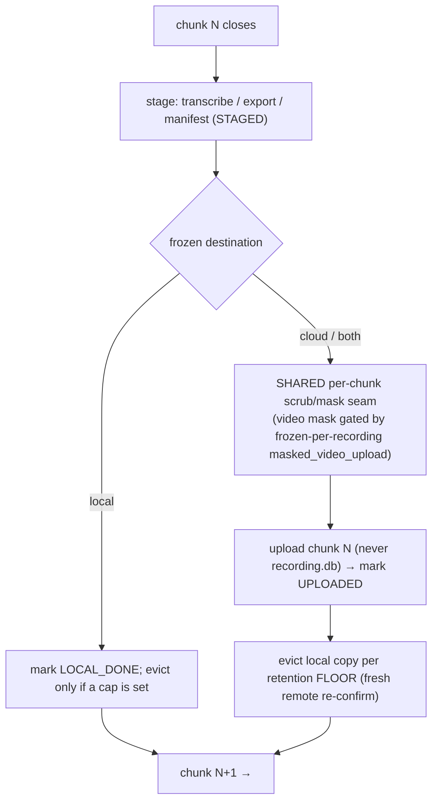
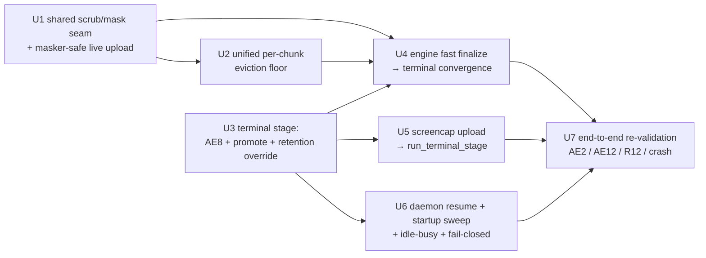

# SCR-125 — Unify the per-chunk upload pipeline on the terminal-stage seam

## Summary

Make per-chunk processing *during recording* the single canonical flow for every destination, and make it **masker-safe** by routing the per-chunk video transform through one shared scrub/mask seam that both the live `chunk_processor` path and `terminal_stage.run_terminal_stage` call. The terminal stage stops being a parallel uploader and becomes the **convergence point + crash/restart safety net + manual-upload entry point**. The on-disk `PipelineLedger` and a single retention floor remain the one source of truth. This is the last step that lets the `masked_video_upload` flag (SCR-126) be flipped on safely — because once the *live* upload masks its video, no rich video can reach the cloud through any path.

---

## Problem Frame

Today two code paths can put a recording's chunks into the cloud: the live `chunk_processor` (uploads each chunk *during* recording, but never applies the per-chunk video mask `mask_video_chunk_for_cloud` — it relies on capture-time blocking) and the post-hoc `terminal_stage` / `screencap upload` (applies the mask, but only runs at the end). The unified-pipeline refactor (PR #224) built `terminal_stage.run_terminal_stage` as a single disk-driven convergence point but integrated it conservatively, so the live path still uploads on its own, unmasked. While the `masked_video_upload` flag is OFF this is safe (the live path uploads capture-blocked video); the moment the flag flips ON for SCR-126, the live path would ship **unmasked** rich video. (Full motivation in origin: `docs/brainstorms/2026-06-05-unified-recording-processing-pipeline-requirements.md`.)

The original SCR-125 ticket proposed closing this by *removing* the live upload so the terminal stage becomes the sole uploader. During planning that approach was rejected: it would batch a full day's upload to the end and discard during-recording disk reclaim (origin R12). The chosen approach keeps per-chunk-during-recording as the main flow and instead makes it masker-safe.

---

## Requirements

Carried from origin (the cutover must keep honoring these), plus cutover-specific R-IDs:

- R1. (origin) A single pipeline processes every recording regardless of destination; the live-cloud and post-hoc paths converge on one seam.
- R5. (origin) One terminal routing/lifecycle seam owns destination-specific behavior: the cloud-bound privacy transform, upload, and retention/eviction.
- R7. (origin) Scrub/mask is a transform applied only to cloud-bound copies; local artifacts stay rich.
- R8. (origin) `recording.db` is local-only and never uploaded.
- R9. (origin) The convergence stage is idempotent and re-runnable from disk after crash/interruption (resume converges, never duplicates).
- R12. (origin) Eviction can run *during* an active recording so long cloud sessions stay within bounded disk. **Preserved** by this plan, not regressed.
- R-SCR125-A. The **live** per-chunk upload applies the per-chunk video mask through the shared seam, so flipping `masked_video_upload` ON (SCR-126) can never ship unmasked video through any path.
- R-SCR125-B. All three convergence entry points (engine finalize, `screencap upload`, daemon resume) drive `run_terminal_stage`; the AE8 promotion-hole refusal lives inside it.
- R-SCR125-C. The daemon auto-recovers an incomplete recording after engine crash or daemon restart, without double-uploading confirmed chunks.

**The five data-loss-prevention rules** (origin + `docs/solutions/runtime-errors/chunk-upload-sentinel-gating-and-data-loss.md`) are load-bearing invariants for every unit: (1) closed-set seeding + frozen `chunks_expected` (never a live glob); (2) tri-state upload (`SKIPPED ≠ UPLOADED ≠ FAILED`); (3) never delete a local file without a fresh remote re-confirm; (4) sentinel is the last write, gated on the frozen count; (5) test the degraded paths.

**Origin actors:** A1 (local-only operator), A2 (cloud operator), A4 (processing pipeline).
**Origin flows:** F1 (local kept-rich), F2 (cloud with reclaim-local), F3 (crash/interruption recovery).
**Origin acceptance examples:** AE1 (cloud copy scrubbed, local rich), AE2 (interrupted upload re-runs without duplicates), AE4 (`recording.db` never uploaded), AE5 (mid-recording eviction), AE8 (promotion refuses on holes), AE12 (flock serializes concurrent runs).

---

## Scope Boundaries

- This plan does **not** flip `masked_video_upload` ON. That is SCR-126; this work makes flipping it safe.
- The masked-video trust-boundary policy (capture-time blocking vs post-hoc masking) is unchanged; see `SECURITY.md`. With the flag OFF, the live path keeps uploading capture-blocked video exactly as today.
- No change to the recording engine's capture path, reader threads, or daemon socket/auth model.

### Deferred to Follow-Up Work

- **SwiftUI "uploading" vs "finalized" signal** (origin F2 / research H6): `recording_finalized` is the macOS app's terminal "done" signal, but the cutover demotes upload to a finalize-convergence/daemon-resume step, so on the failed-live-straggler and crash-resume paths the app can show a cloud recording as "finalized" while bytes are still uploading (or not yet in the cloud). The Python *pipeline* is correct without it (no data loss — local media is preserved until confirmed), but the user-perceived "finalized = safely uploaded" trust is not. Under the masked-video flag OFF (today) the live path uploads progressively, so finalize timing is effectively unchanged and the gap is narrow; the deferred follow-up must explicitly cover the new straggler/daemon-resume timing (emit a terminal-stage-complete event), not just origin H6. → Linear (Screencap).
- **`--no-live-upload` precise post-cutover semantics** (research Flow 8): recommended resolution recorded under Open Questions; if the exact behavior needs to change, fold it into a follow-up rather than blocking this cutover.
- **`chunk_processor` dead-code + efficiency cleanup** (todo `docs/todos/refactor/unified-recording-pipeline/004-pipeline-efficiency-and-duplication.md`): redundant GCS probes, per-op ledger connects, open-coded "core file" names, duplicated `<name>-scrubbed` derivation. Out of this diff.
- **Reconcile re-validating already-`UPLOADED` rows** (todo `003`): defense-in-depth, separate.

---

## Context & Research

### Relevant Code and Patterns

- `src/screencap/terminal_stage.py` — `run_terminal_stage` (entry, flock-first), `_route_cloud` (reconcile → `CloudCopyProducer.produce` → upload → mark → sentinel → retention), `CloudCopyProducer._mask_videos` (the per-chunk video mask — the logic to extract into the shared seam), `assert_promotable_to_cloud` / `detect_promotion_holes` (AE8), `terminal_lock` (advisory flock + **non-reentrant** in-process `threading.Lock`).
- `src/screencap/chunk_processor.py` — `_process_chunk` (stage → scrub → upload → `_delete_old_chunks`), `_upload_chunk`, `reconcile_against_gcs`, `freeze_expected_chunks` (**the only production freeze of `chunks_expected`**), `_mirror_status_to_ledger` (live path already writes the ledger), `stub_recording`.
- `src/screencap/engine/collaborators.py` — `finalize_uploads` (wraps `terminal_lock`), `_finalize_uploads_locked` (the synchronous heavy finalize to reshape), `_build_chunk_processor` (`effective_upload` / `auto_delete` construction forks).
- `src/screencap/cli/__init__.py` — `upload` command (~2577–2851): inline recovery + `assert_promotable_to_cloud` + scrub-reuse + `upload_recording`; `terminal_lock` + `recording_scrub_lock` nesting; `--no-delete` is currently a **dead** parameter.
- `src/screencap/daemon/supervisor.py` — `resume_terminal_stage` (built, **never auto-invoked**), `_handle_engine_exit` (single exit funnel; reads `_session_state["capture_dir"]`), `_reconcile` (startup; only inspects the one active lock), `asyncio.to_thread` + tracked-task patterns.
- `src/screencap/daemon/_idle_shutdown.py` — `_daemon_is_busy` (subscriber count + active session); must also count an in-flight resume.
- `src/screencap/retention.py` — `evict_recording` (the fresh-remote-confirm floor; prevention rule #3).
- `src/screencap/engine/lock_policy.py` — `_write_identity_files` freezes `.recording_intent` (schema v2: `destination`/`retention_policy`/…); the place to record any new per-recording flag.
- `src/screencap/pipeline_policy.py` — `resolve_policy` (R13 seam), `ResolvedPolicy`, `Destination`.

### Institutional Learnings

- `docs/solutions/runtime-errors/chunk-upload-sentinel-gating-and-data-loss.md` — the five prevention rules. After this cutover both the live path and the terminal stage must honor them; in particular `chunks_expected` comes from the frozen ledger value, never a live manifest glob (Bug 3), and a force-stop forces the gate to False.
- `docs/solutions/runtime-errors/eventbus-late-listener-replay-2026-05-12.md` — late-listener race: prefer triggering the resume off the single `_handle_engine_exit` funnel rather than subscribing to `recording_finalized` (avoids the await-gap race entirely).
- `docs/solutions/integration-issues/daemon-start-failure-typed-error-before-spawn-2026-06-08.md` — `recording_finalized` is synthesized by `_handle_engine_exit` for graceful stop, crash, and `SystemExit(3)`; the resume must converge cleanly off all three.
- Research confirmed the **daemon process reads the Keychain** (the engine-token env overlay is set only on the engine subprocess), so a daemon-side resume can authenticate; it must still fail closed if auth is unavailable.
- `SECURITY.md` — the `masked_video_upload` trust boundary and `upload.assert_uploadable` / `list_recording_files` exclusion of `recording.db`.

---

## Key Technical Decisions

- **Per-chunk-during-recording is the canonical flow; unify at the seam + ledger, not in one function.** The live `chunk_processor` thread remains the primary engine (it already stages, scrubs, and uploads per chunk off the capture hot path). Both it and `terminal_stage` call **one shared per-chunk scrub/mask helper** and write **one `PipelineLedger`**. Rationale: this is origin R1/R4/R5/R12 realized; reshaping the recently-built, heavily-tested `terminal_stage` into a per-chunk-incremental processor (the "one function" alternative) is a large rewrite with no added safety. (User decision, 2026-06-09.)
- **This revises ticket item 4.** Instead of *removing* during-recording upload, we *keep and harden* it (add the per-chunk video mask). The terminal stage is the **convergence + safety net + manual entry**, not the sole uploader. The masked-video safety property is achieved by masking on the **live** path, gated by the still-OFF flag.
- **Engine finalize stays fast by being cheap, not by deferring.** Because the live path already uploaded the chunks, finalize = freeze `chunks_expected` → `run_terminal_stage` (reconcile finds everything present, catches any failed-live straggler, writes the sentinel, applies final retention). No multi-GB batch, so no 30s-stop-timeout race. The daemon resume is the crash/restart safety net, not the primary uploader.
- **AE8 hole-refusal moves into `run_terminal_stage`'s cloud route** so retiring the standalone `assert_promotable_to_cloud` call from the CLI does not lose the partial-cloud-copy refusal.
- **`screencap upload` is an explicit promotion.** A `force_destination`/`promote` argument lets the CLI upload a `local`/legacy/no-intent recording (which would otherwise route LOCAL → no-op). `--no-delete` maps to a `keep_forever` retention override passed into the run.
- **Flock re-entrancy resolved by single ownership.** `finalize_uploads` must not wrap `terminal_lock` *and* call `run_terminal_stage` (which re-acquires the non-reentrant in-process lock → same-thread deadlock). Finalize delegates locking entirely to `run_terminal_stage`.
- **One retention floor.** Live per-chunk eviction routes through the same fresh-remote-confirm floor as `terminal_stage`/`retention.evict_recording` (prevention rule #3), replacing `chunk_processor`'s bespoke `_delete_old_chunks` bookkeeping.
- **Daemon resume fails closed.** It already swallows `TerminalStageBusy`; it must also swallow auth/upload errors (no eviction, no sentinel, leave a follow-up) rather than propagate into the asyncio loop.
- **The masked-video decision is frozen per-recording (security).** `masked_video_upload` is resolved once at recording start and written into `.recording_intent`; capture-time `block_video` and the live-upload mask both read that frozen value. A mid-recording flip of the global flag cannot make capture-blocking and upload-masking disagree (the rich-video leak window). The masked-path-switch (upload the masked copy, never the source `.mp4`) is a load-bearing U1 requirement with an explicit test, not an implementation detail.
- **`chunks_expected` freeze is engine-origin and authoritative.** Only the engine's finalize freezes it. The resume/sweep paths use the non-freezing GCS reconcile and never `reconcile_ledger_from_disk`, so a crash-before-finalize recording can never freeze-from-disk and get a false completeness sentinel — it stays gate-unsatisfied (uploads its chunks, no sentinel) and recovers via manual `screencap upload`.
- **Finalize bounds its synchronous work.** "Fast finalize" holds only when the live path already uploaded. If live upload failed all session, finalize does not synchronously upload the backlog (that would blow the 30s stop timeout); it freezes, converges what's cheap, and hands the backlog to the daemon resume — which is the primary uploader for that degraded path.
- **`--no-live-upload` axis is preserved.** U4 simplifies the cloud-vs-local fork but keeps `live_upload` gating, so `--no-live-upload` still suppresses auto-upload; its precise post-cutover semantics (recorded in the frozen intent) remain the one deferred-to-implementation item, but the flag does not silently become a no-op.

---

## High-Level Technical Design

> *This illustrates the intended approach and is directional guidance for review, not implementation specification.*

**Roles after the cutover**

| Surface | Role | Uploads? | Lock |
|---|---|---|---|
| `chunk_processor` (live, per-chunk, bg thread) | **Primary**: stage → scrub → **mask** → upload → evict each chunk | Yes (masker-safe) | per-recording flock around the per-chunk cloud op |
| engine `finalize_uploads` (at stop) | freeze `chunks_expected` → converge | Only stragglers | delegates to `run_terminal_stage` |
| `screencap upload` (CLI) | manual convergence / promotion | Yes (via terminal stage) | `run_terminal_stage` (blocking-with-timeout) |
| daemon `resume_terminal_stage` | crash/restart safety net | Yes (via terminal stage) | `run_terminal_stage` (non_blocking) |

**Shared seam**: one per-chunk scrub/mask helper + one `PipelineLedger` + one retention floor — every surface above goes through them.

**Per-chunk live flow (during recording)**

**Dependency graph of units**

---

## Implementation Units

### U1. Shared per-chunk scrub/mask seam + masker-safe live upload

**Goal:** Extract the per-chunk video-mask logic into one shared helper, and make the live `chunk_processor` per-chunk upload call it so the uploaded video is masked when `masked_video_upload` is ON (and byte-for-byte today's capture-blocked video when OFF). This is the unit that satisfies R-SCR125-A and is the actual prerequisite for SCR-126.

**Requirements:** R1, R5, R7, R-SCR125-A. Covers AE1, AE4.

**Dependencies:** None.

**Files:**
- Modify: `src/screencap/chunk_processor.py` (`_collect_chunk_files` / `_upload_chunk`: per-chunk cloud op applies the shared mask; the video slot resolves to the masked copy when the flag is ON)
- Modify: `src/screencap/terminal_stage.py` (`CloudCopyProducer._mask_videos` calls the shared helper instead of owning the logic)
- Modify: `src/screencap/engine/lock_policy.py` (`_write_identity_files`: freeze the `masked_video_upload` decision into `.recording_intent` at start) + `src/screencap/engine/collaborators.py` (`build_recorder_privacy_filter` reads the frozen per-recording value for `block_video`, not the mutable global)
- Create/Modify: a shared helper (preferred home: `src/screencap/scrubber.py` alongside `mask_video_chunk_for_cloud`, or a small `pipeline_chunk_ops` module) — decide at implementation
- Test: `tests/test_chunk_processor.py`, `tests/test_terminal_stage.py`, `tests/test_scrubber_class.py`, `tests/engine/test_collaborators.py`

**Approach:**
- Factor the per-chunk mask classification (the loop body of `terminal_stage.CloudCopyProducer._mask_videos`: derive chunk timing, call `mask_video_chunk_for_cloud`, map ok→`mark_scrubbed` / fail→`mark_failed`, fail-closed) into a single helper taking `(recording_dir, scrubbed_dir, chunk_idx, ledger, ...)`.
- **The masked-path-switch is a load-bearing invariant, not an implementation detail (security P0).** `_collect_chunk_files` today hardcodes `chunk_{idx:04d}.mp4` resolved against `self._capture_dir` (the rich source). U1 MUST make the per-chunk upload's video slot resolve to the **masked copy** (`<name>-scrubbed/masked_video/chunk_{idx:04d}.mp4`) whenever a masked copy was produced, and MUST guarantee the source-dir `.mp4` path is **absent** from the per-chunk upload set in that case. The GCS object name stays `chunk_{idx:04d}.mp4` (only the local source path changes), so the cloud key is unchanged.
- **Freeze the `masked_video_upload` decision per-recording at start (security P0 — closes the mid-recording flag-flip leak).** Today `block_video` is read once at recorder build time from the mutable global `get_masked_video_upload_enabled()`, while the live upload would read the same global per-chunk; a mid-recording flip makes capture-blocking and upload-masking disagree (started-ON captures rich → flipped-OFF uploads it unmasked). Write the resolved value into `.recording_intent` at start (alongside `destination`/`retention`) and have BOTH `block_video` and the live-upload mask read that one frozen per-recording value. The flag cannot change a recording's behavior after it starts.
- Flag OFF (frozen) → helper returns "no masked copy", and the live path uploads the capture-blocked source video exactly as today (the byte-for-byte-today guarantee, mirroring `tests/engine/test_collaborators.py::test_build_recorder_privacy_filter_blocks_video_by_default`).
- **Live per-chunk lock contract (concurrency P1).** The per-chunk cloud op (mask → upload → mark → evict) acquires the per-recording `terminal_lock` **per chunk and releases it between chunks** — never held across the whole recording — using `non_blocking` so it cannot stall the capture-adjacent thread and a concurrent `screencap upload` / daemon resume can interleave (a `non_blocking` skip is the intended outcome, not a lost upload — the next chunk or the finalize convergence picks it up). This is new: the live path holds no flock today.
- `recording.db` stays excluded from upload (R8/AE4) — unchanged; the live path already uploads via the shared upload primitives that exclude it. R7: the rich **source** video is retained on disk even after the masked copy uploads; eviction (U2) only reclaims it when the retention policy says so.

**Patterns to follow:** `terminal_stage.CloudCopyProducer._mask_videos` (fail-closed mapping), `scrubber.mask_video_chunk_for_cloud` (per-chunk signature), `chunk_processor._mirror_status_to_ledger` (ledger write discipline).

**Test scenarios:**
- Happy path: flag OFF → live per-chunk upload uploads the (capture-blocked) source video and marks `UPLOADED`; no masked copy produced.
- Covers R-SCR125-A (security P0): flag ON → the path argument for the `.mp4` slot in the per-chunk upload set resolves to the `masked_video/` subdirectory, and the source-dir `chunk_NNNN.mp4` path is **not** in the set. Assert against the actual file list passed to the upload primitive, not just "a masked copy exists".
- Covers R-SCR125-A (security P0): the `masked_video_upload` value is read from the frozen `.recording_intent`, so flipping the global mid-recording does not change which video path uploads — a recording started with the flag OFF never uploads rich video even if the global flips ON mid-session, and vice-versa.
- Covers AE4. `recording.db` is never among the per-chunk uploaded files under either flag state.
- Error path: the per-chunk video mask raises for a chunk → fail-closed: chunk marked `FAILED`, video not uploaded, sentinel later blocked, local media preserved.
- Edge case (lock contract): the live per-chunk op acquires and releases `terminal_lock` per chunk (not held across chunks); a `non_blocking` contention with a concurrent holder yields a skip, not a deadlock or a lost mark.
- Integration: the same shared helper drives both `terminal_stage._route_cloud` and the live path — a single test asserts identical mask classification for a given chunk through both callers.

**Verification:** With the flag flipped ON in a test, no rich (unmasked) video file is ever requested for upload by the live path; the terminal stage and live path produce identical masked output for the same chunk.

---

### U2. Unified per-chunk eviction through the retention floor

**Goal:** Route the live path's local-chunk reclaim through the single fresh-remote-confirm retention floor, so during-recording eviction (R12/AE5) can never delete a chunk that is not confirmed in the cloud (prevention rule #3). Replaces `chunk_processor`'s bespoke `_delete_old_chunks` trust-internal-bookkeeping behavior.

**Requirements:** R10, R12. Covers AE5. Honors prevention rule #3.

**Dependencies:** U1.

**Files:**
- Modify: `src/screencap/chunk_processor.py` (`_delete_old_chunks` → call the unified retention executor / per-chunk floor)
- Modify: `src/screencap/retention.py` (expose a per-chunk eviction entry if needed)
- Test: `tests/test_chunk_processor.py`, `tests/test_retention.py`

**Approach:**
- During recording, after a chunk is confirmed `UPLOADED`, eviction of *older* local chunks goes through `retention.evict_recording` (or a per-chunk variant) which re-confirms remote presence NOW before unlinking. Default config (`keep_forever`, `auto_delete` off) → no eviction, unchanged.
- **Preserve the existing `keep_recent=2` window** by threading a `keep_recent` parameter into the `delete_after_upload` selector — do not silently drop it. The unified floor's selector currently returns every `UPLOADED` candidate with no keep-recent window, so routing the live path through it unchanged would evict the most-recent confirmed chunks mid-recording (a behavior change); keeping `keep_recent=2` matches today's during-recording reclaim.
- Eviction during recording shares the per-recording `terminal_lock` with the live upload op (acquired per-chunk, released between chunks — same contract as U1) so it cannot race a concurrent terminal run (AE12).

**Patterns to follow:** `terminal_stage._apply_retention` (already calls `evict_recording` behind the flock), `retention.evict_recording` (the floor).

**Test scenarios:**
- Covers AE5. A long cloud recording with `delete_after_upload`: once chunk N is confirmed remote, chunk N-2's local copy is evicted *during* recording; disk stays bounded.
- Edge case: default config (`keep_forever`) → no chunk is evicted during recording (byte-for-byte today's default).
- Error path (prevention rule #3): a chunk marked `UPLOADED` in the ledger but a fresh remote stat returns absent → eviction is **refused**, local media preserved.
- Error path: GCS unreachable during the fresh re-confirm → eviction refused (conservative).

**Verification:** No code path deletes a local chunk without a fresh remote confirm in the same critical section; default config evicts nothing during recording.

---

### U3. Terminal stage: internal AE8 refusal + explicit-promotion + retention override

**Goal:** Make `run_terminal_stage` the single place that refuses-on-holes, accepts an explicit promote-to-cloud destination, and accepts a per-run retention override — so the CLI (U5) can route through it without losing AE8 or the `--no-delete` semantics.

**Requirements:** R5, R6, R-SCR125-B. Covers AE8.

**Dependencies:** None (parallelizable with U1/U2).

**Files:**
- Modify: `src/screencap/terminal_stage.py` (`_route_cloud` calls `detect_promotion_holes`/refuses before producing the cloud copy; add `force_destination`/`promote` and `retention_override` params to `run_terminal_stage`/`_run_locked`)
- Test: `tests/test_terminal_stage.py`

**Approach:**
- Inside `_route_cloud`, before `CloudCopyProducer.produce`, run the AE8 hole detection (reuse `detect_promotion_holes`); on a hole, raise `PromotionRefused` (callers handle it) — fail-closed, never a partial cloud copy.
- `force_destination` overrides the frozen-policy destination for the explicit-upload case; when absent, behavior is unchanged (route by frozen `.recording_intent`).
- `retention_override` (e.g., `keep_forever`) flows into `_apply_retention` so `--no-delete` is honored.

**Patterns to follow:** existing `assert_promotable_to_cloud`/`detect_promotion_holes`, `_resolve_destination`, `_apply_retention`.

**Test scenarios:**
- Covers AE8. A recording with an evicted-and-unconfirmable chunk → `run_terminal_stage` (cloud route) raises `PromotionRefused`; nothing uploaded.
- Happy path: `force_destination=cloud` on a `local`-intent recording → routes cloud (uploads) instead of the local no-op.
- Happy path: `retention_override=keep_forever` → no eviction even when the frozen policy is `delete_after_upload`.
- Edge case: legacy/no-ledger recording with `force_destination=cloud` → falls through the whole-dir path (R14), no spurious hole refusal.
- Regression: with no override, frozen-policy routing and existing AE8 standalone behavior are unchanged.

**Verification:** `run_terminal_stage` refuses holes internally; the standalone `assert_promotable_to_cloud` is no longer required at any call site for AE8 to hold.

---

### U4. Engine fast finalize → terminal-stage convergence

**Goal:** Reshape `collaborators.finalize_uploads` so finalize freezes `chunks_expected`, then converges via `run_terminal_stage` (cheap, because the live path already uploaded), maps the result onto the existing result-dict contract, and resolves the flock re-entrancy. Local recordings converge in-process; cloud recordings need only the sentinel + any failed-live straggler.

**Requirements:** R1, R5, R9, R-SCR125-B. Covers AE12, prevention rules #1 and #4.

**Dependencies:** U1, U2, U3.

**Files:**
- Modify: `src/screencap/engine/collaborators.py` (`finalize_uploads` no longer wraps `terminal_lock`; `_finalize_uploads_locked` → WAL checkpoint + `cp.freeze_expected_chunks` + `run_terminal_stage` + map `TerminalResult` → result dict)
- Modify: `src/screencap/engine/collaborators.py::_build_chunk_processor` (simplify the `effective_upload`/`auto_delete` forks: the cloud-vs-local branch is now constant — live upload is the cloud path's job through the seam, eviction is the floor — but **keep the `live_upload` axis** so `--no-live-upload` still suppresses auto-upload; do NOT collapse `effective_upload` to a constant `True`)
- Modify: `src/screencap/recorder.py` (followup messaging: a converged-cloud recording is not a "partial upload" warning)
- Modify: `src/screencap/engine/screen_recorder.py` (consumes `_finalize_result["sentinel_uploaded"]` — keep the key meaningful)
- Test: `tests/engine/test_collaborators.py`

**Approach:**
- `finalize_uploads(recording_name)` calls `run_terminal_stage(capture_dir)` (which acquires the flock itself) — **no** outer `terminal_lock` wrap (resolves the H1 same-thread deadlock on the non-reentrant in-process lock).
- `cp.freeze_expected_chunks(n_chunks)` MUST still run before convergence — it is the only production freeze of `chunks_expected`; without it AE8 and the finalize gate are inert.
- Map `TerminalResult` → the existing dict (`sentinel_uploaded`, `all_chunks_uploaded`, `n_uploaded`, `n_total`, `upload_warning`, `force_stopped`, `stubbed`, `followup_kind`). When the terminal stage genuinely could not converge (e.g., a failed chunk), surface the existing follow-up kinds; do not invent a scary "partial" warning for the normal converged case.
- Local destination: `run_terminal_stage` routes LOCAL (mark `LOCAL_DONE` + retention) — cheap, in-process, no network.
- **"Finalize is cheap" assumes the live path succeeded — bound it for the degraded case (A4).** If live upload was failing all session (auth lapse, sustained network loss), every chunk is unconfirmed and a naive finalize would scrub+upload a full-day backlog synchronously, blowing the daemon's 30s stop timeout (the exact race the design claims to avoid). Finalize must NOT perform a full synchronous backlog upload: it freezes `chunks_expected`, converges only what is cheap (already-confirmed chunks + sentinel if the gate is satisfied), and hands a large unconfirmed backlog to the daemon resume safety net — returning within the stop budget. This is where the daemon resume is the primary uploader for the degraded path.
- **Freeze provenance is engine-origin (A1/A5).** `cp.freeze_expected_chunks` (here, at finalize) is the authoritative freeze. The resume/sweep path must use `run_terminal_stage`'s GCS reconcile (`_reconcile_ledger_against_gcs`, which does **not** freeze) and must NOT invoke `reconcile_ledger_from_disk` (which freezes `chunks_expected` from the on-disk set) for a crash-orphan — otherwise a recording the engine never finalized could freeze-from-disk, satisfy the gate, and get a false completeness sentinel. A crash-before-freeze recording stays unfrozen → `finalize_gate_satisfied()` False → no sentinel (verified in U6).

**Execution note:** Characterization-first — capture the current `finalize_uploads` result-dict contract (the two existing tests in `tests/engine/test_collaborators.py`) before reshaping, then migrate those tests to the new delegation while preserving the "finalize always completes cleanly and freezes `chunks_expected`" guarantee.

**Patterns to follow:** existing `finalize_uploads`/`_finalize_uploads_locked`, `TerminalResult` field shape, `tests/engine/test_collaborators.py::_StubChunkProcessor`.

**Test scenarios:**
- Covers prevention rule #1. Finalize freezes `chunks_expected` to the closed-set count even when the recording is local and never uploaded (migrates `test_finalize_uploads_freezes_chunks_expected_at_closed_set`).
- Happy path (cloud, live already uploaded): finalize → `run_terminal_stage` reconciles all-present, writes the sentinel, returns `sentinel_uploaded=True`.
- Happy path (local): finalize routes LOCAL, marks `LOCAL_DONE`, no upload, no sentinel; returns cleanly.
- Edge case (H1 regression): finalize completes without acquiring the per-recording lock twice on one thread (no deadlock) — assert it does not wrap `terminal_lock` around `run_terminal_stage`.
- Error path: a chunk `FAILED` at mask → finalize does not write the sentinel, preserves local media, surfaces the follow-up (migrates `test_finalize_uploads_partial_path_does_not_nameerror`).
- Edge case (force-stop): `was_force_stopped` forces the gate False (prevention rule #4) — no sentinel.
- Edge case (A4 degraded): all chunks unconfirmed (live upload failed all session) → finalize returns within the stop budget, freezes `chunks_expected`, writes no sentinel, and defers the backlog to the daemon resume — it does NOT synchronously upload a full-day backlog at stop.
- Covers AE4 (post-cutover): finalize never uploads `recording.db` — the old `checkpoint_and_upload_db` DB-upload behavior is gone; only the scrubbed/masked copy's files upload.

**Verification:** Stopping a cloud recording returns within the daemon stop timeout; the sentinel is written iff the frozen closed set is all uploaded; `chunks_expected` is always frozen.

---

### U5. `screencap upload` routes through `run_terminal_stage`

**Goal:** Replace the CLI upload command's inline recovery + `assert_promotable_to_cloud` + scrub-reuse + `upload_recording` block with a single `run_terminal_stage` call (explicit promote), wiring `--no-delete` to the retention override and keeping `--dry-run`.

**Requirements:** R1, R5, R-SCR125-B. Covers AE8.

**Dependencies:** U3.

**Files:**
- Modify: `src/screencap/cli/__init__.py` (`upload` command ~2577–2851)
- Test: `tests/test_cli.py`, `tests/test_upload.py`

**Approach:**
- For each resolved dir: `run_terminal_stage(d, console=console, force=force, dry_run=dry_run, force_destination=cloud, retention_override=keep_forever if no_delete else None)`. The terminal stage owns recovery, scrub-reuse, hole-refusal, upload, sentinel, retention — so the inline block is deleted.
- Keep the deferred-import convention (`from screencap.terminal_stage import run_terminal_stage` inside the command body) so `--help` stays fast and the test monkeypatch target resolves.
- Map `TerminalResult` → the existing CLI summary output; handle `PromotionRefused` (clear actionable error, skip) and `TerminalStageBusy` (a live finalize or daemon resume holds the lock → "upload already in progress" rather than a raw timeout).
- Keep the `local`-intent warning note; `--no-delete` now actually does something (was a dead param).

**Patterns to follow:** existing `upload` command structure (auth pre-flight, per-dir loop, `console.print` summaries), `tests/test_cli.py` CliRunner + `mock.patch` of the consumer module path (now `screencap.terminal_stage.run_terminal_stage`).

**Test scenarios:**
- Happy path: `screencap upload <cloud-rec>` → one `run_terminal_stage` call with `force_destination=cloud`; success summary printed.
- Covers AE8: a recording with holes → `PromotionRefused` surfaced as an error, exit non-fatal for the batch, nothing uploaded.
- Happy path: `screencap upload <local-rec>` → still uploads (promotion), not a silent no-op.
- Happy path: `--no-delete` → retention override passed; local media kept after upload.
- Edge case: `--dry-run` → no lock, no upload, reports what would happen.
- Error path: `TerminalStageBusy` (daemon holds the lock) → friendly "in progress" message, not a traceback.

**Verification:** The CLI no longer calls `scrub_recording`/`upload_recording`/`assert_promotable_to_cloud` directly; all upload behavior flows through `run_terminal_stage`.

---

### U6. Daemon auto-resume + startup sweep + idle-shutdown + fail-closed

**Goal:** Wire the crash/restart safety net: auto-invoke `resume_terminal_stage` from the single engine-exit funnel, add a daemon-startup sweep for recordings left incomplete, keep an in-flight resume from being idle-shut-down, and make the resume fail closed on auth/upload errors.

**Requirements:** R9, R-SCR125-C. Covers AE2, F3.

**Dependencies:** U3.

**Files:**
- Modify: `src/screencap/daemon/supervisor.py` (`_handle_engine_exit` enqueues a tracked `resume_terminal_stage` task after capturing `capture_dir`; `_reconcile` or a sibling adds the recordings-dir sweep; `resume_terminal_stage` catches auth/upload errors; `_reset_state` clears the new task field)
- Modify: `src/screencap/daemon/_idle_shutdown.py` (`_daemon_is_busy` also returns True while a resume worker is in flight)
- Test: `tests/daemon/test_supervisor.py`, a `_idle_shutdown` test

**Approach:**
- **Single trigger (research H7):** enqueue the resume from `_handle_engine_exit` (the funnel for graceful stop, crash, and `SystemExit`), not from a `recording_finalized` subscription (avoids the late-listener race). Snapshot `capture_dir` from `_session_state` **inside `_exit_lock` before `_reset_state` clears it** (so a concurrent stop/shutdown can't null it mid-read). Run as a tracked `asyncio.create_task` of `resume_terminal_stage` (`to_thread` + `non_blocking`); store on `self._resume_task` and cancel/await it in `shutdown`/`_reset_state` like the other tasks. On a **graceful** stop the engine's own finalize already converged inside the engine process, so this resume is a cheap no-op (or a `non_blocking` skip if the engine still holds the flock) — fire it exactly once from the funnel, never re-freeze or re-sentinel an already-converged recording.
- **Daemon-side auth (S3):** the resume runs in the daemon process, which reads the Keychain (the engine-token env overlay is set only on the engine subprocess). Specify which path provides the ID token: confirm `upload.request_signed_urls` falls back to `auth.get_id_token()` when no engine-token file/env is present (it should, since the daemon has no staged token) — if it does not, `resume_terminal_stage` must stage a short-lived token before invoking `run_terminal_stage`. Whichever path, a test must cover "resume with valid Keychain auth uploads" and "resume while not signed in fails closed without evicting".
- **Startup sweep (origin F3 / "daemon restart"):** scan `get_recordings_dir()` for dirs with an **engine-origin** frozen `chunks_expected` and an unsatisfied finalize gate, enqueueing `non_blocking` resumes. The sweep must NOT freeze-from-disk (no `reconcile_ledger_from_disk`) — a crash-before-finalize recording has no authoritative count, so it is NOT auto-converged to "complete": its on-disk chunks may upload but it never gets a sentinel, and full recovery is via manual `screencap upload`. Auth pre-flight: if not signed in, skip the sweep and log clearly (the recordings stay on disk); re-attempt on the next daemon start / sign-in rather than abandoning. Log what is swept (no silent caps).
- **Idle-shutdown:** add a supervisor accessor (e.g., `has_inflight_resume()`) exposing whether `self._resume_task` is live, and have `_daemon_is_busy` consult it — `current_session()` is `None` after `_reset_state`, so the in-flight resume would otherwise be invisible and the auto-spawned (`--idle-shutdown=600`) daemon could exit mid-upload.
- **Fail closed (research H4):** `resume_terminal_stage` catches `auth.NotSignedIn`/`AuthError`/upload exceptions (in addition to `TerminalStageBusy`) and returns without raising into the loop — no eviction, no sentinel, local media preserved.

**Test scenarios:**
- Covers AE2. Engine crash with chunks half-uploaded → resume re-runs, reconciles already-uploaded chunks (no re-upload), completes the rest; no duplicates.
- Happy path: graceful exit of a cloud recording → resume fires once, finds the recording already converged (cheap no-op).
- Covers F3: daemon startup with an engine-origin-frozen, gate-unsatisfied recording → the sweep enqueues a resume and it converges.
- Happy path (auth): resume with valid Keychain auth uploads and converges (proves the daemon's no-engine-token token path works).
- Edge case: graceful stop AND synthesized crash event do not double-fire the resume (single trigger).
- Edge case (idle-shutdown): a resume task in flight keeps `_daemon_is_busy` True via `has_inflight_resume()`; once it finishes the idle timer resumes.
- Error path: resume with `auth.NotSignedIn` → returns None, no exception escapes `to_thread`, nothing evicted; the startup sweep skips entirely when not signed in (recordings preserved for a later attempt).
- Edge case (freeze-on-crash, prevention rules #1/#4 — A1/A5): a recording whose `chunks_expected` was never frozen by the engine (crash before finalize) → neither the resume nor the sweep freezes-from-disk; chunks may upload but `finalize_gate_satisfied()` stays False → **no sentinel** (fail-closed; no false "complete").

**Verification:** A crashed or restart-orphaned cloud recording reaches GCS via the daemon without manual intervention and without duplicating confirmed chunks; an auto-spawned daemon never idle-exits mid-upload.

---

### U7. End-to-end re-validation across the unified path

**Goal:** Integration coverage proving the invariants hold across all four surfaces sharing the seam and ledger (origin item 5).

**Requirements:** R9, R12, R-SCR125-A/B/C. Covers AE2, AE5, AE12.

**Dependencies:** U1–U6.

**Files:**
- Test: `tests/test_terminal_stage.py` and/or a new `tests/test_unified_upload_pipeline.py` integration test

**Approach:** Exercise the real ledger + flock (with `_RUN_DIR` isolated to tmp per `tests/test_terminal_stage.py::_isolate_run_dir`) and injected `remote_exists`/auth seams, not mocks of the whole stage.

**Test scenarios:**
- Covers AE12: a live per-chunk upload, a manual `screencap upload`, and a daemon resume contending for the same recording are serialized by the flock; never two concurrent reconcile→upload passes.
- Covers AE2: interrupt an upload mid-way (some chunks confirmed), re-run the terminal stage → no chunk re-uploaded, the rest complete, no duplicates/corruption.
- Covers AE5/R12: a long cloud recording with `delete_after_upload` evicts confirmed chunks during recording and ends within bounded disk.
- Covers R-SCR125-A: with the flag ON, no rich video reaches the (mock) cloud through the live path or the terminal stage.
- Degraded path (prevention rule #5): a recording with one `FAILED` chunk never gets a sentinel through any of the four entry points; local media preserved.

**Verification:** All four entry points converge to the same ledger state; the five prevention rules and AE2/AE5/AE12 hold end-to-end.

---

## System-Wide Impact

- **Interaction graph:** `chunk_processor` (live, engine process) and `terminal_stage` (engine finalize + CLI + daemon) now share one mask helper, one `PipelineLedger`, and one retention floor. The daemon `_handle_engine_exit` gains a tracked resume task; `_idle_shutdown` gains a busy condition.
- **Error propagation:** mask failure → `FAILED` chunk → sentinel withheld (fail-closed) everywhere. Daemon resume swallows auth/upload errors (fail-closed); never propagates into the asyncio loop.
- **State lifecycle risks:** `chunks_expected` must be frozen at finalize (only production freeze); a crash-before-freeze recording uploads chunks but never gets a false sentinel (gate False on unfrozen count). Eviction obeys the fresh-remote-confirm floor on every path.
- **API surface parity:** all four upload/finalize surfaces (live, finalize, CLI, daemon resume) go through `run_terminal_stage`/the shared seam — the parity the cutover exists to create.
- **Cross-process handoff:** the engine writes the ledger (`BEGIN IMMEDIATE` + busy_timeout) before exit; the daemon resume reads it from another process and reconciles-first so a torn finalize re-uploads rather than duplicates.
- **Unchanged invariants:** `recording.db` local-only (R8/AE4); capture path, daemon socket/auth model, and the `masked_video_upload` default (OFF) are untouched.

---

## Risks & Dependencies

| Risk | Mitigation |
|------|------------|
| Flock re-entrancy deadlock (finalize wrapping `terminal_lock` then calling `run_terminal_stage`) | U4 delegates locking entirely to `run_terminal_stage`; explicit no-double-acquire regression test |
| Removing the live path's behavior reintroduces a divergent second uploader | Unify at the **shared seam + ledger + retention floor**; U7 asserts identical mask output and one converged ledger state across surfaces |
| Daemon resume never fires → cloud recording silently never finalizes | Single trigger in `_handle_engine_exit` + startup sweep; U6 tests assert exactly-once fire on graceful and crash exits |
| Auto-spawned daemon idle-exits mid-upload | `_daemon_is_busy` counts an in-flight resume; U6 test |
| Crash before `chunks_expected` freeze → false "complete" sentinel via disk-freeze | Engine-origin freeze is authoritative; resume/sweep use the non-freezing GCS reconcile and never `reconcile_ledger_from_disk` → unfrozen orphan stays gate-unsatisfied, no sentinel (U4/U6) |
| Mid-recording `masked_video_upload` flip → live path ships unmasked rich video | Freeze the flag per-recording into `.recording_intent`; capture-block + upload-mask read the frozen value (U1) |
| Masked-path-switch missed → live path uploads source `.mp4` when flag ON | Load-bearing U1 requirement: video slot resolves to the masked copy; test asserts the source path is absent from the upload set |
| Live upload failed all session → finalize batch-uploads a full day, blows the 30s stop timeout | Finalize bounds synchronous work and hands a large backlog to the daemon resume (U4) |
| Live per-chunk flock starves a concurrent `screencap upload` / daemon resume | Per-chunk acquire/release (not held across the recording) + `non_blocking`; a resume skip is intended, not a lost upload (U1/U2) |
| `screencap upload` of a local/legacy recording becomes a no-op | Explicit `force_destination=cloud` promotion (U3/U5) |
| Finalize re-scrubs the whole dir even though chunks were scrubbed live (perf on a full day) | Reconcile-first + scrub-reuse guard make it cheap; deeper optimization deferred to todo `004` |
| Daemon lacks Keychain auth at resume time | Daemon reads the Keychain; resume fails closed if not, sweep skips when not signed in and retries later (U6) |

---

## Documentation / Operational Notes

- Rename the working branch to the Linear-suggested `rutefig/scr-125-cut-live-finalize-manual-upload-over-to-run_terminal_stage` before implementation (currently the auto-generated worktree branch).
- After the cutover lands, capture the AE8 promotion guard, AE12 flock serialization, and the live-path masking invariant with `/ce-compound` (no `docs/solutions/` entry exists yet — only commit messages).
- Update `docs/todos/refactor/unified-recording-pipeline/001-*.md` status; file the deferred follow-ups (SwiftUI uploading-event, `--no-live-upload` semantics) in Linear (Screencap team).
- Tests in this worktree run with `PYTHONPATH=src`.

---

## Open Questions

### Resolved During Planning

- *Cadence* — per-chunk during recording (live primary), not batch-at-end. (User, 2026-06-09.)
- *Unify depth* — share the seam + ledger + retention floor; do not rewrite `terminal_stage` into a per-chunk processor. (User, 2026-06-09.)
- *Item 4* — keep and harden the live upload (add the mask), not remove it; terminal stage = convergence + safety net.
- *Finalize model* — fast because cheap (live did the work) + `run_terminal_stage` convergence; daemon resume is the safety net, not the primary uploader.
- *R12* — preserved (live per-chunk eviction through the floor), not regressed.
- *`--no-delete`* — `keep_forever` retention override into `run_terminal_stage`.
- *Freeze provenance* — `chunks_expected` freeze is engine-origin only; resume/sweep never `reconcile_ledger_from_disk`, so a crash-orphan never gets a false completeness sentinel (U4/U6).
- *Masked-video flag* — frozen per-recording into `.recording_intent` at start (closes the mid-recording flip leak); the masked-path-switch is a hard U1 requirement with a test (U1).
- *Finalize backlog* — bounded; a failed-live full-day backlog is handed to the daemon resume rather than uploaded synchronously at stop (U4).
- *`keep_recent=2`* — preserved via a retention parameter, not dropped (U2).
- *`--no-live-upload` axis* — kept in U4's fork (does not silently become a no-op); only its precise post-cutover semantics remain deferred (below).

### Deferred to Implementation

- **`--no-live-upload` precise semantics.** Recommended: record an `auto_upload` flag in the frozen `.recording_intent` (default true; false on `--no-live-upload`) that the live path and daemon resume honor (no auto-upload; manual `screencap upload` still works). Exact plumbing (pass `live_upload` into `write_identity` vs a `resolve_policy` param) decided at implementation; if it grows, split to the deferred follow-up.
- **Daemon-resume token path.** Verify `upload.request_signed_urls` falls back to `auth.get_id_token()` (Keychain) when no engine-token env/file is present — if it does, U6's auth gap is a test gap; if not, `resume_terminal_stage` must stage a short-lived token before the run. Confirm during U6.
- **Exact on-disk layout for the live path's masked copy** (where the per-chunk masked video lands relative to `<name>-scrubbed/masked_video/`) — resolve against the real `mask_video_chunk_for_cloud` + `upload` enumeration during U1.
- **Home of the shared mask helper** (`scrubber.py` vs a new `pipeline_chunk_ops` module) — decide during U1 based on import-cycle constraints.

---

## Sources & References

- **Origin document:** [docs/brainstorms/2026-06-05-unified-recording-processing-pipeline-requirements.md](docs/brainstorms/2026-06-05-unified-recording-processing-pipeline-requirements.md)
- Linear: SCR-125 (this work), blocks SCR-126 (masked-video flag enablement)
- Todos: `docs/todos/refactor/unified-recording-pipeline/{001,003,004}.md`
- Learnings: `docs/solutions/runtime-errors/chunk-upload-sentinel-gating-and-data-loss.md`, `docs/solutions/runtime-errors/eventbus-late-listener-replay-2026-05-12.md`, `docs/solutions/integration-issues/daemon-start-failure-typed-error-before-spawn-2026-06-08.md`
- Security: `SECURITY.md` (masked-video trust boundary, `recording.db` local-only)
- Prior art: PR #224 (unified-recording-pipeline refactor that built `terminal_stage`)
