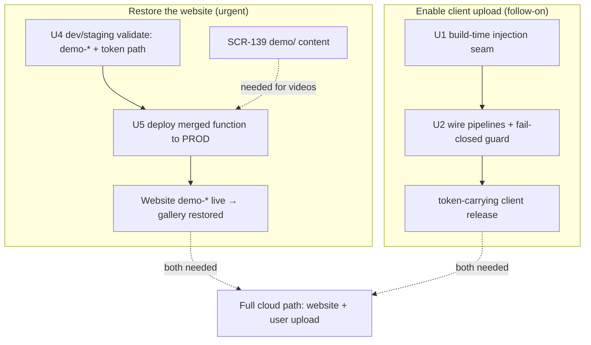

# feat: SCR-137 — deploy the per-user-isolation function (restore the website) + build-time cloud-auth credential injection

## ⚠️ Status update — 2026-06-16 (read first)

The situation changed since this plan was first written. **SCR-138 (the website repoint) shipped**, which both
**unblocks this ticket** and **broke the production website**:

- `screencap-website` is repointed to the new **`demo-*`** actions (commit `b139e59`, `sessions/` routes removed).
  Verified in the sibling repo.
- But the **live prod function `get-upload-urls` is still the OLD code** (no `demo-*` actions), so the website's
  `demo-list` / `demo-sign-download` calls fail → **the public gallery shows no videos.** This is a live incident.
- **SCR-137 itself is not started** — `src/screencap/auth.py:55-56` still carries the `REPLACE_WITH_PROVISIONED_*`
  placeholders. So the cloud-upload OAuth creds were *never* provisioned into any shipped client.

**Two consequences that reshape this plan:**

1. **Deploying the new function to prod is now the priority** (it's the website fix), not a deferred step.
2. **The deploy is now safe** in a way it wasn't framed as before: because the creds are still placeholders, **no
   shipped CLI/app client can sign in or upload to the cloud at all** — so deploying the token-requiring function
   does **not** break any working user-upload flow (there isn't one). The original "flag-day 401s all clients" risk
   is largely moot. What the deploy does: turns the website's `demo-*` actions live (the fix), and lights up the
   `users/{uid}/` upload path *for future* token-carrying releases.

**One hard caveat the next session must verify:** the deploy stops the website *errors*, but the gallery only shows
**videos** once content exists under the `demo/` prefix. The `demo/` migration/promotion (SCR-139 / origin U8–U9)
has **no scripts in the repo yet** — so `demo/` is likely empty, and a freshly-deployed website would render the
empty-gallery placeholder, not videos. **Confirm `gs://<prod-bucket>/demo/` content before declaring the site fixed**
(see U5 + Risks). Full video restoration = this deploy **+** SCR-139 demo content.

---

## Summary

Restore the broken production gallery by deploying the already-merged per-user-isolation signing function to prod
(its public `demo-*` actions are what the repointed website now needs), validated first against the dev function;
and, on a parallel track, get the provisioned (non-secret) OAuth client id + Firebase Web API key into release
binaries via **build-time injection** (placeholders stay in source; nothing credential-looking is committed) so the
CLI/app cloud-**upload** path can work in a future token-carrying release.

---

## Problem Frame

The per-user cloud-storage-isolation track (origin: per-user-cloud-storage-isolation requirements +
[plan](docs/plans/2026-05-29-002-feat-per-user-cloud-storage-isolation-plan.md)) shipped U1–U6: the signing
function now requires a Firebase bearer token on `upload`/`list`/`sign-download`, scopes data to `users/{uid}/…`,
deletes the old `get-index`, and adds tokenless public **`demo-*`** actions reading a `demo/` namespace.

SCR-138 (the website repoint, origin U7) then shipped — `screencap-website` now calls `demo-*` and dropped the
`sessions/` routes. But the new function code was never deployed to prod, so the website calls actions the live
function doesn't have → **the gallery is broken (no videos).** Meanwhile the client cloud-**upload** path has never
worked in a shipped release: `auth.py` still holds `REPLACE_WITH_PROVISIONED_*` placeholders, and a PyInstaller
release doesn't ship the dev `.env`, so no installed client can sign in.

So there are two distinct jobs, now correctly ordered by urgency:

1. **Restore the website (urgent):** deploy the merged function to prod so `demo-*` works (then ensure `demo/`
   has content — SCR-139).
2. **Enable client cloud upload (follow-on):** inject the provisioned creds into release binaries + cut a
   token-carrying release. The website fix does **not** depend on this — the website uses tokenless `demo-*`.

---

## Requirements

- R1. The merged per-user-isolation function is **deployed to prod**, restoring the website's `demo-*` actions
  (no more `demo-list` / `demo-sign-download` failures). *(advances origin R9/R10: the public demo gallery is served.)*
- R2. The prod deploy is **validated first against the dev function / a non-prod bucket** (login → token →
  `verify_bearer` → signed URL → `demo-*` + the token-gated round-trip) so the prod cutover is not the first live test.
- R3. The deploy must **not regress** the origin isolation boundary: `users/{uid}/…` stays token-gated and
  per-user-scoped; `demo-*` stays tokenless and `demo/`-only. *(preserves origin R5/R6/R7 + AE2.)*
- R4. Release binaries carry working OAuth client id + Firebase Web API key **without committing them to source** —
  placeholders stay; values are injected at build time. *(advances origin R2: cloud upload requires a working account.)*
- R5. Dev/test continue to work unchanged via the existing `.env` / env-var override; the test suite still runs
  with placeholders.
- R6. A release build that did **not** receive injected credentials **fails the build** rather than silently
  shipping a placeholder (broken-sign-in) binary.

**Origin actors:** end user (signs in to upload), operator (runs the deploy + provisioning), the macOS app + CLI
(the only auth surface), the public website (tokenless `demo/` consumer — now repointed, SCR-138 done).
**Origin flows:** sign-in (loopback OAuth+PKCE → Firebase), authenticated upload/list/download, public demo read.
**Origin acceptance examples:** AE2 (a cross-user download is indistinguishable from "not found") — must not regress.

---

## Scope Boundaries

- **Not** re-doing GCP provisioning — Identity Platform, the Google provider, the Desktop OAuth client, the
  restricted Web API key, and the signer SA were provisioned 2026-06-04 (runbook "Live execution log"). The
  values live in the gitignored `.env`; this plan only gets them into shipped binaries + does the deploy.
- **Not** the `demo/` content migration/promotion itself — that is **SCR-139** (origin U8–U9). This plan
  **depends on** it for the website to show *videos*, and must verify/coordinate it (U5), but does not build the
  migration scripts.
- **Not** adding a `SCREENCAP_AUTH_ENABLED` flag or a `get-upload-urls-v2` second function — the merged code
  deploys as-is to the existing function (see Key Technical Decisions). No signing-function dual-path code.
- **Not** changing the auth/token logic, `resolve_prefix`, the engine token seam, or the macOS sign-in UI — shipped in U1–U6.
- **Not** cutting the token-carrying client release — that release (which makes the user-upload path usable) is a
  follow-on enabled by U1/U2 here; see Deferred to Follow-Up Work.

### Deferred to Follow-Up Work

- **`demo/` content population (SCR-139 / origin U8–U9):** required for the website to show videos. Likely not done
  (no migration scripts in-repo). Cross-tracked; U5 pre-checks it.
- **Cut a token-carrying client release:** no shipped tag carries `authed_post` (verified absent as of **v0.20.0**);
  producing one runs through this plan's U1/U2 injection machinery, then a normal release. Needed only for the
  client cloud-**upload** path, NOT for the website fix. Track as its own step.
- **mitmdump EFFECT test for `REQUIRED_AUTH_IGNORE_HOSTS`** (U5 carry-forward of the isolation work): SCR-140.
- **Adding the two CI Secrets** (`SCREENCAP_OAUTH_CLIENT_ID` / `SCREENCAP_FIREBASE_API_KEY`): an operator step, documented in U2.

---

## Context & Research

### Relevant Code and Patterns

- `scripts/cloud-function/main.py` — the merged function: tokenless `demo-list`/`demo-sign-download` (dispatched
  before any auth gate), token-gated `upload`/`list`/`sign-download`, `SCREENCAP_BUCKET` parameterizes the bucket,
  `_resolve_project_id()` pins the trusted Firebase project. This is the artifact U4/U5 deploy. Its deploy header is the runbook source.
- `scripts/cloud-function/auth.py` — `verify_bearer` (typed 401-invalid vs 503-unavailable, project-pinned). Unchanged.
- `screencap-website/src/app/_lib/gcs-proxy.ts` — **already repointed** (SCR-138): calls `demo-list` /
  `demo-sign-download`; `CLOUD_FUNCTION_URL` still defaults to prod `get-upload-urls-ld7izzjvga-rj.a.run.app`.
  So once the prod function carries `demo-*`, the website works (given `demo/` content).
- `src/screencap/auth.py:55-56,89-94` — `DEFAULT_*` placeholders + the `_api_key()`/`_oauth_client_id()` resolvers
  (today: `env var > default`). Injection adds a middle layer here.
- `src/screencap/upload.py:52-71` — `SCREENCAP_UPLOAD_URL` env-overridable function URL (default = prod).
  **`download.py:29-34` uses a *separate* env knob, `SCREENCAP_DOWNLOAD_URL` (its own `DEFAULT_DOWNLOAD_URL`,
  also prod) — NOT a duplicate of the same default.** A smoke that sets only `SCREENCAP_UPLOAD_URL` leaves
  sign-download/list on prod; export **both** (or consolidate onto a shared getter).
- `pyinstaller/screencap.spec` — `--onedir` build; `hiddenimports`; `Analysis(pathex=[…/src])`. A generated,
  conditionally-imported module needs an explicit `hiddenimports` entry.
- `.github/workflows/release.yml` — tag-triggered build (clean checkout, no `.env`): `pip install` →
  `pyinstaller …spec` → smoke → GCS upload. `binary-test.yml` (PR build) is currently disabled.
- `.claude/skills/local-release/SKILL.md` — the local PyInstaller build path.
- `macos/Screencap/Scripts/embed-cli.sh` — bundles `dist/screencap/` into the app; the app shells out to the
  bundled CLI, so injecting into the CLI covers the app (no separate Swift injection).
- `docs/runbooks/cloud-auth-setup.md` — provisioning runbook + the existing pre-deploy gate (now being lifted/executed).

### Institutional Learnings

- `docs/solutions/build-errors/pyinstaller-frozen-binary-ci-failures.md`, `…-bootloader-localpycs-version-mismatch.md`
  — frozen-build gotchas; the generated module + hiddenimport must not regress the frozen build (CI smoke covers it).
- Origin plan **Execution Status** + the runbook "Live execution log" — provisioning (steps 1–7) done; the gated
  deploy (step 8) is what this plan now executes.

### External References

- Firebase Web API key is **not a secret** and is safe to embed in clients (Google Firebase docs); a Desktop/native
  OAuth client id is public by RFC 8252 (PKCE is the protection). Shipping them in a binary is fine; injection (vs
  commit) is a keep-it-out-of-git preference, not a security boundary.

### Verified state (2026-06-16)

- SCR-138 done in `screencap-website` (`b139e59`, branch `rutefig/scr-138-u7-…`); `demo-*` calls present, `sessions/` removed.
- Prod website broken: live function lacks `demo-*`.
- `auth.py` placeholders still present (SCR-137 not started).
- No `migrate_*`/`promote_*`/`decommission_*` scripts in `scripts/` → `demo/` likely unpopulated (SCR-139 open).
- `authed_post` absent from `v0.20.0` (latest tag) → no token-carrying client release exists.

---

## Key Technical Decisions

- **Deploy the merged function to the existing prod `get-upload-urls` now** (Sequence/hold's "wait" rationale is
  void — the website is already broken). Safe because placeholder creds mean no shipped client can use the
  token-gated upload path, so deploying breaks no working flow; it restores the tokenless `demo-*` the website needs.
  Still **dev-validate first** (U4) before the prod cutover (U5).
- **No v2 function and no `SCREENCAP_AUTH_ENABLED` flag.** Both existed only to deploy-without-breaking-clients;
  with no functional clients to break, the plain in-place deploy of the already-correct, already-tested code is
  simplest and avoids re-opening the unauthenticated path the migration closed.
- **Website "shows videos" needs `demo/` content (SCR-139), not just the deploy.** The deploy ends the errors and
  yields the empty-gallery placeholder if `demo/` is empty; videos require the demo promotion. Treat as a hard
  pre-check + cross-ticket dependency, not part of this deploy.
- **Credentials = build-time injection via a generated `src/screencap/_provisioned.py`** (gitignored), consulted by
  `auth.py` with precedence **explicit env var > `_provisioned` module > placeholder default**. Per the user's
  decision to keep nothing credential-looking in git. Chosen over rewriting `DEFAULT_*` in a build copy because a
  generated module keeps source pristine + makes precedence unit-testable. *(Honest boundary: the values still ship —
  recoverable, as a `.pyc` in the public release tarball; "inject, don't commit" is a keep-it-out-of-the-repo
  preference, safe only because both values are non-secret by design.)* This track is **independent of the website fix.**
- **Fail-closed build guard.** A release build asserts resolved creds are non-placeholder and fails otherwise — never
  ship a binary whose every sign-in fails.

---

## Open Questions

### Resolved During Planning

- **Deploy gate?** → Deploy in-place now (the original Sequence/hold "wait" is moot; the website is broken).
- **Creds → binary?** → Inject at build time; placeholders stay in source.
- **Is SCR-138 done / is the plan blocked?** → SCR-138 shipped; this plan is unblocked (verified in the website repo).

### Deferred to Implementation

- **Is `gs://<prod-bucket>/demo/` populated?** If not, the deployed website shows an empty gallery — coordinate
  SCR-139 (demo promotion) before/with U5. The next session MUST verify this against live GCS.
- Exact prod bucket the live function uses (`screencap-recordings` vs a staging name) and the dev target names
  (`get-upload-urls-dev` + `screencap-recordings-dev` vs `…-dev-staging` — the deploy header and gcp-migration
  runbook differ). Confirm against live `gcloud functions describe` / bucket inventory at execution.
- Whether to consolidate `download.py`'s separate `SCREENCAP_DOWNLOAD_URL` knob onto `upload.py`'s getter, or keep
  two knobs and have the smoke export both. Either is fine — the smoke must cover both legs.
- Generator location/shape (`scripts/generate_provisioned.py` vs a spec pre-step).

---

## High-Level Technical Design

> *This illustrates the intended approach and is directional guidance for review, not implementation specification.
> The implementing agent should treat it as context, not code to reproduce.*

Two largely-independent tracks; only "full cloud upload works" needs both:



Credential resolution precedence inside `auth.py` (client-upload track):

```
_api_key() / _oauth_client_id():
    1. explicit env var  (SCREENCAP_*)                         ← dev/.env, tests, overrides
    2. screencap._provisioned.<CONST>  (if the module imports) ← release binaries (injected)
    3. REPLACE_WITH_PROVISIONED_* placeholder default          ← source / unconfigured (build guard rejects in release)
```

---

## Implementation Units

> Suggested order for delivery: the **website-restore track (U4 → U5)** is the urgent path; the **client-upload
> track (U1 → U2)** can proceed in parallel or after. U3 (runbook) supports the deploy. U1/U2 do **not** block U5.

### U4. Dev/staging validation smoke (pre-flight for the prod deploy)

**Goal:** Prove the merged function deploys and behaves correctly against a non-prod target before the prod cutover:
`demo-*` actions dispatch, `verify_bearer` accepts a same-project token and rejects a foreign one, and a signed
round-trip works.

**Requirements:** R2, R3

**Dependencies:** None hard (uses dev `.env` creds, already present). Stronger if U1/U2 done, but not required.

**Files:**
- Modify: `docs/runbooks/cloud-auth-setup.md` (or Create: `docs/runbooks/cloud-function-dev-validation.md`) — the smoke procedure.

**Approach:**
- Operator/execution unit (handler logic already covered by `scripts/cloud-function/` unit tests + the CI contract
  test). Deploy the current function code to `get-upload-urls-dev` with `SCREENCAP_BUCKET=<non-prod bucket>` +
  `SCREENCAP_PROJECT_ID=proteus-photos`.
- Point the client at it by exporting **both** `SCREENCAP_UPLOAD_URL=<dev URL>` **and** `SCREENCAP_DOWNLOAD_URL=<dev URL>`
  (separate knobs; setting only upload leaves sign-download/list on prod). Run with the dev `.env` creds.
- Confirm: `demo-list` dispatches (empty list is fine — proves the action exists, not 400); a real Firebase token is
  minted + verified (logs `firebase_admin initialized for project proteus-photos`); same-project token → uid;
  foreign-project token → 401; a `users/{uid}/` upload→list→sign-download round-trip works; upload checksum holds
  after the `google-cloud-storage` 3.x crc32c change; and (one-time) the Web API key is still restricted to Identity
  Toolkit + Token Service (`gcloud`).

**Test scenarios:**
- Test expectation: none — operator-run live smoke; automated coverage exists in `scripts/cloud-function/` tests. Pass/fail = the Confirm list.

**Verification:**
- Against the dev function/non-prod bucket: `demo-*` respond (not 400), the token round-trip succeeds, cross-user/foreign-token denial holds (AE2), checksums verify. Prod untouched.

---

### U5. Deploy the merged function to prod — restore the website

**Goal:** Deploy the per-user-isolation function over the live `get-upload-urls` so the repointed website's `demo-*`
actions work and the gallery is no longer broken.

**Requirements:** R1, R3

**Dependencies:** U4 (validated). External: SCR-139 `demo/` content for *videos* (see pre-check).

**Files:**
- Modify: `docs/runbooks/cloud-auth-setup.md` — record the prod deploy (command, target bucket, verification, rollback) in the "Live execution log".

**Approach:**
- **Pre-check (blocking for "videos", not for "stops erroring"):** verify `gs://<prod-bucket>/demo/` has content.
  If empty, deploying ends the errors but the gallery renders the empty-gallery placeholder — coordinate SCR-139
  (demo promotion) to actually show videos. State the outcome explicitly so the result isn't mistaken for a failed deploy.
- Deploy the current `scripts/cloud-function/` code to the existing prod `get-upload-urls` (gen2, python312,
  `--allow-unauthenticated`, region `southamerica-east1`, the signer SA, `SCREENCAP_BUCKET=<prod bucket>`,
  `SCREENCAP_PROJECT_ID=proteus-photos`) per the deploy header. Safe re: clients: placeholder creds mean no shipped
  client can sign in/upload, so the now-token-gated `users/` actions break no working flow; `demo-*` are tokenless.
- Verify the website renders (gallery loads via `demo-list`; a `demo-sign-download` plays) and the token-gated
  actions reject tokenless calls (the CI contract invariant, live).
- **Rollback:** redeploy the previous (pre-isolation) function revision if `demo-*` or signing misbehaves; no
  recording data is mutated by the function.

**Test scenarios:**
- Test expectation: none — operator deploy + live verification. Pass/fail = the Verification outcomes.

**Verification:**
- The website gallery no longer errors (`demo-*` succeed); a demo recording plays; tokenless `upload`/`list`/`sign-download`
  return 401; if `demo/` was populated, videos show (else the empty-gallery placeholder renders and SCR-139 is the named follow-up).

---

### U1. Build-time credential injection seam (client-upload track)

**Goal:** Provisioned non-secret creds reach release binaries via a gitignored generated module, with placeholders
preserved in source and dev/tests unchanged. *(Not needed for the website fix; required for the CLI/app upload path.)*

**Requirements:** R4, R5

**Dependencies:** None

**Files:**
- Create: `scripts/generate_provisioned.py` — reads `SCREENCAP_OAUTH_CLIENT_ID` + `SCREENCAP_FIREBASE_API_KEY` from
  the environment and writes `src/screencap/_provisioned.py`; exits non-zero if either is missing.
- Create (generated, gitignored): `src/screencap/_provisioned.py`
- Modify: `src/screencap/auth.py` — insert the `_provisioned` layer into `_api_key()`/`_oauth_client_id()`
  (precedence: explicit env > `_provisioned` > placeholder), via a guarded `try: from screencap import _provisioned`.
- Modify: `pyinstaller/screencap.spec` — add `screencap._provisioned` to `hiddenimports`.
- Modify: `.gitignore` — add `src/screencap/_provisioned.py`.
- Test: `tests/test_auth.py`

**Approach:**
- Keep placeholders as the ultimate fallback so the suite + a bare checkout still import.
- The conditional import must catch **`ImportError` narrowly** (not bare `except`): an *absent* module falls back to
  the placeholder cleanly, but a *present-but-malformed* `_provisioned.py` raises loudly rather than silently
  degrading to the placeholder (which the U2 guard might then ship).
- The generator is the single writer of `_provisioned.py`; never hand-edit it.

**Patterns to follow:**
- The existing `env var > default` resolver shape in `auth.py:89-94`; the `SCREENCAP_UPLOAD_URL` env-override idiom.

**Test scenarios:**
- Happy path: with `_provisioned` present and no env var, the resolvers return the provisioned values.
- Edge case: `_provisioned` absent → resolvers return the placeholders (no ImportError surfaced).
- Edge case: `_provisioned` present-but-malformed → raises (not a silent placeholder fallback).
- Precedence: an explicit env var overrides both `_provisioned` and the placeholder.
- Generator happy path: with both env vars set, it writes a module whose constants equal the env values.
- Generator error path: with either env var missing, it exits non-zero and writes nothing.

**Verification:**
- `pytest tests/test_auth.py` green; precedence holds in all states; the suite passes with no `_provisioned.py` on disk.

---

### U2. Wire injection into the release pipelines + fail-closed build guard

**Goal:** CI and local-release inject creds before `pyinstaller`, and a release build that still resolves to a
placeholder **fails** instead of shipping a broken-sign-in binary.

**Requirements:** R4, R6

**Dependencies:** U1

**Files:**
- Modify: `.github/workflows/release.yml` — add a "Generate provisioned credentials" step (running
  `scripts/generate_provisioned.py`) **before** "Build frozen binary", sourcing two new GitHub Secrets; add a
  post-build "Verify provisioned creds" assertion on the built binary.
- Modify: `.claude/skills/local-release/SKILL.md` — document exporting the two values (from `.env` / shell) before
  the local build, and that the guard enforces non-placeholder.
- Modify: `src/screencap/cli/__init__.py` — add a hidden `_auth-config-check` (or extend `_smoke-test`) that exits
  non-zero when resolved creds are the `REPLACE_WITH_PROVISIONED_*` sentinels; invoked by the release build job.
- Test: `tests/test_cli.py`

**Approach:**
- Generation runs after `pip install -e` (so `src/screencap/` imports) and before `pyinstaller`. The guard runs
  against `./dist/screencap/screencap` to prove the **bundled** binary.
- Scope the guard to **release/tag builds** (PR builds have no secrets, stay green with placeholders). Gate on the
  tag-build context (or a `SCREENCAP_RELEASE_BUILD=1` marker). If that marker can't be determined on a tag build,
  the guard **fails closed** (treats it as a release and enforces) — this single tag-build assertion is the only
  enforcement, so it must not be skippable.
- Document (don't automate) the operator step of adding the two repository Secrets.

**Patterns to follow:**
- The existing `release.yml` smoke steps + the hidden `_smoke-test` subcommand convention.

**Test scenarios:**
- Happy path: `_auth-config-check` exits 0 when creds resolve to non-placeholder values (env-injected in the test).
- Error path: it exits non-zero when the resolved values are the `REPLACE_WITH_PROVISIONED_*` sentinels.
- Edge case: with `SCREENCAP_RELEASE_BUILD` unset, a placeholder build does **not** fail the check (PR/dev builds stay green).

**Verification:**
- A simulated release build with secrets set produces a binary that passes the guard; with secrets unset, the
  tag-build guard fails. Non-release CI stays green with placeholders.

---

### U3. Write the deploy + cutover runbook

**Goal:** Capture the prod deploy that restores the website, the dev-validate-first sequence, the `demo/`-content
dependency, the (now-safe) client-impact analysis, and rollback — as the durable record (no IaC exists).

**Requirements:** R1, R2, R3

**Dependencies:** None (doc); informs U4/U5.

**Files:**
- Modify: `docs/runbooks/cloud-auth-setup.md` — replace the "hold indefinitely" pre-deploy gate with: the
  confirmed SCR-138-done status, the dev-validate-first → prod-deploy sequence, the `demo/`-content pre-check
  (cross-ref SCR-139), the why-it's-safe note (placeholder creds → no upload clients), verification, and rollback.
- Modify: `scripts/cloud-function/main.py` — update the deploy-header PRE-DEPLOY GATE comment: SCR-138 shipped,
  dev-validate then deploy to prod, `demo/` content is a separate prerequisite for videos.

**Approach:**
- The runbook is the source of truth; the `main.py` header points to it. The earlier "wait for a token-carrying
  release" framing applies only to the client-**upload** path, not the website fix — say so explicitly so the next
  operator doesn't re-block the website on the release.

**Test scenarios:**
- Test expectation: none — documentation/runbook; the deploy is an operator step (U5).

**Verification:**
- The runbook + header unambiguously describe the deploy that fixes the website, its `demo/` dependency, and rollback;
  no stale "do not deploy" language remains.

---

## System-Wide Impact

- **Interaction graph:** the prod function deploy affects the website (tokenless `demo-*`, now repointed) and any
  token-gated client (none functional yet — placeholder creds). `auth.py` resolvers feed `login`/`whoami`/`get_id_token`
  → `authed_post` → upload/download/engine (client-upload track). The macOS app inherits via the embedded CLI.
- **Error propagation:** deploying with no `demo/` content → website renders the empty-gallery placeholder (not an
  error) — distinguish "deploy succeeded, content pending (SCR-139)" from "deploy failed". Silent cred-injection
  failure → placeholder binary → all sign-in fails (caught by the U2 build guard).
- **API surface parity:** two client function-URL knobs — `SCREENCAP_UPLOAD_URL` (`upload.py`) and
  `SCREENCAP_DOWNLOAD_URL` (`download.py`); the U4 smoke must export both, else the download leg stays on prod.
  Optional cleanup: consolidate onto a shared getter. The website is a separate consumer (its own `CLOUD_FUNCTION_URL`).
- **Integration coverage:** U4/U5 live verification covers the token→verify→sign→GCS round-trip + `demo-*` dispatch
  that unit mocks can't.
- **Unchanged invariants:** `resolve_prefix` namespace boundary, the in-code auth gate + CI contract test, the engine
  out-of-band token seam, ungated local recording (origin R3). The deploy ships the already-merged code unchanged — no dual path.

---

## Risks & Dependencies

| Risk | Mitigation |
|------|------------|
| Website still shows no **videos** after the deploy because `demo/` is empty (SCR-139 not done) | U5 pre-checks `gs://<prod-bucket>/demo/`; report "deploy OK, content pending (SCR-139)" vs "deploy failed"; coordinate SCR-139 |
| Prod deploy misbehaves (`demo-*` or signing) | U4 dev-validate first; U5 documents an immediate rollback to the previous function revision (no data mutated) |
| Wrong prod bucket / dev target names (header vs gcp-migration runbook differ) | Confirm live via `gcloud functions describe` + bucket inventory before U4/U5 (Open Question) |
| Cred injection silently no-ops (missing secret) → ship a placeholder binary | U2 fail-closed build guard asserts non-placeholder on the **built binary**; release fails otherwise |
| Generated `_provisioned` not traced by PyInstaller, or a present-but-malformed module silently falls back | `hiddenimports` entry + narrow `ImportError` catch (U1) + the U2 guard as the net |
| Smoke sets only `SCREENCAP_UPLOAD_URL` → download leg silently hits prod | U4 exports **both** knobs (or consolidate first) |
| Client cloud-**upload** still unusable after this plan (no token-carrying release) | Expected — that release is the named follow-on (U1/U2 + a release); it does NOT gate the website fix |

**External dependencies:** **SCR-139** (`demo/` promotion) for website *videos*; two **GitHub Secrets** for the
client-release build (U2). SCR-138 (website repoint) is **done**.

---

## Documentation / Operational Notes

- `docs/runbooks/cloud-auth-setup.md` is the source of truth — U3 rewrites the gate into the deploy procedure; U4/U5
  record the dev + prod deploys in the "Live execution log".
- Operator one-time setup (client track): add `SCREENCAP_OAUTH_CLIENT_ID` + `SCREENCAP_FIREBASE_API_KEY` as repository
  Secrets; for local-release, export them before building.
- Coordinate with **SCR-139** so the website shows videos, not just an empty gallery, after U5.

---

## Sources & References

- **Origin document:** [docs/brainstorms/2026-05-29-per-user-cloud-storage-isolation-requirements.md](docs/brainstorms/2026-05-29-per-user-cloud-storage-isolation-requirements.md)
- **Origin plan:** [docs/plans/2026-05-29-002-feat-per-user-cloud-storage-isolation-plan.md](docs/plans/2026-05-29-002-feat-per-user-cloud-storage-isolation-plan.md) (Execution Status)
- **Provisioning runbook:** [docs/runbooks/cloud-auth-setup.md](docs/runbooks/cloud-auth-setup.md)
- **Handoffs:** [docs/todos/feat/per-user-cloud-storage-isolation/000-handoff.md](docs/todos/feat/per-user-cloud-storage-isolation/000-handoff.md), [docs/todos/feat/per-user-cloud-storage-isolation/001-deploy-sequencing-auth-required.md](docs/todos/feat/per-user-cloud-storage-isolation/001-deploy-sequencing-auth-required.md)
- **Linear:** SCR-137 (this); SCR-138 (website repoint — **done**); SCR-139 (`demo/` migration — needed for videos); SCR-140 (mitmdump EFFECT test)
- **Website (sibling repo):** `screencap-website` `src/app/_lib/gcs-proxy.ts` (repointed to `demo-*`, verified 2026-06-16, commit `b139e59`)
- Code: `scripts/cloud-function/main.py`, `src/screencap/auth.py`, `src/screencap/upload.py` + `download.py`, `pyinstaller/screencap.spec`, `.github/workflows/release.yml`
