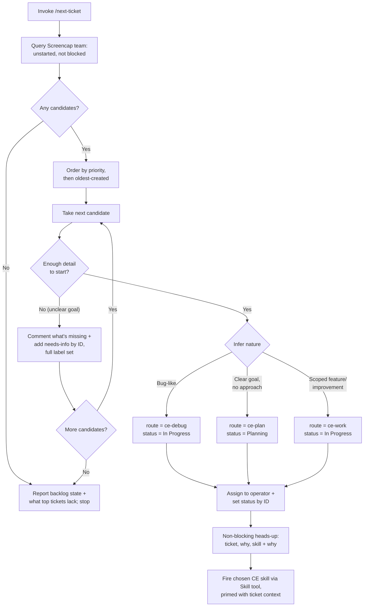

# feat: Next-ticket launcher skill (Linear → ce-work/ce-debug/ce-plan)

## Summary

Author a single-file project skill at `.claude/skills/next-ticket/SKILL.md` that picks the highest-priority ready-to-start Linear ticket on the Screencap team, claims it (assign + status), infers whether it's a bug / feature / needs-planning, and fires the matching Compound Engineering skill (`ce-debug` / `ce-work` / `ce-plan`) in-session via the `Skill` tool — flagging too-thin tickets with `needs-info` as it passes them. Verification is a live dry-run against the board, since the artifact is prose instructions, not executable code.

---

## Problem Frame

Starting the next piece of work is a manual, repetitive ritual today — scan the Linear backlog, eyeball priority, judge if the top ticket is actionable, decide bug-vs-feature, move it to In Progress, assign it, then open the right CE skill and re-explain the ticket. The glue is what's tedious; the operator wants to keep their hands on the actual implementation. Full pain narrative and product rationale live in the origin doc (see Sources & References).

---

## Requirements

Carried from the origin requirements doc; R-IDs match origin.

**Selection & eligibility**
- R1. Query open Screencap-team tickets; candidates = unstarted (Backlog/Todo) and not labeled `blocked`.
- R2. Order candidates by Linear priority (Urgent→High→Medium→Low→None); tie-break oldest-created.
- R3. Walk candidates in order; read each and judge "enough detail to start"; first sufficiently-detailed one is the pick.
- R4. Exactly one ticket per invocation; stop after handing off.

**Thin-ticket & empty handling**
- R5. Too-thin candidate → brief comment naming what's missing + apply `needs-info`, then continue.
- R6. No eligible candidate → no pick; report backlog state and what each top ticket is missing.

**Routing**
- R7. Infer ticket nature by reading title + description, independent of category labels.
- R8. Bug-like → `ce-debug`; well-scoped feature/improvement → `ce-work`.
- R9. Clear goal but no worked-out approach → `ce-plan` (advise planning) instead of `ce-work`.

**Linear state & handoff**
- R10. Before handoff: assign to operator; set status to match routing (In Progress for work/debug, Planning for plan).
- R11. Emit a brief, non-blocking heads-up (which ticket, why, which skill + why), then proceed — no confirmation gate.
- R12. Open the chosen CE skill primed with the ticket's context so the operator drives immediately.

**Origin actors:** A1 (Operator), A2 (Launcher skill), A3 (Linear / Screencap team), A4 (CE skills: ce-debug/ce-work/ce-plan)
**Origin flows:** F1 (pick and launch — happy path), F2 (skip thin / nothing eligible)
**Origin acceptance examples:** AE1 (covers R5), AE2 (covers R6), AE3 (covers R9, R10), AE4 (covers R8, R10)

---

## Scope Boundaries

- No full autopilot — the skill never implements or opens a PR itself; the operator drives once a CE skill opens.
- No `ready-for-agent` label gate — eligibility is judged from status + readiness, not a curated label.
- No multi-ticket loop or queue within one run.
- Does not touch or replace the file-based `list-tickets` / `docs/tickets/` workflow.
- No rollback / un-pick logic if work is later abandoned.
- Screencap team only (other Linear teams out).

### Deferred to Follow-Up Work

- **Dry-run / preview mode** (`/next-ticket --dry-run` or similar): show the pick, routing, and intended Linear mutations without writing them. Optional safety enhancement — by R11 the skill mutates the board before handoff with no confirm gate, so a preview is the natural mitigation if that proves uncomfortable in practice.
- **Specific-ticket arg** (`/next-ticket SCR-123`): bypass selection and claim+route a named ticket.
- **`/ce-compound` capture** of the skill-authoring + Linear-MCP learnings (label-ID/replace-not-append, status IDs, deprecated `/sse`, Skill-tool handoff) once the skill lands — this is greenfield for `docs/solutions/`.

---

## Context & Research

### Relevant Code and Patterns

- **Project skill convention** — single `SKILL.md` per skill, no `references/` subdir. Mirror `.claude/skills/list-tickets/SKILL.md` (closest analog — also a ticket-surfacing skill), `.claude/skills/track-decision/SKILL.md` (inline templates + `## Examples`), and `.claude/skills/capture-test/SKILL.md` (multi-step interactive flow). Frontmatter is `name` + `description` only; description ends with a `Triggers on "..."` quoted-phrase list.
- **CE skill argument contracts** — all accept free-text `#$ARGUMENTS`: `ce-debug` ← `<bug_description>` (treats a description of broken behavior as the problem statement; fetches Linear refs when given an ID/URL); `ce-work` ← `<input_document>` (bare-prompt branch triages and routes); `ce-plan` ← `<feature_description>`. So the launcher passes the ticket's title + description (+ comments for bugs) as the argument.
- **Skill-to-skill handoff** — the `Skill` tool, fired in-session. Precedent: `ce-plan`'s handoff ("Invoke the `ce-work` skill via the platform's skill-invocation primitive … fire the invocation now") and `lfg`'s programmatic chaining. Name-resolution caveat (from `lfg`): resolve the skill name against the session's available-skills list before calling — it may be namespaced (e.g., `compound-engineering:ce-work`).

### Institutional Learnings

- `docs/solutions/` has **no** prior learning on skill authoring, Linear MCP, or triage workflow — greenfield (confirmed by full-corpus scan).
- Project memory (authoritative for Linear IDs/conventions):
  - `reference_linear_screencap.md` — team ID `f3bbac41-0ec3-4f2e-ae0b-96fed6ff624f`; statuses Backlog/Todo (unstarted), **Planning** `86961642-…`, **In Progress** `a39dab47-…`; labels **`needs-info`** `f0c57f6c-…`, **`blocked`** `cc921db6-…`.
  - `feedback_linear_label_ids.md` — **use label IDs, not names** (case-collision duplicates), and the `labels` field **replaces the whole set** (no append). Directly shapes R5.
  - `feedback_no_false_preference_attribution.md` — when the skill states *why* it picked a route, don't assert a rationale the ticket/user didn't provide.

### External References

- None. The patterns are all local (existing skills, available MCP tool schemas); external research added no value and was skipped.

---

## Key Technical Decisions

- **Work route targets `ce-work`** (user decision): the launcher can reliably fire `ce-work` via the `Skill` tool, preserving hands-off launch. `ce-work-beta` (memory-preferred) is `disable-model-invocation: true` and not programmatically invocable, so it was rejected for the automated path; the operator can re-run as beta manually.
- **Routing by reading, not labels** (origin R7): the skill infers bug/feature/plan from title + description. Category labels (`Bug`/`Feature`/`Improvement`) are not the routing input — they matter only for triage hygiene.
- **Three-way readiness rubric** resolves the origin's `Affects R3` question by distinguishing skip from plan: *unclear goal* (can't tell what "done" is) → skip + `needs-info`; *clear goal, unclear approach* → `ce-plan`; *clear goal + clear approach* → `ce-work`/`ce-debug`.
- **Linear writes use IDs and full-set label replacement**: status set by status ID; `needs-info` applied by reading the ticket's current labels and re-submitting the complete set + `needs-info` ID (never name, never append).
- **Tie-break = oldest-created** within a priority band (origin `Affects R2`, low stakes): work the backlog FIFO so old high-priority items don't get perpetually skipped by newer ones.
- **No confirmation gate** (origin R11): a non-blocking heads-up precedes handoff; the skill announces and proceeds.

---

## Open Questions

### Resolved During Planning

- *Handoff mechanism (origin Affects R12)*: the `Skill` tool, fired in-session, name resolved against the available-skills list.
- *"Enough detail to start" boundary (origin Affects R3)*: the three-way rubric above.
- *Tie-break (origin Affects R2)*: oldest-created.
- *Work-skill target*: `ce-work` (see Key Technical Decisions).

### Deferred to Implementation

- **Exact Linear MCP query shape** for "unstarted + not-`blocked` + ordered by priority": whether filtering/ordering happens in the `list_issues` query args or in post-fetch logic depends on the live connector's supported filter/sort params. Confirm against `mcp__plugin_product-management_linear__list_issues` at authoring time; fall back to fetch-then-sort if server-side sort is unavailable.
- **How many candidates to fetch/inspect per run** before declaring "nothing eligible" (R6) — a sensible page size vs. walking the whole backlog. Decide against real board size during the dry-run.
- **Whether comments are needed for routing** — pulling the full comment thread (as `ce-debug` likes) adds calls; decide if title+description suffice for the inference or if comments materially help.
- **Current-user (assignee) resolution** — confirm whether the connector exposes a viewer/"me" lookup for the assign write (U5); if absent, the operator's Linear user ID is supplied once and cached. Verify the live write-tool surface (status, assignee, label, comment) at authoring time, not just the query surface.

---

## High-Level Technical Design

> *This illustrates the intended approach and is directional guidance for review, not implementation specification. The implementing agent should treat it as context, not code to reproduce.*

---

## Implementation Units

All five units compose the one `.claude/skills/next-ticket/SKILL.md` file and will most likely land in a single commit. They are decomposed by behavior for authoring clarity and per-section verification, not as separate commits. The skill is a **prose instruction artifact**, so units carry `Test expectation: none` with the reason; correctness is proven by the live dry-run in U5's verification and the System-Wide Impact acceptance walk.

### U1. Skill scaffold, frontmatter, and arg handling

**Goal:** Create the skill file and its shell — frontmatter, trigger description, top-level structure, and `## Handling Args`.

**Requirements:** R4 (one ticket per invocation framing)

**Dependencies:** None

**Files:**
- Create: `.claude/skills/next-ticket/SKILL.md`

**Approach:**
- Frontmatter: `name: next-ticket`; `description` covering what it does + when + a `Triggers on "next ticket", "what's next", "pick a ticket", "start next work", "grab a ticket"` phrase list.
- H1 title + one-line purpose; `## Instructions` with `### Step N` sections (Steps map to U2–U5); `## Handling Args` (default `/next-ticket` = pick next; note the deferred `SCR-123` / `--dry-run` variants as "not yet supported"); `## Error Handling`.
- State the Linear connector and team scope up front (Screencap team only); reference reading the project's Linear IDs rather than blindly trusting hardcoded values.

**Patterns to follow:**
- `.claude/skills/list-tickets/SKILL.md` (structure, args section), `.claude/skills/capture-test/SKILL.md` (multi-step interactive flow), `.claude/skills/track-decision/SKILL.md` (inline templates).

**Test scenarios:**
- `Test expectation: none` — scaffolding/prose; behavior is verified through U2–U5 and the U5 dry-run.

**Verification:**
- File exists at the path; frontmatter parses; the skill is discoverable/triggerable by the listed phrases.

### U2. Candidate selection — query, filter, order

**Goal:** Author the step that queries the Screencap board and produces the ordered candidate list.

**Requirements:** R1, R2

**Dependencies:** U1

**Files:**
- Modify: `.claude/skills/next-ticket/SKILL.md`

**Approach:**
- Query open issues for team `f3bbac41-…` via `mcp__plugin_product-management_linear__list_issues`; keep only unstarted statuses (Backlog/Todo) and exclude any with the `blocked` label.
- Order by numeric priority (1=Urgent…4=Low, 0=None — note that 0 sorts *last*, not first), then oldest-created within a band.
- Document the fallback: if the connector can't filter/sort server-side, fetch then filter/sort locally (see Deferred to Implementation).

**Patterns to follow:**
- `list-tickets` priority-sort ordering (urgent→unset); Linear IDs from `reference_linear_screencap.md`.

**Test scenarios:**
- `Test expectation: none` — verified live in U5 (the picked ticket is the genuinely highest-priority eligible one; blocked/started tickets never appear).

**Verification:**
- On a board with a known top ticket, the skill's candidate order matches a hand-check; `blocked` and already-started tickets are absent.

### U3. Readiness triage — thin-skip, flagging, empty case

**Goal:** Author the readiness judgment, the `needs-info` flag-and-continue behavior, and the nothing-eligible report.

**Requirements:** R3, R5, R6

**Dependencies:** U2

**Files:**
- Modify: `.claude/skills/next-ticket/SKILL.md`

**Approach:**
- Encode the rubric: *unclear goal / can't tell what "done" is* → too thin → skip; (clear-goal cases proceed to U4 routing, including the plan branch).
- Flag-and-continue: leave a brief comment naming the missing pieces, then apply `needs-info`. **Label-write mechanics (load-bearing):** the candidate query returns label *names*, not IDs, but the write path needs IDs and *replaces* the whole set. So resolve each of the ticket's current label names back to its canonical ID (via the labels listing, preferring the capitalized category IDs over the lowercase duplicates) and re-submit the **complete ID set + the `needs-info` ID** — never echo names, never append. Then advance to the next candidate.
- Empty case: when no candidate qualifies, make no pick, apply no status, and report the backlog state + what each top ticket lacks.
- Caution (per `feedback_no_false_preference_attribution.md`): the "what's missing" comment states observable gaps, not invented rationale.

**Patterns to follow:**
- `feedback_linear_label_ids.md` (label-ID + full-set replacement) — load-bearing here.

**Test scenarios:**
- `Covers AE1.` `Test expectation: none` (prose) — verified live: a title-only ticket gets a missing-detail comment + `needs-info` (existing labels preserved), then the skill moves on.
- `Covers AE2.` Verified live: with all candidates thin, the skill makes no pick, sets no status, and reports each top ticket's gaps.

**Verification:**
- Live dry-run on a deliberately thin ticket shows the comment + `needs-info` applied with prior labels intact and the next candidate taken; an all-thin board produces the report with no mutations beyond the `needs-info` flags.

### U4. Routing inference — debug / work / plan

**Goal:** Author the step that reads the picked ticket and decides the route.

**Requirements:** R7, R8, R9

**Dependencies:** U3

**Files:**
- Modify: `.claude/skills/next-ticket/SKILL.md`

**Approach:**
- Infer from title + description (independent of category labels): broken/unexpected behavior, regression, error/stack-trace, reproduction → **bug → ce-debug**; clear goal but non-obvious approach (multi-component, architectural choice, "design/investigate/spike") → **ce-plan**; clear goal + obvious implementation path → **ce-work**.
- Resolve the downstream skill name against the session's available-skills list before the U5 handoff (it may be namespaced).

**Patterns to follow:**
- `ce-debug` / `ce-work` / `ce-plan` Phase 0 triage descriptions (what each treats as valid input).

**Test scenarios:**
- `Covers AE4 (route half).` `Test expectation: none` (prose) — verified live: a defect ticket with repro routes to `ce-debug`.
- `Covers AE3 (route half).` Verified live: a clear-goal/no-approach ticket routes to `ce-plan`.
- Verified live: a scoped feature routes to `ce-work`.

**Verification:**
- Across one ticket of each kind, the chosen route matches expectation and the rationale cites only ticket-stated facts.

### U5. Claim and hand off — assign, set status, heads-up, fire skill

**Goal:** Author the terminal step that claims the ticket in Linear and launches the CE skill.

**Requirements:** R4, R10, R11, R12

**Dependencies:** U4

**Files:**
- Modify: `.claude/skills/next-ticket/SKILL.md`

**Approach:**
- Assign the ticket to the operator and set status **by ID**: In Progress (`a39dab47-…`) for work/debug, Planning (`86961642-…`) for plan. **Resolving the operator's user ID**: confirm at authoring time whether the connector exposes a viewer/"me" lookup (the official Linear MCP documents one); if it does, use it. If it doesn't, fall back to the operator supplying their Linear user ID once, cached in the skill/memory — name this fallback explicitly so the assign step is implementable either way.
- **Verify before handoff**: confirm the assign and status writes actually succeeded (check the connector responses). If either failed (auth lapse, connector error), surface the error and **halt — do not fire the CE skill** against a ticket whose state didn't change. This is the System-Wide Impact error-propagation constraint made concrete.
- Emit the non-blocking heads-up: which ticket, why it was picked, which skill is launching and why — then proceed without a confirm gate.
- Fire the chosen CE skill via the `Skill` tool, passing the ticket context as the free-text argument (title + description; + comment thread for `ce-debug`). Explicitly instruct: fire it now, do not merely tell the user to type the command. Then stop (R4 — no further tickets).

**Patterns to follow:**
- `ce-plan` plan-handoff invocation language ("fire the invocation now"); `lfg` skill-name resolution caveat.

**Test scenarios:**
- `Covers AE4.` `Test expectation: none` (prose) — verified live: a bug pick ends with status In Progress + `ce-debug` opened with the ticket.
- `Covers AE3.` Verified live: a plan pick ends with status Planning + `ce-plan` opened.
- Verified live: assignee is set to the operator; the heads-up appears before the skill opens; only one ticket is processed.

**Verification:**
- End-to-end dry-run: pick → board shows correct assignee + status → heads-up printed → the correct CE skill opens primed with the ticket → the skill stops (does not pick a second ticket).

---

## System-Wide Impact

- **Interaction graph:** The skill writes to the live Linear board (status, assignee, comments, labels) and invokes other skills in-session. Its blast radius is the Screencap Linear team + the current Claude session.
- **Error propagation:** If a Linear write fails (auth lapse, connector error), the skill must surface it and stop *before* handoff rather than launching a CE skill against a ticket whose state didn't actually change. Handle the deprecated `/sse` connector being unavailable by relying on `plugin:product-management:linear`.
- **State lifecycle risks:** R11's no-confirm design means a wrong pick mutates the board before the operator can intervene — assignee/status/labels change first. Partial-failure ordering matters: prefer assign + status as the last writes before handoff so a thin-ticket flag (`needs-info`) on a skipped ticket can't be confused with a claim.
- **API surface parity:** None — single skill, no shared interface.
- **Integration coverage:** The label replace-not-append behavior and status-by-ID are exactly the cross-layer behaviors a dry-run must prove (mocks won't); cover them on the real board.
- **Unchanged invariants:** `list-tickets` and the `docs/tickets/` file workflow are untouched; this skill is additive and Linear-native.

---

## Risks & Dependencies

| Risk | Mitigation |
|------|------------|
| No-confirm heads-up (R11) mutates the board on a wrong pick before the operator can stop it | Make assignee/status the final writes before handoff; surface the deferred dry-run mode as the mitigation if discomfort shows in practice |
| Linear label write clobbers existing labels (replace-not-append) | Always read current labels and re-submit the full set + `needs-info` by ID — called out explicitly in U3 |
| Priority encoding foot-gun (0 = None must sort last, not first) | Explicit ordering note in U2 |
| Connector tool surface differs from memory (legacy vs `plugin:product-management:linear`) | Confirm tool names/filters live at authoring time; fetch-then-sort fallback (Deferred to Implementation) |
| Downstream skill name not resolvable (namespacing) | Resolve against the available-skills list before firing (U4/U5) |

---

## Documentation / Operational Notes

- After the skill lands and is dry-run-validated, capture the reusable learnings (Skill-tool handoff, Linear label-ID/replace-not-append, status IDs, deprecated `/sse`) via `/ce-compound` — first entry in the skill-authoring / Linear-MCP domain for `docs/solutions/`.
- No CLAUDE.md or skills-index update needed — project skills are auto-discovered.

---

## Sources & References

- **Origin document:** [docs/brainstorms/2026-06-18-linear-next-ticket-launcher-skill-requirements.md](docs/brainstorms/2026-06-18-linear-next-ticket-launcher-skill-requirements.md)
- Pattern skills: [.claude/skills/list-tickets/SKILL.md](.claude/skills/list-tickets/SKILL.md), [.claude/skills/track-decision/SKILL.md](.claude/skills/track-decision/SKILL.md), [.claude/skills/capture-test/SKILL.md](.claude/skills/capture-test/SKILL.md)
- CE skill contracts (by name; resolve in-session): `ce-debug`, `ce-work`, `ce-plan`
- Linear conventions: project memory `reference_linear_screencap.md`, `feedback_linear_label_ids.md`, `feedback_no_false_preference_attribution.md`
- Linear ops behavioral reference: [docs/todos/linear-board-sync/000-handoff.md](docs/todos/linear-board-sync/000-handoff.md)
