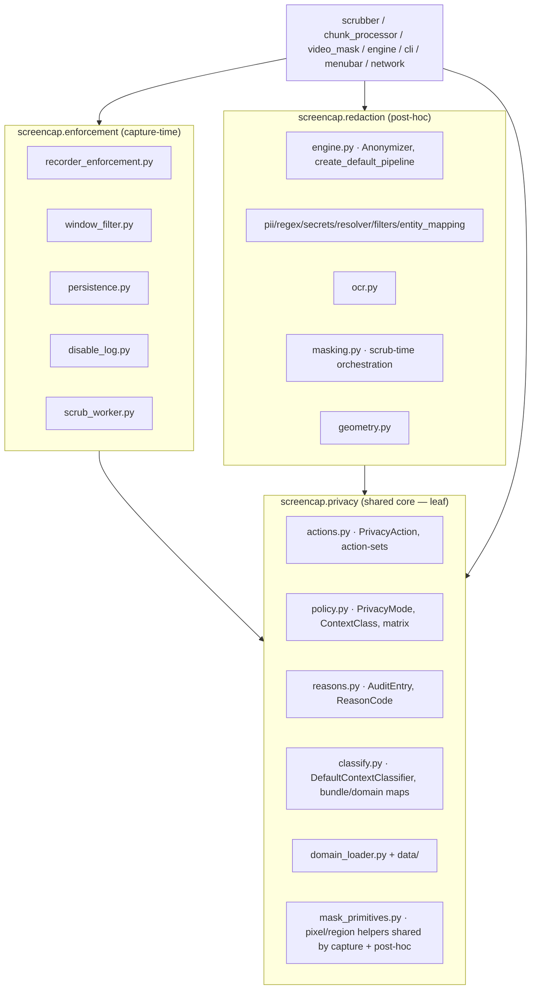

# refactor: Split `privacy/` into shared core, capture-time enforcement, and post-hoc redaction (SCR-33)

## Summary

Split the monolithic `src/screencap/privacy/` package (19 modules + a bundled `data/` dir, ~5,500 lines) into **three sibling packages** that form a clean dependency DAG: a slimmed `screencap.privacy` holding only the **shared privacy-model vocabulary** (policy matrix, context classifier, action enum, audit types, domain index); a new `screencap.enforcement` for **capture-time enforcement** (the live per-event filter and its menubar-disable sidecars); and a new `screencap.redaction` for the **post-hoc detection + masking pipeline** (the standalone NLP/secrets engine, OCR, and image masking). Both halves depend on the shared core; neither depends on the other. This kills the central wart — importing a small enum like `PrivacyAction` currently drags in the 488-line detection engine `__init__.py` first — and gives the recording engine and the scrub pipeline each a self-contained module to import.

---

## Problem Frame

Two unrelated subsystems share one package and one vocabulary, and importing either drags in the other. The package's `__init__.py` (488 lines) **is** the standalone string-detection engine (`EntityType`, `Anonymizer`, `create_default_pipeline`, the GLiNER/Presidio/detect-secrets stack), so any consumer doing `from screencap.privacy import ...` pays for the whole detection surface even when it only wants the `PrivacyAction` enum used on the capture-time fast path. The capture-time enforcement state machine (runs on every window event) sits conceptually next to a heavy post-hoc NLP pipeline (runs only during scrubbing), and their tests cross-contaminate fixtures. SCR-33 calls for a "deepening by separation."

**A premise in the ticket does not hold.** SCR-33 assumes the package shares "only `PrivacyAction` and `AuditEntry`" and proposes a clean two-way cut (`privacy/` = capture, `redaction/` = detection). Import-graph research (below) shows `policy.py` and `context.py` are imported by **both** the capture path *and* the scrub path — and also by `network/`, `cli/`, `config.py`, `setup_wizard`, `app_discovery`. They are irreducibly **shared vocabulary**, so a faithful split is three zones, not two. This plan adopts the three-package shape.

---

## Requirements

- R1. Importing a small shared symbol (e.g. `screencap.privacy.actions.PrivacyAction`, `PrivacyMode`) must **not** import the heavy detection/NLP engine. The 488-line engine module is no longer the package's `__init__`.
- R2. The post-hoc detection + redaction pipeline lives in a self-contained `screencap.redaction` package the scrub pipeline imports as one unit. It keeps zero non-shared `screencap.*` coupling except a one-way dependency on the shared core.
- R3. Capture-time enforcement lives in a self-contained `screencap.enforcement` package the recording engine imports. It carries no NLP/ML import surface (preserves the bundled-binary constraint — keep `transformers`/`torch` out of the capture path; see origin SCR-28 learning).
- R4. The shared vocabulary (`PrivacyAction` + action-set constants, `PrivacyMode`/`ContextClass`/policy matrix, the context **classifier** + bundle/domain maps, `AuditEntry`/`ReasonCode`, the domain index) lives in a package owned by **neither** half. The runtime import graph is a DAG: `privacy ← enforcement`, `privacy ← redaction`, and **no** `enforcement ↔ redaction` edge.
- R5. The SECURITY.md capture-time-blocking vs post-hoc-masking trust boundary is preserved verbatim in behavior. The fail-closed scrub contract (a detection/scrub init-or-run failure blocks upload **and** blocks local-file deletion) keeps a single unambiguous owner across the new boundary.
- R6. The full test suite stays green at every unit. Every Vision-gated `@pytest.mark.privacy` masking guard is run locally (pyobjc-Vision installed) before and after each move and never lapses to `xfail` (origin learning: a prior scrubber refactor leaked precisely this way).
- R7. Packaging continues to resolve: the `[tool.setuptools.package-data]` blocklist globs and the bundled-binary build still find the `data/` files and the two new packages.

**Origin actors:** n/a (internal refactor; no end-user-facing actors).
**Origin flows:** Capture-time enforcement flow (per-window-event filtering during recording); Post-hoc scrub flow (chunk processing → detection → masking → export).
**Origin acceptance examples:** n/a (no requirements doc; this plan is sourced from Linear SCR-33).

---

## Scope Boundaries

- **No behavior change.** This is a pure move/rename refactor. No detection logic, policy matrix, masking algorithm, or enforcement decision changes. A frame masked before is masked identically after.
- **No detection-backend changes.** GLiNER-ONNX NER + regex + detect-secrets stay exactly as-is (origin SCR-28 ratified this); the 6-type `EntityType` contract is unchanged.
- **No `scrubber.py` collapse.** The "scrubbing-collapse" alternative named in the ticket (fold detection into `scrubber.py`) is explicitly rejected (see Alternatives). `scrubber.py`, `chunk_processor.py`, `pipeline_stages.py`, and `terminal_stage.py` keep their current responsibilities; they only update import paths.
- **No new public CLI/daemon/API surface.** Internal package boundaries only.

### Deferred to Follow-Up Work

- **Internal carving of `redaction/` engine into `types.py` + `pipeline.py`** beyond what R1 needs (keeping `__init__` light) is optional polish — do it if it falls out naturally, otherwise a follow-up.
- **Renaming `enforcement.scrub_worker`** to something that does not collide with the post-hoc "scrub" vocabulary (it is a capture-time row-deletion sidecar, not a text scrubber) — nice-to-have, deferred to avoid widening this diff.
- **Institutional-learning capture** (`/ce-compound`) on import-graph untangling / deferred-import handling / shared-enum placement — the learnings researcher found the knowledge base is silent on these; capture once this lands.

---

## Context & Research

### Relevant Code and Patterns

Per-module target zone (from import-graph analysis):

| Current file (`src/screencap/privacy/`) | Target package | Notes |
|---|---|---|
| `__init__.py` (engine body) | `redaction` | The 488-line standalone engine → `redaction/engine.py` (keep `redaction/__init__` light). |
| `pii.py`, `regex.py`, `secrets.py`, `resolver.py`, `filters.py`, `entity_mapping.py` | `redaction` | Detection backends; only import `Detection`/`EntityType` from the engine. |
| `ocr.py` | `redaction` | Apple Vision OCR feeding the pipeline; self-contained. |
| `masking.py` — scrub-time orchestration (`mask_screenshot`, `MaskStrategy`, `get_mask_strategy`, `MaskRegion`) | `redaction` → `redaction/masking.py` | Policy-driven post-hoc masking; depends one-way on shared `actions`/`policy`/classifier **and** the shared primitives below. |
| `masking.py` — pixel/region primitives (`_apply_mask_to_image`, `_apply_bitmap_mask_to_image`, `window_regions_from_geometry`, `_window_to_pixel_rect`, …) | `privacy` → `privacy/mask_primitives.py` | **Shared** — consumed by post-hoc masking **and** capture-time `RecorderPrivacyFilter.mask_frame` (`recorder_enforcement.py`, called live at `engine/recorder.py:437`). Must live in the leaf, else `enforcement → redaction` would violate the DAG (R4). |
| `context.py` (geometry-loader slice) | `redaction` → `redaction/geometry.py` | Scrub-only DB readers (`load_window_geometry`, `load_window_events`, `associate_screenshot`, …); carries the `screencap.recording_db` dep. |
| `context.py` (classifier slice) | `privacy` → `privacy/classify.py` | `DefaultContextClassifier`, `WindowContext`, `BUNDLE_ID_MAP`, `BROWSER_BUNDLE_IDS`, `PASSWORD_MANAGER_BUNDLES`, `domain_from_url`. Constructed on **both** paths → shared. |
| `policy.py` | `privacy` (stays) | `PrivacyMode`, `ContextClass`, `PrivacyConfig`, `FrameMetadata`, `DefaultPolicyEvaluator`, `_ACTION_MATRIX`, `parse_privacy_config`. High fan-in shared decision matrix. |
| `actions.py` | `privacy` (stays) | `PrivacyAction` + all action-set constants (single source of truth for both halves, per its own docstring). |
| `reasons.py` | `privacy` (stays) | `ReasonCode`, `AuditEntry` (audit record; constructed scrub-side today, `ReasonCode` emitted by both). |
| `domain_loader.py` + `data/` | `privacy` (stays) | Domain→ContextClass index loader **and its bundled `data/ut1` blocklists**. Keep together so `package-data` is untouched (R7). |
| `recorder_enforcement.py` | `enforcement` | The live per-event `RecorderPrivacyFilter`; the canonical capture module. |
| `filter.py` | `enforcement` → `enforcement/window_filter.py` | `build_cloud_window_filter`/`build_local_window_filter`/`build_privacy_filter`. **Rename** to kill the `filter.py`/`filters.py` collision. |
| `persistence.py` | `enforcement` | `persist_disable` (menubar disable → TOML). |
| `disable_log.py` | `enforcement` | `DisableLogWriter` (mid-recording disable JSONL audit). |
| `scrub_worker.py` | `enforcement` | `ScrubWorker` — capture-time row-deletion sidecar (misleading name; **not** a text scrubber). |

External consumers that must update imports (by zone):
- **Redaction-side:** `scrubber.py` (binds the most symbols), `chunk_processor.py`, `video_mask.py`, `network/export_pipeline.py`, `cli/__init__.py`, `setup_wizard.py`.
- **Enforcement-side:** `engine/collaborators.py`, `menubar.py`, `recovery.py`, `chunk_processor.py` (filter builders), `cli/__init__.py`.
- **Shared-core (mostly stable paths):** `policy`/`actions`/`reasons`/`domain_loader` imports stay put; only `context` importers move to `privacy.classify` or `redaction.geometry` (`scrubber`, `video_mask`, `chunk_processor`, `cli`, `menubar`, `setup_wizard`, `app_discovery`).

### Institutional Learnings

- **`docs/solutions/workflow-issues/privacy-guards-deselected-on-ci-silently-rot-2026-06-10.md` (high severity, gating).** A prior scrubber refactor (SCR-30) caused a real privacy leak (SCR-110) because its only regression guards were Vision-gated `@pytest.mark.privacy` and parked as `xfail` — CI stayed green while masking broke. Directly `applies_when: "Refactoring code whose only regression guard lives behind such a marker."` → drives R6 and the per-unit verification posture. Also: the leak's root cause was a single boolean conflating two operations on disjoint regions — use the split to confirm each invariant is enforced by its true owner.
- **`docs/solutions/runtime-errors/chunk-upload-sentinel-gating-and-data-loss.md` (Bug 4).** A privacy/scrub init failure must **fail closed**: force `success=False` and `_auto_delete=False` so a scrub failure can never delete un-uploaded local files. The on-disk-ledger mechanics are superseded by the current pipeline, but the invariant is durable → drives R5. Make explicit which side owns the gate (it stays in the scrub pipeline caller; `redaction` only raises).
- **`docs/solutions/research/scr-28-privacy-filter-vs-gliner.md`.** Keep GLiNER-ONNX NER + regex + detect-secrets; bundled-binary constraint forbids `transformers`/`torch` in the frozen build → drives R3 (no ML deps leak into `enforcement`).
- **Gap (useful signal):** the learnings base has **no** prior doc on package-split / import-graph untangling / deferred-import handling / shared-enum placement in this repo → `/ce-compound` candidate after landing.

### External References

- None needed. This is an internal restructure following established repo conventions (deferred imports, flat `tests/` with per-area subdirs). No external research warranted.

---

## Key Technical Decisions

- **Three packages, not two — and `screencap.privacy` is repurposed as the shared core (not the capture half).** The ticket's literal wording keeps `privacy/` as capture, which would force the high-fan-in shared vocabulary (`policy`/`actions`/`reasons`, 40+ import sites across `network/`/`cli/`/`config`/`engine`) into a brand-new `core/` package — the riskiest possible churn for zero functional gain. Keeping that vocabulary under the established `screencap.privacy` name holds those imports stable and concentrates churn on the smaller detection, enforcement, and `context` import sets. "Privacy policy + context classification + action vocabulary" is a coherent meaning for the package, and re-documenting its `__init__` makes the new role explicit. This satisfies R4 ("owned by neither half") because `privacy` becomes a leaf both halves depend on.
- **Standalone `redaction/`, not fold-into-`scrubber.py`.** The detection engine already has zero `screencap.*` coupling and is invoked through a narrow, three-call-site seam (`create_default_pipeline` + `Anonymizer` + `normalize_text`). Folding it into the 3,465-line `scrubber.py` would bloat it and couple a pure text engine to scrubber types (`ScrubResult`). The clean seam already exists; extracting preserves it.
- **Split the two-faced `context.py` along the classifier/geometry line, not the capture/scrub line.** `DefaultContextClassifier` + bundle/domain maps are constructed on both paths (shared → `privacy/classify.py`); the DB-geometry loaders are scrub-only and carry the `recording_db` dependency (→ `redaction/geometry.py`). This is the one cleanly-extractable internal seam and the highest-risk single unit.
- **`masking.py` is also two-faced — its pixel primitives go to the shared core, not `redaction`.** `RecorderPrivacyFilter.mask_frame` (capture-side, lands in `enforcement`) imports `_apply_mask_to_image`, `_apply_bitmap_mask_to_image`, and `window_regions_from_geometry` from `masking.py` and is called live during capture at `engine/recorder.py:437`. Moving `masking.py` wholesale to `redaction` would create an `enforcement → redaction` edge — the exact edge R4 and the U6 guard forbid. Resolution mirrors the `context.py` split: the low-level pixel/region primitives shared by both capture-time and post-hoc masking move to `privacy/mask_primitives.py` (shared leaf); only the policy-driven scrub-time orchestration (`mask_screenshot`/`MaskStrategy`/`MaskRegion`) goes to `redaction/masking.py`. Exact primitive membership is resolved by what `recorder_enforcement.mask_frame` (and its transitive needs) imports.
- **Migrate behind temporary re-export shims; remove them in a dedicated cutover unit.** Each move unit leaves `screencap.privacy.<old>` re-exporting from the new location so the suite stays green per unit and diffs stay reviewable. Engine-symbol shims use module-level `__getattr__` (PEP 562) lazy re-export so importing `screencap.privacy` stays light even mid-migration (R1 is not regressed by the shims). A final unit deletes all shims and a guard test asserts none survive.
- **Rename `filter.py` → `enforcement/window_filter.py`.** Eliminates the `filter.py` (capture window filters) vs `filters.py` (post-hoc FP filter) collision so it does not survive the cut into two different packages. The call-graph guard test that hard-codes the old path is updated atomically in the same unit.
- **Keep `domain_loader.py` + `data/` in `screencap.privacy`.** Avoids touching the `[tool.setuptools.package-data]` `"screencap.privacy" = ["data/**/*.txt", ...]` declaration (R7); `domain_loader` is shared vocabulary anyway.

---

## Open Questions

### Resolved During Planning

- **Two-way vs three-way split?** Three-way — `policy`/`context` are provably shared by both paths plus `network`/`cli`/`config` (import-graph analysis). (User confirmed "full 3-package split.")
- **Standalone `redaction/` vs fold into Scrubber?** Standalone — the detection seam is already narrow and decoupled.
- **Which package keeps the `privacy` name?** The shared core, to minimize high-fan-in churn (see Key Technical Decisions).
- **Where do `PrivacyAction` / `AuditEntry` live?** `PrivacyAction` stays in `privacy/actions.py`; `AuditEntry`/`ReasonCode` stay in `privacy/reasons.py`. Both are shared-core.

### Deferred to Implementation

- **Exact internal file carving of the `redaction` engine** (single `engine.py` vs `types.py` + `pipeline.py`): decide while moving, guided by "keep `__init__` light." Not load-bearing for the boundary.
- **Precise placement of a few `context.py` border utilities** (e.g. `parse_screenshot_timestamp`, `find_nearest_window`): place by actual importing side discovered at move time — scrub-only → `redaction/geometry.py`; both → `privacy/classify.py`.
- **Whether any `tests/privacy/` fixture is shared across the new test dirs**: resolve when moving tests; lift genuinely-shared fixtures to a common conftest rather than duplicating.

---

## High-Level Technical Design

> *This illustrates the intended target dependency shape and is directional guidance for review, not implementation specification. The implementing agent should treat it as context, not code to reproduce.*

Target runtime import DAG (must hold after U6):

The forbidden edges the U6 guard test must reject: `privacy → enforcement`, `privacy → redaction`, `enforcement → redaction`, `redaction → enforcement`.

The one existing edge that would otherwise violate this: `recorder_enforcement.mask_frame` (capture-side) consumes pixel-mask primitives from `masking.py`. The `privacy/mask_primitives.py` split (Key Technical Decisions) keeps those primitives in the shared leaf so capture-time masking depends on `privacy`, never on `redaction`.

---

## Implementation Units

Units are grouped into four phases. Dependencies are by U-ID. Each unit moves code **and its tests** together and leaves re-export shims so the suite stays green; shims are removed in U5.

| Unit | Phase | Depends on | Risk |
|---|---|---|---|
| U1 Extract redaction engine + backends + OCR | 1 | — | Medium |
| U2 Split masking (primitives→core, orchestration→redaction) | 1 | U1 | Medium (Vision-gated guards) |
| U3 Extract capture enforcement + rename filter | 2 | — | Medium (guard test) |
| U4 Split `context.py` (classifier vs geometry) | 3 | U1 | **High** |
| U5 Cut over external consumers, remove shims | 4 | U1–U4 | Medium |
| U6 Slim `privacy/__init__`, DAG guard, docs | 4 | U5 | Low |

### U1. Extract the standalone detection engine into `screencap.redaction`

**Goal:** Create the `screencap.redaction` package and move the self-contained detection engine and its backends out of `privacy/`, fixing the core wart (R1, R2). Leave lazy re-export shims so existing `from screencap.privacy import ...` engine imports keep working.

**Requirements:** R1, R2, R6

**Dependencies:** None

**Files:**
- Create: `src/screencap/redaction/__init__.py` (light; lazy `__getattr__` re-exports of the public engine surface)
- Create: `src/screencap/redaction/engine.py` (body of the old `privacy/__init__.py`: `EntityType`, `Detection`, `DetectionResult`, Protocols, `DetectionPipeline`, `normalize_text`, `Anonymizer`, `create_default_pipeline`, `are_nlp_models_cached`, `AllDetectorsFailedError`, `_ZERO_WIDTH`, `_GLINER_ONNX_VARIANT`, `_cleanup_stale_onnx_blobs`) — `_GLINER_ONNX_VARIANT` is consumed by `pii.py` via `from screencap.privacy import _GLINER_ONNX_VARIANT`, so it must travel with the engine and the shim must re-export it
- Create: `src/screencap/redaction/{pii,regex,secrets,resolver,filters,entity_mapping,ocr}.py` (moved; update their intra-engine imports to `screencap.redaction.engine`)
- Modify: `src/screencap/privacy/__init__.py` → temporary PEP 562 `__getattr__` shim re-exporting engine symbols from `screencap.redaction` (keeps the package import light)
- Test: move `tests/privacy/{test_pii,test_regex,test_secrets,test_resolver,test_filters,test_ocr,test_privacy,test_redaction_e2e,test_benchmark,test_benchmark_scoring}.py` → `tests/redaction/`; add `tests/redaction/__init__.py` + move/adjust `conftest.py`, `fixtures/`, `scoring_core.py` as needed
- Test: `tests/redaction/test_import_lightness.py` (new)

**Approach:**
- Keep heavy NLP imports deferred inside `create_default_pipeline` exactly as today (convention: heavy imports deferred).
- The shim exists only so non-engine consumers and not-yet-cut callers stay green; it must not eagerly import the engine.

**Execution note:** Run the detection/benchmark suite with the NLP extras installed before and after; these are the engine's real regression guards.

**Patterns to follow:** Current `privacy/__init__.py` engine structure; deferred-import style in `create_default_pipeline`.

**Test scenarios:**
- Happy path: `from screencap.redaction import create_default_pipeline, Anonymizer, EntityType` resolves and the pipeline detects a known PII fixture identically to the pre-move baseline.
- Happy path: each backend (`pii`, `regex`, `secrets`, `resolver`, `filters`) imports from `screencap.redaction.engine` and its existing test passes unchanged under the new path.
- Edge case (R1): `import screencap.privacy` followed by `sys.modules` inspection shows `screencap.redaction.engine` is **not** imported until an engine symbol is actually accessed (validates the lazy shim).
- Integration: `from screencap.privacy import are_nlp_models_cached` (legacy path) still resolves via the shim and returns the same value.
- Edge case (R5): `screencap.privacy.AllDetectorsFailedError is screencap.redaction.engine.AllDetectorsFailedError` — assert **class identity** (`is`), not just attribute existence, so the PEP 562 shim returns the real class object. If it returned a copy, `scrubber.py`'s `except AllDetectorsFailedError` (imported via the shim) would stop matching and a detector failure would slip past the narrow catch to the broad backstop, degrading observability during the shim window.

**Verification:** `tests/redaction/` passes; legacy `screencap.privacy` engine imports still resolve (incl. `_GLINER_ONNX_VARIANT` and `AllDetectorsFailedError` class identity); importing `screencap.privacy.actions` does not import the engine.

### U2. Split image masking: primitives to shared core, orchestration to `screencap.redaction`

**Goal:** Split `masking.py` along its capture/scrub seam — the pixel/region primitives shared by both capture-time `mask_frame` and post-hoc masking go to `privacy/mask_primitives.py` (shared leaf); the policy-driven scrub-time orchestration goes to `redaction/masking.py` (R2, R4). This keeps capture-time masking depending on `privacy`, never `redaction` (avoids the forbidden `enforcement → redaction` edge). Preserve masking behavior exactly (R5, R6).

**Requirements:** R2, R4, R5, R6

**Dependencies:** U1

**Files:**
- Create: `src/screencap/privacy/mask_primitives.py` (the pixel/region primitives `recorder_enforcement.mask_frame` consumes — `_apply_mask_to_image`, `_apply_bitmap_mask_to_image`, `window_regions_from_geometry`, `_window_to_pixel_rect`, and their transitive helpers; depends only on shared `actions`/`policy`/classifier)
- Create: `src/screencap/redaction/masking.py` (scrub-time orchestration: `mask_screenshot`, `MaskStrategy`, `get_mask_strategy`, `MaskRegion`; imports the primitives from `screencap.privacy.mask_primitives` plus policy/classifier from `screencap.privacy` — all one-way to the shared core)
- Modify: `src/screencap/privacy/masking.py` → re-export shim covering both new homes (keeps `screencap.privacy.masking.X` working through U5)
- Test: move `tests/test_masking.py`, `tests/test_selective_masking.py` → `tests/redaction/`; keep their `@pytest.mark.privacy` markers intact
- Verify: the CI privacy-guard lanes (`tests/test_privacy_filter_call_graph.py` neighbors; the SCR-133 Vision-free lane scoped to `tests/test_selective_masking.py`) — if any CI job globs masking tests by path, update the path when the file moves so the guard is not silently dropped from CI

**Approach:**
- Determine the exact primitive set by what `recorder_enforcement.mask_frame` imports (verified today: `_apply_mask_to_image`, `_apply_bitmap_mask_to_image`, `window_regions_from_geometry`) plus their transitive needs; everything else (policy-driven strategy selection) stays scrub-side.
- Do **not** touch mask geometry, z-order, or the foreground/background region logic.

**Execution note:** Characterization-guard — run every `@pytest.mark.privacy` masking test locally with pyobjc-Vision installed before and after; do not `xfail` any failure (origin learning #2). A masking guard that cannot run locally is a blocker, not a deferral.

**Patterns to follow:** `masking.py` current module-level imports; the `respect_z_order` invariant called out in the origin learning.

**Test scenarios:**
- Happy path: `mask_screenshot` over a fixture with a sensitive background window masks the identical pixel regions as the pre-move baseline.
- Edge case: foreground over-mask protection (`respect_z_order=True`) still prevents masking a foreground allow-window — the exact SCR-110 leak shape.
- Integration: `scrubber.py` (still importing via shim at this unit) drives masking end-to-end on a fixture chunk with no behavior change.
- Edge case (R4): `RecorderPrivacyFilter.mask_frame` resolves its primitives from `screencap.privacy.mask_primitives` and produces the same masked frame as baseline; assert the import path it uses does **not** reach `screencap.redaction`.

**Verification:** All masking guards pass locally with Vision; `tests/redaction` green; no `xfail` added; capture-time `mask_frame` depends only on `privacy`, not `redaction`.

### U3. Extract capture-time enforcement into `screencap.enforcement`

**Goal:** Create `screencap.enforcement` and move the live enforcement filter and its menubar-disable sidecars (R3). Rename `filter.py` to end the `filter`/`filters` collision and update the call-graph guard atomically.

**Requirements:** R3, R4, R6

**Dependencies:** None (independent of U1/U2; can run in parallel)

**Files:**
- Create: `src/screencap/enforcement/__init__.py`
- Create: `src/screencap/enforcement/recorder_enforcement.py` (moved; imports shared `policy`/`classify`/`actions` from `screencap.privacy`)
- Create: `src/screencap/enforcement/window_filter.py` (moved + renamed from `filter.py`: `build_privacy_filter`, `build_cloud_window_filter`, `build_local_window_filter`)
- Create: `src/screencap/enforcement/{persistence,disable_log,scrub_worker}.py` (moved)
- Modify: `src/screencap/privacy/{recorder_enforcement,filter,persistence,disable_log,scrub_worker}.py` → re-export shims
- Modify: `tests/test_privacy_filter_call_graph.py` — update guard #3's expected declaration path from `src/screencap/privacy/filter.py` to `src/screencap/enforcement/window_filter.py`; re-verify guard #2's allowlist paths still resolve
- Test: move `tests/test_recorder_enforcement.py`, `tests/test_privacy_persistence.py`, `tests/privacy/test_filter_factory.py`, `tests/privacy/test_scrub_worker_v0.py` → `tests/enforcement/`

**Approach:**
- `scrub_worker.py` is a capture-time sidecar (row deletion on menubar disable) despite its name — it belongs in `enforcement`, not `redaction`. Do not rename it in this unit (deferred). Add a one-line module docstring at move time clarifying it is a capture-time row-deletion sidecar and explicitly **not** the post-hoc `screencap.redaction` scrubber, so the misleading name does not confuse readers while the rename is deferred.
- Confirm no ML/NLP import leaks into this package (R3): `enforcement` must not transitively import `screencap.redaction` (now including via the masking primitives, which live in the shared `privacy` core, not `redaction`).

**Patterns to follow:** Existing `engine/collaborators.py:695` construction of `ScrubWorker`; the call-graph guard's AST structure.

**Test scenarios:**
- Happy path: `from screencap.enforcement.window_filter import build_cloud_window_filter` resolves; `RecorderPrivacyFilter` constructs and filters a window-switch fixture identically to baseline.
- Error path / guard: `tests/test_privacy_filter_call_graph.py` passes with the updated path; deliberately adding a second caller of `build_privacy_filter` in a scratch fixture still trips the guard (guard remains effective after the move).
- Integration: `ScrubWorker` processes a disable job against a temp `recording.db` and deletes the expected rows (existing `test_scrub_worker_v0` behavior) under the new import path.
- Edge case (R3): an import-surface assertion that `screencap.enforcement` imports pull in no `transformers`/`torch`/`redaction` module.

**Verification:** `tests/enforcement/` green; call-graph guard green at the new path; enforcement import surface free of ML deps.

### U4. Split the two-faced `context.py` into shared classifier vs scrub-time geometry

**Goal:** Separate `context.py` (816 lines) along its real seam — the shared `DefaultContextClassifier` + maps go to `privacy/classify.py`; the scrub-only DB-geometry loaders go to `redaction/geometry.py` (R4). Highest-risk unit; characterization-first.

**Requirements:** R4, R5, R6

**Dependencies:** U1 (the `redaction` package must exist for `geometry.py`)

**Files:**
- Create: `src/screencap/privacy/classify.py` (`DefaultContextClassifier`, `BUNDLE_ID_MAP`, `BROWSER_BUNDLE_IDS`, `PASSWORD_MANAGER_BUNDLES`, `domain_from_url`, `_classify_title`)
- Create: `src/screencap/redaction/geometry.py` (`load_window_geometry`, `load_window_events`, `list_geometry_sample_timestamps`, `geometry_capture_failures_in_span`, `_load_geometry_row`, `associate_screenshot`, `find_nearest_window`, `parse_screenshot_timestamp`, and `WindowContext` (the `@dataclass` window_event row used by `load_window_events` and constructed in `scrubber.py`) — i.e. the `screencap.recording_db`-dependent scrub-time readers and their row type)
- Modify: `src/screencap/privacy/context.py` → re-export shim re-exporting from both new modules (keeps `screencap.privacy.context.X` working through U5)
- Test: split `tests/privacy/test_context.py` → classifier assertions stay in `tests/privacy/test_classify.py`; geometry-loader assertions move to `tests/redaction/test_geometry.py`

**Approach:**
- Place each border symbol by its actual importing side (resolved at move time): scrub-only → `geometry.py`; both/capture → `classify.py`. The known border symbols to verify explicitly: `parse_screenshot_timestamp`, `find_nearest_window`, `WindowContext`, `_classify_title`. If `WindowContext` turns out to be consumed by the classifier (not just the geometry loaders), it must stay shared in `classify.py` instead — confirm by usage at move time.
- The bundled import `from screencap.privacy.context import WindowContext, domain_from_url` (`scrubber.py`) must split across `redaction.geometry` (`WindowContext`) and `privacy.classify` (`domain_from_url`) at U5 cutover.
- The classifier slice must remain free of the `recording_db` import so the shared core stays a clean leaf; only `geometry.py` keeps that dependency.

**Execution note:** Characterization-first — `context.py` is the largest, most-shared module and the split is the riskiest step. Before moving symbols, add/confirm a **named characterization assertion for each border symbol** above (not aggregate coverage), so a silently-mislocated helper trips a test rather than relying on assumed coverage.

**Patterns to follow:** Existing `tests/privacy/test_context.py` structure; the dual construction sites (`recorder_enforcement` capture-side, `scrubber`/`video_mask`/`chunk_processor` scrub-side).

**Test scenarios:**
- Happy path: `DefaultContextClassifier` classifies a known bundle-id/title fixture to the same `ContextClass` as baseline, imported from `screencap.privacy.classify`.
- Happy path: `load_window_geometry` against a temp `recording.db` returns the same rows as baseline, imported from `screencap.redaction.geometry`.
- Edge case (R4): assert `screencap.privacy.classify` import surface does **not** import `screencap.recording_db` (proves the leaf stays clean).
- Integration: `video_mask` geometry-coverage path (`geometry_capture_failures_in_span`) produces the same fail-closed decision on a gap fixture as baseline (preserves the SECURITY.md masked-video coverage gate, R5).
- Edge case: legacy `from screencap.privacy.context import DefaultContextClassifier, load_window_geometry` still resolves via the shim.

**Verification:** `tests/privacy/test_classify.py` and `tests/redaction/test_geometry.py` green; classifier free of `recording_db`; video_mask coverage-gate behavior unchanged.

### U5. Cut over external consumers to the new packages and remove all shims

**Goal:** Update every external import site to the new package paths and delete the temporary re-export shims, making the wart fix and the DAG real at runtime (R1, R2, R3, R4).

**Requirements:** R1, R2, R3, R4, R6

**Dependencies:** U1, U2, U3, U4

**Files (modify imports; non-exhaustive, driven by grep at execution):**
- Redaction-side consumers: `src/screencap/scrubber.py`, `src/screencap/chunk_processor.py`, `src/screencap/video_mask.py`, `src/screencap/network/export_pipeline.py`, `src/screencap/cli/__init__.py`, `src/screencap/setup_wizard.py` (note: `src/screencap/review.py` imports only `screencap.privacy.actions.PrivacyAction`, which is shared-core and does **not** move — no change needed there)
- Enforcement-side consumers: `src/screencap/engine/collaborators.py`, `src/screencap/menubar.py`, `src/screencap/recovery.py`, `src/screencap/cli/__init__.py`, `src/screencap/chunk_processor.py`
- Classifier consumers: `src/screencap/app_discovery.py`, `src/screencap/setup_wizard.py`, `src/screencap/menubar.py`, `src/screencap/cli/__init__.py`
- **Test consumers (NOT covered by the per-unit "move tests with code" rule — they stay at top level but import moved symbols):**
  - Cross-cutting test imports to repoint: `tests/test_domain_propagation.py` (`recorder_enforcement`, `filter`, `context`), `tests/test_scrubber_class.py` (`context` + engine symbols), `tests/test_recover_chunk_metadata.py` (`context` + engine). When shims are deleted, these raise `ImportError` unless repointed in this unit.
  - `mock.patch`/`monkeypatch.setattr` **string targets** to repoint (these are invisible to an `import`-only grep and raise `AttributeError` at patch-setup once the shim is gone): `tests/test_chunk_processor.py`, `tests/test_cli.py`, `tests/test_status_command.py`, `tests/test_recording_integration.py`, `tests/test_unified_export_contract.py` — each patches `"screencap.privacy.create_default_pipeline"` / `"screencap.privacy.Anonymizer"` / `"screencap.privacy.are_nlp_models_cached"`; repoint to the symbol's new home (prefer patch-where-used, e.g. `"screencap.chunk_processor.create_default_pipeline"`).
- Delete: all shim bodies in `src/screencap/privacy/{masking,recorder_enforcement,filter,persistence,disable_log,scrub_worker,context}.py` and the engine `__getattr__` shim in `privacy/__init__.py` (final state set in U6)
- Modify: `src/screencap/scrubber.py` `except`/import of `AllDetectorsFailedError` → `screencap.redaction` (preserves the fail-closed propagation, R5)

**Approach:**
- Drive the cutover from a fresh grep across **both `src/` and `tests/`** — match `import` statements AND `patch("screencap.privacy.` / `mock.patch("screencap.privacy.` / `monkeypatch.setattr("screencap.privacy.` string targets — so no site (import or patch-string) is missed. Each consumer moves to `screencap.redaction.*` / `screencap.enforcement.*` / `screencap.privacy.classify` / `screencap.privacy.mask_primitives` as appropriate.
- Preserve the deferred-import style (in-function imports stay in-function).
- Confirm the fail-closed contract owner is unchanged: `redaction` only *raises* `AllDetectorsFailedError`; the scrub pipeline caller (`chunk_processor`/`scrubber`) still owns "fail → no upload, no delete, surface" (R5).

**Patterns to follow:** Existing deferred-import sites; the fail-closed handling in `chunk_processor` (origin learning Bug 4).

**Test scenarios:**
- Happy path: full `pytest` suite (including `tests/test_chunk_processor.py`, `tests/test_cli.py`, `tests/test_domain_propagation.py`, `tests/test_scrubber_class.py`) green with zero remaining `screencap.privacy.{masking,filter,context,recorder_enforcement,...}` imports **and** zero `patch("screencap.privacy.{create_default_pipeline,Anonymizer,are_nlp_models_cached}"` string targets (grep over `src/` and `tests/` asserts none).
- Edge case (R5): a forced `AllDetectorsFailedError` from `redaction` still drives the scrub caller to `success=False` + `_auto_delete=False` (no un-uploaded local deletion).
- Integration: `screencap export` cloud path still attaches `build_cloud_window_filter` (call-graph guard still green post-cutover).
- Integration: an end-to-end scrub on a fixture recording produces byte-identical scrubbed output to the pre-refactor baseline.

**Verification:** No production module imports a removed shim; full suite green; call-graph guard green; e2e scrub output unchanged.

### U6. Slim `privacy/__init__`, add the dependency-direction guard, update docs

**Goal:** Finalize the shared-core package surface, lock the DAG with a structural guard test, verify packaging resolves the new packages, and update the two docs that describe the package boundary (R1, R4, R5, R7).

**Requirements:** R1, R4, R5, R7

**Dependencies:** U5

**Files:**
- Modify: `src/screencap/privacy/__init__.py` → slim, explicit shared-vocabulary surface (re-export `PrivacyAction`/action-sets, `PrivacyMode`/`ContextClass`/`PrivacyConfig`, `AuditEntry`/`ReasonCode`, classifier, domain index); module docstring re-states the new "shared privacy-model core" role; **no** engine symbols
- Create: `tests/test_package_boundary_call_graph.py` — AST/import guard asserting the DAG: `screencap.privacy` imports neither `screencap.enforcement` nor `screencap.redaction`; `screencap.enforcement` does not import `screencap.redaction` and vice-versa
- Retain (promote to permanent): `tests/redaction/test_import_lightness.py` (from U1) keeps asserting `import screencap.privacy` pulls **no** engine/ML module — a frozen import-budget regression test. The boundary guard catches cross-package *edges*; the lightness guard catches a heavy symbol being defined *back inside* the shared core (in-package re-fattening), which is the original wart's failure mode and which the edge guard alone does not catch.
- Modify: `CLAUDE.md` — update any description of the `privacy/` package to the three-package layout (privacy = shared core, enforcement = capture-time, redaction = post-hoc)
- Modify: `SECURITY.md` — update module references in the "capture-time blocking vs post-hoc masking" section to `screencap.enforcement.recorder_enforcement` / `screencap.redaction` where it names the old `privacy` paths (preserve the trust-boundary prose verbatim; only the symbol paths change)

**Approach:**
- The boundary guard is the durable artifact that keeps the split from eroding — model it on the existing `tests/test_privacy_filter_call_graph.py` AST approach.
- R7 is verified here, not left as advisory risk-table text: the editable-install test suite cannot prove a non-editable/frozen build resolves the new packages, so this unit owns that check before close.

**Test scenarios:**
- Happy path (R1): `import screencap.privacy; "screencap.redaction.engine" not in sys.modules` — importing the shared core never pulls the engine (this is the permanent lightness guard).
- Edge case (R4): the boundary guard fails when a scratch edit adds `import screencap.redaction` inside a `privacy/` module (guard is effective).
- Edge case (R4): the boundary guard fails on a scratch `enforcement → redaction` import.
- Integration (R7): a clean-venv `pip install .` (non-editable) followed by `import screencap.redaction`, `import screencap.enforcement`, `import screencap.privacy.domain_loader` all succeed, and the `data/ut1` blocklist files are readable via `domain_loader` — proving `packages.find` discovered the new packages and `package-data` still ships the blocklists. (Run a frozen/bundled build smoke-check too if the release pipeline is reachable.)
- Test expectation note: doc edits (`CLAUDE.md`, `SECURITY.md`) carry no test; their correctness is the boundary guard + suite staying green.

**Verification:** Boundary guard green and proven effective; the permanent lightness guard green; `pip install .` in a clean venv resolves all three packages + blocklists; `CLAUDE.md`/`SECURITY.md` reference the new package names; full suite green.

---

## System-Wide Impact

- **Interaction graph:** `engine/collaborators.py` constructs `RecorderPrivacyFilter` and `ScrubWorker` (→ `enforcement`); `chunk_processor`/`scrubber`/`pipeline_stages` drive detection + masking (→ `redaction`). Both import the shared `privacy` core. The capture path must never import `redaction` (would pull ML deps into recording).
- **Error propagation:** `AllDetectorsFailedError` moves to `redaction` but its propagation contract is unchanged — it must still bubble to the scrub pipeline caller that fails closed. The owner of "scrub failed → no upload, no delete" stays in `chunk_processor`/`scrubber`, not in `redaction`.
- **State lifecycle risks:** `ScrubWorker`'s coordination with the engine writer flush lock (`screencap._flush.wait_for_writer_flush`) and its content-index purge (`content_index._purge...`) must keep working across the package move — pure import-path change, no lifecycle change.
- **API surface parity:** No public CLI/daemon/MCP surface changes. The `screencap.privacy.*` paths that external code (and tests) rely on are preserved for shared-core symbols; only detection/enforcement/context paths move.
- **Integration coverage:** End-to-end scrub-output-identical check (U5) and the masked-video coverage-gate check (U4) are the cross-layer guards unit tests alone won't prove.
- **Unchanged invariants:** The SECURITY.md trust boundary (capture-time structural blocking with `masked_video_upload=OFF`; post-hoc fail-closed masking when ON), the fail-closed scrub→no-delete contract, the `recording.db`-never-uploaded rule, and the content-index ALLOW-only behavior are all explicitly unchanged — this refactor moves code, not guarantees.

---

## Risks & Dependencies

| Risk | Mitigation |
|------|------------|
| A Vision-gated masking guard silently breaks (the SCR-110 leak shape) | R6: run every `@pytest.mark.privacy` guard locally with pyobjc-Vision before+after U2/U4; never `xfail`. A guard that can't run locally blocks the unit. |
| Moving `filter.py` breaks the call-graph guard (hard-coded path) | U3 updates `tests/test_privacy_filter_call_graph.py` atomically in the same diff; a scenario re-proves the guard still trips. |
| `context.py` split drifts behavior (largest, most-shared module) | U4 is characterization-first and isolated; classifier-vs-geometry seam is the proven cut; geometry coverage-gate integration test guards video-mask fail-closed. |
| Fail-closed scrub contract falls through the new seam | U5 explicitly keeps the gate in the scrub caller; a forced-failure scenario asserts `success=False`+`_auto_delete=False`. |
| Bundled-binary build can't find new packages / `data/` | R7: `packages.find` auto-discovers; `domain_loader`+`data/` stay in `privacy` so `package-data` is untouched; verify a frozen build resolves `screencap.redaction`/`screencap.enforcement` + ut1 blocklists before close. |
| A `screencap.privacy.*` import site is missed in cutover | U5 drives from fresh grep over **both `src/` and `tests/`**, matching `import` AND `patch("screencap.privacy.` string targets; U6 boundary guard + green suite catch stragglers; shims removed only after grep shows zero consumers. |
| Capture-time `mask_frame` would create a forbidden `enforcement → redaction` edge | Resolved by design: pixel-mask primitives move to the shared `privacy/mask_primitives.py` leaf (U2), not `redaction`; U2 + U6 guards assert capture-time masking never reaches `redaction`. |
| Test `patch()` string targets and cross-cutting test imports break when shims are removed (green→red) | U5 names the five `patch("screencap.privacy.…")` files and the cross-cutting import files explicitly and repoints them in the same unit; verification greps `tests/` for both shapes. |
| ML deps leak into the capture path | U3 import-surface assertion: `screencap.enforcement` pulls no `transformers`/`torch`/`redaction` (the masking primitives it needs live in the shared `privacy` core, not `redaction`). |

---

## Phased Delivery

- **Phase 1 (U1, U2):** Stand up `screencap.redaction` and move the detection engine + masking. Highest-value (fixes the wart) and self-contained behind shims.
- **Phase 2 (U3):** Stand up `screencap.enforcement`. Independent of Phase 1 — could land in parallel.
- **Phase 3 (U4):** Split `context.py`. Riskiest; depends on the `redaction` package existing.
- **Phase 4 (U5, U6):** Cut over consumers, remove shims, lock the DAG, update docs. The wart fix and clean import graph become real here.

---

## Alternative Approaches Considered

- **Two-package split as the ticket literally specifies (`privacy/` = capture, `redaction/` = detection).** Rejected: `policy.py`/`context.py` are provably imported by both paths plus `network`/`cli`/`config`, so a two-way cut forces shared vocabulary onto one side, creating a back-dependency from the other. The three-package shape is the faithful one.
- **Fold detection into `scrubber.py` (the ticket's "scrubbing-collapse" branch).** Rejected: bloats an already-3,465-line module and couples a pure, zero-`screencap.*` text engine to scrubber-specific types; the existing narrow `create_default_pipeline`/`Anonymizer` seam is better preserved than dissolved.
- **Mint a new `screencap.core` for the shared vocabulary and keep `privacy/` as capture.** Rejected: churns 40+ stable high-fan-in import sites (`policy`/`actions`) for no functional gain and maximal risk in security-sensitive code. Repurposing the established `privacy` name as the shared core, documented explicitly, achieves the same "owned by neither half" property with far less churn.
- **Big-bang move with no shims.** Rejected: produces one enormous, hard-to-review diff across ~15 modules in security-sensitive code with no green checkpoint. Shims keep each unit independently green and reviewable.

---

## Documentation Plan

- `CLAUDE.md`: update the `privacy/` package description to the three-package layout (U6).
- `SECURITY.md`: update module-path references in the capture-time-blocking vs post-hoc-masking section; preserve the prose (U6).
- Post-landing: `/ce-compound` to capture the import-graph untangling / deferred-import-shim / shared-enum-placement decisions (the learnings base is currently silent on these).

---

## Sources & References

- Origin ticket: [SCR-33 — Split privacy/ into capture-time enforcement vs post-hoc detection](https://linear.app/zk-email/issue/SCR-33/split-privacy-into-capture-time-enforcement-vs-post-hoc-detection)
- Related learnings: `docs/solutions/workflow-issues/privacy-guards-deselected-on-ci-silently-rot-2026-06-10.md`, `docs/solutions/runtime-errors/chunk-upload-sentinel-gating-and-data-loss.md`, `docs/solutions/research/scr-28-privacy-filter-vs-gliner.md`
- Constraining test: `tests/test_privacy_filter_call_graph.py`
- Trust boundary: `SECURITY.md` ("Cloud recording privacy: capture-time blocking vs. post-hoc masking")
- Packaging: `pyproject.toml` (`[tool.setuptools.package-data]`, `[tool.setuptools.packages.find]`)
