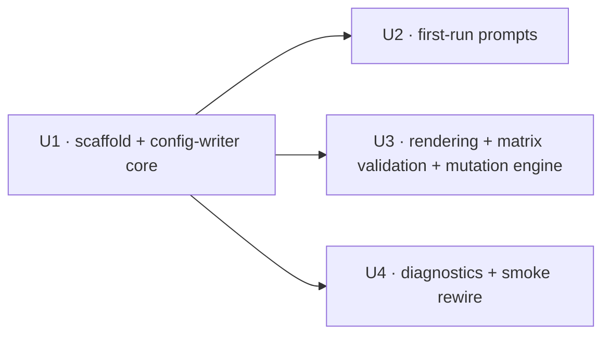

# refactor: Extract privacy/settings mutators into privacy_settings.py (SCR-156)

## Summary

Extract the privacy/settings mutator + helper cluster out of `src/screencap/cli/__init__.py` (~4.3k lines) into a new top-level module `src/screencap/privacy_settings.py`, leaving `settings_privacy` and the other privacy-touching Click commands in the CLI as thin delegators. Pure behavior-preserving move mirroring the #248 transcription extraction, plus new direct unit tests for the now-isolated mutation/validation seams the move makes testable without a CliRunner round-trip.

---

## Problem Frame

`cli/__init__.py` has grown to ~4.3k lines and mixes Click command definitions with a large body of privacy-config mutation, first-run prompting, settings rendering, and matrix-validation logic. This is the remaining named chunk of [SCR-32](https://linear.app/zk-email/issue/SCR-32) ("split cli.py into router + named domain modules"), re-scoped to the post-`cli/` package, post-disk-first-pipeline code. The transcription slice already shipped this pattern in [screencap#248](https://github.com/proteus-computer-use/screencap/pull/248) (`src/screencap/transcription.py`), making backend resolution unit-testable. The privacy mutators are a higher-value target: they are sensitive (config mutation + matrix-invariant validation that enforces the Unit 7a strengthening), yet today are only reachable for testing through `CliRunner`. Extracting them into a named module makes the mutation/validation seams directly unit-testable and shrinks the CLI's surface.

---

## Requirements

- R1. The privacy/settings helpers — TOML read/write, first-run prompts, settings rendering, matrix validation, the mutation engine, and the two privacy diagnostics — live in `src/screencap/privacy_settings.py`, not `cli/__init__.py`.
- R2. The `settings_privacy` Click command, the `settings` display command, the `start` command, and the `_smoke-test` command stay in the CLI and reach the moved helpers via call-site-local imports (mirroring #248).
- R3. Behavior is preserved end-to-end: identical CLI prose output, exit codes, `--json` envelopes, advisory-flock semantics, and matrix-validation decisions.
- R4. All user-facing output stays on `rich.console.Console`; no bare `print()`.
- R5. Deferred heavy imports are preserved so `screencap --help` import cost does not regress.
- R6. The new module is self-contained: heavy imports deferred inside function bodies, and no module-level import cycle with `screencap.cli`.
- R7. Direct unit tests cover the extracted mutation/validation seams (`_settings_privacy_apply`, `_matrix_blocks_allow_for_class`, `_build_privacy_settings_block`, `_write_privacy_flag` / `_privacy_config_writer`).
- R8. No duplication of `src/screencap/privacy/domain_loader.py` domain-loading logic — moved code consumes the classifier, it does not reimplement domain loading.
- R9. Single-key `[privacy]` writes continue to preserve other keys, comments, and ordering via tomlkit. (`R16` is the label this invariant already carries in the current code comments — an inherited codebase invariant, not a requirement newly defined by this plan.)

---

## Scope Boundaries

- No change to privacy matrix behavior, validation rules, the action vocabulary, or the config schema — this is a pure move.
- No change to the `settings_privacy` / `settings --json` / matrix-disclosure stderr-event contracts consumed by the SwiftUI shell — they must stay byte-identical.
- Transcription, recovery, and export-glue extractions from SCR-32 are not re-touched (already shipped).
- No new privacy features, fields, or modes.

### Deferred to Follow-Up Work

- Export glue (`_export_one`, `_build_export_privacy_filter`, currently the last privacy-adjacent helpers left in the CLI): low value, fold in opportunistically or as a separate tiny follow-up ticket — per the SCR-156 ticket's own "out of scope" note.

---

## Context & Research

### Relevant Code and Patterns

- **Pattern to mirror — `src/screencap/transcription.py`** (#248): module docstring naming the SCR-32 extraction and the deferred-import rationale; its own module-level `console = Console()`; `from __future__ import annotations`; all heavy imports (`openai`, `faster_whisper`, `screencap.engine.*`) deferred inside function bodies; CLI commands import the helpers locally at call sites.
- **`src/screencap/cli/__init__.py`** — current homes of the symbols to move:
  - Config-writer core: `_MATRIX_ACK_KEY`, `_PRIVACY_CONFIG_FLOCK_TIMEOUT_S`, `_config_lock_path`, `PrivacyConfigLockTimeout`, `_privacy_config_writer`, `_write_privacy_flag`.
  - First-run prompts: `_maybe_download_nlp_models`, `_maybe_prompt_privacy_setup`, `_maybe_prompt_matrix_acknowledgement`.
  - Rendering + matrix validation + mutation engine: `_PRIVACY_LIST_FIELDS`, `_PRIVACY_SCALAR_FIELDS`, `_PRIVACY_MAP_FIELDS`, `_PRIVACY_MODE_VALUES`, `_build_privacy_settings_block`, `_privacy_list_field_value`, `_matrix_blocks_allow_for_class`, `_settings_privacy_apply`.
  - Diagnostics: `_check_domain_index`, `_check_onnxruntime_excluded`, referenced from the module-level `_SMOKE_CHECKS` list and the `_smoke-test` command.
- **Call sites that stay in the CLI and become delegators:** the `start` command (calls both first-run prompts), the `settings` display command (calls `_build_privacy_settings_block`), the `settings_privacy` command (calls `_privacy_list_field_value`, opens `_privacy_config_writer`, calls `_settings_privacy_apply`, and references the `_PRIVACY_*` field constants and `_PRIVACY_MODE_VALUES`), and the `_smoke-test` command (via `_SMOKE_CHECKS`).
- **`src/screencap/privacy/domain_loader.py`** — public API is `load_ut1_domains`, `load_supplement`, `extract_root_domain`, `build_domain_index`. None of the moved functions reimplement any of this; `_check_domain_index` and the matrix-validation helpers reach domain/classification logic only through `screencap.privacy.classify` / `screencap.privacy.policy`. Overlap check resolves to "confirmed none."
- **SCR-33 privacy package DAG** (`CLAUDE.md`): `src/screencap/privacy/` is the leaf of a one-way dependency DAG and must not pull in CLI-layer concerns (`screencap.config`, `screencap.setup_wizard`). The moved code depends on exactly those — see the module-placement decision below.

### Institutional Learnings

- No `docs/solutions/` entry covers CLI module extraction, deferred-import discipline, or privacy-config mutation; none applied.

### External References

- None needed — the work is a behavior-preserving internal refactor with a strong in-repo precedent (#248).

---

## Key Technical Decisions

- **New module is top-level `src/screencap/privacy_settings.py`, not inside the `privacy/` package.** The ticket specifies this path, and it is correct on architecture grounds: the moved code depends on `screencap.config` and `screencap.setup_wizard` (CLI-layer concerns). The `privacy/` package is the deliberate leaf of the SCR-33 one-way DAG and must not depend on those layers; placing this code there would invert the DAG. A sibling top-level module keeps the dependency direction legal.
- **Helper dependencies travel with their callers** so the new module is self-contained and no `cli ↔ privacy_settings` back-import is needed: the config-lock plumbing (`_config_lock_path`, `PrivacyConfigLockTimeout`, `_PRIVACY_CONFIG_FLOCK_TIMEOUT_S`), the `_MATRIX_ACK_KEY` flag, the `_PRIVACY_*` field-name constants, and `_maybe_download_nlp_models` (whose only caller is the moved `_maybe_prompt_privacy_setup`; verified across `src/`).
- **Update in-repo test imports rather than leaving re-export shims in `cli`.** No consumer outside `cli/__init__.py` and the test suite imports these helpers (verified across `src/`; `session.py` imports unrelated CLI helpers only). A clean internal refactor with no external surface does not warrant a dual import surface.
- **The `_smoke-test` registry references the moved diagnostics via an import-light reference.** `privacy_settings.py` keeps all heavy imports deferred, so wiring the two checks into `_SMOKE_CHECKS` does not pull heavy dependencies at CLI import time and does not regress `screencap --help`.
- **Runtime-invoked helpers use call-site-local imports in the CLI** (the #248 pattern), keeping `--help` import cost flat and avoiding any module-level coupling.
- **Tests that reference a moved symbol by its `screencap.cli` dotted path get re-pointed to `screencap.privacy_settings`** — covering *both* `from screencap.cli import <symbol>` imports *and* string-target patches (`mock.patch("screencap.cli.<symbol>")`, `monkeypatch.setattr("screencap.cli.<symbol>", …)`). The mitigation grep must match both forms; an import-only grep structurally misses the string patches, which break the moment `start` switches to call-site-local imports (the patched-out prompt then runs for real under `CliRunner`).
- **`_SETTINGS_PRIVACY_SCHEMA_VERSION` stays in `cli/__init__.py` — it is NOT moved with the `_PRIVACY_*` constants.** The `settings privacy --json` envelope is assembled by the command's `_result` closure (which stays in the CLI) and reads this constant directly; moving it would force a `privacy_settings → cli` back-import (cycle) or NameError the envelope. The moved `_settings_privacy_apply` reaches the schema version only through the injected `_result`, so it never needs the constant.
- **`_SMOKE_CHECKS` stays defined in `cli/__init__.py`** — only the two check functions move, referenced via a module-level import-light import from `privacy_settings`. Relocating or lazily rebuilding the registry list would invalidate the `screencap.cli._SMOKE_CHECKS` patch path that existing `tests/test_cli.py` smoke-test cases rely on (they would then patch a stale object and pass vacuously).

---

## Open Questions

### Resolved During Planning

- *Where does the new module live — inside `privacy/` or top-level?* → Top-level `src/screencap/privacy_settings.py` (ticket-specified and DAG-correct; see Key Technical Decisions).
- *Does `domain_loader.py` overlap force a merge?* → No. Moved code consumes the classifier; no domain-loading logic is duplicated.
- *Keep back-compat re-exports in `cli`?* → No. Update the test imports; no external consumers.
- *Is `PrivacyConfigLockTimeout` caught anywhere that a move would break?* → No catch sites exist in `src/` or `tests/` (verified); it propagates uncaught today and will continue to.
- *How to wire the moved diagnostics into `_smoke-test`?* → Keep `_SMOKE_CHECKS` defined in `cli/__init__.py` and reference the two moved functions via a module-level import-light import from `privacy_settings`; do **not** relocate or lazily rebuild the registry. This preserves the `screencap.cli._SMOKE_CHECKS` patch path used by existing `test_cli.py` tests (see U4).
- *Does `_SETTINGS_PRIVACY_SCHEMA_VERSION` move?* → No. It stays in the CLI with the `_result` closure that reads it (see Key Technical Decisions).

### Deferred to Implementation

- Exact local-import groupings at each delegating call site (which symbols to import together) — settle while editing; behavior is invariant to the grouping.
- Exact internal layout/ordering of the moved functions within `privacy_settings.py` — settle while editing; behavior is invariant to it.

---

## High-Level Technical Design

> *This illustrates the intended approach and is directional guidance for review, not implementation specification. The implementing agent should treat it as context, not code to reproduce.*

**Unit dependency graph** (U2/U3/U4 are mutually independent; all depend only on U1's scaffold + config-writer core):

**Symbol → destination map** (every row moves to `privacy_settings.py`; the right column is the CLI call site that becomes a local-import delegator):

| Moves to `privacy_settings.py` | CLI delegator left behind | Unit |
|---|---|---|
| `_MATRIX_ACK_KEY`, `_PRIVACY_CONFIG_FLOCK_TIMEOUT_S`, `_config_lock_path`, `PrivacyConfigLockTimeout`, `_privacy_config_writer`, `_write_privacy_flag` | `settings_privacy` command opens the writer via local import | U1 |
| `_maybe_download_nlp_models`, `_maybe_prompt_privacy_setup`, `_maybe_prompt_matrix_acknowledgement` | `start` command calls both prompts via local import | U2 |
| `_PRIVACY_LIST_FIELDS` / `_PRIVACY_SCALAR_FIELDS` / `_PRIVACY_MAP_FIELDS` / `_PRIVACY_MODE_VALUES`, `_build_privacy_settings_block`, `_privacy_list_field_value`, `_matrix_blocks_allow_for_class`, `_settings_privacy_apply` | `settings` display + `settings_privacy` commands delegate via local imports (the command keeps its `_result` closure + `err_console` and passes them into the apply seam, as today) | U3 |
| `_check_domain_index`, `_check_onnxruntime_excluded` | `_SMOKE_CHECKS` registry references them import-light | U4 |

---

## Implementation Units

### U1. Module scaffold + config-writer core

**Goal:** Stand up `src/screencap/privacy_settings.py` (docstring, module `console`, module `logger`, deferred-import discipline) and move the TOML read/write core into it. Re-point the one CLI delegator that uses the writer today.

**Requirements:** R1, R2, R4, R5, R6, R9

**Dependencies:** None

**Files:**
- Create: `src/screencap/privacy_settings.py`
- Modify: `src/screencap/cli/__init__.py` (remove moved symbols; `settings_privacy` command opens the writer via local import)
- Test: `tests/test_privacy_settings.py` (new), `tests/test_matrix_acknowledgement.py` (re-point the `_write_privacy_flag` import), `tests/test_settings_privacy.py` (re-point its `from screencap.cli import _config_lock_path` — the concurrent-writers / flock-serialization test depends on it)

**Approach:**
- Mirror `transcription.py`: module docstring crediting SCR-32/SCR-156 and the deferred-import rationale, `from __future__ import annotations`, own `console = Console()` and `logger = logging.getLogger(__name__)`. Cheap stdlib (`contextlib`, `os`, `time`, `logging`) and `rich` imports may sit at module level; everything else (`screencap.config`, `screencap.setup_wizard`, `tomlkit`, `fcntl`) stays deferred inside function bodies exactly as today.
- Move `_MATRIX_ACK_KEY`, `_PRIVACY_CONFIG_FLOCK_TIMEOUT_S`, `_config_lock_path`, `PrivacyConfigLockTimeout`, `_privacy_config_writer`, `_write_privacy_flag` verbatim — the flock acquire/retry/timeout loop, atomic-save, and cache-invalidation steps must move character-for-character to avoid reintroducing the lost-update race (todo 015).

**Patterns to follow:**
- `src/screencap/transcription.py` module header + console + deferred-import structure.

**Test scenarios:**
- Happy path: `_write_privacy_flag("setup_skipped", True)` then re-read config shows the scalar set under `[privacy]` and leaves a pre-existing unrelated `[privacy]` key + its inline comment intact (R9).
- Happy path: `_privacy_config_writer` round-trips a mutation — enter context, mutate the yielded doc, exit cleanly → config is atomically saved and the config cache is invalidated.
- Edge case: exception raised inside the `with _privacy_config_writer()` block leaves the on-disk file untouched (no partial write).
- Error path: a held lock that never frees within `_PRIVACY_CONFIG_FLOCK_TIMEOUT_S` raises `PrivacyConfigLockTimeout` (simulate by pre-acquiring the flock on `config.lock`).
- Edge case: two sequential writers serialize without lost update — writer A sets key X, writer B sets key Y, final config has both.
- Integration: `screencap settings privacy mode set internal` (CliRunner) still mutates config and prints the same success line after the command switches to the local import — proves the delegator wiring.

**Verification:**
- `_privacy_config_writer` / `_write_privacy_flag` import directly from `screencap.privacy_settings`; `cli/__init__.py` no longer defines them.
- `screencap settings privacy …` behaves identically (output, exit code, flock).
- `screencap --help` import cost unchanged.

---

### U2. First-run privacy prompts

**Goal:** Move the first-run setup/matrix-acknowledgement prompts (and the NLP-model-download helper they depend on) into `privacy_settings.py`; make the `start` command delegate.

**Requirements:** R1, R2, R3, R4, R6

**Dependencies:** U1 (prompts call `_write_privacy_flag` and use `_MATRIX_ACK_KEY`)

**Files:**
- Modify: `src/screencap/privacy_settings.py` (add the three functions), `src/screencap/cli/__init__.py` (remove them; `start` command imports both prompts locally at its call sites)
- Test: `tests/test_matrix_acknowledgement.py` (re-point `_maybe_prompt_matrix_acknowledgement` imports), `tests/test_cli.py` (re-point the `mock.patch("screencap.cli._maybe_prompt_privacy_setup")` prompt-neutralizing fixture), `tests/cli/test_start_daemon_client.py` (re-point the `monkeypatch.setattr("screencap.cli._maybe_prompt_matrix_acknowledgement", …)` string target)

**Approach:**
- Move `_maybe_download_nlp_models`, `_maybe_prompt_privacy_setup`, `_maybe_prompt_matrix_acknowledgement` verbatim. Preserve the matrix-disclosure stderr-event emission block (`EVENT_MATRIX_DISCLOSURE_REQUIRED`) exactly — it is a SwiftUI cross-language contract.
- The `start` command's two prompt calls become a local `from screencap.privacy_settings import …` at that call site.
- Because `start` switches to a call-site-local import, the prompt names no longer resolve at `screencap.cli` module scope — re-point the existing string-target patches (`mock.patch` / `monkeypatch.setattr` of `screencap.cli._maybe_prompt_*`) to `screencap.privacy_settings._maybe_prompt_*`, or the neutralized prompts run for real under `CliRunner` and block on stdin.

**Patterns to follow:**
- The deferred-import + local-call-site pattern already used by `start` for other heavy helpers.

**Test scenarios:**
- Happy path: existing `test_matrix_acknowledgement.py` cases pass unchanged against the new import location (skip when flag already set; skip when mode ≠ internal; skip when stdin not a TTY; skip + still write flag when `SCREENCAP_MATRIX_ACK=true`; skip + still write flag when `SCREENCAP_PARENT=swiftui`).
- Integration (**new test to author** — no existing case covers the `SCREENCAP_PARENT=swiftui` event path): with `SCREENCAP_PARENT=swiftui` and no env-ack, calling `_maybe_prompt_matrix_acknowledgement` on the new module emits the `matrix_disclosure_required` stderr event (assert the event type and both change keys are present) and then writes the ack flag — proves the SwiftUI-contract event block moved intact.
- Edge case: `_maybe_prompt_privacy_setup` on a config that already has a `[privacy]` section and non-cloud intent reaches `_maybe_download_nlp_models` exactly once (no behavior change from the move of its sole caller).
- Error path: a failing flag write inside the prompts is swallowed and logged at debug (recording continues) — assert the prompt does not raise.

**Verification:**
- `start` runs the first-run prompts via the new module; no prompt logic remains in `cli/__init__.py`.
- `_maybe_download_nlp_models` has no remaining reference in `cli/__init__.py`.

---

### U3. Settings rendering, matrix validation, and the mutation engine

**Goal:** Move the settings-block renderer, list-field normalizer, matrix-invariant guard, and the mutation engine into `privacy_settings.py`. Keep the `settings_privacy` and `settings` Click commands in the CLI as delegators. This is the sensitive core and the unit that delivers the ticket's "unit-test the extracted seams" requirement.

**Requirements:** R1, R2, R3, R4, R6, R7, R8

**Dependencies:** U1 (the `settings_privacy` command wraps `_settings_privacy_apply` inside `_privacy_config_writer`)

**Files:**
- Modify: `src/screencap/privacy_settings.py` (add the four `_PRIVACY_*` constants + four functions), `src/screencap/cli/__init__.py` (`settings` display command imports `_build_privacy_settings_block`; `settings_privacy` command imports the field constants, `_privacy_list_field_value`, the writer, and `_settings_privacy_apply`)
- Test: `tests/test_privacy_settings.py` (new direct-seam coverage). Note: `tests/test_privacy_matrix_corrections.py` mentions `_matrix_blocks_allow_for_class` only in a docstring and exercises it via `CliRunner` — there is no import to re-point there.

**Approach:**
- Move the constants and `_build_privacy_settings_block`, `_privacy_list_field_value`, `_matrix_blocks_allow_for_class`, `_settings_privacy_apply` verbatim. The new module needs `from rich.markup import escape` for the apply seam's error rendering.
- The `settings_privacy` command keeps its in-body `_result` closure, `err_console`, scalar normalization, and the `with _privacy_config_writer()` block exactly as today, and passes `_result` / `tomlkit` / `err_console` into `_settings_privacy_apply` through the existing parameter seam — so the keyword-argument contract of `_settings_privacy_apply` is unchanged.
- Leave `_SETTINGS_PRIVACY_SCHEMA_VERSION` in `cli/__init__.py` — do not move it with the `_PRIVACY_*` constants. The JSON envelope is built by the CLI-resident `_result` closure that reads it; `_settings_privacy_apply` reaches it only through the injected `_result`, so the constant never crosses the module boundary.
- Confirm (R8) that `_matrix_blocks_allow_for_class` and `_settings_privacy_apply` reach classification/matrix logic only through `screencap.privacy.classify` / `screencap.privacy.policy` / `screencap.privacy.actions` — no domain-loading duplication.

**Patterns to follow:**
- #248's example of extracting a pure decision function (backend resolution) so it is unit-testable without `CliRunner`; here the analogues are `_matrix_blocks_allow_for_class` and `_settings_privacy_apply`.

**Test scenarios:**
- Happy path (`_build_privacy_settings_block`): config with a `[privacy]` section and `mode = public` → block reports `mode="public"`, `has_privacy_section=True`.
- Edge case (`_build_privacy_settings_block`): no `[privacy]` section → `has_privacy_section=False`, `mode` defaults to `"internal"`; an invalid `mode` value falls back to `"internal"`; a non-bool `setup_skipped` coerces to `False`.
- Happy path (`_matrix_blocks_allow_for_class`): `PASSWORD_MANAGER` returns a blocking action under every mode; `BROWSER_UNVERIFIED` under `internal` returns `None` (allow-listable); `BANKING` under `internal` is blocked.
- Edge case (`_matrix_blocks_allow_for_class`): an invalid `configured_mode` string falls back to `internal` rather than raising.
- Error path (`_settings_privacy_apply`, the matrix-invariant guard): `allow_apps add <CHAT bundle>` under `mode=internal` is rejected with the `matrix_blocks_allow:*` error and exits non-zero; an unknown bundle with no `app_classes` override is rejected fail-closed (`unknown_bundle_id:*`).
- Error path (`_settings_privacy_apply`, the two-step-bypass guard): `app_classes set X=password_manager` then `app_classes remove X` is rejected when removal would loosen the matrix at the configured mode (the `_ACTION_SEVERITY` floor guard).
- Edge case (`_settings_privacy_apply`, idempotency): `add` of an already-present list value is a no-op returning `changed=False`; `remove` of an absent value is a no-op; both exit 0.
- Edge case (`_settings_privacy_apply`, tomlkit metadata): adding to a list field preserves existing inline comments / per-item formatting (mutates the Array in place, not list-rebuild).
- Integration (envelope pin): `settings privacy exclude_apps add com.example.test --json` and an error path (unknown field) each emit the full symmetric schema-v2 envelope — assert `schema_version == 2` and that every key (`ok`, `schema_version`, `changed`, `field`, `op`, `value`, `error`) is present on both the success and error branches, with absent values serialized as JSON `null`. Pins the SwiftUI contract so an accidental schema-version reset or dropped key is caught.
- Integration: `screencap settings privacy allow_apps add com.tinyspeck.slackmacgap` and `screencap settings --json` (CliRunner) produce byte-identical output and exit codes to pre-refactor — the existing matrix-corrections tests stay green as the end-to-end guard.

**Verification:**
- The mutation/validation seams import and exercise directly from `screencap.privacy_settings` in `tests/test_privacy_settings.py` without `CliRunner`.
- `settings_privacy --json` envelope (schema v2: `ok`/`schema_version`/`changed`/`field`/`op`/`value`/`error`) is unchanged on both success and error.
- `settings --json` `privacy` block is unchanged.

---

### U4. Privacy diagnostics + smoke-check rewire

**Goal:** Move the two privacy-related smoke checks into `privacy_settings.py` and re-wire the `_smoke-test` registry to reference them without regressing CLI import cost.

**Requirements:** R1, R2, R5, R6, R8

**Dependencies:** U1 (scaffold only)

**Files:**
- Modify: `src/screencap/privacy_settings.py` (add the two checks), `src/screencap/cli/__init__.py` (remove the two check defs; `_SMOKE_CHECKS` stays in place and references them import-light)
- Test: `tests/test_privacy_settings.py` (registry-membership + check-runs assertions); confirm `tests/test_cli.py` smoke-test cases (which patch `screencap.cli._SMOKE_CHECKS`) still pass unchanged

**Approach:**
- Move `_check_domain_index` (instantiates `DefaultContextClassifier`, exercising `build_domain_index → load_ut1_domains` — consumes domain_loader, R8) and `_check_onnxruntime_excluded` verbatim.
- Keep `_SMOKE_CHECKS` defined in `cli/__init__.py`; only the two check functions move. Wire them in via a module-level import-light `from screencap.privacy_settings import …` (the new module pulls no heavy deps at import, so this neither creates a cycle nor regresses `--help`). Do **not** relocate or lazily rebuild the registry list itself — existing `tests/test_cli.py` smoke-test cases patch it by its `screencap.cli._SMOKE_CHECKS` path, and moving the list would silently neuter those patches (they would patch a stale object and pass vacuously).

**Patterns to follow:**
- The existing `_SMOKE_CHECKS` list + `_smoke-test` command structure.

**Test scenarios:**
- Happy path: `_check_domain_index()` returns `("domain_index", True, "")` in a normal dev environment.
- Happy path: `_check_onnxruntime_excluded()` returns `(…, True, "")` when `onnxruntime` is not importable (its intended "excluded" state).
- Integration: `screencap _smoke-test` (CliRunner) still lists `domain_index` and `onnxruntime_excluded` among the checks and the overall pass/fail summary is unchanged.

**Verification:**
- `cli/__init__.py` no longer defines the two checks; `_smoke-test` output is unchanged.
- `screencap --help` import cost unchanged (no heavy import pulled by the registry wiring).

---

## System-Wide Impact

- **Interaction graph:** Four CLI commands become delegators — `start` (first-run prompts), `settings` (privacy block render), `settings privacy` (writer + mutation engine), `_smoke-test` (two diagnostics). The SwiftUI shell subprocess depends on the `settings privacy --json` / `settings --json` envelopes and the `matrix_disclosure_required` stderr event; all three move verbatim and must stay byte-identical.
- **Error propagation:** `PrivacyConfigLockTimeout` propagates uncaught today (no catch sites in `src/` or `tests/`); the move preserves that. `_settings_privacy_apply` hard errors via `_result(exit_code=…)` → `SystemExit`, unchanged.
- **State lifecycle risks:** The config read-modify-write path (advisory flock → load → mutate → atomic save → cache invalidate) is the highest-risk surface; moving it character-for-character is required to avoid reintroducing the lost-update race (todo 015) or write-atomicity gaps.
- **API surface parity:** `settings_privacy` schema v2 JSON envelope and the matrix-disclosure stderr event are cross-language contracts — preserve exactly.
- **Integration coverage:** The existing `CliRunner`-based tests (`tests/test_privacy_matrix_corrections.py`, `tests/test_matrix_acknowledgement.py`, `tests/test_cli.py`) remain the end-to-end guard proving command wiring; the new `tests/test_privacy_settings.py` covers the seams directly.
- **Unchanged invariants:** Privacy matrix actions, `policy.get_matrix_action`, the `privacy/` package DAG, `domain_loader`, and the config schema are untouched. The new module sits *above* the `privacy/` leaf package in the dependency direction (it depends on `screencap.config` / `screencap.setup_wizard`), so the SCR-33 DAG is preserved.

---

## Risks & Dependencies

| Risk | Mitigation |
|------|------------|
| Module-level import sneaks in and creates a `cli ↔ privacy_settings` cycle | Keep all `screencap.*` imports deferred inside function bodies; `privacy_settings` imports nothing from `cli` at module level. Verify the package import-boundary guards still pass. |
| `screencap --help` import cost regresses from a heavy import landing at module level in the new file | Keep heavy imports (`tomlkit`, `fcntl`, `screencap.config`, `screencap.privacy.*`) inside function bodies; verify `--help` import cost is flat and run any import-lightness/boundary guards. |
| Silent behavior drift in the flock / atomic-save / cache-invalidate path | Move verbatim; cover with the new flock unit tests (U1) plus the unchanged `CliRunner` matrix tests. |
| A moved-symbol test reference is missed and the suite breaks — or worse, passes vacuously | After each unit, grep `tests/` for **both** `from screencap.cli import <moved symbol>` **and** string-target patches (`mock.patch` / `monkeypatch.setattr` of `"screencap.cli.<moved symbol>"`) — an import-only grep structurally misses the string patches. Known affected files: `tests/test_matrix_acknowledgement.py` (`_write_privacy_flag`, prompts), `tests/test_settings_privacy.py` (`_config_lock_path`), `tests/test_cli.py` + `tests/cli/test_start_daemon_client.py` (prompt patches), and `tests/test_cli.py` (`_SMOKE_CHECKS` patches — kept valid by leaving the registry in `cli`). |
| SwiftUI contract drift (JSON envelope / matrix-disclosure stderr event) | The envelope construction and event-emission blocks move byte-for-byte; the schema-version constants stay in the CLI; CliRunner JSON assertions guard them. |

---

## Sources & References

- **Origin ticket:** [SCR-156 — Extract privacy/settings mutators out of cli/__init__.py into privacy_settings.py](https://linear.app/zk-email/issue/SCR-156/extract-privacysettings-mutators-out-of-cli-init-py-into-privacy)
- **Parent ticket:** [SCR-32 — Split cli.py into router + named domain modules](https://linear.app/zk-email/issue/SCR-32)
- **Pattern precedent:** [screencap#248 — transcription extraction](https://github.com/proteus-computer-use/screencap/pull/248) → `src/screencap/transcription.py`
- Related code: `src/screencap/cli/__init__.py`, `src/screencap/privacy/domain_loader.py`, `src/screencap/privacy/classify.py`, `src/screencap/privacy/policy.py`
- Suggested git branch (from Linear): `rutefig/scr-156-extract-privacysettings-mutators-out-of-cli__init__py-into`
