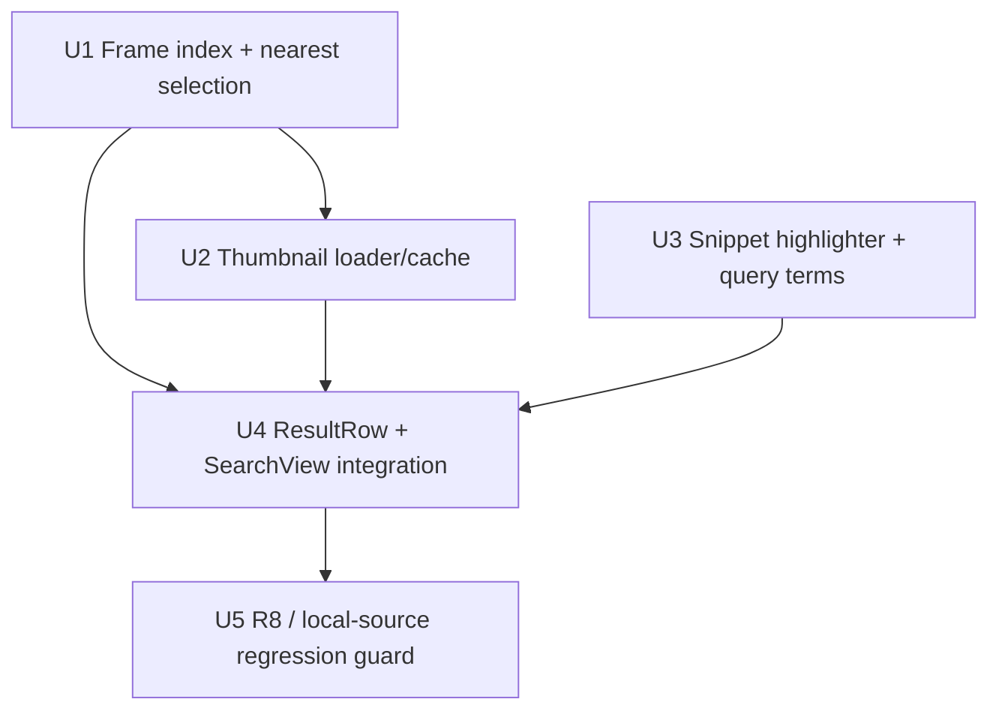

# feat: Search result screenshot thumbnails + matched-text highlighting

## Summary

Close the R6 polish gap in the in-app Ask-Your-History Search (SCR-174, shipped in PR #283): make each result row recognizable by rendering a small screenshot **thumbnail** of the captured moment and **highlighting** the matched query terms inside the content/transcript snippet. Thumbnails are loaded lazily, downsampled, and cached entirely app-side from the local `~/.screencap/recordings/<name>/screenshots/` frames — the daemon response models stay pointer-only (R8). All new work lives in the SwiftUI app's Search layer; the daemon, the content index, and the privacy/capture pipeline are untouched.

---

## Problem Frame

SCR-174 shipped a working in-app Search surface but with **text-only result rows** (`ResultRow` in `macos/Screencap/Views/Search/SearchTimelineView.swift`): a stream icon + app/snippet + time. The origin requirements doc's **R6** explicitly asked for recognizable, verifiable result cards with a screenshot thumbnail and the matched text highlighted (see origin: `docs/brainstorms/2026-06-24-ask-your-history-search-requirements.md`). The ticket (SCR-177) frames this as "the single biggest perceived-quality gap vs Rewind/Day Flow" — a text row makes the operator read and guess; a thumbnail of the real captured frame lets them recognize the moment at a glance, which is the whole promise of the feature (F1: ask → recognize → jump to the moment).

---

## Requirements

- R1. Each result row shows a small screenshot **thumbnail** of the captured moment, resolved by `(recording, timestampMs)` from the local `~/.screencap/recordings/<name>/screenshots/{epoch:.6f}.jpg` frames. *(origin R6)*
- R2. Matched query terms are **highlighted** within the content/transcript snippet text. *(origin R6)*
- R3. The surface stays **lazy and cheap**: scrolling 200+ results stays smooth — thumbnails decode off the main thread, downsampled, cached, with an in-flight guard and bounded concurrency. *(ticket acceptance)*
- R4. **No media bytes** are added to the daemon response models. Image bytes are resolved and read entirely app-side; the daemon stays pointer-only. *(origin R8)*
- R5. Rows render **defensively**: a missing/unreadable frame, an absent screenshots dir (evicted recording), or an absent snippet falls back to a placeholder/stream-icon — the row is never dropped and the list never fails.
- R6. The thumbnail source is the **raw local `screenshots/*.jpg` only** — never a scrubbed/cloud copy, never uploaded. *(narrowed-R7; `SECURITY.md`)*

**Origin actors:** A1 (Operator — non-technical user searching their own history), A2 (Local retrieval layer — daemon query path + content index)
**Origin flows:** F1 (Ask and jump to a moment — this work completes its "recognizable cards" step)
**Origin acceptance examples:** AE2 (Covers origin R3, R6 — a matching moment is recognizable/verifiable and selecting it opens the real captured frame)

---

## Scope Boundaries

- **No daemon / wire-model changes.** `content.search` / `transcript.search` / `timeline.query` and their Swift `Decodable` models (`ContentHit`, `TranscriptHit`, `TimelineRow`) are unchanged. Thumbnails and highlighting are a pure presentation-layer addition (R4/R8).
- **No capture, privacy, or redaction pipeline changes.** This is a read-only surfacing feature (matches origin's "Outside this feature's identity").
- **No server-side snippet markers.** Highlighting is done client-side against the parsed free-text terms; the daemon's FTS5 `snippet()` already emits no match markers and we do not change it.
- **No new persistent store.** No thumbnail cache is written to disk; the in-memory cache is ephemeral (preserves R8 — search does not become a fresh exfiltration surface).
- **MASK_WINDOW suppression is out.** Per the resolved decision below, MASK_WINDOW moments show the raw local thumbnail (no blocked-interval lookup is added).

### Deferred to Follow-Up Work

- Server-side FTS5 highlight markers (accurate to tokenizer stemming) — would require a daemon change; revisit only if client-side literal-term highlighting proves insufficient.
- Thumbnail prefetch / windowed look-ahead for very large result sets — only if profiling shows scroll jank that lazy `.task(id:)` loading does not cover.

---

## Context & Research

### Relevant Code and Patterns

- **`macos/Screencap/Views/Review/ScreenshotTruthPane.swift`** — the canonical pattern to mirror. `ScreenshotTruth` is a pure, unit-tested enum (`screenshots(from:startedAt:)`, `selection(at:screenshots:)`) that parses `{epoch}.jpg` filenames (`Double(url.deletingPathExtension().lastPathComponent)`) into timestamped frames and maps a time to a frame. The view loads the JPEG via `.task(id: currentFrameURL)` + `Task.detached` decode, with loading/loaded/failed states. SCR-177's frame-selection and lazy-load layers should follow this shape (the key difference: **nearest** frame, not nearest-prior, and the **raw** `screenshots/` dir, not the scrubbed copy).
- **`macos/Screencap/Views/Search/SearchViewModel.swift`** — produces `SearchResults` and `SearchResultItem` (already carries `recording`, `anchorMs`, `snippet`, `stream`). `parsed.freeText` is the residual free-text after time/app stripping — the source of the highlight terms. `SearchResults` already carries `timeWindow` / `appFilter`; adding `queryTerms` there is the natural seam.
- **`macos/Screencap/Views/Search/SearchTimelineView.swift`** — `ResultRow` is the integration point (leading icon → primary/secondary text → trailing time). `SearchView.swift` builds rows inside a `List` and owns the per-search lifecycle.
- **Frame filename contract** — `src/screencap/engine/recorder.py:761` writes `f"{ts:.6f}.jpg"` into `screenshots/` (mode `0o600`); the content index derives `timestamp_ms = round(ts*1000)` (`src/screencap/chunk_processor.py:1298`). So content-hit timestamps map ~exactly to a frame; timeline/audio anchors are snapped to a captured-moment event time that may sit between frames — hence **nearest-frame** resolution via a directory listing, not filename reconstruction.
- **App is not sandboxed** — `macos/Screencap/Screencap.entitlements` declares only `device.audio-input` (no `app-sandbox`), which is what makes direct reads of `~/.screencap/recordings/<name>/screenshots/` feasible with no security-scoped bookmark. Be precise about the precedent, though: the Review window only reads bytes from a **daemon-supplied, scrubbed-copy** path (`Data(contentsOf:)` on an absolute URL returned by `review-data`); **no existing app code enumerates a recordings directory**. U1's listing of the raw screenshots tree is genuinely new filesystem-enumeration I/O built on an app-constructed path from a daemon-sourced recording name — hence the path-containment guard in U1.

### Institutional Learnings

- **`docs/solutions/integration-issues/macos-foundation-process-pipe-pitfalls.md`** — do **not** shell out to a `screencap` subprocess for thumbnails; per-row/scroll-driven subprocess spawns are a fork-bomb. Read bytes in-process and apply an in-flight guard + bounded concurrency to any scroll-driven async load. Directly shapes U2.
- **`docs/solutions/integration-issues/review-data-nullable-timing-swift-consumer-2026-06-01.md`** — cross-language contract precedent: never gate row rendering on optional fields (snippet, resolvable frame). Gate only on the load-bearing identity (`recording` + pointer); default everything else. Shapes R5 / U4.
- **`docs/solutions/workflow-issues/privacy-guards-deselected-on-ci-silently-rot-2026-06-10.md`** — a privacy/R8 regression guard must run on a path CI actually executes (not behind a deselected marker / `xfail`). Shapes U5 (keep the guard in the default XCTest target).

### External References

- None. Skipped external research: the codebase already contains the exact lazy-decode pattern (`ScreenshotTruthPane`), and CGImageSource downsampling is a well-established AppKit API. No high-risk or novel surface.

---

## Key Technical Decisions

- **Resolve frames by listing `screenshots/` + nearest-timestamp match, cached per recording.** Filename reconstruction from `timestampMs` is fragile (`.6f` formatting + `round`), and timeline/audio anchors don't land on exact frame timestamps. A one-time-per-recording directory listing parsed into sorted timestamps, then a pure nearest-match, is robust and mirrors `ScreenshotTruth`. *(Rejected: a new daemon verb or direct `recording.db` read — both add surface and the daemon route risks R8; dir-listing is app-local and simplest.)*
- **Highlight client-side by matching each parsed free-text term independently; build an `AttributedString`.** The daemon's FTS5 `snippet()` is called with empty match markers (`snippet(content_fts, 0, '', '', '…', ?)`), and the LIKE fallback adds none — so no markers arrive over the wire. Client-side highlighting keeps R8/R4 intact (no daemon change) and is right-sized for a recognition aid. **Tokenize the query and match each term independently** (case- and diacritic-insensitive) — do not match the whole query as one substring. *(Accepted, correctly-characterized tradeoff: the real miss is NOT stemming — the FTS5 tokenizer is `unicode61 remove_diacritics 2` with no porter stemmer. The miss is that the daemon snippet is a **bounded window** — FTS5 `snippet()` returns a ~32-token excerpt, and the LIKE/transcript path's `like_snippet` matches the whole query string and falls back to the document head — so for a multi-token query whose terms appear non-adjacently, the returned snippet can contain some or none of the terms. When a term isn't present in the snippet, highlight nothing for it and never error, R5. The residual quality ceiling is set upstream by the daemon snippet, so the deferred escalation to server-side markers needs a concrete trigger — see Open Questions.)*
- **Commit the highlight attribute to bold weight only (no color change).** Bold survives every `List` row state — normal, hovered, selected — in both light and dark mode with no color math, and degrades gracefully across word boundaries. An accent foreground can wash out against the selection tint; a background tint can vanish in dark mode. (Rejected the color options for legibility robustness.)
- **Transcript (audio) rows get a thumbnail only when the anchor is trustworthy.** Transcript hits carry no `timestamp_ms` by daemon contract; `SearchViewModel` derives an anchor as `recordingStart + chunkIndex * chunkDurationSeconds` (default 300s) snapped to the nearest timeline event, so the anchor can be minutes from where the matched words were spoken — and the nearest frame would then faithfully show the *wrong* moment, defeating R1. Gate transcript thumbnails on the existing `approximate` flag + the U1 staleness cap: when the resolved frame is implausibly far from the anchor (or the row is unanchored), fall back to the stream-icon placeholder rather than a misleading frame.
- **Downsample at decode via `CGImageSourceCreateThumbnailAtIndex` + `kCGImageSourceThumbnailMaxPixelSize`; cache in an `NSCache`.** Decoding a full-resolution screen JPEG per row would thrash memory and the main thread. Downsampling at decode time (off the main actor) + an `NSCache` keyed by resolved frame URL keeps 200-row scroll smooth (R3) and auto-evicts under memory pressure.
- **Raw local thumbnails for all streams, including MASK_WINDOW (resolved with user).** Capture-time enforcement (`src/screencap/enforcement/recorder_enforcement.py`) already **drops** screenshots for excluded apps, secure fields, and policy-blocked windows — those moments have no frame on disk, so the thumbnail safely falls back to a placeholder by construction. The only residual case is MASK_WINDOW (raw frame captured locally, masked only in the uploaded copy); the operator is viewing their own screen, strictly local, never uploaded — MASK_WINDOW means "mask before upload," not "hide from me locally." This avoids a per-recording blocked-interval lookup on a hot path. *(Documented for the security-lens reviewer.)*
- **No on-disk thumbnail cache.** Keeping the cache in-memory only preserves the origin R8 invariant that search must not create a new persistent store of captured imagery.

---

## Open Questions

### Resolved During Planning

- **Thumbnail privacy posture for MASK_WINDOW moments** → Resolved with the user: show the raw local thumbnail for all streams (dangerous frames are already dropped at capture; MASK_WINDOW is upload-scoped). No blocked-interval suppression unit.
- **Where do highlight terms come from?** → `parsed.freeText` in `SearchViewModel`; thread it onto `SearchResults` as `queryTerms`, tokenize on whitespace, match each term independently.
- **Masked vs raw source?** → Raw local `screenshots/*.jpg` (per ticket + R6), never the scrubbed copy the Review window uses.
- **Thumbnail cell design** → Committed in U4: ~56pt-wide 16:9 rounded cell replacing the stream-icon column when loaded; system-adaptive (`.separatorColor`) placeholder, no spinner; miss-state reuses the cell slot for the stream icon.
- **Highlight attribute** → Committed: bold weight only (survives `List` hover/selection in light + dark; no color math).
- **Nearest-frame staleness cap** → Committed in U1: resolution returns `nil` (→ placeholder) when the nearest frame is beyond a fixed threshold (directional ~30s) or the anchor is `nil`, so a far/chunk-coarse snap never shows a misleading frame.

### Deferred to Implementation

- **Exact `maxPixelSize` / cell points** — fine-tune the downsample size and the ~56pt/~30s directional values against a real result list (crispness vs. memory; staleness tightness vs. coverage).
- **Highlight-quality measurement gate** — instrument the fraction of result rows whose daemon snippet contains zero literal query terms; only escalate to the deferred server-side FTS5 markers if that fraction reads as broken in practice. (The cap is set upstream by the daemon snippet window, not by stemming.)
- **`NSCache` eviction on new search** — whether to clear the thumbnail cache when a new result set loads, or rely solely on memory-pressure eviction (frames are immutable, so stale entries are correct, just memory-resident).

---

## High-Level Technical Design

> *This illustrates the intended approach and is directional guidance for review, not implementation specification. The implementing agent should treat it as context, not code to reproduce.*

Two independent presentation pipelines feed the row; both stay app-side, so the daemon contract is untouched.

```
Thumbnail pipeline (R1/R3/R4/R6):
  SearchResultItem(recording, anchorMs: Int?)  ← pointer only, from daemon
        │  nil anchor OR over-staleness snap → placeholder (never frame-0)
        ▼
  RecordingFrameIndex.resolve(recording, anchorMs)  ← path-contained; list screenshots/*.jpg once, cache per recording
        │  (pure) FrameSelection.nearest(toMs:, in:) + staleness cap
        ▼
  resolved frame URL  ──►  ThumbnailLoader.thumbnail(for: url)
                              ├─ NSCache hit → return            (cheap)
                              ├─ in-flight for url → await join  (no duplicate decode)
                              └─ Task.detached: CGImageSource downsample → cache → NSImage
        │
        ▼
  ResultRow: thumbnail  | placeholder/stream-icon on miss (R5)

Highlight pipeline (R2):
  SearchResults.queryTerms  +  item.snippet
        │  (pure) SnippetHighlighter.attributed(snippet:, terms:)
        ▼
  AttributedString with highlighted ranges  →  ResultRow primary text
```

Unit dependency graph:



---

## Implementation Units

### U1. Recording frame index + nearest-frame selection

**Goal:** Resolve a `(recording, timestampMs)` pointer to a concrete local frame URL, via a per-recording listing of `screenshots/*.jpg` and a pure nearest-timestamp selection.

**Requirements:** R1, R4, R5, R6

**Dependencies:** None

**Files:**
- Create: `macos/Screencap/Controllers/RecordingFrameIndex.swift` (path resolution + per-recording cached listing; the pure `FrameSelection` type lives here or in its own file)
- Test: `macos/ScreencapTests/RecordingFrameIndexTests.swift`

**Approach:**
- Resolve the screenshots dir as `FileManager.default.homeDirectoryForCurrentUser` + `.screencap/recordings/<name>/screenshots/` (canonical per CLAUDE.md; note the assumption that the recordings root is the default).
- **Path-containment guard (security):** `<name>` is `SearchResultItem.recording`, which is daemon-sourced over the UDS. Before enumerating, resolve the candidate URL (`resolvingSymlinksInPath()`) and assert the canonical path is still prefixed by `<home>/.screencap/recordings/` — the Swift-side analogue of the daemon's `resolve_recording_dir`. A traversal-shaped name (`../…`) yields `nil`, never an out-of-tree read. (The `ScreenshotTruth` pattern accepts already-trusted URL arrays; mirroring its shape without this guard would leave the input-validation gap open.)
- List the dir once per recording, parse each stem with `Double(...)` into epoch-seconds (skip non-numeric stems, mirroring `ScreenshotTruth.screenshots(from:)`), sort ascending, and cache the sorted `[FrameRef(url, ms)]` per recording for the lifetime of a results set.
- **Entry point takes `Int?`.** Resolution is `resolve(recording:, anchorMs: Int?) -> URL?`: a `nil` anchor (unanchored transcript hit) short-circuits to `nil` (→ placeholder) and never reaches `nearest` — it must NOT silently resolve to frame-0/first-frame. Pure `FrameSelection.nearest(toMs:in:)` (non-optional `toMs`) returns the closest frame by absolute distance (not nearest-prior — a search anchor can sit just after the last relevant frame); `nil` for an empty list.
- **Staleness cap (committed).** `resolve` returns `nil` when the nearest frame is farther than a fixed threshold from the anchor (directional: ~30s), so a sparse recording or a chunk-coarse transcript anchor degrades to the placeholder instead of showing a frame minutes from the matched moment. Content hits (exact) are well inside the cap; this only filters far snaps.
- All disk work happens off the main actor; the pure selection and the staleness check are synchronous and disk-free.

**Patterns to follow:**
- `ScreenshotTruth` (pure enum + filename-stem parse) in `macos/Screencap/Views/Review/ScreenshotTruthPane.swift`.
- Daemon-side `resolve_recording_dir` / `validate_recording_name` traversal guards (mirror their containment posture app-side).

**Test scenarios:**
- Happy path: a content-hit `timestampMs` that equals `round(ts*1000)` resolves to the exact `{ts:.6f}.jpg` frame.
- Happy path: an anchor between two frames within the staleness cap resolves to the nearer of the two.
- Edge case: anchor before the first / after the last frame resolves to that frame when within the cap, else `nil`.
- Edge case: `nil` anchor → `nil` (placeholder), and never resolves to the first frame.
- Edge case: nearest frame beyond the staleness cap → `nil` (no misleading far-frame thumbnail).
- Error path (security): a traversal-shaped recording name (`../../Library/...`) yields `nil` and reads nothing outside `<home>/.screencap/recordings/`.
- Edge case: empty screenshots dir → `nil`; missing recording dir → `nil` (no throw).
- Edge case: non-numeric / drift filenames in the dir are skipped, not crashed on.
- Edge case (perf contract): listing a recording twice hits the cache — the dir is enumerated once per recording.

**Verification:** Given a fixture screenshots dir, the pure selection returns the expected URL for representative anchors; a `nil` anchor, an over-cap snap, a traversal name, and a missing dir each yield `nil` rather than an error or an out-of-tree read.

---

### U2. Thumbnail loader — downsample, cache, bounded concurrency

**Goal:** Given a resolved frame URL, produce a small downsampled `NSImage` cheaply: decode off the main thread, cache the result, coalesce in-flight requests, and bound concurrency so fast scrolling can't thrash.

**Requirements:** R3, R4, R5, R6

**Dependencies:** U1

**Files:**
- Create: `macos/Screencap/Controllers/ThumbnailLoader.swift`
- Test: `macos/ScreencapTests/ThumbnailLoaderTests.swift`

**Approach:**
- `thumbnail(for url: URL) async -> NSImage?` — return the `NSCache` entry if present; otherwise decode via `CGImageSourceCreateThumbnailAtIndex` with `kCGImageSourceThumbnailMaxPixelSize` + `kCGImageSourceCreateThumbnailFromImageAlways`, on a detached/background task, then cache by URL and return.
- In-flight coalescing: a second request for the same URL while a decode is running awaits the same task rather than starting a duplicate decode (learning #1 — scroll-driven repeat work).
- Bounded concurrency: cap simultaneous decodes (e.g., a small semaphore/actor) so a flick-scroll through 200 rows doesn't spawn 200 concurrent decodes.
- Never throws: an unreadable/missing file resolves to `nil` (the row shows a placeholder, R5). No subprocess, ever (learning #1).
- Read bytes only from the URL handed in by U1 (always under `.../screenshots/`), preserving R6/R4.

**Patterns to follow:**
- `ScreenshotTruthPane`'s `Task.detached(priority:.userInitiated)` decode + `loaded?.url == url` guard.
- `NSCache` for memory-pressure-aware caching.

**Test scenarios:**
- Happy path: decoding a real fixture JPEG returns a non-nil image whose pixel dimensions are bounded by the requested max size (downsample actually happened).
- Edge case: a missing/unreadable file path returns `nil` (no throw).
- Edge case: a second call for the same URL returns the cached image without re-decoding (assert the decode count via an injected decode hook or a fixture spy).
- Integration: concurrent calls for the same URL coalesce to a single decode (in-flight guard) — assert one underlying decode for N concurrent requests.

---

### U3. Snippet highlighting — query terms → AttributedString

**Goal:** Highlight matched query terms inside content/transcript snippets, and thread the parsed free-text terms from the view model to the row.

**Requirements:** R2, R5

**Dependencies:** None

**Files:**
- Create: `macos/Screencap/Views/Search/SnippetHighlighter.swift` (pure `attributed(snippet:terms:) -> AttributedString`)
- Modify: `macos/Screencap/Views/Search/SearchViewModel.swift` (add `queryTerms: [String]` to `SearchResults`, populated from `parsed.freeText`)
- Test: `macos/ScreencapTests/SnippetHighlighterTests.swift`

**Approach:**
- Tokenize `parsed.freeText` on whitespace into terms; carry them on `SearchResults.queryTerms` (alongside `timeWindow` / `appFilter`).
- Pure `SnippetHighlighter.attributed(snippet:terms:)` matches **each term independently** (case-insensitive, diacritic-insensitive — `range(of:options:[.caseInsensitive, .diacriticInsensitive])` walked across the string for every term), applying a **bold-weight** attribute to each matched range and returning an `AttributedString`. Bold-only is the committed treatment (survives `List` hover/selection in light + dark mode; see Key Technical Decisions) — no foreground/background color.
- Defensive rendering (R5): `nil` or empty snippet → empty `AttributedString`; empty `terms` or a term absent from the snippet → that span rendered plain, never an error. A multi-token query whose snippet (a bounded daemon excerpt) omits some terms simply highlights the ones present.

**Patterns to follow:**
- Pure-helper-plus-unit-test shape of `ScreenshotTruth`.
- `SearchResults` field-carrying convention (`timeWindow`, `appFilter`).

**Test scenarios:**
- Covers AE2. Happy path: a single query term present in the snippet is highlighted at the correct range with the **bold** attribute applied (assert the attribute type, not just the range); surrounding text is unstyled.
- Happy path: multiple terms each highlight their own occurrences independently.
- Edge case: a multi-token query whose snippet contains only some terms highlights the present ones and leaves the rest plain (no error).
- Edge case: term not present in the snippet → no highlighted ranges, plain text returned.
- Edge case: case- and diacritic-insensitive match (e.g., query `cafe` highlights `Café`).
- Edge case: empty `terms` → plain snippet; empty snippet → empty result; `nil` snippet → empty result (no crash).
- Edge case: repeated occurrences of a term are each highlighted.

---

### U4. ResultRow + SearchView integration

**Goal:** Render the thumbnail (leading) and the highlighted snippet in each result row, with graceful placeholders, loading lazily as rows appear.

**Requirements:** R1, R2, R3, R5

**Dependencies:** U1, U2, U3

**Files:**
- Modify: `macos/Screencap/Views/Search/SearchTimelineView.swift` (`ResultRow` — thumbnail cell + highlighted primary text + load state)
- Modify: `macos/Screencap/Views/Search/SearchView.swift` (inject the shared `RecordingFrameIndex` + `ThumbnailLoader`; pass `results.queryTerms` to rows)
- Test: `macos/ScreencapTests/SearchTimelineViewTests.swift` (test the extracted pure row-mapping helper, if any; view rendering is covered via U1–U3)

- **Committed thumbnail cell layout:** a fixed ~56pt-wide, 16:9 leading cell (matching a screen capture's aspect), corner-rounded, replacing the existing 18pt stream-icon column when a frame is loaded. The stream type stays readable via the secondary text (`On screen` / `Heard in audio` / activity). This is a layout decision that affects every row in a 200-item list, so it is committed here rather than deferred (the implementer may fine-tune the exact points against a real list).
- Load lazily with `.task(id:)` keyed on the row's `(recording, anchorMs)` so it loads when the row appears and cancels on scroll-away (mirrors `ScreenshotTruthPane`).
- Three visual states: **loading** (a fixed-size rounded rectangle filled with a system-adaptive color such as `Color(nsColor: .separatorColor)` — no spinner, so initial scroll isn't a column of black boxes/spinners), **loaded** (the `NSImage` in the cell), **miss** (the existing `streamIcon`/`streamTint` rendered in the same cell slot — preserves the stream affordance when no frame resolves, R5).
- **`nil`-anchor and over-staleness rows resolve to the miss state**, not to an arbitrary first frame: U1's `resolve` returns `nil` for unanchored transcript hits and for far snaps, and U4 renders the placeholder. This is the path that makes the transcript-thumbnail gate (Key Technical Decisions) real.
- **Accessibility:** mark the thumbnail `Image`, the loading placeholder, and the miss-state icon `.accessibilityHidden(true)` — the enclosing `Button` already announces the primary/secondary text and time, so the thumbnail is a visual recognition aid, not new semantic content; hiding it avoids doubling every row's VoiceOver length with a useless "image" announcement.
- Replace the plain `primaryText` `Text` with the `AttributedString` from U3 for content/audio snippets; activity rows (no snippet) keep app/title text and get a thumbnail but no highlight.
- Inject `RecordingFrameIndex` + `ThumbnailLoader` as shared instances owned by `SearchView` (one cache across the whole result set), not per-row.
- Keep the existing trailing time / `≈ audio` column and the `Button { openReview(item) }` wrapper unchanged.

**Patterns to follow:**
- `ScreenshotTruthPane.maskedFrame` loading/loaded/failed branching.
- Existing `ResultRow` HStack layout in `macos/Screencap/Views/Search/SearchTimelineView.swift`.

**Test scenarios:**
- Happy path: a row whose pointer resolves to a frame shows the loaded thumbnail; the snippet renders with highlighted terms.
- Edge case: a row whose frame can't be resolved (missing dir/file, `nil` anchor, or over-cap snap) shows the stream-icon placeholder and still renders fully (row never dropped, R5).
- Edge case: an activity (timeline) row shows a thumbnail + app/title with no highlight (no snippet to highlight).
- Edge case (accessibility): the thumbnail / placeholder / miss-icon are accessibility-hidden so VoiceOver reads only the row's text + time once.
- Integration: scrolling reuses rows and re-keys `.task(id:)` per pointer; cached thumbnails return without re-decode (relies on U2 cache).
- Test expectation: ResultRow is a SwiftUI view — assert behavior through the pure U1–U3 helpers and any extracted row-mapping function (e.g. the `(item) -> resolve-or-placeholder` decision); do not add brittle render-snapshot coupling.

**Verification:** In a running build, a populated result list shows thumbnails for resolvable moments and highlighted snippets; scrolling ~200 rows stays smooth; rows with no frame degrade to the icon.

---

### U5. R8 / local-source regression guard

**Goal:** Pin the invariants this feature must not break: daemon response models carry no media bytes/paths, and thumbnail bytes are sourced only from the local recordings `screenshots/` dir.

**Requirements:** R4, R6

**Dependencies:** U4

**Files:**
- Create: `macos/ScreencapTests/ThumbnailPointerOnlyGuardTests.swift`

**Approach:**
- **Assert against the struct's declared properties, not a decode round-trip.** A decode round-trip cannot catch the regression it claims to guard: Swift `Decodable` silently ignores unknown JSON keys, so a daemon that starts emitting `image_path` would decode cleanly into the unchanged `ContentHit` and a "decode yields only pointer fields" assertion would still pass. Instead, enumerate each model's stored properties via `Mirror(reflecting:)` and assert no child label contains a known-bad substring (`image`, `photo`, `thumbnail`, `path`, `url`, `file`, `bytes`, `data`).
- **Plus a positive injection:** decode a synthetic payload that *does* carry an `image_path` (and `png_data`) key and assert the field does not surface on the decoded model — pinning that the wire models stay pointer-only even against a media-bearing payload.
- Assert that the path `RecordingFrameIndex` resolves for a given recording is always rooted under `<home>/.screencap/recordings/<name>/screenshots/` (never a scrubbed/cloud copy path), locking R6 — and that a traversal-shaped name is rejected (shares the U1 guard).
- Keep this test in the default XCTest target so CI runs it on every build — not behind any opt-in marker (learning #3). **Confirm the macOS XCTest suite actually runs on every PR** (not only on tagged/release builds); if CI only runs it on release, this guard provides weaker protection than learning #3 intends — flag that as a CI gap to fix.

**Patterns to follow:**
- Existing `macos/ScreencapTests/SearchServiceTests.swift` / `SearchViewModelTests.swift` XCTest style.

**Test scenarios:**
- Happy path: `Mirror` over `ContentHit` / `TranscriptHit` / `TimelineRow` shows no property whose label contains a known-bad media/path substring.
- Edge case: a synthetic `content.search` payload carrying `image_path` + `png_data` decodes, and neither surfaces on the model (unknown keys dropped, pointer-only intact).
- Happy path: `RecordingFrameIndex` path resolution for a sample recording is rooted under the local `screenshots/` dir; a traversal name is rejected.
- Edge case: the guard fails loudly (compile or assert) if a future change adds an image/path-typed stored property to a wire model.

**Verification:** The guard runs in the standard CI test run and fails if the pointer-only wire contract or the local-only thumbnail source regresses.

---

## System-Wide Impact

- **Interaction graph:** `ResultRow` now triggers app-side disk reads + decodes on appear via `.task(id:)`; `SearchView` owns the shared frame index + thumbnail cache. The `openReview` deep-link, the Review window, and the daemon query path are unaffected.
- **Error propagation:** Frame/dir/file failures resolve to `nil` → placeholder; nothing propagates to the `List` or fails a search.
- **State lifecycle risks:** In-memory `NSCache` only (no on-disk cache → R8 preserved); `.task(id:)` cancellation on scroll-away; in-flight coalescing prevents duplicate decodes. A recording evicted mid-session → frame read fails → placeholder.
- **API surface parity:** None. The agent/MCP retrieval path and the daemon verbs are untouched; this is a SwiftUI-app-only change.
- **Integration coverage:** Smooth-scroll over a large result set (manual/perf check against a real recordings dir, accounting for per-recording listing + `timeline.query` fan-out, not just decode); nearest-frame resolution across all three streams with the staleness cap; highlight correctness against bounded daemon snippets (per-term, not whole-string).
- **Unchanged invariants:** `ContentHit` / `TranscriptHit` / `TimelineRow` wire models, the pointer-only daemon contract (R8), the Review window's scrubbed "what actually uploads" pane, and `SearchResultItem`'s identity fields all stay as-is. U5 guards the pointer-only invariant.

---

## Risks & Dependencies

| Risk | Mitigation |
|------|------------|
| Scroll jank on large result sets from per-row full-JPEG decode | Downsample at decode (`maxPixelSize`), `NSCache`, bounded concurrency, in-flight guard, lazy `.task(id:)`; verify ~200-row scroll (R3). |
| Globbing a huge `screenshots/` dir per row | List + sort once per recording, cached, off the main actor (U1). |
| Per-recording I/O fan-out at result-build time — a `timeline.query` per distinct recording (existing transcript correlation) **plus** a screenshots-dir listing per recording (new) before the first thumbnail paints | Both are per-recording (not per-row) and cached; listing is off the main actor. Accept for v1; if a many-recording result set shows pre-paint lag, batch or defer the listing. Surfaced so the "200-row smooth scroll" claim isn't read as covering only decode cost. |
| Subprocess-driven thumbnail fetch (fork-bomb) | Explicitly excluded — read bytes in-process only (learning #1). |
| MASK_WINDOW raw frame shown in a local thumbnail | Accepted per resolved user decision (local-only, upload-scoped mask). Excluded/secure/policy-blocked frames are already dropped at capture → placeholder by construction. |
| Path traversal via a daemon-sourced recording name reaching a file read | U1 canonical-path containment guard (`resolvingSymlinksInPath()` + `<home>/.screencap/recordings/` prefix assertion); covered by a U1 traversal test and the U5 guard. |
| Symlink substitution of a frame between U1 resolve and U2 decode (same-EUID) | Within the project's accepted same-EUID threat boundary (`SECURITY.md`); blast radius is a local-only misleading thumbnail (never uploaded). Noted, not guarded — revisit if the boundary tightens. |
| Client-side highlight returns no highlight for multi-token queries | The miss is the bounded daemon snippet (FTS5 ~32-token window / `like_snippet` head), not stemming. Per-term matching highlights what's present; the measurement gate decides if server-side markers (deferred) are needed. |
| Recordings root assumed `~/.screencap/recordings` | Documented assumption (canonical per CLAUDE.md); a relocated root fails safe to placeholder; future-param if a configurable root lands. |
| New image/path field silently added to a wire model later (R8 regression) | U5 guard asserts via `Mirror` over declared properties + a media-bearing-payload injection (a decode round-trip alone would miss it); runs in the default CI test target. |

---

## Sources & References

- **Origin document:** [docs/brainstorms/2026-06-24-ask-your-history-search-requirements.md](docs/brainstorms/2026-06-24-ask-your-history-search-requirements.md) (R6 thumbnail/highlight, R8 pointer-only)
- **Ticket:** [SCR-177](https://linear.app/zk-email/issue/SCR-177/search-results-screenshot-thumbnails-matched-text-highlighting) — related to [SCR-174](https://linear.app/zk-email/issue/SCR-174/ask-your-history-search-in-app-v1) (shipped in PR #283)
- Related code: `macos/Screencap/Views/Review/ScreenshotTruthPane.swift`, `macos/Screencap/Views/Search/SearchTimelineView.swift`, `macos/Screencap/Views/Search/SearchViewModel.swift`, `macos/Screencap/Models/SearchResult.swift`
- Frame contract: `src/screencap/engine/recorder.py:761`, `src/screencap/chunk_processor.py:1298`, `src/screencap/enforcement/recorder_enforcement.py`
- Learnings: `docs/solutions/integration-issues/macos-foundation-process-pipe-pitfalls.md`, `docs/solutions/integration-issues/review-data-nullable-timing-swift-consumer-2026-06-01.md`, `docs/solutions/workflow-issues/privacy-guards-deselected-on-ci-silently-rot-2026-06-10.md`
- Privacy boundary: `SECURITY.md` (narrowed-R7 rationale)
