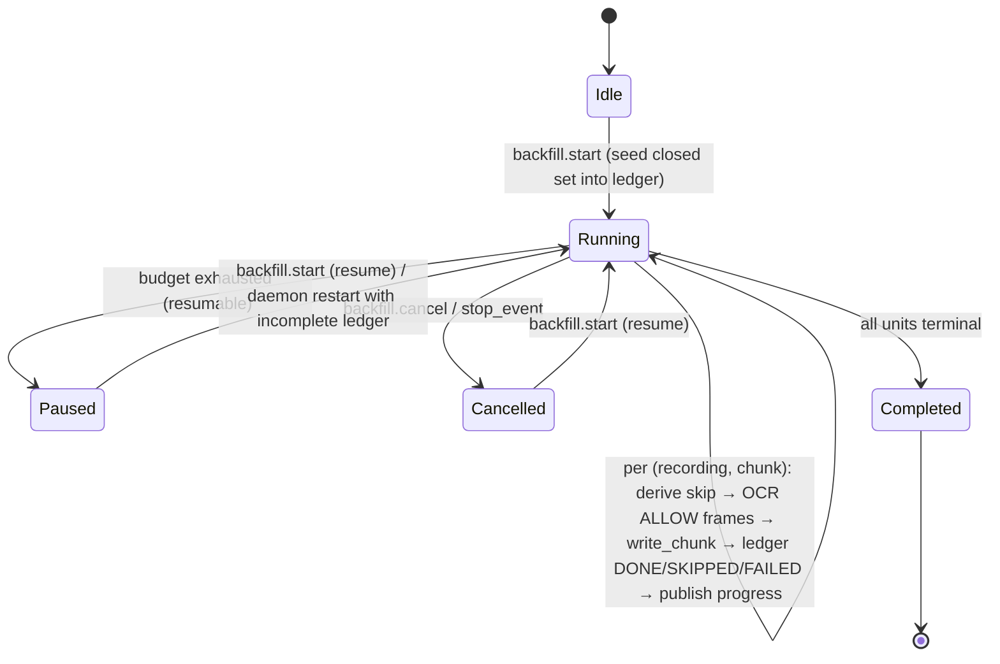
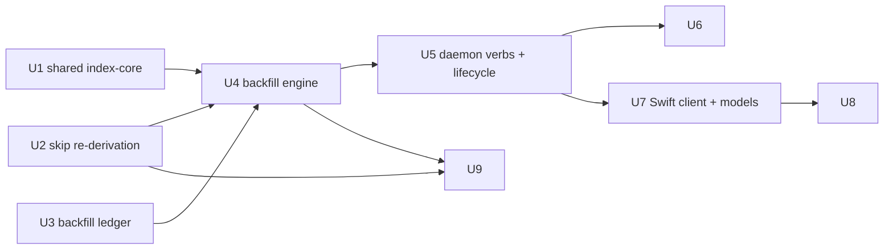

# feat: Backfill on-screen-text index for existing recordings (SCR-178)

## Summary

Add a one-shot, daemon-managed **backfill** that OCR-indexes a user's *existing* local recordings into the content index (`~/.screencap/content_index.db`), so that on-screen-text Search returns hits for history recorded *before* `content_index_enabled` was turned on. The backfill reuses the live `chunk_processor._index_chunk_content` skip rules exactly (ALLOW frames only; never index `SCRUB_BLOCK_ACTIONS` frames), runs as a Supervisor-style background job in the daemon with progress over the EventBus, is cancellable and resumable via an on-disk ledger, and respects a CPU/wall-clock budget. Because no reusable on-disk block-interval data exists in the correct (`SCRUB_BLOCK_ACTIONS`) form, the engine **re-derives** the skip set from each recording's local `recording.db` — which is intact (in-place chunk scrubbing never null-coerces it; only the disposable `<name>-scrubbed/` upload copy is nulled). Re-derivation therefore reproduces the canonical skip set directly; the engine **fails closed** only where re-derivation cannot prove a region ALLOW (a window-event gap left by a retroactive "disable this app" row-deletion, or a policy-relevant column that is null). The Swift consent flow gains an "also index my existing recordings now" affordance with live progress and a cancel control.

---

## Problem Frame

On-screen-text (OCR) Search shipped in SCR-174 (PR [#283](https://github.com/proteus-computer-use/screencap/pull/283)) is **forward-only**: flipping `content_index_enabled` only indexes newly-recorded chunks via the live `chunk_processor` path. So the headline capability — "find that thing I saw" — returns nothing against a user's existing history until they accumulate new recordings. Out of the box, after consent, Search effectively covers only the authoritative timeline stream and silently underperforms on the content stream the consent prompt just enabled. This is the deferred follow-up explicitly carried in SCR-174's plan "Deferred to Follow-Up Work" (see origin: `docs/plans/2026-06-24-002-feat-ask-your-history-search-plan.md`).

---

## Requirements

- R1. A one-shot backfill that OCR-indexes existing local recordings into `content_index.db`.
- R2. Backfill applies the **identical** scrub/skip rules as the live path: ALLOW frames only; never index any frame inside a `SCRUB_BLOCK_ACTIONS` interval (EXCLUDE / MASK_WINDOW / MASK_REGION / TEXT_REDACT / OCR_FALLBACK) or a secure-field interval.
- R3. **Fail-closed where ALLOW cannot be proven:** re-derivation over the intact local `recording.db` normally reproduces the canonical skip set, but where a region cannot be positively classified ALLOW — a screenshot timestamp not covered by any surviving `window_event` (e.g. a retroactive "disable this app" deleted the rows), or a policy-relevant column that is null/ambiguous — the backfill skips it rather than indexing text the derived rules cannot prove ALLOW.
- R4. Local-only: the backfill writes **only** `content_index.db` and never uploads anything (consistent with SCR-174 R7/R8).
- R5. Offered from the consent flow ("also index my existing recordings now") with visible progress.
- R6. The backfill is **cancellable** and **resumable** (survives daemon restart / cancel / budget exhaustion).
- R7. The backfill respects a CPU / wall-clock budget and yields cooperatively.
- R8. **Acceptance:** after consent + backfill, a text search returns hits from recordings made *before* indexing was enabled; backfill honors the same privacy skips as live indexing and is interruptible.
- R9. The backfill coexists safely with retroactive "disable this app" deletes (`scrub_worker._purge_content_index_intervals`) — concurrent writes converge to "purged," never resurrect just-disabled text.

**Origin actors (from SCR-174):** A1 (Operator — non-technical user searching their own history), A2 (Local retrieval layer — on-device daemon + content index).
**Origin flows (from SCR-174):** F2 (Coverage gap / nothing useful — the consent + "still indexing" path this backfill makes real).
**Origin acceptance examples (from SCR-174):** AE4 (consent enables indexing) is extended here so that consenting *also* covers pre-existing history.

---

## Scope Boundaries

- Not a re-scrub: the backfill never modifies `recording.db`, never re-runs masking on captured frames, never alters or re-uploads any recording artifact. It is read-only against recordings and write-only against `content_index.db`.
- No capture/redaction-pipeline changes (consistent with SCR-174's "outside this feature's identity").
- No transcript or timeline backfill — content (OCR) stream only.
- No cloud / off-device processing of any kind.
- No new always-on background scheduling — this is a one-shot, user-initiated job (it may resume automatically after a daemon restart while a run is still incomplete, but it does not re-trigger itself once complete).
- No semantic/embedding indexing — same FTS5 plain-text index the live path writes.

### Deferred to Follow-Up Work

- Stronger reconstruction of block signal across deleted-row coverage gaps (e.g., persisting the canonical `SCRUB_BLOCK_ACTIONS` interval set to disk at scrub time so backfill need not re-derive). Tracked as a follow-up Linear ticket; this plan ships the fail-closed conservative approximation (R3) and documents the residual.
- A live `screencap backfill start --watch` terminal progress renderer (event-stream subscriber). The consent-flow UI (U8) is the supported progress surface per R5; the CLI ships one-shot `start`/`status`/`cancel` only.
- Backfilling the transcript and `browser_url` streams.
- A global "index everything automatically on first launch" onboarding step (kept as an explicit, consented action for now).

---

## Context & Research

### Relevant Code and Patterns

**Live indexing path (the parity target):**
- `src/screencap/chunk_processor.py` — `_index_chunk_content` (gate, fail-open) and `_do_index_chunk_content` (core). Key behaviors to mirror exactly: `has_masking_context` fail-closed guard; `scrub_result.blocked_intervals` + `find_blocked_interval(ts, skip_intervals, skip_starts)` per-frame skip; time-scoping `screenshots/*.jpg` by `[start_ts, end_ts)`; dedup via `screencap.engine.dedup.dhash`/`hamming_distance` (threshold 5); `_stop_event` + wall-clock budget bail; `store.write_chunk(capture_dir.name, start_ms, end_ms, frames)`. Module constants `_INDEX_MAX_OCR_FRAMES = 240`, `_INDEX_OCR_BUDGET_S = 30.0`, `_INDEX_DHASH_THRESHOLD = 5`.
- `src/screencap/content_index.py` — `ContentIndex.write_chunk(recording, start_ms, end_ms, frames)` (replace-whole-chunk-time-range, idempotent, single `BEGIN IMMEDIATE`); `IndexFrame(timestamp_ms, text)`; `delete_recording_interval`; `IndexState` enum; `content_index_write_lock()` (in-process `threading.Lock` + cross-process `fcntl.flock` at `~/.screencap/run/content-index.lock`); keying on **recording directory name**; WAL + `busy_timeout=10000` + `0o600`/`0o700` perms.
- `src/screencap/redaction/ocr.py` — `VisionOcr.recognize(image_path) -> OcrResult`; `OcrResult.text_blocks`. `src/screencap/redaction/geometry.py` — `parse_screenshot_timestamp(filename) -> float | None`.

**Skip-set derivation (the crux):**
- `src/screencap/privacy/actions.py` — `SCRUB_BLOCK_ACTIONS = {EXCLUDE, MASK_WINDOW, MASK_REGION, TEXT_REDACT, OCR_FALLBACK}` (distinct from capture-time `BLOCK_ACTIONS = {EXCLUDE}`).
- `src/screencap/scrubber.py` — `build_scrub_context(db_path, evaluator, classifier, time_range, actions=SCRUB_BLOCK_ACTIONS, ...)` builds `blocked_intervals` **live at scrub time** from `window_event` rows + classifier/evaluator; `build_blocked_intervals(...)`, `build_secure_field_intervals(...)` (scans `action_event.element_state` for `AXSecureTextField`, with a `DEFAULT_TRANSITION_HOLD_SECONDS` hold-window); `BlockedInterval{start, end, action, reason}`; `find_blocked_interval`. **Note the window-event loader coerces `title = row[2] or ''`** — a NULL title is indistinguishable from an empty-string title once loaded as a `WindowContext`, so any raw null-detection must query the columns directly.
- **Data-availability finding (corrected during doc review — the crux):** the local `~/.screencap/recordings/<name>/recording.db` the backfill reads is **NOT column-nulled**. `_null_db_rows_for_intervals` (which nulls `title`/`state`/`browser_url`/`element_state`) runs **only** in `Scrubber.run()` → `scrub_recording`, which operates on a sibling `<name>-scrubbed/` *copy* and never mutates the original. The in-place chunk scrub (`ChunkScrubber.run_chunk`, used by `chunk_processor`) masks screenshots/events/transcripts but never nulls the DB. Retention never touches `recording.db`. The **one** path that mutates the local DB is `enforcement/scrub_worker.py` on a retroactive "disable this app": it **DELETES whole `window_event`/`action_event` rows and unlinks the matching `screenshots/*.jpg`** (then purges the index) — it does not null columns. Consequence: re-derivation over the intact local DB reproduces the canonical `SCRUB_BLOCK_ACTIONS` set with no signal loss; the genuine residual is (a) a `window_event` *gap* left by row-deletion (which also unlinked the screenshots, so usually nothing remains to OCR — largely self-protecting), and (b) ordinary classification ambiguity (a legitimately-empty title under a title-dependent policy). R3's fail-closed posture targets (a) and (b), **not** a column-nulling event.
- `src/screencap/chunk_scrubber.py` — `ChunkScrubber._build` (lines ~164–179) constructs the classifier + evaluator; it applies the `PrivacyMode.PUBLIC` override **only when `cloud_intent` is true** (`_dc_replace(_pc, mode=PrivacyMode.PUBLIC)`), otherwise it uses the configured mode. `has_masking_context`. The backfill must build both the same way and must decide the mode per recording (see U2 — read `.recording_intent`).

**Job/lifecycle precedent:**
- `src/screencap/daemon/supervisor.py` — long-lived task holder on `app.state`, `_publish_daemon_event(event_type, **fields)` progress pattern.
- `src/screencap/daemon/event_bus.py` — `publish` / `subscribe(since=cursor)` with a 256-event replay buffer (subscribe-with-cursor to avoid late-listener races — see `docs/solutions/runtime-errors/eventbus-late-listener-replay-2026-05-12.md`).
- `src/screencap/daemon/_idle_shutdown.py` — `_ACTIVITY_PATHS` (mutating routes only) + `_daemon_is_busy(app)` (defers idle-shutdown while a subscriber/session/inflight-resume exists). A running backfill must register as "busy."
- `src/screencap/daemon/app.py` — verb template: pydantic `schema.*Request` → `asyncio.to_thread(blocking_work)` → `schema.envelope(...)`; routes registered in `build_app()` (lines ~1007–1020). `src/screencap/daemon/schema.py` — `_DaemonModel`, `envelope(...)`, `API_SCHEMA_VERSION = 1`.
- `src/screencap/pipeline_state.py` — `PipelineLedger`: the on-disk, cross-process, closed-set-seeded, tri-state, `BEGIN IMMEDIATE`+`busy_timeout` ledger pattern the backfill ledger should mirror.

**Recording enumeration & config:**
- `src/screencap/catalog.py` — `list_recordings(...)`, chunk-manifest enumeration (`sorted(d.glob("chunk_*_manifest.json"))`, carries `chunk_start`/`chunk_end`/`chunk_index`). `src/screencap/daemon/app.py` — `_iter_recording_dirs` (capped at `_QUERY_MAX_RECORDINGS = 200`).
- `src/screencap/config.py` — `get_content_index_enabled()`, `get_content_index_consent_declined()`, `get_recordings_dir()`, `get_base_dir()`, `invalidate_config_cache()`. Settings read/write via CLI `settings` command (`src/screencap/cli/__init__.py`, `_BOOL_KEYS`); no dedicated `set_content_index_enabled()` setter exists.

**Swift surface (SCR-174):**
- `macos/ScreenCap/Controllers/DaemonClient.swift` — `request<T>(...)` one-shot + `subscribe(...)` events stream; existing typed methods (`contentSearch`, etc.).
- `macos/ScreenCap/Views/Search/SearchViewModel.swift` — `consentNeeded`, `contentIndexEnabled` (consent CTA keys on the flag, not `index_state`); `macos/ScreenCap/Views/Search/SearchView.swift`; `macos/ScreenCap/Views/Search/SearchAccessibility.swift`.

### Institutional Learnings

- `docs/solutions/runtime-errors/chunk-upload-sentinel-gating-and-data-loss.md` — "incomplete state treated as authoritative" → survivorship bias. **Seed a closed set of in-scope work up front** so "% done" has a frozen denominator; keep `PENDING`/`DONE`/`SKIPPED`/`FAILED` as distinct states; never collapse "skipped" into "done." This is why U3 mirrors `PipelineLedger` rather than an in-memory dict.
- `docs/solutions/workflow-issues/privacy-guards-deselected-on-ci-silently-rot-2026-06-10.md` — env-gated (Vision-only) privacy tests rot on CI. **Test the skip predicate everywhere** with a fake OCR stub, independently of any real-Vision integration test; enforce each skip condition separately, don't collapse them into one boolean.
- `docs/solutions/runtime-errors/sigint-handler-timing-and-recording-stop-methods.md` — install the cancel flag *early*; background/launchd-spawned processes inherit `SIG_IGN`; cancel must run the ledger-flush/cleanup path so a cancelled run resumes cleanly.
- `docs/solutions/integration-issues/inner-timeout-unreachable-behind-outer-watchdog-2026-06-24.md` — any lock/`busy_timeout` the backfill waits on must sit **under** the supervising watchdog/budget, and the bound should be a passed-in parameter; emit a progress event *before* a long blocking wait; test real `content_index.db` contention end-to-end.
- `docs/solutions/runtime-errors/eventbus-late-listener-replay-2026-05-12.md` — UI must `subscribe(since=cursor)` *before* triggering the job to avoid missing the initial progress events.

### External References

None required — this is internal-pattern work. OCR, FTS5 writes, SQLite WAL/locking, the daemon job model, and the scrub skip-set all have direct, recently-touched local precedent (≥3 examples each). External research deliberately skipped.

---

## Key Technical Decisions

- **Extract a shared index-core (U1) so skip-rule parity is structural, not copy-pasted.** The live `_do_index_chunk_content` frame-selection → dedup → OCR → `write_chunk` body is extracted into a pure, dependency-injected helper that both the live path and the backfill call. This is the only way to *guarantee* R2 parity and avoid the "two predicates drift apart" privacy failure class.
- **Re-derive the skip set per recording (U2); do not trust on-disk interval data.** Persisted manifest `blocked_intervals` are the capture-time EXCLUDE-only set (wrong set). The backfill re-runs `build_scrub_context(..., actions=SCRUB_BLOCK_ACTIONS)` against the **intact** local `recording.db` with a freshly built classifier+evaluator. **Mode selection:** read each recording's frozen `.recording_intent`; apply `PrivacyMode.PUBLIC` when its destination is cloud/both (matching `ChunkScrubber._build`'s `cloud_intent` branch), use the frozen mode for local-only, and fall back to `PrivacyMode.PUBLIC` (the strictest, fail-closed default) only when `.recording_intent` is absent/unreadable.
- **Fail closed where ALLOW cannot be proven (R3).** Re-derivation over the intact DB reproduces the canonical skip set; additionally, treat as blocked any screenshot timestamp **not covered by a surviving `window_event`** (a retroactive row-deletion gap — biased outward so the inherited classification of an adjacent ALLOW window can't leak across the gap) and any window whose classification is genuinely ambiguous because a policy-relevant column is null (queried via raw SQL on the columns, since the loader coerces `title` NULL→`''`). Accepted tradeoff: may over-skip some legitimately-allowed frames; bias matches the codebase's fail-closed masking posture. (Posture user-confirmed during planning; premise corrected during doc review — the local DB is not column-nulled, so this is gap/ambiguity handling, not nulled-column recovery.)
- **Parity guarantee is "identical given identical config" (R2).** Re-derivation reflects the *current* classifier/evaluator/`PrivacyMode`. If privacy config changed since capture, the re-derived set may block more or less than the original live pass; this is acceptable only in the fail-closed direction (blocks ⊇ original). U2 states this explicitly and U9 tests it.
- **Daemon-managed background job (U4–U5), modeled on `Supervisor` + `EventBus`.** Satisfies "visible progress in the consent flow, cancellable, resumable" since the Swift app already talks to the daemon over UDS. (User-confirmed during planning.)
- **Resume via the content-index's own idempotency + a closed-set ledger (U3).** `write_chunk`'s replace-whole-chunk-time-range makes re-processing a chunk safe; the ledger records which `(recording, chunk)` units are DONE/SKIPPED/FAILED so a resumed run skips completed work and recomputes "% done" against a frozen denominator. **A chunk is marked DONE only when `index_range` processed its entire `[start_ts, end_ts)` range to completion** — a budget/cancel bail mid-chunk leaves the chunk PENDING so the whole-range-replace re-run re-OCRs it from scratch (no permanent half-index).
- **R9 safety rests on unlink-before-write, not the lock alone.** The lock serializes `write_chunk` vs `delete_recording_interval`, but the load-bearing invariant (per `scrub_worker`'s own comment) is that the purge **unlinks screenshots before taking the lock**, so a later read finds an empty disk. The backfill OCRs *outside* the lock, so it must, after acquiring `content_index_write_lock()` and **before** `write_chunk`, re-confirm each in-memory frame's backing screenshot still exists on disk and drop any that were unlinked while OCR was in flight — otherwise an interleaved purge can be resurrected. The lock is still held around the (re-confirm + write) so the purge can't unlink mid-write.
- **One-job-at-a-time.** A single backfill task holder on `app.state`; `backfill.start` while one is running returns the existing job's status rather than spawning a second (avoids double OCR load + lock contention).
- **Budget is a passed-in parameter, sized under the consent-flow watchdog.** Per-slice wall-clock yielding + a global budget; defaults exposed via config but injectable for tests.

---

## Open Questions

### Resolved During Planning

- **Where does the backfill run?** Daemon background job (user-confirmed).
- **Plan scope?** Full stack incl. Swift consent UI (user-confirmed).
- **Privacy posture where ALLOW can't be proven?** Fail-closed (user-confirmed).
- **Reusable on-disk block intervals for old recordings?** None exist in the correct (`SCRUB_BLOCK_ACTIONS`) form → re-derive (research-confirmed).
- **Is the local `recording.db` ever column-nulled?** No (doc-review-confirmed against the codebase). Only the disposable `<name>-scrubbed/` copy is nulled; the local DB is intact, except that retroactive "disable this app" *deletes* rows + unlinks screenshots. R3/U2 were corrected to handle deletion gaps + classification ambiguity, not nulled columns.
- **PrivacyMode for re-derivation?** Read `.recording_intent` per recording; `PUBLIC` for cloud/both, frozen mode for local, `PUBLIC` fail-closed default when absent (doc-review).
- **Auto-resume on daemon restart?** A `Cancelled` ledger must **not** auto-resume (honors the user's last intent); only a `Paused` (budget-exhausted) run may auto-resume. Re-trigger after cancel is an explicit user action (doc-review).
- **Resume granularity?** Per `(recording, chunk)` unit, chunk boundaries from manifests, falling back to a synthesized whole-recording window (min/max screenshot timestamps) when manifests are absent. A chunk is DONE only on full-range completion; mid-chunk bail stays PENDING.

### Deferred to Implementation

- **Tightest safe ambiguity predicate.** The exact raw-SQL/heuristic for the residual classification-ambiguity case (legitimately-empty title under a title-dependent policy; `element_state` null spans) is resolved against real `recording.db` rows during U2 — queried directly on the columns (not via the `WindowContext` loader, which coerces NULL→`''`). The plan fixes the *direction* (fail-closed) and the test matrix; the implementer picks the tightest safe predicate.
- **Ledger location.** Prefer a **sibling `~/.screencap/backfill_state.db`** over a `backfill_state` table inside `content_index.db` — colocation risks `fcntl.flock` re-entrancy/contention with `content_index_write_lock()`. If colocated anyway, `ledger.mark(...)` must never run while that lock is held. Decide during U3; both are local-only.
- **Global budget defaults (seconds, max frames/recording).** Tune against real OCR throughput on a representative library during U4; ship conservative defaults. On large libraries (> `_QUERY_MAX_RECORDINGS = 200`, or budget exhausted before the tail) the run must surface a "still N recordings pending — re-run to continue" state rather than reporting a misleading "Completed" (see U4/U8).

---

## High-Level Technical Design

> *This illustrates the intended approach and is directional guidance for review, not implementation specification. The implementing agent should treat it as context, not code to reproduce.*

**Job lifecycle (cancellable / resumable / budgeted):**



**Data flow per unit (parity with live path enforced by the shared core):**

```
recording.db ──build_scrub_context(SCRUB_BLOCK_ACTIONS)──┐
                                                          ├─► skip_intervals (re-derived ∪ gap/ambiguity) ─┐
classifier+evaluator (PrivacyMode.PUBLIC override) ───────┘                                                   │
                                                                                                              ▼
screenshots/*.jpg in [start_ts,end_ts) ─► time-scope ─► drop skip frames ─► dhash dedup ─► VisionOcr ─► IndexFrame[]
                                                                                                              │
                                                          content_index_write_lock() ─► ContentIndex.write_chunk(dir_name, …) ─► content_index.db (local-only)
```

The boxes from "time-scope" through `write_chunk` are the **shared core (U1)** invoked identically by the live `chunk_processor` and the backfill engine. Only the *source* of `skip_intervals` differs (live = `scrub_result.blocked_intervals`; backfill = U2 re-derivation).

---

## Implementation Units

> Phases: **P1 Engine** (U1–U4) → **P2 Daemon API** (U5–U6) → **P3 Swift UI** (U7–U8) → **P4 Hardening/Docs** (U9). Dependency graph below.



### U1. Extract shared content-index core from `chunk_processor`

**Goal:** Factor the live frame-selection → dedup → OCR → `write_chunk` body into a pure, dependency-injected helper so the live path and the backfill share one implementation of the skip/index rules (structural R2 parity).

**Requirements:** R2, R4, R7

**Dependencies:** None

**Files:**
- Create: `src/screencap/index_core.py`
- Modify: `src/screencap/chunk_processor.py` (have `_do_index_chunk_content` delegate to the new helper)
- Test: `tests/test_index_core.py`

**Approach:**
- Define a helper, roughly `index_range(capture_dir, start_ts, end_ts, skip_intervals, *, ocr, store, stop_event, budget_s, max_frames, dhash_threshold) -> IndexRangeResult` where the result carries both `rows_written` and a **`completed_range: bool`** (False when the loop bailed early on `stop_event`/budget). Callers gate the ledger DONE transition on `completed_range` (U4). It owns: glob+`parse_screenshot_timestamp` time-scoping, `find_blocked_interval` skip, `dhash`/`hamming_distance` dedup, `VisionOcr.recognize`, `IndexFrame` build, and `write_chunk`.
- **Lock + unlink-before-write barrier:** acquire `content_index_write_lock()` around the write; immediately before `write_chunk`, re-`stat` each frame's backing screenshot and drop any `IndexFrame` whose file was unlinked while OCR was in flight (R9 — prevents resurrecting a concurrently-purged interval). The live path's OCR sits adjacent to its write so its exposure is small, but the same barrier is correct for both callers.
- Inject `ocr`, `store`, `stop_event`, and budgets so tests can pass a fake OCR and a temp store. Move the live constants (`_INDEX_MAX_OCR_FRAMES`, `_INDEX_OCR_BUDGET_S`, `_INDEX_DHASH_THRESHOLD`) into `index_core` and re-import them in `chunk_processor` to keep one source of truth.
- `chunk_processor._do_index_chunk_content` keeps its `has_masking_context` fail-closed guard and passes `scrub_result.blocked_intervals` as `skip_intervals`; net behavior unchanged.

**Execution note:** Characterization-first — add a test pinning current live-path indexing output (given fixed frames + intervals) before extracting, so the refactor is provably behavior-preserving.

**Patterns to follow:** `src/screencap/chunk_processor.py` `_do_index_chunk_content`; `src/screencap/content_index.py` `content_index_write_lock` usage.

**Test scenarios:**
- Happy path: given 5 frames in range with no skip intervals and a fake OCR returning distinct text, `index_range` writes 5 rows via the store.
- Edge case: frames outside `[start_ts, end_ts)` are excluded; an empty range writes 0 rows and does not create an empty store.
- Edge case: two near-identical consecutive frames (hamming ≤ threshold) → only the first is OCR'd/written (dedup).
- Edge case: `max_frames` cap truncates candidate list.
- Error/budget path: `stop_event` set mid-loop → returns `completed_range=False` having written only pre-stop frames, no exception. Wall-clock budget exceeded → same cooperative bail with `completed_range=False`. A full pass returns `completed_range=True`.
- Skip path: frames inside a `skip_intervals` interval are never passed to OCR (assert the fake OCR was not called for those timestamps).
- R9 barrier: a frame whose backing screenshot is unlinked between OCR and the pre-`write_chunk` re-`stat` is dropped from the written set (assert it is absent from the store).
- Integration: `chunk_processor._do_index_chunk_content` still produces identical rows to the pre-refactor characterization snapshot.

**Verification:** Live indexing behavior is unchanged (characterization snapshot matches); the shared helper is the single place skip+index logic lives.

---

### U2. Re-derive the `SCRUB_BLOCK_ACTIONS` skip set with fail-closed gap/ambiguity handling

**Goal:** Produce, for a finished recording, the set of intervals the backfill must skip — the canonical `SCRUB_BLOCK_ACTIONS` intervals re-derived from the intact local `recording.db`, unioned with conservative intervals for coverage gaps (deleted rows) and classification ambiguity (null policy-relevant columns) where ALLOW can't be proven (R3).

**Requirements:** R2, R3

**Dependencies:** None

**Files:**
- Create: `src/screencap/backfill/__init__.py`, `src/screencap/backfill/skip_intervals.py`
- Test: `tests/backfill/test_skip_intervals.py`

**Approach:**
- `derive_skip_intervals(db_path, *, classifier, evaluator, time_range) -> list[BlockedInterval]`:
  1. Re-run `build_scrub_context(db_path, evaluator, classifier, time_range, actions=SCRUB_BLOCK_ACTIONS)` and take `ctx.blocked_intervals` (includes secure-field intervals via `build_secure_field_intervals`). Over the **intact** local DB this is the canonical skip set.
  2. **Coverage-gap intervals (fail-closed):** for every screenshot timestamp in range with **no covering `window_event`** (a retroactive "disable this app" deleted those rows), emit a `BlockedInterval` (reason = `uncovered_gap`) spanning the gap, biased outward so an adjacent ALLOW window's classification cannot leak across the boundary. (Such gaps usually have their screenshots already unlinked, so this is belt-and-suspenders, but it closes the case where an orphan frame survives.)
  3. **Ambiguity intervals (fail-closed):** via **raw SQL on the columns** (not the `WindowContext` loader, which coerces `title` NULL→`''`), skip windows whose classification genuinely depends on a column that is null — a known-browser `app_bundle_id` with `browser_url IS NULL` whose policy routes on URL, a `title IS NULL` window under a title-dependent policy, an `element_state IS NULL` span where a secure field could have been. `app_bundle_id` is never nulled, so bundle-id-classified apps (password managers, banking) need no ambiguity handling.
  4. Return the merged/sorted union.
- **Mode selection per recording:** read the frozen `.recording_intent`; build the classifier+evaluator as `ChunkScrubber._build` does, applying `PrivacyMode.PUBLIC` for cloud/both destinations, the frozen mode for local-only, and `PUBLIC` as the fail-closed default when `.recording_intent` is absent/unreadable. Re-derivation reflects *current* policy — acceptable only because it can only block more (fail-closed direction). Expose a small constructor helper so U4 and tests share it.
- Inherit `build_scrub_context`'s `has_column`/`has_table` guards so the predicate doesn't throw on legacy `recording.db` schemas predating `browser_url`/`element_state`.
- Document the corrected premise (local DB intact; this handles deletion gaps + ambiguity, not nulled columns) and the over-skip tradeoff in the module docstring.

**Execution note:** Test-first on the predicate — this is the privacy-load-bearing unit; the skip set must be proven against fixtures before the engine consumes it.

**Patterns to follow:** `src/screencap/scrubber.py` `build_scrub_context`/`build_blocked_intervals`/`build_secure_field_intervals`; `src/screencap/chunk_scrubber.py` `_build`.

**Test scenarios:**
- Happy path (intact DB): a `recording.db` with intact rows re-derives the same intervals a fresh scrub would (a known sensitive bundle blocks; a benign window does not).
- Coverage gap: a screenshot timestamp with no covering `window_event` (deleted rows) → that span is in the skip set (`uncovered_gap`), biased so the adjacent ALLOW window doesn't leak across.
- Ambiguity: a known-browser window with `browser_url IS NULL` under a URL-dependent policy → skipped; a bundle-id-classified sensitive app with intact rows → blocked via normal classification (no ambiguity path needed).
- Ambiguity via raw SQL: `title IS NULL` is detected against the column directly (a fixture proving the `WindowContext` loader's NULL→`''` coercion would hide it).
- Secure-field: an `element_state IS NULL` span → skipped; an intact `AXSecureTextField` span → skipped via normal `build_secure_field_intervals`, including the hold-window.
- Mode: a recording whose `.recording_intent` is cloud/both → `PUBLIC`; local-only → frozen mode; missing `.recording_intent` → `PUBLIC` (fail-closed).
- Edge case: empty `recording.db` / no rows in range → empty skip set, no exception; legacy schema missing `browser_url` → guarded, no throw.
- Edge case: trailing open interval (`end = inf`) preserved through the merge.
- Parity (coverage-equivalence, not element-wise): every timestamp the live per-chunk path blocks is blocked by the re-derived set, and every ALLOW timestamp stays ALLOW, for an identical intact DB + classifier/evaluator. (Element-wise interval identity is *not* asserted — the live path builds per-chunk-time-range, the backfill per-recording.)

**Verification:** Over intact fixtures the function reproduces the canonical skip set; over a deletion-gap fixture it skips the uncovered region; the returned set is always a superset of (never a subset of) what current-policy live scrubbing would block.

---

### U3. Backfill ledger (closed-set, resumable, cross-process)

**Goal:** Persist per-`(recording, chunk)` backfill progress so a run is genuinely resumable and "% done" is computed against a frozen denominator.

**Requirements:** R6

**Dependencies:** None

**Files:**
- Create: `src/screencap/backfill/ledger.py`
- Test: `tests/backfill/test_backfill_ledger.py`

**Approach:**
- Mirror `PipelineLedger`: a SQLite table (`backfill_unit_state`) keyed by `(recording_dir_name, chunk_index)` with status `PENDING`/`DONE`/`SKIPPED`/`FAILED`, `rows_written`, `updated_at`. WAL + `busy_timeout` + `BEGIN IMMEDIATE` per transition; `0o600`/`0o700` perms.
- API: `seed(units)` (closed-set, idempotent — never silently expands the denominator on re-seed), `mark(recording, chunk, status, rows_written=…)`, `next_pending() -> unit | None`, `progress() -> (done, skipped, failed, total)`, `is_complete()`, `is_cancelled()` (distinguishes a cancelled run from a budget-paused one for the auto-resume rule in U5), `reset()`.
- **Location:** prefer a **sibling `~/.screencap/backfill_state.db`** so ledger writes never share the `fcntl.flock`/WAL that `content_index_write_lock()` guards (avoids re-entrancy/contention when `index_range` holds the content-index lock). If colocated in `content_index.db` is chosen instead, `mark(...)` must be called strictly **outside** the `content_index_write_lock()` scope. Local-only either way.

**Patterns to follow:** `src/screencap/pipeline_state.py` `PipelineLedger`.

**Test scenarios:**
- Happy path: seed N units → all `PENDING`; mark some `DONE`/`SKIPPED` → `progress()` denominator stays N.
- Resume: after marking a subset terminal, `next_pending()` returns only un-done units; `is_complete()` flips only when every unit is terminal.
- Edge case: re-`seed` with the same closed set is idempotent (no denominator drift, no duplicate rows); seeding a strictly different set is an explicit reset, not a silent merge.
- Concurrency: two connections writing transitions don't corrupt state (BEGIN IMMEDIATE + busy_timeout); `SKIPPED` never collapses into `DONE`.
- Crash-safety: a unit left `PENDING` after an aborted run is picked up on the next `next_pending()`.

**Verification:** A run interrupted at any unit boundary resumes from exactly the un-terminal units with the original denominator intact.

---

### U4. Backfill engine (enumerate → seed → run → progress / budget / cancel)

**Goal:** The runnable engine that enumerates existing recordings + chunks, seeds the ledger, drives U1's shared core with U2's skip set per unit, emits progress, and honors a global budget + cancel flag — strictly fail-open.

**Goal cont.:** This is the destination-agnostic core the daemon (U5) and CLI (U6) both invoke.

**Requirements:** R1, R2, R3, R4, R6, R7, R8, R9

**Dependencies:** U1, U2, U3

**Files:**
- Create: `src/screencap/backfill/engine.py`
- Test: `tests/backfill/test_backfill_engine.py`

**Approach:**
- `run_backfill(*, recordings_dir, stop_event, progress_cb, budget_s, max_frames_per_recording, ledger) -> BackfillSummary`:
  - Enumerate recordings (reuse `catalog`/`_iter_recording_dirs`); enumerate chunks from manifests (`chunk_start`/`chunk_end`/`chunk_index`), falling back to a synthesized whole-recording window from screenshot min/max timestamps, biased outward by the secure-field hold-seconds so a secure-field event near a synthesized boundary stays fully skipped.
  - **Large-library coverage:** if the recording count exceeds `_QUERY_MAX_RECORDINGS` (200) or the budget is exhausted before the tail, the run does **not** report `Completed` — it returns `Paused` with the pending remainder so U8 can surface "still N recordings pending — re-run to continue" rather than silently truncating R8 coverage.
  - Open `recording.db` **read-only** (the backfill never mutates recordings); seed the closed set into the ledger (skip units already terminal on resume).
  - Per unit: build classifier+evaluator once per recording (mode per `.recording_intent`, U2); `skip = derive_skip_intervals(...)` (U2); `result = index_range(...)` (U1, which holds `content_index_write_lock()` + the unlink-before-write barrier internally); then **mark DONE only if `result.completed_range`**, else leave PENDING (mid-chunk budget/cancel bail re-runs cleanly via whole-range replace). Call `ledger.mark(...)` **outside** the content-index lock scope. `progress_cb(done, skipped, failed, total, current_unit_index)` — emit an opaque unit index, **not** the recording directory name (R9/privacy: the name must not cross the EventBus to MCP subscribers — see U5).
  - Skip a recording with no `screenshots/` or no `recording.db` as `SKIPPED` (not `FAILED`); a recording whose `screenshots/` were retention-evicted is a normal `SKIPPED`, not a `FAILED`.
  - Cancel/budget: poll `stop_event` and wall-clock between units *and* between frames (the core already polls per-frame); a budget/cancel exit flushes the ledger and returns a `Paused`/`Cancelled` summary — never raises, never corrupts (fail-open).
  - Per-recording exceptions are caught → `FAILED` for that unit, continue (one bad recording never aborts the run).

**Execution note:** Establish the cancel flag and ledger handle *before* heavy init (classifier build, OCR) so cancel during setup is honored; don't assume an inherited SIGINT disposition (daemon/launchd context).

**Patterns to follow:** `src/screencap/daemon/supervisor.py` progress-event shape; `docs/solutions/runtime-errors/chunk-upload-sentinel-gating-and-data-loss.md` closed-set discipline.

**Test scenarios:**
- Covers R8. Happy path: two pre-existing recordings with ALLOW frames → after `run_backfill`, a `ContentIndex.search` for indexed text returns hits keyed to those recording dir names.
- Covers R8 (real-scrub path). A recording that went through the **real** `ChunkScrubber.run_chunk` masking (containing an EXCLUDE/MASK_WINDOW/MASK_REGION/secure-field window) → ALLOW-window text is searchable AND no text from the masked/blocked windows appears in the index. (The production scenario: scrub-on capture, then backfill.)
- Covers R2/R3. A recording with a blocked interval (from U2) → frames in that interval are absent; an uncovered-gap (deleted-row) region is absent.
- DONE-gating: a chunk truncated mid-frame-loop by `budget_s` stays PENDING (not DONE) and is fully re-indexed on resume, with the late-half frames present in the final index.
- Resume: a run cancelled after recording 1 → second invocation indexes only recording 2 (ledger-driven), final index covers both.
- Budget / large library: a tiny `budget_s` (or > `_QUERY_MAX_RECORDINGS` fixture) → run returns `Paused` with a pending remainder, not `Completed`; a follow-up run completes it.
- Cancel: `stop_event` set → returns `Cancelled` promptly, no partial-row corruption, resumable.
- Edge case: a recording missing `screenshots/` or `recording.db` → marked `SKIPPED`, run continues.
- Error path: `derive_skip_intervals` raising for one recording → that unit `FAILED`, others still indexed.
- Integration (R9 resurrection ordering): backfill OCRs interval X (lock not held), a purge then deletes X and unlinks its screenshots, backfill then takes the lock and attempts to write X → X is absent from the final index (the unlink-before-write re-`stat` barrier drops it).

**Verification:** Backfilling a fixture library — including a genuinely-scrubbed recording — yields searchable hits for pre-existing ALLOW content, honors all R2/R3 skips, and is resumable/cancellable/budgeted without data corruption or purge resurrection.

---

### U5. Daemon backfill verbs, schema, progress events, and idle-shutdown deferral

**Goal:** Expose `backfill.start` / `backfill.status` / `backfill.cancel` over the UDS API, run U4 as a single Supervisor-style background task, publish progress on the EventBus, and keep the daemon alive while a run is active.

**Requirements:** R1, R5, R6, R7

**Dependencies:** U4

**Files:**
- Create: `src/screencap/daemon/backfill_job.py` (task holder on `app.state`)
- Modify: `src/screencap/daemon/app.py` (handlers + route registration), `src/screencap/daemon/schema.py` (request/response models + progress event payload), `src/screencap/daemon/_idle_shutdown.py` (`_daemon_is_busy` returns true while a backfill is active)
- Test: `tests/daemon/test_backfill_api.py`

**Approach:**
- `BackfillJob`: holds a single asyncio task + `threading.Event` stop flag; `start()` is idempotent (returns running job's status if one exists); runs `run_backfill` via `asyncio.to_thread`; `progress_cb` publishes `backfill.progress` events via `EventBus.publish` (and a terminal `backfill.completed`/`backfill.cancelled`/`backfill.paused`).
- **Auto-resume rule:** on daemon startup, a `Paused` (budget-exhausted) ledger may auto-resume; a `Cancelled` ledger must **not** auto-resume (honors the user's last expressed intent — re-trigger is an explicit `backfill.start`). A `Completed` ledger never re-runs. This prevents a restart from silently overriding a user's cancel and prevents cron-driven `screencap status` auto-spawns from repeatedly re-burning CPU.
- **Progress payload privacy (R9):** `backfill.progress`/`backfill.status` carry only `(state, done, skipped, failed, total, current_unit_index)` — an opaque ordinal, **never** the recording directory name (which encodes timing/context and would leak to any same-EUID EventBus subscriber, including the MCP `/v0/events` subscription). The existing read verbs are class-name-only/pointer-only for the same reason; the backfill events must match that bar.
- Handlers mirror the existing read-verb template (`schema.*Request` → `to_thread` → `envelope`).
- `_daemon_is_busy(app)` adds `backfill_job.is_running()` so idle-shutdown never kills a live run; `backfill.*` routes are **not** added to `_ACTIVITY_PATHS` (they aren't recording-mutating, and status-polling shouldn't reset the idle timer — the busy predicate covers liveness).
- Size any lock/busy_timeout the job waits on under the job's own budget; emit a progress event before long blocking waits.

**Patterns to follow:** `src/screencap/daemon/supervisor.py`; `src/screencap/daemon/app.py` `content_search`; `src/screencap/daemon/event_bus.py`.

**Test scenarios:**
- Happy path: `backfill.start` launches a run (fake engine) → `backfill.status` reports `running` then `completed`; progress events observed on the bus.
- Idempotency: a second `backfill.start` while running returns the existing job's status, does not spawn a second task.
- Cancel: `backfill.cancel` sets the stop flag → status transitions to `cancelled`; the engine's ledger reflects partial progress.
- Liveness: `_daemon_is_busy` is true while the job runs (idle-shutdown deferred); false once terminal.
- Validation/error: malformed request → `_api_error_response`; engine exception → terminal `failed` status, daemon stays up.
- Replay: a subscriber that joins after start (with `since=cursor`) still receives buffered progress events.
- Auto-resume: a `Cancelled` ledger does NOT auto-resume on restart; a `Paused` ledger does.
- Privacy: no `backfill.*` event payload contains a recording directory name (asserted by U9's guard).

**Verification:** A client can start, observe progressing status + bus events, and cancel a backfill over the socket; the daemon will not idle-shut-down mid-run; a cancelled run stays cancelled across restart.

---

### U6. CLI thin-client subcommand (`screencap backfill`)

**Goal:** A thin CLI over the daemon verbs (`start` / `status` / `cancel`) for headless use, scripting, and end-to-end testing — consistent with the daemon-client + auto-spawn pattern.

**Requirements:** R1, R5, R6

**Dependencies:** U5

**Files:**
- Modify: `src/screencap/cli/__init__.py` (new `backfill` command group; deferred heavy imports; `rich.console.Console` output)
- Test: `tests/test_cli_backfill.py`

**Approach:**
- `screencap backfill start`, `screencap backfill status [--json]`, `screencap backfill cancel` — thin one-shot HTTP clients over the UDS via `cli/_daemon_client.py`, reusing auto-spawn (`cli/_autospawn.py`). Polling `status --json` serves the end-to-end test/scripting goal without an event-stream subscriber. (A live `--watch` progress renderer is deferred — see Scope Boundaries; the consent-flow UI in U8 is the supported progress surface per R5.)
- Reuse the existing transport-failure UX when the daemon is down.

**Patterns to follow:** existing live-state CLI commands (`start`/`stop`/`status`) and the `settings` command in `src/screencap/cli/__init__.py`.

**Test scenarios:**
- Happy path: `backfill start` against a stub daemon prints a started/queued confirmation; `status --json` emits the status envelope.
- `cancel` issues the cancel verb and reports the resulting state.
- Error path: daemon unreachable → the standard transport-failure message, non-zero exit.

**Verification:** The full lifecycle (start → status → cancel) is drivable from the CLI against the daemon.

---

### U7. Swift `DaemonClient` methods + Codable models + progress subscription

**Goal:** Typed Swift access to the three backfill verbs and the progress event stream, mirroring the existing `DaemonClient` patterns.

**Requirements:** R5, R6, R7

**Dependencies:** U5

**Files:**
- Modify: `macos/ScreenCap/Controllers/DaemonClient.swift` (`backfillStart` / `backfillStatus` / `backfillCancel` + a typed progress-event decode in the events subscription)
- Create: `macos/ScreenCap/Models/BackfillStatus.swift` (Codable status + progress models)
- Test: `macos/ScreenCapTests/DaemonClientBackfillTests.swift`

**Approach:**
- Add `static func backfillStart/Status/Cancel(...) async throws -> BackfillStatusResponse` using the existing `request<T>(...)` helper; decode `backfill.progress`/`backfill.completed`/`backfill.cancelled`/`backfill.paused` events in/alongside the existing `subscribe(...)` path. Pointer-only/local-only; the progress model carries `done/skipped/failed/total/currentUnitIndex` (an opaque ordinal) — **no recording name** (matches U5's payload).

**Patterns to follow:** `macos/ScreenCap/Controllers/DaemonClient.swift` `contentSearch` + `subscribe`; existing Codable models under `macos/ScreenCap/Models/`.

**Test scenarios:**
- Decode a `backfill.status` envelope into `BackfillStatusResponse` (all states incl. `paused`).
- Decode a `backfill.progress` event into the progress model (done/skipped/failed/total/currentUnitIndex).
- Error path: an error envelope surfaces the existing `DaemonClientError`.
- Edge case: a malformed/unknown event type on the stream is ignored, not fatal.

**Verification:** The Swift app can invoke and decode all three verbs and render streamed progress.

---

### U8. Consent-flow "also index existing recordings" affordance + progress UI

**Goal:** When the user consents to on-screen-text indexing, offer to backfill existing recordings, show live progress, and allow cancel — wired into the existing Search consent surface.

**Requirements:** R5, R6, R8

**Dependencies:** U7

**Files:**
- Modify: `macos/ScreenCap/Views/Search/SearchViewModel.swift` (backfill trigger + progress state, alongside `consentNeeded`/`contentIndexEnabled`), `macos/ScreenCap/Views/Search/SearchView.swift` (the affordance + progress + cancel control), `macos/ScreenCap/Views/Search/SearchAccessibility.swift` (VoiceOver labels + keyboard control for the new controls)
- Test: `macos/ScreenCapTests/SearchViewModelBackfillTests.swift`

**Approach:**
- **Placement & modality:** when the user taps "Turn on" in the existing inline `consentBanner`, replace the banner body in place with the backfill offer ("Index your existing recordings now?" + Accept / Skip) before fully dismissing — one affordance slot, no new window. On Skip, dismiss to the normal post-consent state (no blank gap). Persist a Skip the same way `content_index_consent_declined` is persisted (a `content_index_backfill_declined`-style flag) so the offer doesn't re-nag every search; the user can still trigger it later from the same surface.
- On Accept: subscribe to progress *before* calling `backfillStart` (avoid the late-listener race).
- **Affordance state machine & copy** (drive `SearchViewModel`):
  - *starting* — between `backfillStart` succeeding and the first progress event (the engine seeds the closed set first, so `total` is briefly 0): indeterminate spinner, "Preparing to index…".
  - *indexing* — determinate `done/total` once `total > 0`; `failed` surfaced only if non-zero; `skipped` is a privacy-correct outcome and is **not** shown as an error (collapse silently or label neutrally). Cancel button bound to `backfillCancel`.
  - *done* (failed == 0) — "Done — your recording history is now searchable." *done* (failed > 0) — hedged: "Indexed N of M recordings. K could not be indexed." *paused* (budget/large library) — "Indexed N of M so far — resume to continue" with a Resume action.
  - *cancelled* — "Indexing paused — you can resume later." with a **Resume** action in the same slot (calls `backfillStart`, which resumes via the ledger).
  - *start-failed* (daemon unreachable / `backfillStart` rejected) — inline "Couldn't start indexing — try again later"; search stays fully usable.
- Keep the local-only framing consistent with R4 ("searches only what's on this Mac").
- **Return-key ownership:** while the affordance is in `indexing`/`starting` (cancel button prominent), stand down the existing `returnKeyHandler` (mirror the `results.consentNeeded && !consentDeclined` guard) so the hidden open-selected-result handler doesn't steal Return.
- **Accessibility:** new controls get VoiceOver labels and are keyboard-operable (SCR-183). VoiceOver **announces terminal transitions only** (done / paused / cancelled / start-failed) via a `SearchAccessibility` builder mirroring `searchOutcomeAnnouncement` — in-progress `done/total` ticks do **not** announce (avoids flooding during a long run).

**Patterns to follow:** SCR-174 consent CTA in `SearchViewModel`/`SearchView` (`consentBanner`, `enableConsent()`, `declineConsent()`); `macos/ScreenCap/Views/Search/SearchAccessibility.swift` `searchOutcomeAnnouncement`; the `subscribe(since:)` usage pattern; `content_index_consent_declined` persistence.

**Test scenarios:**
- Happy path: consenting + Accept calls `backfillStart` and moves the view model `starting → indexing → done`; progress events update done/total; "done" copy reflects failed==0.
- Starting state: between start and first event (`total==0`) the model is in `starting` (indeterminate), not a broken `0/0`.
- Partial failure: a status with `failed > 0` renders the hedged "done" copy; `skipped > 0` alone does not render as an error.
- Cancel + resume: tapping cancel → `cancelled` with a Resume action; Resume calls `backfillStart` and returns to `indexing`.
- Paused (large library/budget): a `paused` status renders the "resume to continue" affordance.
- Start-failure: `backfillStart` throwing → inline error state, search still usable.
- Subscription ordering: the view model subscribes before starting (no missed initial events).
- Decline-backfill: Accept-flag but Skip-backfill leaves indexing forward-only; no job starts; the Skip is persisted so it doesn't re-prompt next search.
- Coverage state: after backfill completes, the consent CTA no longer implies missing history.
- Accessibility: terminal transitions announce once each; in-progress ticks do not announce; controls are keyboard-reachable; Return stands down during `indexing`.

**Verification:** From the Search consent surface a user can start, watch, cancel, and resume a backfill with defined copy for every terminal state; after completion, searching returns hits from pre-existing recordings (R8).

---

### U9. Privacy guards, contention test, and documentation

**Goal:** Lock in the privacy invariants with CI-safe tests, prove cross-process safety against the live writer + purge, and document the residual fail-closed-coverage limitation.

**Requirements:** R2, R3, R4, R9

**Dependencies:** U2, U4

**Files:**
- Modify: `SECURITY.md` (backfill trust boundary: local-only write, ALLOW-only, fail-closed residual + the deferred stronger mitigation)
- Create: `tests/backfill/test_backfill_privacy_guards.py`, `tests/backfill/test_content_index_contention.py`
- Test: (the two files above)

(The `docs/solutions/` learning-capture doc is a post-merge artifact — see Documentation / Operational Notes — not an in-band deliverable, since the real lessons are clearest after implementation.)

**Approach:**
- Predicate-level privacy guard that runs **everywhere** (fake OCR, no Vision dependency): assert the engine never emits an `IndexFrame` for any timestamp inside a `SCRUB_BLOCK_ACTIONS`, uncovered-gap, or ambiguity interval, with each skip condition enforced independently (no single boolean collapsing them).
- **Real-scrub privacy guard:** run the actual `ChunkScrubber.run_chunk` masking over a fixture recording (EXCLUDE/MASK_WINDOW/MASK_REGION/secure-field windows), then backfill it, asserting masked-window text is absent and ALLOW text is present (the production scrub-on-then-backfill path; coordinates with U4's R8 real-scrub scenario).
- **Contention test — both orderings:** a real `content_index.db` exercised by a backfill `write_chunk` and a `delete_recording_interval` purge. (1) Purge-then-write under the lock → purged interval absent. (2) **Resurrection ordering:** backfill OCRs interval X with the lock *not* held, purge deletes X + unlinks its screenshots, backfill takes the lock and attempts to write X → X absent (the unlink-before-write re-`stat` barrier drops it). The lock wait is bounded under the job budget.
- **EventBus privacy guard:** assert no `backfill.*` event payload contains a recording directory name (only opaque counters/index).
- **Read-only guard:** assert the backfill opens `recording.db` read-only and writes only `content_index.db` / the ledger store — no upload path touched (mirror `upload.assert_uploadable` rejection expectations conceptually).
- SECURITY.md: state that backfill = same sensitivity class as live local OCR index (only ALLOW frames, never uploaded, purged on destroy); that re-derivation is over the intact local DB and is fail-closed on coverage gaps + classification ambiguity (documented over-skip tradeoff); and that progress events are recording-name-free.

**Execution note:** These guards must not be `@pytest.mark.privacy`-gated behind a real-Mac-only run — that's the exact rot this repo already got burned by (SCR-110). (The real-scrub guard may need a Vision-available split; keep the predicate-level guards Vision-free so the core invariant always runs on CI.)

**Test scenarios:**
- Privacy guard: blocked-interval, uncovered-gap, and ambiguity timestamps never reach the store (fake OCR call assertions), runs on CI.
- Independence: disabling one skip source in a fixture doesn't silently disable another.
- Contention (purge-then-write): interleaved backfill-write + purge under the shared lock → purged interval absent; no deadlock within the bounded wait.
- Contention (resurrection ordering): OCR-then-purge-then-write → purged interval absent via the unlink-before-write barrier.
- EventBus: no recording directory name appears in any `backfill.*` event payload.
- Read-only / local-only: no write occurs outside `content_index.db` / the ledger store; `recording.db` opened read-only.

**Verification:** The ALLOW-only + fail-closed + local-only + name-free invariants are enforced by tests that run on CI, the resurrection ordering is proven safe, and the residual limitation is documented in `SECURITY.md`.

---

## System-Wide Impact

- **Interaction graph:** New daemon verbs share `app.state` with the recording `Supervisor`; the backfill job, the live `chunk_processor` indexer, and `scrub_worker._purge_content_index_intervals` all write `content_index.db` and **must** serialize on `content_index_write_lock()` — and the backfill, which OCRs outside the lock, additionally relies on the purge's unlink-before-lock barrier (re-`stat`-before-write) to avoid resurrecting a concurrently-purged interval. The EventBus gains new `backfill.*` event types (additive, recording-name-free).
- **Error propagation:** Backfill is strictly fail-open — per-recording errors degrade to `FAILED` units, budget/cancel degrade to resumable `Paused`/`Cancelled`; nothing aborts the daemon or corrupts the index.
- **State lifecycle risks:** Closed-set ledger prevents survivorship-bias "done"; `write_chunk`'s replace-whole-range makes re-processing idempotent; a chunk is DONE only on full-range completion (mid-chunk bail stays PENDING); cancel/budget exits flush the ledger before returning; a `Cancelled` ledger never auto-resumes.
- **API surface parity:** `backfill.*` follows the existing verb template (schema models, envelope, validation, pointer-only) and the CLI thin-client + auto-spawn pattern; Swift client mirrors `DaemonClient` conventions.
- **Integration coverage:** Unit tests with fakes; an end-to-end test that backfills a fixture library — including a genuinely `ChunkScrubber.run_chunk`-scrubbed recording — and searches it (R8); and a `content_index.db` contention test covering both purge orderings incl. resurrection (R9).
- **API surface parity (privacy):** `backfill.*` events are recording-name-free, matching the class-name-only/pointer-only bar of the existing `content.search`/`timeline.query` verbs so MCP `/v0/events` subscribers gain no new recording-identifying data flow.
- **Unchanged invariants:** Capture, masking, and the redaction pipeline are untouched; `recording.db` is read-only to the backfill and remains local-only (never uploaded); the live forward-only indexing path's behavior is preserved (U1 characterization snapshot).

---

## Risks & Dependencies

| Risk | Mitigation |
|------|------------|
| Re-derivation under-blocks where classification can't be proven ALLOW (deleted-row coverage gap; legitimately-null policy-relevant column) → indexes text that should be skipped | Fail-closed uncovered-gap + ambiguity intervals (U2/R3); predicate-level + real-scrub CI guards (U9); documented residual + deferred stronger mitigation (persist canonical intervals at scrub time) |
| Backfill resurrects a concurrently-purged interval (OCRs outside the lock) | Unlink-before-write re-`stat` barrier inside `index_range` (U1); resurrection-ordering contention test (U9/R9); the lock alone is insufficient and the plan no longer credits it as the sole mechanism |
| Backfill contends with live indexer / retroactive purge on `content_index.db` | Global `content_index_write_lock()` around every write; bounded busy_timeout sized under the job budget; both-orderings contention test (U9/R9) |
| Mid-chunk budget/cancel bail leaves a permanently half-indexed chunk marked DONE | `index_range` returns `completed_range`; DONE only on full-range completion, else PENDING → whole-range re-OCR on resume (U1/U4) |
| Restart silently overrides a user's cancel, or cron auto-spawn re-burns CPU | `Cancelled` ledger never auto-resumes; only `Paused` may; re-trigger is explicit (U5) |
| Large library / budget silently truncates R8 coverage | Run returns `Paused` with pending remainder (not `Completed`); U8 surfaces "N pending — resume"; `_QUERY_MAX_RECORDINGS` overflow flagged, not silent (U4) |
| Wrong `PrivacyMode` re-derivation diverges from capture-time policy | Read `.recording_intent` per recording; `PUBLIC` for cloud/both, frozen mode for local, `PUBLIC` fail-closed default when absent; parity guaranteed only in the blocks-⊇-original direction (U2) |
| Long OCR run blocks daemon idle-shutdown incorrectly, or gets killed mid-run | `_daemon_is_busy` defers shutdown while running; budget + ledger make any interruption resumable; progress event before long waits |
| Cancel not honored in launchd/daemon context (inherited `SIG_IGN`) | Cancel via an explicit `threading.Event`/stop flag the loop polls (not signal-only), established before heavy init |
| Ledger colocated in `content_index.db` deadlocks on the shared `flock` | Prefer sibling `backfill_state.db`; if colocated, `mark()` never runs inside `content_index_write_lock()` (U3) |
| Over-skipping degrades search recall on old recordings | Accepted, documented tradeoff (fail-closed bias); the alternative (under-block) is a privacy leak and was rejected by the user |
| Skip-rule drift between live and backfill paths | Shared index-core (U1) makes the rule structural, not duplicated |
| Daemon job framework is new infrastructure | Modeled closely on the existing `Supervisor` + `EventBus`; one-job-at-a-time keeps it minimal |

---

## Documentation / Operational Notes

- `SECURITY.md`: add the backfill trust boundary (local-only, ALLOW-only, fail-closed residual, recording-name-free events) — U9.
- `docs/solutions/` (**post-merge artifact**, not an in-band U9 deliverable): capture "resumable OCR backfill over a cross-process FTS5 sidecar" (no existing precedent doc) once the implementation lands and the real lessons are known.
- CLAUDE.md: the content-index subsystem description may warrant a one-line note that backfill re-derives intervals over the intact local DB (rather than reusing live `scrub_result`); update if it aids future readers.
- Operational: the backfill is user-initiated from consent; on daemon restart, a `Paused` (budget) ledger may auto-resume but a `Cancelled` one does not (U5).

---

## Sources & References

- **Origin issue:** [SCR-178 — Backfill on-screen-text index for existing recordings](https://linear.app/zk-email/issue/SCR-178/backfill-on-screen-text-index-for-existing-recordings)
- **Parent feature:** [SCR-174 — Ask-Your-History Search (in-app, v1)](https://linear.app/zk-email/issue/SCR-174/ask-your-history-search-in-app-v1) · plan `docs/plans/2026-06-24-002-feat-ask-your-history-search-plan.md` · requirements `docs/brainstorms/2026-06-24-ask-your-history-search-requirements.md` · PR [#283](https://github.com/proteus-computer-use/screencap/pull/283)
- Live indexing path: `src/screencap/chunk_processor.py` (`_index_chunk_content`, `_do_index_chunk_content`)
- Content index: `src/screencap/content_index.py`; skip set: `src/screencap/privacy/actions.py`, `src/screencap/scrubber.py`, `src/screencap/chunk_scrubber.py`
- Job/lifecycle precedent: `src/screencap/daemon/supervisor.py`, `src/screencap/daemon/event_bus.py`, `src/screencap/daemon/_idle_shutdown.py`, `src/screencap/pipeline_state.py`
- Swift surface: `macos/ScreenCap/Controllers/DaemonClient.swift`, `macos/ScreenCap/Views/Search/SearchViewModel.swift`
- Learnings: `docs/solutions/runtime-errors/chunk-upload-sentinel-gating-and-data-loss.md`, `docs/solutions/workflow-issues/privacy-guards-deselected-on-ci-silently-rot-2026-06-10.md`, `docs/solutions/runtime-errors/sigint-handler-timing-and-recording-stop-methods.md`, `docs/solutions/integration-issues/inner-timeout-unreachable-behind-outer-watchdog-2026-06-24.md`, `docs/solutions/runtime-errors/eventbus-late-listener-replay-2026-05-12.md`
