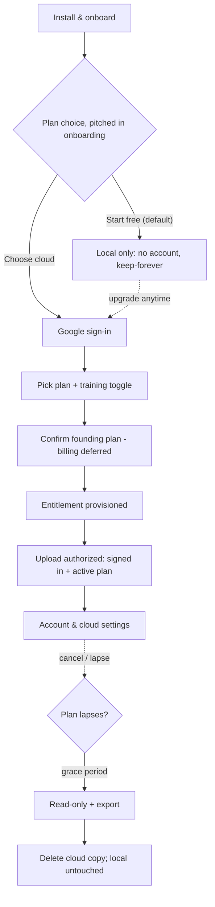
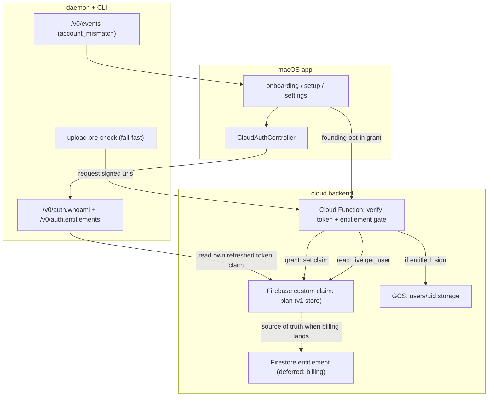
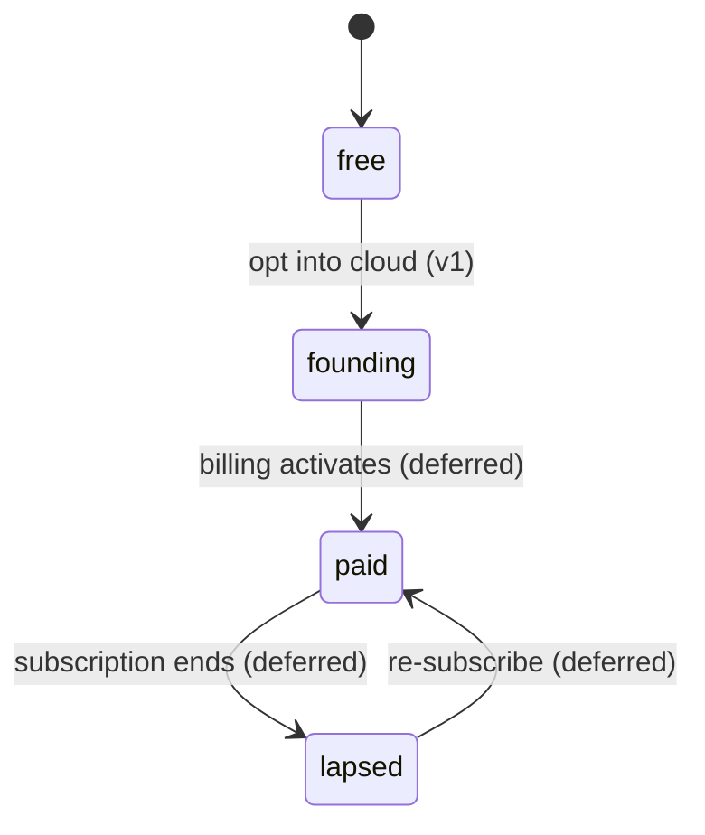

# In-App Cloud Onboarding & Upload Authorization - Plan

## Goal Capsule

- **Objective:** Ship the app-side pipeline that turns the existing-but-invisible cloud identity into a monetized flow — onboard, choose local or cloud, sign in, get a founding entitlement, and become authorized to upload — plus an account/cloud settings surface and account-mismatch handling. Billing activation and the web dashboard are deferred.
- **Product authority:** Rute (product owner).
- **Execution profile:** Cross-layer feature spanning the SwiftUI app, the Python daemon/CLI, and the GCS Cloud Function, with a net-new entitlement layer. High-risk surfaces (authorization, identity, privacy) — favor server-side enforcement and fail-closed behavior.
- **Stop conditions:** Surface a blocker rather than proceed if a change would charge real money in v1 (billing is deferred), weaken the fail-closed upload guarantee, or make a cached client claim the enforcement point.
- **Tail ownership:** Follow repo PR conventions; land units as dependency-ordered commits.
- **Prerequisite (hard):** Provisioned OAuth/Firebase credentials must be injected into release builds before sign-in completes end-to-end (SCR-137, tracked separately). Without it the flow is testable in dev but non-functional in a shipped binary.

---

## Product Contract

### Summary

Add an onboarding-to-cloud flow to the macOS app. Cloud is pitched during onboarding, but starting free and fully local is the frictionless default; users who opt into cloud are carried through sign-in, payment, and an entitlement check that authorizes their uploads, all through one shared setup flow reachable from both a contextual upsell and the settings pane. The flow reuses the existing Google/Firebase identity and upload pipeline — the new work is the plan, billing, and entitlement layer plus the account/cloud settings surface.

### Problem Frame

The premise "login isn't in the UI" is mostly wrong, and that misdirection is the point. The app already has Google OAuth sign-in, a menu-bar account section, a "sign in to upload" sheet, per-user cloud isolation, and upload gated on identity. What is missing is not login — it is a *reason* to sign in and the machinery that turns "signed in" into "set up and authorized for cloud."

Three gaps produce the felt absence. First, there is no plan to choose, so onboarding has nothing to offer and today "signed in" silently equals "can upload." Second, the paid value the user wants to sell — access your history anywhere and share with teammates — lives on a web dashboard that does not exist yet, so even a perfect app flow would sell something undelivered. Third, shipped builds cannot actually complete sign-in until provisioned credentials are injected at build time, so the working UI looks broken in a release binary.

The cost is compounding: the training-corpus flywheel that the product strategy bets on cannot start until users can opt in and upload, and none of that begins without a credible way to become a paying, authorized cloud user.

### Key Decisions

- **Hybrid onboarding, not a hard paywall.** Cloud is pitched during onboarding, but "start free, all-local" is the default and choosing cloud is never required. Protects the local-first free wedge while still surfacing cloud early.
- **App-side pipeline ships before the web dashboard (founding access).** v1 delivers onboarding through authorized upload and launches cloud as founding access; the value-realizing web dashboard (access + sharing) follows. This validates the identity/billing/entitlement plumbing before the heavier web build.
- **Founding access reserves now and bills later.** v1 provisions cloud accounts and authorizes upload for founding users and captures commitment (signup or pre-authorization), but real billing activates only when the dashboard delivers access and sharing. Keeps the payment-to-entitlement machinery built and testable without charging for undelivered value.
- **Authorization becomes "signed in AND on an active plan."** This replaces today's sign-in-only gate and requires an entitlement/subscription state that the app and the upload path can check — the core new backend capability.
- **Reuse the existing Google/Firebase identity.** One account identifies the user on the Mac and later on the web, pointed at the same per-user cloud storage. No second auth system.
- **Payments run outside the Mac App Store.** Because the app ships notarized (Developer ID), it is not bound to Apple in-app purchase, so billing goes through a third-party processor — no 30% cut, no Apple payment sheet.
- **Lapse means grace period plus export, then delete.** Bounds storage cost without an abrupt, trust-breaking deletion; local copies are never affected.
- **Training contribution is opt-in, revocable, and scrubbed-only.** The subscription discount is the incentive; consent must be real for the corpus to be usable.

### Actors

- A1. New user — installs, onboards, chooses local or cloud.
- A2. Cloud subscriber — signed in, on an active plan, uploads authorized.
- A3. macOS app + daemon — drives onboarding, checks entitlement, gates upload, surfaces account mismatch.
- A4. Entitlement/billing backend — issues and verifies plan state; the payment processor sits behind it. Does not exist yet.
- A5. Web dashboard — realizes access and sharing. Out of v1 scope, but named because identity and storage must accommodate it.

### Key Flows

- F1. Onboarding with cloud offer and setup
  - **Trigger:** First run, after the existing permission steps.
  - **Actors:** A1, A3, A4
  - **Steps:** Present the plan choice; if the user starts free, proceed local-only with no account. If the user chooses cloud, run the shared setup flow: Google sign-in, pick plan and training toggle, confirm a founding plan (billing deferred), entitlement provisioned.
  - **Outcome:** Either a free local user (no account) or a provisioned cloud subscriber whose uploads are authorized.
  - **Covered by:** R1, R2, R3, R4, R5, R6, R7, R8, R11, R12

- F2. Upload authorization at recording end
  - **Trigger:** A recording finishes and the destination includes cloud.
  - **Actors:** A2, A3
  - **Steps:** Check the account is signed in and on an active plan; if so, upload to the user's cloud storage; if not, do not upload and leave local files intact.
  - **Outcome:** Uploads happen only for authorized accounts; failures never degrade local recordings.
  - **Covered by:** R9, R10

- F3. Lapse, grace, and retention
  - **Trigger:** A subscriber's plan lapses or is cancelled.
  - **Actors:** A2, A3, A4
  - **Steps:** Recording continues locally; new cloud uploads pause; cloud data becomes read-only with an export option and re-subscribe prompt; after the grace window, cloud copies are deleted.
  - **Outcome:** Storage cost is bounded, the user keeps every local recording, and the deletion is warned and exportable.
  - **Covered by:** R13, R14

- F4. Account mismatch
  - **Trigger:** The signed-in account no longer matches the account that owns an in-flight cloud recording.
  - **Actors:** A2, A3
  - **Steps:** Consume the mismatch signal the daemon already emits and prompt re-login rather than silently failing or uploading to the wrong account.
  - **Outcome:** Cross-account uploads are prevented and the user is told how to resolve it.
  - **Covered by:** R16

### Requirements

**Onboarding & plan choice**

- R1. First-run onboarding presents a plan choice — keep everything local (free) or subscribe to cloud — after the existing permission steps.
- R2. Starting free and fully local is the default, low-friction path; choosing cloud is opt-in and never required to use the app.
- R3. The cloud offer is re-presentable after onboarding, from a contextual upsell (such as a first upload attempt) and from the account/cloud settings pane.
- R4. All cloud-setup entry points funnel into one shared setup flow; there is not a separate onboarding path and settings path.

**Account & sign-in**

- R5. Cloud setup requires a signed-in account; local-only use never requires an account.
- R6. Sign-in uses Google via the existing identity system in v1, and the same account identifies the user on the Mac and, later, on the web.

**Payment & entitlement**

- R7. In v1, becoming a cloud user means confirming a founding plan (signup or pre-authorization), not being charged; billing activates later when the dashboard ships.
- R8. The account carries a cloud entitlement state — founding or paid — that both the app and the upload path can check.

**Upload authorization**

- R9. A recording is authorized to upload only when the account is signed in and holds an active cloud entitlement (founding or paid).
- R10. When authorization fails — signed out or no active plan — uploads do not proceed and local recordings are never deleted or degraded.

**Training contribution**

- R11. During cloud setup, the user may opt into contributing to the computer-use training corpus in exchange for a subscription discount.
- R12. The training opt-in is explicit and revocable, and only scrubbed/masked data is ever contributed.

**Lapse, cancellation & retention**

- R13. On lapse or cancellation, recording continues locally and new cloud uploads pause.
- R14. Already-uploaded cloud data stays accessible read-only for a grace period with an export option and re-subscribe prompt, then is deleted; local copies are never touched.

**Account settings & mismatch**

- R15. An account/cloud settings surface lets the user view plan status, manage or cancel the subscription, toggle training contribution, choose upload destination (local / cloud / both), and sign out.
- R16. When the signed-in account no longer matches the account that owns an in-flight cloud recording, the app surfaces the mismatch and prompts re-login, consuming the signal the daemon already emits.

### Acceptance Examples

- AE1. **Covers R9, R10.** Given a signed-in user with no active cloud entitlement, when a recording finishes, then it is not uploaded, the local files remain intact, and the app indicates that cloud upload needs an active plan.
- AE2. **Covers R9.** Given a signed-in user with an active cloud entitlement, when a recording finishes, then it uploads to that user's cloud storage.
- AE3. **Covers R13, R14.** Given a subscriber whose plan lapses, during the grace period the user can still view and export cloud data; when the grace period expires, cloud copies are deleted while all local recordings remain.
- AE4. **Covers R16.** Given a cloud recording owned by account A, when the user is signed into account B, then the app surfaces the mismatch and prompts re-login rather than silently failing or uploading to account B.

### Scope Boundaries

**Deferred for later**

- The web dashboard — web login, history view/search, and sharing. It is the surface that realizes the paid value; v1 launches cloud as founding access without it.
- Payment-processor integration (checkout, webhooks, real billing). v1 grants founding entitlement without a processor; see the Planning Contract for the recommended merchant-of-record direction.
- The lapse → grace → export → delete retention machinery. v1's entitlement can represent a lapsed state, but no billing means no lapse yet.
- The training-corpus contribution pipeline. v1 captures the opt-in consent flag only.
- Additional sign-in providers (GitHub and others). Google first.
- Per-recording upload destination control. v1 uses a single global default (local / cloud / both).
- Concrete pricing tiers and amounts — a business decision, not a product-shape one.

**Outside this product's identity**

- Requiring an account or cloud for local use. Local-first stays free and account-free forever; the account exists only to serve cloud.

### Dependencies / Assumptions

- Provisioned OAuth/Firebase credentials must be injected into release binaries at build time before sign-in can complete. The mechanism exists (`scripts/generate_provisioned.py` writes a gitignored `screencap._provisioned` module; `src/screencap/auth.py` carries only placeholders, and a release guard rejects them), but a release build must actually inject real values. Hard prerequisite (SCR-137).
- An entitlement backend does not exist yet and must be built: founding-access provisioning, durable entitlement state, and a verify surface the app and Cloud Function can check. The payment processor is part of the machinery, but billing activation is deferred until the dashboard ships.
- The flow reuses existing identity (`src/screencap/auth.py`, `macos/ScreenCap/Controllers/CloudAuthController.swift`), per-user cloud isolation, and the fail-closed upload path — no second auth system.
- Assumption: training contribution contributes only scrubbed/masked data, opt-in and revocable.
- Assumption: the app distributes notarized outside the Mac App Store, so third-party payments are permitted.

### Outstanding Questions

**Deferred to a later milestone (billing activation / web dashboard)**

- Grace-period length and export format for the lapse → grace → delete retention flow.
- How the web login and sharing model scopes access to `users/{uid}` storage.

**Business decisions (needed before billing activates, not blocking this plan)**

- Pricing: plan shape and price points.
- Training-contribution discount size, and the exact consent revocation mechanics.

**Deferred to implementation**

- Exact screen visual design and copy — the units below define screen structure and behavior; pixel-level design is settled during implementation.

### Sources / Research

- Existing auth and sign-in UI (reuse): `src/screencap/auth.py` (Google OAuth loopback + PKCE, Keychain refresh token), `macos/ScreenCap/Controllers/CloudAuthController.swift`, `macos/ScreenCap/Views/SignInPromptView.swift`, and the menu-bar account section.
- Credential provisioning: placeholders at `src/screencap/auth.py:61-62`; injector `scripts/generate_provisioned.py`; SCR-137 plan `docs/plans/2026-06-15-001-feat-scr-137-cloud-auth-creds-deploy-gate-plan.md`.
- Upload authorization and per-user isolation: `src/screencap/upload.py`, `src/screencap/terminal_stage.py`; plan `docs/plans/2026-05-29-002-feat-per-user-cloud-storage-isolation-plan.md`.
- Account mismatch (emitted, not yet consumed by the app): `src/screencap/daemon/supervisor.py` (`_maybe_emit_account_mismatch`), `src/screencap/terminal_stage.py`; plan `docs/plans/2026-06-26-001-feat-account-mismatch-bus-event-plan.md`.
- Destination config today: `src/screencap/config.py` (`get_upload_default`, values local / cloud / both / ask).
- Strategy grounding: local-first wedge, opt-in upload, and the training-corpus flywheel (`STRATEGY.md`).

---

## Planning Contract

Product Contract preservation: unchanged — this enrichment adds planning sections only; it does not alter product scope or R-IDs.

### Key Technical Decisions

- KTD1. Enforce entitlement server-side at the Cloud Function; the client check is fail-fast only. The authoritative gate lives in `scripts/cloud-function/main.py` (`_handle_upload`), after `_authenticate` resolves the uid: read the caller's entitlement and reject non-entitled uploads before signing URLs. The daemon-side pre-check in `src/screencap/upload.py` mirrors the decision for a fast, friendly failure but is never trusted as the gate. Rationale: a cached signal must not be the enforcement point for something with real cost — the same enforcement-vs-shared-model split the codebase already draws.
- KTD2. Entitlement is claim-first in v1, read freshly enough that the grant→upload happy path works on the first try. The grant path sets a `plan` custom claim via `set_custom_user_claims` (`firebase_admin` is already initialized in `scripts/cloud-function/main.py`, so no new runtime). Because a custom claim only appears in a freshly minted ID token, two freshness rules are load-bearing: the Cloud Function gate reads entitlement via a live `firebase_admin.auth.get_user(uid).custom_claims` lookup — not the already-verified token, whose claims `verify_bearer` discards — so it never authorizes on a stale claim; and the client forces an ID-token refresh immediately after a grant so its own reads (U3, U4, app UI) see `plan: founding` before the first upload. The per-upload Admin lookup is a deliberate departure from the existing `check_revoked=False` hot path, justified because entitlement must be fresh at the authoritative gate. A `users/{uid}` Firestore record becomes the source of truth when billing adds revocable/lapsing state; that step adds the Firestore client dependency and matching IAM, and the claim demotes to a UX cache. Rationale: ship v1 on infra that already exists, but read it freshly enough that a just-granted account can upload immediately.
- KTD3. Founding access is granted without a payment processor in v1. Opting into cloud calls a backend grant action that sets `plan: "founding"`. No checkout, webhook, or processor is wired. Rationale: the paid value ships with the dashboard; processor integration is a separable, deferred milestone; the entitlement layer is processor-agnostic.
- KTD4. The deferred processor is a merchant-of-record (Lemon Squeezy or Paddle), not plain Stripe. Recorded direction for the billing-activation milestone: an MoR removes the global VAT/sales-tax burden for a small team; Lemon Squeezy fits an indie desktop client (built-in license/webhook plumbing), Paddle if scaling past indie. Deferred billing uses a trial / SetupIntent that charges when the feature ships. Rationale: external research; not built in v1.
- KTD5. Keep the per-user entitlement pre-check an explicit call; reserve the plan-tier seam for static policy. `pipeline_policy.set_default_override()` is a process-wide `ResolvedPolicy → ResolvedPolicy` hook with no uid or entitlement argument, so a per-account authorization decision cannot ride through it without a hidden global-state read. U4's fail-fast pre-check is therefore an explicit call in the upload path alongside the existing `auth.NotSignedIn` check. The `set_default_override` seam stays reserved for static plan-tier policy (process-wide retention/destination caps), not per-account auth. Rationale: match the seam's actual shape rather than overload it.
- KTD6. One shared cloud-setup flow. The onboarding upsell and the settings pane both drive the same setup view (sign-in → founding plan + training toggle → entitlement). Rationale: R4 — avoids two divergent flows.
- KTD7. The app reads plan status via a new `/v0/auth.entitlements` daemon verb plus extended `whoami`, and consumes `account_mismatch` from `/v0/events`. The read verb follows the existing `auth_whoami` route pattern; contract fields are nullable and must not gate UI readiness. Mismatch consumption uses the replay-cursor pattern (capture the cursor before subscribe, refetch on 410) so a mismatch published in the subscribe gap is not missed. Because the replay ring is count-bounded (256 events) and `account_mismatch` is ephemeral and not carried in any snapshot, a 410 (cursor aged out) reconciles mismatch directly — comparing the signed-in uid against the in-flight recording's `owner_uid` — rather than relying on snapshot refetch alone.

### High-Level Technical Design

Component and data flow — the identity/read path, the authoritative upload gate, and the founding-grant path:

Entitlement lifecycle — v1 builds the free → founding transition; the rest ships with billing:

### Assumptions

- The macOS app distributes notarized outside the Mac App Store, so third-party payments are permitted (the Developer-ID distribution track).
- The Cloud Function's runtime service account must be granted Firebase Admin permission (service-account-token-creator) to both set custom claims and perform per-upload `get_user` lookups; today it holds only `roles/storage.objectAdmin`, so this IAM grant is a deploy-time prerequisite for U1/U2, not an assumption. A Firestore-backed store, when added for billing, additionally needs the Firestore client dependency plus read/write IAM.
- Scrubbing already produces the only data class eligible for cloud or training; the training consent flag gates future contribution, not any new capture-time behavior.

### Sequencing

Three milestones, dependency-ordered:

- Milestone 1 — entitlement foundation (backend): U1, U2.
- Milestone 2 — daemon/CLI contract: U3, U4, U5.
- Milestone 3 — app surfaces: U6, U7, U8, U9.

---

## Implementation Units

### U1. Entitlement record and founding-grant path

- **Goal:** Create the entitlement source of truth and the founding grant.
- **Requirements:** R5, R7, R8
- **Dependencies:** none
- **Files:** `scripts/cloud-function/main.py`, a new entitlement read/write helper module under `scripts/cloud-function/`, `scripts/cloud-function/auth.py` (reuse `verify_bearer`); tests flat in `scripts/cloud-function/` (e.g. `test_entitlements.py`), collected by the existing `scripts/cloud-function/conftest.py`.
- **Approach:** Add a token-gated grant action that, for the authenticated uid, sets a `plan` Firebase custom claim via `set_custom_user_claims` (v1 grants `founding`). The grant is intentionally self-service and self-authorized in v1 — founding is free and confers no billable capability (the Definition of Done records that billing must move it behind the payment webhook). Provide a read helper — a live `get_user(uid).custom_claims` lookup in v1 — that the upload gate (U2) and read verb (U3) share, keeping the seam ready to swap to a Firestore record when billing adds revocation (KTD2). Keep the grant idempotent.
- **Execution note:** Start with a failing test for grant-then-read of the founding claim. Confirm the runtime service account can be granted the Firebase Admin permission to set custom claims before wiring the grant.
- **Patterns to follow:** the existing `verify_bearer` / `_authenticate` token handling and `users/{uid}` prefix scoping.
- **Test scenarios:** authenticated grant sets the founding claim; grant is idempotent on repeat; unauthenticated grant rejected (401); read helper returns `free` for a uid with no claim; the read helper round-trips plan/status.
- **Verification:** an authenticated uid can be granted founding and read back as entitled; no unauthenticated path can write entitlement.

### U2. Cloud Function upload entitlement gate

- **Goal:** Make entitlement the authoritative server-side upload gate.
- **Requirements:** R9, R10
- **Dependencies:** U1
- **Files:** `scripts/cloud-function/main.py` (`_handle_upload`), `scripts/cloud-function/auth.py`; tests flat in `scripts/cloud-function/` (alongside the existing `test_*.py`), collected by `scripts/cloud-function/conftest.py`.
- **Approach:** After `_authenticate` resolves the uid, read the entitlement via the U1 live-lookup helper (a fresh `get_user(uid).custom_claims` read — not the already-verified token, whose claims `verify_bearer` discards) and reject non-entitled uploads before signing URLs. Distinguish "not entitled" (403) from "entitlement lookup failed" (503) so the client can tell a permanent block from a transient error. Preserve the existing per-uid prefix scoping.
- **Execution note:** Write the failing entitled / free / lookup-error matrix first — this is the security gate.
- **Patterns to follow:** the existing 401-vs-503 discrimination in `verify_bearer`; `resolve_prefix` scoping.
- **Test scenarios:** entitled uid → signed URLs returned; free/no-claim uid → 403, no URLs; entitlement lookup error → 503; a cross-user request stays blocked regardless of entitlement.
- **Verification:** only entitled uids receive signed URLs; the gate cannot be bypassed by a valid-but-unentitled token.

### U3. Entitlement read surface (auth + daemon verb)

- **Goal:** Let the app read plan status.
- **Requirements:** R8
- **Dependencies:** U1
- **Files:** `src/screencap/auth.py` (`WhoAmI`, new `get_entitlements`), `src/screencap/daemon/app.py` (new `/v0/auth.entitlements` route + handler), `src/screencap/daemon/schema.py`; tests under `tests/`.
- **Approach:** Extend `whoami` with plan fields and add `auth.get_entitlements()` that resolves plan/status for the signed-in uid from its own (post-grant refreshed) ID-token `plan` claim. `expires` is always null in v1 (forward-compat, populated when billing adds lapse). Add the `/v0/auth.entitlements` read verb following the `auth_whoami` handler pattern. Emit nullable fields as JSON null.
- **Patterns to follow:** `auth_whoami` route + `schema.envelope`; the daemon read-verb registration block.
- **Test scenarios:** the entitlements verb returns plan/active/expires for a founding uid; signed-out → free/inactive; nullable `expires` serialized as null (not omitted); `whoami` keeps its existing shape plus plan.
- **Verification:** the app can fetch plan status through the daemon; the envelope carries nullable fields per the contract.
- **Sources:** nullable-JSON-contract learning (`docs/solutions/integration-issues/review-data-nullable-timing-swift-consumer-2026-06-01.md`).

### U4. Client-side upload authorization pre-check

- **Goal:** Fail fast and fail-closed when not entitled, without deleting local data.
- **Requirements:** R9, R10
- **Dependencies:** U3
- **Files:** `src/screencap/upload.py` (`request_signed_urls`), `src/screencap/chunk_processor.py` (live-upload path); tests under `tests/`.
- **Approach:** After the signed-in check, add an explicit entitlement pre-check (alongside the existing `auth.NotSignedIn` check, not routed through `set_default_override` — KTD5) that raises a clear "founding/upgrade required" error before contacting the Cloud Function. On a 403 from the gate for a signed-in account, force one ID-token refresh and retry once (mirroring the existing 401 force-refresh path in `authed_post`) so a just-granted account isn't blocked by a stale claim. The Cloud Function (U2) stays authoritative; this is UX fast-fail. Never delete or degrade local files on an authorization failure.
- **Execution note:** Preserve the fail-closed guarantee; add characterization coverage if the current no-delete path is under-tested.
- **Patterns to follow:** the existing `auth.NotSignedIn` handling, the `authed_post` 401 force-refresh path, and the fail-closed chunk-state path.
- **Test scenarios:** signed-in but not entitled → raises, no upload attempted, local files intact and the chunk marked not-deleted; entitled → proceeds to request URLs; a 403 on a just-granted account triggers one token-refresh-and-retry, then succeeds; a pre-check error is non-fatal to the recording (local retained).
- **Verification:** an unentitled upload attempt fails cleanly with local data preserved.
- **Sources:** chunk-upload data-loss learning (`docs/solutions/runtime-errors/chunk-upload-sentinel-gating-and-data-loss.md`).

### U5. Destination and training-consent config setters

- **Goal:** Persist the upload destination and the training-contribution consent.
- **Requirements:** R11, R12, R15
- **Dependencies:** none
- **Files:** `src/screencap/config.py` (add `set_upload_default`, `set_training_contribution`); tests under `tests/`.
- **Approach:** Add setters mirroring `set_audio_default` (atomic TOML write + cache invalidation) for `privacy.upload_default` and a new training-consent flag. These back the onboarding and settings toggles. The v1 destination toggle exposes `local / cloud / both`; `ask` remains a valid config value but is not offered in the toggle.
- **Patterns to follow:** `set_audio_default` and `invalidate_config_cache`.
- **Test scenarios:** setting destination persists and invalidates the cache; reading returns the new value; the training flag round-trips true/false; an invalid destination value is rejected.
- **Verification:** destination and training consent survive a config reload.

### U6. Onboarding plan-choice step

- **Goal:** Add the hybrid plan choice to first-run onboarding.
- **Requirements:** R1, R2
- **Dependencies:** U5
- **Files:** `macos/ScreenCap/Views/MainWindow.swift` (`FirstRunSetupPresentationPolicy`, `FirstRunPermissionsView`); tests under `macos/ScreenCapTests/`.
- **Approach:** Add a plan-choice step to the walkthrough with "start free / all-local" as the default; persist the destination via U5. Extend `shouldPresentOnLaunch` with a "cloud decision made" axis so the step is not re-shown after a choice.
- **Execution note:** Regenerate the Xcode project after adding sources (XcodeGen) or the build will miss the new files.
- **Patterns to follow:** the existing walkthrough-step structure and `setupDismissed` persistence.
- **Test scenarios:** onboarding shows the plan choice when no cloud decision exists; choosing local persists local and completes without an account; choosing cloud advances into the shared setup flow; the step is not re-presented after a decision.
- **Verification:** a fresh user sees the choice; a decided user does not.
- **Sources:** XcodeGen stale-project learning (`docs/solutions/build-errors/xcodegen-stale-project-missing-new-sources.md`).

### U7. Shared cloud-setup flow

- **Goal:** One flow from opt-in to authorized: sign in, confirm founding plan, set the training toggle, grant entitlement.
- **Requirements:** R3, R4, R5, R6, R7, R11
- **Dependencies:** U6, U1, U5
- **Files:** `macos/ScreenCap/Views/CloudSetupView.swift` (new), reuse `macos/ScreenCap/Controllers/CloudAuthController.swift` and `macos/ScreenCap/Views/SignInPromptView.swift`; tests under `macos/ScreenCapTests/`.
- **Approach:** Build the shared setup view reused by onboarding (U6) and settings (U8): Google sign-in via `CloudAuthController`, a founding-plan confirmation with the training-contribution toggle (persisted via U5), then the founding grant (U1) that marks the account entitled. After the grant returns, force a client ID-token refresh (`getIDToken(forceRefresh: true)`) so the new `plan: founding` claim is present before the first upload. Handle mid-flow cancel cleanly.
- **Execution note:** Regenerate the Xcode project after adding the new view.
- **Patterns to follow:** `CloudAuthController.startSignIn` flow-state handling; `SignInPromptView` idle/inProgress/failed states.
- **Test scenarios:** the full flow signs in, grants founding, persists the training choice, and refreshes the token so it carries the founding claim before any upload; cancel mid-flow leaves no partial entitlement and a clean UI; entering from settings drives the same flow; a sign-in failure surfaces retry without granting.
- **Verification:** completing the flow yields an entitled, authorized account reachable from both entry points.

### U8. Account and cloud settings surface

- **Goal:** A place to see plan status and manage cloud.
- **Requirements:** R15
- **Dependencies:** U3, U5, U7
- **Files:** `macos/ScreenCap/Views/SettingsView.swift` (new, plus its window scene), `macos/ScreenCap/Controllers/DaemonClient.swift`; tests under `macos/ScreenCapTests/`.
- **Approach:** Create a settings window with an Account & Cloud section: plan status (read `/v0/auth.entitlements` via `DaemonClient`), a destination toggle (write via U5), the training toggle, a "set up cloud" entry into U7, and sign-out (gated on no active upload). No settings window exists today.
- **Execution note:** Regenerate the Xcode project after adding sources.
- **Patterns to follow:** the `DaemonClient` verb-call pattern; `MenuBarMenu` sign-out gating on `canSignOut`.
- **Test scenarios:** renders plan status from the entitlements verb; toggling destination persists; sign-out disabled while an upload is in flight; entering setup from settings opens the shared flow.
- **Verification:** plan status and controls render and persist.

### U9. Entitlement and account-mismatch consumption in the app

- **Goal:** Surface plan status live and prompt re-login on account mismatch.
- **Requirements:** R16
- **Dependencies:** U3
- **Files:** `macos/ScreenCap/Controllers/CloudAuthController.swift`, `macos/ScreenCap/Controllers/DaemonClient.swift`, `macos/ScreenCap/Models/AuthStatus.swift` (or a new `EntitlementStatus` model); tests under `macos/ScreenCapTests/`.
- **Approach:** Add a published `entitlementStatus` populated from `/v0/auth.entitlements`, decoding contract-optional fields as optional so they never gate readiness. Consume `account_mismatch` from `/v0/events` using the replay-cursor pattern and surface a re-login prompt.
- **Execution note:** Add coverage for the late-subscribe replay race (a mismatch published in the subscribe gap must still arrive).
- **Patterns to follow:** the existing `/v0/events` consumer (`UploadEventLine.parse`) and cursor handling.
- **Test scenarios:** entitlement decoded including null fields lands on a non-failed state; an `account_mismatch` event shows the re-login prompt; a mismatch published before subscribe is delivered via replay on the captured cursor; a 410 on a stale cursor triggers a snapshot refetch.
- **Verification:** the app reflects live plan status and prompts re-login on mismatch without missing the event.
- **Sources:** eventbus-replay learning (`docs/solutions/runtime-errors/eventbus-late-listener-replay-2026-05-12.md`); the nullable-contract learning (as U3).

---

## Verification Contract

- Python unit tests: `pytest tests/` (in a worktree, prefix `PYTHONPATH=src`). Cloud Function tests: `pytest scripts/cloud-function/`.
- Mark the authorization and entitlement tests `@pytest.mark.privacy` and keep them Vision-free — CI runs only the `pytest -m privacy` lane, so security-bearing tests must carry that marker to run on CI.
- Swift build + tests: regenerate the project with XcodeGen after adding new sources, then run the app test scheme (`xcodebuild test`). A known daemon-reconnect test is flaky — re-run rather than treating a lone failure as a regression.
- Gates that must pass: the U2 free-uid-rejected (403) and lookup-error (503) cases; the U4 fail-closed no-local-delete case; the U9 replay-race case; the Swift onboarding and settings render tests.

---

## Definition of Done

- **Global:**
  - R1–R12, R15, R16 satisfied. R13–R14 (lapse retention) are deferred with billing; R11–R12 land as consent-flag capture only.
  - Entitlement is enforced server-side (U2) with tests proving unentitled tokens are rejected; the client pre-check (U4) is fail-closed and never deletes local data.
  - The onboarding plan-choice step, the shared cloud-setup flow, the settings surface, and account-mismatch re-login all ship and are reachable.
  - `SECURITY.md` updated to document the entitlement gate as part of the upload trust boundary.
  - The founding grant is documented as self-service and self-authorized in v1; a note records that when billing activates the grant path must move behind the payment-processor webhook / server-side eligibility check and must not remain client-callable.
  - Abandoned-attempt code from the run is removed, not left in the diff.
- **Prerequisite acknowledged:** end-to-end sign-in in a shipped build still depends on SCR-137 credential injection; this plan is verifiable in dev without it.
- **Per-unit:** each unit's test scenarios pass and its Verification bullet holds.
