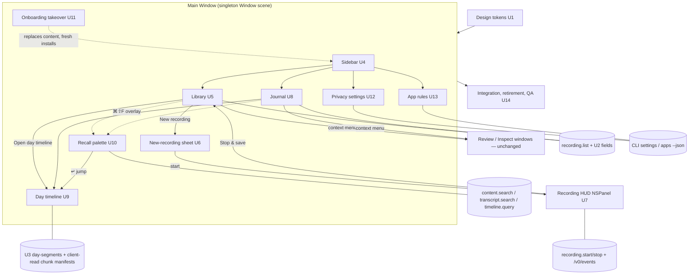
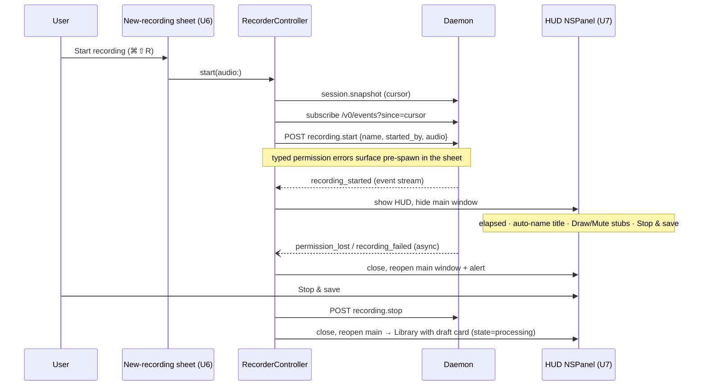

# Screencap Prototype UI Rebuild - Plan

## Goal Capsule

- **Objective:** Rebuild the macOS SwiftUI app (`macos/Screencap/`) to match the Screencap Prototype design, with every screen wired to the real daemon/CLI backends. Capabilities that don't exist yet ship as clearly-marked stubs referencing their Linear ticket (SCR-214 … SCR-229).
- **Design authority:** `docs/design/screencap-prototype/Screencap Prototype.dc.html` is the visual source of truth — exact colors, typography, spacing, and interaction states are inline in that file. Each implementation unit cites its screen anchor (the `data-screen-label` attribute) and line range. The prototype's logic script (lines 658–806) defines the intended interaction state machine. (Design updated 2026-07-03: onboarding gained a three-card storage step plus account and team-setup steps — see U11.)
- **Authority hierarchy:** SECURITY.md's honesty posture overrides design copy (no untrue privacy claims — see KTD-9). Existing daemon API contracts override UI convenience (additive-only under `api_schema_version 1` — see KTD-5). Otherwise the design wins.
- **Execution profile:** Units are sized for one `ce-work` run each, in dependency order (see Unit Index). Swift tests run locally only — CI runs just the Python privacy lane, so every privacy-adjacent Python change must carry `@pytest.mark.privacy` and be Vision-free.
- **Stop conditions:** Surface a blocker instead of guessing if a unit would require a non-additive daemon API change, a UI claim that contradicts SECURITY.md, or removal of the upload consent (Review window) flow.

---

## Product Contract

### Summary

Replace the current four-pane app shell with the prototype's warm-cream design: a sidebar (Library, Journal, Collections, Settings, footer), an onboarding takeover (4–6 steps by chosen storage tier), a Library card grid, a Journal day view, a Day timeline with playback, Privacy and App-rules settings panes, a Recall search palette (⌘⇧F), a New-recording sheet, and a floating recording HUD. All data comes from the existing daemon `/v0` API and CLI (plus three small additive backend enablers in this plan); sixteen missing capabilities are tracked in Linear and stubbed in the UI.

### Problem Frame

The app's current UI (Calendar/Recordings/Search/Privacy panes) predates the brand direction. The prototype defines the product's intended look and interaction model, but it is a marketing-fidelity artifact: it contains mock data, no error states, and several features the backend cannot serve yet. The work is to translate it into a fully-integrated app without shipping mock data or untrue claims, and to make the remaining gaps visible and tracked rather than silently faked.

### Requirements

Design fidelity:

- R1. The app adopts the prototype's visual system: palette, the four typefaces (Newsreader, Space Grotesk, IBM Plex Mono, Public Sans), spacing, radii, and hover/active states as specified inline in the design HTML.
- R2. All design screens exist and are reachable: sidebar shell, onboarding (welcome → permissions → app rules → storage → account/team setup for cloud tiers), Library, Journal, Day timeline, Privacy settings, App rules, Recall palette, New-recording sheet, recording HUD.
- R3. Every implementation unit cites the design file with its `data-screen-label` anchor and line range, so any implementing agent follows the design accurately.

Integration:

- R4. Every rendered feature is wired to a real backend (daemon `/v0` verb or CLI `--json` surface). No mock or sample data ships.
- R5. Where the backing capability does not exist, the UI element renders per the design but disabled, with a "Coming soon" affordance and a code comment referencing its Linear ticket (SCR-214 … SCR-229). Stub presentation is uniform (KTD-8).
- R6. Existing behavior is preserved: recording lifecycle (daemon + CLI fallback), search consent/backfill flow, upload consent via the Review window, permission machinery (Quit & Relaunch, migration banner, watchdog), and stale-daemon restart-on-launch.

Honesty and privacy:

- R7. UI copy never claims capabilities that don't exist: no "encrypted"/"E2EE" language until SCR-220 lands; timeline regions are labeled "blocked" only when fail-closed data proves it, otherwise rendered as neutral gaps.
- R8. All settings/privacy writes go through the Python settings layer (CLI `screencap settings … --json`), never direct TOML edits from Swift.

### Scope Boundaries

Outside this work's identity:

- Implementing the sixteen ticketed capabilities themselves (see Deferred table) — this plan ships their UI stubs only.
- The other design files in the project (`App Screens.dc.html`, `Brand Directions.dc.html`, `Fieldnotes Brand Board.dc.html`).
- Windows app, website, or CLI UX changes beyond the additive backend enablers in U2/U3.

Deferred to follow-up work (Linear, Screencap team — all created 2026-07-03 and related to the SCR-13 umbrella):

| Ticket | Capability the UI stubs |
|---|---|
| SCR-214 | Ambient recording + agent task segmentation (Journal's "split by the agent") |
| SCR-215 | Window and area capture modes |
| SCR-216 | Camera capture + camera bubble overlay |
| SCR-217 | Draw-on-screen annotation while recording |
| SCR-218 | Mid-recording microphone mute |
| SCR-219 | Clip a moment / video segment export |
| SCR-220 | End-to-end encryption for shared copies |
| SCR-221 | Team cloud: shared library, team/account setup screens, member visibility, billing |
| SCR-222 | Collections |
| SCR-223 | Rename recordings |
| SCR-224 | Private-window detection / auto-pause |
| SCR-225 | Per-app Mask override + default-for-new-apps rule |
| SCR-226 | Daemon verb for connected MCP clients |
| SCR-227 | Attach MCP context to recordings |
| SCR-228 | Change storage location with migration |
| SCR-229 | Personal cloud plan: cross-Mac backup, share-by-link, individual billing (added 2026-07-03 with the design's three-card storage step) |

### Sources

- Design: `docs/design/screencap-prototype/Screencap Prototype.dc.html` (imported from claude.ai/design project `54740ac3-4af5-4c85-8508-a39947e9e8e0`, re-synced 2026-07-03 with the account/team-setup onboarding update; `support.js` in the same directory lets it open in a browser). Screen anchors (`data-screen-label`): Recording (line 19), Onboarding (51; steps at 57/87/153/196/238/264), Library (343), Journal (381), Day timeline (425), Privacy settings (474), App rules (519); sidebar 299–337; Recall palette 555–597; New-recording sheet 600–652; logic script 658–806.
- Institutional learnings that shaped this plan: `docs/solutions/build-errors/xcodegen-stale-project-missing-new-sources.md`, `docs/solutions/ui-bugs/swiftui-windowgroup-vs-window-singleton-scene-2026-05-18.md`, `docs/solutions/runtime-errors/macos-tcc-per-process-cache-quit-and-relaunch.md`, `docs/solutions/runtime-errors/eventbus-late-listener-replay-2026-05-12.md`, `docs/solutions/integration-issues/stale-daemon-after-app-update-http-500-2026-07-02.md`, `docs/solutions/integration-issues/review-data-nullable-timing-swift-consumer-2026-06-01.md`, `docs/solutions/integration-issues/macos-screen-recording-tcc-host-app-rollup-2026-07-02.md`.
- Threat model / copy constraints: `SECURITY.md`.

---

## Planning Contract

### Key Technical Decisions

- KTD-1. **In-place shell replacement.** The new UI replaces `MainWindow`'s content in the existing singleton `Window` scene. The `Window` (not `WindowGroup`) scene type, `WindowOpener`/`OpenWindowBridge` guards, and `NSApp.windows` fast-paths are preserved verbatim — they encode the SCR-55 duplicate-window fixes.
- KTD-2. **New views bind to existing controllers.** `RecorderController`, `RecordingStateMachine`, `PermissionController`, `PrivacyController`, `RecordingsIndex`, `SearchViewModel` + `SearchService`, `CloudAuthController`, `UploadCoordinator`, `ThumbnailLoader`, `RecordingFrameIndex` all stay; no parallel state layer. Views are new; state machinery is not.
- KTD-3. **Bundle the four typefaces.** Newsreader, Space Grotesk, IBM Plex Mono, Public Sans (all OFL) ship in the app bundle (`ATSApplicationFontsPath`), with license files. This supersedes SCR-197's system-font-only decision; `SCTypography` grows a named scale on the bundled families.
- KTD-4. **Window topology.** Recall palette and New-recording sheet are in-window overlays (ZStack over the main content, matching the prototype's z-40/41 overlay divs). The recording HUD is a separate non-activating floating `NSPanel` (`.floating` level, joins all Spaces, bottom-center of the recorded display, capture-excluded via `sharingType = .none`); the main window hides on recording start and is restorable from the menu bar. Review and Inspect windows survive unchanged (upload consent is load-bearing), reachable from card context menus.
- KTD-5. **Additive-only daemon changes.** All backend enablers (U2, U3) extend existing verbs or add fields without breaking `api_schema_version 1`; `SUPPORTED_API_SCHEMA_VERSION` in `RecorderController.swift` stays 1. A schema bump hard-flips the app to CLI fallback — avoid it.
- KTD-6. **Library chips get local semantics.** Chips render as All / Local / Uploaded / Needs review. Local = not uploaded; Uploaded = uploaded to the user's own cloud; Needs review = processing/draft. The design's "Mine" chip becomes "Local" and its "Shared" chip becomes "Uploaded" until team semantics exist (SCR-221) — sharing vocabulary unlocks with that ticket (KTD-9).
- KTD-7. **Draft state is derived, not stored.** A recording is `recording` while active (daemon events); after stop it is `processing` until its completion gate is met, else `ready`. The gate routes by the frozen destination: local recordings complete when the pipeline ledger's frozen `chunks_expected` rows are all `LOCAL_DONE`/`UPLOADED` (the terminal stage's LOCAL route never writes the completeness sentinel — do not key on it); cloud/both recordings use the completeness sentinel; legacy recordings with no ledger and no active session, and recordings with FAILED chunks, map to `ready` rather than eternal `processing`. U2 exposes this as a `state` field on `recording.list`.
- KTD-8. **Uniform stub standard.** A stubbed control renders exactly per the design, disabled, with a help tooltip "Coming soon — SCR-NNN" and a `// Stub: SCR-NNN <one-line reason>` code comment. Stubs are never hidden and never pretend to work.
- KTD-9. **Honesty overrides design copy.** Badges and chips read "uploaded" not "shared · encrypted" ("shared" unlocks with SCR-221's team semantics, "encrypted" with SCR-220); the Privacy pane's E2EE row is informational without an active toggle; the recording HUD footer reads "recording to this Mac" without "· encrypted"; the onboarding storage cards (Personal cloud, Team cloud) and account step carry interim copy without pricing, billing, or encryption claims until SCR-229/SCR-221/SCR-220 restore the design's full copy; timeline hatching is labeled "blocked" only where U3's proven-blocked data supports it. Copy unlocks as those tickets land (SCR-220, SCR-221, SCR-224, SCR-229).
- KTD-10. **Onboarding is a state-derived takeover, fresh installs only.** The wizard replaces the main-window content (per the prototype), but the current step is always derived from persisted markers + live daemon grants + install state — never a stored step integer — by extending `FirstRunSetupPresentationPolicy`. Upgrade users keep the migration interstitial and never see the marketing wizard. The wizard fires only when the completion marker is absent AND no prior-install evidence exists (recordings dir, config file, installed daemon LaunchAgent) — no such marker exists today, so on first launch with prior-install evidence the marker is backfilled write-once, keeping existing users out of the wizard. Quit & Relaunch (required by TCC per-process caching) re-derives the step on relaunch. Cloud picks extend the wizard past storage: an account step (wired to the existing browser sign-in) and, for Team picks, the stubbed team-setup step — progress dots are dynamic (4/5/6 by tier).
- KTD-11. **"Keep recordings local by default" wires to `privacy.upload_default`** through the CLI settings layer, with optimistic flip + revert-on-failure. The key is four-valued: the toggle is ON iff the value is `local`; `ask`, `cloud`, and `both` render OFF with a caption naming the current default (mirroring U6's header treatment); ON→OFF writes `ask`, with the caption making the change visible so a `cloud`/`both` default is never silently clobbered.
- KTD-12. **Day playback uses one AVPlayer with item swapping.** The seek map is built client-side by reading each recording's `chunk_NNNN_manifest.json` files from disk (the same direct-read pattern as `ThumbnailLoader`/`RecordingFrameIndex` — no new daemon verb). Manifest windows locate the chunk; the playback offset is anchored at the chunk's **first written frame** — under action-gated capture the mp4's PTS starts at the first captured frame, not `chunk_start`, so `offset = t − chunk_start` mis-seeks on idle-starting chunks; derive the anchor from the frame index/`recording.db`. Chunks with no video file resolve to the placeholder state. `replaceCurrentItem` on chunk/recording boundary crossings; inter-recording gaps show a neutral "nothing captured" placeholder rather than synthetic composition.
- KTD-13. **⌘⇧F is window-scoped**, matching the design (the shortcut is drawn inside the window chrome). A "Search…" menu-bar item opens the main window with the palette pre-opened. No global event tap.

### High-Level Technical Design

Screen map — how the new surfaces connect and what backs each:



Recording session lifecycle (the design's Recording scene, wired to the real event contract):



Onboarding presentation (extends `FirstRunSetupPresentationPolicy`; step is derived, never stored):

```mermaid
stateDiagram-v2
  [*] --> Migration: migrationNeeded (upgrade)
  [*] --> Wizard0: fresh install (no marker, no prior-install evidence)
  [*] --> None: completed or setup_skipped (recovery latch still available)
  Migration --> None: migration done (existing flow)
  Wizard0 --> Wizard1: Set up permissions
  Wizard0 --> None: Skip for now (persists setup_skipped)
  state Wizard1 {
    [*] --> InstallNeeded
    InstallNeeded --> Installing --> WaitingGrant
    Installing --> InstallFailed
    WaitingGrant --> RelaunchNeeded: TCC cached (Quit & Relaunch)
    WaitingGrant --> Granted: watchdog detects grant
  }
  Wizard1 --> Wizard2: granted or Continue (skippable)
  Wizard2 --> Wizard3: Looks right / Edit the list (deep-link to App rules after finish)
  Wizard3 --> None: This Mac only — finish (persist completion marker)
  Wizard3 --> Wizard4: Personal or Team cloud pick
  Wizard4 --> None: Personal — existing browser sign-in, finish
  Wizard4 --> Wizard5: Team — existing browser sign-in
  Wizard5 --> None: team setup (Create team stubbed SCR-221) or skip — finish
  RelaunchNeeded --> Wizard1: app relaunches, step re-derived from live state
```

### Assumptions and constraints

- The prototype's fake-desktop Recording scene is illustrative; the deliverable is the HUD + hidden-window behavior, not a rendered desktop.
- The prototype's step-2 "Edit the list" targeting step 3 is a prototype bug; the intended behavior is a deep link to App rules (confirmed against the design's own copy "Fine-tune per app later in Settings → Privacy").
- The recording title on the HUD and draft card is the **provisional** recording name until post-stop auto-naming completes — `src/screencap/namer.py` runs after stop and also renames the recording directory; user rename is SCR-223. Identity across that rename is tracked by the stable `recording_id` U2 surfaces.
- Timeline axis bounds are dynamic: union of the day's recording spans rounded outward to the hour, minimum 8h; midnight-spanning recordings clamp into both days.
- Until SCR-214 lands, Journal and Library intentionally present the same recordings — Journal's interim value is the day-grouped reading plus the sole day-timeline entry point. The near-duplication is a deliberate, recorded bet in favor of shipping the design's nav shape without a later nav retraction.
- The rebuild is in-place with no feature flag (KTD-1), so main is not release-safe mid-sequence: no macOS app release (`macos-app-vX.Y.Z`) is cut from main between U4 landing and U14 landing without explicit sign-off on the hybrid state.
- Agent-parity note: sidebar/rules state introduced by this plan lives in the Python config/daemon layer (never Swift-local), so the CLI and MCP agents see the same state as the UI.

---

## Implementation Units

Every unit's **Design:** field cites the design file, its `data-screen-label` anchor, and line ranges — that field is how the plan discharges R3.

Unit Index (dependencies are hard prerequisites; phases are milestones):

| U-ID | Unit | Key files | Depends on |
|---|---|---|---|
| U1 | Design tokens + bundled fonts | `macos/Screencap/Theme/*`, `macos/project.yml` | — |
| U2 | Catalog/daemon additive fields | `src/screencap/catalog.py`, `src/screencap/daemon/app.py` | — |
| U3 | Day-segments + blocked-intervals surface | `src/screencap/daemon/app.py`, `src/screencap/backfill/skip_intervals.py` | — |
| U4 | App shell: sidebar + navigation | `macos/Screencap/Views/MainWindow.swift` | U1 |
| U5 | Library grid | `macos/Screencap/Views/Library/` | U1, U2, U4 |
| U6 | New-recording sheet | `macos/Screencap/Views/Record/` | U1, U2, U4, U5 |
| U7 | Recording HUD + window lifecycle | `macos/Screencap/Views/Record/`, `RecorderController` | U2, U5, U6 |
| U8 | Journal | `macos/Screencap/Views/Journal/` | U1, U2, U4 |
| U9 | Day timeline | `macos/Screencap/Views/Timeline/` | U3, U8 |
| U10 | Recall palette | `macos/Screencap/Views/Palette/` | U4, U9 |
| U11 | Onboarding wizard | `macos/Screencap/Views/Onboarding/` | U1, U4 |
| U12 | Privacy settings pane | `macos/Screencap/Views/Settings/` | U2, U4 |
| U13 | App rules pane | `macos/Screencap/Views/Settings/` | U4 |
| U14 | Integration, retirement, QA | app-wide | U5–U13 |

Milestones: Phase 1 foundation (U1–U4) · Phase 2 recording + library (U5–U7) · Phase 3 retrieval surfaces (U8–U10) · Phase 4 onboarding + settings (U11–U13) · Phase 5 integration (U14).

### U1. Design tokens and bundled fonts

- **Goal:** The design's visual system exists as named tokens: palette color sets, the four bundled typefaces, a typography scale, and radii/spacing additions — so every later unit styles by token, never by literal hex.
- **Requirements:** R1.
- **Dependencies:** none.
- **Design:** entire file; canonical hexes — paper `#FFFDF7`, warm bg `#F6F2E9`, subtle fill `#EDE6D6`, border `#E0D8C6`, ink `#1C2420`, secondary `#52584F`, muted `#86795F`, faint `#A99C82`, teal primary `#0E7C6B` (hover `#0C6E5F`, soft `#6BA89E`), amber `#D9A441` (text `#A97F2E`, HUD `#E3B054`), rust `#B4552B`, dark canvas `#10161A`, HUD surfaces `#1D2421`/`#2A322E`/`#9BA69E`, traffic lights `#EC6A5E`/`#F4BF4F`/`#61C554`, app-tile colors `#2B3A67`/`#5C5343`/`#7A4A8A`/`#3E6A8A`/`#8A6A3E`. Type usage: Newsreader 500 for serif display (onboarding H1s, day headings, brand mark), Space Grotesk 600/700 for headings and initials tiles, IBM Plex Mono 400/500 for metadata/badges/timestamps, Public Sans 400–700 for body. Radii: 999 pills, 16/14/12/10/8/6/4; window radius 12.
- **Files:** `macos/Screencap/Theme/SCColor.swift`, `macos/Screencap/Theme/SCTypography.swift`, `macos/Screencap/Theme/SCMetrics.swift`, new color sets in `macos/Screencap/Assets.xcassets/`, new `macos/Screencap/Resources/Fonts/` (four families + OFL license files), `macos/project.yml` (fonts resource dir + `ATSApplicationFontsPath` Info.plist key). Tests: `macos/ScreencapTests/SCColorTests.swift`, `macos/ScreencapTests/SCMetricsTests.swift`, new `macos/ScreencapTests/SCTypographyTests.swift`.
- **Approach:** Add new semantic roles following the existing `SC*.colorset` bundle-anchored pattern (`BundleToken`); keep existing roles alive until U14 retires the old views. Register fonts via `ATSApplicationFontsPath: Fonts`, shipping them as an XcodeGen **folder reference** (`- path: Screencap/Resources/Fonts` with `type: folder` under the target's `resources:`, and the dir excluded from the flat sources sweep) — default resource handling copies files flat into `Contents/Resources`, which would leave the `Fonts/` directory nonexistent in the bundle and make registration a silent no-op. Extend `SCTypography` with a named scale (e.g. `serifDisplay`, `heading`, `mono`, `body` variants) resolving to the bundled families with system-font fallback. Re-run `xcodegen generate` after resource additions (stale-project learning), and confirm `script/build_and_run.sh`'s directory-mtime freshness check covers the new `Resources/Fonts/` root.
- **Test scenarios:** every new color role resolves non-nil in light and dark appearance (bundle-anchored — high-contrast can't resolve in-process, don't test it); each of the four font families loads by PostScript name after registration (NSFont non-nil); metrics ramp and radii values pinned; existing SCColor roles still resolve (no regression while old views live).
- **Verification:** Swift test target passes; a scratch view rendered with the new tokens visually matches the design's Library header (spot check via `script/build_and_run.sh`).

### U2. Catalog and daemon additive fields

- **Goal:** The daemon's `recording.list` carries the fields the new UI needs (numeric size, human title/summary, derived lifecycle state), and `recording.start` accepts an audio flag — so Library, Journal, HUD, and the sidebar footer render real data with no client-side string parsing.
- **Requirements:** R4; enables KTD-6/KTD-7.
- **Dependencies:** none.
- **Design:** Library cards (343–377: title, meta, duration, badge), Journal cards (381–421: title + summary + app badge), sidebar footer "4.2 GB on this Mac" (334), draft card injection (logic 710), sheet mic row (624–633).
- **Files:** `src/screencap/catalog.py`, `src/screencap/daemon/app.py`, `src/screencap/daemon/schema.py` (extend the `RecordingSummary` pydantic model with the new nullable fields — the `recording.list` handler enforces exact field parity with `catalog.RecordingInfo` and raises a 500 on divergence), `src/screencap/cli/` (list `--json` passthrough), `macos/Screencap/Models/RecordingSummary.swift`. Tests: existing catalog/daemon API test files under `tests/` (extend in place), `macos/ScreencapTests/` decode tests following the `PrivacyBadgeStyleTests` Decodable-from-dict pattern.
- **Approach:** Additive fields on each catalog row: `size_bytes` (numeric, alongside the existing formatted string), `summary` (from `recording.db` `recording.task_description` written by `src/screencap/namer.py` — nullable, read with the transient-lock tolerance the review-data path uses), `title` (the humanized auto-generated recording name — the namer's slug/directory name — matching U7's HUD title; `task_description` is a description, not a title), `state` (`recording` | `processing` | `ready`, derived per KTD-7 from the active-session snapshot plus the destination-routed completion gate: pipeline ledger for local recordings, completeness sentinel for cloud/both), and a stable `recording_id` (surfacing the existing `.recording_id` sidecar) so clients can hold identity across the post-stop auto-name directory rename. Add optional `audio: bool` to the `recording.start` body, threading to the engine's existing no-audio path (CLI `--no-audio` parity); the response envelope echoes the effective `audio` value — daemon request models ignore unknown fields, so a stale daemon drops the flag silently, and the app must treat a missing/mismatched echo as audio-on (U6/U7 reflect the real state). All new fields nullable by contract — Swift decoders must not gate readiness on them (nullable-timing learning). Sidebar footer total = client-side sum of `size_bytes`.
- **Test scenarios:** catalog row carries numeric `size_bytes` matching the dir size; `summary` populated when `task_description` exists, null when recording.db is absent or locked (no exception); `title` present as the humanized directory name; `recording_id` stable across the namer's directory rename; `state` is `processing` for a stopped local recording whose ledger has non-`LOCAL_DONE` chunks and flips to `ready` when all frozen `chunks_expected` are `LOCAL_DONE` — no sentinel involved; a cloud-routed recording is `ready` once its completeness sentinel exists; legacy recording (no ledger, no active session) reports `ready`; active recording reports `recording`; `recording.start` with `audio: false` spawns the engine without audio (assert argv/config effect) and echoes `audio` in the response; client treats an absent echo (stale daemon) as audio-on; schema: old clients (no new fields expected) still decode — additive only; Swift `RecordingSummary` decodes payloads with and without the new fields.
- **Verification:** `PYTHONPATH=src pytest tests/ -k "catalog or daemon"` green; `screencap list --json` shows the new fields on a real recording.

### U3. Day-segments and blocked-intervals surface

- **Goal:** A day-scoped read surface the Day timeline can render honestly: recording spans, plus intervals split into proven-blocked vs unverifiable — so "blocked" hatching is provably true (R7) and everything else stays a neutral gap.
- **Requirements:** R4, R7.
- **Dependencies:** none.
- **Design:** Day timeline strip (425–470): task segment bands, "unsplit — still searchable" legend, "blocked — nothing captured" hatched band + legend (450, 454, 466).
- **Files:** `src/screencap/daemon/app.py` (additive verb, e.g. `/v0/timeline.day`), new small module (e.g. `src/screencap/day_segments.py`) reusing `src/screencap/backfill/skip_intervals.py` and `src/screencap/frame_blocked.py` readers. Tests: new privacy-marked test file under `tests/` (Vision-free — CI only runs the privacy lane).
- **Approach:** Input: a local-date (+ tz offset); output: per-recording spans `{name, start_ms, end_ms, state}` intersecting the day, plus per-recording intervals split into `blocked_proven` (explicit MASK/EXCLUDE policy rows read from an intact local `recording.db`) and `unverifiable` (deleted-row coverage gaps or null-column classification ambiguity — fail-closed for capture decisions, but not proof that nothing was captured; the UI must not label these "blocked"). Read-only, validated inputs, not in `_ACTIVITY_PATHS`. Recording names in the response are fine — this is a same-EUID app surface; the name-free constraint from the content-index work (SCR-118's "R9", not one of this plan's R-IDs) applies to backfill progress events only. No task labels yet — that's SCR-214; the UI labels segments with the recording title from U2.
- **Test scenarios (privacy-marked):** intervals from a recording.db with MASK_WINDOW/EXCLUDE rows are returned as `blocked_proven` and clipped to the day window; deleted-row coverage gap → interval reported `unverifiable`, never `blocked_proven`; recording spanning midnight appears in both days clamped; day with no recordings → empty result; malformed date input → 4xx not 500; verb does not reset the daemon idle-shutdown clock.
- **Verification:** `PYTHONPATH=src pytest -m privacy` green including the new file; manual curl over the UDS socket returns sane spans for a real recording day.

### U4. App shell: sidebar, navigation, footer

- **Goal:** The prototype's sidebar replaces the current four-pane sidebar inside the existing singleton main window: brand header, Library/Journal nav, Collections (stub), Settings group (Privacy, App rules), and the status footer.
- **Requirements:** R2, R5, R6.
- **Dependencies:** U1.
- **Design:** sidebar (299–337): traffic-light inset, logo + "Screencap" in Newsreader, nav items with 7px dot indicators (active: teal dot + `rgba(14,124,107,0.1)` bg), COLLECTIONS section, SETTINGS section, footer ("N MCPs connected", "all local · X GB on this Mac", "Replay onboarding"); nav behavior in logic 680–690, 801–802.
- **Files:** `macos/Screencap/Views/MainWindow.swift`, new `macos/Screencap/Views/Shell/SidebarView.swift`, `macos/Screencap/ScreencapApp.swift` (scenes untouched — verify only). Tests: `macos/ScreencapTests/WindowOpenerTests.swift` (must keep passing), new pure-logic tests for the sidebar selection model.
- **Approach:** Replace the `NavigationSplitView` sidebar content; detail routes on a selection enum (library, journal, timeline(date), privacy, appRules). The logo mark is a small SwiftUI `Path` (two corner arcs + teal circle, per the inline SVG at 245). Collections section renders the design's rows disabled (stub SCR-222, KTD-8); footer MCP row stub SCR-226; storage line sums U2 `size_bytes` ("all local" shown only when no recording is uploaded); "Replay onboarding" invokes U11's replay entry. Preserve `Window` scene + opener guards (KTD-1); the first-run sheet presentation stays until U11 swaps it. Keep the old panes routable until their replacement unit lands (each of U5/U8/U12/U13 swaps its route; U14 deletes leftovers); nav items whose surface has no legacy counterpart (Journal before U8, day-timeline entry points before U9) render disabled with the KTD-8 stub treatment, and Library routes to the legacy `RecordingsListView` until U5 lands.
- **Test scenarios:** selection model routes each nav case; nav items for un-landed surfaces render disabled; footer storage math sums sizes and formats GB per design's mono style; opener tests unchanged (`MainWindowID` contract intact); stub rows disabled with the SCR-referenced help text.
- **Verification:** app builds and runs with the new sidebar; menu-bar "Open Screencap" still focuses (not duplicates) the main window.

### U5. Library grid

- **Goal:** The Library screen per the design: card grid with real thumbnails, duration and status badges, filter chips, header search pill and New-recording button, plus the empty/error states the prototype omits.
- **Requirements:** R2, R4, R6, R7 (badge copy); KTD-6, KTD-7.
- **Dependencies:** U1, U2, U4.
- **Design:** Library (343–377): header row (title, search pill with ⌘⇧F hint, teal New-recording pill), chip row, 3-column card grid (16/9.6 thumbnails, duration chip bottom-right, title, mono meta, outlined badge); chip/card data in logic 691–711; draft card injection 710; badges "local"/"shared"/"draft" styling 702–707 (render "shared" as "uploaded" and drop "· encrypted" per KTD-9).
- **Files:** new `macos/Screencap/Views/Library/LibraryView.swift` (+ small view files), reuse `macos/Screencap/State/RecordingsIndex.swift`, `macos/Screencap/Controllers/ThumbnailLoader.swift`, `macos/Screencap/Controllers/RecordingFrameIndex.swift`. Tests: new `macos/ScreencapTests/LibraryFilterTests.swift` (pure chip/badge mapping), thumbnail-fallback test.
- **Approach:** `LazyVGrid` (3 columns) over `RecordingsIndex` rows sorted newest-first; thumbnail via `ThumbnailLoader` first frame, hatched placeholder (design's `repeating-linear-gradient`) when missing. Badge mapping from U2 `state` + `uploaded`: draft/processing → amber "draft · local"; uploaded → teal "uploaded"; else muted "local". Chips per KTD-6 filter client-side. `RecordingsIndex` diffing and draft-card continuity key on U2's stable `recording_id`, so the post-stop auto-name directory rename updates the card in place instead of spawning a duplicate. Header search pill opens the palette (U10; until it lands, routes to the existing Search pane). Card click → Day timeline seeked to that recording (U9; until then, existing Inspect window). Context menu: "Review before upload…", "Inspect…", "Upload…" (existing flows, KTD-4). Error state distinguishes daemon-unreachable (CLI fallback banner) from stale-daemon 500 (message + "Restart helper" invoking `DaemonInstallController.restartStaleDaemonIfNeeded`); empty library gets a hero invite, zero chip matches an inline note.
- **Test scenarios:** chip filtering (each chip × uploaded/processing/ready rows); badge mapping never emits "encrypted" or "shared" (string-level assertion); draft card appears at grid head while `state=processing` and flips to `ready` on refresh — including across the auto-name directory rename, identity keyed on `recording_id` (`RecordingsIndexRefreshOnUploadTests` pattern); thumbnail fallback when no frame; empty vs zero-match states render distinct copy.
- **Verification:** with real recordings on disk the grid matches the design (colors, spacing, chips); stopping a recording (U7) lands a draft card without relaunch.

### U6. New-recording sheet

- **Goal:** The design's pre-flight sheet: capture-mode cards, microphone row with live level meter, camera row, MCP-context row, and Start — wired to the real start path with typed pre-spawn errors.
- **Requirements:** R2, R4, R5.
- **Dependencies:** U1, U2, U4, U5 (the sheet presents from the Library header).
- **Design:** New-recording sheet (600–652): header "New recording · stays on this Mac · ✕"; three mode cards (610–621, Full screen active w/ teal border); mic row with 5-bar level meter (624–633); camera row "⌘K to toggle" (634–637); "Attach MCP context" row with toggle (638–644); Start pill + ⌘⇧R (646–649); open/close/start in logic 780–782.
- **Files:** new `macos/Screencap/Views/Record/NewRecordingSheet.swift`, new `macos/Screencap/Controllers/MicLevelMeter.swift` (AVAudioEngine tap behind a protocol seam), `macos/Screencap/Controllers/RecorderController.swift` (audio param pass-through to daemon body / CLI `--no-audio`). Tests: new `macos/ScreencapTests/NewRecordingSheetPolicyTests.swift`, `macos/ScreencapTests/RecorderControllerTests.swift` additions.
- **Approach:** Overlay presentation from the Library header (KTD-4). Mode cards: Full screen live; Window/Area rendered but disabled (SCR-215, KTD-8). Mic row: toggle bound to the start-time audio choice (default from `audio_default` settings read); the level meter runs only when mic TCC is already granted — opening the sheet must never trigger a TCC prompt. Camera row stub SCR-216; MCP row stub SCR-227. "stays on this Mac" header string reflects `upload_default` (reads "uploads by choice" never falsely "stays" if user set cloud). Start: `RecorderController.start(audio:)`; typed pre-spawn permission errors render inline in the sheet (not a modal); post-200 async failures are U7's job. If the daemon's start response doesn't echo `audio` (stale daemon, per U2), the UI assumes and displays audio-on. Sheet unreachable while recording — the Library button becomes "Stop recording".
- **Test scenarios:** sheet-open policy (recording in progress → no sheet); audio toggle threads to daemon body and CLI fallback argv; meter never instantiated without mic grant; pre-spawn permission error renders inline with the failing permission named (SCR-142 signal); absent `audio` echo from a stale daemon → UI reflects audio-on; ⌘⇧R triggers Start only while the sheet is presented; stub rows disabled with SCR-referenced tooltips.
- **Verification:** starting from the sheet records for real (daemon path and CLI-fallback path both manually exercised); denied-permission machine shows the inline error.

### U7. Recording HUD and window lifecycle

- **Goal:** The design's recording experience: main window hides, a floating pill HUD shows elapsed time, title, and Stop & save (Draw/Mute stubbed), async failures surface even with no window visible, and stop lands on Library with the draft card.
- **Requirements:** R2, R4, R5, R6, R7 (footer copy); KTD-4.
- **Dependencies:** U2, U5 (stop lands on the Library grid), U6.
- **Design:** Recording (18–43): bottom-center dark pill — pulsing amber dot + mono elapsed, title chip, divider, Draw, Mute, divider, teal "Stop & save"; sub-caption "recording to this Mac" (41, drop "· encrypted" per KTD-9); stop behavior in logic 783.
- **Files:** new `macos/Screencap/Views/Record/RecordingHUDPanel.swift` (NSPanel host + SwiftUI content), `macos/Screencap/Controllers/RecorderController.swift`, `macos/Screencap/Controllers/RecordingStateMachine.swift` (new effects: showHUD/hideHUD/hideMainWindow/restoreMainWindow), `macos/Screencap/Views/MenuBarMenu.swift` (parity). Tests: `macos/ScreencapTests/RecordingStateMachineTests.swift` additions; HUD content-model tests; manual QA entries (window/menu-bar paths aren't unit-testable — documented QA checklist).
- **Approach:** Non-activating `NSPanel`, `.floating`, `.canJoinAllSpaces`, positioned bottom-center of the recorded (main) display, with `sharingType = .none` so the pill is excluded from its own capture — verify against the real `screencapture`-CLI capture path; if that path ignores `sharingType`, surface it as a blocker and record the accepted-capture decision in KTD-4 before proceeding. Content binds to the existing state machine's elapsed/state; title = the provisional recording name (auto-naming completes after stop; user rename is SCR-223). Draw stub SCR-217, Mute stub SCR-218 (KTD-8). Accessibility: the menu-bar Stop item (⌘⇧S) is the documented keyboard/VoiceOver path to end a recording — the non-activating panel never becomes key — and HUD controls still carry accessibility labels for pointer-driven assistive tech. Main window `orderOut` on `recording_started`, restore + route to Library on stop; reopening mid-recording via menu bar shows the in-window recording banner state (existing `RecordingBanner` behavior preserved). Async `permission_lost`/`recording_failed`: close HUD, restore main window, present via `RecorderAlertPresenter`. Do not regress the event contract: subscribe with `since=snapshot.cursor`, handle 410 by re-snapshotting (event-replay learning). Cmd+Q during recording keeps the `QuitProgressCountdown` finalize flow.
- **Execution note:** Build the bare NSPanel + hide/restore lifecycle first and validate manually before styling — the panel behavior is the architectural risk, the styling is not.
- **Test scenarios:** state machine emits show/hide effects on started/stopped/failed transitions; async failure while main window hidden produces restore + alert effects; stop routes selection to Library; HUD model formats elapsed as `MM:SS` (design's mono format); HUD content model exposes accessibility labels for elapsed/title/Stop; menu-bar Stop and HUD Stop drain the same effect path.
- **Verification:** real recording session: window hides, HUD floats over full-screen apps and all Spaces, Stop lands on Library with the draft card; captured frames and `screenshots/*.jpg` do not contain the HUD pill; kill the engine mid-recording → main window returns with the failure alert.

### U8. Journal

- **Goal:** The Journal screen: day-grouped recording cards with title, summary, duration, badges, and app tag, plus the "Open day timeline →" link. Ambient/agent-split copy is stubbed honestly.
- **Requirements:** R2, R4, R5.
- **Dependencies:** U1, U2, U4.
- **Design:** Journal (380–421): header with "ambient recording · split by the agent" caption + search pill; per-day sections — Newsreader day heading, mono count, "Open day timeline →" link; 290px cards (16/9 thumb, duration chip, title, summary, badge + app chip); data shape in logic 743–753.
- **Files:** new `macos/Screencap/Views/Journal/JournalView.swift` (+ card view shared with U5 where identical), reuse `RecordingsIndex`, `ThumbnailLoader`. Tests: new day-grouping pure-function tests (`macos/ScreencapTests/JournalGroupingTests.swift`).
- **Approach:** Group `RecordingsIndex` rows by local calendar day (Today/Yesterday/date labels per design); card summary = U2 `summary` (hidden when null); app chip = dominant app from `timeline.query` for the recording's span (cheap single query per visible card, cached; omit on failure — nullable contract). Header caption renders as the design but as a stubbed/neutral state: "split by the agent" is SCR-214 — show "grouped by day" until then with the ambient caption stubbed (KTD-8 applies to copy-level stubs too: tooltip references the ticket). "Open day timeline →" routes to U9 with the day. Interim value (recorded bet, see Assumptions): until SCR-214, Journal deliberately shows the same recordings as Library — its value is the day-grouped reading and the sole day-timeline entry point.
- **Test scenarios:** grouping across Today/Yesterday/older and midnight-adjacent recordings (starts 23:50 → grouped by start day); summary hidden when null; app chip omitted on timeline.query failure; day ordering newest-first; count string matches "N recordings" mono style.
- **Verification:** Journal renders real history; day link opens the timeline on the right date.

### U9. Day timeline

- **Goal:** The design's day view: playback pane on top, horizontal day strip below with recording segments, neutral gaps, provably-blocked hatched bands, search-match markers, and a playhead — with seek working across chunked video and multiple recordings.
- **Requirements:** R2, R4, R5, R7; KTD-12.
- **Dependencies:** U3, U8.
- **Design:** Day timeline (424–470): header (← Journal, date, search field with match count), playback area with timestamp chip + action buttons (438–441), strip (444–458: labeled segment bands, hatched blocked band + "blocked" caption, amber search markers with glow, black playhead), hour labels (459–461), legend (462–467).
- **Files:** new `macos/Screencap/Views/Timeline/DayTimelineView.swift`, new `macos/Screencap/Views/Timeline/DayStripView.swift` (Canvas — adapt `macos/Screencap/Views/Search/SearchDayTimeline.swift` / `SearchTimelineLayout.swift`), new `macos/Screencap/Controllers/DayPlaybackEngine.swift` (chunk-manifest seek + AVPlayer item swap; reuse patterns from `macos/Screencap/Views/Review/VideoPlayerPane.swift`), daemon client addition for U3's verb in `macos/Screencap/Controllers/DaemonClient.swift`. Tests: new `macos/ScreencapTests/DayStripLayoutTests.swift` (time→x mapping, dynamic axis bounds), `macos/ScreencapTests/DayPlaybackEngineTests.swift` (seek→(chunk,offset) resolution with fake manifests).
- **Approach:** Strip data = U3 spans + interval buckets; segments labeled with recording titles (task labels arrive with SCR-214); hatching + "blocked" caption only on U3 `blocked_proven` intervals — `unverifiable` intervals and plain gaps render neutrally with no claim (R7). Axis bounds dynamic (assumption above). Search field reuses `SearchViewModel` scoped to the day; markers at match timestamps. Seek per KTD-12: client-side chunk-manifest read maps day-time → (recording, chunk file, PTS-anchored offset — anchored at the chunk's first written frame, never `chunk_start`); single AVPlayer, `replaceCurrentItem` on boundary; placeholder pane between recordings. Media shapes: legacy recordings with a single `video.mp4` and no chunks seek as one chunk anchored at `recording.db`'s `video_start_time`; spans whose media was evicted after upload resolve to the neutral placeholder state instead of erroring. "Share from here" → existing Review/upload consent flow for that recording; "Clip this moment" stub SCR-219 (KTD-8).
- **Execution note:** Get seek-across-chunks correct with unit tests over fake manifests before touching the visual strip; inter-chunk wall-clock gaps are a known trap (SCR-98).
- **Test scenarios:** time→x mapping under dynamic bounds (min 8h, rounding); blocked band drawn only for `blocked_proven` intervals — never for `unverifiable` intervals or plain gaps; seek at a chunk boundary lands in the next chunk at offset 0; seek into a chunk that starts idle lands at the correct frame (PTS anchored at first written frame, not `chunk_start`); frame-less chunk resolves to the placeholder state; legacy single-`video.mp4` recording seeks as one chunk; evicted-media span resolves to placeholder without error; seek into an inter-recording gap selects placeholder state; midnight-clamped recording renders partial span; search markers cluster per existing SearchDayTimeline behavior; segment bands, the blocked band, and the playhead expose `.accessibilityLabel`s (reusing the `SearchAccessibility` label-builder pattern) so VoiceOver announces segment title, blocked caption, and playhead time.
- **Verification:** click anywhere on a real recorded day and playback shows the right moment (spot-check against `screencap view`); blocked hatching appears for a recording with excluded-app intervals.

### U10. Recall palette

- **Goal:** The search experience as a command-palette overlay (⌘⇧F): ranked moment results with thumbnails, snippets, and time chips; keyboard-first; consent/backfill states embedded; ↵ jumps to the Day timeline.
- **Requirements:** R2, R4, R6; KTD-13.
- **Dependencies:** U4, U9.
- **Design:** Recall palette (554–597): dimmed scrim, 620px panel at top-center; header row (teal search glyph, live query with caret, "searching this Mac only"); grouped results (mono TODAY header; highlighted result with teal tint/border, thumbnail with time chip, title, quoted snippet, task + time chips); footer "↑↓ browse · ↵ jump to moment · esc close" + "indexed on-device"; open/close/jump in logic 777–779.
- **Files:** new `macos/Screencap/Views/Palette/RecallPaletteView.swift`, reuse `macos/Screencap/Views/Search/SearchViewModel.swift` + `SearchService`, `SnippetHighlighter`, `SearchRanking`, `RecentSearchesStore`, `SearchAccessibility`; `macos/Screencap/Views/MainWindow.swift` (overlay + ⌘⇧F), `macos/Screencap/Views/MenuBarMenu.swift` ("Search…" item). Tests: adapt `macos/ScreencapTests/SearchKeyboardNavTests.swift`, new `macos/ScreencapTests/RecallPaletteStateTests.swift` (consent/backfill/empty/error render states), keep `SearchViewModelTests` green unmodified.
- **Approach:** The palette is a restyled presentation of the existing search stack — `SearchViewModel` unchanged (KTD-2). Embed the consent banner and `BackfillUIState` flow inside the panel (offering/running/failed per existing states; "Searches only what's on this Mac" copy stays). ↵/click on a result → U9 seeked to the hit timestamp (resolution via existing frame index / `frame.nearest` semantics); esc/scrim-click dismisses and cancels in-flight query tasks (existing cancellation pattern). Window-scoped ⌘⇇F per KTD-13; menu-bar "Search…" opens main window + palette. The old Search sidebar pane is retired in U14.
- **Test scenarios:** each `SearchViewState` (consent-needed, backfill offering/running, results, empty, error) renders its palette variant; ↑↓ selection wraps per existing nav tests; ↵ routes to timeline with the hit's recording + timestamp; esc cancels in-flight tasks (hook-counter fake); recent-search chips appear on empty query.
- **Verification:** ⌘⇧F over the Library, type a known on-screen string from a real recording, ↵ lands the timeline on the right frame.

### U11. Onboarding wizard

- **Goal:** The onboarding takeover for fresh installs — welcome, permissions (with live grant detection, daemon install, Quit & Relaunch), pre-blocked app rules, storage choice, and (for cloud picks) the account and team-setup steps — absorbing the existing first-run machinery without regressing its hard-won rules.
- **Requirements:** R2, R4, R5, R6; KTD-10.
- **Dependencies:** U1, U4.
- **Design:** Onboarding (50–294): step 0 welcome (57–85: logo, Newsreader H1 "Teach it the way you'd show a friend.", three value cards, teal CTA + "Skip for now"); step 1 permissions (87–151: three permission rows with mono status, drag-icon illustration panel, "listening for permission change…" footer); step 2 app rules (153–194: pre-blocked list with blocked/masked/recorded chips); step 3 storage (196–236: three cards — "This Mac only · free · forever · no account", "Personal cloud · $5/month · just you", "Team cloud · $8/person/month"); step 4 account (238–262: Continue with Google / Continue with Apple / work-email row, "keys and billing" copy); step 5 team setup (264–288: team name, email invites, domain-join toggle, "Create team", "I have an invite link"); dynamic progress dots 4/5/6 (289–294); step logic 761–771, storage/account routing 794–795.
- **Files:** new `macos/Screencap/Views/Onboarding/OnboardingWizard.swift` (+ per-step views), `macos/Screencap/Views/MainWindow.swift` (presentation), extend `FirstRunSetupPresentationPolicy` (top of MainWindow.swift), reuse `macos/Screencap/Controllers/PermissionController.swift`, `PermissionWatchdog`, `macos/Screencap/Views/Privacy/DaemonMigrationView.swift` (kept as upgrade interstitial), `macos/Screencap/Controllers/PrivacyController.swift` (`setup_skipped`), `macos/Screencap/Controllers/CloudAuthController.swift` (storage step sign-in). Tests: `macos/ScreencapTests/FirstRunSetupPresentationPolicyTests.swift` (extend), new `macos/ScreencapTests/OnboardingStepPolicyTests.swift` (pure step derivation).
- **Approach:** Full-window takeover replaces the sheet for fresh installs — per KTD-10's predicate: no completion marker AND no prior-install evidence (recordings dir, config file, or LaunchAgent), with the marker backfilled write-once for prior installs; upgrades keep the migration interstitial and never enter the wizard (KTD-10). Step derivation is a pure function of {completion marker, wizard-in-progress marker, daemon install state, live grants, `setup_skipped`} — extending `FirstRunSetupPresentationPolicy`, preserving: tri-state grants (indeterminate never blocks), auto-advance on grant detection (`shouldAutoCloseOnUpdate` analog), the recovery latch, and Quit & Relaunch (terminate → detached relaunch; on relaunch the step re-derives — granted lands on step 2). Step 1 embeds the daemon-install sub-states (install-needed/installing/failed) and renders the design's drag-icon panel as instructional illustration wired to the real "Open System Settings" flow + watchdog status line; per-pane instructions account for the SCR-201 row-may-not-appear behavior. Step 2 list seeds from `screencap apps --json` matrix-excluded rows (real pre-blocked apps, not the prototype's hardcoded three); "Edit the list" deep-links to App rules after finish. Step 3 renders the design's three cards: "This Mac only" (its "free · forever · no account" line is true and ships as-is) → `upload_default local`, finish. "Personal cloud" (SCR-229) and "Team cloud" (SCR-221) render per the design minus pricing/billing/encryption claims (KTD-9) — bullets carry what is true today (per-recording upload approved in the Review window; single-recording web sharing) — and both route to step 4. Step 4 (account): the Google / Apple / work-email actions all invoke the existing browser sign-in (`CloudAuthController` / `screencap login`) — native per-provider flows and the "keys and billing" copy are SCR-221/SCR-229 scope; sign-in leaves `upload_default` at `ask`, so per-recording consent through the Review window remains the upload gate. Step 5 (team setup, Team picks only): renders per the design with the fields and "Create team"/"I have an invite link" disabled (stub SCR-221, KTD-8) plus a functional skip path so the wizard always completes and persists the completion marker. Progress dots derive from the picked tier (4/5/6). Footnote "switch anytime in Settings → Privacy" stays true via U12. "Replay onboarding" (sidebar) re-enters read-only: live grant states, current storage selection, finish writes nothing.
- **Execution note:** Write the step-derivation policy tests first — the policy function is where every regression risk concentrates (SCR-49/54/76/100/120/142/143/144/196/200/201 scar tissue).
- **Test scenarios:** fresh install lands step 0; existing user with recordings, granted permissions, and completed migration → no wizard, marker backfilled write-once; skip persists `setup_skipped` and recording remains blocked with recovery latch available; ungranted → step 1 with watchdog "listening" state; grant mid-wizard auto-advances; relaunch mid-wizard re-derives (granted → step 2, not step 0); migrationNeeded → interstitial not wizard; daemon install failure renders the failed sub-state with retry; step-2 list reflects `is_matrix_exclude` rows; step-3 local pick writes `upload_default=local` via CLI seam (argv assertion) and finishes without the account step; Personal and Team picks route to the account step; each account-step action invokes the existing browser sign-in and leaves `upload_default` at `ask`; Team pick continues to the team-setup step after sign-in, whose "Create team" is disabled with the SCR-221 tooltip and whose skip path completes the wizard and persists the marker; progress-dot count is 4/5/6 by picked tier; storage and account steps emit no pricing, encryption, or team-sharing copy (string-level assertion); replay is read-only (no writes on finish).
- **Verification:** clean-machine run (per the manual-testing hygiene learning: sweep stray app copies, reset TCC, reboot) walks all four steps and ends recording-capable; upgrade machine shows only the migration interstitial.

### U12. Privacy settings pane

- **Goal:** The design's Privacy settings: four rows + storage row, each either honestly wired or explicitly stubbed.
- **Requirements:** R2, R4, R5, R7, R8; KTD-11.
- **Dependencies:** U2, U4.
- **Design:** Privacy settings (473–515): "Keep recordings local by default" toggle; "End-to-end encryption for shared copies" row with "always on" chip and locked toggle; "Mask sensitive content automatically" toggle; "Pause when a private window is focused" toggle; storage row "~/… · X GB" + "Change…"; toggle visuals in logic 737–742, 798–800.
- **Files:** new `macos/Screencap/Views/Settings/PrivacySettingsView.swift`, `macos/Screencap/Controllers/PrivacyController.swift` (new setting reads/writes via CLI), possibly `src/screencap/cli/` settings allowlist if `upload_default` isn't yet settable via `settings --set` (verify at implementation; mutators live in `src/screencap/privacy_settings.py`). Tests: `macos/ScreencapTests/PrivacyControllerTests.swift` additions (argv vectors + revert-on-failure), view state tests.
- **Approach:** Keep-local toggle per KTD-11 with optimistic flip + revert + inline error on CLI failure. E2EE row: design layout, but honest variant — informational chip and no active claim; tooltip references SCR-220 (KTD-8/KTD-9). Mask row: reflects the always-on policy engine — toggle rendered on+locked with "always on" treatment and a disclosure link to the existing `PrivacyMatrixDisclosureView`; copy explains masking is policy-driven (per-app overrides are SCR-225). Private-window toggle stub SCR-224. Storage row: live `recordings_dir` from `settings --json` + U2 size total; "Change…" stub SCR-228.
- **Test scenarios:** keep-local ON→OFF issues the expected settings argv and reverts on nonzero exit; `cloud`/`both` values render the toggle OFF with the current-default caption (KTD-11); storage row renders path + formatted GB; every stub row disabled with its SCR tooltip; no row emits "encrypted"/"E2EE-active" copy while SCR-220 is open (string-level assertion).
- **Verification:** toggling keep-local is visible in `screencap settings --json`; pane matches the design's row anatomy.

### U13. App rules pane

- **Goal:** The design's App rules: default-for-new-apps control (stub), per-app rows with icon tile, name, note, and Record/Mask/Block segmented control — writable where the backend has vocabulary, locked where it doesn't.
- **Requirements:** R2, R4, R5, R8.
- **Dependencies:** U4.
- **Design:** App rules (518–549): intro copy, "Default for new apps" banner row with segmented control (522–529), per-app rows (530–547: 30px initials tile, name, mono note, tri-state segmented control with per-state colors — record teal/mask amber/block rust); segment styling + immutable-row behavior in logic 713–736.
- **Files:** new `macos/Screencap/Views/Settings/AppRulesView.swift`, reuse `macos/Screencap/Views/Privacy/PrivacyAppRow.swift` logic + `PrivacyBadgeStyle`, `macos/Screencap/Controllers/PrivacyController.swift` (exclude/allow mutations), `macos/Screencap/Models/InstalledApp.swift`. Tests: adapt `macos/ScreencapTests/PrivacyBadgeStyleTests.swift`, new `macos/ScreencapTests/AppRuleSegmentPolicyTests.swift` (pure mapping: apps --json row → segment states).
- **Approach:** Rows from `screencap apps --json`; note string derived from `context_class` + `classification_source` (e.g. "blocked by default · password manager"); initials tile colored by a stable hash into the design's tile palette. Segment semantics: Record ↔ `allow_apps` / Block ↔ `exclude_apps` via existing mutators (R8); Mask is selected-but-locked when `resolved_action` is mask via the matrix, disabled otherwise — per-app mask override is SCR-225 (KTD-8). Matrix-immutable rows (`is_matrix_exclude`) render locked like the design's Safari-private row; the literal "Safari — private windows" always-blocked row is a stub until SCR-224. Default-for-new-apps control renders with "Record" active and the other segments stubbed (SCR-225).
- **Test scenarios:** mapping table apps-row → {segment selection, locked flags} across: allow-listed, excluded, matrix-mask, matrix-exclude, unknown app; Record→Block issues exclude-add argv and Block→Record issues exclude-remove; locked segments reject interaction; note derivation for known context classes.
- **Verification:** flipping an app to Block is reflected in `screencap apps --json` and enforced on the next recording (spot-check with the excluded app on screen).

### U14. Integration, retirement, and QA

- **Goal:** The old UI is fully retired, menu-bar and window flows are coherent with the new screens, tests are migrated, and a manual QA checklist covers the paths unit tests can't reach.
- **Requirements:** R2, R4, R6; Definition of Done's cleanup criterion.
- **Dependencies:** U5–U13.
- **Design:** whole file — final fidelity pass against every `data-screen-label` screen.
- **Files:** delete `macos/Screencap/Views/CalendarView.swift`, `macos/Screencap/Views/RecordingsListView.swift`, the Search sidebar-pane wiring (`macos/Screencap/Views/Search/SearchView.swift` shell — the view model + services stay) plus, once U9 has absorbed what it adapts, `macos/Screencap/Views/Search/SearchResultsView.swift`, `macos/Screencap/Views/Search/SearchDayTimeline.swift`, and `macos/Screencap/Views/Search/SearchTimelineLayout.swift`, and old `macos/Screencap/Views/Privacy/PrivacyPaneView.swift` shell (relocating its finish-setup recovery banner into the new shell); update `macos/Screencap/Views/MenuBarMenu.swift` (Start with last-used sheet options, Stop, Search…, Open Screencap); prune superseded tests (`EmptyStateHeroTests`, `SearchTimelineLayoutTests`, layout tests pinned to deleted views) and migrate the still-relevant ones; new `docs/runbooks/new-ui-manual-qa.md`. Run `cd macos && xcodegen generate` after deletions.
- **Approach:** Route every legacy entry point (menu bar, opener bridges, notification handlers) to the new surfaces; verify `FirstRunPrivacyBanner`/recovery-latch behavior survives in the new shell; sweep for dead code from abandoned intermediate states; grep-level assertion that no sample/mock strings from the prototype ship (`"Payroll walkthrough"`, `"Ana"`, `"04:32"`, `"Tue 14:32"` etc. appear nowhere in Swift sources). QA checklist covers: duplicate-window guards, HUD over Spaces/full-screen, TCC quit-relaunch loop, stale-daemon restart, upload consent flow, dev-build TCC churn caveats.
- **Test scenarios:** Test expectation: migration-focused — the deliverable is the surviving suite passing plus the QA checklist; new coverage only where relocated logic (recovery banner routing, menu-bar parity policy) gained behavior.
- **Verification:** full Swift suite green locally; `PYTHONPATH=src pytest -m privacy` green; QA checklist executed on a clean machine per the manual-testing hygiene learning.

---

## Verification Contract

| Gate | Command | Applies to |
|---|---|---|
| Swift unit tests (local only — CI does not run them) | `cd macos && xcodegen generate && xcodebuild test -only-testing:ScreencapTests -project Screencap.xcodeproj -scheme Screencap` | U1, U2 (decoders), U4–U14 |
| Python suite | `PYTHONPATH=src pytest tests/` (worktree rule: editable install may point elsewhere) | U2, U3 |
| Privacy lane (what CI actually runs) | `PYTHONPATH=src pytest -m privacy` | U3 mandatory; any privacy-adjacent change |
| Engine lint | `ruff check src/screencap/engine/` | only if engine files touched |
| Build & run | `script/build_and_run.sh` (regenerates the Xcode project on directory-mtime change; after adding files, `cd macos && xcodegen generate` explicitly) | every UI unit |
| Manual QA | `docs/runbooks/new-ui-manual-qa.md` (U14) — window/menu-bar/TCC paths are not unit-testable | U7, U11, U14 |

Known flake: `RecorderControllerDaemonTests` times out intermittently under load (SCR-195) — rerun before concluding a regression.

---

## Definition of Done

- All fourteen units landed in dependency order; every design screen (`data-screen-label` set + palette + sheet + HUD) visually matches the prototype's colors, typography, spacing, and states (with the honesty-driven copy substitutions KTD-9 enumerates).
- No mock data: every rendered value traces to `recording.list`/search verbs/settings JSON/live recording state; the U14 mock-string sweep passes.
- Every missing-capability affordance follows the stub standard and references its ticket (SCR-214 … SCR-229); no UI copy claims encryption, team sharing, or private-window pausing (R7).
- Existing flows verified end-to-end on a real machine: record (daemon + CLI fallback), search with consent + backfill, upload via Review consent, onboarding on a clean machine, upgrade path shows the migration interstitial.
- Swift suite and Python privacy lane green; superseded views and tests deleted — no abandoned-attempt code in the diff.
- `docs/runbooks/new-ui-manual-qa.md` exists and has been executed once.

---

## Deferred / Open Questions

### From 2026-07-03 review

- **Aggregate stub density undermines the rebuild's trust goal** — Product Contract > Requirements (R5) / KTD-8 (P1, product-lens, confidence 75)

  Every fresh user of the redesigned app will encounter roughly fifteen disabled "Coming soon" affordances — a whole Collections sidebar section, two of three capture-mode cards, the camera and MCP rows in the sheet, Draw and Mute on the HUD, Clip on the timeline, the E2EE and private-window rows, the storage "Change…" button, the default-for-new-apps control — and a wall of dead controls reads as "unfinished product", the opposite of the premium-trust first impression this rebuild exists to create for non-technical operators (STRATEGY.md's load-bearing UX track). The plan deliberately decides per-control presentation (KTD-8 uniformity, "never hidden") but never examines the aggregate count per screen, so the identity bet — roadmap transparency over perceived polish — is implicit rather than deliberate. A real alternative exists (omit the lowest-signal stubs rather than render them disabled). Deciding show-disabled vs omit per surface cuts against the original "stub everything, never hide" instruction, so it is deferred here rather than decided unilaterally.
