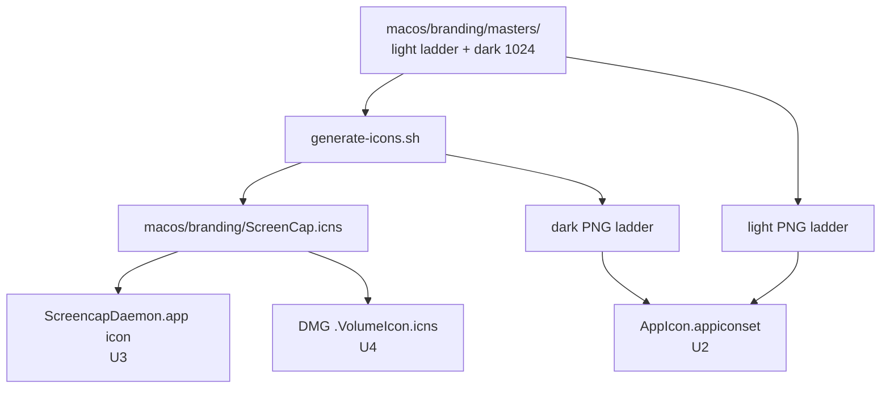

# App Icon & Brand Identity - Plan

## Goal Capsule

- **Objective:** Replace the generic placeholder app icon with the delivered brand mark across every macOS surface that shows it — the app itself, its dark-mode variant, the embedded daemon login item, and the release DMG.
- **Product authority:** Rute (owns the brand direction and the delivered artwork).
- **Open blockers:** None. The earlier dark-mode toolchain question is resolved — local Xcode is 26.4.1 (past the Xcode 16 floor), so the dark variant compiles and ships now.
- **Product Contract preservation:** changed — R1 reworded (dropped "DMG install window" to disambiguate from R5's volume icon; no scope change). R2–R5 carried verbatim; planning resolved the deferred mechanics into Key Technical Decisions.

---

## Product Contract

### Summary

Wire the delivered brand icon (the corner-brackets-plus-teal-dot mark on a warm-paper tile, with a dark-mode counterpart) into every macOS surface that currently shows a placeholder or default icon: the app's `AppIcon` set, a dark-appearance variant, the embedded `ScreencapDaemon.app` login item, and the release DMG volume. The mark is already rendered as final artwork at every required size — this work is delivery and wiring, not design.

### Problem Frame

The app icon slots are declared but empty: [`AppIcon.appiconset/Contents.json`](macos/ScreenCap/Assets.xcassets/AppIcon.appiconset/Contents.json) lists all ten macOS sizes but the folder contains no images, so Finder, the Dock, Launchpad, and the DMG install window all fall back to the generic placeholder tile. The embedded daemon is worse than generic: its `.app` is built with `icon=None` ([`screencap.spec:283`](pyinstaller/screencap.spec:283)), so System Settings → Login Items shows PyInstaller's own default icon under the name "ScreenCap". This lands right after a run of window-chrome fidelity work — the unbranded icon is now the most visible rough edge on an otherwise polished shell, and it's the first thing a tester sees when mounting the DMG.

### Key Decisions

- **Use the delivered artwork as-is; do not re-derive the tile in code.** The design bakes the macOS squircle, safe-area margins, and drop shadow into each PNG, and ships an exact-fit file for every required pixel size. Wiring copies these into place rather than compositing a mark onto a generated background.
- **One source mark feeds all surfaces.** The daemon `.icns` and the DMG volume icon derive from the same icon set as the app, so the mark can never drift between surfaces.
- **Dark mode is an asset-catalog appearance variant, not a runtime swap.** The dark tile is selected by the system appearance through the asset catalog, so no Swift code toggles it.

### Requirements

**Main app icon**

- R1. Populate all ten macOS `AppIcon` slots (16/32/128/256/512 px at @1x and @2x) from the delivered light artwork so the branded icon appears in Finder, the Dock, Launchpad, and the About panel. (The app icon shown inside the open DMG window follows from this; the DMG *volume* icon is R5.)
- R2. The icon renders crisply at every size with no manual redrawing or re-compositing — the delivered PNGs are exact-fit for each slot and already include the tile, margins, and shadow.

**Dark-mode variant**

- R3. When the system is in dark appearance (and the OS shows dark app icons), the app icon displays the delivered dark tile (`icon_1024x1024_dark.png`) instead of the light one; light appearance shows the light tile.

**Embedded daemon**

- R4. The embedded `ScreencapDaemon.app` login item shows the brand mark — not PyInstaller's default icon — in System Settings → Login Items, built from the same icon source as the app.

**Release DMG**

- R5. The mounted release DMG volume shows the brand mark in Finder in place of the generic external-drive icon.

### Acceptance Examples

- AE1. **Covers R1.** On a clean machine, after installing from the DMG, the app in `/Applications` and in the Dock shows the brand mark at every zoom level — no generic placeholder tile anywhere.
- AE2. **Covers R3.** On macOS 15+ set to dark appearance with dark app icons enabled, the app icon shows the dark tile; switching the system to light appearance shows the light tile. On macOS 13–14 the light tile is always used (no regression).
- AE3. **Covers R4.** After first launch registers the login item, System Settings → Login Items shows the "ScreenCap" helper row carrying the brand mark rather than the PyInstaller default icon.
- AE4. **Covers R5.** Double-clicking the release `.dmg` opens a Finder window whose volume icon is the brand mark.

### Scope Boundaries

**Deferred for later**

- The menu-bar icon. The `MenuBarExtra` label is currently the `record.circle` SF Symbol ([`ScreenCapApp.swift:145`](macos/ScreenCap/ScreenCapApp.swift:145)); a monochrome/template rendering of the mark could replace it, but that needs a separate single-color asset the brand set doesn't include yet.
- Other in-app iconography (notifications, empty states, onboarding art).

**Outside this work**

- Iterating the logo design itself. This wires the delivered mark; it does not revise it.

### Dependencies / Assumptions

- The delivered PNGs in the `app-icon/` set are final and design-approved.
- Enabling a dark-mode app icon is desirable given only a dark 1024 px master is supplied; the full dark size ladder is downscaled from it (the light ladder ships every size explicitly).
- The delivered artwork's `-2x` filename convention maps cleanly onto both the asset-catalog `@2x` slots and `iconutil`'s `@2x` iconset naming, so the same masters serve the app icon and the daemon/DMG `.icns`.

---

## Planning Contract

### Key Technical Decisions

- KTD-1. **Single source of truth under `macos/branding/`.** The delivered masters live in one committed directory, and a small generator produces every derived artifact from them: one `ScreenCap.icns` (reused by both the daemon bundle and the DMG volume) and the downscaled dark PNG ladder for the appiconset. Derived outputs are committed and authoritative — the Xcode/PyInstaller/DMG builds never invoke the generator; it exists for reproducible regeneration when the logo changes.
- KTD-2. **Dark icon via the classic multi-size appiconset plus `luminosity: dark` appearance entries**, with the dark ladder downscaled (`sips`) from the delivered dark 1024 — not a conversion to Xcode 16's single-size format. Reuses the delivered full light ladder and keeps explicit control of every slot. Local Xcode 26.4.1 compiles the appearance entries; the dark variant activates on macOS 15+ and falls back to the light tile on macOS 13–14 (deployment target [`project.yml`](macos/project.yml) macOS 13.0), so there is no regression below 15.
- KTD-3. **Daemon icon by setting the PyInstaller `BUNDLE(icon=…)`** to the generated `.icns`, resolved through the spec's existing repo-root join (`_root` at [`screencap.spec:187`](pyinstaller/screencap.spec:187)) → `macos/branding/ScreenCap.icns`. This replaces PyInstaller's default icon; the existing `--version` launch guard in [`embed-cli.sh`](macos/ScreenCap/Scripts/embed-cli.sh) still fails the build loud if the bundle breaks.
- KTD-4. **DMG volume icon via a read-write staging image, not `-srcfolder` directly.** Setting the custom-icon bit on the source folder before `hdiutil create -srcfolder … -format UDZO` does **not** survive onto the read-only volume — the volume root's icon bit ends up cleared (empirically reproduced on macOS 26.5.1). Instead, in [`script/notarize_app.sh`](script/notarize_app.sh) step 2: build the image as `-format UDRW`, `hdiutil attach` it, copy `macos/branding/ScreenCap.icns` to `<mounted-volume>/.VolumeIcon.icns` and run `xcrun SetFile -a C` on the **mounted volume root**, `hdiutil detach`, then `hdiutil convert … -format UDZO` to the final compressed image. The existing sign → notarize → staple steps run after the convert, unchanged.
- KTD-5. **Verification is build-warning + visual/runtime smoke; no new automated unit tests.** This is pure asset/config/build work — a Swift test asserting an icon "looks right" would be test theater. The safety nets are `actool`'s missing-image warnings at build time and the daemon bundle's existing `--version` launch guard.

### High-Level Technical Design

One set of masters fans out to four surfaces through the generator:

### Assumptions

- Build toolchain is Xcode 16+ (verified: 26.4.1 locally). An older toolchain would fail to compile the dark appearance entries — U2 is the only unit that depends on this.

---

## Implementation Units

### U1. Branding source assets + icon generator

**Goal:** One committed source of truth for the mark plus a reproducible generator for every derived icon artifact.

**Requirements:** Foundational for R1–R5.

**Dependencies:** None.

**Files:**
- `macos/branding/masters/` — the delivered light ladder PNGs (16/32/64/128/256/512/1024 with `-2x` variants) plus `icon_1024x1024.png` and `icon_1024x1024_dark.png`, copied from the delivered `app-icon/` set.
- `macos/branding/generate-icons.sh` — new generator.
- `macos/branding/ScreenCap.icns` — generated, committed (consumed by U3 and U4).

**Approach:** The script assembles a standard `.iconset` (Apple's `icon_16x16.png` … `icon_512x512@2x.png` naming) from the light masters and runs `iconutil -c icns` to emit `ScreenCap.icns`. It also downscales `icon_1024x1024_dark.png` with `sips -z` into the dark size ladder used by U2. The delivered masters use `-2x` suffixes; the generator renames them explicitly to the `@2x` names Apple's tooling expects rather than assuming the delivered filenames drop in verbatim. Idempotent and safe to re-run when the logo changes. Follows the `set -euo pipefail` style of [`embed-cli.sh`](macos/ScreenCap/Scripts/embed-cli.sh).

**Execution note:** Mostly asset/tooling — verify by running the script and confirming `file macos/branding/ScreenCap.icns` reports an Apple icon and every expected dark ladder size exists.

**Patterns to follow:** Repo shell-script conventions in [`script/`](script/) and [`macos/ScreenCap/Scripts/`](macos/ScreenCap/Scripts/).

**Test scenarios:** Test expectation: none — generator/asset unit. Smoke: script exits 0; `iconutil` produces a valid `.icns`; the dark ladder PNG sizes are all present.

**Verification:** `macos/branding/ScreenCap.icns` exists and is a valid `.icns`; the dark ladder is complete.

### U2. Wire light + dark app icon into the asset catalog

**Goal:** The app shows the branded icon (light everywhere; dark on macOS 15+) in Finder, the Dock, Launchpad, About, and the DMG install window.

**Requirements:** R1, R2, R3.

**Dependencies:** U1.

**Files:**
- `macos/ScreenCap/Assets.xcassets/AppIcon.appiconset/Contents.json`
- The 10 light PNGs and the dark ladder PNGs, placed inside the appiconset directory.

**Approach:** Copy the light ladder into the appiconset and add a `filename` to each of the ten existing slots. For dark, add a parallel per-slot entry carrying `"appearances": [{"appearance": "luminosity", "value": "dark"}]` referencing the dark PNGs (KTD-2). `actool` compiles the appearance entries under the local Xcode. Dark activates on macOS 15+; below that the light entry is used (deployment target macOS 13.0) with no regression.

**Execution note:** Asset wiring — verify by a Release build with zero missing-image/asset-catalog warnings, then a visual check of the Dock and Finder in both light and dark appearance.

**Test scenarios:**
- Covers AE1. Light icon renders on all surfaces at every size after a Release build/install; no placeholder tile.
- Covers AE2. On macOS 15+ dark mode the dark tile shows; switching to light shows the light tile; on macOS 13–14 the light tile is always used.
- Test expectation: none automated — build-warning + visual smoke (KTD-5).

**Verification:** Build emits no appiconset warnings; the icon renders at all sizes; the dark variant appears on macOS 15+.

### U3. Brand the embedded daemon bundle

**Goal:** The `ScreencapDaemon.app` login item shows the mark in System Settings → Login Items.

**Requirements:** R4.

**Dependencies:** U1.

**Files:** `pyinstaller/screencap.spec`.

**Approach:** Change the `BUNDLE(...)` `icon=None` at [`screencap.spec:283`](pyinstaller/screencap.spec:283) to reference the generated icns via the spec's existing repo-root resolution — `icon=os.path.join(_root, 'macos', 'branding', 'ScreenCap.icns')` (KTD-3). PyInstaller copies it into the bundle in place of its default icon. [`embed-cli.sh`](macos/ScreenCap/Scripts/embed-cli.sh)'s `--version` guard still runs, so a broken bundle fails loud.

**Execution note:** Rebuild the PyInstaller bundle (`pyinstaller pyinstaller/screencap.spec`); confirm the branded `.icns` is in `dist/ScreencapDaemon.app/Contents/Resources/` and the helper still launches (`--version`). The Login Items row may need a fresh helper registration / icon-cache refresh to show the new icon on an already-installed machine.

**Test scenarios:**
- Covers R4. Rebuilt `dist/ScreencapDaemon.app` carries the branded icns; `screencap --version` exits 0 (existing guard); the Login Items row shows the mark.
- Test expectation: none automated — smoke via the existing launch guard (KTD-5).

**Verification:** The rebuilt daemon bundle shows the branded icon and the helper launches.

### U4. Brand the release DMG volume icon

**Goal:** The mounted release DMG shows the mark instead of the generic external-drive icon.

**Requirements:** R5.

**Dependencies:** U1.

**Files:** `script/notarize_app.sh` (DMG build step, [lines ~133–146](script/notarize_app.sh:133)).

**Approach:** Restructure the DMG build — currently a single `hdiutil create -srcfolder … -format UDZO` at [`script/notarize_app.sh:141`](script/notarize_app.sh:141) — into the read-write-then-convert flow required to carry a volume icon (KTD-4): `hdiutil create -format UDRW` → `hdiutil attach` → copy `macos/branding/ScreenCap.icns` to `<mounted-volume>/.VolumeIcon.icns` and `xcrun SetFile -a C` the **mounted volume root** → `hdiutil detach` → `hdiutil convert -format UDZO` to the final image. Setting the bit on the source staging folder does not survive onto the read-only volume, so it must be set on the mounted volume. The subsequent sign → notarize → staple steps are unchanged.

**Execution note:** Release-only — verify by producing a DMG and mounting it; Finder shows the branded volume icon. This path runs only during the `macos-app-release` flow.

**Test scenarios:**
- Covers AE4. A locally-produced DMG mounts with the branded volume icon.
- Test expectation: none automated — verified on a produced DMG during release (KTD-5).

**Verification:** A produced DMG mounts with the branded volume icon; the icon survives DMG signing + notarization + stapling; the app and DMG still pass `xcrun stapler validate` and `spctl --assess`.

---

## Verification Contract

| Gate | Command / action | Applies to | Done signal |
|---|---|---|---|
| App builds clean | `xcodebuild -scheme ScreenCap -configuration Release build` (after `xcodegen generate`) | U2 | Build succeeds with no asset-catalog / missing-image warnings |
| App icon visual | Inspect Finder, Dock, Launchpad (light; and dark on macOS 15+) | U2 | Brand mark at every size; dark tile on 15+, light on 13–14 |
| Daemon rebuild | `pyinstaller pyinstaller/screencap.spec`; `dist/ScreencapDaemon.app/Contents/MacOS/screencap --version` | U3 | Bundle carries branded `.icns`; helper exits 0; Login Items row shows the mark |
| DMG volume icon | Run [`script/notarize_app.sh`](script/notarize_app.sh) (or the `macos-app-release` skill); mount the DMG | U4 | Mounted volume shows the mark; `stapler validate` + `spctl --assess` still pass |
| Generator sanity | `macos/branding/generate-icons.sh`; `file macos/branding/ScreenCap.icns` | U1 | Valid `.icns` emitted; dark ladder complete |

---

## Definition of Done

- R1–R5 satisfied: the mark shows on the app icon, as a dark variant on macOS 15+, on the daemon login item, and on the DMG volume.
- No new asset-catalog build warnings.
- The daemon bundle still launches after the icon change (existing `--version` guard green).
- DMG signing / notarization / stapling unaffected.
- Branding masters, generator, and generated `ScreenCap.icns` committed under `macos/branding/`.

---

## Open Questions

**Deferred to implementation**

- Whether the daemon Login Items row and the app's Finder icon refresh immediately on an already-installed test machine, or need an icon-cache reset — cosmetic, resolve during U3/U2 verification.
- Confirm on a macOS 15+ machine that the dark tile actually surfaces (KTD-2's "activates on macOS 15+" rests on external `actool`/OS behavior, not verifiable in-repo). The fallback-to-light path is safe regardless, so this gates visual confirmation, not shippability.
- Confirm the DMG volume icon survives `codesign --force` of the DMG plus notarization/stapling — U4 moves the icon into the volume contents, so verify it persists on the stapled artifact.
- Confirm `actool` under the local Xcode emits a *warning* (not a silent drop) when a dark-appearance slot references a missing PNG — it is the only automated guard for U2's hand-added dark slots (KTD-5).

---

## Sources & Research

- Empty app icon set — ten declared slots, zero images: [`AppIcon.appiconset/Contents.json`](macos/ScreenCap/Assets.xcassets/AppIcon.appiconset/Contents.json).
- App consumes this set: `ASSETCATALOG_COMPILER_APPICON_NAME: AppIcon` in [`project.yml`](macos/project.yml); deployment target macOS 13.0.
- Daemon ships PyInstaller's default icon: `BUNDLE(..., icon=None, ...)` at [`screencap.spec:283`](pyinstaller/screencap.spec:283); repo-root resolution via `_root` at [`screencap.spec:187`](pyinstaller/screencap.spec:187).
- DMG built via `hdiutil create -srcfolder` at [`script/notarize_app.sh:141`](script/notarize_app.sh:141); embedded-daemon `--version` launch guard in [`embed-cli.sh`](macos/ScreenCap/Scripts/embed-cli.sh).
- Menu-bar glyph is an SF Symbol, not the mark: [`ScreenCapApp.swift:145`](macos/ScreenCap/ScreenCapApp.swift:145) — deferred (Scope Boundaries).
- Delivered artwork (external to the repo, to be committed under `macos/branding/masters/`): `Screen recording tool brand direction.zip` → `app-icon/`, containing light PNGs at 16/32/64/128/256/512/1024 px (with `-2x` variants) plus `icon_1024x1024_dark.png`; all ten macOS app-icon pixel sizes covered exactly.
- Dark macOS app icons: asset-catalog `luminosity: dark` appearance entries require Xcode 16+ to compile and activate on macOS 15+ (fall back to light on 14 and below). Local toolchain Xcode 26.4.1 satisfies the build requirement.
