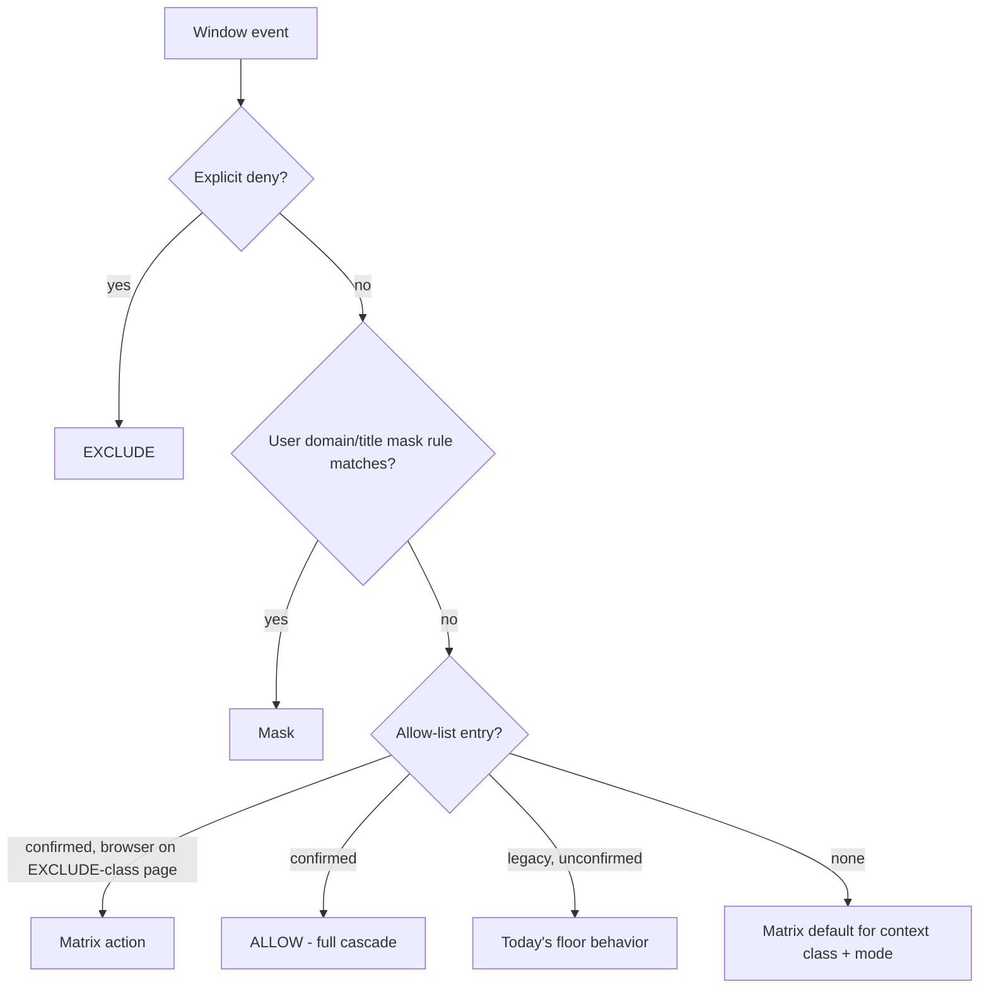
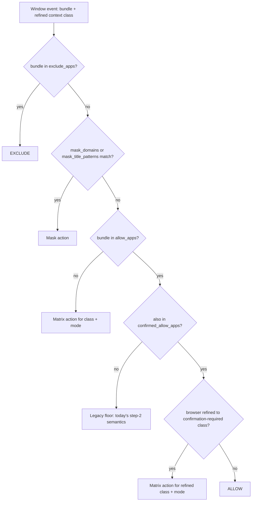
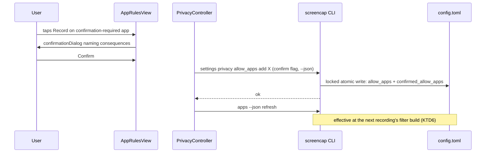

# Allow-List Authoritative Over Privacy Matrix - Plan

## Goal Capsule

- **Objective:** An explicitly confirmed user allow-list entry beats the privacy matrix in every privacy mode; the matrix drops to a suggested-defaults role for apps the user has not decided on.
- **Authority hierarchy:** Product Contract (SCR-235 brainstorm decisions of 2026-07-06, plus two plan-time user decisions: browser-refined contexts keep the matrix, and the scoping call-outs below) > Planning Contract > per-unit approach notes. Repo conventions govern style.
- **Execution profile:** Single branch; Python policy/CLI work first, Swift UI after the payload lands; test-first on the policy core (invert the pinned floor suites before changing `evaluate()`).
- **Stop conditions:** Stop and surface rather than guess if a change would weaken a fail-closed path (`frame_blocked`, `skip_intervals` `require_canonical`), or if implementation contradicts a Product Contract requirement.
- **Product Contract preservation:** changed: R12 and AE7 added (browser-refined EXCLUDE-class contexts keep the matrix action — user decision at plan time); Scope Boundaries gained two planning-confirmed exclusions (menu-bar runtime overrides, retroactive re-indexing); resolved Outstanding Questions moved into Planning Contract KTDs. R1–R11 and AE1–AE6 are unchanged.

---

## Product Contract

### Summary

Make a confirmed allow-list entry authoritative over the privacy matrix in all privacy modes. Allowing an EXCLUDE-class app (password manager, banking, auth/payment flows) requires a one-time confirmation; once confirmed, the app is fully ALLOW through every downstream layer — capture, keystrokes, content index, frame resolution, and cloud copies.

### Problem Frame

The macOS app-picker (`AppRulesView`) now gives users per-app consent, but the policy evaluator enforces a matrix-strictness floor: when the (context, mode) matrix returns EXCLUDE, MASK_WINDOW, or TEXT_REDACT, an explicit allow is ignored. The UI shows those rows locked ("Blocked under every privacy mode for security. This can't be changed.") and the CLI hard-rejects the addition with exit 1 — the user's explicit choice cannot win.

The floor's documented purpose is migration safety: pre-Unit-7a allow entries (e.g. an old Slack allow) must not silently re-enable raw capture under tightened defaults. That concern is real but narrower than the floor itself, which blocks *new, deliberate* user choices too. The friction surfaced while debugging the "everything masked in a local recording" bug: even with the mode bug fixed separately, a user who allows their email client in public mode still gets it masked. Runtime authority for the user's choice — not just transparency about the override — is the value at stake.

### Key Decisions

- **Confirm-then-override, with friction only for EXCLUDE-class apps.** An allow beats every matrix action. Allowing an app whose matrix action is EXCLUDE (password manager, banking, auth flow, payment flow) requires a one-time explicit confirmation; mask-class apps (MASK_WINDOW / TEXT_REDACT contexts such as email, chat, terminals) take effect on plain allow. This keeps "consent is real" while making user choice win.
- **All modes, not just public.** One mode-independent principle: the matrix supplies per-mode defaults for undecided apps; a confirmed allow always wins. The alternative (public-only) would make the strictest mode the most overridable and force mode-dependent UI row locking.
- **Full downstream cascade.** A confirmed allow means ALLOW everywhere: raw screenshots, keystroke text kept, video kept, OCR'd into the content index, resolvable via `frame.nearest`/MCP, included in cloud copies. No hybrid policy states; the confirmation carries the disclosure once, at decision time. SECURITY.md's ALLOW-only index invariant stays literally true.
- **Legacy allow entries stay floor-bound until confirmed.** Pre-existing entries were never confirmed, so they keep today's behavior. This preserves the Unit-7a migration-safety guarantee the floor was built for, without blocking new deliberate choices.
- **Only the matrix loses authority.** An explicit deny still beats any allow, and user-authored domain/title mask rules apply inside confirm-allowed apps. Mask rules move above the whole allow step: today the allow step's ALLOW-return path skips `mask_domains`/`mask_title_patterns` (its floor fallthroughs do reach them), so the reorder is a deliberate change on the ALLOW-return path — and a strictly-tightening one for legacy entries with matching rules.
- **Browsers: refined EXCLUDE-class contexts keep the matrix.** A confirmed browser records normally, but a window the classifier refines to an EXCLUDE-class context (banking page, auth flow, payment form) takes the matrix action for the current mode. App-level consent does not extend to arbitrary sensitive content a browser can host.
- **Matrix defaults are unchanged for unlisted apps.** The suggested-masking defaults stay exactly as strict as today; nothing loosens for apps the user hasn't listed.

The new authority ordering, conceptually:

### Requirements

**Policy precedence**

- R1. A confirmed allow-list entry evaluates to ALLOW in every privacy mode, regardless of the matrix action for the app's context class (including EXCLUDE).
- R2. The matrix remains the default for apps with no explicit user rule, with its per-mode defaults unchanged.
- R3. An explicit deny (`exclude_apps`) beats any allow, confirmed or not.
- R4. User-authored domain and title mask rules apply inside confirm-allowed apps.
- R5. Unconfirmed (legacy) allow entries keep today's floor behavior until the user confirms them, except that user domain/title mask rules now also precede legacy allows (a strictly-tightening delta).
- R12. Within a confirmed-allowed browser, a window the classifier refines to an EXCLUDE-class context keeps the matrix action for the current mode.

**Confirmation**

- R6. Allowing an EXCLUDE-class app requires a one-time explicit confirmation; mask-class allows take effect without extra friction.
- R7. The confirmation names the consequences at decision time: raw capture, keystrokes kept, searchable index (including already-recorded frames once backfill or future indexing runs), and inclusion in cloud copies when a cloud destination is enabled.
- R8. Both surfaces can create confirmed allows: the macOS app-picker unlocks matrix-locked rows behind the confirmation, and the CLI replaces its hard-reject with an explicit confirmation path.

**Downstream cascade**

- R9. A confirmed allow cascades to every consumer of the policy decision — capture-time enforcement, scrub-time masking, content indexing, frame resolution, and cloud copy — with no layer applying a stricter action.

**Docs and tests**

- R10. SECURITY.md reflects the new trust boundary: the floor section, the narrowed-R7 index wording (ALLOW now includes user-confirmed overrides), and the SCR-64 rationale are updated together.
- R11. Tests pin the new precedence: a confirmed allow in public mode is not masked; a non-allowed sensitive app still masks; a legacy unconfirmed entry stays floor-bound; explicit deny still wins.

Key Flows omitted: the change is policy-shaped; the confirmation interaction is fully covered by R6–R8 and AE2.

### Acceptance Examples

- AE1. **Covers R1, R9.** Given public mode and a confirmed allow for Mail (EMAIL → MASK_WINDOW at public), when a recording captures a Mail window, then the frames are raw on disk, indexed, and included in the cloud copy if the recording is cloud-destined.
- AE2. **Covers R6, R7.** Given 1Password is matrix-locked (PASSWORD_MANAGER → EXCLUDE in every mode), when the user switches it to Record in the app-picker, then a one-time confirmation naming the consequences appears, and only after confirming does capture include it.
- AE3. **Covers R2.** Given 1Password is not in any user list, when any recording runs in any mode, then it is excluded exactly as today.
- AE4. **Covers R5.** Given a pre-existing Slack allow entry that was never confirmed, when recording under internal mode, then Slack still gets MASK_WINDOW (unchanged floor behavior).
- AE5. **Covers R4.** Given a confirmed allow for a browser and a `mask_domains` rule for a banking domain, when a window matching that domain appears, then it is still masked.
- AE6. **Covers R3.** Given an app in both `exclude_apps` and the confirmed allow-list, when it appears on screen, then it is excluded.
- AE7. **Covers R12.** Given a confirmed allow for a browser and no matching domain/title rule, when the classifier refines a window to BANKING, then the matrix action for the current mode applies (EXCLUDE at public, MASK_WINDOW at internal).

### Scope Boundaries

- No per-window or per-tab granularity; allow/confirm operates at the app (bundle) level.
- No new privacy modes and no changes to the mode set or per-mode matrix defaults.
- No changes to `masked_video_upload` semantics or the capture-time-blocking vs post-hoc-masking trust split.
- Menu-bar runtime overrides (`runtime_overrides`) stay a separate session-scoped mechanism, untouched: they bypass the matrix and remain stripped for cloud-bound recordings.
- No retroactive re-indexing or un-purging: confirming an app changes what future derivations see (backfill and frame lookup re-derive from live settings), but nothing re-indexes already-processed chunks automatically.
- Per-app `app_classes` overrides keep their existing guard unchanged; the confirmed-allow path supersedes the need to reclassify in order to loosen.
- Transparency-only alternatives (warning that an allow won't take effect, without granting it authority) were considered and rejected — runtime authority is the point.

### Dependencies / Assumptions

- Verified: the capture-time PrivacyMode is read from live config at filter build (not frozen per recording), and cloud-intent recordings force PUBLIC mode with `allow_apps` stripped to empty (src/screencap/enforcement/window_filter.py:63-84). The cloud path must honor confirmed entries for R9 to hold — resolved by KTD5.
- Verified: `mask_frame`'s lazily built masking evaluator forces PUBLIC mode but keeps the live `allow_apps` (src/screencap/enforcement/recorder_enforcement.py:601-610) — the asymmetry with the cloud window filter is reconciled by KTD5.
- The UI's Mask-override stub (SCR-225, `AppRuleSegmentPolicy`) is adjacent; the Record/Block transitions this plan touches do not depend on it, and the Mask segment stays non-tappable.

### Sources / Research

- src/screencap/privacy/policy.py:411-521 — `DefaultPolicyEvaluator.evaluate` precedence, the matrix-strictness floor, and the Unit-7a legacy-entry comment (lines 454-460); matrix table at lines 71-123; browser-reclassification fallthrough at lines 475-481 (falls through to the matrix; the fallthrough paths do reach the domain/title steps today — only the ALLOW/EXCLUDE returns skip them).
- src/screencap/privacy_settings.py — `_matrix_blocks_allow_for_class` (378-407) and the mutation engine `_settings_privacy_apply` (410-685) with its field-kind registries `_PRIVACY_LIST_FIELDS`/`_PRIVACY_MAP_FIELDS` (32-37); the locked atomic writer `_privacy_config_writer` (63-125). Verified drive-by: the guard's suggestion "Set mode=public to capture broadly" is backwards (public masks more than internal); retired with the guard.
- src/screencap/privacy/actions.py:44-74 — the action sets each downstream layer keys on (BLOCK, KEYSTROKE_NULL, VIDEO_BLOCK, SCRUB_BLOCK).
- src/screencap/cli/__init__.py:1780-1904 — the `apps --json` command; `is_matrix_exclude` computed as "EXCLUDE in every mode" (1859-1862), true only for PASSWORD_MANAGER; `_APPS_SCHEMA_VERSION` at line 52.
- src/screencap/setup_wizard.py:33, 690-694 — wizard-scoped `_BLOCKED_CLASSES` ({PASSWORD_MANAGER, BANKING}) and the silent auto-allow path; the matrix-ack one-time-flag machinery (`matrix_acknowledged_v2026_04`, `SCREENCAP_PARENT=swiftui`) as the nearest confirmation-flow analog.
- macos/Screencap — pure CLI client, no daemon settings verbs: `PrivacyController.swift` (84-156) shells to `screencap settings privacy` / `apps --json`; `AppRuleSegmentPolicy.swift` derivation priority (46-118) documents the exclude-not-matrix-locked state as "only reachable via a hand-edited config" (66-70) — a state this change makes routine; `InstalledApp.swift` decodes all fields as required (no Optionals) — decode-skew risk with a stale daemon (docs/solutions/integration-issues/stale-daemon-after-app-update-http-500-2026-07-02.md).
- SECURITY.md:66 — the narrowed-R7 ALLOW-only content-index invariant R10 must re-word.
- tests/test_privacy_matrix_corrections.py:108-247 — `TestAllowAppsRespectsMatrixFloor` and `TestAllowAppsStrictnessFloor`, the suites U1 inverts; tests/test_privacy_settings.py (direct-seam) and tests/test_settings_privacy.py (CliRunner) for the CLI guard. None of the five relevant test files carry `@pytest.mark.privacy` today, so none run in CI (`pytest -m privacy` is the only CI lane) — U1/U2 fix this for the touched suites. New precedence tests must stay Vision-free so the `privacy-guards-visionfree` lane runs them (docs/solutions/workflow-issues/privacy-guards-deselected-on-ci-silently-rot-2026-06-10.md).
- Linear: SCR-235 (this change), SCR-64 (daemon trust boundary rationale to update), SCR-225 (UI mask override).

---

## Planning Contract

### Key Technical Decisions

- **KTD1 — Confirmation state is a sibling `confirmed_allow_apps` list.** A flat bundle-id list in `[privacy]` next to `allow_apps`, registered in `_PRIVACY_LIST_FIELDS`. An entry is authoritative only when present in both lists; a confirmed entry without a matching allow entry is inert. Removing an app from `allow_apps` prunes its confirmed entry (re-allowing an EXCLUDE-class app re-prompts); adding to `exclude_apps` leaves both lists untouched, matching today's coexistence behavior where runtime precedence resolves the conflict. Rationale: flat lists and bundle→string maps are the only precedented shapes in this config; a per-entry sub-table would be the format's first and complicates the tomlkit mutation engine for no gain.
- **KTD2 — One confirmation-required class definition, derived from the matrix.** A helper in src/screencap/privacy/policy.py returns the classes whose matrix row contains EXCLUDE in any mode (PASSWORD_MANAGER, BANKING, AUTH_FLOW, PAYMENT_FLOW), computed from the matrix so it cannot drift. It replaces the three divergent notions in use today: `is_matrix_exclude` ("EXCLUDE in *every* mode", true only for PASSWORD_MANAGER), the wizard's `_BLOCKED_CLASSES` ({PASSWORD_MANAGER, BANKING}), and the CLI guard's blocking-action check. All three surfaces (CLI, wizard, apps payload → Swift) consume the helper.
- **KTD3 — `evaluate()` is restructured, not reordered.** New order: exclude_apps → domain/title mask rules evaluated unconditionally → confirmed allow (with the R12 browser carve-out: a browser-refined confirmation-required context falls to the matrix) → legacy-allow floor behavior → matrix default. Rationale: today only the allow step's ALLOW-return (and EXCLUDE-return) paths skip the mask rules — the floor and browser fallthroughs already reach them — so the move exists to make the rules hold on the new confirmed-ALLOW path (R4) and, deliberately, ahead of legacy ALLOW-returns (the tightening-only delta owned in R5). The R12 carve-out's browser test must use the classifier's browser definition (`BROWSER_BUNDLE_IDS` union app_classes-tagged BROWSER_UNVERIFIED, per classify.py) — the evaluator's current app_classes-only check misses stock browsers and would leave the carve-out dead in common configs.
- **KTD4 — CLI confirmation is an explicit flag, not an interactive prompt.** `allow_apps add` for a confirmation-required class fails with an actionable error naming the flag (machine-readable error id in the existing `reason:detail@mode` style) unless the flag is passed; with it, both lists are written in one locked transaction. Non-required classes auto-confirm on add (no flag, no friction) — that is what distinguishes a new deliberate add from a legacy entry. SwiftUI shows the dialog and passes the flag; headless callers stay deterministic. The retired guard's backwards "Set mode=public to capture broadly" message goes with it (the near-identical advice in the `app_classes` guard message is reworded in the same pass, message text only). The existing fail-closed refusal to allow-list an unclassified bundle is preserved unchanged — classification remains a prerequisite to any allow, confirmed or not.
- **KTD5 — One shared cloud shaping: restrict the allow set to confirmed entries.** A single `PrivacyConfig`-shaping helper (in the privacy package) replaces the cloud window filter's strip-to-empty (window_filter.py:84) and is also applied to `mask_frame`'s masking evaluator, so the two PUBLIC-forcing cloud surfaces agree: confirmed entries survive, legacy entries do not. `build_privacy_filter` stays the only factory entry point (call-graph guard).
- **KTD6 — Confirmation takes effect at the next filter build (recording start).** No routing through `override_q`; config-file edits already behave this way for every other privacy setting, and the menu bar remains the live-toggle path.
- **KTD7 — Bundle-ID membership is case-normalized at parse time.** `allow_apps`, `exclude_apps`, `confirmed_allow_apps`, and `app_classes` keys are casefolded when `parse_privacy_config` builds its sets, matching the `mask_domains` lowercase precedent. The confirmed-allow mechanism rests on two-list membership; a casing mismatch must not silently drop authority.
- **KTD8 — Payload compatibility over decode strictness.** The new `apps --json` fields decode in Swift as Optionals with safe defaults (locked/unconfirmed), so a new app talking to a stale daemon degrades to today's behavior instead of failing the whole `apps` array decode. `_APPS_SCHEMA_VERSION` is bumped.

### High-Level Technical Design

The restructured evaluator (the concrete form of the Product Contract's authority chain):

The confirmation write path across surfaces:

Which allow set each evaluator construction site sees:

| Construction site | Mode | Allow set handed to the evaluator |
|---|---|---|
| Local window filter (`build_local_window_filter`) | live config | full: allow + confirmed as-is |
| Cloud window filter (`build_cloud_window_filter`) | forced PUBLIC | confirmed entries only (replaces today's strip-to-empty) |
| `mask_frame` masking evaluator (`recorder_enforcement`) | forced PUBLIC | confirmed entries only (today: full — reconciled by KTD5) |
| Backfill `skip_intervals` / `frame_blocked` | per-recording mode, fail-closed | live config as-is (precedence change flows through automatically) |
| CLI `apps` command payload | configured mode | live config as-is (reporting) |

### Sequencing

U1 (policy core) → U2 (settings/CLI) → U3 (payload + wizard) → U5 (Swift UI, needs U2's flag and U3's fields). U4 (cloud paths) depends only on U1 and can land in parallel with U2/U3. U6 (SECURITY.md) last, once semantics are final.

---

## Implementation Units

### U1. Confirmed-allow precedence in the policy core

- **Goal:** `evaluate()` implements the new authority ordering; confirmation state and the unified confirmation-required class set exist in the privacy leaf package.
- **Requirements:** R1, R2, R3, R4, R5, R12 (KTD1, KTD2, KTD3, KTD7)
- **Dependencies:** none
- **Files:** src/screencap/privacy/policy.py; tests/test_privacy_matrix_corrections.py
- **Approach:** Parse `confirmed_allow_apps` into a frozenset on `PrivacyConfig` with an `is_confirmed_allowed()` accessor; casefold bundle-id membership for all app lists and `app_classes` keys (KTD7). Restructure `evaluate()` per KTD3, preserving today's step-2 floor semantics for legacy (unconfirmed) entries (mask rules now run first — the owned R5 delta), with the R12 browser test widened to the classifier's browser definition. Add the matrix-derived confirmation-required class helper (KTD2). All changes stay in the privacy leaf — no new imports from enforcement or redaction (package-boundary guard).
- **Execution note:** Invert the pinned floor suites first — the failing inverted tests define the new precedence before `evaluate()` changes.
- **Test scenarios** (all Vision-free, marked `@pytest.mark.privacy`):
  - Covers AE1 (policy half). Confirmed Mail under public → ALLOW.
  - Confirmed Slack under internal, shared, and public → ALLOW in each mode.
  - Confirmed 1Password → ALLOW in every mode (policy half of AE2).
  - Covers AE3. Unlisted 1Password → EXCLUDE in every mode (existing pin preserved).
  - Covers AE4. Legacy Slack (allow only, unconfirmed) under internal → MASK_WINDOW; under public → MASK_WINDOW.
  - Legacy 1Password (allow only) → EXCLUDE (existing pin preserved).
  - Covers AE6. Bundle in both `exclude_apps` and confirmed allow → EXCLUDE.
  - Covers AE5. Confirmed browser + `mask_domains` banking rule + matching window → mask action.
  - Covers AE7. Confirmed browser, no domain/title rule, window refined to BANKING → EXCLUDE at public, MASK_WINDOW at internal.
  - Covers AE7. Confirmed stock browser (in `BROWSER_BUNDLE_IDS`, no `app_classes` entry), window refined to BANKING → matrix action (carve-out must not depend on app_classes).
  - Legacy allow in a non-blocking matrix context + matching mask rule → mask action (the owned R5 tightening).
  - Confirmed browser on a benign page (BROWSER_UNVERIFIED, no rule match) → ALLOW.
  - `mask_title_patterns` match inside a confirmed non-browser app → mask action (R4).
  - Orphaned confirmed entry (in `confirmed_allow_apps` only) → behaves as unlisted (KTD1).
  - Case-variant bundle id across the two lists → still authoritative (KTD7).
  - `SCREENCAP_PRIVACY_MODE` tightening + confirmed allow → still ALLOW (mode-independence).
  - The confirmation-required helper returns exactly {PASSWORD_MANAGER, BANKING, AUTH_FLOW, PAYMENT_FLOW}, derived from the matrix (drift guard).
- **Verification:** Inverted suite passes; tests/test_package_boundary_call_graph.py and tests/redaction/test_import_lightness.py stay green; new tests collected by `pytest -m privacy`.

### U2. Settings mutation engine and CLI confirmation path

- **Goal:** `allow_apps add` writes confirmation state per KTD4; the hard-reject guard becomes the confirmation gate; removal prunes confirmed state.
- **Requirements:** R5, R6, R8 (CLI half) (KTD1, KTD4)
- **Dependencies:** U1
- **Files:** src/screencap/privacy_settings.py; src/screencap/cli/__init__.py (settings command flag plumbing); tests/test_privacy_settings.py; tests/test_settings_privacy.py
- **Approach:** Register `confirmed_allow_apps` in `_PRIVACY_LIST_FIELDS` (internally managed; direct writes behave as a plain list field). On `allow_apps add`: non-required class → write both lists; required class → error-with-guidance unless the confirm flag is passed (flag name finalized at implementation), then write both in one `_privacy_config_writer` transaction. On `allow_apps remove`: prune the confirmed entry. Repurpose `_matrix_blocks_allow_for_class` into the confirmation gate (or replace it), keeping the machine-readable error id style and the guard's consultation of on-disk `app_classes` overrides; keep the fail-closed refusal for unclassified bundles; do not touch the matrix-ack machinery.
- **Test scenarios** (marked `@pytest.mark.privacy`):
  - Covers AE2 (CLI half). Add 1Password without the flag → exit 1, error names the flag and the class; with the flag → both lists written.
  - Add Slack (CHAT, mask-class) → both lists written, no flag needed.
  - Remove an allow → confirmed entry pruned; re-adding an EXCLUDE-class app requires the flag again.
  - Add to `exclude_apps` while confirmed-allowed → both lists untouched; U1's runtime pin covers precedence.
  - The retired "Set mode=public to capture broadly" message no longer appears anywhere in the error path, and the `app_classes` guard's reworded advice no longer suggests public captures more.
  - An unclassified bundle is still refused fail-closed (unchanged behavior, now pinned).
  - Locked atomic write behavior preserved (existing writer path, comment-preserving tomlkit mutation).
- **Verification:** Direct-seam and CliRunner suites pass and are collected by `pytest -m privacy`.

### U3. Apps payload and setup wizard alignment

- **Goal:** `apps --json` carries confirmation state and the unified class definition; the wizard cannot silently allow a confirmation-required app.
- **Requirements:** R6 (data the UI needs), R8 (KTD2, KTD8)
- **Dependencies:** U1, U2
- **Files:** src/screencap/cli/__init__.py (apps command); src/screencap/setup_wizard.py; tests/test_apps_command.py; tests/test_setup_wizard.py
- **Approach:** Add per-app payload fields for allow-confirmed state and confirmation-required (from the KTD2 helper); keep `is_matrix_exclude` for compatibility but stop treating it as the row-locking driver; bump `_APPS_SCHEMA_VERSION`. In the wizard, replace `_BLOCKED_CLASSES` with the KTD2 helper and gate the auto-allow bucket itself with it: confirmation-required classes are never auto-allowed silently, even when a source-based rule (background app, safe source) would otherwise route them there. Silent auto-allows write `allow_apps` only (legacy, unconfirmed semantics — the user never saw those apps named); only explicit per-app user choices in the visible review groups write both lists.
- **Test scenarios:**
  - Payload for a confirmed app, a legacy-allow app, an unlisted sensitive app, and an unlisted safe app carries the right field combinations.
  - Schema version bumped; existing fields unchanged.
  - Wizard run with an AUTH_FLOW-classified bundle → not auto-allowed, lands in the reviewed group.
  - Wizard fixture with an `app_classes` override mapping a background app to a confirmation-required class → not auto-allowed (the bucket gate, not just the class list).
  - Wizard silent auto-allow of a safe app → present in `allow_apps` only (legacy); an explicit per-app allow in the review flow → present in both lists.
- **Verification:** tests/test_apps_command.py and tests/test_setup_wizard.py pass, marked `@pytest.mark.privacy`.

### U4. Cloud and masking path reconciliation

- **Goal:** Both PUBLIC-forcing cloud surfaces honor confirmed entries and only confirmed entries.
- **Requirements:** R1, R9 (cloud half) (KTD5)
- **Dependencies:** U1
- **Files:** src/screencap/enforcement/window_filter.py; src/screencap/enforcement/recorder_enforcement.py; tests/enforcement/test_filter_factory.py; tests/enforcement/test_recorder_enforcement.py
- **Approach:** Replace the `allow_apps=frozenset()` strip in `build_privacy_filter`'s cloud branch with the KTD5 shaping helper (restrict allow set to confirmed entries); apply the same shaping when `mask_frame` builds its PUBLIC-forced masking evaluator. `runtime_overrides` handling is untouched. No new `build_privacy_filter` call sites (call-graph guard).
- **Test scenarios** (marked `@pytest.mark.privacy`):
  - Cloud window filter: confirmed app's events pass unblocked; legacy-allow app's events take the floor action; unlisted sensitive app blocked as today.
  - Covers AE1 (cloud half). Confirmed app under cloud intent → keystrokes kept, video frames kept (not in KEYSTROKE_NULL/VIDEO_BLOCK sets).
  - `mask_frame`: background window of a confirmed app is not masked; legacy-allow app's window is masked.
  - Local filter: legacy entries keep floor semantics (mask rules may now precede them per R5's owned delta).
- **Verification:** Enforcement suites pass; tests/test_privacy_filter_call_graph.py stays green.

### U5. macOS app-picker unlock and confirmation dialog

- **Goal:** Confirmation-required rows unlock behind the app's first confirmation dialog; confirmed rows read as Record; stale-daemon skew degrades safely.
- **Requirements:** R6, R7, R8 (UI half); AE2 (KTD8)
- **Dependencies:** U2, U3
- **Files:** macos/Screencap/Models/InstalledApp.swift; macos/Screencap/Views/Settings/AppRuleSegmentPolicy.swift; macos/Screencap/Views/Settings/AppRulesView.swift; macos/Screencap/Controllers/PrivacyController.swift; macos/ScreencapTests/AppRuleSegmentPolicyTests.swift; macos/ScreencapTests/PrivacyControllerTests.swift
- **Approach:** Decode the new payload fields as Optionals with locked/unconfirmed defaults (KTD8). Rework `AppRuleSegmentPolicy.derive`: confirmation-required + unconfirmed → Record segment enabled but its transition requires confirmation; confirmed → Record selected and writable; the formerly "hand-edited config only" exclude-not-matrix-locked state becomes a first-class rendered state. Add the Settings surface's first `confirmationDialog` (nearest prior art is LibraryView's plain alert); dialog copy names the R7 consequences with conditional cloud phrasing ("if a recording is cloud-destined") since the destination is often decided per-recording. On confirm, `PrivacyController` invokes the CLI with the confirm flag; cancel writes nothing; `refreshApps()` snaps state either way. If the CLI call fails after confirm, the existing `lastError` banner surfaces and the row returns to its unconfirmed state on refresh — the user re-taps to retry (no silent retry). New row states carry note strings following the existing derive() note pattern (exact copy lands at implementation; the derivation tests pin it). Dialog copy for browsers also states that banking/auth/payment pages stay protected (R12).
- **Execution note:** `AppRuleSegmentPolicy` is pure — build its derivation tests first; app builds via XcodeGen per macos/README.md.
- **Test scenarios:**
  - Segment derivation for: confirmation-required + unconfirmed, confirmed, legacy-allow, unlisted-sensitive, and unlisted-safe apps.
  - Covers AE2 (UI half). Tapping Record on a confirmation-required app produces the confirmation transition, not a direct write; confirm → CLI invoked with the flag; cancel → no CLI call.
  - Decoding a payload without the new fields (stale daemon) → defaults applied, no decode failure, rows render as today.
- **Verification:** macOS test suite passes (`xcodebuild test`, Screencap scheme; the known flaky daemon-reconnect test is unrelated).

### U6. SECURITY.md and trust-boundary docs

- **Goal:** The documented trust boundary matches the shipped behavior.
- **Requirements:** R10
- **Dependencies:** U1–U5 (semantics final)
- **Files:** SECURITY.md; CLAUDE.md (privacy-subsystem paragraph only if its wording drifts)
- **Approach:** Rewrite the matrix-floor section as confirmed-allow authority with the browser carve-out (R12) and the legacy-entry floor (R5); re-word narrowed-R7 (the index stays ALLOW-only; ALLOW now includes user-confirmed overrides); cross-reference the SCR-64 rationale; document the retroactive-exposure semantics (live re-derivation; no automatic re-index or un-purge) and the cloud shaping (confirmed-only allow set under cloud intent); note that menu-bar runtime overrides remain a pre-existing session-scoped parallel path that can allow any app without the confirmation gate (unchanged, out of scope); keep the documented consequence list in sync with the R7 dialog copy, including the retroactive leg.
- **Test expectation:** none — documentation-only unit.

---

## Verification Contract

Run from the repo root; in a worktree, prefix pytest with `PYTHONPATH=src` (editable install may point elsewhere).

| Gate | Command | Proves |
|---|---|---|
| Policy + settings suites | `pytest tests/test_privacy_matrix_corrections.py tests/test_privacy_settings.py tests/test_settings_privacy.py tests/test_apps_command.py tests/test_setup_wizard.py` | U1, U2, U3 |
| Enforcement suites | `pytest tests/enforcement/test_filter_factory.py tests/enforcement/test_recorder_enforcement.py` | U4 |
| Structural guards | `pytest tests/test_privacy_filter_call_graph.py tests/test_package_boundary_call_graph.py tests/redaction/test_import_lightness.py` | package DAG + factory homes intact |
| CI-lane parity | `pytest -m privacy --collect-only` collects the new/changed tests; full `pytest -m privacy` passes | R11 tests actually run in CI, Vision-free |
| macOS app | `xcodegen generate` then `xcodebuild test` (Screencap scheme, per macos/README.md) | U5 |
| SECURITY.md docs | No automated gate (documentation-only); verified by the Definition of Done's SECURITY.md criterion | U6 |

---

## Definition of Done

- Every acceptance example (AE1–AE7) is enforced by at least one passing test scenario.
- All Verification Contract gates green, including `pytest -m privacy` collecting the touched suites.
- SECURITY.md updated per U6; the retired CLI guard message and the "Blocked under every privacy mode" locked-row copy no longer describe shipped behavior.
- The Goal Capsule's Product Contract preservation note is accurate for the final diff.
- No abandoned experimental code from dead-end approaches remains in the diff.
