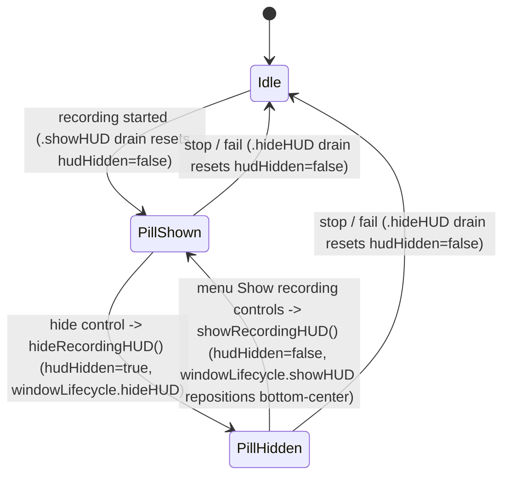

# Recording HUD hide control and shadow cleanup - Plan

Product Contract preservation: unchanged. R1–R7 and AE1–AE4 are carried verbatim from the requirements-only source (`docs/plans/2026-07-06-001-feat-recording-hud-hide-and-shadow-plan.html`); this enrichment adds only Planning Contract, Implementation Units, Verification Contract, and Definition of Done. The `.html` sibling is superseded by this `.md` (format conversion under pipeline mode).

---

## Goal Capsule

- **Objective.** Give the floating recording HUD pill a hide control that fully dismisses it during a recording, restorable from the menu bar, and clean up the pill's drop shadow so it reads well on any background.
- **Authority.** Product scope is fixed by the Product Contract below; implementation decisions are the executor's within that scope.
- **Stop conditions.** Stop and surface a blocker if the capture-exclusion guarantee (`sharingType = .none`) can no longer hold once the pill can be hidden/restored, or if reusing `WindowLifecycle.showHUD` for restore does not reliably reposition the pill bottom-center.
- **Execution profile.** Standard depth, 4 units. U1 is the foundation; U2 and U3 depend on it; U4 (shadow) is independent and can land in any order.
- **Tail.** LFG owns commit/push/PR/CI after implementation.

---

## Product Contract

### Summary

Add a hide control to the recording HUD pill that fully dismisses it during a recording. While hidden, the menu-bar icon stays the persistent recording indicator and Stop, and a new *Show recording controls* item in the menu-bar dropdown brings the pill back. Separately, clean up the pill's drop shadow so it renders as a subtly lifted capsule on any background instead of a heavy halo on light content.

### Problem Frame

The recording pill sits bottom-center over whatever you're recording, and today its only action is *Stop & save* — there's no way to move it out of sight without ending the recording. During a screen recording that's prime real estate: it overlaps video-player controls, a composer, or the dock exactly where you're working.

The pill is a dark capsule that needs some lift to separate from the content behind it, but the current shadow is far too heavy — a large, downward-offset 40%-black blur (`macos/ScreenCap/Views/Record/RecordingHUDPanel.swift`, the `pill` view's `.shadow(color: .black.opacity(0.4), radius: 16, y: 12)`). On a dark page it disappears; on light content it reads as a grey cloud wrapped around the pill, which is what looks "buggy." The heaviness may be compounded by the floating panel being sized to the pill's `fittingSize`, which can clip the shadow's soft edge.

### Requirements

**Hide control**

- R1. The recording HUD pill carries a hide control that fully dismisses the pill from the screen.
- R2. Hiding the pill never affects capture — the recording continues uninterrupted.

**Restore and recording indicator**

- R3. While the pill is hidden, the menu-bar icon remains the persistent recording indicator and continues to offer Stop Recording.
- R4. The menu-bar dropdown provides a *Show recording controls* action that re-summons the pill. It appears only while a recording is active and the pill is hidden.
- R5. Restoring the pill returns it to its default bottom-center position.
- R6. Hide is per-recording and transient: each recording starts with the pill shown, and the hidden state resets when the recording stops or fails.

**Shadow cleanup**

- R7. The pill reads as a subtly, cleanly lifted capsule on any background — no heavy grey halo on light content and no clipped or hard-edged shadow.

### Acceptance Examples

- AE1. **Covers R1, R2.** When a recording is in progress and the user activates the hide control, then the pill disappears from the screen while the elapsed timer keeps advancing and capture keeps writing to disk.
- AE2. **Covers R3, R4, R5.** When the pill is hidden and the user opens the menu-bar dropdown, then the menu shows the amber recording glyph, a Stop Recording item, and a Show recording controls item; choosing the latter re-shows the pill at bottom-center.
- AE3. **Covers R3.** When the pill is hidden and the user chooses Stop Recording from the menu bar, then the recording ends and saves normally, exactly as it would with the pill visible.
- AE4. **Covers R6.** When a recording fails (e.g. permission lost) while the pill is hidden, then the failure is still surfaced and the next recording begins with the pill visible.

### Scope Boundaries

Deferred for later:

- Making Draw and Mute functional (SCR-217 / SCR-218) — the hide and shadow work does not touch them.
- A global/system-wide hotkey to toggle the pill — ScreenCap's shortcuts are app-scoped, so one wouldn't fire while focused in the recorded app.
- A remembered "always start recordings hidden" preference.
- Restoring the pill to its last dragged position (restore is always bottom-center).
- The minimize-to-a-dot and dock-to-edge hide shapes — considered and rejected in favor of full dismiss.
- A background-adaptive shadow that samples the content behind the pill.

### Dependencies and Assumptions

- The menu-bar label already swaps to a filled amber recording glyph while live (`macos/ScreenCap/ScreenCapApp.swift`, `MenuBarLabel`), and the dropdown already carries Stop Recording (`macos/ScreenCap/Views/MenuBarMenu.swift`) — the hide feature relies on both as the fallback indicator and stop path.
- The pill is capture-excluded (`sharingType = .none`), so none of these changes affect what appears inside a recording. This guarantee must survive the hide/restore paths.

### Sources

- `macos/ScreenCap/Views/Record/RecordingHUDPanel.swift` — the HUD pill, its `.shadow(...)`, and `RecordingHUDPanelController` (`show` / `hide` / `reposition`, capture exclusion, `fittingSize` panel sizing).
- `macos/ScreenCap/Controllers/RecorderController.swift` — mirrors state to `@Published`, applies `.showHUD` / `.hideHUD` effects via `windowLifecycle`, and tears the HUD down in `transitionToIdle()`.
- `macos/ScreenCap/Controllers/WindowLifecycle.swift` — the `showHUD` / `hideHUD` seam, plus `FakeWindowLifecycle` (in tests) exposing `showHUDCount` / `hideHUDCount`.
- `macos/ScreenCap/Views/MenuBarMenu.swift` — the dropdown, Stop Recording, and recording-state gating.
- `docs/runbooks/new-ui-manual-qa.md` — the manual-QA checklist for window/menu-bar/visual HUD paths, established by U7 of `docs/plans/2026-07-03-001-feat-screencap-prototype-ui-plan.md` (the plan that built the HUD).

---

## Planning Contract

### Key Technical Decisions

- **Model user-hide as a published `hudHidden` flag on `RecorderController`.** Pill visibility is now two-dimensional — recording-active × user-hidden. A dedicated `@Published private(set) var hudHidden` keeps the pill's hide button and the menu-bar item reading one source of truth, and resets to `false` wherever the HUD is shown or torn down by tying the reset to the `.showHUD` / `.hideHUD` effect drains in `apply()` (see U1) — not `transitionToIdle()` alone, which the normal stop and `recording_failed` paths bypass. This is distinct from the recording state machine; hide is a view-surface concern, not a recording lifecycle transition, so it does not become a new `Effect` case.
- **Reuse the existing `WindowLifecycle.showHUD` / `hideHUD` seam for user hide and restore.** `hideHUD()` already orders the panel out and tears it down; `showHUD(for:)` recreates it and repositions bottom-center via `reposition(_:)` — which satisfies R5 for free. Adding a separate orderOut/orderFront visibility path would create a second, drift-prone panel-state channel. Restore therefore recreates the panel (acceptable; the content is `.fixedSize()` and cheap).
- **Extract the *Show recording controls* menu-visibility into a small pure policy predicate.** SwiftUI menu views aren't directly unit-testable; the app's convention is to factor view gating into testable `*Policy` structs (`NewRecordingSheetPolicy`, `OnboardingStepPolicy`, `AppRuleSegmentPolicy`). A `MenuBarMenuPolicy.showRecordingControlsVisible(state:hudHidden:)` predicate makes R4's gating a unit test rather than a manual check.
- **Fix the shadow as one universal treatment and address the panel-sizing clip, verified by manual QA.** The pill floats over arbitrary content, so a single subtle lift (lower opacity, smaller radius/offset, optionally a hairline capsule border) is simpler and more robust than background sampling. Because the panel is sized to the pill's `fittingSize` — which excludes the shadow's blur/offset extent — the softened shadow can still clip; the fix must also give the panel content room for the shadow (transparent inset around the pill, or size the panel to include the blur extent). Purely visual: verified on light and dark backgrounds via the manual-QA runbook, consistent with the HUD's origin plan (U7 of `docs/plans/2026-07-03-001-feat-screencap-prototype-ui-plan.md`).

### High-Level Technical Design

Pill visibility as a function of recording state and the new `hudHidden` flag:



Capture continues across the `PillShown ↔ PillHidden` edges — neither transition touches the recorder process, only the floating panel. The menu-bar glyph and Stop item are unaffected by `hudHidden`, so they remain the always-available indicator and stop path in both states.

### Sequencing

U1 first (state + controller methods). U2 (pill hide button) and U3 (menu item) both depend on U1 and are otherwise independent. U4 (shadow) is independent of all three.

---

## Implementation Units

### U1. User-hide state and controller methods on RecorderController

- **Goal.** Add the `hudHidden` published flag and the two methods that drive user-hide and restore, with correct reset on recording start and teardown.
- **Requirements.** R1, R2, R5, R6.
- **Dependencies.** None.
- **Files.** `macos/ScreenCap/Controllers/RecorderController.swift`, `macos/ScreenCapTests/RecorderControllerTests.swift`.
- **Approach.**
  - Add `@Published private(set) var hudHidden: Bool = false`.
  - Add `hideRecordingHUD()`: acts only while `state` is `.recording`; sets `hudHidden = true` and calls `windowLifecycle.hideHUD()`. Does not touch the recorder service or state machine (R2).
  - Add `showRecordingHUD()`: acts only while `state` is `.recording` and `hudHidden`; sets `hudHidden = false` and calls `windowLifecycle.showHUD(for: self)` (which repositions bottom-center → R5).
  - Reset `hudHidden = false` inside `apply()` at the effect-drain points, not in `transitionToIdle()`: in the `case .showHUD` arm (every recording-start edge — the `started` event and the daemon-session attach recovery — routes through it) and in the `case .hideHUD` arm (every teardown — normal stop via `finalizeStop()` → `apply(enterIdle())`, `recording_failed`, and the abnormal `transitionToIdle()` paths — routes through it). This makes each recording start shown and every stop/fail path clear the flag uniformly (R6, AE4). Do not attach the reset to `transitionToIdle()` alone — the normal stop and `recording_failed` paths never call it.
- **Patterns to follow.** The existing `@Published private(set)` surface and the effect-application switch (`.showHUD` / `.hideHUD`) in `RecorderController`; `transitionToIdle()`'s existing `wasRecording`-gated teardown.
- **Test scenarios.** Use `FakeWindowLifecycle` (asserting `showHUDCount` / `hideHUDCount`) as the existing controller tests do.
  - `hideRecordingHUD()` while recording sets `hudHidden == true`, increments `hideHUDCount`, and leaves `state == .recording` (Covers R1, R2).
  - `showRecordingHUD()` while recording and hidden sets `hudHidden == false` and increments `showHUDCount` (Covers R5).
  - `hideRecordingHUD()` / `showRecordingHUD()` are no-ops when `state` is `.idle`, `.starting`, or `.stopping` (guard behavior).
  - After `hideRecordingHUD()`, a normal stop (driving the `started` → `stopped` / `enterIdle` path so `apply()` drains `.hideHUD`) resets `hudHidden == false` (Covers R6).
  - After `hideRecordingHUD()`, a `recording_failed` stderr line resets `hudHidden == false` and still surfaces the failure (Covers AE4) — this exercises the async failure path, not a `transitionToIdle()` shortcut.
  - A `.showHUD` drain at recording start leaves `hudHidden == false`.
  - Double-hide is safe: `hideRecordingHUD()` followed by a teardown that also drains `.hideHUD` does not crash (orderOut on an already-torn-down panel is a no-op).
- **Verification.** New RecorderControllerTests cases pass; no change to recording start/stop behavior in the existing controller tests.

### U2. Hide control on the HUD pill

- **Goal.** Add a hide affordance to the pill that calls `hideRecordingHUD()`, with an accessible label.
- **Requirements.** R1.
- **Dependencies.** U1.
- **Files.** `macos/ScreenCap/Views/Record/RecordingHUDPanel.swift`, `macos/ScreenCapTests/RecordingHUDModelTests.swift`.
- **Approach.**
  - Add a small hide button to the `pill` view (icon-only, e.g. a chevron-down / dismiss glyph) whose action calls `recorder.hideRecordingHUD()`. Keep it visually subordinate to Stop & save.
  - Add a `hideAccessibilityLabel` (e.g. "Hide recording controls") to `RecordingHUDModel` so the label is unit-testable, mirroring the existing `stopAccessibilityLabel` / `elapsedAccessibilityLabel` pattern.
- **Patterns to follow.** The existing pill sub-views (`stopButton`, `stub(...)`) and `RecordingHUDModel`'s accessibility-label properties.
- **Technical design.** Directional only — the exact glyph, placement (leading vs trailing), and styling are the executor's call within "visually subordinate to Stop."
- **Test scenarios.**
  - `RecordingHUDModelTests`: `hideAccessibilityLabel` returns the expected string (Covers R1).
  - Test expectation: the button's placement and appearance are visual — verified by manual QA, not unit tests.
- **Verification.** RecordingHUDModelTests passes; manual QA confirms the hide button dismisses the pill mid-recording (AE1).

### U3. "Show recording controls" menu-bar item

- **Goal.** Add a menu-bar action that restores the pill, gated to recording-and-hidden via a testable policy.
- **Requirements.** R4 (and preserves R3).
- **Dependencies.** U1.
- **Files.** `macos/ScreenCap/Views/MenuBarMenu.swift`, new `macos/ScreenCap/Views/MenuBarMenuPolicy.swift`, new `macos/ScreenCapTests/MenuBarMenuPolicyTests.swift`.
- **Approach.**
  - Add a `MenuBarMenuPolicy.showRecordingControlsVisible(state:hudHidden:)` pure predicate: true only when `state` is the `.recording` case and `hudHidden` is true.
  - In `MenuBarMenu`, render a *Show recording controls* button when the predicate holds, calling `recorder.showRecordingHUD()`. Leave the existing Stop Recording item and glyph swap untouched (R3 preserved).
- **Patterns to follow.** The existing `*Policy` structs and their tests (`AppRuleSegmentPolicyTests`, `OnboardingStepPolicyTests`); `MenuBarMenu`'s existing `if case .recording` gating for the Stop item.
- **Test scenarios.**
  - Predicate is true for `.recording` + `hudHidden == true` (Covers R4).
  - Predicate is false for `.recording` + `hudHidden == false`, and for `.idle` / `.starting` / `.stopping` regardless of `hudHidden`.
  - Test expectation: the Stop item and glyph are unchanged — asserted by existing MenuBarMenu behavior remaining green (no regression to R3); the menu wiring itself is verified by manual QA (AE2, AE3).
- **Verification.** MenuBarMenuPolicyTests passes; manual QA confirms the item appears only while hidden and restores the pill bottom-center (AE2), and Stop still works while hidden (AE3).

### U4. Clean up the pill drop shadow

- **Goal.** Replace the heavy shadow with a subtle universal lift that isn't clipped by the panel.
- **Requirements.** R7.
- **Dependencies.** None.
- **Files.** `macos/ScreenCap/Views/Record/RecordingHUDPanel.swift`.
- **Approach.** Soften the `pill` shadow (lower opacity, smaller radius/offset; optionally add a hairline capsule border so a lighter shadow still separates the pill). Ensure the floating panel does not clip the softened shadow: prefer giving the hosting content transparent room around the pill (SwiftUI padding inside the `.fixedSize()` content) over enlarging the panel. Caution: `RecordingHUDPanelController.show()` sizes the panel to the content's `fittingSize`, and its comment documents an earlier Auto-Layout feedback loop / collapsed-pill failure — do not reintroduce that by feeding the shadow extent back into a panel resize; keep the shadow room inside the measured content instead. Preserve `panel.hasShadow = false` (the SwiftUI shadow stays the single source of the lift).
- **Technical design.** Directional only — exact opacity/radius/offset values and the clip fix (content inset vs panel-size adjustment) are the executor's call, tuned by eye.
- **Test scenarios.** Test expectation: none — purely visual styling. Verified by manual QA on both a light background (no grey halo, no clipped/hard edge) and a dark background (pill still separates), per the runbook.
- **Verification.** Manual QA on light and dark content confirms R7; the pill still never appears inside a recording (capture-exclusion unaffected).

---

## Verification Contract

Run the macOS app unit suite from `macos/`. New files (`MenuBarMenuPolicy.swift`, `MenuBarMenuPolicyTests.swift`) require regenerating the gitignored Xcode project first:

```bash
cd macos
xcodegen generate
xcodebuild test -only-testing:ScreenCapTests -project ScreenCap.xcodeproj -scheme ScreenCap
```

Gates:

- RecorderControllerTests (U1), RecordingHUDModelTests (U2), and MenuBarMenuPolicyTests (U3) pass; existing HUD/recorder tests stay green (no regression).
- Manual QA per `docs/runbooks/new-ui-manual-qa.md` — add and pass entries for: hide → restore round-trip (AE1, AE2), Stop from the menu bar while hidden (AE3), recording failure while hidden then next recording starts shown (AE4), and the shadow on light and dark backgrounds (R7). The known-flaky daemon-reconnect test is unrelated; re-run to confirm if it appears.
- Capture-exclusion spot check: the pill never appears in a captured frame across hide/restore (the `sharingType = .none` guarantee, KTD-4 of the prototype-UI plan `docs/plans/2026-07-03-001-feat-screencap-prototype-ui-plan.md`).

---

## Definition of Done

- R1–R7 satisfied; AE1–AE4 pass in manual QA.
- U1 and U3 unit tests written and green; U2's accessibility-label test green; U4 verified visually on light and dark backgrounds.
- `xcodegen generate` re-run so the new policy/test files are in the project; the `xcodebuild test` command above passes for `ScreenCapTests`.
- Manual-QA runbook updated with the new hide/restore/shadow entries.
- No dead code or abandoned-approach remnants; the pill's hide button and the menu item read the single `hudHidden` source of truth.
