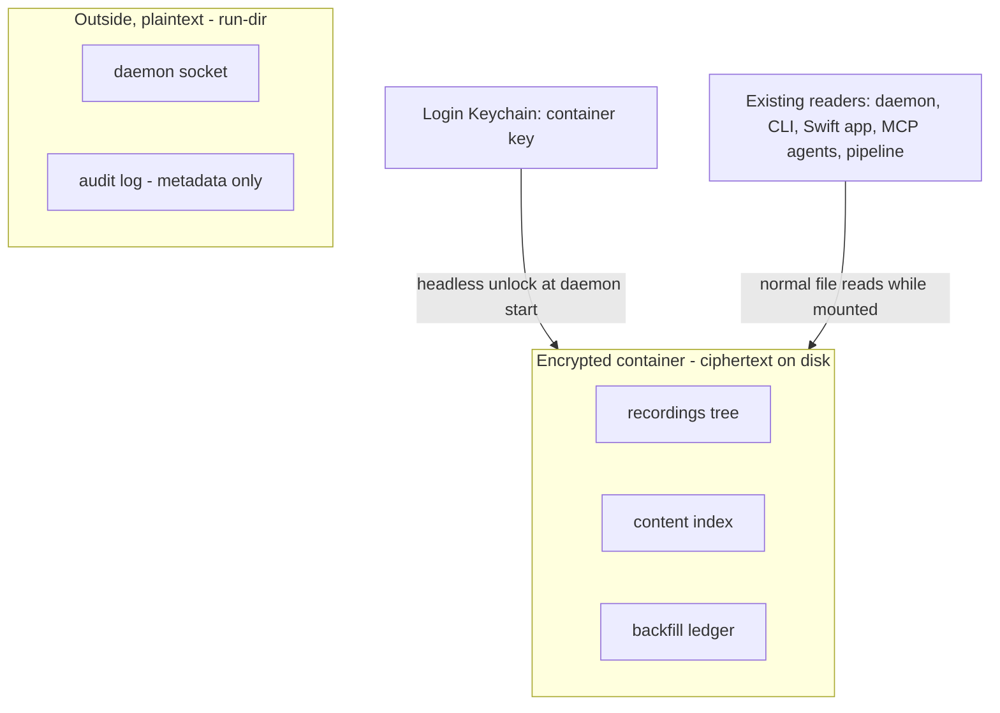
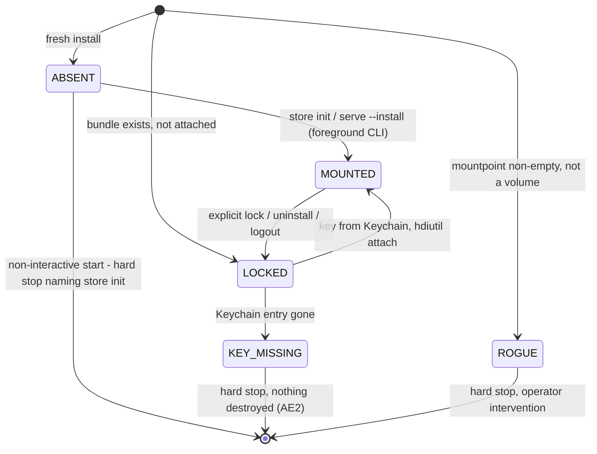
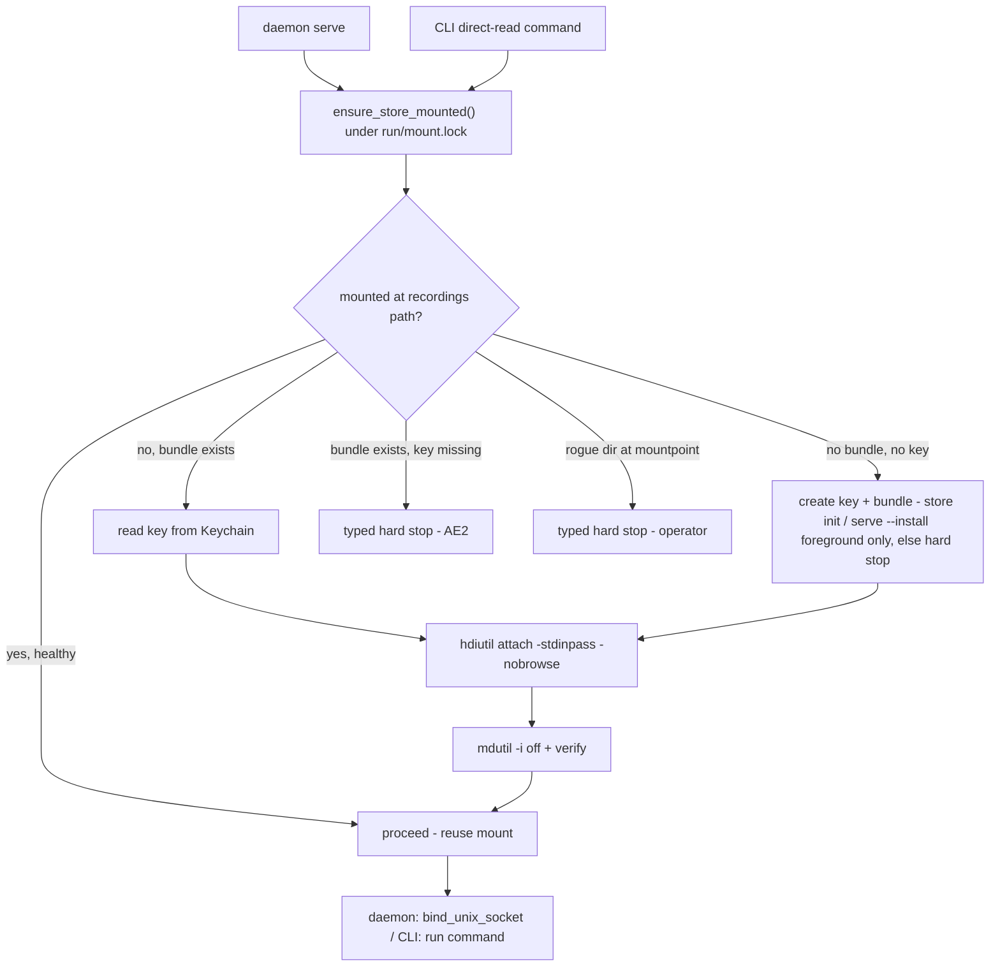

# Encrypt Recordings at Rest - Plan

## Goal Capsule

- **Objective:** Make "recordings are encrypted at rest" an honest, shippable claim by moving Screencap's local recording store into an app-managed **encrypted sparse bundle** — without changing any read contract and without regressing the capture-path performance envelope.
- **Product authority:** This document's Product Contract. `SECURITY.md` is the source of truth for all threat-model statements. Linear SCR-236 tracks the work.
- **Stop conditions:** Stop and surface if the U1 spike refutes a load-bearing assumption (flock on the mounted bundle, crash-safety under `kill -9`, headless Keychain read from the LaunchAgent, mounted-era backup restorability, Keychain portability across machine restores, capture-shaped write performance within R7) — that invalidates KTD choices, not just a unit.
- **Execution profile:** Units in dependency order; U1's empirical spike gates everything downstream. New tests that must run on CI carry `@pytest.mark.privacy` and stay Vision-free.
- **Open blockers:** None. **v1 scope decision (2026-07-06):** the product launches with no installed base, so migration of pre-existing plaintext recordings is **cut from v1** — the container ships from the first recording; the developer's own dev recordings are wiped or left aside, not migrated. This dissolves both prior launch-blocking forks (the migration-availability contradiction and daemon-key-creation-during-legacy). Automatic disk reclamation is likewise deferred; v1 has an explicit `store compact` only. Fresh-install key creation is foreground (`store init` / `serve --install`), which KTD-5 already handles. See "Deferred to Fast-Follow" and "Resolve Before Implementation."

---

## Product Contract

### Summary

Screencap's local recording data plane (recordings tree, content index, backfill ledger) moves into an app-managed encrypted container keyed from the login Keychain and mounted transparently while the daemon runs. Everything that reads recordings today keeps working unchanged; the raw store on disk is ciphertext at all times. FileVault detection is added as a warn-only layer, and SECURITY.md documents exactly what the claim covers.

### Problem Frame

Recording artifacts — screenshots, video chunks, `recording.db`, transcripts, exports, and the content index — sit as plaintext files on disk, protected only by `0o600`/`0o700` permissions and whatever full-disk encryption the user happens to have. The driver for changing this is enterprise trust: "is data encrypted at rest?" is a standard procurement and security-questionnaire item, competitors claim encrypted local storage, and STRATEGY.md stakes the product on winning on privacy. The security deltas are real but secondary: FileVault covers a stolen disk on most Macs, but Time Machine backups, copied files, and FileVault-off machines all hold recoverable plaintext today, and SECURITY.md currently has nothing to say about at-rest protection.

### Key Decisions

- **Encrypted container, not per-file encryption.** Recordings and sidecars live inside an encrypted volume the app creates and mounts; files stay readable in place through the mountpoint. This preserves two deliberate architecture contracts untouched — the pointer-only MCP surface (agents expand `frame.nearest` stems and read JPEGs directly off disk) and the Swift app's direct frame reads (`macos/Screencap/Controllers/RecordingFrameIndex.swift`) — and keeps encryption out of the hot capture path. Per-file envelope encryption would have forced every consumer through a decrypt seam for marginal real-attacker gain: the Keychain's headless-access posture is the shared security ceiling either way.
- **The deliverable is an honest claim, not a live-attacker defense.** The design target is "recordings are encrypted at rest" stated truthfully, in the SECURITY.md tradition of documenting postures honestly. A live same-EUID attacker is unaffected — the key is headlessly available by product necessity (all-day LaunchAgent recording) — and the doc says so. What changes is what an attacker gets from artifacts at rest: backups, copies, disk images, FileVault-off disks.
- **Keychain-only key in v1, data-loss risk documented.** The container key lives solely in the login Keychain (same posture as the existing network-capture KEK). A lost Keychain entry means unrecoverable recordings; v1 documents this plainly rather than maintaining a second decryption path. A recovery code is a fast-follow candidate.
- **Sidecar stores go inside; the run-dir stays outside.** The content index and backfill ledger are the same sensitivity class as recordings and move into the container. The daemon run-dir (socket, logs, audit log) must exist before any mount and stays outside as plaintext; the audit log is metadata-sensitive and this residual is documented.
- **No migration in v1; container-from-first-recording.** With no installed base at launch, v1 does not migrate pre-existing plaintext recordings. New recordings write into the container from the start; the developer's own dev recordings are wiped (or left outside, unencrypted) before first container launch. Automatic migration of a real installed base is a deferred fast-follow (see "Deferred to Fast-Follow") for when an upgrade population exists.

### Requirements

**Container and coverage**

- R1. The recordings tree, the content index, and the backfill ledger are stored inside an app-managed encrypted container.
- R2. The container's on-disk artifact is ciphertext at all times, so any copy of the raw store (backup, disk image, bulk exfiltration) yields no recording content without the key.
- R3. The daemon run-dir (socket, logs, audit log) stays outside the container and remains plaintext.

**Key management**

- R4. The container key is held in the login Keychain with headless access, so mounting requires no user interaction in the happy path.
- R5. A lost Keychain entry means unrecoverable recordings, and both the app and SECURITY.md state this plainly (no recovery path in v1).

**Transparency to consumers**

- R6. Every existing consumer reads recordings unchanged while the store is mounted: MCP frame stems read in place, the Swift app's direct frame reads, CLI view/export, OCR indexing, backfill, scrub/mask, the terminal stage, and retention.
- R7. Active-recording CPU and memory overhead stays within the current p95 envelope.

**Lifecycle and migration**

- R8. The container is created at setup and mounted before anything needs the store, and an unclean unmount never loses recordings.
- R9. *(Deferred to fast-follow — not v1.)* Automatic migration of pre-existing plaintext recordings on upgrade. v1 has no installed base to migrate; see "Deferred to Fast-Follow."
- R10. OS content indexing (Spotlight) is disabled on the mounted store.

**FileVault layer and claim documentation**

- R11. Screencap detects FileVault status and warns — without blocking recording — when it is off.
- R12. SECURITY.md gains an encryption-at-rest section stating what the container protects and what it does not.

### Key Flows

- F1. Daemon start and mount
  - **Trigger:** The daemon starts (LaunchAgent or CLI auto-spawn).
  - **Steps:** Read the container key from the Keychain; mount the container; serve requests. All consumers use their existing file paths through the mountpoint.
  - **Outcome:** Store available with no user interaction; a failed unlock surfaces a clear error and destroys nothing.
  - **Covers R4, R6, R8.**
- F2. *(Deferred to fast-follow — not v1.)* Upgrade migration of a pre-existing installed base. See "Deferred to Fast-Follow."

### Acceptance Examples

- AE1. **Covers R2.** Given recordings exist in the store, When a backup tool copies the raw container artifact, Then the copy contains only ciphertext and yields no recording content without the key.
- AE2. **Covers R5, R8.** Given the Keychain entry has been deleted, When the daemon starts, Then the mount fails with a clear error, nothing on disk is destroyed, and the recordings remain unrecoverable ciphertext as documented.
- AE3. *(Deferred with R9/F2 — not v1.)*
- AE4. **Covers R11.** Given FileVault is off, When Screencap performs its check, Then a warning is surfaced and recording proceeds.

### Success Criteria

- The published claim ("Screencap stores recordings in an encrypted container; recording data is ciphertext at rest") survives SECURITY.md-grade scrutiny — every stated protection is structurally true.
- p95 CPU and memory during active recording are unchanged within measurement noise.
- Capture reliability (sessions completing without crash, dropped frames, or DB corruption — STRATEGY.md's ≥98% floor) stays at parity with a plaintext baseline.
- No existing read-path contract changes: current consumers and their tests pass without modification.

### Scope Boundaries

Deferred to fast-follow (built when there is an installed base or the need is real):

- **Migration of pre-existing plaintext recordings (R9, F2, AE3, KTD-7, U6).** v1 launches with no users, so there is nothing to migrate; the container ships from the first recording. When an upgrade population exists, a background per-recording copy-verify-swap migration is added — and it must resolve the two design forks the review surfaced: keep already-migrated recordings readable during migration (defer deletes until cutover vs a dual-root read seam), and where the key gets created for headless upgraders (daemon-create-on-legacy if the U1 headless-Keychain spike passes, else a NEEDS_INIT foreground step). The round-1 migration design is preserved in git history and the U6 unit below (marked deferred) as the starting point.
- **Automatic disk reclamation.** v1 reclaims host disk only via an explicit `screencap store compact` (safe, quiescent, never force-detach). Automatic compaction is deferred — the review showed an always-mounted store has no reader-safe automatic window (direct readers are invisible to the daemon; the MCP subscription is held all day). Revisit with a reader-lease signal or accept manual-only.

Deferred for later:

- Per-recording envelope encryption with all reads routed through Screencap (the "mandatory doorway"), including daemon byte-serving for MCP. Revisit if enterprise procurement rejects the container claim or crypto-shred deletion becomes a product requirement.
- A recovery code for Keychain loss — fast-follow candidate if v1's documented data-loss risk proves too harsh.
- Encrypting the audit log or anything else in the run-dir (would force mount-before-daemon ordering changes).
- Cloud-side encryption of uploaded artifacts — separate concern; this work is local-at-rest only.
- Reverse migration and downgrade support. Once a machine has migrated, there is no supported path back to a plaintext store; a pre-container binary sees recordings as missing (nothing is deleted). Release notes and SECURITY.md state this.
- ASIF disk images as a faster container format — macOS 26+ only; revisit when Sequoia support is dropped.

### Dependencies / Assumptions

- Verified against the codebase: no encryption of recording artifacts exists today; `cryptography` and `keyring` are already direct dependencies; a Keychain-backed KEK pattern exists in `src/screencap/network/crypto.py`; the Swift app reads screenshots directly off disk; `recording.db` and `content_index.db` are multi-process SQLite stores (WAL, busy-timeout, `BEGIN IMMEDIATE` patterns); no FileVault detection exists anywhere.
- Verified empirically on this hardware: `hdiutil create/attach -stdinpass` works unprivileged and headless; a trailing newline in the piped passphrase fails authentication; `mdutil -i off` and `fdesetup status` run as a plain user; Python `keyring` calls the Security framework directly and raises `KeyringLocked` rather than hanging when the keychain is locked.
- Assumption (validated in U1 before dependents build): `fcntl.flock` and SQLite WAL behave correctly on the mounted sparse bundle volume, and per-chunk crash-safety survives `kill -9` / forced detach.
- Assumption: the login Keychain travels with Migration Assistant and full Time Machine restores, so common machine moves keep the key.

### Sources / Research

- Linear SCR-236 — https://linear.app/zk-email/issue/SCR-236/medium-encrypt-recordings-at-rest
- `SECURITY.md` — trust boundary, sensitivity classes, the pointer-only MCP posture, threats in/out of scope.
- `src/screencap/network/crypto.py` — the existing Keychain KEK pattern and its documented default-ACL posture.
- `macos/Screencap/Controllers/RecordingFrameIndex.swift` — the Swift app's direct on-disk frame reads.
- `src/screencap/pipeline_state.py`, `src/screencap/content_index.py` — cross-process SQLite access patterns the container must not disturb.
- `STRATEGY.md` — the privacy-and-performance positioning and the p95 overhead metric constraining this work.
- Time Machine treats a mounted disk image as removable (skips it) and backs up the unmounted bundle as opaque encrypted bands — FileVault 1 was built on this mechanism; a mounted APFS volume is backed up as plaintext by default (Pondini TM reference; Bombich CCC KB; Apple `tmutil` man page).
- SQLite WAL's network-filesystem corruption is a cross-kernel lock/mmap problem and cannot occur on a locally mounted image by construction (sqlite.org/wal.html §2.2/§7, howtocorrupt.html §2.1; SQLite forum threads).
- Sparse bundle local risks are container-structural: no ECC on bands, power-loss during `compact`, a 2018 host-disk-full silent-write bug (Eclectic Light Company; Bombich; MacRumors).
- Spotlight `mdutil -i off` is not durable — macOS 15.1 re-enabled indexing on all volumes after update; re-assert per mount (MacRumors, multi-corroborated).
- QuickLook thumbnails of browsed files persist on the host volume with no per-volume opt-out (Wardle/objective-see; Reguła; Eclectic Light Company).
- Graceful-then-force detach with a ~3s wait is shipped practice (electron-builder `dmgUtil.ts`); PID-lockfile + `kill -0` staleness checks are the borg/PostgreSQL idiom.

---

## Planning Contract

**Product Contract preservation:** unchanged, except: the primitive assumption in Dependencies/Assumptions was resolved to the sparse bundle; the brainstorm's deferred-to-planning questions are answered by the Key Technical Decisions below; two items moved into Scope Boundaries (audit-log encryption, downgrade support); and document review added a capture-reliability Success Criterion (mechanizing STRATEGY.md's existing ≥98% floor — no new product behavior).

### Key Technical Decisions

- **KTD-1 — Encrypted sparse bundle via `hdiutil` (AES-256, APFS inside), stored at `~/.screencap/store.sparsebundle`.** Chosen over an encrypted APFS volume because: Time Machine backs up the unmounted bundle as opaque ciphertext bands (recordings stay backed up *and* the R2/AE1 claim is structural), creation and attach are fully unprivileged, and `-nobrowse` keeps it out of Finder. An APFS volume would back up as plaintext unless excluded (and exclusion means no backup at all), needs admin authorization to create, and appears in Finder's sidebar. ASIF is macOS 26-only. Inside the image, APFS over HFS+: it is `hdiutil`'s default since Big Sur, its copy-on-write metadata is crash-consistent where journaled HFS+ merely replays, and the SQLite/flock analysis in Sources assumed APFS semantics; dated (2020-era) community reports preferring HFS+-inside predate that default and are superseded by the U1 crash spike, which validates the choice empirically. Band size is tuned at create time (`-imagekey sparse-band-size=`) so a multi-hundred-GB store stays far below the band-count ceiling; U1 picks the value.
- **KTD-2 — The mountpoint is the recordings directory itself (`~/.screencap/recordings`).** Every external path contract survives verbatim with zero symlinks: the Swift app's `RecordingFrameIndex`, MCP agents expanding `frame.nearest` stems, and all CLI paths. The sidecar stores (`content_index.db`, `backfill_state.db`) relocate inside the volume under a reserved dot-directory (`.store/`), reached only through their existing `config` chokepoints; recording enumerators must skip dot-entries (verify `catalog.list_recordings`; `upload.list_recording_files` already skips dot-prefixed names).
- **KTD-3 — One mount owner: `ensure_store_mounted()` in a new `src/screencap/container.py`, serialized by `~/.screencap/run/mount.lock` (`fcntl.flock`).** The daemon calls it in `serve()` before `bind_unix_socket`; the CLI path funnel calls it before any store access. It reuses a healthy existing mount (mount-table check + volume identity) instead of re-attaching; a mountpoint that exists, is non-empty, and is *not* a mounted volume is a hard error (mirroring `RogueFileAtSocketPath`), never auto-cleaned. When the flag is on, path resolution never falls back to `mkdir`-ing a plaintext directory at the mountpoint — mount failure is a typed, loud stop. `mount.lock` is created with the atomic `_autospawn.py` `_open_auto_log` discipline specifically — `os.open(..., O_NOFOLLOW)` on the lock path itself plus a realpath==abspath parent check — not the `content_index.py` check-then-`sqlite3.connect` shape (which has a known TOCTOU window that only exists because sqlite cannot pass `O_NOFOLLOW`). `pidfile.py`'s existing lock, which passes no `O_NOFOLLOW`, is not the pattern to copy.
- **KTD-4 — The mount outlives the daemon.** Idle-shutdown and normal daemon exit leave the volume mounted; the Swift app and MCP agents read files directly off disk with no daemon in the byte path, so unmount-on-exit would fail them mid-read. Detach happens only on `screencap serve --uninstall`, an explicit `screencap store lock` command, or OS logout. `store lock` sets a run-dir user-locked sentinel that `ensure_store_mounted()` refuses to override — cleared only by `store unlock` or an explicit interactive start — so a cron-driven auto-spawned daemon cannot silently remount a store the user locked. While mounted, same-EUID plaintext exposure is identical to today's documented posture.
- **KTD-5 — Key management diverges from the network-KEK precedent on regeneration.** Same shape as `network/crypto.py` (service `com.screencap.container`, account `key`, lazy `import keyring`, default "Always Allow" ACL) but: the read path is strictly read-only, and key creation is allowed only when *neither* the bundle file *nor* the Keychain entry exists. Bundle-exists-but-key-missing is a hard stop with a clear message (AE2) — silently minting a new key would orphan every recording. `keyring.errors.KeyringLocked` maps to a retryable failure. Creation runs only in a foreground CLI process: `screencap serve --install` creates key+bundle before calling `launchagent.install()`, and a new `screencap store init` command gives the Swift onboarding flow and headless installs an explicit hook — never a launchd-spawned daemon tick (wrong context for the one-time ACL prompt, per `auth.py`'s ACL-identity constraint). A non-interactive start that finds the ABSENT state is a typed exit-1 hard stop whose message names `store init`.
- **KTD-6 — One shared passphrase-piping helper.** All `hdiutil` invocations pipe the key via `proc.communicate(input=key)` with no trailing newline — a trailing `\n` becomes part of the passphrase and fails authentication (verified on this hardware). No call site constructs its own pipe.
- **KTD-7 — *(Deferred to fast-follow — not v1.)* Migration of a pre-existing installed base.** v1 has no users to migrate, so the fresh-install path is the only one: `store init` / `serve --install` creates the container and recording writes into it from the start (KTD-5). The deferred background per-recording copy-verify-swap design — and the two forks it must resolve (readable-during-migration; headless key creation) — is captured in "Deferred to Fast-Follow" and U6 (marked deferred). Because there is no LEGACY_PLAINTEXT population in v1, `ensure_store_mounted()` never enters a MIGRATING state and the migration-availability contradiction does not arise.
- **KTD-8 — Rollout: `container_enabled` flag, default on, one-way.** Standard `_parse_bool_env` shape (`SCREENCAP_CONTAINER_ENABLED` / `container_enabled`), wired into `settings` `_BOOL_KEYS`. Default on in the release that ships it; turning it off only stops not-yet-migrated machines from entering the container flow — there is no reverse migration. `SCREENCAP_RECORDINGS_DIR` set → container logic is bypassed entirely and the overridden path is plaintext; this is the documented dev/test seam the existing test fixtures depend on. A non-default `recordings_dir` config.toml value is treated exactly the same way (bypass, plaintext, documented residual) — a user who pointed recordings at an external volume keeps their chosen location rather than having migration silently relocate it.
- **KTD-9 — Host-leak hardening runs on every attach, not once.** After each attach: `mdutil -i off <mountpoint>` then verify with `mdutil -s` (macOS 15.1 silently re-enabled indexing after an OS update, so assert per mount); ensure `.fseventsd/no_log` exists at the volume root (created at bundle creation). Attach always uses `-nobrowse -owners on -mountpoint`. The bundle is *not* excluded from Time Machine — the bands are the ciphertext backup. QuickLook host-cache thumbnails remain a documented residual (no per-volume opt-out exists); `-nobrowse` plus the `0o700` parent keeps the volume out of casual Finder browsing.
- **KTD-10 — Failure taxonomy extends `serve()`'s existing convention.** New typed exceptions in `screencap.container`: retryable states (Keychain locked, transient attach/DiskArbitration busy) exit `EX_TEMPFAIL` (75) so launchd retries; operator states (rogue mountpoint, corrupted bundle, missing key with existing bundle) exit 1 with a distinct message. The daemon never serves any verb against an unmounted store. Detach follows the graceful-then-force pattern: plain detach, wait ~3s on transient failure, then `-force`.
- **KTD-11 — FileVault check at every daemon start.** `fdesetup status` (runs unprivileged, verified); result exposed as a field on `/v0/daemon.info`, shown by `screencap status`, and logged once — warn-only per R11.
- **KTD-12 — Disk reclamation is explicit-only in v1 (`screencap store compact`); automatic compaction deferred.** Deleting recordings inside the volume frees space to the volume, not the host — bands shrink only via `hdiutil compact`, which requires the image detached. The review showed an always-mounted store (KTD-4) has no reader-safe *automatic* detach window: the Swift app and MCP agents read files with no daemon in the byte path, so "no active recording, no subscribers" cannot see them, and the MCP `/v0/events` subscription is held all day. So v1 ships a manual `screencap store compact` only: it runs when the daemon is reachable-and-quiescent (or with no daemon running), routes its re-attach back through `ensure_store_mounted()` (so the ROGUE check covers the momentarily-bare mountpoint), holds `mount.lock` for the whole cycle, and **never escalates to `-force`** — a busy volume means "not now, retry." `screencap status` surfaces an evicted-bytes-since-compact counter so the user knows when to run it. Automatic compaction is deferred (see "Deferred to Fast-Follow"). Until a compact runs, host footprint grows with deletions; acceptable for a low-volume solo launch. A U1 spike confirms `hdiutil compact` actually shrinks APFS-in-bundle bands after in-volume deletes.
- **KTD-13 — Declared image size and host-free-space guarding.** The bundle is created with declared size equal to the host volume's capacity (sparseness makes the declaration free), so the volume's virtual free space never invites writes the host cannot back. Because the mounted volume reports free space against the declared size rather than the host disk, the existing `disk_warn_mb`/`disk_stop_mb` recording guards must evaluate the **host volume backing the bundle**, not the mounted store — otherwise capture writes into a full host, the 2018 silent-write failure class the Sources cite. U1 spikes the near-full-host failure mode to characterize what actually happens.

### High-Level Technical Design

Store lifecycle — the states `ensure_store_mounted()` distinguishes and the only legal transitions:

(No LEGACY_PLAINTEXT / MIGRATING states in v1 — migration is deferred. Those states re-enter the diagram with the fast-follow migration work.)

Mount ownership at the two entry points:

The engine subprocess never appears here: it receives resolved paths from the daemon and reads/writes through the already-mounted volume (it must not touch the Keychain — different ACL identity, per `src/screencap/auth.py`).

### Sequencing

U1 → U2 → U4 depend in that order; U3 is an independent refactor that can land first or in parallel; U5 depends on U4; U7 depends only on U1 (FileVault detection needs the subprocess idiom, not the mount machinery — it can land early); U8 lands last. **U6 (migration) is deferred from v1** — not in the active unit set. The U1 spike findings gate U4's design details (flock canary, crash behavior).

---

## Implementation Units

### U1. Container primitives and feasibility spike

- **Goal:** A `screencap.container` module wrapping `hdiutil` (create/attach/detach/compact/status), with the shared passphrase helper, typed exceptions, plist output parsing, and per-attach hardening — validated empirically on real hardware before anything builds on it.
- **Requirements:** R2, R8, R10. **Covers KTD-1, KTD-6, KTD-9, KTD-10.**
- **Dependencies:** none.
- **Files:** `src/screencap/container.py` (new), `tests/test_container.py` (new).
- **Approach:** Mirror the `screencapture` subprocess idiom (`src/screencap/engine/utils.py:149`): deferred imports, `capture_output=True`, explicit `timeout=`, but raise typed exceptions instead of returning `None` — a silently failed mount must not degrade to "empty recordings". Parse `-plist` output with `plistlib`. Detach implements graceful-then-force with a ~3s wait.
- **Execution note:** Run the spike checklist on real hardware first and record outcomes in the test file's module docstring; downstream units assume these results.
- **Test scenarios:**
  - Happy path: create (AES-256, APFS, tuned band size) → attach at custom mountpoint with `-nobrowse` → write/read files → detach; status parsing reports mounted/unmounted correctly.
  - Covers AE1 (spike): with the bundle detached, band files contain no plaintext markers from written content (grep a sentinel string across `bands/`).
  - Passphrase regression: attach with a trailing-newline key fails; the shared helper never appends one.
  - Spike — flock canary: acquire `fcntl.flock` on a file inside the mounted volume from two processes; assert real mutual exclusion (guards `terminal_stage`'s locking).
  - Spike — crash safety: `kill -9` a writer mid-WAL-transaction inside the volume, force detach, re-attach, assert SQLite recovers and fsck passes.
  - Spike — attach idempotency: second attach of an already-attached bundle is detected and reused, not double-mounted.
  - Spike — backup restorability: back up (or file-copy) the bundle while mounted under sustained writes, restore the copy, attach + fsck; if mounted-era copies fail, KTD-1's backup claim is scoped to detached windows (coordinated with KTD-12's cycle) and SECURITY.md says so.
  - Spike — performance (gates U4+ per R7): benchmark capture-shaped sustained writes (chunk-sized files plus concurrent SQLite WAL commits) in the mounted bundle against a plaintext-directory baseline.
  - Spike — near-full host: write into the mounted volume while the host disk is near capacity; characterize the failure mode (KTD-13).
  - Spike — Keychain portability: verify the container key entry survives a Migration Assistant / full-TM-restore path (manual, hardware-dependent); if unverifiable, U8's selective-restore warning plus pulling the recovery-code fast-follow forward is the documented fallback.
  - Symlink guard: a pre-planted symlink at the `mount.lock` path is rejected, not followed.
  - Error paths: wrong passphrase → typed auth error; corrupted `Info.plist` → typed corruption error; detach with an open file → graceful fails, force succeeds.
  - Hardening: after attach, `mdutil -s` reports indexing disabled; `.fseventsd/no_log` exists at volume root.
  - Mark hardware-dependent tests `@pytest.mark.macos_hw`; keep pure-logic tests (helper, parsing, taxonomy) `@pytest.mark.privacy` and Vision-free so CI runs them.
- **Verification:** Spike checklist executed on macOS hardware with results recorded; CI-lane tests green.

### U2. Container key management

- **Goal:** Keychain-backed key functions with read-only-by-default semantics that can never orphan an existing store.
- **Requirements:** R4, R5. **Covers KTD-5.**
- **Dependencies:** U1.
- **Files:** `src/screencap/container.py`, `tests/test_container_key.py` (new).
- **Approach:** Mirror `network/crypto.py`'s shape (stable service/account strings, base64 storage, lazy `import keyring`) with the KTD-5 divergence: `get_container_key()` never creates; `create_container_key()` refuses when the bundle file already exists. Catch `keyring.errors.KeyringLocked` and map to the retryable exception class.
- **Test scenarios:**
  - `get_container_key` returns `None` when the entry is missing; never writes.
  - `create_container_key` raises when `store.sparsebundle` exists on disk.
  - Covers AE2: bundle present + key missing → `ensure_store_mounted` raises the hard-stop type; bundle bytes untouched.
  - `KeyringLocked` from the backend maps to the retryable class (daemon exits 75, not 1).
  - Key bytes round-trip through the passphrase helper unchanged (no encoding drift between create and attach).
- **Verification:** `@pytest.mark.privacy` tests green on CI (keyring mocked); one manual check that the first `set_password` from the packaged daemon triggers a single visible ACL prompt in an interactive session.

### U3. Data-plane root resolver and path unification

- **Goal:** All data-plane paths resolve through container-aware chokepoints; run-dir paths provably never do; no behavior change while the flag is off.
- **Requirements:** R1, R3, R6. **Covers KTD-2, KTD-8 (seam only).**
- **Dependencies:** none (pure refactor; lands before or parallel to U4).
- **Files:** `src/screencap/config.py`, `src/screencap/content_index.py`, `src/screencap/backfill/ledger.py`, `src/screencap/catalog.py`, `tests/test_config_paths.py` (new), `tests/daemon/conftest.py`.
- **Approach:** Add `get_data_root()` to `config.py`: with the flag off or `SCREENCAP_RECORDINGS_DIR` set, identical to today; with the flag on, the recordings mountpoint. Redirect `content_index.db` and `backfill_state.db` resolution to `<data_root>/.store/`. Audit every hardcoded `Path.home() / ".screencap"` site and classify: run-dir sites (`daemon/socket.py`, `daemon/audit_log.py`, `terminal_stage.py:100`, `cli/_autospawn.py`), `pidfile.py`, `enforcement/persistence.py` (config.toml), `menubar.py`, `session.py` all stay outside — add a comment naming the boundary at each. `catalog.list_recordings` skips dot-prefixed entries. Extend the daemon-test autouse fixture to also isolate `get_data_root()`.
- **Test scenarios:**
  - Flag off: every resolved path is byte-identical to current behavior (regression snapshot).
  - Flag on: recordings, content index, and backfill ledger resolve under the mountpoint; socket, audit log, pidfile, config.toml resolve outside.
  - `SCREENCAP_RECORDINGS_DIR` set: container resolution bypassed; paths land at the override.
  - `catalog.list_recordings` ignores `.store/` and other dot-entries.
- **Verification:** Full existing suite passes unchanged with the flag off (`PYTHONPATH=src pytest tests/`); new tests marked `@pytest.mark.privacy`.

### U4. Mount orchestration and daemon integration

- **Goal:** `ensure_store_mounted()` owns the mount at both entry points; the daemon mounts before binding its socket and fails loud with the right exit codes.
- **Requirements:** R4, R6, R8. **Covers KTD-3, KTD-4, KTD-10, KTD-13. Covers F1.**
- **Dependencies:** U1, U2, U3.
- **Files:** `src/screencap/container.py`, `src/screencap/daemon/server.py`, `src/screencap/engine/disk_policy.py` (host-volume free-space resolution per KTD-13, plus the daemon→engine host-path plumbing), `tests/daemon/test_serve_container.py` (new).
- **Approach:** `ensure_store_mounted()` implements the HTD flowchart under `run/mount.lock`. In `serve()`, call it after signal-handler setup and before `bind_unix_socket` (`daemon/server.py`), catching the typed exceptions and mapping retryable → `EX_TEMPFAIL`, operator → 1, printed via the existing `_print_stderr` helper. `serve --install` creates key+bundle in its foreground CLI process before `launchagent.install()`. No unmount in the `finally` block or the idle-shutdown path — the mount persists (KTD-4). The engine subprocess's `DiskPolicy` gets the host-volume-backing path (KTD-13) plumbed in from the daemon; the rest of the engine interface is unchanged (it receives paths, never the key).
- **Test scenarios:**
  - Daemon start with store LOCKED → mounts, then binds socket (ordering asserted).
  - Covers AE2: KEY_MISSING → exit 1, distinct message, bundle untouched.
  - Keychain locked → exit `EX_TEMPFAIL` (75).
  - ROGUE mountpoint (non-empty plain directory) → exit 1, nothing deleted.
  - Stale mount from a killed daemon → reused, no second attach.
  - Idle-shutdown exit leaves the volume mounted (assert still mounted after watchdog fires).
  - ABSENT non-interactive: launchd-context daemon start with no bundle/key → exit 1 naming `store init`; `serve --install` on ABSENT creates key+bundle in the foreground CLI, then installs.
  - Disk guards (KTD-13): `disk_warn_mb`/`disk_stop_mb` evaluate the host volume backing the bundle, not the mounted volume's virtual free space.
  - Two processes race `ensure_store_mounted` → exactly one attach; the loser proceeds against the winner's mount.
  - Flag off → `serve()` behaves exactly as today (no container calls).
- **Verification:** `PYTHONPATH=src pytest tests/daemon/ -m privacy`; manual: LaunchAgent-managed daemon on real hardware mounts headlessly at login with no prompt after first-run ACL approval.

### U5. CLI funnel guard

- **Goal:** The nine-plus daemon-independent CLI commands get the store mounted before touching it, and fail clearly when they can't — never silently reading or writing plaintext at the mountpoint.
- **Requirements:** R6. **Covers KTD-3 (CLI arm), KTD-4 (store lock/unlock), KTD-12 (store compact).**
- **Dependencies:** U4.
- **Files:** `src/screencap/config.py`, `src/screencap/cli/__init__.py`, `tests/test_cli_container.py` (new).
- **Approach:** With the flag on, `get_recordings_dir()`/`resolve_recording_dir()` call `ensure_store_mounted()` (idempotent, flock-serialized, cheap when already mounted) instead of `mkdir`. CLI-facing failures render as `rich` errors naming the state (locked Keychain, missing key, rogue mountpoint) and the next step. Commands that only talk HTTP (`start`/`stop`/`status`/`backfill`) are untouched. U5 also owns the `screencap store` command group — `init` (foreground key+bundle creation, KTD-5), `lock`/`unlock` (user-locked sentinel, KTD-4), `compact` (on-demand reclamation cycle, KTD-12) — and wires the `serve --uninstall` detach.
- **Test scenarios:**
  - `screencap view`/`export`/`info` with daemon down and store LOCKED → command mounts and succeeds.
  - Key missing → command exits non-zero with the AE2 message; no plaintext directory created at the mountpoint.
  - Flag off → zero new calls (regression).
  - `store lock` then a cron-style auto-spawned daemon start → store stays locked (sentinel respected); `store unlock` restores normal mounting.
  - `store init` on ABSENT creates key+bundle; on an existing store it is a no-op with a clear message.
  - `store compact` with the daemon reachable → runs only when quiescent, holds `mount.lock`, never force-detaches, re-attaches through `ensure_store_mounted()`; refuses (clear message) while a recording is active.
- **Verification:** CLI tests green; `screencap --help` latency unchanged (imports stay deferred).

### U6. Upgrade migration — *DEFERRED (not in v1)*

*v1 has no installed base to migrate (see "Deferred to Fast-Follow"). This unit is retained as the starting design for the fast-follow, not built in v1. When built, it must first resolve the two design forks recorded in "Deferred to Fast-Follow" — readable-during-migration and headless key creation — which the round-2 review surfaced as contradictions in the always-delete-then-serve shape below.*

- **Goal:** Existing plaintext recordings and sidecar stores move into the container automatically, resumably, and without a deletion path that precedes verification.
- **Requirements:** R1, R2, R9. **Covers KTD-7. Covers F2.**
- **Dependencies:** U4.
- **Files:** `src/screencap/migration.py` (new), `src/screencap/daemon/server.py` (startup hook), `src/screencap/container.py`, `tests/test_migration.py` (new).
- **Approach:** KTD-7 verbatim: run-dir ledger with closed-set seeding, per-recording `PENDING → COPIED → VERIFIED → PLAINTEXT_DELETED` transitions (`BEGIN IMMEDIATE`, `busy_timeout=10000`), full SHA-256 verify per file, cutover directory swap last, premigration directory deleted only after final verify. Runs as a Supervisor-style background task modeled on `daemon/backfill_job.py`, scheduled by the daemon after startup when state is LEGACY_PLAINTEXT — the daemon serves the plaintext store until the quiesced cutover, progress rides `daemon.info`, and migration activity pins the idle-shutdown watchdog. A recording actively being written (live recording lock held) is skipped this round and picked up at next trigger. Versioned completion marker (`.container-migrated-v1`) is UX-only; the authoritative state is the mounted volume plus ledger.
- **Test scenarios:**
  - Covers AE3: end-to-end migration of a multi-recording fixture; contents byte-identical; no plaintext remains; consumers read normally.
  - Crash mid-copy (kill between COPIED and VERIFIED) → resume re-verifies and continues; no recording lost; no double-delete.
  - Corrupt/missing ledger → treated as not-done; re-run converges.
  - Disk-space preflight failure → migration never starts; daemon serves plaintext store; clear warning logged.
  - Live recording in progress → that recording skipped, others migrate; skipped one migrates on next trigger.
  - Verification failure on one file → that recording stays PENDING with plaintext intact; others unaffected.
  - Sidecar DBs (content index, backfill ledger) moved and readable through their U3 chokepoints afterward.
  - Daemon serves during migration: `screencap status` and recording start/stop work while the background task runs; cutover waits for an active recording to finish.
  - Symlink guard: a pre-planted symlink at the ledger path is rejected, not followed.
- **Verification:** `@pytest.mark.privacy` suite green; manual capture-test after migrating a real store on dev hardware.

### U7. FileVault detection and surfacing

- **Goal:** FileVault status is checked at daemon start and visible to the user without blocking anything.
- **Requirements:** R11. **Covers KTD-11.**
- **Dependencies:** U1 (subprocess idiom).
- **Files:** `src/screencap/container.py` (or platform helper), `src/screencap/daemon/app.py` (`daemon.info` field), `src/screencap/cli/__init__.py` (`status` display), `tests/test_filevault.py` (new).
- **Approach:** Parse `fdesetup status` text output (fail-open to "unknown" on parse error — a broken check must never block startup). Live check at each daemon start, not cached from install time.
- **Test scenarios:**
  - Covers AE4: status "Off" → `daemon.info` carries the warning field, `screencap status` renders it, recording still starts.
  - Status "On" → no warning. Parse failure → "unknown", no warning, no crash.
- **Verification:** Tests green; manual `screencap status` check on hardware.

### U8. SECURITY.md, docs, and settings wiring

- **Goal:** The claim is documented as honestly as the codebase's standard demands, and the flag is operable.
- **Requirements:** R3, R5, R12. **Covers KTD-8 (docs), KTD-9 (residuals).**
- **Dependencies:** U1–U7 landed (documents shipped behavior).
- **Files:** `SECURITY.md`, `src/screencap/cli/__init__.py` (`_BOOL_KEYS` + `settings` docstring), `README.md`, `CLAUDE.md` (one-paragraph subsystem note).
- **Approach:** New SECURITY.md section states: what the container protects (at-rest artifacts, backups as ciphertext bands, copies, FileVault-off disks); what it does not (live same-EUID access while mounted, key readable via Keychain ACL, run-dir metadata, QuickLook host-cache thumbnails, filename/timing side channels); that `downloads_dir` exports and `config.toml` stay plaintext outside by design; the key-loss consequence (R5) including the machine-restore prerequisite (a store restored without the login Keychain — e.g., a selective `~/.screencap`-only restore — is intact but unrecoverable); and that downgrade is unsupported. Update the existing "side-channel" bullet that anticipated this feature.
- **Test scenarios:** Test expectation: none — documentation and settings-key wiring; the settings key is covered by an existing `_BOOL_KEYS` round-trip test pattern (extend it).
- **Verification:** `screencap settings --set container_enabled=false` round-trips; SECURITY.md section reviewed against the shipped behavior of U1–U7.

---

## Verification Contract

| Gate | Command / check | Applies to |
|---|---|---|
| CI lane (the only lane CI runs) | `PYTHONPATH=src pytest tests/ -m privacy --timeout=300` — all new privacy-bearing tests must carry the marker and stay Vision-free | U1–U5, U7 |
| Full local suite | `PYTHONPATH=src pytest tests/` — existing suite passes unchanged with the flag off | U3, U4, U5 |
| Hardware spike | U1 spike checklist on a real Mac (flock canary, kill-9 crash, headless LaunchAgent mount, mounted-era backup restore, capture-shaped write benchmark, near-full host, Keychain portability) with results recorded | U1, gates U4+ |
| Lint | `ruff check src/screencap/` | all units |
| AE1 | Detached-bundle band grep contains no plaintext sentinel; Time Machine backup of the bundle contains bands only; a restored backup attaches and fscks cleanly (U1 spike) | U1, U8 |
| AE2 | Key-deleted daemon start exits 1 with the documented message; bundle bytes unchanged | U2, U4 |
| AE4 | FileVault-off machine (or mocked status) surfaces the warning; recording proceeds | U7 |
| Performance (R7) | capture-test sanity run against the mounted store; p95 CPU/memory within noise of a plaintext baseline run | after U4 |
| Reliability (Success Criteria) | capture-test session-completion parity vs a plaintext baseline — no crash, dropped frames, or DB corruption | after U4 |

## Definition of Done

- The seven v1 units (U1–U5, U7, U8; U6 deferred) landed in dependency order; U1 spike results recorded before U4 merged.
- Every v1 Product Contract requirement (R1–R8, R10–R12; R9 deferred) is satisfied by a landed unit, and AE1, AE2, AE4 pass their Verification Contract gates (AE3 deferred with migration).
- The full existing test suite passes with `container_enabled` off, and the CI privacy lane passes with it on.
- SECURITY.md's encryption-at-rest section matches shipped behavior, including the stated residuals and the downgrade warning.
- No abandoned experimental code from the spike or dead migration paths remains in the diff.
- A `docs/solutions/` entry candidate exists for the container mount/keychain pattern (this repo's first disk-image subsystem — flagged by the learnings research as worth capturing).

---

## Resolve During Implementation

Two review rounds ran. The **two launch-blocking forks are dissolved** by the v1 scope decision (no installed base → migration cut → no migration-availability contradiction and no daemon-key-creation-during-legacy problem; fresh-install key creation is foreground). The **compaction subsystem is resolved** to explicit-only (`store compact`, never force-detach) with automatic reclamation deferred. What remains is a short list of clear-direction details for the implementer to settle at build time — none change a v1 Product Contract guarantee.

- **`store lock` / `store compact` are daemon verbs when a daemon is reachable** (the daemon runs the quiescent, never-force cycle itself and refuses while a recording is active); CLI-local execution is the fallback only when no daemon responds, and it never force-detaches past an active recording (feasibility, adversarial ×75).
- **`store init` / `serve --install` creation is serialized check-lock-check** — acquire an init lock (reuse `mount.lock` or a dedicated one), then re-check bundle+key absence before creating — so two concurrent foreground creations cannot orphan a bundle+key pairing. Creation order: durable key first, then bundle. Handle the **bundle-absent + key-present** state explicitly (user wiped `store.sparsebundle`, or a crash after key-write before bundle-create): `store init` reuses the existing key to create a fresh bundle rather than dead-stopping (security ×75, adversarial ×75).
- **KTD-13 host-volume resolution mechanism:** resolve "the host volume backing the bundle" via `os.stat().st_dev` comparison across the mount boundary (or `diskutil info` parsing) — no prior art in the repo — re-resolved on every attach/re-attach, not cached for the daemon lifetime. A U1 spike proves the resolver, not just the near-full-host symptom (security ×75, adversarial ×75).
- **Mid-life re-attach failure** (a `store compact` re-attach fails its fsck, or DiskArbitration is busy) while the daemon is already bound: bounded-backoff retry, serve typed store-unavailable errors on store-touching verbs meanwhile, exit `EX_TEMPFAIL` if recovery fails within budget so launchd re-enters the startup taxonomy (adversarial, KTD-10).
- **Swift onboarding → `store init`:** the macOS app installs the daemon via SMAppService, never `serve --install`, so the app's onboarding must call `screencap store init` (via the bundled CLI) before/at registration. This needs a `macos/` change — track it as a cross-repo Linear item or a small added unit, with interim behavior (daemon surfaces ABSENT on `daemon.info` rather than crash-looping) if the app ships before that change (feasibility ×75).
- **Sentinel-file discipline:** the `store lock` user-locked sentinel uses the same `O_NOFOLLOW` + realpath-parent-check convention as `mount.lock` (KTD-3), with explicit mode `0o600` (security ×50).

**Product decision still open (does not block build; decide before ship):**

- **KTD-8 rollout default.** `container_enabled` is stated default-on. Given launch-tomorrow-with-one-user, default-on is low-risk here (there is no fleet to protect), but confirm: ship default-on, or default-off with an explicit opt-in for the first build? The staged concern (one-machine evidence base, OS-point-release substrate shifts) is much weaker with a single known user.
- **Explicit-compact contract status.** Whether `store compact` / disk reclamation is promoted to a Product Contract requirement or left as an operational tool. Low stakes at launch volume; revisit when the store grows.
