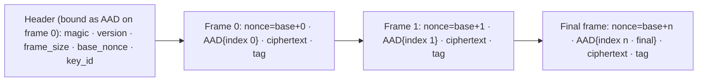
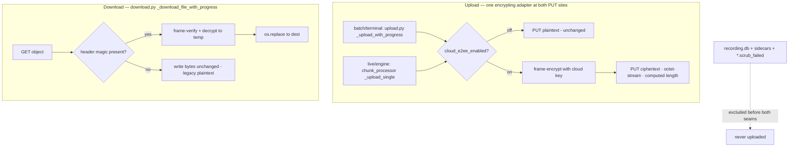

# E2EE Cloud Onboarding (Account + Team) - Plan

## Goal Capsule

- **Objective:** Ship the single-user E2EE vertical slice — recording artifacts encrypted on-device before upload with a device-held key, decrypted on download, behind a default-off flag — proving the client-side crypto path before teams, billing, and multi-provider auth are layered on.
- **Product authority:** This document's Product Contract. `SECURITY.md` is the source of truth for threat-model and trust-claim wording. UI reference: the `App Screens.dc.html` design (screens 7a Plans / 7b Account / 7c Team Setup).
- **Execution profile:** Five units in dependency order; U1 (the framed-AEAD core) gates U2/U3. Security-critical crypto lands test-first. New Python tests that must run on CI carry `@pytest.mark.privacy` and stay Vision-free.
- **Stop conditions:** Stop and surface if the framed-AEAD ciphertext length is not computable ahead of the PUT (breaks streamed `Content-Length`), if the signed-URL V4 signature binds `Content-Type` such that `octet-stream` can't be sent for encrypted files, or if the daemon→engine out-of-band key channel can't be established (the live upload path can't encrypt without it).
- **Open blockers (gate teams/billing, not this slice):** key custody & recovery beyond one device; org buy-in on reversing the training-corpus bet; migration/deprecation of the existing server-readable cloud + website. The slice proceeds without them by design (device-key, single-user, flag-gated).

---

## Product Contract

**Product Contract preservation:** unchanged. This plan implements the v1-slice requirements (R1–R12); teams, billing, and multi-provider auth stay in Scope Boundaries as deferred. One research finding is recorded as a Key Technical Decision, not a scope change: the onboarding storage and account screens already exist and are wired to the existing Google sign-in, so R1/R3/R4/R6 are satisfied by auditing existing UI (U5) rather than building new screens, and R5 (the account owns the cloud namespace and custodies key material) is satisfied by the existing account/namespace wiring plus U1's key custody. Every R1–R12 maps to a unit or is stated already-satisfied here.

### Summary

ScreenCap's cloud onboarding pivots to end-to-end encryption. The first build is a single-user vertical slice: recordings encrypted on-device before upload with a device-held key so the server stores only ciphertext, decrypted transparently on download by the macOS app. It reuses the AES-GCM + Keychain-key machinery already in the repo, needs no backend change, and ships behind a default-off flag. Team setup, billing, and Apple/email auth are drawn in the design but deferred until the crypto path is proven.

### Problem Frame

The design's cloud pitch rests on end-to-end encryption — "keys stay with your team," "we can't watch," "never readable by us." The shipped architecture does the opposite on purpose: uploads are server-readable, and the [per-user isolation brainstorm](docs/brainstorms/2026-05-29-per-user-cloud-storage-isolation-requirements.md) explicitly rejected client-side encryption as "incompatible with the training-corpus bet — you cannot train on data you cannot decrypt." Meanwhile the sign-in plumbing is mature (Google OAuth → Firebase → Keychain, wired to a SwiftUI account surface), and per-user isolation (`users/{uid}/…`) roughly maps to the design's "Personal cloud." So the gap is not the login mechanism — it is that the design promises a privacy posture the backend was built to not provide. Building the screens as drawn, on today's backend, would ship UI that makes a privacy claim the system cannot keep.

### Key Decisions

- **End-to-end encryption is the direction, reversing the training-corpus bet.** The product commits to recordings the server cannot read. This is a strategy reversal — the current cloud is server-readable *because of* the training bet — so the reversal needs explicit org buy-in before it becomes foundational (tracked as an open blocker).
- **Prove the crypto on the smallest surface first.** v1 is a single-user encrypt-before-upload path — no teams, billing, or multi-provider auth. The team screens' behavior all depends on the key model, so committing that UI before the crypto is proven risks rework.
- **Device-held key for the slice.** v1 uses a device-local key (login Keychain posture), matching the already-decided [SCR-236 encrypt-at-rest](docs/plans/2026-07-06-001-feat-scr-236-encrypt-recordings-at-rest-plan.md) stance that a lost key means unrecoverable data. Cross-device sync and recovery are out of the slice.
- **Encrypt after scrub, never instead of it.** Client-side privacy scrub/redaction still runs; encryption wraps the already-scrubbed artifact.
- **Claims must track reality.** No screen may show an E2EE / "we can't watch" claim on a path where client-side encryption is not actually in force.

### Actors

- A1. Individual user — records locally, may opt into cloud, owns the account and (post-slice) the encryption keys.
- A2. Signer backend — the per-user-namespace signing/upload service; under E2EE it brokers ciphertext and never sees plaintext or keys.
- A3. Team admin / member — deferred; introduced only when the Team plan lands.

### Requirements

**Onboarding shape & local-first**

- R1. First-run onboarding presents a storage/plan choice (design 7a). At minimum it offers "This Mac only" (local, no account) and a cloud option; picking a cloud plan adds the account step, picking local adds no account.
- R2. The onboarding is a single linear flow whose cloud branch ends at account creation in v1. Team setup is a later step in the same flow, deferred.
- R3. Choosing "This Mac only" never requires an account and never triggers encryption-for-upload; local recording and playback stay gated on nothing.

**Account & auth (v1)**

- R4. The Account screen (design 7b) creates or authenticates a Screencap account via the existing Google sign-in in v1.
- R5. The account is the identity that owns the user's cloud namespace and, once E2EE ships, custodies the user's key material.
- R6. The design's Apple and work-email auth options are deferred; the v1 screen presents only a working path and does not show a non-functional Apple or email button.

**Client-side encryption (v1 slice)**

- R7. For a cloud recording, the client encrypts recording artifacts on-device before upload, so the signer backend and object store hold only ciphertext.
- R8. Encryption runs after the existing privacy scrub/redaction, on the already-scrubbed artifact.
- R9. The v1 encryption key is a device-held key in the login Keychain; cross-device sync and recovery are out of v1 scope, and lost-key-is-unrecoverable is documented (consistent with SCR-236).
- R10. `recording.db` and local-only sidecars stay local-only and are never uploaded, in ciphertext or otherwise.

**Trust-claim honesty**

- R11. No onboarding screen displays an end-to-end-encryption or "we can't watch" / "keys stay with your team" claim on a path where client-side encryption is not in force at that moment.
- R12. Every privacy/trust claim shown in onboarding is verifiable against what the shipped system does, with `SECURITY.md` as the source of truth for the wording.

### Acceptance Examples

- AE1. **Covers R3.** **Given** a user on the storage choice screen, **when** they pick "This Mac only," **then** no account step appears, no sign-in is required, and recording works with nothing uploaded.
- AE2. **Covers R11, R12.** **Given** the onboarding storage/account screens while client-side encryption is not yet in force (flag off), **when** they render, **then** they make no "end-to-end" / "we can't watch" claim, and any privacy copy shown matches `SECURITY.md`.
- AE3. **Covers R7, R9.** **Given** a Personal-cloud recording uploaded with the flag on, **when** the raw object is inspected server-side, **then** it is ciphertext; and **given** the device key is lost, **then** the recording is unrecoverable and the product has said so.
- AE4. **Covers R7.** **Given** a recording uploaded encrypted, **when** the macOS app downloads it, **then** every artifact decrypts to bytes identical to the pre-upload originals.

### Scope Boundaries

**Deferred for later**

- Team plan (design 7c): one shared encrypted library, admin role, invite by email, `@company.com` domain join, team-key sharing, and key rotation on member removal.
- Billing: the three-plan picker, prices, and "Start trial" (design 7a). v1 records only a plan choice, with no billing.
- Apple Sign In and work-email auth (design 7b).
- Cross-device key sync and key recovery.
- Website client-side decryption, and migrating/deprecating the existing server-readable per-user cloud.
- Re-encrypting recordings already uploaded as plaintext.
- The other ~20 screens in `App Screens.dc.html`.

**Outside this product's identity**

- The product is exiting the server-readable-for-training posture. Any roadmap item that assumes the server can read recordings (server-side training, server-side preview/rendering) is incompatible with this direction and must be re-decided under it.

**Deferred to Follow-Up Work (plan-local)**

- A key-rotation / re-encryption mechanism for the cloud key.
- Surfacing "this recording is encrypted; view it in the app" on the website instead of a broken player.

### Dependencies / Assumptions

- Relates to [SCR-236 encrypt-at-rest](docs/plans/2026-07-06-001-feat-scr-236-encrypt-recordings-at-rest-plan.md): shares the Keychain-held-key and client-side-crypto machinery; the slice's encrypt-before-upload is a sibling to its encrypt-at-rest, with a stronger threat model (protects from the server, not just from at-rest copies). The two keys are separate (KTD-1).
- Verified against the codebase: `cryptography` (`AESGCM`) and `keyring` are already direct deps and in use in [network/crypto.py](src/screencap/network/crypto.py); the signer only signs URLs and never reads bytes; `recording.db`/sidecars/`*.scrub_failed` are already excluded from upload; the onboarding storage + account SwiftUI steps already exist and the account step is wired to `CloudAuthController.startSignIn()`.
- Assumes the existing client-side privacy scrub runs before the upload read seam.

---

## Planning Contract

### Key Technical Decisions

- **KTD-1 — Separate device-held cloud key, mirroring the network KEK.** A new Keychain key (its own service, e.g. `com.screencap.e2ee`, account `kek`) created and read exactly like [network/crypto.py](src/screencap/network/crypto.py) `get_or_create_kek()` — lazy `import keyring`, base64 value, default "Always Allow" ACL, `keyring.errors.KeyringError` handling. It is *not* the SCR-236 at-rest container key: the cloud key's lifecycle diverges (future escrow + team-key wrapping), and coupling them now would force a retrofit. Read path is read-only; creation happens only when the key is absent. A lost key means unrecoverable cloud recordings — documented, mirroring SCR-236's posture.
- **KTD-2 — Per-file framed AEAD, not whole-file or naive per-chunk GCM.** Encrypt each artifact as a sequence of fixed-size plaintext frames. Each frame is sealed with `AESGCM` under a 12-byte nonce **derived** from a random 96-bit per-file base nonce plus the frame index (never a stored per-frame nonce), and each frame's AAD binds its **frame index** plus a **final-frame flag** — so truncation, reordering, and dropped frames all fail authentication rather than relying on nonce-derivation luck. The empty artifact still emits exactly one (empty, tagged, final) frame: `n_frames = max(1, ceil(size / frame_size))`. The counter width is fixed and a file that would exceed the resulting max frame count is rejected (well clear of GCM's per-key limits at realistic sizes). This streams both directions with bounded memory, and the ciphertext length is a pure function of plaintext size and frame count (`header_len + n_frames * tag_len + plaintext_len`) — so the upload's `Content-Length` is known before the first byte. Reuses the `AESGCM` primitive already in `network/crypto.py`; no new crypto dependency.
- **KTD-3 — Self-describing ciphertext header per object.** Each encrypted object starts with a small header (magic, version, frame size, base nonce, key id). Download reads the header to decrypt — no dependency on GCS object metadata (simpler than storing the nonce out-of-band). The header bytes are bound as AAD on the first frame, so a flipped version / frame-size / base-nonce fails the tag instead of silently misparsing. The magic must be a distinctive multi-byte constant chosen not to collide with the leading bytes of any uploaded artifact type (mp4 `…ftyp`, PNG `\x89PNG`, flac `fLaC`, json/jsonl `{`), since it is the sole signal that distinguishes an encrypted object from a legacy plaintext one on download (KTD-6). The version byte buys future algorithm/key-rotation agility.
- **KTD-4 — One encrypting adapter at every upload PUT site; scrub and exclusion untouched.** Cloud uploads happen at two independent PUT sites: the batch/terminal path (`upload.py` `_upload_with_progress`, ~712–745, replacing the `_ProgressFile` wrapper) **and the live-during-recording path in the engine subprocess** (`chunk_processor.py` `_upload_single`, ~1431; the `reconcile_against_gcs` re-upload routes through the same helper). Both must run through one shared encrypting read-adapter — otherwise a `cloud_intent` recording with `live_upload=True` (the default) ships plaintext chunks while recording, silently violating R7. The adapter must expose the same read interface `requests` relies on today — `.read(n)` (yielding header + frames incrementally) and `__len__` returning the computed ciphertext length — so `requests.put` sets an explicit `Content-Length` instead of falling back to chunked transfer-encoding; the live path currently passes a raw file handle, so it must be wrapped too, not just the batch path's `_ProgressFile`. Decrypt at the download write-loop seam (`download.py` `_download_file_with_progress`, ~212–232). The scrub/redaction stage is upstream and unchanged — encryption wraps already-scrubbed bytes. The `_is_raw_artifact` / `assert_uploadable` exclusion gate runs before both PUT sites (verified: the live path enqueues through `assert_uploadable`), so `recording.db`, its sidecars, and `*.scrub_failed` are never enumerated, encrypted, or uploaded.
- **KTD-5 — Signer and object store unchanged; uploads become opaque.** The Cloud Function only signs URLs and never reads bytes (confirmed — no server-side consumer parses uploaded artifact contents), so ciphertext uploads transparently. Encrypted objects use `application/octet-stream` so nothing infers plaintext structure — and because the signed-URL request advertises a per-file `content_type` that a V4 signature may bind, encrypted files must send `octet-stream` in **both** the signed-URL request and the PUT header (a mismatch is a 403). The website's direct-from-GCS player breaks for encrypted recordings — accepted and deferred (web decryption is out of scope); the macOS app is the viewer via download+decrypt.
- **KTD-6 — Default-off flag; mixed plaintext/ciphertext tolerated.** A `cloud_e2ee_enabled` flag (standard `_parse_bool_env` shape) gates encryption. Off → uploads are plaintext as today. On → cloud uploads are encrypted. Already-uploaded plaintext objects stay plaintext; the download path detects encrypted vs plaintext by header magic and only decrypts encrypted objects. Object naming is unchanged, and the signer skips signing for an object whose name already exists (`main.py` `blob.exists()` → `url=None`), so a plaintext object uploaded before the flag flipped is **never re-signed and stays plaintext** — R7's "server holds only ciphertext" guarantee is therefore scoped to recordings first uploaded with the flag on, and a single recording may hold mixed objects (download tolerates this). Re-encrypting existing plaintext is deferred.
- **KTD-7 — Foreground key creation; daemon-mediated key delivery to the engine.** Two ACL constraints shape this. First, the one-time Keychain ACL prompt needs a foreground process identity (per `auth.py`), so the cloud key is created on the interactive `screencap login` success path (or an explicit init command), never a daemon/engine tick — mirroring SCR-236's KTD-5. Second, the live-upload path runs in the **engine subprocess, which is forbidden from reading the Keychain** (wrong ACL identity — the same reason it reads the auth token from a daemon-written file, not the Keychain). So the daemon reads the cloud key in its own ACL context and hands it to the engine out-of-band via an env-pointed `0600` file. This borrows only the **staging half** of the `SCREENCAP_ENGINE_TOKEN_FILE` channel (write-a-`0600`-file, set-an-env-var-to-its-path) — *not* the token channel's refresh loop or uid re-mint guard, which exist because the ID token expires; the cloud key is static and is staged once at engine spawn. Because the engine is spawned with a single `extra_env` overlay, the KEK env var must be merged with the existing token env var into that one dict (extend the token-staging step or merge a sibling step's result). Handling of a long-lived master key is stricter than the token's: the file is created with `O_CREAT|O_EXCL|O_NOFOLLOW` at mode `0600` inside a daemon-owned `0700` run dir (refusing to follow a symlink or overwrite a pre-existing file — the same symlink-guard the repo already applies to `content_index.db`), the key never appears in argv or an env *value* (only its path), it is never logged, and it is unlinked when the engine exits and on daemon shutdown (never persisted beyond the recording). The engine never calls `get_or_create_kek()`; it reads the delivered key. The batch/terminal path (daemon or CLI context) reads the key directly.

### High-Level Technical Design

Encrypted object layout (KTD-2 / KTD-3) — a header followed by independently-sealed frames:

The upload PUT sites and download detect gate:

Key path (KTD-7): the batch path reads the cloud key directly from the Keychain; the engine subprocess can't, so the daemon delivers the key out-of-band via an env-pointed `0600` file. Key *creation* is foreground-only.

### Sequencing

U1 gates everything. U4 (flag + foreground key creation + engine key delivery) must land before U2's live path can encrypt, so U1 → U4 → U2; U1 → U3 runs in parallel. U5 (copy honesty + SECURITY.md) is independent and can land first, but its final "encryption" wording is only restored once U2/U4 make the claim true. U2 + U3 are provable only as a round-trip, so land them close.

---

## Implementation Units

### U1. Cloud encryption key + framed AEAD primitive

- **Goal:** A device-held cloud key in the Keychain plus a framed AES-256-GCM encrypt/decrypt primitive with a self-describing header.
- **Requirements:** R7, R9 (lost-key posture for R12).
- **Dependencies:** none.
- **Files:** new `src/screencap/cloud_crypto.py`; new `tests/test_cloud_crypto.py`. Mirror `src/screencap/network/crypto.py`.
- **Approach:** Key get/create mirroring `get_or_create_kek()` under a distinct service (KTD-1). Framed sealing per KTD-2/3: a header (magic, version, frame size, base nonce, key id) bound as AAD on frame 0; per-frame nonce derived from base-nonce + frame index; one GCM tag per frame; each frame's AAD binds its index plus a final-frame flag. Empty input still emits one final frame (`n_frames = max(1, ceil(size/frame_size))`); reject a file that would exceed the fixed counter width's max frame count. Provide streaming encrypt/decrypt over a file-like source and a helper that computes ciphertext length from plaintext size + frame size. On decrypt, if the header's key id doesn't match the available key's id, raise a distinct lost-key/wrong-key error (not a generic `InvalidTag`) so the app can show the documented "key lost — unrecoverable" message. The key value never leaves the Keychain / delivered-file channel and is never logged.
- **Execution note:** Implement the framing and round-trip test-first — this is the security-critical core.
- **Patterns to follow:** `network/crypto.py` `AESGCM` usage (`wrap_dek`/`encrypt_body`/`decrypt_body`) and its Keychain-KEK get/create pattern.
- **Test scenarios:**
  - Round-trip encrypt→decrypt returns the original for empty, sub-frame, exact-frame-boundary, and multi-frame inputs.
  - Covers AE3. Truncating the ciphertext (dropping the final frame) fails to decrypt (final-frame flag), and no plaintext is emitted.
  - A reordered pair of interior frames fails authentication (index bound in AAD); a bit-flipped frame fails; a tampered header (version/frame-size/base-nonce) fails; a wrong key fails.
  - The ciphertext-length helper equals the actual encrypted byte count for each of the above sizes, including the empty input (one final frame).
  - A file that would exceed the max frame count is rejected before any bytes are emitted.
  - A header key id that doesn't match the available key raises a distinct lost-key error, not a generic auth failure.
  - The key value never appears in logs, exception messages, or any emitted artifact (only a key id does).
  - Key create-once then read-returns-same; read-when-absent returns none / create sets it; `KeyringError` surfaces rather than silently minting a second key.
- **Verification:** `PYTHONPATH=src pytest tests/test_cloud_crypto.py` green; decrypt failures emit no partial plaintext.

### U2. Encrypt at both upload PUT sites

- **Goal:** With the flag on, encrypt each uploadable artifact before every signed-URL PUT — the batch/terminal path **and** the live-during-recording engine path — so the object store only ever holds ciphertext.
- **Requirements:** R7, R8, R10.
- **Dependencies:** U1, U4 (the engine needs the delivered key for the live path).
- **Files:** `src/screencap/upload.py` (`_upload_with_progress`, and the `Content-Type`/`Content-Length` it sets, and the `content_type` sent in the signed-URL request); `src/screencap/chunk_processor.py` (`_upload_single`, the live-path PUT; the `reconcile_against_gcs` re-upload route); `tests/test_upload.py` and a live-path test in the chunk-processor tests.
- **Approach:** Route both PUT sites through one shared streaming encryptor from U1 (KTD-4). Set `Content-Type: application/octet-stream` and `Content-Length` to the computed ciphertext length — and send `octet-stream` in the signed-URL request too, so a V4 signature that binds content type still matches (KTD-5). Gate on the flag (KTD-6). Leave `_is_raw_artifact` / `assert_uploadable` and the object naming untouched — the header, not the name, marks an object encrypted.
- **Execution note:** Add integration tests with a mocked signed-URL PUT at **both** sites that capture the uploaded bytes; the live-path test is the one that catches the plaintext-leak-during-recording regression.
- **Patterns to follow:** the existing `_ProgressFile` wrapper, `list_recording_files` enumeration, and the live `_upload_single` PUT.
- **Test scenarios:**
  - Covers AE3. Flag on, batch path → the captured PUT body begins with the header magic and its length equals the advertised `Content-Length`.
  - Covers AE3. Flag on, **live path** (`cloud_intent` + `live_upload=True`) → the captured PUT body is ciphertext, not plaintext chunks.
  - Flag on, **reconcile re-upload** (`reconcile_against_gcs`) → the captured PUT body is ciphertext, matching the batch/live assertions.
  - Flag off → both paths PUT the unchanged plaintext (byte-identical to today).
  - `recording.db`, its `-wal`/`-shm` sidecars, and `*.scrub_failed` are still never enumerated or uploaded from either path.
  - The signed-URL request and the PUT agree on content type for encrypted files (no 403).
  - Progress reporting still advances to completion on an encrypted upload; a large multi-frame artifact uploads with a correct computed length.
- **Verification:** mocked-PUT tests at both sites assert ciphertext + matching length; existing upload tests pass unchanged with the flag off.

### U3. Decrypt on download

- **Goal:** Decrypt encrypted objects on download; pass legacy plaintext objects through unchanged.
- **Requirements:** R7, R12.
- **Dependencies:** U1.
- **Files:** `src/screencap/download.py` (`_download_file_with_progress`); `tests/test_download.py` (or the existing download test module).
- **Approach:** In the `iter_content` loop, detect the header magic (KTD-6); when present, frame-verify-then-decrypt each frame from U1 into a **temp file** and `os.replace` onto the destination on success (unlink on failure), so a mid-stream verification failure never leaves a valid-looking partial file. When absent, write bytes unchanged. Decrypt into the **temp file in the destination directory** at mode `0600` (so plaintext never lands in a shared temp dir during decrypt). Derive the progress total by inverting the KTD-2 length formula from the GCS `Content-Length` (there is no plaintext-length header field), or accept the ciphertext length — the bar is cosmetic.
- **Test scenarios:**
  - Covers AE4. An encrypted object round-trips (with U2) to byte-identical originals for each uploaded file type (mp4, png, json, jsonl, flac).
  - A plaintext object (no magic) is written unchanged.
  - Each real plaintext artifact prefix (mp4/png/flac/json/jsonl) is NOT detected as encrypted (the magic is collision-free per KTD-3).
  - A truncated or tampered ciphertext raises and leaves no file at the destination (temp discarded).
- **Verification:** the U2→U3 round-trip test passes for representative file types.

### U4. Rollout flag, foreground key creation, and engine key delivery

- **Goal:** A default-off `cloud_e2ee_enabled` flag, foreground-only cloud-key creation, and out-of-band delivery of the key to the engine subprocess so the live path can encrypt.
- **Requirements:** R7, R9.
- **Dependencies:** U1.
- **Files:** the settings/config module that owns `_parse_bool_env` and the boolean-key set; the interactive `login` success path (`src/screencap/auth.py` and/or the `login` command in `src/screencap/cli/__init__.py`); the daemon→engine spawn wiring that already sets `SCREENCAP_ENGINE_TOKEN_FILE` (near `src/screencap/engine/collaborators.py`); matching tests.
- **Approach:** Add the flag with the standard env + config shape, default off (KTD-6). Create the cloud key on interactive `login` success (or an explicit init command), never a daemon/engine tick (KTD-7). For the live path, the daemon reads the cloud key in its ACL context and stages it per KTD-7's hardening — `O_EXCL|O_NOFOLLOW` at `0600` in the `0700` run dir, merged with the existing token env var into the single engine `extra_env`, unlinked on engine exit and daemon shutdown — mirroring only the token channel's *staging* half, not its refresh loop (the KEK is static). The engine reads the delivered key and never calls `get_or_create_kek()`; the batch/CLI path reads the key directly.
- **Test scenarios:**
  - Flag parses from env and config, defaulting off.
  - The key is created on a foreground `login` success when absent, and is not recreated when already present.
  - A daemon/engine-context read never creates the key.
  - The engine reads the key from the delivered `0600` file (not the Keychain); the file is created with `O_EXCL|O_NOFOLLOW` and a pre-planted symlink at its path is refused, not followed.
  - The KEK file is unlinked after the engine process exits; the engine's `extra_env` carries both the token-file and KEK-file env vars.
  - The key value is never written to any log.
- **Verification:** flag defaults off; the create path is reachable only from the foreground login/init context; the engine obtains the key via a hardened, short-lived delivered file.

### U5. Trust-claim honesty audit + SECURITY.md

- **Goal:** No onboarding screen claims E2EE / "we can't watch" / pricing that isn't yet true, and the cloud-E2EE posture (including lost-key risk) is documented.
- **Requirements:** R1, R2, R3, R4, R6, R11, R12.
- **Dependencies:** none (can land first/parallel); the final "encryption" wording is restored only once U2/U4 make it true.
- **Files:** `macos/ScreenCap/Views/Onboarding/OnboardingStorageSteps.swift` (and an onboarding-copy string source if one is introduced for the honesty gate); `macos/ScreenCap/Views/Onboarding/OnboardingStepPolicy.swift` (Team-cloud routing); `macos/ScreenCapTests/OnboardingStepPolicyTests.swift`; `SECURITY.md`.
- **Approach:** Audit the storage/account/team card copy. Until the flag ships on, soften any encryption / "we can't watch" claim on the Personal-cloud path. The Team-cloud card and its team-setup step have no backend — disable them ("coming soon") and remove pricing rather than routing users into a non-functional flow (R1/R2). Confirm the account step shows only the working Google path (R6). Add a string-level honesty-gate test asserting the onboarding copy carries no forbidden encryption/pricing claims for not-yet-true tiers. The restored "encryption" wording is bound to the **runtime** encryption state, not the ship phase: the copy asserting encryption renders only when the same signal that gates encryption (`cloud_e2ee_enabled`, surfaced from the daemon/config to the app) is on for this user — so a flag-off build never shows "we can't watch" while uploading plaintext (R11). The exact mechanism by which the Swift layer reads that flag state is an implementation detail. Add a `SECURITY.md` cloud-E2EE section: what it protects (the server cannot read encrypted uploads), device-key custody, lost-key-unrecoverable, that encrypted recordings are viewable only in the app, and that it is flag-gated.
- **Execution note:** Copy/UX changes plus a runtime binding; the proof is the honesty-gate test plus the doc section.
- **Test scenarios:**
  - Covers AE2. The honesty-gate test asserts onboarding copy contains no "end-to-end" / "we can't watch" / price-string claims for tiers where they are not yet true.
  - The E2EE claim string cannot render while `cloud_e2ee_enabled` is off (copy gated on runtime state, not build phase).
  - Covers AE1. The "This Mac only" choice advances to recording with no account step and nothing uploaded.
  - Team-cloud selection does not advance into a functional team-setup flow (disabled / coming-soon).
  - The account step exposes only the Google path (no non-functional Apple/email control).
- **Verification:** Swift onboarding tests pass; `SECURITY.md` carries the cloud-E2EE section.

---

## Verification Contract

| Gate | Command / signal | Applies to |
|---|---|---|
| Python unit + integration | `PYTHONPATH=src pytest tests/test_cloud_crypto.py tests/test_upload.py tests/test_download.py` | U1–U3 |
| Flag + key delivery | `PYTHONPATH=src pytest` on the config/auth/engine key-delivery tests (flag default-off, foreground key creation, `0600`/`O_EXCL` staging + unlink-on-exit) | U4 |
| CI privacy lane | New crypto/upload/download tests carry `@pytest.mark.privacy` and stay Vision-free (CI runs only `pytest -m privacy`) | U1–U4 |
| Lint | `ruff check` on changed `src/screencap/` files | U1–U4 |
| Round-trip proof | encrypt → mocked-PUT capture (ciphertext) → download → decrypt equals pre-upload bytes, per file type | U2 + U3 |
| Server-object shape | mocked-PUT body starts with header magic; `Content-Length` matches | U2 |
| Swift onboarding | XcodeGen project build + onboarding step/honesty-gate tests (xcodebuild test) | U5 |
| Doc | `SECURITY.md` cloud-E2EE section present and matches shipped behavior | U5 |

`PYTHONPATH=src` is required in this worktree because the editable install points at whichever worktree last ran `pip install -e`.

---

## Definition of Done

**Global**

- With the flag on, every uploaded artifact for a Personal-cloud recording is ciphertext server-side, and the macOS app download decrypts each artifact to bytes identical to the originals (AE3, AE4).
- With the flag off, upload/download behavior is byte-identical to today.
- `recording.db`, its sidecars, and `*.scrub_failed` are never uploaded, encrypted or otherwise (R10).
- No onboarding screen asserts E2EE / "we can't watch" / pricing that isn't in force; the Team-cloud path is disabled rather than dead-ending (R11, R1, R2, R6).
- `SECURITY.md` documents the cloud-E2EE posture, device-key custody, lost-key-unrecoverable, and app-only viewing (R12).
- The signer / Cloud Function is unchanged.
- All Verification Contract gates pass; abandoned or experimental code from the crypto spike is removed from the diff.

**Per-unit:** each unit's Verification bullet holds, and its test scenarios pass.

---

## Open Questions

**Deferred to implementation (non-blocking):**

- Frame size tuning (memory vs per-frame tag overhead) — pick a value in U1 and cover exact-boundary cases.
- Whether to record encryption metadata in the recording manifest, or rely solely on the self-describing header — the header is sufficient for download; a manifest field is optional convenience.
- The exact foreground hook for key creation — `login`-success vs a dedicated init command (U4) — settle when wiring the CLI path.

---

## Sources / Research

- Design screens: `App Screens.dc.html` 7a (Plans), 7b (Account), 7c (Team Setup) — in the Claude Design project (not in-repo).
- Upload/crypto insertion points: `src/screencap/upload.py` `_upload_with_progress` (~712–745) and the `_is_raw_artifact` exclusion gate; `src/screencap/download.py` `_download_file_with_progress` (~212–232); `src/screencap/network/crypto.py` `get_or_create_kek()` + `AESGCM` usage; `scripts/cloud-function/main.py` (signs URLs only, never reads bytes).
- Onboarding surface: `macos/ScreenCap/Views/Onboarding/OnboardingWizard.swift`, `OnboardingStorageSteps.swift`, `OnboardingStepPolicy.swift`; `macos/ScreenCap/Controllers/CloudAuthController.swift`; design tokens in `macos/ScreenCap/Theme/`.
- Existing cloud-storage decision: [docs/brainstorms/2026-05-29-per-user-cloud-storage-isolation-requirements.md](docs/brainstorms/2026-05-29-per-user-cloud-storage-isolation-requirements.md) (line ~121 rejects client-side encryption for the training bet).
- Adjacent plan: [docs/plans/2026-07-06-001-feat-scr-236-encrypt-recordings-at-rest-plan.md](docs/plans/2026-07-06-001-feat-scr-236-encrypt-recordings-at-rest-plan.md).
