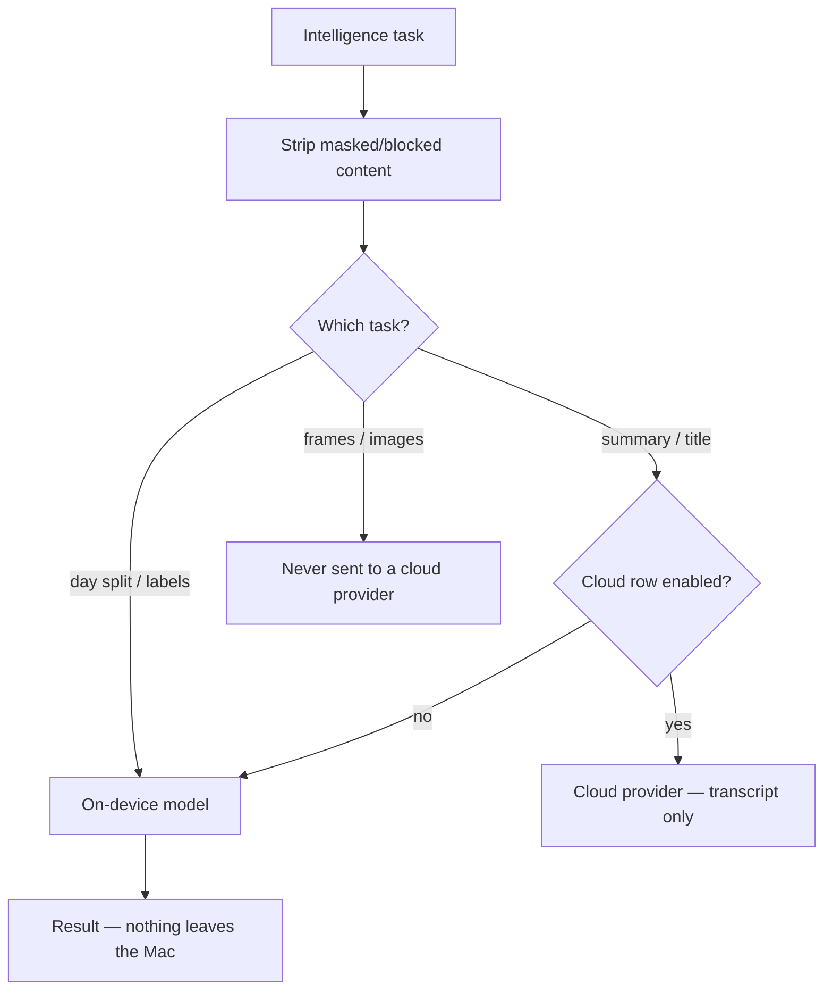
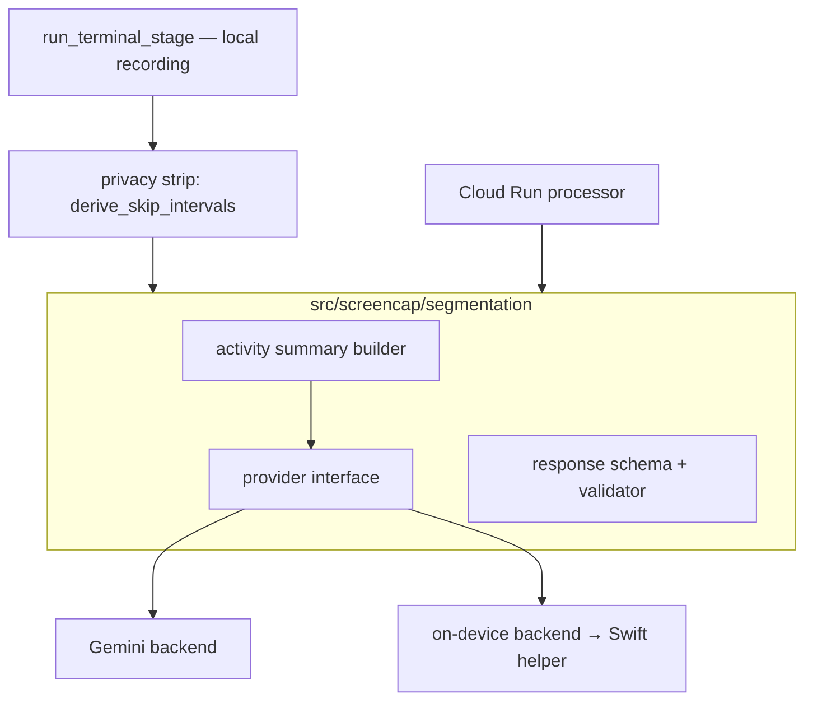
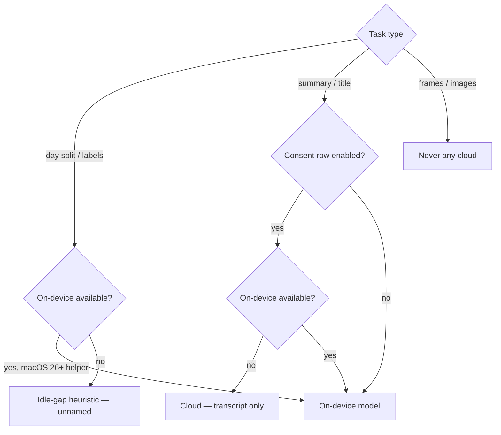

# Local-First Intelligence Provider - Plan

## Goal Capsule

- **Objective:** Make the agent's session→named-task segmentation — and the shared Intelligence features around it — run on-device by default through a pluggable provider, so local-only recordings get named tasks with nothing leaving the Mac.
- **Product authority:** Rute (product owner). Product Contract below is authoritative for WHAT; this plan owns HOW.
- **Execution profile:** Deep, cross-cutting — Python daemon pipeline, a new `src/screencap/segmentation/` package, the Cloud Run processor, config, a new CLI verb, and the macOS SwiftUI app. Land units as dependency-ordered commits.
- **Stop conditions:** Stop and surface if the extract/unify step (U1) would change the cloud processor's output, or if the Swift↔Python on-device bridge (U5) proves infeasible within the chosen IPC approach — both change scope.
- **Tail ownership:** The implementer runs the Verification Contract gates and the manual macOS-26 eval; PR/landing strategy follows repo conventions.
- **Product Contract preservation:** Product Contract unchanged. Planning clarifies one interaction the requirements left implicit — R7 takes precedence over R5 for the day-splitting task (cloud is never a day-split fallback, even on unsupported Macs). See KTD6.

---

## Product Contract

### Summary

A pluggable "Intelligence" provider layer powers three features — splitting the day into tasks, labeling recordings, and answering Recall searches — with Apple's on-device model as the zero-config default so those features run entirely on the Mac. Cloud providers are opt-in and gated by a per-task consent matrix. The headline effect: the "nothing leaves" promise becomes true for day-splitting, which today requires a cloud round-trip.

### Problem Frame

The smart segmentation that turns a session into named tasks (e.g. "Payroll run in Gusto — 42 min") runs only in the Cloud Run processor via Gemini, triggered by upload. A local-only recording — the product's core privacy promise — gets no LLM naming at all; it is left with chunk metadata or a dumb idle-gap split. So the one feature that most sells the "local, private recall" story is also the one that silently breaks it: to get good task names, data has to leave the Mac. That contradicts the central bet in `STRATEGY.md` — win on privacy, local-first, low enough overhead to run all day.

### Requirements

**Provider adapter**

- R1. Intelligence features call a single provider interface; the current Gemini call becomes one backend behind it, not the only path.
- R2. Users can select the active provider and add cloud backends (Claude, OpenAI, Gemini, or a local-server endpoint) with their own key.
- R3. The on-device model is the zero-config default: with no configuration, Intelligence features work and nothing leaves the Mac.

**Local segmentation**

- R4. Session→named-task segmentation runs on the Mac for local-only recordings, producing named tasks without any upload.
- R5. On Macs without an available on-device model, Intelligence degrades gracefully — offer cloud-with-consent, or fall back to the local idle-gap heuristic — never a hard failure or forced upload.

**Per-task cloud consent**

- R6. Cloud backends are governed by a per-task consent matrix; a task runs on a cloud provider only when its row is enabled.
- R7. Day-splitting and labeling stay on-device even when a cloud provider is configured; they are not offered as cloud tasks.
- R8. On-demand summaries/titles may use a cloud provider when enabled, sending transcript text only.
- R9. Screen frames or images are never sent to any cloud provider; this is a fixed rule, not a user-toggle.
- R10. Recall-answering runs on-device by default and becomes an opt-in cloud-consent row only when a provider is added.

**Privacy invariant**

- R11. Masked and blocked app content is stripped before any model — local or cloud — receives input; the existing never-upload and scrubbed-export guarantees extend to the new on-device model path.

### Routing and consent

### Key Flows

- F1. Default local segmentation (no configuration)
  - **Trigger:** A local-only recording is processed.
  - **Steps:** The privacy layer strips masked/blocked intervals; the on-device model receives the scrubbed activity summary; it returns named tasks; nothing uploads.
  - **Covers:** R3, R4, R11
- F2. Adding a cloud provider with per-task consent
  - **Trigger:** The user adds a cloud key in Intelligence settings.
  - **Steps:** The user enables specific rows (e.g. summaries/titles); the day-splitting row stays on-device; the frames/images row is fixed off; enabled cloud tasks send transcript text only.
  - **Covers:** R2, R6, R7, R8, R9
- F3. Degradation on an unsupported Mac
  - **Trigger:** Intelligence runs on a Mac with no on-device model.
  - **Steps:** For day-splitting, fall back to the local idle-gap heuristic (never cloud); for consented cloud tasks, offer cloud-with-consent; never block or force upload.
  - **Covers:** R5

### Acceptance Examples

- AE1. **Covers R4, R11.** Given a local-only recording with a blocked-app interval, When local segmentation runs, Then the on-device model receives only allowed/scrubbed content and produces named tasks, and no bytes leave the Mac.
- AE2. **Covers R7, R8.** Given a configured cloud key with "summaries & titles" enabled and "splitting & labeling" left on-device, When the user asks for a recording's summary, Then transcript text is sent to the cloud provider; When the day is split, Then it runs on-device and the cloud provider is never called.
- AE3. **Covers R9.** Given any cloud provider configured, When any Intelligence task runs, Then no screen frame or image is included in the request.
- AE4. **Covers R5.** Given a Mac with no on-device model and no cloud provider configured, When segmentation would run, Then it falls back to the local idle-gap heuristic and still produces task boundaries rather than failing.

### Success Criteria

- Local-only recordings receive named tasks good enough that users prefer them over today's no-naming state — measured by an eval comparing on-device output against the Gemini baseline on representative sessions.
- Zero screen frames or images reach any cloud provider, enforced by a guard, not just convention.
- Adding or switching a provider is config-only — no code change.

### Scope Boundaries

**Deferred for later**

- Live, progressive "splitting as you work" and the ambient day-view HUD (pause day / end day / focused-vs-ambient modes) — the first mockup's real-time layer sits on top of this one.
- Building the generative "answers Recall searches" step itself — retrieval (FTS/timeline) exists today; the LLM answering layer is net-new and rides this adapter later.

**Outside this product's identity**

- Non-macOS platforms (per `STRATEGY.md`).
- Shipping a ScreenCap-owned bundled model as the default — considered and set aside in favor of the OS model; it may return only as a degradation fallback if the coverage data warrants it.

#### Deferred to Follow-Up Work

- The "any local server" (OpenAI-compatible) provider backend — the interface accommodates it, but only on-device + Gemini backends ship in this plan.
- An automated eval harness for on-device vs Gemini naming quality — this plan defines the manual eval; a repeatable harness is follow-up.

### Dependencies / Assumptions

- Apple Foundation Models availability and guided/structured generation on macOS 26+. The existing response schema plus validator provide a repair/reject net for weaker structured output.
- The existing upload guarantees (`recording.db` never uploaded; cloud sees only scrubbed exports) extend to cover the new local model path.

---

## Planning Contract

### High-Level Technical Design

Two structural moves anchor the plan. First, the segmentation logic that lives only in the Cloud Run processor script (`scripts/process-recording/main.py`) is **extracted into an importable `src/screencap/segmentation/` package** and made source-agnostic, so both the local pipeline and the cloud processor call one code path through a provider interface. Second, a **session-level segmentation stage runs inside `run_terminal_stage()`** — the once-per-recording convergence point that fires even for `destination=local` — feeding a privacy-stripped activity summary to the selected provider and persisting named tasks locally.

The on-device provider is the cross-language crux: Apple Foundation Models is Swift-only, so the Python provider cannot call it in-process. The on-device backend is a **Swift helper invoked as a subprocess** (guarded `#available(macOS 26, *)`); when the helper is absent (CLI-only install) or the OS is below 26, the provider reports unavailable and the degradation ladder takes over.

Shared-module reuse across local and cloud:

Per-task routing and degradation ladder:

### Key Technical Decisions

- KTD1. **Extract and unify, not duplicate.** Extract `_derive_activity_summary`, the response schema, and `_validate_llm_tasks` from the Cloud Run script into `src/screencap/segmentation/`, and route the cloud processor's LLM call through the shared provider interface too. Rationale: one source of truth, no local-vs-cloud drift. Cost: the working cloud processor is touched — mitigated by a characterization test (KTD-linked in U1).
- KTD2. **On-device provider = subprocess Swift helper.** Foundation Models is Swift-only, so the Python provider shells out to a bundled helper that runs the model under `#available(macOS 26, *)` and exchanges JSON. Alternative (app-driven segmentation entirely in Swift) rejected: it splits the segmentation trigger and breaks for headless/CLI-only installs. Exact helper packaging and the Python↔Swift IPC (argv/stdio vs. a local socket) are deferred to implementation.
- KTD3. **Settings bridge = a new `screencap settings intelligence` CLI verb + `config.toml` keys**, mirroring the established `settings privacy` pattern. The Swift app stores no secrets; cloud provider keys stay daemon-owned (consistent with the existing CloudAuth pattern).
- KTD4. **Privacy strip reuses `derive_skip_intervals`** (the same reader `frame.nearest` and the backfill use), ALLOW-only, so the "strip before any model" guarantee cannot drift from capture-time block semantics.
- KTD5. **Named-task persistence is a new local store** (a `tasks.json` artifact plus a pipeline-ledger table), since the v2 manifest carries no tasks and `recording.db` has no tasks table. Exact schema deferred to implementation.
- KTD6. **Degradation is per-task and respects consent.** Day-splitting/labeling degrades on-device → idle-gap heuristic only; cloud is never a day-split fallback (R7 over R5). Only consented tasks (summaries/titles) may degrade to cloud. Never hard-fail; never force upload.

### Assumptions

- A meaningful share of target operators will run macOS 26+ over time; near-term, most users get the idle-gap heuristic fallback for day-splitting until they upgrade (accepted for v1).
- Foundation Models guided generation can emit the task schema reliably enough that the existing validator's repair/reject path keeps output usable.
- The app deployment target stays macOS 13.0; the on-device path is additive and fully `#available`-guarded, so it does not raise the floor.
- The on-device helper ships inside the macOS app bundle. CLI-only / headless installs (no app) therefore have no on-device backend and always degrade — heuristic for day-splitting, or a consented cloud provider for summaries.

### Sequencing

Python core first (U1→U3), then the local segmentation stage (U4) and the on-device backend (U5) in parallel, then the consent policy and degradation (U6, U7), then the CLI/Swift surface (U8→U10). U1 unblocks everything.

### System-Wide Impact

- **Privacy boundary:** a new consumer (the on-device model) now reads recording-derived content; R11/U3 extend the strip-before-any-model guarantee to it. The never-upload rule for `recording.db` is unchanged.
- **Cloud processor:** its LLM call path changes (routes through the shared provider); output must stay identical (characterization gate).
- **CLI surface:** a new `settings intelligence` verb becomes a stable contract the Swift app depends on.

---

## Implementation Units

**Unit Index**

| U-ID | Title | Key files | Depends on |
|---|---|---|---|
| U1 | Extract segmentation core into a package | `src/screencap/segmentation/`, `scripts/process-recording/main.py` | — |
| U2 | Provider interface + Gemini backend + config | `src/screencap/segmentation/provider.py`, `config.py` | U1 |
| U3 | Privacy strip before any provider | `src/screencap/segmentation/`, reuse `backfill/skip_intervals.py` | U1 |
| U4 | Local segmentation stage in terminal_stage | `src/screencap/terminal_stage.py`, local tasks store | U1,U2,U3 |
| U5 | On-device provider via Swift Foundation Models helper | `src/screencap/segmentation/providers/`, `macos/` helper | U2 |
| U6 | Per-task consent policy (Python) | `src/screencap/segmentation/consent.py`, `config.py` | U2 |
| U7 | Graceful degradation ladder | `src/screencap/segmentation/` | U4,U5,U6 |
| U8 | `screencap settings intelligence` CLI verb | `src/screencap/cli/` | U6 |
| U9 | Intelligence settings pane (Swift) | `macos/ScreenCap/Views/Settings/`, `Controllers/` | U8 |
| U10 | Surface named tasks in the app | `macos/ScreenCap/Models/`, `Views/Journal/`, `Views/Library/` | U4 |

### U1. Extract segmentation core into `src/screencap/segmentation/`

- **Goal:** Move the segmentation logic out of the Cloud Run script into an importable, source-agnostic package that the cloud processor and the local pipeline can both call.
- **Requirements:** R1
- **Dependencies:** none
- **Files:** create `src/screencap/segmentation/__init__.py`, `src/screencap/segmentation/activity_summary.py`, `src/screencap/segmentation/schema.py`, `src/screencap/segmentation/validate.py`; modify `scripts/process-recording/main.py` (import from the package, drop the inlined copies); create `tests/segmentation/test_activity_summary.py`, `tests/segmentation/test_validate.py`.
- **Approach:** Lift `_derive_activity_summary`, `_RESPONSE_SCHEMA`, and `_validate_llm_tasks` verbatim, then parameterize the event/manifest reader so it accepts a local source (events JSONL on disk / `recording.db`) instead of hard-wired GCS blob reads. The cloud processor passes a GCS-backed reader; the local path passes a filesystem reader.
- **Execution note:** Characterization-first — pick a representative fixture recording, commit a baseline snapshot of the current cloud-processor output (`_derive_activity_summary` + `_validate_llm_tasks`) before extracting, then assert byte-identical output on the same fixture after. This is the guard for KTD1; the LLM call is not part of the snapshot (only the deterministic summary + validation), so the baseline is stable.
- **Patterns to follow:** `scripts/process-recording/main.py:1113-1279`, `:1334-1380`, `:1466-1558`.
- **Test scenarios:**
  - Activity summary built from a fixture events source yields the expected timeline entries (apps, titles, typed/click/scroll counts).
  - `Covers AE1.` A blocked interval present in the source does not yet strip here (strip is U3) — assert the builder is source-agnostic and reads only the provided reader, not GCS.
  - Validator converts relative timestamps to Unix, rejects overlapping/zero-duration tasks, and repairs recoverable schema drift.
  - Characterization: cloud-path output identical before/after extraction on the fixture.
- **Verification:** `PYTHONPATH=src pytest tests/segmentation/` green; cloud fixture output diff is empty.

### U2. Provider interface + Gemini backend + config selection

- **Goal:** Introduce a pluggable `LLMProvider` and reimplement the current Gemini call as one backend behind it, selected by config.
- **Requirements:** R1, R2
- **Dependencies:** U1
- **Files:** create `src/screencap/segmentation/provider.py` (interface), `src/screencap/segmentation/providers/gemini.py`; modify `scripts/process-recording/main.py` (call through the provider), `src/screencap/config.py` (`get_llm_provider`); create `tests/segmentation/test_provider.py`.
- **Approach:** Define a narrow interface — `segment(activity_summary) -> tasks | None`. `GeminiProvider` wraps the existing `_call_gemini` (model, `GOOGLE_GENAI_API_KEY`, `response_schema`). `get_llm_provider()` follows the env-var > `config.toml` > default pattern (default `on-device`; cloud recordings resolve to `gemini`).
- **Patterns to follow:** `config.py:396-410` (`get_segmentation_mode` / `get_rest_threshold`); `main.py:1404-1435` (`_call_gemini`).
- **Test scenarios:**
  - Provider selection resolves env > config.toml > default correctly.
  - `GeminiProvider.segment` returns validated tasks on a mocked API response; returns `None` (not raises) on API failure.
  - Cloud processor produces identical output routed through the provider vs. the pre-refactor direct call (characterization).
- **Verification:** provider tests green; cloud characterization still green.

### U3. Privacy strip before any provider

- **Goal:** Guarantee masked/blocked content is removed from the activity summary before it reaches any provider (local or cloud).
- **Requirements:** R11
- **Dependencies:** U1
- **Files:** modify `src/screencap/segmentation/activity_summary.py` (apply the strip); reuse `src/screencap/backfill/skip_intervals.py` (`derive_skip_intervals`) and `src/screencap/frame_blocked.py` (`build_is_blocked`); create `tests/segmentation/test_privacy_strip.py`.
- **Approach:** Before emitting the activity summary, compute blocked intervals with `derive_skip_intervals(..., require_canonical=True)` over the recording window and drop any timeline entry whose timestamp falls inside a blocked interval (ALLOW-only). Fail-closed: on a partial/ambiguous read, exclude rather than include. Apply the strip at the **single chokepoint** where the activity summary is built (U1), so every consumer — on-device, cloud, and any future one — receives only stripped content and no code path can bypass it. The activity summary carries text only (timeline entries: app bundle IDs, action counts, timestamps) — never frame/image bytes or references.
- **Execution note:** This is a privacy-bearing unit — mark its tests `@pytest.mark.privacy` and keep them Vision-free so they run on the CI privacy lane.
- **Patterns to follow:** `frame_blocked.py:48-100` (the `build_is_blocked` predicate pattern), `backfill/skip_intervals.py`.
- **Test scenarios:**
  - `Covers AE1.` A timeline entry inside a MASK/EXCLUDE interval is absent from the summary passed to the provider.
  - `Covers AE1.` A coverage gap / null-classification interval is treated as blocked (fail-closed), not included.
  - An all-ALLOW recording passes through unchanged.
- **Verification:** `PYTHONPATH=src pytest tests/segmentation/ -m privacy` green.

### U4. Local segmentation stage in `run_terminal_stage`

- **Goal:** Run session segmentation once per local recording and persist named tasks locally, with no upload.
- **Requirements:** R3, R4
- **Dependencies:** U1, U2, U3
- **Files:** modify `src/screencap/terminal_stage.py` (add the session-segmentation step inside `_run_locked`, after routing, before retention); create the local tasks store writer (`tasks.json` + a `pipeline_task_segments` ledger table in `src/screencap/pipeline_state.py`); modify `src/screencap/upload.py` (exclude the local tasks store from `list_recording_files` / `assert_uploadable`); create `tests/test_terminal_stage_segmentation.py`.
- **Approach:** After the destination decision, for a local recording, build the stripped activity summary (U3), call the configured provider (U2), and write the returned tasks to the local store. Idempotent — re-entry does not duplicate. Runs inside the terminal flock. Distinguish two provider outcomes: a returned `None` (provider ran, produced no tasks) leaves the recording unnamed but never blocks terminal completion (fail-open); a provider-*unavailable* signal is handled by U7's degradation ladder, not here. The local tasks store is **local-only by rule** — like `recording.db`, it is excluded from upload so a cloud/both recording can never carry it.
- **Patterns to follow:** `terminal_stage.py:596` (`run_terminal_stage`), `:741-755` (`_route_local`); ledger transitions in `pipeline_state.py`.
- **Test scenarios:**
  - A local recording produces a persisted tasks store after terminal runs.
  - `Covers AE1.` No upload path is invoked for a local recording (assert against the upload seam).
  - The local tasks store is excluded from `list_recording_files` / `assert_uploadable` — a cloud/both recording never enumerates it for upload.
  - Re-entering terminal for the same recording does not duplicate tasks (idempotent).
  - Provider returning `None` leaves terminal completion intact (fail-open).
- **Verification:** terminal-stage tests green; no upload for local destination.

### U5. On-device provider via a Foundation Models Swift helper

- **Goal:** Implement the on-device backend by invoking a macOS-26 Swift helper that runs Apple Foundation Models, reporting unavailable below the OS/helper floor.
- **Requirements:** R2, R3
- **Dependencies:** U2
- **Files:** create `src/screencap/segmentation/providers/ondevice.py` (subprocess client); create the Swift helper target under `macos/` (guarded `#available(macOS 26, *)`, JSON in/out); modify `macos/project.yml` (helper target); create `tests/segmentation/test_ondevice_provider.py`.
- **Approach:** The Python provider spawns the helper, writes the **already-stripped** activity summary as JSON (the provider accepts only stripped input from U3/U4 and fail-closes on anything else), reads back schema-shaped tasks, and runs them through the shared validator (U1). If the helper binary is missing, times out, errors, or reports the OS is unsupported, the provider returns a distinct "unavailable" signal (not `None` task output) so U7 can route degradation. The helper uses Foundation Models guided generation to emit the task schema. **The helper ships with the macOS app**, so CLI-only / headless installs have no on-device backend — the provider reports unavailable and U7 degrades (heuristic for day-splitting; consented cloud for summaries).
- **Execution note:** The real model call cannot run in CI at the macOS 13 floor — test the Python side against a fake helper; real-model behavior is covered by the manual eval in the Verification Contract.
- **Patterns to follow:** existing subprocess/CLI bridge conventions; `CloudAuthController` "all token handling stays in Python/helper, Swift triggers only" posture.
- **Test scenarios:**
  - Fake helper returning valid task JSON → provider returns validated tasks.
  - Missing / erroring / timing-out helper → provider returns "unavailable" (distinct from empty tasks), all exercisable in CI on the macOS 13 floor with the fake helper.
  - Helper reporting OS < 26 → "unavailable".
  - Malformed helper output → validator repairs or the provider reports failure without crashing terminal.
  - Provider rejects (fail-closed) an activity summary that was not marked stripped.
- **Verification:** on-device provider tests green with the fake helper; Swift helper compiles under the macOS-26 guard.

### U6. Per-task consent policy (Python)

- **Goal:** Encode the per-task consent matrix and enforce which tasks may use a cloud provider.
- **Requirements:** R6, R7, R8, R9, R10
- **Dependencies:** U2
- **Files:** create `src/screencap/segmentation/consent.py`; modify `src/screencap/config.py` (consent-matrix getters); create `tests/segmentation/test_consent.py`.
- **Approach:** A policy object keyed by task kind (day-split/label, summary/title, recall-answer, frames) returns the allowed execution target given the configured provider + consent rows. The never-cloud rule for day-split/label and recall-answer is a **fixed guard checked before the cloud row is consulted** (a single enforcement point so a later change can't invert R7/R10). Summary/title prefers on-device whenever available and resolves to cloud only as a fallback when on-device is unavailable AND its consent row is enabled (R8). Frames resolve never-cloud unconditionally (R9). Both the degradation resolver (U7) and the CLI (U8) route through this one policy — they do not re-decide the matrix.
- **Test scenarios:**
  - `Covers AE2.` Day-split resolves on-device even when a cloud key + summary consent are enabled.
  - `Covers AE2.` Summary resolves cloud only when its row is enabled; on-device otherwise.
  - `Covers AE3.` Frames/images resolve never-cloud for every configuration.
  - Recall-answer resolves on-device by default; becomes cloud-eligible only when its opt-in row is added.
- **Verification:** consent tests green covering the full task × config matrix.

### U7. Graceful degradation ladder

- **Goal:** Resolve unavailable on-device execution into the correct fallback per task, never hard-failing or forcing upload.
- **Requirements:** R5
- **Dependencies:** U4, U5, U6
- **Files:** modify `src/screencap/segmentation/` (a resolver combining provider availability + consent); modify the terminal segmentation call site (U4); create `tests/segmentation/test_degradation.py`.
- **Approach:** When the on-device provider reports unavailable: day-split/label falls back to the existing idle-gap heuristic (never cloud, per KTD6); a consented summary/title task may use the cloud provider; nothing forces upload and terminal never fails on a segmentation miss.
- **Test scenarios:**
  - `Covers AE4.` On-device unavailable + no cloud → day-split uses the idle-gap heuristic, producing task boundaries.
  - On-device unavailable + cloud configured + day-split → still heuristic, cloud not called (R7 over R5).
  - On-device unavailable + summary consent enabled → summary uses cloud.
  - No path forces upload for a local recording under any degradation.
- **Verification:** degradation tests green; the never-upload assertion holds across fallbacks.

### U8. `screencap settings intelligence` CLI verb

- **Goal:** Provide the CLI settings surface the Swift pane writes to and the Python segmentation reads from.
- **Requirements:** R2, R6
- **Dependencies:** U6
- **Files:** create the `settings intelligence` command under `src/screencap/cli/`; modify `src/screencap/config.py` (persist provider + consent keys to `config.toml`); create `tests/test_cli_settings_intelligence.py`.
- **Approach:** Mirror the **actual** `settings privacy` command shape in `src/screencap/cli/__init__.py` (match its subcommand/argument convention and `--json` read-back rather than inventing a new `--set key=value` form). Keys cover the active provider, added cloud providers, and each consent row, persisted to an `[intelligence]` section in `config.toml`. Writes go through the same advisory-flock config layer as other settings. The CLI validates on write: day-split/label and frames rows are rejected if set to cloud (defense in depth over U6's policy).
- **Patterns to follow:** the `settings privacy` CLI surface; `config.py` env > toml > default loaders; all user-facing output via `rich.console.Console`.
- **Test scenarios:**
  - Setting the provider then reading `--json` round-trips.
  - Consent rows persist and read back; the frames row and the day-split/label row are not settable to cloud-on (rejected with a clear message).
  - Invalid provider value errors cleanly (non-zero exit, rich-formatted message).
- **Verification:** CLI settings tests green; round-trip read-back matches writes.

### U9. Intelligence settings pane (Swift)

- **Goal:** Build the Intelligence pane — model picker plus per-task cloud-consent matrix — persisting through the new CLI verb.
- **Requirements:** R2, R6, R7, R8, R9
- **Dependencies:** U8
- **Files:** create `macos/ScreenCap/Views/Settings/IntelligenceSettingsView.swift`, `macos/ScreenCap/Controllers/IntelligenceController.swift`; wire into the settings nav; create `macos/ScreenCapTests/IntelligenceSettingsTests.swift`.
- **Approach:** Follow `PrivacySettingsView` layout (title, subtitle, divider rows) and the `AppRulesView` optimistic pending-state pattern for the consent toggles. The model picker selects on-device (default) / a cloud provider / "add provider". The frames/images row renders as a fixed "always off" (non-interactive). `IntelligenceController` writes via `screencap settings intelligence` and reads `--json`, mirroring `PrivacyController`. No Keychain — cloud keys are daemon-owned.
- **Patterns to follow:** `PrivacySettingsView.swift`, `AppRulesView.swift` (tri-state + `pendingSegments`), `PrivacyController.swift` (CLI bridge).
- **Test scenarios:**
  - Selecting on-device / a cloud provider writes the expected CLI settings call.
  - Toggling a consent row shows optimistic pending state, then reconciles on success.
  - The frames/images row is non-interactive (always off).
  - `Covers AE2.` Day-splitting row is presented as on-device (not a cloud-eligible toggle).
- **Verification:** `xcodebuild` test target green; model/controller tests pass.

### U10. Surface named tasks in the app

- **Goal:** Ensure locally generated named tasks flow to the same UI surfaces as cloud-derived tasks.
- **Requirements:** R4
- **Dependencies:** U4
- **Files:** modify `macos/ScreenCap/Models/RecordingSummary.swift` (read local tasks) and the daemon read surface it depends on; modify `macos/ScreenCap/Views/Journal/JournalView.swift`, `macos/ScreenCap/Views/Library/LibraryCard.swift` as needed; add a model test.
- **Approach:** Point the recording-summary/task read path at the local tasks store (U4) so Journal's day-grouped task breakdown and Library card titles/summaries populate for local recordings without a cloud round-trip. No new UI shape — reuse the existing task/summary rendering.
- **Test scenarios:**
  - A local recording with a persisted tasks store shows named tasks in the Journal day view.
  - A recording with no tasks (provider miss / heuristic) renders gracefully (no crash, sensible placeholder).
- **Verification:** model test green; Journal/Library render local tasks in a manual smoke check.

---

## Verification Contract

| Gate | Command / action | Applies to |
|---|---|---|
| Python unit tests | `PYTHONPATH=src pytest tests/segmentation/ tests/test_terminal_stage_segmentation.py tests/test_cli_settings_intelligence.py` | U1–U8 |
| CI privacy lane | `PYTHONPATH=src pytest -m privacy` (privacy-bearing tests Vision-free) | U3, and any privacy-touching unit |
| Cloud characterization | Fixture cloud-processor output diff is empty pre/post extraction | U1, U2 |
| Swift tests | `xcodebuild test` on the app scheme (Intelligence pane + controller) | U9, U10 |
| Helper build | Swift helper target compiles under `#available(macOS 26, *)` | U5 |
| Manual eval (macOS 26) | On a macOS-26 machine: local recording → named tasks end-to-end; verify quality against the Gemini baseline on representative sessions | U4, U5 |
| Manual degradation (macOS 13) | On the macOS-13 floor: local recording falls back to the idle-gap heuristic; no upload; no crash | U7 |
| Frames guard | Assert no frame/image bytes are included in any provider request | U3, U6 |

Note: CI runs `pytest -m privacy` (plus the lock-policy test) — privacy-bearing tests must be marked and Vision-free or they never run on CI. In this worktree, run tests with `PYTHONPATH=src`.

---

## Definition of Done

- Every requirement R1–R11 is satisfied or explicitly traced to a unit; the Product Contract is unchanged.
- A local-only recording produces named tasks on macOS 26 with nothing leaving the Mac; below macOS 26 it falls back to the idle-gap heuristic without failing or uploading.
- No screen frame or image reaches any cloud provider (guarded and tested).
- The Cloud Run processor's output is unchanged after the extract/unify (characterization green).
- Per-task consent gates cloud calls correctly, with day-splitting pinned on-device even when cloud is configured.
- Privacy-lane tests are green on CI; Swift tests green.
- Cleanup: no dead-end or experimental code from abandoned approaches remains in the diff.

---

## Open Questions

**Resolved decisions**

- Summary/title routing: **prefer on-device; cloud is a consented fallback only.** A summary/title runs on-device whenever the on-device model is available; the cloud provider is used only when on-device is unavailable AND the "Summaries & titles" consent row is enabled. The consent row grants fallback permission, not an always-cloud choice. The degradation diagram already reflects this.

**Deferred to implementation**

- Exact local tasks persistence schema — the `tasks.json` shape and the `pipeline_task_segments` ledger columns (U4) — plus the read contract U10 consumes (daemon query vs. direct file/ledger read from Swift). U4 must define this before U10 implements the read side.
- The Python↔Swift on-device IPC mechanism — subprocess argv/stdio vs. a local socket, and how the helper is packaged/discovered for app vs. CLI-only installs (U5).
- Whether the deferred "any local server" backend targets an OpenAI-compatible API surface.
- The repeatable eval-harness design for on-device vs Gemini naming quality (manual eval ships now).

---

## Sources / Research

- Local pipeline convergence: `src/screencap/terminal_stage.py:596` (`run_terminal_stage`), `:741-755` (`_route_local`) — runs once per recording, including local.
- Cloud segmentation to extract: `scripts/process-recording/main.py:1113-1279` (`_derive_activity_summary`), `:1334-1380` (`_RESPONSE_SCHEMA`), `:1404-1435` (`_call_gemini`), `:1466-1558` (`_validate_llm_tasks`) — all script-local, GCS-backed, no importable module today.
- Task output today: `src/screencap/task_manifest.py:1-104` (v2 = chunk metadata, no tasks), `:107-250` (v1 idle-gap heuristic), `src/screencap/day_segments.py`.
- Config pattern: `src/screencap/config.py:396-410` (`get_segmentation_mode`, `get_rest_threshold`), `_load_toml`.
- Privacy strip reuse: `src/screencap/backfill/skip_intervals.py` (`derive_skip_intervals`), `src/screencap/frame_blocked.py:48-100` (`build_is_blocked`).
- Upload guardrails: `src/screencap/upload.py` (`assert_uploadable`, `list_recording_files`) — `recording.db` never uploaded.
- macOS settings pattern: `macos/ScreenCap/Views/Settings/PrivacySettingsView.swift`, `AppRulesView.swift` (per-app tri-state + optimistic pending state), `macos/ScreenCap/Controllers/PrivacyController.swift` (CLI settings bridge), `CloudAuthController.swift` (secrets stay in Python).
- Deployment target: `macos/project.yml:4-5` (macOS 13.0) — Foundation Models needs macOS 26+, hence the `#available` guard and heuristic fallback.
- Task/label UI surfaces: `macos/ScreenCap/Models/RecordingSummary.swift`, `Views/Journal/JournalView.swift`, `Views/Library/LibraryCard.swift`.
- Strategy grounding: `STRATEGY.md` (local-first/privacy bet; "run all day").
