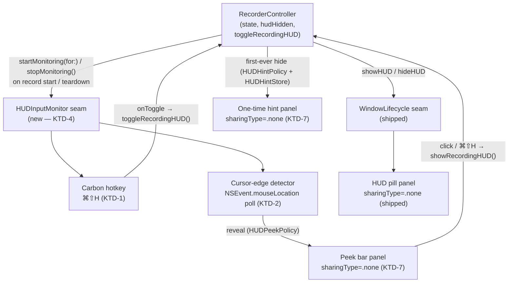

# Recording toolbar hide controls v2 — ⌘⇧H toggle, edge peek, one-time hint - Plan

**Requirements derivation.** This plan is derived from design screen **8a** ("RECORDING TOOLBAR — HIDE (extends 1d/5a · ⌘⇧H)"), supplied as a screenshot. The `claude.ai/design` URL is network-restricted in this environment, so requirements were transcribed from the provided image of screen 8a; the referenced 1d/5a screens it "extends" were not available but 8a is self-contained for this feature. If those screens carry additional constraints, treat this plan's Product Contract as the authority to reconcile against them.

**Relationship to shipped work.** This is a **v2 follow-on** to the recording-HUD hide feature already shipped and merged in PR #338 (commits `412d68a7`, `430082ac`; plan `docs/plans/2026-07-06-001-feat-recording-hud-hide-and-shadow-plan.md`). The baseline already delivers: a hide control on the pill, a menu-bar *Show recording controls* restore item, the per-recording transient `hudHidden` state, and the softened shadow. This plan adds the four capabilities the design shows **beyond** that baseline. The shipped plan stays as-is (historical record); nothing here reopens it.

---

## Goal Capsule

- **Objective.** Extend the shipped recording-toolbar hide feature to full design (8a) fidelity: a global **⌘⇧H** toggle that works while the recorded app is focused, a **bottom-edge hover "Show controls" peek**, a **one-time menu-bar hint** on first hide, and **"Hide" as a labeled button** on the pill.
- **Authority.** Product scope is fixed by the Product Contract below. Mechanism decisions are the executor's within the Key Technical Decisions.
- **Stop conditions.** Stop and surface a blocker if (a) the capture-exclusion guarantee (`sharingType = .none`) cannot be extended to every new floating surface (peek bar, hint), or (b) the chosen zero-permission mechanisms (Carbon hotkey, cursor-position polling) turn out to require a new TCC prompt on the target macOS — the "no new permission" property is load-bearing (KTD-1, KTD-2).
- **Execution profile.** Deep depth, 5 units. U1 is the foundation; U2 depends on U1; U3 depends on U1+U2; U4 and U5 depend only on U1 and can land in any order. U2 and U3 carry the novel/risky mechanism work.
- **Tail.** Follow the repo's PR/landing conventions after implementation; the executor owns commit/push/PR/CI.

---

## Product Contract

### Summary

Bring the recording toolbar's hide affordance to full design fidelity. Today the pill can be hidden (icon button) and restored only from the menu bar. The design adds three more ways to live with a hidden toolbar and one visual refinement: pressing **⌘⇧H** anywhere toggles it (even while you're working in the recorded app); **resting the cursor on the bottom screen edge** peeks a slim "Show controls" bar that pins the toolbar back; the **first** time you hide, a **one-time hint** points at the menu bar where the recording status and Stop now live; and the pill's hide affordance becomes a plain **"Hide"** button sitting alongside Draw and Mute. All of this must continue to leave capture untouched, keep every ScreenCap surface out of the recording, and — by design — introduce no new permission prompt.

### Problem Frame

The shipped hide feature has one restore path: open the menu-bar dropdown and choose *Show recording controls*. That's a deliberate, discoverable fallback, but it's slow and modal — you have to leave what you're doing, travel to the menu bar, and drill into a menu. The design's intent is that a hidden toolbar should feel *reversible in place*: a muscle-memory keystroke (⌘⇧H) that works without leaving the recorded app, and a "swipe to the bottom edge" reveal that mirrors how the Dock and auto-hiding menu bar behave. The one-time hint closes the discoverability gap the first hide creates — when the pill vanishes, a first-time user needs to be told once where "recording" and "Stop" went. And the "Hide" label makes the affordance legible instead of relying on an icon whose meaning must be inferred.

The hard part is that two of these — ⌘⇧H-while-hidden and the edge peek — must react to input **while the user's keyboard/mouse focus is in the app being recorded**, not in ScreenCap. That is exactly the boundary the shipped plan declined to cross (it deferred a hotkey, and the app has never installed a global input path — see KTD-13 below). This plan crosses it deliberately, but with the lightest-footprint mechanisms available so that no new permission prompt appears.

### Requirements

**Keyboard toggle (⌘⇧H)**

- R1. A **⌘⇧H** shortcut toggles the recording toolbar's visibility: it hides the toolbar when shown and restores it when hidden.
- R2. ⌘⇧H fires while focus is in the **recorded app** (global reach), not only when ScreenCap is frontmost.
- R3. ⌘⇧H is active **only during a recording**. When no recording is active, ScreenCap does not reserve ⌘⇧H — the combo reaches the frontmost app normally.

**Bottom-edge peek**

- R4. While the toolbar is hidden, resting the cursor at the **bottom screen edge** for a short dwell reveals a slim **"Show controls"** bar (labeled with the ⌘⇧H hint).
- R5. The peek bar appears **only on hover** and hides when the cursor leaves the edge band; it never floats persistently.
- R6. Activating the peek bar (click) — or pressing ⌘⇧H — restores the full toolbar to its default **bottom-center** position.

**One-time hint**

- R7. The **first time ever** the user hides the toolbar, a one-time hint points to the **menu bar** as the place the recording status and Stop now live. It is shown once and never again (across this and all future recordings).

**Hide affordance**

- R8. The pill presents **"Hide"** as a labeled control alongside Draw and Mute (replacing the icon-only chevron), and its tooltip/accessibility surface names the **⌘⇧H** shortcut.

**Invariants (carried from the shipped baseline)**

- R9. Every hide/restore path leaves **capture untouched** — the recording continues uninterrupted — and **every** floating ScreenCap surface (toolbar pill, peek bar, hint) is **excluded from the capture** (`sharingType = .none`), so none appears inside the recording.

### Acceptance Examples

- AE1. **Covers R1, R2.** Recording in progress with focus in a browser; the user presses ⌘⇧H → the toolbar hides; presses ⌘⇧H again → it reappears bottom-center. The elapsed timer kept advancing throughout and focus never left the browser.
- AE2. **Covers R3.** No recording active; the user presses ⌘⇧H → nothing happens in ScreenCap and, if the frontmost app binds ⌘⇧H, that app receives it normally.
- AE3. **Covers R4, R5, R6.** Toolbar hidden; the user rests the cursor at the very bottom edge → after a brief dwell a slim "Show controls ⌘⇧H" bar appears; moving the cursor away from the edge hides it again without ever pinning; clicking it restores the full toolbar bottom-center.
- AE4. **Covers R7.** The first time the user ever hides the toolbar → a one-time hint points to the menu bar; on every subsequent hide (same recording or a later one) no hint appears.
- AE5. **Covers R9.** Across hide, ⌘⇧H toggle, edge peek, and hint display, none of the ScreenCap surfaces appears in the captured video and capture keeps writing to disk.
- AE6. **Covers the no-new-permission property (KTD-1, KTD-2).** Using the ⌘⇧H and edge-peek features triggers **no** Accessibility or Input Monitoring permission dialog beyond what recording already required.

### Scope Boundaries

**Deferred for later**

- A **user-customizable** hotkey (this plan ships a fixed ⌘⇧H).
- An **event-driven** global mouse monitor for the peek (`NSEvent.addGlobalMonitorForEvents(.mouseMoved)`, Accessibility-gated) — deferred in favor of the zero-permission polling mechanism (KTD-2, Alternatives).
- **Multi-display** peek on non-recorded/secondary displays — v2 targets the recorded/main display; note the behavior observed on multi-monitor rigs but do not build for it here.
- A remembered **"always start recordings hidden"** preference (carried from the baseline's deferred list).
- Restoring the pill to its **last-dragged** position (restore is always bottom-center — carried from baseline; R6 keeps bottom-center).

**Outside this product's identity**

- Making **Draw / Mute** functional (SCR-217 / SCR-218) — this plan does not touch them.
- ScreenCap reserving **⌘⇧H when idle** — the hotkey is registered only during a recording (R3); the app is not a global-hotkey utility.
- The **minimize-to-a-dot / dock-to-edge** hide *shapes* — rejected in the baseline in favor of full dismiss. The edge peek is a *reveal* affordance; the pill still fully dismisses.

### Dependencies and Assumptions

- **Baseline is shipped.** `RecorderController.hudHidden`, `hideRecordingHUD()`, `showRecordingHUD()`, `MenuBarMenuPolicy.showRecordingControlsVisible`, and the capture-excluded HUD panel already exist (PR #338). This plan builds directly on them.
- **`hudHidden` reset lives at the `.idle` chokepoint.** The shipped code resets `hudHidden = false` in `RecorderController.state.didSet` when `state` becomes `.idle` (not at the effect-drains the original baseline plan text described — commit `430082ac` moved it). Everything here must respect that single chokepoint.
- **App process, not a helper, owns the monitoring.** The ⌘⇧H registration and the cursor-edge detector run **in the ScreenCap.app process** so they ride on the app's own identity. The app is **not sandboxed** and its target entitlements declare only `com.apple.security.device.audio-input` (`macos/ScreenCap/ScreenCap.entitlements`) — the recording-engine TCC grants (Screen Recording / Accessibility / Input Monitoring) are held by the spawned CLI/daemon, not necessarily by the app process. The chosen mechanisms are selected precisely so the app process needs **no** grant it doesn't already have (KTD-1, KTD-2).
- **Capture exclusion must extend to new surfaces.** The existing HUD panel is capture-excluded (`sharingType = .none`). The peek bar and the hint are new floating panels over arbitrary recorded content and must carry the same exclusion (R9).
- **KTD-13 precedent.** The app deliberately kept ⌘⇧F window-scoped ("no global tap", documented in `macos/ScreenCap/Views/MenuBarMenu.swift` and the QA runbook §7). This plan is the first global input path; KTD-3 justifies the scoped exception.

### Sources

- `macos/ScreenCap/Controllers/RecorderController.swift` — `hudHidden`, `hideRecordingHUD()` / `showRecordingHUD()`, the `.idle` reset chokepoint (`state.didSet`), the effect switch that drains `.showHUD` / `.hideHUD`, and the injected `windowLifecycle` seam (`init(windowLifecycle:)`).
- `macos/ScreenCap/Controllers/WindowLifecycle.swift` — the injected AppKit seam pattern (`WindowLifecycle` protocol + `LiveWindowLifecycle` + `NoopWindowLifecycle` + `WindowLifecycleFactory.makeDefault()` XCTest gate) that the new input-monitor seam mirrors.
- `macos/ScreenCap/Views/Record/RecordingHUDPanel.swift` — the pill sub-views (`stub(...)`, `stopButton`, `hideButton`), `RecordingHUDModel` accessibility labels, and `RecordingHUDPanelController` (capture-excluded non-activating `NSPanel`, `fittingSize` panel sizing, bottom-center `reposition`).
- `macos/ScreenCap/Views/MenuBarMenu.swift` + `macos/ScreenCap/Views/MenuBarMenuPolicy.swift` — the *Show recording controls* item, the `*Policy` predicate pattern, and the KTD-13 "no global tap" note.
- `macos/ScreenCap/AppDelegate.swift` — `@MainActor` app-level AppKit owner (`bind(recorder:)`, `applicationDidFinishLaunching`, window-close observer) — the natural home to install/tear down app-lifetime monitors.
- `macos/ScreenCap/Controllers/OnboardingMarkerStore.swift` — the injectable `UserDefaults`-backed once-flag store pattern for the one-time hint.
- `macos/ScreenCapTests/RecorderControllerTests.swift` — `FakeWindowLifecycle` (`showHUDCount` / `hideHUDCount` / `hideMainWindowCount` / `restoreMainWindowCount`) and the `recordingController(_:)` helper driving `.starting → started`; the test-double template for the new seam.
- `docs/runbooks/new-ui-manual-qa.md` — §4 (recording lifecycle + HUD) and §7 (KTD-13 window-scoped ⌘⇧F) — the manual-QA home for the paths unit tests cannot reach.
- External research (2026): Carbon `RegisterEventHotKey` (no TCC grant, consumes the combo system-wide, macOS-15 Option-only-modifier bug does not affect ⌘⇧H); `NSEvent.mouseLocation` polling (zero-permission cursor position) vs. `addGlobalMonitorForEvents(.mouseMoved)` (Accessibility-gated); recommended ~300–400 ms hover dwell. Sindre Sorhus's `KeyboardShortcuts` package wraps the same Carbon API (MIT) — noted as a future option, not adopted (the app has no SPM dependencies today).

---

## Planning Contract

### Key Technical Decisions

- **KTD-1 — ⌘⇧H via raw Carbon `RegisterEventHotKey`, registered only during a recording.** Carbon's `RegisterEventHotKey` / `InstallEventHandler` is the one API that binds a single fixed combo **system-wide with no TCC permission** and *consumes* the keystroke (it does not merely observe it), so ⌘⇧H fires regardless of which app is frontmost (R2) and the recorded app does not double-handle it. Registration is scoped to the recording lifecycle: install on the recording-start edge, unregister on every teardown edge — so ScreenCap does not reserve ⌘⇧H when idle (R3) and there is no global conflict outside a recording. Raw Carbon (~40 lines: one `EventHotKeyRef`, one event handler on `GetApplicationEventTarget()`) is chosen over the `KeyboardShortcuts` SPM package because the app currently has **zero third-party runtime dependencies** and this is a single fixed combo — adding a dependency to a privacy-sensitive recorder is not justified for ~40 lines. `NSEvent.addGlobalMonitorForEvents(.keyDown)` is rejected: it needs Accessibility and cannot prevent the recorded app from also receiving ⌘⇧H. (macOS-15 caveat: modifier-*only* hotkeys can silently fail; ⌘⇧H uses Command+Shift and is unaffected.)

- **KTD-2 — Bottom-edge peek via zero-permission cursor polling, not a global mouse monitor.** The edge detector reads the public `NSEvent.mouseLocation` on a lightweight `Timer` (~60–100 ms), **active only while a recording is live AND `hudHidden`**, and reveals the peek bar after a ~300–400 ms dwell in the bottom edge band; it hides the bar when the cursor leaves the band (with a short anti-flicker delay). `NSEvent.mouseLocation` is readable by any process with **no TCC grant**, which is decisive here: the app process is not known to hold Accessibility, so the event-driven `addGlobalMonitorForEvents(.mouseMoved)` path (Accessibility-gated) would risk a *new* permission prompt or silently no-op. Polling trades marginal latency for the "no new permission" guarantee (KTD's headline property, AE6); perceptible dwell time dominates the latency budget anyway. `NSTrackingArea` is not viable — it cannot see the cursor while it is over another app's window. The event-driven monitor is recorded as a deferred upgrade (Alternatives) for the day the app already holds Accessibility.

- **KTD-3 — Scoped exception to KTD-13 ("no global tap"), justified by the requirement.** KTD-13 kept ⌘⇧F window-scoped because focusing a window is meaningful only when ScreenCap is (or becomes) frontmost. ⌘⇧H is the opposite: its entire purpose (R2) is to work *without* leaving the recorded app, so a window-scoped shortcut would be useless. The exception is narrow — a single fixed combo, registered only during recording — and, critically, the mechanisms chosen (Carbon hotkey + `mouseLocation` polling) are **not** a general input tap/monitor: they read a scoped system hotkey and a public cursor property, not the user's keystroke stream. The trust-boundary footprint is therefore far lighter than the "global tap" KTD-13 avoided. Document this exception inline where KTD-13 is noted.

- **KTD-4 — One shared, recording-lifecycle-coupled input-monitor seam, mirroring `WindowLifecycle`.** Introduce a single injected `@MainActor` seam — `HUDInputMonitor` (protocol + `LiveHUDInputMonitor` + `NoopHUDInputMonitor` + a factory that returns Noop under XCTest, exactly like `WindowLifecycleFactory`). It owns **both** the Carbon hotkey (KTD-1) and the cursor-edge detector (KTD-2), because both share the same lifecycle ("active only during a recording") and the same driver (`RecorderController`). `RecorderController` injects it (like `windowLifecycle`) and calls `startMonitoring(for:)` / `stopMonitoring()` at the same recording-start and teardown edges it already drives `showHUD` / `hideHUD` from. The live monitor calls back into the recorder (`toggleRecordingHUD()` for the hotkey; a restore for the peek click) via a thin callback/delegate set at start. A `FakeHUDInputMonitor` counting `startCount` / `stopCount` makes the lifecycle coupling a unit test; the actual hotkey/cursor delivery is manual QA.

- **KTD-5 — `toggleRecordingHUD()` is the single controller entry point for ⌘⇧H.** Add `toggleRecordingHUD()` on `RecorderController`, guarded to `.recording`: if `hudHidden` it calls `showRecordingHUD()`, else `hideRecordingHUD()`. Both the global hotkey and (optionally) a menu command route through this one method so the toggle semantics live in exactly one testable place and cannot drift from the pill button / menu item, all of which read the single `hudHidden` source of truth.

- **KTD-6 — Peek reveal/hide gating and hint gating are pure, testable policies.** The peek's reveal decision (`state == .recording` AND `hudHidden` AND cursor in the bottom edge band for ≥ dwell) is factored into a `HUDPeekPolicy` pure predicate, and the one-time-hint decision into a `HUDHintPolicy.shouldShow(hasHiddenBefore:)` + an injectable `UserDefaults`-backed `HUDHintStore` (the `OnboardingMarkerStore` idiom). This follows the app's `*Policy`-struct convention (`MenuBarMenuPolicy`, `NewRecordingSheetPolicy`, `OnboardingStepPolicy`), turning the risky/branchy logic into unit tests and leaving only panel presentation + real input delivery to manual QA.

- **KTD-7 — Every new floating surface is capture-excluded, presented via the same panel idiom.** The peek bar and the hint are new non-activating, capture-excluded (`sharingType = .none`) floating panels, built with the `RecordingHUDPanelController` idiom (non-activating `NSPanel`, `.floating`, all-Spaces, `hasShadow = false`, `panel.sharingType = .none`). This is a hard invariant (R9): a ScreenCap surface leaking into the recording is a blocker, not a styling bug.

### High-Level Technical Design

**Ownership and the input-monitor seam (KTD-4).** `RecorderController` drives one injected `HUDInputMonitor` alongside the existing `WindowLifecycle`, both coupled to the recording lifecycle. The live monitor owns the Carbon hotkey and the cursor-edge detector and calls back into the controller; the peek/hint panels are capture-excluded surfaces presented off those callbacks.



**Visibility state machine.** The shipped `PillShown ↔ PillHidden` edges gain a ⌘⇧H toggle path, a transient `PeekVisible` sub-state under `PillHidden`, and a one-shot hint on the first hide. Capture continues across every edge; the menu-bar glyph and Stop stay available in all states.

```mermaid
stateDiagram-v2
    [*] --> Idle
    Idle --> PillShown: recording starts (hudHidden=false; startMonitoring)
    PillShown --> PillHidden: Hide button OR ⌘⇧H → toggleRecordingHUD() (hudHidden=true)
    note right of PillHidden
      First-ever hide → one-time menu-bar hint (HUDHintPolicy; then never again)
    end note
    PillHidden --> PeekVisible: cursor dwells at bottom edge (HUDPeekPolicy)
    PeekVisible --> PillHidden: cursor leaves edge band (no pin)
    PeekVisible --> PillShown: click peek OR ⌘⇧H → showRecordingHUD() (bottom-center)
    PillHidden --> PillShown: ⌘⇧H OR menu "Show recording controls" → showRecordingHUD()
    PillShown --> Idle: stop / fail (state→.idle resets hudHidden; stopMonitoring)
    PillHidden --> Idle: stop / fail (state→.idle resets hudHidden; stopMonitoring)
    PeekVisible --> Idle: stop / fail (teardown hides peek; stopMonitoring)
```



### Sequencing

U1 first (the `toggleRecordingHUD()` seam). U2 (Carbon hotkey + the `HUDInputMonitor` seam) depends on U1. U3 (edge peek) depends on U1 and reuses U2's monitor seam and lifecycle coupling. U4 ("Hide" label) and U5 (one-time hint) depend only on U1 and are independent of U2/U3 and of each other. Recommended order: U1 → U2 → U3, with U4 and U5 landed whenever convenient after U1. U2 and U3 carry the mechanism risk and should be manual-QA'd before U4/U5 polish.

### Review fold-in (2026-07-06 doc review)

Corrections applied to the units below after the doc-review pass; each is baked into the implementation:

- **Monitor teardown must also fire from `transitionToIdle()` (P1, feasibility).** The abnormal-end paths (foreign claimant, daemon socket/schema failure, stream loss, permission-required) call `windowLifecycle.hideHUD()` **imperatively** inside `transitionToIdle()` (RecorderController line ~838) and do **not** emit the `.hideHUD` effect. So `inputMonitor.stopMonitoring()` must be wired at **both** the `.hideHUD` effect arm *and* inside `transitionToIdle()` next to that imperative `hideHUD()`, or ⌘⇧H stays registered after an abnormal end (violates R3). Start stays on the `.showHUD` arm (which also fires on daemon-attach — acceptable, a recording is live; idempotent start absorbs it).
- **Carbon registration-failure handling (P1, adversarial).** `RegisterEventHotKey` returns a non-zero `OSStatus` if ⌘⇧H is already claimed; the live monitor must check it, log, and degrade to the shipped menu-bar restore path (authoritative) rather than leaving a silent dead hotkey. Distinct from the shadowing case (recorded app loses ⌘⇧H while registered).
- **Peek band must clear the Dock (P1, adversarial).** The shipped pill repositions to `visibleFrame.minY + 34` to clear the Dock; the peek band and panel must likewise anchor on `visibleFrame` (not the full `frame.minY`), or the dwell zone and bar sit under a bottom Dock in the default config.
- **One-time hint: mark shown after display, not at presentation (P1, design).** Persist the `HUDHintStore` once-flag only after the hint has been visibly shown for its dwell (or on explicit dismissal), so a distracted first-time user is not silently robbed of the one guidance moment. The hint copy teaches ⌘⇧H ("⌘⇧H brings the toolbar back"), matching design 8a's tooltip (extends R7).
- **Accessibility parity (P1, design).** The shipped HUD labels every control for VoiceOver. The peek bar and hint carry VoiceOver labels/announcements, and ⌘⇧H is the documented keyboard-equivalent restore for users who cannot trigger the cursor-dwell peek; add a VoiceOver manual-QA line.
- **SECURITY.md trust-boundary note (P2, security).** Document two boundaries in `SECURITY.md`: the capture-exclusion invariant (every ScreenCap floating surface is `sharingType = .none`; a leak is a blocker) and the global-input footprint (one recording-scoped Carbon hotkey + public `NSEvent.mouseLocation` polling, no keystroke tap, unregistered when idle). Added to the Definition of Done.

---

## Output Structure

New files this plan introduces (existing files are modified in place per each unit's **Files**):

```
macos/ScreenCap/
  Controllers/
    HUDInputMonitor.swift        # U2 — seam: protocol + Live (Carbon hotkey; U3 adds edge detector) + Noop + factory
    HUDHintStore.swift           # U5 — injectable UserDefaults-backed one-time-hint flag
  Views/Record/
    HUDPeekPanel.swift           # U3 — capture-excluded slim "Show controls" bar + its panel controller
    HUDHintPanel.swift           # U5 — capture-excluded one-time menu-bar hint surface
  Views/
    HUDPeekPolicy.swift          # U3 — pure reveal/hide predicate
    HUDHintPolicy.swift          # U5 — pure shouldShow predicate
macos/ScreenCapTests/
    HUDInputMonitorLifecycleTests.swift   # U2 — start/stop coupled to recording (Fake seam)
    HUDPeekPolicyTests.swift              # U3
    HUDHintPolicyTests.swift              # U5
    HUDHintStoreTests.swift               # U5
```

This tree is a scope declaration, not a constraint — the executor may fold `HUDPeekPolicy` / `HUDHintPolicy` into an existing policy file or split the seam differently if implementation reveals a cleaner layout. The per-unit **Files** lists remain authoritative. New source/test files require re-running `xcodegen generate` (the `.xcodeproj` is gitignored) before `xcodebuild test`.

---

## Implementation Units

### U1. `toggleRecordingHUD()` seam on RecorderController

- **Goal.** Add the single bidirectional toggle entry point that ⌘⇧H (and any future command) routes through, reusing the shipped hide/show methods.
- **Requirements.** R1 (toggle semantics).
- **Dependencies.** None.
- **Files.** `macos/ScreenCap/Controllers/RecorderController.swift`, `macos/ScreenCapTests/RecorderControllerTests.swift`.
- **Approach.**
  - Add `func toggleRecordingHUD()`: `guard case .recording = state else { return }`; if `hudHidden` call `showRecordingHUD()`, else `hideRecordingHUD()`. No new state — it composes the two shipped methods, which already own the `windowLifecycle` calls and the `hudHidden` mutation, so the single `hudHidden` source of truth is preserved.
  - Keep the guard symmetric with `hideRecordingHUD()` / `showRecordingHUD()` so a toggle raced onto the `.recording → .idle` edge is a safe no-op.
- **Patterns to follow.** The existing `hideRecordingHUD()` / `showRecordingHUD()` guards and the `recordingController(_:)` test helper (`.starting → started`) in `RecorderControllerTests`.
- **Test scenarios.** Use `FakeWindowLifecycle` (`showHUDCount` / `hideHUDCount`) as the shipped hide/show tests do.
  - `toggleRecordingHUD()` while recording and shown hides the pill: `hudHidden == true`, `hideHUDCount == 1`, `state` still `.recording` (Covers R1).
  - `toggleRecordingHUD()` while recording and hidden shows the pill: `hudHidden == false`, `showHUDCount` incremented (Covers R1).
  - A hide→show round-trip via two `toggleRecordingHUD()` calls ends `hudHidden == false` with `hideHUDCount == 1` and `showHUDCount` incremented once.
  - `toggleRecordingHUD()` is a no-op when `state` is `.idle` / `.starting` / `.stopping` (`hudHidden` unchanged, no seam calls) — guard behavior.
- **Verification.** New `RecorderControllerTests` cases pass; existing hide/show/reset tests stay green (no regression to the shipped hide/restore/`.idle`-reset behavior).

### U2. Global ⌘⇧H hotkey and the `HUDInputMonitor` seam

- **Goal.** Introduce the injected input-monitor seam and its live Carbon-hotkey implementation, registered only during a recording, firing `toggleRecordingHUD()` from anywhere.
- **Requirements.** R1, R2, R3.
- **Dependencies.** U1.
- **Files.** new `macos/ScreenCap/Controllers/HUDInputMonitor.swift`, `macos/ScreenCap/Controllers/RecorderController.swift`, `macos/ScreenCapTests/RecorderControllerTests.swift` (or new `macos/ScreenCapTests/HUDInputMonitorLifecycleTests.swift`).
- **Approach.**
  - Define `@MainActor protocol HUDInputMonitor: AnyObject` with `startMonitoring(for recorder: RecorderController)` and `stopMonitoring()`; provide `LiveHUDInputMonitor`, `NoopHUDInputMonitor`, and a `HUDInputMonitorFactory.makeDefault()` that returns Noop under the XCTest host (mirror `WindowLifecycleFactory` exactly — same `XCTestConfigurationFilePath` gate).
  - `LiveHUDInputMonitor.startMonitoring` registers a Carbon hotkey for **⌘⇧H** (`RegisterEventHotKey` + one `InstallEventHandler` on `GetApplicationEventTarget()`, keeping the `EventHotKeyRef`); the handler dispatches to the main actor and calls back to `recorder.toggleRecordingHUD()`. `stopMonitoring` calls `UnregisterEventHotKey` and removes the handler. Idempotent: double-start does not double-register; stop before start is a no-op.
  - Inject the seam into `RecorderController` (`init(..., inputMonitor: HUDInputMonitor = HUDInputMonitorFactory.makeDefault())`, stored like `windowLifecycle`). Call `inputMonitor.startMonitoring(for: self)` on the **recording-start edge** and `inputMonitor.stopMonitoring()` on **every teardown edge** — wire these at the same effect-drain points that already call `windowLifecycle.showHUD` / `hideHUD` (the `.showHUD` / `.hideHUD` arms), so start/stop track recording lifecycle exactly and ⌘⇧H is never live when idle (R3).
- **Execution note.** Land the seam + lifecycle wiring test-first (Fake seam), then add the `LiveHUDInputMonitor` Carbon body — the live hotkey delivery is only provable by manual QA, so prove the coupling in units first.
- **Patterns to follow.** `WindowLifecycle` (protocol + Live + Noop + factory + XCTest gate) and how `RecorderController` injects and drives it at the effect arms; `FakeWindowLifecycle`'s counter style.
- **Technical design.** Directional only — the exact `HUDInputMonitor` method/callback shape (closures vs. a delegate) and where the Carbon handler is installed are the executor's call within KTD-1/KTD-4.
- **Test scenarios.** Add a `FakeHUDInputMonitor` (counting `startCount` / `stopCount`, capturing the bound recorder) injected alongside `FakeWindowLifecycle`.
  - Recording start (`.starting → started`) calls `startMonitoring` exactly once (`startCount == 1`) (Covers R2 wiring).
  - Every teardown path — normal stop (process exit 0), `recording_failed`, and the `.starting` pre-HUD failure — calls `stopMonitoring` and leaves the monitor stopped (Covers R3: not live when idle). Mirror the shipped `testTeardownAfterHideResetsHudHidden` / `testRecordingFailedWhileHidden...` structure.
  - A start→stop→start sequence re-registers cleanly (`startCount == 2`, no leaked registration) — idempotency/lifecycle.
  - `FakeHUDInputMonitor` invoking its bound `onToggle` callback drives `recorder.toggleRecordingHUD()` (asserts the callback is wired to the U1 method) — proves the ⌘⇧H → toggle path without a real hotkey.
  - Test expectation: real system-wide ⌘⇧H delivery while another app is focused, and the "not reserved when idle" behavior, are verified by manual QA (AE1, AE2) — Carbon hotkey delivery is not unit-testable.
- **Verification.** Lifecycle unit tests pass; manual QA confirms ⌘⇧H toggles the toolbar while a browser is focused (AE1) and does nothing / passes through when idle (AE2), with no permission prompt (AE6).

### U3. Bottom-edge hover "Show controls" peek

- **Goal.** Reveal a capture-excluded slim "Show controls" bar when the cursor dwells at the bottom screen edge while the toolbar is hidden, restoring the toolbar on click or ⌘⇧H.
- **Requirements.** R4, R5, R6 (and preserves R9).
- **Dependencies.** U1, U2.
- **Files.** `macos/ScreenCap/Controllers/HUDInputMonitor.swift` (extend `LiveHUDInputMonitor` with the cursor-edge detector), new `macos/ScreenCap/Views/Record/HUDPeekPanel.swift`, new `macos/ScreenCap/Views/HUDPeekPolicy.swift`, new `macos/ScreenCapTests/HUDPeekPolicyTests.swift`.
- **Approach.**
  - Extend `LiveHUDInputMonitor` with a cursor-edge detector: a `Timer` (~60–100 ms) that reads `NSEvent.mouseLocation`, running **only while a recording is live AND `hudHidden`** (the monitor already knows both via the bound recorder / start-stop lifecycle; start the timer when entering hidden, stop it on show/teardown). Keep the tick body cheap — compare against the bottom edge band of the recorded/main screen's frame only.
  - Gate reveal/hide through a pure `HUDPeekPolicy`: reveal when `state == .recording` AND `hudHidden` AND the cursor has been within the bottom edge band (e.g. `y <= screen.minY + band`) for ≥ a dwell (~300–400 ms); hide when the cursor leaves the band (short anti-flicker delay). The dwell/anti-flicker timers live in the detector; the boolean decision lives in the policy.
  - `HUDPeekPanelController` presents a slim, capture-excluded (`sharingType = .none`) non-activating floating panel pinned to the bottom edge, labeled "Show controls" with the ⌘⇧H hint (KTD-7). Its click action and a ⌘⇧H press both call `recorder.showRecordingHUD()`, which repositions the full toolbar bottom-center (R6). The peek bar never pins — moving away hides it (R5).
- **Execution note.** Prove `HUDPeekPolicy` with unit tests first; the detector timer, panel presentation, and capture-exclusion are manual-QA only.
- **Patterns to follow.** `RecordingHUDPanelController` (non-activating capture-excluded `NSPanel`, `hasShadow = false`, all-Spaces, bottom-edge `reposition`); the `*Policy` predicate style (`MenuBarMenuPolicy`).
- **Technical design.** Directional only — exact band height, dwell/anti-flicker durations, poll interval, and the peek bar's visual styling are the executor's call, tuned by eye within KTD-2/KTD-6/KTD-7.
- **Test scenarios.**
  - `HUDPeekPolicy` reveals only for `state == .recording` AND `hudHidden == true` AND cursor-in-band AND dwell-met; false if any is missing (cursor above the band, not hidden, not recording, dwell not yet met) (Covers R4, R5).
  - `HUDPeekPolicy` transitions reveal → hide when the cursor leaves the band (Covers R5 "never floats").
  - Test expectation: the poll timer, the bottom-edge panel presentation, capture-exclusion, and the click/⌘⇧H → `showRecordingHUD()` restore are verified by manual QA (AE3, AE5) — global cursor delivery and panel rendering are not unit-testable.
- **Verification.** `HUDPeekPolicyTests` pass; manual QA confirms the dwell-reveal, leave-hides, click-restores-bottom-center behavior (AE3), the bar never appears in the recording (AE5), and no permission prompt (AE6).

### U4. "Hide" labeled button and pill relayout

- **Goal.** Replace the pill's icon-only chevron hide affordance with a labeled **"Hide"** control alongside Draw and Mute, surfacing ⌘⇧H, per design 8a.
- **Requirements.** R8.
- **Dependencies.** U1.
- **Files.** `macos/ScreenCap/Views/Record/RecordingHUDPanel.swift`, `macos/ScreenCapTests/RecordingHUDModelTests.swift`.
- **Approach.**
  - Change the `hideButton` from the trailing `chevron.down` icon to a text **"Hide"** control placed **before** Stop & save, styled consistently with the Draw/Mute stubs (design 8a shows `Draw · Mute · Hide · [Stop & save]`). Keep its action on `recorder.hideRecordingHUD()` (or `toggleRecordingHUD()` for symmetry).
  - Surface the ⌘⇧H hint in the control's `.help(...)` tooltip and keep the `hideAccessibilityLabel` ("Hide recording controls") on `RecordingHUDModel`; extend the label or tooltip to mention the shortcut.
  - Do not touch the elapsed group, title chip, footer, or the Draw/Mute stubs.
- **Patterns to follow.** The pill's existing `stub(_:ticket:)` and `stopButton` sub-views and `RecordingHUDModel`'s accessibility-label properties.
- **Test scenarios.**
  - `RecordingHUDModelTests`: `hideAccessibilityLabel` returns the expected string (and, if the ⌘⇧H hint is added to the label/tooltip model, assert that string) (Covers R8).
  - Test expectation: button placement, label rendering, and visual parity with Draw/Mute are verified by manual QA — layout is not unit-testable.
- **Verification.** `RecordingHUDModelTests` passes; manual QA confirms the "Hide" button reads clearly beside Draw/Mute and still dismisses the pill mid-recording.

### U5. One-time menu-bar hint on first hide

- **Goal.** The first time the user ever hides the toolbar, show a one-time hint pointing to the menu bar; never show it again.
- **Requirements.** R7.
- **Dependencies.** U1.
- **Files.** new `macos/ScreenCap/Controllers/HUDHintStore.swift`, new `macos/ScreenCap/Views/HUDHintPolicy.swift`, new `macos/ScreenCap/Views/Record/HUDHintPanel.swift`, `macos/ScreenCap/Controllers/RecorderController.swift` (fire the hint on the hide edge), new `macos/ScreenCapTests/HUDHintPolicyTests.swift`, new `macos/ScreenCapTests/HUDHintStoreTests.swift`.
- **Approach.**
  - `HUDHintStore` — an injectable `UserDefaults`-backed once-flag (`hasShownHideHint`), following the `OnboardingMarkerStore` in-progress-flag idiom (`init(defaults: UserDefaults = .standard)`).
  - `HUDHintPolicy.shouldShow(hasShownBefore:) -> Bool` — pure: true only when the store has never recorded a prior hide-hint.
  - On the hide edge (in `hideRecordingHUD()` or a small hook it calls), consult the policy; if it fires, present `HUDHintPanel` — a transient, capture-excluded (`sharingType = .none`) floating surface positioned near the top-right menu-bar region of the active display, with copy pointing at the menu bar ("Recording status and Stop live in the menu bar now — ⌘⇧H brings the toolbar back"), auto-dismissing after a few seconds or on interaction — then mark the store shown so it never returns (R7).
- **Execution note.** Prove the policy + store with unit tests; the panel presentation and menu-bar anchoring are manual QA (SwiftUI `MenuBarExtra` cannot host an anchored popover, so the hint approximates the menu-bar location on the active display — accept this and verify by eye).
- **Patterns to follow.** `OnboardingMarkerStore` (injectable `UserDefaults` once-flags), the `*Policy` predicate style, and `RecordingHUDPanelController` for the capture-excluded panel idiom.
- **Test scenarios.**
  - `HUDHintPolicy.shouldShow` is true when `hasShownBefore == false`, false when `true` (Covers R7).
  - `HUDHintStore` round-trips the flag through an **isolated** `UserDefaults` suite (never `.standard`): default false; after marking shown it reads true; a fresh store over the same suite still reads true (persistence) (Covers R7).
  - Test expectation: the hint panel's presentation, menu-bar-region anchoring, capture-exclusion, and auto-dismiss are verified by manual QA (AE4, AE5) — panel rendering is not unit-testable.
- **Verification.** `HUDHintPolicyTests` and `HUDHintStoreTests` pass; manual QA confirms the hint shows on the very first hide and never again (AE4), points at the menu bar, and never appears in the recording (AE5).

---

## Alternatives Considered

- **Hotkey mechanism.** `NSEvent.addGlobalMonitorForEvents(.keyDown)` (needs Accessibility, cannot consume the combo → recorded app double-handles ⌘⇧H) and `CGEventTap` (Input-Monitoring/Accessibility-gated, heavier than a single fixed combo) were rejected in favor of Carbon `RegisterEventHotKey` (KTD-1). The `KeyboardShortcuts` SPM package wraps the same Carbon API and would add a clean recorder UI for user-customizable combos, but adds the app's first third-party runtime dependency for ~40 lines — deferred until user-customizable shortcuts are actually wanted.
- **Edge detection mechanism.** `NSEvent.addGlobalMonitorForEvents(.mouseMoved)` (event-driven, lower latency) is the natural upgrade but is Accessibility-gated — it risks a new permission prompt for the app process, which is not known to hold Accessibility. Chose zero-permission `NSEvent.mouseLocation` polling (KTD-2); the event-driven monitor is a deferred upgrade for when the app already holds Accessibility. `NSTrackingArea` was rejected outright — it cannot observe the cursor over another app's window.
- **Input-monitor ownership.** Owning the hotkey/edge monitors in `AppDelegate` (app-lifetime) was considered, but coupling them to the recording lifecycle via an injected seam on `RecorderController` (KTD-4) mirrors the shipped `WindowLifecycle` pattern, makes the "active only during recording" invariant a unit test, and keeps ⌘⇧H un-reserved when idle (R3) for free.
- **Hint presentation.** A `UNNotification` / Notification Center banner was considered for the one-time hint but is heavier, less precisely anchored to the menu bar, and reads as a system alert rather than an in-context nudge. A capture-excluded floating panel near the menu-bar region (KTD-7) is lighter and consistent with the HUD idiom.

---

## Risk Analysis & Mitigation

- **Capture-exclusion regression on new surfaces (highest severity, R9).** The peek bar or hint could appear inside the recording if `sharingType = .none` is missed. *Mitigation:* KTD-7 mandates the exclusion on every new panel via the proven `RecordingHUDPanelController` idiom; the Verification Contract adds a per-surface capture spot-check to manual QA (the same KTD-4 guarantee the shipped HUD carries). A leak is a blocker, not a tweak.
- **⌘⇧H collides with the recorded app's own binding.** Carbon `RegisterEventHotKey` consumes ⌘⇧H system-wide *while registered*, so a recorded app that binds ⌘⇧H won't receive it during a recording. *Mitigation:* registration is scoped to the recording lifecycle (R3), so the shadowing window is bounded to when the toolbar is meaningfully togglable; ⌘⇧H is an uncommon app binding; document the tradeoff, and note user-customizable shortcuts as the deferred escape hatch.
- **"No new permission" assumption is wrong on the target OS.** If, on the shipping macOS, Carbon hotkey registration or `NSEvent.mouseLocation` reads unexpectedly require a grant the app process lacks, AE6 fails. *Mitigation:* this is a Goal-Capsule stop condition — verify on a clean machine early (the mechanisms are chosen specifically to avoid this, per external research); if it fails, fall back to gating the affected affordance on the existing recording grants and surfacing it, not adding a silent dead path.
- **Menu-bar hint anchoring imprecision.** SwiftUI `MenuBarExtra` cannot host an anchored popover, so the hint only approximates the menu-bar location, and multi-display / menu-bar-position variance can misplace it. *Mitigation:* anchor to the active display's top-right region and keep the copy self-explanatory ("in the menu bar") so exact pixel anchoring is not load-bearing; verify on single and multi-display in manual QA.
- **Polling timer cost.** A 60–100 ms timer reading `mouseLocation` runs only while recording AND hidden, with a cheap tick body. *Mitigation:* bounded lifecycle (KTD-2) plus a trivial comparison keeps CPU/battery negligible; confirm no measurable idle-CPU regression during a hidden recording in QA.
- **KTD-13 drift.** Introducing the first global input path could invite future unscoped global taps. *Mitigation:* KTD-3 documents the exception narrowly (single fixed combo, recording-scoped, no input-stream tap) inline next to the KTD-13 note so the boundary stays legible.

---

## Verification Contract

Run the macOS app unit suite from `macos/`. New source/test files require regenerating the gitignored Xcode project first:

```bash
cd macos
xcodegen generate
xcodebuild test -only-testing:ScreenCapTests -project ScreenCap.xcodeproj -scheme ScreenCap
```

Gates:

- **Unit tests pass:** the new `RecorderControllerTests` toggle cases (U1), `HUDInputMonitor` lifecycle cases with `FakeHUDInputMonitor` (U2), `HUDPeekPolicyTests` (U3), `RecordingHUDModelTests` label case (U4), and `HUDHintPolicyTests` + `HUDHintStoreTests` (U5). Existing HUD/recorder/menu tests stay green — no regression to the shipped hide/restore/reset baseline behavior (the prior plan's R1–R7, defined in `docs/plans/2026-07-06-001-...`, distinct from this plan's R-IDs). The known-flaky daemon-reconnect test is unrelated; re-run to confirm if it appears.
- **Manual QA** per `docs/runbooks/new-ui-manual-qa.md` §4 — add and pass entries for: ⌘⇧H toggle while a *different* app is focused (AE1); ⌘⇧H does nothing / passes through when idle (AE2); bottom-edge dwell reveals the peek, leaving hides it, click/⌘⇧H restores bottom-center (AE3); first-ever hide shows the one-time menu-bar hint and never again (AE4); the "Hide" label reads beside Draw/Mute (U4).
- **Capture-exclusion spot check (R9, load-bearing):** across hide, ⌘⇧H toggle, peek reveal, and hint display, no ScreenCap surface (pill, peek bar, hint) appears in a captured frame, and capture keeps writing (AE5) — the `sharingType = .none` guarantee (KTD-4 of the prototype-UI plan, `docs/plans/2026-07-03-001-feat-screencap-prototype-ui-plan.md`).
- **No new permission prompt (AE6):** exercising ⌘⇧H and the edge peek on a clean machine triggers no Accessibility / Input Monitoring dialog beyond the recording grants.

---

## Definition of Done

- R1–R9 satisfied; AE1–AE6 pass in manual QA.
- Unit tests written and green: U1 toggle, U2 monitor lifecycle (Fake seam), U3 `HUDPeekPolicy`, U4 accessibility-label, U5 hint policy + store; existing suite unchanged.
- The new global input path is the sole KTD-13 exception, documented inline next to the existing "no global tap" note; ⌘⇧H is not reserved when idle.
- Every new floating surface (peek bar, hint) is capture-excluded and verified not to appear in a recording.
- `xcodegen generate` re-run so the new seam/policy/store/test files are in the project; the `xcodebuild test` command above passes for `ScreenCapTests`.
- Manual-QA runbook §4 updated with the ⌘⇧H / edge-peek / one-time-hint / "Hide"-label entries, a VoiceOver pass for the peek/hint surfaces, and the capture-exclusion spot-check.
- `SECURITY.md` updated with the capture-exclusion invariant and the global-input footprint (recording-scoped Carbon hotkey + `NSEvent.mouseLocation` polling, no keystroke tap), cross-referencing the KTD-13 exception.
- No dead code or abandoned-approach remnants; the pill "Hide" button, ⌘⇧H, the peek bar, and the menu item all read the single `hudHidden` source of truth via `toggleRecordingHUD()` / `showRecordingHUD()`.
