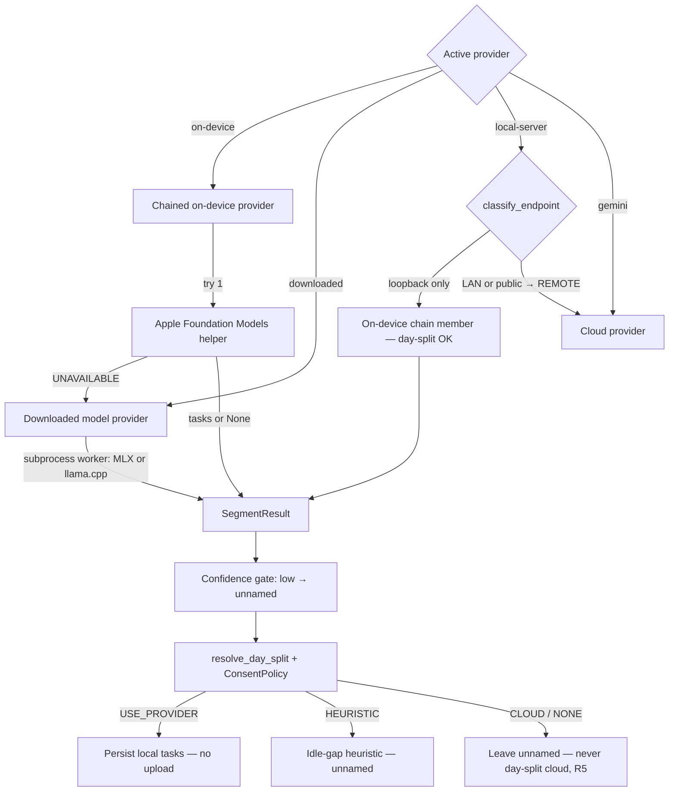
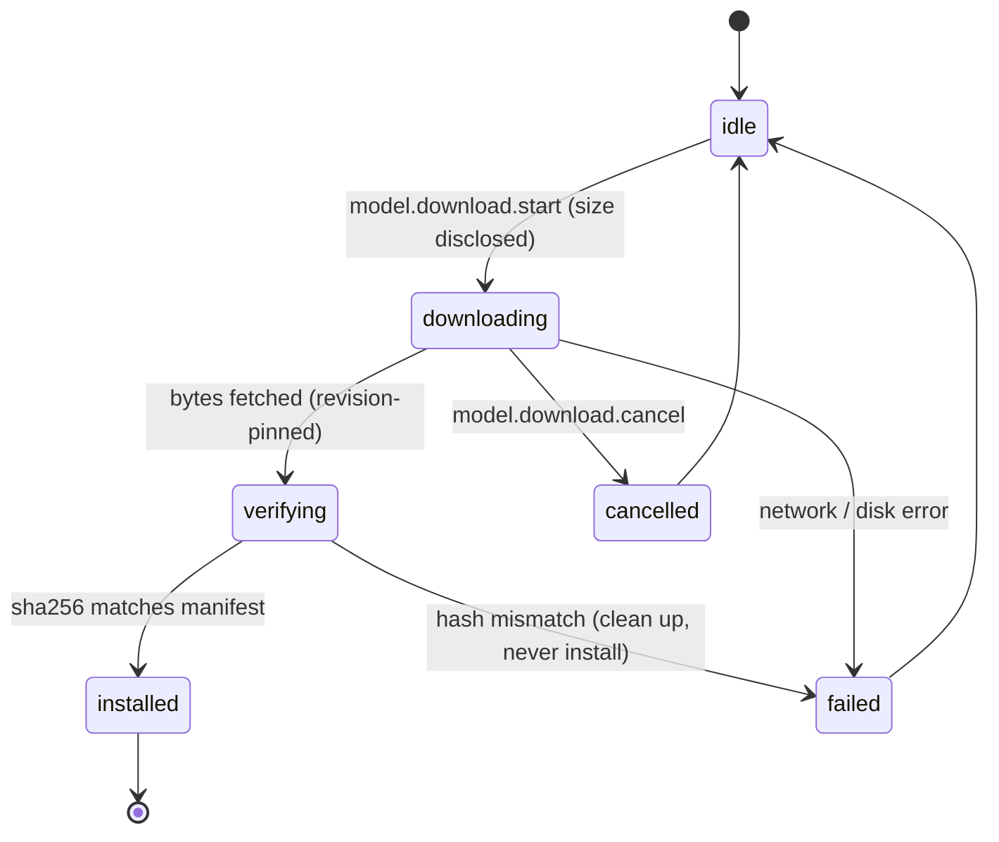

# Downloadable & Bring-Your-Own Local Models - Plan

## Goal Capsule

- **Objective:** Extend the shipped Intelligence provider with two opt-in local backends — a downloadable small model (MLX + llama.cpp) and a bring-your-own local model — so any Mac gets named tasks on-device without waiting for macOS 26 adoption.
- **Product authority:** Rute (product owner). The Product Contract below is authoritative for WHAT; this plan owns HOW.
- **Execution profile:** Deep, cross-cutting — new Python inference + model-download subsystems, a new daemon job + verbs, config/CLI, and the macOS SwiftUI app. Land units as dependency-ordered commits, grouped into phases.
- **Stop conditions:** Stop and surface if (a) bundling the inference runtimes (`mlx-lm`, `llama-cpp-python`) in the per-arch PyInstaller embedded daemon build proves infeasible within acceptable app-size growth, or (b) the MLX constrained-decoding path can't produce schema-valid JSON reliably enough for the validator to net — both change scope or push the runtime split toward llama.cpp-only.
- **Tail ownership:** The implementer runs the Verification Contract gates, the eval, and the manual Apple-Silicon + Intel evals; PR/landing strategy follows repo conventions.
- **Product Contract preservation:** Product Contract unchanged. Planning adds only HOW (backends, download job, routing, eval); it does not alter R1–R10, the flows, or the scope boundaries.

---

## Product Contract

### Summary

Two opt-in backends behind the shipped Intelligence adapter let any Mac produce named tasks on-device without macOS 26: a small model the user **downloads** (MLX on Apple Silicon, llama.cpp on Intel) and a **bring-your-own** local model (Ollama / LM Studio / OpenAI-compatible). Both inherit the existing privacy strip and per-task consent matrix. The download is offered at onboarding, lives in the Intelligence pane, and carries a standing sidebar hint; output is confidence-gated so a low-confidence result stays unnamed rather than misleading.

### Problem Frame

PR #345 made segmentation on-device by default, but the default backend — Apple Foundation Models — needs macOS 26 + Apple Intelligence. Every Mac below that (macOS 13–25, and all Intel Macs) falls back to the **unnamed idle-gap heuristic** for day-splitting. So the headline "named tasks, locally" experience is off for the majority of users until macOS 26 adoption rises over the next year or two. This closes that gap for anyone willing to opt in.

### Key Decisions

- **Additive backends, not a rebuild.** Both new backends slot behind the existing provider adapter and inherit the privacy strip, per-task consent matrix, and degradation ladder unchanged. Nothing in #345 is modified.
- **Cover every Mac that opts in.** The downloadable model runs via MLX on Apple Silicon and llama.cpp on Intel, so no supported Mac is stuck on the unnamed heuristic once the user opts in.
- **Opt-in download, never bundled.** The model downloads on user consent (size disclosed, integrity-verified), not shipped in the app — keeping the app light was the reason a bundled default was rejected.
- **Layered, low-pressure discovery.** Offered at onboarding, present as a row in the Intelligence pane, and a standing dismissible sidebar hint that enabling it enhances the experience. No per-recording interrupt.
- **Beat the heuristic, never mislead.** The bar is names users prefer over the unnamed heuristic — not Gemini parity. A low-confidence or schema-invalid result falls back to unnamed rather than showing a wrong name.
- **"Bring your own" is a local server.** A local endpoint (Ollama/LM Studio on the Mac) is treated as on-device (day-splitting allowed, nothing leaves); a remote OpenAI-compatible endpoint is treated as a cloud provider (per-task consent-gated, day-split never — R7 of the shipped matrix).

### Requirements

**Downloadable local model**

- R1. A user can opt in to download a small local model that produces named tasks on-device; the app never downloads it without consent.
- R2. The downloaded model runs locally on both Apple Silicon (MLX) and Intel (llama.cpp), so any supported Mac that opts in gets named tasks.
- R3. The download discloses its size before downloading and is integrity-verified (checksum/signature) before first use.

**Bring-your-own model**

- R4. A user can point the Intelligence provider at a local model server they run (Ollama / LM Studio / OpenAI-compatible endpoint).
- R5. A BYO local endpoint is treated as on-device (day-splitting allowed, nothing leaves the Mac); a remote endpoint is treated as a cloud provider (per-task consent-gated, day-split never).

**Discovery & offer**

- R6. The download is offered at onboarding, available as a row in the Intelligence settings pane, and surfaced as a standing, dismissible sidebar hint that enabling it enhances the experience.
- R7. The offer is opt-in and never blocks a recording; declining leaves the user on the existing heuristic / BYO / cloud paths and does not re-prompt intrusively.

**Quality & routing**

- R8. Both backends slot into the existing degradation ladder: Apple Foundation Models (macOS 26) → downloaded local model (if opted in) → idle-gap heuristic; a BYO-local endpoint is an on-device option, BYO-remote/cloud is consent-gated.
- R9. Output is confidence-gated: a low-confidence or schema-invalid result yields unnamed task boundaries (or the heuristic), never a wrong or hallucinated name.
- R10. The new backends inherit the shipped privacy strip and per-task consent matrix unchanged — masked/blocked content is stripped before any local model, and day-splitting never leaves the Mac.

### Key Flows

- F1. Opt into the downloaded model
  - **Trigger:** The user accepts the offer (onboarding, settings row, or sidebar hint).
  - **Steps:** Consent + size shown → download → integrity-verify → subsequent local recordings get named tasks on-device (MLX or llama.cpp per platform).
  - **Covers:** R1, R2, R3, R6
- F2. Bring your own local model
  - **Trigger:** The user configures a model endpoint.
  - **Steps:** A local endpoint is treated as on-device (day-split runs locally, nothing leaves); a remote endpoint is treated as a cloud provider (consent-gated, day-split refused).
  - **Covers:** R4, R5
- F3. Low-confidence result
  - **Trigger:** A local model returns a low-confidence or invalid result for a task.
  - **Steps:** Keep the task boundary but leave it unnamed; never surface a wrong name.
  - **Covers:** R9

### Acceptance Examples

- AE1. **Covers R2.** Given an Intel Mac with the downloaded model, When a local recording is segmented, Then it produces named tasks on-device (via llama.cpp) with nothing uploaded.
- AE2. **Covers R5.** Given a BYO local Ollama endpoint, When the day is split, Then it runs against the local endpoint and nothing leaves the Mac; Given a BYO *remote* endpoint, When the day would split, Then day-splitting does not use it (consent-gated).
- AE3. **Covers R9.** Given the downloaded model returns a low-confidence/invalid result for a task, When tasks are shown, Then that task is unnamed rather than showing a wrong name.
- AE4. **Covers R1, R7.** Given a user declines the download, When they record, Then they get the existing heuristic (or their configured BYO/cloud) and are not re-prompted intrusively.

### Success Criteria

- On a representative eval, the downloaded model's task names are preferred over the unnamed heuristic and are not misleading — no wrong names surface (the confidence gate holds).
- Any opted-in Mac, Apple Silicon or Intel, produces named tasks locally with nothing leaving the Mac.
- Adding a BYO model or the download is config/UX only — no change to the shipped #345 provider core.

### Scope Boundaries

**Deferred for later**

- Matching Gemini/cloud naming quality — the bar here is "beat the heuristic, never mislead."

**Outside this product's identity**

- Bundling a model in the app by default (opt-in download only).
- Any modification to the shipped #345 provider core — these backends are purely additive.
- Non-macOS platforms.

#### Deferred to Follow-Up Work

- Using the downloaded model for on-device summaries / titles / Recall-answering (beyond day-split named tasks). The chain makes this a later config flip; this plan targets the day-split/named-tasks path `run_terminal_stage` already runs.
- Logprob-calibrated confidence gating (v1 gates on the model's self-reported confidence enum; see KTD9).

### Dependencies / Assumptions

- New local-inference dependencies: MLX (`mlx-lm`, Apple Silicon) and a llama.cpp binding (`llama-cpp-python`, Intel + universal fallback), plus `huggingface_hub` for the download. Assumption: a ~3B quantized model clears the "beat the heuristic" bar with the existing validator plus the confidence gate; the eval confirms this before named output ships.
- The shipped provider adapter, privacy strip, consent matrix, degradation ladder, settings pane, and CLI (PR #345 / `docs/plans/2026-07-06-002-feat-local-first-intelligence-plan.md`) exist and are the extension points.
- BYO assumes the user runs a local OpenAI-compatible / Ollama server; local-vs-remote endpoint classification drives the privacy treatment.
- `faster-whisper` and GLiNER already download models from Hugging Face in this app, so HF-download machinery and native-wheel bundling are not unprecedented.

---

## Planning Contract

### High-Level Technical Design

Both backends are **Python providers behind the shipped `LLMProvider` registry** (`get_provider`), reusing the `PROVIDER_UNAVAILABLE`/`None`/tasks tri-state, the shared `validate_llm_tasks`, and the fail-closed `stripped=True` privacy gate. #345's provider core, consent matrix, privacy strip, and degradation resolver are extended, not modified.

Three structural moves anchor the plan:

1. **A chained on-device provider.** The terminal segmentation call site calls a single provider today. It becomes a composite that tries Apple Foundation Models, then the downloaded model, cascading only on `PROVIDER_UNAVAILABLE`. The final result flows through the unchanged `resolve_day_split`, so the consent policy's `on_device_available` boolean now reads as "any on-device backend available."
2. **A daemon-driven model download.** A `ModelDownloadJob` mirrors the content-index backfill job — `/v0/model.download.start|status|cancel` + progress events + idle-shutdown integration + a CLI group + a Swift progress controller. Download is Hugging Face, commit-SHA-pinned, sha256-verified, size-disclosed.
3. **Endpoint classification for BYO.** A `classify_endpoint` splits loopback/localhost (on-device treatment, day-split eligible) from everything else (cloud treatment, consent-gated, day-split never), keeping R5's local/remote line in one place.

**Extended provider resolution and routing:**



**Model download job lifecycle (mirrors the backfill job):**



### Key Technical Decisions

- KTD1. **Two new Python backends behind the existing registry — no core rewrite.** Both the downloaded model and the BYO local server implement the shipped `LLMProvider` Protocol and register in `get_provider()`, reusing the tri-state return, the shared validator, and the fail-closed `stripped=True` gate. Rationale: additive extension keeps every privacy and degradation guarantee from #345 intact and satisfies "config/UX only — no change to the provider core." **The `stripped=True` marker stays builder-only-writable** — no SCR-239 path hand-builds a summary dict with `stripped=True`; the chain and both new providers pass the builder-produced dict through unmodified, and a call-graph guard test (mirroring `tests/test_privacy_filter_call_graph.py`) pins the marker as writable only inside `build_activity_summary`. Widening the caller set (worker stdin, BYO provider, chain) must not let the fail-closed gate rot into fail-open.
- KTD2. **Runtime split: MLX on Apple Silicon, llama.cpp on Intel (best-per-platform).** A runtime selector picks `mlx-lm` on arm64 and `llama-cpp-python` on x86_64 (falling back to llama.cpp when MLX is unavailable). Rationale: MLX is materially faster on the majority Apple-Silicon base (tens of tok/s vs single-digit-to-low-teens on Intel CPU), and llama.cpp covers Intel where MLX has no build. Cost: **asymmetric structured-output support** — llama.cpp constrains JSON natively via GBNF / json-schema-to-grammar, but MLX has no first-party schema-constrained decoding, so the MLX path needs a bring-your-own constrained decoder (a token-acceptor logits processor) or a prompt-plus-validate-plus-retry loop, with the shared validator as the common net. Alternative (llama.cpp-only universal — one runtime, native grammar everywhere) rejected for leaving the Apple-Silicon majority on the slower path; revisit if the MLX constrained-decoder integration proves too costly (a stop condition).
- KTD3. **Inference runs in a hardened subprocess worker, not the resident daemon.** The downloaded-model provider spawns a bundled Python inference worker (stdin: the stripped summary JSON; stdout: the `{status, result}` envelope), mirroring the AFM `IntelligenceHelper` subprocess contract. Rationale: a ~2 GB model must not stay resident in the all-day daemon ("run all day, low overhead"); a per-recording subprocess frees that memory between the infrequent terminal-stage runs and isolates a model crash/OOM from the daemon. The worker runs recording-derived (attacker-influenceable) content through a model, so it hardens the on-device pattern rather than merely reusing it: (a) launched with a **minimal allowlist env** (PATH, HOME, model path, HF-offline flags) plus `HF_HUB_OFFLINE=1` / `local_files_only=True` — stronger than `OnDeviceProvider._scrubbed_env`'s substring denylist, and it can't phone home; (b) **CPU de-prioritized** (`nice`/background QoS) with a thread cap (`physical_cores − 2`) so segmentation never starves capture — critical on Intel; (c) a **phased timeout** (a load budget + a generation budget), *not* the inherited resident-AFM 120 s blanket, since this worker cold-loads ~2 GB from disk; (d) **input/output size caps** (reject an oversized stdin summary → `PROVIDER_UNAVAILABLE`; bound the stdout envelope) and a killed/OOM worker resolves to `PROVIDER_UNAVAILABLE` → heuristic with the terminal flock + ledger intact; (e) worker **stderr is not logged verbatim** (unlike the on-device 500-char echo) because it can carry recording-derived text.
- KTD4. **Model download is a daemon job modeled on the content-index backfill.** A `ModelDownloadJob` Supervisor-style task driven by `/v0/model.download.start|status|cancel`, with progress on `/v0/events`, idle-shutdown busy-predicate integration, and a `/v0/model.status` read verb for install state + size. Rationale: the backfill job is the established precedent for an opt-in, cancellable, progress-reporting long-running daemon task; it works for headless/CLI installs and keeps download+verify logic in Python. The Swift app renders progress via the existing `DaemonClient` streaming + a `ModelDownloadController` mirroring `DaemonInstallController`.
- KTD5. **Download source + integrity: Hugging Face Hub, host+commit+sha256-pinned, non-executable formats only.** `huggingface_hub.snapshot_download(revision=<commit_sha>)` from the pinned host `huggingface.co` (ignore any `HF_ENDPOINT` override for the download path) into `~/.screencap/models/`, materialized as **real files** (`local_dir_use_symlinks=False`) and verified against a release-time-recorded sha256 in a shipped model manifest (not live Hub metadata), with the disclosed size shown before download. Rationale: sha256-over-bytes proves "matches what we recorded at release," not "safe to load" — so the manifest additionally **allowlists only non-executable formats** (`safetensors` for MLX, `GGUF` for llama.cpp); `.bin`/`.pt`/`.pth`/`.pickle`/`.ckpt` and any `.py` are rejected before install, and the loader is invoked with `trust_remote_code=False` asserted (some weight formats execute code on load). The manifest is shipped in the app and inherits its signing/notarization integrity — a stronger root of trust than the download. Store hardening mirrors the `content_index.db` bar: `models/` `0o700`, files `0o600`, symlink guard before hashing, and the worker loads from the **same verified directory** (re-verify at load, or install read-only) to close the verify→load TOCTOU. A hash mismatch, an interrupted/cancelled download, or a disallowed format aborts and cleans up symlink-safe — never leaving a directory the worker's path resolver would treat as installed (fail-closed). A free-space precheck (reuse `engine/disk_policy.py`) runs before fetch and coordinates with the active recording's disk stop threshold.
- KTD6. **Model choice: a ~3B-class Apache-2.0 instruction model, pinned per runtime.** Lean: Qwen2.5-3B-Instruct (Apache-2.0) — MLX-community 4-bit for Apple Silicon, a GGUF Q4_K_M for Intel, ~2 GB each. Rationale: Apache-2.0 avoids the Llama-3.2 "Built with Llama" / NOTICE redistribution burden in the download flow, and Qwen2.5-3B / Qwen3-4B are well-covered by both quant ecosystems (Phi-4-mini, MIT, is the fallback). The exact model + pinned revision live in the model manifest and are confirmed by the eval before named output ships.
- KTD7. **Chained on-device resolution: AFM → downloaded → heuristic.** When the active provider is on-device, a `ChainedOnDeviceProvider` tries Apple Foundation Models first, then the downloaded model (if opted in + available), cascading **only on `PROVIDER_UNAVAILABLE`** (a genuine `None` stops the chain — it stays a fail-open no-tasks result, never a fall-through). The final result flows through the unchanged `resolve_day_split`; `on_device_available` becomes "any on-device backend available," and the never-cloud-for-day-split guard (R5 here; the shipped #345 rule in `consent.py`/`degrade.py`) is untouched.
- KTD8. **BYO endpoint classification is the privacy boundary — classify the resolved connection, not the URL string.** `classify_endpoint(url)` returns LOCAL only for **loopback literals**, canonicalized with `ipaddress` so `0.0.0.0`, decimal/octal/hex IP forms, IPv4-mapped IPv6 (`::ffff:127.0.0.1`), and userinfo tricks (`http://127.0.0.1@evil.com/`) are normalized before the membership test; the exact string `localhost` passes, but any **other DNS name that merely resolves to loopback is REMOTE** (resolution is TOCTOU). Everything else — private-LAN IPs, public hosts, non-`http(s)` schemes — is REMOTE; unparseable is REMOTE (fail-safe). Because a LOCAL endpoint joins the on-device chain and day-splits transcript text with **no consent prompt and no upload-seam audit**, classification is enforced again **at connect time**: redirects disabled, `localhost` pinned to `127.0.0.1`/`::1`, and the peer IP re-asserted loopback on the socket, so an endpoint that 302s or resolves off-box fails closed. The routing side is symmetric (KTD7/U8): a `local-server` endpoint is placed in the day-split provider set **only** when `classify_endpoint` returned LOCAL and the connect-time re-check passed; a REMOTE endpoint is never selected for day-split (its `segment()` is never called there — nothing is sent) and is routed only to the consent-gated cloud path. Selection, not the `on_device_available` boolean, is the guard — `resolve_day_split` uses a provider's returned tasks directly, so keeping a REMOTE endpoint out of the day-split provider set is what prevents it from day-splitting. This is the single place R5's local/remote split lives, so it cannot drift.
- KTD9. **Confidence gate v1 = the schema's self-reported confidence enum, fail-closed on absence; logprob calibration is a fast-follow.** A shared post-validate step blanks the name of any task whose `confidence` is below threshold (v1 default: `low` → unnamed, boundary kept), while schema-invalid whole results stay rejected by the existing validator (→ unnamed/heuristic). **A missing or unparseable `confidence` is treated as below threshold (fail-closed → unnamed), not the validator's `medium` default** — critical because `validate_llm_tasks` defaults an absent field to `"medium"` (above the `low` gate), and a 3B model on the MLX path (no schema-constrained decoding) omitting a required field is a common failure mode, so an omitted enum must not slip through as a named task. Rationale: the `confidence` enum is already in the schema and validator-preserved — a zero-new-inference gate that satisfies "never mislead" for v1. Logprob-aggregation gating (both runtimes expose token logprobs) is more robust but backend-specific and needs calibration; deferred behind the eval. The threshold is config-driven so the eval can tune it.
- KTD10. **Eval harness: a repeatable "beat the heuristic, never mislead" gate.** A scored eval over representative sessions (reusing the `tests/segmentation/golden_segmentation.json` fixture + the redaction-benchmark scoring precedent) compares the downloaded model against the idle-gap heuristic (and optionally Gemini), reporting a preference/quality score and a "no wrong names" check. Named output ships only when the eval clears the bar, and the eval calibrates the KTD9 threshold. Rationale: the #345 plan deferred the automated harness, but this plan's success criteria depend on it, so it is in-scope.
- KTD11. **Process-wide inference single-flight + a RAM-headroom precheck.** At most one segmentation worker runs across the daemon at a time (a process-wide semaphore / run-dir lock acquired before spawn); a second overlapping terminal stage skips segmentation fail-open (unnamed/heuristic) rather than queuing. Before that single spawn, an **available-RAM precheck** (reuse the already-sampled `metrics.virtual_memory`) skips segmentation fail-open when free memory is below a model-size-plus-margin floor — symmetric with U4's free-space precheck, because single-flight bounds concurrency to one worker but not whether the machine has room for that one 2 GB cold load. Rationale: `run_terminal_stage` is serialized only per-recording (a per-name flock), and terminal stages run in independent worker threads — two recordings stopping close together (or a restart-resume sweep) would otherwise spawn two ~2 GB workers concurrent with capture and thrash an 8 GB Mac, and even one spawn on a loaded 8 GB Mac (capture buffers + writer processes + WAL) can swap and degrade capture, both breaking "run all day." Skip-not-queue avoids merely deferring the memory spike.
- KTD12. **Model-generated task names are untrusted content.** Names derive from screen/transcript content (attacker-influenceable) and are surfaced via `/v0/tasks.list` + the MCP surface to downstream agents, so they are length-capped, control-character/markup-stripped, and shape-bounded (max tasks, max name length, max nesting) before persistence — independent of the confidence gate, which addresses *low* confidence, not adversarial-but-confident output (a successful prompt injection yields a high-confidence wrong name the enum gate passes through). The sanitizer applies on **every** provider that surfaces model-generated names — the downloaded model (U2) **and** the BYO local server (U7) — since both feed the same sink; a future refactor should consider enforcing it at the single persistence/`tasks.list` seam so no new provider can bypass it.

### Assumptions

- `mlx-lm` / `llama-cpp-python` / `huggingface_hub` can be bundled in the per-arch PyInstaller embedded daemon build within acceptable app-size growth — the daemon is built per host arch (each build ships only its own runtime: MLX on arm64, llama.cpp on x86_64), and the model *weights* (multi-GB) are the opt-in download, not the runtime libraries. (Bundle-vs-fetch of the runtime libraries is an Open Question.)
- A ~3B 4-bit model + the shared validator + the confidence gate clears the "beat the heuristic" bar — confirmed by the eval before named output ships.
- The BYO user runs an OpenAI-compatible or Ollama server; the loopback-only "local" definition matches user expectation for "nothing leaves the Mac."
- Intel-Mac CPU throughput (single-digit-to-low-teens tok/s) is acceptable for the once-per-recording terminal-stage cadence; validated on real Intel hardware before default-enabling.

### Sequencing

U1 (runtime + deps) unblocks the downloaded provider (U2), which unblocks the confidence gate (U3) and routing (U8). The download engine (U4) → daemon job (U5) → CLI (U6) chain runs in parallel with the BYO provider + classifier (U7). Routing (U8) needs U2 + U7. Surfaces follow the contracts they call: CLI settings (U9) after U8; Swift settings + download UI (U10) after U5/U9; onboarding + sidebar (U11) after U10. The eval (U12) needs U2 + U3 and gates enabling named output by default.

### System-Wide Impact

- **Privacy boundary:** a new on-device consumer (the downloaded model, in a subprocess) reads recording-derived content; it inherits the fail-closed `stripped=True` gate, so an unmarked summary never reaches it. The local tasks store stays local-only (upload-excluded). The BYO **endpoint classifier is a new privacy boundary** — it decides whether transcript text goes to a "trusted local" server silently or a "cloud" server consent-gated, so it's hardened at both config and connect time (KTD8). Model-generated task names are now surfaced through `/v0/tasks.list` and the MCP surface to downstream agents; because they derive from screen content they are treated as untrusted output (KTD12) and the pointer-only/sanitization bar there covers them.
- **Packaging / app size:** bundling the inference runtimes grows the embedded daemon; the model weights do not (opt-in download). Native-wheel bundling across universal2 (MLX is arm64-only; `llama-cpp-python` builds per arch) is a real build-system concern.
- **Daemon + CLI surface:** new `/v0/model.*` verbs and new `[intelligence]` config keys / provider values become stable contracts the Swift app and CLI depend on.
- **"Run all day" overhead:** inference is subprocess-isolated and per-recording; the resident daemon never holds the model.

---

## Output Structure

```text
src/screencap/
  segmentation/
    endpoint.py                       # classify_endpoint (U7)
    confidence_gate.py                # apply_confidence_gate (U3)
    local_model/
      __init__.py
      runtime.py                      # arch detection + MLX/llama.cpp adapters (U1)
      worker.py                       # subprocess inference entry point (U2)
    providers/
      downloaded.py                   # downloaded-model LLMProvider (U2)
      local_server.py                 # BYO OpenAI-compatible/Ollama backend (U7)
      chained.py                      # ChainedOnDeviceProvider (U8)
  models/
    __init__.py
    registry.py                       # shipped model manifest: repo, SHA, sha256, size (U4)
    download.py                       # snapshot_download + verify into ~/.screencap/models/ (U4)
  daemon/
    model_download_job.py             # ModelDownloadJob (U5)
benchmarks/
  benchmark_segmentation.py           # eval harness (U12)
macos/Screencap/Controllers/
  ModelDownloadController.swift        # download state machine (U10)
```

Per-unit `Files:` sections remain authoritative; the tree is a scope declaration, not a constraint.

---

## Risks & Dependencies

Ranked by severity. Each risk names its mitigation and where the mitigation lands.

| Risk | Severity | Mitigation (plan location) |
|---|---|---|
| A REMOTE endpoint reached through a LOCAL-classified URL (DNS resolves-to-loopback, 302 redirect, IP-encoding trick) silently day-splits transcript text off the Mac with no consent | Critical | Loopback-literals-only classification (ipaddress-canonicalized), REMOTE for any resolving DNS name, connect-time re-check (redirects off, peer-IP re-assert, pinned `localhost`), consent-side symmetric guard, adversarial-encoding test set as an acceptance gate (KTD8, U7, U8, DoD) |
| The `stripped=True` privacy gate rots to fail-open as the caller set widens (worker stdin, BYO provider, chain) | Critical | Marker stays builder-only-writable (provider-gated before spawn; the worker-side check is defense-in-depth, not a trust boundary); call-graph guard test; tamper-detection test on a mutated-after-strip summary (KTD1, U2, U7, U8) |
| A verified-but-malicious or executable-on-load model owns the worker (pickle weights, `trust_remote_code`, repo compromise at the pinned commit) | High | Non-executable-format allowlist (safetensors/GGUF), reject `.bin`/`.pt`/`.pickle`/`.ckpt`/`.py`, `trust_remote_code=False` asserted, host+commit+sha256 pin, manifest provenance via app signing (KTD5, U4) |
| Model-store tampering / verify→load TOCTOU / symlink swap in `~/.screencap/models/` | High | `0o700`/`0o600` + symlink guard + `local_dir_use_symlinks=False`; worker loads from the verified read-only dir / re-verifies at load; symlink-safe cleanup leaves nothing loadable (KTD5, U4) |
| Secrets leak into the inference worker (denylist env misses a future var; token/key files persist on disk) or into logs (worker stderr, BYO URL userinfo) | High | Minimal allowlist env + `HF_HUB_OFFLINE=1`; worker stderr not logged verbatim; BYO URL userinfo/query redacted in logs and `--json` (KTD3, U2, U7/U9) |
| Prompt injection from screen content yields a confident wrong/malicious task name surfaced to `tasks.list`/MCP | High | Model output treated as untrusted: sanitize + shape-bound before persistence on **both** local-model paths (downloaded + BYO), independent of the confidence gate; eval reports wrong-name rate *at threshold* on real output including field-omission cases (KTD12, U2/U3/U7, U12) |
| Overlapping terminal stages spawn two ~2 GB workers, or even one worker on a loaded 8 GB Mac, concurrent with capture → memory thrash | High | Process-wide inference single-flight (skip-not-queue) + a RAM-headroom precheck before the single spawn (KTD11, U8) |
| Intel "run all day": tens of seconds of pegged CPU per segmentation → thermal throttle (which throttles capture) + battery drain | High | CPU de-prioritization + thread cap + hard generation budget → heuristic fallback; skip while actively capturing / on battery (decision); measurable system-impact acceptance gate before default-on (KTD3, U1/U2, Verification Contract) |
| Cold model-load (~2 GB from disk) dominates per-recording cost; the inherited resident-AFM 120 s timeout is the wrong shape | Medium | Phased load+generation budget; cold-vs-warm benchmark; per-recording spawn stated as a decision with a warm-worker revisit trigger (KTD3, U2, U12) |
| Bundling `mlx-lm` + `llama-cpp-python` native libs erodes "keep the app light" | Medium | Falsifiable bundle-size ceiling measured in U1 (per-arch PyInstaller smoke) gating later units; fetch-runtime-on-opt-in as the fallback; a stop condition (Goal Capsule, U1) |
| A ~2 GB download starves/interrupts an active recording's disk, or floods `/v0/events` | Medium | Free-space precheck (reuse `DiskPolicy`), resumable download, interrupted download never marks installed, coordinate with the recording disk stop threshold, throttle progress events (≤2/s or ≥1% delta) (U4, U5) |
| MLX has no first-party schema-constrained decoding | Medium | Shared validator + retry as the net; llama.cpp native-grammar path as the fallback proof; a stop condition if MLX can't produce schema-valid JSON reliably (KTD2, U1/U2) |

**Dependencies:** `mlx-lm` (arm64 only), `llama-cpp-python` (both arches, native build), `huggingface_hub`; the shipped #345 seams (`provider.py`, `consent.py`, `degrade.py`, `terminal_stage.py`, `activity_summary.py`); a user-run OpenAI-compatible / Ollama server for BYO. The BYO provider makes daemon-originated outbound requests to a user-supplied URL by design — scoped as same-EUID-accepted and documented in `SECURITY.md`. The BYO endpoint URL is persisted to `config.toml`, which inherits the existing `0o600` config-file perms (a remote URL could carry credentials in userinfo/query — already redacted in logs and `--json` per U7/U9).

---

## Implementation Units

**Unit Index**

| U-ID | Title | Key files | Depends on |
|---|---|---|---|
| U1 | Inference runtime abstraction + optional deps | `src/screencap/segmentation/local_model/runtime.py`, `pyproject.toml` | — |
| U2 | Downloaded-model provider + subprocess inference worker | `src/screencap/segmentation/providers/downloaded.py`, `local_model/worker.py`, `provider.py` | U1 |
| U3 | Confidence gate | `src/screencap/segmentation/confidence_gate.py`, `config.py` | U2 |
| U4 | Model download + integrity engine | `src/screencap/models/registry.py`, `models/download.py`, `config.py` | — |
| U5 | Daemon model-download job + verbs | `src/screencap/daemon/model_download_job.py`, `daemon/app.py`, `daemon/schema.py` | U4 |
| U6 | `screencap model` CLI group | `src/screencap/cli/` | U5 |
| U7 | BYO local-server provider + endpoint classifier | `src/screencap/segmentation/providers/local_server.py`, `segmentation/endpoint.py`, `provider.py` | — |
| U8 | Chained on-device resolution + consent/endpoint routing | `src/screencap/segmentation/providers/chained.py`, `terminal_stage.py`, `consent.py`, `config.py` | U2, U7 |
| U9 | `settings intelligence` CLI extension | `src/screencap/cli/`, `config.py` | U8 |
| U10 | Intelligence settings pane — model options + download (Swift) | `macos/Screencap/Views/Settings/IntelligenceSettingsView.swift`, `Controllers/ModelDownloadController.swift` | U5, U9 |
| U11 | Onboarding offer + sidebar hint (Swift) | `macos/Screencap/Views/Onboarding/`, `Views/Shell/ShellSidebar.swift` | U10 |
| U12 | Eval harness (beat-the-heuristic gate) | `benchmarks/benchmark_segmentation.py`, `tests/segmentation/` | U2, U3 |

### U1. Inference runtime abstraction + optional deps

- **Goal:** Provide one runtime abstraction that selects MLX on Apple Silicon and llama.cpp on Intel and exposes a single constrained-generation call, plus the packaging for the new optional dependencies.
- **Requirements:** R2
- **Dependencies:** none
- **Files:** create `src/screencap/segmentation/local_model/__init__.py`, `src/screencap/segmentation/local_model/runtime.py`; modify `pyproject.toml` (optional extras for `mlx-lm`, `llama-cpp-python`, `huggingface_hub`); create `tests/segmentation/local_model/test_runtime.py`, `tests/segmentation/local_model/__init__.py`.
- **Approach:** `select_runtime() -> "mlx" | "llamacpp"` from `platform.machine()` — arm64 → `mlx` when `mlx_lm` imports, else `llamacpp`; x86_64 → `llamacpp`. Each runtime adapter exposes a narrow `generate(model_path, prompt, response_schema) -> dict | None`: the llama.cpp adapter converts `_RESPONSE_SCHEMA` to a GBNF grammar (native constrained decode); the MLX adapter applies a token-acceptor logits processor or a prompt-plus-validate-plus-retry loop (no first-party schema decode in `mlx-lm`). Heavy imports are lazy inside the adapters so importing this module stays light. The runtime libraries are bundled in the embedded daemon (see Open Questions for bundle-vs-fetch).
- **Execution note:** Mostly packaging/runtime wiring — prefer install/runtime smoke verification (load a tiny model, generate one JSON object per runtime available on the build host) over unit coverage; the end-to-end JSON-shape guarantee is proven in U2/U12. **Measure the bundle-size ceiling first** (a per-arch PyInstaller smoke build) so the "keep the app light" stop condition can trip before U2–U12 build on the MLX+llama.cpp assumption.
- **Patterns to follow:** the lazy-import discipline in `src/screencap/segmentation/providers/gemini.py` and `ondevice.py`; the `[record]` optional-extra shape in `pyproject.toml`; `src/screencap/transcription.py` HF-cache handling as a native-model precedent.
- **Test scenarios:**
  - `select_runtime` resolves arm64 → `mlx`, x86_64 → `llamacpp`, and falls back to `llamacpp` when the `mlx_lm` import fails (monkeypatched import).
  - The adapter interface returns a dict on a mocked backend response and `None` on a mocked backend error, without a real model in CI.
  - The llama.cpp adapter produces a GBNF grammar from `_RESPONSE_SCHEMA` without raising (grammar-build only; no generation).
  - Test expectation: none for the packaging change itself — its gate is the bundle-size measurement below, not a unit test.
- **Verification:** `PYTHONPATH=src pytest tests/segmentation/local_model/test_runtime.py` green; a runtime smoke generation succeeds on at least one runtime available on the build host; the embedded-daemon size growth from the runtime libs is under the agreed ceiling (else the stop condition fires → llama.cpp-only universal, or fetch-runtime-on-opt-in).

### U2. Downloaded-model provider + subprocess inference worker

- **Goal:** Implement the downloaded-model backend as an `LLMProvider` that spawns a bundled Python inference worker and returns the tri-state result, with the fail-closed privacy gate.
- **Requirements:** R2, R10
- **Dependencies:** U1
- **Files:** create `src/screencap/segmentation/providers/downloaded.py`, `src/screencap/segmentation/local_model/worker.py`; modify `src/screencap/segmentation/provider.py` (register `"downloaded"` in `get_provider`); create `tests/segmentation/test_downloaded_provider.py`.
- **Approach:** Mirror `OnDeviceProvider`, then harden per KTD3: refuse any summary not marked `stripped=True` before spawning (return `PROVIDER_UNAVAILABLE`, no worker), then spawn the worker with the resolved model path under a **minimal allowlist env** (PATH, HOME, model path, `HF_HUB_OFFLINE=1`/`local_files_only`), CPU de-prioritized (`nice`/background QoS + a `physical_cores − 2` thread cap), a **stdin summary size cap**, and a **phased timeout** (load budget + generation budget, not the resident-AFM 120 s blanket); parse the size-bounded `{status, result}` envelope; run `result` through `validate_llm_tasks` and then the KTD12 untrusted-output sanitizer (length/markup/shape bounds). The worker (`python -m screencap.segmentation.local_model.worker`, or the bundled entry point) reads the stripped summary JSON on stdin, loads the model via the U1 runtime, does constrained generation, and prints the envelope; it reports `unavailable` when the model files are missing or the runtime import fails. A killed/OOM/timed-out worker resolves to `PROVIDER_UNAVAILABLE` → heuristic with the terminal flock + ledger intact. Return contract identical to on-device: tasks dict / `None` / `PROVIDER_UNAVAILABLE`.
- **Execution note:** The real model cannot run in CI — test the Python side against a fake worker (env-injected path, like the on-device fake helper); real-model behavior is covered by U12. Privacy-bearing (the strip gate + env/output hardening) — mark those tests `@pytest.mark.privacy` and keep them Vision-free.
- **Patterns to follow:** `src/screencap/segmentation/providers/ondevice.py` (envelope parse, timeout, fail-closed `stripped` gate, `PROVIDER_UNAVAILABLE` returns) — but **diverge** from its `_scrubbed_env` denylist (use an allowlist) and its 500-char stderr echo (do not log worker stderr verbatim); `validate_llm_tasks` reuse.
- **Test scenarios:**
  - Fake worker returning valid task JSON → provider returns validated tasks.
  - Missing model / worker import error / timeout (load-phase and generation-phase) / non-zero exit / killed mid-run → `PROVIDER_UNAVAILABLE` (distinct from empty tasks); terminal completes and the ledger is intact.
  - A summary with `stripped` absent/false is refused → `PROVIDER_UNAVAILABLE`, worker not spawned; a summary whose content was mutated after stripping is also refused (tamper detection).
  - The worker env contains **none** of the daemon's secret env vars and no vars outside the allowlist (positive allowlist assertion); the worker attempts no network (`HF_HUB_OFFLINE`).
  - An oversized stdin summary is rejected before spawn; an oversized stdout envelope is bounded — no OOM.
  - A summary whose transcript embeds a prompt injection yields a sanitized, shape-bounded task name (or an unnamed boundary), never raw injected text propagated to `tasks.json`.
  - Malformed worker output → validator repairs or the provider returns `None` without crashing.
  - `Covers AE1.` End-to-end with a fake worker yields named tasks and no upload seam is invoked.
- **Verification:** `PYTHONPATH=src pytest tests/segmentation/test_downloaded_provider.py -m privacy` and the full file green with the fake worker.

### U3. Confidence gate

- **Goal:** Guarantee "never mislead" by dropping the name of any low-confidence task while keeping its boundary, backend-agnostically.
- **Requirements:** R9
- **Dependencies:** U2
- **Files:** create `src/screencap/segmentation/confidence_gate.py`; modify `src/screencap/config.py` (`get_confidence_gate_threshold`); apply the gate at the local-model provider output / terminal call site; create `tests/segmentation/test_confidence_gate.py`.
- **Approach:** `apply_confidence_gate(tasks_dict, threshold) -> tasks_dict` — for each task whose `confidence` rank is below `threshold`, **or whose `confidence` is missing/unparseable** (fail-closed, not the validator's `medium` default), keep `start_ts`/`end_ts` but clear the name (render an unnamed boundary) rather than dropping the task. Schema-invalid whole results are already rejected upstream by `validate_llm_tasks` (→ `None` → heuristic/unnamed). The gate is applied to the local-model backend output — both the downloaded model (U2) and the BYO local server (U7), the two weakest links; the threshold is config-driven (default `low`) and calibrated by U12. Whole-session vs per-task: per-task, matching F3.
- **Execution note:** "Never mislead"-bearing — mark tests `@pytest.mark.privacy`-adjacent per the CI lane convention and keep them Vision-free.
- **Patterns to follow:** the `confidence` field handling in `src/screencap/segmentation/validate.py` (per-task `confidence`, default `"medium"`); config env > toml > default getters in `config.py`.
- **Test scenarios:**
  - `Covers AE3.` A `low`-confidence task keeps its boundary but has an empty/placeholder name; a `high`-confidence task is unchanged.
  - `Covers AE3.` A task with a **missing or unparseable** `confidence` is treated as below threshold (unnamed) — not the validator's `medium` default (fail-closed).
  - An all-`low` result yields all-unnamed boundaries (tasks kept, not dropped).
  - A threshold override (e.g. gate at `medium`) changes which tasks are blanked.
  - An already-`None` (rejected) result passes through untouched.
- **Verification:** `PYTHONPATH=src pytest tests/segmentation/test_confidence_gate.py` green.

### U4. Model download + integrity engine

- **Goal:** Download a manifest-pinned model from Hugging Face into a local models dir and verify its integrity before marking it installed, exposing size up front.
- **Requirements:** R1, R3
- **Dependencies:** none
- **Files:** create `src/screencap/models/__init__.py`, `src/screencap/models/registry.py`, `src/screencap/models/download.py`; modify `src/screencap/config.py` (`get_models_dir` → `~/.screencap/models/`), `SECURITY.md` (a "Downloaded model store" subsection); create `tests/models/test_download.py`, `tests/models/__init__.py`.
- **Approach:** `registry.py` holds the shipped manifest — for each supported model: id, HF repo, pinned commit SHA, per-file sha256, disclosed byte size, target runtime, and the allowed non-executable format (`safetensors`/`GGUF`). `download_model(model_id, *, progress_cb, stop_event)` runs a **free-space precheck** (reuse `engine/disk_policy.py`; require ≈ manifest size × 2.2 for HF's cache-then-move), then `snapshot_download(repo, revision=<sha>, local_dir_use_symlinks=False)` from the pinned host `huggingface.co` (ignore any `HF_ENDPOINT` override) into a `0o700` models dir, **rejects any file whose format is not on the allowlist** (`.bin`/`.pt`/`.pickle`/`.ckpt`/`.py` refused), verifies each file's sha256 against the manifest with a symlink guard before hashing, sets files `0o600`, then atomically marks installed. Fail-closed: a hash mismatch, a disallowed format, an interrupted/cancelled download, or insufficient disk aborts and cleans up **symlink-safe**, leaving no directory the worker's path resolver would treat as installed. Size is read from the manifest for pre-download disclosure. `progress_cb` / `stop_event` mirror the backfill engine so U5 can drive it.
- **Execution note:** No network in CI — test against a fake HF fetch (inject a local fixture dir + a manifest with a known sha256); the real download is exercised manually. Privacy/integrity-bearing — mark the format-allowlist and TOCTOU tests `@pytest.mark.privacy`.
- **Patterns to follow:** `src/screencap/backfill/engine.py` (`run_backfill` stop_event/progress_cb contract); `src/screencap/engine/disk_policy.py` (`preflight` free-space precheck); the `content_index.db` `0o600`/`0o700` + symlink-guard hardening bar in `SECURITY.md`; `config.py` `get_downloads_dir` / `get_base_dir` for the dir helper shape.
- **Test scenarios:**
  - A manifest entry with a matching allowed-format fixture file verifies and marks installed.
  - A sha256 mismatch, a `.bin`/`.py` file in the snapshot, or an interrupted download aborts, cleans up symlink-safe, and leaves the model **not** installed and **not** resolvable by the worker's path lookup (fail-closed).
  - A file swapped between verify and load is detected/refused (verify→load TOCTOU closed).
  - A download on a disk with `< required` free space fails before fetching, with a clear "need N GB free" message; an interrupted download resumes from the partial.
  - `models/` is `0o700` and installed files `0o600`; hashing refuses to follow a symlink.
  - The disclosed size equals the manifest size before any bytes are fetched; re-downloading an installed model is idempotent.
- **Verification:** `PYTHONPATH=src pytest tests/models/test_download.py -m privacy` and the full file green.

### U5. Daemon model-download job + verbs

- **Goal:** Drive the download engine as one Supervisor-style daemon job with start/status/cancel verbs, progress events, and an install-state read verb.
- **Requirements:** R1, R3
- **Dependencies:** U4
- **Files:** create `src/screencap/daemon/model_download_job.py`; modify `src/screencap/daemon/app.py` (`/v0/model.download.start|status|cancel`, `/v0/model.status`), `src/screencap/daemon/schema.py` (request/response models + envelope), and the idle-shutdown busy predicate; create `tests/daemon/test_model_download_job.py`.
- **Approach:** A single `ModelDownloadJob` on `app.state` mirroring `BackfillJob` — idempotent `start` (a second start while in flight returns the in-flight snapshot), `cancel` via a `threading.Event`, blocking work via `asyncio.to_thread`, progress bridged onto the event loop with `run_coroutine_threadsafe` (`model.download.progress` + terminal `completed`/`failed`/`cancelled` events). Progress is **throttled** (coalesce the raw HF byte callback to ≤ ~2/sec or ≥ 1% delta) so a 2 GB download can't flood `/v0/events` and compete with capture-critical events. `/v0/model.status` reports installed models + sizes for the Swift UI. The job feeds the idle-shutdown busy predicate so the daemon never idle-exits mid-download. Progress payloads carry bytes/percent + state only — no path, no URL, no recording context (the recording-name-free progress discipline, cf. the backfill job).
- **Patterns to follow:** `src/screencap/daemon/backfill_job.py` (the whole job shape), `src/screencap/daemon/app.py:1602-1690` (`backfill_start/status/cancel` handlers + route registration), the `schema.envelope` + Pydantic-validate pattern.
- **Test scenarios:**
  - `start` → progress events → a `completed` terminal event; the install-state read verb then reports the model installed.
  - A second `start` while a download is in flight returns the in-flight snapshot (idempotent, one job).
  - `cancel` sets the stop flag and the run converges to `cancelled`.
  - The job keeps the daemon alive (busy predicate true) while running and releases it after terminal.
  - A download engine error surfaces as a `failed` terminal state, daemon stays up.
  - N raw HF progress callbacks produce ≤ K emitted events (throttle holds); a progress payload carries no path/URL/recording context (recording-name-free).
- **Verification:** `PYTHONPATH=src pytest tests/daemon/test_model_download_job.py` green.

### U6. `screencap model` CLI group

- **Goal:** Provide a CLI surface for the download job that the app and headless users can drive.
- **Requirements:** R1, R3
- **Dependencies:** U5
- **Files:** create the `model` command group under `src/screencap/cli/` (`download`, `status`, `cancel`, `--json`); create `tests/test_cli_model.py`.
- **Approach:** Mirror the `backfill` CLI group — thin HTTP clients of the `/v0/model.*` verbs over the UNIX socket (auto-spawn the daemon like other live-state commands), rich-formatted output, `--json` read-back for scripting and the app. `model status` shows install state + disclosed size; `model download <id>` starts the job; `model cancel` cancels.
- **Patterns to follow:** the `backfill start|status|cancel` CLI group; the daemon auto-spawn + HTTP-client pattern in `src/screencap/cli/`; all output via `rich.console.Console`.
- **Test scenarios:**
  - `model status --json` round-trips install state from a fake daemon response.
  - `model download <id>` issues the start verb; `model cancel` issues cancel.
  - An unknown model id errors cleanly (non-zero exit, rich message).
- **Verification:** `PYTHONPATH=src pytest tests/test_cli_model.py` green.

### U7. BYO local-server provider + endpoint classifier

- **Goal:** Implement the bring-your-own backend as an OpenAI-compatible/Ollama HTTP provider, and the loopback-only endpoint classifier that decides its privacy treatment.
- **Requirements:** R4, R5
- **Dependencies:** none
- **Files:** create `src/screencap/segmentation/providers/local_server.py`, `src/screencap/segmentation/endpoint.py`; modify `src/screencap/segmentation/provider.py` (register `"local-server"`); create `tests/segmentation/test_local_server_provider.py`, `tests/segmentation/test_endpoint_classify.py`.
- **Approach:** `classify_endpoint(url) -> LOCAL | REMOTE` (per KTD8): LOCAL only for **loopback literals**, canonicalized with `ipaddress` (so `0.0.0.0`, decimal/octal/hex forms, IPv4-mapped IPv6, and userinfo are normalized before the membership test) plus the exact string `localhost`; any other DNS name — even one that resolves to loopback — is REMOTE (TOCTOU); non-`http(s)` schemes, private-LAN IPs, public hosts, and unparseable URLs are REMOTE (fail-safe). The provider posts the segmentation prompt to the endpoint (`/v1/chat/completions` or the Ollama API) with **redirects disabled**, `localhost` pinned to `127.0.0.1`/`::1`, the **peer IP re-asserted loopback at connect** for a LOCAL endpoint — so a 302 or an off-box resolution fails closed rather than delivering the summary — and a **response-body size cap** (analogous to U2's stdout envelope bound, so a hostile local server can't drive daemon memory pressure); it then runs the response through the shared validator, the **KTD12 untrusted-output sanitizer, and the U3 confidence gate** — the same net U2 applies, because a BYO server's output reaches the same `tasks.list`/MCP sink and is equally attacker-influenceable. It keeps the fail-closed `stripped=True` gate and the tri-state return. The classifier is pure and import-light so the consent path (U8) and the CLI (U9) call the same code.
- **Execution note:** Privacy-boundary-bearing — mark the classifier + connect-time tests `@pytest.mark.privacy`; the adversarial set below is an acceptance gate.
- **Patterns to follow:** `src/screencap/segmentation/providers/gemini.py` (injectable `raw_call`, lazy import, validator reuse, never-raise-on-API-failure → `None`); the fail-closed `stripped` gate in `ondevice.py`.
- **Test scenarios:**
  - `Covers AE2.` `http://127.0.0.1:11434`, `http://[::1]:1234`, and `http://localhost:1234` classify LOCAL; a `192.168.x` LAN IP and a public URL classify REMOTE.
  - Adversarial set — **every one classifies/refuses REMOTE**: `localhost.evil.com`, `127.0.0.1.evil.com`, `0.0.0.0`, `2130706433`, `0x7f000001`, `::ffff:8.8.8.8`, `[::ffff:127.0.0.1]`, `http://127.0.0.1@evil.com/`, and a `file://`/`unix://` scheme.
  - A LOCAL-classified endpoint that returns a 302 to a public host, or whose `localhost` resolves off-box, is refused at connect (no summary sent).
  - The provider returns validated tasks on a mocked local-server JSON response and `None` on an HTTP error (never raises); a summary not marked `stripped=True` is refused.
  - An injected / oversized / markup-bearing name in a mocked local-server response is sanitized (KTD12) and confidence-gated before reaching `tasks.json` — parity with U2; an oversized response body is bounded (no OOM).
- **Verification:** `PYTHONPATH=src pytest tests/segmentation/test_local_server_provider.py tests/segmentation/test_endpoint_classify.py -m privacy` and the full files green.

### U8. Chained on-device resolution + consent/endpoint routing

- **Goal:** Wire the AFM → downloaded → heuristic chain and route BYO endpoints by classification, without changing the consent policy's day-split guarantees.
- **Requirements:** R5, R8, R10
- **Dependencies:** U2, U7
- **Files:** create `src/screencap/segmentation/providers/chained.py`; modify `src/screencap/terminal_stage.py` (build the active provider + wire the chain into the existing `resolve_day_split` call), `src/screencap/segmentation/consent.py` (BYO-remote resolves via the cloud path; BYO-local is on-device), `src/screencap/config.py` (`_VALID_LLM_PROVIDERS` += `downloaded`, `local-server`; BYO endpoint getter; downloaded-model opt-in/selection getter); create `tests/segmentation/test_chained_provider.py`; modify `tests/segmentation/test_consent.py`.
- **Approach:** `ChainedOnDeviceProvider(backends)` implements `segment` by trying each backend in order, cascading **only on `PROVIDER_UNAVAILABLE`**; a `None` stops the chain (fail-open, no fall-through). The terminal call site builds the active provider from config: `on-device` → the chain (AFM, plus the downloaded provider when opted in); `downloaded` → the downloaded provider directly; `local-server` → the BYO provider, with `classify_endpoint` deciding whether it joins the on-device chain (LOCAL) or is treated as cloud (REMOTE). The final `SegmentResult` flows through the **unchanged** `resolve_day_split`; `on_device_available` now means "any on-device backend available." Two guards are added: (a) a **process-wide inference single-flight** (KTD11) acquired before spawning any downloaded-model worker — a second overlapping terminal stage skips segmentation fail-open rather than spawning a second ~2 GB worker; (b) a **provider-selection guard for day-split** — the terminal day-split path builds its provider set from on-device-class backends only (AFM, downloaded, and a LOCAL-classified BYO endpoint); a REMOTE-classified BYO endpoint is **never placed in the day-split provider set**, so its `segment()` is never called for day-split (nothing is ever sent to it) and it is routed only to the consent-gated cloud path, which the day-split flow never invokes. This is the real guard, not `on_device_available`: in the shipped `degrade.py`, `resolve_day_split` returns `USE_PROVIDER` as soon as a provider returns a tasks dict and only consults `on_device_available` on `PROVIDER_UNAVAILABLE` — so selection, plus the connect-time classifier, is what keeps a REMOTE endpoint out of day-split. The shipped never-cloud-for-day-split guard (R5 here; #345's rule) is preserved — a REMOTE BYO endpoint can never day-split.
- **Execution note:** Privacy-bearing routing — mark the R5/R10 tests `@pytest.mark.privacy` and keep them Vision-free (CI privacy lane).
- **Patterns to follow:** `src/screencap/segmentation/degrade.py` (`resolve_day_split` + the never-cloud assertion), `consent.py` (`ConsentPolicy.resolve`, the fixed guards), `terminal_stage.py:_segment_local_tasks` (the provider-call site).
- **Test scenarios:**
  - `Covers AE1.` Chain with AFM unavailable + downloaded available → the downloaded tasks are used and persisted, no upload.
  - `Covers AE4.` Chain with both AFM and downloaded unavailable → `resolve_day_split` yields the idle-gap heuristic (no cloud, no upload).
  - AFM returns `None` (ran, declined) → the chain stops; the downloaded model is **not** tried (fail-open).
  - `Covers AE2.` A REMOTE BYO endpoint is never placed in the day-split provider set — its `segment()` is never called for day-split (nothing sent), and day-split resolves to heuristic/none, never cloud (R5 guard holds); a LOCAL BYO endpoint day-splits locally as an on-device chain member.
  - Two concurrent `_run_local_segmentation` calls spawn only one downloaded-model worker; the second falls back to unnamed/heuristic (single-flight, skip-not-queue).
  - With free memory below the model-size-plus-margin floor, segmentation skips fail-open to the heuristic without spawning the worker (RAM-headroom precheck).
  - Provider-name validation accepts `downloaded` and `local-server`; a `local-server` selection without an endpoint is rejected.
- **Verification:** `PYTHONPATH=src pytest tests/segmentation/test_chained_provider.py tests/segmentation/test_consent.py -m privacy` green; the never-upload assertion and the single-flight assertion hold across the chain.

### U9. `settings intelligence` CLI extension

- **Goal:** Extend the settings CLI so the app and users can select the new providers, set a BYO endpoint, and read back install state + classification.
- **Requirements:** R4, R5, R6
- **Dependencies:** U8
- **Files:** modify the `settings intelligence` command + `_build_intelligence_settings_block` under `src/screencap/cli/`, and `src/screencap/config.py` (`set_intelligence_*` for the new keys); modify `tests/test_cli_settings_intelligence.py`.
- **Approach:** Extend the provider row to accept `downloaded` and `local-server`; add a BYO endpoint key (URL, persisted to `[intelligence]`) and a downloaded-model selection key. Validate on write: a `local-server` provider requires an endpoint; reject setting a REMOTE endpoint as the day-split provider (defense in depth over U8's routing). `--json` read-back adds the new fields plus the resolved LOCAL/REMOTE classification and the downloaded-model install state (from `/v0/model.status`).
- **Patterns to follow:** the existing `settings intelligence` verb (`_build_intelligence_settings_block`, `--json` read-back, the day-split/frames rejection), `config.set_intelligence_*` writers with the advisory-flock config layer.
- **Test scenarios:**
  - Setting `provider=downloaded` and `provider=local-server` round-trips via `--json`.
  - Setting a BYO endpoint persists and reads back with its LOCAL/REMOTE classification.
  - A REMOTE endpoint set as the day-split provider is rejected with a clear message; a `local-server` provider with no endpoint, or a non-`http(s)` scheme (`file://`, `unix://`), is rejected.
  - A BYO URL carrying userinfo/query is redacted in logs and in the `--json` read-back (no token echoed).
  - `--json` surfaces the downloaded-model install state.
  - An invalid provider value errors cleanly (non-zero exit).
- **Verification:** `PYTHONPATH=src pytest tests/test_cli_settings_intelligence.py` green.

### U10. Intelligence settings pane — model options + download (Swift)

- **Goal:** Turn the "Add another provider…" stub into real Downloaded-model and Local-server rows, with a download-progress affordance.
- **Requirements:** R4, R5, R6
- **Dependencies:** U5, U9
- **Files:** modify `macos/Screencap/Views/Settings/IntelligenceSettingsView.swift`, `macos/Screencap/Controllers/IntelligenceController.swift`; create `macos/Screencap/Controllers/ModelDownloadController.swift`; modify `macos/ScreencapTests/IntelligenceSettingsTests.swift`; add `macos/ScreencapTests/ModelDownloadControllerTests.swift`.
- **Approach:** Replace the stub row with two real options. "Downloaded model": when not installed, show the disclosed size + a Download button that drives `ModelDownloadController` (`/v0/model.download.*` via `DaemonClient`, subscribing to `model.download.progress`) with a progress bar + Cancel; once installed, selectable as the provider (writes `settings intelligence provider set downloaded`). "Local server": an endpoint text field writing via the CLI bridge, showing the resolved local/remote classification and a warning when a remote endpoint is entered (treated as cloud, day-split off). Reuse the optimistic-write + revert-on-failure pattern. `ModelDownloadController` models the **full** lifecycle `idle → downloading(progress) → installed | failed | cancelled` (mirroring `DaemonInstallController` + `LiveBackfillService`), with the interaction states spelled out so the implementer doesn't invent them: **failed** surfaces the backend's cause (the disk "need N GB free" message, a network error, or an integrity/hash mismatch) plus a **Retry** that re-issues `/v0/model.download.start`, and returns to the size+Download resting state; **cancelled** returns to the size+Download resting state (not the error state); an **insufficient-disk** shortfall is surfaced **proactively** (Download disabled with the "need N GB free" reason, read from `/v0/model.status`/precheck before enabling), not only post-click; the **endpoint field** shows inline states for empty (provider unselectable), malformed/non-`http(s)` (inline invalid message mirroring U9's rejection), and CLI-bridge write failure (revert-on-failure with an inline error). When the daemon is unreachable from the app, the row shows a disabled "start the daemon" state rather than a bare size/Download.
- **Patterns to follow:** `IntelligenceController` (CLI bridge, optimistic writes), `DaemonInstallController` (progress state machine), `Controllers/BackfillService.swift` (`/v0/events` subscription), `DaemonClient` (`request`/`subscribeRawLines`).
- **Test scenarios:**
  - Selecting Downloaded (installed) writes `provider set downloaded`; selecting Local-server writes the endpoint + provider.
  - `ModelDownloadController` transitions idle → downloading(progress) → installed; a failed download shows the backend cause + a Retry and returns to the resting state; a cancel returns to the resting state (not the error state).
  - Insufficient disk disables Download proactively with the "need N GB free" reason; a malformed/non-`http(s)` endpoint shows an inline invalid message.
  - A loopback endpoint shows "local — day-split on-device"; a remote endpoint shows the "treated as cloud" warning.
  - `Covers AE2.` The day-split consent row stays on-device regardless of a remote BYO endpoint.
- **Verification:** `xcodebuild test` on the app scheme green (Intelligence pane + `ModelDownloadController`).

### U11. Onboarding offer + sidebar hint (Swift)

- **Goal:** Offer the download at onboarding (local tier) and as a standing, dismissible sidebar hint, never blocking a recording or re-prompting intrusively.
- **Requirements:** R6, R7
- **Dependencies:** U10
- **Files:** modify `macos/Screencap/Views/Onboarding/OnboardingWizard.swift`, `macos/Screencap/Views/Onboarding/OnboardingStepPolicy.swift` (a `downloadModel` step after `storage`, local tier only); create the step view; modify `macos/Screencap/Views/Shell/ShellSidebar.swift` (a dismissible footer hint); modify the onboarding + sidebar tests.
- **Approach:** Insert a `downloadModel` step after `storage` for the local tier only (cloud tiers skip it — cloud already provides named tasks); extend `dotCount` and `stepAfterStorage` accordingly. The step offers the opt-in download with disclosed size and a Skip that leaves the user on the heuristic and completes onboarding — never blocks. The sidebar hint is a standing, once-dismissible footer callout ("enable local intelligence to name your tasks") gated by a UserDefaults flag, shown only when the provider is on-device and no model is installed; it hides permanently on dismiss and once a model is installed or a cloud provider is selected (R7 no intrusive re-prompt).
- **Patterns to follow:** `OnboardingStepPolicy` (step enum + routing), `Views/Privacy/FirstRunPrivacyBanner.swift` (dismissible banner layout), `Controllers/HUDHintStore.swift` (UserDefaults once-per-version dismissal), `ShellSidebar` footer.
- **Test scenarios:**
  - `Covers AE4.` Skipping the onboarding offer completes onboarding and leaves the heuristic path with no re-prompt.
  - The `downloadModel` step is present for the local tier and absent for cloud tiers; `dotCount` reflects it.
  - The sidebar hint dismisses permanently (UserDefaults) and does not reappear.
  - The hint is hidden once a model is installed or a cloud provider is selected.
- **Verification:** `xcodebuild test` green (onboarding policy + sidebar hint tests).

### U12. Eval harness (beat-the-heuristic gate)

- **Goal:** Provide a repeatable eval that scores the downloaded model against the idle-gap heuristic (and optionally Gemini) on the "beat the heuristic, never mislead" bar, gating default-on named output.
- **Requirements:** R9 (and Success Criteria)
- **Dependencies:** U2, U3
- **Files:** create `benchmarks/benchmark_segmentation.py` + a scoring module; add/extend a labeled fixture set (reuse `tests/segmentation/golden_segmentation.json`); create `tests/segmentation/test_segmentation_eval.py`.
- **Approach:** Run the downloaded model, the idle-gap heuristic, and optionally Gemini over representative sessions; score name preference/quality and a "no wrong names" (mislead) check against labels; report a pass/fail versus the bar. Critically, the eval reports the **wrong-name rate at the chosen confidence threshold on the model's real output** — not just whether the scorer can flag a wrong name — because a 3-level self-report enum is weakly calibrated; the fixture explicitly includes **field-omission cases** (the model emitting a task with no `confidence`) so the eval proves the fail-closed default from KTD9 actually catches them. If that rate can't reach ≈0, KTD9's logprob gating is promoted into scope as a prerequisite for default-on, not a fast-follow. Fixtures include a **long-day max-size summary** (at the ~200-entry cap) run on Intel to measure prefill+inference against the time budget. The scoring logic is unit-tested on fixtures; the real-model run is a manual/opt-in eval (no model in CI). The eval calibrates the U3 confidence threshold; named output ships default-on only when the eval clears the bar.
- **Execution note:** The real-model eval runs on representative hardware (Apple Silicon + a real Intel Mac for the throughput/"run all day" check); report **cold vs warm** model-load separately (drop the page cache between cold runs); CI covers only the scoring logic on fixtures.
- **Patterns to follow:** `benchmarks/benchmark_pii.py` + `tests/redaction/test_benchmark_scoring.py` (scoring-harness shape); `tests/segmentation/golden_segmentation.json` (fixture); `src/screencap/task_manifest.py` (the idle-gap heuristic baseline).
- **Test scenarios:**
  - The scoring module ranks a known-better task set above a known-worse one deterministically.
  - The mislead check flags a fabricated wrong name against the labels; the wrong-name-rate-at-threshold metric is computed reproducibly on a fixed fixture.
  - The heuristic baseline is computed deterministically from a fixture.
  - Threshold-calibration output is reproducible on a fixed fixture.
- **Verification:** `PYTHONPATH=src pytest tests/segmentation/test_segmentation_eval.py` green; a manual eval run clears the "beat the heuristic, never mislead" bar (wrong-name rate ≈0 at the chosen threshold, including the long-day fixture) before default-on.

---

## Verification Contract

| Gate | Command / action | Applies to |
|---|---|---|
| Python unit tests | `PYTHONPATH=src pytest tests/segmentation/ tests/models/ tests/daemon/test_model_download_job.py tests/test_cli_model.py tests/test_cli_settings_intelligence.py` | U1–U9, U12 |
| CI privacy lane | `PYTHONPATH=src pytest -m privacy` (privacy-bearing tests Vision-free) | U3, U8, and any privacy-touching unit |
| Runtime smoke | A constrained JSON generation succeeds on each runtime available on the build host (MLX and/or llama.cpp) | U1, U2 |
| Bundle-size ceiling | Embedded-daemon growth from the runtime libs is under the agreed ceiling (per-arch PyInstaller smoke), else the stop condition fires | U1 (gates U2–U12) |
| Download integrity | A sha256 mismatch, a disallowed (non-safetensors/GGUF) format, or an interrupted download aborts and never marks installed; `trust_remote_code=False`; store perms `0o700`/`0o600`; verify→load TOCTOU closed; free-space precheck | U4 |
| Classifier adversarial set | Every URL in the KTD8/U7 adversarial list classifies/refuses REMOTE; a LOCAL endpoint that redirects or resolves off-box is refused at connect | U7 (privacy gate) |
| Worker hardening | Worker env is a positive allowlist (no daemon secrets), runs `HF_HUB_OFFLINE`, no network; oversized input/output and a killed/OOM worker → `PROVIDER_UNAVAILABLE`; stderr not logged verbatim | U2 (privacy) |
| Inference single-flight | Two overlapping terminal stages spawn only one worker; the second falls back fail-open | U8 |
| #345 core untouched | The shipped `provider.py` / `consent.py` / `degrade.py` public contracts and their tests remain green; no change to the Gemini/on-device behavior; the `stripped=True` call-graph guard test passes | KTD1 |
| Swift tests | `xcodebuild test` on the app scheme (Intelligence pane, `ModelDownloadController`, onboarding, sidebar) | U10, U11 |
| Segmentation eval | Downloaded model beats the idle-gap heuristic with wrong-name rate ≈0 at the chosen threshold (real output, incl. the long-day fixture) | U12 (gates default-on) |
| Manual Apple-Silicon eval | On Apple Silicon: opt-in download → local recording → named tasks on-device via MLX, nothing uploaded; cold load+segment ≤ the agreed p95 wall-clock budget | U2, U5 |
| Manual Intel eval (default-on gate) | On a real Intel Mac, one segmentation while a recording is capturing: named tasks via llama.cpp, nothing uploaded, **capture drops no frames, peak temp below throttle, wall-clock within budget or falls back to heuristic, and battery delta measured** | U2, U3, KTD2/KTD3 |
| BYO routing | A loopback endpoint day-splits locally; a remote endpoint never day-splits and is consent-gated | U7, U8 |

Note: CI runs `pytest -m privacy` (plus the lock-policy test) — privacy-bearing tests must be marked and Vision-free or they never run on CI. In this worktree, run tests with `PYTHONPATH=src`.

---

## Definition of Done

- Every requirement R1–R10 is satisfied or explicitly traced to a unit; the Product Contract is unchanged.
- An opted-in Mac produces named tasks on-device — Apple Silicon via MLX, Intel via llama.cpp — with nothing leaving the Mac; a Mac that declines stays on the heuristic / BYO / cloud paths.
- A BYO local (loopback) endpoint day-splits locally; a BYO remote endpoint never day-splits and is consent-gated (R5/R8 hold). No URL that resolves to or redirects to a non-loopback address can cause a day-split summary to be sent — proven by the adversarial-classifier test set.
- The confidence gate holds: a low-confidence or schema-invalid result is unnamed, never a wrong name — verified on the eval (wrong-name rate ≈0 at the chosen threshold on real output). Model-generated names are sanitized/shape-bounded before persistence.
- The download is opt-in, size-disclosed before fetching, host+commit+sha256-pinned, and installs only non-executable formats (safetensors/GGUF) with `trust_remote_code=False`; a mismatch, disallowed format, or interruption never installs.
- At most one segmentation worker runs at a time (single-flight); the worker launches with an allowlist env, offline, CPU-de-prioritized.
- On a real Intel Mac, a segmentation concurrent with capture drops no frames, stays below thermal throttle, and stays within the wall-clock budget or falls back to the heuristic (the default-on gate).
- The shipped #345 provider core, consent matrix, privacy strip, and degradation resolver are unchanged (their tests stay green); the `stripped=True` marker stays builder-only (guard test passes).
- Privacy-lane tests and Swift tests are green; the segmentation eval clears the "beat the heuristic, never mislead" bar before named output is default-on.
- Cleanup: no dead-end or experimental code from abandoned approaches (e.g. a discarded runtime path) remains in the diff.

---

## Open Questions

**Resolved decisions** (from the scoping synthesis)

- Runtime split: **MLX on Apple Silicon + llama.cpp on Intel** (KTD2), accepting the MLX constrained-decoding cost, over a llama.cpp-only universal runtime.
- Confidence gate: **v1 gates on the schema's self-reported confidence enum** (KTD9); logprob calibration is a fast-follow.
- Eval: a **repeatable in-plan eval harness** (U12) gates default-on, not a manual-only eval.
- BYO "local" boundary: **loopback/localhost only** is treated as on-device (KTD8); LAN and public hosts are REMOTE.

**Deferred to implementation**

- Runtime-library bundling: bundle `mlx-lm` + `llama-cpp-python` + `huggingface_hub` in the per-arch PyInstaller embedded daemon build (lean, since only the weights are the multi-GB opt-in download) vs fetch the runtime libraries on opt-in. Affects app size; resolve in U1 with a per-arch build smoke check. This is a stop-condition surface (Goal Capsule).
- MLX constrained-decoding approach: adopt/vendor a token-acceptor logits-processor library vs a prompt-plus-validate-plus-retry loop (U1/U2). The shared validator is the net either way.
- Exact model + pinned revision (Qwen2.5-3B-Instruct lean) and the per-runtime quant repos — pinned in the U4 model manifest and confirmed by the U12 eval.
- The confidence threshold value — calibrated by the U12 eval. Trigger: if the self-report enum can't reach wrong-name-rate ≈0 at any threshold, KTD9's logprob gating becomes a prerequisite for default-on, not a fast-follow.
- Per-recording worker spawn vs a short-lived warm/pooled worker — kept as per-recording spawn for v1; revisit trigger: if the eval shows median inter-recording gap < model-load time, or users routinely produce many short recordings, add a warm worker with a short idle timeout.
- Intel-Mac throughput + system-impact validation on real hardware (`llama-bench` + the frames/thermal/battery gate) before default-enabling; whether Intel segmentation should defer while capturing / on battery.
- Deferral-as-architecture: whether to run segmentation only in idle / on-power windows (rather than concurrent with capture and hardening around it) — an option that would dissolve the thermal-during-capture and RAM-headroom concerns at once on both platforms, weighed against naming latency.
- Forward progress under single-flight: whether a restart-resume sweep of many stopped recordings could make every terminal stage skip segmentation fail-open (single-flight + RAM/CPU contention) so a backlog never gets named — and whether a bounded catch-up pass is needed.

---

## Sources / Research

- Shipped Intelligence architecture (the extension points): `docs/plans/2026-07-06-002-feat-local-first-intelligence-plan.md` (PR #345) — provider adapter `src/screencap/segmentation/provider.py` (`LLMProvider`, `get_provider`, `PROVIDER_UNAVAILABLE`), on-device subprocess pattern `src/screencap/segmentation/providers/ondevice.py`, cloud backend `providers/gemini.py`, consent `segmentation/consent.py` (`ConsentPolicy.resolve`), degradation `segmentation/degrade.py` (`resolve_day_split`, never-cloud guard), schema/validator `segmentation/schema.py` (`confidence` enum) + `validate.py`, terminal call site `src/screencap/terminal_stage.py` (`_run_local_segmentation` / `_segment_local_tasks` / `_persist_local_tasks`).
- Config + CLI: `src/screencap/config.py` (`get_llm_provider`, `_VALID_LLM_PROVIDERS`, `[intelligence]` getters/setters, `get_downloads_dir`/`get_base_dir`), `src/screencap/cli/` (`settings intelligence` verb, `_build_intelligence_settings_block`).
- Tasks store + upload exclusion: `pipeline_task_segments` ledger table (`src/screencap/pipeline_state.py`, carries a `confidence` column) + `tasks.json`; `src/screencap/upload.py` (`_is_raw_artifact`, `list_recording_files`, `assert_uploadable`); read verb `/v0/tasks.list` in `src/screencap/daemon/app.py`.
- Download-job precedent: `src/screencap/daemon/backfill_job.py` (`BackfillJob` Supervisor task, progress bridging, idle-shutdown), `src/screencap/daemon/app.py:1602-1690` (`backfill.*` verbs), the `screencap backfill` CLI group; `src/screencap/backfill/engine.py` (stop_event/progress_cb). HF-download precedent already in-app: `src/screencap/transcription.py`, `src/screencap/redaction/engine.py` (faster-whisper / GLiNER HF cache).
- Swift surfaces: `macos/Screencap/Views/Settings/IntelligenceSettingsView.swift` + `Controllers/IntelligenceController.swift` (picker + consent matrix + CLI bridge), `Views/Onboarding/OnboardingWizard.swift` + `OnboardingStepPolicy.swift` (step enum, tiers), `Views/Shell/ShellSidebar.swift` + `Views/Privacy/FirstRunPrivacyBanner.swift` + `Controllers/HUDHintStore.swift` (dismissible hint), `Controllers/DaemonInstallController.swift` + `Controllers/BackfillService.swift` + `Controllers/DaemonClient.swift` (progress state machine + event streaming), `Models/RecordingTasks.swift` (backend-agnostic task shape), `macos/project.yml` (macOS 13.0, `IntelligenceHelper` tool target).
- External research (2026): llama.cpp GBNF + json-schema-to-grammar give native constrained JSON; `mlx-lm` has no first-party schema decode (needs a token-acceptor library such as `otriscon/llm-structured-output` or prompt+validate). Model: Qwen2.5-3B-Instruct / Qwen3-4B (Apache-2.0) preferred over Llama-3.2-3B (attribution/NOTICE burden); Phi-4-mini (MIT) fallback; ~2 GB at 4-bit. Integrity: `huggingface_hub.snapshot_download(revision=<commit_sha>)` + `hf cache verify` / recorded sha256; no HF weight signatures. Latency: Apple Silicon MLX ~20–40 tok/s; Intel CPU llama.cpp ~5–15 tok/s (validate on real hardware). Confidence: token logprobs available in both stacks (llama-cpp-python `logprobs` with `logits_all=True`; mlx-lm via `generate_step`) — more trustworthy than the self-report enum, deferred as a fast-follow.
- Security grounding: `SECURITY.md` (the `0o600`/`0o700` + `O_NOFOLLOW` + symlink-guard bar the models store must match; the trust boundary the BYO daemon-request SSRF is scoped against), `src/screencap/segmentation/providers/ondevice.py` (`_scrubbed_env` denylist + 500-char stderr echo the worker deliberately diverges from), `src/screencap/segmentation/consent.py:141-165` + `degrade.py:119-138` (the `on_device_available → ON_DEVICE` day-split path the classifier hardening protects; the never-cloud assertion that does *not* cover REMOTE-as-LOCAL), `src/screencap/auth.py` + `daemon/supervisor.py` (the secret-file env vars the worker env must exclude).
- Performance grounding: `src/screencap/terminal_stage.py` (per-recording-only flock → no global serialization, motivating single-flight), `src/screencap/daemon/supervisor.py` (terminal stages run in independent worker threads), `src/screencap/engine/disk_policy.py` (`preflight` free-space precheck), `src/screencap/metrics.py` (`virtual_memory`/`battery.power_plugged`/`cpu_percent` already sampled — cheap memory/power guards). External latency/size/integrity numbers: MLX ~20–40 tok/s (Apple Silicon), llama.cpp ~5–15 tok/s (Intel CPU), ~2 GB at 4-bit; llama.cpp native GBNF vs MLX bring-your-own constrained decode; Qwen2.5-3B-Instruct (Apache-2.0); `huggingface_hub.snapshot_download(revision=<sha>)` + `hf cache verify`.
- Strategy grounding: `STRATEGY.md` (local-first/privacy bet; "run all day" low-overhead target; Apple Silicon + Intel install base).
