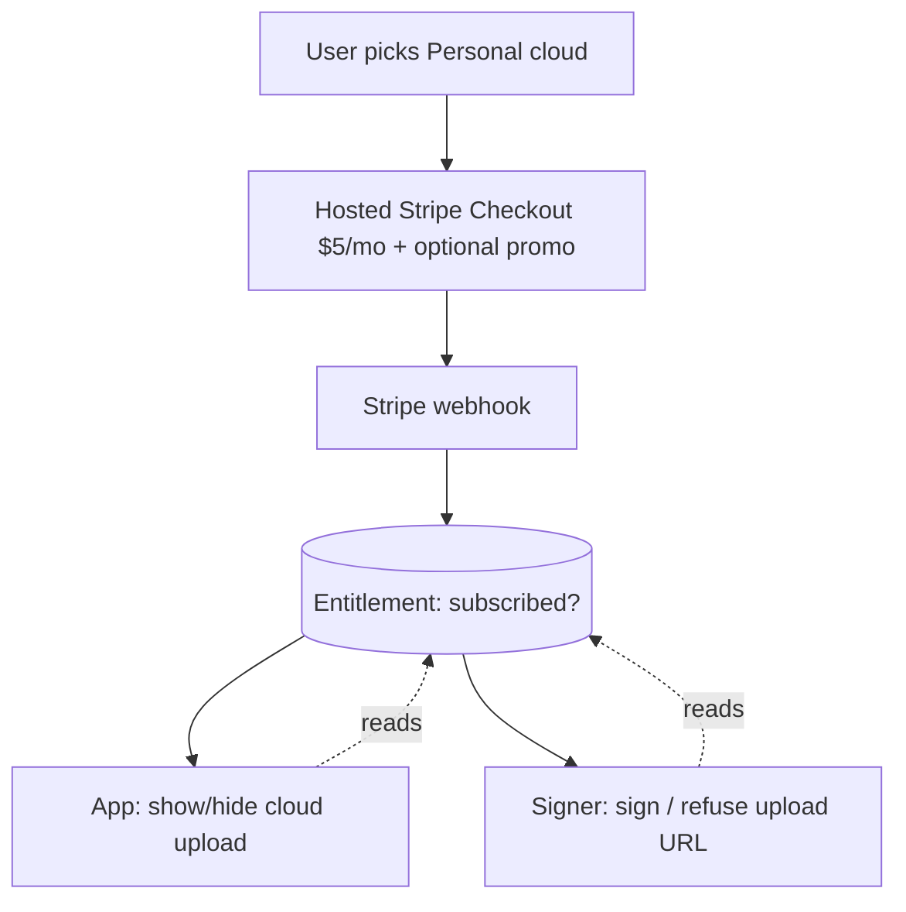

# Personal Cloud Billing Paywall - Plan

## Goal Capsule

- **Objective:** For the Product Hunt launch, put a paid subscription in front of the cloud tier that already works — a $5/mo Personal cloud plan sold through hosted Stripe Checkout, enforced at the URL signer and mirrored in the app UI. Team, E2EE, and the strategy fork stay deferred.
- **Product authority:** This document's Product Contract. Builds on the shipped single-user E2EE cloud-onboarding slice (PR #344) — whose trust-claim-honesty stance carries into this plan's honest-copy requirement (R2) — and on the shipped Personal-cloud upload path. `SECURITY.md` remains the source of truth for any privacy/trust wording.
- **Execution profile:** ~14 units across the Cloud Function signer, two new billing Cloud Functions, the daemon token-staging path, the Python auth/upload layer, and the SwiftUI onboarding. Two-sided rollout — a client `SCREENCAP_STRIPE_PAYWALL` flag and a signer `STRIPE_PAYWALL_ENFORCE` env, both default-off — so the paywall lands dark and flips at launch only after the pay→claim→upload loop is verified end-to-end and internal accounts are comped. Security-touching units (the signer gate, the webhook signature check) land test-first.
- **Stop conditions:** Stop and surface if the Checkout Session cannot carry a server-derived uid (breaks payment↔account binding), if custom claims cannot be set or read from the deployed functions (breaks the entitlement seam), if enforcing the signer gate would lock out accounts before comps are in place, if `STRIPE_PAYWALL_ENFORCE` would flip on before the paywall-capable app build is the minimum shipped version (older DMG clients would be hard-gated with no in-app way to pay), or if a payment can succeed with no path to grant or recover access when the webhook is dropped.
- **Product Contract preservation:** unchanged — enrichment adds the Planning Contract, Implementation Units, Verification Contract, and Definition of Done; R1–R12 and all product scope are preserved.
- **Open blockers:** none block this slice. The three SCR-237 blockers (key custody beyond one device, org buy-in on reversing the training-corpus bet, migration of the server-readable cloud) gate the *Team* tier, which this slice does not build. This slice keeps paid cloud server-readable on purpose, so the strategy fork stays open.

---

## Product Contract

### Summary

Sell a $5/mo Personal cloud subscription at launch. Cloud upload — which any signed-in user gets free today — becomes gated on an active subscription, enforced server-side at the URL signer and mirrored by hiding cloud upload in the app for non-subscribers. Payment is hosted Stripe Checkout with an optional launch promo code and no trial. The plan picker prices Personal, keeps "This Mac only" free, and turns the Team card into a "coming soon" email waitlist. No screen claims end-to-end encryption, because paid cloud stays server-readable.

### Problem Frame

SCR-237 as filed is a multi-week bundle — per-seat billing, a team entity with membership and invites, a shared *encrypted* library with key rotation, a namespace migration, and an org-level decision to reverse the training-corpus bet. The launch is today. Almost none of that is responsibly shippable in a day, and the shared-encrypted-library piece is actively dangerous to rush: shipping team key-sharing with no recovery model destroys a paying customer's data the first time someone loses a device.

The one piece the launch actually needs — billing — is decoupled from all of it. Personal cloud already works end-to-end: Google OAuth → Firebase identity → signed URLs scoped to `users/{uid}/recordings/`, with a Cloud Function signer that gates on a bearer token and never reads bytes. Nothing charges for it yet; the tier choice is UI-only and enforces no capability. So "billing" reduces to adding a subscription and a gate in front of an existing, working capability.

The trap to avoid is a dishonest privacy claim. The design cards pitch "keys stay with your team / we can't watch / end-to-end encrypted," but the `cloud_e2ee_enabled` flag is off and paid uploads are server-readable plaintext. A Product Hunt audience will test that claim. Whatever ships today, the copy must match what the system actually does at that moment.

### Key Decisions

- **Server-readable paid cloud, not E2EE.** The paid tier monetizes the cloud path exactly as it works today. This ships in a day and keeps the training-corpus bet open, at the cost of no "we can't watch" claim on the paid tier. The E2EE-vs-training strategy fork is deliberately not resolved here.
- **Both gates, with the signer as the real one.** Enforcement lives server-side at the URL signer (non-bypassable); the app also hides cloud upload for non-subscribers so it never dangles a control that would fail server-side. The UI gate is UX, not security.
- **Hosted Stripe Checkout, not native in-app purchase.** Because ScreenCap ships as a Developer-ID DMG rather than through the Mac App Store, Stripe is permitted and is the fastest legal path to taking money. (Mac App Store distribution would force StoreKit/IAP and invalidate this decision.) Billing is greenfield — no account wiring exists — so standing up the Stripe product, $5/mo price, webhook endpoint, and launch promo code is part of this slice.
- **Comp internal accounts out-of-band, not through Stripe.** Internal/demo accounts are comped by setting the entitlement directly (a manual allowlist), not by a discounted Checkout, so the launch-day seatbelt does not depend on the Stripe path — the riskiest, latest-built part — being green. An external-comp coupon can come later once billing is stable.
- **Straight $5/mo, no trial.** A single price with an optional promo code has the fewest Stripe states to get right before a same-day launch — no trial expiry, no `past_due`-during-trial edge cases. The promo code carries the launch hook.
- **One entitlement signal as the seam.** A single "subscribed" signal, derived from Stripe subscription state, is the source of truth both the signer and the app read. This decouples the payment provider from enforcement and keeps the two gates consistent.
- **Team stays a waitlist stub.** No team data model exists. The Team card captures emails rather than routing into a non-functional flow — lead-gen instead of dead UI.

Entitlement seam — one signal from Stripe feeding both gates:



### Actors

- A1. Individual user — records locally for free, may upgrade to Personal cloud, owns the account and the subscription.
- A2. Stripe — payment provider; hosted Checkout plus webhooks are the billing surface.
- A3. Signer / entitlement service — the Cloud Function that signs upload URLs; under this slice it also checks the entitlement before signing.
- A4. Operator — provisions the Stripe product and promo code, and comps internal/demo accounts before the gate goes live.

### Requirements

**Plan picker & honest copy**

- R1. The first-run plan picker presents three tiers: "This Mac only" (free), "Personal cloud" priced at $5/mo, and "Team cloud" shown disabled as "coming soon."
- R2. No cloud path displays an end-to-end-encryption, "we can't watch," or "keys stay with your team" claim; the Personal card's copy is truthful for a server-readable tier.
- R3. "This Mac only" stays free, requires no account, and never triggers checkout or a cloud gate.

**Billing & checkout**

- R4. Selecting Personal cloud routes the user to hosted Stripe Checkout for a $5/mo subscription, with an optional launch promo code applicable at checkout and no free trial.
- R5. The Stripe customer and subscription are linked to the user's account identity so payment maps to that account's entitlement.
- R6. After successful payment, the app enables cloud upload within a bounded processing window and without the user signing in again; while the webhook grant propagates it shows a "processing" state rather than promising an instant flip or failing hard.

**Entitlement & enforcement**

- R7. A single "subscribed" entitlement signal, derived from Stripe subscription state via webhook, is the source of truth for cloud access and is readable by both the signer and the app.
- R8. Hard gate: the URL signer refuses to issue an upload URL for an account without an active subscription entitlement.
- R9. Soft gate: the app disables or hides cloud upload for non-subscribers, so no cloud upload action is offered that the signer would reject.

**Subscription lapse**

- R10. On cancellation or failed payment, the account retains access to already-uploaded cloud recordings, new cloud uploads are blocked, and the app reverts to local-only recording. Cloud data is not deleted on lapse.

**Team waitlist**

- R11. The Team card captures an email waitlist signup instead of entering a team-setup flow.

**Launch safety**

- R12. Internal and demo accounts are comped by setting the subscribed entitlement directly — a manual allowlist independent of Stripe Checkout and the webhook — before the hard gate is enabled, so the team is not locked out of cloud upload during the launch and demo.

### Key Flows

- F1. Upgrade and first cloud upload
  - **Trigger:** User picks Personal cloud in the plan picker (or upgrades later from local).
  - **Actors:** A1, A2, A3
  - **Steps:** App opens hosted Stripe Checkout → user pays (optionally with a promo code) → Stripe webhook sets the account's entitlement to subscribed → app reflects active subscription and enables cloud upload → signer signs upload URLs → recording uploads to `users/{uid}/…`.
  - **Covered by:** R4, R5, R6, R7, R8

- F2. Non-subscriber attempts cloud
  - **Trigger:** A signed-in account with no active subscription.
  - **Actors:** A1, A3
  - **Steps:** App shows cloud upload as unavailable (soft gate) → even if a request reaches the signer, it refuses to sign (hard gate) → recording stays local.
  - **Covered by:** R8, R9

- F3. Subscription lapse
  - **Trigger:** User cancels, or a renewal payment fails.
  - **Actors:** A1, A2, A3
  - **Steps:** Stripe webhook clears the entitlement → new cloud uploads are blocked and the app reverts to local-only → previously uploaded recordings remain downloadable → no cloud data is deleted.
  - **Covered by:** R7, R10

### Acceptance Examples

- AE1. **Covers R3.** **Given** a user on the plan picker, **when** they choose "This Mac only," **then** no account or checkout step appears and recording works with nothing uploaded.
- AE2. **Covers R2.** **Given** the plan picker at launch, **when** the cards render, **then** none makes an end-to-end / "we can't watch" claim, and the Personal card shows the $5/mo price.
- AE3. **Covers R8, R9.** **Given** a signed-in account with no active subscription, **when** it uses the app, **then** cloud upload is not offered, and a direct signing request is refused server-side.
- AE4. **Covers R6, R7.** **Given** a user who just completed Stripe Checkout, **when** they return to the app, **then** cloud upload becomes enabled within a bounded processing window without re-authenticating — showing "processing" until the grant propagates, never a hard failure.
- AE5. **Covers R10.** **Given** an account whose subscription just lapsed, **when** it opens the app, **then** already-uploaded recordings are still downloadable, new cloud uploads are blocked, and no cloud data was deleted.
- AE6. **Covers R12.** **Given** a comped internal account with no paid Stripe subscription, **when** it records to cloud, **then** the signer signs and the upload succeeds.
- AE7. **Covers R6 (recovery).** **Given** a payment that succeeded but whose webhook was never delivered, **when** the account's entitlement is next read, **then** live Stripe state reconciles the claim (or the documented recovery tool grants it), so the paying user is not permanently stuck.

### Scope Boundaries

**Deferred for later**

- The entire Team tier: team entity, membership, admin role, invite-by-email, `@company.com` domain join, and per-seat billing.
- The shared encrypted team library: team-key sharing and key rotation on member removal.
- Key custody and recovery beyond a single device (device-key vs escrow vs passphrase vs keychain sync).
- The `users/{uid}/…` → team-scoped namespace change.
- Client-side E2EE on the paid path: the `cloud_e2ee_enabled` flag stays off, and no "we can't watch" claim ships.
- A free trial, founding-user pricing, and re-encrypting recordings already uploaded as plaintext.
- A 100%-off Stripe coupon for external comps (press, partners) — a post-launch nicety once billing is stable, distinct from the R12 internal seatbelt.
- Website decryption/gallery changes and migrating or deprecating the existing server-readable cloud.

**Outside this launch's decision scope**

- Whether to reverse or keep the training-corpus bet (server-readable-for-training). This slice monetizes the server-readable cloud and deliberately leaves that org-level decision open; it is not resolved here.

### Dependencies / Assumptions

- **Distribution is a Developer-ID DMG, not the Mac App Store** — load-bearing for the Stripe decision. If Mac App Store distribution is ever pursued, Apple forces StoreKit/IAP and this plan changes materially.
- Builds on the shipped Personal-cloud path (OAuth → Firebase identity → signed URLs scoped to `users/{uid}/recordings/`) and the signer that gates on a Firebase bearer token and never reads bytes.
- Stripe billing is greenfield — no billing code or account wiring exists today; standing up the $5/mo product/price, webhook endpoint, and launch promo code is part of this slice, not a precondition.
- The signer's entitlement check must be deployed and the full pay → webhook → entitlement → upload loop tested end-to-end before the gate is relied on — a silent webhook failure means paying customers can't upload.
- Assumes no meaningful population of existing external free-cloud users to grandfather beyond internal accounts, which R12 comps.

### Outstanding Questions

**Deferred to planning**

- Post-checkout entitlement refresh: deep-link return vs bounded poll (U9), the exact reconciliation trigger for a dropped webhook (entitlement-read fallback vs a post-checkout Stripe check), and who runs the U12 recovery tool during a launch spike (U14).
- Whether adding `subscribed` to the `whoami` envelope bumps `_AUTH_SCHEMA_VERSION` (the Swift drift check is warn-only — a deliberate call) (U5).
- How the "enforce not on until the paywall DMG is the minimum shipped version" invariant is actually enforced across the two release tracks (KTD-6).
- The waitlist form provider (KTD-7), and where the runtime records "Personal-paid" if a tier distinction beyond the entitlement claim is ever needed (today `get_upload_default` returns only `local`/`cloud`/`both`/`ask`).

### Sources / Research

- SCR-237 ticket (Team cloud: billing/plans + shared encrypted library) and its deferred children SCR-220 (E2EE shared copies), SCR-221 (team library model), SCR-229 (team invites/access control).
- Parent work: the single-user E2EE cloud-onboarding slice (PR #344) — its trust-claim-honesty stance and the device-key crypto machinery this plan sits alongside. (That plan doc lives on the PR branch, not yet merged into `docs/plans/`, so it is referenced by PR rather than path.)
- Enforcement point and namespace: the Cloud Function signer at `scripts/cloud-function/main.py` (verifies bearer, signs URLs, never reads bytes) and the single key builder `resolve_prefix` in `scripts/cloud-function/paths.py` (`users/{uid}/…`).
- Auth identity: `src/screencap/auth.py` (Firebase login/token, Keychain-stored refresh token).
- Onboarding surface and current honest-by-omission copy: card strings live in the `OnboardingCopy` enum inside `macos/ScreenCap/Views/Onboarding/OnboardingStepPolicy.swift` (`:242-256`) plus `OnboardingStorageSteps.swift`; tier persistence in `src/screencap/config.py` (`get_upload_default`).
- Verified surfaces (this planning pass): signer entry `get_upload_urls` + `_handle_upload` PUT-signing at `scripts/cloud-function/main.py:372-428`; Firebase Admin SDK already initialized at `scripts/cloud-function/main.py:136`; `verify_bearer` at `scripts/cloud-function/auth.py`; app entitlement read via `whoami()` at `src/screencap/auth.py:714` bridged by `CloudAuthController.fetchWhoAmI()`; card copy at `macos/ScreenCap/Views/Onboarding/OnboardingStepPolicy.swift:242-256`; flag pattern `_parse_bool_env` at `src/screencap/config.py:46`.

---

## Planning Contract

### Key Technical Decisions

- KTD-1. Entitlement is a Firebase custom claim `subscribed` — no new datastore. The signer already initializes the Firebase Admin SDK (`scripts/cloud-function/main.py:136`), so the webhook sets the claim with `auth.set_custom_user_claims(uid, {"subscribed": True})` and clears it on cancel/failure. Signer, app, and the comp path all read or write the same claim. A Firestore entitlements table is deferred — it would only earn its keep for a future admin/query surface, and it adds infra to stand up today.
- KTD-2. The signer reads the claim from the verified ID token — additive return, fail-closed, bounded revocation. `verify_bearer`/`_authenticate` surface the decoded custom claims **additively**, preserving the existing `(uid, err)` return shape (a small dataclass or optional field, not a widened tuple), so every gated caller and the tokenless-path CI contract stay intact. `_handle_upload` **fails closed**: with enforce on, it signs only when `subscribed` reads positively `True`; a falsy, missing, or unreadable claim refuses (402 for a definite non-subscription, 503 for a transient read error) and never falls through to the signing loop. Grant is immediate for the batch/CLI path (the app force-refreshes its ID token after checkout) but **not** for the live-upload path, whose token is the daemon's cached one — see KTD-8 / U13. Revocation is bounded by token refresh: ~1h for the batch path, and for an in-flight recording by the daemon's re-mint cadence plus token lifetime (can exceed 1h). Accepted for a server-readable tier under R10; the authoritative `auth.get_user(uid).custom_claims` per-request lookup is the upgrade path if that window is ever unacceptable.
- KTD-3. Billing lives in two new Cloud Function entry points, kept out of the signer. `create-checkout-session` (Firebase-token-gated) and `stripe-webhook` (Stripe-signature-verified) deploy from the same `scripts/cloud-function/` source as separate functions. This preserves the signer's strict action allow-list and its CI contract that no tokenless request reaches a `users/` code path — the webhook is Firebase-tokenless by design and must not sit inside that guard.
- KTD-4. Payment↔account binding via a server-derived `client_reference_id`. `create-checkout-session` derives the uid from the caller's verified Firebase token (never client-supplied) and sets it as the Stripe Checkout Session `client_reference_id` plus customer metadata. The webhook reads it back to know which uid to grant or revoke. This is R5.
- KTD-5. The hard gate is upload-only; downloads and list stay ungated. Only `_handle_upload` checks entitlement; `_handle_list` and `_handle_sign_download` are untouched, so a lapsed subscriber still reads already-uploaded recordings (R10). Demo paths are unaffected.
- KTD-6. Two-sided, default-off rollout. A client flag `SCREENCAP_STRIPE_PAYWALL` (`_parse_bool_env`, `src/screencap/config.py:46`) governs the app/CLI surfaces — pricing copy, soft gate, checkout routing. A signer env `STRIPE_PAYWALL_ENFORCE` governs whether `_handle_upload` actually refuses unsubscribed uploads. The signer is deployed with enforce **off** (claim read + logged, never denied) to validate the loop; enforce flips on at cutover, after comps are set and the webhook is verified — so nobody is locked out prematurely. Because the signer env and the DMG-shipped client flag propagate on two independent, unsynchronized release tracks, `STRIPE_PAYWALL_ENFORCE` must not flip on until the paywall-capable build (with the checkout/upgrade UI) is the **minimum shipped app version** — otherwise older clients are hard-gated with no in-app way to pay. Either gate enforcement to grandfather pre-paywall app versions, or hold the flip until the new DMG is the floor.
- KTD-7. Team waitlist is a zero-backend hosted form. The Team card opens a hosted form URL (e.g. Tally / Google Form) in the browser for email capture, so launch adds no new backend or storage. A self-hosted capture endpoint can replace it later. Exact provider is a deferred implementation detail.
- KTD-8. Each billing function initializes the Firebase Admin app explicitly. `firebase_admin.initialize_app()` runs today only at `scripts/cloud-function/main.py:136` module scope; a separately-deployed `billing.py` entry point never imports `main.py`, so the default app would be uninitialized and `set_custom_user_claims` / `verify_id_token` would raise at runtime — while `conftest.py`'s global `initialize_app` mock hides the gap in unit tests (green tests, crashing deploy). The billing functions must initialize the app at module scope (or import a small shared init module both entry points use), with a test that asserts initialization rather than relying on the signer's import side effect.
- KTD-9. The webhook converges to authoritative Stripe state and resolves uid via Customer metadata. Stripe guarantees neither ordered nor exactly-once delivery, and revoke events (`customer.subscription.deleted`, `invoice.payment_failed`) do not carry `client_reference_id`. So `create-checkout-session` stamps the uid into the Stripe **Customer metadata** (not only the session), and the webhook resolves uid from Customer metadata and sets the claim from the subscription's **current status** (re-fetched when the event is ambiguous) rather than blindly toggling per event — a stale `deleted` for a now-active subscription must not clear a paying user's claim.

### High-Level Technical Design

The checkout → entitlement → gate loop spans the app, two billing functions, Stripe, Firebase Auth, and the signer:

```mermaid
sequenceDiagram
    participant App as macOS app
    participant CS as create-checkout-session (fn)
    participant Stripe
    participant WH as stripe-webhook (fn)
    participant FB as Firebase Auth (custom claim)
    participant Signer as get-upload-urls (signer)

    App->>CS: POST (Firebase bearer)
    CS->>CS: derive uid from token
    CS->>Stripe: create Checkout Session (client_reference_id=uid, $5/mo)
    Stripe-->>App: hosted Checkout URL (opened in browser)
    App->>Stripe: user pays (optional promo)
    Stripe->>WH: subscription event (signed)
    WH->>WH: verify Stripe signature
    WH->>FB: set_custom_user_claims(uid, subscribed=true)
    App->>App: force ID-token refresh (post-checkout)
    Note over App: batch/CLI path; the live-upload path needs a daemon token re-mint (U13)
    App->>Signer: upload request (fresh bearer w/ claim)
    Signer->>Signer: read subscribed claim; enforce on?
    alt subscribed
        Signer-->>App: signed PUT URLs
    else not subscribed
        Signer-->>App: refused → app keeps recording local
    end
    Note over Stripe,FB: cancel / payment_failed → webhook clears claim<br/>(downloads stay ungated, data retained)
```

### Assumptions

- Stripe is greenfield; standing up the product, $5/mo price, promo code, and webhook endpoint is unit work (U11), not a precondition.
- Distribution stays Developer-ID DMG, so hosted Stripe Checkout is permitted (no StoreKit/IAP).
- Custom claims and the Admin SDK are usable from the deployed functions in the `proteus-photos` Firebase project (SDK is already initialized in the signer).
- No Firestore dependency is introduced.
- The `whoami` CLI plus the `CloudAuthController` JSON bridge is the app's entitlement-read channel; `get_id_token(force_refresh=True)` already exists for the post-checkout refresh.

### Sequencing

U1 (flags) and U11 (Stripe provisioning) are independent and land first. The entitlement seam is built as write-side (U3 checkout-session, U4 webhook), read-side (U5 whoami claim, U8 app read), and gate (U2 signer, deployed enforce-off). U13 (daemon token re-mint) and U14 (dropped-webhook reconciliation) depend on the seam (U4/U5) and close the live-path immediate-grant and money-taken-no-access gaps. U6 handles the client's reaction to a signer refusal; U9 wires app→checkout→refresh; U12 (comp) depends only on the claim shape from U4. App-only copy/waitlist (U7, U10) parallelize. **Cutover order:** provision (U11) → deploy signer enforce-off + billing functions (U2, U3, U4) → set comps (U12) → verify the full pay→claim→upload loop on the dev function across the **batch and live** paths plus the dropped-webhook recovery → enable the U1 client flag and flip `STRIPE_PAYWALL_ENFORCE` on **only once the paywall DMG is the minimum shipped app version**.

---

## Implementation Units

### U1. Rollout flags

- **Goal:** A default-off client paywall flag and a default-off signer enforce env, so the paywall lands dark.
- **Requirements:** R7 (enablement), supports R8/R9 rollout safety.
- **Dependencies:** none.
- **Files:** `src/screencap/config.py`; `tests/test_config.py` (or the existing config test module); the signer reads `STRIPE_PAYWALL_ENFORCE` in `scripts/cloud-function/main.py` (consumed in U2).
- **Approach:** Add `get_stripe_paywall_enabled()` mirroring `_parse_bool_env` (`SCREENCAP_STRIPE_PAYWALL` / `stripe_paywall`, default `False`). Define the signer's `STRIPE_PAYWALL_ENFORCE` env contract (default off) here; U2 consumes it.
- **Patterns to follow:** `get_wifi_metrics()` at `src/screencap/config.py:149`.
- **Test scenarios:** flag parses from env and config, defaulting off; env truthy overrides config; unset → `False`.
- **Verification:** flag defaults off; `PYTHONPATH=src pytest` on the config test green.

### U2. Signer entitlement hard gate (upload-only)

- **Goal:** With enforce on, the signer refuses to sign upload URLs for an account without an active `subscribed` claim; downloads and list stay open.
- **Requirements:** R8, R10 (downloads ungated).
- **Dependencies:** U1 (enforce env), U4 (claim shape).
- **Files:** `scripts/cloud-function/main.py` (`_authenticate`, `_handle_upload`), `scripts/cloud-function/auth.py` (`verify_bearer` to surface claims); `scripts/cloud-function/test_main.py`, `scripts/cloud-function/test_auth.py`.
- **Approach:** Surface the decoded custom claims from `verify_bearer`/`_authenticate` **additively** — keep the existing `(uid, err)` shape (a small dataclass or optional field), never a widened tuple, so `_handle_list`/`_handle_sign_download`/demo paths and the tokenless-path CI contract are untouched (KTD-2). In `_handle_upload`, immediately after `_authenticate` succeeds (~`main.py:376`, before building `to_sign`), read `subscribed`. With `STRIPE_PAYWALL_ENFORCE` on, sign only when the claim reads positively `True`; **fail closed** on falsy/missing/unreadable — 402 for a definite non-subscription, 503 for a transient read error — and never fall through to the signing loop. Leave downloads, list, and demo paths untouched.
- **Execution note:** Land the gate test-first — this is the security-critical enforcement point.
- **Patterns to follow:** the existing `_authenticate` union-return contract (`main.py:195`), the 503/401 mapping, and the tokenless-boundary contract test at `scripts/cloud-function/test_signing_contract.py`.
- **Test scenarios:**
  - Covers AE3. Enforce on, no `subscribed` claim → upload returns the 402 refusal and signs zero PUT URLs.
  - Enforce on, `subscribed=true` → upload signs as today.
  - Enforce on, token with no custom-claims block or a claim-decode error → fails closed (refused / 503), signs nothing (never falls through).
  - Enforce off, no claim → upload signs as today (dark-deploy behavior), claim absence logged.
  - Covers AE5. A lapsed (claim cleared) account can still `sign-download` and `list` its recordings.
  - After the additive claim-return change, every gated handler still refuses a tokenless request (the `test_signing_contract.py` boundary holds).
  - The refusal status is distinct from 401/404 so the client can tell "pay required" from "not found".
- **Verification:** `cd scripts/cloud-function && pytest test_main.py test_auth.py` green; refusal signs nothing.

### U3. create-checkout-session Cloud Function

- **Goal:** A token-gated endpoint that creates a $5/mo Stripe Checkout Session bound to the caller's uid and returns its URL.
- **Requirements:** R4, R5.
- **Dependencies:** U11 (Stripe product/price/secret).
- **Files:** new entry point in `scripts/cloud-function/` (e.g. `billing.py` with a `create_checkout_session` function), `scripts/cloud-function/requirements.txt` (+`stripe`); `scripts/cloud-function/test_billing.py`.
- **Approach:** Initialize the Firebase Admin app at module scope (KTD-8). Verify the Firebase bearer (reuse `verify_bearer`), derive uid server-side, and create a Checkout Session for the $5/mo price with `client_reference_id=uid` **and** the uid stamped into the Stripe **Customer metadata** so revoke-side events (which carry no `client_reference_id`) can still resolve it (KTD-4, KTD-9). Allow promo codes; return the session URL. Read `STRIPE_SECRET_KEY` and the price id from env.
- **Test scenarios:**
  - Valid bearer → a session is created with `client_reference_id` equal to the token's uid, and the uid is stamped into the Customer metadata (mock the Stripe client; assert both).
  - Missing/invalid bearer → 401, no Stripe call.
  - A client-supplied uid in the body is ignored — the session uses the token-derived uid only.
  - Promo-code entry is enabled on the session.
  - The billing module initializes the Firebase Admin app itself (does not rely on `main.py` being imported).
- **Verification:** `cd scripts/cloud-function && pytest test_billing.py` green; uid is server-derived and persisted to Customer metadata.

### U4. stripe-webhook Cloud Function

- **Goal:** A signature-verified webhook that sets `subscribed` on subscription-active events and clears it on cancel/payment-failure.
- **Requirements:** R7, R10.
- **Dependencies:** U11 (`STRIPE_WEBHOOK_SECRET`).
- **Files:** new entry point in `scripts/cloud-function/` (`billing.py` `stripe_webhook`); `scripts/cloud-function/test_stripe_webhook.py`.
- **Approach:** Initialize the Firebase Admin app at module scope (KTD-8). Verify the `Stripe-Signature` header against `STRIPE_WEBHOOK_SECRET` **first** (reject unsigned/invalid with 400, mutating nothing). Resolve uid from the Stripe **Customer metadata** (durable across events that lack `client_reference_id`). Set the claim from the subscription's **current status** — re-fetching live state when an event is ambiguous — rather than blind per-event toggling: currently-active → `auth.set_custom_user_claims(uid, {"subscribed": True})`, currently-inactive → clear (KTD-9). Idempotent on duplicate delivery, convergent on out-of-order delivery.
- **Execution note:** Land the signature-verification path test-first; treat "no unsigned request mutates a claim" as a durable contract mirroring `test_signing_contract.py`.
- **Test scenarios:**
  - Valid signature + subscription-active event → sets `subscribed=true` for the metadata-resolved uid (mock the Admin SDK; assert the call).
  - Valid signature + `customer.subscription.deleted` (no `client_reference_id`) → resolves uid via Customer metadata and clears the claim.
  - A stale `deleted` event for a subscription whose current status is active → the claim is NOT cleared (out-of-order convergence).
  - Invalid/missing signature → 400 and zero Admin-SDK claim mutations (contract: no unsigned request reaches `set_custom_user_claims`).
  - Duplicate delivery of the same event → idempotent (no double side effect).
  - An event with no resolvable uid → handled without crashing, logged, no mutation.
- **Verification:** `cd scripts/cloud-function && pytest test_stripe_webhook.py` green; unsigned requests mutate no claim.

### U5. Python auth: entitlement read + post-checkout refresh

- **Goal:** `whoami` reports `subscribed`, and the app can force a token refresh after checkout so the new claim is visible.
- **Requirements:** R6, R7.
- **Dependencies:** U4 (claim exists).
- **Files:** `src/screencap/auth.py` (`whoami` at `:714`, the versioned `WhoAmI` TypedDict at `:206`, `_decode_id_token_claims` at `:321`, and a force-refresh CLI surface via existing `get_id_token(force_refresh=True)`); the daemon `WhoAmIResponse` model at `src/screencap/daemon/schema.py:474`; the CLI command module if a new subcommand is added; `tests/test_auth.py`.
- **Approach:** In `whoami()` (`src/screencap/auth.py:714`), after `_ensure_fresh()`, read the claim via the existing `_decode_id_token_claims(state.id_token)` and include `"subscribed": bool` (default `False` when absent). Add `subscribed` to the versioned `WhoAmI` TypedDict **and** the daemon's `WhoAmIResponse` pydantic model so the cross-layer contract stays in sync, and make a deliberate call on whether `_AUTH_SCHEMA_VERSION` bumps (the Swift drift check is warn-only, so a bump is optional but should be conscious). Expose a force-refresh path the app calls post-checkout (extend the `whoami`/`get-id-token` CLI to accept `--force-refresh`, re-minting via `get_id_token(force_refresh=True)`).
- **Test scenarios:**
  - Token with `subscribed=true` claim → `whoami` returns `subscribed: true`.
  - Token without the claim → `subscribed: false`.
  - Signed-out → `whoami` returns `{"signed_in": false}` unchanged (no `subscribed` key crash).
  - The `WhoAmI` TypedDict and the daemon `WhoAmIResponse` both carry `subscribed` (contract stays in sync).
  - Force-refresh re-mints the token (mock the refresh; assert `force=True` path taken).
- **Verification:** `PYTHONPATH=src pytest tests/test_auth.py` green.

### U6. Client upload: handle the signer refusal

- **Goal:** When the signer refuses for lack of subscription, the client keeps the recording local and surfaces an upgrade path rather than erroring opaquely.
- **Requirements:** R9, R10.
- **Dependencies:** U2.
- **Files:** `src/screencap/upload.py` (`request_signed_urls` and its callers), and the live path in `src/screencap/chunk_processor.py`; `tests/test_upload.py`, `tests/test_download.py`, `tests/test_unified_upload_pipeline.py`.
- **Approach:** In `request_signed_urls` — which today collapses every non-200 into a generic `RuntimeError` (`upload.py:370`) — detect the distinct 402 not-subscribed refusal and raise a dedicated exception (e.g. `SubscriptionRequired`) that `authed_post`'s 401 force-refresh-and-retry does **not** absorb. Map it in the `upload.py` callers and the live path (`chunk_processor.py`) to a non-crashing local-only outcome (no delete, no retry-storm), and carry a `subscription_required` field on the whoami/upload JSON envelope the SwiftUI app reads to show the upgrade prompt.
- **Test scenarios:**
  - Signer returns the 402 not-subscribed refusal → `request_signed_urls` raises `SubscriptionRequired`, the recording stays local, nothing crashes.
  - The refusal is distinguished from a transient 503 (which still retries) and from a 401 (which force-refreshes).
  - The upgrade signal reaches the app envelope (`subscription_required` present).
  - Flag/enforce off → upload path is byte-identical to today.
- **Verification:** `PYTHONPATH=src pytest tests/test_upload.py tests/test_download.py tests/test_unified_upload_pipeline.py` green.

### U7. Plan picker copy: price Personal, keep claims honest

- **Goal:** The Personal card shows $5/mo with truthful copy; the Team card reads "coming soon"; local stays free.
- **Requirements:** R1, R2, R3, R11.
- **Dependencies:** none (gated behind the client flag for the live price display).
- **Files:** `macos/ScreenCap/Views/Onboarding/OnboardingStepPolicy.swift` (the `OnboardingCopy` enum copy at `:242-256`), `macos/ScreenCap/Views/Onboarding/OnboardingStorageSteps.swift`; `macos/ScreenCapTests/OnboardingStepPolicyTests.swift`.
- **Approach:** Set `personalCardMeta` to the $5/mo price and keep bullets free of any end-to-end / "we can't watch" claim. Mark the Team card "coming soon". Keep local copy unchanged. Update the string-assertion test to reflect the new honest copy and to assert no forbidden E2EE/price-for-team strings.
- **Test scenarios:**
  - Covers AE2. Personal card copy contains the $5/mo price and no E2EE / "we can't watch" claim.
  - Team card renders as coming-soon, not a functional team flow.
  - Local card copy unchanged; `This Mac only` still free.
- **Verification:** XcodeGen build + `OnboardingStepPolicyTests` pass under `xcodebuild test`.

### U8. App entitlement + soft gate

- **Goal:** The app reads `subscribed` and hides/disables cloud upload for non-subscribers.
- **Requirements:** R7, R9.
- **Dependencies:** U5.
- **Files:** `macos/ScreenCap/Controllers/CloudAuthController.swift` (extend `AuthStatus` with `subscribed`; read from `whoami`), `macos/ScreenCap/Views/Onboarding/OnboardingStorageSteps.swift` (gate the `.personalCloud`/`.teamCloud` selection), and any post-onboarding cloud-upload affordance (e.g. the Review screen's upload control); `macos/ScreenCapTests/CloudAuthControllerTests.swift`.
- **Approach:** Add `subscribed: Bool` to `AuthStatus`, populated from the extended `whoami` JSON. Gate the Personal cloud selection and cloud-upload actions on `isSignedIn && isSubscribed` when the client flag is on; unsubscribed users see the upgrade path, not a dangling cloud control.
- **Test scenarios:**
  - `whoami` reports `subscribed:true` → cloud upload offered.
  - `subscribed:false` → cloud upload hidden/disabled, upgrade path shown.
  - Signed-out → cloud tiers require sign-in first (existing behavior preserved).
- **Verification:** `CloudAuthControllerTests` pass; soft gate reflects entitlement.

### U9. App checkout launch + return refresh

- **Goal:** The app opens hosted Checkout and, on return, force-refreshes the token so the new subscription is reflected without re-login.
- **Requirements:** R4, R6.
- **Dependencies:** U3, U5, U8.
- **Files:** `macos/ScreenCap/Controllers/CloudAuthController.swift` and the onboarding/upgrade view that triggers checkout; a checkout-launch helper.
- **Approach:** On "upgrade", call `create-checkout-session`, open the returned URL in the browser. On return to the app (foreground or an explicit "I've paid / refresh" affordance), call the force-refresh path (U5) and re-`refresh()` auth status; poll a bounded number of times to absorb webhook lag before showing "still processing".
- **Test scenarios:**
  - After a simulated successful checkout + claim set, a forced refresh flips the app to subscribed without a re-login.
  - Webhook lag (claim not yet set) → app shows a processing state and retries, not a hard failure.
- **Verification:** the app reflects an active subscription post-checkout without re-authenticating (R6).

### U10. Team waitlist capture

- **Goal:** The Team card captures an email waitlist signup instead of entering a team flow.
- **Requirements:** R11.
- **Dependencies:** none.
- **Files:** the Team card action in `macos/ScreenCap/Views/Onboarding/OnboardingStorageSteps.swift` / related onboarding view.
- **Approach:** Wire the Team card's CTA to open a hosted waitlist form URL in the browser (KTD-7). No new backend.
- **Test expectation:** none — opens an external URL; assert the CTA is wired to the waitlist action rather than a team-setup route (covered by the U7 policy test's coming-soon assertion).
- **Verification:** selecting Team opens the waitlist form, not a team-setup step.

### U11. Stripe provisioning + function deploy env

- **Goal:** A Stripe product ($5/mo price), a launch promo code, and a webhook endpoint exist, with secrets wired into the function deploys.
- **Requirements:** R4 (enablement), supports R5/R7.
- **Dependencies:** none.
- **Files:** deploy configuration/docs for `scripts/cloud-function/` (the deploy docstring at `scripts/cloud-function/main.py:17-58` is the pattern); a runbook note.
- **Approach:** Create the Stripe product, $5/mo recurring price, a `PRODUCTHUNT` promo code, and a webhook subscription pointing at the deployed `stripe-webhook`. Set `STRIPE_SECRET_KEY`, `STRIPE_WEBHOOK_SECRET`, and the price id as function env vars — never committed; keep test-mode and live-mode keys separated per environment, document how to rotate the secret + webhook signing secret and redeploy, and add a commit guard (`.gitignore` / secret-scan) so a live `sk_live_…` / `whsec_…` cannot land in `scripts/cloud-function/` (whose deploy docstring already lists env-var examples inline). Deploy the signer with `STRIPE_PAYWALL_ENFORCE` off initially, and hold the on-flip until the paywall DMG is the minimum shipped app version (KTD-6).
- **Execution note:** Mostly dashboard + deploy config; prefer a runtime smoke check (a real test-mode checkout round-trip on the dev function) over unit coverage.
- **Test expectation:** none (provisioning/config) — proven by the U-round-trip smoke check in the Verification Contract.
- **Verification:** a Stripe test-mode checkout on the dev function sets the claim and a subscribed upload succeeds end-to-end.

### U12. Comp allowlist tool

- **Goal:** An operator path to grant `subscribed` to internal/demo accounts without Stripe, so the team isn't locked out at cutover.
- **Requirements:** R12.
- **Dependencies:** U4 (claim shape).
- **Files:** a small admin script under `scripts/` (e.g. `scripts/set-entitlement.py`) using the Firebase Admin SDK; a short usage note.
- **Approach:** Given a uid or account email, set (or clear) the `subscribed` custom claim directly via the Admin SDK — independent of Stripe Checkout and the webhook (KTD-1, KTD-6). Run it for internal/demo accounts before flipping `STRIPE_PAYWALL_ENFORCE` on.
- **Test scenarios:**
  - Setting a comp for a uid results in that uid's claim being `subscribed=true` (mock/admin-emulator assert).
  - Clearing a comp removes it.
- **Verification:** a comped internal account uploads to cloud with no paid Stripe subscription (AE6).

### U13. Daemon/engine token re-mint on entitlement change

- **Goal:** The live-upload path sees a fresh subscription grant without waiting ~1h for the daemon's cached token to expire.
- **Requirements:** R6, R7.
- **Dependencies:** U4, U5.
- **Files:** `src/screencap/daemon/supervisor.py` (engine-token staging `_stage_engine_token` / `_token_refresh_loop`); the daemon verb/IPC the app calls post-checkout; matching daemon tests.
- **Approach:** On an entitlement-change signal from the app (post-checkout) or at recording start when `cloud_intent` is set, force the daemon to re-mint its cached ID token (`get_id_token(force_refresh=True)` in the daemon's own context) and re-stage the engine token file. Do not rely on the app-process `whoami --force-refresh` — it updates neither the daemon's nor the engine's cached token. State explicitly that the token the signer sees on the first post-checkout live upload is the daemon-re-minted one.
- **Test scenarios:**
  - After an entitlement-change signal, the daemon re-mints with `force_refresh=True` and re-stages the engine token file (mock; assert the force path + restage).
  - At recording start with `cloud_intent`, the staged engine token carries the current claim.
  - Without the signal, the engine keeps its cached token (no spurious re-mint storm).
- **Verification:** a pay-then-immediately-record flow uploads via the live path without a ~1h wait.

### U14. Money-taken-but-no-access reconciliation

- **Goal:** A paying customer whose webhook was dropped can still get, or recover, access — no stuck-paid state.
- **Requirements:** R6, R7, R10.
- **Dependencies:** U3, U4, U5, U12.
- **Files:** `src/screencap/auth.py` (the `whoami` entitlement read) and/or the `create-checkout-session` return path; the U12 entitlement script as the documented recovery tool; webhook-failure alert config; `tests/test_auth.py`.
- **Approach:** When the `subscribed` claim is absent but the account has a live Stripe subscription, reconcile: the entitlement read (or a bounded post-checkout check) falls back to querying live Stripe subscription state and sets/repairs the claim, so a dropped webhook self-heals. Document the U12 script as the operator-run customer-recovery path during a launch spike, and add alerting on webhook delivery / `set_custom_user_claims` failures.
- **Test scenarios:**
  - Covers AE7. Claim absent + a live Stripe subscription present → reconcile grants/repairs the claim.
  - Claim absent + no live subscription → no grant (never hands out free access).
  - The recovery path is exercised with no valid webhook event delivered.
- **Verification:** a simulated dropped-webhook-but-paid case yields access via reconciliation (or the documented recovery tool), not a stuck customer.

---

## Verification Contract

| Gate | Command / signal | Applies to |
|---|---|---|
| Client Python unit/integration | `PYTHONPATH=src pytest tests/test_auth.py tests/test_config.py tests/test_upload.py tests/test_download.py tests/test_unified_upload_pipeline.py` | U1, U5, U6, U14 |
| Cloud Function unit | `cd scripts/cloud-function && pytest test_main.py test_auth.py test_billing.py test_stripe_webhook.py` | U2, U3, U4 |
| Swift onboarding/auth | XcodeGen build + `OnboardingStepPolicyTests`, `CloudAuthControllerTests` via `xcodebuild test` | U7, U8, U9 |
| End-to-end round-trip (pre-cutover) | Stripe test-mode checkout on the dev signer (`get-upload-urls-dev`): pay → webhook sets claim → app reflects within a bounded window → subscribed upload signs on **batch and live** paths; unsubscribed upload refused (fail-closed); a dropped-webhook payment recovers | U2, U3, U4, U9, U11, U13, U14 |
| Daemon token re-mint | `PYTHONPATH=src pytest` on the supervisor token-restage tests (force-refresh on entitlement change, engine token restaged) | U13 |
| Comp safety | A comped internal account (via U12) uploads with no paid sub, before `STRIPE_PAYWALL_ENFORCE` flips on | U12 |
| Lint | `ruff check` on changed `src/screencap/` files | U1, U5, U6 |

Operational note: CI runs only the privacy lane (`pytest -m privacy`) plus the lock-policy test; these billing tests are **not** privacy-bearing and must be run locally before merge — do not mark them `@pytest.mark.privacy` to force CI execution. `PYTHONPATH=src` is required in this worktree.

---

## Definition of Done

**Global**

- With both flags off, upload/download and onboarding are byte-identical to today (no gate, no pricing copy).
- With the client flag on and `STRIPE_PAYWALL_ENFORCE` on, an account without an active `subscribed` claim is refused at the signer for uploads and cloud upload is hidden in the app; a subscribed account uploads normally (AE3, AE4-adjacent).
- The full loop is verified on the dev function before cutover, on the batch **and** live-upload paths: checkout → webhook sets the claim → app reflects the subscription within a bounded window without re-login (R6) → subscribed upload signs.
- The signer fails closed: under enforce, an absent or unreadable claim refuses and never signs (U2).
- A pay-then-immediately-record flow grants the live-upload path without a ~1h wait (U13).
- A payment whose webhook was dropped is recoverable via reconciliation or the documented tool — no stuck-paid customer (U14, AE7).
- `STRIPE_PAYWALL_ENFORCE` is not flipped on until the paywall-capable DMG is the minimum shipped app version (KTD-6).
- Lapse: a cleared claim blocks new uploads but leaves `list`/`sign-download` working and deletes no cloud data (R10, AE5).
- Comped internal accounts upload with no paid Stripe subscription, set before enforce flips on (R12, AE6).
- Plan picker shows $5/mo on Personal with no E2EE claim; Team is coming-soon + waitlist; local stays free (R1, R2, R3, R11).
- `STRIPE_SECRET_KEY` and `STRIPE_WEBHOOK_SECRET` are provisioned as function env, never committed, with test/live separation, a documented rotation, and a commit guard (U11).
- Abandoned or experimental code is removed from the diff; all Verification Contract gates pass.

**Per-unit:** each unit's Verification bullet holds and its test scenarios pass.
