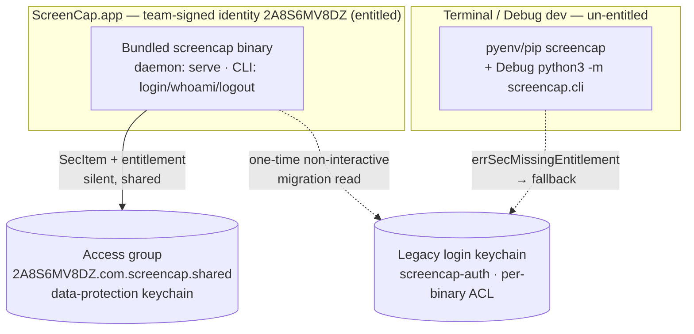
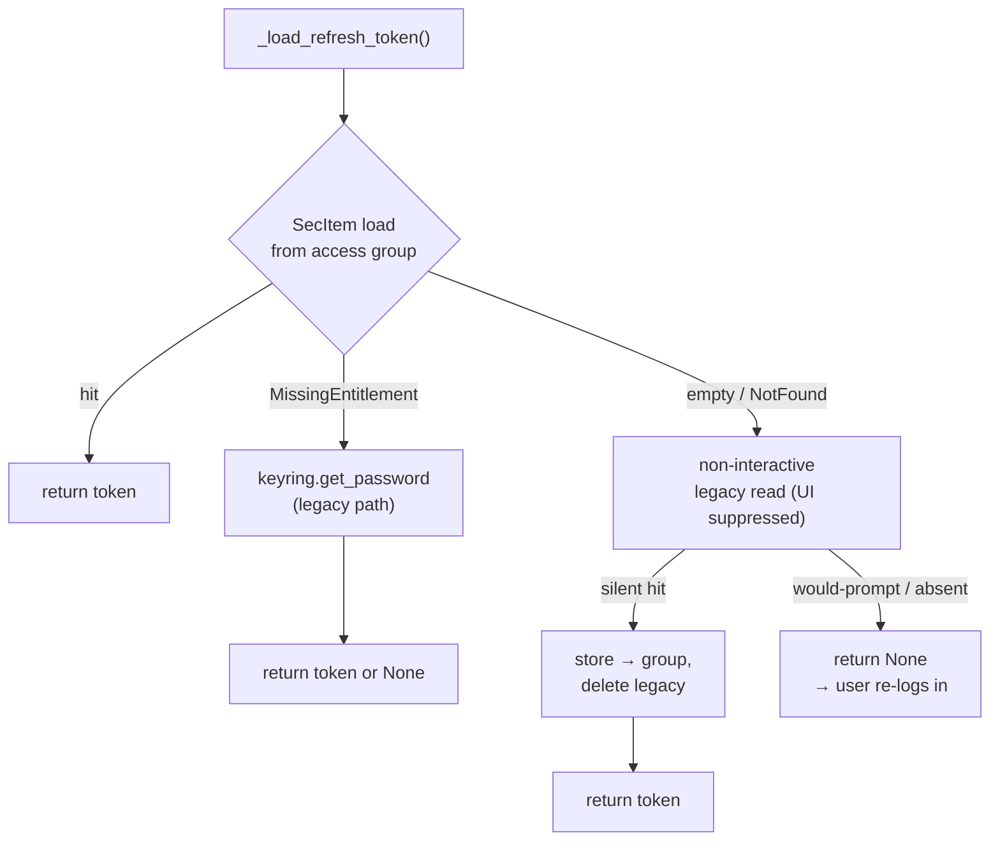

# feat: Store cloud refresh token in a shared Keychain access group (SCR-241)

## Summary

Move the Firebase cloud **refresh token** off `keyring`'s default login-keychain path and store it via the Security framework in a **shared Keychain access group** (`kSecAttrAccessGroup`) on the data-protection keychain. Every same-Team-signed ScreenCap binary — the app's embedded daemon and its bundled CLI (one PyInstaller identity) — then reads the token **without a macOS authorization prompt**, and the grant survives re-signing and app updates. The un-entitled external CLI (terminal `pyenv`/`pip` `screencap login`, and the Debug dev fallback) transparently falls back to today's `keyring` path. A strictly **non-interactive** one-time migration moves an existing legacy item into the group when it can be read silently, else the user signs in once.

This is the durable storage-layer fix behind the *"ScreenCap wants to use screencap-auth"* prompt. Its sibling ([PR #350](https://github.com/proteus-computer-use/screencap/pull/350)) only deferred the **app's** eager launch probe; the launch prompt in the field actually fires from the **daemon** reading the token at startup (`Supervisor._run_startup_sweep` → `auth.get_id_token`). Making that read silent — the point of this plan — is what closes the prompt for signed release builds.

**Product Contract preservation:** N/A — no in-repo requirements doc; origin is the Linear ticket. Scope decisions below (Fork 1A, Fork 2A) were confirmed with the user before planning.

---

## Problem Frame

`src/screencap/auth.py` stores the refresh token via `keyring.set_password("screencap-auth", "default", …)`. `keyring`'s macOS backend creates the item with a **per-binary trusted-application ACL** — it is silently readable only by the exact code identity that ran `login`. Every *other* ScreenCap code identity that reads it triggers the macOS keychain authorization prompt (the two-facts root cause is captured in `docs/solutions/integration-issues/keychain-auth-prompt-eager-decrypt-at-launch-2026-07-08.md`). `auth.py` already documents this hazard for the daemon-spawned **engine** subprocess and insulates it with an out-of-band token file; the interactive `login`/`whoami`/daemon path has no such insulation.

Two architecture facts (verified) make the fix tractable and bound its scope:

1. **In a release build there is effectively one auth code identity.** `CLIClient.resolveBinary()` runs the bundled `Contents/Library/LoginItems/ScreencapDaemon.app/Contents/MacOS/screencap` for `login`, `whoami`, `logout`, *and* `serve` alike ([macos/ScreenCap/Controllers/CLIClient.swift](macos/ScreenCap/Controllers/CLIClient.swift) `resolveBinary`). That single team-signed PyInstaller binary does **all** token I/O for end users. Entitle it + store in the access group → every end-user path is silent and shared.
2. **The un-entitled world can never join the group.** The terminal `pyenv`/`pip` CLI and the Debug `python3 -m screencap.cli` fallback run under a stock, un-entitled Python interpreter that macOS will not admit to a Keychain access group. They must fall back (Fork 1A).

The refresh token is explicitly **recoverable** — losing it just means signing in again (`auth.py` comment on the stable keychain coordinates) — which is what makes the non-interactive migration (Fork 2A) safe.

---

## High-Level Technical Design

Two identities, one shared group; the un-entitled world falls back. Directional — prose and unit detail below are authoritative where they differ.

### Identity ↔ storage boundary

### `_load_refresh_token` decision flow

---

## Requirements

- **R1** — The entitled binary (daemon + bundled CLI, one identity) stores, reads, and deletes the refresh token via the shared access group so repeated cross-invocation reads never prompt. *(ticket "Proposed fix D")*
- **R2** — The un-entitled external CLI (terminal `pyenv`/`pip`; Debug `python3` fallback) transparently uses the legacy `keyring` path and keeps working as a separate credential. *(constraint #3, Fork 1A)*
- **R3** — On upgrade, an existing legacy `screencap-auth` item is migrated into the group via a **strictly non-interactive** read that never prompts; on silent miss, the user re-signs in once. *(constraint #4, Fork 2A)*
- **R4** — On a signed release build the **daemon's** startup read of the token becomes silent, closing the at-launch prompt. *(the payoff)*
- **R5** — The refresh token continues to **never cross the daemon socket IPC**; the engine's out-of-band short-lived-ID-token channel is unchanged; no new credential-exposure surface is added. *(security invariant, Fork 1A)*
- **R6** — No new pip/runtime dependency is added to the PyInstaller bundle (SecItem via `ctypes`). *(bundle-lean constraint)*

---

## Key Technical Decisions

- **KTD-1 — `ctypes` → Security.framework in a dedicated module, not `pyobjc` and not `keyring`'s public API.** `keyring`'s *public* API can't express access groups or the data-protection keychain — but its macOS *backend* (`keyring/backends/macOS/api.py`) already implements the exact `SecItemAdd`/`SecItemCopyMatching`/`SecItemDelete` + CF-marshaling + `find_library('Security')` / `c_void_p.in_dll` symbol surface we need. We still hand-roll a dedicated module, but the honest reason is that backend is a **private, unstable submodule** (no compat guarantee), *not* "keyring can't express it." Mirror its proven loading strategy (`find_library('Security')` + `in_dll` for the `kSec*` constants) rather than an ad-hoc framework load, so we inherit its already-debugged frozen-binary symbol resolution instead of re-discovering PyInstaller `in_dll` failures in the field. `pyobjc-framework-Security` is rejected as a heavy addition to a bundle already shipping ~340 dylibs; direct `ctypes` is zero-dependency (satisfies R6).
- **KTD-2 — Data-protection keychain + access group, device-local, daemon-readable.** `kSecUseDataProtectionKeychain=true`, `kSecAttrAccessGroup=2A8S6MV8DZ.com.screencap.shared`, `kSecAttrAccessible=kSecAttrAccessibleAfterFirstUnlock` (an all-day daemon must read the token after login even when the screen locks), `kSecAttrSynchronizable=false` (never sync a refresh token to iCloud Keychain).
- **KTD-3 — The access-group string is a build-time literal, matched in two places.** `codesign --entitlements` (used by `embed-cli.sh` / `sign_app.sh`) does **not** expand Xcode's `$(TeamIdentifierPrefix)`, so `screencap-cli.entitlements` must carry the **literal** `2A8S6MV8DZ.com.screencap.shared`, and the Python `kSecAttrAccessGroup` value must match it exactly. A single Python constant plus an env override (`SCREENCAP_KEYCHAIN_ACCESS_GROUP`) for dev/testing.
- **KTD-4 — the un-entitled fallback triggers on the empirically-verified *set* of "not-admitted-to-group" statuses, not a hardcoded single value.** The spike (U6) enumerates the exact OSStatus an un-entitled *frozen* binary receives from group **store** and group **load** separately (they may differ). `errSecMissingEntitlement` (-34018) is the expected primary, but codesign/entitlement denials surface as multiple statuses in the wild (`keyring`'s own backend maps them to `errSecAuthFailed` -25293 / -67030), so the fallback keys off the *verified set* — with a test asserting each member routes to `keyring`. A status *outside* that verified set is a real error and must **not** be masked as un-entitled (that would hard-fail login for the exact terminal-CLI / dev users R2 keeps working). One code path then serves all three contexts (entitled release, un-entitled Debug fallback, un-entitled terminal CLI) without branching on build type. **Spike-verified (2026-07-08, macOS 26.x):** an un-entitled ad-hoc binary returns exactly `-34018` from *both* group store and group load → the verified un-entitled set is `{-34018}`.
- **KTD-5 — migration is spike-gated and must not rely on `kSecUseAuthenticationUIFail` alone.** `kSecUseAuthenticationUI` is documented against the *data-protection* keychain's LAContext UI; whether it suppresses the *legacy file-keychain* trusted-application ACL prompt (the "ScreenCap wants to use screencap-auth" dialog) is **unverified and must be proven in the spike (U6) before U3 is written** — if it is a no-op there, the migration read re-fires the exact prompt SCR-241 exists to kill, from the daemon's first startup read on every upgrading install. The safety that does *not* depend on the flag: in the single-identity **release** case the migrating binary is already the ACL writer, so a plain read is silent; the **cross-identity** case (a prior build's identity wrote the item) is treated as *not silently readable → return `None` → re-login*. If the spike shows the flag doesn't suppress the legacy ACL prompt, gate the migration to attempt only when the reader is already in the item's ACL (or drop it for "sign in once"). Best-effort, at most once, fail-open to signed-out. **Spike-verified (2026-07-08, macOS 26.x, source):** reading a throwaway ACL-restricted legacy item from a *non-trusted* binary, `SecKeychainSetUserInteractionAllowed(false)` returns `errSecAuthFailed` (-25293) and `kSecUseAuthenticationUIFail` returns `errSecUserCanceled` (-128) — **both suppress the dialog, no prompt.** Decision: use `SecKeychainSetUserInteractionAllowed(false)` as the primary legacy-native suppressant (belt-and-suspenders with `UIFail`); `load_legacy_noninteractive` maps the not-silently-readable set `{-25293, -25308 errSecInteractionNotAllowed, -128, errSecItemNotFound}` → `None`. Frozen-signed reconfirmation rides the smoke check.
- **KTD-6 — Only `screencap-cli.entitlements` gets the group.** The daemon + bundled CLI (one identity) is the sole binary that touches the token via SecItem; the Swift app never does (it shells out). The app entitlement is deferred (see Scope Boundaries).
- **KTD-7 — Scope is the refresh token only; the storage module is written reusably.** The same default-ACL cross-binary hazard affects the cloud KEK (`com.screencap.e2ee`) and network KEK, but a lost KEK is *unrecoverable* (per `SECURITY.md`), so its migration needs its own careful plan. Build `keychain_group.py` generically; migrate only `screencap-auth` here.

---

## Implementation Units

> **Sequencing:** U6 runs **first** and gates U1 — it converts the storage design's three unverified macOS assumptions into measured facts before any production code is written. U1 → U2 → U3 then proceed; U4 (entitlement) lands in the same embedded-daemon build; U5 (docs) last.

### U6. Pre-implementation feasibility spike (runs first — gates U1)

- **Goal:** Prove, on a real signed build, the three empirical unknowns the whole storage design rests on — *before* writing the `ctypes` marshaling. There is **no `ctypes`→Security.framework precedent in `src/` today** (the repo uses only `keyring`), so KTD-2/KTD-4/KTD-5 currently assert macOS behavior the codebase has never exercised.
- **Requirements:** de-risks R1, R2, R3.
- **Dependencies:** none — sequenced first.
- **Files:** a throwaway spike script (not committed to `src/`); fold the results into KTD-4/KTD-5 and the Verification Contract.
- **Approach — answer three questions on a build signed under team `2A8S6MV8DZ`:**
  1. **Can the daemon identity use an access-group data-protection-keychain item at all, frozen?** From the *frozen* PyInstaller daemon binary (not source), `SecItemAdd` + `SecItemCopyMatching` a generic-password in `2A8S6MV8DZ.com.screencap.shared` — confirms the entitlement path works *and* that `find_library('Security')` + `in_dll` symbol resolution survives PyInstaller freezing (the failure mode mocked unit tests can't catch).
  2. **What exact OSStatus does an *un-entitled* frozen binary receive** from group **store** and group **load** (record both — they may differ)? → feeds KTD-4's verified fallback set.
  3. **Does `kSecUseAuthenticationUIFail` suppress the legacy file-keychain ACL prompt?** Seed a legacy `keyring` item under one signed identity; from a *different* signed identity read it with the flag and confirm `errSecInteractionNotAllowed`/`errSecAuthFailed` with **no GUI dialog** → decides whether KTD-5's migration is safe as designed or must fall back to the ACL-membership gate ("attempt only when already in the ACL", else re-login).
- **Execution note:** This is a spike, not production code — its output is the verified OSStatus set + the UI-suppression verdict + the frozen-load confirmation, folded into KTD-4/KTD-5 and U1/U3's test scenarios. Do **not** start U1's marshaling until all three are answered.
- **Test expectation:** none — the spike *is* verification; its findings become U1/U3 test scenarios.
- **Status (2026-07-08):** **Q2 verified** (un-entitled store+load → `-34018`, KTD-4) and **Q3 verified** (legacy prompt suppression via `SecKeychainSetUserInteractionAllowed(false)`→-25293 and `UIFail`→-128, KTD-5), plus the source-level `in_dll` load (13/13 `kSec*` constants) — all measured via a source-python `ctypes` spike on macOS 26.x. **Remaining for a team-`2A8S6MV8DZ` signed build:** Q1's *entitled-success* path (group add/read returns `0`) and the *frozen* PyInstaller `in_dll` reconfirmation — both low-risk happy-path checks folded into the signed-build smoke, not blockers for writing U1/U3.
- **Verification:** the verified answers are recorded in KTD-4/KTD-5; U1/U3 are written against measured behavior, with the entitled happy path confirmed at build time.

### U1. `keychain_group.py` — access-group Keychain primitive (`ctypes` → Security.framework)

- **Goal:** A small, well-tested module encapsulating SecItem generic-password store/load/delete on the data-protection keychain with an access group, plus a strictly non-interactive legacy (login-keychain) read helper for migration.
- **Requirements:** R1, R6 (foundation for R2, R3).
- **Dependencies:** U6 (its verified OSStatus set + UI-suppression verdict + frozen-load confirmation).
- **Files:**
  - create `src/screencap/keychain_group.py`
  - create `tests/test_keychain_group.py`
- **Approach:**
  - Public API: `store(service, account, secret, access_group)`, `load(service, account, access_group) -> str | None`, `delete(service, account, access_group)`, and `load_legacy_noninteractive(service, account) -> str | None` (reads the **legacy login-keychain** item with the auth UI suppressed). Keep the module to exactly these four functions — no KEK-oriented abstraction, registry, or config-driven backend selection yet; KTD-7's future reuse needs only the parameterized signatures (scope-guardian).
  - Load via `find_library('Security')` + `c_void_p.in_dll` for the `kSec*` constants (mirroring `keyring/backends/macOS/api.py`, which is already proven to survive PyInstaller freezing — KTD-1), not an ad-hoc `Security.framework`/`CoreFoundation` load. Small helpers to build `CFString`/`CFData`/`CFDictionary`/`CFBoolean` and convert results back; centralised `OSStatus` handling.
  - Group ops query: `kSecClass=kSecClassGenericPassword`, `kSecAttrService`, `kSecAttrAccount`, `kSecAttrAccessGroup`, `kSecUseDataProtectionKeychain=true`. Add sets `kSecAttrAccessible=AfterFirstUnlock`, `kSecAttrSynchronizable=false`, `kSecValueData`. Load sets `kSecReturnData=true`, `kSecMatchLimit=one`. Add-or-update: on `errSecDuplicateItem`, `SecItemUpdate`.
  - Typed `MissingEntitlement` on `errSecMissingEntitlement`; other non-success OSStatus → `KeychainError`; `errSecItemNotFound` → `None` (load) / no-op (delete).
  - `load_legacy_noninteractive`: query **without** data-protection/access-group (legacy file keychain), **with** `kSecUseAuthenticationUI = kSecUseAuthenticationUIFail`; `errSecItemNotFound` / `errSecInteractionNotAllowed` / `errSecAuthFailed` → `None` (no prompt); success → secret.
- **Execution note:** Implement the SecItem/OSStatus surface test-first — the `ctypes` marshaling is error-prone and the failure taxonomy (`MissingEntitlement` vs `NotFound` vs `InteractionNotAllowed`) is the contract downstream units depend on.
- **Patterns to follow:** the lazy-import, thin-wrapper style of the existing keychain helpers in `src/screencap/auth.py` and `src/screencap/network/crypto.py`.
- **Test scenarios** (mock the Security symbols at the `ctypes` boundary):
  - store then load roundtrips the secret (happy path). `Covers R1`.
  - store of an existing `(service, account, group)` updates rather than errors (`errSecDuplicateItem` → `SecItemUpdate`).
  - load of a missing item returns `None` (`errSecItemNotFound`), not an exception.
  - SecItem returning `errSecMissingEntitlement` raises `MissingEntitlement` (the fallback signal).
  - SecItem returning an unexpected OSStatus raises `KeychainError` carrying the status.
  - delete of a missing item is a no-op.
  - `load_legacy_noninteractive` returns the secret on success; returns `None` (no raise) on `errSecInteractionNotAllowed` (the would-prompt case) and on `errSecItemNotFound`.
  - a non-ASCII UTF-8 secret roundtrips correctly (CFData length/encoding).
  - **Integration (macOS-gated, skipped when unavailable):** store/load/delete roundtrip against the real data-protection keychain; on an un-entitled test host, assert a graceful `MissingEntitlement` rather than a crash. `Covers R1`.

### U2. Wire the access-group backend into `auth.py` with legacy fallback

- **Goal:** `_store` / `_load` / `_delete_refresh_token` prefer the access group and fall back to `keyring` when un-entitled, so entitled and un-entitled binaries both work through one path.
- **Requirements:** R1, R2, R5.
- **Dependencies:** U1.
- **Files:**
  - modify `src/screencap/auth.py` (the three wrappers + `KEYCHAIN_ACCESS_GROUP` constant/env override + secret-safe backend logging: `debug` for backend name + OSStatus, `warning` when an entitled binary unexpectedly falls back)
  - modify `tests/test_auth.py` (fallback + roundtrip + secret-safe-log tests)
- **Approach:**
  - `KEYCHAIN_ACCESS_GROUP = os.environ.get("SCREENCAP_KEYCHAIN_ACCESS_GROUP", "2A8S6MV8DZ.com.screencap.shared")`.
  - `_store_refresh_token`: `keychain_group.store(...)`; on `MissingEntitlement`, `keyring.set_password(...)`.
  - `_load_refresh_token`: `keychain_group.load(...)`; on `MissingEntitlement`, `keyring.get_password(...)`. (The entitled-but-empty migration case is U3, layered on top.)
  - `_delete_refresh_token`: delete from the group; on `MissingEntitlement`, keyring delete. **Decision:** on logout, best-effort delete from **both** backends so a pre-migration legacy item can't resurrect via a later migration.
  - A status outside U6's verified un-entitled set propagates as a real error — it must not be silently masked as un-entitled (KTD-4).
  - Keep the existing `_refresh_lock()` around the store.
  - **Secret-safe logging invariant:** the backend-selection log line records only the backend name (`group`/`keyring`) and the OSStatus — **never** the token, account secret, or `CFData` value. A refresh token in a debug log would move the long-lived credential into log files / support bundles, a broader exposure than the keychain (security-lens).
  - **Silent-degradation detection:** when an *entitled* binary unexpectedly lands on the `keyring` fallback (the "looks done but does nothing" failure from a wrong-team / group-string mismatch), emit a one-line **WARN** (not debug) so a silently-inert release is visible in daemon logs without a manual smoke check (adversarial). The build-time signing assertion (U4) remains the primary, non-human-gated catch.
- **Patterns to follow:** the existing lazy `import keyring` wrappers at `src/screencap/auth.py` (`_store`/`_load`/`_delete_refresh_token`).
- **Test scenarios:**
  - entitled context (group backend succeeds): store/load/delete use the group; `keyring` is never called. `Covers R1`.
  - un-entitled context (group backend raises `MissingEntitlement`): store/load/delete fall back to `keyring` with `screencap-auth`/`default`. `Covers R2`.
  - store→load roundtrip returns the same token in each context.
  - logout deletes from the group **and** clears any legacy `keyring` item (no orphan).
  - a group-backend error *outside* U6's verified un-entitled set propagates as an auth failure rather than falling back. `Covers R5`.
  - the backend-selection log line never contains the token/secret — assert captured log output excludes the secret value. `Covers R5`.
  - an entitled binary that unexpectedly lands on the `keyring` fallback emits a WARN (silent-degradation visibility).

### U3. One-time silent legacy migration (Fork 2A, refined)

- **Goal:** On an entitled load with an empty group, migrate a legacy login-keychain token into the group via a non-interactive read; never prompt; degrade to re-login.
- **Requirements:** R3, R4.
- **Dependencies:** U1, U2.
- **Files:**
  - modify `src/screencap/auth.py` (a `_migrate_legacy_token_if_needed()` invoked from `_load_refresh_token` in the entitled path)
  - modify `tests/test_auth.py`
- **Approach:**
  - In `_load_refresh_token`, entitled path: if `keychain_group.load(...)` is `None`, call `_migrate_legacy_token_if_needed()` → `secret = keychain_group.load_legacy_noninteractive(SERVICE, ACCOUNT)`; if `secret`: `keychain_group.store(...group...)`, best-effort delete the legacy item, return `secret`; if `None`: return `None` (signed-out → user re-logs in).
  - **Silent read only succeeds for a binary already in the legacy item's ACL.** In the single-identity release case the migrating binary is the ACL writer → silent. On a real cross-version upgrade the legacy item was written by the *previous* build's identity (different cdhash, possibly a rotated cert), so the read fails silently → `None` → re-login. This is R3-compliant, not a regression — the verification seed (step 5) must therefore be written by a binary carrying the *same* designated requirement as the build under test, or the smoke check is a false positive.
  - **Confirm the legacy item is gone.** After a successful group store, re-read the legacy item and confirm absence; a *failed* legacy delete is **logged**, not silently swallowed, so the store-succeeds-then-delete-fails duplicate-token window (token in both stores until the next logout, which U2 clears from both) is observable rather than invisible (security-lens).
  - Idempotent: once the group holds the item (post-migration or post-login) the migration branch isn't reached.
  - Fail-open: any exception in migration is swallowed and treated as signed-out.
- **Execution note:** Exercise the silent-miss path explicitly — the ticket's whole point is that this path must **not** prompt.
- **Test scenarios:**
  - group empty + legacy present & silently readable → migrates: `group.store` called, legacy deleted, token returned. `Covers R3`.
  - group empty + legacy read returns `None` (would-prompt/absent) → returns `None`; no `group.store`; no prompt. `Covers R3`.
  - group already holds the item → migration not attempted (idempotent).
  - migration `store` failure → swallowed; returns the legacy secret (or `None`) without raising (fail-open).
  - store succeeds but legacy delete fails → the failure is **logged** (not silently swallowed); a follow-up logout clears both stores (no permanent duplicate). `Covers R3`.
  - after a successful group store, the migration re-reads the legacy item and asserts it is gone (delete verified).
  - un-entitled context → migration path not taken (that path uses `keyring` directly, per U2).

### U4. Add the `keychain-access-groups` entitlement + signing verification

- **Goal:** The daemon/bundled-CLI binary carries the shared access group so its SecItem calls are entitled; the signing scripts assert the entitlement survived signing.
- **Requirements:** R1, R4.
- **Dependencies:** none code-wise; **must land together with U1–U3** to be effective.
- **Files:**
  - modify `macos/ScreenCap/Scripts/screencap-cli.entitlements` (add `keychain-access-groups` → `[2A8S6MV8DZ.com.screencap.shared]`)
  - modify `macos/ScreenCap/Scripts/embed-cli.sh` (post-sign assertion that the helper binary's entitlements include the group)
  - modify `script/sign_app.sh` (same assertion for the release re-sign)
- **Approach:**
  - Add the array (literal team-prefixed group — KTD-3) to the CLI entitlements plist; leave the JIT/library-validation keys intact.
  - After the existing `codesign --entitlements … "${HELPER_BIN}"` (embed-cli.sh) and the release re-sign (sign_app.sh), add `codesign -d --entitlements :- "${HELPER_BIN}" | grep -q "2A8S6MV8DZ.com.screencap.shared"`, failing loud if absent — mirroring the existing designated-requirement assertions. **This build-time assertion is the primary, non-human-gated catch** for the wrong-team / missing-entitlement silent-degradation risk; it fails the build rather than relying on someone grepping a debug log on one machine (adversarial).
  - Leave `macos/ScreenCap/ScreenCap.entitlements` unchanged (KTD-6).
- **Execution note:** Packaging/signing — prefer the signed-build runtime smoke check (Verification Contract) over unit coverage; the entitlement's effect cannot be unit-tested.
- **Patterns to follow:** the existing `codesign -d -r-` DR assertions in `macos/ScreenCap/Scripts/embed-cli.sh` and `script/sign_app.sh`.
- **Test expectation:** none (config/signing, non-feature-bearing) — verified by the signing-script assertion + the signed-build smoke check.

### U5. Update `SECURITY.md` + `auth.py` docstring for the new storage posture

- **Goal:** The source-of-truth security doc and the module docstring reflect the access-group storage, the fallback, the migration, and the preserved containment.
- **Requirements:** R1, R2, R3, R5.
- **Dependencies:** U1–U4.
- **Files:**
  - modify `SECURITY.md` (the "Refresh token in the Keychain, default ACL" bullet)
  - modify `src/screencap/auth.py` (module-docstring security-posture section)
- **Approach:** Replace the refresh-token "default Always-Allow ACL" narrative with the access-group posture: entitled binaries share the group; un-entitled binaries fall back to the legacy ACL; migration is non-interactive; the refresh token still never crosses the socket. **State the readability widening honestly:** the item moves from a *per-binary* ACL (silently readable by one code identity) to a *team-shared* access group (silently readable by **any** current-or-future `2A8S6MV8DZ`-team-signed binary). This does not cross the documented boundary — SECURITY.md already concedes any same-EUID process can read the token — but it widens *which signed binaries* read it silently, and the doc should justify that against the existing same-user concession rather than presenting the change as posture-neutral (security-lens). Call out the asymmetry that the cloud/network **KEKs remain default-ACL** and are a deferred follow-up (KTD-7).
- **Test expectation:** none — documentation.

---

## Scope Boundaries

**In scope:** refresh-token (`screencap-auth`) storage via the access group with legacy fallback (R1–R2), non-interactive one-time migration (R3), the `keychain-access-groups` entitlement on the daemon/CLI binary + signing assertions (R4), preservation of the socket-containment invariant (R5), no new bundle dependency (R6), and the security-doc update.

### Deferred to Follow-Up Work

- **Daemon-proxied terminal-CLI custody (Fork 1B)** — route the un-entitled CLI's token through the daemon so terminal sign-in shares the one credential. Closes the "terminal-login-then-open-app" gap but couples login to a running daemon and adds a socket channel for the long-lived token; decide together with **SCR-115** (headless sign-in) + a security review.
- **Adopt access-group storage for the cloud KEK (`com.screencap.e2ee`) and network KEK** — same hazard, but a lost KEK is unrecoverable, so migration needs its own careful plan (KTD-7). `keychain_group.py` is written to be reused here.
- **App (`ScreenCap.entitlements`) joining the group** — only needed if the Swift app ever custodies the token directly instead of shelling out (KTD-6).

### Out of scope (non-goals)

- The OAuth/PKCE sign-in flow, the engine out-of-band token file, headless sign-in (SCR-115), and dev-signing stabilisation (SCR-157) — all unchanged.

---

## Risks & Dependencies

- **Dependency — SCR-157 (dev-build signing stability).** Release builds are **unblocked** (stable Developer ID → team-anchored designated requirement). `embed-cli.sh` already team-signs the embedded binary, so dev builds under a stable Apple Development cert on team `2A8S6MV8DZ` likely already exercise the group path; SCR-157 hardens this. **Graceful degradation:** a dev signing under a *different/personal* team gets `errSecMissingEntitlement` → falls back to `keyring` (works, but won't exercise the group). Verification of the group path therefore needs a build signed under team `2A8S6MV8DZ`.
- **Risk — wrong `kSecAttrAccessible` class** could leave the daemon unable to read the token while the screen is locked, failing a live cloud upload's auth. *Mitigation:* `AfterFirstUnlock` + the locked-screen read in the signed-build smoke check.
- **Risk — group-string mismatch** between the entitlements plist and the Python constant silently degrades *everything* to the `keyring` fallback (no prompt, but no sharing either — the fix looks "done" while doing nothing). *Mitigation (layered):* single source-of-truth constant; the U4 build-time signing assertion as the **primary loud catch**; the U2 entitled-fallback WARN so a degraded release is visible in daemon logs; and the smoke check that asserts the **group** backend served the read.
- **Risk — ad-hoc local Debug builds have no team prefix**, so `2A8S6MV8DZ.com.screencap.shared` can never match and every such build silently uses `keyring` — the common local-dev case, distinct from the different-team case above. *Mitigation:* accept it (dev falls back cleanly, matching Fork 1A); exercise the group path only on a team-signed build (ties to SCR-157). Note it so a dev doesn't mistake the fallback for a bug.
- **Risk — data-protection-keychain cross-process rotation.** `auth.py`'s rotation model has multiple processes (interactive CLI + all-day daemon) treating the keychain as the source of truth under `_refresh_lock` (`_ensure_fresh` reloads precisely because a long-lived process can hold a stale token after another rotated it). Moving to `kSecUseDataProtectionKeychain` changes item identity/visibility semantics; if a `SecItemUpdate` in one process isn't immediately visible to a concurrent read in another, a rotation could be dropped → a needless logout. *Mitigation:* a macOS-gated concurrent-rotation test (write in A, immediately read in B under the same group) + confirm `_refresh_lock` still serializes with the data-protection keychain as the store.
- **Risk — frozen-binary `ctypes` symbol resolution.** `find_library`/`in_dll` for the `kSec*` constants behave differently frozen vs. source under PyInstaller; mocked unit tests and the un-frozen integration test won't catch a frozen-only failure. *Mitigation:* U6 exercises a real `load()` inside the frozen daemon binary, and the smoke check imports `keychain_group` from the frozen binary (below).
- **Release-train note (resolved).** U1–U4 co-ship in one build: the Python (U1–U3) is baked into the embedded PyInstaller daemon and the entitlement (U4) is applied to that same binary during the app build, so there is **no** app-track-vs-CLI-track split for this change. The standalone `pip`/`pyenv` CLI receives only U1–U3 with no entitlement — which is the inert `keyring` fallback by design (Fork 1A), so a split there loses nothing.
- **Risk — notarization compatibility.** `keychain-access-groups` is a standard, notarization-safe entitlement under hardened runtime; confirm on a notarized build.
- **Risk — CI does not run these tests** (CI runs only the `pytest -m privacy` lane; these are not privacy tests). *Mitigation:* run the auth/keychain suite locally (`PYTHONPATH=src` in the worktree) and perform the signed-build smoke manually; call this out in the PR.

---

## Verification Contract

- **Spike gate (U6, first):** the three unknowns — frozen access-group read/write, the un-entitled OSStatus set, and legacy-ACL prompt suppression — are answered and recorded before U1 begins. U1/U3 are written against those answers.
- **Unit (local):** `PYTHONPATH=src pytest tests/test_keychain_group.py tests/test_auth.py` — all scenarios in U1–U3 pass.
- **macOS integration (gated):** the real-keychain roundtrip passes on an entitled/self-signed host, or skips cleanly where the entitlement/keychain is unavailable; plus a **concurrent-rotation** test (write in one thread/process, immediately read the new value in another under the same access group) confirming the data-protection keychain preserves the read-your-writes assumption `_refresh_lock` depends on.
- **Frozen-binary smoke:** importing `keychain_group` from inside the *frozen* daemon binary and calling `load()` succeeds — catches a PyInstaller-only `in_dll` symbol-resolution failure that mocked + un-frozen tests miss.
- **Signed-build smoke (the real proof)** — build+sign via the `embed-cli.sh` path (team `2A8S6MV8DZ`), sign in through the app, then:
  1. Quit & relaunch → **no** `screencap-auth` prompt at launch (the daemon startup read is now silent). `Covers R4`.
  2. Confirm the group path was taken: `screencap whoami` from the bundled binary returns signed-in with no prompt, and the U2 `backend=group` debug line is present (not `backend=keyring`). `Covers R1`.
  3. Lock the screen while a cloud recording uploads → token still readable (`AfterFirstUnlock`). `Covers R4 / KTD-2`.
  4. `screencap login` from a terminal (un-entitled) still works and writes the legacy item (fallback). `Covers R2`.
  5. Upgrade sim: seed a legacy item **written by a binary carrying the same designated requirement** (team + `com.screencap.daemon`) as the build under test — the only case the legacy ACL admits silently — then launch the signed build → silent migration, `whoami` signed-in, **no** prompt. `Covers R3`. (A cross-signing-identity seed lands on the re-login path — still R3-compliant; don't mistake it for a regression.)

---

## Definition of Done

- U6 spike answered and its findings folded into KTD-4/KTD-5; U1–U5 landed; the unit + gated-integration suites pass locally.
- Signing assertions (U4) are green in `embed-cli.sh` and `sign_app.sh`; a notarized build succeeds.
- The signed-build smoke check passes all five steps — in particular, **no launch prompt** and the **group** backend served the read.
- `SECURITY.md` + the `auth.py` docstring reflect the new posture, including the per-binary→per-team readability widening and the KEK asymmetry; deferred follow-ups are documented.
- No new dependency added to the PyInstaller bundle.

---

## Sources & Research

- **Origin:** [SCR-241](https://linear.app/zk-email/issue/SCR-241/medium-store-cloud-refresh-token-in-a-shared-keychain-access-group-so) (Proposed fix D; constraints #1–#4). Related: [SCR-157](https://linear.app/zk-email/issue/SCR-157) (dev-signing stability — dependency), [SCR-115](https://linear.app/zk-email/issue/SCR-115) (headless sign-in — interacts with Fork 1B).
- **Root-cause learning:** `docs/solutions/integration-issues/keychain-auth-prompt-eager-decrypt-at-launch-2026-07-08.md` — the two-facts cause and the explicit note that the access-group change is the orthogonal durable fix (SCR-241).
- **Signing/TCC learning:** `docs/solutions/build-errors/macos-ad-hoc-signing-tcc-rebuild-treadmill.md` — `embed-cli.sh` already team-signs the embedded binary inner-to-outer with `screencap-cli.entitlements`; identity-anchored designated requirement survives rebuilds.
- **Code seams (verified):** `src/screencap/auth.py` (`_store`/`_load`/`_delete_refresh_token`, `get_id_token`, `whoami`); `src/screencap/daemon/supervisor.py` (`_run_startup_sweep` startup read; `get_id_token(force_refresh=True)` engine-token minting — the daemon reads the refresh token from the keychain today, so the refresh token never crosses the socket); `macos/ScreenCap/Controllers/CLIClient.swift` (`resolveBinary` runs the bundled daemon binary for all shell-outs); `macos/ScreenCap/Scripts/screencap-cli.entitlements`, `macos/ScreenCap/Scripts/embed-cli.sh`, `script/sign_app.sh` (signing wiring); `pyinstaller/screencap.spec` (`com.screencap.daemon` bundle).
- **Doc-review-surfaced prerequisites (2026-07-08 review):** `keyring/backends/macOS/api.py` already implements the `ctypes`→Security.framework surface (grounds KTD-1's mirror + the "private submodule" rationale, and shows codesign denials surface as multiple statuses, grounding KTD-4). The two behaviors the U6 spike must verify — the exact un-entitled OSStatus set, and whether `kSecUseAuthenticationUIFail` suppresses the *legacy file-keychain* ACL prompt — are unverifiable from documentation alone and gate U1/U3.
