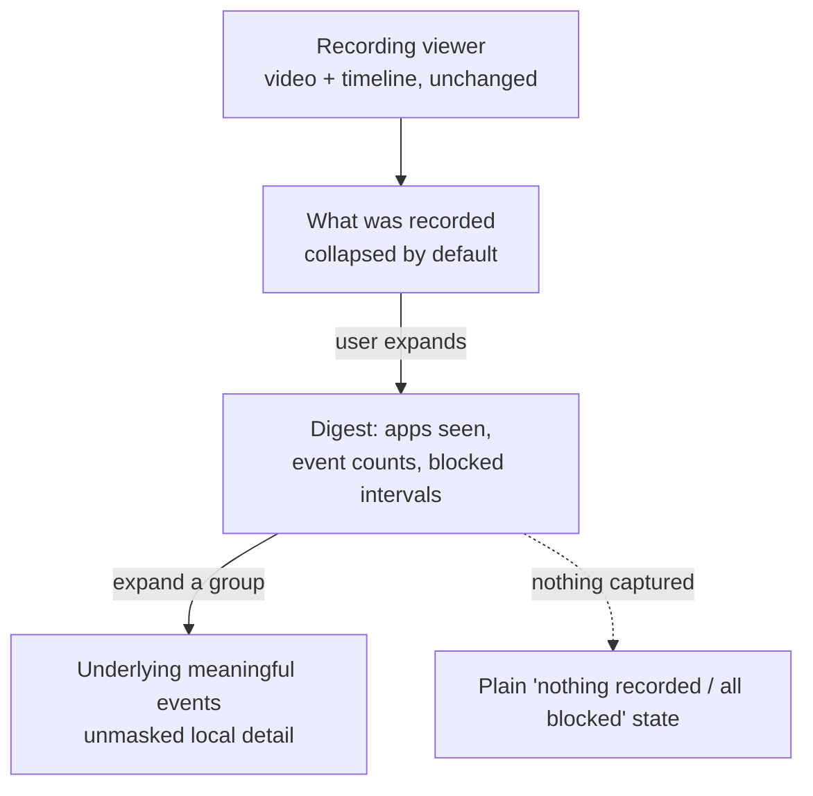
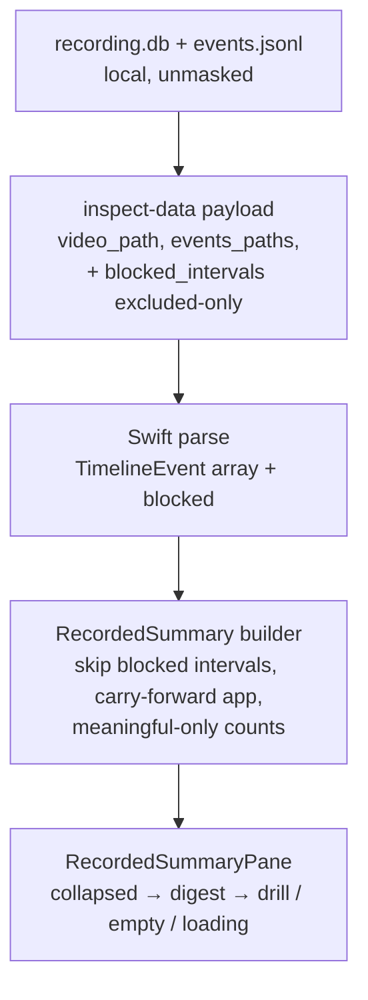

# Captured Events Summary - Plan

## Goal Capsule

- **Objective:** Give a non-technical user at-a-glance reassurance about what a recording actually captured, via a collapsed-by-default "what was recorded" summary inside the recording viewer.
- **Product authority:** Brainstorm requester (product owner).
- **Execution profile:** Standard, 4 units. Mostly a SwiftUI addition inside the existing inspect window plus one additive extension to the local `inspect-data` payload. Read-only display of data that already exists — no capture, migration, or upload changes.
- **Stop conditions / blockers:** None blocking. Two implementation-time confirmations remain (Open Questions): the exact scope of the day-strip's "blocked" derivation, and whether to share vs. re-inline the derivation seam.
- **Landing:** Single change spanning the macOS app and its embedded daemon (the Python `inspect-data` change ships in the embedded daemon).

---

## Product Contract

Product Contract changed from the requirements-only artifact — **AE3 and R5** were clarified after planning review: "blocked" is scoped to fully-excluded (never-captured) intervals, and it is shown as time intervals rather than named apps (excluded apps leave no captured name, and naming masked apps would both mislead and leak). This is consistent with the brainstorm's blocked-not-masked decision. All other requirements and IDs are preserved.

### Summary

A collapsed-by-default "what was recorded" summary inside the recording viewer that reassures a non-technical user at a glance — which apps were seen, counts of the meaningful events captured, and where capture was blocked — with each group expandable to the underlying detail.

### Problem Frame

Today the app surfaces capture only as a spatial summary: colored event ticks on the viewer's scrub bar and coverage bands on the day timeline. The older browser viewer that once listed captured events was retired. A user who wants to answer "what did ScreenCap actually record about me here?" has no readable, plain-language account — they must interpret ticks or trust coverage bands. The cost is a trust gap: the person recording their own screen cannot easily verify what was and wasn't captured.

### Key Decisions

- **Reassurance, not forensics.** The view optimizes for a non-technical user confirming what was recorded, not a power user debugging the pipeline. This drives the summary-first form and the meaningful-events scope.
- **Summary-first digest over a full event log.** Lead with a digestible "what was recorded" digest (apps, event counts, blocked moments) and expand per group to detail. A raw scrollable log was considered and rejected as burying the reassurance signal in noise.
- **Meaningful events only.** Show derived events (clicks, typed text, window switches, requests) and exclude the raw input firehose (mouse-moves, key up/down, scroll, screen frames, audio chunks) from the default view.
- **Blocked, not masked, is the local protection story.** The viewer reads unmasked local content, so its "protected" reassurance is capture-time excluded apps (content genuinely never recorded). Masking is an upload-time concept and stays on the consent surface.
- **Hidden by default, inside the viewer.** The summary is collapsed by default within the existing per-recording viewer and expanded on demand — matching the viewer the user already knows, not a new global settings-gated Events surface.

### Requirements

**Placement and reveal**

- R1. The summary lives inside the existing per-recording read-only viewer, as a section that is collapsed by default.
- R2. The user reveals it with an explicit expand affordance; it is never shown expanded on first open.

**What the summary shows**

- R3. When expanded, the summary leads with an at-a-glance digest of what was captured for that recording: the apps seen and counts of the meaningful events by kind.
- R4. The summary reports meaningful events only — clicks, typed text, window switches, network requests, and similar — and excludes raw low-level input (mouse-moves, key up/down, scroll, screen frames, audio chunks).
- R5. The summary shows the intervals where capture was provably blocked (fully-excluded apps, never recorded) for that recording, as reassurance that the guardrails held.

**Detail and honest states**

- R6. Each summary group expands to the underlying meaningful events it covers, showing the same unmasked local content the viewer already renders (typed text, app, window, and similar).
- R7. When a recording captured nothing meaningful (fully blocked or idle), the summary says so plainly instead of showing an empty or broken view.

**Integrity**

- R8. The summary is strictly read-only — it surfaces captured and blocked data for viewing only, with no affordance to edit, delete, or redact events.

### Reveal and drill-down structure

### Key Flows

- F1. Check what was recorded
  - **Trigger:** The user opens a recording in the viewer and wants to confirm what was captured.
  - **Steps:** The viewer opens unchanged → the user expands the collapsed "what was recorded" summary → sees the digest (apps, event counts, blocked intervals) → optionally expands a group to the underlying events.
  - **Outcome:** The user understands what was and wasn't captured for that recording, in plain language, without interpreting ticks or leaving the viewer.
  - **Covered by:** R1, R2, R3, R5, R6

- F2. Recording captured nothing
  - **Trigger:** The user expands the summary on a recording that was fully blocked or idle.
  - **Steps:** The summary finds no meaningful events → shows a plain "nothing was captured here" statement instead of an empty panel.
  - **Outcome:** The user is reassured rather than confused by an empty view.
  - **Covered by:** R5, R7

### Acceptance Examples

- AE1. **Covers R1, R2.** Given a recording open in the viewer, when the user first opens it, then the "what was recorded" summary is present but collapsed.
- AE2. **Covers R3, R4.** Given the summary is expanded, then it shows apps seen and counts of meaningful events (clicks, typed text, window switches, requests) and does not list raw mouse-moves or key up/down.
- AE3. **Covers R5.** Given a recording where an app was fully excluded from capture, when the user expands the summary, then it shows that time interval as blocked (not captured).
- AE4. **Covers R6.** Given the expanded summary, when the user expands an app group, then it reveals the underlying meaningful events with the same unmasked local content the viewer already shows.
- AE5. **Covers R7.** Given a recording where nothing meaningful was captured, when the user expands the summary, then it states that plainly instead of showing an empty view.
- AE6. **Covers R8.** Given the summary in any state, then it offers no affordance to edit, delete, or redact events.

### Success Criteria

- **Human outcome:** a non-technical user can answer "what did ScreenCap record about me here?" from inside the viewer, in plain language, without interpreting ticks or leaving the surface.
- **Trust outcome:** the view honestly shows what was captured and where capture was blocked, never implies the local copy is masked, never counts or reveals content from blocked intervals, and never lets the user alter the record.

### Scope Boundaries

- Masking and redaction reassurance — masking is upload-time and stays on the consent surface; the viewer shows unmasked local content, and masked-but-captured apps are not shown as "blocked."
- The raw event firehose (mouse-moves, key up/down, scroll, screen frames, audio chunks) as a default view — excluded as noise.
- A global settings-gated "show captured events" toggle and dedicated Events surface — rejected in favor of the in-viewer disclosure.
- A full inline chronological event log as the primary form — rejected in favor of the summary-first digest.
- Editing, deleting, or redacting events — the surface is read-only.
- The upload/consent flow, capture, and the privacy/redaction pipeline — unchanged.

#### Deferred to Follow-Up Work

- Surfacing the same "what was recorded" summary while browsing history in the Journal day view. This plan is viewer-only (per-recording).
- Persisting the summary's expanded/collapsed state across recordings — v1 re-collapses on every open (faithful to "hidden by default").
- Extending the blocked digest to unverifiable coverage gaps (this plan shows provably-excluded intervals only — see KTD3).

### Dependencies / Assumptions

- The viewer already exists and reads unmasked local content through the `inspect-data` path; this feature reads the already-produced per-chunk `events.jsonl` and adds no new capture.
- Meaningful vs. raw event types are already distinguished in the engine's event vocabulary; the "meaningful only" filter reuses that distinction (verified against the emitted type set — see KTD4).
- The day timeline's blocked-interval derivation is a pure on-disk function (reads `recording.db` + privacy config) and is daemon-free, so it can be invoked from `prepare_inspect_data`; it is module-private/day-scoped today (see KTD2 and Open Questions).
- The viewer is already read-only, so the summary inherits that invariant.
- No events-visibility surface exists today; this is a net-new in-viewer section.

---

## Planning Contract

### Key Technical Decisions

- KTD1. **Compute the digest in the viewer, recomputed on the completed event array.** Events are decoded on a detached task that finishes *after* the window reaches `ready`, so the digest must be a function of the completed `timelineEvents` array and recompute when it changes — never gated on `model.state == .ready` or a "parse started" flag, or long recordings would build the summary from a partial/empty array. The build (attribution fold + counts) is a single O(N) pass over the time-sorted events. This keeps the digest colocated with the data and avoids a Python round-trip for counts.
- KTD2. **Source blocked intervals through the `inspect-data` payload by reusing the day-timeline derivation.** Blocked data isn't exposed to the viewer today (only day-scoped via the daemon). Extend `prepare_inspect_data` to emit blocked intervals for the recording by reusing `backfill.skip_intervals.derive_skip_intervals` (with `build_classifier_evaluator`) over the recording's own `recording.db` and time window — the same disk-read derivation `day_segments` uses for the day strip. It is daemon-free, so there is no daemon round-trip and no new endpoint (the earlier fallback is dropped). Correcting an earlier misattribution: `recorder_enforcement.get_blocked_intervals` is the *live* in-memory tracker and is empty for a completed recording — not the source. When timing is null (video-only / empty recordings), derive the window from `recording.db` row min/max timestamps, or emit an empty array if no window resolves — never crash.
- KTD3. **Blocked = provably-not-captured (excluded) only.** Emit only intervals whose action is capture-time exclusion — apps/moments whose pixels were never recorded. Masked intervals (`MASK_WINDOW`/`MASK_REGION`) are captured locally and masked only in the upload copy, so they are NOT shown here; presenting them as "not captured" would be false and would contradict the brainstorm's blocked-not-masked decision. Unverifiable coverage gaps are likewise excluded.
- KTD4. **Meaningful-events filter, per-app attribution, and blocked-interval skip.** Count the derived kinds `mouse.singleclick`/`doubleclick`/`drag`, `key.type`/`shortcut`/`special`, `window.switch`/`state`, `network.request`/`response` (verify the set against `src/screencap/engine/events.py` `EVENT_TYPE_MAP` — `mouse.click` is not an emitted type). Exclude the raw kinds (`mouse.move`, `mouse.down`/`up`, `mouse.scroll`, `key.down`/`up`, `screen.frame`, `audio.chunk`). Only `window.switch`/`state` carry `app_name`, so attribute every other meaningful event to the app of the nearest preceding window switch (a running-current-app fold over the time-sorted stream); events before the first window switch go to an "unknown" bucket. Drop any event whose timestamp falls inside a blocked interval before counting or grouping — matching the repo's ALLOW-only index discipline (`content_index`/`backfill`/`frame.nearest`) so the digest never counts or reveals content the policy flagged. Render per-kind counts with friendly labels (Clicks, Typed text, App/window switches, Network requests), never raw dotted type strings.
- KTD5. **Blocked shown as intervals, not named apps.** Excluded apps leave no captured name, and naming would be infeasible and (for any masked case) leaky. Present blocked as a reassurance line — a count of blocked intervals plus total span — with `HH:MM–HH:MM` ranges on drill-down.
- KTD6. **Collapsed-by-default, no persisted state, read-only, accessible.** Reuse the existing `DisclosureGroup` pattern; re-collapse on every open; no mutating controls (R8). Give the disclosures and the blocked row descriptive VoiceOver labels mirroring `DayStripAccessibility` (e.g. the blocked row announces "Blocked, nothing captured, HH:MM to HH:MM"). Expanded-state persistence is deferred.
- KTD7. **Distinguish "still parsing" from "genuinely empty"; never gate readiness on the summary.** Because events parse asynchronously after `ready`, the pane shows a brief neutral "reading captured events" placeholder while parsing is in flight and only shows the honest empty state after parsing completes with zero meaningful events. A video-only recording (no events, null timing) is a supported empty case; the window still reaches `ready` (per the nullable-timing learning).

### High-Level Technical Design

Data flow from on-disk local recording to the collapsed summary pane. The counts and attribution are derived viewer-side; only the blocked intervals require a payload change.

The two changed surfaces: `prepare_inspect_data` gains a `blocked_intervals` field (U1), and the Swift side gains a pure digest builder (U2) plus the pane (U3) wired into the ready layout (U4).

### Assumptions

- `derive_skip_intervals` is a pure disk function callable from `prepare_inspect_data` without the daemon (it reads `recording.db` + privacy config); it is module-private/day-scoped today, so U1 scopes it to one recording or re-inlines the call.
- `REVIEW_SCHEMA_VERSION` is shared by `prepare_review_data` and `prepare_inspect_data`; bumping it to 4 also increments the review envelope, which is harmless — no consumer hard-gates on `== 3`, and the Swift decoder ignores unknown keys.
- `events.jsonl` for a completed recording is already exported by the inspect path (`ensure_canonical_events`); no new export step.

### Open Questions

**Deferred to Implementation**

- [Affects KTD3][Technical] Confirm the day strip's `blocked_proven` derivation is scoped to capture-time exclusion so the viewer's blocked count stays consistent with the day timeline; if the day strip includes additional skip reasons, reconcile the labels rather than diverging.
- [Affects U1][Code-org] Whether to expose the recording-scoped blocked derivation as a small shared helper or re-inline `derive_skip_intervals` inside `prepare_inspect_data` (the seam is module-private today).

---

## Implementation Units

### U1. Emit excluded-only blocked intervals in the inspect-data payload

- **Goal:** `prepare_inspect_data` returns capture-time-excluded blocked intervals for the recording so the viewer can show them.
- **Requirements:** R5; AE3.
- **Dependencies:** none.
- **Files:** `src/screencap/review.py` (`prepare_inspect_data`, `REVIEW_SCHEMA_VERSION`); the recording-scoped reuse of `src/screencap/backfill/skip_intervals.py` (`derive_skip_intervals`, `build_classifier_evaluator`) as used by `src/screencap/day_segments.py`; `tests/test_cli_inspect_data.py`.
- **Approach:** Invoke the day-timeline blocked derivation scoped to this recording's `rec_dir` + `recording.db` over its own time window, filtered to the capture-time exclusion action only (KTD3). Emit `blocked_intervals: [{start_ms, end_ms}]`. When timing is null, source the window from `recording.db` row min/max, or emit an empty array if none resolves — never crash. Bump `REVIEW_SCHEMA_VERSION` (3 → 4); the field is additive and optional. Do not call `recorder_enforcement.get_blocked_intervals` (live tracker, empty here).
- **Execution note:** Privacy-bearing — it determines what was excluded. Mark the new Python test `@pytest.mark.privacy` and keep it Vision-free, or CI will not run it.
- **Patterns to follow:** `day_segments`' use of `derive_skip_intervals` + `build_classifier_evaluator`; `prepare_inspect_data` already reads `recording.db` for timing; fixtures in `tests/test_cli_inspect_data.py`.
- **Test scenarios:**
  - Covers AE3. A recording where an app was capture-time excluded → `blocked_intervals` contains that span with correct `start_ms`/`end_ms`.
  - A masked-but-captured (`MASK_WINDOW`) app → its interval is NOT in `blocked_intervals`.
  - A recording with no exclusion → `blocked_intervals` is an empty array, not null or missing.
  - A null-timing (video-only) recording → the derivation resolves a window from row min/max or returns an empty array, and does not raise.
  - Additive schema: the payload still decodes for a consumer ignoring the new field; `schema_version` is 4.
- **Verification:** `pytest -m privacy tests/test_cli_inspect_data.py` passes; emitted spans match the recording's excluded intervals and omit masked ones.

### U2. Build the recorded-events digest (pure Swift helper)

- **Goal:** A pure function mapping `([TimelineEvent], blocked intervals, duration)` to a `RecordedSummary` model: per-app counts (carry-forward attribution), meaningful-event-kind counts, blocked count/span, and an `isEmpty` flag.
- **Requirements:** R3, R4, R5, R7; AE2, AE3, AE5.
- **Dependencies:** none (pure; blocked intervals passed in).
- **Files:** `macos/ScreenCap/Views/Inspect/RecordedSummary.swift` (new — model + builder); `macos/ScreenCapTests/RecordedSummaryTests.swift` (new).
- **Approach:** Drop any event whose timestamp falls inside a blocked interval. Filter the rest by `type` to the meaningful set (KTD4; use `mouse.singleclick`, not `mouse.click`). Attribute each event to the app of the nearest preceding `window.switch`/`state` (running-current-app fold over the time-sorted stream); pre-first-switch events go to "unknown". Count per app and per kind (friendly labels). Fold blocked intervals into a count + total span. Set `isEmpty` when there are zero meaningful events after the blocked skip.
- **Patterns to follow:** pure-helper testable pattern in `macos/ScreenCapTests/SearchRankingTests.swift`, `QueryParserTests.swift`.
- **Test scenarios:**
  - Covers AE2. Input mixing raw (`mouse.move`, `key.down`) and meaningful (`mouse.singleclick`, `key.type`, `window.switch`, `network.request`) → counts include only meaningful kinds; raw excluded; `mouse.singleclick` is counted as a click.
  - Carry-forward attribution: a `window.switch` to Safari followed by clicks and a `key.type`, then a switch to Mail followed by clicks → the Safari and Mail per-app counts include those clicks/typing; events before the first switch land in "unknown".
  - Covers AE3. A meaningful event whose timestamp lands inside a blocked interval is excluded from both the counts and its app group.
  - Covers AE5. Zero meaningful events after the blocked skip (only raw, or none) → `isEmpty` is true.
- **Verification:** `RecordedSummaryTests` pass in the `ScreenCap` test scheme.

### U3. Recorded-events summary pane (collapsed-by-default view)

- **Goal:** A SwiftUI view rendering `RecordedSummary` as a collapsed-by-default "What was recorded" disclosure, expandable to the digest, with each app group expandable to its underlying meaningful events; a blocked reassurance line; honest empty and loading states; strictly read-only and accessible.
- **Requirements:** R1, R2, R3, R5, R6, R7, R8.
- **Dependencies:** U2.
- **Files:** `macos/ScreenCap/Views/Inspect/RecordedSummaryPane.swift` (new).
- **Approach:** Outer `DisclosureGroup` collapsed by default (`@State expanded = false`). Digest rows: per-app groups ordered by descending meaningful-event count with "unknown" pinned last, friendly per-kind labels, and a blocked line ("N blocked intervals — Xm Ys not captured") with `HH:MM–HH:MM` ranges on drill-down. A nested per-app `DisclosureGroup` reveals the underlying meaningful events, reusing the read-only row style from `EventContentPane`. Show a brief "reading captured events" placeholder while parsing is in flight; show the empty state only after parsing completes with `isEmpty`. Give the disclosures and the blocked row `accessibilityLabel`s mirroring `DayStripAccessibility`. No mutating controls.
- **Execution note:** Read-only invariant (R8) — verify in review that the pane exposes no mutating affordance.
- **Patterns to follow:** `DisclosureGroup` usage in `InspectWindow.swift` (error-details section); row rendering in `macos/ScreenCap/Views/Review/EventContentPane.swift`; accessibility strings in `DayStripAccessibility` (`macos/ScreenCap/Views/Timeline/`).
- **Test scenarios:**
  - Covers AE1. The pane's initial expanded state is collapsed (false).
  - Covers AE3. Given a summary with blocked intervals, the pane renders a blocked reassurance line indicating time was not captured.
  - Covers AE5. Given a parsed `isEmpty` summary, the pane renders the plain "nothing recorded" message, not an empty list; given parse-in-flight, it renders the loading placeholder, not the empty state.
  - Covers AE6. The pane exposes no mutating affordance (verified by inspection / view-model surface — no delete/edit action, no write binding).
- **Verification:** Pane renders collapsed by default; expanding shows the digest and blocked line; app-group expand shows events; empty and loading states are distinct.

### U4. Wire the summary into the inspect window and decode blocked

- **Goal:** Insert `RecordedSummaryPane` after `TimelinePane` in the inspect window's ready layout; decode the payload's `blocked_intervals`; rebuild `RecordedSummary` whenever `timelineEvents` changes; never gate readiness on it.
- **Requirements:** R1, R2, R6, R7; AE1, AE4, AE5.
- **Dependencies:** U1, U2, U3.
- **Files:** `macos/ScreenCap/Views/Inspect/InspectWindow.swift` (ready-state `VStack`); the `InspectData` model/decoder (add optional `blockedIntervals` — in `InspectWindowViewModel` or the `InspectData` struct); `macos/ScreenCapTests/InspectWindowViewModelTests.swift`.
- **Approach:** Extend `InspectData` decoding with an optional `blockedIntervals` array (absent → empty). Recompute `RecordedSummary` (U2) on `timelineEvents` change (inside/after the main-actor assignment), not on the `ready` transition, and pass it plus a parse-in-flight flag to `RecordedSummaryPane`. Insert the pane below `TimelinePane` in the ready `VStack`. Do not gate `ready` on `started_at`/`duration_seconds` or on summary presence.
- **Patterns to follow:** existing `.task`/`Task.detached` event-parse-then-`MainActor.run` flow in `InspectWindow.swift`; `FakeInspectDataLoader` in `InspectWindowViewModelTests.swift`.
- **Test scenarios:**
  - A payload with `blocked_intervals` decodes into the model; a payload without the field (older schema) decodes with empty blocked.
  - Covers AE1. On first `ready`, the summary section is present but collapsed.
  - Covers AE5. A video-only recording (no events, null timing) → the window reaches `ready` and the summary shows its empty state after parse completes.
  - Covers AE4. After `timelineEvents` is assigned, the rebuilt summary drives the pane so app groups are expandable to their underlying events.
- **Verification:** `InspectWindowViewModelTests` pass; manual — open a recording in the viewer, expand "What was recorded," see the digest + a blocked interval line, and drill into an app.

---

## Verification Contract

| Gate | Command / action | Applies to |
|---|---|---|
| Swift unit tests | Build + test the `ScreenCap` scheme (XcodeGen `macos/project.yml`); run `RecordedSummaryTests`, `InspectWindowViewModelTests` | U2, U3, U4 |
| Python privacy lane | `pytest -m privacy tests/test_cli_inspect_data.py` (blocked-sourcing test is `@pytest.mark.privacy`, Vision-free) | U1 |
| Python local run | `PYTHONPATH=src pytest tests/test_cli_inspect_data.py` (worktree convention) | U1 |
| Manual smoke | Open a recording in the viewer; expand "What was recorded"; verify apps/counts (carry-forward attribution), a blocked interval line for an excluded app, drill-down, and the empty/loading states | R1–R8 |

- The new Python test MUST carry `@pytest.mark.privacy` and stay Vision-free, or CI's privacy lane will not run it.
- Assert blocked spans against the `skip_intervals`/day-strip derivation, not the live `recorder_enforcement.get_blocked_intervals` (they differ: the post-hoc derivation is a superset and ms-rounded).
- If the daemon-reconnect Swift test appears to regress, verify against an `origin/main` control before treating it as a real failure — it is a known flake and unrelated to this change.

---

## Definition of Done

**Global**

- R1–R8 satisfied; AE1–AE6 demonstrated.
- The summary is collapsed by default, read-only, shows a meaningful-events digest with carry-forward per-app attribution plus a blocked-interval reassurance line, drills into per-app detail, and distinguishes loading from an honest empty state.
- The digest never counts or reveals content from blocked intervals; blocked is shown as intervals (count + span), scoped to capture-time-excluded apps, never masked ones.
- Viewer readiness is never gated on the summary or on nullable timing; the summary recomputes on the parsed event array, not on the `ready` transition.
- No masking/redaction reassurance, no raw firehose, no settings-gated surface, no Journal placement, no edit affordances (all deferred or out of scope).

**Per unit**

- U1: `inspect-data` payload emits excluded-only `blocked_intervals` (masked intervals omitted, null-timing handled); `schema_version` bumped additively; privacy-marked test green.
- U2: digest builder unit tests green (blocked-interval skip, carry-forward attribution, `mouse.singleclick` counted, empty state).
- U3: pane renders collapsed by default, expands to digest + blocked line + per-app detail, distinguishes loading from empty, carries accessibility labels, and exposes no mutating affordance.
- U4: pane wired below the timeline; `blocked_intervals` decoded with back-compat; summary rebuilt on `timelineEvents` change without gating readiness.

**Cleanup**

- No dead scaffolding or abandoned-approach code in the diff; the schema bump is reflected wherever the review schema version is asserted; no absolute paths in code or plan.

---

## Sources / Research

- Viewer / inspect surface: `macos/ScreenCap/Views/Inspect/InspectWindow.swift`, `macos/ScreenCap/State/InspectWindowOpener.swift`; local unmasked data via `screencap inspect-data` in `src/screencap/cli/__init__.py` and `src/screencap/review.py` (`prepare_inspect_data`).
- Event vocabulary + emitted types: `src/screencap/engine/events.py` (`EventType`, `EVENT_TYPE_MAP` — note `mouse.singleclick`, not `mouse.click`).
- Swift event model + parser: `macos/ScreenCap/Views/Review/TimelineEvent.swift` (`TimelineEvent`, `TimelineEventContent`, `RedactableField`, `TimelineEventParser`; only `window.*` events carry `app_name`).
- Per-chunk events export: `src/screencap/exporter.py` (`ensure_canonical_events`); `events.jsonl` / `events_NNNN.jsonl`.
- Blocked-interval derivation (post-hoc, on-disk): `src/screencap/backfill/skip_intervals.py` (`derive_skip_intervals`, `build_classifier_evaluator`) as used day-scoped by `src/screencap/day_segments.py`; rendered by `macos/ScreenCap/Views/Timeline/DayStripView.swift`; exercised by `tests/test_day_segments.py`. Not `recorder_enforcement.get_blocked_intervals` (live in-memory tracker).
- ALLOW-only skip discipline precedent: `content_index` / `backfill` / `frame.nearest` skip all policy-flagged intervals.
- Accessibility precedent: `DayStripAccessibility` blocked-label strings.
- Nullable-timing tolerance for Swift consumers: `docs/solutions/integration-issues/review-data-nullable-timing-swift-consumer-2026-06-01.md`.
- Prior brainstorm on the read-only viewer separation: `docs/brainstorms/2026-06-26-inspect-vs-upload-surface-separation-requirements.md`; plan `docs/plans/2026-06-26-003-feat-native-inspect-window-plan.md`.
