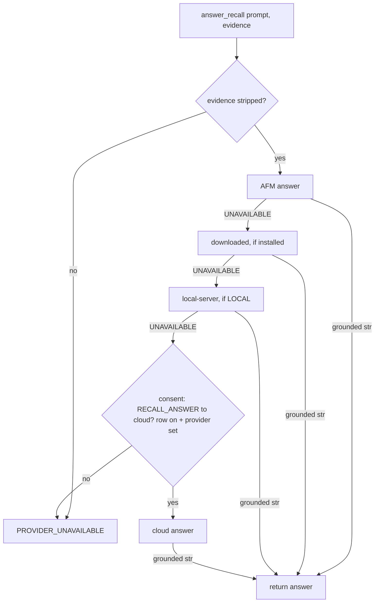

# On-Device LLM Generation Endpoint - Plan

## Goal Capsule

- **Objective:** Add a free-form prompt→answer generation path to the Intelligence provider layer so Conversational Recall Chat can answer questions on-device by default, with a consented cloud fallback. Today the on-device backend only does session→named-task segmentation.
- **Product authority:** Rute Figueiredo.
- **Linear:** SCR-243 (related: SCR-239, narrowed to day-split-only per the coordination note posted on both tickets).
- **Execution profile:** Deep; cross-language (Python provider layer + the Swift `IntelligenceHelper`), branch `rutefig/scr-243-high-on-device-llm-text-generation-endpoint-foundation`.
- **Stop conditions:** No blocking product question remains. The only external gate is the U11 manual eval, which needs a macOS-26 machine with Apple Intelligence enabled; landing that machine is not required to complete the Python/Swift units — mark the eval pending if the hardware is unavailable.
- **Tail ownership:** Open a PR per repo convention when the units land; follow existing PR/landing practices.

---

## Product Contract

**Product Contract preservation:** R1–R13, F1–F2, AE1–AE6 carried verbatim from the requirements-only version. The two Product Contract Outstanding Questions were resolved at planning time (see Planning Contract KTD3 and KTD5). Planning also added untrusted-output and marker-trust hardening (KTD10, KTD11) — HOW-level controls consistent with the existing R11/R12 privacy posture, not a change to product scope; R-IDs are unchanged. The Outstanding Questions subsection below points at those decisions and carries one new integration-time question (the `Evidence` shape).

### Summary

Add an interactive `answer(prompt, evidence) -> str | PROVIDER_UNAVAILABLE` capability to the Intelligence provider layer: a new `GenerationProvider` seam sibling to the batch `LLMProvider.segment` seam, a single `answer_recall(prompt, evidence)` dispatcher that owns consent resolution and the on-device→cloud fallback, and a free-form generation path in the Apple Foundation Models Swift helper. The consumer (Conversational Recall Chat) supplies privacy-stripped evidence and calls one function.

### Problem Frame

The Intelligence provider layer (local-first-intelligence, PR #345) is built, but its on-device backend — `OnDeviceProvider`, the Apple Foundation Models Swift-helper subprocess client — only exposes `segment(activity_summary)`, session→named-task segmentation with a fixed guided-generation schema. Conversational Recall Chat needs the opposite call shape: a free-form question plus retrieved evidence in, grounded prose out. That path does not exist anywhere in the provider layer today.

The two flows differ in more than the prompt. Segmentation is a batch call from the terminal stage, returns a structured tasks dict validated by `validate_llm_tasks`, and its degradation ladder (`degrade.py`, `ChainedOnDeviceProvider`) is shaped around that one-shot result. Recall-answering is interactive — a user asks Chat live — returns plain text, and has no structured-repair step because a grounded "I don't know" is itself a valid answer. Until this lands, on-device chat answers are unavailable and Chat can only run via a downloaded local model or a consented cloud provider.

The consent scaffolding is already in place: `TaskKind.RECALL_ANSWER` exists in the matrix, `config.get_recall_cloud_consent()` exists, and `degrade.py` can already resolve `RECALL_ANSWER` to cloud. Nothing calls a generation path today.

### Key Decisions

- **Sibling `GenerationProvider` protocol, not an extension of `LLMProvider`.** A new narrow protocol carries `answer(prompt, evidence)`; the generation-capable backends implement it alongside `LLMProvider`. This keeps the batch `segment` seam as narrow as its contract promises (tasks dict / `None` / `PROVIDER_UNAVAILABLE`) and avoids forcing an `answer()` stub onto segmentation-only constructs (`ChainedOnDeviceProvider`, `UnavailableProvider`). The same concrete classes host both methods, so on-device reuses its helper discovery, subprocess plumbing, and stripped gate.
- **The dispatcher seam owns consent and fallback.** A single `answer_recall(prompt, evidence)` resolves the consent target and runs the on-device→cloud cascade in one tested place, mirroring how `degrade.py` concentrates segmentation fallback. The consumer supplies stripped evidence and calls one function; the RAG retrieval that produces evidence stays out (Chat plan).
- **The full on-device-class chain is wired now.** `answer_recall` builds an on-device-class answer provider — AFM → downloaded (if installed) → local-server (if the endpoint classifies LOCAL) — then consented cloud, analogous to `build_day_split_provider`. Consequently `answer()` is implemented on all four backends and a chained-generation provider is added in this ticket. This narrows SCR-239 to day-split-only.
- **The `evidence` contract is defined here.** `evidence` carries its text content plus a stripped marker, mirroring how `activity_summary` carries `stripped=True`. This ticket is the producer of the seam, so it defines the contract; the Chat plan is the consumer and conforms to it. Producing stripped evidence is the Chat plan's retrieval job.
- **Grounding is prompt-level, and the instructions live here.** The backend assembles the user's `prompt` and `evidence` into the model input with an "answer only from the evidence; if it is insufficient, say so" framing — the generation analogue of the Swift helper's `promptInstructions` for segmentation. There are no structured citations and no JSON envelope for answers; a grounded refusal is a normal string. The `str | PROVIDER_UNAVAILABLE` return therefore has no `None` third state.
- **The Swift helper routes by task, backward-compatibly.** The helper gains a free-form generation path under the existing `#available(macOS 26)` guard and the same `{status, result}` stdout envelope. The stdin payload gains a task discriminator; an absent discriminator defaults to segmentation, so the existing path is unchanged. The helper still compiles on the macOS-13 floor.

### Requirements

**Swift helper (Apple Foundation Models)**
- R1. The helper accepts a free-form generation request (user prompt + stripped evidence) and returns grounded prose, distinct from the segmentation task-list path.
- R2. Task routing in the helper selects segmentation vs. generation from a discriminator in the stdin payload; an absent discriminator defaults to segmentation so the existing envelope is unchanged.
- R3. The generation path is gated by `#available(macOS 26)` and emits the same `{"status":"ok","result":...}` / `{"status":"unavailable","reason":...}` envelope; any unavailability (OS below floor, Apple Intelligence off, model not ready, model error) yields an `unavailable` envelope with exit 0.
- R4. The helper still compiles against the macOS-13 floor, with the generation code behind the same availability / `canImport` guards as segmentation.

**Python generation seam**
- R5. A `GenerationProvider` protocol declares `answer(prompt, evidence) -> str | PROVIDER_UNAVAILABLE`, sibling to `LLMProvider`; it never raises for an ordinary model or API error.
- R6. `OnDeviceProvider` implements `answer(...)` via the Swift-helper subprocess, reusing helper discovery, the scrubbed-env spawn, the timeout, and the envelope parser; it returns `PROVIDER_UNAVAILABLE` on a missing helper, below-floor, model-off, timeout, or unparseable-envelope outcome.
- R7. The cloud, downloaded, and local-server backends each implement `answer(...)`; the cloud backend uses a free-form, unstructured generation call (no response schema).

**Dispatcher, routing, and consent**
- R8. `answer_recall(prompt, evidence)` is the single entry point Chat calls; it returns grounded text or `PROVIDER_UNAVAILABLE`.
- R9. `answer_recall` builds an on-device-class answer chain (AFM → downloaded if installed → local-server if LOCAL) that cascades only on `PROVIDER_UNAVAILABLE`, then falls back to the configured cloud provider only when on-device is unavailable AND `recall_cloud_consent` is on AND a cloud provider is configured; otherwise it returns `PROVIDER_UNAVAILABLE`.
- R10. Consent resolution routes through the existing `ConsentPolicy` / `degrade` machinery for `RECALL_ANSWER`; the dispatcher does not re-decide the matrix.

**Privacy gate**
- R11. `answer_recall` and every generation backend refuse any `prompt` / `evidence` not marked stripped, returning `PROVIDER_UNAVAILABLE` without spawning the helper or making a cloud call — fail-closed, mirroring the segment privacy gate.
- R12. Frames and images never reach the answer path; evidence is stripped text only, preserving the consent matrix's never-cloud-frames rule.

**Verification**
- R13. Grounded-answer quality is validated by a manual eval on a macOS-26 machine with Apple Intelligence enabled. No automated grounding test exists — Apple Intelligence is unavailable in CI.

### Key Flows

- F1. Recall answer (interactive)
  - **Trigger:** Chat calls `answer_recall(prompt, evidence)` with stripped evidence.
  - **Steps:** Gate checks the stripped marker (refuse → `PROVIDER_UNAVAILABLE`). Build the on-device-class answer chain from the active-provider config. Try each on-device backend in order, cascading only on `PROVIDER_UNAVAILABLE`. On a grounded string, return it. If the whole on-device chain is unavailable, consult consent; if `RECALL_ANSWER` resolves to cloud, call the cloud backend's `answer`, else return `PROVIDER_UNAVAILABLE`.
  - **Outcome:** Grounded prose, or `PROVIDER_UNAVAILABLE` — Chat surfaces the unavailable state and never hard-fails.
  - **Covers:** R8, R9, R10, R11.
- F2. On-device generation (helper subprocess)
  - **Trigger:** `OnDeviceProvider.answer` is invoked by the chain.
  - **Steps:** Resolve the helper; spawn with a scrubbed env and timeout; stdin carries the generation request (task discriminator + prompt + stripped evidence). Under the macOS-26 guard the helper assembles grounding instructions plus evidence and generates free-form text. The envelope is parsed to a string or `PROVIDER_UNAVAILABLE`.
  - **Outcome:** Grounded string or `PROVIDER_UNAVAILABLE`.
  - **Covers:** R1, R2, R3, R6.

### Acceptance Examples

- AE1. On-device available. **Given** macOS 26 with Apple Intelligence on and stripped evidence, **when** `answer_recall` runs, **then** it returns grounded prose from the on-device model with no cloud call. **Covers:** R6, R8.
- AE2. On-device unavailable, cloud consented. **Given** the on-device chain returns `PROVIDER_UNAVAILABLE` (e.g. below macOS 26) and `recall_cloud_consent` is on with a cloud provider configured, **when** `answer_recall` runs, **then** it returns grounded prose from the cloud backend. **Covers:** R7, R9.
- AE3. On-device unavailable, cloud not consented. **Given** the on-device chain is unavailable and `recall_cloud_consent` is off (or no cloud provider is configured), **when** `answer_recall` runs, **then** it returns `PROVIDER_UNAVAILABLE` with no cloud call. **Covers:** R9.
- AE4. Unstripped evidence. **Given** evidence not marked stripped, **when** `answer_recall` or any backend is called, **then** it returns `PROVIDER_UNAVAILABLE` without spawning the helper or calling cloud. **Covers:** R11.
- AE5. Ordinary model error. **Given** the on-device model raises mid-generation, **when** `OnDeviceProvider.answer` runs, **then** it returns `PROVIDER_UNAVAILABLE` and never raises. **Covers:** R5, R6.
- AE6. Grounded refusal. **Given** evidence insufficient to answer, **when** the model generates, **then** the answer is a normal string stating it cannot answer from the evidence — not `None`, not an error. **Covers:** the grounding decision.

### Scope Boundaries

**Deferred / owned elsewhere**
- RAG retrieval, evidence assembly, prompt orchestration, and the Chat UI — the Conversational Recall Chat plan.
- The daemon verb / MCP surface that invokes `answer_recall` — the Chat plan's integration.
- Downloaded / local-server models as **day-split** fallbacks — SCR-239 (now day-split-only).
- Producing stripped evidence — the Chat plan's retrieval; this ticket only enforces the marker.

**Out**
- Segmentation logic changes.
- Structured citations or evidence-provenance in answers — grounding is prompt-level plus manual eval.

### Dependencies / Assumptions

- The Intelligence provider layer, consent matrix, and Swift-helper subprocess mechanics (PR #345) exist and are the reuse base — verified in this worktree.
- The Conversational Recall Chat plan (`docs/plans/2026-07-09-001-feat-conversational-recall-chat-plan.md`, SCR-243's dependent) is not present in this worktree. This ticket defines the `answer_recall` / `evidence` contract and the plan conforms to it.
- The manual eval requires a macOS-26 machine with Apple Intelligence enabled.

### Outstanding Questions

The two prior planning questions are resolved — see Planning Contract KTD3 (prompt assembly split) and KTD5 (REMOTE BYO endpoint in the answer chain).

**Deferred to Chat-plan integration (non-blocking):** whether `Evidence` should carry a single `text` blob or a list of provenance-bearing chunks (for per-source citations or a chunk timestamp resolvable by `frame.nearest`). The single-`text` shape is frozen here producer-side per the "producer defines the contract" decision, and the Chat plan is absent from this worktree, so the field set cannot be validated against real retrieval yet. Keep the `Evidence` field set additive-extensible and confirm it against the Chat plan's retrieval before the seam is treated as final — a mismatch would force either a breaking change to a shipped seam or a lossy flatten in the consumer. This does not block implementing the backend; it blocks declaring the contract final.

### Sources / Research

- `src/screencap/segmentation/provider.py` — `LLMProvider` protocol, `PROVIDER_UNAVAILABLE`, `get_provider` factory (the seam to sit beside).
- `src/screencap/segmentation/providers/ondevice.py` — `OnDeviceProvider.segment`, helper discovery, scrubbed-env spawn, envelope parser, stripped gate (the reuse base for `answer`).
- `macos/IntelligenceHelper/main.swift` — the Swift helper: envelope, macOS-26 guard, `promptInstructions` + `@Generable` segmentation (add the generation path here).
- `src/screencap/segmentation/consent.py` — `TaskKind.RECALL_ANSWER`, `ConsentPolicy.resolve` (prefer on-device, consented-cloud fallback).
- `src/screencap/segmentation/degrade.py` — `resolve` already maps `RECALL_ANSWER` → cloud; reuse for the dispatcher.
- `src/screencap/segmentation/routing.py` — `build_day_split_provider` (the template for `build_answer_provider`).
- `src/screencap/segmentation/providers/chained.py` — `ChainedOnDeviceProvider` / `UnavailableProvider` (templates for the chained/unavailable generation providers).
- `src/screencap/segmentation/providers/gemini.py` / `local_server.py` / `downloaded.py` — the three Python backends' `segment` shape (add `answer`).
- `src/screencap/segmentation/local_finish.py` — segmentation prompt/finalize tail (NOT reusable for generation; the template for a parallel generation seam).
- `src/screencap/segmentation/sanitize.py` (`sanitize_tasks`) + `SECURITY.md` — the untrusted-model-output posture the `sanitize_answer` control (KTD10) mirrors.
- `tests/segmentation/test_stripped_marker_guard.py` — the AST marker guard the `Evidence(stripped=True)` guard (KTD11) mirrors.
- `src/screencap/segmentation/local_model/runtime.py` + `worker.py` — the JSON/GBNF-bound `generate()` the new grammar-free `generate_text` (KTD8/U10) sits beside.
- `src/screencap/config.py:467-558` — `get_llm_provider`, `get_llm_cloud_provider`, `get_recall_cloud_consent` (no new config needed).

---

## Planning Contract

### Key Technical Decisions

- KTD1. **`GenerationProvider` is a new module, not an addition to `provider.py`.** A `src/screencap/segmentation/generation.py` module hosts the `GenerationProvider` Protocol (`runtime_checkable`), the `Evidence` type, and `GenerationResult = Union[str, ProviderUnavailable]`. It imports the shared `PROVIDER_UNAVAILABLE` from `provider.py` (single sentinel across both seams). This keeps `provider.py`'s segment-only docstring and contract intact.
- KTD2. **`Evidence` is a frozen dataclass carrying the stripped marker.** `Evidence(text: str, stripped: bool = False)`. Every backend and `answer_recall` gate on `evidence.stripped is True` and refuse otherwise — no helper spawn, no cloud call. A dataclass (over a bare dict) makes the marker explicit and hard to omit; `stripped` defaults `False` so an un-set marker fails closed. `text` MUST be a `str` — enforced at construction and re-asserted before cloud egress, so the never-cloud-frames rule (R12) has a runtime home rather than resting on prose (no frame/image bytes can ride inside `text`).
- KTD3. **Grounding instructions are duplicated Swift-side and Python-side** (resolves the prompt-assembly question). A `src/screencap/segmentation/generation_finish.py` holds `build_answer_prompt(prompt, evidence)` and the Python grounding constant used by the cloud / downloaded / local-server backends; the Swift helper carries its own mirror copy. This is the exact pattern segmentation already uses (`main.swift promptInstructions` mirrors `gemini._LLM_PROMPT`). Python passes raw `prompt` + `evidence` to the helper; the helper assembles its own model input. **Drift risk (accepted):** the two copies have no automated binding, and — unlike segmentation, where a shared `validate_llm_tasks` normalizes output — generation has no validator to mask divergence, so drift means on-device and cloud answers silently obey different grounding framings. Only the hardware-gated U11 eval exercises the Swift copy. Keep the two copies cross-referenced by comment and treat divergence as an eval-visible risk.
- KTD4. **The Swift IPC gains a `task` discriminator; the answer envelope's `result` is a string.** stdin becomes `{"task":"answer","prompt":...,"evidence":...}`; the helper routes to the answer path only on an explicit top-level `task == "answer"`, and everything else (including the existing bare summary dict) stays segmentation — so the current segment IPC is byte-for-byte unchanged. For `task=="answer"` the helper emits `{"status":"ok","result":"<text>"}`. `OnDeviceProvider.answer` uses a new text-envelope parser (expects `result` to be a `str`), distinct from `segment`'s dict parser. **Namespace-collision guard:** the discriminator shares the flat stdin namespace with summary keys and is unambiguous today only because no `build_activity_summary` key is named `task`; if a top-level `task` field is ever added to the summary, the segment payload must be wrapped (`{"task":"segment","summary":{…}}`) as a coordinated helper+provider change so routing never depends on the summary key set.
- KTD5. **REMOTE BYO endpoints are excluded from the answer chain** (resolves the REMOTE question). `build_answer_provider` mirrors the day-split boundary: only a LOCAL-classified local-server joins the on-device-class chain; a REMOTE endpoint resolves to an always-unavailable generation provider. "REMOTE BYO as a consented answer target" is follow-up work, not this ticket.
- KTD6. **`answer_recall` reuses the existing consent machinery for the cloud step.** After the on-device chain returns `PROVIDER_UNAVAILABLE`, the dispatcher resolves `TaskKind.RECALL_ANSWER` with `on_device_available=False` through `ConsentPolicy` (the same path `degrade.resolve` uses) and only calls the configured cloud provider's `answer` on an `ExecutionTarget.CLOUD` result. The cloud fallback lives in the dispatcher, not in `build_answer_provider` — the router returns on-device-class only.
- KTD7. **Cloud and local-server generation calls drop structured output.** `GeminiProvider.answer` calls `generate_content` with no `response_schema` / JSON mime; `LocalServerProvider.answer` posts a chat completion with no `response_format: json_object` and returns `choices[0].message.content` as text — keeping the LOCAL re-assert, `_pin_localhost`, redirect-off, and response size cap.
- KTD8. **The downloaded worker gains a text-generation mode — a new grammar-free runtime method, not a `generate()` reuse.** The runtime's existing `generate(model_path, prompt) -> dict | None` is JSON-bound all the way down: the MLX path retries and returns `None` when output does not parse as JSON, and the llama.cpp path forces `response_format={"type":"json_object","schema":_RESPONSE_SCHEMA}` (a GBNF grammar). Free-form generation inverts that success criterion (any string is valid; JSON is not required), so it needs a genuinely new grammar-free method (e.g. `generate_text`) on **both** the MLX and llama.cpp runtimes returning raw text, plus a worker mode discriminator routing to it. Only the subprocess hardening is reused (allowlist env, single-flight `inference_slot`, RAM precheck, `nice`, size caps) — not the parse/grammar contract. This is the heaviest unit (U10); it pulls a slice of SCR-239's model machinery forward, by decision.
- KTD9. **The generation return contract is two-state.** `answer()` returns `str | PROVIDER_UNAVAILABLE` — no `None`. A grounded refusal is a normal string, so the generation degrade path is simpler than segment's tri-state and `ChainedGenerationProvider` cascades on the single `PROVIDER_UNAVAILABLE` sentinel only. An **empty or whitespace-only** `ok` result is treated as `PROVIDER_UNAVAILABLE` (a genuine grounded refusal is non-empty prose), mirroring the existing "empty stdout → unavailable" rule.

- KTD10. **The answer string is untrusted output and is sanitized before return.** The answer is recording-derived, attacker-influenceable model output surfaced to Chat and, downstream, an MCP/daemon consumer — the same sink class that made segmentation adopt `sanitize_tasks` (KTD12 / `SECURITY.md`). Dropping structured output (KTD7/KTD9) removed the visible JSON boundary but not the untrusted-output requirement. A text analogue — `sanitize_answer` in the `generation_finish` seam (strip control chars / angle-bracket markup, bound length) — is applied by every backend before it returns. **Residual (unfixable by sanitizing):** semantic prompt-injection carried in evidence ("ignore prior instructions…") cannot be scrubbed; the grounding framing is the only mitigation, so the consumer must treat the answer as untrusted — the same posture `SECURITY.md` takes for task names.

- KTD11. **`Evidence(stripped=True)` is builder-restricted.** The fail-closed gate is only as strong as the `stripped` flag's trustworthiness, and here the flag is a plain caller-set boolean whose actual strip runs in the (absent) Chat plan. Mirror segmentation's AST marker guard (`tests/segmentation/test_stripped_marker_guard.py`, which pins the segment `stripped` marker to one builder): a durable AST guard asserts no code inside `segmentation/` mints `Evidence(stripped=True)` except tests. The Chat-plan contract must route `stripped=True` through its own builder-only path with an equivalent guard — a cross-ticket requirement flagged for the Chat plan, not enforceable from here alone.

### High-Level Technical Design

The generation seam is a structural mirror of the segmentation seam — same layering, same sentinel, same subprocess helper — so each new piece has a direct existing template:

| Segmentation (existing) | Generation (this ticket) | File |
|---|---|---|
| `LLMProvider.segment` | `GenerationProvider.answer` | `src/screencap/segmentation/generation.py` (new) |
| `local_finish.build_local_prompt` | `build_answer_prompt` | `src/screencap/segmentation/generation_finish.py` (new) |
| `ChainedOnDeviceProvider` / `UnavailableProvider` | `ChainedGenerationProvider` / `UnavailableGenerationProvider` | `src/screencap/segmentation/providers/chained.py` |
| `build_day_split_provider` | `build_answer_provider` | `src/screencap/segmentation/routing.py` |
| terminal-stage call + `degrade.resolve` | `answer_recall` | `src/screencap/segmentation/recall.py` (new) |
| helper `@Generable` segment path | helper free-form answer path | `macos/IntelligenceHelper/main.swift` |

The runtime cascade `answer_recall` executes is the F1 flowchart in the Product Contract. The key structural difference from day-split: the on-device chain and the consented-cloud step are separated — the router returns on-device-class only, and the dispatcher owns the cloud fallback (day-split never clouds; recall does, under consent).

### Assumptions

- The Chat plan hands `answer_recall` an `Evidence` whose `text` is already stripped and whose `stripped` flag is set truthfully; this ticket enforces the flag but does not itself strip.
- `ruff` scope is the engine sub-package (per CLAUDE.md); the segmentation package is gated by pytest, not ruff. Follow existing segmentation style.

### Sequencing

Phased so the functional AFM → consented-cloud core lands before the heavier downloaded/local-server backends, which are additive (the chain cascades past any unavailable member):

- **Phase A — seam foundation:** U1, U2.
- **Phase B — on-device + cloud core:** U3, U4, U5.
- **Phase C — chain, router, dispatcher:** U6, U7, U8. After Phase C, `answer_recall` is functional for AFM → consented cloud.
- **Phase D — downloaded + local-server backends:** U9, U10 (additive chain members).
- **Phase E — eval:** U11.

Phase D is additive at the **chain** level — the chain cascades past any member that returns `PROVIDER_UNAVAILABLE`, so AFM → cloud keeps working while U9/U10 are pending. It is **not** code-isolated, though: U10 edits `local_model/worker.py` and `runtime.py` entry points (`main()`, the runtime adapter) that the shipped segmentation path also flows through, so U10 must carry segment-path regression coverage — a Phase D change can regress Phase-A-independent segmentation if the shared worker code is touched carelessly.

---

## Implementation Units

### Unit Index

| U-ID | Title | Key files | Depends on |
|---|---|---|---|
| U1 | GenerationProvider protocol + Evidence | `segmentation/generation.py` | — |
| U2 | Grounding-prompt seam | `segmentation/generation_finish.py` | U1 |
| U3 | Swift helper answer path + task discriminator | `macos/IntelligenceHelper/main.swift` | — |
| U4 | OnDeviceProvider.answer | `segmentation/providers/ondevice.py` | U1, U3 |
| U5 | GeminiProvider.answer (cloud) | `segmentation/providers/gemini.py` | U1, U2 |
| U6 | ChainedGenerationProvider + Unavailable | `segmentation/providers/chained.py` | U1 |
| U7 | build_answer_provider router | `segmentation/routing.py` | U4, U6 |
| U8 | answer_recall dispatcher + consent | `segmentation/recall.py` | U2, U4, U5, U6, U7 |
| U9 | LocalServerProvider.answer | `segmentation/providers/local_server.py` | U1, U2 |
| U10 | DownloadedProvider.answer + worker text mode | `segmentation/providers/downloaded.py`, `segmentation/local_model/worker.py`, `runtime.py` | U1, U2 |
| U11 | Manual grounded-answer eval | — | U3, U4, U8 |

### U1. GenerationProvider protocol + Evidence contract

- **Goal:** Define the sibling generation seam and the fail-closed evidence type.
- **Requirements:** R5, R11.
- **Dependencies:** none.
- **Files:** `src/screencap/segmentation/generation.py` (new); `tests/segmentation/test_generation.py` (new).
- **Approach:** Mirror `provider.py`. Define `Evidence(text: str, stripped: bool = False)` as a `@dataclass(frozen=True)`; reject a non-`str` `text` at construction (KTD2, R12). Define `GenerationResult = Union[str, ProviderUnavailable]` and a `runtime_checkable` `GenerationProvider` Protocol with `answer(self, prompt: str, evidence: Evidence) -> GenerationResult`. Import `PROVIDER_UNAVAILABLE` / `ProviderUnavailable` from `provider.py`; add no vendor imports (cloud-free, import-light).
- **Patterns to follow:** `src/screencap/segmentation/provider.py` (`LLMProvider`, sentinel, `SegmentResult`); `tests/segmentation/test_stripped_marker_guard.py` (the AST marker guard to mirror for `Evidence`).
- **Test scenarios** (mark the marker-guard test `@pytest.mark.privacy`):
  - `Evidence` defaults `stripped=False` and is frozen (assignment raises).
  - `Evidence(text=<non-str>)` is rejected at construction. `Covers R12.`
  - A class defining `answer` satisfies `isinstance(obj, GenerationProvider)`; one without it does not.
  - AST guard (KTD11): no module under `src/screencap/segmentation/` constructs `Evidence(stripped=True)` — only tests may. `Covers R11.`
- **Files:** also add `tests/segmentation/test_evidence_marker_guard.py` (the AST guard).
- **Verification:** `PYTHONPATH=src pytest tests/segmentation/test_generation.py` green, including the `-m privacy` marker-guard test.

### U2. Grounding-prompt assembly seam

- **Goal:** A generation-side prompt builder + grounding instructions, parallel to `local_finish.build_local_prompt`.
- **Requirements:** R7 (supports R1's grounding intent on the Python backends).
- **Dependencies:** U1.
- **Files:** `src/screencap/segmentation/generation_finish.py` (new); tests in `tests/segmentation/test_generation.py`.
- **Approach:** Define a grounding-instructions constant ("answer using ONLY the provided evidence; if it is insufficient, say so plainly; do not fabricate") and `build_answer_prompt(prompt: str, evidence: Evidence) -> str` that composes instructions + the user question + the evidence text into one model input. Also define `sanitize_answer(text: str) -> str` (KTD10) — a text analogue of `sanitize_tasks`: strip control characters and angle-bracket markup, bound length — which every backend applies to the model's output before returning. Import-light; no vendor imports. This is the Python-side copy the cloud/downloaded/local-server backends share; the Swift helper carries its own mirror grounding text (KTD3).
- **Patterns to follow:** `src/screencap/segmentation/local_finish.py` (`build_local_prompt` / `finalize_local_result`); `src/screencap/segmentation/sanitize.py` (`sanitize_tasks`, the untrusted-output template).
- **Test scenarios:**
  - The built prompt contains the question text, the evidence text, and the grounding instruction.
  - Empty evidence text still yields a well-formed prompt (no crash).
  - `sanitize_answer` strips control chars / `<...>` markup and bounds length; a benign answer passes through unchanged.
- **Verification:** `PYTHONPATH=src pytest tests/segmentation/test_generation.py` green.

### U3. Swift helper free-form generation path + task discriminator

- **Goal:** Add the generation path to the AFM helper under the macOS-26 guard, routed by a stdin `task` discriminator, backward-compatible with segmentation.
- **Requirements:** R1, R2, R3, R4.
- **Dependencies:** none (shares the IPC contract with U4).
- **Files:** `macos/IntelligenceHelper/main.swift`.
- **Approach:** Read `task` from the stdin JSON (default `"segment"` when absent → unchanged path). For `"answer"`, read `prompt` + `evidence`; assemble Swift-side grounding instructions (mirror of the U2 constant) + evidence; run `LanguageModelSession(instructions:).respond(to:)` returning a `String` (no `@Generable`); emit `{"status":"ok","result":"<text>"}`. Keep the `#available(macOS 26)` guard and the `unavailable` envelope for below-floor / model-off / model-error. Weak-linked `FoundationModels` keeps the macOS-13 compile.
- **Patterns to follow:** existing `runOnDevice` / `emitOK` / `emitUnavailable` / availability guard in `main.swift`; the `@Generable` segment path stays intact.
- **Execution note:** Compile-only plus the U11 manual eval; the Swift path has no CI test (Apple Intelligence absent in CI). The Python-side envelope contract is exercised by U4's fake-helper tests.
- **Test scenarios:** `Test expectation: none in CI` — verified by an XcodeGen + xcodebuild compile (including the macOS-13 floor) and the U11 eval.
- **Verification:** `macos/` app builds; helper target compiles with the FoundationModels code behind the availability guard.

### U4. OnDeviceProvider.answer

- **Goal:** Implement `answer()` on `OnDeviceProvider` via the Swift-helper subprocess.
- **Requirements:** R5, R6, R11.
- **Dependencies:** U1, U3.
- **Files:** `src/screencap/segmentation/providers/ondevice.py`; `tests/segmentation/test_ondevice_provider.py`.
- **Approach:** Add `answer(self, prompt, evidence)`. Fail-closed on `evidence.stripped is not True` — return `PROVIDER_UNAVAILABLE` without spawning. Bound `evidence.text` + `prompt` length before spawn (mirror the downloaded worker's `_MAX_STDIN_BYTES` DoS guard) → oversized returns `PROVIDER_UNAVAILABLE`. Reuse `_resolve_helper`, `_scrubbed_env`, `_helper_timeout_s`. Send `json.dumps({"task":"answer","prompt":prompt,"evidence":evidence.text})` on stdin. Cap helper stdout before parsing (mirror `_MAX_STDOUT_BYTES` — free-form prose is unbounded, unlike the bounded segment schema). Add a `_parse_text_envelope` that returns the `result` string on `status=="ok"` (and `PROVIDER_UNAVAILABLE` when `result` is not a `str`, is empty/whitespace-only, on `unavailable`, or on garbage). Apply `sanitize_answer` (KTD10) to the returned string. Never raise for an ordinary error.
- **Patterns to follow:** `OnDeviceProvider.segment` + `_parse_envelope`; the fake-helper fixture (`_write_helper`, `SCREENCAP_ONDEVICE_HELPER`, `SCREENCAP_ONDEVICE_HELPER_TIMEOUT`) in `tests/segmentation/test_ondevice_provider.py`; `downloaded.py` `_MAX_STDIN_BYTES` / `_MAX_STDOUT_BYTES` (the size-cap template).
- **Test scenarios** (mark the gate/fail-closed cases `@pytest.mark.privacy`):
  - `Covers AE1.` Fake helper emits `{"status":"ok","result":"<text>"}` → returns the sanitized string.
  - `Covers AE4.` Evidence with `stripped=False` → `PROVIDER_UNAVAILABLE`, and the helper is never spawned (point the env at a helper that would write a sentinel file; assert it did not run).
  - Oversized evidence/prompt → `PROVIDER_UNAVAILABLE`, helper not spawned.
  - Helper missing (CLI-only) or emits `{"status":"unavailable",...}` → `PROVIDER_UNAVAILABLE`.
  - `Covers AE5.` Helper exits non-zero / times out / prints garbage / oversized stdout → `PROVIDER_UNAVAILABLE`, never raises.
  - `"ok"` envelope whose `result` is not a string, or is empty/whitespace-only → `PROVIDER_UNAVAILABLE`.
- **Verification:** `PYTHONPATH=src pytest tests/segmentation/test_ondevice_provider.py` green, including the `-m privacy` subset.

### U5. GeminiProvider.answer (cloud, unstructured)

- **Goal:** Free-form cloud generation.
- **Requirements:** R5, R7, R11.
- **Dependencies:** U1, U2.
- **Files:** `src/screencap/segmentation/providers/gemini.py`; `tests/segmentation/test_provider.py`.
- **Approach:** Add `answer(self, prompt, evidence)` with an injectable raw-call seam like `segment` (`_answer_raw_call` default calling `generate_content` with NO `response_schema` and text mime, low temperature; lazy `google.genai` import). Fail-closed on unmarked evidence before any model call. Build the model input via `build_answer_prompt`. Apply `sanitize_answer` (KTD10) to the model text; an empty/whitespace result → `PROVIDER_UNAVAILABLE`. Return the sanitized text or `PROVIDER_UNAVAILABLE`; never raise.
- **Patterns to follow:** `GeminiProvider.segment` / `_call_gemini` (the `raw_call` injection seam).
- **Test scenarios** (privacy-mark the gate test):
  - `Covers AE4.` Unmarked evidence → `PROVIDER_UNAVAILABLE`, injected raw-call not invoked.
  - `Covers AE2.` Injected raw-call returns text → returned.
  - Injected raw-call returns `None` / raises → `PROVIDER_UNAVAILABLE`, never raises.
- **Verification:** `PYTHONPATH=src pytest tests/segmentation/test_provider.py` green.

### U6. ChainedGenerationProvider + UnavailableGenerationProvider

- **Goal:** On-device-class answer cascade and an always-unavailable member.
- **Requirements:** R9.
- **Dependencies:** U1.
- **Files:** `src/screencap/segmentation/providers/chained.py` (add classes); `tests/segmentation/test_chained_provider.py`.
- **Approach:** `ChainedGenerationProvider(backends)` tries each backend's `answer` in order, cascading only on `PROVIDER_UNAVAILABLE`; a `str` stops the chain and is returned; an empty chain returns `PROVIDER_UNAVAILABLE`. `UnavailableGenerationProvider.answer` always returns `PROVIDER_UNAVAILABLE` (the REMOTE/empty slot). No `None` state (KTD9).
- **Patterns to follow:** `ChainedOnDeviceProvider` / `UnavailableProvider` in the same file.
- **Test scenarios:**
  - First backend returns a string → returned; later backends not called.
  - First returns `PROVIDER_UNAVAILABLE` → second tried; second's string returned.
  - All return `PROVIDER_UNAVAILABLE` (and empty chain) → `PROVIDER_UNAVAILABLE`.
- **Verification:** `PYTHONPATH=src pytest tests/segmentation/test_chained_provider.py` green.

### U7. build_answer_provider router

- **Goal:** Assemble the on-device-class answer chain from config, LOCAL-only for BYO.
- **Requirements:** R9 (KTD5 REMOTE boundary).
- **Dependencies:** U4, U6.
- **Files:** `src/screencap/segmentation/routing.py` (add `build_answer_provider`); `tests/segmentation/test_chained_provider.py` (or a routing test module alongside the existing day-split routing tests).
- **Approach:** Mirror `build_day_split_provider` on `config.get_llm_provider()`: `"on-device"` → `ChainedGenerationProvider([OnDeviceProvider(), *DownloadedProvider() if installed])`; `"downloaded"` → downloaded; `"local-server"` → `LocalServerProvider()` only when `classify_endpoint(endpoint) == LOCAL`, else `UnavailableGenerationProvider()`; any other active provider (e.g. `"gemini"`) → `UnavailableGenerationProvider()` (no on-device backend; the dispatcher handles cloud). Return on-device-class only — never the cloud provider (KTD6).
- **Patterns to follow:** `build_day_split_provider` and `_downloaded_model_installed` in `routing.py`.
- **Test scenarios** (privacy-mark the REMOTE-exclusion test — it is a privacy boundary):
  - Active `"on-device"` → chain contains AFM; contains downloaded only when the installed flag is set.
  - Active `"local-server"` with a LOCAL endpoint → chain contains the local-server backend; with a REMOTE endpoint → an unavailable generation provider.
  - Active `"gemini"` → an unavailable generation provider (on-device chain empty).
- **Verification:** `PYTHONPATH=src pytest tests/segmentation/test_chained_provider.py` green, including the `-m privacy` REMOTE test.

### U8. answer_recall dispatcher + consent wiring

- **Goal:** The single entry point; consent-gated on-device→cloud fallback.
- **Requirements:** R8, R9, R10, R11, R12.
- **Dependencies:** U2, U4, U5, U6, U7.
- **Files:** `src/screencap/segmentation/recall.py` (new — `answer_recall`); `tests/segmentation/test_recall.py` (new).
- **Approach:** `answer_recall(prompt, evidence)`: fail-closed on `evidence.stripped is not True` (return `PROVIDER_UNAVAILABLE`, build nothing). Bound `evidence.text` + `prompt` length here too (single home for the cap before either the on-device or cloud path spawns/egresses). Build `build_answer_provider()` and call `.answer(prompt, evidence)`. If a `str`, return it. If `PROVIDER_UNAVAILABLE`, resolve `TaskKind.RECALL_ANSWER` via `ConsentPolicy.from_config().resolve(..., on_device_available=False)`; on `ExecutionTarget.CLOUD`, construct the configured cloud provider (`get_provider(config.get_llm_cloud_provider())`) — the cloud target is always the configured cloud provider, never a BYO endpoint — and, **only if it implements `GenerationProvider`** (`isinstance` / `hasattr(answer)`, else `PROVIDER_UNAVAILABLE`, preserving never-raises for a future cloud provider name that lacks `answer()`), return its `answer(prompt, evidence)`; otherwise `PROVIDER_UNAVAILABLE`. Frames never reach here — evidence is text (R12).
- **Patterns to follow:** `degrade.resolve` (the `RECALL_ANSWER` → cloud mapping) and the terminal-stage `build_..._provider().segment(...)` call shape.
- **Test scenarios** (privacy-mark the gate + consent cases):
  - `Covers AE1.` On-device chain returns a string → returned; cloud provider never constructed/called (inject a chain + a spy cloud provider).
  - `Covers AE2.` Chain `PROVIDER_UNAVAILABLE` + `recall_cloud_consent` on + cloud provider configured → cloud `answer` result returned.
  - `Covers AE3.` Chain `PROVIDER_UNAVAILABLE` + consent off (or no cloud provider) → `PROVIDER_UNAVAILABLE`, cloud never called.
  - `Covers AE4.` Unmarked evidence → `PROVIDER_UNAVAILABLE`, `build_answer_provider` never called.
  - Resolved cloud target that does not implement `GenerationProvider` → `PROVIDER_UNAVAILABLE`, never raises.
  - Oversized evidence/prompt → `PROVIDER_UNAVAILABLE`.
- **Verification:** `PYTHONPATH=src pytest tests/segmentation/test_recall.py` green, including `-m privacy`.

### U9. LocalServerProvider.answer (BYO plain completion)

- **Goal:** BYO local-server free-form answer.
- **Requirements:** R5, R7, R11.
- **Dependencies:** U1, U2.
- **Files:** `src/screencap/segmentation/providers/local_server.py`; `tests/segmentation/test_local_server_provider.py`.
- **Approach:** Add `answer(self, prompt, evidence)`. Fail-closed on unmarked evidence. Re-assert `classify_endpoint(endpoint) == LOCAL` at send time; `_pin_localhost`; post a plain chat-completion body WITHOUT `response_format: json_object`; keep `allow_redirects=False`, `stream=True`, and the response size cap; take `choices[0].message.content`, apply `sanitize_answer` (KTD10), and return it (empty/whitespace → `PROVIDER_UNAVAILABLE`). Injectable `raw_call`. Never raise.
- **Patterns to follow:** `LocalServerProvider.segment` / `_default_raw_call` (reuse the connect-time hardening; drop the JSON response format).
- **Test scenarios** (privacy-mark the gate + REMOTE cases):
  - `Covers AE4.` Unmarked evidence → `PROVIDER_UNAVAILABLE`, no call.
  - REMOTE endpoint at send time → `PROVIDER_UNAVAILABLE` (never egresses off-box).
  - Injected raw-call returns text → returned; unreachable / oversized body → `PROVIDER_UNAVAILABLE`.
- **Verification:** `PYTHONPATH=src pytest tests/segmentation/test_local_server_provider.py` green, including `-m privacy`.

### U10. DownloadedProvider.answer + worker text-generation mode

- **Goal:** Downloaded-model free-form answer; add a text-generation mode to the worker/runtime.
- **Requirements:** R5, R7, R11.
- **Dependencies:** U1, U2.
- **Files:** `src/screencap/segmentation/providers/downloaded.py`; `src/screencap/segmentation/local_model/worker.py`; `src/screencap/segmentation/local_model/runtime.py`; `tests/segmentation/test_downloaded_provider.py`.
- **Approach:** Add a new **grammar-free** runtime method (e.g. `generate_text(model_path, prompt) -> str`) on **both** the MLX and llama.cpp runtimes — distinct from `generate()`, which is JSON/GBNF-bound (MLX retries on non-parse; llama.cpp forces `response_format={type:json_object, schema:_RESPONSE_SCHEMA}`) and cannot pass free-form prose (KTD8). Extend the worker request with a mode discriminator routing to it; the worker emits `{"status":"ok","result":"<text>"}` for the generation mode. `DownloadedProvider.answer` fail-closes on unmarked evidence, builds the request via `build_answer_prompt`, reuses only the hardened subprocess machinery (`_allowlist_env`, `inference_slot` single-flight, `has_ram_headroom`, `nice`, stdin/stdout size caps), parses a text envelope, and applies `sanitize_answer` (KTD10; empty/whitespace → `PROVIDER_UNAVAILABLE`). Never raise. This is the heaviest unit — it forwards a slice of SCR-239's model machinery (KTD8). **Because it edits shared worker/runtime entry points, add a regression check that the existing `segment()` path through the worker still passes** (see Sequencing).
- **Patterns to follow:** `DownloadedProvider.segment` / `_run_worker` / `_spawn_worker` / `_parse_envelope`; the fake-worker fixture (`SCREENCAP_DOWNLOADED_WORKER`, `SCREENCAP_LOCAL_MODEL_PATH`) in `tests/segmentation/test_downloaded_provider.py`.
- **Test scenarios** (privacy-mark the gate case):
  - `Covers AE4.` Unmarked evidence → `PROVIDER_UNAVAILABLE`, no worker spawn.
  - Fake worker emits `{"status":"ok","result":"<text>"}` → returned.
  - No model installed → `PROVIDER_UNAVAILABLE`.
  - Oversized stdin / oversized stdout / worker non-zero / timeout → `PROVIDER_UNAVAILABLE`.
- **Verification:** `PYTHONPATH=src pytest tests/segmentation/test_downloaded_provider.py` green, including `-m privacy`.

### U11. Manual grounded-answer eval on macOS 26

- **Goal:** Validate end-to-end grounded-answer quality on real Apple Foundation Models.
- **Requirements:** R13.
- **Dependencies:** U3, U4, U8.
- **Files:** none committed (manual runbook step).
- **Approach:** On a macOS-26 machine with Apple Intelligence enabled, build the app so the helper is embedded, then drive `answer_recall` with representative stripped evidence: verify (a) an in-evidence question returns grounded prose, (b) an out-of-evidence question returns a grounded refusal string (not an error), and (c) a below-macOS-26 or Apple-Intelligence-off environment returns `PROVIDER_UNAVAILABLE`.
- **Execution note:** Manual, hardware-gated; not a CI test. Record the eval outcome in the PR.
- **Test scenarios:** `Test expectation: none` — manual eval per R13.
- **Verification:** The three checks above pass on macOS-26 hardware, or the eval is explicitly noted pending hardware in the PR.

---

## Verification Contract

- **Python tests (primary gate):** `PYTHONPATH=src pytest tests/segmentation/` all green. In this worktree, `PYTHONPATH=src` is required — the editable install may point at another worktree.
- **Privacy lane (must pass — CI runs it):** `PYTHONPATH=src pytest tests/segmentation/ -m privacy`. These MUST carry `@pytest.mark.privacy`, or CI's privacy lane never runs them: every fail-closed `stripped`-gate test (U4, U5, U8, U9, U10); the REMOTE-BYO exclusion test (U7); the `Evidence(stripped=True)` builder AST guard and the `Evidence` non-`str` text rejection (U1, KTD11/R12).
- **Swift compile:** the `macos/` app builds via XcodeGen + xcodebuild with the `IntelligenceHelper` generation code behind the `#available(macOS 26)` / `canImport(FoundationModels)` guards; it still compiles on the macOS-13 deployment floor.
- **Manual eval (R13):** U11's three checks on macOS-26 hardware with Apple Intelligence enabled.

---

## Definition of Done

**Global**
- `answer_recall(prompt, evidence)` returns `str | PROVIDER_UNAVAILABLE` and never raises for an ordinary model/API error.
- The fail-closed privacy gate holds on `answer_recall` and all four backends (unmarked evidence → `PROVIDER_UNAVAILABLE`, no helper spawn / no cloud call), covered by `@pytest.mark.privacy` tests that pass in the privacy lane.
- Untrusted-output hardening is in place (KTD10/KTD11): every backend applies `sanitize_answer` before returning; the `Evidence(stripped=True)` builder AST guard and the non-`str` text rejection pass in the privacy lane; evidence/prompt and helper-stdout size caps are enforced.
- The full `tests/segmentation/` suite passes under `PYTHONPATH=src`.
- The Swift helper compiles on the macOS-13 floor and the generation path is macOS-26-guarded.
- The manual macOS-26 eval (R13) is performed and recorded in the PR, or explicitly marked pending hardware.
- Product Contract is unchanged — R1–R13, F1–F2, AE1–AE6 preserved.
- No dead-end or experimental code from abandoned approaches remains in the diff.

**Per-unit:** each unit's Verification is met and its enumerated test scenarios are implemented (feature-bearing units U4–U10 have real, passing tests; U3 and U11 are compile/manual per their execution notes).
