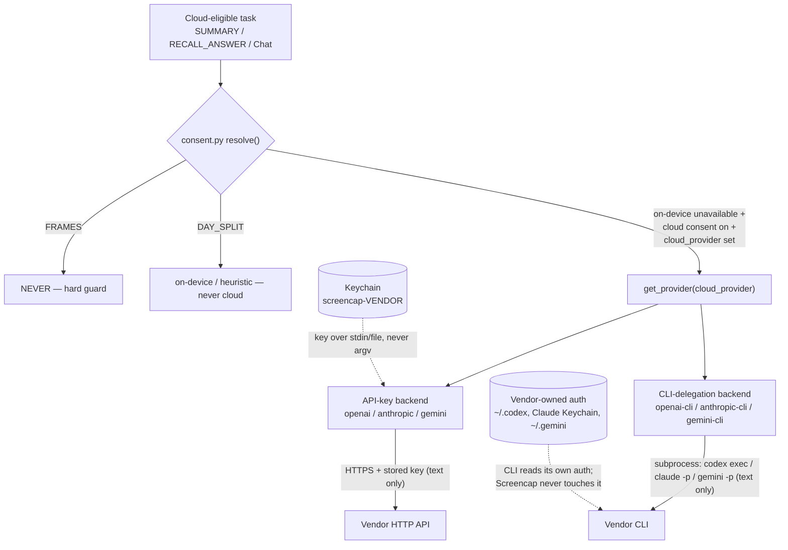

# Bring-Your-Own Cloud Intelligence Providers - Plan

## Goal Capsule

- **Objective:** Let users power Screencap's cloud-eligible intelligence (summaries, titles, Recall answers) with their own OpenAI, Anthropic, or Google Gemini account — via a pasted API key or by delegating to a locally-installed provider CLI — free of a Screencap subscription, and visibly separated from Screencap-hosted cloud.
- **Product authority:** Rute Figueiredo (product owner). Product Contract is authoritative for scope; this plan owns the how.
- **Product Contract preservation:** unchanged — R1–R13 carried verbatim from the requirements-only artifact; planning added no product-scope changes.
- **Execution profile:** Deep, cross-cutting. Python daemon (provider abstraction, config, settings CLI, keychain) plus the Swift/SwiftUI settings surface. Landable as ~7 dependency-ordered commits.
- **Stop conditions:** No launch-blocking questions. Surface a genuine blocker if implementation reveals the existing `gemini` backend cannot be cleanly reconciled into a single BYO entry, or if a vendor CLI's non-interactive contract differs materially from what this plan assumes.
- **Tail ownership:** Open a PR; land with `pytest -m privacy` green (the frames/day-split guards) and the macOS app building.

---

## Product Contract

### Summary

Add "connect your own account" for OpenAI, Anthropic, and Gemini as a first-class **user-owned** Intelligence option, alongside on-device. Two ways to connect: paste a provider API key, or delegate to the user's already-signed-in `codex` / `claude` / `gemini` CLI to reuse a subscription. A connected provider slots into the existing provider picker and inherits the current per-task cloud consent rules unchanged. The Intelligence surface makes the line between Screencap-hosted cloud and user-owned intelligence unmistakable.

### Problem Frame

Screencap's on-device and local-server models are the privacy-safe default, but they aren't frontier quality — summaries, titles, and Recall answers are noticeably weaker than GPT/Claude/Gemini output. The provider abstraction was built to accommodate cloud backends, and `docs/plans/2026-07-06-002-feat-local-first-intelligence-plan.md` R2 already named Claude, OpenAI, and Gemini as opt-in backends "with their own key," but only Gemini shipped and only as an app-managed backend. The Intelligence UI still shows an inert "Add another provider…" stub ("Coming soon — add a cloud provider with your own API key"). So users who already pay OpenAI/Anthropic/Google, or who simply want better output, have no way to bring that capability to Screencap — and no clear picture of which cloud is Screencap's and which is theirs.

### Key Decisions

- **Delegate to the provider's CLI; never hold subscription tokens.** Subscription reuse rides each provider's own sanctioned surface — Codex "sign in with ChatGPT", `claude -p`, the Gemini CLI — which the user has already authenticated. Screencap invokes the installed binary and holds no OAuth token. App-held or reverse-engineered subscription tokens are rejected: they violate provider ToS and can get a user's account flagged, which is intolerable for a trust-first product.
- **Two mechanisms with asymmetric risk.** The API-key path is the stable baseline — it completes the deferred R2 and behaves predictably. CLI delegation is net-new (no existing plan contemplated it) and carries all the fragility: an external-binary dependency plus providers re-metering subscriptions. The paths are independent, so if delegation breaks, key and on-device still work.
- **Hard separation of Screencap-hosted cloud vs user-owned intelligence.** Hosted cloud (app-managed models, cloud upload/storage behind the Personal cloud subscription) and user-owned intelligence (BYO key or CLI delegation, running against the user's own account) are presented so a user can tell at a glance whose infrastructure runs it and whose bill it lands on.
- **BYO inherits the existing consent matrix; the frames invariant is absolute.** A connected provider is just another cloud target under `consent.py`. Connecting your own account unlocks no new data category — only text leaves the device; screen frames stay hard-blocked regardless of whose key it is.
- **Ungated and free for now; billing coupling deferred.** Connecting a provider needs no Screencap subscription. It's the power-user lane next to on-device; hosted cloud still serves the non-technical majority who won't set up a key or CLI.

### Requirements

**Connecting a provider**

- R1. Users can connect their own OpenAI, Anthropic, or Google Gemini account as a selectable Intelligence provider from the existing provider picker, replacing the current "Add another provider…" stub.
- R2. Both connection mechanisms are supported: paste a provider API key, and delegate to a locally-installed provider CLI the user has already signed into.
- R3. An API-key connection stores the key as a secret (Keychain-class storage, following the existing auth pattern), never in plaintext config, and never uploads it.
- R4. A CLI-delegation connection stores no secret in Screencap — the provider's CLI owns authentication; Screencap detects the installed binary and invokes it non-interactively.
- R5. When a provider's CLI is not installed or not signed in, that delegation option renders as unavailable with a path to fix it (install / sign in), and never silently falls back to a different provider.

**Task routing and privacy**

- R6. A connected BYO provider is governed by the existing per-task consent matrix unchanged: it serves SUMMARY and RECALL_ANSWER (and the Chat generation path) only when the matching cloud consent is enabled; DAY_SPLIT stays on-device; FRAMES are never sent.
- R7. Connecting a BYO provider unlocks no new data category — only text (activity summaries and transcript-derived input) leaves the device; screen frames and images remain hard-blocked from any cloud regardless of whose account or key is connected.
- R8. The ALLOW-only activity-summary privacy strip runs before a BYO provider sees any input, identical to existing cloud routing.

**Hosted vs user-owned separation**

- R9. The Intelligence surface visibly distinguishes Screencap-hosted cloud (app-managed models plus cloud upload/storage behind the Personal cloud subscription) from user-owned intelligence (BYO key or CLI delegation against the user's own account), so whose infrastructure and whose bill each option uses is legible at a glance.
- R10. Gemini appears as one coherent "your Google/Gemini account" BYO entry; the existing app-managed Gemini backend is reconciled so users do not see a duplicate or ambiguous double-Gemini.
- R11. Connecting a BYO provider is free and requires no Screencap subscription.

**Honesty and resilience**

- R12. No BYO copy promises "free unlimited via your subscription." Delegation copy sets the expectation that subscription usage is bounded by the provider's own limits and terms, which can change.
- R13. If a provider restricts or meters subscription use through its CLI, the delegation path degrades to a clear unavailable/needs-attention state; the API-key path and on-device remain unaffected.

### Key Flows

- F1. Connect via API key
  - **Trigger:** User picks a provider from the picker and chooses "use my API key."
  - **Steps:** User pastes a key; Screencap stores it as a secret and validates it; the provider becomes a selectable active model.
  - **Outcome:** Cloud-eligible tasks can route to that provider, subject to R6-R8.
  - **Covered by:** R1, R2, R3, R6, R7, R8.
- F2. Connect via CLI delegation
  - **Trigger:** User picks a provider and chooses "use my subscription (via CLI)."
  - **Steps:** Screencap checks for the installed, signed-in CLI; if present, the provider becomes selectable and tasks invoke the CLI non-interactively; if absent, the option shows as unavailable with a fix path.
  - **Outcome:** Cloud-eligible tasks run on the user's subscription without Screencap holding a token.
  - **Covered by:** R1, R2, R4, R5, R12, R13.
- F3. Route a cloud-eligible task to a connected provider
  - **Trigger:** A SUMMARY / RECALL_ANSWER task runs with a BYO provider active.
  - **Steps:** `consent.py` checks the task's cloud consent; the ALLOW-only strip runs; text-only input goes to the provider (key or CLI). DAY_SPLIT and FRAMES never reach this path.
  - **Outcome:** Frontier-quality output, with the same privacy guarantees as any cloud route.
  - **Covered by:** R6, R7, R8.

### Acceptance Examples

- AE1. **Covers R5, R13.** **Given** the user selects Anthropic via CLI delegation and `claude` is not installed, **when** they open the provider, **then** the delegation option is shown unavailable with an install/sign-in prompt, and no other provider is silently substituted.
- AE2. **Covers R6, R7.** **Given** a BYO OpenAI key is connected and active, **when** day-splitting runs, **then** it executes on-device (never on the connected cloud provider), and **when** any task would involve screen frames, **then** nothing is sent to the provider.
- AE3. **Covers R7.** **Given** a user connects their own provider expecting richer capture, **when** they inspect what is sent, **then** only text summaries/transcript-derived input is eligible to leave the device; frames remain hard-blocked.

### Scope Boundaries

**Deferred for later**

- Whether BYO stays free or couples to the Personal cloud subscription — revisit alongside `docs/plans/2026-07-07-001-feat-personal-cloud-billing-paywall-plan.md`.
- Generic "any OpenAI-compatible cloud endpoint + key" (OpenRouter, Together, Groq, etc.). The abstraction can grow into it; this feature ships the three named providers.

**Outside this product's identity**

- App-held OAuth or reverse-engineered subscription tokens — a ToS violation and an account-ban risk; delegation to the provider's own CLI is the only subscription-reuse path.
- Sending screen frames or images to any cloud provider, hosted or BYO — a fixed rule, not a toggle.
- Any end-to-end-encryption or "we can't see it" claim on a BYO cloud path while input is provider-readable.

### Dependencies / Assumptions

- Builds on the deferred R2 key-entry flow and per-provider adapters in the existing provider abstraction (`src/screencap/segmentation/provider.py`, `get_provider()`), and on the single consent enforcement point (`src/screencap/segmentation/consent.py`).
- Assumes the provider CLIs (`codex`, `claude`, `gemini`) expose a non-interactive invocation usable for text summarization/answering — the pattern Dayflow already ships.
- Assumes the existing shared-Keychain auth pattern (`src/screencap/auth.py`, `docs/plans/2026-07-08-001-feat-shared-keychain-access-group-auth-plan.md`) extends to storing BYO API-key secrets daemon-side.
- Assumes the Chat generation path (`GenerationProvider`, `docs/plans/2026-07-09-002-feat-ondevice-llm-generation-endpoint-plan.md`) routes through the same RECALL_ANSWER consent, so BYO providers reach Chat without a separate consent surface.

### Outstanding Questions

**Deferred to planning** (resolved within the units below)

- The existing `gemini` backend reads `GOOGLE_GENAI_API_KEY` — confirm whether that key is app-managed or user-supplied, to make R10's single-entry reconciliation concrete (settled in U1/U3 by reading how the env/config value is populated).
- Whether API-key backends use vendor SDKs or thin HTTP (settled in U3: thin HTTP, per KTD).
- The exact on-disk auth artifacts used for CLI availability detection per vendor (settled in U4 against the live CLIs).

**Deferred (product)**

- The BYO-vs-billing coupling in R11 — free now; the eventual relationship to the Personal cloud subscription is an open product decision. Shipping ungated first means a later gate would remove a free capability from early users.

---

## Planning Contract

### Key Technical Decisions

- KTD1. **CLI delegation is a subprocess of the vendor's real binary — never token extraction.** The delegation backend invokes `codex exec` / `claude -p` / `gemini -p` in non-interactive mode and reads only stdout. It never reads or copies the vendor's stored OAuth token (`~/.codex/auth.json`, the Claude Code macOS Keychain entry, `~/.gemini` credentials). Rationale: Anthropic enforced its ToS in Jan 2026 against tools that lifted the Claude OAuth token into their own HTTP clients, while explicitly sanctioning subprocess use of the real `claude` binary; Codex documents the same boundary. This is the ToS-safe path *and* removes token-custody from Screencap. The daemon runs as the user (same EUID), so each CLI resolves its own credentials.

- KTD2. **Encode provider identity as vendor + mechanism, and register BYO ids as cloud-fallback providers only.** Represent the 3-vendor × 2-mechanism matrix as distinct provider ids — `openai` / `anthropic` (API key) and `openai-cli` / `anthropic-cli` / `gemini-cli` (delegation) — and reconcile the existing `gemini` id as the BYO-key Gemini. Rationale: the daemon has **two** provider keys with different roles — top-level `llm_provider` (the active/preferred provider, `_VALID_LLM_PROVIDERS`, which drives day-split routing) and `[intelligence].cloud_provider` (the consented cloud fallback, `_VALID_CLOUD_PROVIDERS`, the only key cloud routing invokes via `get_provider()`). A BYO provider only ever runs as the consented `cloud_provider` fallback — `routing.build_day_split_provider` sends any non-on-device active provider to `UnavailableProvider`. So the new ids are added to `_VALID_CLOUD_PROVIDERS` (and the settings-CLI `cloud_provider` validation branch) only; `_VALID_LLM_PROVIDERS` stays on-device-class. Selecting a BYO provider in the UI writes `cloud_provider`, not the active `provider`.

- KTD3. **Secrets never transit argv.** A pasted API key reaches the daemon over stdin or a `0o600` temp file, mirroring the existing engine-token-by-file-path pattern (`src/screencap/auth.py`, `ENGINE_TOKEN_FILE_ENV`) — never as a CLI argument (world-readable via `ps`). Keys are stored in the shared Keychain access group under a per-vendor service name (`screencap-openai`, `screencap-anthropic`, `screencap-gemini`), reusing the `keychain_group` store/load helpers with the `keyring` fallback for non-entitled dev builds. Keys are redacted in logs and excluded from any upload path.

- KTD4. **BYO backends receive only stripped text; no new enforcement point is added.** Backends are handed the ALLOW-only `activity_summary` dict (`segment`) or `Evidence.text` (`answer`), never frame bytes. The `FRAMES → NEVER` and `DAY_SPLIT → on-device/heuristic` guards stay hard-coded in `consent.py` (they resolve before any provider is consulted), so R7 holds by construction. New backends slot in behind `get_provider()` and never see, and cannot request, frames.

- KTD5. **Resolve CLI binary paths explicitly; spawn with a scrubbed env; fail open.** The LaunchAgent daemon runs with a restricted PATH (the launchd env channel), so `codex` / `claude` / `gemini` are resolved via a configured path or a discovery probe, not a bare name. The subprocess is spawned with a **scrubbed environment** — the daemon now holds the Firebase auth context and the BYO API keys, and an arbitrary third-party binary must not inherit them; reuse or mirror `ondevice._scrubbed_env()` (strips `*_KEY` / `*_TOKEN` / `*_SECRET` / `*_PASSWORD` / `*_CREDENTIAL`), passing only the resolved binary path plus any var the CLI genuinely needs. A missing, unauthenticated, or timing-out CLI degrades to "unavailable" and the task falls back to on-device — never a hang or crash. Handling drains stdout to EOF, enforces a wall-clock timeout, and never logs stderr verbatim (truncate + class-name only, mirroring `downloaded.py` — stderr can echo recording-derived text or a leaked secret).

### High-Level Technical Design

Both new backend types slot in behind the existing `get_provider()` factory and the provider-agnostic consent gate. The gate resolves the target before any backend is chosen, so the hard privacy guards are upstream of everything BYO:

### Assumptions

- The existing settings CLI verb (`screencap settings intelligence --json` / `... <row> set <value>`) is shipped and is the daemon-side bridge the Swift UI already calls; new rows/providers extend it rather than adding a new command surface.
- Adding per-vendor generic-password items under the already-entitled shared access group (`2A8S6MV8DZ.com.screencap.shared`) does not require a new provisioning profile — the access group is what's entitled, not the service name. Verified in U2; if wrong, it becomes a release dependency (see Risks).
- The `gemini` backend's key source can be repointed to a user-supplied key without disturbing the server-side (Cloud Run) Gemini path used for hosted cloud recordings, which is separate from local provider selection.

### Sequencing

U1 (config/identity) is the foundation for everything. U2 (key storage) and U4 (CLI-delegation backend) are independent and can proceed in parallel after U1. U3 (API-key backends) depends on U1+U2. U5 (routing/generation wiring) depends on the backends existing (U3, U4). The Swift UI units (U6 connect flow, U7 separation/copy) depend on the daemon-side identity + storage (U1, U2) and the availability surface (U4); they can start once the settings block exposes the new fields.

---

## Implementation Units

### U1. Provider identity and config model for BYO providers

- **Goal:** Represent the vendor × mechanism matrix in config and the settings CLI, and reconcile the existing `gemini` id as the BYO-key Gemini.
- **Requirements:** R1, R10 (config-level), R11.
- **Dependencies:** none.
- **Files:** `src/screencap/config.py`, `src/screencap/cli/__init__.py`, `tests/` (config + settings-CLI validation tests).
- **Approach:** Add `openai`, `anthropic`, `openai-cli`, `anthropic-cli`, `gemini-cli` to `_VALID_CLOUD_PROVIDERS` only (config.py ~615-623) — they are consented cloud-fallback targets, so `_VALID_LLM_PROVIDERS` (the active/day-split enum) stays unchanged (KTD2). Keep `gemini` as BYO-key Gemini, noting it currently sits in both enums, so U3's reconciliation must decide its single home and keep the picker from listing it twice (R10). Add getters/setters following the existing env>toml>default + `_privacy_config_writer()` pattern (config.py ~505-683). Extend the settings-CLI `cloud_provider` validation branch (cli/__init__.py ~3426, keyed off `_VALID_CLOUD_PROVIDERS`) — not the `provider` branch — while still rejecting the forbidden consent rows (`day_split_cloud_consent`, `frames_cloud_consent`). Add the per-vendor CLI-availability fields to `_build_intelligence_settings_block` (a net-new JSON shape the Swift decoder gains fields for) and bump `_SETTINGS_INTELLIGENCE_SCHEMA_VERSION`. Confirm how `GOOGLE_GENAI_API_KEY` is currently populated to settle the Gemini reconciliation (Outstanding Question).
- **Patterns to follow:** `set_intelligence_cloud_provider`, `_VALID_CLOUD_PROVIDERS`, the CLI defense-in-depth block that rejects forbidden rows.
- **Test scenarios:**
  - Setting `cloud_provider` to each new id (`openai`, `anthropic`, `openai-cli`, `anthropic-cli`, `gemini-cli`) round-trips through config and the settings CLI JSON.
  - Setting an unknown provider id is rejected.
  - Covers R7 (config guard). Attempting to set `day_split_cloud_consent` or `frames_cloud_consent` via the CLI is still rejected after the enum widening. Mark `@pytest.mark.privacy`, Vision-free.
  - `--json` read-back includes the new fields with schema version bumped if the block shape changes.
- **Verification:** `pytest` for config + settings CLI green; `screencap settings intelligence --json` shows the new provider ids as settable.

### U2. Secure per-provider API-key storage and key-set path

- **Goal:** Store/read/clear a per-vendor API key in the shared Keychain without the secret ever touching argv, plus a cheap validity check.
- **Requirements:** R3.
- **Dependencies:** U1.
- **Files:** `src/screencap/auth.py` (or a new `src/screencap/segmentation/secrets.py`), `src/screencap/cli/__init__.py`, `tests/`.
- **Approach:** Add per-vendor store/load/delete helpers reusing `keychain_group` with the `keyring` fallback (auth.py ~274-333), service name `screencap-<vendor>`. Add a settings-CLI path to set/clear a key that reads the secret from **stdin** (or a `0o600` file path via an env var, mirroring `ENGINE_TOKEN_FILE_ENV`), never from an argv value. Add a lightweight validation call per vendor: OpenAI `GET /v1/models`, Anthropic `POST /v1/messages/count_tokens`, Gemini `GET /v1beta/models` — 2xx = valid, 401/403 = invalid. Pin each validation call to the vendor's hardcoded HTTPS base URL with certificate verification on and no env/config override of the host, so a plaintext-readable key can only ever reach the fixed vendor host. Redact keys in all log output.
- **Patterns to follow:** `_store_refresh_token` / `_load_refresh_token`, the engine-token-by-file-path bridge, the lazy-decrypt learning (`docs/solutions/integration-issues/keychain-auth-prompt-eager-decrypt-at-launch-2026-07-08.md`) — do not read keys at launch, only when a BYO cloud surface is engaged.
- **Test scenarios:**
  - Store then load a key for each vendor returns the same value; delete removes it.
  - The key-set CLI path accepts a key via stdin/file and never exposes it in argv (assert the command construction contains no secret).
  - Validation maps a 200 to valid and a 401 to invalid (mock the HTTP call).
  - Keychain-unavailable (non-entitled) path falls back to `keyring`.
  - Covers R3. A stored key never appears in `--json` read-back (presence flag only, not the value).
- **Verification:** `pytest` green; manual smoke on a dev build stores a key and reports "connected" without the key appearing in logs or `ps`.

### U3. API-key provider backends (OpenAI, Anthropic) and Gemini reconciliation

- **Goal:** Implement OpenAI and Anthropic API-key backends and repoint the Gemini backend at the user's key, all behind the existing provider interface.
- **Requirements:** R1, R6, R7, R8, R10.
- **Dependencies:** U1, U2.
- **Files:** `src/screencap/segmentation/providers/openai.py` (new), `src/screencap/segmentation/providers/anthropic.py` (new), `src/screencap/segmentation/providers/gemini.py` (reconcile), `src/screencap/segmentation/provider.py` (factory), `tests/`.
- **Approach:** Each backend implements `LLMProvider.segment(activity_summary) -> dict | None | PROVIDER_UNAVAILABLE` and `GenerationProvider.answer(prompt, evidence) -> str | PROVIDER_UNAVAILABLE`, reading its key via the U2 Keychain helper at call time and calling the vendor's chat/messages endpoint over **thin HTTP** — no vendor SDK; lazy-import the HTTP client; pin each request to the vendor's hardcoded HTTPS host with TLS verification and no env/config host override. Return `PROVIDER_UNAVAILABLE` on missing key / auth failure / network error so degradation routes to on-device. Register the new ids in `get_provider()` (provider.py ~96-127). Reconcile `gemini`: it reads `GOOGLE_GENAI_API_KEY` from `os.environ` today (a var only populated in the Cloud Run deploy, not the local daemon, so the local Gemini path may currently be inert), so repoint it to read the user's key from the U2 Keychain store at call time and drop the env var as a secret channel; ensure it surfaces as the single BYO-key Gemini entry despite the id living in both provider enums (R10).
- **Patterns to follow:** `GeminiProvider` (implements both protocols, lazy imports, returns the three-state result), the `PROVIDER_UNAVAILABLE` sentinel discipline.
- **Test scenarios:**
  - `segment()` returns a validated tasks dict on a well-formed mocked response; returns `None` on an empty-but-valid response; returns `PROVIDER_UNAVAILABLE` on auth failure / network error / missing key.
  - `answer()` returns grounded text on success and `PROVIDER_UNAVAILABLE` on failure.
  - Covers R7/R8. The backend is only ever handed the stripped `activity_summary` / `Evidence.text`; a test asserts no frame bytes or references reach the request payload. Mark `@pytest.mark.privacy`, Vision-free.
  - Gemini reconciliation: only one Gemini provider id is exposed as BYO-key; no duplicate listing.
  - The key is read from Keychain at call time and never appears in the daemon or subprocess environment. Mark `@pytest.mark.privacy`, Vision-free.
- **Verification:** `pytest` green; a dev build with a real key produces a summary via the selected vendor.

### U4. CLI-delegation provider backend and availability detection

- **Goal:** A backend that delegates to the user's installed `codex` / `claude` / `gemini` CLI, plus the detection that tells the UI whether each is available.
- **Requirements:** R2, R4, R5, R6, R7, R8, R13.
- **Dependencies:** U1.
- **Files:** `src/screencap/segmentation/providers/cli_delegate.py` (new), `src/screencap/segmentation/provider.py` (factory), `src/screencap/config.py` (optional binary-path override), `src/screencap/cli/__init__.py` (expose availability in the settings block), `tests/`.
- **Approach:** Implement `segment`/`answer` by invoking the vendor CLI non-interactively and reading stdout. Use `codex exec -m <model>` **without** `--json` — plain `codex exec` prints only the final agent message to stdout, whereas `--json` emits a JSONL *event stream* (the final message must be extracted from the last `agent_message` item, and `--json` is silently ignored when tools are active). Use `claude -p --output-format json --model <model>` (parse `result`) and `gemini -p --output-format json -m <model>`. Do **not** pass `claude --bare` (it forces API-key mode and skips subscription auth). Pin sandbox/read-only where the CLI supports it. Resolve the binary via configured path then PATH probe and spawn with a scrubbed env (KTD5). Enforce a wall-clock timeout, drain stdout to EOF, never log stderr verbatim, and return `PROVIDER_UNAVAILABLE` on non-zero exit, timeout, or unparseable output. `available()` does an existence/stat check only — it never opens or parses the vendor's auth files (KTD1): binary present + auth artifact present (`~/.codex/auth.json`; Claude Keychain or `~/.claude/.credentials.json`; `~/.gemini` credentials) + optional one-token probe. Expose the per-vendor availability payload as the net-new settings-block fields (from U1) for the UI (R5).
- **Patterns to follow:** the `PROVIDER_UNAVAILABLE` three-state contract; subprocess-drain/timeout discipline from `docs/solutions/integration-issues/macos-foundation-process-pipe-pitfalls.md`; explicit binary-path resolution per the launchd-restricted-PATH learning.
- **Test scenarios:**
  - Happy path: a mocked/faked CLI returning well-formed JSON yields a tasks dict (`segment`) and grounded text (`answer`).
  - Covers R5. `available()` returns false when the binary is absent, and false when the binary is present but the auth artifact is missing; true when both present.
  - Error paths: non-zero exit, timeout, and unparseable stdout each return `PROVIDER_UNAVAILABLE` (never raise, never hang).
  - Covers R7. The subprocess is invoked with text-only input; no frame data is passed. Mark `@pytest.mark.privacy`, Vision-free.
  - Binary-path resolution finds a configured override before falling back to PATH.
  - Covers KTD5. The subprocess is spawned with a scrubbed env — no `*_KEY` / `*_TOKEN` / `*_SECRET` var reaches the child (assert against the constructed env). Mark `@pytest.mark.privacy`, Vision-free.
  - On a non-zero exit, stderr is not logged verbatim (assert the log record carries a class name / truncated form, not the raw stderr).
  - `available()` does not open the vendor auth files (assert it stats but never reads their contents).
- **Verification:** `pytest` green; on a dev machine with one CLI signed in, a task completes via delegation and the others report unavailable.

### U5. Wire cloud-eligible tasks to the selected BYO cloud provider

- **Goal:** Route RECALL_ANSWER/Chat and SUMMARY tasks to the consented BYO cloud provider — building the SUMMARY cloud-fallback dispatch, which does not exist yet — with the hard guards intact.
- **Requirements:** R6, R7, R8.
- **Dependencies:** U3, U4.
- **Files:** `src/screencap/segmentation/recall.py` (the `answer_recall` / `_cloud_fallback` dispatcher for RECALL_ANSWER), the terminal-stage segment path (`src/screencap/terminal_stage.py` `_run_local_segmentation`), `src/screencap/segmentation/degrade.py` + `consent.py` (verify only), `tests/`.
- **Approach:** The RECALL_ANSWER/Chat cloud fallback already exists in `recall._cloud_fallback` (it calls `get_provider(config.get_llm_cloud_provider())`); it picks up the new BYO ids automatically once registered — extend/verify only. The **SUMMARY cloud path does not exist yet**: `terminal_stage._run_local_segmentation` handles only `USE_PROVIDER`/`HEURISTIC` and returns on `DegradeAction.CLOUD` (`degrade.py` documents CLOUD as unexercised — "the resolver's capability for the future on-demand summary/title flow"), and `routing.build_day_split_provider` sends any cloud id to `UnavailableProvider`. Add a SUMMARY dispatch that runs `resolve(TaskKind.SUMMARY, ...)` and, on `DegradeAction.CLOUD`, invokes `get_provider(config.get_llm_cloud_provider()).segment(...)`. Do not alter the `consent.py` guards; pin them against the new provider ids.
- **Patterns to follow:** `recall._cloud_fallback` (the existing consented-cloud dispatch via `get_llm_cloud_provider()`) — not `build_answer_provider()` / `build_day_split_provider()`, which are on-device-class only and never route cloud.
- **Test scenarios:**
  - Covers AE2 / R6. With a BYO cloud provider active and on-device unavailable, SUMMARY and RECALL_ANSWER resolve to the BYO provider; DAY_SPLIT still resolves on-device/heuristic; FRAMES resolves NEVER. Mark `@pytest.mark.privacy`, Vision-free.
  - With cloud consent off, a BYO provider is never selected even when configured (falls back to on-device/heuristic).
  - Chat/generation with a BYO provider active routes to it on fallback and to on-device otherwise.
- **Verification:** `pytest -m privacy` green (guards); end-to-end summary + Chat answer run through a selected BYO provider on a dev build.

### U6. Swift UI: connect-a-provider flow

- **Goal:** Replace the "Add another provider…" stub with a real connect flow covering both mechanisms.
- **Requirements:** R1, R2, R3, R4, R5, R13.
- **Dependencies:** U1, U2, U4.
- **Files:** `macos/Screencap/Views/Settings/IntelligenceSettingsView.swift`, `macos/Screencap/Controllers/IntelligenceController.swift`, new view(s) as needed, macOS app tests.
- **Approach:** Build a connect flow: choose vendor, choose mechanism. For API key, a `SecureField` whose value is handed to the controller and piped to the daemon over stdin/file (never argv), with inline validation feedback from U2. For CLI delegation, show the option with its availability state from U4 and an install/sign-in path when unavailable (R5); render a distinct needs-attention state when a connected CLI later reports `PROVIDER_UNAVAILABLE` at runtime — e.g. metered/restricted mid-use (R13) — reusing the R5 unavailable surface. Selecting a connected provider persists it as the consented `cloud_provider` (not the active `provider`) so cloud routing can reach it (KTD2); extend `IntelligenceSettings` (controller ~13-77) with the new fields and add controller writes mirroring `setConsent`. Allow disconnect (clear the key / deselect).
- **Patterns to follow:** `IntelligenceProviderOption.options(...)`, the controller's CLI-bridge `setProvider`/`setConsent` with optimistic pending state, the existing non-interactive fixed-row rendering.
- **Test scenarios:**
  - Covers R5. When a vendor's CLI is unavailable, its delegation option renders disabled with guidance, and selecting it is not possible.
  - The API-key field is a secure entry; the entered key is passed to the controller bridge, not embedded in a visible argument.
  - Selecting a connected provider persists it as the `cloud_provider` (not the active `provider`) via the settings CLI.
  - Covers R13. A connected provider that reports unavailable at runtime (not just install-time-absent) renders a needs-attention state via the R5 surface.
  - `Test expectation:` view-model logic covered by app tests; pure layout has none.
- **Verification:** macOS app builds and the settings pane drives connect/disconnect for a key-based and a CLI-based provider on a dev build.

### U7. Swift UI: hosted-vs-user-owned separation, Gemini single-listing, honest copy

- **Goal:** Make the picker legibly separate Screencap-hosted cloud from user-owned intelligence, list Gemini once, and keep copy honest.
- **Requirements:** R9, R10, R12.
- **Dependencies:** U6.
- **Files:** `macos/Screencap/Views/Settings/IntelligenceSettingsView.swift` (grouping + copy), `macos/Screencap/Controllers/IntelligenceController.swift` (option assembly if needed), macOS app tests.
- **Approach:** Group the provider list into a "Screencap-hosted cloud" section (app-managed models, cloud upload/storage behind the Personal cloud subscription) and a "Your own account" section (BYO key + CLI delegation), with labels making whose-bill clear (R9). Ensure Gemini surfaces once as "your Gemini account" (R10). Add honest copy for delegation: subscription usage is bounded by the provider's limits/terms and can change; surface Gemini free-tier rate limits plainly (R12). No E2EE / "we can't see it" / "free unlimited" strings.
- **Patterns to follow:** existing section grouping in the settings views; the honest-copy gate from the Personal cloud billing plan.
- **Test scenarios:**
  - Honest-copy audit: assert no forbidden strings (E2EE / "free unlimited" / "we can't watch") appear in the Intelligence pane copy. Extend the existing honesty-gate test if one exists.
  - Gemini appears exactly once in the assembled option list (no duplicate hosted/BYO Gemini).
  - The hosted vs user-owned grouping renders with both sections and correct membership.
- **Verification:** macOS app builds; the pane shows the two-section split with Gemini listed once and honest delegation copy.

---

## Risks & Dependencies

- **Anthropic subscription-metering volatility (highest churn).** The paused-but-announced June 15, 2026 change would have moved `claude -p` / Agent-SDK usage to a separate capped credit pool; it can re-land with little notice. Claude-CLI is the least durable cell. Contained by R13 (fail-open to unavailable) and R12 (no "free unlimited" copy), not prevented.
- **Claude subscription attribution may silently fall to API billing.** Open Claude Code issues report `claude -p` with OAuth billing as pay-as-you-go API usage rather than the Max subscription (#43333) and `-p` returning an empty result while still generating/billing tokens (#38623). R13's fail-open covers a hard-unavailable CLI, not a silent successful-but-mis-billed call — the exact trust harm KTD1 exists to avoid. Validate attribution during U4 implementation and keep R12's copy honest. A future Claude Code release also plans to make `--bare` (API-key mode) the `-p` default, which would flip the subscription path — pin behavior and watch for it.
- **External CLI interface drift.** `codex exec` / `claude -p` / `gemini -p` flags and output formats can change across releases. Pin to documented flags, parse output defensively, and fail open (KTD5) rather than trusting a fixed shape.
- **Gemini free-tier rate limits.** The Google-sign-in tier is tight (≈5 RPM / 100 RPD for 2.5 Pro) — a summarizing daemon can hit it. Surface the limit honestly (R12); a paid `GEMINI_API_KEY` removes the caps but is metered, not subscription reuse.
- **Keychain entitlement (release dependency if the assumption fails).** Per-vendor service names are assumed to work under the already-entitled shared access group with no provisioning-profile change (verified in U2). If that assumption is wrong, adding them becomes a signing/notarization dependency (`SCREENCAP_DAEMON_PROVISION_PROFILE`), and dev builds rely on the `keyring` fallback until then.
- **User-provided environment.** Screencap cannot install or sign in the CLIs; delegation availability depends entirely on the user's machine. The daemon's restricted PATH (launchd env channel) means binaries must be resolved explicitly (KTD5).
- **System-wide impact — expanded trust surface.** BYO adds third-party cloud egress paths and daemon subprocess execution of external binaries. It is governed by the existing consent matrix with no new enforcement point (KTD4), but it widens the trust surface for a privacy-first product; the honest-copy audit (U7) is the guard that keeps claims matching behavior.

---

## Verification Contract

| Gate | Command | Applies to | Done signal |
|---|---|---|---|
| Privacy guards | `pytest -m privacy` | U1, U3, U4, U5 | Frames and day-split never resolve to a BYO provider; forbidden consent rows stay rejected. All guard tests must be `@pytest.mark.privacy` and Vision-free (CI runs only this lane). |
| Python unit tests | `pytest tests/` (in a worktree: `PYTHONPATH=src pytest tests/`) | U1–U5 | Config, settings CLI, key storage, backends, and routing pass. |
| Secret hygiene | `pytest tests/` + manual `ps`/log check | U2, U6 | No API key appears in argv, logs, or `--json` read-back. |
| macOS app build/test | XcodeGen generate + `xcodebuild test` for the Screencap scheme | U6, U7 | App builds; settings view-model logic and honest-copy audit pass. |
| Lint | `ruff check src/screencap/engine/` | engine files only | Clean. Note: `segmentation/` is outside the ruff scope defined in CLAUDE.md; new Python files there are not ruff-gated. |

---

## Definition of Done

- All of R1–R13 are satisfied; each unit's test scenarios pass.
- `pytest -m privacy` is green: no BYO provider (key or CLI, any vendor) can receive frames or be selected for day-split, and the forbidden consent rows remain rejected after the provider-enum widening.
- Connecting works end-to-end on a dev build for at least one API-key vendor and one CLI-delegation vendor; unavailable CLIs render as unavailable with guidance and never silently substitute.
- Secrets are stored in the Keychain and never appear in argv, logs, or the settings `--json` read-back.
- The Intelligence pane shows the hosted-vs-user-owned separation, lists Gemini exactly once, and passes the honest-copy audit (no E2EE / "free unlimited" strings).
- Abandoned or experimental code from the implementation run is removed; no dead provider stubs left in the diff.
