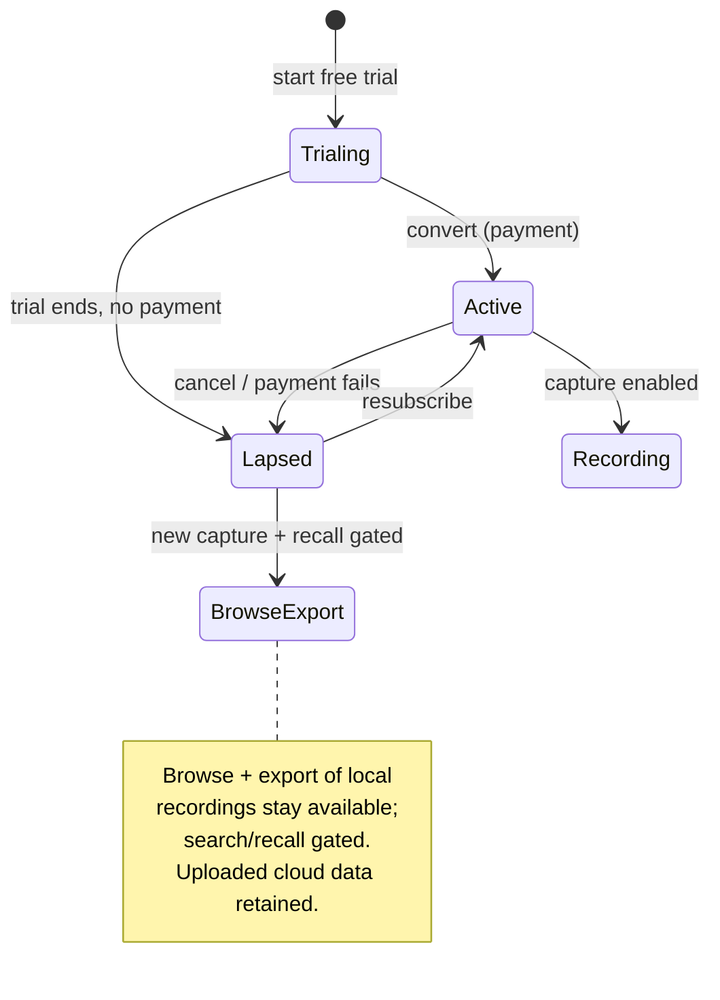
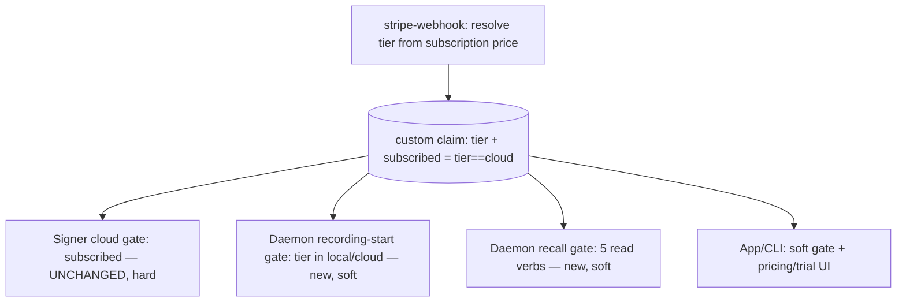

# Paid-Only Launch Pricing - Plan

## Goal Capsule

- **Objective:** Realign Screencap's pricing so the whole install base contributes revenue. Launch paid-only — no free tier — with two subscriptions, Local Pro (unlimited local recall) and Cloud (adds upload/sync/AI), each fronted by a free trial. Defer the freemium/capped tier as a reversible fast-follow.
- **Product authority:** This document's Product Contract. Builds on the shipped $5 Personal-cloud paywall (`docs/plans/2026-07-07-001-feat-personal-cloud-billing-paywall-plan.md`) and supersedes two of its premises: the single $5 cloud price and free-forever local capture.
- **Execution profile:** ~14 units across the billing Cloud Functions, the entitlement claim, the daemon recording + recall gates (enforced via a bounded last-known-good lease), the Python auth/config layer, and the SwiftUI onboarding. Extends the shipped $5 paywall (PR #348) rather than rebuilding it. The two-sided dark rollout is preserved and extended with a third daemon-side flag; the security-critical signer gate changes zero lines.
- **Stop conditions:** Stop and surface if repurposing the entitlement would weaken the signer's cloud gate, if a Stripe trial cannot collect a card upfront, if the local gates would lock out a paying user who is offline, or if `SCREENCAP_LOCAL_PAYWALL_ENFORCE` would flip before the paywall-capable DMG is the minimum shipped version.
- **Product Contract preservation:** scope unchanged — R1–R13, A1–A4, F1–F3, AE1–AE7 preserved verbatim; enrichment adds the Planning Contract, Implementation Units, Verification Contract, and Definition of Done. Three Outstanding Questions were resolved during planning and annotated in place (recurring-subscription shape, entitlement representation, grandfather mechanics).
- **Open blockers:** None. Both launch-mechanics decisions are resolved: a card-required auto-converting trial, and browse + export staying available on lapse while recording/recall gate off.

---

## Product Contract

### Summary

Launch Screencap as a paid product with no free tier. Two subscriptions — Local Pro (unlimited local recall, no cloud) and Cloud (adds upload/sync/AI) — each fronted by a short free trial. Skip all freemium/cap machinery for launch; keep the capped-free tier as an explicit, reversible fast-follow if the paid funnel proves too thin. Team stays a coming-soon waitlist.

### Problem Frame

The shipped model charges only for cloud and keeps local capture free forever — because STRATEGY treats free local capture as the wedge that feeds the training-corpus flywheel. The driver for changing it is **cost/sustainability**: even local-only users carry real cost (support, dev, updates, on-device compute), and the goal is revenue from the whole base, not only cloud users.

Charging for local is unusual for the category — every local-first comparable (Screenpipe, ScreenMemory, Rem, Dayflow, Windows Recall) treats on-device capture/storage as the free or cheapest layer and charges for what sits on top (cloud, AI, the packaged app). The closest paid-Mac-recall comparable, Rewind/Limitless, no longer exists as a standalone product. So the launch has to charge without slamming the door on a trust-sensitive audience that won't pay for an always-on recorder sight-unseen.

The chosen resolution is to charge, but front the paid tiers with a free trial rather than a hard paywall, and to defer the heavier free-tier machinery until willingness-to-pay is validated. Loosening pricing later (adding a free tier) is safe; tightening it later is the move that generates backlash — so paid-first is the low-regret sequencing.

### Key Decisions

- **Paid-only at launch, no free tier.** Validate that anyone will pay before building freemium. This is a deliberate, reversible experiment: a free tier can be added later without backlash, whereas removing free access is the trap (cf. Granola's retroactive history cap).
- **Free trial, not a hard paywall.** A record-everything recall tool is a trust / try-before-buy purchase; a cold paywall would convert near-zero of the launch spike. A time-boxed Stripe trial keeps everyone paying while letting users feel it work first — and it needs almost no extra build versus a hard paywall.
- **Trial takes a card and auto-converts.** The trial requires a card upfront and converts to paid at trial end unless cancelled — higher conversion and less abuse — paired with clear, honest cancellation so there is no surprise-charge backlash.
- **Split ladder, not one bundle.** Local Pro (unlimited local, no cloud) sits below Cloud (adds upload/sync/AI). The STRATEGY persona is privacy-conscious and many will be local-only forever; they get their own price instead of subsidizing cloud they will never use.
- **Price up toward the category.** The recall-tool band is ~$19–20/mo; the current $5 under-prices it. Indicative Local Pro ~$8 and Cloud ~$15 (tunable), superseding the $5 with existing subscribers grandfathered.
- **Lapse keeps your data but gates the paywall.** On trial expiry or cancellation, new recording stops and the rich recall surface (search, timeline, MCP) locks — but the user keeps browse + export of their already-captured local recordings. Never locked out of their own disk data, without giving the core value away for free.
- **Capped-free tier is deferred, not abandoned.** It is the named reversible fast-follow; the launch design must not preclude adding it later.

### Actors

- A1. Individual user — records locally, subscribes to Local Pro or Cloud, owns the account and the subscription.
- A2. Stripe — payment provider; hosted Checkout, trials, and webhooks are the billing surface.
- A3. Signer / entitlement service — gates cloud upload and, under the split, distinguishes a Local-Pro entitlement from a Cloud entitlement.
- A4. Operator — provisions the Stripe products, prices, and trials, comps internal accounts, and finalizes the numbers.

### Tier comparison

| Tier | Indicative price | Local recall | Cloud upload/sync/AI | Trial | Status |
|---|---|---|---|---|---|
| Local Pro | ~$8/mo | Unlimited | No | ~7–14 day free trial | Launch |
| Cloud | ~$15/mo | Unlimited | Yes | ~7–14 day free trial | Launch |
| Team | — | — | — | — | Coming-soon waitlist |
| Free (capped) | $0 | Rolling window | No | n/a | Deferred fast-follow |

Prices and trial length are placeholders to be finalized.

### Requirements

**Packaging & tiers**

- R1. Launch presents no free tier: two paid subscriptions — Local Pro and Cloud — plus a Team card shown as a coming-soon waitlist.
- R2. Local Pro grants unlimited local recording and the full local recall surface (timeline, search, replay, MCP) with no cloud upload.
- R3. Cloud is the higher tier: everything in Local Pro plus cloud upload/sync and cloud-dependent AI, priced above Local Pro.
- R4. The Team card captures an email waitlist signup rather than entering a team-setup flow.

**Free trial & funnel**

- R5. Each paid tier is fronted by a time-boxed free trial (~7–14 days, length tunable) that requires a card upfront and auto-converts to paid at trial end unless cancelled, granting full tier access during the trial.
- R6. The launch funnel is trial-start → conversion, with no perpetual free path; willingness-to-pay is the primary signal being tested.

**Lapse & data ownership**

- R7. On trial expiry or subscription lapse without active payment, new recording is gated and the app enters a non-recording state; the searchable recall surface (search, timeline, MCP/agent) also locks.
- R8. A lapsed or expired user always keeps browse and export of their already-captured local recordings on their own disk — never locked out of their own data — while the searchable recall surface stays gated behind an active subscription.
- R9. Already-uploaded cloud recordings remain accessible and are not deleted on lapse.

**Pricing values & migration**

- R10. Indicative pricing is Local Pro ~$8/mo and Cloud ~$15/mo — placeholders anchored above the current $5 and toward the ~$19–20 recall-tool category, to be finalized before launch.
- R11. Cloud's price moves off the recently-introduced $5; any existing $5 cloud subscribers are grandfathered rather than force-migrated or surprise-priced.

**Honest copy**

- R12. User-facing copy stays truthful: no tier claims end-to-end encryption or "we can't watch" (paid cloud is server-readable), and the trial's auto-conversion and cancellation path are disclosed clearly before any charge.

**Reversibility**

- R13. The capped-free tier is a planned, reversible fast-follow; the launch design must not preclude adding a free history-window-capped tier later without a migration or a tighten-later backlash.

### Key Flows

- F1. Trial start → paid conversion
  - **Trigger:** User picks Local Pro (or Cloud) in the plan picker.
  - **Actors:** A1, A2, A3
  - **Steps:** User starts the free trial → records with full tier access → before or at trial end, converts to a paid subscription → access continues uninterrupted.
  - **Covered by:** R5, R6, R2, R3

- F2. Trial lapse without payment
  - **Trigger:** Trial period ends and no payment is on file.
  - **Actors:** A1, A2
  - **Steps:** Trial expires → new recording is gated and the app enters a non-recording state → the user's already-captured local recordings remain browsable and searchable → any already-uploaded cloud recordings remain accessible.
  - **Covered by:** R7, R8, R9

- F3. Upgrade Local Pro → Cloud
  - **Trigger:** A Local Pro subscriber wants cloud.
  - **Actors:** A1, A2, A3
  - **Steps:** User upgrades → entitlement flips from Local-Pro to Cloud → cloud upload becomes available and the signer signs upload URLs.
  - **Covered by:** R3

### Acceptance Examples

- AE1. **Covers R1.** **Given** the launch plan picker, **when** it renders, **then** it shows Local Pro and Cloud as paid tiers and Team as coming-soon, and offers no free tier.
- AE2. **Covers R7, R8.** **Given** a lapsed trial with no payment, **when** the user opens the app, **then** new recording and search/recall are disabled, but their existing local recordings remain browsable and exportable.
- AE3. **Covers R9.** **Given** a lapsed Cloud subscriber, **when** they open the app, **then** already-uploaded cloud recordings remain accessible and nothing was deleted.
- AE4. **Covers R2, R3.** **Given** a Local Pro subscriber, **then** cloud upload is not offered; **given** a Cloud subscriber, **then** it is.
- AE5. **Covers R12.** **Given** the plan picker, **when** the cards render, **then** none claims end-to-end encryption or "we can't watch," and the Cloud card is truthful about server-readable storage.
- AE6. **Covers R11.** **Given** an existing $5 cloud subscriber, **when** the new $15 Cloud tier ships, **then** they are not force-migrated or surprise-priced.
- AE7. **Covers R5.** **Given** a user in a card-on-file trial, **when** the trial ends without cancellation, **then** the subscription auto-converts to paid and access continues; **when** they cancel before trial end, **then** no charge occurs and the app moves to the lapsed (browse + export) state.

### Subscription lifecycle

The lapse behavior (R7–R9) is the load-bearing state logic — new capture stops, but the user keeps their own local data:

### Scope Boundaries

**Deferred for later (fast-follow, not v1)**

- The capped-free tier and its machinery: history-window cap, grandfathering-on-cap, and the retention work behind it.
- The data-for-discount lever (opting traces into the training corpus in exchange for discounted or free local).
- The Team tier build (team entity, membership, per-seat billing) — waitlist only at launch.
- A one-time "unlimited history" purchase as an alternative to the Local Pro subscription (open, not chosen).

**Outside this launch's decision scope**

- Whether to reverse or keep the training-corpus bet. The launch monetizes server-readable cloud on purpose; the E2EE-vs-training fork stays open.
- Client-side E2EE on the paid path — the cloud path stays server-readable and no "we can't watch" claim ships.

### Dependencies / Assumptions

- Distribution stays a Developer-ID DMG, so hosted Stripe Checkout and trials are permitted. Mac App Store distribution would force StoreKit/IAP and change this materially.
- Builds on the shipped Personal-cloud upload path and the signer that gates cloud on an entitlement.
- The current entitlement is a single paid/not-paid signal; the split requires distinguishing Local-Pro from Cloud as two entitlement levels — more Stripe and entitlement work than the current model.
- Assumes a negligible population of existing $5 cloud subscribers to grandfather (the paywall was introduced ~2026-07-07).
- Gating new recording on entitlement while leaving already-captured local recordings readable is assumed feasible without deleting local data.

### Outstanding Questions

**Deferred to planning**

- Final numbers (Local Pro, Cloud, trial length, lease-expiry window) and any launch promo-code strategy.
- Whether a single trial spans both tiers or each tier has its own (affects serial-trial free-usage).
- The precise capture-stop implementation on lapse (stop capture entirely vs capture-but-not-persist), given recording and recall are gated per R7.

*(Resolved during planning: Local Pro ships as a recurring subscription for launch — U1; the two-tier entitlement is an additive `tier` claim read as specified — KTD-1; grandfathering runs as an idempotent backfill plus a legacy-price map entry — KTD-6/U2/U4.)*

### Sources / Research

- Competitor pricing research (this session): Rewind/Limitless discontinued (Meta acquisition, Dec 2025); Screenpipe is open-source (full local capture free via self-host) and charges $25/$50/$150 for the packaged app + cloud, with a 7-day cloud trial; ScreenMemory charges one-time for unlimited history with a 24h free window; Dayflow and Rem are free OSS; Otter/Fathom/Fireflies/Granola are freemium anchors. Category price band is ~$19–20/mo for recall tools. Cautionary signals: Granola backlash on retroactively capping already-recorded history; Windows Recall trust backlash.
- Prior shipped slice: `docs/plans/2026-07-07-001-feat-personal-cloud-billing-paywall-plan.md` — the $5 cloud paywall, the single entitlement signal this split extends, the honest-copy stance (R12 here continues it), the comp allowlist, and the Developer-ID-DMG → Stripe rationale.
- `STRATEGY.md` — the training-corpus data flywheel a paid-only launch trades against, and the "low enough to run all day" positioning behind rejecting volume-based caps.

---

## Planning Contract

### Key Technical Decisions

- KTD-1. **Two-tier entitlement via an additive `tier` claim; the signer hard gate stays byte-unchanged.** Today the custom claim is `{"subscribed": bool}` and the signer's `_subscription_refusal` (`scripts/cloud-function/main.py`) refuses a cloud upload URL unless `subscribed is True`. Rather than repurpose `subscribed` to mean "any paid tier" — which would let a Local-Pro token pass the cloud gate — add a `tier` claim (`"local"` | `"cloud"`) and keep writing `subscribed = (tier == "cloud")`. The security-critical signer gate, the `SubscriptionRequired` upload path, and every existing `subscribed` read keep their exact meaning. Cloud-entitled = `subscribed` (unchanged); local-entitled = `tier in {"local","cloud"}` (cloud implies local, R3). **Fail-closed invariant:** `subscribed` is always written as a pure function of tier (`subscribed = (tier == "cloud")`), never set independently; any path that cannot positively resolve a known paid tier writes tier=none / `subscribed=false`. This binds every write path — webhook, reconcile, `set_entitlement.py`, and the grandfather backfill — so the two fields can never drift into `subscribed=true` with `tier≠cloud` (the cross-tier escalation the split exists to prevent). `tier` is an **open string**, not a boolean — the gates test membership in an entitled set, so a future `free_capped` tier (R13) slots in as a new value plus a capability row without re-touching the gate call-sites.
- KTD-2. **Two Stripe prices; tier chosen at checkout, tier resolved from the subscription in the webhook.** Add `STRIPE_PRICE_ID_LOCAL` and `STRIPE_PRICE_ID_CLOUD` envs; the current single `STRIPE_PRICE_ID` is retired or aliased to cloud. `create_checkout_session` takes a `tier` argument and selects the price; prices stay env-driven so the numbers (R10) are config, not code. `stripe_webhook._resolve_entitlement` maps the subscription's price back to a tier and sets the `tier` claim. `_ACTIVE_STATUSES` already includes `trialing`, so status logic is unchanged. The price→tier map **must also include the legacy `STRIPE_PRICE_ID`** (mapped to `cloud`) so existing $5 subscribers' ongoing `subscription.updated` events keep resolving `tier=cloud` (R11) instead of hitting the unmapped-price no-grant path and silently losing entitlement. When status is `trialing`, the webhook also writes the subscription's `trial_end` into the claim so the app can render "days left" (consumed by U6/U11).
- KTD-3. **Card-required trials ride the existing webhook.** Hosted Checkout requests the trial via `subscription_data.trial_period_days` (card collected upfront, R5); Stripe emits `customer.subscription.created` with status `trialing`, already entitled by `_ACTIVE_STATUSES`, so the claim is set during the trial. Auto-conversion at trial end is Stripe-native; a failed or cancelled trial fires `deleted` / `payment_failed` and clears the claim. New work is limited to requesting the trial, surfacing `trial_end` for the "days left" UI, and honest pre-charge disclosure (R12).
- KTD-4. **Local recording + recall gates are client-side, soft, and enforced via a bounded last-known-good entitlement lease.** There is no server in the local capture/recall path, so these gates live in the daemon and are best-effort — they deter non-payment but are not bypass-proof like the signer's cloud gate; the plan states this openly (mirror `SECURITY.md`'s trust-boundary framing). The gates do **not** read `auth.whoami()` live on every check: a naive "grace-allow whenever the token is stale/offline" rule is a durable, scriptable bypass — a non-payer who blocks the daemon's network path stays perpetually stale and records free forever. Instead, on every **successful** token refresh the daemon writes a **lease** (last-known-good `tier` + a hard expiry, e.g. 72h). The gate reads the lease: within its window it grace-allows the cached tier (an offline paying user is never locked out, honoring R8 and the eager-decrypt learning); once the lease **expires** with no successful refresh, the gate blocks (closing the perpetual-offline hole). A fresh, network-confirmed not-entitled clears the lease immediately. Any ambiguous `whoami` result (stale, or an unexpected `signed_in:false` with no `stale` flag) is treated conservatively as "keep the current lease" so a `whoami` hiccup never locks out a payer. This same lease window (not instant) bounds how fast a lapse takes effect locally — the ~1h token-refresh tail plus the lease, consistent with the cloud gate's accepted revocation bound (prior plan KTD-2). Gated behind the KTD-8 flag; the just-converted case is re-opened promptly by the U14 daemon re-mint rather than waiting out the window.
- KTD-5. **Browse + export stay ungated; recall is a clean, separable set of read verbs.** The lapse boundary (R7–R8) maps to daemon verbs with zero cross-dependency: gate `content.search`, `transcript.search`, `timeline.query`, `frame.nearest`, `apps.list`; leave `recording.list`, `timeline.day`, `tasks.list`, `auth.whoami`, `catalog.list_recordings`, and filesystem reveal/export open. `timeline.day` (Library day view) stays open for browsing; `timeline.query` (structured event search) is recall and gates. MCP forwards only four of the five recall verbs (not `apps.list`), so it auto-gates those; `apps.list` is gated at the daemon regardless.
- KTD-6. **Grandfather the shipped $5 cloud subscribers with a one-off backfill.** Existing subscribers carry `subscribed=true`; set their `tier="cloud"` via an extended `scripts/set_entitlement.py` (or a reconcile pass) so the new tier reads and local gates treat them correctly (R11). Their Stripe subscription keeps its $5 price — Stripe does not reprice existing subscriptions; the new `STRIPE_PRICE_ID_CLOUD` applies only to new checkouts. Population is negligible (paywall shipped ~2026-07-07), so a scripted pass suffices.
- KTD-7. **Dynamic two-card pricing copy behind the paywall flag.** The Swift `personalCardMeta = "$5/month"` literal (`OnboardingStepPolicy.swift`) becomes two priced cards — Local Pro and Cloud — with trial messaging, shown only when `auth.paywallEnabled` (the KTD-9 honesty gate from the prior plan is preserved). Prices surface from a single source rather than being hard-coded twice, so a price change stays a config change.
- KTD-8. **Three-flag dark rollout, extending the existing two.** Preserve the client `SCREENCAP_STRIPE_PAYWALL` (UI/checkout surfaces) and the signer `STRIPE_PAYWALL_ENFORCE` (cloud hard gate). Add a daemon-read `SCREENCAP_LOCAL_PAYWALL_ENFORCE` (default off) governing the new recording + recall gates, so local enforcement lands dark and flips independently after comps and grandfathering are seeded. `set_entitlement.py` extends to set `tier`.

### High-Level Technical Design

One `tier` claim, resolved by the webhook from the paid price, fans out to four independent gates. The cloud gate (signer) is unchanged; the two local gates are new and client-side.

Capability by entitlement state (the lapse row is R7–R9; browse + export never gate):

| `tier` claim | `subscribed` (derived) | Record locally | Local recall/search | Cloud upload | Browse + export |
|---|---|---|---|---|---|
| none / lapsed | false | gated | gated | 402 at signer | open |
| `local` | false | yes | yes | 402 at signer | open |
| `cloud` | true | yes | yes | yes | open |

### Assumptions

- A card-required trial needs `payment_method_collection='always'` on the Checkout Session alongside `subscription_data.trial_period_days` — `trial_period_days` alone can yield a card-optional trial. U3 verifies this and carries an explicit fallback if card-upfront cannot be forced.
- `trialing` stays in the webhook's `_ACTIVE_STATUSES`; no status-logic change is needed for trial entitlement.
- Distribution stays a Developer-ID DMG, so hosted Stripe Checkout + trials are permitted.
- Client-side soft enforcement of the local gates is acceptable for launch (deters casual non-payment; not bypass-proof).
- The existing $5 subscriber population is small enough to grandfather with a scripted backfill.

### Sequencing

Backend entitlement seam first (U1 prices/env → U2 webhook tier → U3 checkout tier+trial → U4 reconcile/grandfather → U5 signer contract test), then the client entitlement read (U6 whoami tier/trial, U7 local enforce flag), then the local gates and their lease (U14 lease + re-mint, U8 recording, U9 recall, U10 CLI surfacing), then the app (U11 two-card picker + trial UI, U12 lapse UX), then rollout (U13). Note the **primary willingness-to-pay signal (R6) is delivered by Phase A + U11 alone** — the local-enforcement half (U7–U10, U12, U14) ships dark and can flip as an immediate fast-follow if launch readiness needs to move faster. **Cutover:** provision prices → deploy billing + signer (cloud enforce unchanged) → seed comps + run the grandfather backfill → verify trial→convert→lapse on both tiers across the cloud gate **and** the local gates → flip client `SCREENCAP_STRIPE_PAYWALL` and `SCREENCAP_LOCAL_PAYWALL_ENFORCE` only once the paywall-capable DMG is the minimum shipped app version.

---

## Implementation Units

### Phase A — Entitlement & billing backend

### U1. Two Stripe prices + trial provisioning

- **Goal:** A Local Pro price and a Cloud price exist in Stripe with a trial configured, wired into the function deploy env.
- **Requirements:** R5, R10; enables R1–R3.
- **Dependencies:** none.
- **Files:** deploy config/docstring in `scripts/cloud-function/billing.py`; `scripts/cloud-function/.env.example`; a runbook note.
- **Approach:** Create two **recurring** Stripe prices (the plan resolves the Local-Pro pricing-shape fork to a recurring subscription for launch; the one-time unlock stays deferred). Set `STRIPE_PRICE_ID_LOCAL` and `STRIPE_PRICE_ID_CLOUD` as function env; keep the legacy `STRIPE_PRICE_ID` value available for the webhook's grandfather mapping (KTD-2). Decide and record the trial length once (env `TRIAL_PERIOD_DAYS`, ~7–14). The two price envs must be non-empty and distinct, and the price→tier map must reject an empty/missing price id (never treat `''` as a tier key). Price ids are integrity-sensitive, not secret; the Stripe secret key and webhook secret stay the only Secret-Manager-backed values.
- **Patterns to follow:** the existing single-price env + deploy docstring in `billing.py`.
- **Test expectation:** none — provisioning/config; proven by the U-round-trip smoke check in the Verification Contract.
- **Verification:** a test-mode checkout for each tier resolves the correct price and a trial.

### U2. Webhook resolves and sets the `tier` claim

- **Goal:** The webhook maps a subscription's price to a tier and sets `{"tier": ..., "subscribed": tier=="cloud"}`, clearing on lapse.
- **Requirements:** R7 (entitlement source), R9, R11.
- **Dependencies:** U1.
- **Files:** `scripts/cloud-function/billing.py` (`_resolve_entitlement`, `_apply_entitlement`); `scripts/cloud-function/test_stripe_webhook.py`.
- **Approach:** Resolve the tier from the subscription's **price** on every grant path, then set the `tier` claim with `subscribed = (tier == "cloud")` (KTD-1), leaving the signer and all existing reads untouched. **Critical — `checkout.session.completed`:** the existing branch (`billing.py:226-228`) grants `active=True` reading **no price**, so under the split it must not grant directly — either drop it as a grant source (rely on `customer.subscription.created/updated`, which carry the price) or retrieve the subscription and resolve tier from its price first. Any grant path that cannot positively resolve a known paid tier writes `tier=none / subscribed=false` (fail-closed); a completed checkout must never mint `tier=cloud` by default. Map the **legacy `STRIPE_PRICE_ID` → cloud** so existing $5 subs keep resolving (KTD-2, R11). When `trialing`, write the subscription's `trial_end` into the claim. Preserve idempotency-by-value and the `_ACTIVE_STATUSES` (incl. `trialing`) / re-fetch-on-ambiguity logic.
- **Execution note:** Land the price→tier mapping and the `checkout.session.completed` path test-first; treat "a `local` or unresolvable subscription never yields `subscribed=true`" as a durable security contract alongside `test_signing_contract.py`.
- **Test scenarios:**
  - `trialing`/`active` cloud-price → `{tier: cloud, subscribed: true}`; local-price → `{tier: local, subscribed: false}`.
  - `checkout.session.completed` for a **local**-price subscription → resolves `tier=local`, never `subscribed=true`; completed checkout with no resolvable price → fail-closed (no grant).
  - Legacy `STRIPE_PRICE_ID` on a `subscription.updated` → `tier=cloud` (grandfather), not the unmapped-price no-grant path.
  - Trial-end fork: trial→auto-convert (stays entitled); trial→cancel-before-end (`deleted` → cleared, no charge, AE7); trial→ended-with-failed-card (`payment_failed` → cleared) — each maps to an event `_resolve_entitlement` handles.
  - `deleted` / `payment_failed` → tier cleared (re-fetch current status; a stale delete for a now-active sub does not clear).
  - Duplicate delivery → idempotent; unknown/unmapped/empty price → logged, no crash, no grant.
- **Verification:** `cd scripts/cloud-function && pytest test_stripe_webhook.py` green; no webhook path yields `subscribed=true` for a non-cloud or unresolvable price.

### U3. `create_checkout_session` — tier param + trial

- **Goal:** Checkout takes a `tier`, selects the matching price, and starts a card-required trial bound to the caller's uid.
- **Requirements:** R5, R6 (funnel); implements F1.
- **Dependencies:** U1.
- **Files:** `scripts/cloud-function/billing.py` (`create_checkout_session`); `scripts/cloud-function/test_billing.py`.
- **Approach:** Accept a validated `tier` (reject unknown), pick `STRIPE_PRICE_ID_LOCAL` / `STRIPE_PRICE_ID_CLOUD`, and pass `subscription_data.trial_period_days` **plus `payment_method_collection='always'`** so the trial is card-required. The checkout-time `tier` selects the price **only** and is never itself persisted as the entitlement — the webhook (U2) remains the sole tier authority, re-derived from the paid price — so a spoofed tier cannot over-grant (uid stays server-derived via `client_reference_id` + `subscription.metadata`, unchanged). **Fallback:** if `payment_method_collection='always'` cannot force card collection, fall back to a card-optional trial with the recall/recording gate flipping at trial-end (surface the choice rather than silently shipping a card-optional trial under a "card-required" promise).
- **Test scenarios:**
  - Valid bearer + `tier=local` → session uses the local price, a trial, and `payment_method_collection='always'`; uid stamped server-side.
  - `tier=cloud` → cloud price + card-required trial.
  - Missing/invalid tier → 400, no Stripe call; client-supplied uid or price in the body ignored.
  - Missing/invalid bearer → 401.
- **Verification:** `cd scripts/cloud-function && pytest test_billing.py` green; each tier maps to its price with a card-required trial.

### U4. Reconcile tier-awareness + grandfather backfill

- **Goal:** The reconcile path grants the correct tier from live Stripe state, and existing $5 subscribers are migrated to `tier=cloud`.
- **Requirements:** R11; supports R6 recovery.
- **Dependencies:** U2.
- **Files:** `scripts/cloud-function/billing.py` (`reconcile_entitlement`); `scripts/set_entitlement.py` (add `--tier`); a one-off backfill note in the runbook; `scripts/cloud-function/test_billing.py`.
- **Approach:** `reconcile_entitlement` resolves the tier from the active subscription's **price** — not the existing tier-blind `_has_active_subscription` bool, which would let a Local-Pro user self-heal into `tier=cloud` — and writes `subscribed = (tier=="cloud")` (grant-only, never revokes). If multiple active subs exist for one uid, highest tier wins (state it). Extend `set_entitlement.py` to set `tier` (merging claims, keeping the fail-closed invariant). Grandfather: an **idempotent, re-runnable** scripted pass sets `tier=cloud` for accounts currently carrying `subscribed=true` (safe to re-run if it partially fails).
- **Test scenarios:**
  - Claim absent + live cloud sub → reconcile grants `tier=cloud`; live local sub → `tier=local`; no live sub → no grant.
  - Reconcile never upgrades a local sub to cloud; an account whose only active sub is local-price → `tier=local`, `subscribed` stays false.
  - `set_entitlement.py --tier cloud` sets tier and `subscribed=true`; `--tier local` sets `subscribed=false`; `--revoke` clears both.
  - Backfill: an account with legacy `subscribed=true` and no tier → becomes `tier=cloud`; re-running the backfill is a no-op on already-migrated accounts.
- **Verification:** `pytest test_billing.py` green; a grandfathered account reads `tier=cloud`; reconcile never grants cloud to a local-only subscriber.

### U5. Signer two-tier contract test (no prod code change)

- **Goal:** A regression guard that the cloud hard gate admits only `tier=cloud` and still refuses `tier=local`.
- **Requirements:** KTD-1 (cloud hard gate admits only `tier=cloud`).
- **Dependencies:** U2.
- **Files:** `scripts/cloud-function/test_main.py` / `scripts/cloud-function/test_signing_contract.py` (tests only).
- **Approach:** The signer's `_subscription_refusal` is intentionally unchanged. Add tests asserting: enforce on + `subscribed=true` (cloud) signs; enforce on + a token carrying `tier=local`/`subscribed=false` is refused 402 and signs nothing; the tokenless-boundary contract still holds.
- **Execution note:** Security regression guard — keep it in the durable signing-contract suite.
- **Test scenarios:** cloud token signs; local token refused (signs zero URLs); tokenless request still refused everywhere.
- **Verification:** `pytest test_main.py test_signing_contract.py` green; signer prod code diff is empty.

### U6. Python auth — surface `tier` + trial state

- **Goal:** `whoami` reports `tier` and trial info; the cross-layer schema stays in sync.
- **Requirements:** R5 (UI needs trial state), R7.
- **Dependencies:** U2.
- **Files:** `src/screencap/auth.py` (`whoami`, `WhoAmI` TypedDict, `_decode_id_token_claims`); `src/screencap/daemon/schema.py` (`AuthWhoAmI`); `src/screencap/daemon/app.py` (`auth_whoami` handler, ~line 225); `src/screencap/cli/__init__.py` (`_AUTH_SCHEMA_VERSION`); `tests/test_auth.py`.
- **Approach:** Decode `tier` (default none) and the `trial_end` written by U2; add `tier` and `trial_end` to `WhoAmI` and the daemon `AuthWhoAmI` model. **The daemon `auth_whoami` handler currently forwards only `signed_in/uid/email/stale` and already drops `subscribed`** — extend it to forward `tier`, `trial_end`, and `subscribed` into the envelope, or the Swift picker (U11) reads a defaulted tier and can't distinguish local vs cloud. Clarify the two read paths: the U8/U9 gates call the in-process Python `auth.whoami()` **directly** (not the daemon envelope) and build the KTD-4 lease from it; the envelope change is only the Swift/CLI display path. Keep `subscribed` for compatibility; make a conscious call on bumping `_AUTH_SCHEMA_VERSION` (Swift drift check is warn-only). Ensure the stale/offline branch sets `tier:None` **with** `stale:True`, and any unexpected-exception branch is treated by the gates as ambiguous (lease-preserving), never as a definitive lock-out.
- **Test scenarios:**
  - Token with `tier=cloud` → `whoami` returns `tier: cloud`, `subscribed: true`, `trial_end` when trialing; `tier=local` → `tier: local`, `subscribed: false`.
  - No tier → `tier` none, `subscribed: false`; signed-out unchanged.
  - Offline (cached positive claim expired → AuthError) → result flagged `stale` with `tier:None` (so the gate grace-allows within its lease), not a crash.
  - `WhoAmI`, daemon `AuthWhoAmI`, **and the `auth_whoami` envelope** all carry `tier`.
- **Verification:** `PYTHONPATH=src pytest tests/test_auth.py` green; the daemon envelope carries `tier`.

### Phase B — Local gates (client-side)

### U7. Local paywall enforce flag

- **Goal:** A default-off daemon-read flag governs the new local gates so they land dark.
- **Requirements:** enablement for R7; rollout safety.
- **Dependencies:** none.
- **Files:** `src/screencap/config.py`; `tests/test_config.py`.
- **Approach:** Add `get_local_paywall_enforced()` mirroring `get_stripe_paywall_enabled` (`SCREENCAP_LOCAL_PAYWALL_ENFORCE` / `local_paywall_enforce`, default `False`).
- **Test scenarios:** defaults off; env truthy overrides config; unset → False.
- **Verification:** `PYTHONPATH=src pytest tests/test_config.py` green; flag defaults off.

### U8. Daemon recording-start gate

- **Goal:** With the local flag on, starting a new recording requires an active tier; already-captured data is untouched.
- **Requirements:** R7.
- **Dependencies:** U6, U7, U14.
- **Files:** `src/screencap/daemon/errors.py` (new `SubscriptionRequiredError`); `src/screencap/daemon/app.py` (`recording_start`, after the permission check, before `supervisor.spawn`); the lease read/write helper (see U14); `tests/` daemon recording tests.
- **Approach:** Add a typed `SubscriptionRequiredError` (raised before signaling success, per the typed-error-before-spawn learning). In `recording_start`, after the existing permission gate and when `SCREENCAP_LOCAL_PAYWALL_ENFORCE` is on, consult the KTD-4 **entitlement lease** (last-known-good `tier` + hard expiry, refreshed by U14): allow if the lease is unexpired and its tier is entitled; block with `SubscriptionRequiredError` only when the lease is **expired** or a fresh network-confirmed not-entitled cleared it. Ambiguous `whoami` (stale, or `signed_in:false` with no `stale` flag) preserves the current lease — never a definitive block — so a paying user offline or a `whoami` hiccup is never locked out. This chokepoint covers CLI, MCP, and the app (all POST `/v0/recording.start`).
- **Execution note:** Land the gate test-first; assert the perpetually-offline non-payer is eventually gated (lease expiry) and the offline payer within-lease is allowed.
- **Test scenarios:**
  - Flag on, no valid lease (expired / never granted) → start refused with `SubscriptionRequiredError`; no spawn.
  - Flag on, unexpired lease `tier=local`/`cloud` → starts normally.
  - Flag on, offline payer within lease window → start allowed (not locked out); offline **non-payer** past lease expiry → gated (closes the perpetual-offline bypass).
  - Flag on, just-lapsed but lease not yet expired → allowed until the window closes (accepted soft-gate tail).
  - Flag off → start path byte-identical to today.
- **Verification:** `PYTHONPATH=src pytest` on the daemon recording tests green; perpetual-offline does not grant free recording indefinitely.

### U9. Daemon recall/search gate

- **Goal:** With the local flag on, the five recall verbs require an active tier; browse verbs stay open.
- **Requirements:** R7, R8.
- **Dependencies:** U6, U7, U14.
- **Files:** `src/screencap/daemon/app.py` (`content_search`, `transcript_search`, `timeline_query`, `frame_nearest`, `apps_list`, plus a shared `_check_subscription_for_recall` helper); daemon query-verb tests.
- **Approach:** Add one `_check_subscription_for_recall` helper with the same lease-based semantics as U8 (allow within an unexpired entitled lease; block only on lease expiry / cleared entitlement; lease-preserving on ambiguity), and call it at the top of each of the five recall handlers. Leave `recording_list`, `timeline_day`, `tasks_list`, and `auth_whoami` ungated. MCP forwards four of the five (`content`/`transcript`/`timeline.query`/`frame.nearest`), so those auto-gate; `apps.list` is gated at the daemon regardless. Note: `apps.list` feeds the in-app search query parser's autocomplete — confirm it is reached only from the (gated) search surface, not from a browse/Library control that stays open on lapse (if a browse control consumes it, leave `apps.list` ungated or degrade it gracefully).
- **Test scenarios:**
  - Flag on, no valid lease → each recall verb returns the subscription-required error; `recording.list` / `timeline.day` / `tasks.list` still succeed.
  - Flag on, unexpired entitled lease → recall verbs return results.
  - Flag on, offline payer within lease → recall allowed; past lease expiry → gated.
  - Flag off → recall path unchanged.
- **Verification:** `PYTHONPATH=src pytest` on the daemon query-verb tests green; browse verbs never gate.

### U10. CLI surfacing of the recording gate

- **Goal:** `screencap start` renders a friendly upgrade message on the gate, not a stack trace.
- **Requirements:** R7 (UX).
- **Dependencies:** U8.
- **Files:** `src/screencap/cli/__init__.py` (the `start` command handler); `tests/test_cli.py`.
- **Approach:** Scope to `screencap start` — there is **no** user-facing `screencap search` subcommand today (the recall-verb client methods live in `cli/_daemon_client.py` and are consumed by the MCP server, not a CLI command), so recall-gate UX lands in the MCP error envelope and the in-app search surface (U12), not the CLI. Map the daemon `SubscriptionRequiredError` envelope to a concise "requires an active subscription — upgrade in the app" message via `rich.console.Console`, mirroring the existing `SubscriptionRequired` upload messaging. Non-zero exit, no traceback.
- **Test scenarios:** gated `start` → friendly message + non-zero exit; flag off → unchanged output.
- **Verification:** `PYTHONPATH=src pytest tests/test_cli.py` green.

### U14. Daemon token re-mint + entitlement lease

- **Goal:** The daemon maintains the last-known-good lease the local gates read and re-mints its cached token on an entitlement-change signal, so a just-converted user is un-gated promptly and offline grace is bounded (KTD-4).
- **Requirements:** R5 (prompt post-conversion), R7 (lease bounds local enforcement).
- **Dependencies:** U6, U7, U14.
- **Files:** `src/screencap/daemon/supervisor.py` (token staging / refresh loop); a lease store (a small file under `~/.screencap/run/`, mode `0o600`) + the read/write helper U8/U9 consume; the daemon verb/IPC the app calls post-checkout; matching daemon tests.
- **Approach:** On every **successful** token refresh, write the lease (`tier` from `whoami` + a hard expiry, e.g. 72h). On an entitlement-change signal from the app (post-checkout), force `get_id_token(force_refresh=True)` in the daemon's own context and rewrite the lease immediately, so the first post-checkout local recording sees the new tier without waiting out the ~1h token buffer (mirrors the prior plan's daemon re-mint). An expired lease with no successful refresh leaves the gates to block; never re-mint on a spurious loop.
- **Test scenarios:**
  - A successful refresh writes a lease carrying `tier` + expiry.
  - An entitlement-change signal forces `force_refresh=True` + an immediate lease rewrite (mock; assert the force path).
  - Expired lease, no successful refresh → gates block (U8/U9); no signal → no spurious re-mint storm.
- **Verification:** `PYTHONPATH=src pytest` on the supervisor/lease tests green; a pay-then-immediately-record flow is un-gated without a ~1h wait.

### Phase C — App (SwiftUI)

### U11. Two-tier plan picker + tier checkout + trial UI

- **Goal:** The picker shows Local Pro and Cloud cards with dynamic prices and trial messaging; checkout passes the chosen tier; the app reads `tier` and models the trial lifecycle.
- **Requirements:** R1, R2, R3, R4, R5, R10, R12.
- **Dependencies:** U3, U6.
- **Files:** `macos/Screencap/Views/Onboarding/OnboardingStorageSteps.swift`, `OnboardingStepPolicy.swift` (`OnboardingCopy`), `macos/Screencap/Controllers/CloudAuthController.swift`, `macos/Screencap/.../AuthStatus.swift`; `macos/ScreencapTests/OnboardingStepPolicyTests.swift`, `CloudAuthControllerTests.swift`.
- **Approach:** Replace the single Personal-cloud card with Local Pro + Cloud cards behind `auth.paywallEnabled`; source prices from one place (config/whoami), not a duplicated literal (KTD-7). Pass `tier` to the checkout-url call (price-selection only; the webhook is the entitlement authority). Read `tier` + `trial_end` into `CloudAuthController`. **Enumerate the states the implementer must build** (the existing `AuthStatus` has no trial concept, so there is no precedent to copy):
  - **Trial lifecycle** from `trial_end`: active-trial (calm "N days left"), near-expiry (escalated conversion prompt), last-day/hours (urgent), expired (transition into the U12 lapsed state). Disclose auto-conversion + cancellation before charge (R12).
  - **Post-checkout pending** state — carry forward the existing `upgradePanel`'s spinner + "Unlocks automatically once payment completes" + "I've paid — check now" reconcile + `didBecomeActiveNotification` re-check, for **both** tiers, so returning from Stripe never looks like a failed payment.
  - **Grace/stale** state — when `whoami` is `stale`, do **not** show "trial expired / upgrade" (the daemon is grace-allowing via the lease); reuse the existing `AuthStatus.stale` precedent so an offline payer sees no spurious lockout.
  - **Picker gated states** — `tier=local` renders the Cloud card as an upsell (F3 upgrade path); `none`/lapsed re-entry renders a gated re-subscribe surface, not a fresh chooser.
  - **Team card (R4)** — opens a hosted waitlist form URL (zero backend, mirroring the prior plan's KTD-7) rather than a static coming-soon label.
  - **Accessibility** — gated/priced controls carry a label + hint stating the subscription requirement (not a bare disabled pixel); trial-state transitions post a VoiceOver announcement (mirror the `SearchViewModel` terminal-state pattern). No card claims E2EE.
- **Test scenarios:**
  - Both cards render with their prices and trial copy; none claims E2EE; the Team card opens the waitlist form (covers R4), not a team-setup flow.
  - Checkout for Local Pro passes `tier=local`; Cloud passes `tier=cloud`; a post-checkout return shows the pending state, not "start trial".
  - `tier=cloud` → cloud upload offered; `tier=local` → Cloud card shows upgrade path; none → both gated; `stale` → no spurious "expired" prompt.
  - `trial_end` drives the active/near-expiry/last-day copy states.
- **Verification:** XcodeGen build + the two test targets pass under `xcodebuild test`.

### U12. Lapse UX — browse + export stays, record/search disabled

- **Goal:** A lapsed user sees their library (browse + export) but recording and search show an upgrade prompt, never a lockout of their own data.
- **Requirements:** R7, R8.
- **Dependencies:** U8, U9, U11.
- **Files:** the Library/Review, Search, menu-bar, and RecordingHUD views + record/search affordances under `macos/Screencap/Views/`; `macos/Screencap/Views/Search/SearchViewModel.swift`; `CloudAuthController` gating state; matching Swift tests where feasible.
- **Approach:** Gate the record and in-app search/recall affordances on the active-tier state; keep the recording list, day view, and reveal/export actions available regardless. **Enumerate the interaction states** (a bare "shows an upgrade prompt" leaves the form undefined):
  - **Gated record affordance** — the New-recording control gets a distinct disabled/gated appearance whose press surfaces the upgrade prompt (a sheet, mirroring `SignInPromptView`), not a silent no-op. Cover **all** start entry points — the menu bar and RecordingHUD also POST `/v0/recording.start` (U8), so gate those too, not just the Library.
  - **Gated search** — add a `SearchViewModel.Phase.subscriptionRequired` case that the fetch helpers map the daemon `SubscriptionRequiredError` onto, distinct from `.daemonDown` and per-stream `.unavailable`, so lapsed search reads as "upgrade to search," not "search is broken." Render its upgrade-CTA state.
  - **Reassurance** — the lapsed Library shows a "Your recordings are safe on this Mac" affordance so gated ≠ data loss to a trust-sensitive user.
  - **Grace/stale** — do not gate when `whoami` is `stale`/lease-valid (an offline payer keeps recording + search).
  - **Accessibility** — gated controls carry a label + hint stating the subscription requirement.
- **Test scenarios:** lapsed state → record + search disabled with upgrade CTA across Library, menu bar, and HUD; library browse + reveal/export still work; `SearchViewModel` reports `subscriptionRequired` (not `daemonDown`); active tier or `stale` → all enabled.
- **Verification:** app manual/unit check — a lapsed session browses and exports but cannot record or search, and never reads as a daemon malfunction.

### Phase D — Rollout

### U13. Rollout, grandfather run, and runbook

- **Goal:** A documented cutover that seeds comps, grandfathers existing subs, and flips the flags safely.
- **Requirements:** R11; rollout safety across R1–R13.
- **Dependencies:** U1–U12.
- **Files:** runbook/deploy docs alongside `scripts/cloud-function/` and `scripts/set_entitlement.py`.
- **Approach:** Document: provision prices → deploy billing + signer (cloud enforce unchanged) → seed internal comps and run the grandfather backfill (`tier=cloud` for existing subs) → verify the full trial→convert→lapse loop on both tiers across cloud and local gates → flip `SCREENCAP_STRIPE_PAYWALL` and `SCREENCAP_LOCAL_PAYWALL_ENFORCE` only once the paywall DMG is the minimum shipped app version.
- **Test expectation:** none — operational; proven by the end-to-end and grandfather gates below.
- **Verification:** the Verification Contract's end-to-end and grandfather rows pass on the dev project before cutover.

---

## Verification Contract

| Gate | Command / signal | Applies to |
|---|---|---|
| Cloud Function unit | `cd scripts/cloud-function && pytest test_billing.py test_stripe_webhook.py test_main.py test_signing_contract.py` | U2, U3, U4, U5 |
| Client Python unit | `PYTHONPATH=src pytest tests/test_auth.py tests/test_config.py tests/test_cli.py` + daemon recording/query-verb/lease tests | U6, U7, U8, U9, U10, U14 |
| Swift onboarding/auth | XcodeGen build + `OnboardingStepPolicyTests`, `CloudAuthControllerTests` via `xcodebuild test` | U11, U12 |
| End-to-end (pre-cutover) | Stripe test-mode: card-required trial checkout on **both** tiers → `trialing` entitles → record + recall work → simulate lapse → record + recall gated (after lease expiry), browse + export + cloud-download open, cloud upload 402; a `tier=local` token is refused a cloud upload URL; a `tier=cloud` token uploads; pay-then-immediately-record un-gated without a ~1h wait | U1–U14 |
| Grandfather | the backfill sets `tier=cloud` for an existing $5 sub; its ongoing legacy-price webhook events still resolve `tier=cloud`; that account records, recalls, and uploads | U2, U4, U13 |
| Offline grace + bypass | a paying user with a stale token records/searches within the lease window; a non-payer past lease expiry is gated (perpetual-offline closed) | U8, U9, U14 |
| Lint | `ruff check` on changed `src/screencap/` files | U6–U10, U14 |

Operational note: CI runs only the privacy lane (`pytest -m privacy`) plus the lock-policy test; these billing/gate tests are **not** privacy-bearing and must be run locally before merge — do not mark them `@pytest.mark.privacy`. `PYTHONPATH=src` is required in this worktree.

---

## Definition of Done

**Global**

- With all flags off, recording, recall, upload/download, and onboarding are byte-identical to today (no local gate, no new pricing copy; the shipped cloud paywall behaves as before).
- With the client and local flags on and enforcement on: a fresh account with no active tier is refused at recording-start and on the five recall verbs, while browse + export and cloud-download stay open; a `tier=local` account records and recalls locally but is refused a cloud upload URL (402) at the signer; a `tier=cloud` account has everything.
- No write path (webhook, reconcile, `set_entitlement`, backfill) yields `subscribed=true` with `tier≠cloud`; `checkout.session.completed` never mints `tier=cloud` without resolving the paid price (fail-closed).
- Trials: a card-required Checkout on each tier grants entitlement within a bounded window (via `trialing`), auto-converts at trial end, and — on cancel before end — takes no charge and reverts to the gated state.
- A paying user offline is never locked out within the lease window; a non-payer who stays offline past lease expiry is gated (the perpetual-offline bypass is closed); a just-converted user is un-gated promptly via the U14 re-mint, not a ~1h wait.
- The signer's cloud gate has an empty prod diff; a `tier=local` token cannot obtain a cloud upload URL (U5 contract test).
- Grandfathered $5 subscribers carry `tier=cloud`, keep their $5 Stripe price, and their ongoing legacy-price webhook events keep resolving `tier=cloud`; new prices apply only to new checkouts.
- Prices are env-driven; no price is hard-coded in a code path, and the Swift copy sources price from one place.
- `SCREENCAP_LOCAL_PAYWALL_ENFORCE` is not flipped on until the paywall-capable DMG is the minimum shipped app version.
- Honest copy: trial auto-conversion and cancellation are disclosed before any charge; no tier claims E2EE / "we can't watch."
- Abandoned or experimental code is removed from the diff; all Verification Contract gates pass.

**Per-unit:** each unit's Verification bullet holds and its test scenarios pass.
