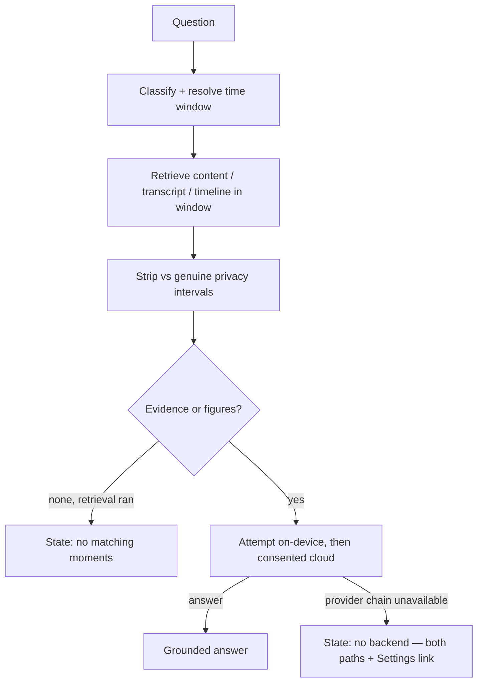
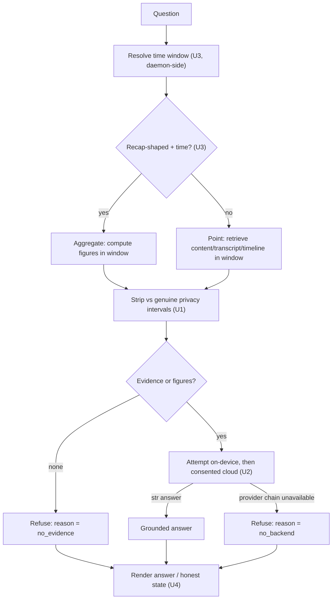

# Chat Recall — Honest Answers - Plan

## Goal Capsule

- Objective: make the Chat surface answer questions about recorded history honestly — a grounded answer wherever a generation backend exists, and a clear, actionable state where none does — while preserving the fail-closed, ALLOW-only, local-first privacy posture.
- Product authority: repository owner (rfigueiredo.dev@gmail.com).
- Execution profile: Deep, cross-cutting (Python daemon + macOS Swift app), privacy-sensitive. Land units in dependency order as atomic commits.
- Stop conditions: surface a blocker rather than guess if a change would weaken the ALLOW-only / fail-closed privacy guarantee, or would send captured data off-box outside the existing consent gate.
- Tail ownership: the implementer runs the Verification Contract gates and the manual smoke checks before declaring done.
- Open blockers: none. On-device answers depend on macOS 26 + Apple Intelligence; that is an environmental prerequisite, not a project blocker.
- Product Contract preservation: changed — R6 made OS-aware (present the actionable path as primary on hosts that can't run on-device, still disclosing both), confirmed by the user during planning review; the "Transparency over conversion" Key Decision refined to match. All other R-IDs unchanged; enrichment otherwise resolves the deferred-to-planning questions as Key Technical Decisions and adds implementation sections.

## Product Contract

### Summary

Chat currently refuses every question and blames missing data or unbuilt indexing. This work makes it answer honestly: repair the evidence strip so legitimate timeline/transcript evidence survives, let the answer dispatch actually attempt on-device generation (so macOS 26 users get real local answers), resolve natural-language time references so "yesterday"/"today" questions — point and aggregate — scope correctly, and replace the single misleading refusal with distinct honest states, including a transparent no-backend state that explains both the on-device and opt-in-cloud paths.

### Problem Frame

The Chat feature shipped in v0.8.0 visible and inviting on every machine, but a `/ce-debug` investigation found it cannot answer anything and misreports why. Two independent defects compound.

First, the answer dispatch resolves its execution target as if on-device generation were unavailable and refuses at that gate before it ever examines evidence or attempts generation. On a default machine (no cloud provider, cloud consent off) this makes every question refuse — and the on-device answer path, which is fully implemented, is never even tried.

Second, the terminal privacy strip that enforces the ALLOW-only guarantee reuses a predicate built for a different job: validating on-disk screenshot files for `frame.nearest`. Fed evidence-item timestamps instead — window-event times for timeline evidence, chunk-start times for transcript evidence — it flags every one as an "orphan screenshot" (no matching screenshot row) and drops it. Against real recordings, 50 timeline rows collapsed to 0; only 19 were genuinely privacy-blocked. Because on-screen-text indexing is off by default, timeline is the only always-available stream, and the strip wipes it — so even with a working backend the evidence bundle is empty.

The user-facing cost is a chat that says "I don't have that in your recorded history" plus "on-screen-text search is not indexed yet" for questions the system could answer — conflating "no AI backend", "no evidence", and "index not built" into one message that sends the user to fix the wrong thing.

### Key Decisions

- **Attempt-then-refuse, not gate-then-skip.** The refusal must reflect the real provider-chain result (on-device, then consented cloud), not a pre-computed assumption that on-device is off. `OnDeviceProvider.answer()` is fully implemented via the bundled Swift helper; only the dispatch's early gate hides it.
- **Strip tests privacy intervals, not screenshot files.** Evidence stripping is a point-in-time membership test against genuinely-blocked intervals (masked / excluded / secure-field / ambiguous windows). The screenshot-file residuals (orphan-screenshot, uncovered-gap) belong only to the `frame.nearest` file-validation path — evidence timestamps are not screenshot files.
- **Transparency over conversion for the no-backend state — OS-aware.** When no backend is reachable, always disclose both paths; never hide one. On a host that cannot run on-device (macOS < 26), surface cloud recall as the *actionable* path (it is the only one the user can act on today) while still disclosing the on-device requirement, so the user gets unstuck without a dark-pattern nudge. On a capable host, present both without steering. This keeps the "nothing leaves this Mac" default intact and cloud a deliberate opt-in.
- **Aggregate stays narration-gated.** A backend narrates the locally-computed figures; there is no raw-figures-without-AI rendering path. The answer experience stays uniform across point and aggregate questions.

### Requirements

**Evidence strip (privacy plumbing)**

- R1. The terminal evidence strip must retain legitimate ALLOW timeline and transcript evidence by testing each item's timestamp against the recording's genuine privacy-blocked intervals (masked, excluded, secure-field, and ambiguous-column windows), not against screenshot-file-validation residuals.
- R2. The strip must still drop any evidence item whose timestamp falls in a genuinely-blocked interval, and must remain fail-closed when a recording's blocked geometry cannot be determined — a missing or partially-readable `recording.db` drops all of that recording's items.

**Answer-backend availability**

- R3. A chat turn must attempt generation (on-device first, then consented cloud) before refusing; the refusal fires only when the actual provider chain reports unavailable, never from an assumption that on-device is off.
- R4. Where on-device generation is reachable (macOS 26 + Apple Intelligence, bundled helper present), a chat turn returns a grounded local answer with no consent required and nothing leaving the Mac.

**Honest states**

- R5. The chat must surface, as distinct user-facing states, at least: no answer backend available; a backend answered; retrieval ran but nothing matched; and the daemon or helper is unreachable. A no-backend outcome must never present as a missing-data or not-indexed outcome.
- R6. The no-backend state must present both paths transparently — on-device answering requires macOS 26 + Apple Intelligence, or enable cloud recall (consent-gated; data leaves the Mac) in Intelligence Settings — and link to that settings surface. Presentation is OS-aware: on a host that cannot run on-device (macOS < 26), surface enabling cloud recall as the actionable next step while still fully disclosing the on-device requirement; on a capable host present both without steering. This is disclosure-complete (never hides a path), not a dark-pattern nudge.
- R7. The "on-screen-text not indexed" signal must be demoted to a secondary, non-blocking hint and must never be the headline reason when timeline or transcript evidence answered the question.

**Time and question coverage**

- R8. The chat must resolve natural-language time references ("yesterday", "this morning", "last week") into a concrete window and scope retrieval to it.
- R9. Aggregate ("how much time") questions must carry a resolved time window so they compute figures instead of refusing with "no time window could be resolved"; the aggregate answer stays narration-gated and falls to the no-backend state when no backend exists.
- R10. An open "what did I do [time period]" question must route to a day/period summary (app-time breakdown, narrated) rather than a keyword-snippet search over the literal question text.

### Key Flows

- F1. Answer a chat turn
  - **Trigger:** the user sends a question from the Chat surface.
  - **Steps:** (daemon-side) classify the question and resolve any time reference to a window; retrieve across content / transcript / timeline scoped to that window; strip evidence against genuine privacy intervals (R1, R2); attempt on-device generation, then consented cloud (R3); select the outcome. Classification, time resolution, retrieval, strip, and generation are all daemon-side (per KTD3/KTD4); the client renders the resulting state.
  - **Outcome:** a grounded answer when a backend produced one; otherwise the matching honest state — no-backend (R5, R6), no-matching-evidence, or daemon-unreachable — never a misattributed refusal. The user-facing states below map onto the dispatch refusal reasons in KTD2: `no_backend` → no-backend state; `no_evidence` → no-matching-moments; `unsupported`/`blocked` → a generic safe refusal; daemon-unreachable is a client-detected transport failure (no envelope), not a wire reason.

### Acceptance Examples

- AE1. **Covers R5, R6.** On macOS 15 (cannot run on-device) with no cloud configured, any question returns the OS-aware no-backend state that surfaces enabling cloud recall as the actionable step (with an Intelligence Settings link) while still disclosing the on-device macOS 26 requirement — not "I don't have that in your recorded history".
- AE2. **Covers R3, R4.** On macOS 26 with Apple Intelligence enabled and the bundled helper present, a question returns a grounded on-device answer with no consent and no egress.
- AE3. **Covers R8, R10.** "What did I do yesterday?" with a working backend returns a day summary scoped to yesterday (app-time breakdown, narrated), not snippets from the earliest events globally.
- AE4. **Covers R9.** "How much time in Figma today?" returns narrated figures for today when a backend exists, and the no-backend state when none does — never "no time window could be resolved".
- AE5. **Covers R1, R2.** When the retrieval window contains a masked window (e.g. a password manager), that window's content never appears in the answer, while ALLOW timeline evidence from the same window is retained.
- AE6. **Covers R5, R7.** When retrieval runs and genuinely nothing matches, the chat shows a distinct "no matching moments" state — separate from the no-backend state, and not headlined by the not-indexed hint.

### Scope Boundaries

**Deferred for later**

- Raw-figures-without-AI aggregate rendering (surfacing computed figures with no narration backend).
- Streaming answers and multi-turn memory persisted across app restarts.

**Outside this work**

- New backends or providers — cloud stays opt-in `gemini` (with the "coming soon" BYO-key path) unchanged.
- On-device answering below macOS 26 — Apple Foundation Models is a hard floor.
- Changing the cloud-off-by-default privacy posture — cloud remains a deliberate opt-in.

### Outstanding Questions

The requirements-only questions are resolved in the Planning Contract: time-resolution location and no-new-dependency (KTD3), strip-predicate structure (KTD1), reported-target/refusal-reason derivation (KTD2), and the "what did I do [time]" classifier change (KTD4). Exact honest-state copy and the Intelligence Settings deep-link target are settled during U4 against the existing `IntelligenceController` surface.

**Deferred to implementation**

- The exact phrase set the time resolver covers (U3) — start from the common set and extend only as real questions demand; unrecognized phrases fall through to no-window.
- The precise `IntelligenceSettings` navigation target the no-backend affordance links to (U4) — discovered against the existing settings routing.

### Sources / Research

- `src/screencap/recall/dispatch.py:341` — `answer_from_bundle` resolves the target with `on_device_available=False` and refuses at line 344 before attempting generation.
- `src/screencap/recall/orchestrator.py:608` — `_strip_blocked` passes evidence-item timestamps into `build_is_blocked`.
- `src/screencap/recall/orchestrator.py:740` — `_build_aggregate_bundle` refuses when `window_ms` is `None`.
- `src/screencap/frame_blocked.py:48` — `build_is_blocked`, the screenshot-file predicate; the `screenshot_residuals` seam for the strip fix.
- `src/screencap/backfill/skip_intervals.py:260` — `derive_skip_intervals`; `screenshot_timestamps=None` yields privacy-intervals-only (canonical + ambiguity + secure-field).
- `src/screencap/segmentation/providers/ondevice.py:283` — `OnDeviceProvider.answer` is a complete on-device answer path via the Swift helper (`task: "answer"`).
- `src/screencap/segmentation/recall.py:29` — `answer_recall`, the on-device-then-consented-cloud chain.
- `src/screencap/segmentation/consent.py:117` — `ConsentPolicy.resolve`; RECALL_ANSWER reaches cloud only with consent + a configured provider.
- `macos/Screencap/Views/Chat/ChatViewModel.swift:170` — the client builds the request without `window_ms`.
- `macos/Screencap/Views/Settings/IntelligenceSettingsView.swift` — the existing consent matrix, including the `recall_cloud_consent` ("Answering Recall searches") toggle.
- `tests/recall/test_evidence_bundle.py` — the privacy-marked strip tests; no existing case exercises timeline-stream survival.

---

## Planning Contract

### Key Technical Decisions

- KTD1. **Strip tests genuine privacy intervals, uniform across streams.** Give `build_is_blocked` a keyword-only `screenshot_residuals: bool = True`; when `False`, derive intervals with `screenshot_timestamps=None` (canonical `SCRUB_BLOCK_ACTIONS` + ambiguity + secure-field only) while still bounding the time range from the passed timestamps and keeping `require_canonical=True`. `_strip_blocked` calls with `screenshot_residuals=False`. Applied uniformly to all streams — the canonical/ambiguity/secure-field intervals fully cover genuinely-blocked spans, content is already ALLOW-only at ingest and purge-propagated, and the orphan/uncovered-gap residuals are file-validation artifacts that only make sense for on-disk screenshots. `frame.nearest` keeps the default (`True`) and is untouched.
- KTD2. **Attempt-then-refuse in the dispatch.** Remove the early target-gate refusal that short-circuits when `on_device_available=False`; let a turn with evidence (or aggregate figures) call `answer_recall`, which tries on-device then consented cloud, and refuse only on `PROVIDER_UNAVAILABLE`. Add a distinct refusal-reason to `ChatAnswer` and the wire payload covering **every** refusal branch — `no_backend` (provider chain unavailable), `no_evidence` (empty bundle, no figures), `unsupported` (attribution validator rejected the answer), and `blocked` (whole-payload egress guard tripped). The empty-bundle short-circuit stays, tagged `no_evidence`; the egress-guard and attribution paths must set `blocked`/`unsupported` rather than falling through to a default that reads as `no_backend` on a machine that actually has a working backend and matching evidence.
- KTD3. **Natural-language time resolution is daemon-side and dependency-free.** A small resolver (new `src/screencap/recall/timeparse.py`) maps a bounded phrase set (today, yesterday, this/last morning-afternoon-evening, this week, last week, last N hours/days, this month) to a half-open `(start_ms, end_ms)` in the local timezone. It runs in the daemon `chat.answer` path so the MCP tool benefits too. The existing `window_ms` request field stays as an explicit client override that takes precedence; no NLP dependency is added. **Window-boundary rule:** a recognized phrase whose period has not started relative to `now` (e.g. "this morning" asked at 02:00) clamps its end to `now` rather than returning a future/empty window; a phrase that resolves to a zero-or-negative window falls through to no-window (same path as an unrecognized phrase), never a silently-empty future window that would read as "no matching moments".
- KTD4. **"what did I do [time period]" routes to the aggregate/day-summary path.** Extend `classify_question` so an open recap-shaped question classifies `AGGREGATE`. The discriminator is **recap-intent, not the mere presence of a time reference** (both a recap and a keyword lookup can carry "yesterday"): route to aggregate when the question matches a recap-intent pattern ("what did I do", "what was I doing", "what did I work on", "walk me through", plus the existing `_AGGREGATE_CUES`) **and** carries no dominant content keyword; a question with a specific content noun/subject ("what was that error I saw yesterday afternoon") stays a point lookup even with a time reference. Keep it rule-based v1; the exact recap-pattern set is refined in U3.
- KTD5. **Reported target and refusal-reason reflect the actual outcome, not the pre-resolve.** The dispatch must not ship the `on_device_available=False` `policy.resolve(...)` verbatim as the reported `target`: on a default machine that resolves to `NONE`, so a turn that then answers on-device would mislabel a successful answer as no-backend, and U4's honest-state selector keys off exactly this field. A successful answer must never report `target = NONE`. Implement by having `answer_recall` surface which stage produced the answer (on-device vs consented cloud) — or, minimally, have the dispatch treat "got a `str` answer" as the answered signal and derive `target`/reason from the real outcome rather than the pre-resolve.

### High-Level Technical Design

The change reshapes one decision path — the chat turn — from "gate on a stale availability assumption, then maybe retrieve" to "retrieve, strip against real privacy intervals, attempt the real provider chain, then classify the outcome honestly." The diagram shows the target flow and which unit owns each segment.

The two diagrams sit at different altitudes: the Product Contract's F1 flow shows the user-facing outcome states, while this one shows the dispatch's internal refusal reasons (`no_evidence`, `no_backend`) that those states map onto (see F1's outcome mapping). Plan diagram authority: the prose Requirements and unit bodies govern where they and the diagram disagree.

### Assumptions

- The bundled Swift `IntelligenceHelper` implements `task: "answer"` end-to-end on macOS 26 + Apple Intelligence; the Python `OnDeviceProvider.answer` path is already complete, so no helper change is in scope. If the helper's answer mode is absent, that is a separate follow-up surfaced during U2 verification, not silently worked around.
- Adding a response field and a `screenshot_residuals` keyword argument is backward-compatible; the client decodes tolerantly and `frame.nearest` keeps the default.

### Sequencing

U1 and U2 are independent and can land in either order; U3 follows (touches the same `orchestrator.py` module as U1, different functions); U4 depends on U2's refusal-reason wire field. Recommended order: U1 → U2 → U3 → U4.

---

## Implementation Units

### U1. Repair the evidence strip to test genuine privacy intervals

- Goal: stop the terminal strip from discarding legitimate ALLOW timeline/transcript evidence while still dropping genuinely-blocked content.
- Requirements: R1, R2; supports R7.
- Dependencies: none.
- Files: `src/screencap/frame_blocked.py`, `src/screencap/recall/orchestrator.py`, `tests/test_frame_blocked.py`, `tests/recall/test_evidence_bundle.py`.
- Approach: per KTD1, add `screenshot_residuals: bool = True` (keyword-only) to `build_is_blocked`; branch the `derive_skip_intervals` call on it (`screenshot_timestamps=None` when `False`, keeping `require_canonical=True` and the time-range bound). Change `_strip_blocked` to call `build_is_blocked(rec_dir, frame_tss, screenshot_residuals=False)`. Leave the empty-`frame_tss` guard and the fail-closed `except → _always_blocked` path intact.
- Execution note: characterization-first — add the failing "timeline evidence at an ALLOW window survives the strip" test before touching the predicate, so the regression is captured.
- Patterns to follow: the existing fail-closed structure in `frame_blocked.build_is_blocked`; the masked-window fixture `_make_recording_with_masked_window` in `tests/recall/test_evidence_bundle.py`.
- Test scenarios (mark privacy-bearing cases `@pytest.mark.privacy`, keep Vision-free):
  - Covers R1. A timeline evidence item whose timestamp sits in an ALLOW window survives `build_evidence_bundle`'s strip (fails today).
  - Covers R2/AE5. A timeline/content item whose timestamp sits in a masked 1Password window is dropped.
  - Covers R2. An item in a NULL-column ambiguity interval (`AMBIGUOUS_BROWSER_URL` / `AMBIGUOUS_TITLE`) and one in a NULL `element_state` secure-field span are **still dropped** after `screenshot_residuals=False` — the canonical + ambiguity + secure-field passes are exactly what `screenshot_residuals=False` must retain, so this guards against a refactor that skips more than the gap/orphan passes.
  - Covers R2. A recording with a missing/partial `recording.db` drops all its items — `require_canonical=True` must stay set on the `screenshot_residuals=False` branch (fail-closed preserved).
  - `build_is_blocked(..., screenshot_residuals=True)` still flags an orphan-screenshot timestamp (the `frame.nearest` contract is unchanged).
- Verification: the new timeline-survival test passes; existing `test_masked_interval_content_absent_from_bundle`, `test_coverage_gap_is_treated_as_blocked_fail_closed`, and the `frame.nearest` tests still pass.

### U2. Attempt-then-refuse dispatch with an honest refusal reason

- Goal: attempt real generation before refusing, and report *why* a refusal happened so the client can distinguish no-backend from no-evidence.
- Requirements: R3, R4, R5.
- Dependencies: none (independent of U1).
- Files: `src/screencap/recall/dispatch.py`, `src/screencap/daemon/schema.py`, `src/screencap/daemon/app.py`, `tests/recall/test_generation_dispatch.py`, `tests/daemon/test_read_only_verbs.py`.
- Approach: per KTD2/KTD5, drop the early target-gate refusal so a bundle with evidence or figures reaches `answer_recall`; map a non-`str` result to a `no_backend` refusal, the empty bundle to `no_evidence`, an attribution rejection to `unsupported`, and an egress-guard breach to `blocked`. Carry the reason on `ChatAnswer`, add it to `_chat_answer_payload` and the `ChatAnswerResponse` schema (additive field). Per KTD5, set the reported `target` from the actual outcome — a successful answer must not report `NONE` — which requires `answer_recall` to surface which stage answered (or the dispatch to treat a returned `str` as the answered signal). Keep the whole-payload egress guard and the attribution validator in place; only their *reason tagging* changes.
- Execution note: prove the core behavior with a fake `answer_fn` — a turn with surviving evidence and no cloud consent must return an answer (not a refusal, and not `target=NONE`) when the fake returns a `str`, and a `no_backend` refusal when it returns `PROVIDER_UNAVAILABLE`.
- Patterns to follow: the existing `answer_from_bundle` two-state handling and `_refusal` helper; the additive envelope fields in `schema.py`.
- Test scenarios:
  - Covers R3/R4. Evidence present + `answer_fn` returns `str` + no cloud consent → `refusal=False`, answered, and the reported `target` is not `NONE` (does not read as no-backend).
  - Covers R5. Evidence present + `answer_fn` returns `PROVIDER_UNAVAILABLE` → refusal with reason `no_backend`.
  - Covers R5. Empty bundle (no evidence, no figures) → refusal with reason `no_evidence`.
  - Attribution rejection → refusal with reason `unsupported`; a whole-payload egress-guard breach → refusal with reason `blocked` (neither masquerades as `no_backend`).
  - `chat.answer` payload includes the reason field and stays pointer-only.
- Verification: dispatch tests cover all four reasons and the not-`NONE`-on-success target; the daemon verb returns the new field without 500s; egress/attribution enforcement paths unchanged.

### U3. Daemon-side natural-language time resolution and question routing

- Goal: resolve "yesterday"/"today"/"this morning" into a window, scope point retrieval to it, feed aggregate questions a window so they compute figures, and route recap-shaped time questions to the aggregate path.
- Requirements: R8, R9, R10.
- Dependencies: U1 (shares `orchestrator.py`; land after to avoid churn).
- Files: `src/screencap/recall/timeparse.py` (new), `src/screencap/recall/orchestrator.py`, `src/screencap/daemon/app.py`, `tests/recall/test_timeparse.py` (new), `tests/recall/test_evidence_bundle.py`.
- Approach: per KTD3/KTD4, add `timeparse.resolve_time_window(question, now_ms, tz)` returning a half-open `(start_ms, end_ms)` or `None` for the bounded phrase set, applying the KTD3 window-boundary clamp. In the `chat.answer` handler, when the client sent no explicit `window_ms`, resolve from the question and pass it through. Thread the window into the point path: `query_timeline` already accepts `start_ms`/`end_ms`, but `_build_point_bundle` currently calls it unscoped (`query_timeline(recording=None, limit=limit)`), so add a window parameter through `build_evidence_bundle` → `_build_point_bundle` and pass it in; also feed it to `_build_aggregate_bundle`. Extend `classify_question` with the KTD4 recap-intent discriminator.
- Patterns to follow: `aggregate_window(start_ms, end_ms, ...)` signature in `src/screencap/segmentation/aggregate.py`; the existing `_AGGREGATE_CUES` / `_AGGREGATE_RE` cue structure in `orchestrator.py`.
- Test scenarios:
  - Covers R8. "yesterday" / "this morning" / "last week" resolve to the correct local-timezone half-open windows; an unrecognized phrase returns `None`.
  - Covers R8/KTD3. "this morning" evaluated at 02:00 clamps its end to `now` (or falls to no-window), never a future/empty window that would read as "no matching moments".
  - Covers R8. A point question with a time reference scopes the timeline query to the resolved window (not the 50 earliest events globally).
  - Covers R9. An aggregate question resolves a window and computes figures instead of "no time window could be resolved"; with no resolvable window it reports the honest no-window aggregate state.
  - Covers R10/KTD4. "what did I do yesterday" and "what did I work on yesterday" classify `AGGREGATE`; "what was that error I saw yesterday" stays a point lookup (recap-intent, not mere time-presence, is the discriminator).
- Verification: `test_timeparse.py` passes across the phrase set and timezone boundaries; evidence-bundle tests confirm point windowing and aggregate window flow.

### U4. Honest-state rendering in the macOS app

- Goal: replace the single misleading refusal with distinct states — a transparent no-backend state that guides the user to both paths, a distinct no-matching-moments state, and a demoted not-indexed hint.
- Requirements: R5, R6, R7.
- Dependencies: U2 (consumes the refusal-reason wire field).
- Files: `macos/Screencap/Models/ChatRecall.swift`, `macos/Screencap/Views/Chat/ChatView.swift`, `macos/Screencap/Views/MainWindow.swift`, `macos/ScreencapTests/ChatViewModelTests.swift`.
- Approach:
  - **Decode + unify.** Add the refusal-reason to `ChatAnswerResponse` (decode-tolerant). Introduce a single client-side `ChatHonestState` enum computed once per turn that unifies the three signals — the refusal-reason (`no_backend`/`no_evidence`/`unsupported`/`blocked`), `coverage.state`, and the transport-failure (`.failed`) turn state — into: `answered`, `noBackend`, `noMatchingMoments`, `safeRefusal` (unsupported/blocked), `daemonUnreachable`. Do not leave the mapping as ad-hoc boolean branching. Define an explicit **precedence**: transport failure → `daemonUnreachable`; else refusal-reason `no_backend` → `noBackend`; else `no_evidence`/coverage no-match → `noMatchingMoments`; else answered.
  - **Distinct rendering.** Each state gets a visually distinct treatment, not just different note text under the shared `coverageLine` (today every non-`ok` coverage state renders with the same info-circle + muted gray line). At minimum `noBackend` gets its own icon + the both-paths copy + a Settings call-to-action button, distinguishable at a glance from the single-line `noMatchingMoments`.
  - **No-backend copy + navigation (OS-aware, R6).** Render `noBackend` with disclosure-complete copy for both paths. Branch on host capability (`if #available(macOS 26, *)`): on a host that cannot run on-device, present enabling cloud recall as the actionable next step (with the Settings CTA) while still stating the on-device requirement; on a capable host, present both without steering. Never hide a path. The Settings affordance drives in-app navigation via MainWindow's `ShellRoute` (`route = .intelligence`), NOT `IntelligenceController` (which is config-only, no navigation): thread a new `onOpenIntelligenceSettings: () -> Void` closure into `ChatView()` at its `MainWindow` instantiation, mirroring the existing `PrivacySettingsView(onOpenAppRules:)` / `JournalView(onOpenSearch:)` pattern.
  - **OCR-consent precedence (R7).** The existing `showOcrConsent` affordance (`suggestsOcrConsent && !contentIndexEnabled`) must be **suppressed when the state is `noBackend`** — otherwise a turn that is both no-backend and thin-on-content would tell the user to turn on indexing when the real blocker is that no answer backend exists, re-creating the exact conflation R7 removes. The not-indexed hint also never headlines an answered turn (`coverage.state == ok`).
- Patterns to follow: the existing `coverageLine` / `showOcrConsent` rendering in `ChatView.swift`; the `PrivacySettingsView(onOpenAppRules:)` / `JournalView(onOpenSearch:)` closure-threading and `ShellRoute` in `MainWindow.swift`; `ChatCoverageState.suggestsOcrConsent`.
- Test scenarios:
  - Covers R5/R6. A `no_backend` refusal computes `ChatHonestState.noBackend`, renders the guidance and a Settings affordance, and is visually distinct from `noMatchingMoments` — not the "not in your recorded history" / not-indexed text.
  - Covers R6. OS-aware presentation: on a host that can't run on-device (macOS < 26), the no-backend state surfaces cloud recall as the actionable path while still disclosing the on-device requirement; on a capable host both are presented without steering. Neither path is hidden.
  - Covers R5. A `no_evidence` refusal computes `noMatchingMoments`, distinct from `noBackend`.
  - Covers R7. When a turn is both `no_backend` and `suggestsOcrConsent`, the OCR-consent affordance is suppressed (no-backend wins).
  - Covers R7. An answered turn (coverage `ok`) shows no not-indexed headline.
  - A daemon-unreachable failure computes `daemonUnreachable` and renders the existing "helper not running" affordance (transport-detected, not a wire reason).
- Verification: `ChatViewModelTests` cover the `ChatHonestState` mapping and precedence (including the both-signals-present case); manual check on macOS 15 shows the no-backend state with a working Settings link.

---

## Verification Contract

- Python (run from the worktree with `PYTHONPATH=src`, per the editable-install worktree gotcha): `PYTHONPATH=src pytest tests/recall/ tests/test_frame_blocked.py tests/daemon/test_read_only_verbs.py`.
- Privacy CI lane (the only lane CI runs): mark the strip and evidence-survival cases `@pytest.mark.privacy`, keep them Vision-free, and confirm `PYTHONPATH=src pytest -m privacy` includes them and is green.
- Lint the engine sub-package if touched: `ruff check src/screencap/engine/` (n/a for these paths, but run if any engine file changes).
- macOS app: build and run `ChatViewModelTests` via the XcodeGen project (the daemon-reconnect test is known-flaky — rerun once before treating a failure as real).
- Manual smoke (macOS 15, no cloud configured): "what did I do yesterday?" and "how much time in Figma today?" both return the no-backend state with both-paths guidance — never "I don't have that in your recorded history" or "no time window could be resolved". With cloud recall enabled (or on macOS 26 + Apple Intelligence), the same questions return grounded, time-scoped answers.

## Definition of Done

- Global: R1–R10 satisfied; AE1–AE6 hold; the Verification Contract gates pass; the privacy lane is green; no masked-window content can reach an answer (AE5); abandoned/experimental code from the change is removed from the diff.
- Honest scope of impact (not a bug): for a typical machine today (macOS 15, cloud off), the shipped end state remains a refusal — now the *honest* no-backend state (AE1), not a grounded answer. This work closes the honesty gap for everyone and the can't-answer gap only where a backend exists (macOS 26 + Apple Intelligence, or opt-in cloud). AE2/AE3/AE4's grounded-answer outcomes are conditioned on a working backend; that dependency is expected and communicated, not a failure of this plan.
- U1: legitimate ALLOW timeline evidence survives the strip (the 50→0 regression is closed) while masked/excluded content and indeterminate-geometry recordings are still dropped.
- U2: a chat turn attempts on-device before refusing; refusals carry an honest reason (`no_backend` / `no_evidence` / `unsupported`).
- U3: natural-language time references resolve to correct windows; point questions scope to them; aggregate questions compute figures; recap-shaped time questions route to the aggregate path.
- U4: the app renders distinct honest states; the no-backend state guides the user to both paths and links to Intelligence Settings; the not-indexed note never headlines an answered turn.
