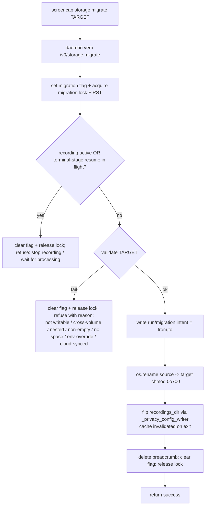
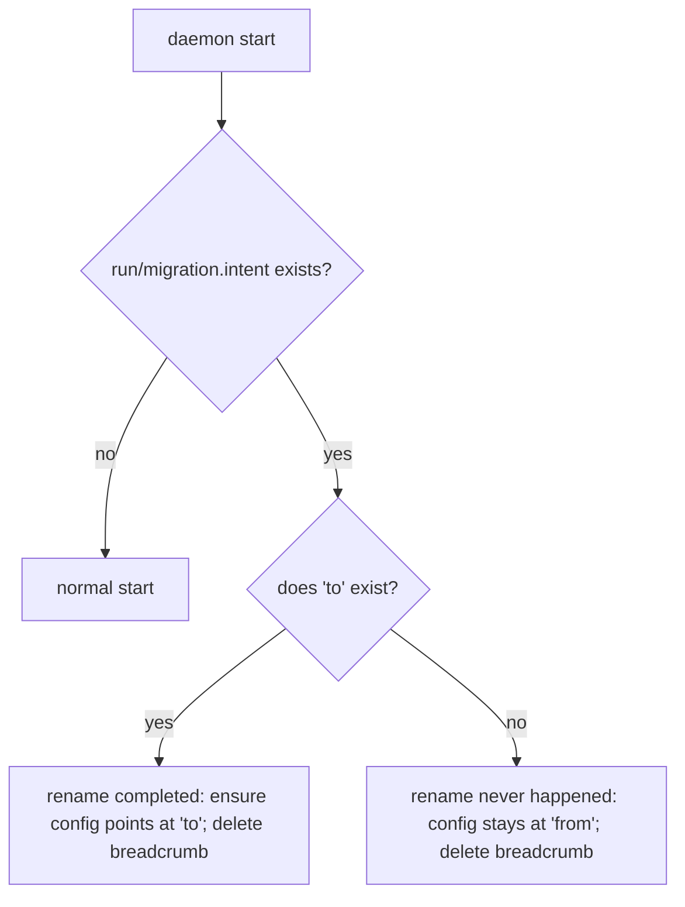

# feat: Change storage location with library migration (SCR-228)

## Product Contract

### Summary

Enable the currently-disabled "Change…" button in the Privacy settings pane so a user can pick a new recordings directory and move their existing library there. **v1 supports same-volume moves only** — an atomic, near-instant `os.rename` of the recordings tree, regardless of library size. This deliberately narrows scope: the migration becomes a fast synchronous daemon verb with no copy engine, no background job, no progress stream, and no cancel — removing almost all of the data-loss surface. Cross-volume / external-drive moves (which require a copy-verify-then-delete engine) are deferred to a fast-follow.

**Scope tradeoff, stated plainly:** because same-volume moves don't free the source disk, this v1 does **not** address the "my boot volume is full, move recordings to an external drive" case — that is the deferred cross-volume work. v1 serves relocating the library to a different path on the same volume (organization, a larger same-device partition/APFS volume). Cross-volume is the recommended immediate follow-up (see Scope Boundaries).

### Problem Frame

The storage row already displays the live recordings directory and its size, but the "Change…" button is a hardcoded stub (`.disabled(true)`, empty action, "Coming soon — SCR-228" tooltip) at `macos/Screencap/Views/Settings/PrivacySettingsView.swift:251`. Users cannot relocate their library.

Setting a new path is already trivial: `config.get_recordings_dir()` (`src/screencap/config.py:112`) reads `SCREENCAP_RECORDINGS_DIR` or the `recordings_dir` config key. Two facts still make even a same-volume move non-trivial and force it into the daemon rather than a pure CLI:

1. The daemon caches config in-process (`_config_cache`; `get_recordings_dir()` reads it through `_load_toml()` fresh per request in the long-lived daemon). A cross-process CLI write to `config.toml` leaves the daemon resolving the **old** path until the cache is invalidated in-process. The reused `_privacy_config_writer()` seam (`src/screencap/privacy_settings.py:68`) already calls `invalidate_config_cache()` on clean exit — so performing the config flip through that seam *inside the daemon process* invalidates the cache automatically; no separate step is needed.
2. The daemon is the authority on whether a recording — or a background terminal-stage / upload resume — is in progress. Renaming the tree out from under either would corrupt data, so migration must coordinate with and block them.

### Requirements

- **R1** — A user can choose a new recordings directory from the macOS Privacy pane and have the existing library moved there (same volume), after which the app reads/writes recordings at the new location.
- **R2** — The move is crash-safe: an atomic directory `rename` followed by an atomic config flip, ordered behind an intent breadcrumb so a crash at any point leaves the system pointing at exactly one intact location (old or new), reconciled on next daemon start.
- **R3** — v1 **rejects cross-volume targets** (target on a different filesystem than the source) with a clear "external-drive support is coming" message. Cross-volume migration is deferred (see Scope Boundaries).
- **R4** — The move is **refused while a recording is in progress OR while any background terminal-stage / upload / scrub resume is in flight**; while a migration is running, a new recording is refused. All are mutually exclusive.
- **R5** — Preflight validation rejects unsafe targets before the move: not writable, on a different volume (R3), nested inside (or a parent of) the source, non-empty / already-existing-with-data, an active `SCREENCAP_RECORDINGS_DIR` env override that would mask a config change, or **a cloud-synced folder** (iCloud Drive / Dropbox / OneDrive / Google Drive) that would silently sync the local-only library off-device. (No free-space check: an atomic same-volume `rename` consumes no additional space — a free-space preflight belongs to the deferred cross-volume copy path.)
- **R6** — The UI confirms the destructive action before moving (names the new location and that recording is blocked during the move), surfaces each validation rejection as a human-readable message, and reports success (updating the displayed path) or failure with reason.
- **R7** — `recording.db` remains local-only after the move (SECURITY.md R8). The migration is a local rename and must never stage `recording.db` on any cloud-bound path; a mandatory privacy-lane test asserts this across a move.
- **R8** — The migration is scriptable headlessly via a `screencap storage migrate` CLI, consistent with the daemon-auto-spawn model, so it works on F3/headless installs.
- **R9** — The new recordings root is `chmod`'d to `0o700` and the result is verified (a silently-failed hardening fails the migration rather than reporting success). The `0o700` root is the load-bearing cross-user gate — it blocks directory traversal regardless of per-file mode, keeping the move O(1) — so per-file `0o600` is left to the recorder's existing write-time hardening rather than an O(n) walk. Recovery (`reconcile_pending`) re-applies the `0o700` gate best-effort.

### Scope Boundaries

**In scope:** same-volume relocation of the recordings directory (the `recordings_dir` config key) and its entire subtree; the daemon verb, CLI, and macOS UI to drive it.

**Out of scope (true non-goals):**

- Relocating the rest of `~/.screencap/` — `content_index.db`, `backfill_state.db`, `run/` sockets and locks, `config.toml`, `models/`, `downloads/` stay put. The content index and backfill ledger key on recording *name* and resolve paths at query time, so they survive a recordings-dir move untouched.
- The other stubbed rows on the same pane (E2EE — SCR-220, auto-pause — SCR-224).
- Cloud/GCS layout changes — remote object keys are recording-name-based (`src/screencap/upload.py:468`), so a local move does not affect cloud state.

#### Deferred to Follow-Up Work

- **Cross-volume / external-drive migration (highest-priority follow-up — this is the case that frees a full boot disk).** Requires the pieces v1 deliberately omits: a background migration job (mirroring `src/screencap/daemon/backfill_job.py`) with `/v0/storage.migrate.start|status|cancel` verbs; a copy-to-staging → verify (file counts + bytes) → atomic config flip → delete-source engine with rollback and orphaned-staging cleanup; **registration of the job in the daemon idle-shutdown busy predicate** (`_daemon_is_busy` in `src/screencap/daemon/_idle_shutdown.py`, alongside `backfill_job` / `model_download_job`) so an auto-spawned daemon never idle-exits mid-copy; progress streaming as line-buffered JSON events modeled on the `screencap start` event loop (`src/screencap/cli/__init__.py` ~L863), **not** the poll-based backfill group; and the Swift progress/cancel/partial-failure UX (a `MigrationEventLine` JSON decoder mirroring `UploadEventLine`, `.migrating(fraction:)` / `.cancelling` / `.cancelled` states, a Cancel affordance, and partial-failure recovery copy).
- **Merging into a non-empty target** (name-collision resolution).
- **Symlink/junction "keep in place, point elsewhere" mode.**
- **Automatic relocation of `models/` and `downloads/`.**

---

## Planning Contract

### Key Technical Decisions

**KTD-1 — Synchronous daemon verb, not a background job.** A same-volume `os.rename` of a directory is atomic and O(1) regardless of subtree size (it relinks one directory entry), so the move completes effectively instantly. The migration is therefore a single synchronous daemon verb (`/v0/storage.migrate`), not a Supervisor-style background task. This is the central simplification the same-volume-first scope unlocks: no worker thread, no `/v0/events` progress stream, no status/cancel verbs, no idle-shutdown-mid-job hazard. (The deferred cross-volume path reintroduces the background job — see Scope Boundaries.) Rationale for still living in the daemon: only in-process config-cache invalidation and authoritative active-recording/terminal-stage checks are possible there; a pure-CLI move can't coordinate either.

**KTD-2 — Standalone migration engine module.** The validate + move logic lives in a new `src/screencap/storage_migration.py` with no daemon imports — pure functions over source path, target path. Rationale: keeps the data-movement logic unit-testable without a daemon. (Designed for its one current consumer, the daemon verb; no speculative second-consumer generality.)

**KTD-3 — Atomic rename + atomic config flip, ordered behind an intent breadcrumb.** The move is: (1) write an intent breadcrumb `~/.screencap/run/migration.intent` = `{from, to}`; (2) `os.rename(source, target)`; (3) `chmod 0o700` the new root; (4) flip `recordings_dir` in config; (5) delete the breadcrumb. On daemon start, a reconciliation step reads any leftover breadcrumb and completes or backs out idempotently: if `to` exists (rename happened), ensure config points at `to` and delete the breadcrumb; if only `from` exists (crash before rename), leave config at `from` and delete the breadcrumb. Rationale: `os.rename` is atomic but the rename-then-flip pair is two steps; the breadcrumb closes the crash window feasibility flagged (a crash between rename and flip must not leave config pointing at a vanished path). Same-volume is a hard precondition — `os.rename` fails across filesystems (`EXDEV`), which R5/U2 reject up front with a clear message rather than letting it surface as an opaque error.

**KTD-4 — Target must be empty or non-existent.** The move refuses a target that already contains data, eliminating merge semantics (deferred) and keeping reconciliation trivial. Note the `get_recordings_dir()` `mkdir(exist_ok=True)`-on-read behavior: validation must treat an *empty* existing target as acceptable (a bare read may have created it) and handle the rename-into-existing-empty-dir case (rename into a fresh sibling name then swap, or `rmdir` the empty target first).

**KTD-5 — Mutual exclusion via a daemon-held flag + lock, set/checked synchronously on the event loop.** The verb sets an in-process "migration active" flag and holds an advisory `fcntl.flock` at `~/.screencap/run/migration.lock`. It sets the flag + acquires the lock **first**, then re-checks that no recording is active (`session.snapshot` `is_recording`, derived from the recording pidfile) **and** no terminal-stage resume is in flight (`supervisor.has_inflight_resume()`); if either is found it backs out (clears flag, releases lock) and refuses. `recording.start` (`src/screencap/daemon/app.py:538`) refuses with a typed error while the flag is set. Because the daemon serializes handlers on one asyncio loop, the flag set (verb) and check (`recording.start`) must both run synchronously with no intervening `await`, so the loop serializes them. Rationale: closes both race directions, including the `is_recording`-is-false-during-background-upload gap (a scrub/upload resume operates on a recording dir without holding a recording-started flock).

**KTD-6 — Config flip reuses the atomic, cache-invalidating seam.** The `recordings_dir` write goes through `_privacy_config_writer()` (`src/screencap/privacy_settings.py:68`), which wraps `save_config_atomic()` and calls `invalidate_config_cache()` on clean exit. Performing the flip through this seam in the daemon process both persists atomically (lost-update-safe via the `config.lock` flock) and invalidates the daemon's in-process cache — no separate invalidation call. Rationale: this is the established single source of truth for config mutation (`set_audio_default` at `src/screencap/config.py:129` is the pattern); a hand-rolled write would lose the flock protection.

**KTD-7 — Swift drives the move with a one-shot `runJSONRaw` call, not a stream.** Because the move is synchronous and fast (KTD-1), `PrivacyController` invokes `screencap storage migrate <path> --json` via `CLIClient.runJSONRaw` (the same pattern as `setUploadDefault` at `PrivacyController.swift:179`) behind a brief in-flight state, then calls `refreshStatus()` on success so the `@Published recordingsDir` updates the row. Rationale: avoids the JSON-event stderr-streaming contract entirely (the plain-text-vs-JSON mismatch feasibility flagged is moot when there is no stream); `spawn`/event-parsing is reserved for the deferred cross-volume progress path.

**KTD-8 — Reject cloud-synced targets, reusing the existing detector.** `validate_target` calls `screencap.network.ca_lifecycle.check_icloud_sync(path)` (`network/ca_lifecycle.py:227`, already used on the network path for exactly this exfiltration concern) and additionally rejects known sync roots (`~/Library/Mobile Documents`, `~/Dropbox`, `~/OneDrive`, `~/Library/CloudStorage/*`, `~/Google Drive`). Rationale: a synced target would sync the entire local-only library (raw screenshots, `recording.db`, transcripts, `browser_url`) off-device, breaking the local-only guarantee R7 depends on. This applies even to same-volume targets — iCloud Drive lives on the boot volume.

### Assumptions

- The macOS daemon does **not** run with `SCREENCAP_RECORDINGS_DIR` set in its launchd environment by default (that env channel carries `PATH`, `SCREENCAP_DEV_REPO_ROOT`, `USE_DEV_SOURCE`). If it were set, config-based relocation would be masked — hence R5's env-override refusal.
- "Storage location" in the UI refers to the `recordings_dir` subtree, matching what the row displays. (An open question notes the onboarding flow frames "storage" as a This-Mac/Personal-cloud/Team-cloud *destination* choice; the pane's live path display supports the filesystem-path reading, but confirm against the SCR-228 ticket — see Open Questions.)

---

## High-Level Technical Design

### Migration flow (synchronous, same-volume)

### Crash reconciliation (daemon start)

The rename+flip pair is bracketed by the breadcrumb, so recovery always converges on exactly one intact location.

---

## Implementation Units

### U1. Config setter for `recordings_dir`

**Goal:** Persist the recordings directory through the existing setter pattern.

**Requirements:** R1.

**Dependencies:** none.

**Files:**
- `src/screencap/config.py` — add `set_recordings_dir(path: Path) -> None` mirroring `set_audio_default` (`config.py:129`), wrapped in the `_privacy_config_writer()` seam (KTD-6).
- `tests/test_config.py` — new tests.

**Approach:** Persist only; no file movement, no validation beyond absolute-path normalization. Reuse `save_config_atomic` + the `config.lock` flock via `_privacy_config_writer`; do not hand-roll a writer.

**Test scenarios:**
- Writing a new path persists `recordings_dir`; a subsequent `get_recordings_dir()` returns it (cache invalidated by the seam).
- The write preserves other config keys and tomlkit formatting/comments.
- Concurrent write contention: with `config.lock` held, the setter retries then succeeds (or raises the same timeout the existing writer does).

### U2. Standalone migration engine

**Goal:** Implement same-volume validation, the breadcrumbed atomic move, and permission hardening as a daemon-free module.

**Requirements:** R2, R3, R5, R7, R9.

**Dependencies:** none.

**Files:**
- `src/screencap/storage_migration.py` (new) — `validate_target(source, target) -> ValidationResult` and `migrate(source, target) -> MigrationOutcome` (breadcrumb → rename → chmod → return; the caller owns the config flip). No `screencap.daemon` imports.
- `tests/test_storage_migration.py` (new).

**Approach:** `validate_target` checks, each returning a distinct inspectable reason: same volume (`os.stat(source).st_dev == os.stat(parent_of_target).st_dev`, else the cross-volume rejection — R3); writable/creatable; not equal to source; not nested (target not inside source, source not inside target); empty-or-nonexistent (KTD-4, treating a bare empty dir as acceptable); free space via `shutil.disk_usage(target).free` (the primitive `engine/disk_policy.py` uses — `disk_warn_mb`/`disk_stop_mb` are unrelated recording-gate thresholds, not a reusable free-space helper); `SCREENCAP_RECORDINGS_DIR` unset (R5); **not a cloud-synced path** via `check_icloud_sync` + the sync-root list (KTD-8). `migrate` writes the intent breadcrumb, performs `os.rename` (handling the rename-into-existing-empty-dir case), `chmod 0o700` the new root and preserves/sets `0o600` on files (R9), and returns an outcome signaling the caller to flip config. A separate `reconcile_pending()` reads a leftover breadcrumb for daemon-start recovery (KTD-3).

**Execution note:** Data-integrity-critical unit — write the crash/reconciliation and validation-rejection tests first.

**Test scenarios:**
- Same-volume move: tree relocated via rename; source gone; all recording subdirs + `recording.db` + `-wal`/`-shm` sidecars present at target and openable.
- Validation rejects, each with a distinct reason: cross-volume target (different `st_dev`); non-writable; nested (target in source; source in target); non-empty target; insufficient free space; `SCREENCAP_RECORDINGS_DIR` set; **cloud-synced target** (iCloud/Dropbox/OneDrive/Google Drive path).
- Empty-existing target (simulating a `get_recordings_dir()` mkdir) is handled, not errored.
- Permissions: after the move, the new root is `0o700` and moved files are `0o600`.
- Reconciliation: breadcrumb present + `to` exists → converges on `to`; breadcrumb present + only `from` exists → converges on `from`; both idempotent on repeat.
- `recording.db` stays local-only across the move — a real move followed by an assertion the DB is at the new local path and no cloud seam was touched. **Mark `@pytest.mark.privacy`** so CI's privacy lane runs it (R7).

### U3. Daemon migration verb + start-time reconciliation

**Goal:** Expose a synchronous `/v0/storage.migrate` verb that enforces mutual exclusion, runs the engine, flips config, and reconcile any pending breadcrumb at daemon start.

**Requirements:** R1, R2, R4, R6, R7.

**Dependencies:** U1, U2.

**Files:**
- `src/screencap/daemon/app.py` — register `/v0/storage.migrate` (route block near `app.py:2176`); handler modeled on `recording_start` (`app.py:538`). Add the breadcrumb reconciliation call to the daemon start sequence.
- `src/screencap/daemon/schema.py` — request (target path) / response (result + typed reason) models mirroring `RecordingStartRequest` (`schema.py:228`).
- `tests/` — daemon verb + reconciliation tests.

**Approach:** Synchronous handler (KTD-1): set migration-active flag + acquire `migration.lock` first, synchronously on the loop (KTD-5); re-check `is_recording` and `supervisor.has_inflight_resume()`; validate via U2; on success perform the move, flip config via `_privacy_config_writer` (KTD-6), clear flag, release lock, return; on any failure back out (clear flag, release lock, delete breadcrumb if written) and return the typed reason. Register `reconcile_pending()` (U2) in the daemon start path. No background job, no `/v0/events`, no status/cancel verbs (KTD-1).

**Patterns to follow:** `recording_start` handler (validation → typed errors → envelope); `set_audio_default` config-write pattern.

**Test scenarios:**
- `migrate` while `is_recording` → refused with the typed "recording active" error; flag cleared, lock released.
- `migrate` while a terminal-stage / upload resume is in flight (`has_inflight_resume()` true) → refused; no rename performed.
- Success path: config now reports the new dir; a subsequent daemon-side `get_recordings_dir()` returns the new path (cache invalidated via the seam).
- Each engine validation reason surfaces as a distinct typed API error.
- Start-time reconciliation completes a pending breadcrumb (both `to`-exists and only-`from`-exists cases).
- Concurrent `migrate` while one is in flight → refused (lock held).

### U4. `recording.start` mutual-exclusion guard

**Goal:** Refuse to start a recording while a migration is active.

**Requirements:** R4.

**Dependencies:** U3.

**Files:**
- `src/screencap/daemon/app.py` — in `recording_start` (`app.py:538`), before spawning, synchronously check the migration flag / `migration.lock` and return a typed "migration in progress" error. Keep the check adjacent to the existing permission/subscription gates (`app.py:607-624`).
- `tests/` — extend recording-start verb tests.

**Approach:** Read the same flag U3 sets, on the loop with no intervening `await` (KTD-5). Add a typed error alongside the existing `DaemonAPIError` subclasses.

**Test scenarios:**
- `recording.start` while migration active → refused with the typed error; no partial session created.
- `recording.start` after migration completes (flag cleared) → proceeds normally.

### U5. `screencap storage migrate` CLI

**Goal:** A thin one-shot CLI over the daemon verb, usable headlessly.

**Requirements:** R1, R8, R6 (result reporting).

**Dependencies:** U3.

**Files:**
- `src/screencap/cli/__init__.py` — add a `@cli.group("storage")` with `migrate <path>` (`--json`): calls `/v0/storage.migrate` via `DaemonHTTPClient` (`cli/_daemon_client.py`), prints the result, exits non-zero with the typed reason on failure. Model the verb-client shape on the `backfill` group (`cli/__init__.py:4256`); it is one-shot (no event stream — KTD-1).
- `tests/test_cli.py` — new tests.

**Approach:** Auto-spawn of the daemon is inherited from the existing CLI live-state model, so `migrate` works headlessly. No `current` subcommand (the path + size are already exposed via `settings --json`); no `status`/`cancel` (no background job).

**Patterns to follow:** `backfill` CLI group (verb-client shape); `settings --set` command (`cli/__init__.py:2964`).

**Test scenarios:**
- `storage migrate <same-volume-empty-path>` succeeds, exits 0, prints the new path.
- `storage migrate <cross-volume-path>` exits non-zero with the "external-drive not yet supported" reason; library untouched.
- `storage migrate <cloud-synced-path>` exits non-zero with the sync-folder reason.
- Validation failure exits non-zero with the reason on stderr; no move performed.

### U6. PrivacyController migration action

**Goal:** Swift controller state + one-shot CLI integration and validation-error mapping.

**Requirements:** R1, R6.

**Dependencies:** U5.

**Files:**
- `macos/Screencap/Controllers/PrivacyController.swift` — add `enum MigrationState { case idle, migrating, succeeded, failed(String) }`, `@Published private(set) var migrationState`, and `func startMigration(to url: URL)` that guards re-entry, calls `CLIClient.runJSONRaw(["storage","migrate", url.path, "--json"])` (mirroring `setUploadDefault` at `PrivacyController.swift:179`), maps the daemon's typed reason to a user-facing string, and on success calls `refreshStatus()` so `recordingsDir` updates the row.
- `macos/ScreencapTests/PrivacyControllerTests.swift` — new tests via the existing fake `JSONInvoker` seam (`PrivacyControllerTests.swift:13`).

**Approach:** One-shot `runJSONRaw`, not `spawn`/stream (KTD-7). Map each validation reason code to copy (see U7). No `.migrating(fraction:)` / cancel state — the move is effectively instantaneous; a brief `.migrating` spinner covers the round-trip.

**Patterns to follow:** `PrivacyController.setUploadDefault` (optimistic/guard/revert + `runJSONRaw`); `refreshStatus` (`PrivacyController.swift:105`).

**Test scenarios:**
- Success → `.succeeded` and `refreshStatus` invoked (assert the `settings --json` call on the fake); `recordingsDir` reflects the new path.
- Typed failure reason → `.failed(mappedMessage)`; `recordingsDir` unchanged.
- Re-entry guard: calling `startMigration` while `.migrating` is a no-op.
- Each typed reason (cross-volume, cloud-synced, no-space, non-empty, recording-active, migration-in-progress) maps to its distinct user-facing string.

### U7. SwiftUI wiring: enable button, folder picker, confirmation, result, honest copy

**Goal:** Turn the stub into a working control with a picker, a confirmation gate, result/error feedback, and honest copy.

**Requirements:** R1, R6.

**Dependencies:** U6.

**Files:**
- `macos/Screencap/Views/Settings/PrivacySettingsView.swift` — in `storageRow` (`:238`), remove `.disabled(true)`/`.opacity(0.6)`; the button opens an `NSOpenPanel` (directories only, `directoryURL` defaulting to the parent of the current recordings dir), then presents a **confirmation** (new location + "recording is blocked during the move" + "this relocates your whole library") with Move / Cancel before calling `privacy.startMigration(to:)`; bind a result/error surface to `privacy.migrationState`.
- `macos/Screencap/Views/Settings/PrivacySettingsPolicy.swift` — replace the "Coming soon — SCR-228" copy (`:76-79`) with enabled-state label + honest result/failure strings, including the per-reason validation messages (cross-volume → "External drives aren't supported yet"; cloud-synced → "Choose a folder that isn't synced to iCloud/Dropbox"; no-space → "This location needs at least X free"; non-empty → "Choose an empty folder"; env-override → explains `SCREENCAP_RECORDINGS_DIR`). Update `allRowStrings`.
- `macos/ScreencapTests/PrivacySettingsPolicyTests.swift` — update the honesty-gate string assertions.
- Add the `NSOpenPanel` folder-picker helper (none exists today).
- `macos/Screencap/.../` recording-start error surface — map U4's typed "migration in progress" error to a user-facing message where a recording-start refusal is shown.

**Approach:** Directories-only `NSOpenPanel` presented as a sheet; selected URL → confirmation → `startMigration`. Keep decision/copy logic in `PrivacySettingsPolicy` so it stays render-tree-free and testable. Copy must be honest (R6): a same-volume move is near-instant, so no long-progress claim; it does relocate the whole library and blocks recording briefly.

**Execution note:** The copy change trips the `PrivacySettingsPolicyTests` honesty-gate assertions — update them in this unit.

**Test scenarios:**
- Policy: the storage row no longer asserts a "Coming soon"/unavailable claim; enabled-state + result + per-reason validation strings are present and pass the honesty gate.
- Policy: `allRowStrings` still enumerates every row string used by the pane.
- Policy: each validation reason maps to its user-facing message (asserted at the policy layer).
- (Manual/UI) The picker opens directories-only defaulting near the current dir; a confirmation precedes the move; success updates the row; a cross-volume/synced pick shows the mapped message. `Test expectation: automated coverage is at the policy + controller layer; the NSOpenPanel/sheet wiring is verified manually.`

---

## Risks & Dependencies

- **Data loss.** Much reduced by the same-volume-only scope: `os.rename` is atomic, so there is no copy/verify/delete window. Residual crash window (rename done, config not yet flipped) is closed by the KTD-3 breadcrumb + start-time reconciliation.
- **Off-device exfiltration of the local-only library.** Mitigated by KTD-8 (reject cloud-synced targets via `check_icloud_sync` + sync-root list). Highest-severity finding from review — applies even same-volume (iCloud Drive is on the boot volume).
- **Cross-user exposure on a shared Mac.** Mitigated by R9 (`0o700` root, `0o600` files) matching the `models/` / `content_index.db` posture; a world-readable target is refused.
- **Corrupting an in-flight recording or background upload.** Mitigated by KTD-5 bidirectional exclusion including `has_inflight_resume()` and the synchronous on-loop flag ordering.
- **Daemon left pointing at the old path.** Mitigated by KTD-6 (`_privacy_config_writer` invalidates the daemon's in-process cache on exit).
- **Env-override masking.** Mitigated by R5 refusal when `SCREENCAP_RECORDINGS_DIR` is set.
- **Scope gap:** v1 does not free a full boot disk (that is cross-volume, deferred). Called out in Summary; cross-volume is the recommended immediate follow-up.

**Dependencies:** none external; all within `screencap` (config, daemon, CLI) and the macOS app.

---

## System-Wide Impact

- **Python:** new `storage_migration.py`; one new synchronous daemon verb + schema + start-time reconciliation; `recording.start` guard; new `storage migrate` CLI; `config.set_recordings_dir`.
- **macOS app:** `PrivacyController` migration action + first `NSOpenPanel` usage + confirmation/result UI + policy/copy changes + a recording-start refusal message.
- **Docs:** `SECURITY.md` warrants a line on the migration trust boundary (recording.db-stays-local across a move; synced-target refusal; new-root perms).
- **CI/testing:** Core tests are general `pytest`; run with `PYTHONPATH=src` in a worktree. The recording.db-local-only-across-move test is **mandatory** and marked `@pytest.mark.privacy` so CI's privacy lane runs it (R7).

---

## Open Questions

- **SCR-228 ticket scope (confirm).** The Linear MCP errored during research, so the live ticket text could not be read. Confirm: (a) the deferral of cross-volume/external-drive to a follow-up is acceptable for the first ship; (b) whether "storage location" means the filesystem path (this plan's reading, supported by the pane's live-path display) or the onboarding flow's This-Mac/Personal-cloud/Team-cloud *destination* framing — if the latter, this is a different feature.
- **Sync-root list (confirm/extend).** KTD-8 lists iCloud/Dropbox/OneDrive/Google Drive roots plus `check_icloud_sync`; confirm the set is complete enough for v1 or whether detection should be broadened (e.g., reading volume/mount metadata).

---

## Sources & Research

- `macos/Screencap/Views/Settings/PrivacySettingsView.swift:238` (storage row stub), `PrivacySettingsPolicy.swift:76` (copy stub).
- `src/screencap/config.py:112` (`get_recordings_dir`, `mkdir`-on-read), `:82` (`save_config_atomic`), `:40` (`invalidate_config_cache`), `:129` (`set_audio_default` setter pattern); `src/screencap/privacy_settings.py:68` (`_privacy_config_writer`, invalidates cache on exit).
- `src/screencap/daemon/app.py:538` (`recording_start` verb template), `:424` (`session.snapshot` / `is_recording` from pidfile), `:2176` (route registration); `src/screencap/daemon/schema.py:228` (request-model pattern); `src/screencap/daemon/supervisor.py` (`has_inflight_resume`); `src/screencap/daemon/_idle_shutdown.py` (`_daemon_is_busy` busy predicate — relevant to the deferred cross-volume job); `src/screencap/daemon/backfill_job.py` (background-job precedent, deferred path).
- `src/screencap/cli/__init__.py:4256` (`backfill` group, verb-client shape), `:2964` (`settings --set`), ~`:863` (`screencap start` event-stream loop — deferred cross-volume progress); `src/screencap/cli/_daemon_client.py` (`DaemonHTTPClient`).
- `src/screencap/network/ca_lifecycle.py:227` (`check_icloud_sync` — reused by KTD-8); `src/screencap/engine/disk_policy.py` (`shutil.disk_usage` free-space primitive).
- Path-referencing state audit: `src/screencap/content_index.py` (global, name-keyed, query-time resolution), `src/screencap/daemon/app.py:1053` (`_iter_recording_dirs` resolves via `get_recordings_dir`), `src/screencap/upload.py:468` (recording-name GCS keys), `src/screencap/network/lifecycle.py:167` + `src/screencap/engine/recorder.py:3117` (`~/.screencap/.network_active` absolute-path sentinel — active-recording-only, neutralized by R4).
- macOS patterns: `macos/Screencap/Controllers/UploadController.swift` + `UploadEventLine.parse` (`:354`), `RecorderController.swift` `RecorderEventLine.parse` (JSON event lines — relevant only to the deferred streaming path), `macos/Screencap/Controllers/CLIClient.swift` (`runJSONRaw`, `spawn`), `PrivacyController.swift:105` (`refreshStatus`) `:179` (`setUploadDefault`), `macos/ScreencapTests/PrivacyControllerTests.swift:13` (fake seam).
- Constraints: `SECURITY.md` (R8 recording.db local-only; daemon same-EUID trust boundary; `content_index.db`/`models` `0o600`/`0o700` perms), `CLAUDE.md` (daemon idle-shutdown/auto-spawn, no config hot-reload), `docs/plans/2026-07-03-001-feat-screencap-prototype-ui-plan.md:78` (SCR-228 stub definition).
- Review: 7-persona ce-doc-review (2026-07-10). Same-volume-first scope adopted per product/scope/adversarial findings; synced-folder guard, idle-shutdown/terminal-stage exclusion, permissions, cross-ref and cache-invalidation clarifications folded in. Streaming/cancel/partial-failure findings resolved by the synchronous same-volume simplification and carried into the deferred cross-volume follow-up.
