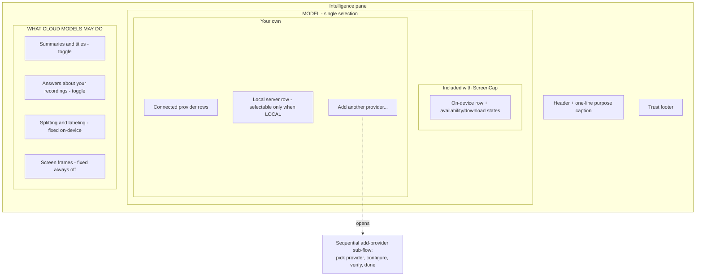
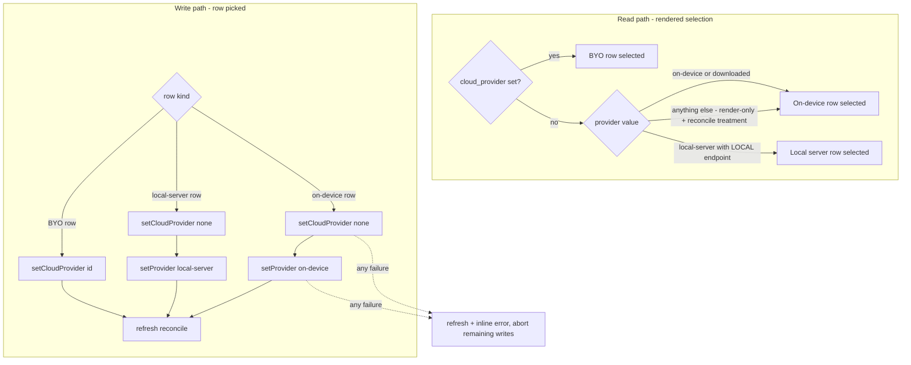

# Intelligence Pane Redesign - Plan

## Goal Capsule

- **Objective:** Reorganize the Intelligence settings pane from three sections into two — a single ownership-grouped model list whose one selected row designates the consented answerer, plus a plain-language consent section — moving provider connection mechanics into a sequential add-provider sub-flow. UI-layer only: no daemon or config-key changes.
- **Authority:** This plan. The Product Contract governs behavior; the Planning Contract and Implementation Units govern how. The claude.ai/design "App Screens" export is directional input, subordinate to both. Repo conventions (`CLAUDE.md`, existing pane idioms) govern style.
- **Execution profile:** Autonomous. Work units in dependency order; verify per the Verification Contract; ship all units as one PR (U3 removes the pane's inline endpoint field, and U4 re-homes it — no intermediate build may ship between them).
- **Stop conditions:** Surface a blocker only if implementation contradicts the Product Contract or requires backend (Python) changes beyond the two named Swift controllers.
- **Open blockers:** None.

**Product Contract preservation:** changed R2/Key Decisions (selection semantics corrected to fallback-honest — the daemon dispatches local-first and `cloud_provider` is the consented fallback answerer; the earlier "who answers when you ask" claim was unimplementable without Python changes the scope boundary forbids), R7 (verification narrowed to existing seams; local-server model discovery deferred — no app-reachable seam exists), R8 (auto-select qualified to selectable rows only), AE3 (REMOTE-endpoint behavior corrected — the daemon has no consent-gated-cloud path for `local-server`, so REMOTE rows are not selectable), R4 (insufficient-disk surfaces as a failed-with-reason state, not a pre-emptive disabled state), R13 (the sidebar hint condition is redefined rather than preserved), F3 (remedies keyed to the actual availability-probe states). Each change resolves a conflict with the confirmed no-backend-changes scope boundary or corrects copy describing behavior that does not exist. Post-review amendments: R8 narrowed again (an unavailable CLI cannot be added — the needs-attention-add path was unreachable by design), and R12's footer claim rescoped from "any model" to the consent-governed tasks (the legacy auto-namer egress path, now a named follow-up, falsifies the broader claim).

---

## Product Contract

### Summary

Rebuild the Intelligence pane around one MODEL list grouped into "Included with ScreenCap" and "Your own", where the single selected row designates the model ask-time tasks may use — local answers stay the daemon's preference; a cloud selection is the consented fallback — and day-splitting always runs locally and automatically. Connection mechanics (keys, verification, local-server URL) move into a sequential add-provider sub-flow, and the consent section is rewritten in the design's plain per-row language.

### Problem Frame

The Intelligence pane is the app's largest settings pane and stacks three mental models a user must untangle at once: which engine runs, whose account it uses, and what it is allowed to do. The first section is headed "SCREENCAP-HOSTED CLOUD" yet contains only on-device, downloaded, and local-server rows. Three inline state machines (Apple Intelligence availability, download progress/retry, endpoint classification) ride inside that one section.

The deepest confusion is semantic: the rows across the first two sections render as what looks like one exclusive radio group, but selecting a BYO row writes a different backend slot (`cloud_provider`, the consented cloud fallback) than selecting an app-managed row (`provider`, the active day-split engine). Two models can be active at once while the UI implies one choice.

The pane is also gaining traffic: Chat deep-links into it for consent, onboarding lands on its download step, and a sidebar hint points at it. The claude.ai/design project defines a simpler target shape but omits hosted cloud, the real on-device states, and the Recall consent row that Chat depends on — so it must be adapted, not copied.

### Key Decisions

- **One list, grouped by ownership.** The model list groups rows under "Included with ScreenCap" and "Your own" headers rather than the design's flat list or an active-model-card-with-sub-flow variant. Grouping satisfies the BYO plan's requirement that whose infrastructure and whose bill each option uses is legible at a glance.
- **One visible pick designates the consented answerer — honestly.** The daemon's dispatch order is local-first and unchanged: the on-device chain answers whenever it can, and the selected cloud row is the model ask-time tasks fall back to, gated by the consent toggles. Picking an on-device/local row keeps everything local. Copy never claims a cloud pick replaces the local answerer. The backend keeps its two slots; the UI hides them deliberately instead of accidentally.
- **Downloaded model is a capability, not a choice.** The daemon's `ChainedOnDeviceProvider` already prefers Apple Intelligence and cascades to the downloaded model at generation time, so "Downloaded model" stops being a selectable row and becomes a download affordance and status on the on-device row. Explicit user preference for the downloaded model over Apple Intelligence is dropped.
- **Connection mechanics leave the pane.** Adding or configuring a provider (API key with verification, CLI delegation, local-server URL with classification) happens in a sequential sub-flow extending the existing in-window overlay. The current sheet's two stacked pickers become the design's step-by-step flow.
- **Local server is "Your own".** The local-server option relocates from the app-managed section to the "Your own" group, added through the sub-flow, keeping its LOCAL/REMOTE classification behavior.
- **Hosted-cloud row stays reserved.** No hosted cloud model row is rendered and the group shows no placeholder; the "Included with ScreenCap" group is its future home.
- **Four consent rows, not the design's three.** The design predates Chat; the Recall-answers toggle it depends on stays, alongside Summaries & titles and the two fixed rows.

### Requirements

**Model list**

- R1. The pane presents one MODEL list with exactly one selected row, grouped under "Included with ScreenCap" and "Your own" headers.
- R2. The selected row designates the model ask-time tasks may use — a cloud selection is the consented fallback answerer (the daemon still prefers the local engine when it can serve the task); day-splitting and labeling always run locally regardless of selection.
- R3. The on-device row carries the download affordance and the availability/download states; the local day-split engine resolves automatically to Apple Intelligence or the downloaded model.
- R4. Every state reachable today remains reachable: Apple Intelligence unavailable with a System Settings deep link, download progress/cancel/retry, download-failed states (including insufficient-disk reasons, surfaced with Retry), the daemon-unreachable disabled state, BYO needs-attention, and key/CLI management (replace key, disconnect).
- R5. "Included with ScreenCap" ships with only the on-device row.

**Add-provider sub-flow**

- R6. Connection mechanics move off the pane into a sequential sub-flow: choose a provider, configure it, confirm. OpenAI, Anthropic, Gemini (key or CLI delegation) and Local server are the choices.
- R7. The sub-flow confirms each mechanism honestly before finishing: API keys via the existing validate probe, CLI delegation via the availability check (copy states no test call is made), and local server via LOCAL/REMOTE classification feedback. No network probe or model discovery is performed for local servers.
- R8. A newly added provider row appears with a just-added highlight and a prompt to enable the tasks it may handle in the consent section; flow completion auto-selects the new provider only when its row is selectable (a REMOTE-classified local server finishes highlighted but unselected; an unavailable CLI cannot be added — its configure surface shows fix guidance instead).
- R9. A local server added via the sub-flow keeps its LOCAL/REMOTE classification, with copy stating the consequence of each; a REMOTE-classified server is shown but not selectable, with copy stating that answers and day-splitting require a local endpoint.

**Consent section**

- R10. The consent section keeps four rows — Summaries & titles (toggle), Answers about your recordings (toggle), Splitting & labeling the day (fixed on-device), Screen frames or images (fixed always-off) — each captioned in plain language stating what is sent and what never leaves.
- R11. Consent semantics are unchanged: no new toggles, the two fixed rows remain impossible to enable, and the consent-row CLI argv contracts are untouched.
- R12. All copy passes the honest-copy constraints (no E2EE, "we can't see it", or "free unlimited" claims), and a trust footer states that masked and blocked apps are stripped before summaries, answers, and day-splitting run — scoped to the consent-governed tasks, because the legacy auto-namer egress path falsifies an unscoped "any model" claim. The current footer line "Cloud tasks only run when the active model above is a cloud provider" is removed — it is false under the new semantics.

**Entry points**

- R13. Chat's consent deep link and onboarding's model-download step continue to work unchanged; the sidebar local-model hint's condition is redefined for the new semantics so it never shows while a cloud provider is the rendered selection.

### Pane structure

### Key Flows

- F1. Switching the consented answerer to a cloud model
  - **Trigger:** User selects a BYO row in "Your own".
  - **Steps:** Row becomes the single selection; day-splitting continues locally; answers route to the cloud model only for tasks whose consent toggles are on and only when the local engine cannot serve them; while a cloud row is selected and its relevant toggles are off, the pane shows a standing nudge to enable tasks (the nudge is also the consent-section pointer — no auto-scroll in v1).
  - **Covers:** R1, R2, R8.
- F2. Adding a provider
  - **Trigger:** User activates "Add another provider…".
  - **Steps:** Sequential sub-flow — pick provider, enter key or URL, mechanism-appropriate confirmation shown inline, flow closes; if the new row is selectable it is auto-selected, shows the just-added highlight, and the standing nudge points at the consent section when its toggles are off.
  - **Covers:** R6, R7, R8.
- F3. On-device not ready
  - **Trigger:** Apple Intelligence is unavailable and no model is downloaded.
  - **Steps:** The on-device row shows a needs-attention state offering the remedies applicable to the probe state — the System Settings deep link only when Apple Intelligence is switched off, and the model download (with progress/retry) whenever no model is installed.
  - **Covers:** R3, R4.

### Acceptance Examples

- AE1. **Covers R2, R8.** Given Claude (a connected BYO provider) is the selected model and every consent toggle is off, when the user asks for a summary, nothing is sent to any cloud model and the pane's standing nudge to enable tasks explains why.
- AE2. **Covers R3, R4.** Given Apple Intelligence is off and no model is downloaded, when the user views the pane, the on-device row shows a needs-attention state with the System Settings link and the download affordance; after a completed download the row reads ready without further configuration.
- AE3. **Covers R9.** Given a local server whose URL classifies as REMOTE, when it is added, its row renders not-selectable with copy stating that answers and day-splitting require a local endpoint; when the URL classifies as LOCAL, the row is selectable.

### Success Criteria

- A first-time viewer can answer three questions from the pane without scrolling into detail: which model may answer, whose account it uses, and what cloud models may do.
- The redesign removes no capability: everything configurable today is configurable after, at most one step deeper.

### Scope Boundaries

- **Out of scope:** the design's other panes and navigation (Connections/MCP, Sharing, General, Shortcuts; sidebar structure and items other than the local-model hint condition R13 redefines); any change to consent semantics; Chat's own UI; all Python-side changes (daemon verbs, CLI, config keys, dispatcher ordering — the two-slot model and local-first dispatch stay as-is).
- **Deferred to Follow-Up Work:**
  - Rendering the ScreenCap-hosted cloud model row (its group slot is reserved).
  - Local-server model discovery ("found Ollama · 3 models"): requires a new CLI/daemon seam; only a legacy CLI-side Ollama probe exists (`src/screencap/namer.py`).
  - A scroll-to-consent anchor for Chat's deep link (the `.intelligence` route case carries no payload today; `timeline(day:seekMs:)` is the existing payload pattern to follow).
  - Feeding the Apple Intelligence availability probe into the sidebar hint condition (the sidebar has no FoundationModels plumbing).
  - Bringing the legacy auto-namer (`src/screencap/namer.py`) under the consent policy and privacy strip: it sends unstripped titles/transcript — and screenshots via its vendor-API paths — to cloud models on a default-on path, bypassing the Intelligence consent matrix entirely (surfaced by this redesign's review; needs its own ticket).
  - Documenting (or providing an atomic CLI/daemon verb for) the two-write selection ordering contract, so scripts and agents can replicate the pane's clear-cloud-first invariant.

### Dependencies / Assumptions

- The design source is the user-provided claude.ai/design "App Screens" export (screens: Settings intelligence, Settings intelligence provider added, Add provider picker / OpenAI key / local server). It is directional, not binding, where it conflicts with the decisions above.
- The BYO-cloud plan (docs/plans/2026-07-10-001-feat-byo-cloud-intelligence-accounts-plan.md) remains binding for legibility (R9 there), honest-copy audit, and runtime needs-attention states; this redesign is the shape its grouping work lands in.
- Chat consent reuse (docs/plans/2026-07-09-001-feat-conversational-recall-chat-plan.md) makes the Recall toggle load-bearing.
- Headless-resolved defaults (each follows an existing repo pattern or reviewer-verified constraint): finishing the add flow auto-selects the new provider only when its row is selectable; the consent nudge is standing (renders while a cloud row is selected and its relevant toggles are off; none renders when they are on) and doubles as the consent-section pointer; the just-added highlight is a "JUST ADDED" chip plus accent border, cleared on the next selection change or when the pane disappears; legacy `provider` values are mapped render-only with a reconcile treatment (no write-through migration); "Your own" row membership is derived (`keyPresent || cliAvailable || endpointSet || isCurrentCloudProvider`); disconnecting the selected provider returns the selection to on-device; clearing the endpoint — or re-saving one that classifies REMOTE — while `local-server` is active resets `provider` to `on-device` first; the download affordance remains available (demoted) while Apple Intelligence is ready; re-tap deselection is removed (radio semantics); the reserved hosted slot renders nothing until the feature ships.

---

## Planning Contract

### Key Technical Decisions

- KTD1. **Single-selection mapping lives in a pure Swift model.** Rendered selection = the `cloud_provider` row when set, else the row for `provider` (`on-device`/`downloaded` → on-device row; `local-server` with a LOCAL endpoint → local-server row; anything else, including legacy `gemini` or `local-server` without endpoint, → on-device row, render-only). A legacy-mapped value renders the on-device row with a reconcile treatment (needs-attention style prompting a re-pick) rather than a plain selected/Ready state, since the daemon routes such values to the idle-gap heuristic. Writes route by row kind: a local row issues `setCloudProvider("none")` **first**, then `setProvider(value)`; a BYO row issues `setCloudProvider(id)` only. The tap no-op guard compares the values a tap would write against the **persisted** `provider`/`cloud_provider`, not the rendered selection — so tapping the rendered-selected on-device row while disk holds a legacy value performs the write-through and heals the divergence. Any write failure → `refresh()` reconcile + the existing inline "Couldn't save" pattern, never a stranded optimistic state. The daemon hard-rejects BYO ids on `provider` (KTD2 in the BYO plan) — `ConnectProviderModel.isBYOProvider` is the router.
- KTD2. **Selecting the on-device row always writes `provider=on-device`.** The daemon's `ChainedOnDeviceProvider` (src/screencap/segmentation/routing.py) already prefers Apple Foundation Models and cascades to an installed downloaded model at generation time, auto-recovering when Apple Intelligence returns — no probe-gated engine value is needed, and writing `downloaded` would pin a stale probe snapshot. `OnDeviceModelStatus.probe()` is a rendering-only input to KTD3's state matrix and the honest-degradation surfaces.
- KTD3. **The merged on-device row renders from a pure state matrix** over (Apple probe × downloaded-installed × download state × daemon reachability) — see the table below. Needs-attention only when no local engine can run. Availability comes from real probes (`OnDeviceModelStatus.probe()`, re-probed on app focus), never from selection state. The daemon-reachability input is a typed flag on `ModelDownloadController` set when `refreshStatus`'s invocation throws: any status-read failure renders the matrix's disabled-download row (with the error text as the reason), distinct from the whole-pane error state that `IntelligenceController.refresh()` failure already produces.
- KTD4. **The sequential flow mirrors the `OnboardingStepPolicy` idiom:** a pure step-policy enum (unit-testable transition rules) + `@State` step in the sheet, keeping the `NewRecordingSheet` in-window overlay chrome. Manage/Replace/Disconnect enter the same flow at its configure step. There is no UI test tooling in this repo — every new rule (row membership, selection mapping, step transitions, state matrix, nudge and highlight predicates) must live in pure models to be testable at all.
- KTD5. **Verification per mechanism uses existing seams only:** API key → CLI `--set-key <vendor> --validate` (vendor-endpoint probe, verdicts valid/invalid/unknown, secret over stdin never argv); CLI delegation → the availability stat-check with copy stating no test call is made; local server → syntactic LOCAL/REMOTE classification only (`classify_endpoint` never touches the network).
- KTD6. **UI state transitions fire on the user-action edge, never the async-completion edge** (docs/solutions/ui-bugs/recording-hud-frozen-on-stop-decouple-teardown-from-finalization-2026-07-08.md): optimistic flip + revert-on-failure, and the intentional double pending guard (view-level `providerWriteInFlight`/`pendingConsentRows` **plus** controller guards) stays — dropping the view layer reintroduces a documented spurious-error race. `setCloudProvider` gains the same optimistic-flip + in-flight guard `setProvider` already has (it currently has neither, which breaks the two-write sequence's failure story).
- KTD7. **All test-audited copy lives in pure enums.** New consent-row captions, group headers, trust footer, nudge and flow copy land in `ConnectProviderModel`-style statics (or a sibling copy enum) so `testHonestCopyAuditNoForbiddenStrings` can reach them; the audit corpus is expanded to enumerate every new string. Selection copy must be fallback-honest — a cloud row's sub-line says it answers when the local engine can't and only for allowed tasks; it never claims to replace the local answerer. Existing tests pinning the 3-section structure (`testHostedAndUserOwnedSectionsAreDistinct`, hosted-caption assertions) are rewritten, not deleted silently.
- KTD8. **`ModelDownloadController.refreshStatus` starts the poll loop when it observes `.downloading`.** Today only `startDownload` polls, so a download started in onboarding renders as frozen progress in the pane — latent today, marquee-visible once the on-device row is the primary download surface.

### On-device row state matrix

| Apple probe | Model installed | Download state | Row renders |
|---|---|---|---|
| ready | any | idle | Ready (Apple Intelligence); demoted download affordance when not installed |
| ready | no | downloading | Ready (Apple Intelligence); demoted progress + Cancel |
| ready | no | failed | Ready (Apple Intelligence); demoted failure reason + Retry |
| ready | no | cancelled | Same as ready × idle |
| modelDownloading | no | idle | Info: "Model downloading…" (existing badge tone); no needs-attention; demoted download affordance |
| not ready (off/ineligible/unsupported) | yes | — | Ready (downloaded model); no warning |
| off | no | idle/cancelled | Needs attention: System Settings link + Download button |
| ineligible/unsupported | no | idle/cancelled | Needs attention: Download button only |
| any not-ready | no | downloading | Progress bar + Cancel (poll running) |
| any not-ready | no | failed | "Download failed: reason" + Retry (insufficient disk surfaces here as the reason) |
| unknown | no | idle | Neutral checking state, no warning |
| any | any | daemon unreachable (status-read failure) | Download affordance disabled with "start the daemon" reason |

### Selection mapping

### Sequencing

U1 and U2 run in parallel (no dependencies). U3 and U4 both depend on U1 and U2 and run in parallel with each other. U5 follows U3. U6 depends only on U1 and can run alongside U3–U5. All units land as **one PR**: U3 removes the pane's inline endpoint field and U4 re-homes it in the flow, so no intermediate state may ship. New Swift files require `cd macos && xcodegen generate` before `xcodebuild` sees them (the `.xcodeproj` is generated and git-ignored).

---

## Implementation Units

### U1. Pure selection, grouping, and state models

- **Goal:** All new behavior rules exist as unit-testable pure Swift models before any UI changes.
- **Requirements:** R1, R2, R3, R5, R9; AE3.
- **Dependencies:** None.
- **Files:** new `macos/ScreenCap/Views/Settings/IntelligenceSelectionModel.swift`; `macos/ScreenCap/Views/Settings/ConnectProviderModel.swift`; `macos/ScreenCapTests/IntelligenceSettingsTests.swift`.
- **Approach:** Replace `IntelligenceProviderOption.options`' flat list with a grouped model: group membership ("Included with ScreenCap" = on-device only, no placeholder for the reserved hosted slot; "Your own" = rows passing `keyPresent || cliAvailable || endpointSet || isCurrentCloudProvider`), the rendered-selection rule with legacy reconcile treatment (KTD1), the write-routing rule with persisted-value tap guard (KTD1), the on-device row state matrix (KTD3), REMOTE-row non-selectability (R9), and the nudge + just-added highlight predicates (KTD4/KTD7).
- **Patterns to follow:** `IntelligenceProviderOption` / `ConnectProviderModel.userOwnedOptions` pure-model style and their existing tests; `ShellSidebarModel` as the pure-logic-plus-tests exemplar.
- **Test scenarios:**
  - Rendered selection: `cloud_provider=openai` + `provider=on-device` → BYO row selected (not on-device); `cloud_provider` unset + `provider=downloaded` → on-device row; `provider=local-server` + LOCAL endpoint → local-server row; `provider=local-server` + no/REMOTE endpoint → on-device row with reconcile treatment; legacy `provider=gemini` → on-device row with reconcile treatment (not plain Ready).
  - Membership: no keys, no CLI, no endpoint → "Your own" shows only Add; signed-in CLI with nothing added → its row materializes; endpoint set → local-server row present; REMOTE-classified row present but `selectable == false`.
  - Write routing: on-device pick → [clear cloud, set provider on-device] in that order, always `on-device` regardless of probe state; local-server pick → [clear cloud, set provider local-server]; BYO pick → [set cloud] only.
  - Tap guard: `provider=gemini` persisted, on-device row rendered selected, tap it → writes proceed (heal); `provider=on-device` persisted, tap the selected on-device row → no-op.
  - State matrix: each row of the table above, including Apple-off + installed → ready-with-downloaded (no warning), `modelDownloading` → info state (no needs-attention), ready × downloading/failed → demoted accessories, `unknown` probe → neutral state, status-read failure → disabled-download row.
  - Nudge predicate: cloud row selected × each toggle combination → nudge exactly when the relevant toggles are off (AE1); highlight predicate: set on flow completion, cleared on next selection change or pane disappear.
- **Verification:** New model tests pass; existing `IntelligenceProviderOption`/`ConnectProviderModel` tests updated to the grouped shape.

### U2. Controller write-path hardening

- **Goal:** The two-write local-row selection, daemon-reachability signal, and download polling are safe before the UI depends on them.
- **Requirements:** R1, R3; AE2.
- **Dependencies:** None (parallel with U1).
- **Files:** `macos/ScreenCap/Controllers/IntelligenceController.swift`; `macos/ScreenCap/Controllers/ModelDownloadController.swift`; `macos/ScreenCapTests/IntelligenceSettingsTests.swift`.
- **Approach:** Add a `selectRow` seam on `IntelligenceController` encapsulating KTD1's ordering and abort-on-failure policy; give `setCloudProvider` the optimistic-flip + in-flight guard + revert that `setProvider` has; `refreshStatus` calls `startPollingIfNeeded` when it decodes `.downloading` (KTD8) and sets a typed `daemonUnreachable` flag when its invocation throws (KTD3's matrix input). Expose an internal `isPolling` seam for tests. No argv contract changes.
- **Execution note:** Argv-contract tests first via the existing `FakeInvoker` seam — the invoker records exact vectors, so ordering and abort behavior are directly assertable.
- **Test scenarios:**
  - Local-row select issues `cloud_provider set none` before `provider set <value>`; clear-failure aborts the provider write and triggers refresh; provider-write failure triggers refresh + error, no stranded optimistic state.
  - `setCloudProvider` racing returns false without a spurious error; optimistic flip reverts on failure.
  - `refreshStatus` observing `.downloading` starts polling (assert via the `isPolling` seam); pane opened mid-onboarding-download shows advancing progress.
  - `refreshStatus` invocation throwing sets `daemonUnreachable`; a subsequent successful read clears it.
- **Verification:** Controller tests pass; `testSetCloudProviderIssuesCloudProviderArgv` still pins KTD2-routing.

### U3. Pane restructure

- **Goal:** The pane renders the two-section shape: grouped MODEL card + consent section, on-device row with merged accessories.
- **Requirements:** R1, R2, R3, R4, R5, R9; F1, F3; AE2, AE3.
- **Dependencies:** U1, U2.
- **Files:** `macos/ScreenCap/Views/Settings/IntelligenceSettingsView.swift`.
- **Approach:** One bordered card with in-card group-header rows (new small `Text` row styled like `sectionHeader`, between `rowDivider`s — consistent with the accessory-under-row idiom, `.padding(.horizontal, 44)` indent for accessories). On-device row absorbs `onDeviceStatusAccessory` + `downloadAccessory` per the state matrix; the Downloaded row and the inline endpoint field are removed from the pane (endpoint moves to the flow, U4). Local-server and BYO rows render under "Your own" with the derived membership; REMOTE local-server row disabled with honest copy. Standing consent nudge renders per U1's predicate. Re-tap deselection removed. Keep the view-level pending guards. New group-header rows carry `.accessibilityAddTraits(.isHeader)`; disabled rows expose the disabled accessibility trait, following the pane's existing accessibility idiom.
- **Patterns to follow:** existing private helpers (`sectionHeader`, `rowDivider`, `radio`, `chip`, `fixedRow`); `SettingsToggle` from `PrivacySettingsView.swift`; SCTheme tokens throughout.
- **Test scenarios:** (UI is verified by build-and-run per repo convention; rules were tested in U1) — pure-model additions only: group-header ordering stability (rows must not jump groups mid-interaction, the AppRulesView QA lesson).
- **Verification:** App builds and runs; pane shows two sections; manual smoke of F1/F3 paths.

### U4. Sequential add-provider flow

- **Goal:** Provider connection, management, and the local-server endpoint live in a step-by-step overlay flow.
- **Requirements:** R4, R6, R7, R8, R9; F2.
- **Dependencies:** U1, U2.
- **Files:** new `macos/ScreenCap/Views/Settings/ConnectProviderStepPolicy.swift`; `macos/ScreenCap/Views/Settings/ConnectProviderSheet.swift`; `macos/ScreenCap/Views/Settings/ConnectProviderModel.swift`; `macos/ScreenCap/Views/Settings/IntelligenceSettingsView.swift`; `macos/ScreenCapTests/IntelligenceSettingsTests.swift`.
- **Approach:** Pure `ConnectProviderStepPolicy` enum (steps: pick provider → configure → done; entry points: add-new starts at pick, Manage/Set-up enters at configure with vendor preset) driving a `switch step` body in the existing overlay chrome, maintaining keyboard focus order across steps. Configure step per mechanism: key paste + validate (existing stdin seam, inline verdict), CLI delegation (availability check + honest copy), local server (URL field + Save + classification caption; `endpointDraft` re-seeded on step entry, not `.onAppear`). Finishing auto-selects via U2's `selectRow` **only when the row is selectable** (R8); the pane receives the just-added row id and renders the highlight per U1's predicate. Disconnect (in configure step) deselects first — selection visibly returns to on-device; clearing the endpoint, or saving one that classifies REMOTE, while `local-server` is active resets `provider` to `on-device` before the endpoint write. No eager credential probes on pane or flow open (keys are daemon-owned; nothing decrypts locally).
- **Test scenarios:**
  - Step policy: add-new entry → pick; Manage(openai) entry → configure with vendor preset; back from configure → pick; done only after a terminal configure action; no step skips.
  - Covers AE3: local-server configure with `http://localhost:11434/v1` → LOCAL caption + selectable row on return; with a DNS-name URL → REMOTE caption + non-selectable row.
  - REMOTE-add finish path: flow completes without selection; row renders highlighted, unselected, with honest copy.
  - Key validate verdicts valid/invalid/unknown render distinct feedback; secret travels via stdin argv-free (existing pinned test extended to the new flow path).
  - Disconnect of the currently-selected provider issues deselect-then-clear in that order; endpoint clear while active issues `provider set on-device` then endpoint clear; endpoint re-save that classifies REMOTE while `provider=local-server` issues `provider set on-device` first.
  - Covers F2/R8: flow completion returns the added row id; nudge fires when the new row is selected and its toggles are off; no nudge when toggles are already on.
- **Verification:** Flow tests pass; manual smoke: add each of the four provider types end-to-end.

### U5. Consent section copy and audit corpus

- **Goal:** Consent rows and all new copy are plain-language, honest, and fully covered by the audit tests.
- **Requirements:** R10, R11, R12.
- **Dependencies:** U3.
- **Files:** `macos/ScreenCap/Views/Settings/IntelligenceSettingsView.swift`; `macos/ScreenCap/Views/Settings/ConnectProviderModel.swift`; `macos/ScreenCapTests/IntelligenceSettingsTests.swift`.
- **Approach:** Hoist the four consent-row titles/captions, group headers, trust footer, nudge copy, and flow copy into pure copy enums. All selection and nudge copy follows KTD7's fallback-honest rule. Remove the false footer line (R12). Rewrite the 3-section-pinning tests to the new shape (`testHostedAndUserOwnedSectionsAreDistinct` becomes a group-legibility assertion; hosted-caption strings retired consciously with the reserved-slot decision). Expand `testHonestCopyAuditNoForbiddenStrings` to enumerate every new copy enum; `SECURITY.md` is the source of truth for trust-boundary phrasing (the footer's stripped-before-any-model claim is verified accurate: segmentation independently re-derives its skip-set from `recording.db` with a fail-closed gate at the helper boundary). Avoid prototype sample strings (`MockStringSweepTests` scans all Swift sources).
- **Test scenarios:** audit corpus contains all new copy statics (assert corpus size or enumerate); forbidden strings absent; day-split/frames rows remain non-interactive with unchanged argv rejection (existing tests keep passing untouched — R11).
- **Verification:** Full `ScreenCapTests` suite green including the sweep tests.

### U6. Entry-point consistency

- **Goal:** The sidebar hint, onboarding step, and Chat deep link behave correctly under the new semantics.
- **Requirements:** R13.
- **Dependencies:** U1.
- **Files:** `macos/ScreenCap/Views/Shell/ShellSidebar.swift`; `macos/ScreenCapTests/ShellSidebarModelTests.swift`.
- **Approach:** `shouldShowLocalModelHint` gains a `cloudProvider == nil` conjunct (never nag while a cloud row is the rendered answerer); its doc comment is corrected. Onboarding's `OnboardingDownloadModelStep` and Chat's `onOpenIntelligenceSettings` are verified unchanged — both consume seams this plan preserves (`ModelDownloadController` API, `.intelligence` route).
- **Test scenarios:** hint hidden when `cloud_provider` set even with `provider == "on-device"` and nothing installed; hint still shows for on-device + not installed + not dismissed + no cloud provider; dismissed persistence unchanged.
- **Verification:** `ShellSidebarModelTests` green; manual: Chat's no-backend affordance still lands on the pane.

---

## Verification Contract

| Gate | Command | Applies to |
|---|---|---|
| Regenerate project after new files | `cd macos && xcodegen generate` | U1, U4 (new Swift files) |
| App test suite | `cd macos && xcodebuild test -project ScreenCap.xcodeproj -scheme ScreenCap -only-testing:ScreenCapTests` | All units |
| Honest-copy + mock-string sweeps | included in the suite (`IntelligenceSettingsTests`, `MockStringSweepTests`) | U4, U5 |
| Python suite untouched | no `src/` changes expected; `PYTHONPATH=src pytest -m privacy` only if any Python file is touched (it must not be) | guard |
| Manual smoke | build and run the app; walk F1 (select BYO), F2 (add each provider type), F3 (needs-attention states) | U3, U4 |

Known repo gotchas: re-run `xcodegen generate` if "cannot find X in scope" appears for files that exist; a daemon-reconnect test is known-flaky (retry once before diagnosing); kill orphaned test hosts before re-running a stopped `xcodebuild`.

## Definition of Done

- All six units landed as one PR; `ScreenCapTests` green via the Verification Contract command.
- Every R1–R13 requirement is implemented or its unit's tests demonstrate it; AE1–AE3 each covered by a named test scenario.
- Consent argv contracts and Python sources untouched.
- Legacy `provider` read-back values (`downloaded`, `local-server` without endpoint, `gemini`) render without error, show the reconcile treatment where KTD1 requires it, and heal on re-pick.
- All new user-facing copy lives in audited pure enums, follows the fallback-honest rule, and the false footer line is gone.
- No abandoned-attempt or dead-end code remains in the diff; `xcodegen`-generated project changes are not committed (`.xcodeproj` is git-ignored).
