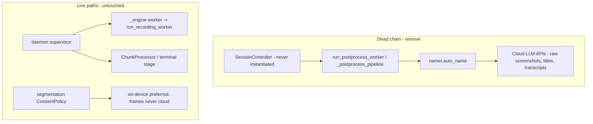

# Remove Legacy Auto-Naming - Plan

## Goal Capsule

- **Objective:** Remove the dead legacy LLM auto-naming chain — the namer, the orphaned session-controller/post-process block that was its only trigger, and the CLI/config surface that advertises it — and add a tripwire guard test that fails on any cloud-LLM SDK import or API hostname appearing outside the sanctioned allowlist.
- **Product authority:** This document's Product Contract. `SECURITY.md` remains the source of truth for trust-boundary questions.
- **Stop conditions:** If any unit's pre-deletion call-graph check (R4) finds a live consumer of code slated for removal, stop that deletion and surface it rather than deleting or guessing.
- **Open blockers:** None.

---

## Product Contract

### Summary

Delete the entire legacy auto-naming chain and its user-facing flags/config, leaving segmentation as the only naming path, and pin the consent boundary with a privacy-marked guard test. No live behavior changes: recordings already keep `rec-<timestamp>` names on every reachable path.

### Problem Frame

The legacy auto-namer (`src/screencap/namer.py`) assembles screenshots, window titles, action events, and transcripts from the raw unscrubbed `recording.db` and capture dir, then sends them — screenshots included — to cloud LLM providers by default (Claude/ChatGPT CLI, Anthropic/OpenAI API; local Ollama only as last fallback). It checks no consent gate of any kind: no `content_index_enabled`, no blocked-interval or masked-frame filtering, no `ConsentPolicy`. This contradicts the product's privacy positioning and SECURITY.md's rule that `recording.db` holds unscrubbed PII and its contents never leave the machine unscrubbed.

The exposure is latent, not active. The namer's only trigger is the session-mode post-process pipeline, reachable solely through `SessionController` — which is instantiated nowhere in the repo since the Phase 2 U1 daemon cutover (the code says so itself at `src/screencap/session.py:545-549`). The daemon path names recordings `rec-<timestamp>` in the supervisor and never renames them. Meanwhile the live naming path, `src/screencap/segmentation/`, already enforces consent correctly: frames never go to any cloud provider, summaries prefer on-device, and masked spans are excluded via the shared blocked-frame machinery.

Dead code that violates the trust boundary is worse than ordinary dead code: any future rewiring resurrects an ungated raw-content-to-cloud path with defaults set to ON. The stranded `--no-auto-name`/`--local-only` flags and `auto_name` config keys also advertise a feature that never runs.

### Key Decisions

- **Remove rather than retrofit consent.** Wiring `ConsentPolicy` into unreachable code buys nothing. Any future recording-naming feature is built on the consented segmentation path instead.
- **Full dead-chain removal, not just the namer.** The whole orphaned session-mode block goes: `SessionController`, `PostProcessJob`, `run_postprocess_worker`, and `_postprocess_pipeline` in `src/screencap/session.py`, plus `namer.py` itself. `menubar.py` is left fully untouched — `_run_menubar` is live via `src/screencap/engine/menubar_policy.py` (`SpawnNewMenubar`, the default policy of the public `recorder.start_recording()`), and `RENAME_FILENAME` is consumed inside `_run_menubar` itself (`menubar.py:295` derives the rename path, `:386` writes it); the dead block was only the rename file's *reader*. The live `run_recording_worker` (same module as the dead block) uses `engine.menubar_policy.Noop`, not `menubar.py`, so it is untangled from the dead block.
- **Hard removal of the CLI/config surface, no deprecation shim.** `screencap start --no-auto-name`/`--local-only` will error as unknown options for any script that still passes them. Accepted explicitly during scoping.
- **A consent guard test is in scope.** Removal alone doesn't stop the same bypass reappearing; a call-graph-style guard test does, matching the repo's existing guard-test pattern.

### Requirements

**Removal**

- R1. `src/screencap/namer.py` and the auto-name branch of the legacy post-process pipeline are deleted.
- R2. The orphaned session-mode block that was auto-naming's only trigger is deleted: `SessionController`, `PostProcessJob`, `run_postprocess_worker`, and `_postprocess_pipeline` in `src/screencap/session.py`. `menubar.py` is untouched — every symbol in it has a live consumer.
- R3. The stranded user-facing surface is deleted: the `--no-auto-name` and `--local-only` options on `screencap start` (including the `--no-auto-name` interactive name-prompt branch), the `auto_name`/`auto_name_local_only` config keys with their `SCREENCAP_AUTO_NAME`/`SCREENCAP_AUTO_NAME_LOCAL_ONLY` env vars, and their `screencap settings` display and JSON output lines.
- R4. Every unit is re-confirmed unreachable by call-graph check immediately before deletion; anything found live stays in place and is surfaced for a scope decision instead of being deleted.

**Consent guard**

- R5. A guard test pins that no module outside the sanctioned egress allowlist (segmentation's consent-gated providers plus the existing cloud-transcription call sites) imports a cloud-LLM SDK or embeds a cloud-LLM API hostname. It carries `@pytest.mark.privacy` and stays Vision-free so it runs on CI. It is a tripwire against those two shapes, not an egress sandbox (see KTD2 for the stated limits).

**Behavior preservation**

- R6. Live recording behavior is unchanged: daemon-spawned capture (`_engine-worker` → `run_recording_worker`) still records, and recordings keep their `rec-<timestamp>` names exactly as today.
- R7. Segmentation's naming path (`ConsentPolicy`, blocked-span filtering, on-device preference) is untouched.

### Scope Boundaries

- No replacement naming feature. If friendly recording names are wanted later, that is a new brainstorm built on the segmentation consent model.
- No changes to segmentation's consent rules or cloud-summary fallback — verified correct during scoping.
- No migration of existing recording directory names or `task_description` values already on disk. The `task_description` column, its readers (`src/screencap/catalog.py`, `src/screencap/scrubber.py`, `macos/ScreenCap/Models/RecordingSummary.swift`), and its `--description` writer are live and stay.
- No broader dead-code sweep beyond the bounded chain above; `menubar.py` and `engine/menubar_policy.py` are fully untouched. After removal, the menubar rename UI's `.menubar_rename` file has no reader (the dead block was its only one) — behaviorally identical to today; removing or repurposing that UI is deferred to a follow-up ticket.
- Cloud transcription's own consent posture (OpenAI Whisper egress in `src/screencap/transcription.py` and `src/screencap/chunk_processor.py`) is pre-existing and out of scope; the guard test pins it as sanctioned rather than judging it.

### Sources / Research

- `src/screencap/namer.py` — provider chain (cloud-first order at lines ~650-654), raw `recording.db` reads, zero consent-gate references.
- `src/screencap/session.py:422` — sole production import of the namer; `session.py:545-549` — comment stating `SessionController` is no longer reached after Phase 2 U1.
- `src/screencap/daemon/supervisor.py:1077` — daemon assigns `rec-<timestamp>` names; no later rename anywhere in `daemon/`.
- `src/screencap/segmentation/consent.py:138` — fixed frames-never-cloud rule; `segmentation/aggregate.py` reuses the shared blocked-span machinery.
- `src/screencap/engine/menubar_policy.py:78,102,209` — live imports of `menubar.py` symbols; `src/screencap/recorder.py:646` — `SpawnNewMenubar` is the default menubar policy.
- `tests/test_privacy_filter_call_graph.py`, `tests/test_package_boundary_call_graph.py` — the AST-walk guard-test idiom to mirror.
- `docs/solutions/workflow-issues/privacy-guards-deselected-on-ci-silently-rot-2026-06-10.md` — privacy guards must run in a CI lane; `.github/workflows/ci.yml` runs `pytest -m privacy` in a macOS Vision lane and an Ubuntu Vision-free lane.
- `docs/research/2026-06-09-recording-processing-architecture.md` — documents the legacy post-process pipeline as separate from the daemon path.
- `SECURITY.md` — `recording.db` local-only rule and the unscrubbed-PII framing the dead chain contradicts.

---

## Planning Contract

**Product Contract preservation:** changed — the "Full dead-chain removal" Key Decision no longer lists `_run_menubar` as removal surface (research showed it is live via `engine/menubar_policy.py`); R3's command name corrected from `screencap config` to `screencap settings`; R5 now names the sanctioned-egress allowlist instead of "segmentation only" (live cloud transcription exists outside segmentation); the two Outstanding Questions (menubar boundary, test-mock handling) are resolved into KTD1 and U1 below. Requirement intents and R-IDs are unchanged.

### Key Technical Decisions

- **KTD1 — `menubar.py` is preserved in full; the removal set inside it is empty.** `engine/menubar_policy.py` imports `_run_menubar`, `STATE_DONE`, and `STATE_PROCESSING` for `SpawnNewMenubar`, the default policy of the public `recorder.start_recording()` — architecturally live even though the current daemon path passes `MenubarNoop()`. `RENAME_FILENAME` (`menubar.py:71`) is consumed by `_run_menubar` itself — `menubar.py:295` derives the rename path from it and `:386` writes the rename file — so it stays; the dead `_postprocess_pipeline` was only the rename file's reader. Post-removal, the rename UI writes a file nothing reads; its fate is a follow-up ticket, not this plan.
- **KTD2 — the guard test is an AST-walk allowlist over two detection axes, mirroring the existing guard idiom.** Axis 1: imports of the `openai`, `anthropic`, and `google.genai`/`google.generativeai` SDKs (`ast.Import`/`ast.ImportFrom` walk per `tests/test_package_boundary_call_graph.py`, including function-body imports). Axis 2: string literals containing `api.anthropic.com`, `api.openai.com`, or `generativelanguage.googleapis.com` (a new literal-scanning helper; neither existing guard inspects literals). Every `.py` under `src/screencap/` outside the allowlist must be clean on both axes. Allowlist (pinned, with a "file must exist" assertion so stale entries fail loudly): `segmentation/providers/openai.py`, `segmentation/providers/anthropic.py`, `segmentation/providers/gemini.py`, `segmentation/secrets.py` (key validation URLs), `transcription.py`, `chunk_processor.py`, `engine/cli.py` (existing cloud-Whisper transcription), `network/blocklist.py` (hostname appears as a blocklist entry, not egress). **Stated limit:** the guard is a tripwire against these two shapes, not an egress sandbox — subprocess delegation to vendor CLI binaries (the removed namer's top two providers; sanctioned home `segmentation/providers/cli_delegate.py`) and string-composed URLs are outside its detection surface and rely on code review.
- **KTD3 — `TestExitCodeContract` is ported or deleted based on live coverage, not blindly removed.** The class (`tests/test_stderr_event_contract.py:402-473`) exercises the exit-code mapping (`permission_lost`→3, `disk_full`→4) inside dead `SessionController.run()`. The same contract is live on the daemon-client path (`src/screencap/cli/__init__.py:368-376` documents it; `_run_start_via_daemon` implements it). If the live mapping already has test coverage, delete the class; if not, port its assertions to target the live mapping first.
- **KTD4 — `settings --json` drops the `auto_name` key and bumps `schema_version` in the same commit.** The macOS app does not read the key (verified — no Swift references), but the payload is documented in-code as an agent-facing stable shape (`cli/__init__.py:3024-3026`), so removing a field carries a version signal external consumers can key off; the commit message names the removal and the bump. The additive-contract test (`tests/test_settings_json.py:~131`) drops the key from its expected tuple; its `schema_version >= 2` assertion already accommodates the bump.
- **KTD5 — deletion order runs trigger-first.** Excise the `session.py` dead block (which contains the sole `namer` import) before deleting `namer.py`, so at no commit does a live module import a missing one.

### Assumptions

- `run_recording_worker` is called in-process by the hidden `_engine-worker` CLI command inside a daemon-spawned subprocess (`daemon/supervisor.py:191-192` builds the argv; `cli/__init__.py:297,323` imports and calls it directly). Nothing in its body (`session.py:136-293`) uses `multiprocessing`, so dropping `session.py`'s now-unused `multiprocessing` import is safe.

---

## Implementation Units

### U1. Excise the dead session-mode block from session.py

- Goal: Remove everything in `src/screencap/session.py` reachable only from `SessionController`, leaving a lean module around the live `run_recording_worker`.
- Requirements: R2, R4, R6
- Dependencies: none
- Files: `src/screencap/session.py`, `tests/test_stderr_event_contract.py`
- Approach: Delete (line ranges per planning research): `SessionState` (63-83), `_RWQueues` (85-91), `_RecordingWorker` (94-103), `PostProcessJob` (106-114), `_read_recording_ready` (117-128), `_POSTPROCESS_TIMEOUT_S` (294), `run_postprocess_worker` (297-348, including the `.postprocess_done` sidecar write — verified reader-free), `_postprocess_pipeline` (351-456), `SessionController` (464-1593). Rewrite the module docstring (lines 1-19) to describe the surviving worker; keep the `_startup` import-order block (21-30). Drop imports that become unused (`atexit`, `_queue_mod`, `threading`, `OrderedDict`, `dataclass`, `datetime`, `Enum`, `Any`, `logging`, `Console`, `multiprocessing`, `_close_queues_safely`); keep `os`, `signal`, `sys`, `Path`, `json`, `time`. Leave `menubar.py` untouched — `RENAME_FILENAME` is consumed by the live `_run_menubar` (`menubar.py:295,386`); the dead block was only the rename file's reader. Apply KTD3 to `TestExitCodeContract`.
- Execution note: Run the R4 call-graph check per symbol before deleting it (`rg` for constructions/imports outside the dead block); anything live stays and gets surfaced.
- Patterns to follow: `engine/menubar_policy.py` docstring mentions of `SessionController` are descriptive only — leave them or reword; no import edges to break.
- Test scenarios:
  - Covers R6. After removal, `python -c "import screencap.session"` succeeds and `run_recording_worker` is importable (the `_engine-worker` seam).
  - KTD3: if the live daemon-client exit-code mapping is uncovered, a ported test asserts `permission_lost` → exit 3 and `disk_full` → exit 4 through `_run_start_via_daemon`'s event handling; otherwise `TestExitCodeContract` is deleted with a one-line commit-message rationale.
- Verification: Full suite green (`PYTHONPATH=src pytest tests/`); `rg -n "SessionController|PostProcessJob|run_postprocess_worker|_postprocess_pipeline|postprocess_done" src/ tests/` returns only historical docs/comments deliberately left (reword or accept case by case) and `menubar.py`'s live rename-file code.

### U2. Delete namer.py and its test surface

- Goal: Remove the namer module and every test that exercises it.
- Requirements: R1, R4
- Dependencies: U1
- Files: `src/screencap/namer.py` (delete), `tests/test_namer.py` (delete), `tests/test_file_screenshots.py`, `tests/test_cli.py`, `src/screencap/catalog.py`, `macos/ScreenCap/Models/RecordingSummary.swift`
- Approach: Delete `namer.py` whole (sole import site went with U1). Delete `tests/test_namer.py` (all nine classes test namer internals). In `tests/test_file_screenshots.py`, remove only the namer-specific tests (lines ~302-414, `_sample_screenshots_from_db`); the `samples.py` coverage in the same file is live. In `tests/test_cli.py`, delete the already-skipped legacy-start scaffolding block (lines ~1862-2032) that `mock.patch`es `screencap.namer.auto_name`. Reword the stale doc-comment at `RecordingSummary.swift:34` ("The namer's task_description") to describe the field without namer attribution — the field itself is live via `--description`. Same treatment for the Python twin: `catalog.py`'s `_humanize_name` docstring (~lines 286-293) attributes behavior to `namer.validate_slug` and "a recording the namer never renamed" — reword without namer attribution; the function itself is live for legacy on-disk names and stays.
- Test scenarios: Test expectation: none — pure deletion of a module and its dedicated tests; behavior preservation is proven by the surviving suite (R6 scenarios live in U1/U3).
- Verification: `rg -n "namer|auto_name" src/ tests/ macos/` returns no production references (historical `docs/` mentions acceptable); full suite green.

### U3. Remove the stranded CLI flags and config keys

- Goal: Delete the user-facing surface that advertises auto-naming.
- Requirements: R3, R6
- Dependencies: none
- Files: `src/screencap/cli/__init__.py`, `src/screencap/config.py`, `tests/test_settings_json.py`, `tests/test_cli.py`
- Approach: In `cli/__init__.py`: remove the `--no-auto-name` (line ~402) and `--local-only` (~403) option decorators, both params from `start()`'s signature (~436), and the `if no_auto_name:` interactive name-prompt branch (~471-481) — the no-name path always falls through to the `rec-<timestamp>` temp name; also update the `--name` help text ("skips auto-naming"). Neither flag reaches `_run_start_via_daemon` (verified), so no daemon-API plumbing changes. Remove `"auto_name"`/`"auto_name_local_only"` from `_BOOL_KEYS` (~2975), the `settings_payload["auto_name"]` JSON line (~3032), the prose display line (~3067), and the settings help text (~2940); bump the `settings --json` `schema_version` in the same commit (KTD4) and name both in the commit message. In `config.py`, remove `get_auto_name` (config.py:187-189) and `get_auto_name_local_only` (config.py:197-201) — two non-contiguous ranges; the live, unrelated `get_auto_update` (config.py:192-195) sits between them and must not be touched. Apply KTD4 to `tests/test_settings_json.py`.
- Execution note: `--local-only` here is the naming flag on `start` only; `video_local_only`/`audio_local_only` in `src/screencap/review.py` are an unrelated concept — do not touch.
- Test scenarios:
  - Covers R3. `screencap start --no-auto-name` and `screencap start --local-only` exit with Click's no-such-option usage error.
  - Covers R6. `screencap start` with no `--name` (non-interactive) still produces a `rec-<timestamp>` recording name.
  - `screencap settings --json` payload contains no `auto_name`/`auto_name_local_only` keys and carries the bumped `schema_version`; `screencap settings --set auto_name=true` is rejected as an unknown key.
- Verification: `rg -n "auto_name|SCREENCAP_AUTO_NAME" src/ tests/` returns nothing; CLI test suite green.

### U4. Add the cloud-LLM egress guard test

- Goal: Pin the consent boundary so no module outside the sanctioned allowlist can send recording content to cloud LLM providers.
- Requirements: R5
- Dependencies: U1, U2
- Files: `tests/test_cloud_llm_egress_guard.py` (new)
- Approach: Implement KTD2. Mirror `tests/test_package_boundary_call_graph.py`'s file iteration (`rglob` over `src/screencap/`) and import-walk helpers for axis 1; add a literal-scanning walker over `ast.Constant` string nodes for axis 2. Assert every allowlist path exists so a moved/renamed sanctioned file fails the guard instead of silently widening it. Mark the module `@pytest.mark.privacy`; pure-AST, no Vision or pyobjc imports, so it runs in both CI lanes.
- Patterns to follow: `tests/test_privacy_filter_call_graph.py` (`TestBuildPrivacyFilterCallSiteExclusivity`) for the violation-reporting shape (file + `lineno` in the assertion message); `tests/test_package_boundary_call_graph.py` for import resolution including relative imports and function-body imports.
- Test scenarios:
  - Happy path: the guard passes on the post-removal tree.
  - Detection, axis 1: an in-test synthetic AST (or tmp module string) with `from openai import OpenAI` outside the allowlist is reported with file and line.
  - Detection, axis 2: a synthetic module containing the literal `"https://api.anthropic.com/v1/messages"` outside the allowlist is reported.
  - Allowlist hygiene: removing an allowlist entry's file from disk makes the guard fail (exercised via the existence assertion against a fabricated path).
- Verification: `PYTHONPATH=src pytest -m privacy tests/test_cloud_llm_egress_guard.py` passes; the test collects (not deselected) under `pytest -m privacy tests/`.

---

## Verification Contract

| Gate | Command | Applies to | Done signal |
|---|---|---|---|
| Full suite | `PYTHONPATH=src pytest tests/` | U1-U4 | Green; no new failures vs pre-change baseline |
| CI privacy lane parity | `PYTHONPATH=src pytest -m privacy tests/` | U4 (and any edited privacy tests) | Green, guard test collected and passing; must not import Vision/pyobjc |
| Leftover-reference sweep | `rg -n "SessionController\|namer\|auto_name\|SCREENCAP_AUTO_NAME\|postprocess" src/ tests/ macos/` | U1-U3 | Only deliberate historical comments/docs remain; zero production code references |
| Import smoke | `python -c "import screencap.session, screencap.cli"` (with `PYTHONPATH=src`) | U1-U3 | No ImportError |

Note (worktree): run tests with `PYTHONPATH=src` — the editable install may point at a different checkout.

## Definition of Done

- All four units landed; R1-R7 hold as written.
- Full suite and the privacy-marker subset green locally with `PYTHONPATH=src`.
- The guard test runs (not deselected) under `pytest -m privacy` — the CI-visible lane.
- No production reference to `SessionController`, `PostProcessJob`, `run_postprocess_worker`, `_postprocess_pipeline`, `namer`, `auto_name`, or `SCREENCAP_AUTO_NAME` remains in `src/`, `tests/`, or `macos/`; historical mentions in `docs/` are untouched.
- `menubar.py` and `engine/menubar_policy.py` are byte-identical; `task_description` consumers and segmentation are byte-identical except the deliberate docstring rewords named in U2.
- No abandoned experimental code from the removal process remains in the diff.
