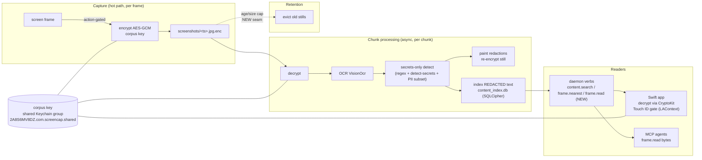
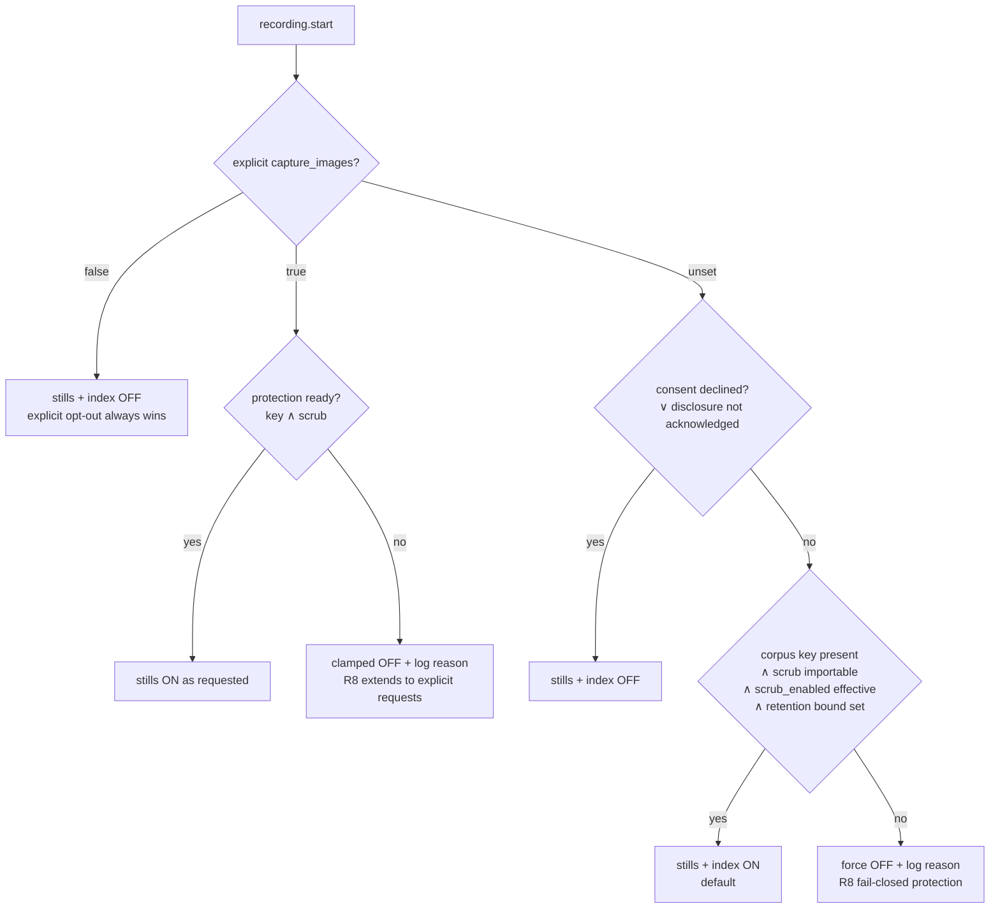

# Search-by-Default Guardrails - Plan

## Summary

Make searchable / agent-queryable memory **on by default** — safely. Today search ships default-dark (`content_index_enabled=False`; app-started recordings capture no stills) because the materialized recall corpus (flat `screenshots/*.jpg`, `content_index.db`, screenshot rows in `recording.db`) is **plaintext, unmasked, and unbounded on disk**. This plan lands the four guardrails that make a default-on posture defensible — (1) secrets-only scrub of indexed stills, (2) a retention bound on the screenshots dir, (3) at-rest encryption of the recall corpus, (4) present-user (Touch ID) gating of user-facing corpus reads — then flips the default behind a readiness gate.

Grounding: [docs/research/2026-07-10-video-vs-screenshots-analysis.md](../research/2026-07-10-video-vs-screenshots-analysis.md) (codebase analysis) and the ce-pov verdict in-session: adopt baseline search **only** with Recall-post-fix-grade guardrails; never ship always-on unprotected stills (Windows Recall precedent, May 2024 → April 2025 retreat).

---

## Problem Frame

- The product strategy needs searchable memory to be a baseline capability (the "Replay, MCP & data flywheel" track), but the privacy posture — the product's wedge — forbids Recall-style always-on unprotected capture.
- **Live exposure today:** CLI-started recordings already force `capture_images=True` (`src/screencap/cli/__init__.py:491`), so CLI users accumulate plaintext, unmasked, never-evicted stills right now. App-started recordings send no `capture_images` and fall back to the engine default `False` (`src/screencap/engine/config.py:43`) — which is why app recordings can't be indexed or backfilled.
- The three specific gaps (verified):
  1. **Unmasked**: masking runs only on the scrub-time cloud copy; local stills are never masked (`src/screencap/chunk_processor.py` ~1044: "live recorder never masks screenshots in place").
  2. **Unbounded**: `screenshots/` is excluded from per-chunk eviction — "kept whole until the recording is stubbed" (`src/screencap/retention.py:119-134`).
  3. **Plaintext**: `content_index.db` and `recording.db` are plain `sqlite3`; stills are plain JPEG. No at-rest encryption exists anywhere local (`src/screencap/content_index.py:344`, `src/screencap/recording_db.py:73-110`).

---

## Requirements

- **R1** — Stills that are persisted for search are scrubbed of secrets/PII (passwords, tokens, API keys, credit cards, SSNs) *before* their text is indexed and *before* the still is retained long-term; the scrub is **lighter than the upload masker** so search recall survives (no FULL_WINDOW/PANE blackouts on the local copy).
- **R2** — The `screenshots/` dir has a retention bound (age- and/or size-cap), configurable, enforced by the existing retention machinery; default bound applies when search is on by default.
- **R3** — The recall corpus is encrypted at rest: `screenshots/*.jpg`, `content_index.db`, and screenshot pixel blobs in `recording.db`. Keys live in the shared Keychain access group so both the Python daemon and the Swift app can operate.
- **R4** — User-facing corpus reads in the app (search-result stills, review stills, thumbnails) are gated behind present-user auth (Touch ID / `LocalAuthentication`), with a session grace period. Background daemon indexing is *not* gated (a daemon cannot prompt; capture/index continues unattended — the Recall post-fix model).
- **R5** — Existing plaintext corpora (CLI recordings' stills, existing `content_index.db`) are migrated to the encrypted form; no plaintext copy remains after migration.
- **R6** — Screenshot capture + content indexing become **on by default**, gated on runtime readiness (R1-R3 machinery present and healthy) **and on a persisted disclosure-acknowledged marker** — the default never flips for a user who has not seen the disclosure. New installs acknowledge via the onboarding disclosure step; **existing installs** (which never re-run onboarding) via a one-time post-update disclosure. Both surfaces carry an inline decline. `content_index_consent_declined=true` (existing opt-out) is always respected.
- **R7** — Nothing in this plan changes what uploads to cloud. The upload seam (`upload.py` denylist, `masked_video_upload` gate) is untouched; encrypted local artifacts must not break the scrubbed-copy upload path.
- **R8** — Fail closed on protection, fail open on capture: if encryption or scrub machinery is unavailable, the default-on gate forces stills/indexing OFF (recording itself continues video-only, as today).

---

## Key Technical Decisions

- **KTD1 — Scrub profile: detection-based redaction, not structural masking.** Reuse `RegexDetector` (9 patterns, Luhn-validated; `src/screencap/redaction/regex.py:113`) + `DetectSecretsDetector` (12 plugins; `src/screencap/redaction/secrets.py:57`) over the OCR text at index time; paint only the detected text regions. Do **not** reuse `_SURFACE_STRATEGY` FULL_WINDOW/PANE masking for local stills — that profile is upload-calibrated and destroys search recall. PII entity types (EMAIL, SSN, CREDIT_CARD) included; PERSON-name NER excluded from the local profile (high false-positive cost to recall; names are legitimate search keys). *Why:* R1's recall-vs-protection calibration; the pipeline factory is already composable (`create_default_pipeline`, `engine.py:375`).
- **KTD2 — Scrub at index time, not capture time.** OCR + detection is far too slow for the 20fps capture hot path. Capture writes encrypted stills immediately (KTD3); the existing per-chunk processing pass decrypts → OCRs → detects → paints redactions → re-encrypts → indexes redacted text only. Between capture and chunk-processing the still is encrypted-but-unscrubbed — acceptable because encrypted, and **bounded, not open-ended**: per-chunk scrub state is persisted (ledger-style, beside `pipeline_chunk_state`), `frame.read` and full-still app views refuse frames from unscrubbed chunks (fail-closed, mirroring the ALLOW-only filter), and a failed scrub/index pass marks the chunk for retry on the next processing pass rather than skipping it permanently — otherwise the fail-open index pass would silently degrade R1 to encryption-only forever. *Why:* preserves capture overhead (a tracked key metric); slots into the existing `index_range` frame loop (`src/screencap/index_core.py:114-150`), which already runs post-capture per chunk.
- **KTD3 — Corpus encryption: AES-256-GCM files + SQLCipher index, key in the shared Keychain group.** Mirror the existing KEK pattern (`src/screencap/network/crypto.py:51` — `AESGCM`, `secrets.token_bytes(32)`, wrap/nonce discipline) for per-file still encryption (`.jpg.enc`). Use SQLCipher for `content_index.db` (page-level encryption keeps FTS5 working; the **daemon is its only reader** — the app goes through daemon verbs, so no Swift SQLCipher needed). Encrypt `png_data` blobs in `recording.db` with the same file key (blob-level; no FTS over blobs). Store the corpus key via `keychain_group.store/load` (`src/screencap/keychain_group.py:313-342`) in `2A8S6MV8DZ.com.screencap.shared` — the SCR-241 group both binaries already read without prompts. *Why:* every primitive already exists in-tree; the only new dependency is SQLCipher's Python binding.
- **KTD4 — Present-user gating lives in the Swift app, not the daemon.** No `LocalAuthentication` usage exists today; a background daemon cannot evaluate biometrics. The app gates *display* of corpus content (`LAContext.evaluatePolicy`) with a per-session grace window; the daemon reads the corpus key from the Keychain for background indexing without gating. This matches Windows Recall's shipped model (background capture continues; viewing requires proof of presence). *Why:* R4; architectural necessity.
- **KTD5 — Default flip is a daemon-side readiness gate, not a bare constant flip.** `build_engine_worker_args` (`src/screencap/daemon/supervisor.py:195`) is the defaults-resolution seam: when the request leaves `capture_images` unset, resolve it from (new-default ON) ∧ (corpus key present) ∧ (scrub pipeline importable) ∧ (effective `scrub_enabled` for this recording — the index pass branches on a real ScrubResult, so auto-ON without scrub would accumulate never-indexed stills) ∧ (retention bound configured) ∧ (disclosure-acknowledged marker present, R6) ∧ (¬`content_index_consent_declined`). **Only an explicit `capture_images=false` always wins**; an explicit `true` is clamped OFF with a structured log reason when the protection conjuncts (key ∧ scrub) fail — R8's fail-closed rule extends to explicit requests, preserving U2's never-write-plaintext invariant. Same gate feeds `content_index_enabled`'s effective value. The two flags stay independent (they are orthogonal today — enabling one never implied the other) but are resolved by one readiness check. *Why:* R6 + R8; a constant flip would silently re-open the plaintext exposure on any machine where the guardrails failed to initialize.
- **KTD6 — Agent still-access moves behind a daemon verb.** Encrypting stills breaks the SCR-186 contract where MCP agents build the `.jpg` path from `frame.nearest`'s stem and read the file directly. Add a `frame.read` daemon verb (decrypt-and-serve bytes for an ALLOW frame, size-capped) and enrich `frame.nearest`'s reply to signal encrypted storage. *Why:* preserves the agent-memory surface (the strategic point of search) without leaving stills plaintext; keeps R8's pointer-only diagnostics intact for everything except explicit frame fetches.

---

## High-Level Technical Design

Readiness gate (U8) resolving the default at recording start:

---

## Implementation Units

### U1. Corpus crypto module + key lifecycle (Python)

**Goal:** A `corpus_crypto` module owning the corpus key (generate, store/load via shared Keychain group) and AES-256-GCM file/blob encrypt-decrypt helpers.
**Requirements:** R3. **Dependencies:** none.
**Files:** `src/screencap/corpus_crypto.py` (new), `tests/test_corpus_crypto.py` (new).
**Approach:** Mirror `network/crypto.py` (AESGCM, 32-byte key, 12-byte nonce, AAD binding the recording name + filename so ciphertexts can't be swapped across recordings). Key via `keychain_group.store/load` with a new service name (e.g. `screencap-corpus`), account `key`, group `2A8S6MV8DZ.com.screencap.shared`. Env-var override for headless/test (`SCREENCAP_CORPUS_KEY_FILE`, 0600) mirroring `SCREENCAP_ENGINE_TOKEN_FILE` (`auth.ENGINE_TOKEN_FILE_ENV`). **Unentitled binaries** (pip/pyenv CLI, Debug builds) get `errSecMissingEntitlement` on the shared group — mirror `auth.py`'s refresh-token fallback chain: shared group → legacy `keyring` path, so pip-CLI installs (the Problem Frame's live exposure) still reach a ready gate; U7's migration and U8's gate operate against whichever key channel succeeded. Key absent + generation impossible across all channels → raise a typed `CorpusKeyUnavailable` the gate (U8) treats as not-ready.
**Patterns to follow:** `src/screencap/network/crypto.py` (KEK/wrap discipline), `src/screencap/keychain_group.py:313-342`, `src/screencap/auth.py:78-92` (service/account/group constants).
**Test scenarios:** round-trip encrypt/decrypt of a JPEG payload; tampered ciphertext → auth failure raises (no partial plaintext); AAD mismatch (file renamed across recordings) → failure; key persists across store/load; `errSecMissingEntitlement` → keyring fallback stores/loads the same key; `CorpusKeyUnavailable` raised when Keychain, keyring, and env fallback are all absent. Mark `@pytest.mark.privacy` and keep Vision-free (CI runs only the privacy lane).

### U2. Encrypted still write path (engine)

**Goal:** When `RECORD_IMAGES` is on, the capture writer persists `screenshots/<ts>.jpg.enc` (encrypted) instead of plaintext `.jpg`; inline `png_data` blobs in `recording.db` are encrypted with the same key.
**Requirements:** R3, R8. **Dependencies:** U1.
**Files:** `src/screencap/engine/recorder.py` (write path ~758-779), `src/screencap/corpus_crypto.py`, `tests/test_encrypted_capture_write.py` (new).
**Approach:** Encrypt-then-write in the screen writer process (plaintext never lands on disk). The encrypted format itself is **gated on the same readiness resolution U8 flips** (a persisted corpus-format flag, OFF until U8 lands): pre-flip recordings — including today's forced-True CLI recordings — keep writing plaintext `.jpg`, so no release ships `.jpg.enc` before the read-side compat (U6 display, U7 shim, U8 `frame.read`) exists; U7's migration converts everything in one step at flip time. The event row's `image_path` records the `.enc` name. Writer obtains the key once at startup (spawn-safe — child processes re-import). **Key delivery mirrors the engine-token channel**: the daemon writes the key to a 0600 file and passes only the file path via env (`SCREENCAP_ENGINE_TOKEN_FILE` pattern) — worker-args/argv are base64'd into the command line and `ps`-visible (`auth.py` forbids them for secrets), so they must never carry key material. If the key is unavailable at recording start, the U8 gate has already forced stills off — the writer never half-writes plaintext.
**Execution note:** capture-overhead sensitive; verify encrypt cost per frame is negligible vs the JPEG encode it follows (AESGCM of a ~100-500KB buffer is sub-ms — confirm with a timing assertion in tests, not a benchmark suite).
**Test scenarios:** recording with stills on → dir contains only `*.jpg.enc`, decryptable via U1, no plaintext `*.jpg`; `png_data` blob in DB is not valid JPEG bytes until decrypted; existing no-images path unchanged (empty dir); crash mid-write leaves no plaintext temp file; with the corpus-format flag OFF (pre-flip), stills write plaintext `.jpg` exactly as today; the key never appears in the worker argv (assert against the spawned command line). `@pytest.mark.privacy`.

### U3. Secrets-only scrub at index time

**Goal:** The index pass redacts secrets/PII from stills before their text is indexed: decrypt → OCR → detect → paint detected regions into the stored still → re-encrypt → index redacted text only.
**Requirements:** R1. **Dependencies:** U1, U2. U3 **owns** the shared `open_still(path) -> bytes` helper (reads both `.jpg` and `.jpg.enc`) — the migration-window compat seam that U7 and every other still-reader consume.
**Files:** `src/screencap/index_core.py` (frame loop 114-150), `src/screencap/redaction/local_scrub.py` (new — the secrets-only profile + the `open_still` helper), `src/screencap/redaction/ocr.py` (extend `recognize` to accept in-memory bytes — it is path-only today via `NSData.dataWithContentsOfFile_`), `src/screencap/chunk_processor.py` (`_do_index_chunk_content` ~1062-1126), `tests/redaction/test_local_scrub.py` (new).
**Approach:** New factory `create_local_scrub_pipeline()` composing `RegexDetector` + `DetectSecretsDetector` + the PII detectors' EMAIL/SSN/CREDIT_CARD subset — **not** PERSON NER, **not** `_SURFACE_STRATEGY` structural masks (KTD1). Vision OCR already returns text with geometry (`redaction/ocr.py`); map detection char-spans → OCR boxes → paint via the shared `privacy/mask_primitives.py`. Persist the redacted re-encrypted still (delete-then-write under the existing `content_index_write_lock` + re-stat barrier). Index only the redacted text. Decrypted plaintext must **never** be written to disk during the index pass (no decrypt-to-temp — hence the in-memory OCR seam). Persist per-chunk scrub state so readers can distinguish scrubbed from pending chunks (KTD2). The existing ALLOW-only skip (`SCRUB_BLOCK_ACTIONS` intervals) stays upstream and untouched.
**Execution note:** the redaction must be idempotent per frame (re-processing a chunk repaints the same regions — `index_range` already replaces whole chunk ranges; mirror that).
**Test scenarios:** a still whose OCR text contains an AWS key / a password assignment / a credit card (Luhn-valid) → indexed text has the span replaced, decrypted still has the region painted; a still with none → byte-identical content after pass (minus re-encryption nonce); PERSON name → **not** redacted (recall preserved); detection engine import failure → chunk marked scrub-pending for retry on the next processing pass (never permanently skipped), capture unaffected, reason logged (R8); re-run of the same chunk → no double-paint, no duplicate rows. `@pytest.mark.privacy`, Vision-free (inject fake OCR geometry).

### U4. Encrypt `content_index.db` (SQLCipher)

**Goal:** The global FTS5 index is encrypted at rest with the corpus key; search behavior unchanged.
**Requirements:** R3. **Dependencies:** U1.
**Files:** `src/screencap/content_index.py` (connect path ~344, plus WAL/perm hardening sites), `pyproject.toml` (SQLCipher binding), `tests/test_content_index_encryption.py` (new).
**Approach:** SQLCipher via `sqlcipher3`(-binary); key derived from the corpus key (hex `PRAGMA key`). The daemon is the sole reader/writer (the app uses daemon verbs), so no Swift-side SQLCipher. Preserve the existing hardening (0o600/0o700, symlink guard, WAL + busy_timeout + PASSIVE checkpoint). Fresh DB when no index exists; existing plaintext index handled by U7's migration.
**Test scenarios:** index written then reopened with key → search hits identical to plaintext baseline; opening without key fails (and raw file bytes contain no indexed plaintext terms — grep the file for a known token); FTS5 rank/escape-LIKE fallback still pass existing suite; `delete_recording` / interval purge behave identically. `@pytest.mark.privacy`.

### U5. Retention bound for the screenshots dir

**Goal:** Old stills are evicted by age and/or total-size cap, independently of chunk eviction; content-index rows for evicted frames are purged.
**Requirements:** R2. **Dependencies:** none (parallel with U1-U4).
**Files:** `src/screencap/retention.py` (new seam alongside `_select_for_policy` / `evict_recording` ~317-417), `src/screencap/daemon/retention_sweep.py` (new — the periodic Supervisor-style task), `src/screencap/config.py` (new keys), `tests/test_screenshot_retention.py` (new).
**Approach:** New config `[retention] screenshot_days` / `screenshot_size_cap_mb` (env `SCREENCAP_SCREENSHOT_RETENTION_DAYS` / `_SIZE_CAP_MB`), defaulting to a bound (propose 30 days) **when the U8 default-on gate is active**, unbounded otherwise (preserves today's behavior for explicit opt-in users until they configure it). Eviction runs inside `evict_recording` after chunk handling: scan `screenshots/`, select oldest-first beyond bound, unlink, then `ContentIndex.delete_recording_interval` for the evicted span (reuse the scrub_worker purge pattern). Never evict frames newer than the last indexed chunk (don't race the indexer). Because `evict_recording` fires only during recording and at convergence, U5 also adds a **periodic daemon retention sweep** (Supervisor-task style, mirroring `daemon/backfill_job.py`, deliberately **not** auth-gated — it must run for signed-out local-only users) that walks `~/.screencap/recordings/` on an interval and applies the screenshot bound to converged recordings; without it the bound is dead code, since nothing revisits a recording 30 days later. The in-`evict_recording` seam stays as the during-recording/finalize fast path.
**Test scenarios:** age policy evicts only stills older than cutoff and purges their index rows; size cap evicts oldest-first to under cap; stills newer than last-indexed timestamp survive regardless; `keep_forever` + no screenshot keys → nothing evicted (today's behavior); eviction of an in-flight-indexing chunk's frames is deferred; a converged recording older than the bound is evicted by the periodic sweep with no recording-lifecycle event, and the sweep runs signed-out. `@pytest.mark.privacy`.

### U6. Swift read-side decrypt + Touch ID gating

**Goal:** The app can display encrypted stills, and user-facing corpus surfaces require present-user auth with a session grace window.
**Requirements:** R3, R4. **Dependencies:** U1, U2.
**Files:** `macos/Screencap/Controllers/CorpusCrypto.swift` (new — CryptoKit AES.GCM + Keychain read), `macos/Screencap/Controllers/PresenceGate.swift` (new — LAContext), `macos/Screencap/Controllers/ThumbnailLoader.swift` (decode seam ~69-90), `macos/Screencap/Controllers/RecordingFrameIndex.swift` (enumerate `.jpg.enc`, poster fallback unchanged), `macos/Screencap/Views/Review/ScreenshotTruthPane.swift`, search-result thumbnail path, `macos/ScreencapTests/CorpusCryptoTests.swift`, `macos/ScreencapTests/PresenceGateTests.swift` (new).
**Approach:** `CorpusCrypto` reads the key from the shared access group (**pending OQ4** — there is no existing Swift-side Keychain read to mirror; `CloudAuthController` keeps all token handling in Python, so this is a novel surface if chosen over the daemon-verb route) and decrypts into memory at the existing decode seam (ThumbnailLoader's injected `decode:` closure is the single choke point — decrypt-then-downsample). `PresenceGate` wraps `LAContext.evaluatePolicy(.deviceOwnerAuthentication)` with a configurable grace window (propose 15 min) and a test seam (protocol + fake, mirroring `VideoPlaybackEngine`'s fake pattern). Gate fires on: opening Search results with still previews, ScreenshotTruthPane, and any full-size still view. **Not** gated: video playback (out of corpus scope), event timeline, library card *poster* thumbnails (extracted from video, not corpus stills — keeps the library browsable without auth).
**Execution note:** UI-behavior heavy — drive with the existing ViewHostingHarness test pattern; verify the no-Touch-ID-hardware fallback (password sheet) path.
**Test scenarios:** encrypted still decodes to the correct image via the loader with key present; key absent → placeholder (hatched, R5-style), never a crash; gate: first corpus view prompts, second within grace does not, after expiry prompts again; auth failure → content stays hidden, no bytes decoded; `.jpg` (legacy plaintext) and `.jpg.enc` both enumerable during migration window.

### U7. Migration of existing plaintext corpora + compat

**Goal:** Existing plaintext stills (CLI recordings), plaintext `content_index.db`, and consumers that glob `*.jpg` all converge on the encrypted format; no plaintext remains post-migration.
**Requirements:** R5, R7. **Dependencies:** U1, U2, U4.
**Files:** `src/screencap/corpus_migrate.py` (new), `src/screencap/daemon/app.py` (run at daemon start, Supervisor-task style like `backfill_job`), `src/screencap/frame_resolve.py` (glob `*.jpg` + `*.jpg.enc`), `src/screencap/backfill/engine.py` + `src/screencap/index_core.py` (read either form via one shared open-still helper), `src/screencap/scrubber.py` (the cloud-copy masking seam: `mask_screenshots` and the fail-closed deletion pass glob `*.jpg` today and would silently no-op on `.jpg.enc` — in the `<name>-scrubbed` copy, decrypt each `.jpg.enc` → apply the upload masks → write plaintext masked `.jpg` and drop the `.enc`, so the uploaded artifact set stays byte-shape-identical to today's), `src/screencap/enforcement/scrub_worker.py` (purge unlinks both extensions), `tests/test_corpus_migration.py` (new).
**Approach:** Idempotent, resumable sweep (mirror the backfill ledger pattern): per recording, encrypt-and-replace each plaintext `.jpg` (write `.enc`, fsync, unlink original), then rekey `content_index.db` via SQLCipher `sqlcipher_export` into a sibling file + atomic rename. Interruption-safe: a frame is either plaintext or encrypted, never both live. All still-readers go through the shared `open_still(path) -> bytes` helper **owned by U3**, which handles both forms. The scrubbed-copy upload path (R7): the scrub-time copy for cloud is produced *decrypted + upload-masked* exactly as today (scrubber reads via the same helper), so `upload.py` and the truth pane see the same artifact shapes as before.
**Test scenarios:** mixed dir migrates fully, byte-content preserved (decrypt == original), no `.jpg` left; kill mid-migration → re-run completes, no data loss, no duplicates; plaintext index with rows → encrypted index with identical search results; `frame.nearest` resolves stems across both forms mid-migration; scrub_worker retroactive purge deletes both forms; scrubbed cloud copy still produces plaintext masked JPEGs for upload. `@pytest.mark.privacy`.

### U8. Gated default flip + onboarding disclosure + agent verb

**Goal:** Screenshot capture and content indexing default ON behind the readiness gate; onboarding discloses the default with pause/exclude affordances; agents keep still access via `frame.read`.
**Requirements:** R6, R8, KTD6. **Dependencies:** U1-U7 (the gate checks their machinery).
**Files:** `src/screencap/daemon/supervisor.py` (`build_engine_worker_args:195` — readiness resolution), `src/screencap/config.py` (`content_index_enabled` effective-default logic ~226-235), `src/screencap/engine/config.py` (leave `RECORD_IMAGES=False`; the daemon gate supplies the default — a bare constant flip would bypass R8), `src/screencap/cli/__init__.py:491` (route the CLI's existing forced-True through the same gate), `src/screencap/daemon/app.py` (+`frame.read` verb: ALLOW-frame check via `frame_blocked`, scrubbed-chunk check per KTD2, size-capped, audit-logged via `audit_log.record_verb`, class-name-only diagnostics), `macos/Screencap/Views/Onboarding/` (new disclosure step + one-time post-update disclosure for existing installs — copy calibrated to the mechanism: "recordings are searchable on this Mac — encrypted; known secret formats (passwords, keys, card numbers) automatically detected and redacted; N-day retention; here's pause / per-app exclude / turn off", with an inline decline writing `content_index_consent_declined=true`), `macos/Screencap/Controllers/DaemonClient.swift` (optional `capture_images` passthrough for explicit user override), `tests/test_default_gate.py`, `tests/test_frame_read_verb.py`, `macos/ScreencapTests/OnboardingSearchDisclosureTests.swift` (new).
**Approach:** Gate truth table in one pure function (unit-testable), per KTD5: explicit `capture_images=false` always wins; explicit `true` is clamped OFF (structured log reason) when protection readiness (key ∧ scrub) fails; else ON iff key-present ∧ scrub-importable ∧ effective-`scrub_enabled` ∧ retention-bound-set ∧ disclosure-acknowledged ∧ ¬consent-declined; else OFF + structured log reason. The **disclosure-acknowledged marker** (R6) is written by the onboarding disclosure step on new installs and by a **one-time post-update disclosure** on existing installs (they never re-run onboarding); both surfaces carry an **inline decline** that writes `content_index_consent_declined=true` — the durable opt-out the settings UI already writes. `frame.read` is a capability-bearing verb like `recording.start/stop`: wire it through the existing `daemon/audit_log.record_verb` trail (peer + ok/blocked/error per invocation) so decrypt-and-serve leaves a forensic trace. `frame.nearest` reply gains `encrypted: true` so MCP clients know to call `frame.read` instead of reading the path (additive, non-breaking — mirrors the transcript.search enrichment precedent). Update `docs/mcp-client-setup.md`.
**Execution note:** land last; flip nothing until U1-U7 are merged and the migration has run on the dev machine. Verify the gate's OFF path by deliberately removing the corpus key on a test install.
**Test scenarios:** gate truth table (every readiness input toggled, including `scrub_enabled` and the disclosure-acknowledged marker; explicit `false` respected; explicit `true` clamped OFF when key/scrub not ready; consent-declined forces OFF even when ready); existing install with no marker → default stays OFF until the post-update disclosure is acknowledged; decline-from-disclosure writes consent-declined and forces the gate OFF; app-started recording on a ready system → `.jpg.enc` files exist + chunks indexed; on a broken system (no key) → video-only recording, structured reason logged; `frame.read` returns decryptable bytes for an ALLOW frame from a scrubbed chunk, refuses blocked frames and unscrubbed chunks (fail-closed), caps size, and emits one audit-log record per invocation; onboarding step renders and its pause/exclude/decline affordances resolve. `@pytest.mark.privacy` for the Python lane.

---

## Scope Boundaries

**In scope:** the four guardrails + gated default flip, Python daemon + Swift app, local artifacts only.

### Deferred to Follow-Up Work
- **Derive-from-video indexing** (build the index by extracting frames from `chunk_*.mp4`; removes still double-storage) — the ce-pov verdict's "optimize later"; requires the OCR-fidelity spike first.
- **Backfill of pre-existing video-only recordings** (needs derive-from-video).
- **Unifying the corpus key with the cloud E2EE key hierarchy** (`cloud_crypto.py`) — separate keys are acceptable now.
- **Per-access (vs per-session) Touch ID policy option**; hardware-key / VBS-enclave-grade key protection.

### Outside this plan
- Any change to cloud upload composition, `masked_video_upload`, or the video artifact and its pipeline.
- Windows anything (strategy: macOS only).

---

## Open Questions
- **OQ1** — Touch ID grace window default (proposed 15 min) and whether library search *text* results (no still previews) should be gated at all. Decide at U6 review with real UX feel.
- **OQ2** — Retention default (proposed 30 days) — validate against real per-day still volume once U2 lands (no bytes-per-day telemetry exists yet; the analysis doc flags the same measurement gap).
- **OQ3** — Should `frame.read` — and `content.search` text snippets, which read the same corpus and deserve one trust rationale — require a present-user check for *interactive* MCP clients, or is same-EUID + ALLOW-frame + scrubbed-chunk filtering the right bar for agents? (SECURITY.md trust-boundary discussion.) **Resolve before U8 implementation starts**, not merely before merge — U8 ships the verb and its tests together — and record the answer in R4/KTD4 so the gating scope is explicit. *(Sharpened by doc review: security-lens, adversarial.)*
- **OQ4** *(from doc review — scope-guardian, confidence 100)* — **U6's key-access design is an open fork; the cited precedent does not exist.** `CloudAuthController` performs no Swift-side Keychain reads — its documented invariant is "all token handling stays in Python; Swift only triggers commands and reads `--json` state." Decide: **(a)** introduce the first direct Swift Keychain access-group read + CryptoKit decrypt (fast local reads; a new key-holding surface and a broken invariant), or **(b)** route app corpus reads through daemon verbs (`frame.read`) — preserves keys-stay-in-Python, adds daemon round-trips to thumbnail grids and couples display to daemon liveness. **U6 blocks on this choice.**

---

## Risks & Dependencies
- **SQLCipher binding quality on macOS/arm64 + x86_64** (local-release builds both arches; the x86_64 lane has a known numpy/minos constraint history). Mitigation: pin `sqlcipher3-binary`, verify in both arch builds early in U4; fallback is AESGCM-encrypted DB file with decrypt-to-temp for the daemon session (slower, acceptable).
- **Key loss = corpus loss** (stills + index unreadable; video unaffected). Acceptable by design (recall corpus is derived data; video is source of truth) — document in SECURITY.md.
- **Recall regression from over-redaction** (KTD1's calibration): mitigated by excluding PERSON NER and structural masks; watch for entropy-detector false positives on code-heavy screens (the persona's dashboards) — the existing 50-char context filter (`secrets.py:49-54`) helps.
- **Under-detection is inherent** (the mirror risk): OCR misreads and secrets without regex/entropy signatures evade KTD1's finite detector set — the scrub reduces exposure, it cannot promise elimination. Disclosure copy is calibrated to the mechanism (U8), and the SECURITY.md update must document R1's coverage limits; residual protection is encryption + gating + the upstream blocked-frame skip.
- **Perf: decrypt on every OCR/index read.** Per-frame AESGCM is sub-ms; the OCR itself (~100ms+) dominates. Confirm chunk-processing wall-clock budget still holds (existing `_index_chunk_content` wall-clock budget stays the backstop).
- **Coordination with concurrent sessions** touching the daemon/app (this checkout is shared) — ship via an isolated worktree per the repo's worktree conventions.

---

## Verification Contract
- Python: full suite green locally; **all new privacy-bearing tests marked `@pytest.mark.privacy` and Vision-free** — CI runs only `pytest -m privacy` (+ lock-policy), so unmarked tests never run on CI.
- The two call-graph/package-boundary guard tests still pass (`tests/test_package_boundary_call_graph.py`, `tests/test_privacy_filter_call_graph.py`) — `corpus_crypto` must not violate the privacy-package DAG (it belongs beside `enforcement`/`redaction` consumers, importing `privacy/` primitives only where shared).
- Swift: `xcodebuild test` green (XcodeGen project; known flaky daemon-reconnect test noted in repo memory).
- End-to-end (manual, dev machine): fresh recording on a ready system → search finds on-screen text, a planted fake AWS key is *not* findable and its region is painted; Finder shows only `.jpg.enc`; Touch ID prompts once per session on opening search stills; pulling the corpus key → next recording is video-only with a logged reason.

## Definition of Done
- All eight units merged; migration executed on dev install with zero plaintext stills remaining.
- A new install (or reset TCC/defaults per repo test hygiene) lands with search ON, disclosure shown, gate healthy.
- An existing-install upgrade shows the one-time disclosure and flips only after acknowledgment; decline holds the gate OFF durably.
- SECURITY.md updated: corpus encryption model, key location (incl. the keyring tier for unentitled binaries), present-user gating scope, `frame.read` trust rationale, key-loss stance, and R1's detection-coverage limits.
- The analysis doc's open item №3 ("decide the search posture") marked resolved with a pointer to this plan.

---

## Sources & Research
- [docs/research/2026-07-10-video-vs-screenshots-analysis.md](../research/2026-07-10-video-vs-screenshots-analysis.md) — grounding analysis (consumer map, cadence, upload seam, derive-from-video feasibility).
- In-session ce-pov verdict (Tier 3): reject always-on unprotected stills; baseline search only behind Recall-post-fix-grade guardrails. External floor: Windows Recall timeline (Microsoft Windows Experience Blog 2024-06-07 & 2024-09-27; Beaumont/DoublePulsar; TotalRecall PoC; ICO inquiry; April 2025 opt-in relaunch), competitor defaults (Rewind teardown, Screenpipe, Dayflow, rem).
- Three targeted code investigations this run: scrub/retention seams, encryption/keychain/gating integration points, capture-flag/consent wiring (file:line pointers embedded throughout the units).
