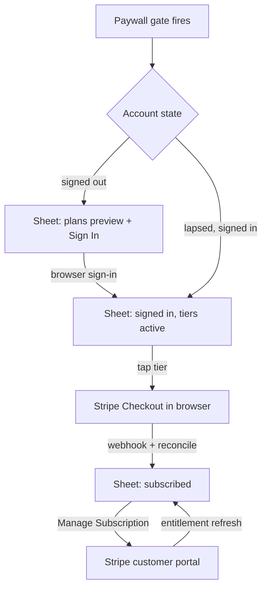
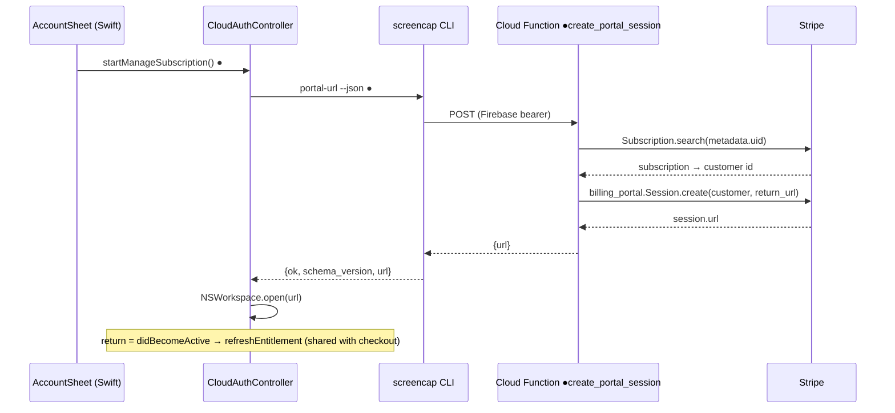
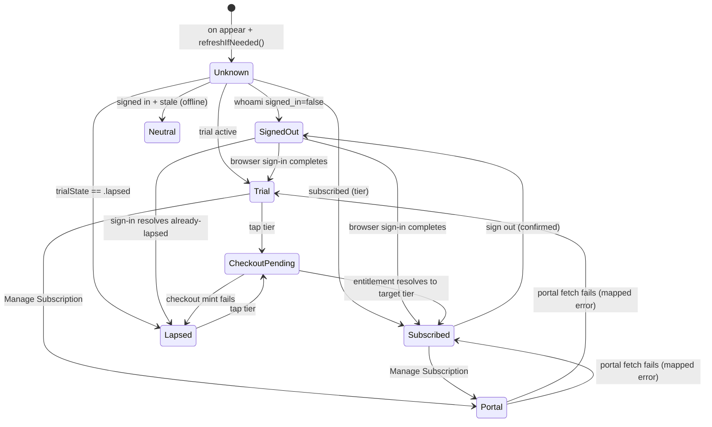

# In-App Account & Plan Sheet - Plan

## Goal Capsule

- **Objective:** One state-adaptive Account & Plan sheet in the macOS app covering sign-in, plan state, checkout, manage-subscription, and sign-out — so no surface in the app ever instructs the user to run a terminal command.
- **Product authority:** This document. Tier structure and pricing inherit from `docs/plans/2026-07-10-001-feat-paid-only-launch-pricing-plan.md`; checkout/entitlement architecture inherits from `docs/plans/2026-07-07-001-feat-personal-cloud-billing-paywall-plan.md`.
- **Open blockers:** None. The Stripe live-mode portal configuration (U7) is a pre-launch operational step, not a planning blocker.
- **Product Contract preservation:** changed R1 (added offline/indeterminate state — the codebase's KTD-4 rule that stale entitlement never reads as lapsed), R7 (Manage Subscription extends to trial users — the app's own copy promises pre-conversion cancellation), R10 (generalized from one banned string to a single error-mapping seam); added R13 (sheet owns checkout-pending/reconcile machinery — it exists only in onboarding today, not "existing" app-wide as the contract assumed) and R14 (upload entry-point settle contract). Confirmed with the user at plan-time synthesis.

---

## Product Contract

### Summary

Replace the app's fragmented auth/upgrade prompts with a single Account & Plan sheet that adapts to account state (signed-out, trial, subscribed, lapsed, offline/indeterminate) and is opened from every entry point — menu bar, Settings, onboarding, the paywall gate, and the upload moment. Sign-in stays the existing browser handoff; subscribing is gate-first (sign-in unlocks the tier buttons); a new Stripe customer-portal path gives trial users and subscribers a way to manage or cancel.

### Problem Frame

The app already has in-app sign-in (`CloudAuthController` runs the browser-handoff flow; menu bar, onboarding, and the upload prompt all trigger it). But the surfaces are fragmented — `SignInPromptView`, `UpgradePromptView`, and the menu-bar section each render their own slice of account state — and the paywall dialog has no signed-out state at all. A signed-out user who taps a plan hits a dead end: the CLI's error string "Sign in to upgrade: run `screencap login`." passes through verbatim into the GUI (`src/screencap/upload.py:109`, asserted verbatim by `macos/ScreenCapTests/CloudAuthControllerTests.swift`). Separately, no manage/cancel path exists anywhere — a trial user the app tells to "cancel before it converts" has nothing to cancel with. For a paid-only launch, both are unacceptable.

### Key Decisions

- **One unified sheet, not patches to the prompt zoo.** `SignInPromptView` and `UpgradePromptView` are replaced by a single state-adaptive surface. Bigger refactor than patching the paywall dialog, but one surface to maintain and one place account state can be wrong.
- **Gate-first subscribe flow.** When signed out, plans render as a preview and the single actionable button is Sign In; after sign-in the sheet re-renders with tier buttons active. Chosen over chaining tap-a-tier through sign-in — each step explicit, identity settled before payment.
- **Manage-subscription is in scope, including its backend endpoint.** The sheet's Manage button opens Stripe's hosted customer portal; a portal-session endpoint (sibling of `create-checkout-session`) must be added. A paid-only launch with no cancel path is not acceptable.
- **Keep the existing auth mechanism unchanged.** Sign-in remains the system-browser loopback + PKCE flow the CLI already implements and the app already triggers; checkout return remains polling + entitlement reconcile. No custom URL scheme, no deep links, no new token handling in Swift.
- **Sign-out confirms with consequences.** Under paid-only enforcement, signing out locks new recording and search until sign-in, so sign-out shows a confirmation stating exactly that and that recordings stay on this Mac.
- **Design reference: the Claude macOS app.** Minimal in-app chrome, browser for the heavy lifting, account identity + plan state presented plainly.

### Requirements

**The sheet and its states**

- R1. The app presents one Account & Plan sheet whose content adapts to account state: signed-out, signed-in on trial, signed-in subscribed (per tier), lapsed, and offline/indeterminate — the last renders a neutral account view (identity if known, no gate framing, no tier buttons) because stale entitlement must never read as lapsed.
- R2. All account-related entry points open this sheet: the menu-bar account section, Settings, the onboarding account step, the recording/search paywall gate, and the upload moment. `SignInPromptView` and `UpgradePromptView` are retired.
- R3. When opened as a gate (recording or search blocked for a lapsed/unentitled account), the sheet carries the urgent gate framing ("Subscribe to keep recording", existing reassurance copy about local data) rather than reading as a neutral settings page. It stays dismissible while unresolved (a "Not now"/close affordance) — enforcement blocks recording and search independently; the sheet frames, it does not trap.
- R4. Signed-out state: plans are visible as a preview, tier buttons are inactive, and the single primary action is Sign In, which runs the existing browser sign-in with the existing in-progress (cancellable) and failure states shown in the sheet.
- R5. After sign-in completes, the sheet settles per entry point: gate, menu-bar, Settings, and onboarding entries re-render in place; the upload entry dismisses and auto-starts the upload (R14).
- R6. Signed-in state shows the account email and plan/trial state, and tier buttons become active; tapping a tier opens hosted Stripe Checkout in the browser, with the sheet showing the pending "unlocks automatically" state until entitlement reconciles.
- R7. Any state with a Stripe subscription — trial or subscribed — offers Manage Subscription, which opens Stripe's hosted customer portal in the browser; plan changes and cancellations reflect in the sheet after entitlement refresh.
- R8. Sign Out asks for confirmation that states the consequences: new recording and search stop until sign-in; existing recordings remain on this Mac. Sign Out is disabled (with the reason shown) while an upload is in flight, matching `canSignOut`.
- R9. With the `stripe_paywall` flag off (today's default), the sheet shows account state only — no pricing copy, no tier buttons, no checkout routing — consistent with the flag's documented meaning. Manage Subscription (R7) is independent of this flag: a user with an existing subscription keeps the manage affordance; the flag gates pricing and checkout, not management.

**No-terminal rule**

- R10. No user-visible surface in the app renders a raw CLI/daemon error string or instructs the user to run a terminal command. All envelope and process errors surfaced to the sheet pass through one mapping seam that produces app-native copy with an in-app action (retry, sign in, contact support).
- R11. The signed-out checkout dead end is eliminated: with gate-first (R4), requesting checkout while signed out is unreachable from the UI, and the pass-through of "Sign in to upgrade: run `screencap login`." is removed from the app's rendering path.

**Backend**

- R12. A portal-session endpoint is added alongside `create-checkout-session`, authenticated with the same bearer token, returning a Stripe customer-portal URL for the signed-in account; a caller with no Stripe subscription gets a distinct "nothing to manage" error, not a Stripe pass-through.

**Machinery ownership and entry-point contracts**

- R13. The sheet (via the shared auth controller) owns the checkout-return machinery: a pending flag surviving the browser round-trip, entitlement refresh on app re-activation, and a manual "I've paid — check now" reconcile action. Onboarding's account step delegates to this shared machinery instead of duplicating it.
- R14. The upload entry point keeps its contract: sign-in from that entry dismisses the sheet and auto-starts the upload exactly once; a signed-in Local Pro user tapping Upload gets the sheet in "upgrade to Cloud" framing instead of a raw signer error; the presenting window owns cancellation of an in-flight sign-in on dismissal.

### Key Flows

- F1. Signed-out user hits the paywall
  - **Trigger:** A signed-out user (whose account may hold a lapsed subscription) attempts to record or search while unentitled — the sheet perceives only "signed out" until sign-in resolves the account state.
  - **Steps:** Sheet opens in gate framing with plans previewed and Sign In primary; user signs in via browser; sheet re-renders signed-in; user taps a tier; Stripe Checkout opens in browser; user pays and returns; entitlement reconciles; sheet shows subscribed and the gate lifts.
  - **Covers:** R1, R3, R4, R5, R6, R13.
- F2. Trial user or subscriber cancels
  - **Trigger:** A user with a Stripe subscription opens the sheet and taps Manage Subscription.
  - **Steps:** Customer portal opens in browser; user cancels (at period end); webhook updates entitlement at period end; on refresh the sheet reflects the change.
  - **Covers:** R7, R12.
- F3. Sign out
  - **Trigger:** Signed-in user taps Sign Out with no upload in flight.
  - **Steps:** Confirmation states new recording/search will stop and recordings stay local; on confirm, the sheet re-renders signed-out.
  - **Covers:** R8.
- F4. Upload moment
  - **Trigger:** User taps Upload in the review window.
  - **Steps:** Signed out → sheet opens in upload framing, sign-in dismisses and auto-starts the upload; signed in on Local Pro → sheet opens in upgrade-to-Cloud framing.
  - **Covers:** R2, R5, R14.

### Acceptance Examples

- AE1. **Covers R4, R11.** Given a signed-out lapsed user at the paywall gate, when the sheet opens, then no tier button is tappable, Sign In is the primary action, and the string "run `screencap login`" cannot appear anywhere.
- AE2. **Covers R9.** Given `stripe_paywall` is off, when the sheet opens from any entry point, then it shows sign-in/account state only, with no pricing copy or tier buttons.
- AE3. **Covers R6, R13.** Given a user completes checkout in the browser and returns to the app, then the sheet reflects the subscribed state without an app restart, via pending-flag + re-activation refresh, with "I've paid — check now" available if the webhook lags.
- AE4. **Covers R10.** Given the portal or checkout URL request fails (network or backend error), then the sheet shows app-native error copy with a retry action — never the raw error envelope text or process stderr.
- AE5. **Covers R8.** Given a subscribed user taps Sign Out and confirms, then new recording and search are gated until the next sign-in and the sheet shows the signed-out state.
- AE6. **Covers R7.** Given a trial user (card on file, not yet converted) opens the sheet, then Manage Subscription is visible and opens the portal where the trial can be cancelled.
- AE7. **Covers R1.** Given the entitlement state is stale/indeterminate (e.g., offline payer), when the sheet opens, then it shows a neutral account view — no gate framing, no lapsed copy, no tier buttons.
- AE8. **Covers R12.** Given a signed-in user with no Stripe subscription requests the portal, then the backend returns a distinct "nothing to manage" result and the sheet explains there is no subscription yet, offering the plans instead.

### Success Criteria

- No user-visible string in the app instructs running a terminal command, enforced by an automated source sweep test, not convention.
- A signed-out, lapsed user can go from the paywall gate to an active subscription entirely through the app and browser — no terminal at any step.
- A trial user can cancel before conversion entirely through the app and browser.

### Scope Boundaries

- No new auth providers — Google sign-in stays the only method.
- No custom URL scheme or deep-link returns — the existing loopback sign-in and checkout/portal-return refresh stay as-is.
- `screencap login` and related CLI commands remain for headless/CLI installs; this work changes the app, not the CLI's terminal-facing copy.
- No "ends on \<date\>" display after a portal cancellation — that needs whoami-envelope, CLI-schema, and Swift-decoding changes; the sheet shows subscribed until the entitlement flips at period end.
- Team tier remains a waitlist concept; no team UI in the sheet.
- No native in-app purchase — hosted Stripe stays, per the Developer-ID distribution decision in the billing paywall plan.

### Dependencies / Assumptions

- **Stripe portal configuration is a one-time, per-mode operational prerequisite** (U7): live mode fails portal-session creation until a configuration is saved in the Stripe dashboard; plan-switching requires an explicit configuration with a two-product allowlist.
- **No Stripe customer ID is persisted anywhere**; the portal endpoint resolves it per request via subscription search on `metadata.uid`, the same pattern `_active_subscription_tier` uses.
- The existing `stripe_webhook` needs one change (U1): its revocation path (`customer.subscription.deleted`, tier-revoking `updated`) must re-derive the claim via `_active_subscription_tier(uid)` before clearing — with multiple uid-matching subscriptions, clearing on the single event's subscription wipes entitlement for a user whose other subscription is still active and paying. Plan switches already re-resolve correctly.
- The existing `CloudAuthController` state machine is sufficient backing for the sheet's states; only a portal-URL method, the relocated checkout-pending machinery, and sign-out confirmation state are new.

---

## Planning Contract

### Key Technical Decisions

- KTD-1. **`CloudAuthController` stays the single state source; the sheet adds no parallel auth state.** Every sheet presentation calls `refreshIfNeeded()` on appear — never `refresh()` and never any launch-path probe — preserving the decrypt-at-most-once Keychain discipline (`docs/solutions/integration-issues/keychain-auth-prompt-eager-decrypt-at-launch-2026-07-08.md`; pinned by `testInitialStateDoesNoAuthWork`).
- KTD-2. **The portal chain is a layer-by-layer clone of the checkout chain.** Cloud Function `create_portal_session` mirrors `reconcile_entitlement` (Firebase bearer → uid, `stripe.Subscription.search(query="metadata['uid']:...")` → `sub.customer`, fail-closed 4xx when no subscription, `stripe.billing_portal.Session.create(customer=..., return_url=...)`, generic 502 on Stripe errors). Two hardening rules beyond the clone: the uid is validated against `^[A-Za-z0-9_-]{1,128}$` before query interpolation (via a shared helper also adopted by `_active_subscription_tier` — Stripe search syntax accepts quotes and operators, and an injected uid here would open another customer's portal), and because each checkout mints a new Stripe customer, the endpoint selects among multiple uid-matching subscriptions by filtering to active/trialing statuses and preferring the highest tier (mirroring `_active_subscription_tier`); no active/trialing subscription → the `no_subscription` 4xx. Python `upload.request_portal_url` mirrors `request_checkout_url` (new `DEFAULT_PORTAL_URL` / `SCREENCAP_PORTAL_URL` pair, same four-way exception mapping). CLI `portal-url` mirrors `checkout-url` (`--json` envelope `{ok, schema_version, url}`, exit 1 + `ok:false` on error). Swift `fetchPortalURL` mirrors `fetchCheckoutURL` (`runJSONRaw` with `allowNonZeroExit: true` — load-bearing, or the envelope is discarded per `docs/solutions/integration-issues/cli-json-envelope-nonzero-exit-discards-stdout-2026-07-02.md`), and `startManageSubscription()` is `startCheckout(tier:)` minus the tier.
- KTD-3. **One account component; context selects framing only; settle side-effects ride a caller closure.** The component takes an `AccountSheetContext` (`gate`, `account`, `upload`, `onboarding`) that selects framing copy — pure and testable in `AccountSheetPolicy`. Settle side-effects (upload auto-start, wizard advance, dismissal) stay caller-owned via an optional `onSettled` closure with the existing one-shot latch pattern (`SignInPromptView.onSignedIn` → `ReviewWindow`/onboarding wiring today) — baking side effects into the context would couple the shared component to callers' models. `MainWindow`'s `showingUpgradePrompt: Bool` becomes `presentedAccountContext: AccountSheetContext?` driving `.sheet(item:)` so the presentation carries its context; `ReviewWindow` presents a window-local instance with its ownership latch and `.interactiveDismissDisabled` while sign-in is in flight. Per-window instances are safe because the controller is shared and `startSignIn` already no-ops concurrent attempts.
- KTD-4. **Settings entry is a new `ShellRoute.account` case rendered as an embedded pane.** The app has no macOS `Settings` scene; "Settings" is the main window's sidebar, and all SETTINGS siblings are embedded panes — a sheet-triggering sidebar row would fight the route-driven architecture (no selection highlight, needs a side callback channel, route/sheet state sync). The `.account` route embeds the shared account content (context `account`); sheet presentation is reserved for the gate and upload entries. The menu bar's "Account…" item opens the main window and selects the `.account` route — no menu-bar sheet. The Account item is pinned first in the SETTINGS sidebar group: it is the paid-only gate's home surface, and burying it slows a lapsed user's path back to a resolvable state.
- KTD-5. **One error-mapping seam in Swift.** A single function maps envelope errors and `CLIError` values to app-native copy + action; no view renders `env.error` or `error.localizedDescription` directly (`CLIError.nonZeroExit`'s description embeds raw stderr — the current leak). Enforced two ways: a policy test on the mapper, and a source-sweep XCTest (sibling of `MockStringSweepTests`) banning terminal-instruction substrings in rendered copy. The `no_subscription` mapping accounts for Stripe search's eventual consistency (~1 min): its copy reads "no subscription found yet — try again in a minute", never asserting none exists, so a just-paid user isn't told to buy again. The mapper keys on the envelope's machine-readable `code` field, never on `error` message text (message wording drifts silently past fakes), and its unknown-error fallback is static copy with no dynamic interpolation — so a runtime envelope string can never carry banned text into the UI.
- KTD-6. **Checkout-pending/reconcile machinery moves from `OnboardingAccountStep` into `CloudAuthController`.** A controller-owned browser-return flag, the `didBecomeActiveNotification` → refresh hook, and the reconcile action become published state; onboarding and the sheet both consume it. The activation-refresh gate is pending-only (a gate of "always" would shell out `whoami --force-refresh` on every app switch; onboarding may keep a view-level `onReceive` for its panel-visible case). Both `startCheckout(tier:)` and `startManageSubscription()` set the flag — without that, the portal return never fires a refresh and R7 silently fails. Clear conditions differ: checkout-pending clears when entitlement resolves to the remembered target tier AND is no longer trialing (`trial_end` absent — during a same-tier trial the tier alone matches before any payment), on mint failure, or on sign-out/account switch (which clears both flags and the remembered tier); portal-pending clears after the post-return refresh, with the manual "check now" reconcile affordance remaining available so a refresh that lost the race with the webhook has in-place recourse. Tier buttons stay active during checkout-pending (matching onboarding's panel-plus-banner rendering): re-tapping a tier replaces the remembered target and re-runs checkout, so an abandoned Stripe tab is always recoverable in place.
- KTD-7. **Sheet copy lives in a caseless catalog enum** (sibling of `OnboardingCopy`/`PricingCatalog`) pinned by string-level policy tests, keeping the honesty rules (data-stays-local reassurance, no overclaiming) testable without rendering.
- KTD-8. **New Python billing tests are marked `@pytest.mark.privacy`.** CI runs only the privacy lane; the existing checkout tests are unmarked and never run in CI. New portal tests get the marker (they are Vision-free) so the chain is CI-covered.

### High-Level Technical Design

Portal chain (new pieces marked ●):

Sheet state chart (controller-derived; the sheet renders, never computes auth state):

Neutral keys on `AuthStatus.signedIn(stale: true)` — signed-in with unrefreshable entitlement. `TrialState.indeterminate` alone is not a neutral signal: it also covers signed-out, paywall-off, and pre-resolution, so a signed-out user renders SignedOut, never Neutral.

Gate framing (R3) and paywall-flag degradation (R9) are presentation-layer switches on these states, not extra states.

### Assumptions

- Portal URL responses are treated as short-lived and single-use: fetched on tap, opened immediately, never cached.
- The `whoami` envelope's existing fields (`signed_in`, `email`, `subscribed`, `tier`, `trial_end`, `paywall_enabled`) are sufficient for all sheet states; fields are nullable per state — Swift gates each state only on the fields that state requires (`docs/solutions/integration-issues/review-data-nullable-timing-swift-consumer-2026-06-01.md`).
- Lapsed-trial and never-subscribed users see the same lapsed/plans framing; differentiated copy is a copy-catalog decision, not a state-machine one.

---

## Implementation Units

### U1. Cloud Function: portal-session endpoint

- **Goal:** `create_portal_session` HTTP entry point returning a Stripe customer-portal URL for the authenticated caller.
- **Requirements:** R12.
- **Dependencies:** None.
- **Files:** `scripts/cloud-function/billing.py`, `scripts/cloud-function/test_billing.py`, `scripts/cloud-function/.env.example`.
- **Approach:** Mirror `reconcile_entitlement`'s shape (KTD-2): OPTIONS→204 CORS, `verify_bearer` → uid (never from body), uid validated by the shared `^[A-Za-z0-9_-]{1,128}$` helper before query interpolation (helper also adopted by `_active_subscription_tier`), subscription search filtered to active/trialing and highest tier → customer id, fail-closed structured 4xx `{"error": "no_subscription"}` when none, `billing_portal.Session.create` with `return_url` from `STRIPE_PORTAL_RETURN_URL` env, Stripe exceptions → generic 502 (no internals leaked). The portal `session.url` is never written to logs. Selection tie-breaks deterministically: active/trialing filter, highest tier, then newest `created`. `Session.create` passes `configuration=STRIPE_PORTAL_CONFIGURATION_ID` (env, also in `.env.example`) so the U7 allowlist is enforced by code, not dashboard state. Error responses carry a machine-readable `code` (e.g., `no_subscription`). This unit also amends `stripe_webhook`'s revocation path: on `customer.subscription.deleted` (and tier-revoking `updated`), re-derive the claim via `_active_subscription_tier(uid)` before clearing, so a multi-subscription cancel converges on remaining active subscriptions instead of wiping a paying user's entitlement. Extend the module docstring's deploy block with the `gcloud functions deploy stripe-portal-session` command including `--set-build-env-vars GOOGLE_FUNCTION_SOURCE=billing.py`.
- **Patterns to follow:** `create_checkout_session` and `reconcile_entitlement` in `scripts/cloud-function/billing.py`; `test_billing.py` conftest mock-before-import pattern.
- **Test scenarios:**
  - Happy path: valid bearer + active subscription → 200 with `url` from the mocked portal session.
  - Trial subscription (status `trialing`) → still resolves customer and returns a URL (Covers AE6 backend half).
  - No subscription found → 4xx with `no_subscription` code, Stripe `Session.create` never called (Covers AE8).
  - uid containing `'` or search operators (e.g., `x' OR `) → rejected before any Stripe call.
  - Two subscriptions for the uid (one canceled, one active, different customers) → portal created for the active subscription's customer.
  - Invalid/missing bearer → 401; Firebase unavailable → 503.
  - Stripe raises on `Session.create` (e.g., no live portal configuration) → 502 generic message, no exception text in body.
  - OPTIONS preflight → 204 with CORS headers.
  - Webhook: `customer.subscription.deleted` for one of two subscriptions (the other still active) → claim re-derived from the remaining active subscription, not cleared.
  - `Session.create` receives `configuration` when `STRIPE_PORTAL_CONFIGURATION_ID` is set.
  - Tier tie between two active subscriptions → newest `created` wins (deterministic).
  - Happy-path log records never contain the mocked `session.url` (caplog).
- **Verification:** `pytest scripts/cloud-function/test_billing.py` green; deploy docstring includes the new function.

### U2. Python chain: `request_portal_url` + `portal-url` CLI command

- **Goal:** CLI command emitting `{ok, schema_version, url}` for the portal, callable by the app.
- **Requirements:** R12; feeds R7, R10.
- **Dependencies:** U1 (endpoint contract; buildable in parallel against the env-overridable URL).
- **Files:** `src/screencap/upload.py`, `src/screencap/cli/__init__.py`, `tests/test_upload.py`.
- **Approach:** `upload.request_portal_url()` mirrors `request_checkout_url` — `DEFAULT_PORTAL_URL` + `SCREENCAP_PORTAL_URL` override, `auth.authed_post`, the four-way exception mapping. The CLI error envelope carries a machine-readable `code` field (`no_subscription`, `not_signed_in`, `network`) alongside `error`, so Swift maps on code, never message text (KTD-5). CLI `portal-url` mirrors `checkout-url`: `--json` defaulting via `_should_default_to_json()`, deferred import, envelope with `_AUTH_SCHEMA_VERSION`, exit 1 + `ok:false` on error. Escape any dynamic text in Rich error sinks (`rich.markup.escape` — the markup-AST guard test will fail otherwise).
- **Patterns to follow:** `checkout_url_cmd` (`src/screencap/cli/__init__.py`), `request_checkout_url` (`src/screencap/upload.py`).
- **Test scenarios (mark all `@pytest.mark.privacy`, KTD-8):**
  - `request_portal_url` posts bearer-authed request to the default URL and returns the `url` field.
  - `SCREENCAP_PORTAL_URL` env overrides the endpoint.
  - Backend `no_subscription` 4xx → distinct RuntimeError message (not the raw body).
  - `NotSignedIn` → sign-in-needed error; `ConnectionError`/`Timeout` → friendly retryable messages.
  - CLI happy path via `CliRunner`: exit 0, envelope has `ok:true`, `schema_version`, `url`.
  - CLI error path: exit 1 with `ok:false` + `error` string on stdout (the envelope the app decodes under `allowNonZeroExit`).
  - Error envelope carries `code: "no_subscription"` for the backend's nothing-to-manage 4xx (pins the cross-boundary contract on the Python side).
- **Verification:** `PYTHONPATH=src SCREENCAP_LOCAL_PAYWALL_ENFORCE=0 pytest -m privacy tests/test_upload.py` green.

### U3. Swift controller: portal method, relocated checkout machinery, error seam

- **Goal:** `CloudAuthController` gains everything the sheet consumes: `startManageSubscription()`, controller-owned checkout-pending/reconcile machinery, and the single error-mapping seam.
- **Requirements:** R7, R10, R13.
- **Dependencies:** U2 (CLI command exists for the end-to-end test; protocol work can start earlier against fakes).
- **Files:** `macos/ScreenCap/Controllers/CloudAuthController.swift`, `macos/ScreenCapTests/CloudAuthControllerTests.swift`, `macos/ScreenCapTests/FakeCLIBinary.swift` (extend).
- **Approach:** Add `fetchPortalURL` to the `CloudAuthService` protocol + `LiveCloudAuthService` (`runJSONRaw(["portal-url","--json"], timeout: 30, allowNonZeroExit: true)`, tolerant envelope struct + `warnOnSchemaDrift`). `startManageSubscription()` clones `startCheckout` minus the tier and sets the browser-return flag (KTD-6). Build the pending/return machinery **additively** in the controller — browser-return flag, remembered checkout target tier, `didBecomeActiveNotification` → refresh gated on pending-only, reconcile action — leaving `OnboardingAccountStep`'s local copy in place until U5 switches it over, so every unit ships green. Clear conditions per KTD-6: checkout-pending clears on entitlement-matches-target-tier or mint failure; portal-pending clears after the post-return refresh. Add the error-mapping function: `CLIError`/envelope error → `AccountErrorCopy` (enum of app-native messages + action), keyed on the envelope `code` field with a static-copy fallback, the `no_subscription` case using the eventual-consistency copy (KTD-5, AE8). The shared browser-open path (checkout and portal alike) validates `url.scheme == "https"` before `NSWorkspace.open`; anything else routes to the error seam. Never expose `localizedDescription` of `nonZeroExit` to views; never write the portal URL to `os_log`/`print`.
- **Execution note:** Do not run `xcodebuild` inside this worktree under `~/Documents` (TCC-bricks the session) — develop against the test target and build/verify Swift last from the main checkout.
- **Patterns to follow:** `fetchCheckoutURL` / `startCheckout` in `CloudAuthController.swift`; `FakeCloudAuthService` per-method vars + call counts; the `FakeCLIBinary` end-to-end envelope test (`testStartCheckoutSurfacesEnvelopeErrorNotBareExitCode`).
- **Test scenarios:**
  - `startManageSubscription` happy path: portal URL fetched and opened (call-count on a URL-opener seam or fake).
  - Portal fetch failure → mapped `AccountErrorCopy`, never raw envelope text (Covers AE4).
  - `no_subscription` envelope error → the "nothing to manage" mapped case (Covers AE8).
  - End-to-end via `FakeCLIBinary`: `portal-url` exits 1 with `ok:false` envelope → mapped copy surfaces (pins `allowNonZeroExit`).
  - Checkout-pending set on `startCheckout`, NOT cleared by a successful refresh that leaves entitlement unresolved (webhook-lag window) nor by one that reports the target tier still trialing; cleared when entitlement resolves to the target tier with `trial_end` absent, on mint failure, and on sign-out/account switch (which also clears the remembered target); reconcile action invokes `reconcile-entitlement` then force-refresh (Covers AE3).
  - A `file://` or custom-scheme envelope URL is never opened — it maps to error copy (pins the https guard for both checkout and portal).
  - The literal upload.py sign-in error string fed through the mapper surfaces only static fallback copy (no dynamic interpolation).
  - Portal URL value never reaches `os_log`/`print` on the startManageSubscription happy path.
  - `startManageSubscription` sets the browser-return flag; app re-activation after a portal visit triggers an entitlement refresh (pins the R7 return path).
  - App activation with nothing pending does no auth work (no `whoami` spawn on every app switch).
  - `testInitialStateDoesNoAuthWork` still passes (no new launch-path auth probe).
- **Verification:** Swift test target green; no view-facing API returns raw error strings.

### U4. Swift view: the Account & Plan sheet

- **Goal:** The unified state-adaptive sheet component with entry-context framing, gate-first plans, sign-out confirmation, and catalog copy.
- **Requirements:** R1, R3, R4, R5, R6, R8, R9.
- **Dependencies:** U3.
- **Files:** `macos/ScreenCap/Views/Account/AccountSheetView.swift` (new), `macos/ScreenCap/Views/Account/AccountSheetPolicy.swift` (new — state derivation + copy catalog), `macos/ScreenCapTests/AccountSheetPolicyTests.swift` (new).
- **Approach:** A thin view over a testable policy layer: `AccountSheetPolicy` derives the rendered state (signedOut / neutral / trial / subscribed / lapsed / checkoutPending) from controller-published values — neutral keys on `AuthStatus.signedIn(stale: true)`, never on `trialState == .indeterminate` alone (R1/AE7, see HTD note) — plus the `paywallEnabled == false` → account-only rule (R9). `AccountSheetContext` (`gate`, `account`, `upload`, `onboarding`) selects framing copy only; settle side-effects ride the caller's optional `onSettled` closure with the one-shot latch (KTD-3). The already-held tier (trialing or subscribed) renders as a current-plan state, not a tappable buy button — tier switching for existing subscribers goes through Manage Subscription, so checkout can never mint a second subscription for a tier the account already holds. Tier buttons stay active during checkout-pending (re-tap replaces the target, KTD-6). The reconcile action disables with a spinner while in flight and shows a transient "still not showing up — try again in a minute" when the refresh comes back unresolved. The component body renders embeddable: the Settings pane and the onboarding wizard chrome wrap the same content the sheets present. Copy lives in a catalog enum (KTD-7) with the gate headline, reassurance line, sign-out confirmation ("new recording", per `canSignOut` accuracy), and trial cancel affordance. Sign-in in-progress state shows the cancellable spinner; `.interactiveDismissDisabled` while in flight.
- **Patterns to follow:** `OnboardingAccountStep` state derivations (`showUpgrade`, `isLapsed`, `checkoutPending`), `OnboardingCopy`/`PricingCatalog` enums, `OnboardingStepPolicyTests` string-pinning style, `ViewHostingHarness` if a render smoke test is wanted.
- **Test scenarios (policy-level, no rendering):**
  - Each controller state maps to the right sheet state: signed-in + stale → neutral (Covers AE7); signed-out with `trialState == .indeterminate` → signedOut, not neutral; `paywallEnabled == false` → account-only (Covers AE2).
  - Signed-out: tiers disabled, Sign In primary (Covers AE1 state half).
  - Trial and subscribed states both expose Manage Subscription; signed-out and neutral do not (Covers AE6).
  - Gate context selects gate framing; account context selects neutral framing (pins R3 copy).
  - Sign-out confirmation copy pinned ("new recording", data-stays-local); sign-out disabled with reason while upload in flight (Covers AE5, R8).
  - Trial/subscribed states render the already-held tier as current-plan (no buy button); the other tier stays tappable.
  - Reconcile in-flight → disabled + spinner; unresolved refresh → transient still-processing copy, never silent return to the same view.
- **Verification:** Policy tests green; sheet renders each state in a local run.

### U5. Entry-point rewiring and prompt retirement

- **Goal:** Every entry point opens the sheet; `SignInPromptView` and `UpgradePromptView` are deleted.
- **Requirements:** R2, R5, R14; R11 falls out (the dead-end path is gone).
- **Dependencies:** U4.
- **Files:** `macos/ScreenCap/Views/MainWindow.swift`, `macos/ScreenCap/Views/MenuBarMenu.swift`, `macos/ScreenCap/Views/Shell/ShellSidebar.swift`, `macos/ScreenCap/Views/Review/ReviewWindow.swift`, `macos/ScreenCap/Views/Onboarding/OnboardingStorageSteps.swift`, delete `macos/ScreenCap/Views/SignInPromptView.swift` + `macos/ScreenCap/Views/UpgradePromptView.swift`, update their tests.
- **Approach:** MainWindow: `showingUpgradePrompt: Bool` becomes `presentedAccountContext: AccountSheetContext?` with `.sheet(item:)` (gate context preserved; the `onUpgradePrompt:` pane plumbing stays). MenuBarMenu: inline account section collapses to status line + "Account…" which opens the main window and selects the `.account` route (existing `openMainWindow()` focus logic; no menu-bar sheet); Sign In/Out move into the account surface. ShellSidebar: add `.account` route rendered as an embedded pane in MainWindow's route switch (KTD-4). ReviewWindow: present the sheet in `upload` context with the existing ownership latch; sign-in settle dismisses and auto-starts upload once; signed-in Local Pro tap → `upload` context renders upgrade-to-Cloud framing (R14). Onboarding: the account step's account/plans body is replaced by the shared component in `.onboarding` context inside the retained wizard chrome (step title, skip, and footer navigation stay wizard-owned), consuming the controller's relocated pending/reconcile state (KTD-6) — so the `.onboarding` context has exactly one consumer and no bespoke duplicate remains.
- **Patterns to follow:** `.screenCapOpenUpgradePrompt` notification round-trip (`MenuBarMenu.swift` → `MainWindow.swift`), `openMainWindow()` focus-not-duplicate logic, ReviewWindow's `startedSignIn`/`teardownSignInIfOwned` ownership contract.
- **Test scenarios:**
  - Menu-bar policy test: account section renders status + sheet-opening item per auth state (update `MenuBarMenuPolicyTests`).
  - Upload settle: sign-in completion from upload context fires the upload exactly once (one-shot latch) and never fires from other contexts (Covers R14).
  - Upload context for signed-in Local Pro selects upgrade-to-Cloud framing (policy-level).
  - Onboarding step still completes with skip, and its pending/reconcile flows drive the shared controller state (no duplicated machinery left).
  - No references to the deleted views remain (compile is the test).
- **Verification:** Swift test target green; manual pass through all five entry points in a local build.

### U6. No-terminal sweep enforcement

- **Goal:** The R10/R11 rule is enforced by tests, not convention.
- **Requirements:** R10, R11.
- **Dependencies:** U4, U5 (sweeps the final view/copy surface).
- **Files:** `macos/ScreenCapTests/TerminalStringSweepTests.swift` (new).
- **Approach:** Sibling of `MockStringSweepTests`, but scanning **extracted Swift string literals only** — a whole-file substring scan false-positives on the current tree (comments documenting the `screencap login` spawn in `CloudAuthController.swift`, identifiers like `sawTerminalEvent`). Banned set at the literal level: `screencap login`, `run \``, `command line`, and terminal-instruction phrasings; keep the scanned-count vacuity guard; plus a mapper-coverage assertion that every `AccountErrorCopy` case (including the static fallback) produces copy free of the banned set.
- **Patterns to follow:** `macos/ScreenCapTests/MockStringSweepTests.swift`.
- **Test scenarios:**
  - Sweep passes on the final tree and fails when a banned substring is planted (verify once locally by mutation).
  - Vacuity guard: scanned file count above a floor, so an empty glob can't fake a pass.
  - Every error-mapper case's output is banned-substring-free (Covers AE4/AE1 string half).
- **Verification:** Sweep test green in the Swift target.

### U7. Stripe portal configuration + operational checklist

- **Goal:** The portal works in live mode on first use, scoped to exactly the two tiers.
- **Requirements:** R7, R12 (operational half).
- **Dependencies:** U1.
- **Files:** `scripts/cloud-function/setup_portal_config.py` (new), `scripts/cloud-function/billing.py` (docstring checklist).
- **Approach:** A run-once script creating the `billing_portal.Configuration`: `subscription_update` enabled with `{product, prices[]}` allowlist for Local Pro + Cloud (explicit scoping — omitting it exposes every product in the account), `subscription_cancel` mode `at_period_end`, `payment_method_update` + `invoice_history` enabled; the script prints the configuration ID, which deployment sets as `STRIPE_PORTAL_CONFIGURATION_ID` on the portal-session function (U1 passes it explicitly — code-enforced scoping, never dashboard state). If `STRIPE_PORTAL_RETURN_URL` is unset, Stripe falls back to the portal configuration's default return URL — note this in the docstring. Docstring gains the pre-launch checklist: run the script (or save the dashboard portal settings) in live mode before first portal use — test mode masks the missing-configuration failure.
- **Execution note:** This is packaging/ops; verify by a live smoke check (`session.configuration` matches the created config), not unit coverage.
- **Test scenarios:** Test expectation: none — run-once operational script exercised by the smoke check above; the endpoint's behavior when configuration is missing is covered in U1 (502 path).
- **Verification:** In test mode: portal session opens with plan-switch limited to the two tiers and cancel-at-period-end. Checklist present in the docstring.

---

## Verification Contract

| Gate | Command / check | Proves |
|---|---|---|
| Python unit + CLI | `PYTHONPATH=src SCREENCAP_LOCAL_PAYWALL_ENFORCE=0 pytest -m privacy tests/test_upload.py` | U2 chain, envelope contract, CI-visible (KTD-8) |
| Cloud Function | `pytest scripts/cloud-function/test_billing.py` | U1 endpoint incl. no-subscription and 502 paths |
| Swift tests | Xcode test target (run from the main checkout, not this worktree) | U3–U6: controller, policy, sweep, entry-point policies |
| Rich-markup guard | `pytest tests/test_cli_rich_markup_escape.py` | U2's error sinks escape dynamic text |
| Manual smoke | Local app build: walk F1–F4 through all five entry points; portal smoke in Stripe test mode | End-to-end flows, presentation idioms, R9 flag-off mode |

Quality gates: the sweep test (U6) and `testInitialStateDoesNoAuthWork` are regression locks — a red run on either blocks done.

---

## Definition of Done

- All AE1–AE8 hold, each backed by the U-unit test scenario that covers it.
- All Verification Contract gates green; new Python tests carry `@pytest.mark.privacy` and run in the CI privacy lane.
- `SignInPromptView.swift` and `UpgradePromptView.swift` are deleted, with no dangling references or dead notification names.
- No user-visible surface instructs terminal use — sweep test in place and green.
- The deploy docstring documents `stripe-portal-session` deployment and the live-mode portal-configuration checklist; `.env.example` includes `STRIPE_PORTAL_RETURN_URL`.
- Abandoned-attempt code from the refactor (orphaned copy enums, unused notification names, dead onboarding machinery) is removed, not left in the diff.

---

## Sources / Research

- `macos/ScreenCap/Controllers/CloudAuthController.swift` — existing auth/checkout state machine; `fetchCheckoutURL`/`startCheckout` are the portal templates; the `refreshIfNeeded()` discipline.
- `macos/ScreenCap/Views/MainWindow.swift` (`showingUpgradePrompt` sheet + notification receiver), `macos/ScreenCap/Views/MenuBarMenu.swift` (account section, `openMainWindow`), `macos/ScreenCap/Views/Review/ReviewWindow.swift` (upload ownership latch), `macos/ScreenCap/Views/Onboarding/OnboardingStorageSteps.swift` (the only existing checkout-return machinery — relocated by U3).
- `src/screencap/cli/__init__.py` (`checkout_url_cmd`), `src/screencap/upload.py` (`request_checkout_url`, the `upload.py:109` string this plan makes unreachable in the app).
- `scripts/cloud-function/billing.py` (`create_checkout_session`, `reconcile_entitlement`, `_active_subscription_tier` customer-resolution pattern, deploy docstring incl. `GOOGLE_FUNCTION_SOURCE` gotcha), `scripts/cloud-function/requirements.txt` (`stripe>=9,<12`).
- Stripe docs: [portal session create](https://docs.stripe.com/api/customer_portal/sessions/create?lang=python), [portal configuration](https://docs.stripe.com/customer-management/configure-portal), [subscription webhooks](https://docs.stripe.com/billing/subscriptions/webhooks) — cancel-at-period-end fires `customer.subscription.updated` immediately and `deleted` at period end; the repo webhook already handles both.
- Institutional learnings: `docs/solutions/integration-issues/keychain-auth-prompt-eager-decrypt-at-launch-2026-07-08.md`, `docs/solutions/integration-issues/cli-json-envelope-nonzero-exit-discards-stdout-2026-07-02.md`, `docs/solutions/design-patterns/fallback-path-recovery-and-exit-code-signaling-2026-06-15.md`, `docs/solutions/integration-issues/review-data-nullable-timing-swift-consumer-2026-06-01.md`, `docs/solutions/integration-issues/macos-foundation-process-pipe-pitfalls.md`.
- Test templates: `macos/ScreenCapTests/CloudAuthControllerTests.swift` (+ `FakeCLIBinary.swift`), `macos/ScreenCapTests/MockStringSweepTests.swift`, `tests/test_upload.py:424-457`, `scripts/cloud-function/test_billing.py`.
- Prior plans: `docs/plans/2026-07-07-001-feat-personal-cloud-billing-paywall-plan.md`, `docs/plans/2026-07-10-001-feat-paid-only-launch-pricing-plan.md`, `docs/plans/2026-07-08-001-feat-shared-keychain-access-group-auth-plan.md`.
