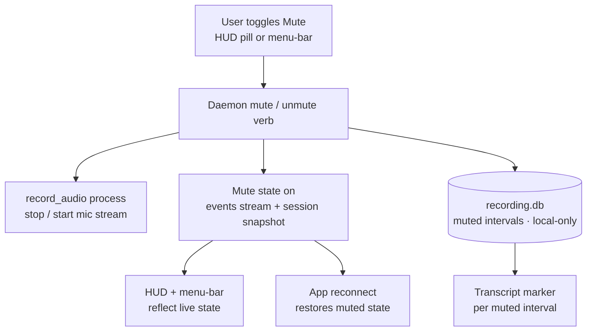

# Mid-Recording Microphone Mute - Plan

## Goal Capsule

- **Objective:** Make the recording HUD's Mute control functional — toggle microphone capture live during a recording, with reconnect-durable state and a sane transcript representation of muted spans.
- **Product authority:** Rute Figueiredo — Linear [SCR-218](https://linear.app/zk-email/issue/SCR-218/mid-recording-microphone-muteunmute).
- **Product Contract preservation:** Requirements R1–R10 preserved verbatim; only the requirements-only Outstanding Questions were resolved into the Planning Contract below.
- **Execution profile:** cross-stack (Python engine + daemon + transcription, Swift app) — 9 units in 4 phases. The embedded daemon must be rebuilt (PyInstaller) for the app to exercise the new verb.
- **Open blockers:** No unresolved product decisions. Depends on the Screencap Prototype UI landing (the HUD + `RecorderController.audioEnabled` that the Mute control binds to).

---

## Product Contract

### Summary

Make the recording HUD's Mute control functional so an operator can toggle microphone capture live during a recording. Muting *truly stops* capture — no audio lands on disk for the muted span — and unmuting can even turn the mic on for a recording that started without it. Mute state rides the daemon events stream so it survives reconnects, and each muted span shows as an explicit marker in the transcript.

### Problem Frame

The redesigned macOS app ships the recording HUD with a "Mute" control rendered but disabled, tagged SCR-218 (`macos/ScreenCap/Views/Record/RecordingHUDPanel.swift:80`, bound to a read-only `RecorderController.audioEnabled`). Audio capture is fixed at recording start: `RECORD_AUDIO` is resolved once from `audio_default` (or the `--no-audio` flag) and the `record_audio` process is spawned only when it's on. There is no live control channel to the engine's audio capture and no daemon verb to toggle it mid-recording.

So an operator who needs a moment of privacy partway through — a phone call, a hallway conversation, saying something they don't want captured — has only one lever: stop the whole recording and start over. For a tool whose identity is capture-time privacy, the absence of a live mic control is a conspicuous gap the disabled HUD stub already advertises.

### Key Decisions

- **Stop-capture, not record-then-redact.** Muting pauses the mic stream so nothing is captured or written for the muted span — the strongest privacy posture and consistent with the app's capture-time-blocking philosophy. Trade-off: the muted audio is gone for good; there is no recovering it later.
- **Symmetric toggle.** Unmute can turn the mic *on*, including for a recording that started with audio off. This is more useful than a one-way pause, at the cost of handling live stream *start* (not just resume) and a possible mid-recording permission prompt.
- **Explicit marker backed by a persisted interval record.** Muted spans are recorded as durable metadata and shown as an explicit marker in the transcript/timeline, so a reader can tell an intentional mute from ordinary silence. The interval record lives in the local-only `recording.db` (never uploaded); the marker itself is non-sensitive.
- **Unmute permission handling: prompt-if-possible, else inline error, never silent.** If macOS mic permission is undetermined, unmute triggers the standard prompt; if it's denied, unmute shows an inline HUD error and stays muted. Matches the app's existing inline pre-spawn-permission-error pattern.
- **Control surface = HUD pill + menu-bar item.** Mute is reachable from both the HUD control and a menu-bar "Mute mic" item, because the operator is rarely looking at the bottom-center pill mid-recording. A global keyboard shortcut is deferred to keep v1 bounded.

Mute state is single-sourced from the daemon and fans out to every surface that must stay in sync:



### Requirements

**Mute behavior**

- R1. During a recording with audio enabled, toggling Mute stops microphone capture live — no audio is captured or written to disk for the muted interval. Toggling again resumes capture.
- R2. Mute/unmute is symmetric: unmuting a recording that started with audio off starts microphone capture live for the remainder (until it is muted again).
- R3. When unmute needs microphone access the recording never obtained, macOS-undetermined permission triggers the standard mic-permission prompt, and denied permission surfaces an inline HUD error while staying muted. Unmute never silently fails.

**Control surface and live state**

- R4. The HUD pill Mute control is functional (the SCR-218 stub becomes a working toggle).
- R5. A menu-bar "Mute mic" item toggles mute, alongside the existing menu-bar Stop item.
- R6. Current mute state is published on the daemon events stream and included in the session snapshot, so the UI restores correct mute state after an app reconnect.
- R7. The HUD and menu-bar both reflect the live mute state derived from the daemon — they are views of one shared state, not independent local toggles.

**Transcription and data record**

- R8. Muted intervals are recorded as durable metadata in the local-only `recording.db`, which is never uploaded.
- R9. The transcript and replay timeline show an explicit marker for each muted interval, distinguishing an intentional mute from silence.
- R10. Muted intervals produce no transcript segments and no hallucinated ("phantom") audio text.

### Key Flows

- F1. Mute during an audio-on recording
  - **Trigger:** Operator toggles Mute (HUD or menu-bar) while the mic is capturing.
  - **Steps:** Daemon receives the mute verb; the `record_audio` stream stops; mute state is published to the events stream + snapshot; the muted-interval start is recorded.
  - **Outcome:** No audio is written for the interval; both surfaces show "Muted".
  - **Covered by:** R1, R6, R7, R8.
- F2. Unmute resumes an audio-on recording
  - **Trigger:** Operator toggles Mute off; mic permission is already granted.
  - **Steps:** Daemon resumes the stream; the muted-interval end is recorded; state republished.
  - **Outcome:** Capture resumes; surfaces show "Mute"; the closed interval is available for the transcript marker.
  - **Covered by:** R1, R6, R9.
- F3. Unmute a recording that started with audio off
  - **Trigger:** Operator unmutes a `--no-audio` recording.
  - **Steps:** Daemon attempts to start capture; if permission is undetermined, the OS prompt appears; if denied, an inline HUD error shows and state stays muted; if granted, capture starts.
  - **Outcome:** Either capture begins, or the recording stays muted with a clear reason — never a silent no-op.
  - **Covered by:** R2, R3.
- F4. Reconnect during a muted recording
  - **Trigger:** The app disconnects and re-subscribes (`since=cursor`) while a recording is muted.
  - **Steps:** The session snapshot carries the current mute state; the UI rehydrates from it.
  - **Outcome:** HUD and menu-bar show "Muted" without the user re-toggling.
  - **Covered by:** R6, R7.

### Acceptance Examples

- AE1. Muted span in the transcript
  - **Given** a recording where the operator muted from 0:30 to 0:45, still speaking a word or two as they pressed Mute,
  - **When** the transcript for that chunk is produced,
  - **Then** there are no speech segments across 0:30–0:45 — including the words spoken in the stop-latency window, which are dropped, not annotated — an explicit `[microphone muted]` marker spans that range, post-mute speech is time-aligned (not shifted under the marker), and no phantom text appears.
  - **Covers R1, R9, R10.**
- AE2. Unmute with permission not yet asked
  - **Given** a `--no-audio` recording and macOS mic permission undetermined,
  - **When** the operator unmutes,
  - **Then** the standard permission prompt appears; on grant, capture starts and the surfaces show "Mute".
  - **Covers R2, R3.**
- AE3. Unmute with permission denied
  - **Given** a recording whose mic permission is denied,
  - **When** the operator unmutes,
  - **Then** an inline HUD error names the missing permission and the recording stays muted (no silent failure).
  - **Covers R3.**
- AE4. Reconnect preserves muted state
  - **Given** a muted recording and the app losing then restoring its events subscription,
  - **When** the app re-snapshots,
  - **Then** the HUD and menu-bar show "Muted" without a re-toggle.
  - **Covers R6, R7.**

### Scope Boundaries

**Deferred for later**

- Global mute keyboard shortcut (a clean fast-follow on top of the HUD + menu-bar surface).
- Automatic mute on private-window detection — tracked separately as SCR-224.

**Outside this feature**

- Muting system / output audio — ScreenCap captures only the microphone, so there is nothing else to mute regardless of the "Mute" label.
- Muting or pausing screen / video capture — this feature is microphone-only.
- Recovering audio for an already-muted interval — impossible by the stop-capture design.

### Dependencies / Assumptions

- **Depends on** the Screencap Prototype UI plan (`docs/plans/2026-07-03-001-feat-screencap-prototype-ui-plan.md`) shipping the recording HUD with the SCR-218 Mute stub and `RecorderController.audioEnabled`.
- **Depends on** an early spike (Risk R-B) resolving whether the daemon's engine process holds its own microphone TCC grant, since R2's unmute-starts-audio needs it and `permission.request` cannot supply a mic grant today.
- **Assumes** the mute-state field can be added additively to the events stream and session snapshot (rebuilt today from pidfile lock metadata, which carries no mute field) without breaking existing subscribers.

(Planning resolved two earlier open assumptions: `record_audio` is always spawned but acquires the mic lazily on first unmute (KTD2), and the daemon reaches the engine over a new `stdin` NDJSON channel rather than the 30 s `audio_rotate_q` (KTD1).)

### Outstanding Questions

Planning resolved the items the requirements-only draft deferred:

- Mid-chunk mute alignment → the transcript marker is placed from the authoritative recording-relative `muted_intervals` times, not from FLAC sample offsets (see KTD3, U6, Risk R-A).
- Audio-process lifecycle → always spawn `record_audio` idle, even for `--no-audio` recordings (see KTD2, U2).
- Events shape + snapshot field → `audio_muted`/`audio_unmuted` engine events plus a `muted` field on the session snapshot (see KTD4, U5).
- Marker survives scrub → confirmed; `[microphone muted]` carries no PII and is cloud-bound, while the interval record stays local-only in `recording.db` (see U6).

**Resolve before / during implementation:**

- Cloud disclosure of mute *timing*: the `[microphone muted]` marker is cloud-bound (the interval record stays local), so a cloud recording's transcript reveals *when* and *for how long* the user sought privacy. The brainstorm chose an explicit marker; confirm exporting mute timing to the cloud is acceptable, or make the marker local-only like the interval record.
- The embedded daemon's own microphone grant (Risk R-B): a likely-required dependency of R2 that `permission.request` cannot currently satisfy — resolved by an early spike before U9; if the daemon needs a new grant mechanism, scope grows.

### Sources / Research

- Audio capture: `record_audio` runs as a `multiprocessing.Process` (`src/screencap/engine/recorder.py:3874`) using `sounddevice.InputStream` at 16 kHz mono (`recorder.py:2705`, `2829`), streaming FLAC. Spawn gated by `if config.RECORD_AUDIO:` (`recorder.py:3873`); `--no-audio` → `audio=False` (`src/screencap/cli/__init__.py:475`) → `RECORD_AUDIO=False`.
- Only live-control channel into the audio process: `audio_rotate_q`/`audio_ack_q` queues (`recorder.py:4529`), carrying only `chunk_rotated`/`final_chunk` today (`recorder.py:2781`).
- Transcription: per-chunk in `src/screencap/pipeline_stages.py:171`; empty-audio chunk already yields a `None` transcript (`pipeline_stages.py:82`). Transcript artifacts are `.txt` + `.json` with `{text, segments:[{start,end,text}]}` (`src/screencap/transcription.py:199`).
- Daemon verbs: `POST /v0/recording.start|stop` (`src/screencap/daemon/app.py:2497`); `recording.start` echoes effective `audio` (`app.py:668`). Events: cursor-replay ndjson stream over a bounded `EventBus` ring (`app.py:881`, `src/screencap/daemon/event_bus.py`); reconnect state rebuilt from `session_snapshot` derived from pidfile lock metadata (`app.py:459`), with no mute field today.
- HUD: disabled Mute stub tagged SCR-218 (`macos/ScreenCap/Views/Record/RecordingHUDPanel.swift:80`), next to the Draw stub SCR-217, bound to `RecorderController.audioEnabled` (`macos/ScreenCap/Controllers/RecorderController.swift:179`); no toggle method exists. Menu-bar Stop item at `macos/ScreenCap/Views/MenuBarMenu.swift:33`.
- `recording.db` is local-only by rule — excluded from upload (`src/screencap/upload.py:285`), per the R8 invariant.

---

## Planning Contract

### Key Technical Decisions

- KTD1. **Daemon→engine control channel: repurpose the engine's `stdin` as an NDJSON command channel.** No reusable daemon→running-engine channel exists today — the daemon can only SIGTERM the engine, and the `_override_q`/`_disable_q` privacy queues are inert in daemon mode (they belong to the standalone menubar-child topology, killed by `MenubarNoop`). The engine's `stdin` is currently `DEVNULL` and unread; making it a line-delimited JSON command reader is the exact mirror of the existing stderr-events-up channel. Chosen over `SIGUSR1`/`SIGUSR2` primarily because a structured payload is cleaner than encoding mute/unmute across signals, with future reuse (SCR-224 auto-pause, live-exclude) a modest bonus rather than the load-bearing reason — mute alone justifies the channel. It does **not** widen the trust boundary: the write end is a private FD held only by the supervisor, writes are serialized under the operation lock, and the only externally reachable entry point stays the same-EUID daemon socket.

- KTD2. **Fast engine-side audio control; always-spawn the audio process, acquire the mic lazily.** Mute stops the `sounddevice.InputStream` and unmute starts it, on the same stream object (supported). The stream handle lives on `record_audio`'s main thread (today blocked on `terminate_processing.wait()`), so that thread — not the 30-second flush/rotation thread — services mute via a short-poll control primitive, giving sub-second latency once the device is open. `record_audio` is spawned for every recording (which replaces the 60 s-per-chunk `_wait_for_audio` stall that occurs today with chunking on + audio off), but a recording that started audio-off acquires **nothing** until first unmute: the `InputStream` is *constructed lazily*, not merely left stopped — constructing it calls `Pa_OpenStream`, which opens the CoreAudio device and evaluates mic TCC (it does not defer to `.start()`), so an eager construct would light the mic-in-use indicator or trip a prompt from the background daemon on a recording the user explicitly started `--no-audio`. The FLAC writer is likewise opened lazily on the first captured frame: opening it eagerly writes a header, producing a non-zero file — and `has_audio` (`catalog.py:650`) keys on file *existence*, so an eager writer flips `has_audio=true` and triggers transcription of empty audio even though the `st_size == 0` guard passes. Stream construction is wrapped so a denied device surfaces as an error (R3), never a crashed subprocess.

- KTD3. **Muted intervals: a local-only `recording.db` table; overlapping speech dropped and time base restored at transcribe time.** Each muted span is a recording-relative `(start_ts, end_ts)` row, modeled on `blocked_intervals` and `WindowGeometryCaptureFailure` (durable immediate-commit; local-only by R8, inherited automatically); the row **opens at command-receipt** (before the stream actually stops) so it over-covers the stop latency. At transcribe time a scrub-time-style span reader reads intervals overlapping each chunk and does two things: (a) it **drops** every whisper segment overlapping a muted interval — the ~100 ms stop latency and any speech mid-word at mute time is *real* audio, so annotating alone would ship spoken words inside a span the user muted (R10, AE1); (b) it inserts a `[microphone muted]` marker over the span. Because a mid-chunk mute leaves a *shorter* FLAC, whisper's post-unmute segments are in compressed FLAC-relative time, so the step also **re-expands** each post-mute segment by the muted duration preceding it in the chunk, keeping the wall-clock marker and the speech on one time base. (Considered alternative: force a chunk rotation on each toggle so no chunk holds a gap — rejected because chunk rotation is video-clock-driven and audio-only rotation would desync audio/video chunk boundaries.)

- KTD4. **State propagation is confirmed-state, not requested-state, emitted by the process that owns the stream.** The `record_audio` subprocess owns the `InputStream`, so it is the process that emits `audio_muted`/`audio_unmuted` — *after* `stream.stop()`/`start()` actually succeeds — on its inherited stderr, which the supervisor's stderr pump already drains. (If `record_audio`'s stderr proves not to reach the pump under spawn, it acks completion to the engine main process, which emits; the requirement is that the event reflects the real toggle, never command-forward.) The pump both republishes the event to the EventBus and writes `muted` into session state — it is the **sole** writer; the mute verb never writes session state optimistically. So the app's displayed `muted`, the events stream, and the snapshot all reflect capture that genuinely stopped, never a request that might have failed. Reconnect is restored from snapshot + event replay (capturing the bus cursor before the change, per the late-listener-replay learning). The `muted` field is additive: a stale daemon omits it and the app treats missing as unmuted, mirroring the `audio`-echo rule. (A full daemon restart mid-recording *ends* the recording — `_reconcile` terminates the orphaned engine rather than re-adopting it — so mute-state durability across restart is moot; the always-spawn audio subprocess must tear down cleanly on that path.)

- KTD5. **Microphone permission is two-grant: the app AND the daemon's engine both need it.** The app checks its own mic TCC non-prompting (`AVCaptureDevice.authorizationStatus`) before an unmute that would start capture; undetermined → prompt, denied → error and stay muted, never silent. But macOS TCC keys on the responsible code-signing identity, and the PyInstaller-built embedded daemon is a *separate* signed binary — so the app's grant almost certainly does **not** cover the daemon's engine process. For R2 (unmute a recording that started audio-off), the daemon engine must hold its own grant, which app-side prompting cannot supply — and the existing `permission.request` verb cannot supply it either (its allowlist is screen-recording/accessibility/input-monitoring only; a `microphone` request returns `invalid_permission`). So a daemon mic-grant path is **new scope**, treated as a likely-required dependency of R2 and settled by an early spike before U9 (Risk R-B). For an audio-on recording the daemon engine already holds the grant, so mute→unmute needs no new permission.

### High-Level Technical Design

The novel shape is the control round-trip across four processes and the state path back. Mute stops capture at the engine; state flows back over the existing events channel.

```mermaid
sequenceDiagram
  participant UI as HUD / Menu-bar
  participant RC as RecorderController
  participant D as Daemon (Supervisor)
  participant E as Engine (control reader)
  participant A as record_audio proc
  participant DB as recording.db (local-only)
  UI->>RC: toggleMute() (muteInFlight)
  RC->>D: POST /v0/recording.mute {muted}
  D->>E: stdin NDJSON {type: set_muted, muted}
  E->>DB: open muted_interval (at command receipt)
  E->>A: audio-control (stop / start stream)
  A-->>D: stderr event audio_muted / audio_unmuted (after real stop)
  D-->>RC: events stream + snapshot.muted (confirmed)
  RC-->>UI: reflect confirmed muted state
  Note over E,A: mute = stream.stop() — no audio captured; event fires only after the real stop
  Note over DB: read at transcribe time → drop overlapping speech + [microphone muted] marker
```

### Assumptions

- The Screencap Prototype UI has landed the recording HUD (`RecordingHUDPanel`) and `RecorderController` with the SCR-218 Mute stub bound to `audioEnabled`.
- The app's primary transport is the direct daemon socket (`DaemonClient`); the CLI-fallback transport has no live-toggle path, so mute is daemon-only (the HUD/menu controls guard on it).
- Repurposing `stdin` (DEVNULL → PIPE) does not disturb the supervisor's crash/exit handling, given broken-pipe tolerance and a reader thread independent of teardown (validated in U1).

### Risks & Dependencies

- Risk R-A — **Mid-chunk time-base skew (not marker placement).** A mid-chunk mute leaves a shorter FLAC, so whisper's *post-unmute speech segments* are in compressed FLAC-relative time while the marker is wall-clock — unhandled, the marker overlaps real post-unmute speech, breaking AE1. Mitigation: U6 re-expands each post-mute segment by the muted duration preceding it in the chunk, restoring one time base; a mid-chunk test pins it. (Impact is low for today's chunk-granular transcript retrieval, but any future per-segment wall-clock consumer would be off without this.)
- Risk R-B — **Daemon-engine mic grant is likely required and is new scope.** macOS TCC keys on code-signing identity, so the separately-signed daemon binary needs its own mic grant; R2's unmute-starts-audio likely cannot work on the app grant alone, and `permission.request` cannot supply a mic grant today (allowlist excludes `microphone`). A user who has only ever recorded `--no-audio` may never have established the daemon's mic grant, so the first unmute could fail at `stream.start()`. Mitigation: an **early spike (before U9)** verifies whether the daemon inherits or needs its own grant and, if separate, scopes the acquisition path (extend the permission allowlist with an `AVCaptureDevice` branch, or a dedicated verb). This is the plan's most likely scope-expansion vector.
- Risk R-C — **Repurposing engine stdin.** DEVNULL → PIPE must not regress spawn, teardown, or crash-safety. Mitigation: broken-pipe tolerance on both ends; the reader is a daemon thread that never blocks teardown (U1).
- Risk R-D — **Control latency.** A privacy control that lags is a trust problem. Mitigation: the engine-side poll is sub-second (KTD2); a latency assertion covers it (U2).
- Risk R-E — **Rotate-while-muted.** A chunk rotation firing while muted (the 30 s flush thread) must still emit a valid empty/absent FLAC and the correct ack, or the pipeline stalls on `_wait_for_audio`. Mitigation: U2/U3 test a rotation during a muted span.
- Dependency — the embedded daemon must be rebuilt (PyInstaller) and shipped for the app to reach the new verb; the change lands on both the CLI and app release tracks.

### System-Wide Impact

- **Engine:** a new inbound IPC channel and an audio-process lifecycle change that affects *every* recording (always-spawn), not only muted ones.
- **Daemon:** one new verb plus additive `muted` on events and the snapshot — back-compatible with older clients.
- **Transcription:** a per-chunk marker-injection step; no change to the whisper backends.
- **macOS app:** three surfaces (HUD, menu-bar, inline permission error) over one shared `muted` state, plus the manual-QA runbook line.
- **Release:** app releases require the embedded-daemon rebuild; a stale daemon degrades safely (mute controls reflect audio-on / no `muted` field).

### Sequencing

Four phases, dependency-ordered. Phase 1 (engine) is the foundation; Phase 2 (daemon) exposes it; Phase 3 (transcription) consumes the persisted intervals; Phase 4 (app) is the user-facing surface.

- **Phase 1 — Engine capture control:** U1 → U2, U3.
- **Phase 2 — Daemon verb + state:** U4 → U5 (after U1, U2).
- **Phase 3 — Transcription:** U6 (after U3).
- **Phase 4 — macOS app:** an early **daemon mic-grant spike** (Risk R-B) → U7 → U8 → U9 (after U4, U5). Run the spike first: if the daemon needs its own grant path, that work sequences ahead of U9 and may enlarge scope.

---

## Implementation Units

### U1. Daemon→engine control channel

- **Goal:** Give the daemon a live command channel into the running engine by repurposing the engine's unused `stdin` as a line-delimited JSON reader, with a supervisor-side writer. Foundation for mute and future mid-recording controls.
- **Requirements:** advances R1, R2, R6 (delivery mechanism).
- **Dependencies:** none.
- **Files:** `src/screencap/daemon/supervisor.py` (Popen `stdin=PIPE`; a guarded `send_command()` writer), `src/screencap/cli/__init__.py` (`_engine_worker_cmd` starts the reader thread), `src/screencap/session.py` (wire the reader into `run_recording_worker`), new `src/screencap/engine/control_channel.py` (stdin NDJSON reader + `type`-dispatched handler registry), tests `tests/daemon/test_supervisor_send_command.py`, `tests/test_engine_control_channel.py`.
- **Approach:** Change `_PopenEngineProcess` stdin from `DEVNULL` to a pipe; add `Supervisor.send_command(dict)` writing one JSON line under the operation lock, tolerant of a dead engine (broken pipe → clean no-op). In the engine worker, run a daemon-thread reader over `sys.stdin` that parses one command per line and dispatches by `type` to registered handlers. Ownership is canonical: `control_channel.py` owns **only** the reader and the `type`-dispatch registry; the `set_muted` handler itself is registered by the audio subsystem and lives in `recorder.py` (U2). Keep the channel generic so SCR-224 can reuse it.
- **Patterns to follow:** the stderr-events-up channel (`src/screencap/_stderr_events.py` `emit_event`) is the mirror; `supervisor.py:1049` `_stderr_pump` is the per-line reader to mirror on the write side.
- **Test scenarios:** a JSON command line on the engine's stdin is parsed and dispatched to a registered handler; a malformed/partial line is skipped without killing the reader; `send_command` on a terminated engine returns cleanly (no exception, no hang); stdin EOF stops the reader without affecting recording teardown; an unknown `type` is ignored.
- **Verification:** a round-trip test drives a command supervisor→engine and observes the handler firing; existing start/stop/teardown tests unaffected.
- **Execution note:** Start with a failing round-trip test (command in → handler fires) — this is a new IPC contract.

### U2. Live mic stream stop/start in record_audio

- **Goal:** Make the mic stream stoppable/startable within the running `record_audio` process on a mute/unmute command (sub-second), emit the confirmed toggle, and spawn the process for every recording while acquiring the mic only on first unmute.
- **Requirements:** R1, R2. Covers AE2.
- **Dependencies:** U1.
- **Files:** `src/screencap/engine/recorder.py` (`record_audio` main-thread restructure; audio-control primitive on the parent `Recorder`; unconditional spawn; lazy device/writer construction; `set_muted` handler + confirmed-toggle event emit), `src/screencap/engine/config.py` (decouple spawn from `RECORD_AUDIO`), tests `tests/test_record_audio_mute.py`.
- **Approach:** Add a `multiprocessing` audio-control primitive (control queue or Event pair) passed into `record_audio`. Restructure the main thread from `terminate_processing.wait()` into a short-timeout poll loop (~100 ms) that toggles the stream; the flush/rotation thread is untouched, sharing the stream via a mutable container the way `sf_writer_ref` shares the FLAC writer. **Acquire the mic lazily:** for an audio-off recording, do *not* construct the `InputStream` at process start — construction calls `Pa_OpenStream`, which opens the CoreAudio device and evaluates mic TCC; construct it (wrapped so a denied device errors rather than crashes the subprocess) only on first unmute. Open the FLAC writer lazily on first captured frame too, so `has_audio` (existence-based, `catalog.py:650`) stays false for a never-unmuted recording. Emit `audio_muted`/`audio_unmuted` on this process's stderr **immediately after** `stop()`/`start()` actually succeeds (KTD4), so state reflects the real toggle. Always-spawning `record_audio` also replaces the 60 s-per-chunk `_wait_for_audio` timeout that occurs today with chunking on + audio off.
- **Patterns to follow:** `_rotate_audio` (`recorder.py:2735`) toggles the writer via `sf_writer_ref` — mirror for the stream handle; the `has_audio` derivation (`catalog.py:650`) and 0-byte guards (`chunk_processor.py:868`, `recorder.py:2906`) must treat a header-only / frames==0 FLAC as empty; `emit_event` (`_stderr_events.py`) for the toggle event.
- **Test scenarios:** mute stops the stream (no frames captured) within the poll interval and emits `audio_muted` only after the real stop; unmute resumes capture; an audio-off recording never unmuted acquires **no** mic device (no mic-in-use indicator) and yields `has_audio=false` with no transcribable FLAC; unmute on an audio-off recording constructs the stream and captures from that point (Covers AE2); a denied device on unmute errors cleanly without crashing the subprocess (Covers R3); a chunk rotation firing while muted still emits a valid empty FLAC + correct ack (Risk R-E); `_wait_for_audio` receives real acks; mute latency is sub-second (Risk R-D).
- **Verification:** audio unit tests pass; a capture run confirms muted spans hold no audio, unmuted spans do, and an audio-off never-unmuted recording never lights the mic indicator.
- **Execution note:** Add characterization coverage of current chunk-rotation behavior before restructuring the main thread; verify empirically whether `InputStream` construction opens the CoreAudio device (drives the lazy-construction requirement).

### U3. Muted-interval persistence

- **Goal:** Durably record each muted span (recording-relative start/end) in the local-only `recording.db`, opened on mute and closed on unmute.
- **Requirements:** R8. Backs R9, R6.
- **Dependencies:** U1.
- **Files:** `src/screencap/engine/db/models.py` (new `MutedInterval` model) or a raw-sqlite DDL alongside the ledger; `src/screencap/engine/db/crud.py` (`open_muted_interval` / `close_muted_interval`, immediate-commit); the `set_muted` handler (U2) calls these; tests `tests/test_muted_intervals_db.py`.
- **Approach:** Model on `WindowGeometryCaptureFailure` (recording_id FK, timestamp, local-only R8) or the raw `pipeline_task_segments` interval shape (`start_ts REAL, end_ts REAL`). On mute: insert `(start_ts = utils.get_timestamp(), end_ts = NULL)`. On unmute (and on teardown while muted): set `end_ts`. Use the durable immediate-commit write (`insert_window_geometry_capture_failure` pattern) so a crash mid-mute leaves an open interval that downstream treats as muted-to-chunk-end. The table lives in `recording.db` → inherits R8 exclusion automatically.
- **Patterns to follow:** `blocked_intervals` (`recorder.py:700`, `chunk_processor.py:101`) as the structural analog; `WindowGeometryCaptureFailure` (`models.py:388`) for the durable local-only row; the ledger's `busy_timeout=10000` + `BEGIN IMMEDIATE` discipline (`pipeline_state.py:336`).
- **Test scenarios:** mute inserts an open interval (end NULL); unmute closes it with end ≥ start; teardown while muted closes the open interval; the table is excluded from upload (`assert_uploadable` rejects / `list_recording_files` skips) — Covers R8; a live-recording write uses immediate-commit without a torn row.
- **Verification:** DB tests pass; `upload.assert_uploadable` still rejects `recording.db` including the new table.

### U4. `recording.mute` daemon verb

- **Goal:** A verb that forwards a mute/unmute request to the running engine over U1's channel and returns the pre-change event cursor; it does **not** set mute state itself (the engine's confirmed event does, per KTD4).
- **Requirements:** R6; advances R1, R2.
- **Dependencies:** U1, U2.
- **Files:** `src/screencap/daemon/app.py` (route + `recording_mute` handler with audit), `src/screencap/daemon/schema.py` (`RecordingMuteRequest{muted: bool}` / `RecordingMuteResponse{muted, cursor}` + API-version constant), `src/screencap/daemon/supervisor.py` (`set_muted()` → `send_command` only), `src/screencap/cli/_daemon_client.py` (`.mute(muted=...)` for CLI/tests), tests `tests/daemon/test_recording_mute_verb.py`.
- **Approach:** Mirror the `recording_stop` handler shape — peer descriptor, `_audit` on every exit path, typed-error-before-forward, `schema.envelope`. Validate `muted` bool; reject with a typed error when not recording. `set_muted()` forwards `{type: set_muted, muted}` down the control channel and does nothing else — it must **not** write `muted` into session state (that would report the request, not the confirmed stop; the stderr pump is the sole writer, KTD4/U5). Capture the event-bus cursor before forwarding (late-listener-replay learning) and return it so the app subscribes without missing the confirmation event. The response echoes the *requested* `muted` for transport bookkeeping only; the app must not treat the echo as confirmation (U7).
- **Patterns to follow:** `recording_stop` (`app.py:693`), `RecordingStopRequest` (`schema.py:289`), typed-error-before-spawn (daemon-start-failure learning), `schema.envelope` (`schema.py:70`).
- **Test scenarios:** `recording.mute {muted:true}` forwards the command and returns the pre-change cursor **without** mutating session state; the verb while not recording returns a typed, audited error; a malformed body → validation error; an audit record is emitted on both ok and error paths; session `muted` changes only after the engine event (asserted in U5).
- **Verification:** verb tests pass (run with `SCREENCAP_LOCAL_PAYWALL_ENFORCE=0` to avoid the known config-leak 402s).

### U5. Mute state on events stream + session snapshot

- **Goal:** Surface *confirmed* mute state so the app reflects it and restores it after a reconnect.
- **Requirements:** R6, R7. Covers AE4.
- **Dependencies:** U1, U2, U4.
- **Files:** `src/screencap/_stderr_events.py` (`EVENT_AUDIO_MUTED` / `EVENT_AUDIO_UNMUTED`), `src/screencap/engine/recorder.py` (`record_audio` emits the event after the real toggle — U2), `src/screencap/daemon/supervisor.py` (`_stderr_pump` writes `muted` into session state on those events — the sole writer), `src/screencap/daemon/app.py` (`session_snapshot` overlay adds `muted` from `current_session()`), tests `tests/daemon/test_snapshot_muted_field.py`, `tests/test_engine_emits_mute_events.py`.
- **Approach:** `record_audio` (which owns the stream) emits `audio_muted`/`audio_unmuted` on its stderr after `stop()`/`start()` actually succeeds; the supervisor's `_stderr_pump` — already draining that fd — republishes to the EventBus and writes `muted` into session state (the only writer; the verb never writes it, U4). `session_snapshot`'s daemon-owned overlay (`app.py:515-520`) then reports confirmed state from `current_session()`. Additive + back-compatible: a stale daemon omits `muted`; the app treats missing as unmuted. (If `record_audio`'s stderr does not reach the pump under spawn, it acks the engine main process which emits — the requirement is confirmed-state emission, per KTD4.)
- **Patterns to follow:** `_stderr_pump` / `_publish_daemon_event` (`supervisor.py:1049`, `1323`); the `audio`-echo additive-field back-compat (`schema.py:283`, stale-daemon learning); snapshot overlay (`app.py:515`).
- **Test scenarios:** the engine emits `audio_muted` only after the stream actually stops (not on command receipt); the event reaches a subscriber via the bus; the stderr pump is the **only** writer of session `muted`; `session_snapshot` reports `muted:true` for a daemon-owned muted recording, false otherwise; a snapshot without the field decodes as unmuted; Covers AE4.
- **Verification:** event + snapshot tests pass.

### U6. Muted-interval transcript marker (drop overlapping speech, restore time base)

- **Goal:** For each chunk overlapping a muted span, drop the real speech captured in the stop-latency window, insert an explicit `[microphone muted]` marker, and keep the marker and post-mute speech on one time base.
- **Requirements:** R9, R10. Covers AE1.
- **Dependencies:** U3.
- **Files:** new span reader `list_muted_intervals_in_span(db, start_ts, end_ts)` (model on `src/screencap/redaction/geometry.py:293`), `src/screencap/pipeline_stages.py` (thread the chunk `start_ts/end_ts` into the transcribe step signature), `src/screencap/chunk_processor.py` (post-process the chunk segments), tests `tests/test_transcript_muted_marker.py`.
- **Approach:** Thread the chunk's recording-relative `start_ts/end_ts` (already in `run_chunk`) into the transcribe step. After whisper produces the chunk `segments`, read `muted_intervals` overlapping the chunk and: (a) **drop** every segment overlapping a muted interval — the ~100 ms stop latency (and any speech mid-word at mute time) is *real* audio, so annotating alone would leak spoken words into the muted span and, for cloud recordings, upload them (R10, AE1); (b) **re-expand** each surviving post-mute segment by the total muted duration preceding it in the chunk, because a mid-chunk mute leaves a shorter FLAC and whisper's offsets are compressed FLAC-relative — without this the wall-clock marker overlaps real post-unmute speech (Risk R-A); (c) insert `{start, end, text: "[microphone muted]"}` over the span (chunk-relative), mirroring it in the `.txt`. An interval still open at chunk end marks/drops to chunk end.
- **Patterns to follow:** `redaction/geometry.py:293` span reader (read-only `open_recording_db`, `has_table` guard, fail-safe empty); transcript JSON shape (`transcription.py:199`, `chunk_processor.py:1389`).
- **Test scenarios:** a chunk fully within a muted span yields only the marker and no speech segments (Covers R10); **a mute issued while speech is ongoing yields no residual speech segment inside the muted span** (Covers AE1, the async-leak case); a mid-chunk mute yields speech before/after with post-mute segments re-expanded so none overlaps the marker (Covers AE1, Risk R-A); no muted interval → transcript unchanged; the marker survives `scrub_text` unchanged (Covers R9); an open interval marks/drops to chunk end.
- **Verification:** transcription tests pass; a scrubbed cloud-bound transcript contains the marker and no speech within any muted span.

### U7. Swift mute client + controller state

- **Goal:** Wire the app to request mute/unmute and reflect *confirmed* mute state, with a pending in-flight state and non-terminal failure handling.
- **Requirements:** R6, R7.
- **Dependencies:** U4, U5.
- **Files:** `macos/ScreenCap/Controllers/DaemonClient.swift` (`recordingMute(muted:)` → `POST /v0/recording.mute`; `muted: Bool?` + CodingKey on `SessionSnapshotResponse`), `macos/ScreenCap/Controllers/DaemonSessionService.swift` (`setMuted(...)`; surface `muted` through event/snapshot callbacks), `macos/ScreenCap/Controllers/RecorderController.swift` (`@Published private(set) var muted`; a `muteInFlight` pending flag; `toggleMute()` guarded on `transport == .daemon`), tests `macos/ScreenCapTests/RecorderControllerDaemonTests.swift` (+ extend `CapturingDaemonSessionService`).
- **Approach:** Add the socket verb + request/response structs (mirror `recordingStart`) and `muted` on `SessionSnapshotResponse`. `toggleMute()` sets a `muteInFlight` pending flag and sends the request, but **does not** flip `muted` from the response echo — `muted` flips only when the confirmed `audio_muted`/`audio_unmuted` event (or a reconnect snapshot) arrives, so the UI never shows "Muted" before capture actually stops (KTD4). On a mute-verb failure, do **not** route through `handleDaemonOperationFailure` — that calls `transitionToIdle()` while recording and would tear down the whole recording; instead clear `muteInFlight`, leave `muted` at its prior confirmed value, and surface a non-terminal advisory via `captureAdvisory` so the user knows the mic state is unchanged and can retry. Reconnect: `consumeEventStream` re-snapshots on 410 — set `muted` from `snapshot.muted` there and from the events in `apply(...)`.
- **Patterns to follow:** `startViaDaemon` (`RecorderController.swift:527`) for the daemon-call shape; `captureAdvisory` (`RecorderController.swift:160`) for the non-terminal surface; `SessionSnapshotResponse` (`DaemonClient.swift:198`); the `CapturingDaemonSessionService` audio-echo tests (`RecorderControllerTests.swift:889`).
- **Test scenarios:** `toggleMute()` sets `muteInFlight` and sends the request but leaves `muted` unchanged until the confirming event arrives; the `audio_muted` event flips `muted` and clears `muteInFlight`; a snapshot with `muted:true` hydrates `muted` (Covers AE4); a snapshot without the field → `muted=false`; a mute-verb failure keeps the recording running (no `transitionToIdle`), reverts to the prior `muted`, and sets `captureAdvisory`; `toggleMute()` on CLI-fallback transport is blocked.
- **Verification:** RecorderController daemon tests pass, including the failure-does-not-stop-recording case.

### U8. HUD Mute control + menu-bar item

- **Goal:** Turn the disabled HUD Mute stub into a working toggle with a distinct muted affordance, add a consistent menu-bar item, and reflect the pending/confirmed states.
- **Requirements:** R4, R5, R7.
- **Dependencies:** U7.
- **Files:** `macos/ScreenCap/Views/Record/RecordingHUDPanel.swift` (functional Button; mute label/visual/a11y into `RecordingHUDModel`), `macos/ScreenCap/Views/MenuBarMenu.swift` (a state-reflecting Mute item in the `if case .recording` block), `macos/ScreenCap/Views/MenuBarMenuPolicy.swift` (label/visibility policy), `docs/runbooks/new-ui-manual-qa.md` (update the "Mute renders disabled" line), tests `macos/ScreenCapTests/MenuBarMenuPolicyTests.swift` (+ HUD model test).
- **Approach:** Mirror `stopButton`/`hideButton` for the HUD toggle. Give the muted state a **distinct visual**, not a label swap alone — a filled/colored pill plus a mic-slash SF Symbol — so a privacy toggle reads unambiguously as on/off; while `muteInFlight`, show a transitional affordance ("Muting…"/disabled) rather than an optimistic "Muted". Pick **one grammar** (status: "Mic on" / "Muted") and apply it to both the HUD and the menu-bar item, so "Muted" never reads ambiguously as "tap to mute". The menu-bar item mirrors the Stop item and calls the same `recorder.toggleMute()`. Update the QA runbook line that says Mute is a disabled stub.
- **Patterns to follow:** `stopButton` (`RecordingHUDPanel.swift:144`), `hideButton` (`:163`); menu Stop item + `showRecordingControlsVisible` policy (`MenuBarMenu.swift:33-41`); `MenuBarMenuPolicyTests`.
- **Test scenarios:** the HUD model exposes the correct status label + icon + a11y for muted / unmuted / in-flight; the HUD button invokes `toggleMute()`; the menu-bar item shows the same-grammar label per state and invokes `toggleMute()`; the item appears only while recording; the runbook no longer claims Mute is disabled. Covers R4, R5, R7.
- **Verification:** Swift view/policy tests pass; manual QA per the updated runbook.
- **Execution note:** Mostly view wiring over U7's state; prefer view-model/policy unit tests over full UI tests.

### U9. Unmute permission UX

- **Goal:** When unmute needs mic access the recording lacks, prompt if possible, else show a *visible* error and stay muted — never silent — and cover the daemon's own grant.
- **Requirements:** R3. Covers AE2, AE3.
- **Dependencies:** U7, U8; an **early spike** on the daemon mic grant (Risk R-B) precedes this unit.
- **Files:** `macos/ScreenCap/Controllers/RecorderController.swift` (unmute checks mic TCC before sending; typed reason on denial), `macos/ScreenCap/Controllers/RecorderAlertPresenter.swift` (modal path for the HUD-hidden case), `macos/ScreenCap/Views/RecorderErrorMessage.swift` (inline surface), tests `macos/ScreenCapTests/RecorderControllerTests.swift` (permission branches).
- **Approach:** On an unmute that would start capture, check `AVCaptureDevice.authorizationStatus(for: .audio)`. Undetermined → `requestAccess` (prompt); on grant, send the unmute; on denial → a typed reason, stay muted, don't send the verb. **Presentation must match where the user acted:** the inline `RecorderErrorMessage` is only visible when the HUD (or the menu dropdown) is open, but the menu-bar item exists precisely because the operator isn't looking at the pill — so when `hudHidden` or the action came from the menu bar, present the denial via `RecorderAlertPresenter` (modal) or auto-reveal the HUD, not inline only, else the denial is invisible and reads as the silent failure R3 forbids. **Daemon grant:** app-side TCC is necessary but likely not sufficient — the separately-signed daemon engine needs its own grant for R2, and `permission.request` cannot supply a mic grant today; the early spike (R-B) resolves the mechanism and this unit wires it if required.
- **Patterns to follow:** `newRecordingBlockReason()` typed reason (`RecorderController.swift:343`) + `InlineStartError` (`NewRecordingSheet.swift:344`); non-prompting `AVCaptureDevice.authorizationStatus` (`NewRecordingSheet.swift:249`); `RecorderAlertPresenter` (`presentPermissionRequired`) for the modal; `RecorderErrorMessage`.
- **Test scenarios:** unmute with authorized mic sends the verb (Covers AE2); unmute with undetermined status prompts, then sends on grant (Covers AE2); unmute with denied status stays muted and shows the error, and when `hudHidden` / menu-initiated it uses the modal / auto-reveal path so the denial is visible (Covers AE3, R3); unmute never silently no-ops; if the daemon lacks its own grant, R2's unmute reports the daemon-permission error rather than appearing to succeed.
- **Verification:** permission-branch tests pass; manual verification of the prompt, denied-inline, and denied-from-menu-bar-with-HUD-hidden paths.

---

## Verification Contract

| Gate | Command | Units | Done signal |
|---|---|---|---|
| Python unit tests (engine, daemon, transcription, persistence) | `PYTHONPATH=src pytest tests/` | U1–U6 | new tests green; start/stop/teardown/verb tests unaffected |
| Privacy lane (CI) | `pytest -m privacy` | U1–U6 | green on CI; new privacy-bearing tests marked `@pytest.mark.privacy` and Vision-free |
| Daemon verb tests (no paywall leak) | `SCREENCAP_LOCAL_PAYWALL_ENFORCE=0 PYTHONPATH=src pytest tests/daemon/` | U4, U5 | green (avoids the known config-leak 402s) |
| Upload exclusion | `PYTHONPATH=src pytest tests/ -k uploadable` | U3 | `recording.db` (incl. `muted_intervals`) never uploaded |
| No-leak transcript test | `PYTHONPATH=src pytest tests/ -k muted_marker` | U2, U6 | mute-during-speech leaves no residual speech segment in a muted span; post-mute speech stays time-aligned |
| Swift app tests | `xcodebuild test` — run OUTSIDE this worktree (running xcodebuild in a `~/Documents` worktree TCC-bricks the session) or on the app build track | U7–U9 | `RecorderController` + `MenuBarMenuPolicy` + HUD-model tests green, incl. failure-does-not-stop-recording |
| Manual capture QA | record → mute/unmute from HUD and menu-bar → inspect audio files + transcript | U2, U3, U6, U8 | muted spans hold no audio and no residual speech in the transcript; the pill shows "Muted" only after capture stops; an audio-off recording never lights the mic indicator; both controls reflect state |

---

## Definition of Done

- All requirements R1–R10 satisfied and traced to units.
- Mute/unmute works live from both the HUD and the menu-bar; muted spans contain no audio on disk (KTD1–KTD2).
- Mute state and the transcript marker are gated on the engine's *confirmed* stop; no speech from the stop-latency window survives in a muted span, and the UI never shows "Muted" before capture stops (R10, AE1, KTD4).
- A mute-verb failure never ends the recording; an audio-off recording never opens the mic device until first unmute (U2, U7).
- Unmute can start the mic on a `--no-audio` recording; when permission is missing it prompts or shows a *visible* error (even from the menu bar with the HUD hidden) and stays muted — never silent (R3, U9).
- Mute state survives an app reconnect via snapshot + events; a stale daemon degrades to audio-on safely (R6, R7, U5, U7).
- The transcript shows `[microphone muted]` markers with no phantom text and no leaked speech; the marker is cloud-bound while the `muted_intervals` record stays local-only (R8, R9, R10, U3, U6).
- The manual-QA runbook no longer describes Mute as a disabled stub.
- All Verification Contract gates green; the embedded daemon is rebuilt so the app exercises the new verb.
- Risk R-B (daemon-engine mic grant) is resolved by the early spike, or explicitly documented as a follow-up, before the feature is called shippable.
