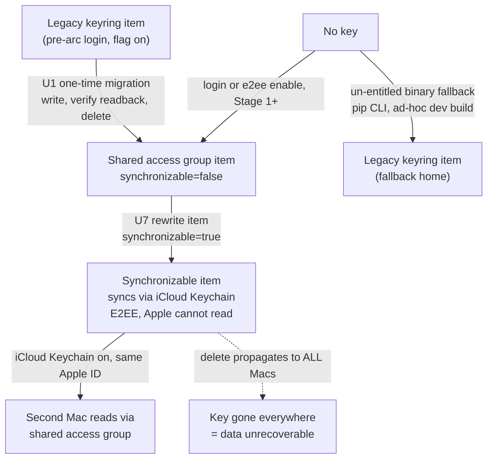
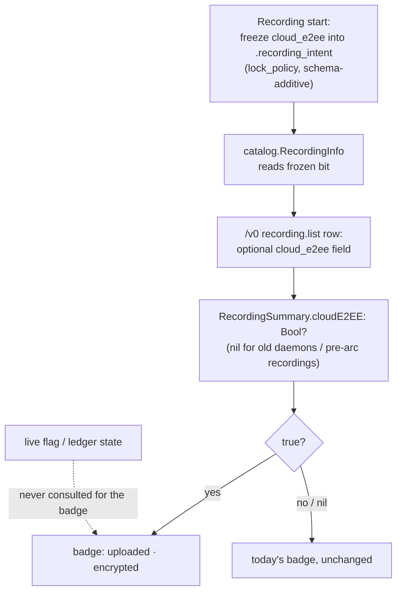

# E2EE for Shared Copies (SCR-220 Arc) - Plan

## Goal Capsule

- **Objective:** Take the already-built, dark encrypt-before-upload path (`cloud_e2ee_enabled`, default off) to a truthful, default-on E2EE claim in three stages: an opt-in "Encrypt shared copies (beta)" toggle with honest per-recording badges (U1–U6), same-user multi-device key access via iCloud Keychain sync (U7–U8), then the default flip with the full UI claim unlocked (U9–U10).
- **Product authority:** This document's Product Contract. `SECURITY.md` is the source of truth for threat-model and trust-claim wording. Linear SCR-220 tracks the work; the Screencap Prototype design (`docs/design/screencap-prototype/`) is the UI reference, with its "team" wording softened per KD3.
- **Execution profile:** Units in stage order; Stage 1 (U1–U6) is one shippable slice, Stage 2 (U7–U8) a second, Stage 3 (U9–U10) executes only after the KTD-7 graduation criterion is met — the plan deliberately spans calendar time. Security-critical crypto and keychain changes land test-first. New Python tests carry `@pytest.mark.privacy` and stay Vision-free (CI runs only that lane). Swift tests are not run by CI — run them locally, and run `xcodebuild` outside a `~/Documents` worktree or last (TCC session-brick risk, see `docs/solutions/build-errors/macos-ad-hoc-signing-tcc-rebuild-treadmill.md`).
- **Stop conditions:** Stop and surface if the daemon (PyInstaller helper binary) cannot read a `kSecAttrSynchronizable=true` item through the existing shared-access-group entitlement path (breaks KTD-5); if KEK migration cannot be made write-verify-then-delete safe (risking key loss = data loss); or if the Swift app turns out to need direct KEK reads (creates an app-provisioning-profile release dependency this plan assumes away — see Assumptions).
- **Open blockers:** None for Stage 1. Stage 3 is gated by KTD-7, not by unknowns. Key recovery is SCR-252; the corpus-lane consent UX is a follow-up outside this plan.

---

## Product Contract

**Product Contract preservation:** preserved. No R-ID changes. The three Outstanding Questions (all deferred-to-planning) are resolved in place: the Stage 2 mechanism → KTD-5, the graduation soak window → KTD-7, badge/settings vocabulary → U4/U5/U10 copy decisions bounded by R3/R5/R10.

### Summary

E2EE for shared cloud copies ships as a staged arc: users opt in to client-side encryption via a real Privacy-settings toggle and get truthful "encrypted" badges immediately; multi-device key access lands during the opt-in soak; then encryption becomes the default and the design's E2EE claims unlock, scoped to personal (not team) wording. Server-readable uploads survive only as a future explicit opt-in corpus lane.

### Problem Frame

The encryption machinery exists and is tested — framed AES-256-GCM in `src/screencap/cloud_crypto.py`, fail-closed encrypt seams in `src/screencap/upload.py` and `src/screencap/chunk_processor.py`, magic-detect decryption in `src/screencap/download.py` — but it ships dark behind a default-off flag, so every E2EE claim in the prototype design is held hostage by the honesty gates (`macos/ScreenCapTests/OnboardingStepPolicyTests.swift`, `macos/ScreenCapTests/PrivacySettingsPolicyTests.swift`): the Privacy settings row is a "planned / Not available yet" stub and Library badges are forbidden from saying "encrypted". Behind the dark flag sits an unresolved strategy fork: the cloud was deliberately built server-readable so scrubbed recordings could feed a computer-use training corpus, and the 2026-05-29 isolation brainstorm rejected client-side encryption for exactly that reason. Meanwhile the product has paying personal-cloud users, no key recovery, and no way for a second Mac to decrypt — so flipping the flag on as a silent default today would convert every dead MacBook into unrecoverable customer data.

### Key Decisions

- **KD1. E2EE is the default; the training corpus survives only as an explicit opt-in server-readable lane.** This resolves the E2EE-vs-training fork left open by the per-user isolation brainstorm and the SCR-237 billing plan. The default privacy claim stays absolute ("we cannot read your recordings"); training data comes only from users who separately and explicitly consent to a server-readable lane. This arc preserves that lane structurally (R12) but does not build its consent UX.
- **KD2. Opt-in beta before default-on.** With no key recovery, undecryptable-by-anyone storage must not become anyone's silent default. The beta toggle puts the dead-Mac risk only on users who explicitly chose it, soaks the crypto path in the real world, and still unlocks truthful "encrypted" badges immediately for those users.
- **KD3. Decrypt scope is same user, multi-device; teams are deferred.** The design's "keys stay with your team" copy is permanently softened to personal wording in this arc — team keys, enrollment, and rotation belong to SCR-221/SCR-229 territory. The claim that ships is about the user's own devices.
- **KD4. No key recovery in this arc.** Losing all enrolled devices means the encrypted cloud copies are permanently unreadable; the UI and SECURITY.md say so plainly. Recovery is tracked as SCR-252.
- **KD5. Encrypted recordings are viewable only in the macOS app.** The website's direct-from-GCS player and the Eventarc `process-recording` enrichment service (`scripts/process-recording/main.py`) read plaintext by construction; under E2EE they apply only to the server-readable corpus lane. Their behavior for encrypted objects is a documented no-op — this is the resolution of the SCR-238 prerequisite, not an accident.
- **KD6. No plaintext-estate migration.** The installed base with plaintext cloud recordings is too small to matter; the flip applies to new uploads and no re-encryption job is built. Pre-flip plaintext objects stay plaintext and their badges never claim encryption.
- **KD7. Every claim is bound to the runtime signal for the capability it describes.** The existing honesty-gate pattern (claims gated on `cloud_e2ee_enabled` and tested at the string level) evolves with each stage rather than being deleted; a build in any stage never shows a claim the system is not keeping at that moment. Both gate surfaces are in play: the onboarding four-string gate and the settings gate's own forbidden strings ("always on", "is encrypted", "shared · encrypted").

### Requirements

**Stage 1 — opt-in beta**

- R1. The Privacy settings E2EE row becomes a functional opt-in toggle labeled as beta, replacing the SCR-220 stub. Enabling it turns on client-side encryption for all subsequent cloud uploads from that Mac.
- R2. Enabling the toggle creates the cloud key in a foreground context (key creation is foreground-only by design); a key-creation failure is surfaced to the user and leaves encryption off rather than half-configured.
- R3. Opted-in users see truthful per-recording badges: a recording's badge may claim encryption only if that recording's uploads are actually ciphertext.
- R4. The opt-in surface states the current limits plainly before the user commits: only this Mac can decrypt, there is no recovery, and losing this Mac means losing access to the encrypted cloud copies.
- R5. Honesty gates are updated, not removed: each newly permitted string is bound to the runtime capability signal that makes it true, and the string-level tests continue to forbid claims ahead of capability on both gate surfaces (onboarding and settings).

**Stage 2 — same-user multi-device**

- R6. A user's other Macs can decrypt their encrypted cloud recordings after signing in, via a key-movement mechanism chosen in planning. The shipped claim wording must match the mechanism's actual custody (wording that says keys never leave the user's devices is only permitted if that is literally true of the mechanism).
- R7. A device that cannot decrypt a recording shows a distinct "key unavailable" state with guidance, never a corruption-looking failure.

**Stage 3 — default flip and claim unlock**

- R8. `cloud_e2ee_enabled` defaults on for cloud uploads once the graduation criterion (R9) is met; the beta toggle retires to an always-on statement.
- R9. The flip has an explicit graduation criterion: multi-device decrypt shipped, plus a defined opt-in soak window with no crypto-path data-loss incidents. The exact window is set in planning, not left as "when it feels ready".
- R10. The design's E2EE copy unlocks in personal wording: Library badges may say encrypted (per R3 truthfulness), and the Privacy settings row may claim always-on encryption for shared copies.

**Cross-cutting**

- R11. SECURITY.md is updated at each stage to describe the current boundary: the opt-in beta posture, the multi-device key custody model, and the default-on posture with the corpus lane documented as the only server-readable path.
- R12. The server-readable upload lane remains structurally possible (a policy-resolved destination), reserved for future explicit corpus consent; nothing in this arc forecloses it.
- R13. Encrypted recordings are excluded from web playback and server-side enrichment by design; the no-op behavior of those consumers for ciphertext is documented rather than fixed.

### Key Flows

- F1. Opting in (Stage 1)
  - **Trigger:** User enables "Encrypt shared copies (beta)" in Privacy settings.
  - **Steps:** Limits disclosure shown (R4) → foreground key creation (R2) → subsequent uploads ship ciphertext, failing closed if the key is unavailable → the recording's badge reflects encryption (R3).
  - **Covers:** R1, R2, R3, R4.
- F2. Second Mac (Stage 2)
  - **Trigger:** User signs in on another Mac and opens an encrypted cloud recording.
  - **Steps:** Key becomes available via the chosen mechanism (R6) → download decrypts in-app. Before Stage 2, or if the key cannot be obtained, the app shows the "key unavailable" state (R7) instead of an error that reads as corruption.
  - **Covers:** R6, R7.
- F3. Graduation (Stage 3)
  - **Trigger:** The R9 criterion is met.
  - **Steps:** Default flips for cloud uploads (R8) → onboarding and settings claims unlock in personal wording (R10) → SECURITY.md posture updated (R11) → beta toggle becomes an always-on statement.
  - **Covers:** R8, R9, R10, R11.

### Acceptance Examples

- AE1. **Covers R1, R3.** Given a user who opted in, when a recording uploads to cloud, then the stored objects are ciphertext and that recording's badge claims encryption.
- AE2. **Covers R2.** Given the toggle is on but no key is available, when an upload is attempted, then it fails closed with an actionable error — a plaintext upload never happens.
- AE3. **Covers R3, KD6.** Given a recording uploaded before the user opted in (or before the flip), then its cloud objects stay plaintext and its badge never claims encryption — mixed libraries stay truthful per recording.
- AE4. **Covers R7.** Given a Mac without the key opens an encrypted recording, then the user sees a "key unavailable" explanation naming the fix (sign in / reach Stage 2 mechanism), not a decode failure.
- AE5. **Covers R5, R10.** Given a build where the flag is off (or a stage's capability is absent), then no UI surface shows the corresponding claim — the string-level gates enforce this per stage.

### Scope Boundaries

Deferred for later:

- Team keys, member enrollment, rotation on removal, and any "team" claim wording — SCR-221/SCR-229 territory. Device-enrollment key wrapping (the machinery cross-user sharing needs) is deferred with them; Stage 2 deliberately does not build it.
- Key recovery after total device loss — SCR-252; this arc documents the absence (KD4).
- The corpus lane's consent UX and data flow — this arc only keeps the lane structurally open (R12).
- In-browser decryption for web playback of encrypted recordings.
- Re-encrypting or migrating pre-flip plaintext cloud objects (KD6).
- Migrating the network-capture KEK or other legacy keyring items to the shared-access-group keychain — only the cloud KEK moves in this arc.

---

## Planning Contract

### Key Technical Decisions

- **KTD-1. The cloud KEK's home moves to the shared-access-group data-protection keychain in Stage 1, with `synchronizable=false`.** New keys are written via `src/screencap/keychain_group.py` (group `2A8S6MV8DZ.com.screencap.shared`, `kSecAttrAccessibleAfterFirstUnlock`), with the legacy-`keyring` fallback for un-entitled binaries — mirroring `src/screencap/corpus_crypto.py`'s dual-path pattern exactly. This shrinks Stage 2 from "migrate every beta user's key" to "flip synchronizable on": only KEKs created by `screencap login` before Stage 1 ships need the one-time migration. `keychain_group._sec_item_add` currently hardcodes `kSecAttrSynchronizable=false` (deliberate for the auth token); it gains a `synchronizable` parameter rather than a copy-pasted sibling.
- **KTD-2. KEK migration is write-verify-then-delete and duplicate-idempotent.** The one-time legacy-keyring → shared-group move follows `auth.py`'s `_migrate_legacy_token_if_needed` template (strictly non-interactive, never prompts) with two hardenings the auth token didn't need: the legacy item is deleted only after a verified readback of the new item, and `errSecDuplicateItem` resolves by *preferring the existing item* — never overwriting a different KEK, which would fork the user's ciphertext across two keys. A lost KEK is unrecoverable data; the auth token was merely re-mintable.
- **KTD-3. A new `screencap e2ee` CLI verb group owns enable/disable/status; the Swift toggle calls it instead of raw `settings --set`.** `e2ee enable --json` creates/ensures the KEK first (foreground process identity — the app-spawned helper binary, same code identity as the daemon, so daemon reads stay silent), and only then sets `cloud_e2ee_enabled=true` via the existing `settings` machinery — this ordering closes the gap where the flag is on but no key exists and every upload fails closed. `e2ee disable` clears the flag and keeps the key (re-enable must not mint a second key). `e2ee status --json` reports flag state, key presence, and `cloud_key_id`. The `settings` surface already carries `cloud_e2ee_enabled` (settable + in `--json`, `src/screencap/cli/__init__.py:2972,3033`); it stays as the read path.
- **KTD-4. Per-recording badge truth comes from a frozen `.recording_intent` field, not live flag or ledger state.** A `cloud_e2ee: bool` is frozen at recording start (the `masked_video_upload` v2-schema precedent, `src/screencap/engine/lock_policy.py:75-88`), surfaced through `catalog.RecordingInfo` → `/v0/recording.list` → a new optional `RecordingSummary` field. The upload seams (batch, live, and terminal-stage convergence) derive their encrypt decision **from the frozen bit, not the live flag** — the live flag only seeds the intent at recording start. Frozen-on encrypts or fails closed regardless of current flag state; frozen-off/absent uploads plaintext per today's path. This closes the mid-life downgrade (`e2ee disable` or any config/env flip between recording start and upload would otherwise ship plaintext under an "encrypted" badge) and is what makes the badge honest; `e2ee disable` therefore affects only recordings started after the disable. Swift decodes the field as optional and treats null/absent (old daemons, pre-arc recordings) as not-encrypted — never an error state (`docs/solutions/integration-issues/review-data-nullable-timing-swift-consumer-2026-06-01.md`).
- **KTD-5. Stage 2 = `kSecAttrSynchronizable=true` on the KEK item; iCloud Keychain is the transport.** Verified against Apple Platform Security docs: iCloud Keychain is end-to-end encrypted under *standard* data protection (Apple cannot read synced items; ADP not required); `kSecAttrAccessibleAfterFirstUnlock` is sync-compatible (headless daemon keeps working); the access group carries over so only same-team-entitled binaries on the second Mac can read the item. Hard constraints honored in design: no `SecAccessControl` on the item (ACL items cannot sync), no persistent references, deletion of a synchronizable item propagates to **all** Macs (U7 audits every deletion path), and `SecItemAdd` with iCloud Keychain off succeeds silently as local-only with no status API — the "second Mac can't decrypt" UX (R7/U8) is the mitigation, not detection.
- **KTD-6. Claim wording: "neither we nor Apple can read your recordings."** iCloud transit and Apple's HSM escrow mean an encrypted copy of the key does leave the user's Macs, so "keys never leave your devices" is off the table permanently (R6's custody-match rule). Settings/onboarding copy uses the iCloud-custody-honest form; SECURITY.md documents the escrow nuance and that key security now inherits the user's device-passcode and Apple ID strength.
- **KTD-7. Graduation criterion (resolves R9): Stage 3 executes only when Stage 2 has shipped, a second-Mac decrypt has been verified end-to-end on real hardware, and 4 weeks of opt-in soak have elapsed with zero crypto-path data-loss incidents** (fail-closed events are not incidents; lost plaintext or an undecryptable recording with the key present is). Recorded here so "when it feels ready" never decides the flip.
- **KTD-8. Stage 3 sequencing: daemon-side default flip ships and restarts before UI claim strings flip.** A stale daemon survives bundle swaps (`docs/solutions/integration-issues/stale-daemon-after-app-update-http-500-2026-07-02.md`), and settings writes only take effect for a daemon that reads current config — the UI must tolerate an older daemon (unknown `e2ee` verb → toggle stays in the stub-like disabled state) and never show a claim ahead of the daemon actually encrypting. For already-signed-in users with no KEK at flip time, uploads fail closed until the app's "finish setting up encryption" nudge runs `e2ee enable` foreground — the nudge is part of U9, not an afterthought.

### High-Level Technical Design

KEK custody lifecycle across the arc (KTD-1/2/5):



Stage 1 toggle-enable sequence (KTD-3, F1):

```mermaid
sequenceDiagram
  participant V as PrivacySettingsView
  participant C as PrivacyController
  participant CLI as helper binary (screencap e2ee enable)
  participant KC as Keychain
  participant CFG as config.toml
  participant D as daemon/engine
  V->>C: toggle on (after R4 limits disclosure)
  C->>CLI: runJSONRaw ["e2ee", "enable", "--json"]
  CLI->>KC: get_or_create_cloud_kek (shared group, foreground ACL context)
  KC-->>CLI: key ok (or error -> abort, flag untouched)
  CLI->>CFG: settings set cloud_e2ee_enabled=true
  CLI-->>C: {enabled: true, key_present: true, key_id}
  C->>C: refreshStatus (settings --json)
  D->>D: subsequent uploads encrypt; missing key fails closed
```

Badge truth data flow (KTD-4, U3/U5):



### Assumptions

- The Swift app never reads the KEK directly: all decrypt/encrypt runs in the helper binary (which carries the `keychain-access-groups` entitlement). This avoids the app-provisioning-profile dependency flagged as the SCR-242 sibling. If a future feature needs app-process KEK reads, that profile becomes a release blocker — stop condition.
- Ad-hoc dev builds (no team identity) have no entitlement and fall back to the legacy keyring home, exactly as `corpus_crypto` does today; sync is unavailable in that mode and that is acceptable for dev.
- The config cache is per-process with **no cross-process invalidation**: `invalidate_config_cache()` is called only in the writing process, so a long-running daemon holds its cached value across CLI writes. Freshly spawned engine processes read current config per recording, but daemon-resident reads (key staging in `supervisor._stage_engine_cloud_key`, terminal-stage uploads) stay pinned. U2 therefore has the supervisor invalidate the config cache at recording start, immediately before the flag read that stages the engine key, with a test pinning that a toggle flipped between recordings takes effect without daemon restart (known failure shape: `docs/solutions/runtime-errors/daemon-tcc-grant-probe-stale-until-daemon-restart.md`).

### System-Wide Impact

- **`keychain_group` primitive (U1):** shared by the auth refresh token (`src/screencap/auth.py:293`), the corpus key (`src/screencap/corpus_crypto.py:276`), and the BYO segmentation key (`src/screencap/segmentation/secrets.py:127`). The keyword-only default (`synchronizable=False`) leaves all three callers and their test fixtures behaviorally unchanged; only the cloud KEK opts in.
- **`recording.list` schema (U3):** consumers are the Swift `RecordingsIndex` (explicit CodingKeys — unknown keys ignored), the MCP server (projection drops unknown fields; deliberately not extended), CLI `list --json` (`_asdict` — field appears automatically), and the daemon/CLI parity tests. The one hard coupling is the catalog↔schema key-parity assertion (`daemon/app.py:235-249`).
- **Server side:** unchanged by construction — the signer never reads bytes; `scripts/process-recording/main.py` no-ops on ciphertext (KD5/R13, documented not fixed).
- **Older-component tolerance (KTD-8):** old daemon + new app → toggle renders disabled; new daemon + old app → extra list field ignored; old CLI + new app → nil `cloudE2EEEnabled` renders the locked row.

---

## Implementation Units

### Stage 1 — opt-in beta

### U1. Cloud KEK moves to the shared-access-group keychain

- **Goal:** New KEKs live in the data-protection keychain shared access group (`synchronizable=false`) with legacy-keyring fallback; pre-existing keyring KEKs migrate once, safely.
- **Requirements:** R2 (advances), KTD-1, KTD-2.
- **Dependencies:** none.
- **Files:** `src/screencap/keychain_group.py`, `src/screencap/cloud_crypto.py`, `tests/test_cloud_crypto.py`, new `tests/test_cloud_kek_group.py`.
- **Approach:** Thread a keyword-only `synchronizable: bool = False` through `store`/`load`/`delete` into **all four** SecItem primitives — the add *attributes* (`_sec_item_add`, which hardcodes false at `keychain_group.py:197`) and the update/copy/delete *queries* (`_sec_item_update:210`, `_sec_item_copy_matching:219`, `_sec_item_delete:242`, which carry no synchronizable key at all): macOS queries default to matching only non-synchronizable items, so parameterizing the add alone makes a synced item invisible to every other operation. Keyword-with-default keeps the auth-token, corpus, and BYO-segmentation callers (`auth.py:293`, `corpus_crypto.py:276`, `segmentation/secrets.py:127`) and the `_FakeGroupKeychain` test fixtures untouched. `get_or_create_cloud_kek` / `get_cloud_kek` become group-first with `MissingEntitlement` → keyring fallback (mirror `corpus_crypto.py:252-290`); note `store()` is add-then-update-on-duplicate, so the KTD-2 prefer-existing rule is implemented at the cloud-KEK call site, not by changing `store()`. Add `_migrate_legacy_kek_if_needed` on the `auth.py:366-398` template with KTD-2 hardenings (verify-readback before delete; prefer-existing on `errSecDuplicateItem`). `cloud_key_id` must be identical regardless of home.
- **Execution note:** Security-critical — land test-first against a fake SecItem/keyring layer; the real-Keychain behavior is verified in U6's manual gate.
- **Test scenarios:** group-first read wins when both homes hold a key; `MissingEntitlement` falls back to keyring read and write; migration copies, verifies readback, then deletes legacy — and aborts (legacy intact) when readback fails; migration never prompts (non-interactive load path only); duplicate on add → existing item wins, no overwrite; `cloud_key_id` stable across homes; key never logged.
- **Verification:** `PYTHONPATH=src pytest -m privacy tests/test_cloud_kek_group.py tests/test_cloud_crypto.py` green; existing upload/download round-trip tests still pass unchanged.

### U2. `screencap e2ee` CLI verb group

- **Goal:** One foreground entry point that makes enable-ordering safe: key first, flag second.
- **Requirements:** R1, R2; KTD-3.
- **Dependencies:** U1.
- **Files:** `src/screencap/cli/__init__.py`, `src/screencap/daemon/supervisor.py`, new `tests/test_cli_e2ee.py`.
- **Approach:** `e2ee enable --json`: ensure KEK (U1 path) → on success set `cloud_e2ee_enabled=true` through the existing `settings` write machinery (`_save_config_atomic` + cache invalidation) → emit `{enabled, key_present, key_id}`. On key failure: exit non-zero with a machine-readable error, flag untouched (R2). `e2ee disable --json`: writes an **explicit** `cloud_e2ee_enabled=false` (never unsets — an unset value would be silently re-enrolled by the Stage 3 default flip), key kept. `e2ee status --json`: flag + key presence + key id. Keep the `login`-time creation block as-is (it becomes the Stage 3 path for new sign-ins). **Daemon freshness:** the supervisor invalidates the config cache at recording start, immediately before the flag read in `_stage_engine_cloud_key`, so a toggle flip reaches a long-running daemon without restart (see Assumptions).
- **Test scenarios:** Covers AE2 (partially): enable with key-creation failure leaves flag off and reports the error; enable is idempotent (second call reuses the key, same `key_id`); disable writes a literal `false` into config.toml (pinned — U9's precedence guarantee depends on it) and re-enable reuses the same key (no second mint); status reflects all three states (off/no-key, on/key, off/key); a flag flipped between recordings is picked up by the supervisor's key-staging read without daemon restart; JSON shapes are stable and documented in the test.
- **Verification:** `PYTHONPATH=src pytest -m privacy tests/test_cli_e2ee.py` green.

### U3. Frozen per-recording `cloud_e2ee` intent bit, surfaced to the daemon list

- **Goal:** Every recording carries an immutable record of whether it ran under E2EE, and `/v0/recording.list` exposes it.
- **Requirements:** R3; KTD-4.
- **Dependencies:** none (parallel with U1/U2).
- **Files:** `src/screencap/engine/lock_policy.py`, `src/screencap/pipeline_policy.py`, `src/screencap/catalog.py`, `src/screencap/daemon/schema.py`, `src/screencap/upload.py`, `src/screencap/chunk_processor.py`, `tests/test_catalog.py`, `tests/daemon/test_read_only_verbs.py`, `tests/test_cloud_upload_download.py`.
- **Approach:** Freeze `cloud_e2ee: bool` into `.recording_intent` at recording start alongside `masked_video_upload` (schema-additive; older intents lack the field → treated as false). Read it in `catalog.RecordingInfo` (the `read_masked_video_upload_intent` pattern, `catalog.py:92-115`). **Seam routing (KTD-4):** both upload seams resolve the encrypt decision from the recording's frozen intent — frozen-on encrypts (failing closed without a key) regardless of the live flag; frozen-off/absent uploads plaintext; the live flag's only role is seeding the intent at recording start. **Lockstep constraint:** `catalog.RecordingInfo` and `daemon/schema.RecordingSummary` are asserted into exact key parity — the handler 500s on mismatch (`daemon/app.py:235-249`) — so both gain the field in the same commit. The field is additive-safe on the wire (no `_LIST_API_VERSION` bump per `schema.py:203`); `list --json` emits it automatically (`_asdict` dump); the MCP server's projection silently drops unknown fields (`mcp/server.py:376`), and this plan deliberately does not add it to the MCP surface.
- **Test scenarios:** intent frozen at start — flipping the flag mid-recording does not change the frozen value; **frozen-on recording + flag flipped off mid-life → uploads are still ciphertext (or fail closed without a key), never plaintext** (the KTD-4 downgrade pin); frozen-off recording + flag flipped on mid-life → stays plaintext; pre-arc recordings (field absent) report false/absent, never error; `/v0/recording.list` rows and `list --json` rows stay key-set equal (`tests/daemon/test_read_only_verbs.py:110` passes with the field on both sides); a frozen-on recording whose upload failed closed still reports frozen-on.
- **Verification:** `PYTHONPATH=src pytest -m privacy` for the touched test files green; a manual `screencap list --json` shows the field on a fresh flag-on recording.

### U4. Swift settings toggle replaces the SCR-220 stub

- **Goal:** The Privacy-settings E2EE row becomes a functional beta toggle with the R4 limits disclosure, honest state copy, and tolerant failure handling.
- **Requirements:** R1, R2, R4, R5.
- **Dependencies:** U2 (verb exists).
- **Files:** `macos/ScreenCap/Models/PrivacyStatus.swift`, `macos/ScreenCap/Controllers/PrivacyController.swift`, `macos/ScreenCap/Views/Settings/PrivacySettingsPolicy.swift`, `macos/ScreenCap/Views/Settings/PrivacySettingsView.swift`, `macos/ScreenCapTests/PrivacySettingsPolicyTests.swift`, `macos/ScreenCapTests/PrivacyControllerTests.swift`.
- **Approach:** Add `cloudE2EEEnabled: Bool?` to `SettingsEnvelope` (optional, older-CLI tolerant). Mirror `setUploadDefault` (`PrivacyController.swift:214-230`): optimistic flip, revert-on-failure, in-flight lock — but argv is `["e2ee", "enable"|"disable", "--json"]` per KTD-3. Enabling first presents the R4 disclosure (only-this-Mac, no recovery, dead-Mac-loses-data) as a confirm sheet; copy lives in `PrivacySettingsPolicy` as pure functions on `cloudE2EEEnabled` so string tests need no render tree. An older helper without the `e2ee` verb → row renders disabled with the current stub copy (KTD-8 tolerance). Rewrite the KTD-9 gate in `PrivacySettingsPolicyTests`: forbidden strings ("always on", "is encrypted", "shared · encrypted") asserted absent when the flag is off; the beta row's on-state copy asserted truthful-and-scoped when on (no "always on" until Stage 3).
- **Test scenarios:** Covers AE5 (settings surface): flag-off copy contains no encryption claim; flag-on beta copy claims per-Mac encryption and names the no-recovery limit; controller sends exact argv for enable/disable; enable failure reverts the toggle and surfaces the error string; nil `cloudE2EEEnabled` (old CLI) renders the locked row.
- **Verification:** Swift policy/controller tests green locally (`xcodegen generate` + `xcodebuild test -scheme ScreenCap`, run outside the worktree or after all other verification).

### U5. Truthful Library badges

- **Goal:** A recording badges "encrypted" exactly when its frozen intent bit is true.
- **Requirements:** R3; KTD-4.
- **Dependencies:** U3.
- **Files:** `macos/ScreenCap/Models/RecordingSummary.swift`, `macos/ScreenCap/Views/Library/LibraryModel.swift`, `macos/ScreenCapTests/LibraryFilterTests.swift`.
- **Approach:** Optional `cloudE2EE: Bool?` on `RecordingSummary`; `LibraryBadge` emits the uploaded-badge variant with an appended encrypted marker (proposed vocabulary: `uploaded · encrypted`) only when `true`. Null/absent → today's badge unchanged. Update the LibraryModel doc comment that pins "never emits 'encrypted'" to the new rule ("only from frozen intent"); the `shared` prohibition stays until SCR-221. Badge rendering must not trigger any Keychain read (`docs/solutions/integration-issues/keychain-auth-prompt-eager-decrypt-at-launch-2026-07-08.md`).
- **Test scenarios:** Covers AE1 (badge half) and AE3: frozen-on recording → encrypted badge; frozen-off/absent → no encrypted string anywhere in badge output; mixed library renders per-recording truth; "shared" still never emitted.
- **Verification:** Swift tests green locally (same run as U4).

### U6. SECURITY.md Stage-1 posture + real-Keychain gate

- **Goal:** The documented boundary matches the shipped beta, and the keychain move is proven on real hardware before release.
- **Requirements:** R11; KD4, KTD-1.
- **Dependencies:** U1–U5.
- **Files:** `SECURITY.md`, `docs/runbooks/scr-242-keychain-access-group-provisioning.md` (cross-reference only if touched).
- **Approach:** Rewrite the "Client-side cloud encryption" section: opt-in beta status, the KEK's new shared-group home and its dual-reader model, foreground-only creation via `e2ee enable`, no escrow/no recovery (SCR-252 pointer), corpus-lane note per R12/R13. Resolve the SECURITY.md:27 "asymmetry (deferred)" note for the cloud KEK in place.
- **Test scenarios:** `Test expectation: none — documentation unit.` The manual gate: on a team-signed build, enable the toggle, record, confirm ciphertext in GCS and app playback; confirm the daemon reads the group KEK with no Keychain prompt after one foreground enable.
- **Verification:** Manual gate checklist above passes on a signed build; SECURITY.md review confirms no claim exceeds Stage-1 capability.

### Stage 2 — same-user multi-device

### U7. Synchronizable KEK

- **Goal:** The KEK syncs to the user's other Macs via iCloud Keychain; no deletion path can nuke it fleet-wide by accident.
- **Requirements:** R6; KTD-5, KTD-6.
- **Dependencies:** U1 shipped and soaking.
- **Files:** `src/screencap/keychain_group.py`, `src/screencap/cloud_crypto.py`, `tests/test_cloud_kek_group.py`.
- **Approach:** Cloud-KEK writes set `synchronizable=true`; existing sync-off group items rewrite once to sync-on (same add-verify discipline as U1's migration; `errSecDuplicateItem` → prefer the item already in the keychain, which may be a synced copy from another Mac that migrated first). Audit and enumerate every code path that deletes or rewrites the KEK item (grep the service/account constants) — each must justify itself against KTD-5's delete-propagation hazard; `e2ee disable` keeps the key by design (U2). No `SecAccessControl`, no persistent refs on the item.
- **Execution note:** Test-first against the fake SecItem layer; the sync matrix itself is hardware-manual (below).
- **Test scenarios:** sync-off → sync-on rewrite preserves key bytes and `key_id`; duplicate-on-add resolves to the existing item and never overwrites a different key; deletion-path audit is pinned by a test asserting the only writer/deleter call sites are the enumerated ones; fallback (un-entitled) home never attempts synchronizable writes.
- **Verification:** `PYTHONPATH=src pytest -m privacy tests/test_cloud_kek_group.py` green. Manual two-Mac matrix: iCloud Keychain ON both → second Mac decrypts after sign-in with no prompt; iCloud Keychain OFF on write → item stays local, second Mac shows R7 state; enable-after-write → item arrives and decrypt succeeds; deleting the item on one Mac (deliberately, in a scratch account) propagates — confirming the audit's threat is real and no product path does it.

### U8. Second-Mac "key unavailable" guidance + SECURITY.md custody update

- **Goal:** A Mac without the key gets guidance, not a corruption-looking failure; the documented custody model matches iCloud reality.
- **Requirements:** R7, R11; KTD-6.
- **Dependencies:** U3 (the `cloud_e2ee` list field), U7.
- **Files:** `macos/ScreenCap/Controllers/InspectRouting.swift`, `macos/ScreenCap/Views/Library/LibraryView.swift`, `macos/ScreenCapTests/InspectRoutingTests.swift`, `src/screencap/download.py`, `src/screencap/cli/__init__.py` (download command), `tests/test_cloud_upload_download.py`, `SECURITY.md`.
- **Approach:** The app has no in-app cloud download/playback today — `download.py`'s key-unavailable error dies in a terminal, so U8 does not "surface" it; it upgrades the two places a keyless Mac actually hits. (a) App: `InspectRouting.decide` (`InspectRouting.swift:23-31`) already returns `.unavailable(message:)` for uploaded-and-deleted stub recordings, displayed through `LibraryView.swift`'s `rowError` alert (`:372-378`, `:49-52`) — add an E2EE variant keyed off the recording's `cloud_e2ee` field (U3) whose message names the fixes: sign in on this Mac, ensure iCloud Keychain is enabled (KTD-5's no-detection constraint makes this guidance, not detection), or the recording is unreadable here. (b) CLI: the `download` command catches the error as prose + exit 1 (`cli/__init__.py:2751`), indistinguishable from other failures — give key-unavailable a distinct machine-readable marker in the batch summary so scripts and a future in-app download can branch on it. SECURITY.md gains the multi-device custody paragraph: iCloud Keychain E2EE under standard data protection, Apple HSM escrow nuance, claim wording per KTD-6, key security inherits device-passcode + Apple ID strength.
- **Test scenarios:** Covers AE4: an E2EE stub recording on a keyless Mac routes to the guidance message (InspectRoutingTests, mirroring `:8-32`); a plaintext stub keeps today's message; CLI download with key absent reports the distinct key-unavailable marker and exit 1, never a partial file (extends the existing truncated-ciphertext test's no-partial guarantee).
- **Verification:** Swift tests green locally; `PYTHONPATH=src pytest -m privacy tests/test_cloud_upload_download.py` green; manual: second Mac with iCloud Keychain off shows the guidance state, then decrypts after enabling.

### Stage 3 — default flip and claim unlock (gated by KTD-7)

### U9. Default flip + key backfill nudge

- **Goal:** `cloud_e2ee_enabled` defaults on; signed-in users without a key are shepherded into one instead of silently failing closed forever.
- **Requirements:** R8, R9; KTD-7, KTD-8.
- **Dependencies:** KTD-7 criterion met (U7/U8 shipped + 4-week clean soak + verified second-Mac decrypt).
- **Files:** `src/screencap/config.py`, `tests/test_cloud_key_delivery.py` (default pin flips), `macos/ScreenCap/Controllers/PrivacyController.swift` + settings/onboarding surface for the nudge, matching Swift tests.
- **Approach:** One-line default flip in `get_cloud_e2ee_enabled`. `login` already creates the key when the flag is on, covering new sign-ins. For already-signed-in users: when `settings --json` shows effective-on and `e2ee status` shows no key, the app surfaces a "finish setting up encryption" nudge that runs `e2ee enable` foreground; until then uploads fail closed by design (AE2's guarantee is the safety net, the nudge is the repair path). Users who had explicitly disabled stay disabled (config.toml explicit false outranks the default — verify `_parse_bool_env` precedence in a test).
- **Test scenarios:** default is on when env/config silent; explicit config `false` still wins; flag-on + no key still fails closed (re-pin AE2 under the new default); nudge state derives from effective-flag + key-absence and disappears after enable.
- **Verification:** `PYTHONPATH=src pytest -m privacy` green with the flipped default; manual: a signed-in no-key profile sees the nudge, one click repairs, next upload is ciphertext.

### U10. Claim unlock

- **Goal:** Onboarding and settings ship the design's E2EE claims in personal, iCloud-honest wording, gated on the runtime signal.
- **Requirements:** R5, R10, R11; KTD-6, KTD-8.
- **Dependencies:** U9 shipped and daemons restarted (KTD-8 ordering).
- **Files:** `macos/ScreenCap/Views/Onboarding/OnboardingStepPolicy.swift`, `macos/ScreenCap/Views/Settings/PrivacySettingsPolicy.swift`, `macos/ScreenCapTests/OnboardingStepPolicyTests.swift`, `macos/ScreenCapTests/PrivacySettingsPolicyTests.swift`, `SECURITY.md`.
- **Approach:** Follow the paywall runtime-gating precedent (`stepAfterStorage(tier:paywallEnabled:)`): copy variants switch on a `cloudE2EEEnabled` parameter sourced from `SettingsEnvelope`. Flag-on copy: settings row becomes the always-on statement ("End-to-end encryption for shared copies — always on · Neither we nor Apple can read your recordings"); onboarding cloud card drops "stored on our servers" for the E2EE claim. The honesty-gate tests invert per KD7 of the Product Contract: forbidden-when-off assertions stay; new assertions require the claim present and correctly worded when on; "keys stay with your team" remains forbidden everywhere (KD3). SECURITY.md final posture: default-on, corpus lane as the only server-readable path (R12/R13).
- **Test scenarios:** Covers AE5 (both directions): flag-off build renders zero claims (regression pin); flag-on renders the exact personal-wording claims and never "team"/"keys never leave your devices"; onboarding gate switches on the runtime parameter, not build config.
- **Verification:** Swift tests green locally; SECURITY.md review; a flag-off build (env override) still passes the forbidden-string gates end-to-end.

---

## Verification Contract

| Gate | Command / procedure | Applies to |
|---|---|---|
| Python privacy lane (the only CI lane) | `PYTHONPATH=src SCREENCAP_LOCAL_PAYWALL_ENFORCE=0 pytest -m privacy tests/` | U1–U3, U7, U9 — every new Python test carries `@pytest.mark.privacy`, Vision-free |
| Full local Python suite | `PYTHONPATH=src pytest tests/` | pre-PR sanity per stage |
| Swift tests (not on CI — run locally, last) | `xcodegen generate && xcodebuild test -scheme ScreenCap` outside the `~/Documents` worktree | U4, U5, U8, U10 |
| Real-Keychain manual gate | U6 checklist on a team-signed build (ciphertext in GCS, silent daemon read, one foreground prompt max) | Stage 1 release |
| Two-Mac sync matrix | U7/U8 manual matrix (iCloud on/on, off-then-on, second-Mac read, delete propagation in a scratch account) | Stage 2 release |
| Graduation gate | KTD-7: Stage 2 shipped + verified second-Mac decrypt + 4-week clean soak | entering Stage 3 |

Quality gates: fail-closed invariant re-pinned at every stage (AE2); no UI string ever claims ahead of capability (AE5) — the honesty-gate tests are the enforcement, so they are updated in the same commit as any copy change, never after.

## Definition of Done

- **Stage 1:** U1–U6 shipped; a beta user can toggle on, record, see the encrypted badge, and play back; GCS holds only ciphertext for frozen-on recordings; `pytest -m privacy` and local Swift tests green; U6 manual gate passed; SECURITY.md matches.
- **Stage 2:** U7–U8 shipped; the two-Mac matrix passed on real hardware; deletion-path audit pinned by test; SECURITY.md custody section landed.
- **Stage 3:** KTD-7 satisfied before U9 starts; default flipped with explicit-false respected; nudge repairs keyless signed-in users; claims unlocked with inverted honesty gates; SECURITY.md final posture.
- **Global:** no plaintext upload is possible under any flag/key combination introduced by this arc (the fail-closed tests prove it); no abandoned experimental code from staged work remains in the tree; each stage lands as its own PR(s) referencing SCR-220.

---

## Sources

- Prior implementation plan (the built slice and its deferrals): `docs/plans/2026-07-06-002-feat-e2ee-cloud-onboarding-plan.md`.
- Crypto and seams (verified 2026-07-11): `src/screencap/cloud_crypto.py`, `src/screencap/config.py:370` (`cloud_e2ee_enabled` default off), `src/screencap/upload.py:857` (fail-closed key resolution), `src/screencap/chunk_processor.py:1497` (live seam), `src/screencap/download.py:212` (magic-detect decrypt), `src/screencap/cli/__init__.py:1616` (foreground-only key creation), `src/screencap/cli/__init__.py:2972,3033` (`cloud_e2ee_enabled` already in the `settings` surface).
- Toggle/badge/gating patterns: `macos/ScreenCap/Controllers/PrivacyController.swift:214` (setUploadDefault, the toggle template), `macos/ScreenCap/Views/Settings/PrivacySettingsPolicy.swift:93` (stub row), `macos/ScreenCap/Views/Library/LibraryModel.swift:41`, `macos/ScreenCap/Views/Onboarding/OnboardingStepPolicy.swift:177` (paywall runtime-gating precedent), `src/screencap/engine/lock_policy.py:75` (frozen-intent precedent), `src/screencap/catalog.py:92,382`.
- Keychain machinery: `src/screencap/keychain_group.py` (shared-group SecItem via ctypes; `synchronizable=false` hardcoded at `:197`), `src/screencap/auth.py:288,366` (fallback + non-interactive migration templates), `src/screencap/corpus_crypto.py:252` (dual-path precedent), `macos/ScreenCap/Scripts/screencap-cli.entitlements:46` (helper-only access-group entitlement), `docs/runbooks/scr-242-keychain-access-group-provisioning.md`.
- Institutional learnings that shaped units: `docs/solutions/integration-issues/keychain-auth-prompt-eager-decrypt-at-launch-2026-07-08.md` (per-binary ACL, no keychain work on hot paths), `docs/solutions/build-errors/macos-ad-hoc-signing-tcc-rebuild-treadmill.md` (ad-hoc fallback), `docs/solutions/runtime-errors/chunk-upload-sentinel-gating-and-data-loss.md` (fail-closed shape), `docs/solutions/integration-issues/stale-daemon-after-app-update-http-500-2026-07-02.md` (KTD-8), `docs/solutions/integration-issues/review-data-nullable-timing-swift-consumer-2026-06-01.md` (nullable badge field), `docs/solutions/workflow-issues/privacy-guards-deselected-on-ci-silently-rot-2026-06-10.md` (privacy-mark rule).
- Apple platform facts (verified against official docs, 2026-07-11): iCloud Keychain E2EE under standard data protection (Apple Platform Security, "iCloud data security overview"; "Secure keychain syncing"; "Escrow security for iCloud Keychain"); `kSecAttrSynchronizable` constraints — no ThisDeviceOnly accessibility, no SecAccessControl, no persistent refs, delete propagation, silent local-only add when iCloud Keychain is off (developer.apple.com/documentation/security/ksecattrsynchronizable, ksecusedataprotectionkeychain; Developer Forums 702966, 40603).
- Server-side consumers incompatible with ciphertext: `scripts/process-recording/main.py`, documented at `SECURITY.md` "Client-side cloud encryption" section.
- Strategy fork history: `docs/brainstorms/2026-05-29-per-user-cloud-storage-isolation-requirements.md` (client-side encryption rejected for the corpus bet), `docs/plans/2026-07-07-001-feat-personal-cloud-billing-paywall-plan.md` (fork deliberately left open at billing time).
- Follow-up tickets: SCR-252 (key recovery).
