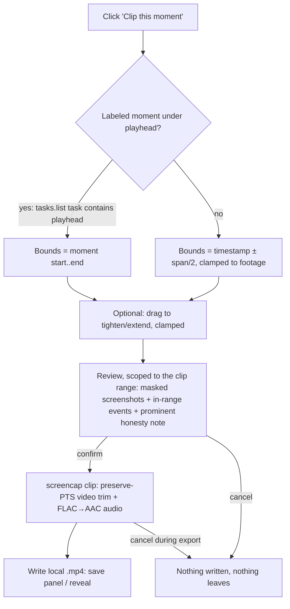
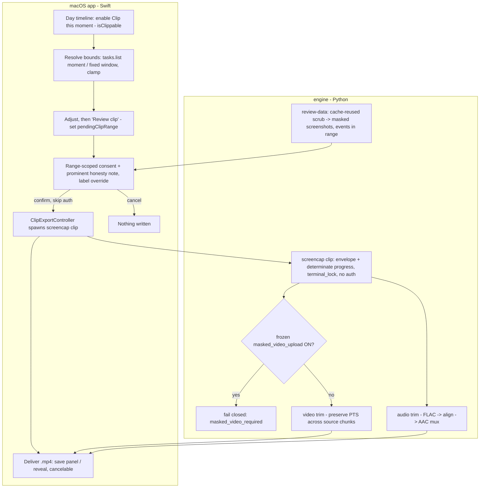

# Clip a Moment — Video Segment Export - Plan

## Goal Capsule

- **Objective:** Let a user turn a labeled moment on the Day timeline into a scrubbed, capture-blocked local video file (with audio), cut across chunk boundaries, through the same scrub-and-consent path as an upload (minus the upload). Enable the shipped-but-disabled "Clip this moment" button; leave "Share from here" unchanged.
- **Product authority:** This document's Product Contract. `SECURITY.md` is the source of truth for the privacy trust boundary. Linear SCR-219 tracks the work; the Screencap Prototype design (`docs/design/screencap-prototype/`) is the UI reference.
- **Execution profile:** Seven units. Two load-bearing engine facts drive them: source `chunk_*.mp4` are **variable-frame-rate** (action-gated) so the trim must **preserve source PTS**, not let the encoder assign a uniform cadence; and **audio is not in the chunks** — it is separate `audio_*.flac` on its own time anchor, so audio is a from-scratch mux sub-system (U2). The engine trim lands test-first with a playback-verifying integration test that asserts duration matches the requested wall-clock range for *sparse* footage. Privacy-bearing tests carry `@pytest.mark.privacy` and stay Vision-free (CI runs only that lane). Swift tests are not run by CI — run them locally, and run `xcodebuild` outside a `~/Documents` worktree or last (TCC session-brick risk).
- **Open blockers:** None. The paid-tier gate is a product toggle with a v1 default (not gated) and does not block implementation.

---

## Product Contract

**Product Contract preservation:** changed by planning-time doc-review findings — R2 (adds "clamped to available footage"), R3 (spans are total durations centered on the timestamp, clamped at edges), R5 (drag-out moved to follow-up; v1 delivers via save/reveal), R8 (eligibility is a clip-specific `isClippable`, not the upload-only predicate). R6 (audio) is unchanged in intent but re-scoped in cost. No requirement was dropped and no product goal reversed; the changes are corrections surfaced by feasibility review, confirmed with the user (audio kept in v1).

### Summary

"Clip this moment" exports the labeled moment under the playhead as a scrubbed, capture-blocked local `.mp4` with audio, cut across chunk boundaries and gated by the same consent Review as an upload. It defaults to the moment's own bounds, with drag adjustment and a fixed-window fallback where no moment is labeled. "Share from here" stays the shipped whole-recording link.

### Problem Frame

Sharing a single moment today means sharing the whole recording. "Share from here" opens the entire recording at a timestamp, and there is no way to hand someone only the thirty seconds that matter — a bug repro, one workflow step, a meeting exchange. The moment is trapped inside hours of footage.

The engine cannot cut it out. `export_chunk_events` slices *events* by time range, but there is no video trim anywhere: recordings are fifteen-minute chunk MP4s, and the only assembly code is whole-chunk concat. So the "Clip this moment" button ships disabled against this gap, while "Share from here" carries the whole-recording share alone.

### Key Decisions

- KD1. **Output is a local file, not a cloud link.** E2EE (SCR-220) makes cross-user cloud links non-viable near-term: encrypted recordings decrypt only on the owner's devices, the website player is a documented no-op for ciphertext, and team/cross-user sharing is deferred to SCR-221/SCR-229. A local file decrypts on the owner's Mac where the key already lives, needs no cross-user infrastructure, survives the E2EE default flip, and covers external recipients (bug reports, customers) a link never could. It also matches the ticket's own "shareable file" wording.
- KD2. **Snap to the labeled moment by default; adjust is opt-in.** The moment's bounds are resolved from the day's task list (`RecordingTask` `[startTs, endTs)` via `/v0/tasks.list`) — the Day timeline itself surfaces only point-in-time search hits, so bounded-moment resolution is new wiring (U5). One click clips the whole moment; drag refines it; footage with no labeled moment falls back to a fixed window around the timestamp.
- KD3. **Same scrub-and-consent posture as uploads — no bypass in the app flow.** The clip routes through the existing consent Review before anything is written, and the video comes from the same capture-blocked source the upload path ships. The consent surface is scoped to the clip's range (see KTD4).
- KD4. **Video privacy stays window-level, at parity with uploads — in the default posture only.** The on-disk chunk video is capture-time-blocked when `masked_video_upload` is OFF (the default), and a clip inherits that. In-window PII *text* is not masked in video (only in screenshots and structured data) — the same exposure current uploads carry. Because that exposure ships in a file destined for external recipients, the consent surface makes it explicit rather than relying on upload-parity to speak for it (KTD4). When the flag is ON, the parity breaks and the clip fails closed (KTD3).
- KD5. **"Share from here" is untouched.** It remains the shipped whole-recording cloud link opened at the timestamp. Only "Clip this moment" is new.
- KD6. **Build the trim as a reusable segment cut, not a one-off button handler.** The time-range cut is net-new and is the same primitive the "segmentation / training corpus" strategy track will need. Build it as a destination-agnostic capability the UI calls, so one seam serves clip-a-moment and future segmentation.

### Requirements

**Selection & bounds**

- R1. "Clip this moment" defaults the clip's bounds to the labeled moment under the playhead — its start and end.
- R2. The user can tighten or extend the bounds before export, clamped to available footage, with the current duration visible while adjusting.
- R3. Where the playhead is over footage with no labeled moment, the clip defaults to a fixed window of the selected length (15s / 30s / 2m total, centered on the timestamp), clamped to available footage at recording edges.
- R4. A clip may span multiple recording chunks; crossing chunk boundaries is transparent to the user.

**Output & consent**

- R5. Exporting produces a single self-contained local `.mp4` of the selected range, delivered via a save panel and reveal-in-Finder.
- R6. The clip includes the recording's audio for the selected range when audio was captured.
- R7. In the app flow, export routes through the same consent Review as an upload, scoped to the clip's range so the user reviews exactly what is leaving, and cannot bypass it.
- R8. "Clip this moment" is available only for a clippable recording — a local, non-stub recording with video present (`isClippable`), distinct from the upload-only `isUploadEligible`.

**UI & feedback**

- R9. "Clip this moment" is enabled on the Day timeline playback overlay per the Screencap Prototype design, replacing the disabled stub.
- R10. Export is not instantaneous; the user gets clear, determinate progress feedback from initiation through Review to the finished file, and can cancel a running export.

### Key Flows

- F1. Clip a labeled moment
  - **Trigger:** User pauses on a labeled moment and clicks "Clip this moment."
  - **Steps:** Bounds default to the moment (resolved via `tasks.list`) → user optionally adjusts → the Review window shows the range-scoped consent → on confirm the trimmed `.mp4` (video + audio) is written and offered to save/reveal.
  - **Covers:** R1, R2, R5, R6, R7.
- F2. Clip unlabeled footage
  - **Trigger:** User clicks "Clip this moment" while the playhead is over footage with no labeled moment.
  - **Steps:** Bounds default to a fixed window centered on the timestamp, clamped at edges → user picks a span or adjusts → same Review → file.
  - **Covers:** R3.
- F3. Clip crossing chunk boundaries
  - **Trigger:** The selected range spans two or more chunk MP4s.
  - **Steps:** The trim assembles the range across boundaries into one continuous file with preserved timing and aligned audio, transparent to the user.
  - **Covers:** R4, R6.

### Acceptance Examples

- AE1. Unlabeled footage default (R3)
  - **Given:** the playhead is over unsplit footage with no labeled moment.
  - **When:** the user clicks "Clip this moment."
  - **Then:** the default clip is a window of the selected length (default 30s total, 15s/30s/2m selectable) centered on the timestamp — never a whole-recording or zero-length clip.
- AE2. Blocked window inside the range (R7, KD4, KTD3)
  - **Given:** the selected range overlaps a window that was capture-blocked (default flag-OFF posture).
  - **When:** the clip is produced.
  - **Then:** the blocked window is absent from the clip (inherited from capture-time blocking), and the consent Review reflects the scrubbed range.
- AE3. Flag-ON recording fails closed (KTD3)
  - **Given:** a recording whose frozen `.recording_intent` has `masked_video_upload` ON (so source chunks were recorded rich).
  - **When:** the user attempts to clip it.
  - **Then:** the export fails closed with a structured `masked_video_required` reason and writes no file — it does not export unmasked sensitive-window video.
- AE4. Sparse (VFR) footage keeps its duration (R4, KTD1)
  - **Given:** an action-gated recording with idle gaps in the selected range.
  - **When:** the clip is exported.
  - **Then:** the output duration matches the requested wall-clock range (idle held as freeze-frames), not the sparse-frame count — and audio stays aligned.
- AE5. Consent is load-bearing (R7)
  - **Given:** the user reaches the consent Review.
  - **When:** they cancel.
  - **Then:** no file is written and nothing leaves the recording.

### Scope Boundaries

**Deferred for later**

- Account-scoped or public cloud links for clips — blocked on team sharing (SCR-221/SCR-229) and the E2EE direction.
- Frame-accurate trimming — second-accurate cuts suffice.
- Range-scoped scrub — v1 runs (and caches) the existing whole-recording scrub for the consent surface (KTD4); scoping the scrub itself to the clip range is a later optimization for very long recordings.
- Drag-out delivery — v1 delivers via save panel + reveal-in-Finder; drag-out is a follow-up.
- GIF, still-frame, or other lighter export forms.

**Outside this product's identity**

- Enabling post-hoc video masking (`masked_video_upload`) for clips — the feature rides capture-time blocking and fails closed when the flag is ON, rather than exporting rich video.
- Changing "Share from here."

### Dependencies / Assumptions

- Source `chunk_*.mp4` are **video-only** (`VideoWriter` adds only a video stream). Audio lives in separate `audio_*.flac` files on a distinct `audio_start_time` anchor; there is **no** existing FLAC→MP4 mux precedent, so the clip's audio path (U2) is net-new.
- Source video is **variable-frame-rate** (action-gated `RECORD_FULL_VIDEO=False`); `concat_video_chunks` deliberately preserves inter-chunk idle gaps (SCR-98). The trim must preserve source PTS — `frame.pts = None` collapses VFR footage (warned at `src/screencap/engine/video.py:1163`).
- Capture-time blocking is active only while `masked_video_upload` is OFF (`block_video = not masked_video_upload`, `src/screencap/engine/collaborators.py:175`, frozen per-recording). A clip of a flag-ON recording would export rich source video, so the clip fails closed on that bit (KTD3).
- The scrub / consent prep is auth-free and standalone (`CloudCopyProducer.produce()` / `scrub_recording` need no account); the `<name>-scrubbed` copy holds masked screenshots + scrubbed events/db but **no video**, so the clip's video is trimmed from the source chunks.
- The clip's source-chunk read needs the per-recording `terminal_lock` to avoid an eviction race (the lock lives in `viewer._ensure_single_video`, not `concat_video_chunks`).
- The bounded labeled-moment model (`RecordingTask` via `/v0/tasks.list`) is not wired into the Day timeline today (it surfaces point-in-time search hits); snap-to-moment needs that wiring (U5).
- PyAV version is pinned — a v14 remux regression can emit zero-sized packets.

### Outstanding Questions

**Open (product decision, v1 default set)**

- Paid-tier gate: should local clip export be restricted to paid/cloud-tier users even though it needs no account? v1 default: **not gated**. Flip only as a deliberate monetization choice.

**Deferred to follow-up planning**

- Range-scoped scrub for very long recordings (the first clip of an N-hour session still pays a full scrub even with cache-reuse).
- Default save-panel filename (e.g., moment label + timestamp) and a distinct "choose another location" error for a write-permission failure at the save target.

---

## Planning Contract

### Key Technical Decisions

- KTD1. **Video trim = full decode + re-encode preserving the source PTS timeline.** Map each kept frame's output `pts` to its offset-mapped source time `(frame.time + chunk_offset − start)` on the output stream's `time_base` — do **not** set `frame.pts = None` (that collapses VFR footage to a few seconds; two reviewers and `video.py:1163` confirm). Idle gaps are preserved as freeze-frames so output duration matches the requested wall-clock range. Stream-copy is rejected (the ~2.4s GOP keyframe-snap misses the second-accurate bar); trimming the derived `video.mp4` was considered but rejected — it is video-only and best-effort/on-demand, so the per-chunk path is authoritative.
- KTD2. **Encoder settings and the packet-vs-frame PTS rule.** Output `libx264` / `yuv444p` / CRF 23 / `max_b_frames=0` (mirrors capture's `bf=0`), `rate` from source. Set `frame.pts` **before** `encode()` (KTD1); **never** mutate `packet.pts` **after** `encode()` (that is the corruption the B-frame learning forbids — a distinct operation from preserving frame PTS). Flush both streams after the loop. Open output with `movflags=faststart`. Pin the PyAV version.
- KTD3. **Clip video from the SOURCE chunks, and fail closed when they are rich.** Read source `chunk_*.mp4` (capture-blocked in the default posture). Before trimming, check the recording's frozen `.recording_intent` `masked_video_upload` bit: if ON, the source chunks contain unmasked sensitive windows, so refuse with a structured `masked_video_required` reason and write nothing. The clip pipeline never enables `masked_video_upload` and never reads the `masked_video/` copies.
- KTD4. **Consent reuses the Review window, scoped to the clip's range, with a cache-reused scrub and an honest video note.** `scrub_recording` has no range parameter, so v1 runs the whole-recording scrub but reuses a fresh existing `<name>-scrubbed` (skip re-scrub when `.scrub_complete` is current) to blunt the long-recording cost; the masked-screenshot truth-set + `export_chunk_events(start, end)` are filtered to `[start, end)` for display. Because the exported video is less redacted than those screenshots and leaves to external recipients, the consent surface shows a **prominent** note adjacent to the preview frames ("These preview frames are redacted, but the exported video shows on-screen text that is not masked") and **overrides** the reused window's "video: local-only, not uploaded" label for clips.
- KTD5. **Clip export is auth-free and local; consent is enforced at the app layer.** Gate on a clip-specific `isClippable` predicate (local, non-stub, video present) — not `isUploadEligible` (`!uploaded && !isStub`), whose `!uploaded` clause would wrongly block clipping an already-shared recording. Branch the Swift terminal action to a new clip controller, skip the `AccountSheetPolicy` auth gate, and carry the range out-of-band via `pendingClipRange` (mirroring `pendingSeekMs`) so the Review window scene stays keyed on the recording name. R7's "cannot bypass" is scoped to the app flow: the auth-free `screencap clip` verb is a same-EUID local tool (the user can already read the source chunks), so no cross-boundary surface is added.
- KTD6. **`screencap clip` speaks the Swift event contract, exits 0, and holds the eviction lock.** Emit structured `clip_started` / `clip_progress{frames_done, frames_total}` (determinate) / `clip_done{path}` / `clip_failed{reason}` and **always exit 0**, carrying success/failure in the envelope (the Swift `CLIClient` discards stdout on non-zero exit). Reasons: `no_frames_in_range`, `trim_failed`, `not_eligible`, `masked_video_required`, `clip_busy`. Acquire the per-recording `terminal_lock` (blocking-with-timeout via `--lock-timeout`) around the source-chunk read; on contention emit `clip_busy` (retryable) with the timeout set under the Swift watchdog. Swift drains the subprocess stdout and calls `readToEnd()` in the termination handler, and decouples the progress modal from the encode `await`.
- KTD7. **Audio is a separate FLAC sub-system muxed into the clip.** Read the recording's `audio_*.flac` overlapping `[start, end)`, align on `audio_start_time` (not the video anchor), trim to the same output-timeline origin as video, resample as needed, and encode an AAC stream into the same output container. There is no existing FLAC→MP4 mux in the repo, so this is built from PyAV primitives (its own unit, U2). Missing audio yields a video-only clip, not a crash.

### High-Level Technical Design

---

## Implementation Units

### U1. Engine: cross-chunk video trim (PTS-preserving)

- **Goal:** Re-encode video for `[start_ms, end_ms)` spanning one or more source `chunk_*.mp4` into one continuous `.mp4`, preserving the source presentation timeline (idle gaps held as freeze-frames), second-accurate.
- **Requirements:** R4, R5; KD6, KTD1, KTD2, KTD3.
- **Dependencies:** none.
- **Files:** `src/screencap/engine/video.py` (new `export_clip_video(...)`); `tests/test_video_clip.py`.
- **Approach:** Map `[start, end)` to (chunk, in-chunk offset) via the chunk manifests. Acquire the per-recording `terminal_lock` (blocking-with-timeout) around the read — mirror `viewer._ensure_single_video`, **not** `concat_video_chunks` (the eviction race lives in the former). Check the frozen `masked_video_upload` bit first; if ON, raise a structured `masked_video_required` and write nothing (KTD3). `container.seek(..., backward=True)` as a fast-skip; `container.decode(video=0)`; drop frames until `frame.time + chunk_offset >= start`; for each kept frame set `frame.pts = round((frame.time + chunk_offset − start) / out_time_base)` and feed one continuous `libx264` output (`yuv444p`, CRF 23, `max_b_frames=0`); never mutate `packet.pts` after `encode()`. At a chunk boundary, open the next container and keep feeding the same encoder. Flush; write atomically (`.tmp` → `os.replace`); open output with `movflags=faststart`. Pin PyAV.
- **Patterns to follow:** `concat_video_chunks` (`src/screencap/engine/video.py:914`) for atomic write; the offset/gap handling and `packet.pts + offset` carry it uses; the terminal-lock wrapper in `src/screencap/viewer.py` (`_ensure_single_video`); `remediate_pixfmt_for_review` (`src/screencap/engine/video.py:1163`) for the "never null frame PTS on VFR" rule; the PTS/B-frame learning (`docs/solutions/bug-fixes/video-pts-offset-bframe-corruption-20260322.md`).
- **Execution note:** Start with a failing playback-verifying integration test on **sparse (action-gated) footage** asserting output duration matches the requested wall-clock range — the `frame.pts=None` approach fails exactly this, which is the point.
- **Test scenarios:**
  - Covers R4 / AE3-adjacent. Range spanning a chunk boundary → one continuous `.mp4`, no seam, monotonic PTS from 0.
  - Covers AE4. Sparse VFR range with idle gaps → output duration ≈ requested wall-clock range (freeze-frames), not the sparse frame count.
  - Requested start mid-GOP → output begins at the requested second.
  - Covers AE3. Recording with frozen `masked_video_upload` ON → raises `masked_video_required`, writes no file.
  - Zero-length or out-of-range `[start, end)` → structured error, no partial file.
  - Concurrent eviction attempt during the read → serialized by `terminal_lock`, clip completes or reports busy (no truncation).
  - Encoder flush → final frames present; `moov` at front (faststart).
- **Verification:** the file plays, duration matches the range within ~1s including idle spans, PTS monotonic from 0.

### U2. Engine: audio trim + AAC mux

- **Goal:** Read the recording's separate `audio_*.flac` for `[start, end)`, align on `audio_start_time`, resample, and encode an AAC stream into the clip container, A/V-synced across chunk boundaries.
- **Requirements:** R6; KTD7.
- **Dependencies:** U1 (muxes into the same export path / output container).
- **Files:** `src/screencap/engine/video.py` or new `src/screencap/engine/audio_clip.py`; `tests/test_audio_clip.py`.
- **Approach:** Locate the `audio_*.flac` file(s) overlapping `[start, end)`; align using `audio_start_time` (the audio anchor differs from `video_start_time`); trim to the same output-timeline origin as the video (so `t=0` means the same wall-clock instant for both streams); resample if the FLAC rate/layout doesn't match the AAC encoder; `add_stream("aac")` and encode; `output.mux(...)` interleaves with video by DTS. Flush. Missing audio files → video-only clip, no crash.
- **Patterns to follow:** the capture-side audio anchor (`src/screencap/engine/capture.py:377`, `:618`) and FLAC writing (`src/screencap/engine/capture.py:346`); PyAV resample/encode primitives. No existing FLAC→MP4 mux to copy — build it.
- **Execution note:** Assert **A/V sync at a chunk boundary**, not merely "audio present."
- **Test scenarios:**
  - Covers R6. Range with audio → clip audio aligned to video across the range and across a chunk boundary (sync assertion, tolerance ~1 frame).
  - Audio anchor offset from video anchor → alignment is correct (not shifted by the anchor delta).
  - No `audio_*.flac` present → video-only clip, no crash.
  - FLAC rate/layout ≠ encoder → resample succeeds.
- **Verification:** exported clip has audio that stays in sync with video from start through a chunk boundary to end.

### U3. `screencap clip` CLI verb

- **Goal:** A Click command that orchestrates U1 + U2, emits a structured JSON envelope + determinate progress, holds the eviction lock, and is auth-free.
- **Requirements:** R5, R8, R10; KTD5, KTD6.
- **Dependencies:** U1, U2.
- **Files:** `src/screencap/cli/__init__.py` (new `clip` command); `tests/test_cli_clip.py`.
- **Approach:** `screencap clip <name> --start-ms <n> --end-ms <n> --out <path> --lock-timeout <s> [--json]`. Gate on `isClippable` (local, non-stub, video present) — no auth. Acquire the per-recording `terminal_lock` under `--lock-timeout`; on contention emit `clip_busy`. Emit `clip_started` / `clip_progress{frames_done, frames_total}` / `clip_done{path}` / `clip_failed{reason}`; **always exit 0**, carrying `ok` + failure in the envelope. Reasons: `no_frames_in_range`, `trim_failed`, `not_eligible`, `masked_video_required`, `clip_busy`. No account/token checks.
- **Patterns to follow:** existing CLI commands + Rich console; the `UploadEventLine` contract (`macos/ScreenCap/Models/UploadEventLine.swift`); `docs/solutions/integration-issues/cli-json-envelope-nonzero-exit-discards-stdout-2026-07-02.md`; `docs/solutions/integration-issues/inner-timeout-unreachable-behind-outer-watchdog-2026-06-24.md` (lock-timeout under the Swift watchdog); `docs/solutions/design-patterns/fallback-path-recovery-and-exit-code-signaling-2026-06-15.md`.
- **Test scenarios:**
  - Happy path: valid range → `clip_done` with out path, exit 0, file exists.
  - `no_frames_in_range` → `clip_failed` with reason, exit 0, no file.
  - Ineligible recording → `not_eligible`, exit 0; already-uploaded recording → still clippable (not blocked).
  - Flag-ON recording → `masked_video_required`, exit 0, no file.
  - Lock contention → `clip_busy` (retryable), exit 0.
  - Multi-chunk range → determinate `clip_progress` events with `frames_done`/`frames_total`.
  - No auth present → still succeeds.
- **Verification:** the command produces the file and a parseable JSON stream; every non-happy path exits 0 with a typed reason.

### U4. Range-scoped consent prep + scrub cache-reuse (Python)

- **Goal:** Scope the review/consent surface to `[start, end)` and reuse a fresh scrubbed copy instead of re-scrubbing per clip.
- **Requirements:** R7; KD3, KD4, KTD4.
- **Dependencies:** none (parallelizable); consumed by U6.
- **Files:** `src/screencap/review.py` (extend `prepare_review_data` with optional `--clip-start-ms` / `--clip-end-ms` and cache-reuse); `tests/test_review_clip_scope.py`.
- **Approach:** Reuse an existing fresh `<name>-scrubbed` (skip re-scrub when its `.scrub_complete` is current) to blunt the whole-recording scrub cost; otherwise run the whole-recording scrub unchanged. When clip-range inputs are present, filter the masked-screenshot truth-set (screenshots are timestamped) and events (`export_chunk_events(start, end)`) to `[start, end)`, and add a `clip_video_capture_blocked_only: true` honesty flag. New envelope fields are optional (decode as optional, never gate readiness on them).
- **Patterns to follow:** `export_chunk_events(start, end)` (`src/screencap/export.py:30`); `prepare_review_data` / `_prepare_scrubbed_copy` (`src/screencap/review.py`); `docs/solutions/integration-issues/review-data-nullable-timing-swift-consumer-2026-06-01.md`.
- **Test scenarios:**
  - Covers R7. Clip-range inputs → screenshots + events filtered to `[start, end)`; nothing outside the range.
  - Honesty flag present when a clip range is given.
  - Cache-reuse: a second clip of the same recording with a current `.scrub_complete` skips re-scrub.
  - No clip-range (whole-recording review) → behaves exactly as today (regression guard).
- **Verification:** review-data with a clip range returns only in-range evidence + the honesty flag; a repeat clip does not re-scrub.

### U5. Swift: clip-selection UI + snap-to-moment wiring

- **Goal:** Enable "Clip this moment" for clippable recordings; resolve snap-to-moment bounds from `tasks.list`; adjust (tighten/extend, clamped); fixed-window fallback; long-clip nudge; named confirm/cancel; open Review with the range.
- **Requirements:** R1, R2, R3, R8, R9, R10.
- **Dependencies:** U6 (the Review window consumes the range; integrate at U6).
- **Files:** `macos/ScreenCap/Views/Timeline/DayTimelineView.swift`; `macos/ScreenCap/Controllers/DayPlaybackEngine.swift` (add a `tasks.list` fetch + moment resolution); `macos/ScreenCap/State/ReviewWindowOpener.swift` (add `pendingClipRange`); new `macos/ScreenCap/Views/Timeline/ClipBoundsView.swift`; `macos/ScreenCapTests/ClipBoundsTests.swift`.
- **Approach:** Replace the disabled stub (`DayTimelineView.swift:183`) with an enabled button gated by a clip-specific `isClippable` (local, non-stub, video present) — not `isUploadEligible`. Snap-to-moment: fetch `/v0/tasks.list` for `engine.currentRecording`, resolve the `RecordingTask` whose `[startTs, endTs)` contains `currentDayMs` (tie-break: innermost/most-recently-started when tasks overlap), default bounds from it; empty → a fixed window of the selected span centered on the timestamp, clamped to available footage at recording edges. Bidirectional handles (tighten **or** extend), clamped to the recording, with a live duration readout; a non-blocking, dismissible nudge for clips over 2 minutes. A named "Review clip" control fires confirm-bounds (sets `pendingClipRange[name]`, opens Review); a separate cancel exits bounds mode without opening Review. Regenerate the XcodeGen project for the new file.
- **Patterns to follow:** the `pendingSeekMs` out-of-band pattern (`macos/ScreenCap/State/ReviewWindowOpener.swift:29`); the `RecordingTask` / `tasks.list` model as wired in Journal/Library; `docs/solutions/build-errors/xcodegen-stale-project-missing-new-sources.md`; `docs/solutions/ui-bugs/swiftui-windowgroup-vs-window-singleton-scene-2026-05-18.md`.
- **Test scenarios:**
  - Covers R1. Playhead inside a labeled task → default bounds = that task's `[startTs, endTs)`.
  - Overlapping tasks under the playhead → tie-break picks the innermost/most-recent, deterministically.
  - Covers R3 / AE1. No task under the playhead → fixed window of the selected span centered on the timestamp; 15s/30s/2m selectable; never whole-recording or zero-length.
  - Near a recording edge → the fixed window clamps to available footage; duration readout reflects the clamp.
  - Covers R2. Drag inward and outward → bounds tighten/extend, clamped to the recording, readout updates.
  - Covers R8. Ineligible recording (fails `isClippable`) → button disabled/unavailable; an already-uploaded recording is still clippable.
  - Long clip (> 2 min) → non-blocking nudge shown; "Review clip" opens Review with the range; cancel exits bounds mode.
- **Verification:** the button enables for clippable recordings, snap-to-moment resolves from `tasks.list`, and the range reaches the Review window. Run Swift tests locally.

### U6. Swift: clip Review + local-file export path

- **Goal:** In the Review window, when a clip range is pending, show range-scoped consent with a prominent honesty note (and corrected label), branch the terminal action to a local clip export, skip auth, support cancel-during-export, and deliver the file.
- **Requirements:** R5, R7, R10; KTD4, KTD5, KTD6.
- **Dependencies:** U3, U4, U5.
- **Files:** `macos/ScreenCap/Views/Review/ReviewWindow.swift`, `macos/ScreenCap/Controllers/ReviewWindowViewModel.swift`; new `macos/ScreenCap/Controllers/ClipExportController.swift`; `macos/ScreenCapTests/ClipExportControllerTests.swift`.
- **Approach:** On `.ready` with a pending clip range, pass the range to review-data (U4); render a **prominent** honesty note adjacent to the preview frames and **override** the reused window's "video: local-only, not uploaded" label for clips (KTD4); relabel the primary action "Export clip." On confirm, **skip** the `AccountSheetPolicy` auth gate and spawn `screencap clip --start-ms --end-ms --out <chosen> --lock-timeout <n>` via `ClipExportController`. Use a save panel for the out path; on `clip_done`, offer reveal-in-Finder. The progress modal is determinate (from `clip_progress`) and has a **cancel** that aborts the encode — the atomic `.tmp`/`os.replace` in U1 guarantees no partial or delivered file on abort. Drain subprocess stdout and `readToEnd()` in the termination handler; decouple the modal from the encode `await`; surface `clip_failed` / `clip_busy` as typed/retryable. Regenerate the XcodeGen project for the new files.
- **Patterns to follow:** `UploadController`/`LiveUploadService` (`macos/ScreenCap/Controllers/UploadController.swift:42`); `attemptUpload`/`startUpload` (`macos/ScreenCap/Views/Review/ReviewWindow.swift:215`); `docs/solutions/integration-issues/macos-foundation-process-pipe-pitfalls.md`; `docs/solutions/ui-bugs/recording-hud-frozen-on-stop-decouple-teardown-from-finalization-2026-07-08.md`; `docs/solutions/integration-issues/keychain-auth-prompt-eager-decrypt-at-launch-2026-07-08.md`; `docs/solutions/build-errors/xcodegen-stale-project-missing-new-sources.md`.
- **Test scenarios:**
  - Covers R7 / AE5. Cancel at Review → no `screencap clip` spawned, nothing written.
  - Covers R5. Confirm → `screencap clip` spawned with the range + out path; on `clip_done`, the file is offered.
  - No account → export proceeds (no AccountSheet, no keychain prompt).
  - `clip_failed` / `clip_busy` / `masked_video_required` → surfaced as typed/retryable, not a generic error.
  - Covers R10. Cancel during a running export → encode aborts, no partial or delivered file; determinate progress shown; modal not welded to the encode `await`.
  - Honesty note is prominent and the "local-only, not uploaded" label is overridden when a clip range is present.
- **Verification:** end-to-end from Review confirm → file on disk, no auth prompt, determinate progress, cancelable, failures typed. Run Swift tests locally.

### U7. Privacy-parity guard + CI marking

- **Goal:** Lock the privacy invariant — including the flag-ON case — with a guard CI actually runs.
- **Requirements:** R7; KD3, KD4, KTD3.
- **Dependencies:** U1, U3.
- **Files:** `tests/test_clip_privacy_parity.py` (`@pytest.mark.privacy`, Vision-free with a fake OCR stub); `SECURITY.md`.
- **Approach:** Assert the clip reads SOURCE chunks and **fails closed** when the frozen `masked_video_upload` bit is ON (build a flag-ON fixture and assert the export refuses / the sensitive window is absent — not merely that the pipeline doesn't enable the flag). Assert a capture-blocked interval overlapping the range is absent under the flag-OFF default. Assert the range-scoped consent (U4) matches the exported range. Keep it Vision-free so both CI privacy lanes run it. Add the boundary paragraph to `SECURITY.md`, including the flag-ON fail-closed behavior.
- **Patterns to follow:** `src/screencap/frame_blocked.py` / `backfill.skip_intervals`; `src/screencap/engine/collaborators.py:175` (`block_video = not masked_video_upload`); `docs/solutions/workflow-issues/privacy-guards-deselected-on-ci-silently-rot-2026-06-10.md`; the `SECURITY.md` trust-boundary section.
- **Execution note:** Privacy-critical — Vision-free so both CI lanes exercise it.
- **Test scenarios:**
  - Covers AE2. Capture-blocked window overlapping the range (flag-OFF) → absent from the clip.
  - Covers AE3. Frozen `masked_video_upload` ON → export fails closed (`masked_video_required`); the sensitive window never reaches a clip.
  - Consent range matches export range (no over- or under-exposure).
  - Vision-free execution (fake OCR) → runs without Apple Vision.
- **Verification:** the guard runs in the Vision-free lane and fails if the clip pulls rich video, reads `masked_video`, or leaks a blocked window.

---

## Verification Contract

| Gate | Applies to | Done signal |
|---|---|---|
| `PYTHONPATH=src pytest -m privacy tests/test_clip_privacy_parity.py` | U7 | Privacy-parity guard passes in the Vision-free lane, incl. flag-ON fail-closed |
| `PYTHONPATH=src pytest tests/test_video_clip.py tests/test_audio_clip.py` | U1, U2 | Duration matches range on sparse footage; cross-boundary continuity; A/V sync |
| `PYTHONPATH=src pytest tests/test_cli_clip.py tests/test_review_clip_scope.py` | U3, U4 | Envelope + events correct (exit 0); consent scoped to range; scrub cache-reused |
| `xcodebuild test` (run locally, outside a `~/Documents` worktree or last) | U5, U6 | Snap-to-moment via `tasks.list`, clamp, eligibility gate, export path, auth-skip, cancel-during-export |
| Manual smoke | All | Clip a labeled moment and an unlabeled span; each plays with in-sync audio, spans a chunk boundary cleanly, and raises no auth prompt |

`PYTHONPATH=src` is required in the worktree — the editable install points at whichever worktree last ran `pip install -e`.

---

## Definition of Done

- "Clip this moment" is enabled (for clippable recordings) and produces a playable local `.mp4` of the selected range — cross-chunk, second-accurate, with in-sync audio and correct duration on action-gated (VFR) footage.
- Export routes through the range-scoped Review consent with a prominent video-honesty note and no false "not uploaded" label; cancel at Review or during export writes nothing; no account or auth prompt is required.
- The clip video is trimmed from source capture-blocked chunks and **fails closed** on a flag-ON recording; the privacy-parity guard (U7) is green in the Vision-free CI lane.
- Snap-to-moment resolves from `tasks.list`; unlabeled footage falls back to a clamped fixed window; over-long moments show a non-blocking nudge.
- "Share from here" is unchanged.

---

## Sources & Research

- Video chunks (video-only, VFR): `src/screencap/engine/video.py` — `chunk_{index:04d}.mp4` (`:725`), video-only stream (`:112`), VFR PTS from wall-clock (`:160`), the "never null frame PTS on VFR" warning (`:1163`); whole-chunk stream-copy `concat_video_chunks` (`:914`, preserves inter-chunk idle gaps, SCR-98); eviction-lock wrapper `viewer._ensure_single_video`.
- Audio (separate FLAC, own anchor): `src/screencap/engine/capture.py:346` (FLAC write), `:377` / `:618` (`audio_start_time`). No FLAC→MP4 mux precedent in the repo.
- Event slicing: `export_chunk_events(start_ts, end_ts)` `[start, end)` — `src/screencap/export.py:30`.
- Scrub-seam (auth-free, video-free scrubbed copy): `CloudCopyProducer.produce()` — `src/screencap/terminal_stage.py:388`; `scrub_recording` (whole-recording, no range) — `src/screencap/scrubber.py:3430`; copytree filter drops `.mp4` — `:2497`; standalone review use — `src/screencap/review.py`.
- Capture-time blocking gate: `block_video = not masked_video_upload` — `src/screencap/engine/collaborators.py:175`; `masked_video_upload` default OFF — `src/screencap/config.py:897`; trust boundary — `SECURITY.md:55-69`.
- Eligibility predicate: `isUploadEligible = !uploaded && !isStub` — `macos/ScreenCap/Models/RecordingSummary.swift:145` (the `!uploaded` clause is why a clip-specific `isClippable` is needed).
- Swift consent flow + moment model: disabled stub / "Share from here" — `macos/ScreenCap/Views/Timeline/DayTimelineView.swift:179-208`; out-of-band `pendingSeekMs` — `macos/ScreenCap/State/ReviewWindowOpener.swift:29`; `DayPlaybackEngine` exposes `currentRecording` / `currentDayMs` only (moment bounds via `RecordingTask` / `/v0/tasks.list` are not wired into the Day timeline); upload lifecycle — `macos/ScreenCap/Controllers/UploadController.swift:42`.
- PyAV trim guidance (re-encode over stream-copy; but preserve source PTS for VFR, contra the CFR-assuming external guidance; v14 remux regression; `movflags=faststart`; never mutate `packet.pts` without `time_base`): PyAV cookbook + issues #358, #730, #1179, discussion #1694.
- Institutional learnings applied: PTS/B-frame corruption (`docs/solutions/bug-fixes/video-pts-offset-bframe-corruption-20260322.md`); CLI-envelope-exit-0 (`docs/solutions/integration-issues/cli-json-envelope-nonzero-exit-discards-stdout-2026-07-02.md`); Process/Pipe drain (`docs/solutions/integration-issues/macos-foundation-process-pipe-pitfalls.md`); flock inner-timeout-vs-watchdog (`docs/solutions/integration-issues/inner-timeout-unreachable-behind-outer-watchdog-2026-06-24.md`); XcodeGen regen (`docs/solutions/build-errors/xcodegen-stale-project-missing-new-sources.md`); CI privacy-lane rot (`docs/solutions/workflow-issues/privacy-guards-deselected-on-ci-silently-rot-2026-06-10.md`); HUD teardown decouple (`docs/solutions/ui-bugs/recording-hud-frozen-on-stop-decouple-teardown-from-finalization-2026-07-08.md`).
- E2EE constraint on cloud links: `docs/plans/2026-07-11-002-feat-scr-220-e2ee-shared-copies-plan.md` — KD3 (teams deferred), KD5 / R13 (encrypted recordings owner-app-only, web player no-op for ciphertext).
