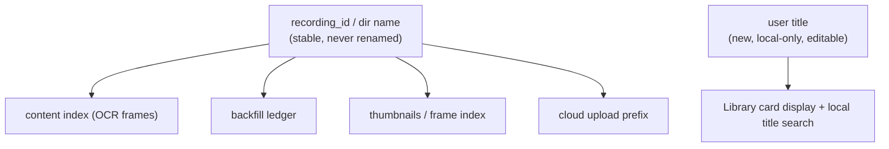
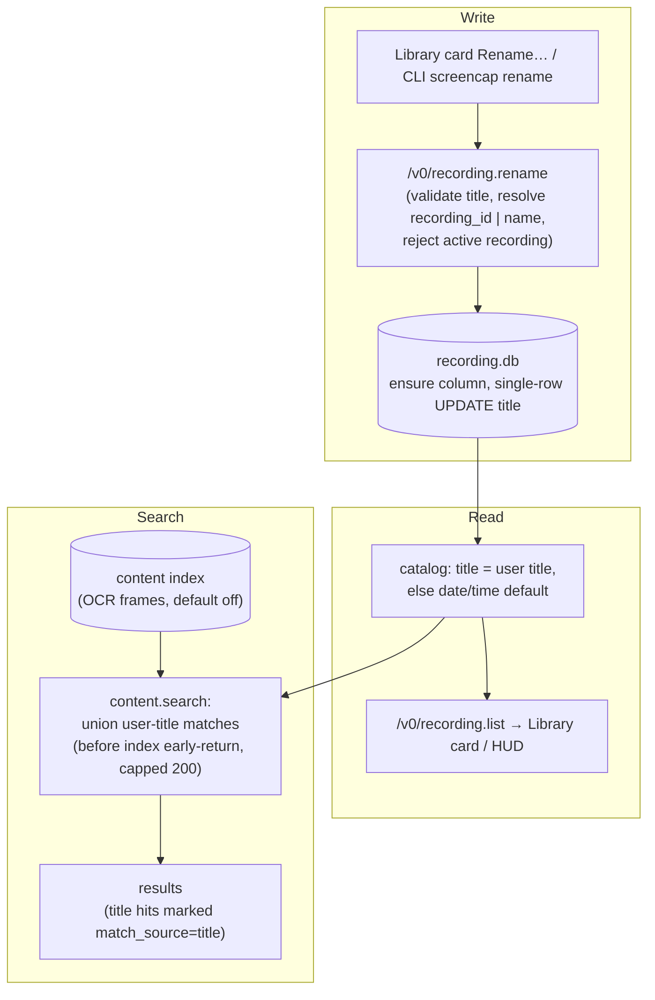

# Editable Recording Titles - Plan

## Goal Capsule

- **Objective:** Let a user give any recording a human title (e.g. "Payroll walkthrough") that replaces the auto-generated timestamp name, editable from the Library card and CLI, persisted locally and searchable.
- **Product authority:** SCR-223 (Linear, Screencap team). Part of the load-bearing UX & native-experience track.
- **Stop conditions / blockers:** None open. Two implementation-time confirmations are recorded in Open Questions (non-blocking).
- **Execution profile:** Standard. Python daemon/CLI/catalog backend (pytest) plus one macOS-app (Swift/XCTest) unit. Six units, dependency-ordered.
- **Tail ownership:** Single PR on branch `claude/recordings-editable-titles-714f4e`; follow repo PR conventions.

---

## Product Contract

**Product Contract preservation:** Product Contract unchanged except R5, clarified with a concrete 200-character cap (value chosen at planning; the requirement already committed to "a maximum length", so this is a clarification, not a scope change). The four brainstorm Deferred-to-Planning questions (storage home, search-match mechanism, default-title format, edit affordance) are resolved into Key Technical Decisions in the Planning Contract.

### Summary

Make recording titles user-editable. A user can set a human title on any recording from the Library card; the title persists locally, is searchable on-device, and is exposed through a new CLI command plus an additive daemon verb. The on-disk directory and stable ID stay untouched; the title is a separate field layered over today's auto-generated name.

### Problem Frame

Recordings are named `rec-<timestamp>` at capture start and the directory is never renamed. The legacy auto-namer that once produced descriptive slugs is being removed (`docs/plans/2026-07-11-001-chore-remove-legacy-auto-naming-plan.md`), so without user rename the new Library and Recording HUD show only timestamp-derived labels. The target persona — customer-success managers, ops analysts, sales engineers working across many recordings a day — can't tell one recording from another at a glance, which undercuts the Library as an organization surface. The blocker to fixing this cheaply is that the recording directory name is the stable key for the content index, backfill ledger, thumbnails/frame index, and cloud upload prefix, so a naive directory rename would break Search and reprocessing.

### Key Decisions

- **Title is a separate persisted field, not a directory rename.** The stable `.recording_id` / directory name keys the content index, backfill ledger, thumbnails, and upload prefix, and the live path never renames it. Persisting the title as metadata layered over the auto-generated name keeps every keyed store consistent with zero migration.
- **Local-only for v1; cloud propagation deferred.** Titles are never uploaded today by rule (the per-recording sidecar and `recording.db` are local-only; only scrubbed exports reach the cloud). Syncing a user-typed title to the cloud is net-new plumbing that also introduces a new free-text field into cloud-bound paths — the surface STRATEGY's "leaked titles" privacy metric watches. Deferred to a scoped fast-follow to keep v1 inside the local-first boundary.
- **A user-set title is distinguished from the derived default.** Persisting whether a title is user-authored lets the friendly default stay re-derivable when no title is set, and lets the future cloud fast-follow propagate only user-authored titles.

*Rename writes only the title field; nothing keyed on the stable ID moves, so Search, thumbnails, timeline, and backfill stay consistent for free.*

### Requirements

**Editing & persistence**

- R1. A user can set or change a recording's title; the new title persists across app restarts and recording reprocessing.
- R2. The title is stored as a local-only field; the recording directory and its stable ID are never renamed.
- R3. Setting a blank or whitespace-only title reverts the recording to its default title — cards are never permanently blank.
- R4. Duplicate titles across recordings are allowed; the stable ID remains the uniqueness key.
- R5. Titles accept general display text (unicode, spaces, punctuation, emoji) up to 200 characters; they are not held to the strict path-safe recording-name rules.

**Default title**

- R6. A recording with no user-set title shows a human-readable default derived from its date/time (e.g. "Recording · Jul 12, 2:30 PM"), replacing today's raw humanized `rec-<timestamp>`.
- R7. The system distinguishes a user-set title from the derived default, so the default stays re-derivable and a later cloud sync can target user titles only.

**Surfaces**

- R8. Rename is available from the Library card.
- R9. Rename is exposed as a CLI command and an additive daemon verb, following the existing additive write-verb conventions (peer-audited, schema-validated).

**Search & consistency**

- R10. A user-set title is searchable on-device: a title-term search surfaces the recording even when the OCR content index has no match — including recordings whose frames were fully privacy-blocked and never indexed.
- R11. Search, thumbnails, timeline, and backfill remain consistent after a rename (a consequence of R2 — nothing keyed on the directory name changes).

### Acceptance Examples

- AE1. **Covers R3, R6.** Given a recording titled "Payroll walkthrough", when the user clears the title to empty, then the card shows the date/time default (e.g. "Recording · Jul 12, 2:30 PM"), not a blank label.
- AE2. **Covers R6, R7, R8.** Given a freshly recorded session with no user title, when it appears in the Library it shows a date/time default; when the user renames it, the user title persists and is marked user-set.
- AE3. **Covers R10.** Given a recording whose frames were all privacy-blocked (absent from the content index) but titled "Q3 board deck", when the user searches "board deck", then the recording appears in results via the title match — even with the content index disabled.

### Scope Boundaries

Deferred for later:

- Cloud propagation of titles — titles on cloud copies and in cloud-side listings. The scoped fast-follow once a metadata channel exists.
- In-recording rename from the HUD title pill (ticket's "eventually"); renaming the currently-active recording is rejected in v1.
- Editing the auto-generated description / `task_description` — this feature edits the title only.
- Renaming the on-disk directory or migrating the dir-keyed stores.

---

## Planning Contract

### Key Technical Decisions

- KTD1. **Title lives in a new local-only `title` column on `recording.db`'s `recording` table.** The `.recording_intent` sidecar is frozen/write-once (`src/screencap/engine/lock_policy.py`), so a mutable title cannot live there. `recording.db` is local-only, already read by the catalog, and holds exactly one `recording` row per recording. The column is added to the `Recording` ORM model; new recordings gain it at capture start via recorder-startup `_migrate_schema`. Because `open_recording_db` does **not** run `_migrate_schema`, the write helper must call `_migrate_schema(db_path)` before its `UPDATE` so recordings captured before this shipped gain the column on first rename. Reads mirror `_read_task_description` (single-row `SELECT title FROM recording LIMIT 1`, `has_column`-guarded); writes are a single-row `UPDATE recording SET title=?` — the string `recording_id` resolves the `db_path` only and is never bound to the integer `id` PK (`models.py:34`).
- KTD2. **The catalog resolves the display title: user title when the column is non-empty, otherwise a friendly date/time default derived from `started_at`.** The default is computed at read time and never written, so it stays re-derivable (R6/R7). "User-set" is encoded by the column being non-empty; a `title_is_user_set` boolean is exposed additively on the wire for the UI. Injection point is `src/screencap/catalog.py:790` (`title=_humanize_name(d.name)` today).
- KTD3. **`recording.rename` is a new additive POST verb carrying a recording selector.** Existing write-verbs (`start/stop/mute`) act on the single *active* recording and take no identifier; rename targets an arbitrary past recording. The selector is `recording_id`, **falling back to the directory `name`** for legacy recordings predating the `.recording_id` sidecar (`read_recording_id` returns `None` for them, so a `recording_id`-only verb could never address them). It mirrors `recording.mute`'s handler shape (peer derivation, audit closure, schema validation, cursor-before-side-effect, envelope, three-arm except) and **rejects renaming the currently-active (write-locked) recording** with a clear error — in-recording rename is deferred to the HUD.
- KTD4. **Title validation is a new display-text validator, not `validate_recording_name`.** The path-safe gate (`src/screencap/daemon/_name_validation.py:53`) rejects unicode and most punctuation — wrong for a human title. The new validator allows unicode/emoji/punctuation, caps length at **200 characters**, rejects control/NUL characters, and treats an empty string as "clear → revert to default" (R5/R3).
- KTD5. **Title search is a catalog-layer union into `content.search`, matching only user-set titles.** The content index is text-only, keyed by `(recording, timestamp_ms)`, purged on privacy events, and **defaults off** (`content_index_enabled`), so `content.search` returns early when no index exists. Compute and union the user-title matches **before that early return** (`_run_content_search`), so title search runs even when no index has ever been created — the common case (R10). Bound the catalog title scan to the existing `_QUERY_MAX_RECORDINGS` (200) cap the query verbs already enforce. A title hit carries an explicit sentinel `timestamp_ms` **plus an additive `match_source: "title"` marker** so downstream frame/timeline consumers (e.g. `frame.nearest`) treat it as metadata, not a resolvable frame pointer. Default (non-user) titles are not searchable.
- KTD6. **Local-only in v1 is enforced by the existing `recording.db` upload exclusion.** The title's home (`recording.db`) is never uploaded; no code path carries the title into a scrubbed export. A verification gate pins this invariant (see Verification Contract). Cloud propagation is the deferred fast-follow.

### High-Level Technical Design

### Assumptions

- **Titles survive retention eviction.** `retention.evict_recording` never touches `recording.db` (`src/screencap/retention.py:144`); it only unlinks chunk media. A stubbed / cloud-only recording keeps its `recording.db` and remains a Library card, so its user title survives. A title is lost only when the recording directory is fully deleted.
- **The user title is intentional content and is never scrubbed** — it is simply not added to the scrubber's text-column list, and never leaves the device in v1. The `recording.rename` audit record logs peer + outcome only (mirroring `recording.mute`), **not** the title text, so free-text titles do not accrue in the local `0o600` audit log.
- **The friendly default is formatted en-US in the Python catalog** (single source of truth for CLI + app); locale-aware formatting, if wanted, is a Swift-layer concern and out of scope here.

### Sequencing

U1 (storage) → U2 (catalog read) and U3 (verb). U3 → U4 (CLI) and U6 (Swift). U2 → U5 (search) and U6 (wire field). Land U1–U5 (Python, testable here) before U6 (macOS app, verified in Xcode).

---

## Implementation Units

### U1. Title column + read/write helpers on recording.db

- **Goal:** Persist a mutable, local-only per-recording title in `recording.db`, with lock-tolerant read and write helpers that work on recordings predating the column.
- **Requirements:** R1, R2, R3.
- **Dependencies:** none.
- **Files:**
  - `src/screencap/engine/db/models.py` — add `title = sa.Column(sa.String)` to `class Recording` (near `task_description`, `:42`).
  - `src/screencap/catalog.py` — add `_read_user_title(db_path)` mirroring `_read_task_description` (`:341-364`).
  - `src/screencap/recording_db.py` — add `write_user_title(db_path, title)` (single-row UPDATE; see Approach). This is the committed home, co-located with `open_recording_db` / `has_column`.
  - `tests/test_recording_title_store.py` — new.
- **Approach:** Read helper opens via `open_recording_db(db_path, busy_timeout_ms=500)`, guards with `has_table` / `has_column`, `SELECT title FROM recording LIMIT 1`, returns `None` on error or empty. Write helper opens `read_only=False`, **calls `_migrate_schema(db_path)` first to ensure the `title` column exists** (`open_recording_db` does not migrate, and a pre-existing recording's DB won't have the column), then `UPDATE recording SET title=?` — single-row, no `WHERE id=?` (there is exactly one `recording` row per DB, mirroring `_read_task_description`'s `LIMIT 1`; the string `recording_id` is not a valid predicate on the integer `id` PK). An empty/whitespace-only title writes `NULL` (clear). Do **not** add `title` to the scrubber's scrub-column list.
- **Patterns to follow:** `_read_task_description` (read); the daemon-side write in `src/screencap/daemon/supervisor.py:1401-1420` (note it `SELECT id ... LIMIT 1` first — the single-row idiom).
- **Test scenarios:**
  - Write then read round-trips a title.
  - Whitespace-only / empty write clears the column (read returns `None`).
  - Read against a DB missing the column returns `None` (has_column guard), no error.
  - Write against a DB missing the column succeeds (migration runs, then UPDATE) — the pre-existing-recording rename case.
  - Read returns `None` / is skipped while the recording is actively write-locked (mirror `catalog.py:764-767`).
  - **Covers R1 (reprocessing clause):** a set title still reads back after a reprocess cycle (drive the terminal-stage / chunk-reprocess path) — proves reprocessing does not recreate the `recording` row and drop the title.
- **Verification:** `pytest tests/test_recording_title_store.py` green.

### U2. Resolve display title in the catalog + expose user-set flag

- **Goal:** The catalog's `title` becomes the user title when set, otherwise a friendly date/time default; expose whether it is user-set.
- **Requirements:** R6, R7.
- **Dependencies:** U1.
- **Files:**
  - `src/screencap/catalog.py` — at the `RecordingInfo` construction site (`:790`), resolve the title; add a `_default_title(started_at)` formatter; add `title_is_user_set: bool = False` to `RecordingInfo` (`:185-242`).
  - `src/screencap/daemon/schema.py` — add `title_is_user_set: bool = False` to `RecordingSummary` (`:185-227`), kept in field-parity with `RecordingInfo`.
  - `src/screencap/daemon/app.py` — the `recording.list` field-parity assert (`:242-247`) must include the new field.
  - `tests/test_catalog_title_resolution.py` — new.
- **Approach:** If `_read_user_title(db)` is non-empty → `title=user_title`, `title_is_user_set=True`. Else → `title=_default_title(started_at)` (e.g. `Recording · Jul 12, 2:30 PM`), falling back to `_humanize_name(d.name)` when `started_at` is absent; `title_is_user_set=False`. Additive wire field needs no `_LIST_API_VERSION` bump. Skip the DB read while the recording is active, same as `summary`.
- **Patterns to follow:** `summary = None if is_active else _read_task_description(db)` (`catalog.py:767`); the `RecordingInfo` / `RecordingSummary` parity contract (`schema.py:206-217`).
- **Test scenarios:**
  - User title set → `title` is the user title, `title_is_user_set` True.
  - No user title, `started_at` present → friendly default format, flag False.
  - No user title, `started_at` absent → falls back to humanized name.
  - `RecordingInfo` / `RecordingSummary` field parity holds (the `recording.list` divergence assert passes).
- **Verification:** `pytest tests/test_catalog_title_resolution.py` green; `recording.list` parity assert passes.

### U3. `recording.rename` daemon verb

- **Goal:** Additive POST verb that sets or clears a recording's title, addressed by `recording_id` or directory `name`, rejecting the active recording.
- **Requirements:** R1, R3, R5, R8 (verb via R9), R9.
- **Dependencies:** U1.
- **Files:**
  - `src/screencap/daemon/schema.py` — add `RecordingRenameRequest` (`recording_id: str`, `title: str`; `recording_id` also accepts a directory name) and `RecordingRenameResponse` (`title`, `title_is_user_set`, `cursor`); register both in `_MODEL_NAMES` (`:84-102`).
  - `src/screencap/daemon/_name_validation.py` — add `validate_recording_title` (display-text rules per KTD4, 200-char cap).
  - `src/screencap/daemon/app.py` — add `recording_rename` handler mirroring `recording_mute` (`:737-788`); register `Route("/v0/recording.rename", recording_rename, methods=["POST"])` in the routes block (`:2549-2576`).
  - `tests/test_daemon_recording_rename.py` — new.
- **Approach:** Derive peer, open an audit closure `record_verb("recording.rename", …)` (peer + outcome only — do **not** log the title text), `model_validate` the request, resolve the selector to a recording directory: match `read_recording_id(d) == selector` **or** `d.name == selector` (the `read_recording_id` "fall back to directory name" convention covers legacy null-`recording_id` recordings); unknown → not-found `DaemonAPIError`. Reject if the resolved recording is the currently-active one (write-locked). Validate the title (empty allowed = clear), capture the cursor before the write, call U1's `write_user_title(db_path, title)`, return `schema.envelope(...)`. Three-arm except like the template.
- **Patterns to follow:** `recording_mute` handler + route; `envelope(...)` (`schema.py:73-81`); `_api_error_response` / `_internal_error_response`.
- **Test scenarios:**
  - Rename sets the title; envelope `ok`, `title_is_user_set` True.
  - Empty title clears; `title_is_user_set` False.
  - Invalid title (control char, over 200 chars) → validation error, no write.
  - Unknown selector → not-found error.
  - Legacy recording with null `recording_id` is renameable by directory `name`.
  - Renaming the currently-active recording is rejected with a clear error.
  - Unicode/emoji title accepted.
  - Audit recorded on both the ok and error paths, without the title text.
- **Verification:** `pytest tests/test_daemon_recording_rename.py` green.

### U4. `screencap rename` CLI command

- **Goal:** Expose rename from the CLI, wrapping the daemon verb.
- **Requirements:** R9.
- **Dependencies:** U3.
- **Files:**
  - `src/screencap/cli/_daemon_client.py` — add `rename(self, *, recording, title)` mirroring `mute` (`:260-268`).
  - `src/screencap/cli/__init__.py` — add the `rename` command (`screencap rename <recording> <title>`, empty/`--clear` reverts to default).
  - `tests/test_cli_rename.py` — new.
- **Approach:** Client posts `{recording_id, title}` (the `<recording>` arg may be a recording_id or directory name) to `/v0/recording.rename` and parses via `_parse_ok_envelope`. The CLI command surfaces envelope errors on non-zero exit without discarding stdout (honor the `cli-json-envelope-nonzero-exit-discards-stdout` learning in `docs/solutions/`).
- **Patterns to follow:** `_daemon_client.mute`; existing CLI verb command shape and JSON-output convention.
- **Test scenarios:**
  - Rename via CLI updates the title (through the daemon / fake).
  - Empty title clears.
  - Unknown recording → non-zero exit with the error surfaced (not swallowed).
  - Help text present.
- **Verification:** `pytest tests/test_cli_rename.py` green.

### U5. Make user titles searchable (union into content.search)

- **Goal:** A user-title term surfaces its recording in search even when the content index is absent or has no match, including privacy-blocked recordings.
- **Requirements:** R10, R11.
- **Dependencies:** U1, U2.
- **Files:**
  - `src/screencap/catalog.py` — add a `match_user_titles(query, recording=None, limit=200)` helper (case-insensitive substring over resolved user titles; user-set only; capped).
  - `src/screencap/daemon/app.py` — union title matches into `_run_content_search` (`:1043-1075`) **before** its index-existence early return, deduped by recording; add the `match_source` marker to the hit shape.
  - `src/screencap/content_index.py` — extend the emitted hit shape with an additive `match_source` field (default `"content"`).
  - `tests/test_title_search.py` — new, `@pytest.mark.privacy`.
- **Approach:** Compute and union `match_user_titles(query)` into the returned hits **ahead of** the `if not index_path.exists(): return …` early return (the content index defaults off, so `store.search` is otherwise never reached). When an index exists, union with `store.search(...)` results. Each title hit is `recording + sentinel timestamp_ms (define the value, e.g. 0) + snippet=title + match_source="title"`, deduped by recording. Bound the scan to `_QUERY_MAX_RECORDINGS` (200). Respect the `recording` filter. Pointer-only — no image bytes.
- **Patterns to follow:** `_run_content_search` (`:1043-1075`); `SearchHit` shape (`content_index.py:135-146`); the `_QUERY_MAX_RECORDINGS` cap (`app.py:1127`); pointer-only guard.
- **Test scenarios:**
  - Covers AE3. A recording with no indexed frames but a matching user title appears in results.
  - Title search returns a match when **no content index exists** (`content_index_enabled` off) — the default configuration.
  - A title match unions with content hits; both returned, deduped by recording.
  - A title hit carries `match_source="title"` and its sentinel `timestamp_ms` is not treated as a frame pointer.
  - Match is case-insensitive; the `recording` filter is honored.
  - A default-titled (non-user) recording is **not** matched by its timestamp label.
- **Verification:** `pytest -m privacy tests/test_title_search.py` green.

### U6. macOS Library-card "Rename…" affordance

- **Goal:** Rename from the Library card via a rename sheet, wired through the daemon verb, with error handling.
- **Requirements:** R8.
- **Dependencies:** U3, U2.
- **Files:**
  - `macos/ScreenCap/Models/RecordingSummary.swift` — add `titleIsUserSet: Bool?` + CodingKey `title_is_user_set` (`:34-45`, `:87+`).
  - `macos/ScreenCap/Controllers/DaemonClient.swift` — add `recordingRename(recording:title:)` → POST `/v0/recording.rename`, mirroring `contentSearch` (`:809-811`), plus request/response Codable structs.
  - `macos/ScreenCap/Views/Library/LibraryCard.swift` — add a "Rename…" button to `contextMenu` (`:121-137`), disabled on the in-progress card; it presents a small rename sheet prefilled with the current title.
  - `macos/ScreenCap/Views/Library/LibraryModel.swift` — ensure `JournalModel.displayTitle` prefers the server-resolved `title`; optionally style default vs user-set via `titleIsUserSet`.
  - `macos/ScreenCapTests/DaemonClientRenameTests.swift`, `macos/ScreenCapTests/LibraryCardRenameTests.swift` — new.
- **Approach:** Commit to a modal **rename sheet** (cleanest Cancel + submit-then-refresh) prefilled with the current title, with a 200-char cap enforced live in the field. On submit call `DaemonClient.recordingRename`, then refresh. **No-op on unchanged default:** if the submitted text equals the current title AND that title is not already user-set (i.e. it's the derived default), skip the write — so opening Rename… and submitting unchanged does not freeze the date/time default as a permanent user title (preserves R7). **Error state:** on any `/v0/recording.rename` failure (validation or daemon/network error), show inline error text beneath the field and keep the sheet open until corrected or cancelled — never a silent no-op. Empty submission clears → default. `displayTitle` uses the server `title`.
- **Patterns to follow:** `DaemonClient.contentSearch`; `LibraryCard.contextMenu`; `DaemonClientBackfillTests` (fake-daemon request-path assertions).
- **Test scenarios:**
  - `DaemonClient.recordingRename` posts to `/v0/recording.rename` with the correct body (fake daemon).
  - `RecordingSummary` decodes `title_is_user_set`.
  - Submitting an unchanged default title is a no-op (does not set a user title).
  - A validation / daemon error surfaces inline and keeps the sheet open.
  - `displayTitle` renders the server-resolved title.
- **Execution note:** Swift build/test runs in Xcode (XcodeGen), not in this environment; verify by review plus the app's XCTest target. Do not run `xcodebuild` inside the worktree.
- **Verification:** macOS app test target green in Xcode; manual: rename a recording from the Library card and confirm the card updates.

---

## Verification Contract

| Gate | Command / signal | Applies to |
|---|---|---|
| Python unit tests | `PYTHONPATH=src pytest tests/test_recording_title_store.py tests/test_catalog_title_resolution.py tests/test_daemon_recording_rename.py tests/test_cli_rename.py` | U1–U4 |
| Privacy-lane tests (CI-visible) | `PYTHONPATH=src pytest -m privacy tests/test_title_search.py` and the local-only upload-guard test | U5, KTD6 |
| Local-only guard | A title-bearing recording produces no uploadable artifact carrying the title: `assert_uploadable` rejects `recording.db`, `list_recording_files` omits it, and no scrubbed export for the recording contains the title string | KTD6 |
| Lint | `ruff check src/screencap/engine/` | U1 (engine model) |
| Wire parity | `recording.list` field-parity assert passes (`app.py:242-247`) | U2 |
| macOS app | app XCTest target green in Xcode; manual Library-card rename | U6 |

Run Python tests with `PYTHONPATH=src` (the editable install may point at another worktree). CI runs only the privacy lane, so the privacy-blocked-title-search test and the local-only upload-guard test must carry `@pytest.mark.privacy`.

---

## Definition of Done

**Global**

- A title set via the CLI or daemon verb round-trips through `recording.db` (including on recordings predating the column) and appears on `recording.list` (R1).
- The title survives a reprocess cycle (R1) and retention eviction; it is lost only on full directory deletion.
- A blank title reverts the card to the friendly date/time default (R3, R6, AE1).
- A user-set title is distinguished from the default on the wire (R7, AE2).
- A title-term search finds a privacy-blocked, unindexed recording by its user title, with the content index disabled (R10, AE3).
- Rename works from the Library card via the rename sheet (R8); the active recording's card cannot be renamed.
- The recording directory and stable ID are never renamed; content index, backfill, thumbnails, and upload keys are unchanged (R2, R11).
- The local-only guard test passes: `recording.db` stays excluded from upload and no title reaches the cloud (KTD6).
- All gates in the Verification Contract pass; abandoned/experimental code is removed from the diff.

**Per-unit:** each unit's Test scenarios pass and its Verification signal is green.

---

## Risks & Dependencies

- **Docstring churn from the legacy-auto-naming removal plan.** `docs/plans/2026-07-11-001-chore-remove-legacy-auto-naming-plan.md` rewords the `_humanize_name` docstring (`catalog.py:309-322`) — the exact function U2 wraps. No schema/DB/field collision; coordinate merge ordering only.
- **Per-search DB opens.** U5 adds a capped (≤200) per-search scan that opens each recording's `recording.db` to read its title, on every `content.search`. No current-scale baseline; watch as-you-type latency on large libraries, where opens contend with the 500ms `busy_timeout`.
- **Cloud fast-follow must scrub the title.** The sibling `task_description` column is scrubbed (`scrubber.py:2737`); `title` is intentionally excluded for local-only v1. When the cloud fast-follow enables propagation, the title must be added to the scrub list (or explicitly exempted with rationale) or it would reach the cloud un-scrubbed.

---

## Open Questions (deferred to implementation, non-blocking)

- **Upload scrubbed-copy-reuse hash.** Renaming an already-uploaded recording mutates `recording.db`; the upload path's scrubbed-copy-reuse check hashes recording state. Confirm whether a title write perturbs that check and could trigger a re-scrub/re-upload; if so, exclude the `title` column from that hash or accept re-derive. (Same-EUID, local-only — not a correctness blocker.)
- **Copy rows in a source `recording.db`.** `recording.db` can hold copy rows via the self-referential `original_recording_id` FK. The single-row title `UPDATE` assumes one `recording` row per source DB; confirm copy rows never coexist in a source recording's DB, or scope the `UPDATE` to the source row explicitly.

---

## Sources / Research

Repo-relative breadcrumbs (verified `file:line`):

- Verb template: `recording_mute` handler `src/screencap/daemon/app.py:737-788`; route block `:2549-2576`; `envelope` `src/screencap/daemon/schema.py:73-81`; `_MODEL_NAMES` `:84-102`; `RecordingMuteRequest` `:312-315`; `RecordingSummary` `:185-227`.
- CLI client: `mute` `src/screencap/cli/_daemon_client.py:260-268`; `_request` `:151-194`; `_parse_ok_envelope` `:221-226`.
- Name gate (path-safe, do not reuse for titles): `src/screencap/daemon/_name_validation.py:53-124`.
- Catalog: `RecordingInfo` build + `title=_humanize_name(d.name)` `src/screencap/catalog.py:769-795`; `_read_task_description` `:341-364`; `read_recording_id` (legacy null / dir-name fallback) `:325-338`; frozen intent `:104-169`; active-recording read skip `:764-767`.
- DB: `Recording` model + integer `id` PK `src/screencap/engine/db/models.py:29-63`; auto-migration `_migrate_schema` (recorder-startup only) `src/screencap/engine/db/__init__.py:141-214`; daemon single-row UPDATE template `src/screencap/daemon/supervisor.py:1401-1420`; `open_recording_db`/`has_column` (does not migrate) `src/screencap/recording_db.py`.
- Search: `content_index.search` + `SearchHit` `src/screencap/content_index.py:135-146,595-632`; `content.search` handler + index-existence early return + `_QUERY_MAX_RECORDINGS` `src/screencap/daemon/app.py:1043-1127`; `content_index_enabled` default-off `src/screencap/config.py:214-232`.
- Retention (recording.db never touched): `src/screencap/retention.py:144`.
- Upload exclusion (recording.db rejected two ways): `src/screencap/upload.py` (`list_recording_files` denylist, `assert_uploadable`).
- macOS: `DaemonClient` verb pattern `macos/ScreenCap/Controllers/DaemonClient.swift:809-811`; `RecordingSummary.swift:7-52`; `LibraryCard.swift` contextMenu `:121-137`; `LibraryModel` `JournalModel.displayTitle`.
- Collision check: `docs/plans/2026-07-11-001-chore-remove-legacy-auto-naming-plan.md` (task_description + `_humanize_name` stay live; recording.db schema untouched).
- CLI envelope pitfall: `docs/solutions/integration-issues/cli-json-envelope-nonzero-exit-discards-stdout-2026-07-02.md`.
