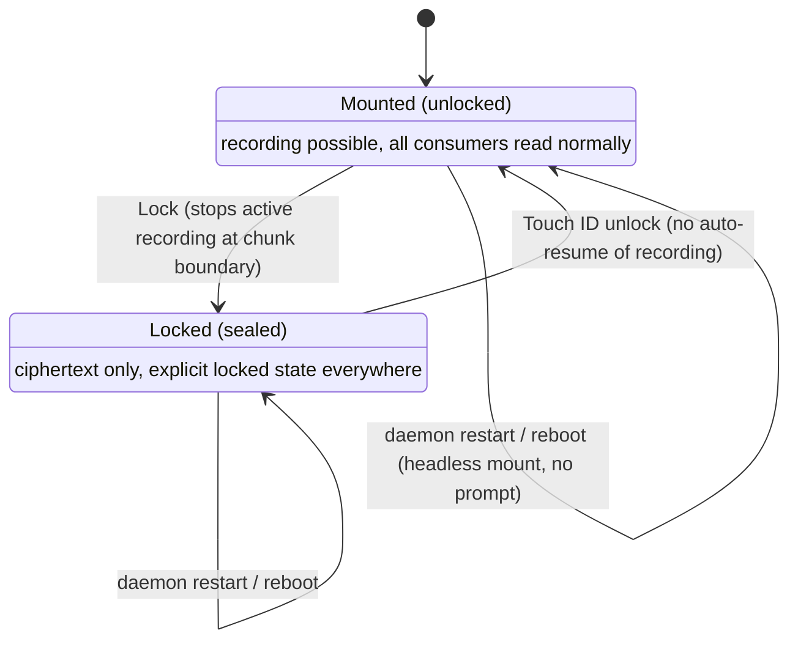
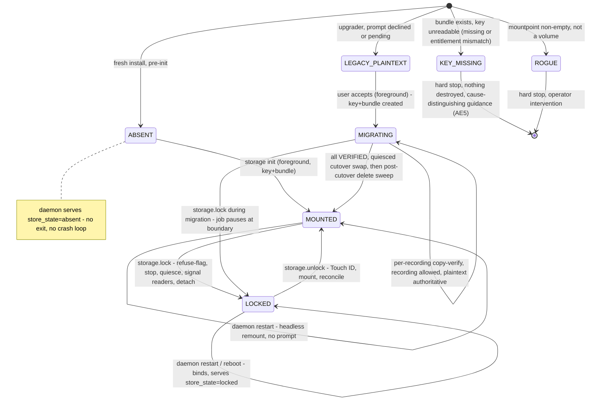
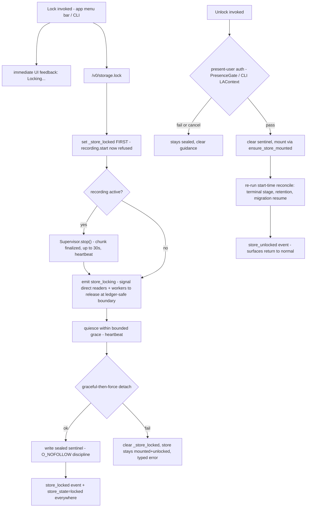

# On-Disk Vault - Encrypted Container and Lock - Plan

## Goal Capsule

- **Objective:** Make "recordings are never plaintext on disk" an honest, default claim — and ship a Touch ID-gated Lock on top of it — by reviving the implementation-ready SCR-236 encrypted-container plan with three post-launch amendments: a manual lock/unlock affordance, migration for the now-existing installed base, and default-on for new installs.
- **Product authority:** This document's Product Contract. `SECURITY.md` is the source of truth for all threat-model statements. Linear SCR-258 tracks the work. The adopted technical base is `docs/plans/2026-07-06-001-feat-scr-236-encrypt-recordings-at-rest-plan.md` ("the base plan"); this plan is the canonical execution artifact and supersedes the base plan as the thing to build.
- **Stop conditions:** Stop and surface if the U1 hardware spike refutes a load-bearing assumption (flock/WAL on the mounted bundle, kill-9 crash safety, headless LaunchAgent Keychain read, mounted-era backup restorability, capture-shaped write performance within the p95 envelope) — that invalidates KTDs, not just a unit. Also stop if the locked-daemon serving model (KTD-14) proves incompatible with the launchd lifecycle on real hardware.
- **Execution profile:** Units in dependency order; **U1's on-hardware spike gates U4 onward and must be run and its results recorded before U4 is designed** (the spike tunes KTD-1/KTD-3/KTD-13). New privacy-bearing tests carry `@pytest.mark.privacy` and stay Vision-free (the CI lane runs only that marker); hardware-dependent tests carry `@pytest.mark.macos_hw`. In worktrees run tests with `PYTHONPATH=src`. Build/test the Swift app (U10) **last and outside any `~/Documents` worktree** — `xcodebuild` inside such a worktree TCC-bricks the session.
- **Open blockers:** None. Deferred-to-implementation questions are enumerated in Outstanding Questions; none block starting Phase A.

---

## Product Contract

### Summary

ScreenCap's local recording data plane — recordings tree, content index, backfill ledger — moves into an app-managed encrypted container that is ciphertext on disk at all times and mounts transparently for every existing consumer. On top of that always-at-rest baseline, a manual **Lock** action seals the store behind present-user (Touch ID) unlock. New installs get the container from the first recording; existing installs migrate via a prompted, user-initiated flow.

### Problem Frame

Post-launch, every recording artifact — `recording.db` (unscrubbed window titles and event text), screenshots, video chunks, transcripts — sits plaintext on disk, protected only by file permissions and FileVault. The driver for changing this now is the competitive pitch, not observed user demand: privacy is the product's strategic wedge, "is data encrypted at rest?" is a standard trust question, and Screenpipe markets an opt-in vault. Screenpipe's vault is structurally weak — plaintext during all normal operation, password-every-time, no OS-keychain integration — which leaves room to beat it on both axes at once: an unconditional at-rest claim it cannot make, plus a lock feature with better unlock UX. The security deltas are real but bounded: backups, copied files, disk images, FileVault-off machines, and the sealed stepped-away state; a live same-user process is unaffected either way.

### Key Decisions

- **Volume-layer encrypted container, not file-level encryption.** Both of the ticket's file-level models were considered and rejected. The lock/unlock-only vault (Screenpipe's model) fails the pitch floor — the claim stays conditional and normal operation is plaintext, the exact weakness the ticket documents in Screenpipe — and rewrites the whole library on every cycle. Per-file transparent encryption breaks the pointer-only MCP read contract and the Swift app's direct frame reads, forces every pipeline subsystem through a decrypt seam, and buys no higher security ceiling (the key is headlessly available either way). The container delivers the unconditional claim with zero read-contract changes.
- **Adopt the SCR-236 plan as the technical base.** That plan is implementation-ready, its load-bearing assumptions were empirically validated (headless `hdiutil` mounts, Keychain behavior, `keyring` failure modes), and its key decisions (Keychain-only key, run-dir outside, sidecar stores inside, Spotlight off) carry forward unchanged. This contract scopes the post-launch deltas; it does not re-litigate the container design.
- **Lock is a manual, deliberate action — no auto-lock triggers.** Locked means unmounted, and unmounted means recording stops; any auto-lock (on screen lock, on idle) would kill all-day background capture. Continuous at-rest encryption is what protects the user the rest of the time; Lock exists for the deliberate sealed state (stepping away, lending the machine, travel).
- **Stop-then-lock, and unlock never auto-resumes recording.** Locking during an active recording stops it cleanly at a chunk boundary before sealing. Unlocking restores access to the library; capture restarts only when the user starts it — no capture the user didn't just ask for.
- **Default-on for new installs; prompted user-initiated migration for upgraders, with no dual-root store.** New installs get the container from the first recording, so the claim holds unconditionally for them. Existing installs remain fully plaintext until they accept the migration prompt — the container and the migration arrive together, avoiding a split old-plaintext/new-encrypted store. Silent auto-migration was rejected: migration transiently needs free disk on the order of the library size and takes real time, which is too risky to run unannounced on machines we cannot see.
- **Touch ID gates the post-Lock remount only; normal mounts are headless.** The all-day LaunchAgent must mount without a user present, so routine daemon starts read the Keychain-held key silently — that headless availability is the shared security ceiling, and `SECURITY.md` says so plainly. An explicit Lock flips the store into a sealed state that survives restarts and reboots until a present-user (Touch ID) unlock.

### Requirements

**Container and coverage**

- R1. The entire local recording data plane — the recordings tree (`recording.db` with wal/shm, screenshots, video chunks, transcripts, exports), the content index, and the backfill ledger — lives inside an app-managed encrypted container whose on-disk artifact is ciphertext at all times.
- R2. Every existing consumer reads recordings unchanged while the store is mounted: the pipeline stages, scrub/mask, terminal stage, retention, OCR indexing, backfill, daemon query verbs, the Swift app's direct frame reads, and MCP agents reading stems off disk.
- R3. Active-recording CPU and memory overhead stays within the current p95 envelope, and capture reliability stays at parity with the plaintext baseline.
- R4. The daemon run-dir (socket, logs, audit log) stays outside the container as plaintext, and this residual is documented.

**Lock affordance**

- R5. A user-facing Lock action seals the store on demand: any active recording stops cleanly at a chunk boundary, in-flight pipeline work quiesces at a crash-safe boundary within a bounded grace period, direct readers are signalled to release open handles, the container unmounts, and the store is ciphertext-sealed.
- R6. While locked, every surface that touches the store — Library, Search, chat recall, MCP verbs, upload/scrub/index/retention, `screencap status` — presents or observes an explicit locked state, never a failure that looks like corruption or data loss.
- R7. Unlock requires present-user authentication (Touch ID with the platform's password fallback) on every unlock surface, and does not auto-resume recording.
- R8. An explicit Lock persists across daemon restarts and reboots — the store stays sealed until present-user unlock. Absent an explicit Lock, daemon start mounts headlessly with no prompt.

**Key custody**

- R9. The container key is Keychain-backed with the corpus-key custody posture — device-local shared access group, never iCloud-synced — and headlessly readable by the entitled daemon for normal mounts.
- R10. When the key or unlock is unavailable (Keychain entry missing, authentication failed or cancelled, entitlement-mismatch fallback), the user gets clear guidance that distinguishes "no key anywhere" from "the key exists but this binary cannot reach it", nothing on disk is destroyed, and there is never a silent fallback to plaintext operation. A lost key means unrecoverable recordings, and both the app and `SECURITY.md` state this plainly.

**Rollout and migration**

- R11. New installs create the container at setup and record into it from the first recording; encryption at rest is the default posture, not a toggle.
- R12. Existing installs are prompted to migrate at a moment they choose; the prompt states the costs (transient free-disk need on the order of the library size, migration duration). Until accepted, the install remains fully plaintext and fully functional.
- R13. Migration is per-recording copy-verify, then a quiesced cutover, then a post-cutover plaintext-delete sweep; it is interruption-safe (a failed or interrupted migration never leaves recordings lost, half-readable, or double-counted, and can resume). Reads and new recordings keep working from the plaintext store throughout, until cutover.

**Storage-location coexistence**

- R16. "Change storage location" keeps working for vault users by relocating the encrypted bundle to the chosen location; installs already on a custom recordings location (or using the env override) stay plaintext, are excluded from the migration prompt, and are documented as outside the at-rest claim.

**Claim and documentation**

- R14. `SECURITY.md` gains an at-rest section stating what the container protects (backups, copies, disk images, FileVault-off machines, other users, the sealed state) and what it does not (live same-EUID access while mounted; the unlock gate is a present-user UX gate, not a cryptographic boundary; for migrated installs, pre-migration backups and deleted-plaintext remanence in host free space / APFS local snapshots); every published claim is structurally true.
- R15. FileVault detection warns — without blocking recording — when FileVault is off (carried from the base plan).

### Key Flows

- F1. Lock
  - **Trigger:** User invokes Lock (recording may be active).
  - **Steps:** The spawn-refusal flag is set first so no new recording can start; the app shows immediate "Locking…" feedback; any active recording stops cleanly at a chunk boundary; a pre-detach `store_locking` signal tells direct readers (Swift frame reads, in-flight pipeline workers) to release open handles at a crash-safe ledger boundary within a bounded grace period; the container unmounts; Library/Search/chat/MCP flip to the explicit locked state; the sealed flag persists across restarts.
  - **Outcome:** Store is ciphertext-sealed until present-user unlock; quiesced work is not lost.
  - **Covers R5, R6, R8.**
- F2. Unlock
  - **Trigger:** User invokes Unlock on a sealed store.
  - **Steps:** Touch ID (or password fallback) succeeds; container mounts; the daemon re-runs its start-time reconcile so quiesced pipeline work (uploads, scrub, indexing, migration) resumes without user action; all surfaces return to normal. Recording does not restart on its own.
  - **Outcome:** Full access restored; a failed or cancelled auth leaves the store sealed with clear guidance.
  - **Covers R7, R10.**
- F3. Upgrade migration
  - **Trigger:** An existing plaintext install updates to a vault-capable version.
  - **Steps:** The app offers migration with stated disk and time costs; on acceptance (foreground, so the one-time Keychain ACL prompt has a user present), recordings are copied and verified per-recording into the new container while recording and reads keep working from the plaintext store; a final quiesced cutover swaps the mountpoint once all recordings are verified; a post-cutover sweep then deletes the plaintext originals; on decline, everything continues plaintext and the offer remains available.
  - **Outcome:** After completion the library is fully inside the container and plaintext originals are gone; interruption before cutover resumes safely with the plaintext store still authoritative.
  - **Covers R11, R12, R13.**

### Acceptance Examples

- AE1. **Covers R1.** Given recordings exist, When a backup tool copies the raw store artifact, Then the copy contains only ciphertext and yields no recording content without the key.
- AE2. **Covers R5, R6.** Given a recording is active, When the user invokes Lock, Then no new recording can start from that moment, the active recording stops at a chunk boundary with no partial-chunk loss, the store unmounts, and the Library shows a locked state rather than an empty or errored library.
- AE3. **Covers R6.** Given the store is locked, When an MCP agent or Search or chat recall queries it, Then the response is an explicit locked indication, not an error or a silently empty result.
- AE4. **Covers R7, R8.** Given the user locked the store and then rebooted, When the daemon starts, Then the store remains sealed and only a present-user Touch ID unlock mounts it; a plain `serve` does not clear the seal.
- AE5. **Covers R10.** Given the Keychain entry is missing, When the daemon attempts a mount, Then it fails with clear guidance, destroys nothing, and does not fall back to recording plaintext; and given an entitlement mismatch (the key exists but this binary cannot reach it), the guidance names that cause rather than a bare "key missing".
- AE6. **Covers R12, R13.** Given an upgrader declines the migration prompt, When they keep using ScreenCap, Then recording and search work exactly as before, fully plaintext; and Given they later accept and the migration is interrupted before cutover, Then no recording is lost, reads still work from the plaintext store, and migration resumes; plaintext originals are removed only by the post-cutover sweep.
- AE7. **Covers R5, R6.** Given a chunk upload is in progress, When the user invokes Lock, Then the store seals within the bounded grace period without waiting for the upload, and after unlock the upload completes without user action.
- AE8. **Covers R6, R10.** Given a locked store (or a key-missing store), When the Swift app renders the Library, Search, or Chat surface, Then it shows the explicit locked state with an Unlock affordance (or, for key-missing, an unrecoverable-key message with no Unlock button), never the empty-library "Nothing recorded yet" welcome screen.

### Success Criteria

- The published claim — recordings are stored in an encrypted container and are ciphertext at rest, with an optional Touch ID-gated lock — survives `SECURITY.md`-grade scrutiny; every stated protection is structurally true.
- A head-to-head comparison row against Screenpipe's vault (always encrypted at rest; lock without password-retyping; OS-keychain integration) is honestly winnable on all three cells.
- p95 CPU and memory during active recording are unchanged within measurement noise, and capture reliability holds the ≥98% floor at parity with plaintext.
- No existing read-path contract changes: current consumers and their tests pass without modification.

### Scope Boundaries

Deferred for later:

- **Per-file / per-recording envelope encryption** (the ticket's Model B). Escalation triggers, carried from the base plan: enterprise procurement rejects the container claim, or crypto-shred deletion becomes a product requirement.
- **Auto-lock triggers** (on screen lock, idle, quit). Incompatible with all-day background capture; revisit only if a deliberate pause-capture mode ever exists.
- **Automatic background migration for upgraders.** Prompted user-initiated only in this scope.
- **Key recovery after Keychain loss.** Mirrors SCR-252's stance for the cloud KEK; the data-loss risk is documented instead (R10).
- **Automatic disk reclamation** (manual `storage compact` only), **run-dir/audit-log encryption**, and **reverse migration / downgrade support** — all carried from the base plan's boundaries.
- **Container support for un-entitled binaries** (pip/pyenv CLI, Debug builds). These are a documented unsupported configuration (KTD-22), not a supported vault consumer.
- **Cloud E2EE** — SCR-238; this work is the local disk layer only.

### Dependencies / Assumptions

- The base plan (`docs/plans/2026-07-06-001-feat-scr-236-encrypt-recordings-at-rest-plan.md`) is implementation-ready and its empirical validations stand; its U1 spike gates downstream work.
- Verified against the codebase (2026-07-12): no container or sparse-bundle implementation exists in `src/` or `macos/`; `corpus_crypto` (AES-256-GCM, `SCE1` framing, shared access group) and the SQLCipher content-index path exist and ship; the Swift app reads frames directly off disk and already handles `.jpg.enc`; `cryptography` and `keyring` are base dependencies; a Keychain-backed KEK pattern exists in `src/screencap/network/crypto.py`.
- The corpus-key custody posture is **split custody** (verified in `src/screencap/corpus_crypto.py` / `src/screencap/keychain_group.py`): entitled binaries (app daemon + bundled CLI) use the shared access group; un-entitled binaries (pip/pyenv CLI, Debug builds) raise `MissingEntitlement` and fall back to a separate `keyring` item. For the container key this means only entitled binaries can mount the shared-group store — see KTD-22.
- The existing corpus encryption is opt-in and default-off, and even when on it never covers video chunks or transcripts — the full-tree claim requires the container. Corpus encryption stays as-is and composes inside the container (KTD-21); no corpus-crypto code changes in this plan.
- Assumption, recorded deliberately: there is no observed user demand for this feature yet; the value proposition is the competitive pitch on the privacy wedge. If that premise changes, revisit priority rather than scope.
- The launch-readiness plan the Linear ticket cites as the deferral source is not present in the repo (it survives only in an unreferenced backup commit); the deferral history is carried by the ticket itself, not by a live document.
- Migration reuses established repo patterns: write-verify-then-delete (SCR-220 plan KTD-2, `auth.py` migration template) and the shipped storage-migration feature (SCR-228).

### Outstanding Questions

Deferred to implementation (none block starting Phase A):

- **Quiescence grace budget.** KTD-15 sets the bound as "seconds, not until-upload-completes" with no value — settle the number during U9 and pin it in the AE7 test.
- **Creation entry points.** Whether `screencap serve --install` retains its base-plan key+bundle creation role alongside the new `storage init`, or `storage init` becomes the single creation entry point — decide in U5.
- **Interim mountpoint during MIGRATING.** Where the container is mounted while the plaintext store still occupies the recordings mountpoint (interim mountpoint naming), and whether Lock-during-migration detaches the interim mount under the same sealed sentinel — decide in U6.
- **Migration ledger location.** Whether the U6 per-recording migration ledger lives in the run-dir (as in the base plan's U6) or inside the container, and what Lock does to an in-flight ledger transaction at the pause boundary — decide in U6.
- **Sealed-and-near-full host.** What `screencap status` surfaces when a sealed store's host volume nears full (bands cannot be compacted and the daemon cannot inspect the sealed store) — decide during U4/U7.
- **Headless/SSH unlock recovery.** KTD-16's present-user rule leaves headless/SSH-only machines with no in-band unlock path; the refusal guidance should name the recovery route (local session / Screen Sharing to the app) so a remote-only Mac mini user is not sealed out — copy work in U5/U8.

### Sources / Research

- Adopted base: `docs/plans/2026-07-06-001-feat-scr-236-encrypt-recordings-at-rest-plan.md` (container KTDs, validated assumptions, deferred-migration design notes preserved in its U6).
- At-rest pattern in production: `SECURITY.md` "At-rest encryption (R3)"; `src/screencap/corpus_crypto.py`; `src/screencap/keychain_group.py`; `src/screencap/content_index.py` (SQLCipher path); `macos/ScreenCap/Controllers/RecordingFrameIndex.swift` (direct reads, `.jpg.enc` handling); `macos/ScreenCap/Controllers/PresenceGate.swift` (LAContext present-user gating).
- Sibling shipped feature reused as the pattern for the lock/migration verbs and UI: `src/screencap/storage_migration.py`, the `storage.migrate` verb (`src/screencap/daemon/app.py`), `src/screencap/daemon/backfill_job.py` (Supervisor-style background job), `macos/ScreenCap/Controllers/PrivacyController.swift` + `macos/ScreenCap/Views/Settings/PrivacySettingsView.swift` (migration UI).
- Typed-state precedents: `StorageMigrationError` reason/message shape (`src/screencap/daemon/errors.py`), `IndexState.STORE_UNAVAILABLE` on success payloads (`src/screencap/content_index.py`), the generic `DaemonError` collapse to avoid in MCP (`src/screencap/mcp/_client.py`).
- Reusable migration/custody patterns: `docs/plans/2026-07-11-002-feat-scr-220-e2ee-shared-copies-plan.md` (KTD-2 write-verify-then-delete, KTD-5 key custody), `docs/plans/2026-07-10-002-feat-change-storage-location-migration-plan.md`.
- Competitive reference: Screenpipe `screenpipe-vault` crate (lock/unlock, ChaCha20-Poly1305, password-derived key, plaintext while unlocked), verified against a local clone 2026-07-12 per Linear SCR-258.

---

## Planning Contract

**Product Contract preservation:** changed from the requirements-only version and again during document review. F1/F2/F3 gained the quiescence, direct-reader-release, unlock-resume, and deferred-delete steps; R5/R6/R10/R13 wording extended accordingly; R16 added (storage-location relocation); AE2/AE5/AE6 tightened and AE8 added (app-surface locked/key-missing rendering); Outstanding Questions added to capture deferred-to-implementation items. All R/F/AE IDs are otherwise stable. These changes resolve internal contradictions surfaced by review; none change product scope.

### Key Technical Decisions

**Adopted from the base plan unchanged:** KTD-1 (encrypted sparse bundle via `hdiutil`, AES-256, APFS inside, at `~/.screencap/store.sparsebundle`), KTD-2 (mountpoint is the recordings directory; sidecars in `.store/`), KTD-6 (shared passphrase-piping helper, no trailing newline), KTD-9 (per-attach host-leak hardening), KTD-11 (FileVault check), KTD-12 (explicit-only compact), KTD-13 (declared image size + host-volume disk guards). **Adopted with amendment:** KTD-5 (key management) amended by KTD-22 (custody). **Amended or superseded:** KTD-3/KTD-10 by KTD-14; KTD-4 by KTD-15/KTD-16; KTD-7 by KTD-18; KTD-8 by KTD-19. Read the base plan's KTD section alongside this one; where they conflict, this plan wins.

- **KTD-14 — The daemon binds first and serves a sealed or absent store; it never exits because the store is locked.** Amends base KTD-3/KTD-10 (mount-before-bind, "never serves any verb against an unmounted store"), which would make a sealed store indistinguishable from a dead daemon — launchd 75-retry loops, `DaemonAutoSpawnError` log dumps to MCP agents, and the Swift Library's "unreachable" state are exactly the corruption-looking failures R6 forbids. Instead: `serve()` binds the socket first, then attempts the mount; a sealed sentinel or ABSENT store is a healthy serving state, not an exit. `daemon.info` carries a `store_state` field (`mounted` / `locked` / `absent` / `error`); store-touching mutation verbs return a typed `store_locked` error envelope (new `DaemonAPIError` subclass, following the `StorageMigrationError` reason/message shape at `src/screencap/daemon/errors.py`); read verbs that must never fail (`content.search`, `transcript.search`, `timeline.query`, `frame.nearest`, `recording.list`, **and `chat.answer`**) instead carry the `store_state` enum on their success payload, following the `IndexState.STORE_UNAVAILABLE` precedent (`src/screencap/content_index.py`). Exit codes remain only for genuinely fatal states (rogue mountpoint, corrupted bundle); `KeychainLocked` during an unlock attempt is a retryable in-band error, not a daemon exit. The supervisor gains a `_store_locked` flag whose `is_locked()` is the `spawn()` refusal flag (the typed refusal fires before any started signal, per the daemon-start-failure learning `docs/solutions/integration-issues/daemon-start-failure-typed-error-before-spawn-2026-06-08.md`); the idle-watchdog interaction is governed by KTD-15 (the in-flight lock *operation* pins the watchdog; the sealed steady state does not — a locked daemon idle-exits normally and the next start re-enters sealed serving).
- **KTD-15 — Lock sets the refusal flag first, quiesces bounded, signals direct readers, then detaches; unlock reconciles.** Lock's sequence, in order: (1) set `_store_locked` at `/v0/storage.lock` **entry**, before anything else, so `recording.start` is refused for the whole stop→quiesce→detach window — otherwise a cron- or MCP-driven start during the up-to-30s stop window spawns a recording the detach then kills mid-chunk (violates AE2); (2) reuse `Supervisor.stop()` verbatim for the active recording (30s budget, `EVENT_RECORDING_FINALIZED`); (3) emit a pre-detach `store_locking` phase event and signal terminal-stage/backfill/index/migration workers to stop at their next ledger-safe boundary with a bounded grace (seconds, not until-upload-completes — the `PipelineLedger`'s crash-safe ordering is what makes an interrupted cycle safe, and AE7 pins the resume) — the Swift app and MCP-adjacent surfaces consume `store_locking` to release open frame handles before the volume goes away, since direct readers have no daemon in the byte path (base KTD-12) and would otherwise see raw EIO/ENOENT mid-read; (4) graceful-then-force detach (the base's ~3s graceful-then-force pattern; force is acceptable here precisely because every writer is ledger-disciplined and readers were signalled — this deliberately differs from `storage compact`, which never forces). On a **failed** detach the store stays mounted and unlocked and `_store_locked` is cleared, surfaced as a typed error (never a half-sealed state). The in-flight lock operation pins the idle watchdog (mirroring `is_migrating()`, `src/screencap/daemon/supervisor.py`) so an auto-spawned daemon cannot idle-exit mid-quiescence. Unlock re-runs the daemon-start reconcile path (terminal-stage resume, retention sweep, migration auto-resume) because all resume machinery is currently start-time-only (`src/screencap/daemon/app.py`, `src/screencap/daemon/supervisor.py`) — without this, F2's "surfaces return to normal" would silently exclude pending uploads until an unrelated restart. The whole lock chain emits progress heartbeats (`on_progress(phase)` pattern) so the Swift watchdog never stares at a silent blocking wait (`docs/solutions/integration-issues/inner-timeout-unreachable-behind-outer-watchdog-2026-06-24.md`), and `store_locking` / `store_locked` / `store_unlocked` events ride `/v0/events` so app and MCP surfaces update without polling.
- **KTD-16 — The unlock gate is a present-user UX gate on every surface, honestly documented as not a cryptographic boundary; no store-mutation MCP tools exist.** In the app, unlock is gated by a store-scoped instance of the existing `PresenceGate` machinery (`macos/ScreenCap/Controllers/PresenceGate.swift` — `LAContext`, `.deviceOwnerAuthentication`, fail-closed) with its own reason copy and no grace-window reuse from the corpus gate. In the CLI, `screencap storage unlock` evaluates the same LocalAuthentication policy via the established dynamic-`objc` bridging pattern (`src/screencap/redaction/ocr.py`), adding `pyobjc-framework-LocalAuthentication` as a darwin dependency; where no LA surface exists (SSH, headless session) unlock refuses with guidance naming the recovery route — present-user means present. **The MCP server exposes no `storage.lock`/`storage.unlock` or any other store-mutation tool** — a headless agent cannot satisfy present-user auth, and pinning this against drift blocks the prompt-injected-agent-unseals-the-vault exploit; U9 asserts the built server's tool set contains no store-mutation tool. The sealed sentinel is cleared **only** by the unlock flow: base KTD-4's "explicit interactive start clears the sentinel" escape hatch is deleted, since it would let a plain `screencap serve` remount a locked store with no authentication, falsifying AE4. `SECURITY.md` states plainly that a same-EUID process can read the Keychain key and attach directly — the gate defends the casual-access case (someone else at your unlocked machine), not a local attacker. Never eagerly evaluate LA or decrypt the key on app launch or menu render — only on the user's explicit unlock action (`docs/solutions/integration-issues/keychain-auth-prompt-eager-decrypt-at-launch-2026-07-08.md`).
- **KTD-18 — Upgrade migration is a prompted, record-through background job with deferred deletion.** Supersedes base KTD-7's deferral and resolves its two forks with the brainstorm decisions: (a) *readable-during-migration* — reads and new recordings stay on the plaintext store, which remains the single authoritative root until a final quiesced cutover swap (no dual-root read seam); (b) *key creation* — the key and bundle are created in the foreground acceptance flow (the user is present when they accept the prompt), never by a launchd tick. The job mirrors `daemon/backfill_job.py`: held on app state, idempotent start, `status()` snapshots that are recording-name-free (R9 discipline), cancel, worker-thread progress bridged onto the event bus, auto-resume policy on daemon start and on unlock. The per-recording ledger follows `PipelineLedger`'s on-disk discipline (closed-set seeding, `BEGIN IMMEDIATE`, crash-safe ordering, SHA-256 verify per file), but **deletion is deferred**: each recording advances `PENDING → COPIED → VERIFIED` during the job; cutover is gated on all recordings `VERIFIED`; the `PLAINTEXT_DELETED` transition runs only as a **post-cutover, ledger-tracked, resumable sweep** after the swap makes the container authoritative — so migrated recordings never vanish from the plaintext read-root mid-migration (the readable-during-migration guarantee), and R12's library-size transient-disk warning is priced for exactly this. The **sidecar stores (content index, backfill ledger) are copied only inside the quiesced cutover window** — under the SCR-228 `acquire_migration` reservation, after in-flight index/backfill writers have paused — never per-round, so record-through writes are not silently dropped. Recording during migration works — the actively-recording directory is skipped and picked up next round; cutover waits for the active recording to finish. Lock during migration pauses the job at its current recording boundary, seals, and the job auto-resumes after unlock. The `acquire_migration` reservation stays what it is — the mutual-exclusion primitive for the *relocation* move — and encrypt-migration acquires it only for the brief final cutover swap. Disk preflight (library-size transient need) and ENOSPC mid-copy leave that recording `PENDING` with plaintext intact and the job in a distinct **paused** state; completion surfaces a one-time suggestion to run `storage compact`.
- **KTD-19 — "Change storage location" relocates the encrypted bundle; the off-switch is not a plaintext downgrade.** Amends base KTD-8. For vault installs, `/v0/storage.migrate` moves the *detached* bundle to the chosen location (quiescent, holds `mount.lock` for the whole cycle, never force-detaches past an active recording — the compact discipline; SCR-228's cloud-synced-target preflight is **retained** for the bundle move, rationale: band-sync corruption risk, not confidentiality) and updates config so the bundle lives on the chosen volume and the mountpoint remains the configured recordings dir. Without this, every default-on new install would find the shipped Settings "Change…" button broken. Pre-existing custom-location installs (`recordings_dir` in config) and the `SCREENCAP_RECORDINGS_DIR` env override remain plaintext bypasses: excluded from the F3 prompt, documented as outside the claim (R16). `container_enabled` defaults on, standard `_BOOL_KEYS` wiring, but the off value is **honored only when no container bundle exists** (fresh plaintext installs and tests): on an install that already has a bundle, setting `container_enabled=false` does **not** flip to a plaintext mountpoint — the daemon refuses to serve plaintext and surfaces a typed "downgrade unsupported" state, and the settings docstring states this boundary. This keeps R11 ("not a toggle"), R10 (no silent plaintext), and the deferred-downgrade decision consistent.
- **KTD-20 — The locked state is a typed enum on success payloads for read surfaces, a typed error for mutations, and an independent property in the Swift app.** MCP tool results gain a `store_state` field (the `index_state` pattern) rather than letting a daemon 409 collapse into the generic `DaemonError` string (`src/screencap/mcp/_client.py`) that FastMCP surfaces as an opaque tool failure. In the Swift app, `store_state` is modelled as an **independent published property on `RecordingsIndex`, parsed from the `recording.list` success envelope** (alongside the existing CLI-fallback flag) — **not** a `LoadErrorKind` case, because that verb succeeds with an empty payload and never throws, so an error-kind model would never fire and the Library would fall through to the "Nothing recorded yet" welcome screen (the R6 data-loss look). `LibraryView` (and the Search and Chat surfaces) branch on `store_state` **before** the `recordings.isEmpty` check: `locked` → first-class locked state with an Unlock action; `absent` → onboarding guidance; `error` (the AE5 key-missing case) → an unrecoverable-key state stating the R10 consequence plainly, with **no** Unlock button (retrying cannot help). The CLI fallback (`screencap list --json`) also emits the typed state so the fallback path cannot render an empty library. The Swift app also maps a mid-read file failure (a stem read that fails because a lock detached the volume) to a `store_state` re-check that renders the locked state rather than a raw error.
- **KTD-21 — Corpus encryption stays as-is, layered inside the container.** The opt-in corpus crypto (encrypted stills, SQLCipher index, Touch ID display gating) keeps protecting against un-entitled same-EUID readers *while the store is mounted* — a case the container cannot cover — so the layers compose rather than collapse. No corpus-crypto code changes in this plan.
- **KTD-22 — Only entitled binaries are supported container consumers; un-entitled binaries are a documented unsupported configuration.** The container key uses the split-custody corpus-key posture: entitled binaries (the app daemon + bundled CLI, one code identity) read it from the shared access group; un-entitled binaries (pip/pyenv CLI, Debug builds) get `errSecMissingEntitlement` and fall back to a separate legacy `keyring` item. For the *corpus* key a mismatch merely degrades Search; for the *container* key, composed with the base-plan bundle-exists-but-key-missing hard stop, the same mismatch would render the whole library unmountable with a misleading "key missing" diagnosis. Resolution: entitled binaries are the only supported container consumers; the un-entitled path is a documented unsupported configuration (an un-entitled daemon cannot mount the shared-group store). The KTD-5 hard-stop guidance must distinguish **"no key in any channel"** (genuine loss) from **"the key exists in the shared group but this binary lacks the entitlement to read it"** (naming entitlement mismatch as the probable cause and pointing at the entitled app/CLI), so a developer running a pip/dev-source daemon gets an accurate diagnosis instead of a false data-loss alarm. `SECURITY.md` and `README` state which binaries are supported vault consumers.
- **KTD-23 — The lock/unlock/encrypt verbs are audit-logged.** `/v0/storage.lock`, `/v0/storage.unlock`, and `/v0/storage.encrypt.start` append records via the existing `audit_log.record_verb` pattern (peer PID, binary path, outcome), matching the repo's documented audit criterion (unlock unseals the user's entire deliberately-sealed store on the word of a same-EUID caller — the single most security-consequential transition this plan adds).

### High-Level Technical Design

Store lifecycle as the daemon now serves it — the LOCKED and MIGRATING states are live serving states, not exits; plaintext deletion is a post-cutover sweep (amends the base plan's diagram):

The Lock sequence and its resume counterpart:

### Sequencing

Three phases. Phase A revives the base plan; Phase B makes the daemon lock-capable; Phase C delivers migration, coexistence, and the user-facing surfaces.

- **Phase A (base revival):** U1 → U2 → U4; U3 is an independent refactor landing before or parallel to U4; U7 after U1; U5 (CLI group + funnel guard) after U4.
- **Phase B (lock):** U9 after U4 and U5.
- **Phase C (migration + surfaces):** U6 after U4 (job) and U9 (lock-during-migration interplay); U11 after U4/U5; U10 after U9 and U6; U8 last.

The U1 on-hardware spike gates U4 onward and must be run and recorded first. Base-plan unit specifications are incorporated by reference — each Phase A unit below names its amendments; where this plan is silent, the base plan's unit text is authoritative.

---

## Implementation Units

| U-ID | Title | Key files | Depends on |
|---|---|---|---|
| U1 | Container primitives + hardware spike | `src/screencap/container.py`, `tests/test_container.py` | — |
| U2 | Container key management (split-custody aware) | `src/screencap/container.py`, `tests/test_container_key.py` | U1 |
| U3 | Data-plane root resolver + dot-entry fix | `src/screencap/config.py`, `src/screencap/catalog.py` | — |
| U4 | Sealed-capable daemon serve model | `src/screencap/daemon/server.py`, `daemon/app.py`, `daemon/errors.py` | U1, U2, U3 |
| U5 | CLI `storage` group + funnel guard | `src/screencap/cli/__init__.py` | U4 |
| U6 | Upgrade migration job (deferred delete) | `src/screencap/migration.py`, `daemon/encrypt_job.py` | U4, U9 |
| U7 | FileVault detection | `src/screencap/container.py`, `daemon/app.py` | U1 |
| U8 | SECURITY.md, docs, settings | `SECURITY.md`, `README.md`, `CLAUDE.md` | all others |
| U9 | Lock/unlock verbs + quiescence engine | `daemon/app.py`, `daemon/supervisor.py`, `terminal_stage.py`, `cli/__init__.py`, `mcp/server.py` | U4, U5 |
| U10 | Swift surfaces: lock UX, migration prompt, onboarding | `macos/ScreenCap/…` | U6, U9 |
| U11 | Bundle relocation via storage.migrate | `src/screencap/storage_migration.py` | U4, U5 |

### U1. Container primitives and feasibility spike

- **Goal:** The `screencap.container` module (create/attach/detach/compact/status wrapping `hdiutil`) validated empirically on real hardware.
- **Requirements:** R2, R3, R8. **Covers KTD-1, KTD-6, KTD-9.**
- **Dependencies:** none.
- **Files:** `src/screencap/container.py` (new), `tests/test_container.py` (new).
- **Approach, test scenarios, verification:** adopt the base plan's U1 verbatim (spike checklist including flock canary, kill-9 crash safety, mounted-era backup restore, capture-shaped write benchmark, near-full host, Keychain portability, compact-shrink). The capture-shaped write benchmark is the empirical gate for R3; final R3 sign-off is the Verification Contract's post-U4 "Performance (R3)" gate.
- **Execution note:** Run the spike checklist on real hardware first and record outcomes in the test file's module docstring; downstream units assume these results. Do not run the spike from inside a `~/Documents` worktree if it invokes `xcodebuild` — see the TCC session-bricking note in project memory.

### U2. Container key management (split-custody aware)

- **Goal:** Keychain-backed key functions that can never orphan an existing store and that diagnose entitlement mismatch accurately.
- **Requirements:** R9, R10. **Covers KTD-5 (amended), KTD-22.**
- **Dependencies:** U1.
- **Files:** `src/screencap/container.py`, `tests/test_container_key.py` (new).
- **Approach:** adopt the base plan's U2 (read-only `get`, create only when neither bundle nor key exists, foreground-only creation), with two amendments: (1) the key item lives in the shared access group with the corpus-key custody posture (`kSecAttrSynchronizable=false`, readable after first unlock) so the entitled app and daemon read it without prompts (R9; stable-code-identity constraint per `docs/solutions/build-errors/daemon-tcc-identity-migration-2026-06-30.md`); (2) the bundle-exists-but-key-unreadable hard stop distinguishes **"no key in any channel"** from **"key present in the shared group but this binary lacks the entitlement to read it"** (KTD-22), and the guidance for the latter names entitlement mismatch and points at the entitled app/CLI rather than reporting data loss. Un-entitled binaries are a documented unsupported container configuration.
- **Test scenarios:** the base plan's U2 set, plus: an entitled-context read succeeds without prompt; a simulated `errSecMissingEntitlement` on a bundle-present store yields the entitlement-mismatch hard-stop message (not "key missing"), bundle bytes untouched; a genuinely absent key on a bundle-present store yields the "no key anywhere" message.
- **Verification:** `@pytest.mark.privacy` tests green (keyring mocked); one manual check that the first `set_password` from the packaged daemon triggers a single visible ACL prompt.

### U3. Data-plane root resolver and path unification

- **Goal:** All data-plane paths resolve through container-aware chokepoints; run-dir paths provably never do; no behavior change while the flag is off.
- **Requirements:** R1, R4. **Covers KTD-2, KTD-19 (seam only).**
- **Dependencies:** none (pure refactor; lands before or parallel to U4).
- **Files:** `src/screencap/config.py`, `src/screencap/content_index.py`, `src/screencap/backfill/ledger.py`, `src/screencap/catalog.py`, `tests/test_config_paths.py` (new).
- **Approach:** adopt the base plan's U3, with one amendment: add an explicit `d.name.startswith(".")` skip to `catalog.list_recordings`'s directory iteration (`src/screencap/catalog.py`) — research showed it currently skips `.store/` only incidentally (no `recording.db` inside), and a coincidentally-named file would surface as a phantom recording.
- **Test scenarios:** the base plan's U3 set, plus: a `.store/` directory containing a stray `recording.db` is still not listed as a recording.
- **Verification:** full existing suite passes unchanged with the flag off (`PYTHONPATH=src pytest tests/`); new tests `@pytest.mark.privacy`.

### U4. Sealed-capable daemon serve model

- **Goal:** The daemon binds first, mounts lazily, and serves `mounted` / `locked` / `absent` as healthy states with typed envelopes — never exiting or crash-looping because the store is sealed or not yet initialized.
- **Requirements:** R6, R8, R9, R10. **Covers KTD-14; amends base KTD-3/KTD-10. Covers F1/F2 (serving side).**
- **Dependencies:** U1, U2, U3.
- **Files:** `src/screencap/daemon/server.py`, `src/screencap/daemon/app.py`, `src/screencap/daemon/errors.py`, `src/screencap/daemon/supervisor.py`, `src/screencap/engine/disk_policy.py` (host-volume guards per base KTD-13), `tests/daemon/test_serve_container.py` (new).
- **Approach:** Rework the base plan's U4: `serve()` binds the socket, then resolves store state under `mount.lock`. Sealed sentinel present → serve with `store_state=locked`, no mount attempt. ABSENT → serve with `store_state=absent` (`daemon.info` names `storage init`), covering the SMAppService-starts-daemon-before-onboarding window. Only ROGUE/corrupted-bundle remain operator hard-stops; a key-unreadable mount attempt yields the KTD-22 cause-distinguishing error; `KeychainLocked` at a mount attempt surfaces as a retryable in-band error. New `StoreLockedError`/`StoreAbsentError` in `daemon/errors.py` mirroring `StorageMigrationError`'s reason/message shape; store-touching mutation verbs raise them; read verbs (`recording.list`, `content.search`, `transcript.search`, `timeline.query`, `frame.nearest`, `chat.answer`) return their normal envelope with `store_state` set and empty results, per the `IndexState` precedent. Supervisor gains `_store_locked` + `is_locked()` used as the `spawn()` refusal flag (the idle-watchdog pin is the in-flight-operation-only rule from KTD-15, wired in U9); `spawn()` refuses with the typed error before any started signal. This unit delivers only the **daemon-side** `store_state` field and typed envelopes (verifiable via `daemon.info` / the HTTP API); CLI-visible confirmation (`screencap status` / `list --json` rendering the locked/absent state) lands with U5, consistent with the Verification Contract's "U4, U5" split for AE4.
- **Test scenarios:**
  - Daemon start with sealed sentinel → binds, serves; `daemon.info` reports `store_state=locked`; no mount attempted; exit code paths unreached.
  - Covers AE4 (daemon arm): sealed sentinel + reboot-shaped restart → still sealed; plain `serve` does not clear it.
  - Covers AE5: bundle present + key genuinely missing → typed "no key anywhere" hard error; bundle present + simulated entitlement mismatch → typed entitlement-mismatch error; both leave bundle bytes untouched and create no plaintext dir.
  - Covers AE3 (daemon side): each read verb (including `chat.answer`) against a locked store returns `store_state=locked` with empty results, not a 500 and not a silent empty payload indistinguishable from "no recordings".
  - `recording.start` while **locked** → typed refusal before any started event.
  - `recording.start` while **ABSENT** (fresh install, pre-init) → typed `StoreAbsentError` refusal before any started signal, and no plaintext directory is created at the mountpoint (the historic silent-plaintext-fallback path).
  - ABSENT → daemon serves; `daemon.info` carries `store_state=absent`; auto-spawned `screencap status` reports it and exits 0.
  - Idle-shutdown fires normally while locked (locked daemon may exit; next start re-enters sealed serving).
  - `container_enabled=false` on a **no-bundle** install → `serve()` byte-identical to today (regression). `container_enabled=false` on a **bundle-present** install → typed "downgrade unsupported" state, no plaintext served (KTD-19).
  - Disk guards evaluate the host volume backing the bundle, not the mounted volume's virtual free space (base KTD-13).
- **Verification:** `PYTHONPATH=src pytest tests/daemon/ -m privacy`; manual: LaunchAgent daemon on hardware mounts headlessly at login; with a sealed store it stays alive.

### U5. CLI `storage` group and funnel guard

- **Goal:** All store lifecycle commands live under the shipped `storage` group, and daemon-independent CLI commands respect the sealed/absent states instead of silently creating plaintext at the mountpoint.
- **Requirements:** R6, R7 (CLI arm), R11. **Covers KTD-16 (CLI arm), KTD-17 naming; base KTD-4 as amended.**
- **Dependencies:** U4.
- **Files:** `src/screencap/cli/__init__.py`, `pyproject.toml` (add `pyobjc-framework-LocalAuthentication` for darwin), `tests/test_cli_container.py` (new).
- **Approach:** Adopt the base plan's U5 funnel design with the naming amendment: subcommands join the existing `storage` group (`src/screencap/cli/__init__.py`) — `init`, `compact` — not a new `store` group. **`storage lock`/`unlock` daemon-verb routing ships in U9** (which owns the verbs); U5 provides the CLI-local seal/unseal **fallback** used only when no daemon responds (never force-detaching past an active recording), the LocalAuthentication (`deviceOwnerAuthentication`) evaluation via the dynamic-`objc` bridge before clearing the sentinel (no LA surface → refuse with recovery-route guidance), and the shared `pyobjc-framework-LocalAuthentication` dependency. The CLI funnel (`get_recordings_dir` and friends) never mounts through a sealed sentinel and reports the locked state with the next step, and never `mkdir`s a plaintext directory at the mountpoint. `screencap status` renders `store: locked` / `store: absent`, exit 0. Decide the `serve --install` vs `storage init` creation-entry-point question here (Outstanding Questions). Keep imports deferred (`--help` latency).
- **Test scenarios:**
  - `storage init` on ABSENT creates key+bundle (foreground); idempotent no-op message on an existing store; bundle-absent + key-present state reuses the key.
  - CLI-local seal fallback (no daemon): the sentinel uses the `O_NOFOLLOW` + realpath-parent discipline, mode `0o600`.
  - Covers AE4 (CLI arm): CLI-local unseal with LA evaluation stubbed to fail/cancel → sentinel intact, non-zero exit, recovery guidance; stubbed to pass → sentinel cleared, mount proceeds.
  - Unlock with no LA surface available → refusal naming the present-user constraint and the recovery route, sentinel intact.
  - `view`/`export`/`info` with store sealed → locked-state message, no plaintext dir created, exit non-zero.
  - Flag off (no-bundle install) → zero new calls (regression); `screencap --help` latency unchanged.
- **Verification:** CLI tests green in the privacy lane; manual Touch ID prompt check for the CLI-local unseal on hardware.

### U6. Upgrade migration job (deferred delete)

- **Goal:** Existing plaintext libraries move into the container via a prompted, resumable, record-through background job that copies and verifies before cutover and deletes plaintext only after.
- **Requirements:** R11, R12, R13. **Covers KTD-18, KTD-23 (encrypt.start audit); supersedes base KTD-7/U6-deferred. Covers F3.**
- **Dependencies:** U4, U9 (lock-during-migration pause + audit seam).
- **Files:** `src/screencap/migration.py` (new), `src/screencap/daemon/encrypt_job.py` (new, mirrors `daemon/backfill_job.py`), `src/screencap/daemon/app.py` (`/v0/storage.encrypt.start|status|cancel`), `src/screencap/cli/__init__.py` (`storage encrypt`), `tests/test_migration.py` (new).
- **Approach:** KTD-18 verbatim — plaintext store stays the single authoritative root for reads and new recordings until the final quiesced cutover swap; key+bundle creation happens in the foreground acceptance flow. Job shape mirrors `BackfillJob`: idempotent start, recording-name-free status snapshots, cancel, event-bus progress, `should_auto_resume()` on daemon start and on unlock. Per-recording ledger `PENDING → COPIED → VERIFIED` during the job with SHA-256 verify per file; cutover gated on all-`VERIFIED`; `PLAINTEXT_DELETED` runs as a **post-cutover, ledger-tracked, resumable sweep**. Sidecar stores (content index, backfill ledger) are copied **only inside the quiesced cutover window** (under `acquire_migration`, after index/backfill writers pause), never per-round. Actively-recording directory is skipped per round; cutover waits for any active recording. A distinct **paused** state carries the ENOSPC/disk-preflight reason (plaintext intact); completion emits a one-time `storage compact` suggestion and (per U8) notes the remanence residual. `storage.encrypt.start` is audit-logged (KTD-23). Custom-`recordings_dir` installs are excluded (R16): the verb refuses with a typed reason naming the boundary. Decide the interim-mountpoint and ledger-location questions (Outstanding Questions) here.
- **Test scenarios:**
  - Covers AE6: decline → nothing changes; accept then kill mid-copy between COPIED and VERIFIED → resume re-verifies, no loss, no double-delete, plaintext still authoritative and readable; accept while a recording is active → that recording skipped this round, migrated next round, cutover waits.
  - Deferred-delete: mid-migration, an already-VERIFIED recording is still listed and readable from the plaintext root (does not vanish); plaintext originals removed only after the post-cutover sweep; a kill between cutover and sweep completion → sweep resumes, container authoritative, no orphaned plaintext left indefinitely.
  - End-to-end multi-recording fixture: contents byte-identical inside the container; no plaintext remains after the sweep; consumers read normally through the mountpoint.
  - Sidecar stores migrate inside the cutover window and are readable through their U3 chokepoints afterward; a row written during record-through before cutover is present after migration (not dropped by a per-round copy).
  - Recording start/stop and `status` work while the job runs (record-through).
  - Lock during migration → job pauses at the current recording boundary, store seals; unlock → job auto-resumes (Covers F1/F2 interplay).
  - Disk preflight failure and mid-copy ENOSPC → job enters the distinct paused state with a typed reason; plaintext intact; daemon keeps serving.
  - Corrupt/missing ledger → treated as not-done; re-run converges.
  - Custom-`recordings_dir` install → `storage.encrypt.start` refuses with the documented boundary reason.
  - Status snapshots contain no recording names or paths (R9 discipline, asserted); an `encrypt.start` audit record is written with peer provenance and outcome.
- **Verification:** `@pytest.mark.privacy` suite green; manual migration of a real dev library on hardware followed by a capture-test sanity run.

### U7. FileVault detection and surfacing

- **Goal:** FileVault status checked at daemon start and visible without blocking anything.
- **Requirements:** R15. **Covers base KTD-11.**
- **Dependencies:** U1.
- **Files:** `src/screencap/container.py`, `src/screencap/daemon/app.py`, `src/screencap/cli/__init__.py`, `tests/test_filevault.py` (new).
- **Approach, test scenarios, verification:** adopt the base plan's U7 verbatim. No amendments.

### U8. SECURITY.md, docs, and settings wiring

- **Goal:** The claim is documented as honestly as the codebase's standard demands; the flag is operable.
- **Requirements:** R4, R10, R14, R16. **Covers KTD-16 (documentation arm), KTD-19 (docs), KTD-21, KTD-22.**
- **Dependencies:** U1–U7, U9–U11 landed (documents shipped behavior).
- **Files:** `SECURITY.md`, `README.md`, `CLAUDE.md`, `src/screencap/cli/__init__.py` (`_BOOL_KEYS` + settings docstring).
- **Approach:** Extend the base plan's U8 with the delta: the lock affordance's semantics (manual-only, stop-then-lock, sealed across reboots); the unlock gate stated as a present-user UX gate, not a cryptographic boundary (same-EUID ceiling unchanged); the claim boundaries — legacy custom-location installs and the env override are plaintext and outside the claim; run-dir residual; QuickLook thumbnails; **for migrated installs, pre-migration backups remain plaintext and deleted plaintext originals may persist in host free space and APFS local snapshots until overwritten/expired (FileVault covers the free-space residual)**; **an MCP stem resolved before Lock may fail mid-read (documented R6 boundary), and the app maps that to a locked-state re-render**; the key-loss consequence (R10) including the selective-restore caveat and the entitlement-mismatch diagnosis (KTD-22); which binaries are supported vault consumers; corpus-crypto layering (KTD-21) as complementary; the `container_enabled=false` off-value being a no-op-or-refusal on bundle-present installs (never a plaintext downgrade); downgrade unsupported. `container_enabled` joins `_BOOL_KEYS` with the existing round-trip test pattern and the downgrade-unsupported docstring.
- **Test scenarios:** Test expectation: none — documentation and settings-key wiring; the settings key extends an existing round-trip test.
- **Verification:** `screencap settings --set container_enabled=false` round-trips on a no-bundle install; SECURITY.md section reviewed against shipped behavior of all landed units.

### U9. Lock/unlock verbs and the quiescence engine

- **Goal:** `storage.lock` seals a live store safely in bounded time without a start-race or mid-read reader failure; `storage.unlock` restores it and resumes everything that was quiesced.
- **Requirements:** R5, R6, R7, R8. **Covers KTD-15, KTD-16 (daemon arm), KTD-20, KTD-23; base KTD-4 as amended. Covers F1, F2.**
- **Dependencies:** U4, U5.
- **Files:** `src/screencap/daemon/app.py`, `src/screencap/daemon/supervisor.py`, `src/screencap/terminal_stage.py`, `src/screencap/cli/__init__.py` (lock/unlock daemon-verb clients), `src/screencap/mcp/server.py`, `src/screencap/mcp/_client.py`, `tests/daemon/test_store_lock.py` (new), `tests/test_mcp_locked_state.py` (new).
- **Approach:** `/v0/storage.lock`, in KTD-15 order: set `_store_locked` at **verb entry** (refusing `recording.start` for the whole window); stop the active recording via `Supervisor.stop()` (unchanged, 30s budget); emit `store_locking` and signal terminal-stage/backfill/index/encrypt workers to halt at their next ledger-safe boundary within a bounded grace — this requires a cooperative stop seam in the terminal stage: thread an optional `stop_event` into `run_terminal_stage` (`src/screencap/terminal_stage.py`), mirroring `backfill_job._stop_event`, checked between per-chunk ledger transitions, and have the quiescence engine pass it to in-flight resume tasks; graceful-then-force detach (force is the backstop when the grace budget expires first); write the sealed sentinel; emit `store_locked`. On a failed detach, clear `_store_locked`, leave the store mounted+unlocked, return a typed error. Pin the idle watchdog for the in-flight operation only. Progress heartbeats (`on_progress(phase)`) throughout. `/v0/storage.unlock`: the surface (app PresenceGate / CLI LA) performs present-user auth; the verb trusts its same-EUID caller (documented); clear sentinel, `ensure_store_mounted()`, re-run the start-time reconcile (terminal-stage resume, retention sweep, encrypt-job auto-resume), emit `store_unlocked`. `storage.lock`/`unlock` and `encrypt.start` are audit-logged (KTD-23). The CLI thin daemon-verb clients for `storage lock`/`unlock` ship here (U5 owns only the no-daemon fallback). MCP: read-tool results gain `store_state`; tool functions catch the daemon's typed locked error and return it as data, never an opaque `DaemonError` traceback; the built MCP server exposes **no** store-mutation tool.
- **Technical design (directional):** the lock verb is a small state machine — `REFUSE_SET → STOPPING → SIGNAL_READERS → QUIESCING → DETACHING → SEALED` — each phase heartbeat-reported and individually bounded; a failed detach unwinds to `MOUNTED_UNLOCKED` with `_store_locked` cleared, never a half-sealed state.
- **Test scenarios:**
  - Covers AE2: lock during active recording → the refuse flag is set at entry (a concurrent `recording.start` is refused), the chunk is finalized (no partial-chunk loss), store sealed, `store_state=locked` everywhere.
  - Start-race: a `recording.start` issued during the stop window is refused, not spawned-then-killed.
  - Covers AE7: lock during an in-flight terminal-stage upload → the `stop_event` halts it at a ledger-safe boundary and seals within the grace budget without waiting for the upload; ledger state consistent; unlock → reconcile resumes and completes the upload with no user action.
  - Covers AE3 (MCP arm): each MCP read tool against a locked store returns `store_state=locked` as data, not a tool-call exception; the built server exposes no lock/unlock/store-mutation tool (asserted on the tool set).
  - Direct-reader signal: `store_locking` is emitted before the detach window opens.
  - Lock with nothing active → seals fast; idempotent second lock is a no-op with a clear message.
  - Detach fails past graceful+force → typed error, store remains mounted and usable, `_store_locked` cleared, sentinel not written.
  - Unlock with Keychain locked → retryable in-band error, sentinel intact.
  - `store_locking`/`store_locked`/`store_unlocked` events observed on `/v0/events`; MCP liveness subscription survives the cycle; lock/unlock audit records carry peer provenance and outcome.
  - Force-detach path only in lock (compact still never forces — asserted by contrast test).
- **Verification:** privacy-lane tests green; manual on hardware: lock from the menu bar during a recording with an upload in flight, watch heartbeat phases, unlock with Touch ID, confirm the upload completes.

### U10. Swift surfaces: lock UX, migration prompt, onboarding ordering

- **Goal:** Lock/Unlock and the migration offer are first-class app surfaces; a sealed, absent, or key-missing store never looks broken on any read surface; onboarding creates the store before the daemon needs it.
- **Requirements:** R6, R7, R10, R11, R12. **Covers KTD-16 (app arm), KTD-20 (app arm); resolves the base plan's Swift-onboarding item. Covers AE8.**
- **Dependencies:** U6, U9.
- **Files:** `macos/ScreenCap/Views/MenuBarMenu.swift` (+ `MenuBarMenuPolicy.swift`), `macos/ScreenCap/State/RecordingsIndex.swift`, `macos/ScreenCap/Views/Library/LibraryView.swift`, `macos/ScreenCap/Views/Search/` (Search surface), the Chat/recall surface, `macos/ScreenCap/Controllers/PresenceGate.swift` (store-scoped instance), `macos/ScreenCap/Controllers/PrivacyController.swift`, `macos/ScreenCap/Views/Settings/PrivacySettingsView.swift`, `macos/ScreenCap/Controllers/DaemonInstallController.swift`, `macos/ScreenCapTests/` (matching tests).
- **Approach:** Model `store_state` as an **independent published property on `RecordingsIndex`**, parsed from the `recording.list` success envelope (not a `LoadErrorKind` case — that verb never throws, KTD-20). `LibraryView`, the Search view, and the Chat surface branch on `store_state` **before** the `recordings.isEmpty` / empty-results check: `locked` → first-class locked state (icon, "Library is locked" / equivalent, Unlock button through the store-scoped `PresenceGate` — fail-closed, own reason copy, no eager LA evaluation on render); `absent` → onboarding guidance; `error` (key-missing) → an unrecoverable-key state stating the R10 consequence plainly ("These recordings can't be recovered — the encryption key is missing"), **no** Unlock button. A stem read that fails mid-lock maps to a `store_state` re-check rather than a raw error. Menu bar gains Lock (and Unlock when sealed), state-driven off `store_state`; invoking Lock gives immediate "Locking…" feedback decoupled from the async stop→quiesce→detach chain (the HUD-freeze learning), heartbeat phases surfaced, only errors blocking. Migration prompt: a one-shot Library banner for eligible upgraders plus a persistent entry in the Privacy settings storage section, reusing the migration UI pattern; the reused `migrationState` model is **extended with a distinct paused case** ("waiting for free disk space — will resume automatically") so the ENOSPC pause is not rendered as `.failed`; shows disk/time costs; decline dismisses the banner, settings entry remains. Onboarding: `DaemonInstallController` runs `storage init` via the bundled CLI (foreground, Keychain ACL context) before SMAppService registration; a daemon that started pre-init shows the absent-state guidance rather than an error.
- **Test scenarios:**
  - Covers AE8: Library, Search, and Chat render the locked state (not empty, not generic error) from a `store_state=locked` success payload and from the CLI fallback's typed output; the `error` (key-missing) state renders the unrecoverable-key copy with no Unlock button (app-side AE5 arm); `absent` renders onboarding guidance.
  - Menu policy: Lock visible when mounted, Unlock when sealed; both hidden when `container_enabled` off or store absent.
  - PresenceGate store instance: cancel/fail → stays locked, no unlock verb call; pass → verb called once (no double-fire from concurrent taps).
  - Lock tap → immediate state change to "Locking…"; a slow quiesce does not freeze the menu; error path surfaces retry.
  - Migration banner shows only for eligible upgraders; accept drives the encrypt job with progress; a paused (ENOSPC) job renders the distinct paused copy, not a failure; decline persists across restarts without re-prompting; settings entry always available.
  - Onboarding ordering: fresh-install flow calls `storage init` before registration (asserted on the controller sequence); pre-init daemon state renders guidance, not an error.
- **Verification:** `xcodebuild test` for the app target (build Swift **last / outside any `~/Documents` worktree** per project memory); manual on hardware: full lock/unlock cycle from the menu bar with Touch ID, migration accept flow on a copy of a real library.

### U11. Bundle relocation via storage.migrate

- **Goal:** "Change storage location" works for vault installs by moving the detached bundle; the plaintext bypass narrows to legacy custom dirs and the env override.
- **Requirements:** R16. **Covers KTD-19.**
- **Dependencies:** U4, U5.
- **Files:** `src/screencap/storage_migration.py`, `src/screencap/daemon/app.py`, `src/screencap/container.py`, `tests/test_storage_migration_container.py` (new).
- **Approach:** Extend the shipped `storage.migrate` verb: when the container is active, the move is a quiescent detach → bundle move (same-volume rename or cross-volume copy-verify-delete) → config update → remount at the unchanged recordings mountpoint, holding `mount.lock` for the whole cycle, refusing while a recording is active or the encrypt job is running (typed reason), never force-detaching. **SCR-228's cloud-synced-target preflight is retained** for the bundle move (rationale: band-sync corruption risk, not confidentiality). When the container is off (legacy custom-dir install), behavior is unchanged. `storage.migrate` refuses on a sealed store (unlock first — typed reason).
- **Test scenarios:**
  - Vault install: migrate to a new location → bundle moved, mountpoint unchanged, consumers read normally, old location empty.
  - Cross-volume move interrupted mid-copy → original bundle intact and authoritative; retry converges.
  - Refusals: active recording, encrypt job running, store sealed, cloud-synced target — each a typed reason, nothing moved.
  - Legacy plaintext custom-dir install → existing rename behavior unchanged (regression).
- **Verification:** privacy-lane tests green; manual move to an external volume on hardware, then a capture-test sanity run.

---

## Verification Contract

| Gate | Command / check | Applies to |
|---|---|---|
| CI lane (the only lane CI runs) | `PYTHONPATH=src pytest tests/ -m privacy --timeout=300` — new privacy-bearing tests carry the marker and stay Vision-free | U1–U7, U9, U11 |
| Full local suite | `PYTHONPATH=src pytest tests/` — existing suite passes unchanged with `container_enabled` off (no-bundle install) | U3, U4, U5, U9 |
| Hardware spike | Base-plan U1 spike checklist on a real Mac, results recorded before U4 merges | U1, gates U4+ |
| Swift app tests | `xcodebuild test` for the ScreenCap scheme (run outside any `~/Documents` worktree per project memory) | U10 |
| Lint | `ruff check src/screencap/` | all Python units |
| AE1 | Detached-bundle band grep contains no plaintext sentinel; restored backup attaches and fscks cleanly | U1, U8 |
| AE2 | Lock during active recording: start-refused at entry, chunk finalized, sealed, Library locked state (not empty/errored) | U9, U10 |
| AE3 | Locked store: daemon read verbs (incl. `chat.answer`) and MCP tools return typed locked state, never opaque errors | U4, U9 |
| AE4 | Sealed + reboot: still sealed; only present-user unlock mounts; plain `serve` does not clear | U4, U5, U9 |
| AE5 | Key-missing vs entitlement-mismatch mount attempt: distinct typed errors, guidance, bundle untouched, no plaintext fallback | U2, U4 |
| AE6 | Migration decline / interrupt-before-cutover / accept-while-recording matrix; deferred-delete keeps plaintext readable until the post-cutover sweep | U6 |
| AE7 | Lock during in-flight upload: `stop_event` halts it, seals within grace; upload completes after unlock with no user action | U9 |
| AE8 | Locked / absent / key-missing store: Library, Search, Chat render the explicit state, never the empty-library welcome screen | U10 |
| Performance (R3) | capture-test sanity run against the mounted store; p95 CPU/memory within noise of a plaintext baseline (final R3 sign-off) | U1 spike gates; confirmed after U4 |
| Reliability (Success Criteria) | capture-test session-completion parity vs plaintext baseline (≥98% floor) | after U4 |

## Definition of Done

- All eleven units landed in dependency order (Phase A → B → C); U1 spike results recorded before U4 merged.
- Every Product Contract requirement R1–R16 is satisfied by a landed unit (R3 owned by U1's spike + the post-U4 performance gate), and AE1–AE8 pass their Verification Contract gates.
- The full existing test suite passes with `container_enabled` off on a no-bundle install, and the CI privacy lane passes with it on.
- `SECURITY.md`'s at-rest section matches shipped behavior, including the UX-gate honesty statement, the claim boundaries (legacy custom dirs, env override, run-dir residual, migrated-install remanence + backups, MCP mid-read residual), the entitlement-mismatch diagnosis and supported-consumer statement, and the downgrade warning.
- The Swift app's locked, absent, key-missing, and migration-paused states are reachable and correct on real hardware (manual checklist run once).
- No abandoned spike or experimental code remains in the diff.
- A `docs/solutions/` entry candidate exists for the sealed-capable daemon + container mount/Keychain pattern (the repo's first disk-image subsystem).
